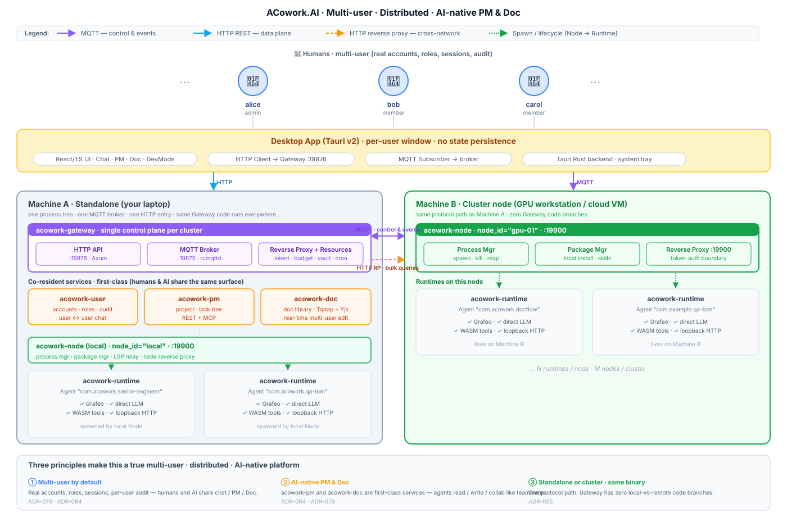

<h1 align="center">ACowork.AI — 和你的 agent 同事一起工作</h1>

<p align="center">
  
</p>

<p align="center">
  🏗️ <strong>声明式 Agent 平台 · 去中心化 · 高安全 · 可扩展</strong><br>
  ⚡️ <strong>Easy to build an agent colleague.</strong><br>
  ⚡️ <strong>Easy to share an agent colleague.</strong><br>
  ⚡️ <strong>Easy to deploy agent colleagues.</strong>
</p>

<p align="center">
  <a href="./LICENSE"></a>
  <a href="https://www.rust-lang.org"></a>
  <a href="./docs/design/zh/"></a>
  <a href="./apps/acowork-desktop/"></a>
</p>

<p align="center">
  <a href="README.md">English</a>
</p>

---

<p align="center">
  <table>
    <tr>
      <td width="50%" align="center" valign="top">
        
        <br />
        <em>与多位 AI 同事协作——每位 Agent 拥有独立记忆、实时上下文感知和工具执行能力。</em>
      </td>
      <td width="50%" align="center" valign="top">
        
        <br />
        <em>全链路开发框架：迭代调试、Token 追踪、上下文快照，深入洞察 AI 推理过程。</em>
      </td>
    </tr>
  </table>
</p>

---

## ACowork.AI 是什么？

ACowork.AI 是一个**多用户、分布式、AI 原生的协作平台**。它把团队成员、AI 同事、项目与文档统一装进同一个
运行时——规划工作、撰写文档、评审代码、交付功能，都可以像和人类队友协作一样和 Agent 并肩完成。

- **多用户优先**。真实的账号、角色、会话与按用户的审计轨迹，不再是单 actor 的 demo 形态。
- **分布式优先**。Gateway 作为唯一控制面；Node Agent 跑在每台需要承载 Runtime 的机器上——你的 GPU 主机、
  你的笔记本、你的云上 VM——Gateway 都通过同一条协议路径与它们对话。
- **AI 原生的项目 & 文档管理**。项目管理（`acowork-pm`）与在线文档库（`acowork-doc`）是一等公民服务——
  Agent 通过 REST + MCP 像普通同事一样读、写、协作，并支持实时多人编辑。
- **用户 ↔ AI 无缝沟通协作**。人和 Agent 在同一个聊天面板里协作；Agent 订阅项目/文档事件；Intent 在
  任意两个 actor 之间路由。
- **Standalone 与集群通吃**。单机自用就开 standalone；翻一个开关，同一套二进制就成为横跨整个团队的
  集群——一条协议路径，代码里没有「本地 / 远程」分支。

每个 Agent 依然是独立的**"数字伙伴"**：拥有自己的运行时进程、私有记忆、工作区和配置——
完全独立的个性化认知。**调优 Prompt、Tools、Memory = 构建 AI 同事。** Personal/Sensitive 数据在打包时
自动剥离，你可以自由分享 Agent 的能力，而不必担心泄露私有记忆。

---

## 🎯 为什么选择 ACowork

这些是 ACowork 立项时押下的赌注，也是它在「单进程 Agent 玩具」之外值得被选用的理由。

| | |
|---|---|
| 👥 **多用户，而不是单 actor** | 真实账号、角色、会话、按用户审计。人和 AI 同事共享同一个聊天、项目与文档面板。 |
| 🌐 **分布式 Agent，一个控制面** | Gateway 负责 MQTT + HTTP 反代，Node Agent 跑在每台主机上。GPU 主机、工位机、云 VM 在 Gateway 眼里长得一样。 |
| 🗂️ **AI 原生的项目 & 文档管理** | `acowork-pm` 和 `acowork-doc` 是一等公民服务，对外暴露 REST + MCP。Agent 像同事一样读写任务与文档，并支持实时多人编辑（Yjs CRDT）。 |
| 🤝 **人与 AI 在同一段对话里** | 同一个聊天、同一个项目树、同一个文档库。Agent 订阅事件、抛出 Intent、与人类一起交付工作，没有「AI 侧边栏」这种孤岛。 |
| 🚀 **Standalone 或集群——同一份二进制** | 单机自用就开 standalone；想扩展成团队集群就用同一份二进制，Gateway 代码里没有「本地 / 远程」分支。 |

---

## ✨ 核心亮点

| | |
|---|---|
| 👥 **多用户，而不是单 actor** | 真实账号、角色、会话、按用户审计。人和 AI 同事共享同一个聊天 / 项目 / 文档面板。 |
| 🌐 **分布式 Agent，一个控制面** | Gateway 负责 MQTT + HTTP 反代；Node Agent 跑在每台需要承载 Runtime 的主机（GPU 机 / 工位 / 云 VM）上——单机与多机走同一条协议路径。 |
| 🗂️ **AI 原生的项目 & 文档管理** | `acowork-pm` 和 `acowork-doc` 是一等公民服务；Agent 通过 REST + MCP 读写任务与文档，并支持实时多人编辑（Yjs CRDT）。 |
| 🤝 **人与 AI 在同一段对话里** | 同一个聊天、同一个项目树、同一个文档库。AI 订阅项目 / 文档事件、与人类一起交付工作——没有「AI 侧边栏」这种孤岛。 |
| 🚀 **Standalone 或集群——同一份二进制** | 单机自用就开 standalone；翻一个开关，同一份二进制成为横跨团队的集群。Gateway 代码里没有「本地 / 远程」分支。 |
| 🧩 **声明式 Agent** | `.agent` 包只包含 manifest + prompts + skills——**无可执行代码**，签名后在安装时强制验证。 |
| ⚙️ **统一 Runtime** | 单一 Rust 二进制加载任意 `.agent` 包；Agent 直连 LLM API——不经 Gateway 代理，零额外延迟。 |
| 🔒 **进程级隔离** | 每个 Agent 作为独立 OS 进程运行，自带文件系统、Grafeo DB 与沙箱化的工具执行。 |
| 🧠 **仿生记忆** | 每个 Agent 拥有私有 Grafeo 图数据库，三层五类分层记忆 + HNSW/BM25 混合检索 + 关联扩散。 |
| 🛡️ **三层安全** | 包签名 + 操作系统进程沙箱 + Wasmtime 工具沙箱。 |
| 💬 **Intent 协作** | Agent 通过 Capability Registry 声明能力，Gateway 作为 broker 路由请求/订阅，支持同步/异步。 |
| 🛠️ **全链路开发** | Desktop App（Tauri v2）内置 DevMode：对话调试、Skill 热加载、断点、录制回放、发布向导。 |

---

## 🏛️ 架构

ACowork 采用扁平的三层拓扑：**Gateway**（每个集群唯一控制面）、**Node Agent**（每台需要承载 Runtime
的主机一个）、**Runtime**（每个运行中的 `.agent` 实例一个）。无论是人、AI Agent、项目服务还是文档服务，
都通过同一条协议路径与 Gateway 对话。

| 层级 | 组件 | 作用 |
|------|------|------|
| **Gateway**（`acowork-gateway`） | 每个集群一个常驻 Rust 进程 | `:19876` 上的 HTTP API，`:19875` 上内嵌的 MQTT broker；反代到所有 Node / Runtime；包管理；Intent 路由；全局资源（LLM providers / MCP / budget / cron / rate-limit）。 |
| **Node Agent**（`acowork-node`） | 每台承载 Runtime 的主机一个 | 进程表（spawn / kill / reap Runtime）、本地包存储、向 Gateway 的 MQTT 接入、本地反代 `:19900`、LSP sidecar 监督、节点级 fs 浏览。 |
| **Runtime**（`acowork-runtime`） | 每个运行中的 `.agent` 实例一个 | 通用 Rust 二进制：加载 `.agent` 包、跑 LLM 主循环、Grafeo 记忆、工具执行、loopback 上的 per-agent HTTP。 |

除了这三层之外，四个常驻服务挂在同一条 Gateway 协议路径上，对 Runtime 暴露的 REST + MCP 接口与人类一致：

| 服务 | 作用 |
|------|------|
| `acowork-user` | 用户域——账号、凭据、角色、档案/头像、用户↔用户聊天。 |
| `acowork-pm`   | 项目与任务管理——一等公民服务，Agent 和人读写/订阅同一棵项目树。 |
| `acowork-doc`  | 在线文档库，支持多人实时编辑（Tiptap + Yjs）。 |
| `acowork-embed` / `acowork-lsp-relay` / `acowork-vault` / `acowork-sqlite` / `acowork-sign` | Embedding 模型 runner、LSP relay、加密 KV、存储后端、包签名——支撑层。 |

### Standalone vs. 集群

- **Standalone** —— Gateway 在本机自动 spawn 一个本地 Node（`acowork-node --mode local`）。适合个人自用、
  Demo 与边缘设备。一个进程树、一个 MQTT broker、一个 HTTP 入口。
- **集群** —— 在每台要承载 Runtime 的机器上（`GPU 主机`、`工位机`、`云上 VM`）安装 `acowork-node`，向 Gateway
  的 MQTT broker 完成接入，同一条协议路径即刻点亮。**Gateway 代码里完全无「本地 / 远程」分支**——
  详见项目设计文档的设计权衡与冻结的上限。

### 系统架构

<p align="center">
  
</p>

---

## 🚀 快速开始

跨平台编译脚本位于 [`dev/`](./dev/)，统一处理 ONNX Runtime 探测、profile 切换、资源 staging——优先使用脚本而非直接调用 `cargo`。

### 前置依赖

| 工具         | 版本           | 说明                                                                                                              |
| ------------ | ------------- | ----------------------------------------------------------------------------------------------------------------- |
| Rust         | **nightly**   | `rustup default nightly`                                                                                          |
| Node.js      | >= 18         | Desktop App 与 Tauri CLI                                                                                          |
| PowerShell   | 7.x           | Windows 必需（`.ps1` 脚本）；推荐 `pwsh`                                                                          |
| ONNX Runtime | 自动管理       | 由 `dev/setup_ort.*` 安装到 `.ort/onnxruntime-<plat>-<arch>-<ver>/`                                               |

```bash
git clone https://github.com/tranxon/ACowork.git
cd ACowork
```

### Step 1 — 安装 ONNX Runtime（一次性）

```bash
# Windows PowerShell
.\dev\setup_ort.ps1

# macOS / Linux / WSL / Git Bash
./dev/setup_ort.sh
```

### Step 2 — 编译并启动后端（Gateway + Runtime + Node）

```bash
# Windows —— release 构建，然后启动 Gateway
.\dev\build_core.ps1 -Start

# macOS / Linux —— release 构建并启动
./dev/build_core.sh

# Debug profile
.\dev\build_core.ps1 -Debug -Start      # Windows
./dev/build_core.sh --debug              # bash
```

macOS Apple Silicon 用户也可使用 `./dev/build_macos.sh` 一键编译（自动启用 CoreML）。

### Step 3 — 启动 Desktop App

Desktop App 是 Tauri v2 壳——React/TS 前端通过 HTTP 与 Gateway 对话，Rust 侧负责系统托盘与订阅实时事件的 MQTT 客户端。

```bash
cd apps/acowork-desktop
npm install

# 浏览器模式 dev server
npm run dev                # → http://localhost:5173

# 完整 Tauri 桌面窗口
npm run tauri dev
```

### ☁️ 云端中继远程访问（可选）

默认情况下 Gateway 的 HTTP/MQTT 只绑定 localhost。若要在公网访问位于 NAT 之后的 Gateway，可部署 `acowork-relay`
——一个**协议无关的瘦中继**：Gateway 主动拨出建立一条 WSS 隧道（`wss://relay.../tunnel`），中继仅按 TLS SNI /
Host 头路由字节流，不解析 HTTP/MQTT。中继**零账号、零秘密**（只保存每个 Gateway 的 Ed25519 公钥），所有鉴权
由你的 Gateway 裁决。设计详见
[docs/design/zh/24-cloud-relay-remote-access.md](./docs/design/zh/24-cloud-relay-remote-access.md)。

**1）在公网服务器上部署中继。** 前置：域名 `relay.example.com` + 泛解析记录 `*.relay.example.com → <服务器 IP>`，
以及公共 CA 证书（如 Let's Encrypt——Desktop 侧按公网 CA 校验 TLS）。

```bash
cd core && cargo build --release -p acowork-relay   # 将 target/release/acowork-relay 拷到服务器

acowork-relay \
  --listen 0.0.0.0:443 \
  --service-domain relay.example.com \
  --device-domain-suffix relay.example.com \
  --tls-cert /etc/letsencrypt/live/relay.example.com/fullchain.pem \
  --tls-key  /etc/letsencrypt/live/relay.example.com/privkey.pem \
  --data-dir /var/lib/acowork-relay \
  --admin-token <secret>          # 可选；开启 /api/admin/*（设备列表/预注册/吊销、隧道列表）
```

不传 `--tls-cert/--tls-key` 即为明文 `ws://`（仅限开发/测试）。设备注册默认 TOFU（首连即固定公钥）；企业部署可加
`--require-registration` 改为仅接受管理 API 预注册的设备。设备公钥持久化在 `--data-dir` 下。

**2）在 Gateway 侧（NAT 内）开启隧道。** 在 `~/.acowork/acowork-gateway/config/gateway.toml` 增加配置段（重启生效），
或运行时调用 `POST /api/relay/enable {"url": "wss://relay.example.com/tunnel"}` / `POST /api/relay/disable`：

```toml
[relay]
enabled = true
url = "wss://relay.example.com/tunnel"
```

首次 enable 时 Gateway 生成设备身份 `relay_identity.json`（0600，私钥永不出机器）。`GET /api/relay/status`
可查询隧道状态与本机 **gw-id**（稳定 UUID）。

**3）Desktop 随时随地连接。** 设置 → 连接模式选 **Relay** → 填入 `https://<gw-id>.relay.example.com`，
用普通账号登录即可——登录请求本身经隧道回到你的内网 Gateway 完成鉴权。远程请求由专用回环 listener 承接，
并施加更严格的 ACL（debug / fs-browse / 配置写端点对远程来源返回 404）。`relay.enabled=false` 即完全关闭该
路径，零出站连接。

**生产部署（Linux）。** 用 `cargo build --release -p acowork-relay`（或为服务器交叉编译）构建二进制，放到
`/usr/local/bin/`，再安装 [dev/deploy/relay/](./dev/deploy/relay/) 中现成的 systemd unit 与证书续期示例：

```bash
sudo useradd -r -s /usr/sbin/nologin acowork-relay
sudo install -d -o acowork-relay /var/lib/acowork-relay
sudo cp dev/deploy/relay/acowork-relay.service /etc/systemd/system/
sudo systemctl enable --now acowork-relay
```

通配符证书（`*.relay.example.com`）必须走 DNS-01 验证——见
[dev/deploy/relay/certbot-wildcard.sh](./dev/deploy/relay/certbot-wildcard.sh) 的可复制示例；中继重启后即加载
轮换后的证书，Gateway 隧道会自动重连。

### ✍️ 30 秒写出第一个 Agent

```toml
# examples/qa-agent/manifest.toml
[package]
id = "com.example.qa-agent"
name = "Quality Assurance"
display_name = "QA-Tom"
role = "QA"
version = "1.0.0"

[llm]
provider = "deepseek"
model = "deepseek-v4-flash"

[permissions]
tools = ["rag_query", "read_file", "write_file"]
```

```markdown
<!-- prompts/system.md -->
你是一个 QA Agent，擅长帮助用户做质量管理与代码审查。
```

构建并签名：

```bash
./dev/build-agent.sh examples/qa-agent   # 产出 com.example.qa-agent.agent
```

> **当前状态**：ACowork 处于 **Alpha 阶段**。Gateway、Runtime、Grafeo 记忆引擎与 Desktop App 都在积极开发中。
> 详见 [路线图](#-路线图) 了解当前已交付与下一步计划。

打包安装包、签名、CI、远程节点接入等更多内容请参见 [`docs/design/zh/`](./docs/design/zh/)。

---

## 🧪 Agent 开发流程

```
① 编写       manifest.toml + prompts/ + skills/SKILL.md + 可选 tools/*.wasm
② 签名       acowork-keygen → acowork-sign  （Developer 私钥 + 包签名）
③ 调试       Desktop App DevMode → 对话调试、SKILL.md 热加载、断点、录制回放
④ 发布       发布向导 → 远程仓库，或直接分享 .agent 文件
```

开发者通过**调优声明式配置**来构建 Agent——系统提示词、工具能力、记忆行为——而非编写命令式代码。
从编写到发布的完整链路，平台均提供工具支撑。

---

## 📈 路线图

| 阶段    | 内容                                                                                                                                                                                                                                          | 状态     |
| ------- | ----------------------------------------------------------------------------------------------------------------------------------------------------------------------------------------------------------------------------------------------- | -------- |
| Phase 1 | 基础框架 + LLM 交互（MVP）：包解析、签名验证、Runtime 主循环、Gateway 基础                                                                                                                                                                  | ✅ 已完成 |
| Phase 2 | Memory 分层 + 多用户账号：Grafeo 仿生分层、即时提取、关联扩散；按用户的会话与审计                                                                                                       | ✅ 已完成 |
| Phase 3 | AI 原生的项目 & 文档管理：`acowork-pm` 与 `acowork-doc` 独立进程服务，REST + MCP，多人实时编辑（Tiptap + Yjs）                                                                                                                                                | 🚧 进行中 |
| Phase 4 | 分布式 Runtime：Node Agent 接入、多主机集群模式、共用同一条协议路径                                                                                                                                                                                  | 🚧 进行中 |
| Phase 5 | 权限与沙箱：文件系统隔离、WASM 沙箱（Wasmtime）、Approval Gate                                                                                                                                                                                 | 🚧 部分实现 |
| Phase 6 | Desktop App + 开发框架：Debug Protocol、Skill 热加载、录制回放；MQTT 协议栈重构                                                                                                                                                              | 🚧 进行中 |
| Phase 7 | 生态：远程 `.agent` 仓库、Agent 商店、跨主机 Memory Sync                                                                                                                                                                                       | 🔮 规划中 |

---

## 📚 文档

- 架构设计：[`docs/design/zh/`](./docs/design/zh/)
- 模块级设计：[`docs/module-design/zh/`](./docs/module-design/zh/)
- 设计与决策记录：[`docs/adr/zh/`](./docs/adr/zh/)
- 开发者约定：[`AGENTS.md`](./AGENTS.md)

---

## 🧪 参考与致谢

ACowork.AI 的设计深受以下开源项目启发：

- [ZeroClaw 🦀](https://github.com/zeroclaw-labs/zeroclaw) — Trait 驱动运行时、安全装饰器、流式解析
- [Grafeo](https://github.com/GrafeoDB/grafeo) — HNSW 向量索引、BM25 全文检索、混合搜索
- [Mem0](https://github.com/mem0ai/mem0) — 多层级记忆、用户/会话/Agent 状态
- [HippoRAG](https://github.com/OSU-NLP-Group/HippoRAG) — 神经生物学启发长时记忆、关联扩散
- [LightMem](https://github.com/zjunlp/LightMem) — 轻量级记忆压缩
- [OpenCode](https://github.com/anomalyco/opencode) — 多 Agent 协作、Provider 无关设计

---

## 🤝 贡献

项目处于 **Alpha 实现期**。欢迎提交代码、设计反馈与评审意见：

- 通过 issue 提交 bug 报告、提案或设计反馈
- 提 PR 前请先阅读 [`AGENTS.md`](./AGENTS.md) 了解项目约定

---

## 📄 License

Apache-2.0 —— 详见 [`LICENSE`](./LICENSE)。

---

<p align="center">
  <b>ACowork.AI — 与你的 AI 同事协作</b><br>
  <i>像组建团队一样构建和协作 AI 伙伴。</i>
</p>
