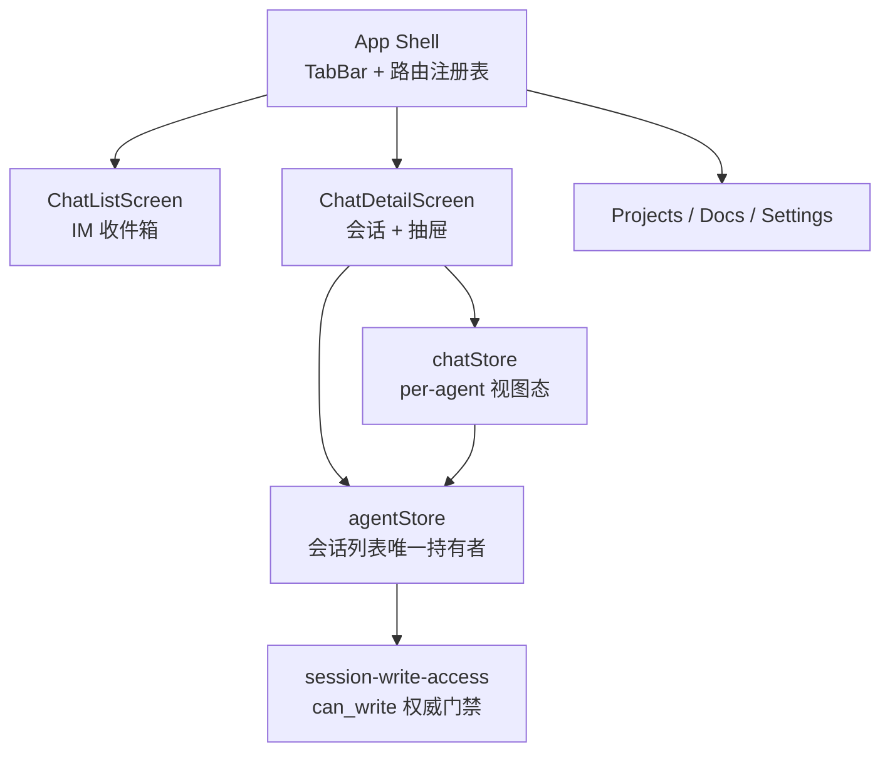

# acowork-mobile

ACowork 移动端。Desktop App 的**便携操作终端**——功能子集，IM 风格信息架构，
面向"碎片时间下的对话控制"，不是 Desktop 的移动版复刻。

设计依据：[docs/design/zh/25-mobile-app.md](../../docs/design/zh/25-mobile-app.md) ·
[ADR-086](../../docs/adr/zh/ADR-086-mobile-app-im-ia-and-multi-session.md)

## 定位与边界

| 做 | 不做（v1） |
|---|---|
| IM 风格会话流（Agents + 联系人合并收件箱） | DevMode、Git 状态条 |
| Agent **多会话**切换（导航栏标题 = 会话切换器） | Agent 创建/安装/克隆/发布 |
| 只读会话浏览（`can_write` 驱动） | Provider / API Key / MCP / Embedding 管理 |
| 项目、文档、设置（只读浏览 + 基础项） | Monaco 编辑器、文件预览 |
| 会话工作区（仅 Add to Chat） | 富文本编辑器 |
| 消息发送、审批、AskQuestion | Harness、Extensions |

移动端**不存在本地 Gateway 进程**，因此设置里的 Gateway 启停在 v1 禁用。

## 运行

```bash
npm install
npm run dev          # 浏览器 :19877（桌面端可用鼠标拖拽模拟触摸）
npm run tauri:dev    # 原生壳内运行
npm run tauri:build  # 打包
```

## 质量门禁

```bash
npm run typecheck
npm test             # 16 项：导航栈 + 会话/权限不变量
npm run build
```

## 架构要点



### 三条不可动摇的不变量

1. **`can_write` 是后端唯一权威**（ADR-076 §决策 4）。客户端绝不从 `visibility`
   反推写权限。会话列表由 `agentStore` **单独持有**——两处副本正是 `can_write`
   静默失效的成因（写门禁查 A 数组，权限 hook 查 B 数组）。只读态**不渲染**
   composer，可见性控件**禁用而非隐藏**。
2. **切换会话 = `chatStore.openSession` 原子三步**：UI 迁移 → `open_session`
   → HTTP 历史重载。不可只做本地页面切换，否则 Runtime 仍在往上一个会话流式
   写入。任一步失败回滚到上一个会话。
3. **只读会话不发送 `open_session`**。它会翻转 session 的全局 Active/Closed
   生命周期，观众无权替别人开启。

## 目录

```
src/
  lib/types.ts                  # 网关线格式的子集
  lib/session-write-access.ts   # ADR-076 门禁（Desktop 同名文件的孪生实现）
  stores/
    navStore.ts                 # 四 Tab × 独立栈，iOS push/pop
    agentStore.ts               # 目录 + 会话列表唯一持有者
    chatStore.ts                # per-agent 视图态 + 原子 openSession
  components/
    ui.tsx                      # ListSection/Row、Switch、Segmented、Stepper、Sheet
    EdgeSwipe.tsx               # 方向一次锁定的边缘手势
  screens/chat/                 # ChatListScreen、ChatDetailScreen
  routes.tsx                    # 路由注册表（单一可检视契约）
  __tests__/                    # 16 项测试
```

## 明确不做的事

- **不与 Desktop 共享前端代码库**。IA、组件、交互范式完全不同；共享会立刻
  长出 `isMobile ? A : B` 的条件分支。共享的只有 core 的 Rust crate。
- **不引入占位组件**。`NotImplemented` 显式渲染"v1 建设中"，让半成品在开发
  期可见，而不是伪装成崩溃。
