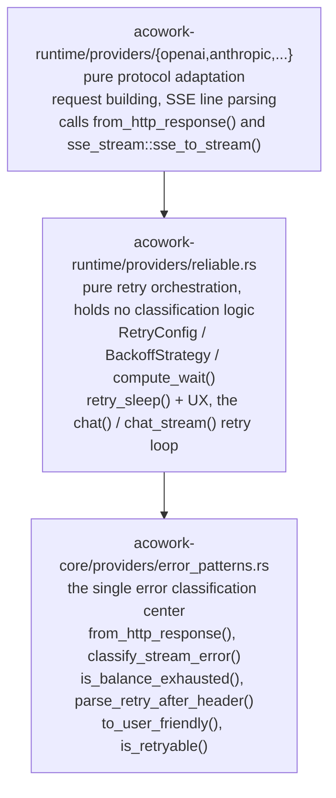

# ADR-016: Centralized Exception Handling — Classification to Core, Orchestration to Reliable, Presentation to the Frontend

> **Chinese source of truth**: [ADR-016](../zh/ADR-016-centralized-exception-handling.md)
> **Terminology**: see [GLOSSARY.md](./GLOSSARY.md)

## Status

Draft (pending implementation)

## Date

2026-06-23

## Decision Makers

架构讨论 (architecture discussion)

## Blast radius

- `core/acowork-core/src/providers/traits.rs` — `ProviderError` gains a `user_message` field
- `core/acowork-core/src/providers/error_patterns.rs` — the unified classification center; new `from_http_response` / `is_balance_exhausted` / `parse_retry_after_header` / `to_user_friendly`
- `core/acowork-runtime/src/providers/mod.rs` — `parse_retry_after_header` moves into core
- `core/acowork-runtime/src/providers/reliable.rs` — delete `is_retryable` / `is_balance_exhausted`; call core instead
- `core/acowork-runtime/src/providers/sse_stream.rs` — **new**: the generic SSE stream reader
- `core/acowork-runtime/src/providers/openai.rs` — delete `sse_to_stream`; call the generic module instead
- `core/acowork-runtime/src/providers/anthropic.rs` — same
- `core/acowork-runtime/src/providers/ollama.rs` — HTTP error conversion calls core instead
- `core/acowork-runtime/src/agent/loop_.rs` — `ChunkEvent::Error` carries structured error info
- `core/acowork-runtime/src/agent/loop_llm.rs` — `StreamEvent::Error` handling hooks into the retryable check
- `core/acowork-runtime/src/agent/session/session_task.rs` — error message formatting
- `core/acowork-runtime/src/startup/subsystems.rs` — the relay carries the structured error fields
- `apps/acowork-desktop/src/stores/chatStore.ts` — error rendering: summary + collapsible detail

---

## Context

### Problem 1 — the exception handling code is scattered and duplicated

LLM exception handling logic is spread across 7 files in 3 crates, with three blocks of obvious duplication:

1. **HTTP → ProviderError conversion**: `openai.rs`, `anthropic.rs` and `ollama.rs` each re-implement the same `from_status_code + parse_retry_after_header + set retry_after_ms` pattern.
2. **The SSE stream read loop**: `openai.rs`'s `sse_to_stream` and `anthropic.rs`'s inline stream loop are nearly identical (the timeout / error / silence handling is exactly the same), differing only in the line-parsing function.
3. **A redundant `is_retryable` check**: the `ProviderError.retryable` field is already set at creation, yet `reliable.rs`'s `is_retryable()` re-inspects `error_type` — duplicated logic.

In addition, `is_balance_exhausted` and `parse_retry_after_header` sit in the runtime layer, but they are classification logic and belong in core.

### Problem 2 — the frontend error messages are unreadable

The current error propagation path:

```text
Provider (openai.rs)
  └─ ProviderError { message: "OpenAI API error: 429 - {\"error\":{\"message\":\"Rate limit exceeded\",...}}" }
      └─ RuntimeError::Provider(err) or RuntimeError::StreamError(err)
          └─ session_task.rs: format!("Error: {}", e)
              └─ ChunkEvent::Error { message: "Error: Provider error: OpenAI API error: 429 - {...}" }
                  └─ Gateway relay → frontend chatStore.ts
                      └─ ChatMessage { type: "error", content: "Error: Provider error: OpenAI API error: 429 - {...}" }
```

The frontend shows the raw JSON error body returned by the LLM API, which is a poor experience:

- far too much technical detail (HTTP status codes, JSON structure, internal error codes)
- error formats differ per provider, so the frontend cannot do conditional rendering
- it cannot distinguish "balance exhausted" (needs a top-up) from "rate limited" (retry later), which need different user actions

### Problem 3 — a mid-stream disconnect is never retried

`classify_stream_error` already correctly marks `StreamDecodeError` and `StreamTimeout` as
`retryable: true`, but the consumer in `loop_llm.rs` ignores that flag — apart from
`ContextOverflow` (retry after trimming), every stream error fails outright. Common,
retryable transport blips such as a connection reset or broken pipe have no retry
protection at all.

## Decision

### Decision 1 — a three-layer separated exception handling architecture



**Principle**: an error has one clear unidirectional path from creation to handling —
Provider creates it → core classifies it → reliable decides on retry → loop_llm consumes
it → the frontend presents it.

### Decision 2 — unified HTTP → ProviderError conversion

`error_patterns.rs` gains `from_http_response()`, consolidating the duplicated HTTP error
conversion across the three providers:

```rust
/// Unified HTTP response → ProviderError conversion.
/// Handles status code classification + Retry-After header parsing.
pub async fn from_http_response(
    response: reqwest::Response,
    provider_name: &str,
) -> Result<reqwest::Response, AcoworkError> {
    if response.status().is_success() {
        return Ok(response);
    }
    let status = response.status();
    let retry_after = parse_retry_after_header(response.headers());
    let body = response.text().await.unwrap_or_default();
    let mut err = ProviderError::from_status_code(
        status.as_u16(),
        format!("{provider_name} API error: {status} - {body}"),
    );
    err.retry_after_ms = retry_after;
    Err(AcoworkError::Provider(err))
}
```

Each provider then needs a single line:

```rust
let response = from_http_response(response, "OpenAI").await?;
```

### Decision 3 — a generic SSE stream reader

A new `sse_stream.rs` module merges the duplicated stream read loops of `openai.rs` and
`anthropic.rs` into one generic function. The provider only supplies the line-parsing
callback:

```rust
/// Generic SSE stream reader with timeout + error classification.
///
/// `line_parser` is provider-specific: takes a raw SSE line, returns
/// parsed StreamEvents. Everything else (timeout, error classification,
/// channel management) is shared.
pub fn sse_to_stream<F>(
    response: reqwest::Response,
    stream_read_timeout: Duration,
    line_parser: F,
) -> Box<dyn Stream<Item = StreamEvent> + Send>
where
    F: Fn(&str) -> Vec<StreamEvent> + Send + 'static,
{ ... }
```

### Decision 4 — `is_balance_exhausted` and `parse_retry_after_header` move into core

- `is_balance_exhausted` (including the MiniMax 1113/1311 code detection) moves from `reliable.rs` to `error_patterns.rs`
- `parse_retry_after_header` moves from `runtime/providers/mod.rs` to `error_patterns.rs`

`reliable.rs` then only does retry orchestration and no longer holds classification logic.

### Decision 5 — delete the redundant checks in `is_retryable`

```rust
// before: reliable.rs — pe.error_type == RateLimited / StreamDecodeError /
// StreamTimeout are all redundant, and the RateLimited(_) arm is a dead branch
fn is_retryable(error: &AcoworkError) -> bool {
    match error {
        AcoworkError::Provider(pe) => pe.retryable,
        AcoworkError::Io(_) => true,
        _ => false,
    }
}
```

Classification is entirely the job of `from_status_code` (which sets `retryable` at
creation); `reliable.rs` only reads it and never re-judges.

### Decision 6 — user-readable error messages (a two-part error structure)

**6.1 `ProviderError` gains a `user_message` field**

```rust
pub struct ProviderError {
    pub message: String,           // raw error text (includes the API's JSON body)
    pub user_message: String,      // user-readable summary
    pub status_code: Option<u16>,
    pub error_type: ProviderErrorType,
    pub retryable: bool,
    pub retry_after_ms: Option<u64>,
}
```

**6.2 `to_user_friendly()` generates the user-readable message by classification**

A new `to_user_friendly()` in `error_patterns.rs` generates a structured user-readable
message from `error_type`:

```rust
pub fn to_user_friendly(err: &ProviderError) -> String {
    match err.error_type {
        ProviderErrorType::RateLimited => {
            if let Some(ms) = err.retry_after_ms {
                format!("请求过于频繁，请等待约 {} 秒后重试", ms / 1000)
            } else {
                "请求过于频繁，请稍后重试".to_string()
            }
        }
        ProviderErrorType::PaymentRequired => {
            "账户余额不足或配额已用完，请充值或更换 Provider".to_string()
        }
        ProviderErrorType::Unauthorized => {
            "API Key 无效或已过期，请在设置中检查".to_string()
        }
        ProviderErrorType::ServerError => {
            "服务商暂时不可用，请稍后重试".to_string()
        }
        ProviderErrorType::NetworkError => {
            "网络连接异常，请检查网络后重试".to_string()
        }
        ProviderErrorType::ContextOverflow => {
            "对话上下文过长，已自动压缩历史记录".to_string()
        }
        ProviderErrorType::StreamDecodeError => {
            "数据流传输异常，正在自动重试".to_string()
        }
        ProviderErrorType::StreamTimeout => {
            "响应超时，服务商可能暂时过载".to_string()
        }
        ProviderErrorType::ClientError => {
            "请求参数有误，请检查模型和工具配置".to_string()
        }
        ProviderErrorType::Unknown => {
            "发生未知错误，请查看详情或重试".to_string()
        }
    }
}
```

These user-facing strings are kept verbatim in the source language rather than translated,
because they are the literal strings the product shows to users. `from_http_response()`
calls `to_user_friendly()` automatically when creating a `ProviderError` to fill
`user_message`.

**6.3 `ChunkEvent::Error` carries the two-part error**

```rust
pub enum ChunkEvent {
    // ...
    Error {
        /// User-friendly error summary (shown by default)
        user_message: String,
        /// Raw error detail (shown when user clicks "Details")
        detail: String,
        /// Structured error type (for frontend conditional rendering)
        error_type: ProviderErrorType,
        message_id: String,
    },
}
```

**6.4 Frontend rendering**

```tsx
// Error message with expandable details
function ErrorMessage({ userMessage, detail, errorType }) {
  const [showDetail, setShowDetail] = useState(false);

  return (
    <div className="error-message">
      <div className="flex items-center gap-2">
        <ErrorIcon type={errorType} />
        <span>{userMessage}</span>
        {detail && (
          <button onClick={() => setShowDetail(!showDetail)}>
            {showDetail ? "收起" : "详情"}
          </button>
        )}
      </div>
      {showDetail && (
        <pre className="error-detail">{detail}</pre>
      )}
    </div>
  );
}
```

### Decision 7 — mid-stream disconnects hook into retry

The `StreamEvent::Error` handling in `loop_llm.rs` checks the `retryable` flag:

```rust
StreamEvent::Error(e) => {
    // ContextOverflow: emergency trim + retry (existing logic)
    if retry_on_overflow && e.error_type == ContextOverflow {
        // ... existing emergency trim logic ...
    }
    // Retryable stream errors: delegate to ReliableProvider's retry loop
    else if e.retryable {
        return Err(RuntimeError::StreamError(e));
        // ↑ This propagates to loop_.rs which already has retry logic
        //   for RuntimeError::StreamError(ref err) if err.retryable
    }
    // Non-retryable: fail immediately
    else {
        return Err(RuntimeError::StreamError(e));
    }
}
```

At the same time, unify the fallback retry policy of `chat()` and `chat_stream()` — today
`chat()`'s fallback has no retry while `chat_stream()`'s does, and the two are inconsistent.

## Implementation plan

**Phase 1 — core consolidation (no behavior change)**: move `parse_retry_after_header` from
the runtime into `error_patterns.rs`; move `is_balance_exhausted` (including the MiniMax
codes) from `reliable.rs` into `error_patterns.rs`; add `from_http_response()`; add
`ProviderError.user_message` and `to_user_friendly()`; have `from_status_code` and
`from_http_response` populate `user_message` automatically.

**Phase 2 — runtime deduplication (no behavior change)**: add the generic `sse_stream.rs`
reader; delete `sse_to_stream` from `openai.rs` and switch it to the generic module; do the
same for `anthropic.rs`; switch `ollama.rs`'s HTTP error conversion to `from_http_response()`;
delete the redundant checks in `reliable.rs`'s `is_retryable` and read the `retryable` field
directly.

**Phase 3 — error message formatting (visible to the frontend)**: expand
`ChunkEvent::Error` to `{ user_message, detail, error_type, message_id }`; update every
`ChunkEvent::Error` construction site in `session_task.rs` / `loop_llm.rs` /
`loop_context.rs`; have the `subsystems.rs` relay pass the new fields; render the two-part
error message in the frontend `chatStore.ts`.

**Phase 4 — complete stream retry (behavior change)**: hook the `retryable` check into
`loop_llm.rs`'s `StreamEvent::Error` handling; unify the `chat()` / `chat_stream()` fallback
retry policy.

## Migration strategy

- Phases 1–2 are pure refactoring with no runtime behavior change and can be merged independently
- The Phase 3 `ChunkEvent::Error` field change requires a synchronized Runtime + frontend release
- Phase 4 is a behavior change and is merged separately once Phases 1–3 have stabilized

## Risks and mitigations

| Risk | Mitigation |
|---|---|
| `from_http_response` is async while core previously had no async dependency | core already depends on `reqwest` (via `parse_retry_after_header` taking a `HeaderMap`); async is just an extended usage |
| The `ChunkEvent::Error` field change breaks frontend/backend compatibility | Phase 3 ships in sync; during the transition the frontend accepts the old shape (the `message` field as a fallback) |
| The generic SSE reader's `line_parser` callback may not fit every provider | Anthropic's multi-argument state can be handled by capturing `&mut` state in an `Fn` closure |
| `user_message` hardcodes Chinese and does not support i18n | the project has no i18n requirement today; if one appears, `to_user_friendly` can be changed to take a locale parameter |

## Verification criteria

1. `grep -r "from_status_code.*retry_after_ms" core/acowork-runtime/src/providers/` returns nothing (all providers use `from_http_response`)
2. `grep -r "classify_stream_error" core/acowork-runtime/src/providers/` only matches `sse_stream.rs` (no longer scattered across providers)
3. `grep -r "is_balance_exhausted\|is_minimax_balance_code" core/acowork-runtime/` returns nothing (already moved into core)
4. Frontend error messages no longer contain the raw JSON body unless the user clicks "Details"
5. A mid-stream disconnect (connection reset) triggers an automatic retry instead of failing outright
