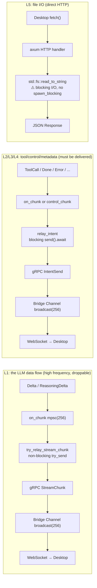
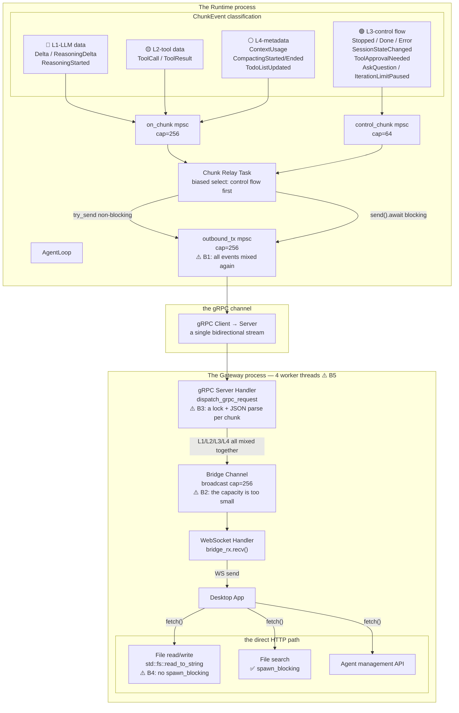
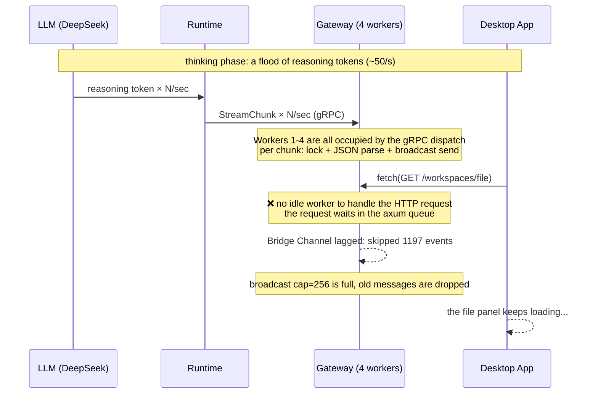
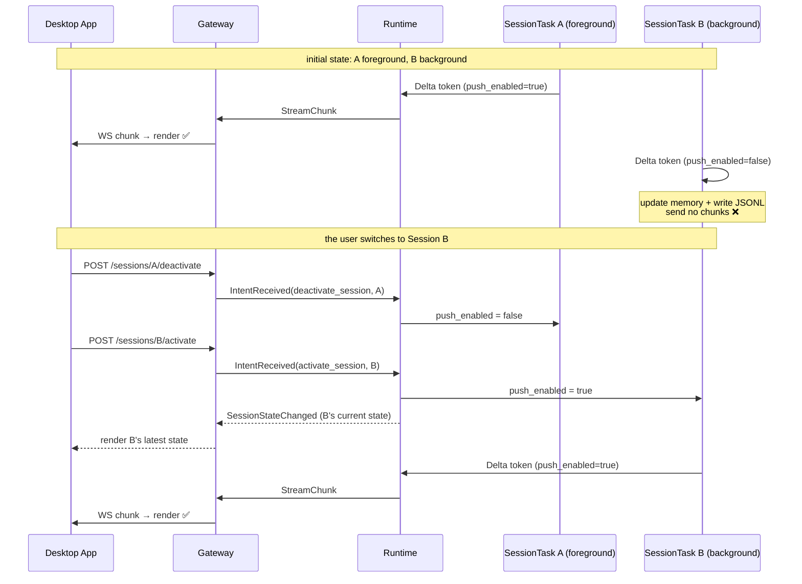
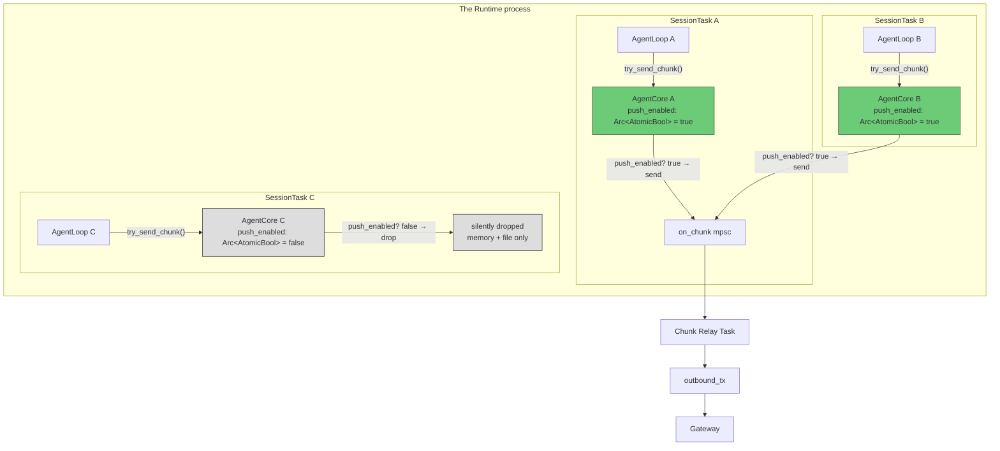
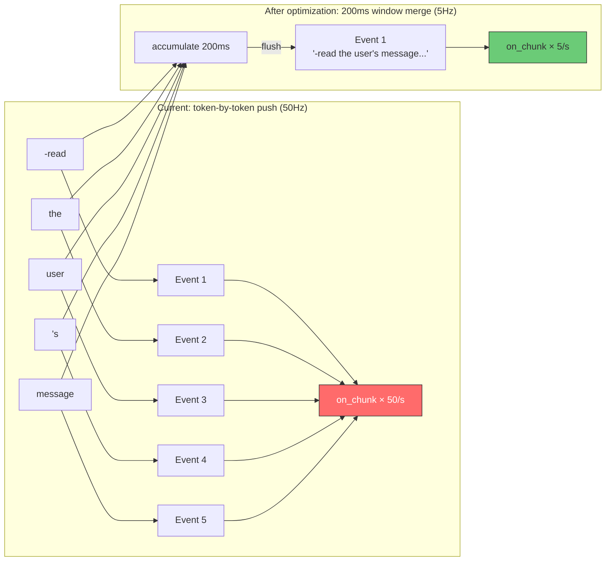
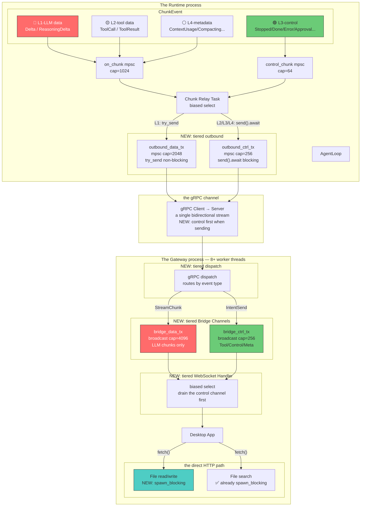

# ADR-020: End-to-End Data Flow Tiering — Solving LLM Streaming Blocking File I/O and Other Control Channels

> **Chinese source of truth**: [ADR-020](../zh/ADR-020-data-flow-tiering.md)
> **Terminology**: see [GLOSSARY.md](./GLOSSARY.md)

**Status**: P0 implemented
**Date**: 2026-06-29
**Decision Makers**: Architecture discussion

**Scope of impact**:

**P0 — the emergency fix + parameter extraction (done):**
- `core/acowork-gateway/src/http/workspaces.rs` (`read_file` / `read_raw_file` gain `spawn_blocking`)
- `core/acowork-gateway/src/cli.rs` (worker_threads 4→8, switched to referencing `DataFlowConfig`)
- `core/acowork-gateway/src/config.rs` (new `DataFlowConfig` sub-struct)
- `core/acowork-runtime/src/config.rs` (new `DataFlowConfig` sub-struct)
- `core/acowork-gateway/src/gateway/mod.rs` (the Bridge/capability channel capacity references config)
- `core/acowork-gateway/src/grpc/server.rs` (the gRPC outbound/IPC push capacity references config)
- `core/acowork-runtime/src/startup/agent_init.rs` (the on_chunk/control_chunk capacity references config)
- `core/acowork-runtime/src/grpc/client.rs` (the outbound capacity references config)

**P1 — session-level on-demand pushing (5 sites, ~120 lines):**
- `core/acowork-runtime/src/agent/agent_core.rs` (a new `push_enabled` switch; `try_send_chunk` gains a filter)
- `core/acowork-runtime/src/agent/session/session_task.rs` (handles the `EnablePush` / `DisablePush` messages)
- `core/acowork-runtime/src/cli.rs` (`activate_session` turns pushing on; a new `deactivate_session` turns it off)
- `core/acowork-gateway/src/http/chat.rs` (a new `POST /sessions/{id}/deactivate` endpoint)
- `apps/acowork-desktop/src/stores/agentStore.ts` (`switchSession` calls deactivate + activate)

**P2 — event-type-level dual channels (4 sites, ~170 lines):**
- `core/acowork-gateway/src/gateway/mod.rs` (the Bridge Channel is split into data + ctrl)
- `core/acowork-gateway/src/grpc/dispatch.rs` (routes to different channels by event type)
- `core/acowork-gateway/src/http/chat.rs` (the WebSocket handler uses a biased select over the dual channels)
- `core/acowork-gateway/src/ipc/server.rs` (the IPC dispatch routes by event type)
- `core/acowork-runtime/src/startup/subsystems.rs` (`outbound_tx` is split into data + ctrl)
- `core/acowork-runtime/src/startup/agent_init.rs` (creates the dual channels)
- `core/acowork-runtime/src/grpc/client.rs` (exposes the dual senders)

**P3 — capacity and priority tuning (3 sites, ~40 lines):**
- `core/acowork-gateway/src/grpc/server.rs` (priority handling in the gRPC dispatch)
- Channel capacity adjustments in several places

---

## Background

### The observed symptom

While the chat box was in the streaming state (particularly DeepSeek thinking mode), clicking a file in the right-hand file directory panel could not open it — it stayed loading forever. The Gateway log showed:

```
WARN Bridge channel lagged for com.acowork.senior-engineer: skipped 1197 events
```

The user suspected that fetching file content shares a channel with the LLM stream, causing blocking.

### The initial investigation conclusion

**File reading and LLM streaming do not go through the same channel.** File reading is a pure HTTP endpoint (`GET /api/agents/{agent_id}/workspaces/file`), directly calling `std::fs::read_to_string`, with no Bridge Channel involved.

But after a complete code trace, a deeper architectural problem was found.

---

## A Panorama of the Data Flows

### There are 7 kinds of data flow in the system

| # | Data flow type | Frequency | Droppable | Latency sensitive | Representative events |
|---|---|---|---|---|---|
| L1 | LLM data flow | Extremely high (~50/s) | yes | Low | `Delta`, `ReasoningDelta`, `ReasoningStarted` |
| L2 | Tool data flow | Low | no | Medium | `ToolCall`, `ToolResult` |
| L3 | Control flow | Extremely low | no | **High** | `Stopped`, `Done`, `Error`, `SessionStateChanged`, `ToolApprovalNeeded`, `AskQuestion`, `IterationLimitPaused` |
| L4 | Metadata flow | Low | yes | Low | `ContextUsage`, `CompactingStarted/Ended`, `TodoListUpdated` |
| L5 | File I/O (HTTP) | Low | no | **High** | File read/write, directory listing, content search |
| L6 | Agent management (HTTP) | Low | no | Medium | Install/start/stop/configure |
| L7 | gRPC request-response | Low | no | Medium | Memory query, session query, config query |

### A comparison of the data flow paths



> **Key finding**: L1 and L2/L3/L4 already diverge inside the Runtime (`on_chunk` vs `control_chunk`), but merge again at `outbound_tx`, and merge again at the Gateway's Bridge Channel. L5 takes an independent HTTP path, but shares the tokio worker threads with the gRPC dispatch.

### Key finding: all sessions share the same set of channels

Confirmed by code tracing: **the data flows of all running sessions (foreground + background) all go through the same set of channels, with no session-level isolation whatsoever.**

```
Session A (foreground, thinking) ──┐
Session B (background, thinking) ──┤
Session C (background, idle)     ──┼──→ the same on_chunk mpsc(256)
                             │         ↓
                             │    the same Chunk Relay Task
                             │         ↓
                             │    the same outbound_tx mpsc(256)
                             │         ↓
                             │    the same gRPC bidirectional stream
                             │         ↓
                             │    the same Bridge Channel broadcast(256)
                             │         ↓
                             └──→ the same WebSocket → Desktop App
```

**Evidence**:

- `agent_init.rs:395-396`: the whole Runtime process creates only **one** `(chunk_tx, chunk_rx)` pair
- `session_manager.rs:350-351`: each `SessionTask` receives a **clone of the same `chunk_tx`**
- `chat.rs:527`: the Gateway WebSocket handler filters only by `agent_id`, **not by `session_id`**
- `chatStore.ts:1657-1661`: the Desktop App receives events for all sessions, with a comment explicitly stating "NOT filtered by currentSessionId"

**Impact**: if the user opens 2 sessions both running thinking concurrently, the `on_chunk` mpsc(256) has to absorb 2× the token rate. This further worsens channel congestion.

### The current architecture: the control flow / data flow split is incomplete

The `is_control()` split introduced in ADR-014 **only takes effect inside the Runtime**. Starting from the `outbound_tx` mpsc channel, all event types are mixed together again:



### The bottleneck matrix

| # | Bottleneck | Location | Capacity | Impact |
|---|---|---|---|---|
| B1 | `outbound_tx` mpsc | `grpc/client.rs:134` | 256 | High-frequency L1 tokens fill the queue, blocking the L2/L3 events that must be delivered |
| B2 | Bridge Channel broadcast | `gateway/mod.rs:644` | 256 | 1197 events dropped while thinking |
| B3 | gRPC dispatch is CPU-dense | `dispatch.rs:241-248` | — | Every chunk does a `session_mgr.lock()` + a JSON parse, saturating the worker thread |
| B4 | `read_file` blocking I/O | `workspaces.rs:890` | — | `std::fs::read_to_string` without `spawn_blocking` directly blocks the worker thread |
| B5 | only 4 worker threads | `cli.rs:215` | — | HTTP and gRPC contend for the same thread pool |

### The root cause: the complete chain of "files cannot open while thinking"



**The core contradiction**: L1 (high frequency, droppable) and L5 (low frequency, must respond) compete for CPU time on the Gateway's 4 worker threads. Although they do not share a channel, they share a thread pool.

---

## Decision

Implemented in two stages: the P0 emergency fix solves the current problem, and the P1 architectural improvement thoroughly eliminates channel contention.

### P0: the emergency fix (zero risk, effective immediately)

#### P0-1: `read_file` / `read_raw_file` gain `spawn_blocking`

**The current code** (`workspaces.rs:884-892`):
```rust
let content = if mime_type.starts_with("image/") {
    let bytes = std::fs::read(&abs_path)  // blocking I/O!
        .map_err(|e| ApiError::internal(&format!("Failed to read file: {}", e)))?;
    // ...
} else {
    std::fs::read_to_string(&abs_path)    // blocking I/O!
        .map_err(|e| ApiError::internal(&format!("Failed to read file: {}", e)))?
};
```

**Changed to**:
```rust
let content = if mime_type.starts_with("image/") {
    let abs_path_clone = abs_path.clone();
    let bytes = tokio::task::spawn_blocking(move || {
        std::fs::read(&abs_path_clone)
    })
    .await
    .map_err(|e| ApiError::internal(&format!("Join error: {}", e)))?
    .map_err(|e| ApiError::internal(&format!("Failed to read file: {}", e)))?;
    // ...
} else {
    let abs_path_clone = abs_path.clone();
    tokio::task::spawn_blocking(move || {
        std::fs::read_to_string(&abs_path_clone)
    })
    .await
    .map_err(|e| ApiError::internal(&format!("Join error: {}", e)))?
    .map_err(|e| ApiError::internal(&format!("Failed to read file: {}", e)))?
};
```

**Reason**: `content_search` (`workspaces.rs:1419`) and `filename_search` (`workspaces.rs:1652`) in the same file already use `spawn_blocking` correctly. `read_file` is the only endpoint doing blocking I/O directly inside an async handler — an overlooked bug.

#### P0-2: worker threads 4→8 (already extracted into `DataFlowConfig`)

**The current code** (`cli.rs:214-215`):
```rust
let rt = tokio::runtime::Builder::new_multi_thread()
    .worker_threads(4)
```

**Changed to** (referencing `GatewayConfig.data_flow.worker_threads`):
```rust
let worker_threads = config.data_flow.worker_threads;
// ...
let rt = tokio::runtime::Builder::new_multi_thread()
    .worker_threads(worker_threads)
```

**Reason**: 4 worker threads is too few for a Gateway process running an HTTP server + a gRPC server + a WebSocket handler + an embed supervisor + a cron scheduler simultaneously. 8 workers provide more parallelism without increasing memory pressure (tokio worker threads are lightweight).

#### P0-3: extracting the performance parameters into `DataFlowConfig`

P0-1 and P0-2 solve the urgent problem, but all channel capacities and thread counts are still hardcoded. To support the tuning needs of P1/P2/P3, all data-flow-related parameters are extracted into a `data_flow` sub-struct of `GatewayConfig` and `RuntimeConfig`.

#### Gateway side: `GatewayConfig.data_flow`

```rust
/// Data flow tuning configuration (ADR-020).
#[derive(Debug, Clone, Serialize, Deserialize)]
pub struct DataFlowConfig {
    /// Number of tokio async worker threads (default: 8)
    pub worker_threads: usize,
    /// Bridge broadcast channel capacity (default: 256)
    pub bridge_channel_capacity: usize,
    /// gRPC outbound mpsc per-connection capacity (default: 32)
    pub grpc_outbound_capacity: usize,
    /// IPC push mpsc per-connection capacity (default: 32)
    pub ipc_push_capacity: usize,
    /// Capability broadcast channel capacity (default: 64)
    pub capability_broadcast_capacity: usize,
}
```

The corresponding TOML:
```toml
[data_flow]
worker_threads = 8
bridge_channel_capacity = 256
grpc_outbound_capacity = 32
ipc_push_capacity = 32
capability_broadcast_capacity = 64
```

#### Runtime side: `RuntimeConfig.data_flow`

```rust
/// Data flow tuning configuration (ADR-020).
#[derive(Debug, Clone, Serialize, Deserialize)]
pub struct DataFlowConfig {
    /// on_chunk mpsc capacity for L1 data events (default: 256)
    pub on_chunk_capacity: usize,
    /// control_chunk mpsc capacity for L3 control events (default: 64)
    pub control_chunk_capacity: usize,
    /// gRPC outbound mpsc capacity (default: 256)
    pub outbound_capacity: usize,
    /// Reasoning token batch flush interval in ms (default: 200)
    pub reasoning_flush_interval_ms: u64,
}
```

The corresponding TOML (delivered by the Gateway `RuntimeConfigUpdate`):
```toml
[data_flow]
on_chunk_capacity = 256
control_chunk_capacity = 64
outbound_capacity = 256
reasoning_flush_interval_ms = 200
```

#### The hardcoded sites replaced

| File | Original hardcoding | Changed to |
|---|---|---|
| `gateway/cli.rs` | `worker_threads(8)` | `config.data_flow.worker_threads` |
| `gateway/mod.rs` | `broadcast::channel(256)` | `config.data_flow.bridge_channel_capacity` |
| `gateway/mod.rs` | `broadcast::channel(64)` | `config.data_flow.capability_broadcast_capacity` |
| `grpc/server.rs` | `mpsc::channel(32)` | `data_flow_config.grpc_outbound_capacity` |
| `grpc/server.rs` | `mpsc::channel(32)` | `data_flow_config.ipc_push_capacity` |
| `runtime/agent_init.rs` | `mpsc::channel(256)` | `config.data_flow.on_chunk_capacity` |
| `runtime/agent_init.rs` | `mpsc::channel(64)` | `config.data_flow.control_chunk_capacity` |
| `runtime/grpc/client.rs` | `mpsc::channel(256)` | the `outbound_capacity` parameter (from config) |

> **Important**: all newly added channels in P1/P2/P3 must reference `DataFlowConfig`; hardcoded numbers are forbidden.

### P1: session-level on-demand pushing (from "push everything" to "pull on demand")

#### The core idea

In the current architecture, **the data flows of all sessions (foreground + background) are pushed to the frontend in real time**. The LLM token flood of a background session wastes channel bandwidth, while the frontend does not render this data at all — it just receives it, routes it to the correct store by `session_id`, and then discards the rendering.

**The core shift**: a background session only updates in-memory state and persists the conversation file, pushing no data events to the frontend at all. When a session switches to the foreground, the frontend issues an activate request; the Runtime replies with a snapshot of the current state and turns on real-time pushing.



#### Design: supporting multiple foreground sessions

Rather than adopting a single global "foreground session ID" variable, each `SessionTask` independently manages its own `push_enabled` flag. This naturally supports multiple sessions in the foreground simultaneously in the future (e.g. a split-view layout):



#### P1-1: `AgentCore` gains a `push_enabled` switch

**`agent_core.rs`**:
```rust
pub struct AgentCore {
    // ... existing fields ...

    /// Whether data events (Delta, ReasoningDelta, ToolCall, ToolResult) may be
    /// pushed to the Gateway. Control events (Stopped, Done, Error,
    /// SessionStateChanged, etc.) are not restricted by this switch and are
    /// always pushed to guarantee state synchronization.
    /// Uses Arc<AtomicBool> so that SessionTask can modify it from outside.
    pub(crate) push_enabled: Arc<std::sync::atomic::AtomicBool>,
}
```

**`try_send_chunk` gains a filter**:
```rust
pub fn try_send_chunk(&self, event: ChunkEvent) -> bool {
    let is_control = event.is_control();

    // Background session: push only control events, silently drop data events
    if !is_control && !self.push_enabled.load(std::sync::atomic::Ordering::Relaxed) {
        return false;
    }

    // ... existing logic (auto-route to control_chunk or on_chunk) ...
}
```

**`clone_for_session` initialization**:
```rust
pub(crate) fn clone_for_session(/* ... */) -> Self {
    Self {
        // ... existing fields ...
        push_enabled: Arc::new(AtomicBool::new(false)), // off by default, turned on at activate
    }
}
```

#### P1-2: SessionTask handles the push control messages

**`session_task.rs`** — new message variants:
```rust
pub enum SessionMessage {
    // ... existing variants ...

    /// Turn on real-time pushing (the session switched to the foreground)
    EnablePush,
    /// Turn off real-time pushing (the session switched to the background)
    DisablePush,
}
```

Message handling:
```rust
SessionMessage::EnablePush => {
    self.core.push_enabled.store(true, Ordering::Relaxed);
    // Immediately send a snapshot of the current state so the frontend can sync
    let _ = self.core.try_send_chunk(ChunkEvent::SessionStateChanged {
        status: self.session.status.clone(),
        model: self.session.model.clone(),
        provider: self.session.provider.clone(),
        workspace_id: self.session.workspace_id.clone(),
        ratio: self.session.ratio,
        reasoning_effort: self.session.reasoning_effort.clone(),
        temperature: self.session.temperature,
    });
}
SessionMessage::DisablePush => {
    self.core.push_enabled.store(false, Ordering::Relaxed);
}
```

#### P1-3: the Runtime CLI handles activate/deactivate

**`cli.rs`** — extending the existing `activate_session` handler:
```rust
if action == "activate_session" {
    // ... existing lazy-resume logic ...

    // Turn on pushing
    if let Err(e) = session_manager.send_to_session(&session_id, SessionMessage::EnablePush).await {
        tracing::warn!(session_id = %session_id, error = %e, "Failed to enable push");
    }
}
```

The new `deactivate_session` handler:
```rust
if action == "deactivate_session" {
    let session_id = params.get("session_id").and_then(|v| v.as_str()).unwrap_or("");
    if !session_id.is_empty() {
        if let Err(e) = session_manager.send_to_session(session_id, SessionMessage::DisablePush).await {
            tracing::warn!(session_id = %session_id, error = %e, "Failed to disable push");
        }
    }
    // deactivate needs no response, fire-and-forget
    return LoopAction::Continue;
}
```

#### P1-4: the Gateway gains a deactivate endpoint

**`chat.rs`**:
```rust
/// `POST /api/agents/{id}/sessions/{session_id}/deactivate`
///
/// Notifies the Runtime to stop real-time data pushing for that session.
/// Used in pairs with activate_session, called by the frontend's switchSession.
pub async fn deactivate_session(
    State(state): State<AppState>,
    Path((agent_id, session_id)): Path<(String, String)>,
) -> Result<StatusCode, (StatusCode, Json<ApiError>)> {
    let params = serde_json::json!({ "session_id": session_id });
    forward_session_action(&state, &agent_id, "deactivate_session", params).await?;
    Ok(StatusCode::OK)
}
```

Route registration:
```rust
.route("/api/agents/{id}/sessions/{session_id}/deactivate", post(deactivate_session))
```

#### P1-5: the frontend's switchSession calls deactivate + activate

**`agentStore.ts`**:
```typescript
switchSession: async (sessionId: string, agentId?: string) => {
    if (!agentId) return;
    const oldSessionId = useChatStore.getState().getActiveSessionId(agentId);
    if (sessionId === oldSessionId) return;

    // 1. First turn off pushing for the old session
    if (oldSessionId) {
        fetch(`${getGatewayUrl()}/api/agents/${agentId}/sessions/${oldSessionId}/deactivate`, {
            method: "POST",
        }).catch(() => {}); // fire-and-forget, does not block the switch
    }

    // 2. Activate the new session (existing logic)
    useChatStore.getState().activateSession(agentId, sessionId);
    // ... existing activate logic ...
}
```

#### Control events are always pushed

The following events are **not restricted by `push_enabled`**, and are always pushed even when the session is in the background:

| Event | Reason |
|---|---|
| `Stopped` | The session was stopped by the user; the frontend needs to update the status |
| `Done` | The session finished; the frontend needs to show the final result |
| `Error` | The session errored; the frontend needs to show the error |
| `SessionStateChanged` | Status changes affect the session list display |
| `ToolApprovalNeeded` | User confirmation is required; it must pop up |
| `AskQuestion` | The user must answer; it must pop up |
| `IterationLimitPaused` | The user must decide whether to continue |

These events have an extremely low frequency and will not cause channel congestion.

#### P1-6: token coalescing on send (reducing the channel write frequency)

**Problem**: currently every reasoning token (2-5 characters) is immediately sent as an independent `ChunkEvent::ReasoningDelta`. In DeepSeek thinking mode at ~50 tokens/s, that means 50 `try_send_chunk` per second → 50 `on_chunk` enqueues → 50 gRPC StreamChunks → 50 Bridge Channel writes → 50 WebSocket pushes. And the frontend thinking panel scrolls so fast that the user cannot perceive token-by-token changes at all — a 50Hz refresh is pure waste.

**The solution**: in the stream handling loop of `loop_llm.rs`, apply a time-window merge to reasoning tokens, flushing once every 200ms.



**The implementation** (`loop_llm.rs`):

```rust
// Added outside the stream handling loop
let mut reasoning_buf = String::new();
let mut last_reasoning_flush = tokio::time::Instant::now();
// Read from config, no longer hardcoded
let flush_interval_ms = self.core.config.data_flow.reasoning_flush_interval_ms;

// Replace the token-by-token send in the ReasoningContent branch:
StreamEvent::ReasoningContent(chunk) => {
    reasoning_in_progress = true;
    accumulated_reasoning_content.push_str(&chunk);
    reasoning_buf.push_str(&chunk);

    let elapsed = last_reasoning_flush.elapsed().as_millis() as u64;
    if elapsed >= flush_interval_ms {
        if !reasoning_buf.is_empty() {
            let _ = self.core.try_send_chunk(ChunkEvent::ReasoningDelta(
                std::mem::take(&mut reasoning_buf)
            ));
        }
        last_reasoning_flush = tokio::time::Instant::now();
    }
}
```

**Boundary handling**:

```rust
// 1. Flush immediately when reasoning switches to content (so the thinking panel
//    displays completely before the body text appears)
StreamEvent::Content(chunk) => {
    if reasoning_in_progress && !reasoning_buf.is_empty() {
        let _ = self.core.try_send_chunk(ChunkEvent::ReasoningDelta(
            std::mem::take(&mut reasoning_buf)
        ));
    }
    reasoning_in_progress = false;
    // ... existing content handling ...
}

// 2. Flush the residue when the stream ends
// After the stream loop exits:
if !reasoning_buf.is_empty() {
    let _ = self.core.try_send_chunk(ChunkEvent::ReasoningDelta(
        std::mem::take(&mut reasoning_buf)
    ));
}
```

**The effect**:

| Metric | Current | After the 200ms merge | Reduction |
|---|---|---|---|
| ChunkEvent per second | ~50 | ~5 | **90%** |
| on_chunk enqueues per second | ~50 | ~5 | **90%** |
| gRPC StreamChunks per second | ~50 | ~5 | **90%** |
| Bridge Channel writes per second | ~50 | ~5 | **90%** |
| WebSocket pushes per second | ~50 | ~5 | **90%** |
| Frontend render frequency | 50Hz | 5Hz | — |
| User perception | cannot see it | likewise cannot see it | no difference |

**Why Content tokens are not merged**: ordinary content token granularity is usually larger (a whole word or phrase), and the user really is reading the body text word by word — merging would affect the fluidity of the typewriter effect. If content tokens are later found to be a bottleneck too, the same logic can be applied with a shorter interval (e.g. 50ms).

**Configurable**: `reasoning_flush_interval_ms` has been extracted into `RuntimeConfig.data_flow.reasoning_flush_interval_ms`, allowing it to be delivered by the Gateway configuration for easy tuning:

```rust
// Reference config rather than hardcoding
let flush_interval = self.core.config.data_flow.reasoning_flush_interval_ms;
```

### P2: event-type-level dual channels (data/ctrl separation)

#### The core idea

Change the current "all events mixed in one channel" architecture to "L1 data goes through the data channel, L2/L3/L4 go through the ctrl channel":



#### P2-1: the Gateway Bridge Channel is split

**`gateway/mod.rs`**:
```rust
// Current: one broadcast channel carries all events
let (bridge_tx, _) = broadcast::channel::<BridgeEvent>(
    config.data_flow.bridge_channel_capacity,  // default 256
);

// Changed to: the data channel (LLM chunks, high capacity, droppable) + the
// control channel (everything else, not droppable).
// The capacity is read from DataFlowConfig, no longer hardcoded
let (bridge_data_tx, _) = broadcast::channel::<BridgeEvent>(
    config.data_flow.bridge_data_capacity,  // default 4096, a new field is needed
);
let (bridge_ctrl_tx, _) = broadcast::channel::<BridgeEvent>(
    config.data_flow.bridge_ctrl_capacity,  // default 256, a new field is needed
);
```

> **New fields needed in `DataFlowConfig` during P2 implementation**: `bridge_data_capacity` (default 4096), `bridge_ctrl_capacity` (default 256).

**`dispatch.rs`** (the gRPC dispatch routes by event type):
```rust
// Current: all events go to the same bridge_tx
if let Some(tx) = bridge_tx {
    let event = BridgeEvent { ... };
    let _ = tx.send(event);
}

// Changed to: route by type
let target_tx: &broadcast::Sender<BridgeEvent> = match event_type {
    BridgeEventType::Chunk | BridgeEventType::ReasoningStarted => bridge_data_tx,
    _ => bridge_ctrl_tx,
};
let _ = target_tx.send(event);
```

**`chat.rs`** (the WebSocket handler uses a biased select to consume the control channel first):
```rust
// Current: a single channel
bridge_event = async { bridge_rx.recv().await } => { ... }

// Changed to: dual channels + a biased select
loop {
    tokio::select! {
        biased;  // check the control channel first
        ctrl_event = async { bridge_ctrl_rx.recv().await } => {
            // L2/L3/L4: ToolCall, ToolResult, Done, Error, Stopped...
            // These events must be delivered, so they are handled first
        }
        data_event = async { bridge_data_rx.recv().await } => {
            // L1: Delta, ReasoningDelta
            // Droppable, skipped when Lagged
        }
        msg = socket.recv() => {
            // user input
        }
    }
}
```

#### P2-2: the Runtime outbound_tx is split

**`agent_init.rs`**:
```rust
// Current: one outbound channel
let (outbound_tx, outbound_rx) = mpsc::channel::<ClientMessage>(
    config.data_flow.outbound_capacity,  // default 256
);

// Changed to: dual channels, capacities read from DataFlowConfig
let (outbound_data_tx, outbound_data_rx) = mpsc::channel::<ClientMessage>(
    config.data_flow.outbound_data_capacity,  // default 2048, a new field is needed
);
let (outbound_ctrl_tx, outbound_ctrl_rx) = mpsc::channel::<ClientMessage>(
    config.data_flow.outbound_ctrl_capacity,  // default 256, a new field is needed
);
```

> **New fields needed in the Runtime `DataFlowConfig` during P2 implementation**: `outbound_data_capacity` (default 2048), `outbound_ctrl_capacity` (default 256).

**`subsystems.rs`** (`relay_chunk_event` routes by type):
```rust
// Current: all events go through the same outbound_tx
ChunkEvent::Delta(delta) => {
    try_relay_stream_chunk(outbound_tx, "agent_chunk", &params);
}
ChunkEvent::ToolCall { .. } => {
    relay_intent(outbound_tx, "agent_tool_call", &params).await;
}

// Changed to: L1 goes to data, L2/L3/L4 go to ctrl
ChunkEvent::Delta(delta) => {
    try_relay_stream_chunk(&outbound_data_tx, "agent_chunk", &params);
}
ChunkEvent::ReasoningDelta(delta) => {
    try_relay_stream_chunk(&outbound_data_tx, "agent_chunk", &params);
}
ChunkEvent::ToolCall { .. } => {
    relay_intent(&outbound_ctrl_tx, "agent_tool_call", &params).await;
}
// ... other L2/L3/L4 events follow the same pattern
```

#### P2-3: dual senders in the gRPC client

**`grpc/client.rs`**:
```rust
// Current
pub fn outbound_sender(&self) -> mpsc::Sender<ClientMessage> {
    self.outbound_tx.clone()
}

// Changed to
pub fn outbound_data_sender(&self) -> mpsc::Sender<ClientMessage> {
    self.outbound_data_tx.clone()
}
pub fn outbound_ctrl_sender(&self) -> mpsc::Sender<ClientMessage> {
    self.outbound_ctrl_tx.clone()
}
```

The gRPC client's send loop needs to consume from both channels, sending the ctrl channel's messages first:
```rust
loop {
    tokio::select! {
        biased;
        msg = outbound_ctrl_rx.recv() => {
            // L2/L3/L4 sent first
        }
        msg = outbound_data_rx.recv() => {
            // L1 data
        }
    }
}
```

### P3: capacity and priority tuning

#### P3-1: priority handling in the Gateway gRPC dispatch

**`server.rs:448-478`**: in the current `tokio::spawn` handler, `inbound.message()` and `cap_rx.recv()` are an equal `tokio::select!`. This should become a biased select, prioritizing capability updates (control messages).

#### P3-2: channel capacity adjustments

All capacities are configured through `DataFlowConfig`, no longer hardcoded. The `DataFlowConfig` fields must be extended in sync during P2:

| Channel | Current field | Default | P2 new field | P2 default | Reason |
|---|---|---|---|---|---|
| `on_chunk` mpsc | `on_chunk_capacity` | 256 | — | 1024 | The token rate is high while thinking, so a larger buffer is needed |
| `outbound_data_tx` mpsc | — | — | `outbound_data_capacity` | 2048 | Dedicated to L1 data, a large capacity avoids `try_send` drops |
| `outbound_ctrl_tx` mpsc | — | — | `outbound_ctrl_capacity` | 256 | Dedicated to L2/L3/L4, a small capacity suffices (low frequency) |
| `bridge_data_tx` broadcast | — | — | `bridge_data_capacity` | 4096 | Dedicated to L1 data, a large capacity avoids Lagged |
| `bridge_ctrl_tx` broadcast | — | — | `bridge_ctrl_capacity` | 256 | Dedicated to L2/L3/L4, a small capacity suffices |

> **`DataFlowConfig` fields to be extended during P2 implementation**:
>
> Gateway side new: `bridge_data_capacity: usize` (default 4096), `bridge_ctrl_capacity: usize` (default 256)
>
> Runtime side new: `outbound_data_capacity: usize` (default 2048), `outbound_ctrl_capacity: usize` (default 256)
>
> Runtime side default adjustment: the `on_chunk_capacity` default changes from 256 to 1024

---

## Expected Effects

| Scenario | Before | After P0 | After P1 | After P2 |
|---|---|---|---|---|
| Opening a file while thinking | stuck loading | opens normally | opens normally | opens normally |
| 1 foreground + 2 background thinking | on_chunk full, all stuck | on_chunk full, all stuck | only the foreground occupies the channel, the background does not | only the foreground occupies the channel |
| Foreground thinking channel write frequency | 50Hz (token by token) | 50Hz | 5Hz (200ms merge) | 5Hz |
| Bridge Channel while thinking | 1197 events dropped | there may still be a few drops | there may still be a few drops | 0 drops (data channel capacity 4096) |
| ToolCall latency while thinking | blocked by L1 chunks | blocked by L1 chunks | blocked by L1 chunks | an independent ctrl channel |
| Clicking Stop while thinking | may be delayed | may be delayed | control events are always pushed | ctrl channel + biased select |
| Large file reads blocking other requests | blocks the worker thread | spawn_blocking | no blocking | no blocking |
| Switching to a background session | — | — | state snapshot synced, then real-time pushing | same as P1 |

---

## Alternatives

### Option B: gRPC multiplexing (not adopted)

Establish two independent gRPC connections, one for L1 data and one for L2/L3/L4 control.

**Pros**: physical isolation, the most thorough.
**Cons**:
- A large amount of change (the proto definition, connection management and reconnection logic all double)
- Increases the number of Gateway–Runtime connections
- The current gRPC connection already has reconnection and heartbeat mechanisms; a dual connection adds complexity

### Option C: the Desktop App connects directly to the Runtime over WebSocket (not adopted)

The Desktop App connects to the Runtime directly over WebSocket to get streaming data, bypassing the Gateway.

**Pros**: the Gateway is completely unaffected by L1 data.
**Cons**:
- Violates the architectural principle that the Gateway is the sole entry point
- The Desktop App would need to know the Runtime's address and port
- The security model becomes more complex (authentication, authorization)

---

## Implementation Plan

| Stage | Content | Estimated effort | Risk |
|---|---|---|---|
| P0 | `read_file` spawn_blocking + worker_threads 8 | 0.5h | zero |
| P1-1 | AgentCore push_enabled + the try_send_chunk filter | 1h | low |
| P1-2 | The SessionTask EnablePush/DisablePush messages | 0.5h | low |
| P1-3 | The Runtime activate/deactivate_session handler | 1h | low |
| P1-4 | The Gateway deactivate_session endpoint | 0.5h | low |
| P1-5 | The frontend switchSession calls deactivate + activate | 0.5h | low |
| P1-6 | Token coalescing on send (a 200ms reasoning window) | 1h | low |
| P2-1 | Splitting the Gateway Bridge Channel | 2h | low |
| P2-2 | Splitting the Runtime outbound_tx | 2h | low |
| P2-3 | Dual senders in the gRPC client | 1h | low |
| P3 | Capacity tuning + priority | 1h | zero |
| Testing | End-to-end verification of thinking + multi-session scenarios | 1.5h | — |

**Total**: ~12.5h, recommended for delivery in three PRs:
- **PR1**: P0 (the emergency fix, 0.5h)
- **PR2**: P1 (session-level on-demand pushing + token coalescing, 4.5h)
- **PR3**: P2 + P3 (event-type-level dual channels + capacity tuning, 6h)

P1 and P2 can be implemented independently of each other. P1 solves "the background does not push + the foreground pushes efficiently", while P2 solves "different types of events competing inside the foreground". P1-6 (token coalescing) combined with P1-1~P1-5 (on-demand pushing) works best: a background session produces no traffic at all, and the foreground session's reasoning traffic drops by 90%.

---

## Related ADRs

- ADR-014: AgentLoop main-loop module decomposition (introduces the `is_control()` control flow / data flow separation, but it only takes effect inside the Runtime)
- ADR-015: Agent startup sequencing (the startup order of the chunk relay task)
