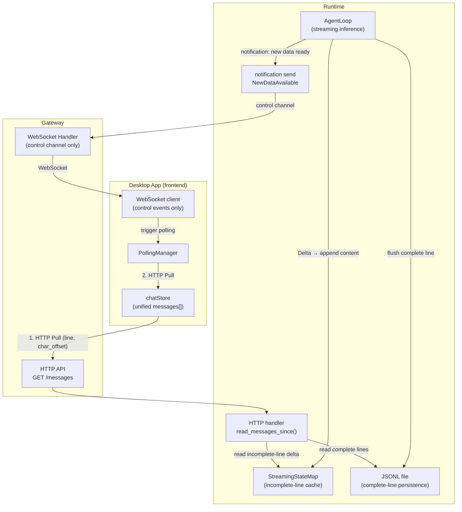
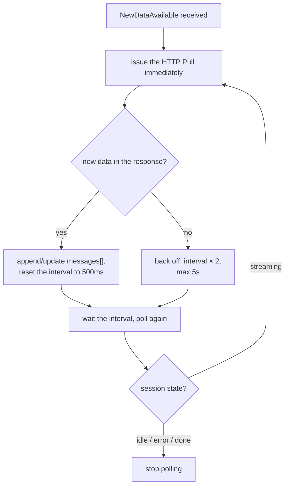
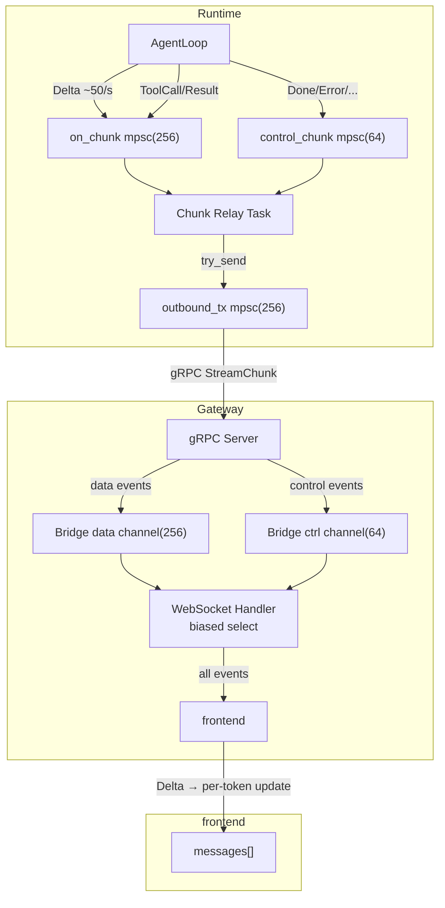
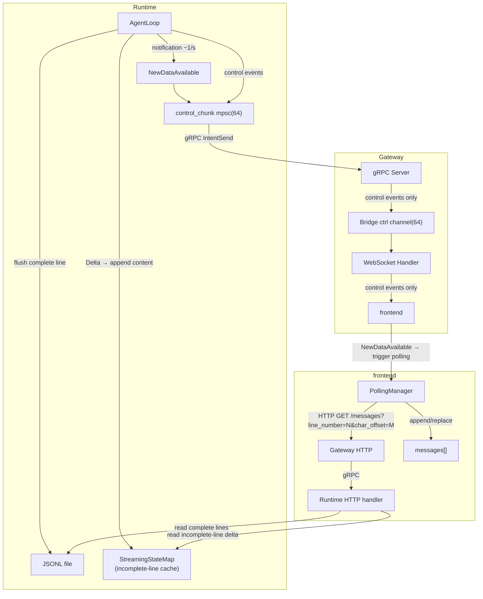

# ADR-021: Unified Session Data Loading — Dropping Streaming Transport in Favour of HTTP Pull + Notifications

> **Chinese source of truth**: [ADR-021](../zh/ADR-021-unified-session-data-loading.md)
> **Terminology**: see [GLOSSARY.md](./GLOSSARY.md)

## Status

Draft

## Date

2026-07-02

## Decision Makers

架构讨论 (architecture discussion)

## Blast radius

- `core/acowork-runtime/src/agent/agent_core.rs` — remove the data-channel session push; add the
  `NewDataAvailable` notification
- `core/acowork-runtime/src/agent/session/session_task.rs` — add the `StreamingStateMap` manager
- `core/acowork-runtime/src/conversation.rs` — add the `read_messages_since` interface
- `core/acowork-runtime/src/cli.rs` — the HTTP messages endpoint gains `line_number` +
  `line_char_offset` parameters
- `core/acowork-gateway/src/gateway/mod.rs` — the Bridge Channel simplifies to a control channel
  only
- `core/acowork-gateway/src/http/chat.rs` — the WebSocket handler drops data-channel consumption
- `core/acowork-gateway/src/grpc/dispatch.rs` — remove data-channel routing
- `apps/acowork-desktop/src/stores/chatStore.ts` — remove streaming Delta handling, add polling
- `apps/acowork-desktop/src/components/chat/ChatPanel.tsx` — simplify the session-switch logic

---

## Context

### Two unrelated data-loading mechanisms today

From the frontend's point of view, ACowork has two completely unrelated session data-loading
paths:

```mermaid
graph TD
    subgraph "Path A: HTTP Pull (old sessions / paging)"
        A1["frontend loadSessionMessages()"] --> A2["GET /api/agents/{id}/sessions/{sid}/messages"]
        A2 --> A3["Gateway HTTP handler"]
        A3 --> A4["gRPC → Runtime CLI"]
        A4 --> A5["read_messages_paginated(JSONL)"]
        A5 --> A6["paginated JSON response"]
    end

    subgraph "Path B: RPC Stream (active session / streaming push)"
        B1["Runtime AgentLoop"] --> B2["try_send_chunk(Delta)"]
        B2 --> B3["on_chunk mpsc(256)"]
        B3 --> B4["Chunk Relay Task"]
        B4 --> B5["outbound_tx → gRPC StreamChunk"]
        B5 --> B6["Gateway Bridge Channel"]
        B6 --> B7["WebSocket → frontend"]
        B7 --> B8["chatStore updates messages[] token by token"]
    end
```



### Four core problems

**Problem 1 — the two mechanisms are incompatible, and the session-switch logic cannot be
merged.** When the user switches from a streaming session A to session B and back to A:

- **Path B's state**: session A's `streamingMessageId`, `streamBuffer` and other transient state
  remain in frontend memory
- **Path A's guard**: `ChatPanel.tsx:556-569` decides whether to skip the HTTP pull by checking
  `streamingMessageId != null`
- **Result**: the behavior on switching back depends on whether A's stream has finished, producing
  three different branches — complex and fragile

**Problem 2 — an uncontrollable storm of stream data.** ADR-020 already exposed the data-flow
tiering problem, but P1 (per-session on-demand push) merely "closes the valve" instead of "changing
the pipe":

- All sessions' LLM tokens share one `on_chunk mpsc(256)` channel
- In DeepSeek thinking mode the token rate reaches ~50/s
- With several sessions running concurrently the channel congests and events are dropped
  (observed: `skipped 1197 events`)
- `push_enabled = false` can only drop data events, while the Runtime still produces and
  transmits at full speed internally

**Problem 3 — streaming push conflicts semantically with paging load.** Path A is a **pull
model**: the frontend requests, the backend returns complete paged data, the frontend replaces the
whole `messages[]`. Path B is a **push model**: the backend pushes token by token and the frontend
incrementally mutates one message's `content` field. The two write to `messages[]` in completely
different ways and cannot coexist on one data source.

**Problem 4 — frontend state-management complexity.** `chatStore.ts` has 10+ streaming-related
state fields:

```typescript
streamingMessageId: string | null;
streamBuffer: string;
thinkingMessageId: string | null;
isInThinkPhase: boolean;
currentTurnId: string | null;
isReasoning: boolean;
pendingSend: boolean;
isStopping: boolean;
// ...
```

These exist purely to handle one data-arrival pattern: "incremental per-token updates". If
everything is unified onto HTTP Pull, they can all be removed.

## Goals

1. **Unify the data-loading paths**: all frontend session data loading (new/old, active/idle)
   goes through HTTP Pull
2. **Demote WebSocket to a pure control channel**: it carries only session state changes, tool
   approvals, error events and other control signals
3. **Eliminate the stream data storm**: no high-frequency token push traverses the Bridge Channel
4. **Simplify frontend state management**: remove all streaming transient state fields
5. **Predictable session switching**: the switch logic is identical regardless of session state

## Design

### The core insight: JSONL is line storage, StreamingStateMap is the "incomplete line"

```
JSONL file (complete lines):
├─ Line 0:  {"version":1,"session_id":"abc",...}           ← metadata
├─ Line 1:  {"id":"m1","role":"user","content":"hello"}    ← complete line
├─ Line 2:  {"id":"m2","role":"assistant","content":"hi"}  ← complete line
├─ Line 3:  (EOF)
│
StreamingStateMap (incomplete line):
  line_number: 3     ← will become Line 3
  role: "thought"
  content: "Let me think about this problem, first I need to analyze the data..."
  char_length: 25    ← current character count
```

**Coordinate system**: `(line_number, char_offset)`

- `line_number` — the count of complete lines already persisted in the JSONL (line numbers start at
  0; 0 is the metadata)
- `char_offset` — the character position already read from the incomplete line (StreamingStateMap)

When the message in StreamingStateMap meets a flush condition and is written to the JSONL,
`line_number` increments.

### Overall architecture



### Change 1: the WebSocket channel is simplified

**Currently**: the WebSocket carries 7 data flow classes (L1–L7, see ADR-020).

**After**: the WebSocket carries only control events. **All control events are always pushed,
unaffected by activate/deactivate** (except `NewDataAvailable`):

| Event type | Description | Gated by activate/deactivate? | Frequency |
|---|---|---|---|
| `SessionStateChanged` | session state change (streaming / idle / error / …) | ❌ always pushed | low |
| `ToolApprovalNeeded` | a tool call needs approval | ❌ always pushed | low |
| `AskQuestion` | the agent asks the user a question | ❌ always pushed | low |
| `Error` | a runtime error | ❌ always pushed | very low |
| `Stopped` | the user actively stopped | ❌ always pushed | low |
| `Done` | streaming inference finished | ❌ always pushed | low |
| `IterationLimitPaused` | the iteration limit was reached | ❌ always pushed | very low |
| `ContextUsage` | token usage updated | ❌ always pushed | low |
| `TodoListUpdated` | the todo list updated | ❌ always pushed | low |
| **`NewDataAvailable`** | **new: tells the frontend there is new data to pull** | **✅ active session only** | medium (~1–2/s) |

> **Design rationale**: the frontend must perceive state changes of background sessions
> (streaming → idle, tool approvals, errors) — for example the session list must show the latest
> state and approval timeouts need an alert. Only `NewDataAvailable` needs gating, to avoid
> triggering useless polling for inactive sessions.

The `NewDataAvailable` event format:

```json
{
  "type": "new_data_available",
  "session_id": "20260702_100000_abc123",
  "total_lines": 5,
  "streaming_line": 5
}
```

### Change 2: the frontend unifies on HTTP Pull

**Removed**:

- the streaming transient state `streamingMessageId`, `streamBuffer`, `thinkingMessageId`,
  `isInThinkPhase`, `isReasoning`
- the Delta / ReasoningDelta / ToolCall / ToolResult handling inside the WebSocket `onmessage`
- the `streamingMessageId`-based guard conditions in `ChatPanel.tsx`

**Added**:

- a `PollingManager` managing the polling lifecycle of the active session
- a unified `loadSessionMessages(agentId, sessionId, options?)` call

**Session-switch logic**:

```typescript
// When switching sessions, always:
// 1. deactivate the old session (stops NewDataAvailable; control events are unaffected)
// 2. activate the new session (starts receiving NewDataAvailable)
// 3. loadSessionMessages({ limit: 50 })  ← initial load of the latest 50 messages
// 4. reset lineNumber = total_lines, lineCharOffset = 0
// No need to check streamingMessageId, sessionStatus, etc.
```

> **Why `?limit=50` on switch-back instead of incremental pull with the old `line_number`?**
>
> If session A streamed for 10 minutes in the background and produced 200 new lines, an
> incremental pull from the old `line_number=3` returns 197 lines at once and the response body
> could be tens of KB. Loading the latest 50 with `?limit=50` first, then resetting the
> coordinates, keeps the subsequent polling incremental and the data volume permanently bounded.

### Change 3: the Runtime-side `StreamingStateMap` (incomplete-line cache)

```rust
/// The incomplete line: a message currently streaming but not yet written to the JSONL
struct StreamingLine {
    line_number: usize,          // the line number it will take in the JSONL
    role: String,                // "assistant" | "thought"
    accumulated_content: String, // the content accumulated so far
    started_at: String,
}

/// In SessionManager
streaming_lines: Arc<RwLock<HashMap<SessionId, StreamingLine>>>
```

**Data flow**:

```
AgentLoop:
  Delta arrives → streaming_line.accumulated_content += delta
  A flush condition is met (</thinking>, tool_call, Done) →
    append_message(JSONL) → streaming_lines.remove(session_id)

HTTP handler (polling query):
  1. Read the lines after line_number from the JSONL
  2. Read the delta content of the incomplete line from streaming_lines
  3. Return { messages: [...], streaming: {...}, total_lines }
```

**Flush trigger conditions**:

| Trigger | Action | Rationale |
|---|---|---|
| `</thinking>` detected | flush the thought message to the JSONL | the thinking block is complete |
| a tool_call arrives | flush the current assistant message to the JSONL | a tool call is a natural boundary |
| a tool_result arrives | flush the current tool_result message to the JSONL | the tool result is complete |
| the Done event | flush everything cached to the JSONL | streaming ended |
| **the Error event** | **flush the accumulated content to the JSONL** | **so the user sees the partial content and knows the AI tried to answer but hit an error** |
| user Stop | flush the accumulated content to the JSONL | force termination |

### Change 4: the new line-number coordinate query interface

The existing `GET /api/agents/{agent_id}/sessions/{session_id}/messages` endpoint gains:

| Parameter | Type | Description |
|---|---|---|
| `limit` | u32 | message groups per page (default 50) |
| `cursor` | string | paging cursor (`line:N` format) |
| `direction` | string | `backward` / `forward` |
| **`line_number`** | **u32** | **new: the number of complete lines already read** |
| **`line_char_offset`** | **u32** | **new: the character position already read in the incomplete line** |

Response format:

```json
{
  "messages": [
    { "line": 1, "id": "m1", "role": "user", "content": "hello", "ts": "..." },
    { "line": 2, "id": "m2", "role": "assistant", "content": "hi", "ts": "..." }
  ],
  "streaming": {
    "line": 3,
    "role": "thought",
    "content": "analyzing the data...",
    "char_offset": 25
  },
  "total_lines": 3
}
```

| Field | Meaning |
|---|---|
| `messages` | the new complete lines after `line_number` (read from the JSONL) |
| `streaming` | the delta content of the incomplete line (the new characters after `char_offset`) |
| `streaming.content` | **delta only**: the substring from `line_char_offset` to the end of the current content |
| `total_lines` | the current total line count of the JSONL (including the metadata) |

## Key Design Challenges

### Challenge 1: sharding strategy — the line-number coordinate system

**Problem**: during streaming, new messages keep being appended. The frontend needs to know "where to
start pulling from".

**Solution**: the line-number coordinate `(line_number, char_offset)`.

**Frontend coordinate**:

```typescript
interface SessionReadPosition {
  lineNumber: number;        // the number of complete lines already read (= the JSONL line count)
  lineCharOffset: number;    // the character position already read in the incomplete line
}
```

**Timeline example**:

```
Initial load:
  GET /messages?limit=50
  → messages: [{line:1, role:"user", ...}, {line:2, role:"assistant", ...}]
  → streaming: null
  → total_lines: 3
  → frontend: lineNumber=3, lineCharOffset=0

t=5s: thinking starts
  GET /messages?line_number=3&line_char_offset=0
  → messages: []
  → streaming: {line:3, role:"thought", content:"Let me think about this problem,", char_offset:10}
  → total_lines: 3
  → frontend: creates a thought message, shows "Let me think about this problem,"
  → frontend: lineNumber=3, lineCharOffset=10

t=10s: </thinking> arrives, flushed to the JSONL
  JSONL gains Line 3: {"id":"m3","role":"thought","content":"Let me think about this problem, first I need to analyze the data..."}
  total_lines = 4
  StreamingStateMap: line=4, role="assistant", content="Okay,"

  GET /messages?line_number=3&line_char_offset=25
  → messages: [{line:3, role:"thought", content:"... (complete)", ...}]   ← read from the JSONL with full metadata
  → streaming: {line:4, role:"assistant", content:"Okay,", char_offset:3}
  → total_lines: 4
  → frontend: replaces the temporary thought message with the complete JSONL line
  → frontend: creates the assistant message, shows "Okay,"
  → frontend: lineNumber=4, lineCharOffset=3
```

**Key design decision: the JSONL write strategy for streaming messages.** Today
`append_message` does not write to the JSONL on every Delta (it only writes the final complete
message on Done). The new design flushes at **natural boundaries**:

- `</thinking>` arrives → flush the thought message
- a tool_call arrives → flush the current assistant message
- Done arrives → flush the final message

This keeps the JSONL clean (each message is written exactly once), and after a flush the line
number increments so the frontend can replace its temporary message with the complete one read
from the JSONL.

### Challenge 2: polling period — frequency control for HTTP Pull

**Problem**: polling too often wastes resources; too slow creates perceived latency.

**Solution**: notification-driven with backoff as a fallback.



| Parameter | Default | Description |
|---|---|---|
| `poll_initial_interval_ms` | 500 | the initial polling interval |
| `poll_max_interval_ms` | 5000 | the maximum backoff interval |
| `poll_backoff_multiplier` | 2.0 | the backoff multiplier |
| `poll_max_retries_empty` | 3 | stop polling after N consecutive empty responses |

**Stop conditions**: a `SessionStateChanged` event turning the state to `idle` / `error`; a `Done`
event; N consecutive empty poll responses; the user switching to another session.

**The relationship with the `NewDataAvailable` notification**: the notification is a **trigger
signal**, not a data carrier. Notifications can be lost (WebSocket disconnect), so polling is the
fallback. Normally: notification → pull immediately → keep polling until streaming ends. When the
notification is lost: the polling interval still catches the new data.

### Challenge 3: concurrency and consistency of `StreamingStateMap`

**Problem**: the AgentLoop writes `accumulated_content` while the HTTP handler reads it;
concurrency control is required.

**Solution**: `Arc<RwLock<HashMap<SessionId, StreamingLine>>>`

- The AgentLoop takes the write lock: `streaming_lines.write().get_mut(&sid).accumulated_content += delta`
- The HTTP handler takes the read lock: `streaming_lines.read().get(&sid).cloned()`
- The write lock is held extremely briefly (one string append) and does not block HTTP requests
- On flush: first `append_message(JSONL)`, then `streaming_lines.write().remove(&sid)`

**Crash recovery**: if the Runtime crashes mid-stream, `StreamingStateMap` is lost but the JSONL
retains every message already persisted before the flush; the last unflushed streaming message is
lost on restart. This is acceptable — it is equivalent to the current architecture losing the last
message when the Runtime crashes.

### Challenge 4: interaction between line coordinates and paging

**Problem**: line coordinates are used for incremental polling while a paging cursor is used to
browse history; how do the two coexist?

**Solution**: unify on line numbers as the coordinate. The two coordinate systems run independently
without interfering.

| Scenario | Coordinate | Description |
|---|---|---|
| Initial load | `limit=50` | returns the latest 50 lines |
| Browsing history | `cursor=line:10` | paging based on line numbers |
| Streaming poll | `line_number=3&line_char_offset=25` | two-dimensional incremental read |

Paging does not change `lineNumber` / `lineCharOffset`. Paged messages are inserted into
`messages[]` by line number while incremental polls append to the end.

Line numbers suit paging better than byte offsets — a line number is inherently discrete, ordered
and stable. Byte offsets change after compaction, but line numbers do not (compaction replaces
line content, it does not delete lines).

## Edge Cases

**Edge 1 — switching back to a long-inactive session.** If session A streamed for 10 minutes in
the background and produced 200 new lines while the frontend's `lineNumber=3`, a direct
incremental pull would return 197 lines. **Handling**: on switch-back first `?limit=50` and reset
the coordinates; subsequent polling is incremental, so the data volume is always bounded.

**Edge 2 — line content changes after compaction.** Compaction replaces the summary at line 10 and
shifts the following lines, so line numbers are preserved but line 10's content changes while the
frontend still displays the old content. **Impact**: low — compaction is infrequent (usually every
few minutes) and the user is unlikely to be staring at old messages when it happens. The current
architecture has the same problem, and re-paging reloads the post-compaction content.

**Edge 3 — content in the cache on error.** If the LLM stream is interrupted mid-way by a network
error, `StreamingStateMap` holds partial content. **Handling**: the Error event triggers a flush,
writing the cached content to the JSONL, so the user at least sees "the AI tried to answer but hit
an error".

**Edge 4 — the frontend's line_number exceeds the backend's total_lines.** Normally impossible
(the frontend's line_number is synced from the backend), but possible if the JSONL is modified
externally (rows deleted by hand). **Handling**: the backend clamps —
`let line_number = params.line_number.min(total_lines);` and
`let char_offset = if line_number < total_lines { 0 } else { params.char_offset };`.

**Edge 5 — polling concurrent with flush.** A poll request takes the read lock while the AgentLoop
detects `</thinking>` and waits for the write lock to flush. **Handling**: Rust's `RwLock` guarantees
consistency — the poll reads either the pre-flush or the post-flush state, never an intermediate
one.

**Edge 6 — paging collides with incremental polling.** The user browses history while incremental
polling is running. **Handling**: the two coordinate systems are independent; paging does not
change `lineNumber` / `lineCharOffset`.

**Edge 7 — a tool_call arrives mid-stream.** The assistant accumulates "let me look that up…" in
the cache, then a tool_call arrives → flush the assistant to the JSONL and write the tool_call to
the JSONL. **Handling**: the line order in the JSONL is the correct chronology; the frontend
appends in order.

**Edge 8 — the Done event arrives before the poll response returns.** **Handling**: the `RwLock`
guarantees consistency; the frontend receives a response containing the complete message.

**Edge 9 — first load of a new session.** The frontend sends `line_number=0, line_char_offset=0`
and `GET /messages?limit=50`, receiving line 1 (the user message) with `total_lines: 2`, then sets
`lineNumber=2, lineCharOffset=0`.

**Edge 10 — the risk of incremental polling without a limit.**
`GET /messages?line_number=3&line_char_offset=25` has no `limit`. **Handling**: incremental
polling only happens at the active session's 500ms interval, where the volume produced between two
polls is naturally tiny (a few Delta tokens plus 1–2 flushes). No limit is needed; the "catch-up"
after a long inactivity is handled by the `?limit=50` initial load on switch-back.

## Frontend State Model

```typescript
interface SessionChatState {
  messages: ChatMessage[];          // the unified message list
  hasMoreMessages: boolean;         // whether earlier messages exist
  messageCursor: string | null;     // the paging cursor (line:N format)
  lineNumber: number;               // new: the number of complete lines already read
  lineCharOffset: number;           // new: the character position already read in the incomplete line
  isLoadingSession: boolean;
  loadError: string | null;

  // All of the following are removed:
  // streamingMessageId, streamBuffer, thinkingMessageId,
  // isInThinkPhase, isReasoning, pendingSend, isStopping

  // Retained control state:
  sessionStatus: SessionStatus | null;
  pendingApproval: Record<string, ToolApprovalNeededEvent>;
  pendingQuestion: AskQuestionEvent | null;
  iterationLimitPaused: {...} | null;
  retryWaitInfo: {...} | null;
  tokenUsage: TokenUsage | null;
  contextUsage: ContextUsageInfo | null;
  isCompacting: boolean;
  todos: TodoList[];
}
```

## Data Flow Comparison

### The current architecture (after ADR-020 P1)



### The new architecture



**Key differences**:

- High-frequency Deltas no longer traverse any channel — they update `StreamingStateMap` directly
- The WebSocket carries only the control channel, reducing traffic by 95%+
- The frontend obtains data via HTTP Pull, completely consistent with the old session-loading path
- The coordinate system unifies on line numbers; paging and incremental polling share one system

## Implementation Plan

**Phase 1 — the Runtime-side StreamingStateMap + the line-coordinate interface (~150 lines)**:
the `StreamingLine` struct + `HashMap<SessionId, StreamingLine>` (~40 lines);
`read_messages_since(path, line_number, char_offset) -> ReadResult` (~50 lines); the
`line_number` + `line_char_offset` parameters on the messages endpoint in `cli.rs` (~30 lines);
AgentLoop changes — Deltas update the StreamingStateMap, natural boundaries flush to the JSONL
(~20 lines); the `NewDataAvailable` notification (~10 lines).

**Phase 2 — Gateway simplification (~100 lines)**: remove the Bridge data channel; simplify the
WebSocket handler (drop the biased select over two channels); simplify the gRPC dispatch (remove
data-channel routing).

**Phase 3 — frontend refactor (~400 lines)**: implement `PollingManager`; remove all streaming
transient state from `chatStore.ts`; remove the Delta / ReasoningDelta / ToolCall / ToolResult
handling from the WebSocket `onmessage`; simplify the session-switch logic in `ChatPanel.tsx`;
unify `loadSessionMessages` around the line coordinates.

**Phase 4 — cleanup and optimization (~80 lines)**: remove the Runtime-side `on_chunk` channel
(keeping only `control_chunk`); rename `push_enabled` to `notify_enabled` and let it control only
whether `NewDataAvailable` notifications are sent; control events (Done / Error / Stopped /
SessionStateChanged / …) are **always pushed** and no longer pass the `is_control()` check; keep the
`deactivate` endpoint but narrow its semantics to "stop the `NewDataAvailable` notification".

## Risks and Mitigations

| Risk | Impact | Mitigation |
|---|---|---|
| Polling latency makes the UI feel "laggy" | messages appear less fluid than a live push | the frontend produces a typewriter effect with CSS animation, decoupling perceived smoothness from the data-arrival granularity; a notification triggers an immediate pull |
| `StreamingStateMap` lost on a crash | the last unflushed streaming message is lost | flushes happen at natural boundaries (`</thinking>`, tool_call, Done) so the loss window is small; recovery reads from the JSONL |
| A `NewDataAvailable` notification is lost | the frontend does not know there is new data | polling is the fallback; new data is guaranteed to be found within 500ms |
| Line coordinates are incompatible with the existing byte cursor | the paging system needs migration | the line cursor `line:N` coexists with the existing `offset:XXXXX` format, allowing gradual migration |
| Compaction changes line content | the frontend's displayed line content diverges from the JSONL | low impact since compaction is infrequent; the user sees the new content after re-paging; the current architecture has the same problem |
| The frontend's line_number goes out of range | incremental polling parameters exceed the JSONL line count | the backend clamps: `line_number = min(line_number, total_lines)` |

## Alternatives

**Option B — keep the WebSocket data push but push "message snapshots".** Instead of per-token
Deltas, push a full snapshot of the current message every 200ms. *Pros*: smaller change, keeps
realtime feel. *Cons*: the WebSocket data channel must still be maintained and the frontend must
still handle streaming transient state (albeit simplified).

**Option C — SSE (Server-Sent Events) to replace the WebSocket data channel.** Use SSE to push
complete messages (not per-token) and keep the WebSocket as the control channel. *Pros*: SSE is
naturally suited to pushing complete messages and is natively supported by browsers. *Cons*: it
introduces a third channel and complicates the architecture; SSE is unidirectional.

## Decision

**Adopt Option A (HTTP Pull + notification).** Rationale:

1. It fundamentally resolves the incompatibility of the two data-loading mechanisms
2. It eliminates the stream data storm, greatly simplifying the ADR-020 P1/P2/P3 patches
3. Frontend state management simplifies substantially (10+ transient fields removed)
4. Session switching becomes a uniform "switch → HTTP Pull" with no branch checks
5. The Runtime only needs a `StreamingStateMap` (~40 lines) and no page cache
6. The `(line_number, char_offset)` coordinate system naturally aligns with JSONL's line storage
7. Incremental reads avoid duplicate transfers — 30–60s of streaming in the thinking phase only
   transmits the delta
8. The typewriter effect is produced by frontend CSS animation, decoupled from the data-arrival
   granularity
9. 500ms polling puts negligible pressure on the Gateway (2 req/s versus Axum's 10,000+ req/s
   single-core capacity)
