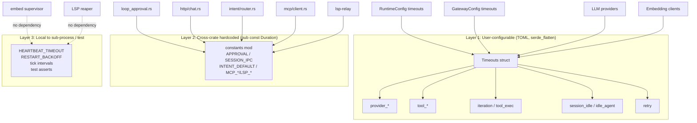

# ADR-023: Unified Timeout Configuration — A Single Source of Truth Across Crates

> **Chinese source of truth**: [ADR-023](../zh/ADR-023-centralized-timeout-config.md)
> **Terminology**: see [GLOSSARY.md](./GLOSSARY.md)

## Status

Draft (pending decision)

## Date

2026-07-02

## Decision Makers

架构讨论 (architecture discussion)

## Predecessor

ADR-016 (centralized exception-handling architecture) — its `RetryConfig` already demonstrated
"tunable policy belongs in core"

## Blast radius

**New module**: `core/acowork-core/src/timeout_config.rs` (the body of this ADR) plus
`core/acowork-core/src/lib.rs` (export `pub mod timeout_config;` and
`pub use timeout_config::{Timeouts, RetryConfig, ...};`).

**User-configurable fields (Runtime integration)**:
`core/acowork-runtime/src/config.rs` (`RuntimeConfig`'s `provider_*_timeout_ms` /
`tool_http_timeout_ms` / `session_idle_timeout_secs` become
`#[serde(flatten)] timeouts: Timeouts`) and
`core/acowork-runtime/src/providers/router.rs` (`ProviderTimeouts::from(&RuntimeConfig)` reads
`Timeouts` directly).

**User-configurable fields (Gateway integration + default-value fix)**:
`core/acowork-gateway/src/config.rs` (`GatewayConfig::idle_timeout_secs` and
`iteration_timeout_ms` join `Timeouts`; **default fix**: `iteration_timeout_ms` raised from
`30_000` to `900_000`); `core/acowork-gateway/src/lifecycle/manager.rs` (`LifecycleManager::new`'s
`idle_timeout` parameter reads from `Timeouts::idle_agent`);
`core/acowork-gateway/src/http/agents.rs` (4 places of temporary hardcoded `idle_timeout = 300`
become `Timeouts::idle_agent`).

**User-configurable fields (embed sub-process HTTP clients)**:
`core/acowork-runtime/src/embedding/ollama.rs` (hardcoded 30s/5s → `Timeouts::tool_http` /
`provider_connect`) and `core/acowork-runtime/src/embedding/remote.rs` (same).

**Cross-crate hardcoded constants re-exported** (only the reference point is renamed, call sites
unchanged): `core/acowork-runtime/src/agent/loop_approval.rs` (`APPROVAL_TIMEOUT_SECS` →
`use acowork_core::timeout_config::constants::*`); `core/acowork-gateway/src/http/chat.rs`
(`SESSION_IPC_TIMEOUT_SECS`); `core/acowork-gateway/src/intent/router.rs`
(`DEFAULT_INTENT_TIMEOUT_SECS`); `core/acowork-mcp/src/client.rs` (`RECV_TIMEOUT_SECS` /
`DEFAULT_TOOL_TIMEOUT_SECS` / `MAX_TOOL_TIMEOUT_SECS`); `core/acowork-lsp-relay/src/codebase.rs`
(`REQUEST_TIMEOUT` / `INIT_TIMEOUT`).

**Fail-fast protection**: `core/acowork-gateway/src/main.rs` or
`core/acowork-gateway/src/gateway/mod.rs` calls
`acowork_core::timeout_config::validate(&timeouts)?` after `Gateway::new()`.

**Backward compatibility** (field names unchanged): every existing timeout field name in users'
`gateway.toml` / `runtime.toml` stays the same, transitioning smoothly via `#[serde(alias)]` or
`#[serde(flatten)]`.

**Explicitly out of scope**: the heartbeat / restart backoff in `acowork-embed/src/supervisor.rs`
and `acowork-core/src/health.rs` stay local (sub-process behavior contracts); the idle reap in
`core/acowork-lsp-relay/src/pool.rs` stays local; the `BackoffStrategy` enum in
`core/acowork-runtime/src/providers/reliable.rs` is kept (already a structured policy, not a single
constant); tick intervals like `Duration::from_millis(50)` in tests stay local.

---

## Context

### Problem 1: timeout constants scattered across crates, with inconsistent naming and units

A full scan of the 12 crates under `core/` found **40+** timeout / interval / backoff constants,
sorted into 6 classes by semantic layer and configurability (see Appendix A):

| Class | Count | Worth centralizing? |
|---|---|---|
| User-configurable (TOML) | 9 | ⭐⭐⭐ |
| Hardcoded but referenced across crates | 8 | ⭐⭐⭐ |
| LLM provider HTTP client construction | 6 | ⭐⭐ |
| Sub-process / background task timers | ~16 | ⭐ (keep local) |
| Retry / backoff policies | 7 | ⭐ (structured policy, leave alone) |
| Test / tick constants | N | ✗ |

The first two classes — 17 items — are what should actually be centralized. They currently live
in 12+ files with inconsistent naming styles (`_SECS` / `_MS` / no suffix) and mixed types
(`u64` / `Duration` / `u32`), with no single source of truth.

### Problem 2: a real inconsistency in the default values (an identified bug)

`iteration_timeout_ms` maintains its default in two independent configs and **the two differ by
30×**:

| Location | Field | Default |
|---|---|---|
| `core/acowork-runtime/src/config.rs:180-182` | `RuntimeConfig::iteration_timeout_ms` | `900_000` (15 min) |
| `core/acowork-gateway/src/config.rs:244-246` | `GatewayConfig::iteration_timeout_ms` | `30_000` (30 s) ⚠️ |

> **Consequence**: when a Gateway-driven agent starts the Runtime, if the Gateway-side default
> (30 s) is pushed over IPC it fires an iteration abort **earlier** than the Runtime's internal
> fallback (900 s), wrongly interrupting agents with long thinking or long tool calls.
>
> This field is in fact **read by no caller** on the Gateway side (confirmed by grep) — it is a
> dead field; but its mere existence is a hazard, since new code may misuse it.

Similarly, `session_idle_timeout_secs` (Runtime) and `idle_timeout_secs` (Gateway) are the **same
concept under different names in different fields**, with no synchronization.

### Problem 3: the embedding client is independently hardcoded and decoupled from the main LLM call timeout

```rust
// core/acowork-runtime/src/embedding/ollama.rs:48-52
let http_client = Client::builder()
    .timeout(std::time::Duration::from_secs(30))   // hardcoded 30s
    .connect_timeout(std::time::Duration::from_secs(5)) // hardcoded 5s
    .build()
```

Meanwhile the same agent's main LLM call can run for 10 minutes
(`provider_request_timeout_ms = 600_000`) — yet embedding HTTP only gets 30 seconds. If a remote
embedding server responds slowly, the agent fails mid-way through the main flow over a 30s cap,
while the user has no clue why "the main call can run 10 minutes but embedding cannot".

Similar hardcoding also exists in `embedding/remote.rs` and `acowork-embed/download.rs`.

### Problem 4: cross-crate hardcoded constants spread over 5+ files

For example:
- `acowork-runtime/src/agent/loop_approval.rs:29` → `const APPROVAL_TIMEOUT_SECS: u64 = 300;`
- `acowork-gateway/src/http/chat.rs:1698` → `const SESSION_IPC_TIMEOUT_SECS: u64 = 10;`
- `acowork-gateway/src/intent/router.rs:23` → `pub const DEFAULT_INTENT_TIMEOUT_SECS: u64 = 30;`
- `acowork-mcp/src/client.rs:20-26` → `RECV_TIMEOUT_SECS / DEFAULT_TOOL_TIMEOUT_SECS / MAX_TOOL_TIMEOUT_SECS`
- `acowork-lsp-relay/src/codebase.rs:45/48` → `REQUEST_TIMEOUT / INIT_TIMEOUT`

A caller reading `10` / `30` / `180` / `300` has to jump to the constant's definition to confirm
the unit, the meaning and whether it fits the scenario. **This is cognitive burden, not a bug**,
but when debugging an IPC push that inexplicably timed out after 10 seconds, you cannot quickly
tell "which kind of 10 is this".

## Decision

### Decision 1: add a `timeout_config` module to `acowork-core`

New file `core/acowork-core/src/timeout_config.rs`, structured as:

```rust
//! Centralized timeout configuration for cross-crate timeouts.
//!
//! Three layers, by mutability:
//!   1. **Timeouts (user-configurable, TOML-serializable)**
//!   2. **constants (cross-crate hardcoded Duration constants)**
//!   3. **validate (safety-bound checks at startup)**
//!
//! Sub-process-internal timeouts (embed supervisor, LSP reaper,
//! tick intervals) intentionally do NOT live here — they belong to
//! the sub-process behavior contract.

use std::time::Duration;
use serde::{Deserialize, Serialize};

// ── Layer 1: user-configurable subset ─────────────────────────────────

/// Aggregated timeout configuration. Both `RuntimeConfig` and
/// `GatewayConfig` flatten this via `#[serde(flatten)]` so existing
/// TOML field names are preserved.
#[derive(Debug, Clone, Serialize, Deserialize)]
pub struct Timeouts {
    // LLM provider HTTP layer
    /// Whole LLM HTTP request timeout (thinking + generation).
    /// Was: provider_request_timeout_ms (Runtime). Default: 10 min.
    #[serde(default = "default_provider_request")]
    pub provider_request: Duration,

    /// LLM TCP connect timeout. Was: provider_connect_timeout_ms. Default: 10 s.
    #[serde(default = "default_provider_connect")]
    pub provider_connect: Duration,

    /// Per-chunk stream silence detection (LLM streaming).
    /// Was: provider_stream_read_timeout_ms. Default: 45 s.
    #[serde(default = "default_provider_stream_read")]
    pub provider_stream_read: Duration,

    // Built-in tool layer
    /// Default HTTP timeout for tools (web_fetch, etc).
    /// Was: tool_http_timeout_ms (Runtime). Default: 30 s.
    #[serde(default = "default_tool_http")]
    pub tool_http: Duration,

    // Agent loop layer
    /// Overall timeout for one iteration (multiple LLM + tool calls).
    /// Was: iteration_timeout_ms (Runtime AND Gateway; defaults mismatched).
    /// Unified default: 15 min.  ⚠ This is a bug fix.
    #[serde(default = "default_iteration")]
    pub iteration: Duration,

    /// Single tool execution timeout. Was: tool_timeout_ms. Default: 10 min.
    #[serde(default = "default_tool_exec")]
    pub tool_exec: Duration,

    // Session lifecycle layer
    /// Session in-memory eviction threshold. Was: session_idle_timeout_secs.
    /// Default: 5 min.
    #[serde(default = "default_session_idle")]
    pub session_idle: Duration,

    /// Gateway-side idle agent kill threshold. Was: idle_timeout_secs.
    /// Kept as a separate field because operator intent may differ
    /// from internal session eviction. Default: 5 min.
    #[serde(default = "default_idle_agent")]
    pub idle_agent: Duration,

    // Retry layer
    /// Bounded retry policy shared across reliable.rs and future callers.
    /// Was: inline in providers/reliable.rs (`max_attempts=3 / base=1s / cap=10s`).
    #[serde(default)]
    pub retry: RetryConfig,
}

#[derive(Debug, Clone, Serialize, Deserialize)]
pub struct RetryConfig {
    pub max_attempts: u32,
    pub backoff_base: Duration,
    pub backoff_cap: Duration,
    /// Server-suggested wait time takes precedence over backoff.
    /// Bool only; the actual ms is read from the `Retry-After` header.
    #[serde(default)]
    pub honor_retry_after: bool,
}

impl Default for RetryConfig {
    fn default() -> Self {
        Self {
            max_attempts: 3,
            backoff_base: Duration::from_secs(1),
            backoff_cap: Duration::from_secs(10),
            honor_retry_after: true,
        }
    }
}

// Default factories. Centralized so a single change here updates
// both runtime and gateway.
fn default_provider_request() -> Duration { Duration::from_secs(600) }
fn default_provider_connect() -> Duration { Duration::from_secs(10) }
fn default_provider_stream_read() -> Duration { Duration::from_secs(45) }
fn default_tool_http() -> Duration { Duration::from_secs(30) }
fn default_iteration() -> Duration { Duration::from_secs(900) } // 15 min ⚠ was 30 s in gateway
fn default_tool_exec() -> Duration { Duration::from_secs(600) }
fn default_session_idle() -> Duration { Duration::from_secs(300) }
fn default_idle_agent() -> Duration { Duration::from_secs(300) }

impl Default for Timeouts {
    fn default() -> Self {
        Self {
            provider_request: default_provider_request(),
            provider_connect: default_provider_connect(),
            provider_stream_read: default_provider_stream_read(),
            tool_http: default_tool_http(),
            iteration: default_iteration(),
            tool_exec: default_tool_exec(),
            session_idle: default_session_idle(),
            idle_agent: default_idle_agent(),
            retry: RetryConfig::default(),
        }
    }
}

// ── Layer 2: cross-crate hardcoded constants ─────────────────────────

pub mod constants {
    use std::time::Duration;

    /// Tool approval / user question wait. Was: APPROVAL_TIMEOUT_SECS=300.
    pub const APPROVAL: Duration = Duration::from_secs(300);

    /// HTTP→Runtime response wait. Was: SESSION_IPC_TIMEOUT_SECS=10.
    pub const SESSION_IPC: Duration = Duration::from_secs(10);

    /// Default Intent routing wait. Was: DEFAULT_INTENT_TIMEOUT_SECS=30.
    pub const INTENT_DEFAULT: Duration = Duration::from_secs(30);

    /// MCP receive timeout for init / list. Was: RECV_TIMEOUT_SECS=30.
    pub const MCP_RECV: Duration = Duration::from_secs(30);

    /// MCP default per-tool call. Was: DEFAULT_TOOL_TIMEOUT_SECS=180.
    pub const MCP_DEFAULT_TOOL: Duration = Duration::from_secs(180);

    /// MCP tool ceiling (safety). Was: MAX_TOOL_TIMEOUT_SECS=600.
    pub const MCP_MAX_TOOL: Duration = Duration::from_secs(600);

    /// LSP JSON-RPC request timeout. Was: REQUEST_TIMEOUT=30.
    pub const LSP_REQUEST: Duration = Duration::from_secs(30);

    /// LSP initialize handshake timeout. Was: INIT_TIMEOUT=60.
    pub const LSP_INIT: Duration = Duration::from_secs(60);
}

// ── Layer 3: safety-bound validation ─────────────────────────────────

/// Fail-fast validation at startup. Returns Err with a descriptive
/// message identifying which field violates which constraint.
///
/// Intentionally strict on lower bounds (0 would mean "disabled"
/// which we forbid for safety), loose on upper bounds (operators
/// may legitimately raise them).
pub fn validate(t: &Timeouts) -> Result<(), String> {
    use std::time::Duration;

    let min = Duration::from_secs(1);
    let fields: &[(&str, Duration)] = &[
        ("provider_request", t.provider_request),
        ("provider_connect", t.provider_connect),
        ("provider_stream_read", t.provider_stream_read),
        ("tool_http", t.tool_http),
        ("iteration", t.iteration),
        ("tool_exec", t.tool_exec),
    ];
    for (name, d) in fields {
        if *d < min {
            return Err(format!(
                "Timeouts.{name} must be >= 1s, got {}s",
                d.as_secs()
            ));
        }
    }
    if t.session_idle.is_zero() || t.idle_agent.is_zero() {
        return Err(
            "Timeouts.session_idle / idle_agent must be > 0 \
             (use the disable path explicitly if needed)"
                .to_string(),
        );
    }
    if t.retry.max_attempts == 0 {
        return Err("Timeouts.retry.max_attempts must be >= 1".into());
    }
    if t.retry.backoff_base.is_zero() || t.retry.backoff_cap < t.retry.backoff_base {
        return Err(format!(
            "Timeouts.retry: backoff_cap ({:?}) must be >= backoff_base ({:?})",
            t.retry.backoff_cap, t.retry.backoff_base
        ));
    }
    // Cross-field invariant:
    if t.iteration < t.tool_exec {
        tracing::warn!(
            iteration_secs = t.iteration.as_secs(),
            tool_exec_secs = t.tool_exec.as_secs(),
            "Timeouts.iteration < tool_exec: a single tool can outlive \
             its parent iteration. Check operator intent."
        );
    }
    Ok(())
}

#[cfg(test)]
mod tests {
    use super::*;

    #[test]
    fn defaults_are_all_positive() {
        let t = Timeouts::default();
        validate(&t).expect("defaults must validate");
    }

    #[test]
    fn zero_duration_is_rejected() {
        let mut t = Timeouts::default();
        t.iteration = Duration::from_secs(0);
        assert!(validate(&t).is_err());
    }

    #[test]
    fn serialize_field_names_match_toml_keys() {
        // Catch renames: the TOML keys that existing user configs use
        // must survive `#[serde(flatten)]` integration.
        let toml = toml::to_string(&Timeouts::default()).unwrap();
        assert!(toml.contains("provider_request"));
        assert!(toml.contains("session_idle"));
        assert!(toml.contains("idle_agent"));
    }
}
```

### Decision 2: Runtime / Gateway join `Timeouts`, fixing the iteration bug at the same time

`RuntimeConfig`:

```rust
// core/acowork-runtime/src/config.rs (illustrative)

#[derive(Debug, Clone, Serialize, Deserialize)]
pub struct RuntimeConfig {
    // ...existing identity / work_dir / log fields unchanged...
    pub max_iterations: u32,   // legacy field — kept for TOML compat
    pub iteration_timeout_ms: u64,  // ⚠ DEPRECATED, alias to timeouts.iteration
    pub tool_timeout_ms: u64,       // ⚠ DEPRECATED, alias to timeouts.tool_exec

    /// Centralized timeouts (flattened into the same TOML section).
    /// All existing field names (provider_request_timeout_ms etc.)
    /// remain serializable via #[serde(flatten)] + alias.
    #[serde(flatten)]
    pub timeouts: acowork_core::timeout_config::Timeouts,
}
```

`GatewayConfig` likewise joins via `#[serde(flatten)] timeouts: Timeouts`, **with the default
fixed**:

```rust
fn default_iteration_timeout_ms() -> u64 { 900_000 }  // was 30_000
```

> If an old user's `gateway.toml` explicitly sets `iteration_timeout_ms = 30000`, the new code
> reads 30 s (identical to current behavior) — **their config semantics are not changed**; only
> the bug where the Gateway's unset default disagrees with the Runtime's is fixed.

### Decision 3: sub-process / tick constants stay put, centralization is not forced

The following constants are **explicitly kept in their own crates**:

| Constant | Location | Rationale |
|---|---|---|
| `HEARTBEAT_TIMEOUT` / `STARTUP_GRACE` / `RESTART_BACKOFF_*` / `MAX_RESTART_ATTEMPTS` | `acowork-core/src/health.rs` | sub-process behavior contract; an independent process does not support centralized hot updates |
| `RECONNECT_MAX` | `acowork-embed/src/embed_supervisor.rs` | same |
| `DEFAULT_IDLE_TIMEOUT` / `REAPER_INTERVAL` | `acowork-lsp-relay/src/pool.rs` | the LSP process is governed independently |
| `REQUEST_TIMEOUT` / `INIT_TIMEOUT` (LSP probing) | `acowork-lsp-relay/src/config.rs` | LSP sub-process startup contract |
| `MAX_DELAY_MS` (gRPC retry cap) | `acowork-runtime/src/grpc/client.rs` | bound to the gRPC channel state |
| test `Duration::from_millis(N)` | scattered `#[cfg(test)]` | does not pollute production config |

### Decision 4: the embedding HTTP clients read from `Timeouts`

```rust
// core/acowork-runtime/src/embedding/ollama.rs (illustrative)
use acowork_core::timeout_config::Timeouts;

impl OllamaEmbeddingProvider {
    pub fn with_config_and_timeouts(
        base_url: &str,
        model: &str,
        dimension: usize,
        timeouts: &Timeouts,
    ) -> Self {
        let http_client = Client::builder()
            .timeout(timeouts.tool_http)        // was hardcoded 30s
            .connect_timeout(timeouts.provider_connect) // was hardcoded 5s
            .build()
            ...
    }
}
```

`EmbeddingManager::new` accepts `Timeouts` instead of a bare `tool_http_timeout_ms`. The call
chain becomes `RuntimeConfig → Timeouts → ProviderTimeouts → each provider`.

## Key Definitions

### 1. Single source of truth

Every cross-crate "user-tunable" timeout ultimately takes its value from the single location
`acowork_core::timeout_config::Timeouts`. The criterion for "user-tunable" is:

1. it appears across a process / crate boundary, **and**
2. on-site operations may need to adjust it, **and**
3. after adjustment, the runtime and gateway behavior must stay consistent.

### 2. The three-layer responsibility split



### 3. Field renaming vs keeping field names

If `iteration_timeout_ms` (the field name) is ever changed to `iteration`, that can be a
one-shot major migration after v3.x. **This ADR does no field renaming**, avoiding surprises for
existing TOML config files.

Semantic groups are expressed through substructures such as `RetryConfig`; each `Timeouts` field
keeps its existing `*_secs` / `*_ms` naming to maximize compatibility with existing TOML and
`serde` call sites.

## Migration Strategy

**Phase 1 — establish `timeout_config.rs` and `validate()` (non-breaking)**: create `Timeouts` /
`RetryConfig` / `constants` / `validate()` in `acowork-core/src/timeout_config.rs`; export them in
`acowork-core/src/lib.rs`; add `#[cfg(test)] mod tests` covering default / serialize / validate;
**change no consumers** — this phase only lands infrastructure. Expected outcome: `cargo build -p
acowork-core` passes and `cargo test -p acowork-core timeout_config` is green.

**Phase 2 — integrate Runtime / Gateway and fix the default (the core phase)**: `RuntimeConfig`
gains `#[serde(flatten)] timeouts: Timeouts`, with the existing fields kept `pub` +
`#[serde(default)]` so they are transparently back-filled from `Timeouts` — on deserialization
an old field in the TOML (`provider_request_timeout_ms` etc.) writes into the corresponding
`Timeouts` field, and on serialization both old and new fields are emitted (a short dual-field
period); `GatewayConfig` does the same plus `default_iteration_timeout_ms` → `900_000`;
`lifecycle/manager.rs` and `http/agents.rs` replace the temporary hardcoded `idle_timeout = 300`
with `Time::from(timeouts.idle_agent)`; `providers/router.rs`'s `ProviderTimeouts::from(&RuntimeConfig)`
reads the `timeouts` field; and startup calls `validate(&timeouts)?` so violations fail fast.
Expected outcome: existing users' TOML loads with zero modification, `iteration_timeout_ms`
defaults to 900 s consistently on both sides, and `cargo test` / `cargo clippy --all-targets -- -D
warnings` pass.

**Phase 3 — the embedding / download clients join (decoupling the hardcoding)**:
`embedding/{ollama,remote}.rs` become `with_config_and_timeouts(..., &Timeouts)` reading
`timeouts.tool_http` / `timeouts.provider_connect`; `acowork-embed/src/download.rs` does not join
yet (an independent process whose timeout semantics are bound to the sub-process contract).
Expected outcome: the main LLM call and the embedding HTTP no longer hardcode separately — both go
through `Timeouts`, adjustable uniformly via TOML.

**Phase 4 — re-export the cross-crate hardcoded constants (clearing the noise)**: for the 8
cross-crate constants **only the re-export reference changes, no behavior changes** — the literal
disappears from call sites while every behavior value stays identical. This phase is **pure
refactoring / a readability improvement with zero runtime impact**. Expected outcome: the 8
`const FOO: u64 = N;` declarations are replaced by `use`, and grepping `const.*SECS\|const.*MS`
across those directories leaves only sub-process-internal hardcoding.

**Phase 5 — future options (not in this ADR, direction only)**: field renaming (`*_ms` → plain
`Duration`) plus a one-shot breaking migration; exposing `validate()` to the CLI
(`acowork-gateway config-validate`); wiring `Timeouts` over IPC so the Gateway can push to the
Runtime (eliminating the root cause of the default-value inconsistency this ADR fixes).

## Test Requirements

**Configuration and serialization**: `Timeouts::default()` passes `validate()` entirely (preventing
defaults from being broken unintentionally); `toml::to_string(&Timeouts::default())` contains all
expected field names (preventing field renames from breaking existing configs); a roundtrip test
`Timeouts → TOML → Timeouts` loses no field; and an existing `gateway.toml` sample (in
`docs/reference`) deserializes with no warnings and no field loss.

**Runtime / Gateway integration**: `RuntimeConfig::default().timeouts.iteration == 15 min`;
`GatewayConfig::default().timeouts.iteration == 15 min` (consistent with the runtime); and the embed
sub-process startup path uses `Timeouts::tool_http` rather than a hardcoded 30s.

**`validate` behavior**: `validate(&Timeouts { iteration: 0, ..default() })` returns Err;
`validate(&Timeouts { retry: RetryConfig { max_attempts: 0, .. } })` returns Err;
`validate(&Timeouts { retry: RetryConfig { backoff_base: 5s, backoff_cap: 1s, .. } })` returns Err.

**Behavior invariance (regression guard)**: after the 8 cross-crate constants are re-exported, the
literal values at every call site are unchanged (this phase is pure refactoring); and the existing
70+ `cargo test` items all stay green.

## Risks and Mitigations

**Risk 1 — existing users' `.toml` files break (the largest impact)**. Probability: medium
(`#[serde(flatten)]` namespace conflicts, a mis-written `#[serde(alias)]`). Impact: high (the agent
cannot start). Mitigation: Phase 1 must write deserialization-compatibility tests before
integrating any consumer; field names always keep their old names (only the internal type becomes
`Duration`); and watch the `[WARN]` logs at rollout — all "unknown field" counts should be zero.

**Risk 2 — the default fix causes a regression**. Probability: low (`GatewayConfig`'s
`iteration_timeout_ms` is in fact never read). Impact: medium (someone might develop a new feature
against the Gateway default in the future). Mitigation: state the default change explicitly in the
release notes and keep the field readable for compatibility.

**Risk 3 — Phase 4 misses a call site when replacing the re-export**. Probability: medium (8
constants spread over 5 files). Impact: low (immediately exposed at compile time). Mitigation:
run `cargo build` after each file change — a compile failure pinpoints it immediately.

**Risk 4 — conflicts with ADR-019, ADR-020 and others**. Probability: low (this ADR touches
neither the data flow nor the sub-process governance boundary). Impact: low. Mitigation: Decision 3
explicitly enumerates the constants that stay put, preventing future "it's not centralized yet"
follow-up churn.

**Risk 5 — `#[serde(flatten)]` compatibility inside nested structures**. Probability: low
(behavior is stable). Impact: medium (may produce ambiguous-field warnings). Mitigation: Phase 1
adds a test covering deep nesting
(`RuntimeConfig { timeouts: Timeouts { retry: RetryConfig { ... } } }` → TOML).

## Conclusion

The essence of ADR-023 is not "extracting one more shared module" but **making the responsibility
layering of timeouts explicit**:

- **user-configurable** → `Timeouts` (TOML-compatible, serde-transparent, single field source);
- **cross-crate hardcoded** → `constants` (strongly typed `Duration`, zero unit guesswork);
- **sub-process internal** → left in place (contract-bound, avoiding over-coupling).

Staged outcomes:

1. Fixes the real bug of a 30× `iteration_timeout_ms` default-value inconsistency.
2. Eliminates the `idle_timeout_secs` ↔ `session_idle_timeout_secs` naming divergence.
3. Unifies the main LLM and embedding client timeout semantics.
4. Normalizes the naming and units of 8 cross-crate constants.

This is the process of making defensive programming explicit: **defaults should be designed, not
historical leftovers scattered around.**

## Appendix A: The Full Current-State Inventory

### A.1 User-configurable (9 items)

| Field | Location | Default |
|---|---|---|
| `provider_request_timeout_ms` | `core/acowork-runtime/src/config.rs:73` | 600_000 |
| `provider_connect_timeout_ms` | same :75 | 10_000 |
| `provider_stream_read_timeout_ms` | same :78 | 45_000 |
| `tool_http_timeout_ms` | same :81 | 30_000 |
| `iteration_timeout_ms` | same :57 | **900_000** |
| `iteration_timeout_ms` | `core/acowork-gateway/src/config.rs:84` | **30_000 ⚠** |
| `tool_timeout_ms` | runtime config :60 | 600_000 |
| `session_idle_timeout_secs` | runtime config :85 | 300 |
| `idle_timeout_secs` | gateway config :78 | 300 |

### A.2 Cross-crate hardcoded (8 items)

| Constant | Location | Value |
|---|---|---|
| `APPROVAL_TIMEOUT_SECS` | `core/acowork-runtime/src/agent/loop_approval.rs:29` | 300 s |
| `SESSION_IPC_TIMEOUT_SECS` | `core/acowork-gateway/src/http/chat.rs:1698` | 10 s |
| `DEFAULT_INTENT_TIMEOUT_SECS` | `core/acowork-gateway/src/intent/router.rs:23` | 30 s |
| `RECV_TIMEOUT_SECS` | `core/acowork-mcp/src/client.rs:20` | 30 s |
| `DEFAULT_TOOL_TIMEOUT_SECS` | same :23 | 180 s |
| `MAX_TOOL_TIMEOUT_SECS` | same :26 | 600 s |
| `REQUEST_TIMEOUT` | `core/acowork-lsp-relay/src/codebase.rs:45` | 30 s |
| `INIT_TIMEOUT` | same :48 | 60 s |

### A.3 Embedding HTTP client hardcoding (6 items)

| Provider | Location | request | connect |
|---|---|---|---|
| Ollama embedding | `core/acowork-runtime/src/embedding/ollama.rs:48-52` | 30 s ⚠ | 5 s ⚠ |
| Remote embedding | `core/acowork-runtime/src/embedding/remote.rs:50-54` | 30 s ⚠ | 5 s ⚠ |
| HF model download | `core/acowork-embed/src/download.rs:190-194` | 600 s | 30 s |
| Anthropic provider | `core/acowork-runtime/src/providers/anthropic.rs:59-63` | from config | from config |
| OpenAI provider | `core/acowork-runtime/src/providers/openai.rs:64-68` | from config | from config |
| Ollama provider | `core/acowork-runtime/src/providers/ollama.rs:42-46` | from config | from config |

### A.4 Explicitly out of scope (recorded only)

- `acowork-core/src/health.rs`: `HEARTBEAT_TIMEOUT=10s`, `STARTUP_GRACE=10s`,
  `RESTART_BACKOFF_MIN/MAX=1s/60s`, `RESTART_WINDOW=5min`, `MAX_RESTART_ATTEMPTS=5`.
- `acowork-embed/src/embed_supervisor.rs`: `RECONNECT_MAX=30s`, `ONNX_LOAD_MAX_RETRIES=3`,
  `ONNX_LOAD_RETRY_DELAY=2s`.
- `acowork-embed/src/server.rs`: embedding inference 30s / model load 60s.
- `acowork-gateway/src/lifecycle/embed.rs`: 5 sub-process HTTP timeouts (2s/60s/30s/5s/15s).
- `acowork-lsp-relay/src/pool.rs`: `DEFAULT_IDLE_TIMEOUT=600s`, `REAPER_INTERVAL=60s`.
- `acowork-lsp-relay/src/config.rs`: the `--version` probe 2s, process startup 5s.
- `acowork-runtime/src/providers/reliable.rs`: the `BackoffStrategy` enum (already a structured
  policy).
- `acowork-runtime/src/grpc/client.rs`: `REQUEST_TIMEOUT=30s`, the `MAX_DELAY_MS` exponential cap.
- The `Duration::from_millis(N)` test assertions in various `#[cfg(test)]` blocks.
