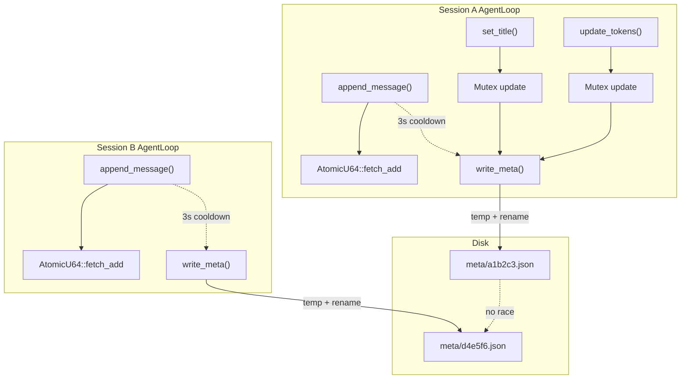

# ADR-024: Merging Session Metadata into the Index, Removing the Conversation File Header

> **Chinese source of truth**: [ADR-024](../zh/ADR-024-merge-metadata-into-index.md)
> **Terminology**: see [GLOSSARY.md](./GLOSSARY.md)

## Status

Draft

## Date

2026-07-03

## Decision Makers

架构讨论 (architecture discussion)

## Blast radius

- `core/acowork-runtime/src/conversation.rs` — the core change: `ConversationWriter` simplifies to a pure append-only writer and `ConversationSession` writes to the meta file instead
- `core/acowork-runtime/src/agent/session/restorer.rs` — the metadata read path switches from the JSONL header to the meta file
- `core/acowork-runtime/src/agent_config.rs` — `AgentConfig` gains a `max_sessions` field
- `core/acowork-runtime/src/config.rs` — the default 1000 → 2000
- `core/acowork-runtime/src/cli.rs` — the scan / list endpoint adaptation; `RuntimeConfigUpdate` handles `max_sessions`
- `core/acowork-core/src/protocol.rs`, `core/acowork-core/src/proto_bridge.rs` — `RuntimeConfigUpdate` gains `max_sessions` + gRPC serialization
- `core/acowork-gateway/src/http/agent_config.rs`, `core/acowork-gateway/src/http/agents.rs` — `max_sessions` on the request/response
- `apps/acowork-desktop/src/stores/chatStore.ts` — line coordinates go from 1-based to 0-based (the old line 0 was the metadata header; now line 0 is the first message)
- Complementary to ADR-021: the coordinate system simplifies

---

## Context

### Two copies of the same data today

Session metadata currently lives in two places with substantial duplication:

**Location A: the JSONL file's first line (`SessionMetadata`)** — version, session_id,
agent_id, created_at, title, updated_at, message_count, corrupted, workspace_id, model,
provider, reasoning_effort, temperature, last_input_tokens, last_output_tokens,
last_compaction_offset.

**Location B: `conversations/index.json` (`SessionIndexEntry`)** — title, created_at,
last_active_at, message_count, workspace_id, model, provider, corrupted.

**The 7 duplicated fields**: `title`, `created_at`, `message_count`, `workspace_id`, `model`,
`provider`, `corrupted`.

### The pain

```mermaid
graph TD
    subgraph "updating the session title"
        A1["set_title()"] --> A2["build SessionMetadata<br/>(every field must be assembled)"]
        A2 --> A3["rewrite_metadata()<br/>read the whole file → replace line 1 → write a temp file → rename → reopen"]
        A3 --> A4["update_index_entry()<br/>read index.json → write a temp file → rename"]
    end
    subgraph "updating tokens"
        B1["update_tokens()"] --> B2["build SessionMetadata"]
        B2 --> B3["rewrite_metadata()"]
        B3 --> B4["(does not trigger an index update)"]
    end
    subgraph "updating message_count"
        C1["append_message()"] --> C2["build SessionMetadata"]
        C2 --> C3["rewrite_metadata()"]
        C3 --> C4["update_index_entry()<br/>(3s cooldown)"]
    end
```



Four problems:

1. **`rewrite_metadata()` is expensive**: it reads the entire JSONL file, replaces the first line, writes a temp file, renames, and reopens the file handle. Changing a 20-byte title rewrites the whole file.
2. **The two copies fall out of sync**: `SessionMetadata` and `SessionIndexEntry` are maintained through two independent write paths with their own cooldowns and trigger conditions, and they have in fact already diverged (`last_active_at` exists only in the index, `temperature` only in the JSONL header).
3. **The `index.json` load-modify-write race**: the current comment openly admits "last writer wins" — acceptable while the JSONL header provides a fallback, but unacceptable once the header is removed and all metadata lives in `index.json`.
4. **ADR-021's line coordinates are not clean**: `line_number=0` is the metadata header while the real conversation starts at `line_number=1`.

## Goals

1. **Merge the duplicated data**: `SessionMetadata` + `SessionIndexEntry` → a unified `SessionMeta` stored in `conversations/meta/{session_id}.json`
2. **Remove the conversation file header**: the JSONL becomes a pure append-only conversation data stream (line 0 = the first message), eliminating `rewrite_metadata` entirely
3. **Eliminate cross-session races**: each session writes only its own `meta/{session_id}.json`, which is naturally single-writer
4. **Archive instead of delete**: sessions beyond `max_sessions` are moved to `archived/` rather than `remove_file`d
5. **Compatible with ADR-021**: the line coordinates align with the pure-data JSONL

## Design

### Directory structure

```
conversations/
├── meta/                              # metadata for active sessions (source of truth)
│   ├── 20260503_143022_a1b2c3.json    # one file per session, ~400 bytes
│   └── 20260504_091530_d4e5f6.json
│
├── 20260503_143022_a1b2c3.jsonl       # pure conversation data (from line 0)
├── 20260504_091530_d4e5f6.jsonl
│
└── archived/                          # old sessions beyond max_sessions
    ├── meta/
    │   └── 20250101_000000_x1y2z3.json
    └── 20250101_000000_x1y2z3.jsonl
```

### The unified `SessionMeta`

`SessionMeta` carries immutable fields (`version`, `session_id`, `agent_id`, `created_at`),
user/API-mutable fields (`title`, `workspace_id`, `model`, `provider`, `reasoning_effort`,
`temperature`, all `Option` with `skip_serializing_if`), runtime statistics
(`message_count: u64`, `last_active_at: String`, `last_input_tokens`, `last_output_tokens`),
the `last_compaction_offset` marker, and the `corrupted` recovery flag.

**The key changes**:

- `last_active_at` is folded in (it previously existed only in `SessionIndexEntry`)
- `last_compaction_offset` becomes an absolute offset (after removing the header `meta_end = 0`)
- `message_count` is unified as `u64` (it was `Option<u32>` in `SessionMetadata`)

### The conversation file format change

```
# before (v2)
Line 0: {"version":2,"session_id":"abc","title":"...","model":"...",...}   ← metadata
Line 1: {"id":"m1","role":"user","content":"hello"}                        ← conversation data
Line 2: {"id":"m2","role":"assistant","content":"hi"}

# after (v3)
Line 0: {"id":"m1","role":"user","content":"hello"}                        ← conversation data from line 0
Line 1: {"id":"m2","role":"assistant","content":"hi"}
```

Read-side compatibility: if the first line's JSON contains a `session_id` field it is the
v1/v2 format (has a header), otherwise it is v3 (no header).

### Concurrency model: naturally single-writer



Each session writes only its own `meta/{session_id}.json`, so there is no cross-file
contention and no file lock is needed. Atomicity comes from `temp + rename`.

### Write strategy

| Trigger | Frequency | Writes the meta file | Notes |
|---|---|---|---|
| `append_message` | high (~50/s while streaming) | ❌ not on the hot path | the in-memory `AtomicU64` already counts; written on the 3s cooldown |
| `set_title` | low (an explicit user action) | ✅ immediately | a user action must be durably persisted |
| `update_workspace_id` / `update_model_provider` / `update_reasoning_effort` / `update_temperature` | low | ✅ immediately | same |
| `update_tokens` | medium (after each LLM response) | ✅ immediately | low enough (~1 per few seconds) to persist the token count |
| `Drop` / session close | one-off | ✅ forced flush | ensures the final state lands on disk |

### Read / list strategy

**Session detail** (`resume`): read `meta/{session_id}.json` directly — one `open + read +
parse`.

**Session list** (`scan_sessions`): scan the `meta/` directory, deserialize each `.json` into
a `SessionMeta`, and sort by `last_active_at` descending.

**Performance baseline** (measured on a macOS APFS SSD with 2000 meta files):

```
scanning 2000 directory entries   8ms
reading 2000 × 400B (~800KB)     45ms
serde_json parsing                5ms   (Rust is 3-5x faster than Python)
──────────────────────────────────────
total                           ~40ms
```

**A 40ms startup cost is entirely acceptable** — and it replaces the previous approach of
reading `index.json` (~5ms) plus reading each JSONL's first line (a seek + `read_line` per
file), which was actually slower.

**Later revision (during ADR-076 implementation)**, with `core/acowork-runtime/src/conversation.rs`
now authoritative:

- **The sort gained a tie-break**: `last_active_at` only reaches millisecond precision, so two sessions created in the same millisecond tie. Sorting is now `(last_active_at desc, session_id asc)` — otherwise "a write-maintained cache index (write order)" and "a rescan (`read_dir` order)" would produce **different pagination boundaries** for tied sessions.
- **The list now goes through an in-process in-memory index** (`META_INDEX`): `read_dir` plus a per-file `read + serde_json` happens only once (on first read), after which `scan_sessions_async` / `find_latest_session` / `prune_excess_sessions` all read the cache, degrading a repeated listing to a single `read_dir().count()` probe (measured 0.9ms for 2000 entries vs 23ms for a full scan). The cache stays in sync through `write_session_meta` (the write-side upsert) and `remove_session_meta` (the delete side) — **these two functions are the only write and delete entry points for meta files**, guarded by `run_meta_layout_redline` in `dev/ci.sh` (outside `conversation.rs` only test fixtures may build meta paths, and the ceiling may only be lowered). The probe only recognizes "the entry count changed", so a **same-count replacement write** (a writer outside this process) becomes visible only on the next real add or delete; every in-process writer goes through those two functions, so that path is unreachable.

### The archive mechanism

`prune_excess_sessions` changes from "delete" to "move": it creates `archived/meta/`, then for
each session to remove it `rename`s both the JSONL and the meta file into `archived/`. If the
`jsonl` is missing but the meta exists it still attempts the meta migration; if neither exists
it skips (already corrupt, the user cleans it up).

**Design points**: `rename` is atomic and zero-copy on the same filesystem (it only changes
the directory entry); after archiving, `scan_sessions` naturally cannot see it (it only scans
`meta/`, never `archived/meta/`); the user can manually delete the contents of `archived/`
via a file manager; and restoring is a manual move (the frontend does not need to support it —
considered for v2).

## `max_sessions` becomes frontend-configurable

`max_sessions` is currently hardcoded in `AgentRuntimeConfig` (from `manifest.toml`), defaults
to 1000, is read only at Runtime startup, and is not frontend-configurable. The change
promotes it to a per-agent configurable item settable from the Agent Setup panel, with the
default raised to 2000.

**Configuration priority**: the value set in the frontend SETTINGS panel →
`agent_config.json` (`AgentConfig.max_sessions`); if unset (`None`) → the `manifest.toml` value
(`AgentRuntimeConfig.max_sessions`); if that is also unset → `default_max_sessions() = 2000`.

`AgentConfig` is the per-agent persisted runtime config, pushed by the Gateway via
`RuntimeConfigUpdate` and written by the Runtime to `workspace/config/agent_config.json`.
`max_sessions` is a new field following the same pattern, threaded through
`agent_config.rs`, `config.rs` (the default 1000 → 2000), `protocol.rs`,
`proto_bridge.rs` (the gRPC `RuntimeConfigUpdate` message), the Gateway's
`agent_config.rs` / `agents.rs`, `cli.rs` (the handler extracts and persists it), and
`session_manager.rs` (session creation reads the override from `AgentConfig`).

**When it takes effect**: `max_sessions` only triggers `archive_excess_sessions` inside
`ConversationSession::new()`. There is no complex hot-update logic — the user's new value takes
effect the next time a session is created.

**The frontend SETTINGS panel** gets a row in Agent Setup → the config panel: "Max saved
sessions [2000] [-/+]", with the note "sessions beyond this are auto-archived to archived/".
The default is 2000, the minimum 100 (to prevent a misconfiguration that is too low), the
maximum 10000, and 0 means unlimited (not recommended — the disk may fill up). Changes are
pushed via `PUT /api/agents/{id}/config`.

## Impact on ADR-021

ADR-021's line coordinates become simpler:

| | Before | After |
|---|--------|--------|
| Line 0 | metadata header | **the first message** |
| `total_lines` | includes the header line | **equals the message line count** |
| `metadata_end_offset()` | returns the header byte length | **returns 0 (or the function is removed)** |
| `StreamingLine.line_number` | commented "0 = metadata" | **commented "0 = first message"** |

ADR-021's implementation needs no core logic changes, only updated line semantics.

## Implementation plan

**Phase 1 — add `SessionMeta` + meta file read/write (~100 lines)**: define the `SessionMeta`
struct; implement `write_session_meta(dir, meta)` (temp + rename, atomic), `read_session_meta(dir,
session_id)`, and `scan_sessions_from_meta(dir)`.

**Phase 2 — adapt `ConversationSession` (~+60 / -80 lines)**: `new()` writes the meta file
instead of a JSONL header; `resume()` reads the meta file instead of the header;
`set_title()` / `update_workspace_id()` / `update_model_provider()` write the meta file
instead of `rewrite_metadata`; `append_message()` drops the `rewrite_metadata` call and only
updates the in-memory counter; and the redundant in-memory fields `current_title` /
`workspace_id` / `model` / `provider` are removed in favor of reading from `SessionMeta`.

**Phase 3 — simplify `ConversationWriter` (~-80 lines)**: remove `rewrite_metadata()`, the
`UpdateMetadata` command, the `meta_end` field (always 0) and the `path` field (no reopen
needed after a rename); `last_compaction_offset` becomes an absolute offset.

**Phase 4 — adapt the read side (~-40 lines)**: `metadata_end_offset` returns 0 or is removed;
`data_start` is always 0 in `read_messages_*`; `restore_history_from_jsonl` drops the
metadata-header skip; `SessionInfo` is constructed from `SessionMeta`.

**Phase 5 — the archive mechanism (~+30 / -20 lines)**: `prune_excess_sessions` becomes
`archive_excess_sessions`; `remove_file` becomes a `rename` into `archived/`; the meta file is
migrated too.

**Phase 6 — deprecate `SessionMetadata` and `index.json` (~-40 lines)**: remove the
`SessionMetadata` struct (keeping one `#[allow(dead_code)]` version for compatibility), remove
`SessionIndex` / `SessionIndexEntry`, remove `write_index_atomic` / `load_index`, and clean up
the `last_index_update` / `conversations_dir` fields in `ConversationSession`.

**Phase 7 — frontend-configurable `max_sessions` (~+50 / -10 lines)**: the default 1000 → 2000;
`AgentConfig` gains `max_sessions: Option<usize>`; `GatewayResponse::RuntimeConfigUpdate` gains
`max_sessions: Option<usize>`; `UpdateAgentConfigRequest` / `AgentConfigResponse` gain
`max_sessions`; the gRPC proto bridge gains the field; the `cli.rs` handler extracts and
persists it into `AgentConfig`; and `session_manager.rs` reads the override at session creation.

**Net code volume**: ~240 lines added, ~270 deleted, a net change of **~-30 lines**.

## Risks and mitigations

| Risk | Impact | Mitigation |
|---|---|---|
| The meta file and the JSONL are inconsistent | on restore the metadata (title / model etc.) may not match the conversation content | the meta file is flushed immediately on every explicit update; a `message_count` drift from `append_message` can be recomputed from the JSONL at `resume` time |
| `archived/` piles up and consumes disk | it accumulates if never cleaned | the frontend can optionally show the archive count; the user deletes via a file manager |
| Compatibility with old sessions | existing session JSONLs have a header | detected automatically on read (a first line containing `session_id` means the old format) and transparently migrated at `open_existing` |
| ADR-021 line offsets | the meaning of `line_number=0` changes | Phase 4 switches uniformly to 0-based; implemented in sync with ADR-021 |

## Alternatives

### B — a single `index.json` + a file lock

Store the merged `SessionMeta` in one `index.json`, protecting the load-modify-write cycle
with `flock`. **Rejected**: each update must fully serialize ~1MB (2000 sessions × ~500 bytes)
when the actual change is ~20 bytes; file locks introduce cross-platform complexity (`flock` vs
`LockFileEx`); and it is a single point of failure where corruption of `index.json` affects
every session.

### C — keep `index.json` as a cache with `meta/` as the source of truth

`meta/` is the source of truth and `index.json` is rebuilt from it at startup and updated
best-effort at runtime. **Rejected**: it adds complexity over the pure `meta/` approach (two
copies to keep in sync); the `index.json` cache gain is negligible (a `meta/` scan is only
40ms); and it adds the possibility of cache inconsistency.

## Decision

**Adopt the pure per-session meta file approach**:

1. Remove the JSONL header so the conversation file becomes a pure data stream
2. Remove `index.json`; the metadata source is `conversations/meta/{session_id}.json`
3. Sessions beyond the cap move to `archived/` and the user cleans them up manually
4. Each session writes only its own file, so there are zero races
5. **`max_sessions` is promoted to frontend-configurable**: default 2000, set from the Agent Setup panel, routed through `RuntimeConfigUpdate` → `AgentConfig` persistence

The core principle: **"whoever owns the data writes it"** — single-writer is the simplest
correct model of concurrency control.
