# ADR-025: Layered Temperature Resolution Chain and Observability

> **Chinese source of truth**: [ADR-025](../zh/ADR-025-temperature-resolution-chain.md)
> **Terminology**: see [GLOSSARY.md](./GLOSSARY.md)

## Status

Proposed

## Date

2026-07-05

## Decision Makers

大鱼 (Dayu)

---

## Context

The code already has a three-layer temperature fallback, with five problems:

1. **The manifest layer reaches through** — `self.core.manifest.llm.temperature` requires
   the `manifest` field to be visible at every call site, breaking the encapsulation of
   `AgentCore` as the temperature holder.
2. **No provenance** — the ResultsPanel shows only the final number (e.g. `0.7`), so a
   user cannot tell whether it came from their Agent Setup setting, the package author,
   or the system default.
3. **`sessionState.temperature` is misnamed** — the frontend comment calls it a
   "per-session temperature override … persisted in JSONL metadata", but it is **not** a
   user-set override; the frontend has no entry point at all. It is the fully resolved
   final value pushed read-only from the Runtime at session creation.
4. **first-start does not seed from the manifest** — unlike avatar, `agent_config.json`
   starts without the manifest default.
5. **No `manifest_temperature` hint** — the input lacks a "leave blank to use the
   package default X.X" placeholder.

**Key finding on `sessionState.temperature`.** It is assigned in exactly two places
(`chatStore.ts:1588, 2111`), both from the `temperature` field of the
`SessionStateChanged` chunk event; no frontend code ever sets or modifies it (no
`setTemperature`, no slider, no input). The Runtime type comment says "set by
frontend or agent config", but only `session_manager.rs` sets it, and it sets the **fully
resolved** value (always `Some`). Re-running the fallback chain in `emit_session_state()` and
`build_chat_request()` is a safety net for the rare case where `session.temperature()`
is `None` (e.g. a session created but not yet initialized); in steady state it is always
`Some`.

**Conclusion**: `sessionState.temperature` is a **display field**, not a user setting.
Layer 1 of the supposed "four-layer chain" does not exist in the current architecture.

## Decision

### The actual chain is three layers

```text
Layer 1 (highest)  agent_config.json.temperature   user per-agent setting
    ↓ if None
Layer 2             manifest.llm.temperature         package author default
    ↓ if None
Layer 3 (fallback)  DEFAULT_TEMPERATURE = 0.3      system hardcoded
```

`runtime_overrides.temperature` is a **transient layer**: it exists briefly while the
Gateway pushes `RuntimeConfigUpdate`, carrying a new value until `apply_runtime_config()`
persists it to `core.temperature_override`, after which its job is done.

### Data flow

```mermaid
flowchart TD
    subgraph startup["Startup"]
        A["load manifest.toml"] --> B["read [llm].temperature"]
        B --> C["seed AgentCore.manifest_temperature"]
        C --> D{"first start?"}
        D -->|yes| E["seed agent_config.json.temperature"]
        D -->|no| F["load existing agent_config.json.temperature"]
    end
    subgraph create["Session creation — the single resolution point"]
        G["session_manager::create_or_resume()"]
        G --> H{"runtime_overrides transient?"}
        H -->|Some| IH
        H -->|None| J{"core.temperature_override"}
        J -->|Some| IH
        J -->|None| K{"core.manifest_temperature"}
        K -->|Some| IM
        K -->|None| IL
        IH["Layer 1: config"]
        IM["Layer 2: manifest"]
        IL["Layer 3: DEFAULT_TEMPERATURE"]
        IH & IM & IL --> L["session.set_temperature — always Some"]
        L --> M["frontend sessionState.temperature — display only"]
    end
    subgraph call["Each LLM call — safety net, rarely hit"]
        N["loop_context / loop_session"]
        N --> O{"session.temperature()"}
        O -->|Some| P["use directly"]
        O -->|None| Q["re-run the fallback chain"]
    end
```



### New `AgentCore` field

```rust
/// LLM temperature override (from agent_config.json, set via Agent Setup panel).
/// Layer 1 in the resolution chain.
pub(crate) temperature_override: Option<f32>,

/// LLM temperature from manifest.toml [llm].temperature.
/// Layer 2 in the resolution chain — seeded at agent startup.
/// Separated from direct `manifest.llm.temperature` access so that
/// the resolution chain is self-contained in AgentCore.
pub(crate) manifest_temperature: Option<f32>,
```

Rationale, aligned with `temperature_override`: **encapsulation** (the resolution
logic lives entirely in `AgentCore` and callers need not know the manifest structure),
**testability** (an `AgentCore` can be built and the chain tested without loading a
manifest), and **consistency** (the same usage pattern as `temperature_override`).

### Frontend DTO

```rust
/// Final resolved temperature value (always Some after session init).
/// NOT a user-set override — this is the display value resulting from
/// the full resolution chain: agent_config.json → manifest → DEFAULT_TEMPERATURE.
pub temperature: Option<f32>,
```

No `temperature_source` is added to `SessionStateSnapshot`: `sessionState.temperature` is
already presented separately in the frontend and is not part of the Agent config panel.
Provenance only needs to travel in the **agent config** dimension, via
`AgentConfigResponse`.

### Temperature provenance

```rust
/// Source of the effective temperature value:
/// - "config"   — from agent_config.json (user Agent Setup panel setting)
/// - "manifest" — from manifest.toml [llm].temperature (package author default)
/// - "default"  — from DEFAULT_TEMPERATURE (hardcoded 0.3)
pub temperature_source: Option<String>,

/// The manifest-level temperature — for frontend placeholder display, e.g.
/// "leave blank to use the package default 0.5"
pub manifest_temperature: Option<f32>,
```

Determination:

```
if config.temperature_set or config.temperature is not None:
    source = "config"
elif manifest_temperature is not None:
    source = "manifest"
else:
    source = "default"
```

Note `config.temperature_set`: when the user touches the temperature input in the
Agent Setup panel (even just to clear it), the frontend marks `temperature_set = true`,
so the source reads "config" (the user choice) rather than falling back to "manifest".

### The four injection points share one pattern

```rust
// Resolve temperature via the per-agent chain:
//   Layer 1: agent_config.json (user UI setting)
//   Layer 2: manifest.toml [llm].temperature (package author default)
//   Layer 3: DEFAULT_TEMPERATURE (hardcoded final fallback)
// Note: session.temperature() is always Some in steady state —
// the fallback below is a safety net for edge cases.
let temperature = self
    .session
    .temperature()
    .or(self.core.temperature_override)
    .or(self.core.manifest_temperature)
    .unwrap_or(crate::config::DEFAULT_TEMPERATURE);
```

The single exception is `session_manager.rs:670-676`, which adds a
`runtime_overrides.temperature` transient top layer.

## Implementation plan

**Phase 1 — AgentCore structure**

| # | File | Change | Risk |
|---|------|--------|------|
| 1.1 | `agent_core.rs` | new `manifest_temperature: Option<f32>` + init in `new_with_observer` + `clone_shallow` | low — additive |
| 1.2 | `cli.rs` | seed `core.manifest_temperature = manifest.llm.temperature` after `build_agent_core()` | low — manifest already loaded |

**Phase 2 — injection points and comment cleanup**

| # | File | Line | Change |
|---|------|-----|--------|
| 2.1 | `loop_context.rs` | 446, 438 | `manifest.llm.temperature` → `manifest_temperature`; update comments |
| 2.2 | `loop_session.rs` | 49, 42 | same |
| 2.3 | `session_manager.rs` | 674, 667 | same |
| 2.4 | `context.rs` | 55 | comment update only |
| 2.5 | `session_state.rs` | 180-181, 364-371 | fix the misleading "per-session override" description |

**Phase 3 — provenance tracking (agent config dimension)**

| # | File | Change |
|---|------|--------|
| 3.1 | `acowork-core/src/protocol.rs` | `ConfigSnapshot` gains `temperature_source: String` + `manifest_temperature: Option<f32>` |
| 3.2 | `acowork-core/src/gateway_ipc.proto` | `string temperature_source = 16; optional float manifest_temperature = 17` |
| 3.3 | `acowork-core/src/proto_bridge.rs` | conversion + `RuntimeConfigUpdate` gains `temperature_set: bool` |
| 3.4 | `acowork-runtime/src/cli.rs` | compute `temperature_source` when building `ConfigSnapshot` |
| 3.5 | `acowork-runtime/src/agent_config.rs` | first-start seed `seeded.temperature = manifest.llm.temperature` (in `session_init.rs`) |

**Phase 4 — Gateway and frontend**

| # | File | Change |
|---|------|--------|
| 4.1 | `acowork-gateway/src/http/agent_config.rs` | `temperature_source` + `manifest_temperature` (done) |
| 4.2 | `acowork-gateway/src/http/agents.rs` | populate both fields |
| 4.3 | `apps/acowork-desktop/src/lib/types.ts` | `AgentConfigResponse` gains the fields |
| 4.4 | `stores/chatStore.ts` | fix the `SessionChatState.temperature` comment |
| 4.5 | `components/results/ResultsPanel.tsx` | add the source marker to the temperature row |
| 4.6 | Agent Setup panel | temperature input placeholder plus source display |

**Phase 5 — verification**

```bash
cd core && cargo build && cargo clippy --all-targets -- -D warnings && cargo test
cd apps/acowork-desktop && npx tsc --noEmit
```

## Alternatives

**A — keep the current code and only fix the comments.** Smallest change, but callers must
know the manifest internals, which hinders unit testing, and any future manifest
restructuring forces an edit at every call site. Rejected.

**B — an accessor method** `fn effective_manifest_temperature(&self) -> Option<f32>`. No
substantive advantage over A; it still depends on `manifest.llm.temperature` existing.

**C (chosen) — store the field and seed it.** Holds `manifest_temperature: Option<f32>`
inside `AgentCore`, seeded once from the manifest in `cli.rs`. Good encapsulation,
testable, and consistent with the `temperature_override` pattern.

## Dropped feature: per-session temperature override

Research confirms there is **no** per-session temperature override concept today. Under the
ADR-024 architecture `sessionState.temperature` is the fully resolved display value, not a user
entry point.

If this is ever wanted (a user dragging a slider mid-conversation), it should be a
separate feature proposal covering:

1. `SessionState.temperature` in the Runtime becomes a genuine user override
2. a temperature slider in the session toolbar
3. the chain extended to four layers: per-session → agent_config.json → manifest → default
4. the fallback chain in `emit_session_state()` genuinely activating

This ADR does not include it.

## Risks

| Risk | Likelihood | Impact | Mitigation |
|------|------------|--------|------------|
| A `manifest.llm.temperature` reference is missed | low | medium | verify each site in Phase 2 plus a global content search |
| The proto field-number change breaks compatibility | low | high | ensure both directions compile |
| `manifest.temperature` is None | medium | low | Layer 3 covers it normally |
