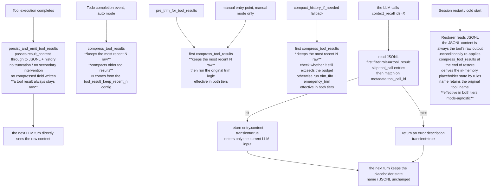

# ADR-032: Context ID-Based Compaction (Placeholder + On-Demand Recall)

**Status**: Under revision (a recall → compress → recall infinite loop was fixed on 2026-07-18)
**Date**: 2026-07-10 (original) / 2026-07-18 (revision)
**Deciders**: 大鱼
**Predecessors**:
- ADR-010 (Major simplification of the context compaction strategy)
- ADR-011 (Unified strategy for context summarization and distillation)
- ADR-014 (Loop module decomposition) — owns the location of `loop_context.rs`

**Revision log (2026-07-18)**: the original design broke the transient channel in one commit (C4a 849bc28). It introduced `placeholder_replacements`, which wrote the raw text returned by `context_recall` **back into history**, producing the following infinite loop:
```
context_recall(returns raw text) → written into history (placeholder replaced) → LLM sees raw content →
next turn history > threshold → compress_tool_results re-compacts → LLM sees the placeholder again →
calls context_recall again → ... infinite loop
```
This revision restores the C3a transient design. The event trigger is now **assistant long text only** (the todos-completion event trigger is no longer used), the **budget fallback no longer calls `compress_tool_results`** (it is a purely token-only safety net), and the default mode becomes **Manual** (the conservative route: nothing happens unless the user actively triggers it).

## Core Trigger Rules (2026-07-18 revised version)

| Scenario | Auto | Manual |
|---|---|---|
| Latest Assistant message > `soft_threshold_chars` (event trigger) | ✅ call `compress_tool_results_for_long_assistant` | ❌ |
| Frontend "tool compression" button / Gateway API / CLI | n/a (clickable in any mode) | n/a (clickable in any mode) |
| `trim_history_to_budget` (budget fallback) | ❌ **does not call compress_tool_results** | ❌ **does not call compress_tool_results** |
| `llm_based_compaction` fallback | ❌ **does not call compress_tool_results** | ❌ **does not call compress_tool_results** |
| `context_recall` tool call | does not write history (transient) | does not write history (transient) |

**Default mode**: `Manual` (2026-07-18 revision). This is the conservative default — event triggering only takes effect if the user explicitly switches to Auto in the Setup panel; otherwise **only the frontend button can compact**.

Detailed design below. The original 2026-07-10 design still has reference value, but all "trigger paths" have been recalibrated to the table above.

**Core principles (confirmed with 大鱼 on 2026-07-10, revised #5/#6/#7 on 2026-07-18)**:

1. **The tool is responsible for its own output size**: built-in tools control this through parameters / descriptions / internal truncation; MCP tool output control belongs to a separate ADR and is out of scope here.
2. **The compaction layer only does placeholder-ization**: it does not make truncation decisions on behalf of the tool, and does not care whether the tool has already truncated.
3. **`context_recall` is an exact by-id recall tool within a session**: it serves only the `tool_result` placeholder scenario handled by this ADR; other context-recall needs are covered by `memory_recall` (Grafeo semantic retrieval). **v1 is permanently tool_result only**; no extension interface is reserved.
4. **`truncate_large_messages` is replaced by placeholders for the same reason**: identical principle to the tool result placeholder — this function is deleted and everything goes through the placeholder path.
5. **The trigger mechanism has two tiers (auto / manual)** (**2026-07-18 revision**): in v1, triggering splits into `auto` and `manual`, with **default = `manual`** (the conservative route). In Auto mode, the **event trigger** fires only when the **latest Assistant message exceeds `soft_threshold_chars`**, at which point `compress_tool_results_for_long_assistant` is called. Manual mode **never auto-triggers** — it can only be triggered through the frontend button / Gateway API / CLI (the Manual entry point is valid in any mode). **`trim_history_to_budget` and the `llm_based_compaction` fallback are pure token-only safety nets — they never call `compress_tool_results`**: FIFO + `emergency_trim`, and they never let a tool result that the LLM has already seen in raw state be automatically compressed into a placeholder (this is the core of fix #2: preventing the budget fallback from indirectly triggering placeholder compaction, which would further fuel the infinite loop).
6. **Runtime compaction state is derived by rules; JSONL does not persist it** (confirmed with 大鱼 on 2026-07-10): placeholder-ization is **purely a runtime behaviour**. A JSONL `tool_result` entry stores only the tool's raw output plus the necessary protocol metadata (`tool_name` / `tool_call_id`); it **does not** add any runtime-derived fields (the previously designed `compressed: bool` is rejected). The idempotency and in-memory state of `compress_tool_results` are derived entirely from two rules:
   - **Length check**: a message with `content.len() ≤ threshold` is treated as "already compressed or inherently small" and skipped (the placeholder string is ≈ 120 chars, and any reasonable threshold ≥ 256 is far larger, so after the first compaction all Tool messages naturally fall into this branch)
   - **Prefix fallback**: a message starting with `"[Tool result compressed."` is explicitly skipped, preventing a second pass when a threshold is misconfigured below 100 chars

   **2026-07-18 revision addition — transient cannot be bypassed**: the return value of `context_recall` flows through the `pending_transient_tool_msgs` channel (see C3a) and **is never written to history or JSONL**. This is the core of fix #1: raw text recalled by `context_recall` only takes effect **within the current LLM call context**; on the next LLM call, history is still the compacted placeholder. This breaks the recall → compress → recall infinite loop: the original v1 design (C3a commit 0c95201) was already transient, but some intermediate commit (C4a commit 849bc28) incorrectly used `placeholder_replacements` to write recalled content **back** into history, breaking the transient invariant. The revised version restores the transient channel, and **the codebase no longer has any `placeholder_replacements` path** — `build_chat_request` performs no placeholder substitution, and `loop_tools.rs` decides the transient flag by tool name (`context_recall`) and then injects into `pending_transient_tool_msgs`, never writing to history.

   After a session restart, the restorer unconditionally calls `compress_tool_results(SOFT_THRESHOLD)` once; the in-memory state is derived by rules and **does not depend on any persisted field**. Single source of truth = JSONL content; changing a threshold / configuration / code carries zero migration cost.
7. **N is configurable, default 3** (2026-07-10 revision): the N in "keep the most recent N tool_results uncompressed" is a **configuration item, not a hardcoded constant**.
   - **Configuration field**: `tool_result_keep_recent_n: usize`, present in both `RuntimeConfigOverrides` and `agent_config.json`; **default = 3** (an empirical value matching the typical skill-phase tool call depth).
   - **Configuration layering**: `RuntimeConfigOverrides` takes priority → otherwise fall back to `agent_config.json` → otherwise fall back to the code default `3`.
   - **Uniformly applicable**: N is a global protection-window policy, and **all** trigger points (event trigger / manual entry point / restore) go through the same N rule — this guarantees the "recent raw context" the LLM sees at any moment is continuous and is not affected by the mode or the trigger path. **Note (2026-07-18 revision)**: the budget fallback (`trim_history_to_budget` + `llm_based_compaction` fallback) no longer calls `compress_tool_results`, so it no longer involves the N rule either.
   - **Value semantics**: `N = 0` is equivalent to "compact everything, no protection" (aligned with historical fallback behaviour); when N is too large, the LLM sees more raw text but the window savings shrink. The concrete value is tuned by the agent / user according to tool density and task phase granularity.
   - **Design intent**: N=3 is a ship-with-fluency default, **not** a thoroughly data-tuned optimum. Once exposed as a configuration item, users / agents can tune it against real workflows (code review / large-file analysis / multi-grep research) without upgrading the runtime.

**Elaboration**: the "Tool result daily folding (`fold_tool_results`)" strategy in ADR-010 §"Explicitly Abandoned Strategies" is reintroduced and upgraded by this ADR, from "programmatic truncation" to "placeholder + on-demand recall". The LLM summarization (80%) and emergency_trim (95%) fallback paths are unchanged.

### Design Reflection on Deleting the persist Trigger (confirmed with 大鱼 on 2026-07-10)

**Problems with the original design**:
- The persist trigger compressed the just-written tool result immediately after `persist_and_emit_tool_results` persisted it (N=1 slice)
- Programming agents produce high-frequency tool results (`content_search` / `file_read` / `shell`), the vast majority of which are > 2KB (the default threshold) — **all** of them would be compressed immediately
- Consequence: the LLM sees a placeholder on the next turn and **must** call `context_recall` to see the real content
- That turns every tool call into a two-step "call tool → see placeholder → call context_recall"
- This severely harms LLM reasoning efficiency and manufactures recall demand out of thin air

**Core reflection**:
- Core principle #2 defined by this ADR itself says "the compaction layer only does placeholder-ization; it does not make truncation decisions on behalf of the tool"
- The persist trigger violates the spirit of that principle — it makes the LLM's judgement on behalf of the LLM ("this tool result is unimportant, hide it now")
- But the tool result is at **that** moment the **most important** input for the LLM (the basis for the next reasoning step); compressing it immediately is stealing away exactly the context the LLM needs
- placeholder + recall is meant to be a **passive escape hatch** — compression happens only when the context really overflows or the semantic phase shifts, not on every single tool call

**Corrected data flow**:
```
Tool executes → written into history + JSONL (raw, never auto-compacted)
  ↓
LLM sees raw content → reasons directly
  ↓
[keeps accumulating until any of the following triggers]:
  - todos completed (auto only)         → compact **older** tool results, **keep the most recent N raw** (N from config, default 3)
  - budget fallback (two tiers)         → compact all over-threshold tool results, **keep the most recent N raw**
  - manual entry point (manual only)    → same as budget fallback, **keep the most recent N raw**
  - restore (two tiers, mode-agnostic)  → same as budget fallback, **keep the most recent N raw**
  - **uniformly applicable**: all trigger points go through the same N rule (core principle #7), guaranteeing the LLM sees a continuous "recent raw context"
```

**Update to the design principles**:
- The earlier claim "any agent automatically gets the optimization" must be corrected — optimization does not mean "compress every tool result", it means "compress reasonably at semantic boundaries and budget boundaries"
- What truly "arrives automatically" is the budget fallback (effective in both tiers); todo triggering is "smart but not aggressive" extra cleanup

---

## Decision Summary

**Core idea (2026-07-18 revision)**: for in-memory `ChatMessage` tool result content exceeding a threshold, replace it with a fixed placeholder (carrying a recallable id); the original content is retained in JSONL and is never lost. A new built-in `context_recall` tool lets the LLM actively fetch the raw text back by id. v1 processes only tool result messages; other large messages (User/Assistant long text) are covered by L2 LLM summarization (80%) and L3 emergency_trim (95%) — placeholder + recall is not a "cover every large message" mechanism, only one stage of context compaction. **The trigger mechanism has two tiers** (**default = Manual**, 2026-07-18 revision):
- **Auto**: if and only if the latest Assistant message exceeds `soft_threshold_chars`, automatically call `compress_tool_results_for_long_assistant` (event trigger). This is the **only** Auto-mode trigger point.
- **Manual**: no automatic path compacts anything. The user must actively trigger `compress_tool_results` through the **frontend button** / **Gateway API** / **CLI**. The budget fallback path **never calls** compress_tool_results (fix #2).
- The return value of `context_recall` flows through the `pending_transient_tool_msgs` channel and **is never written into history** (fix #1, restoring the C3a transient design). This is the key invariant that breaks the recall → compress → recall infinite loop.

| Commit | Scope | Risk |
|--------|------|------|
| **C1** | `HistoryManager::compress_tool_results()` tool_result-only function + placeholder simplification + **delete `truncate_large_messages`** + replace all call sites | Medium (the deleted function was called from multiple paths) |
| **C2** | `persist_and_emit_tool_results()` simplified to pass through tool output (only writes the existing `tool_name` / `tool_call_id`; this ADR adds no metadata field) | Low |
| **C3** | transient channel (C3a) + `context_recall` tool registration (C3b, independently revertible) | Medium |
| **C4** | Trigger points (auto / manual tier split + todos event trigger, **no persist trigger** + manual entry point API/UI) + Restorer compatibility + doc sync | Medium (touches the main loop event stream + a new channel + UI wiring) |

**Key decisions**:

| Decision | Rationale |
|------|------|
| **Separation of duties**: the tool controls its own output size + the compaction layer only creates placeholders + the LLM autonomously decides whether to recall | Single responsibility; removes the ambiguity of "who is responsible for truncation" |
| **Use `tool_call_id` for the external surface** (placeholder / `context_recall` parameter) (v1 permanently applies to tool_result only) | It is the LLM protocol-layer stable id (Anthropic `toolu_xxx`, OpenAI `call_xxx`); the LLM back-references directly from the tool_call it issued itself; the in-memory `ChatMessage.tool_call_id` field is readable at compaction time; this id system serves tool_result only and is not bound to other roles |
| **Use `entry.id` (UUID v4) as the primary key inside JSONL** | Stable across providers; decoupled from the protocol-layer id; used by the restorer / debugging tools |
| **`context_recall` internally indexes by `tool_call_id` to `entry.id`** | The LLM never touches the entry id; when scanning JSONL, a hit on `metadata.tool_call_id` returns `entry.content` |
| Placeholder substitution acts on in-memory state, and **does not modify** JSONL content | JSONL is the source of truth for audit / replay |
| **JSONL does not persist compaction state** (no new runtime-derived fields such as `compressed` / `partial` / `original_size_chars`) | Single source of truth = JSONL content; runtime state (including "is it already compacted") is derived by `compress_tool_results` rules + the current `threshold`; the restorer re-applies unconditionally; threshold / rule / code changes carry zero migration cost; symmetric with the L2 LLM summarization / L3 emergency_trim persistence strategy |
| The `context_recall` return value flows through the transient channel and **does not enter** history | Otherwise a single recall fills the window, triggering compaction on the very next turn — a vicious cycle |
| **Soft threshold 2 KB (configurable)** | A single tier; there is no longer any "hard threshold truncation" logic (that is the tool layer's responsibility) |
| **No persist trigger** (deleted 2026-07-10) + semantic-boundary event trigger (todos completed) + budget fallback — three layers | A tool result **always keeps its raw form until a natural compaction moment**: raw state gives the LLM complete context for current reasoning; when todos complete, **older** tool_results are compacted to free the window (N keep window, N from config, default 3); the budget fallback is the last line of defence, effective in both tiers to avoid deadlock; **all** trigger points (event / budget / restore / manual) uniformly apply the same N rule (core principle #7) |
| **`context_recall` supports batch ids (array parameter)** | Reduces round-trips; one recall of multiple items amortizes the overhead |
| The placeholder template is the minimal English version | The LLM's context is precious; clear semantics suffice, no redundant information |
| **`truncate_large_messages` is deleted** | Identical principle to the placeholder; everything goes through the new path |
| **Triggering splits into two tiers** (auto / manual), **default = manual (2026-07-18 revision)** | Conservative route: manual is the default so ordinary users have zero side effects; auto is a productivity option for advanced users. In Manual mode, the `trim_history_to_budget` / `llm_based_compaction` fallbacks both **do not** call `compress_tool_results` (by default only manual action can compact, and the budget fallback does not touch tool results in order to avoid triggering the infinite loop); in Auto mode, only the assistant-long-message trigger path is invoked |
| **N is configurable** (2026-07-10 revision, narrowed 2026-07-18) | `tool_result_keep_recent_n` configuration item, three-level fallback: RuntimeConfigOverrides → agent_config → code default (3); **all paths that call `compress_tool_results`** (assistant long-message trigger / manual entry point / restore) uniformly apply the same N. The budget fallback path no longer calls `compress_tool_results` at all, so it does not involve N | Adapts to different agent workflows (skill-dense calls / sparse single-step queries / multi-file parallel reads); N is a default value rather than hardcoded; different sessions can be configured independently without upgrading the runtime |
| **The manual entry point is clickable in both tiers (2026-07-18 revision)** | In auto mode, a manual click does not go through the assistant long-message trigger path but calls `compress_tool_results` directly — an explicit user request outranks auto mode's default behaviour; overriding auto mode in Manual mode is reasonable. In Manual mode, the manual click is the only legal trigger point |

---

## Impact Scope

### C1 (core: `compress_tool_results` + delete `truncate_large_messages`)

**Added**:
- `core/acowork-runtime/src/agent/history.rs`:
  - `pub fn compress_tool_results(messages: &mut [ChatMessage], soft_threshold_chars: usize)` — scans messages, and for items with `MessageRole::Tool` (v1 restriction) whose `content.len() > soft_threshold_chars`, substitutes a placeholder string; returns the number of replacements.
  - Placeholder string format: `"[Tool result compressed. Call context_recall(id=\"<tool_call_id>\") to retrieve the full content.]"` (≈ 90 chars / ~22 tokens)
  - `pub fn recalibrate_tokens(&mut self)` — O(N) recomputation of `current_tokens`, called once after compaction.

**Deleted**:
- The entire `truncate_large_messages` method at `core/acowork-runtime/src/agent/history.rs:481-523`.
- The three call sites below are deleted (replaced by `compress_tool_results` or an equivalent):
  - `core/acowork-runtime/src/agent/loop_context.rs:198` (inside `trim_history_to_budget`)
  - `core/acowork-runtime/src/agent/loop_context.rs:430` (compact fallback fallback branch)
  - `core/acowork-runtime/src/agent/loop_context.rs:956` (if present / exact line number pending review confirmation)

**Naming rationale**:
- `compress_tool_results` honestly expresses the v1 scope: it only compacts tool result messages (`MessageRole::Tool`).
- It contrasts with the deleted `truncate_large_messages`: it **does not truncate**, it **only** substitutes a placeholder.
- **No extension interface is reserved**: if User/Assistant long text must be supported in the future, open a **new ADR** (tentatively ADR-033) to design it specifically — that is not simply renaming a function; it requires structural changes such as protocol-layer stable message ids and cross-role placeholder templates, which exceed this ADR's scope.

**Constraints**:
- **Pure function**: it does not modify `current_tokens` computation; the caller calls `recalibrate_tokens()` after substitution.
- **Does not touch JSONL**: the in-memory substitution only affects `ChatMessage`; JSONL content is untouched.
- **Idempotent**: via a dual check of content length + prefix, see "Implementation Notes" below. It **does not** write the `name` field — `name` always retains the tool's original name.

**Unit test coverage**:
- Soft threshold boundary (< / = / > three cases)
- Non-tool messages (User / Assistant / System) skipped
- Already-compacted entries (content ≤ threshold or prefix hit) are idempotently skipped
- The placeholder contains the correct `tool_call_id` and does not contain the deleted original-size field
- The `name` field retains the original tool_name and is not rewritten by the compaction function
- Token count is correct after calling `recalibrate_tokens`

### C2 (`persist_and_emit_tool_results` simplification)

**Modified**:
- `core/acowork-runtime/src/agent/loop_tools.rs:849-865`:
  - **Delete** the hard-threshold split (truncation logic).
  - **Delete** the three-tier judgement (originally soft / hard two tiers + splitting).
  - Simplified to: **directly pass through** the tool-produced `result_content` into JSONL, with metadata containing only `tool_name` / `tool_call_id` (two **existing** fields; this ADR adds no field).
  - **No** new `RuntimeConfigOverrides` field (delete the original `tool_result_hard_threshold_chars`, keep `tool_result_soft_threshold_chars` solely for the compaction layer).
- Delete the `RuntimeConfigOverrides.tool_result_hard_threshold_chars` field (it was only reserved in the C1 configuration interface; C2 no longer needs it).

**JSONL metadata fields** (`ConversationEntry.metadata` simplification):
- **This ADR adds no metadata field whatsoever.** Runtime compaction state is fully derived by rules; the persistence layer only carries the tool's raw output and the necessary protocol metadata (see core principle #6).
- **Deleted**: `partial: bool` — the compaction layer no longer performs truncation.
- **Deleted**: `original_size_chars: u64` — same reason.
- **Not introduced**: `compressed: bool` — confirmed with 大鱼 on 2026-07-10 that runtime state must not pollute the persistence layer; on restore, the in-memory state is re-derived by `compress_tool_results(SOFT_THRESHOLD)`.

Backward compatibility: old JSONL without any new fields reads normally; the new JSONL schema is exactly identical to the old one, so no migration is required.

**Unit test coverage**:
- Only the two fields `tool_name` / `tool_call_id` are written, with no other metadata
- Old entries (carrying no fields at all) restore normally
- Tool results are passed through directly, with no secondary processing
- **No** `compressed` / `partial` / `original_size_chars` field exists (grep verifies the schema has narrowed)

#### C2b (enhancing `format_messages` to recognize compaction placeholders + emit a tool-name label)

After C2 finishes the persist simplification, `compact_via_llm` may encounter Tool messages already compacted by `compress_tool_results` when reading history (content becomes a ~120-char placeholder). `format_messages` is enhanced so that it:

**Concrete changes**:
- The `format_messages` function in `core/acowork-runtime/src/episode_distill.rs`:
  - Detects whether a Tool message's content starts with `[Tool result compressed.` (sharing the `COMPRESSED_TOOL_PLACEHOLDER_PREFIX` constant)
  - If it is a compacted message and `name` exists, emit `[Tool(name={tool_name}, id={tool_call_id})]: <placeholder>` — the LLM learns which tool was called, that the result was compacted, and that it can be recalled via context_recall
  - If compacted but `name` is missing, emit only `[Tool]: <placeholder>` (fallback behaviour)
  - If not compacted but `name` exists, emit `[Tool({tool_name})]: <content>` (so the LLM can distinguish outputs of different tools)
  - If an Assistant message has `name == "compaction_summary"` (sharing the `COMPACTION_SUMMARY_NAME` constant), emit `[CompactionSummary]: <content>` — the LLM knows this is the product of the previous compaction, not a new conversation turn

**Impact**:
- Only affects the prompt text layout of the two entry points `compact_via_llm` + `compact_full_context`; it does not affect runtime behaviour
- It does not change the placeholder content itself, only how the role label is presented in the prompt
- 5 new unit tests cover: basic layout / CompactionSummary / compacted without name / compacted with name / ordinary Tool message with name

**Naming constants**:
- `COMPRESSED_TOOL_PLACEHOLDER_PREFIX` — defined in `history.rs`, referenced by `episode_distill.rs`, guaranteeing a consistent prefix on both ends
- `COMPACTION_SUMMARY_NAME` — likewise defined in `history.rs`, unifying the marker check in `replace_middle_with_summary` and `format_messages`

### C3 (transient-return channel + `context_recall` tool)

#### C3a (transient channel + main loop support, shipped first)

**Design decision**: rather than adding a `transient` field to the `ToolResult` struct (which would intrude on 100+ construction sites), the decision is made by tool name inside `execute_single_tool` (currently only `context_recall`). Adding a new transient tool only requires adding the corresponding name to the name-check branch in `execute_single_tool`.

**Added**:
- `core/acowork-runtime/src/agent/loop_.rs`:
  - New `AgentLoop` field `pending_transient_tool_msgs: Vec<ChatMessage>`.
  - In `execute_single_iteration`, at the tool result loop:
    ```rust
    // pseudocode
    for result in tool_results {
        if result.transient {
            // do not append to history, do not append_message_to_conversation
            // inject into the extra slot of the next build_chat_request
            // name field: the real name of the current transient tool ("context_recall" here),
            // not the deleted "context_compressed" idempotency marker — on a ChatMessage
            // the name field always carries the protocol semantics of "the tool that
            // produced this message".
            let msg = ChatMessage {
                role: MessageRole::Tool,
                content: result.content.clone(),
                tool_call_id: pending_transient_tool_call_id(r),
                name: Some("context_recall".to_string()),
                ..Default::default()
            };
            self.pending_transient_tool_msgs.push(msg);
        } else {
            history.append(...);
            conversation.append_message(...);
        }
    }
    ```
  - Appended at the end of `build_chat_request`: `chat_request.messages.extend(self.pending_transient_tool_msgs.drain(..));`

**Why ship C3a first**:
- C3a is a structural change (transient channel + main loop coordination); the risk is concentrated in the main loop review.
- C3a builds and tests independently, and does not depend on the `context_recall` tool implementation.
- If C3b (the context_recall tool) does not pass review, C3a can still be released independently, with C3b added later.

**Unit test coverage (C3a)**:
- Ordinary tool results take the original path (written to history + JSONL).
- Transient tool results are not written to history, not written to JSONL, and are injected into `pending_transient_tool_msgs`.
- `pending_transient_tool_msgs` is cleared after `build_chat_request`.
- Transient messages do not reappear after a session restart.

#### C3b (`ContextRecallTool` registration, shipped later)

**Added**:
- `core/acowork-runtime/src/tools/builtin/context_recall.rs`:
  - `pub struct ContextRecallTool { session_file_path: PathBuf }`
  - `ToolSpec::name = "context_recall"`, with the description noting: "Retrieve the full content of tool results that were compressed in this session. Provide the `tool_call_id` values shown in compressed markers." + JSON schema: `ids: string[]` (required, 1-20 entries)
  - `execute()` returns `ToolResult { transient: true, .. }` (the critical part).
- `core/acowork-runtime/src/tools/builtin/mod.rs`: register `context_recall` in `all_builtin_tools()` (enabled by default, permission tag `context:read`).

**Key design**:
- **The parameter is `tool_call_id`; internally it indexes by `metadata.tool_call_id`**: when scanning JSONL it **first** filters `entry["role"] == "tool_result"` (skipping entries with `role: "tool_call"` in JSONL — their content is the arguments, not the output, and they do not participate in recall; see §"Two schema layers and mapping"), then matches `metadata.tool_call_id == param`, and returns `entry.content` on a hit. The JSONL `entry.id` (UUID) serves as the internal primary key and is never exposed to the LLM.
- **A miss does not fail the whole call**: a single missing id only errors on that id; the overall result is `ok: true`, and the LLM can continue with the other results.
- **No truncation judgement**: it no longer cares whether the content is "partial". The tool is responsible for its own output size, and recall returns the tool's original content.

**Unit test coverage (C3b)**:
- Hit / miss / partial hit / exceeding the 20-id cap
- JSONL contains no `context_recall` tool_call / tool_result rows (because it is transient)
- Handling code for `partial=true` **does not exist** (verifying clean removal)

### C4 (trigger points split by tier + new manual entry point + Restorer + docs)

C4 is the main battleground of this ADR's trigger mechanism. **Core change**: trigger points are grouped into auto / manual tiers; a new manual entry point is added (frontend button + Gateway API).

#### Trigger point matrix (2026-07-18 revision: by tier)

| Trigger point | auto mode | manual mode | Behaviour |
|---|---|---|---|
| ~~`persist_and_emit_tool_results` compresses immediately after persisting~~ **[DELETED]** | ❌ | ❌ | ~~call `compress_tool_results` after every tool_result is persisted~~ — **deletion reason see the core principle reflection**: compressing a tool result immediately steals away the input that the LLM's current reasoning depends on |
| **Latest Assistant message length > `soft_threshold_chars`** (**new in 2026-07-18**) | ✅ | ❌ | Calls `HistoryManager::compress_tool_results_for_long_assistant`; the watchdog guard checks the latest Assistant message length and only calls `compress_tool_results` when it is **exceeded**. Manual mode skips this path |
| `trim_history_to_budget` (budget fallback) **[2026-07-18 revision: does not call compress_tool_results]** | ❌ **no call** | ❌ **no call** | **Pure token-only safety net**: calls `trim_fifo()` + `emergency_trim()`. It **never** calls `compress_tool_results` (fix #2). Calling it would mean that as soon as the budget fallback succeeds it **silently** replaces raw tool results in history with placeholders, thereby manufacturing `context_recall` demand for no reason; across repeated alternations it can also let some historical tool results be repeatedly compacted and de-compacted — one of the potential triggers of the infinite loop |
| `compact_history_if_needed` fallback **after `llm_based_compaction` fails** **[2026-07-18 revision: does not call compress_tool_results]** | ❌ **no call** | ❌ **no call** | After LLM summarization fails, it goes to `replace_middle_with_summary` or `emergency_trim`; it **never** calls `compress_tool_results` (fix #2). Same reason as above |
| Frontend "tool compression" button + Gateway API + CLI | ✅ available | ✅ available | Actively calls `compress_tool_results`, **keeping the most recent N raw uncompressed** (N from config, default 3) |
| Frontend "summary compression" button + Gateway API + CLI | ✅ available | ✅ available | Actively calls `compact_via_llm` (**L2 scope; this ADR only wires it up**) |
| **CLI subcommand** `acowork compress tool_result --session <id>` / `acowork compress summary --session <id>` | ✅ available | ✅ available | Same as the Gateway API; the CLI injects via the same channel path through IPC (Unix Socket / Named Pipe) |
| **restore** (after a session restart / cold start) | ✅ | ✅ | `compress_tool_results(SOFT_THRESHOLD)` compacts everything, **mode-agnostic** (see the rationale for modification 8); **keeps the most recent N raw** |

**Key boundaries (after the 2026-07-18 revision)**:
- The **only** compaction entry point in Manual mode is **manual triggering** (frontend button / Gateway API / CLI); the budget fallback does not compact either
- The **only** automatic trigger point in Auto mode is the **assistant long message**; the budget fallback also **does not** call `compress_tool_results`
- L2 summarization (80%) is independent of this ADR and is **not affected** by the mode
- The event trigger **only** clears **older** tool_results, **keeping the most recent N raw uncompressed** (N from the `tool_result_keep_recent_n` config, default 3) — N protects the recent context that the LLM's current reasoning depends on
- **N is a global protection-window policy, and every path that calls `compress_tool_results` goes through the same N rule** (see core principle #7)
- **The raw text returned by `context_recall` does not enter history** (fix #1 / the C3a transient invariant) — it does not depend on the mode; in any mode it does not enter
- **The budget fallback can never call `compress_tool_results`** (fix #2): this is an extra safety net preventing the propagation of the recall → compress → recall infinite loop

#### Modification 1: the fallback path of `compact_history_if_needed` (**2026-07-18 revision: never calls compress_tool_results**)

- The fallback branch when `llm_based_compaction` fails in `core/acowork-runtime/src/agent/loop_context.rs`:
  ```rust
  Err(e) => {
      // 2026-07-18 revision (fix #2): after LLM summarization fails we **no longer** call compress_tool_results.
      // Previously this called compress_tool_results as a zero-cost optimization, but practice showed
      //  that it would be triggered repeatedly and rapidly by the budget gate — alternating, compacting,
      //  the LLM may call context_recall to fetch the raw text, the raw text enters history and exceeds
      //  the threshold again, and gets compacted again — one of the propagation paths of the recall →
      //  compress → recall infinite loop.
      //
      // New behaviour: only the L2 supplementary path (replace_middle_with_summary) or the L3 safety net
      // (emergency_trim) run. tool_result content is never touched.
      self.session.history.replace_middle_with_summary(...)?;
      // If it still exceeds the budget after summarization, run emergency_trim
      if self.session.history.token_count() > budget {
          self.session.history.emergency_trim();
      }
      // Note: compress_tool_results is not called here.
  }
  ```
- **Completely unaffected by the mode** — neither tier compacts, and it does not depend on the mode setting. `compress_tool_results` is exclusive to the event-triggered path.

#### Modification 2: the `pre_trim_for_tool_results` path (**deleted 2026-07-18**)

- Original design: `pre_trim_for_tool_results` prefixed `compress_tool_results` + `recalibrate_tokens`, packaged as `pre_trim_and_compress`.
- **The compaction prefix is deleted after revision**: when the budget gate limit is hit, tool_results are no longer compacted, consistent with modification 1. `trim_history_to_budget` is itself already purely token-only (see modification 3).
- **Merged into modification 3**: a single semantics of "trim_history_to_budget is a purely token-only safety net" serves as the only budget-fallback semantics.

#### Modification 3: the purely token-only `trim_history_to_budget` path (**2026-07-18 revision**)

- `trim_history_to_budget` in `core/acowork-runtime/src/agent/loop_context.rs`:
  ```rust
  pub(crate) fn trim_history_to_budget(&mut self, model_name: &str) {
      let budget = self.context_trim_budget(model_name);
      self.session.history.set_max_tokens(budget);
      self.session.history.trim_fifo();
      if self.session.history.token_count() > budget {
          self.session.history.emergency_trim();
      }
      // 2026-07-18 revision (fix #2): compress_tool_results is **not** called here.
      // The budget fallback is a pure token-protection path; compaction belongs to the
      // event-triggered path. The two must not be mixed, or the budget gate will
      // indirectly trigger the infinite loop.
  }
  ```
- **Delete** the original `compress_tool_results(SOFT_THRESHOLD)` call inside this method body.
- **Delete** the original `recalibrate_tokens()` call inside this method body (it is only called in conjunction with `compress_tool_results`).
- **No** mode judgement needed — both tiers skip placeholder compaction in this path.

#### Modification 4: event trigger (**auto mode only**) — the assistant long-message trigger point (**redefined 2026-07-18**)

**Reason for the revision (2026-07-18)**: the originally designed todos-completion event trigger was deleted. The reason is that the todos system itself is still not mature enough, the event trigger mechanism is hard to evaluate, **and it causes the three problems below**:
1. Frequent todo alternating indirectly triggers multiple compactions — the LLM cannot predict when the "next phase begins"
2. The todos state machine is tightly coupled to the trigger path, hurting code readability / testability
3. **It may create one of the infinite-loop propagation paths**: the LLM writes a long assistant text, a previous todo is completed, compaction fires, and the LLM starts to assume it needs `context_recall` for subsequent steps

Redefined design: the assistant text itself is the best "when to compact" signal — when the assistant has written more than 2KB of text explaining "**this research phase is done, a different context scenario is needed next**", compacting older tool_results is almost certainly safe (the LLM's next reasoning step will not look back at the raw tool results from the previous turns).

**Concrete implementation**:
- `core/acowork-runtime/src/agent/loop_session.rs`:
  - After the assistant turn is committed (a `ChatMessage::assistant(content)` has been created and appended to history):
  ```rust
  // ADR-032 revision (2026-07-18, fix #3): in Auto mode, assistant long text triggers automatic compaction.
  // This is v1's only automatic trigger path, replacing the original todos-completion event trigger.
  if self.event_compression_enabled() {
      let n = self.core.tool_result_keep_recent_n();
      let soft_threshold = self.core.tool_result_soft_threshold_chars();
      // The watchdog guard is embedded inside HistoryManager::compress_tool_results_for_long_assistant,
      // and compress_tool_results is only called when the latest Assistant message exceeds soft_threshold_chars.
      let compressed = self.session.history
          .compress_tool_results_for_long_assistant(soft_threshold, n as usize);
      if compressed > 0 {
          self.session.history.recalibrate_tokens();
          tracing::info!(compressed, content_len = content.len(),
              "Auto-compressed after assistant long text");
      }
  }
  ```
  - `event_compression_enabled()` returns true if and only if compression_mode == Auto.
  - In Manual mode this path is **never entered**, and no compaction call is made at all.

- `core/acowork-runtime/src/agent/history.rs`:
  - Adds `pub fn compress_tool_results_for_long_assistant(soft_threshold_chars, keep_recent_n) -> usize`
  - Implements the watchdog guard: it checks the `content.len()` of the **last Assistant message** in history:
    - **`> soft_threshold_chars`** → calls `compress_tool_results(soft_threshold_chars, keep_recent_n)` and returns the number of compactions.
    - **`<= soft_threshold_chars`** → returns `0`, trace log "trigger skipped", and **does not touch history at all**.
    - **No Assistant message in history** → returns `0` (no-op).
  - This method is a mode-agnostic pure function; it only asks "is the length sufficient", never about the mode. The mode judgement is done at the call site.
- Why the guard lives in `HistoryManager` rather than at the call site:
  - There may be multiple call sites in the future (loop_session.rs / debug panel / future post-recall state quantification), so the watchdog logic is centralized in one place
  - Unit tests can independently verify guard correctness, without depending on the AgentLoop call context
  - Cleaner semantics: "compaction is needed" is an inherent property of history, not merely something that happens after an assistant turn

**Difference from the original todos trigger**:

| Dimension | Original todos event trigger | Redefined assistant long message |
|---|---|---|
| Trigger timing | Driven by the todo state machine (many code dependencies) | After the assistant turn (the driving system mainly depends on the assistant turn) |
| Semantic clarity | "Task phase transition" is vague | "The LLM has just written over-threshold text → older context may need compacting" is high |
| Implementation complexity | Needs `todo_write` to send events + the main loop to receive a channel | Only needs an if branch after the existing assistant append |
| Possible infinite loop | Cannot be fully ruled out | Almost impossible: the same assistant text is checked only once; the next trigger requires the assistant to again far exceed the threshold |

**Unit test coverage (modification 4)**:
- In Auto mode, assistant turn > soft_threshold → `compress_tool_results` is called, older tool_results become placeholders, the most recent N stay raw
- In Auto mode, assistant turn <= soft_threshold → `compress_tool_results` is **not** called, history is left untouched
- In Auto mode, no Assistant message in history → `compress_tool_results` is **not** called (no-op)
- In Manual mode, no matter how long the assistant text is → the entire if branch is **not entered**, *no* compaction happens
- Multiple N values: 0 / 1 / 3 / 10 — keep the most recent N uncompressed

#### ~~Modification 5: event trigger (**auto mode only**) — compress immediately after `persist_and_emit_tool_results` persists~~ **[DELETED]**

**Deletion reason (confirmed with 大鱼 on 2026-07-10)**:
- The persist trigger compressed every tool result immediately upon persistence, which is equivalent to instantly stealing away the raw input that the LLM's current reasoning depends on the most
- Consequence: every tool call becomes a two-step "call tool → see placeholder → call context_recall", doubling the LLM's reasoning cost
- Programming agents produce high-frequency tool results (`content_search` / `file_read` / `shell`), the vast majority exceeding 2KB, so **all** of them would be compressed immediately
- It violates the design intent of "compaction is a passive escape hatch, not an active cleanup"
- Replacement mechanism: **no persist trigger**; a tool result always stays in history in raw state until a natural compaction moment (todos completed / budget fallback / manual entry point / restore)
- Detailed argument see "Core principle #5" and the "Design Reflection on Deleting the persist Trigger" section

**Impact on code**:
- `core/acowork-runtime/src/agent/loop_tools.rs:849-865` no longer appends any mode judgement or automatic compaction call
- The C4 code change summary table drops the "+15 LOC for persist_and_emit_tool_results mode judgement" row
- The unit test coverage table drops the "compress immediately after persist" row

#### Modification 7: manual entry point (**actively triggerable in both tiers**, but only Manual mode makes it the default sole path)

**Problem**: when the Gateway API receives a "compress now" request, the main loop may be running (holding the history mutex). Triggering it synchronously from outside would break the transient channel and in-progress state.

**Solution**: inject the event through an `mpsc::channel`, and have the main loop handle it at a suitable "tick".

**Why "clickable in both tiers" (2026-07-18 revision)**: the user pointed out that "in manual mode, only the frontend issuing the compress command triggers it". That means in manual mode the manual entry point is the only trigger point; but in auto mode the user may also need to "compact right now", for instance because they only noticed after compacting that the assistant text was still not long enough, or for some other reason. So the manual entry point can be initiated in any mode, but the behaviour after initiation differs:
- **Manually clicking in Auto mode**: actively calls `compress_tool_results`, and it does not "violate the auto mode design intent" — the intent of auto mode is "compact automatically", and a manual click is "the user's request outranks the automatic default"; overriding auto mode in this direction is reasonable.
- **Manually clicking in Manual mode**: the only legal trigger point of manual mode.

`AgentLoop` additions:
```rust
pub struct AgentLoop {
    // ... existing fields
    /// Manual compression requests from external sources (Gateway API / CLI).
    /// Drained at the start of every iteration.
    manual_compress_rx: mpsc::Receiver<ManualCompressRequest>,
}

#[derive(Debug, Clone)]
pub enum ManualCompressRequest {
    /// Corresponds to the frontend "tool compression" button: call compress_tool_results
    /// to compact all over-threshold tool_results.
    ToolResult,
    /// Corresponds to the frontend "summary compression" button: call compact_via_llm
    /// to trigger L2 summarization (this ADR only wires it up).
    Summary,
}
```

**Drain before every main loop turn** (at the entry of `execute_single_iteration` in `loop_.rs`):
```rust
async fn execute_single_iteration(&mut self) -> Result<()> {
    // 1) Drain manual compression requests (clickable in both tiers)
    while let Ok(req) = self.manual_compress_rx.try_recv() {
        match req {
            ManualCompressRequest::ToolResult => {
                // ADR-032: the manual entry point also goes through the same N rule — protecting
                // the recent N raw entries that the LLM's current reasoning depends on
                // (uniform applicability principle, see core principle #7)
                let keep_n = self.config.tool_result_keep_recent_n();
                let soft_threshold = self.config.tool_result_soft_threshold_chars();
                let n = self.session.history.compress_tool_results(soft_threshold, keep_n);
                self.session.history.recalibrate_tokens();
                tracing::info!(compressed = n, keep_recent_n = keep_n,
                    "Manual tool_result compression");
            }
            ManualCompressRequest::Summary => {
                // L2 path; not in this ADR's scope, wired up only
                self.session.history.compact_via_llm(...).await?;
            }
        }
    }

    // 2) Normal main loop logic
    // ...
}
```

**Gateway HTTP API** (`core/acowork-gateway/src/http/`):
```
POST /api/v1/sessions/{session_id}/compress/tool_result
POST /api/v1/sessions/{session_id}/compress/summary
→ find the AgentLoop corresponding to the session → manual_compress_tx.send(...)
→ 200 OK (executed asynchronously, does not wait for the result)
```

**Desktop App UI** (`apps/acowork-desktop/`):
- **Setup panel** (right side): adds a "Tool result compression" option (auto / manual radio), reading / writing `agent_config.tool_result_compression_mode`. **2026-07-18 revision**: "manual" is selected by default.
- **Input box usage pop-out menu**: adds **two independent buttons** — "Tool results" / "Summary".
- Button click → Gateway HTTP API → asynchronous execution → after completion the frontend polls `GET /api/v1/sessions/{id}/status` to report the number of compactions

**CLI subcommands** (`apps/cli/`, new):
- `acowork compress tool_result --session <session_id>`: triggers compress_tool_results
- `acowork compress summary --session <session_id>`: triggers compact_via_llm
- Injects `manual_compress_tx` through the Gateway IPC (Unix Socket / Named Pipe, the same set as the existing AgentLoop IPC), taking the **exact same** channel path as the Gateway API
- Output: asynchronous execution returns `OK` immediately and runs in the background; the frontend / CLI does not block
- Status query: `acowork status --session <id>` → returns the number of compactions and similar figures

**Not in v1 scope**:
- The manual entry point supporting "compressing a specified range / id list" — left for the future
- The manual entry point supporting "returning a preview of the compacted content" — left for the future

#### Modification 8: Restorer compatibility (rule-derived, no persisted marker; mode-agnostic)
- `core/acowork-runtime/src/agent/session/restorer.rs:286-318`:
  - **Delete** the original "read the `metadata.compressed` field" logic — this ADR does not persist that field (see core principle #6).
  - **Delete** the original "use `name = Some("context_compressed")` as a runtime idempotency marker for `compress_tool_results`" — the idempotency of `compress_tool_results` is now a dual check of content length + prefix (see module A), no longer relying on the `name` field.
  - **Add**: an unconditional call to `compress_tool_results(SOFT_THRESHOLD)` + `recalibrate_tokens()` at the end of the restore flow, deriving the in-memory compaction state by rules. Calling it once after `history` restore is enough — the O(N) scan is constant-time per content length check.
  - **The mode-agnostic invariant (strengthened 2026-07-18)**: regardless of Auto or Manual, `compress_tool_results` is called once after restore. The reason: JSONL content is always the raw output the tool gave, and restore must re-compact according to the current threshold; different modes must never see "different" in-memory states. This is structural initialization logic of the same kind as the budget fallback — the mode governs "when to compact proactively", while restore is "passive re-initialization"; the two are of a different nature.
- Old JSONL entries (no metadata fields / any schema) restore normally: the current rules treat all entries alike, so no schema compatibility branch is needed.
- The trigger tier (auto / manual) is **not** written to JSONL — the mode is session configuration, not persisted data.

**New restore pseudocode**:

```rust
// End of core/acowork-runtime/src/agent/session/restorer.rs
async fn finalize_restore(&mut self) -> Result<()> {
    // ... the existing restore flow ...

    // ADR-032: re-apply the runtime compaction rules, deriving the in-memory placeholder state
    // (self-describing: content.length judgement is naturally idempotent)
    // Uniformly applies the same N rule as the event trigger / budget fallback / manual entry point
    // (core principle #7): on restore, the most recent N are also kept raw and are not compacted.
    let keep_n = self.config.tool_result_keep_recent_n();
    let mut older = self.history.tool_results_excluding_recent(keep_n);
    let n = self.history.compress_tool_results(&mut older, SOFT_THRESHOLD);
    apply_compressed_back(&mut self.history, older);
    self.history.recalibrate_tokens();
    if n > 0 {
        tracing::debug!(compressed = n, keep_recent_n = keep_n,
            "Restore: re-applied tool result compression (preserving recent N)");
    }
    Ok(())
}
```

**Design benefits**:
- The restore path has **zero** conditional branches: it does not read `metadata.compressed`, does not write `name`, does not write content — it only calls one side-effect-free pure function.
- Threshold configuration changes, code rule upgrades, and old JSONL shape compatibility all carry zero migration cost, and the rules adapt automatically.
- Fully symmetric with L2 LLM summarization / L3 emergency_trim at the persistence-layer strategy (both "do not store runtime-derived state").

**Why restore is not affected by `CompressionMode`** (distinguishing it from the mode judgement at event trigger points):

| Operation type | Affected by the mode? | Reason |
|---|---|---|
| **Event trigger** (todos completed) | ✅ auto only | "When to trigger proactively" is trigger policy; the mode governs this layer |
| **Manual entry point** (frontend button / Gateway API / CLI subcommand) | ✅ manual only | A user-initiated action; the entry point only exists in manual mode |
| **Budget fallback** (`compact_history_if_needed` fallback / `pre_trim_and_compress`) | ❌ effective in both tiers | A structural safety net; the user must never deadlock just because they forgot to click the button |
| **restore** (re-apply at the end of `finalize_restore`) | ❌ mode-agnostic | Structural initialization (detailed below) |

**Key architectural principle**: the `compress_tool_results` function itself is a mode-agnostic pure function — the mode governs "when to call this function / how large a slice to pass in", not "whether the function is allowed to execute".

**Concrete reasons for treating restore as structural initialization**:
1. **Isomorphic to the budget fallback**: both are "bring history back to a controllable state under some boundary condition", both take the full history as a parameter, and both are effective in both tiers — restore and fallback belong to the same category (mode-agnostic + full sweep).
2. **Manual mode must not disable compaction**: if restore skipped compaction in manual mode, history would start out blown up by a pile of raw tool results and the user would **have** to click the button manually to recover — which contradicts the design intent of manual mode ("control the trigger timing, not disable compaction").
3. **JSONL is always in raw state**: regardless of whether it was compacted at runtime before, the JSONL content is always the raw output the tool gave. Restore must re-derive it according to the current threshold, and **should not** produce different derivation results because of the mode — otherwise switching the mode would change "what in-memory state is legal".
4. **The N rule applies to restore as well** (2026-07-10 revision): core principle #7 requires every trigger point to uniformly apply the same N rule — restore is no exception. On restore, the most recent N raw entries are kept according to the current `tool_result_keep_recent_n` configuration value, and a "full sweep" is **not** performed. The original understanding of "restore reconstructs the complete state" is correct — what is reconstructed is the complete history structure, but the "compact or not compact" policy is **exactly the same** as the event trigger / budget fallback / manual entry point, guaranteeing that the recent raw context the LLM sees is continuous across a session restart.

**In short**: the mode governs "when to do this proactively", while restore is "this must be done". The former is policy, the latter is initialization. The two are of a different nature and must not share the same lock.

#### Modification 9: doc sync
- `docs/design/zh/15-conversation-persistence.md`:
  - **Delete** the originally planned new "Context Compression Marker" section (which described the `compressed` field). Instead add a **"Runtime Compaction State Derivation"** section explaining the core principle that JSONL does not store compaction state and that restore rebuilds it via the `compress_tool_results` rules.
- `docs/design/zh/03-agent-runtime.md`:
  - The §②.5 three-stage compaction description appends "context placeholder compaction (ADR-032)" as the optimization layer before 80%;
  - §②.5.1 describes the trigger tier (auto / manual) matrix.
- `docs/design/zh/12-tool-system.md`:
  - The tool inventory appends `context_recall`, with the permission tag `context:read`.
- `docs/design/zh/17-gateway-api.md` (create if it does not exist):
  - Lists the `POST /compress/tool_result` / `POST /compress/summary` APIs
- `apps/acowork-desktop/src/components/SettingsPanel.*` / `ChatInput.*`:
  - Implement the setup panel + input box buttons in sync
- `docs/adr/zh/ADR-010-context-compression-simplification.md`:
  - The "Tool result daily folding" row in the "Explicitly Abandoned Strategies" table is updated to: **"Tool result placeholder compaction (introduced by ADR-032) — unlike the original truncation scheme, the raw content is retained in JSONL and the LLM can actively recall it; `truncate_large_messages` is deleted for the same reason; runtime state is derived by rules and does not pollute the persistence layer"**.

**Unit test coverage**:
- Old JSONL (any shape) restores normally, and the re-applied `compress_tool_results` after restore automatically covers it
- After restore, the content of in-memory Tool messages conforms to the current threshold rules
- After restore, the `name` field retains the original tool_name (not rewritten by the compaction function)
- After restore, the token count is consistent with the in-memory content
- **No** `compressed` / `partial` / `original_size_chars` metadata field exists (grep verifies the narrowed shape)
- The mode field is not written to JSONL (verifies the mode persistence strategy)
- Auto mode: **assistant long message** triggers; the budget fallback is **not** effective (skips any placeholder compaction); the manual entry point is effective
- Manual mode: no event trigger; the budget fallback is **not** effective; the manual entry point is effective
- **`compress_tool_results_for_long_assistant` watchdog guard (new in 2026-07-18)**: no Assistant message in history → 0; Assistant message <= threshold → 0; Assistant message > threshold → calls compress_tool_results and returns the number of compactions
- Manual entry point channel: drained at the iteration entry; multiple sends are processed cumulatively; channel full / disconnected / send failure unit tests
- **Transient channel (regression test strengthened 2026-07-18)**: the transient flag of `context_recall` in `execute_single_tool` is correctly set to true; the content returned by context_recall flows through pending_transient_tool_msgs; **no path anywhere has `placeholder_replacements`** (grep verifies zero hits of "placeholder_replacements" or "extract_placeholder_tool_call_id" in the repository code)

---

## Background

### Current state

ADR-010 established the core principle that "programmatic compaction is unreliable, and LLM summarization is the only reliable means", and it explicitly abandoned `fold_tool_results` (tool result daily folding). But during the discussion with 大鱼 on 2026-07-10, it became clear that abandoning programmatic compaction entirely leaves **two real pain points**:

#### Pain point 1: tool result truncation is a high-frequency, low-cost optimization

In the real scenarios of a programming agent, the tool result size distribution is severely right-skewed:

| Scenario | Typical size | Frequency |
|------|-----------|------|
| `shell` short command (`ls`, `pwd`) | < 200 chars | High |
| `file_read` single file | 1-10 KB | Medium |
| `shell` pipeline / `cat` long output | 10-500 KB | Medium |
| `content_search` whole-repo grep | 50 KB - several MB | Medium |
| `web_fetch` long article / `doc_reader` PDF | 100 KB - several MB | Low |

The ADR-010 approach is "wait for the LLM summary", which means that after one `content_search` outputs 200 KB, the in-memory state immediately consumes 10-20% of the window. Under an Anthropic Claude Sonnet 200K window, that is equivalent to 1-2 large greps blowing history up to the 80% summarization trigger.

**The problem**: the cost of one summarization is one remote LLM call (hundreds of ms) plus several KB of summary text output (which enters the window again) — an unnecessary and not-insignificant probability. Before triggering summarization, can a **zero-cost** programmatic operation first clean up the "disposable noise"?

#### Pain point 2: the special nature of the todos serial scenario

Programming agents often execute multiple todos in sequence (for example: research first → then design → then implement → then test). After each phase completes, the previous phase's tool results **almost certainly will no longer be referenced** (unless the LLM explicitly recalls in the next phase).

**The problem with the current approach**: FIFO trim **may** clear them after multiple rounds of accumulation, but the trigger timing is uncontrollable; LLM summarization mixes all phases together, which instead loses phase-level clarity.

**The ideal approach**: whenever a todo completes, placeholder-ize all tool results from the completed todo's period. If the LLM really needs the old data in the next phase, it calls `context_recall` to fetch it; if not, it stays compacted, saving window.

### Key insight

**The fundamental reason programmatic compaction fails is not "programs cannot compact", but "after compaction, recall is impossible"**. ADR-010 argued that "the truncation position is uncontrollable, chronology ≠ importance, role ≠ semantic state", but all of those arguments are built on the premise of "cannot be retrieved after being discarded".

If the raw text is kept in JSONL plus a by-id recall tool is provided:
- **The truncation position is uncontrollable** → no longer truncate; the whole segment is replaced with a placeholder (30-50 chars), so position controllability becomes irrelevant
- **Chronology ≠ importance** → importance is decided by the LLM; if the LLM does not recall, it is discarded; if it recalls, it is fetched back
- **Role ≠ semantic state** → after compaction the role is unchanged (still `MessageRole::Tool`), and the LLM protocol layer is unaware

**Conclusion**: programmatic compaction can indeed be reintroduced, provided that "compaction + recall" are a matched pair. ADR-010's conclusion of abandoning `fold_tool_results` still holds — the **pure truncation** strategy should still be abandoned; **placeholder + recall** is the upgraded version.

### The existing JSONL already provides the necessary foundation

The shape of `ConversationEntry { id, role, content, metadata }` (`core/acowork-runtime/src/conversation.rs:60-79`) is already stable:
- Every `tool_result` carries an auto-generated UUID v4 as `id` (`conversation.rs:500`)
- `metadata.tool_call_id` / `tool_name` are already written (`loop_tools.rs:858-861`)
- JSONL is append-only, so all raw data is permanently retained

**This means the new approach needs no new storage structure**, only extra fields in metadata. This is the premise that allows this ADR to land at low cost.

### Comparison of rejected approaches

| Approach | Advantage | Rejection reason |
|------|------|----------|
| Fully maintaining ADR-010 (introducing no programmatic compaction) | Conceptually simplest | Pain points 1/2 remain unsolved |
| Reintroducing `fold_tool_results` (pure truncation) | Simple to implement | ADR-010 already rejected it; information is lost |
| Writing tool results into Grafeo long-term memory | Reuses memory_recall | Grafeo is cross-session long-term memory; writing short-term in-session data to Grafeo pollutes the knowledge base; and the retrieval semantics are wrong (exact by-id recall vs. semantic similarity recall) |
| Using vector retrieval to recall compacted tool results | Smarter than by-id recall | Adds embedding call overhead; by-id recall is sufficient to cover the todos scenario; active recall by the LLM already hands the "when to fetch back" decision to the LLM |

---

## Goals

1. **Zero-cost cleanup of large tool results**: before LLM summarization is triggered, an O(N) string substitution replaces oversized tool results with ~50-char placeholders, bringing in-memory token usage down to nearly constant.
2. **Zero information loss**: JSONL retains the raw content, and every placeholder carries a `tool_call_id` that allows exact recall.
3. **Active LLM recall**: a new `context_recall` built-in tool lets the LLM fetch the raw text back by id whenever it needs to.
4. **Optimal for the todos serial scenario**: todo completion triggers compaction of the previous phase's data; as long as the LLM does not explicitly recall, the compacted state persists and the window is saved.
5. **Minimal intrusion from trigger tiering** (2026-07-10 revision, **heavily revised 2026-07-18**): in **Auto mode**, `compress_tool_results_for_long_assistant` is called automatically **only** when "the latest Assistant message length exceeds `soft_threshold_chars`" (the **sole** automatic trigger point in auto mode); in **Manual mode no automatic compaction call is initiated at all** (the user actively calls `compress_tool_results` only through the frontend button / Gateway API / CLI). In **all modes**, `trim_history_to_budget` / the `llm_based_compaction` fallback are purely token-only safety nets — they **never call `compress_tool_results`** (fix #2, preventing the budget fallback from indirectly triggering the infinite loop). The manual entry point (frontend button / Gateway API / CLI) is clickable in any mode (an explicit user request outranks the mode's default behaviour). The core semantics are unchanged: N means "keep the most recent N tool_results uncompressed, compact the older ones" — preserving the recent context that the LLM's current reasoning depends on; N comes from `tool_result_keep_recent_n` (default 3, see core principle #7). Overall, only one new `mpsc::channel` is added (`manual_compress_tx/rx`), and the LLM main loop structure is not broken.
6. **Protocol-layer transparency**: Anthropic / OpenAI tool_result protocol compatibility (the placeholder is still string content).
7. **Backward compatibility with old JSONL**: old entries without metadata fields restore normally without errors.

---

## Detailed Design

### Separation of duties principle (the architectural core of this ADR)

```
┌────────────────────────────────────────────────────────────────────┐
│                        Tool layer (file_read / shell / ...)       │
│  • responsible for controlling its own output size                 │
│    (parameters / description / internal truncation)               │
│  • emits a self-describing marker when it exceeds its own limit    │
│  • MCP tool output control is a separate ADR scope, not covered here│
└────────────────────────────────────────────────────────────────────┘
                              │ produced result_content
                              ▼
┌────────────────────────────────────────────────────────────────────┐
│         Persist layer (persist_and_emit_tool_results)              │
│  • passes the tool output straight through to JSONL                │
│    (no truncation / no secondary intervention)                    │
│  • writes **no** runtime-derived fields (no `compressed`,          │
│    no `partial`); the JSONL content is always the tool's raw       │
│    output, and metadata carries only the existing                  │
│    `tool_name` / `tool_call_id`                                   │
└────────────────────────────────────────────────────────────────────┘
                              │ written into history + JSONL
                              ▼
┌────────────────────────────────────────────────────────────────────┐
│              Compress layer (compress_tool_results)               │
│  • scans history, replaces over-threshold content with a           │
│    placeholder                                                     │
│  • does not touch JSONL; does not change the message's role /       │
│    tool_call_id / name                                            │
│  • trigger points: default (on every persist) / pre_trim /         │
│    compact fallback / todos                                       │
│  • idempotent: dual judgement of content length + prefix           │
│    (self-describing)                                               │
└────────────────────────────────────────────────────────────────────┘
                              │ placeholder-izes history
                              ▼
┌────────────────────────────────────────────────────────────────────┐
│            Recall layer (context_recall built-in tool)             │
│  • receives tool_call_id[], scans JSONL and hits on                │
│    metadata.tool_call_id                                          │
│  • returns a transient tool result (does not enter history, does   │
│    not enter JSONL)                                                │
│  • does not judge partial / complete; recall gives the tool's raw  │
│    content                                                        │
└────────────────────────────────────────────────────────────────────┘
                              │ LLM sees the content
                              ▼
┌────────────────────────────────────────────────────────────────────┐
│                              LLM                                  │
│  • sees a placeholder → decides whether to recall                  │
│  • sees a tool self-describing marker → decides whether to re-call │
│    the tool                                                       │
│  • does not depend on the compaction layer / recall layer for      │
│    semantic judgement                                              │
└────────────────────────────────────────────────────────────────────┘
```

**Key invariants**:
- The compaction layer **does not** make truncation decisions on behalf of the tool
- The compaction layer **does not** make "should this be recalled" decisions on behalf of the LLM
- The compaction layer **only** does one thing: swap over-threshold content for a placeholder
- "Should the tool be re-run after truncation" is the LLM's business; "how the compaction state is managed" is the business of in-memory rules, derived on restore — **the two things are never conflated**

### Two schema layers and their mapping

This ADR involves **two schema layers**; any discussion must first state which layer it lives in:

| Layer | Type / source | Purpose | tool-related fields |
|---|---|---|---|
| **ChatMessage layer** (in-memory) | `pub enum MessageRole { System, User, Assistant, Tool }` (`acowork-core/src/providers/traits.rs:346-352`) | The provider protocol layer; serialized to the LLM when `build_chat_request` is called | A Tool message uses the `tool_call_id: Option<String>` field to back-reference `Assistant.tool_calls[i].id` |
| **ConversationEntry layer** (JSONL) | `role: String ∈ {user, assistant, thought, tool_call, tool_result, system, ...}` (`core/acowork-runtime/src/conversation.rs:60-79`) | The persistence layer; one JSONL line per entry | **tool_call and tool_result are two separate entries**, linked by `metadata.tool_call_id` |

#### ChatMessage layer: the assistant and the tool result are **two adjacent messages**

```rust
// A typical segment inside the chat_request.messages array (in-memory):
ChatMessage {
    role: MessageRole::Assistant,
    content: "I'll search for ...",
    tool_calls: Some(vec![ToolCall {
        id: "toolu_xyz",
        function: { name: "content_search", arguments: "..." },
        ...
    }]),
    ..Default::default()
},
ChatMessage {
    role: MessageRole::Tool,
    tool_call_id: Some("toolu_xyz"), // ← back-reference to Assistant tool_calls[i].id above
    content: "<200KB grep output>",
    ..Default::default()
},
```

**Key fact**: `MessageRole::Tool` is used only for tool return results; a tool_call request issued by the assistant is the `tool_calls: Vec<ToolCall>` field of an `Assistant` role message (**not** a separate message).

#### ConversationEntry layer: tool_call and tool_result are **two separate entries**

```json
// A typical segment in JSONL (loop_tools.rs:700-715 writes tool_call,
 //                      loop_tools.rs:849-865 writes tool_result):
{"id":"a","role":"assistant",  "content":"<assistant text>","metadata":null,"kind":null}
{"id":"b","role":"tool_call",  "content":"<argument JSON string>","metadata":{"tool_name":"content_search","tool_call_id":"toolu_xyz"}}
{"id":"c","role":"tool_result","content":"<actual tool output>","metadata":{"tool_name":"content_search","tool_call_id":"toolu_xyz"}}
```

**Key facts**:

- N tool_calls issued in one LLM turn → **2N entries** in JSONL (N `tool_call` + N `tool_result`)
- The two entries are linked by `metadata.tool_call_id`; the `tool_call` entry's `content` is the **arguments** (usually short), while the `tool_result` entry's `content` is the **actual tool output** (potentially large)
- When the restorer reconstructs the ChatMessage array: a `tool_call` entry is restored into the Assistant `tool_calls[i]` (`restorer.rs:270-285`), and a `tool_result` entry is restored into a Tool message (`restorer.rs:286-318`)

#### This ADR's scope of effect (which object in which layer participates)

| Action | ChatMessage layer object | JSONL layer object |
|---|---|---|
| `compress_tool_results` replaces content with a placeholder | the ChatMessage with `role: MessageRole::Tool` (**not** the `tool_calls` field carried by Assistant); the `name` field is not changed | (substitution happens purely in memory, JSONL is **not** changed) |
| **re-apply `compress_tool_results` after the restorer rebuilds** | the same (in-memory placeholder state derived by rules) | **reads no** `compressed` field; **writes no** runtime-derived field |
| `context_recall` scanning JSONL | (does not directly reconstruct a ChatMessage) | **only** matches entries with `role == "tool_result"`; reads `content` on a `metadata.tool_call_id` hit |

#### Explicitly out of scope for this ADR (the boundary is clearly drawn)

- A `role: "tool_call"` JSONL entry **does not** participate in compaction: its `content` is the arguments (usually < 1 KB); if it is oversized that is LLM behaviour, and compaction must not mask it
- A `role: "tool_call"` JSONL entry **does not** participate in recall: the LLM already has the original text of the tool_call it issued itself (in its own tool_calls array), so there is no need to look it up from JSONL
- A ChatMessage of `MessageRole::Assistant` carrying the `tool_calls` field **does not** participate in v1 compaction (same reason as the `tool_call` entry: the content is text, the arguments live in a sub-field)

**Confusion warning**:

| Misreading | Correct reading |
|---|---|
| "Compact the tool_result entry" → compact the one with `tool_call_id == "toolu_xyz"` | What is compacted is the `tool_result` entry (whose content is the tool output), not the `tool_call` entry (whose content is the arguments) |
| "`compress_tool_results` goes through Assistant" | v1 does **not** go through Assistant (its content is text and cannot be substituted short; the arguments are in the `tool_calls` sub-field and should not be touched at all) |
| "`context_recall` matches on `entry.id`" | It actually matches on `metadata.tool_call_id`; `entry.id` is the internal JSONL UUID primary key and is not exposed to the LLM |
| "JSONL needs a `compressed: true` marker so the restorer can restore placeholders" | **Not needed** — JSONL **stores no runtime-derived field at all**; the restorer unconditionally re-applies `compress_tool_results` at the end and derives the in-memory state by rules (core principle #6) |
| "In auto mode, persist compresses the tool result immediately" | **Wrong** — the persist trigger was deleted on 2026-07-10; when a tool result is written into history it is **always raw**, and only the event trigger / budget fallback / manual entry point / restore compact it |
| "Event trigger N=3 = compact the most recent 3" | **Wrong** — N means "**keep** the most recent N raw **uncompacted**"; what gets compacted are the **older** tool_results. In other words it is an "N keep window", not an "N compact window" |
| "N=3 is a hardcoded constant" | **Wrong** — N is the configuration item `tool_result_keep_recent_n`, default 3, with a three-level fallback RuntimeConfigOverrides → agent_config → code default (core principle #7) |
| "The manual entry point compacts all tool_results, not limited by N" | **Wrong** — all trigger points (event / budget / restore / manual) uniformly apply the same N rule, and the manual entry point also keeps the most recent N raw (core principle #7) |
| "Different trigger points may have different N" | **Wrong** — N is a global protection-window policy shared by all trigger points; this guarantees the "recent raw context" the LLM sees at any moment is continuous and is not affected by the mode or the trigger path (core principle #7) |

### Data flow overview



### Key data structures

#### 1. The placeholder string template

**Final version (minimal English)**:
```
[Tool result compressed. Call context_recall(id="<tool_call_id>") to retrieve the full content.]
```

**Character count estimate**: ~90 chars (with a typical `tool_call_id` of 20-30 chars the total length is 110-120), which at 4 chars/token is roughly **22-30 tokens**.

**Why the original size is not included**:
- The tool may already have truncated, so the size reflects the post-truncation volume and is meaningless
- When the tool did not truncate, the size is statistical noise and offers no help to the LLM's "should I recall" decision
- The LLM's decision basis should be the placeholder text itself: "Tool result compressed" → not serious; "Tool result compressed" + contextual analysis → only then decide to recall

**Why modifiers such as "if needed" are not included**:
- Whether a recall is needed is the LLM's business
- Redundant wording consumes tokens without creating value

**Why this length is reasonable**:
- It must contain `tool_call_id` (the only identifier that lets the LLM back-reference the tool_call it just issued)
- It must contain the recall instructions (the LLM may not have seen this tool in its training data, so the calling convention must be taught explicitly)
- It must **not** contain the original size (the tool may already have truncated; that information does not help the LLM's decision)

#### 2. JSONL metadata simplification (**this ADR adds no field whatsoever**)

```rust
// core/acowork-runtime/src/conversation.rs
// Within ConversationEntry.metadata (a serde_json::Value), for tool_result entries:
{
    "tool_name": "content_search",      // already exists (retained)
    "tool_call_id": "toolu_01abc"       // already exists (retained)
}
// The entry after compaction (in-memory is a placeholder, but the JSONL content is still the raw
// output the tool gave, and the metadata is unchanged):
// Note: exactly the same metadata as "before compaction" — runtime compaction state is not
// carried by the persistence layer
{
    "tool_name": "content_search",
    "tool_call_id": "toolu_01abc"
}
```

**Field semantics (refined)**:

| Field | Value | Meaning |
|------|---|------|
| `tool_name` | string | The tool name (already exists, retained) |
| `tool_call_id` | string | The LLM protocol-layer id (already exists, retained) |
| ~~`compressed`~~ | ~~bool~~ | **Does not exist**. Runtime compaction state is derived by rules and is not persisted (see core principle #6) |

**Design principle restated**: the JSONL `content` field is always the raw output the tool gave, and metadata carries only the two protocol-necessary fields; runtime compaction state is fully derived in memory by the `compress_tool_results` rules, and re-applying them unconditionally on restore is sufficient.

**Deleted fields**:
- `partial: bool` — the compaction layer no longer performs truncation. If the tool truncated by itself, that is the tool's business and metadata does not participate.
- `original_size_chars: u64` — same reason.
- **Not introduced**: `compressed: bool` — confirmed with 大鱼 on 2026-07-10 that runtime state must not pollute the persistence layer.

#### 3. The transient-return channel

```rust
// acowork-core/src/tools/traits.rs
#[derive(Debug, Clone)]
pub struct ToolResult {
    pub ok: bool,
    pub content: String,
    pub error: Option<String>,
    pub token_usage: Option<UsageInfo>,
    /// ADR-032: if true, this result is injected into the next LLM request
    /// messages but NOT appended to in-memory history and NOT persisted to
    /// JSONL. Used by `context_recall` to avoid re-triggering compression.
    /// Default: false.
    #[serde(default)]
    pub transient: bool,
}
```

**Lifecycle**:

| Stage | Handling |
|------|------|
| Tool execute returns `ToolResult { transient: true, .. }` | Enters the pending-injection list (does not enter history, does not enter conversation) |
| `build_chat_request` | Converts the pending-injection list into `ChatMessage::tool(...)` and appends it to the end of `chat_request.messages` (**current LLM input only**) |
| The LLM responds | The pending-injection list is automatically cleared, and the next turn starts from empty |
| History replay (restorer) | Transient messages are not persisted and do not reappear after a restart |

**Key invariant**: **every in-memory `ChatMessage` corresponds to a JSONL entry, but not the reverse**. Transient breaks the "history ⊂ JSONL" subset relation while keeping "JSONL is a superset of in-memory" — JSONL is still the source of truth.

### Detailed module design

#### Module A: `HistoryManager::compress_tool_results` + `compress_tool_results_for_long_assistant`

**Location**: `core/acowork-runtime/src/agent/history.rs`

**API evolution (2026-07-18 revision)**: the original API `compress_tool_results(messages: &mut [ChatMessage], soft_threshold_chars: usize)` has been refactored into `compress_tool_results(&mut self, soft_threshold_chars: usize, keep_recent_n: usize) -> usize` (acting on self.messages), and a **new** Auto-mode entry point `compress_tool_results_for_long_assistant(&mut self, soft_threshold_chars: usize, keep_recent_n: usize) -> usize` has been **added**. The latter is the guarded call site of the former.

```rust
impl HistoryManager {
    /// ADR-032: Replace large tool result content with a compact placeholder.
    ///
    /// Scope is intentional and permanent within this ADR: v1 only processes
    /// `MessageRole::Tool`. Other large messages (User/Assistant) are handled
    /// by L2 LLM summarization (history > 80%) and L3 emergency_trim (> 95%)
    /// in `loop_context.rs` — placeholder + recall is one compression tier,
    /// not a "cover all large messages" mechanism.
    ///
    /// Do NOT extend this function to other roles without opening a new ADR
    /// (planned as ADR-033) with proper id strategy for non-tool messages.
    ///
    /// **2026-07-18 revision**: this function no longer takes a
    /// `messages: &mut [ChatMessage]` parameter and operates directly on
    /// self.messages. The caller's "extract the older ones, compact, merge
    /// back" sequence is gone. The only call sites in the whole codebase are:
    ///   - manual entry point channel drain (modification 7)
    ///   - the re-apply at the end of restore (modification 8)
    ///   - after the compress_tool_results_for_long_assistant watchdog passes
    ///     (modification 4)
    ///
    /// **What stays unchanged**: pure function semantics, does not touch JSONL,
    /// does not touch message.role / tool_call_id / name.
    ///
    /// Pure function on the message slice. Does NOT recompute `current_tokens`
    /// (caller must call `recalibrate_tokens()` after the substitution).
    /// Does NOT modify the JSONL (the placeholder is in-memory only; JSONL
    /// always retains the original tool output).
    ///
    /// **Idempotent** via self-describing content checks (core principle #6):
    ///   - `content.len() <= soft_threshold_chars` → skip
    ///   - `content.starts_with("[Tool result compressed.")` → skip
    ///
    /// **Does NOT write** any field on `ChatMessage` other than `content`:
    ///   - `name` field is left untouched
    ///   - `tool_call_id` is left untouched
    ///
    /// **keep_recent_n**: keeps the most recent N Tool messages uncompressed
    /// and compacts the older ones (N from config, default 3).
    ///   - N=0 → compact all (equivalent to the historical fallback)
    ///   - N >= total tool_result count → no-op
    ///
    /// Returns the number of messages that were compressed.
    pub fn compress_tool_results(
        &mut self,
        soft_threshold_chars: usize,
        keep_recent_n: usize,
    ) -> usize { ... }

    /// ADR-032 (new in 2026-07-18): the Auto mode entry point.
    ///
    /// Watchdog guard: `compress_tool_results` is only called when "the last
    /// Assistant message in history exceeds soft_threshold_chars". Otherwise
    /// it returns 0 and does not touch history at all.
    ///
    /// This function is the only call site of the Auto mode event trigger.
    /// Manual mode does not go through this path.
    ///
    /// **This function performs no mode judgement** — it only asks "is the
    /// length sufficient". The mode judgement is done at the call site in
    /// loop_session.rs (inside the branch where event_compression_enabled()
    /// is true). This lets history.rs be unit-tested independently, without
    /// depending on the AgentLoop call context.
    pub fn compress_tool_results_for_long_assistant(
        &mut self,
        soft_threshold_chars: usize,
        keep_recent_n: usize,
    ) -> usize {
        // Implementation: take messages.iter().rev().find(role==Assistant) and check content.len().
        // > threshold → call compress_tool_results and return the number of compactions
        // <= threshold → tracing::trace! + return 0
        // no Assistant message → return 0 (no-op)
    }

    /// Recompute `current_tokens` from scratch. O(N) but only called once
    /// after `compress_tool_results`.
    pub fn recalibrate_tokens(&mut self) { ... }
}
```

**Implementation notes**:
- An entry message must satisfy (**all** conditions to be compacted):
  - `role == MessageRole::Tool` (v1 restriction; other roles are skipped outright)
  - `content.len() > soft_threshold_chars` (**the primary idempotency judgement**: the placeholder string is ≈ 120 chars, and a threshold ≥ 256 is far larger, so after one compaction all Tool messages naturally fall into the `<= threshold` branch)
  - **does not** start with `"[Tool result compressed."` (**the safety-net idempotency judgement**: prevents a second pass when the threshold is misconfigured below 100 chars; it also defends against the extremely rare case where tool output accidentally starts with that prefix)
  - `tool_call_id.is_some()` (the placeholder template needs this id; a tool result missing `tool_call_id` should already have been cleaned up in `sanitize_messages`, so it is simply skipped rather than force-compacted)
- Placeholder string construction:
  ```rust
  let tool_call_id = msg.tool_call_id.as_deref().unwrap(); // safe: filtered above
  msg.content = format!(
      "[Tool result compressed. Call context_recall(id=\"{}\") to retrieve the full content.]",
      tool_call_id
  );
  // Note: msg.name is not modified — the original tool_name is retained
  //       (LLM protocol-layer tool_use.name ↔ tool_result.name consistency)
  // Note: msg.tool_call_id is not modified — that id is already embedded
  //       in the placeholder string
  ```
- **Semantics of the id field**: what is embedded in the placeholder string is `tool_call_id` (the LLM protocol-layer id), and the LLM back-references directly to the tool_call it just issued. The internal `entry.id` (UUID v4) in JSONL is an independent dimension, used only for `context_recall`'s internal indexing / the restorer / debugging, and is never exposed to the LLM.
- **Why the original size is not included**: see the placeholder template notes above.
- **Why idempotency does not write the `name` field**:
  - The semantics of the `name` field on a ChatMessage is "the name of the tool that produced this message" (the LLM protocol-layer tool_use.name ↔ tool_result.name correspondence).
  - Reusing it as an "already compacted" marker would pollute the protocol semantics, and it would have to rely on a persisted field in order to survive a restore (see core principle #6).
  - The dual judgement of content length + prefix is self-describing — the message itself describes "whether it is already compacted", with no extra field needed.
- **Scope statement (permanent)**: v1 processing only `MessageRole::Tool` is a **permanent scope**, not a temporary limitation — other large messages are covered by L2 LLM summarization + L3 emergency_trim, which is not the placeholder layer's responsibility. Extending it requires opening ADR-033 for a fresh design.

#### Module B: simplification of `persist_and_emit_tool_results`

**Location**: `core/acowork-runtime/src/agent/loop_tools.rs:849-865`

```rust
pub(crate) fn persist_and_emit_tool_results(
    &mut self,
    deduped_calls: &[ToolCall],
    tool_results: &[String],
) {
    // After the C2 simplification: pass the tool-produced content straight
    // through to JSONL, with no truncation and no secondary intervention.
    // Whether to compact is decided separately by the compaction layer
    // (compress_tool_results).
    if let Some(ref conversation) = self.session.conversation {
        for (tc, result_content) in deduped_calls.iter().zip(tool_results.iter()) {
            let metadata = serde_json::json!({
                "tool_name": tc.function.name,
                "tool_call_id": tc.id,
                // This ADR adds no metadata field whatsoever:
                //   - no compressed (runtime state is derived by rules)
                //   - no partial / original_size_chars
                //     (the compaction layer performs no truncation)
            });
            conversation.append_message("tool_result", result_content, Some(metadata));
        }
    }
}
```

**Before vs. after the C2 simplification**:

| Dimension | Before | After |
|---|---|---|
| Hard-threshold splitting | Three-tier judgement (soft / hard / truncate beyond hard) | Single-tier pass-through |
| JSONL content | May be truncated | Always the raw output the tool gave |
| metadata fields | `partial` / `original_size_chars` written dynamically | **only** `tool_name` / `tool_call_id` (this ADR adds no field) |
| Configuration item | `tool_result_hard_threshold_chars` | **deleted** |
| Runtime compaction state | (planned `compressed: bool`) | **not written** — derived by the `compress_tool_results` rules + the current threshold |

#### Module C: `ContextRecallTool`

**Location**: `core/acowork-runtime/src/tools/builtin/context_recall.rs` (new file)

```rust
pub struct ContextRecallTool {
    session_file_path: PathBuf,
}

impl ContextRecallTool {
    pub fn new(session_file_path: PathBuf) -> Self { Self { session_file_path } }
}

#[async_trait]
impl Tool for ContextRecallTool {
    fn spec(&self) -> ToolSpec {
        ToolSpec {
            name: "context_recall".to_string(),
            description: "Retrieve the full content of one or more tool results \
                          that were compressed during context trimming. The `ids` \
                          parameter accepts tool_call_id values shown in \
                          '[Tool result compressed. Call context_recall(id=\"<id>\") ...]' \
                          markers (the `id=\"...\"` argument to recall). Returned content \
                          is injected into the current LLM turn only and is NOT added \
                          to history; subsequent turns will show the compressed \
                          marker again unless the underlying data is preserved \
                          through other means (e.g., re-running the original tool)."
                .to_string(),
            input_schema: serde_json::json!({
                "type": "object",
                "properties": {
                    "ids": {
                        "type": "array",
                        "items": { "type": "string" },
                        "minItems": 1,
                        "maxItems": 20,
                        "description": "Tool call IDs (from the compressed marker) to retrieve"
                    }
                },
                "required": ["ids"]
            }),
        }
    }

    async fn execute(
        &self,
        params: Value,
        _work_dir: Option<&str>,
    ) -> acowork_core::error::Result<ToolResult> {
        let ids: Vec<String> = match params.get("ids").and_then(|v| v.as_array()) {
            Some(arr) => arr.iter().filter_map(|v| v.as_str().map(String::from)).collect(),
            None => return Ok(ToolResult::err("'ids' must be a non-empty array of strings")),
        };
        if ids.is_empty() || ids.len() > 20 {
            return Ok(ToolResult::err("'ids' must contain 1-20 entries"));
        }

        // Stream-read JSONL, find entries by tool_call_id in metadata
        let file = match std::fs::File::open(&self.session_file_path) {
            Ok(f) => f,
            Err(e) => return Ok(ToolResult::err(format!(
                "Cannot open session log: {}", e
            ))),
        };

        let reader = std::io::BufReader::new(file);
        use std::io::BufRead;
        let mut found: std::collections::HashMap<String, (String, Option<String>)> = ...;
        // key: tool_call_id, value: (content, tool_name)

        for line in reader.lines() {
            let line = match line { Ok(l) => l, Err(_) => continue };
            if line.trim().is_empty() { continue; }
            let entry: serde_json::Value = match serde_json::from_str(&line) {
                Ok(v) => v,
                Err(_) => continue,
            };
            if entry["role"].as_str() != Some("tool_result") { continue; }
            let tc_id = entry["metadata"]["tool_call_id"].as_str();
            if let Some(tc_id) = tc_id {
                if ids.contains(&tc_id.to_string()) && !found.contains_key(tc_id) {
                    let content = entry["content"].as_str().unwrap_or("").to_string();
                    let tool_name = entry["metadata"]["tool_name"].as_str().map(String::from);
                    found.insert(tc_id.to_string(), (content, tool_name));
                    // Note: no judgement on partial / original_size_chars.
                    // The tool is responsible for its own output size control;
                    // context_recall passes through the content the tool gave.
                    // If the tool truncated, the tool added a marker to its own
                    // output, and recall likewise returns content carrying that
                    // marker.
                }
            }
        }

        // Build result
        let mut out = String::new();
        let mut missing: Vec<String> = Vec::new();
        for id in &ids {
            match found.get(id) {
                Some((content, name)) => {
                    let label = name.as_deref().unwrap_or("tool");
                    out.push_str(&format!("--- tool_call_id={} (tool={}) ---\n{}\n\n", id, label, content));
                }
                None => missing.push(id.clone()),
            }
        }
        if !missing.is_empty() {
            out.push_str(&format!("\n[NOT FOUND] ids: {}", missing.join(", ")));
        }

        Ok(ToolResult {
            ok: true,
            content: out,
            error: None,
            token_usage: None,
            transient: true,  // critical: does not write history / does not write JSONL
        })
    }
}
```

**Key design**:
- **The parameter is `tool_call_id`, internally indexed into JSONL via `metadata.tool_call_id`**: when the LLM sees a placeholder it only has `tool_call_id` (which it has already seen in the tool_call it issued itself), and after `context_recall` receives a `tool_call_id` it scans JSONL — **first filtering `role == "tool_result"` (skipping `tool_call` entries)** — then matching `metadata.tool_call_id == param` and reading `entry.content`. The JSONL `entry.id` (UUID v4) is used as the internal primary key and is never exposed to the LLM.
- **No partial judgement**: the tool is responsible for its own output size control. `context_recall` passes through the content the tool gave (including the tool's own truncation marker). If the LLM sees a marker, whether to re-run is decided by the LLM itself.
- **A miss does not fail the whole call**: a single missing id only errors on that id, the overall result is `ok: true`, and the LLM can continue with the other results.

#### Module D: wiring the transient-return channel into the main loop

**Location**: `execute_single_iteration` in `core/acowork-runtime/src/agent/loop_.rs` (roughly at the tool_results handling loop)

```rust
// pseudocode fragment
let mut pending_transient: Vec<ToolResult> = Vec::new();

for result in tool_results {
    if result.transient {
        pending_transient.push(result);
        // does not append to history, does not write conversation
    } else {
        history.append(chat_msg_from(result));
        conversation.append_message("tool_result", &result.content, Some(meta));
    }
}

// trigger point (before the chat_request is constructed)
if !pending_transient.is_empty() {
    let transient_msgs: Vec<ChatMessage> = pending_transient.iter().map(|r| {
        ChatMessage {
            role: MessageRole::Tool,
            content: r.content.clone(),
            tool_call_id: pending_transient_tool_call_id(r),
            name: Some("context_recall".to_string()),
            ..Default::default()
        }
    }).collect();

    // stored in the AgentLoop field, merged at the next build_chat_request
    self.pending_transient_tool_msgs = transient_msgs;
}

// at build_chat_request
pub(crate) fn build_chat_request(...) -> ChatRequest {
    let mut chat_request = context_builder.build(...);
    chat_request.messages.extend(self.pending_transient_tool_msgs.drain(..));
    chat_request
}
```

**New AgentLoop field**:
```rust
pub struct AgentLoop {
    // ... existing fields
    /// Transient tool results queued for the next LLM request only.
    /// Drained by `build_chat_request`. Never persisted.
    pending_transient_tool_msgs: Vec<ChatMessage>,
}
```

#### Module E: the todos completion trigger point

**Location**: `core/acowork-runtime/src/tools/builtin/todo_write.rs`

```rust
impl TodoWriteTool {
    async fn execute(&self, params: Value, ...) -> Result<ToolResult> {
        // ... parse + update the todos state ...

        // detect a state transition: pending/in_progress → completed
        let newly_completed: Vec<String> = detect_newly_completed(&old_todos, &new_todos);

        if !newly_completed.is_empty() {
            // send an internal event over the existing channel
            self.todo_completed_tx.send(TodoCompletedEvent {
                completed_ids: newly_completed,
            }).ok();
        }

        Ok(ToolResult::ok("..."))
    }
}
```

**Receiver** (in `loop_.rs` or `session_task.rs`):

```rust
// an existing channel, adding a new event branch
match event {
    TodoCompletedEvent { completed_ids } => {
        // ADR-032: the simplified approach does not track per-todo windows;
        // it compacts directly by the N keep-window policy
        // N comes from the tool_result_keep_recent_n config
        // (default 3, see core principle #7)
        let keep_n = self.config.tool_result_keep_recent_n();
        let mut older = self.session.history.tool_results_excluding_recent(keep_n);
        let n = self.session.history.compress_tool_results(&mut older, SOFT_THRESHOLD);
        // write back to history (in-place)
        apply_compressed_back(&mut self.session.history, older);
        self.session.history.recalibrate_tokens();
        tracing::info!(compressed = n, keep_recent_n = keep_n,
            "Compressed older tool results after todo completion (preserving recent N)");
    }
    _ => { /* existing events */ }
}
```

**Limitations of the simplified approach**: v1 does not do per-todo windows, using a global N keep window instead. It can be upgraded in the future to "maintain a tool_call_id set per todo → compress by set once completed" when needed; since the N value is already exposed at the configuration layer, it can be tuned against real workflows.

### Cooperation with the existing compaction tiers

The three-stage strategy established by ADR-010 plus this ADR's placeholder compaction form a four-layer defence:

| Layer | Trigger condition | Behaviour | Cost |
|----|---------|------|------|
| **L0: Tool result placeholder compaction** (new in this ADR) | tool result > 2 KB (default) | String substitution with a ~90-char placeholder | O(N), zero LLM |
| **L1: Monitoring / warning** | history > 70% | Log + L0 fallback | zero cost |
| **L2: LLM summarization** | history > 80% | `compact_via_llm` + `replace_middle_with_summary` | one remote LLM |
| **L3: Emergency trim** | history > 95% / API ContextOverflow | `emergency_trim` keeps the last 4 non-system messages | zero LLM |

**Expected benefit**: in most cases L0 keeps history below 80%, and **L2 is almost never triggered**. The original 1-2 LLM summarization calls per session on average may drop to 0-1.

**Cooperation with L2**: if L0 + L1 still trigger L2, the input of L2 is still the complete history (including placeholders), and what the LLM sees for a tool result is the placeholder string itself (~90 chars), which saves far more prompt tokens than the full content (tens of KB).

**Cooperation with L3**: L3 is the FIFO safety net. **After this ADR, `truncate_large_messages` has been deleted** (the L0 placeholder path fully covers its function, and does so better — it preserves tool_call_id pairing and does not rob the LLM of a recall opportunity). `emergency_trim` no longer needs the fallback branch that truncates a single message.

**Impact of deleting `truncate_large_messages`**:
- The old L3 fallback path "prefix-truncate a single message when it exceeds budget/4" basically becomes ineffective after L0 (a tool result is either a placeholder or content the tool has already kept small).
- User / Assistant messages have historically very rarely exceeded budget/4 (if they do, the user input is unusually long and should be handled on the user side or in the prompt template layer, not in the compaction layer).
- Deleting it simplifies the compaction tiers, and **all** "over-threshold" cases uniformly go through the placeholder path.

### JSONL evolution example

**Core fact (restated, core principle #6)**: the JSONL `content` field is **always** the raw output the tool gave; JSONL **stores no runtime-derived field whatsoever** (no `compressed`, no `partial`, no `original_size_chars`). Placeholder-ization is entirely a runtime behaviour derived by the `compress_tool_results` rules + the threshold. The **only** difference permitted between JSONL and in-memory is the content itself (in-memory may be a placeholder, JSONL is always ground truth).

**v1 (old shape, not compacted — in-memory matches JSONL)**:

JSONL:
```json
{"id":"a1b2","ts":"...","role":"tool_result","content":"<200KB grep output>","metadata":{"tool_name":"content_search","tool_call_id":"toolu_xyz"}}
```

in-memory `ChatMessage`:
```rust
ChatMessage {
    role: MessageRole::Tool,
    tool_call_id: Some("toolu_xyz"),
    content: "<200KB grep output>",  // ← matches JSONL
    name: None,                    // ← the name field retains protocol semantics
                                  //   (None or tool_name)
    ..Default::default()
}
```

**v2 (after this ADR, in-memory compacted — JSONL completely unchanged)**:

JSONL (**not a single field changed**, still the raw content):
```json
{"id":"a1b2","ts":"...","role":"tool_result","content":"<200KB grep output>","metadata":{"tool_name":"content_search","tool_call_id":"toolu_xyz"}}
```
↑ Note: **byte-for-byte identical to the v1 JSONL** — this ADR does not modify a single field of JSONL.

in-memory `ChatMessage` (**the content changed, and the name field retains protocol semantics**):
```rust
ChatMessage {
    role: MessageRole::Tool,
    tool_call_id: Some("toolu_xyz"),
    content: "[Tool result compressed. Call context_recall(id=\"toolu_xyz\") to retrieve the full content.]", // ← placeholder
    name: None,                    // ← no longer rewritten to "context_compressed",
                                  //   retaining the original tool_name (or None)
    ..Default::default()
}
```

**Impact on the LLM**:
- At the next `build_chat_request`, **only the in-memory `ChatMessage` is considered** — the LLM sees the placeholder string
- When the LLM wants the raw text it calls `context_recall(id="toolu_xyz")` — the tool reads the `content` raw text from JSONL and returns it
- If the session restarts, after the restorer rebuilds the ChatMessage it unconditionally calls `compress_tool_results(SOFT_THRESHOLD)` once — the in-memory placeholder state is derived by rules, **without relying on any persisted marker**

**JSONL-side invariants**:
- The metadata of **every** tool_result entry is the two fields `{tool_name, tool_call_id}` — whether or not it was compacted
- The content of **every** tool_result entry is the raw output the tool gave — whether or not it was compacted
- There is no `partial` / `original_size_chars` / `compressed` field — the compaction layer writes no persistence data

**Backward compatibility**:
- Old JSONL (any shape): the current rules treat all entries alike, so no special branch is needed
- The new JSONL shape is completely identical to the old one — zero migration cost
- Threshold / rule / code version changes — the re-apply on restore adapts automatically

**Confusion warning**:

| Misreading | Correct reading |
|------|----------|
| "The JSONL has no marker, so how does the restorer know which ones are already compacted?" | The restorer **does not need to know** — one call to `compress_tool_results` handles everything uniformly, O(N) but constant time per check |
| "If the JSONL content is a placeholder string, can we infer that it was compacted?" | **It can neither be inferred nor needs to be** — the placeholder only exists in memory, and the JSONL content is always ground truth |
| "What happens to old sessions if the threshold changes?" | On restore it is re-derived according to the current threshold — historical in-memory state cannot "travel back" across a rule change |

### The id field layering

| JSONL field | Purpose | Who can see it |
|---|---|---|
| `id` (top level) | The JSONL primary key / `context_recall`'s internal index / the restorer's anchor | System internal |
| `metadata.tool_call_id` | The LLM protocol-layer id; embedded in the placeholder / the `context_recall` parameter / the index key for looking up JSONL | LLM + system |
| `content` | The raw output the tool gave (possibly complete / possibly truncated by the tool itself) | System |

The LLM sees `tool_call_id` through the placeholder and calls `context_recall(id="<tool_call_id>")`; internally the tool scans JSONL for the entry whose `metadata.tool_call_id` matches and reads its `content`. The LLM never touches the JSONL `id` field.

### Configuration interface

**RuntimeConfigOverrides extension** (`core/acowork-core/src/protocol.rs`):
```rust
pub struct RuntimeConfigOverrides {
    // ... existing fields
    /// ADR-032: Soft threshold (chars) for in-memory tool result compression.
    /// Results above this are replaced with a placeholder; JSONL keeps full.
    /// None = use default (2048).
    pub tool_result_soft_threshold_chars: Option<usize>,

    /// ADR-032: Compression trigger mode.
    ///   - Auto: assistant-long-text trigger (only when the most recent
    ///           Assistant message > `tool_result_soft_threshold_chars`).
    ///           See `HistoryManager::compress_tool_results_for_long_assistant`.
    ///           Budget fallback (compact_history_if_needed / pre_trim) does
    ///           NOT trigger placeholder compression (fix #2).
    ///   - Manual: no auto-trigger at all. User must explicitly click the
    ///             "Tool results" button / call the Gateway API / run the
    ///             CLI command. Budget fallback also does NOT compress —
    ///             only token-only FIFO + emergency_trim runs.
    /// **2026-07-18 revision**: None = use default (Manual).
    pub tool_result_compression_mode: Option<CompressionMode>,

    /// ADR-032: Number of recent tool results to keep raw (uncompressed) when
    /// any compression trigger fires (assistant-long-text trigger / manual
    /// entry — all uniform per core principle #7).
    ///   - N = 0 → compress all eligible (no protection, matches historical fallback)
    ///   - N = 3 (default) → keep last 3 raw, compress older
    ///   - N = large → LLM sees more raw context but less window savings
    /// Applies globally so LLM's "recent raw context" is continuous across all
    /// trigger paths that DO compress (no mode/trigger surprises).
    /// Budget fallback paths do NOT compress, so they also do not consume N.
    /// None = use default (3).
    pub tool_result_keep_recent_n: Option<usize>,
}

#[derive(Debug, Clone, Copy, PartialEq, Eq, Serialize, Deserialize)]
#[serde(rename_all = "lowercase")]
pub enum CompressionMode {
    Auto,
    Manual,
}
impl Default for CompressionMode {
    // 2026-07-18 revision: the default is Manual. Auto is an opt-in productivity option.
    fn default() -> Self { CompressionMode::Manual }
}
```

**Deleted field**: `tool_result_hard_threshold_chars` (after the C2 simplification the compaction layer no longer performs truncation, so no hard-threshold configuration is needed).

**New fields**:
- `tool_result_compression_mode: Option<CompressionMode>` (**defaults to Manual**, 2026-07-18 revision)
- `tool_result_keep_recent_n: Option<usize>` (defaults to 3) — applies only to the paths that call `compress_tool_results` (auto mode assistant long-message trigger / manual entry point / restore); the budget fallback does not call `compress_tool_results` and therefore does not involve N

**AgentConfig extension** (`core/acowork-runtime/src/agent_config.rs`):
- `agent_config.json` gains optional fields:
  - `tool_result_soft_threshold_chars: usize` (default 2048)
  - `tool_result_compression_mode: "auto" | "manual"` (**defaults to "manual"**, 2026-07-18 revision)
  - `tool_result_keep_recent_n: usize` (default 3) — a global protection window; RuntimeConfigOverrides takes priority, otherwise it falls back to this value, otherwise to the code default 3
- The in-code default constants in `agent_config.rs` are changed in sync to `Manual` (fix #6)

**Example** (a typical programming agent with dense skill-phase tool calls → recommend explicitly setting auto, so compaction happens automatically):
```json
{
  "tool_result_soft_threshold_chars": 2048,
  "tool_result_compression_mode": "auto",
  "tool_result_keep_recent_n": 3
}
```

**Example** (the default Manual; purely manual by default. If the user does not configure anything, no automatic compaction is expected):
```json
{
  "tool_result_soft_threshold_chars": 2048,
  "tool_result_compression_mode": "manual",
  "tool_result_keep_recent_n": 3
}
```

**Example** (a lightweight tool-query agent with sparse tool calls → a smaller keep window for more aggressive compaction):
```json
{
  "tool_result_soft_threshold_chars": 2048,
  "tool_result_compression_mode": "auto",
  "tool_result_keep_recent_n": 0
}
```

**Runtime configuration read pseudocode**:
```rust
// The N value is determined once at AgentLoop startup, and reused by all trigger points afterwards
fn resolve_keep_recent_n(&self) -> usize {
    self.runtime_config_overrides
        .tool_result_keep_recent_n
        .or(self.agent_config.tool_result_keep_recent_n)
        .unwrap_or(DEFAULT_KEEP_RECENT_N) // const = 3
}
```

---

## Impact

### Code change summary (after the 2026-07-18 revision)

#### Fix summary (2026-07-18 revision)

| Fix | Problem | Code change | Files |
|---|---|---|---|
| **Fix #1** | C4a 849bc28 introduced `placeholder_replacements`, breaking the C3a transient design and causing a recall → compress → recall infinite loop | Delete the `placeholder_replacements: HashMap<String, String>` field, delete the placeholder substitution block in `build_chat_request`, delete the `extract_placeholder_tool_call_id` function | loop_.rs / loop_context.rs |
| **Fix #2** | The `trim_history_to_budget` and `llm_based_compaction` fallback call `compress_tool_results`, indirectly triggering placeholder compaction — one of the infinite-loop propagation paths | Delete those two `compress_tool_results` calls plus the subsequent `recalibrate_tokens` calls | loop_context.rs |
| **Fix #3** | The Auto mode event trigger must be made explicit: the original todos completion event is redefined as an assistant long-message trigger | Add the `HistoryManager::compress_tool_results_for_long_assistant` method (with watchdog guard) + the call site in `loop_session.rs` | history.rs / loop_session.rs |
| **Fix #4** | (Reserved; no code change needed in this iteration — the todo_write implementation is not involved) | — | — |
| **Fix #5** | The ADR document must be consistent with the new code | Multiple revisions to this document | docs/adr/zh/ADR-032-context-recall.md |
| **Fix #6** | The default must be Manual so that automatic paths are never indirectly triggered | `DEFAULT_COMPRESSION_MODE` changed from `Auto` to `Manual` + the comment in `agent_config.rs` updated in sync | loop_context.rs / agent_config.rs |

The detailed LOC table:

| Commit | File | Type | LOC estimate | Notes |
|--------|------|------|----------|------|
| C1 | `core/acowork-runtime/src/agent/history.rs` | Adds `compress_tool_results` / `recalibrate_tokens` + unit tests | +180 / -10 | After the API refactor, compressed to ~100 |
| C1 | `core/acowork-runtime/src/agent/history.rs` | **Deletes** the entire `truncate_large_messages` function | 0 / -45 | |
| C1 | `core/acowork-runtime/src/agent/loop_context.rs:198` | Delete the `truncate_large_messages` call site, replace with `compress_tool_results` | +5 / -5 | |
| C1 | `core/acowork-runtime/src/agent/loop_context.rs:430` | Delete the truncate call in the compact fallback | 0 / -5 | |
| C2a | `core/acowork-runtime/src/agent/loop_tools.rs:849-865` | Simplified to pass-through (this ADR does not modify the JSONL shape) | +5 / -50 | |
| C2a | `acowork-core/src/protocol.rs` | **Deletes** the `RuntimeConfigOverrides.tool_result_hard_threshold_chars` field | 0 / -8 | |
| C2a | `core/acowork-runtime/src/conversation.rs` | metadata doc comment (no structural change; this ADR adds no field) | +5 / 0 | |
| **C2b** | `core/acowork-runtime/src/episode_distill.rs` | `format_messages` enhancement: detect the compaction placeholder + emit the tool_name / compaction_summary marker | **+42 / -10** | |
| C3a | (Implementation change: no ToolResult field; transient is matched by tool name) | — | | |
| C3a | `core/acowork-runtime/src/agent/loop_.rs` | The main loop wires in the transient channel + the `pending_transient_tool_msgs` field | +55 / -10 | |
| **Fix #1 (2026-07-18)** | `core/acowork-runtime/src/agent/loop_.rs` | **Deletes** the `placeholder_replacements: HashMap<String, String>` field + 2 initializations + the context_recall special branch | 0 / -30 | |
| **Fix #1 (2026-07-18)** | `core/acowork-runtime/src/agent/loop_context.rs` | **Deletes** the `placeholder_replacements` substitution block in `build_chat_request` + the `extract_placeholder_tool_call_id` function + the unused `MessageRole` import | 0 / -50 | |
| C3b | `core/acowork-runtime/src/tools/builtin/context_recall.rs` | New file + unit tests (303 LOC: tool ~200 + tests ~100) | +303 / 0 | |
| C3b | `core/acowork-runtime/src/tools/builtin/mod.rs` | Register `context_recall` + permission comment | +6 / 0 | |
| C4a | `acowork-core/src/protocol.rs` | Adds the `CompressionMode` enum + `tool_result_compression_mode` + `tool_result_keep_recent_n` fields | +35 | |
| C4a | `core/acowork-runtime/src/agent_config.rs` | `agent_config.json` gains 3 fields (mode / threshold_chars / keep_recent_n) | +28 | **Fix #6 revision**: the in-code default constant becomes Manual |
| C4a | `core/acowork-runtime/src/agent_config.rs` | **Fix #6**: sync the inline default constant to Manual | +1 / -1 | |
| **Fix #2 (2026-07-18)** | `core/acowork-runtime/src/agent/loop_context.rs` | `trim_history_to_budget` removes the `compress_tool_results` + `recalibrate_tokens` calls | 0 / -4 | |
| **Fix #2 (2026-07-18)** | `core/acowork-runtime/src/agent/loop_context.rs` | The `llm_based_compaction` failure fallback branch removes the `compress_tool_results` call | 0 / -3 | |
| **Fix #3 (2026-07-18)** | `core/acowork-runtime/src/agent/loop_context.rs` | Adds the `DEFAULT_COMPRESSION_MODE = Manual` constant + updates the doc | 0 / 0 | |
| **Fix #3 (2026-07-18)** | `core/acowork-runtime/src/agent/history.rs` | Adds the `compress_tool_results_for_long_assistant` method + full doc + guard | +55 / 0 | |
| **Fix #3 (2026-07-18)** | `core/acowork-runtime/src/agent/loop_session.rs` | Call `compress_tool_results_for_long_assistant` after the assistant turn is committed (Auto mode only) | +25 / -5 | |
| C4b | `core/acowork-runtime/src/agent/loop_.rs` | The `manual_compress_rx` channel in the main loop + the entry drain logic | +50 / -5 | |
| C4b | `core/acowork-gateway/src/http/` | Adds the `POST /compress/tool_result` / `/compress/summary` routes + handlers | +80 / 0 | |
| C4b | `core/acowork-gateway/src/session_manager.rs` | `manual_compress_tx` side: API → AgentLoop channel injection | +30 | |
| C4c | `apps/acowork-desktop/src/components/SettingsPanel.*` | The setup panel adds a "Tool result compression" radio (auto/manual) | +40 / 0 | |
| C4c | `apps/acowork-desktop/src/components/ChatInput.*` | The usage pop-out menu adds **two independent buttons** (Tool results / Summary) | +60 / 0 | |
| C4c | `apps/acowork-desktop/src/api/client.ts` | Adds the `compressToolResult()` / `compressSummary()` API calls | +25 | |
| C4d | `apps/cli/src/commands/compress.rs` | Adds the `acowork compress tool_result` / `compress summary` subcommands | +90 / 0 | |
| C4d | `apps/cli/src/ipc/client.rs` | CLI → Gateway IPC (Unix Socket / Named Pipe) connection + channel injection | +50 / 0 | |
| C4d | `apps/cli/src/commands/status.rs` | Adds `acowork status --session <id>` to query the compaction state | +35 / 0 | |
| C4d | `core/acowork-gateway/src/ipc/` | The Gateway IPC side: CLI → session_manager channel (shares the path with C4b) | +40 / 0 | |
| C4d | `apps/cli/` | Adds the `clap` dependency + subcommand registration + `tests/cli_compress.rs` | +30 / 0 | |
| **Fix #2 (2026-07-18)** | `core/acowork-runtime/src/agent/loop_context.rs:417-431` | **`compact_history_if_needed` fallback no longer calls compress_tool_results** (after the revision) | 0 / -4 | |
| ~~C4~~ deleted | ~~`core/acowork-runtime/src/agent/loop_context.rs:843-865`~~ | ~~`pre_trim_and_compress`~~ (**deleted, 2026-07-18 revision**) | ~~+15 / -5~~ | The budget fallback no longer compacts tool_result |
| ~~C4~~ deleted | ~~`core/acowork-runtime/src/tools/builtin/todo_write.rs`~~ | ~~completion event emission (**redefined** 2026-07-18: the original todos trigger is cancelled and replaced by the assistant long-message trigger)~~ | ~~+25~~ | This ADR's original design has been cancelled |
| ~~C5~~ deleted | ~~`core/acowork-runtime/src/agent/session/session_manager.rs:728-740`~~ | ~~the `build_initial_session_state` restore path: after `load_restored`, call `compress_tool_results` + `recalibrate_tokens`; compaction runs before `fit_to_budget_lossless`~~ | ~~+24 / 0~~ | **Deprecated (2026-09)**: both `compress_tool_results` and `fit_to_budget_lossless` have been removed from the restore path; the current restore only does `load_restored` + `restore_anchor` |
| **Fix #5 (2026-07-18)** | `docs/adr/zh/ADR-032-context-recall.md` | Revisions to this document | Large | |
| **Total (post-revision estimate)** | | | **~1100 / -220** | Net +880 LOC |

### Design document sync

| Document | Change |
|------|------|
| `docs/design/zh/03-agent-runtime.md` | §②.5 adds the L0 layer to the compaction strategy + the trigger tier matrix (auto / manual); explains the transient channel; mentions the deletion of `truncate_large_messages` |
| `docs/design/zh/12-tool-system.md` | The tool inventory appends `context_recall`; permission tag `context:read` |
| `docs/design/zh/15-conversation-persistence.md` | Adds the "Runtime Compaction State Derivation" section, explaining that JSONL does not store compaction state and that restore rebuilds it via the `compress_tool_results` rules; adds the "Compression Mode" section, explaining that the mode is not persisted |
| `docs/design/zh/17-gateway-api.md` (create if it does not exist) | Lists the `POST /compress/tool_result` / `POST /compress/summary` APIs |
| `docs/adr/zh/ADR-010-context-compression-simplification.md` | The "Tool result daily folding" row in the "Explicitly Abandoned Strategies" table is updated to: **"Reintroduced by ADR-032 and upgraded to the placeholder + recall scheme; at the same time `truncate_large_messages` is deleted for the same reason"** |
| `docs/adr/zh/ADR-014-loop-module-decomposition.md` | §explains where the transient channel belongs in `loop_.rs` + where the `manual_compress_rx` channel belongs |
| `examples/*/config/agent_config.json` | Exposes the 3 configuration items: `tool_result_soft_threshold_chars` / `tool_result_compression_mode` / `tool_result_keep_recent_n` (default 3) |
| `apps/acowork-desktop/docs/` | Describes the "compact context" button group added to the setup panel + the ChatInput pop-out menu |

### Interaction with the existing compaction tiers

| Existing module | Interaction | Direction of change |
|----------|------|----------|
| `loop_context.rs::compact_history_if_needed` | Before the L2 LLM summary it may call `compress_tool_results` for pre-cleanup (optional optimization) | Enhanced: call once before the fallback path |
| `loop_context.rs::pre_trim_for_tool_results` | On an L1 trigger, compact first then trim | **Must change**: merged into `pre_trim_and_compress` |
| `loop_context.rs::trim_tool_results_for_context` | Currently cuts proportionally to remaining/n | **Retained**: serves as the L3 emergency fallback, but is usually unused after L0 has compacted |
| `loop_context.rs::check_context_overflow_and_trim` | The 90% hard threshold | Unchanged: behaviour unchanged |
| `history.rs::truncate_large_messages` | budget/4 single-message truncation | **Deleted**: identical principle to the placeholder, everything goes through the new path |
| `loop_tools.rs::persist_and_emit_tool_results` | Tool result persistence | **Must change**: simplified to pass-through (delete the threshold splitting) |
| `restorer.rs::restore_history_from_jsonl` | JSONL → in-memory | **Must change**: unconditionally re-apply `compress_tool_results` + `recalibrate_tokens` at the end of restore (reads no `compressed` marker) |
| `session/restorer.rs::drop_orphan_tool_results` | Orphan tool_result cleanup | Unchanged: the placeholder still carries `tool_call_id`, so pairing is unaffected |

### Protocol-layer compatibility

| Provider | Compatibility | Notes |
|----------|--------|------|
| Anthropic Claude | ✅ Compatible | The placeholder is string content; there is no risk of the protocol layer rejecting it |
| OpenAI / compatible | ✅ Compatible | The tool role is a standalone message and content is a string |
| Ollama / local models | ✅ Compatible | Same as the OpenAI protocol |

**Explanation**: this ADR does not perform truncation in the compaction layer, so there is **no** need for protocol-layer truncation marker / byte limit validation (that layer was only involved back when C2 had a hard threshold). The validation scope shrinks to just verifying that the placeholder string itself (~90 chars ASCII) is accepted by the provider — a plain string, zero risk.

---

## Test Strategy

### Unit tests (must run for every commit)

| Module | Test coverage |
|------|----------|
| `compress_tool_results` | Threshold boundary (< / = / > three cases), idempotency (dual judgement of content length + prefix), role filtering, **the name field retains the original tool_name and is not rewritten** |
| `recalibrate_tokens` | Token counting correctness before and after compaction |
| `truncate_large_messages` deletion | It compiles; all call sites are replaced with the new function |
| The `persist_and_emit_tool_results` simplification | Only `tool_name` / `tool_call_id` are written (this ADR adds no field); no partial / hard-threshold field remains; **no `compressed` field exists** (grep verification) |
| `ContextRecallTool::execute` | Hit / miss / partial hit / > 20 ids / file does not exist / corrupt lines skipped |
| The transient channel | History does not grow after execute; build_chat_request includes the transient content; it does not reappear after a restart |
| **Trigger tier parsing** | `"auto"` / `"manual"` / the default value; illegal values report an error |
| **New RuntimeConfigOverrides fields** | `tool_result_compression_mode` serialization / deserialization |
| **The todos completion event mode judgement** | Auto mode triggers compaction; Manual mode skips; non-completion events do not trigger; **the most recent N stay raw and uncompressed, and only the older ones are compacted** (N from config, default 3) |
| **N parameterization tests** | `tool_result_keep_recent_n` taking the values 0 / 1 / 3 / 10; verifying that under each value the number kept = min(N, history.len()); `N=0` compacts everything; when N exceeds the total tool_result count it is a no-op; RuntimeConfigOverrides takes priority over AgentConfig |
| ~~**Compress immediately after persist**~~ **[DELETED]** | ~~Auto mode triggers; Manual mode skips; idempotent, no repeats~~ — **deleted**: a tool result always stays raw until another trigger fires |
| **The manual entry point channel** | Drained at the iteration entry; multiple sends are processed cumulatively; channel full / disconnected / send failure |
| Restorer | The unconditional re-apply of `compress_tool_results` at the end of restore is correct; in-memory Tool messages conform to the current threshold rules; `name` retains the original tool_name; **no `compressed` / `partial` / `original_size_chars` field exists** (grep verification); **the mode field is not written to JSONL** |

### Integration tests (must run for C4)

1. **End-to-end compaction-recall loop**:
   - Trigger a `content_search` that outputs 200KB → L0 compacts it into a placeholder → the LLM calls `context_recall` → the raw text returns transiently → the LLM continues answering based on the raw text.
2. **Todos-triggered compaction (auto mode)**:
   - Set todos [research, design, implement] → execute several tools in the research phase → mark research completed → check that the **older** tool_results are placeholders while **the most recent N are still raw** (N from config, default 3) → proceed to the design phase.
3. **The manual entry point end-to-end**:
   - Configure mode=manual → no event-type compaction is triggered → Gateway API `POST /compress/tool_result` → the tool_results in history are compacted → the LLM can recall afterwards.
4. **Budget fallback in Manual mode**:
   - Configure mode=manual → deliberately construct an over-budget history (without touching the event trigger) → the `compact_history_if_needed` fallback path still triggers L0 compaction (verifying the budget fallback is not affected by the mode).
5. **Cross-session persistence**:
   - All tool results in a session are compacted → close the session → restart the session → confirm that history is in the placeholder state → the LLM calling `context_recall` can still fetch the raw text.
   - **Key invariant**: JSONL is **field-for-field unchanged** before and after compaction (the content is always the tool's raw output, and the metadata has only the two fields `tool_name` / `tool_call_id`); after the restart the in-memory placeholder state is derived by the `compress_tool_results` rules, **without relying on any persisted field**.
   - **Verification**: before closing the session, grep the JSONL to confirm there is **no `compressed` / `partial` / `original_size_chars` field**; grep again after the restart.
6. **UI wiring (Desktop App end-to-end)**:
   - Switch the Setup panel auto → manual → agent_config.json updates in sync → the AgentLoop behaviour changes accordingly.
   - Click the two independent "Tool results" / "Summary" buttons in the input box usage pop-out menu → the corresponding compress API is triggered → the history state changes.
7. **CLI end-to-end (must run for C4d)**:
   - `acowork compress tool_result --session abc-123` → Gateway IPC → AgentLoop channel → the tool_results in history are compacted
   - `acowork compress summary --session abc-123` → triggers L2 summarization
   - `acowork status --session abc-123` → returns the number of compactions
   - The session does not exist → the CLI returns a non-zero exit code + an error message
   - The Gateway is not running → the CLI returns a connection error message
   - Multiple consecutive calls → the channel buffer accumulates (no requests lost)
8. **Provider compatibility**:
   - Run test 1 with the Anthropic / OpenAI / Ollama providers respectively, confirming there is no protocol error.

### Regression tests

- `cargo clippy --all-targets -- -D warnings` must pass
- `cargo test --workspace` must pass
- `cargo test --test integration` end-to-end must pass
- The existing `compact_via_llm` / `emergency_trim` unit tests must continue to pass (verifying the L2/L3 paths are not broken)

---

## Migration Path

### Phase 1 (C1): the core compaction function + deleting truncate

**Goal**: without touching the main flow, establish the `compress_tool_results` function + delete `truncate_large_messages` + replace all call sites.

**Verification**:
- `cargo test --workspace` passes
- `compress_tool_results` unit tests cover the threshold boundary / idempotency / role filtering
- After deleting `truncate_large_messages`, all call sites are replaced and it compiles
- The existing history unit tests (`emergency_trim` / `compact_via_llm`, etc.) continue to pass

**Risk**: medium. `truncate_large_messages` is called on the L1/L2/L3 multi-paths, and after deletion the call site replacement must be reviewed thoroughly.

**Rollback plan**: revert C1 alone, rolling back all truncate call sites.

### Phase 2 (C2a → C2b): the persist simplification + the `format_messages` enhancement

#### C2a: the persist simplification (already completed in C1)

**Goal**: simplify `persist_and_emit_tool_results` to a pass-through and delete the hard-threshold configuration (`truncate_large_messages` was already deleted along with the compaction API in C1, so the persist side no longer performs any truncation).

**Verification**:
- The JSONL write behaviour is simplified (only `tool_name` / `tool_call_id`, **no** `compressed` / `partial` / `original_size_chars` written)
- Old JSONL with missing fields reads normally

**Risk**: low. A schema tightening only.

#### C2b: enhancing `format_messages`

**Goal**: `format_messages` detects already-compacted Tool messages and emits a structured role label (carrying tool_name / tool_call_id) for them in the LLM compaction prompt, so the LLM does not lose the information of "which tool was called" while summarizing.

**Verification**:
- 5 unit tests cover the basic layout / CompactionSummary / compacted without name / compacted with name / an ordinary Tool message with a name
- All 34 existing history tests and 14 episode_distill tests pass

**Risk**: low. A pure text layout change; it does not change runtime behaviour, does not read JSONL, and does not change the placeholder content.

### Phase 3 (C3a → C3b): the transient channel + `context_recall`

**Goal**: the tool execution pipeline supports transient return, and the `context_recall` built-in tool is added.

**Verification**:
- The main loop unit tests cover the transient channel
- The `context_recall` unit tests and integration tests pass
- The execution pipeline unit tests of all existing tools (`memory_recall` / `file_read`, etc.) continue to pass

**Risk**: medium. `execute_single_iteration` is the core loop and needs careful review.

**Rollback plan**: C3 is split into C3a (the transient channel + main loop support) + C3b (the `context_recall` tool registration, independently revertible). If C3a does not pass review, revert C3b alone and ship that.

### Phase 4 (C4a → C4b → C4c): trigger tier split + the manual entry point + Restorer + docs

C4 is split into three sub-commits shipped in order:

#### C4a: the configuration layer + the trigger logic prerequisites (minimal and testable)

**Goal**: add the `CompressionMode` enum + the configuration fields + the `tool_results_excluding_recent` helper function + the `tool_result_keep_recent_n` configuration item.

**Verification**:
- `CompressionMode` serialization / deserialization (`"auto"` / `"manual"` / absent)
- `agent_config.json` parses the four new fields (including `tool_result_keep_recent_n`, default 3)
- `tool_results_excluding_recent(n)` returns all tool_results except the most recent n (scanning history in reverse)
- The three-level fallback of `tool_result_keep_recent_n` is correct: RuntimeConfigOverrides → agent_config → code default 3

**Risk**: low. The configuration layer only.

#### C4b: the assistant long-message event trigger rework + the manual entry point (**redefined 2026-07-18**)

**Goal**: the main loop wires in the `manual_compress_rx` channel; the **assistant long-message** event trigger point (`compress_tool_results_for_long_assistant`) gains a mode judgement; the Gateway API exposes `POST /compress/tool_result` / `/compress/summary`.

**Verification (rewritten 2026-07-18)**:
- Auto mode: an assistant long message (> soft_threshold) triggers L0 compaction; the raw tool results are not over-compacted
- Auto mode: an assistant message <= soft_threshold: **no** compaction fires at all
- Auto mode: no Assistant message in history: a no-op
- Manual mode: all events are skipped; the manual entry point is the only trigger point
- Budget fallback (fallback / pre_trim): **not effective in either tier** (2026-07-18 revision: it no longer calls compress_tool_results)
- The Gateway API injects into the channel asynchronously; a session that is not found returns 404
- `manual_compress_rx` full / disconnected / send failure unit tests

**Risk**: medium. It touches the main loop event stream + adds a channel.

**Rollback plan**: revert C4b alone; C4a / C4c are unaffected (independently buildable).

#### C4c: Desktop App UI wiring

**Goal**: the setup panel adds a "Tool result compression" radio; the input box usage pop-out menu adds "Tool results" / "Summary" buttons.

**Verification**:
- Switch the setup panel auto / manual → agent_config.json updates in sync → the AgentLoop behaviour changes accordingly
- Click a button → the Gateway API → after completion the frontend polls the status and reports the number of compactions
- Button behaviour is identical in both modes (the auto-mode button is clickable too)

**Risk**: low. Pure UI wiring; no impact on backend behaviour.

#### C4d: the CLI manual compaction entry point

**Goal**: add the two subcommands `acowork compress tool_result --session <id>` / `acowork compress summary --session <id>`; inject `manual_compress_tx` through the Gateway IPC, sharing the channel path with the Gateway API.

**Verification**:
- `acowork compress tool_result --session abc-123` → Gateway IPC → the AgentLoop `manual_compress_rx` → `compress_tool_results` runs on drain → the state is queryable via `acowork status --session abc-123`
- Likewise `acowork compress summary` → triggers `compact_via_llm`
- The session does not exist → the CLI returns a non-zero exit code + an error message
- The Gateway is not running → the CLI returns a connection error message
- Multiple consecutive calls → the channel buffer accumulates (no requests lost)

**Risk**: low. The CLI is a thin wrapper; the backend logic is already covered by C4b.

**Rollback plan**: revert C4d alone; C4a/C4b/C4c are unaffected.

#### Overall Phase 4 verification

- The todos completion event unit tests + integration tests
- Token counting correctness after the pre_trim integration
- Stress testing the compact fallback path (simulating 5 tool results of 200KB each)
- Restorer unit tests + integration tests (including that the mode field is not written to JSONL + that the in-memory state is correctly derived by rules after restore + that `name` retains the original tool_name)
- **grep verification that the JSONL shape has narrowed**: grepping the JSONL at any point in a session shows **no `compressed` / `partial` / `original_size_chars` field**
- **Configuration change regression**: after modifying the `tool_result_soft_threshold_chars` configuration, restoring an old session automatically derives state by the new rules — verifying the zero-migration path
- The ADR-010 §"Explicitly Abandoned Strategies" table is updated
- The four documents 03-agent-runtime.md / 12-tool-system.md / 15-conversation-persistence.md / 17-gateway-api.md are synced

### Phase 5 (C5): compaction on the restore path

> **Deprecated (2026-09)**: the tool-result compaction on the restore path described in this section and `fit_to_budget_lossless` were both not retained. The current restore path only does `load_restored` + `restore_anchor` (see `session_manager.rs::build_initial_session_state`), and over-limit is uniformly covered by the active session's `trim_history_to_budget` → `compact_history_if_needed(force=true)` (LLM summarization compaction) by threshold, failing closed if that fails. Reason: message-level lossless trimming loses semantics.

**Goal**: in `build_initial_session_state`, immediately re-apply the in-memory compaction after restoring the JSONL history, ensuring the "recent raw context" the LLM sees is continuous before and after a session restart (core principle #6).

**Verification**:
- The `test_session_resume` integration test continues to pass (compaction does not affect the correctness of restore — restore only touches pure Tool messages and never compaction_summary / Assistant / User)
- ~~Compaction runs before `fit_to_budget_lossless`: compact oversized tool results first (losslessly reclaiming headroom), then perform message-level trimming (lossy)~~ **Deprecated (2026-09)**: the restore path no longer performs tool-result compaction and no longer performs `fit_to_budget_lossless` — both lose semantics
- Token counting: after compaction, `recalibrate_tokens` makes the token count reflect the placeholder size

**Risk**: low. A pure in-memory additional call, with no impact on JSONL persistence, session creation, or normal runtime. The only behavioural difference versus pre-C5: oversized tool results in a restored history are replaced by placeholders (the context the LLM sees on the first turn after restore is slightly smaller, but there is no quality impact — it can recall).

---

## Consequences

### Positive

1. **Moderate improvement in window utilization, without sacrificing LLM context quality** (2026-07-10 revision, redefined 2026-07-18): an **over-threshold latest Assistant message** triggers cleanup of **older** tool_results while **keeping the most recent N raw** (N from the `tool_result_keep_recent_n` config, default 3) — the recent context that the LLM's current reasoning depends on is fully preserved; a single 200KB old `content_search` is placeholder-ized (dropping from ~50K tokens to ~22 tokens, a 99.95% saving), but **the most recent N tool_results still supply raw state for the LLM to reason on directly**. In typical multi-grep scenarios the LLM summarization trigger frequency drops from 1-2 per session to 0-1; the LLM **does not** need an extra `context_recall` round-trip just to look at a tool result it just called. **Under the Manual default** this logic only takes effect after the user switches to Auto: **there is no automatic compaction by default** — this is the most important semantic change after the 2026-07-18 revision.
1a. **N is tunable, adapting to different workflows** (new in 2026-10): the `tool_result_keep_recent_n` configuration item lets agents / users adjust the keep window according to tool density:
   - **Dense skill-phase calls** (a programming agent doing many greps / file reads): the default `N=3` is enough, protecting the recent context of each phase
   - **Sparse single-step queries** (a lightweight tool-query agent): `N=0` is more aggressive, compacting everything to maximize window utilization
   - **Multi-file parallel reads** (deep research): a larger window of `N=5-10` avoids the LLM recalling back and forth between files
   - The layering RuntimeConfigOverrides → agent_config → code default 3 means it can be adjusted without restarting the runtime; different skills / different sessions can be configured independently
2. **JSONL loses no information**: the raw text of all tool results is permanently retained, and replay / audit / `context_recall` can all retrieve it. **This is the fundamental reason ADR-010 rejected `fold_tool_results`; this ADR bypasses that rejection through "placeholder + recall"**.
3. **Clear duties, a single invariant**: the tool controls its own size + the compaction layer only creates placeholders + the LLM autonomously decides whether to recall. The duties of the three layers do not pollute each other, and adding a tool or adjusting a threshold requires no cross-layer modification.
4. **Lower LLM summarization cost (scope narrowed after the 2026-07-18 revision)**: in Auto mode the L2 trigger frequency drops, so the number of remote LLM calls falls. **Under the Manual default there is almost no automatic compaction**, so L2 may be called more often — the user may need to click the compression button manually. This is the price of the design choice: to avoid the infinite loop, you must avoid automatic invocation.
5. **The transient invariant is strictly guaranteed (bug fixed 2026-07-18)**: the content returned by `context_recall` only takes effect in the current LLM input, and **never enters history or JSONL**. This invariant is the core of avoiding the recall → compress → recall infinite loop.
6. **`truncate_large_messages` is deleted** (a net reduction of 45 LOC): the old "prefix-truncate a single message when it exceeds budget/4" logic in the L3 fallback basically becomes ineffective after L0 placeholders, and going through the placeholder path uniformly is the more general solution.
7. **The JSONL shape narrows**: the `partial` / `original_size_chars` fields are deleted, the shape becomes simpler, and backward compatibility improves (an old reader is unaffected when they default).
8. **Backward compatibility**: old JSONL without metadata fields restores normally; the new JSONL shape is completely identical to the old one, at zero migration cost.
9. **Clear persistence-layer duties** (the realized benefit of core principle #6): JSONL only stores ground truth + the necessary protocol metadata (`tool_name` / `tool_call_id`), and **does not** carry runtime-derived state (`compressed` / `partial` / `original_size_chars` are never written). Session restarts, threshold changes, and rule upgrades all cost zero migration; it is fully symmetric with L2 LLM summarization / L3 emergency_trim at the persistence strategy; the `name` field retains the tool's original name and is not polluted by the compaction function, so the LLM protocol-layer tool_use.name ↔ tool_result.name consistency holds naturally.
10. **A conservative default, no hidden traps (2026-07-18)**: the Manual default + a budget fallback that does not compact tool_result give the user full control. Auto is an opt-in productivity option — once enabled, all the original benefits still exist (event triggering, N configuration, placeholder-ization, etc. are all consistent).
11. **Zero special handling at the protocol layer**: with hard-threshold truncation gone there is no need to handle provider 100KB limit headroom, and there is zero additional protocol validation cost.

### Negative

1. **An additional tool surface**: every agent exposes the `context_recall` tool, and the LLM may miscall it when it is not needed. **Mitigation**: the tool description explicitly states "call it only when a placeholder appears and the raw text is genuinely needed", and it is placed in the "memory_*" style namespace that is more common in LLM training corpora.
2. **The transient channel introduces main-loop complexity**: the return value type of the tool execution pipeline changes (`String` → `(String, bool)`), plus three coordinated changes — the history append split and the build_chat_request append. **Mitigation**: the C3 unit tests cover the complete chain; the main loop review focuses on it. **Bug fixed 2026-07-18**: one commit (C4a 849bc28) incorrectly used the placeholder_replacements path instead of the transient design, producing a recall → compress → recall infinite loop. After the revision that placeholder_replacements path was completely deleted, and repository code grep verification shows zero hits.
3. ~~**The todos simplified approach is imprecise**~~ **[no longer applicable after the 2026-07-18 revision]**: the original todos event trigger has been redefined as the assistant long-message trigger. v1's trigger path is "the most recent Assistant message > threshold", which does not depend on the imprecise todo state machine.
4. **Higher compaction cost under the Manual default**: with Manual as the default, L2 summarization may be triggered more often (no longer pre-tempered by zero-cost placeholder compaction). The user needs to click compress before the LLM automatically hits the token limit. **Mitigation**: clicking the compress button manually is a low-frequency action; Auto mode remains available as an opt-in.
5. **JSONL streaming read performance**: `context_recall` receives `tool_call_id[]` and must scan the JSONL to match entries on `metadata.tool_call_id` when there are many tool results. **Mitigation**: use a single sequential BufReader scan with a HashSet that stops on a hit (the current design); in the future, `ConversationWriter` can maintain an in-memory `tool_call_id → (entry.id, byte_offset)` index, reducing a single O(N) to O(k) + binary seek.
6. **MCP tool output control is another independent ADR scope**: this ADR does not solve the runaway MCP tool result problem, but it does provide the `compress_tool_results` mechanism for tool_result; in the future, even if MCP tool output is too large, at least the in-memory state will not be blown up (only the JSONL will remain large).
7. **`compress_tool_results` supports tool_result only (permanent scope)**: other large messages (User/Assistant long text) are covered by L2 LLM summarization + L3 emergency_trim. Placeholder + recall is not a "cover every large message" mechanism, only one stage of context compaction.

### Relationship to ADR-010 / ADR-011

| Relationship | Explanation |
|------|------|
| **An extension, not a replacement** | The L1/L2/L3 three-stage strategy is fully retained; this ADR adds L0 as a pre-cleanup before 70% |
| **Reintroducing the folding strategy from ADR-010 §"Explicitly Abandoned Strategies"** | The pure-truncation `fold_tool_results` should still be abandoned; but "programmatic compaction" in the form of placeholder + recall is an upgraded version that bypasses the fundamental defect of "the truncation position is uncontrollable" |
| **Deleting `truncate_large_messages` (the old L3 fallback)** | Identical principle to the placeholder, everything goes through the new path; deletes 45 LOC + the call site replacement |
| **Retaining ADR-011 §"Summarization is distillation"** | The input of L2 LLM summarization is still the complete history (including placeholders), the summary text is still written into Grafeo, and the placeholder string is legal semantic input for the summarizing LLM |
| **Retaining ADR-011 §"Memory Recall remains unchanged"** | `memory_recall` still only queries Grafeo and does no JSONL retrieval; this ADR's `context_recall` is the JSONL-side exact by-id recall, orthogonal to the memory_recall duty |
| **JSONL and Grafeo duties** | JSONL: in-session short-term data + exact by-id recall; Grafeo: cross-session long-term memory + semantic retrieval. The two are linked through L2 summarization (the summary text is written into Grafeo) and do not interfere with each other |

### Net code impact (post-2026-07-18 revision estimate)

- **Added**: ~1100 LOC (including `compress_tool_results` 100 + `compress_tool_results_for_long_assistant` 55 + `context_recall` 250 + the transient channel 65 + the trigger points (assistant long-message trigger / manual entry point) ~150 + the Restorer 10 + the Gateway API (HTTP + IPC) 150 + the Desktop App UI 125 + **the CLI (C4d) 245** + docs 90 + misc 30 + the N configuration 20 + CLI tests 30). **2026-07-18 revision note**: the original todos event trigger is cancelled (saving the todo_write event emit code plus the main loop event branch code, in exchange for N being read independently from configuration); the bulk is unchanged.
- **Deleted**: ~220 LOC (`truncate_large_messages` 45 + the persist threshold branch 50 + partial handling ~30 + the hard-threshold field 8 + the old logic in the Restorer that read `metadata.compressed` / wrote the `name` marker ~15 + misc 10 + **after the 2026-07-18 revision**: the `placeholder_replacements` field ~15 + the `extract_placeholder_tool_call_id` function ~30 + the placeholder substitution block in `build_chat_request` ~20)
- **Net**: ~880 LOC. Of this, ~300 lines are the `context_recall` tool implementation + unit tests, ~150 lines are the assistant long-message trigger / manual entry point / watchdog logic, ~150 lines are the Gateway API (HTTP + IPC), ~125 lines are the Desktop App UI, and ~245 lines are the C4d CLI wiring.

---

## Open Questions (require discussion and a decision)

1. **Is the compaction scope N of the assistant long-message trigger reasonable?** (**2026-07-18 redefinition**: the original todos event trigger is replaced by this path)
   - **Decided**: N = 3 is the **default value**, and N is configurable (`tool_result_keep_recent_n`, present in both `RuntimeConfigOverrides` and `agent_config.json`).
   - **Rationale**: N=3 is an empirical value that ships with fluency (matching the typical skill-phase tool call depth), **not** a thoroughly data-tuned optimum; exposing it as a configuration item lets agents / users tune it against real workflows without upgrading the runtime. **After the 2026-07-18 revision**: N is mainly used by the three paths that call `compress_tool_results` — the assistant long-message trigger (auto mode) / the manual entry point / restore; the budget fallback no longer calls compress_tool_results, so it no longer involves the N rule. In the future the default may be adjusted to 5 / 2 based on real data.
1a. **Is the assistant long-message trigger still provided under the Manual default?** (**new in 2026-07-18**)
   - **Decided**: No. In Manual mode **no** automatic path triggers compaction. In Auto mode the only event trigger is the assistant long message. No "dual-track" complexity is added.
   - **Rationale**: it keeps the design on a single trigger path; the user is in control in Manual mode and it is more predictable.

2. **Is `compress_tool_results` extended to the User/Assistant roles?**
   - **Decided**: v1 is permanently only `MessageRole::Tool`.
   - **No extension interface is reserved**: if extension is needed in the future, open **ADR-033 (tentative)** to specifically design a universal message id + a cross-role placeholder protocol.
   - **Rationale**: `compress_tool_results` is only one stage of context compaction; other large messages are covered by L2 LLM summarization (80%) + L3 emergency_trim (95%); there is no need to "cover every large message".

3. **Is `context_recall` recorded into the Grafeo episode layer when the LLM calls it?**
   - **Decided**: option B (**do not** record).
   - **Rationale**: the original intent of the transient design is "do not pollute history", and Grafeo writes should stay consistent; recall frequency statistics can go through the telemetry layer (not into Grafeo).

4. **When does the future MCP tool output control ADR start?**
   - Not covered by this ADR; the user has confirmed it is handled independently
   - It is recommended to start the MCP ADR after `compress_tool_results` has landed (so that at least the in-memory state cannot be blown up)
   - **Decided, no decision needed**.

5. **Does the manual entry point get a CLI version?**
   - **Decided**: v1 **does** provide a CLI version (the C4d sub-commit).
   - **Rationale**: the CLI is a common entry point for advanced users (scripting / automation scenarios); it shares the channel path with the Gateway API, at zero additional backend complexity.
   - **Design**: the two subcommands `acowork compress tool_result --session <id>` / `acowork compress summary --session <id>`; injecting `manual_compress_tx` through the Gateway IPC (Unix Socket / Named Pipe).

6. **What is the UX form of the frontend "compact context" button?**
   - **Decided**: option B (**two independent buttons**: "Tool results" / "Summary").
   - **Rationale**: simple and direct, matching the minimal style of the input area; an expanded submenu adds levels and carries a high risk of misclicks.

---

**All Open Questions have converged** (#1/#2/#3/#4/#5/#6 are all "decided"), and this ADR enters an executable state.

---

## References

- `core/acowork-runtime/src/agent/loop_context.rs` — the existing entry point of the compaction strategy
- `core/acowork-runtime/src/agent/history.rs:481-523` — `truncate_large_messages` (**deleted in C1**, migrated to `compress_tool_results`)
- `core/acowork-runtime/src/agent/loop_context.rs:877-977` — `trim_tool_results_for_context` (retained as the L3 fallback)
- `core/acowork-runtime/src/agent/loop_tools.rs:849-865` — `persist_and_emit_tool_results` (the C2 change point)
- `core/acowork-runtime/src/agent/session/restorer.rs:286-318` — tool_result restore (the C5 change point)
- `core/acowork-runtime/src/tools/builtin/memory_recall.rs` — the template of an existing builtin tool (C3 modelled after this)
- `docs/adr/zh/ADR-010-context-compression-simplification.md` — the predecessor of this ADR
- `docs/adr/zh/ADR-011-compaction-as-distillation.md` — the collaborator of this ADR
