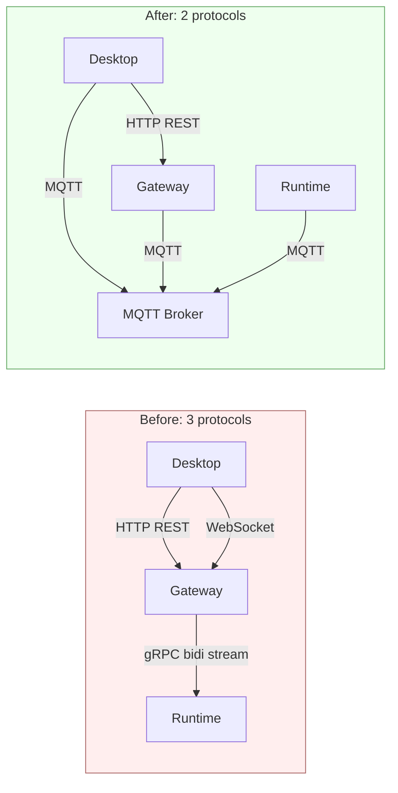

# ADR-033: Replace gRPC + WebSocket with MQTT — Unifying the Gateway Protocol Stack

> **Chinese source of truth**: [ADR-033](../zh/ADR-033-mqtt-replace-grpc-websocket.md)
> **Terminology**: see [GLOSSARY.md](./GLOSSARY.md)

## Status

Proposed

## Date

2026-07-11

## Decision Makers

大鱼 (Dayu)

## Related

- [ADR-031](./ADR-031-drop-legacy-ipc-consolidate-on-grpc.md) — drop legacy IPC leftovers
- [ADR-020](./ADR-020-data-flow-tiering.md) — data flow tiering
- [ADR-021](./ADR-021-unified-session-data-loading.md) — unified session data loading

---

## Decision summary

**Replace gRPC (Gateway ↔ Runtime IPC) and WebSocket (Desktop ↔ Gateway
streaming events) with MQTT, keeping HTTP REST unchanged.**



| Dimension | Before | After |
|-----------|--------|-------|
| Protocol count | 3 (HTTP + WebSocket + gRPC) | 2 (HTTP + MQTT) |
| Gateway internals | HTTP Server + WS Relay + gRPC Server + Session Manager + Bridge event bus | HTTP Server + MQTT Broker + Global Resources Publisher + HTTP reverse proxy to Runtime localhost HTTP |
| Agent lifecycle | manual GrpcSession register/cleanup | MQTT Will Message + retained message |
| Event path | Runtime → gRPC → broadcast channel → WebSocket task → Desktop | Runtime → MQTT Broker → Desktop (direct, no Bridge) |
| Multi-user extension | rework HTTP routing + Bridge filtering | rumqttd built-in ACL isolates by `client_id`; the topic tree is unchanged |
| Code delta | — | ~5,900 lines deleted, ~2,750 added |

## Context

After ADR-031 the Gateway ran three protocols:

| Protocol | Channel | Responsibility |
|----------|---------|----------------|
| HTTP REST (Axum) | Desktop ↔ Gateway | agent CRUD, config, file upload, session queries |
| WebSocket (Axum ws) | Desktop ↔ Gateway | chat streaming events (22 kinds: chunk / tool_call / done and so on) |
| gRPC (Tonic) | Gateway ↔ Runtime | bidirectional stream IPC: intent dispatch, StreamChunk reporting, resource sync, request-response |

**Pain 1 — the Bridge event bus is the most fragile link.**

```
Runtime ──gRPC StreamChunk──▶ Gateway ──broadcast::channel──▶ WebSocket task ──▶ Desktop
                                ↑
                          22 kinds of BridgeEvent
                    manual from_action() string matching
```

The Gateway needs a `tokio::sync::broadcast` channel translating gRPC events into
WebSocket JSON frames. Every new event type means editing three places: proto,
BridgeEventType, and the WebSocket handler. **The broker is itself an event bus**, so this
translation layer exists only to be maintained by hand.

**Pain 2 — manual GrpcSession lifecycle is unreliable.** `GrpcSessionManager`
relies on the gRPC stream `drop` to call `remove_session()`. If the Runtime is
`kill -9`-ed the TCP connection may linger (depending on OS TCP keepalive), so
the Gateway believes the agent is online for a long time. **MQTT Will Message is a
protocol-level guarantee**: the broker publishes the retained will automatically once it sees
the TCP drop, so there is no phantom online state.

**Pain 3 — multi-user needs broad rework.** Today the Gateway binds `127.0.0.1`,
single host, single user. Supporting several users on one Gateway needs user context
in the HTTP layer, user filtering in the Bridge, and user association on gRPC
sessions. rumqttd has **built-in ACL** limiting publish/subscribe per
`client_id`; the topic tree is not prefixed by `user_id` (which would explode the topic
count), and multi-user isolation is managed centrally by the ACL.

### Why MQTT

The agent lifecycle maps naturally onto IoT device management:

| IoT concept | Agent mapping | MQTT primitive |
|--------------|---------------|----------------|
| device online | Runtime starts and connects | CONNECT + `acowork/agents/{id}/status` = `online` (retained) |
| device offline | Runtime exits or crashes | Will Message auto-publishes `offline` |
| keep-alive | offline after 30s of silence | MQTT Keep Alive |
| state reporting | StreamChunk, UsageReport | PUBLISH to the matching topic |
| command dispatch | IntentReceived (chat_message / stop / model_switch) | PUBLISH to `acowork/agents/{id}/sessions/control/{cmd}` |
| firmware update | hot-updated provider list, config changes | PUBLISH to `acowork/agents/{id}/config` (retained) |

Gateway converges from "HTTP Server + WS Relay + gRPC Server + Session Manager + Bridge
Bus" to "**HTTP Server + MQTT Broker + Global Resources Publisher + HTTP reverse
proxy**".

**The HTTP reverse proxy**: large local data (full message lists, session lists, the
memory graph) is reached by reverse-proxying to the Runtime localhost HTTP server; the
Gateway never reads Runtime local files directly. Small data such as agent config
syncs over the retained MQTT `agents/{id}/config` topic and needs no HTTP GET. The full
protocol design lives in [mqtt.md](../../protocols/en/mqtt.md).

## Alternatives

**A — WebSocket → SSE.** Replaces only WebSocket and keeps gRPC, taking the protocol
count from 3 to 2.5. Smallest change, but it fixes none of the gRPC pains (session
management, the Bridge bus), and SSE is one-way, so Desktop → Gateway control commands
still need an HTTP POST forwarded to gRPC.

**B — gRPC-web for a single protocol.** Unified to 1, but gRPC-web needs Envoy / gRPC
Gateway for HTTP/1.1 → HTTP/2 conversion, the browser-side gRPC-web ecosystem is weaker
than MQTT (no native stream cancel, no Will Message), and it still does not solve device
lifecycle management.

| Dimension | Today | MQTT |
|-----------|-------|------|
| Bridge event bus | separate broadcast channel + 22 event types to match | **unnecessary** — the broker is the bus |
| Agent lifecycle | manual GrpcSession handling | **Will Message + Keep Alive, native** |
| Multi-user | rework HTTP routing + Bridge filtering | **topic hierarchy + ACL** |
| Protocol count | 3 | **2** |
| Request-response | gRPC request_id + oneshot | **MQTT 5.0 Response Topic + Correlation Data** |
| Streaming overhead | WebSocket frame (~2-10 B header) | **MQTT PUBLISH (~4 B header + topic)** — measured 500ms notification throttling makes traffic negligible |

---

## Detailed design

> The full protocol design (topic tree, message formats, broker selection, client
> library, broker lifecycle, gRPC→MQTT topic mapping, request-response pattern,
> control command mapping, Gateway architecture convergence) has been extracted into
> the standalone protocol reference:
>
> 👉 **[`docs/protocols/en/mqtt.md`](../../protocols/en/mqtt.md)**
>
> This ADR keeps only the decision rationale, alternatives, blast radius, risks and
> mitigations, and the implementation plan. Protocol details, the topic tree, message
> formats, and broker selection are authoritative in the protocol document.

## Migration strategy

> The staged migration plan (dual-channel coexistence → Desktop migration → Runtime
> switch → cleanup) lives in the protocol document:
>
> 👉 **[`docs/protocols/en/mqtt.md` §14 Migration Path](../../protocols/en/mqtt.md)**
>
> This ADR keeps only the decision impact (blast radius, risks, implementation plan).

---

## Blast radius

### Deleted

| File / module | Lines | Notes |
|---------------|-------|-------|
| `core/acowork-gateway/src/grpc/server.rs` | 874 | gRPC server + GrpcSessionManager |
| `core/acowork-gateway/src/grpc/dispatch.rs` | 544 | gRPC message dispatch |
| `core/acowork-gateway/src/grpc/resource_pusher.rs` | 475 | hot-push of resource changes |
| `core/acowork-gateway/src/grpc/mod.rs` | 14 | gRPC module entry |
| `core/acowork-gateway/src/http/chat.rs` (WS part) | ~800 | WebSocket upgrade + frame handling |
| `core/acowork-gateway/src/http/routes.rs` (Bridge events) | ~200 | BridgeEvent + BridgeEventType |
| `core/acowork-runtime/src/grpc/client.rs` | 1,522 | Runtime gRPC client |
| `core/acowork-runtime/src/grpc/mod.rs` | — | gRPC module entry |
| `core/acowork-core/proto/gateway_ipc.proto` (service decl) | ~20 | delete service `GatewayService` only; messages retained |
| `core/acowork-core/src/proto_bridge.rs` (part) | ~600 | gRPC-specific code in Proto ↔ Domain conversion |
| **Total** | **~5,900** | |

### Added

| File / module | Est. lines | Notes |
|---------------|-----------|-------|
| `core/acowork-gateway/src/mqtt/broker.rs` | ~100 | rumqttd embedded config and startup (port, connection count, packet size) |
| `core/acowork-gateway/src/mqtt/client.rs` | ~600 | Gateway MQTT client (connect, subscription management, send/receive) |
| `core/acowork-gateway/src/mqtt/router.rs` | ~400 | Topic Router (subscription matching, event forwarding, access control) |
| `core/acowork-gateway/src/mqtt/dispatch.rs` | ~400 | MQTT message → handler dispatch (replaces `dispatch.rs`) |
| `core/acowork-gateway/src/mqtt/agent_registry.rs` | ~200 | Agent Registry (status topic → online state table) |
| `core/acowork-gateway/src/mqtt/mod.rs` | ~30 | module entry |
| `core/acowork-runtime/src/mqtt/client.rs` | ~800 | Runtime MQTT client (connect, handshake, send/receive, request-response) |
| `core/acowork-runtime/src/mqtt/mod.rs` | ~20 | module entry |
| `core/acowork-runtime/src/http/server.rs` | ~150 | Runtime localhost HTTP server (for Gateway reverse-proxyed large-data queries) |
| `core/acowork-gateway/src/http/proxy.rs` | ~200 | Gateway HTTP reverse proxy (forwards to Runtime localhost HTTP) |
| Desktop App (Tauri Rust backend) | ~200 | `rumqttc` integration + topic subscription + Tauri events pushed to the frontend |
| Gateway `Cargo.toml` deps | ~3 | `rumqttd = "0.14"` + `rumqttc = "0.24"` |
| **Total** | **~3,180** | |

> **Note**: the business-logic handler functions (Gateway `handlers/server.rs`, 1,149 lines,
> plus the Runtime handlers) **need no changes** — the input/output types are unchanged
> (still `GatewayRequest` / `GatewayResponse` or proto messages); only the transport changes.

### Unchanged

| Module | Lines | Notes |
|--------|-------|-------|
| HTTP REST API (all handlers) | ~19,000 | CRUD, config, file management all stay as-is |
| `core/acowork-core/src/protocol.rs` | 1,610 | `GatewayRequest` / `GatewayResponse` types unchanged |
| `core/acowork-core/proto/gateway_ipc.proto` (message defs) | ~495 | all message definitions retained |
| Runtime Agent Loop and business logic | ~20,000+ | untouched |

---

## Risks and mitigations

| Risk | Severity | Mitigation |
|------|----------|------------|
| **rumqttd v0.x API churn** | Low | the broker API surface is tiny (configure → start → run in background); upgrade cost is bounded. mosquitto is the backup option and can be swapped in at any time |
| **rumqttd lacks MQTT 5.0** | **None** | the request-response pattern is implemented manually on MQTT 3.1.1 (the request payload carries a `response_topic` field); the semantics are exactly equivalent |
| **rumqttd has few production deployments** | Low | for local message routing with < 10 connections the broker's "maturity" has little marginal value. The basics (TCP / topic matching / QoS / retained / will) are fixed by the protocol spec |
| **Loss of Protobuf type safety** | Low | MQTT payloads keep Protobuf encoding and the same message format. Only the transport changes from a gRPC stream to an MQTT PUBLISH |
| **Complexity of the dual-channel window** | Low | phase 1 lasts at most 1–2 weeks; shared handler functions keep the logic consistent; the gRPC channel is deleted once converged |
| **MQTT client library choice** | Low | Rust side uniformly uses `rumqttc` (tokio-native async, pure Rust). Desktop integrates through the Tauri backend, so the frontend needs no MQTT library |
| **Gateway becomes a single point of failure** | Low | the Gateway is already a single point today (agent subprocess management, local filesystem access); MQTT does not change that |
| **Message ordering guarantee** | Low | MQTT guarantees ordering within a topic (required by the RFC). All streaming events use the single `stream/chunk` topic and do not cross topics, so ordering is inherent |
| **Security (multi-user isolation)** | Low | rumqttd supports built-in ACL. At the current stage both Desktop and Runtime stay on localhost with no external exposure; ACL rules are added at the multi-user stage |

---

## Implementation plan

| Commit | Scope | Notes | Est. |
|--------|-------|-------|------|
| **C1** | Gateway: `mqtt/broker.rs` | rumqttd embedded config and startup (port, connection count, packet size) | ~100 lines |
| **C2** | Gateway: `mqtt/client.rs` + `mqtt/mod.rs` | Gateway MQTT client (connect / subscribe) | ~630 lines |
| **C3** | Gateway: `mqtt/router.rs` + `mqtt/agent_registry.rs` | Topic Router + Agent Registry | ~600 lines |
| **C4** | Gateway: `mqtt/dispatch.rs` | MQTT message dispatch (reuses the existing handler functions) | ~400 lines |
| **C5** | Gateway: integration — start gRPC + MQTT together | dual-channel coexistence, shared handlers | ~100 lines |
| **C6** | Runtime: `mqtt/client.rs` | Runtime MQTT client (connect / handshake / pub-sub / request-response) | ~820 lines |
| **C7** | Runtime: `--mqtt-port` flag + localhost HTTP server | gRPC by default, MQTT optional; start the localhost HTTP server for Gateway reverse proxying | ~200 lines |
| **C8** | Desktop: Tauri Rust backend integrates rumqttc | subscribe to events topic → Tauri emit to frontend; frontend invoke → Rust PUBLISH | ~200 lines |
| **C9** | Validation + tests: end-to-end MQTT communication | send message → LLM streaming → event receipt | — |
| **C10** | Cleanup: delete the gRPC server, dispatch, WebSocket Bridge | phase 4 cleanup | ~5,900 lines deleted |
| **Total** | | | ~3,180 lines added + ~5,900 lines deleted |

Each commit is independently buildable and can be validated incrementally.

---

## Appendix: relationship to ADR-031

ADR-031 consolidated the legacy custom binary-frame IPC onto gRPC. This ADR continues
ADR-031 — once gRPC is the only IPC channel, the transport layer is unified onto MQTT.

The difference:

- **ADR-031** did "module-level cleanup" (renaming, merging, deleting leftovers)
- **This ADR** does a "protocol-level replacement" (transport switched from gRPC to MQTT)

The underlying message protocol (protobuf message definitions) and the business logic
(handler functions) stay unchanged in both ADRs. That is what keeps the migration
controllable.
