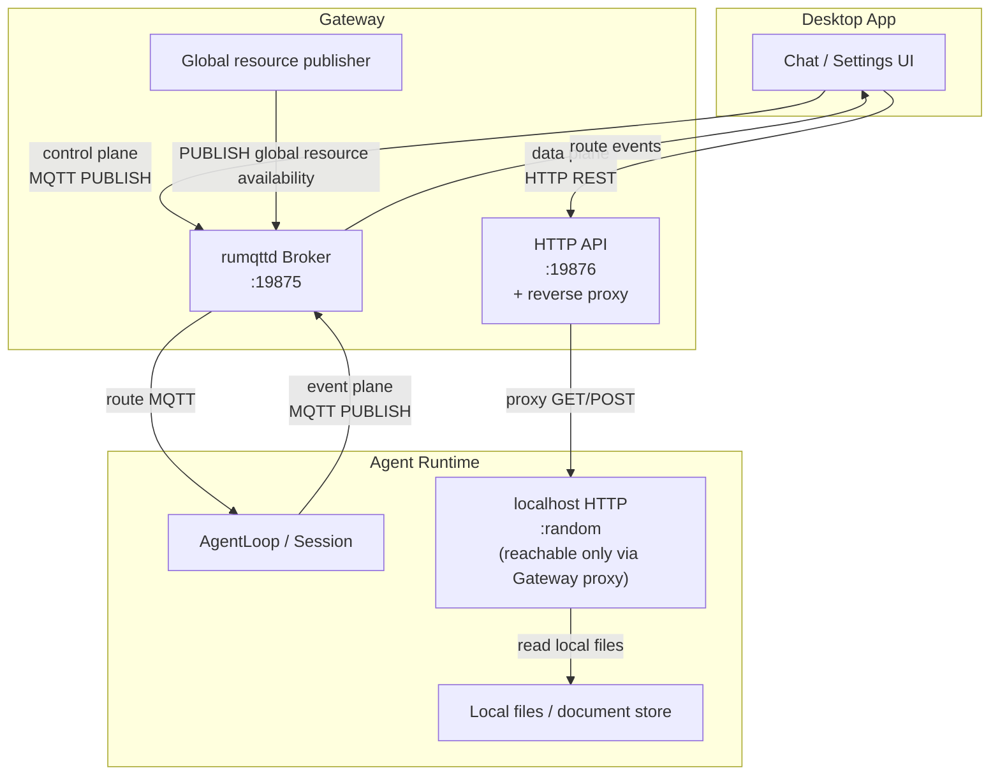

# ADR-034: Control Plane / Data Plane Layering — MQTT / HTTP Responsibility Boundary Specification

**Status**: Draft v10.0 (Phase 2 ~ Phase 10 all complete, 2026-07-14)
**Date**: 2026-07-14
**Deciders**: 大鱼
**Predecessors**:
- ADR-033 (MQTT replaces gRPC + WebSocket, decision approved, implementation in progress)
- ADR-020 (Data flow tiering)
- ADR-024 (Unified session metadata)

---

## Decision Summary

The first round of ADR-033 implementation surfaced 6 classes of control-plane regressions (§6). After the control-plane fixes, a full review of the 41 HTTP endpoints on Gateway/Runtime surfaced 12 classes of governance issues (§7). **A third round cross-validated Desktop's 100+ `fetch` calls, every MQTT topic subscription, and the proto schema** (§13, §14), surfacing 17 classes of violations (8 control-plane-over-HTTP, 3 missing panel endpoints, proto schema inconsistent with ADR §3.2, MQTT command string misplacement, workspace file operations not spelled out in the ADR). This ADR freezes all three sets of specifications together: the transport assignment for all 17 gRPC-era control actions, the unified ControlCommand proto, the complete HTTP endpoint inventory and naming rules, and the full cleanup of gRPC leftovers and dead HTTP endpoints.

**Three core rules (non-negotiable)**:

1. **One semantic → exactly one transport.** It is strictly forbidden to offer entry points for the same business operation over both MQTT and HTTP.
2. **HTTP is a superset of MQTT, but is only enabled for MB+ payloads or strong request/response semantics.** All state changes triggered by user actions go over MQTT.
3. **Gateway never touches Agent Runtime local files.** All Runtime data reads go through the HTTP reverse proxy to the Runtime localhost HTTP server.

| Plane | Transport | Decision criterion |
|---|---|---|
| **Control plane** (Desktop → Runtime) | MQTT `acowork/agents/{id}/sessions/control/{cmd}` | User-action-triggered state changes, real-time bidirectional |
| **Data plane** (Desktop ↔ Runtime via Gateway proxy) | HTTP REST via Gateway reverse proxy | Startup-time loading, bulk reads, file operations, one-off queries |
| **Event plane** (Runtime → Desktop) | MQTT `acowork/agents/{id}/sessions/{sid}/messages/*` | Streaming chunks, state change push |

**Decision procedure** (by priority):

```
1. Is it a "state change triggered by a user action"?   → MQTT
2. Is it a "runtime streaming event"?                   → MQTT
3. Is it "startup full load / bulk read / large file"?  → HTTP via Gateway reverse proxy
4. Does it need an explicit ack (success/failure semantics)? → Stay on MQTT; the event plane reflow is the ack (no separate control ack)
```

**Open points already decided** (no longer queried):

| Open point | Decision |
|--------|------|
| CompressAction field layout | Strongly-typed `enum CompressType` (avoids string parsing) |
| Where the rich ChatMessage fields live | `params_json` (consistent with IntentCommand) |
| gRPC-era `activate_session` / `deactivate_session` naming | Renamed to `enable_notify` / `disable_notify` (semantically more accurate) |
| Whether `close_session` is introduced in this iteration | Yes (already implemented in the gRPC era, reused) |
| Keep or drop `POST /api/agents/{id}/control` | **Delete** — that path never exists |
| HTTP endpoint URL naming | Uniform `{id}`, verb for actions, plural for resource collections, nested parent-child (§11.1) |

---

## Background and Motivation

### 1. Protocol boundary was not fixed → field loss, swallowed commands, stale context

The first round of ADR-033 implementation surfaced 6 classes of regressions (§6):
- `model_switch` lost `provider_id` → switching models across providers fails 100% of the time
- `compress_action` was silently renamed to `compact_context` → compaction semantics scrambled
- `workspace_switch` lost `update_session_workspace_context` plus legality validation and fallback

Root cause: ADR-033 specified neither a complete transport matrix nor a proto schema, so implementation had to reverse-engineer it from the gRPC code.

### 2. Second-round HTTP endpoint review → 12 classes of governance issues

After the first round of control-plane fixes, a full audit of Gateway's 24 + Runtime's 17 HTTP endpoints surfaced 12 classes of issues (§7):
- 3 silent no-ops (fake success, actually did nothing): `activate_session` / `deactivate_session` / `close_session`
- 1 critical bug: `PUT /workspaces/current` only updates statistics, never notifies Runtime
- 8 field losses: gRPC-era rich fields were not wired up during migration (`document_ids`, `content_parts`, `attached_context`, `command`, `model_switch.provider_id`, `compress_action.type`, `stop.reason`, etc.)
- 3 places reinventing business logic: the Runtime side routed through `SystemNotification` to forward SessionMessage, plus a dispatch chain
- 4 control-plane operations over the HTTP proxy: violating the §1 spec (approval/question/continue/title moved back to MQTT)
- 1 data query hitting the wrong endpoint: `get_latest_conversation` called messages instead of latest
- 1 data query reading a stale cache: `get_session_state` read the in-memory cache
- 1 placeholder implementation: `GET /memory/graph` reads JSONL, not wired to Grafeo
- 6 rule inconsistencies: `{agent_id}` vs `{id}` mixed usage

Root cause: ADR-033 specified neither HTTP endpoint naming rules nor the data-plane boundary.

### 3. Scope of this ADR

- ✅ Protocol boundary spec (§1)
- ✅ Full mapping of the 17 control actions (§2)
- ✅ Unified ControlCommand proto (§3, including 8 new commands)
- ✅ Single-path Runtime dispatch architecture (§4)
- ✅ Zero business-logic-change verification (§5)
- ✅ Fix plan for the 6 regression classes from ADR-033's first round (§6)
- ✅ Full HTTP endpoint governance (§7 — **new in this revision, integrating review results**)
- ✅ Full file change inventory (§9)
- ✅ Complete HTTP endpoint design, naming rules, URL design (§11 — **new in this revision**)
- ✅ Verification matrix (§12 — **new in this revision**)

---

## I. Protocol Layering Specification

### 1.1 Three planes, three divisions



### 1.2 Control plane vs data plane decision matrix

| Decision dimension | Control plane (MQTT) | Data plane (HTTP) |
|--------------------|---------------------|-------------------|
| **Trigger** | Proactive user action (click, keystroke) | Startup, polling, on-demand load |
| **Latency requirement** | Real time (<100ms) | Non-real-time (seconds acceptable) |
| **Payload size** | KB-level (small) | Unbounded (including MB+) |
| **Response semantics** | Fire-and-forget; the event plane reflows as feedback | Request/response, HTTP status codes |
| **Failure handling** | Subsequent state change is the feedback (chunk/done/error) | HTTP 4xx/5xx returned immediately |
| **Multiple subscriptions** | Not needed (one-shot operation) | Not needed (one-off query) |

### 1.3 Anti-patterns (**strictly forbidden**)

| Anti-pattern | Why it is forbidden |
|---|---|
| Supporting both MQTT and HTTP paths for the same semantic | A bug source (two code paths inevitably drift), test burden ×2 |
| Sending control commands through the HTTP proxy | Adds a Gateway forwarding hop and breaks "Desktop ↔ Runtime direct" |
| Syncing large data over MQTT retained messages | Hard per-packet ceiling of 10MB; broker memory explosion |
| Treating Gateway as a business event relay | Link latency ×2, Gateway state explosion, loss of the MQTT direct advantage |

---

## II. Complete Transport Matrix

The gRPC-era `process_gateway_recv` handled **17 control actions**; each is mapped below.

### 2.1 Control plane (17 → all over MQTT)

| # | Command | Topic prefix | Consistency strategy |
|---|------|----------|-----------|
| 1 | `CreateSession` | `control/create_session` | QoS 1 |
| 2 | `DeleteSession` | `control/delete_session` | QoS 1 |
| 3 | `CloseSession` | `control/close_session` | QoS 1 (graceful, triggers distillation) |
| 4 | `UpdateSessionTitle` | `control/update_session_title` | QoS 1 |
| 5 | `ChatMessage` | `control/chat_message` | QoS 1 |
| 6 | `Stop` | `control/stop` | QoS 1 |
| 7 | `ContinueExecution` | `control/continue_execution` | QoS 1 |
| 8 | `EnableNotify` | `control/enable_notify` | QoS 1 |
| 9 | `DisableNotify` | `control/disable_notify` | QoS 1 |
| 10 | `ApprovalDecision` | `control/approval_decision` | QoS 1 |
| 11 | `QuestionAnswer` | `control/question_answer` | QoS 1 |
| 12 | `ModelSwitch` | `control/model_switch` | QoS 1 |
| 13 | `ReasoningEffort` | `control/reasoning_effort` | QoS 1 |
| 14 | `WorkspaceSwitch` | `control/workspace_switch` | QoS 1 |
| 15 | `CompactContext` | `control/compact_context` | QoS 1 |
| 16 | `CompressAction` | `control/compress_action` | QoS 1 |
| 17 | `Intent` | `control/intent` | QoS 1 (cross-agent / cron) |

> **Rationale for QoS 1**: control commands must not be lost, but the ack is reflowed by the event plane (chunk/done/error/SessionMeta); a control-layer ack is not needed.

### 2.2 Data plane (2 → HTTP via Gateway reverse proxy)

| # | Operation | Gateway HTTP | Proxied to Runtime HTTP | Purpose |
|---|------|--------------|---------------------|------|
| 18 | `ListSessions` | `GET /api/agents/{id}/sessions` | `GET /sessions` | Full session list (startup) |
| 19 | `GetSessionMessages` | `GET /api/agents/{id}/sessions/{sid}/messages?cursor=...&limit=...` | `GET /sessions/{sid}/messages?cursor=...&limit=...` | Paginated history load |

> **Why these 2 go over HTTP**: in the gRPC era they were unary RPCs (`request_id` + oneshot return), whose semantics are request/response rather than push. Converting them to MQTT would break the semantics, and a full list at MB+ is unsuitable for retained messages.

### 2.3 Over HTTP but not proxied (Gateway-local endpoints)

For reference only; unrelated to this ADR's subject:

| Path | Purpose |
|------|------|
| `GET /api/global/providers` etc. | Full global resource lists (Settings UI) |
| `PUT /api/agents/{id}/config` | Modify agent config (passed through to Runtime MQTT control) |
| `POST /api/agents/{id}/control` | **Retained but only for "ack-requiring scenarios"** (see §7 for discussion) |

---

## III. Unified ControlCommand Proto

### 3.1 Schema principles

| Principle | Explanation |
|------|------|
| **Strongly-typed oneof** | Each command gets its own message; no `command_type` string parsing layer |
| **Required fields placed directly at the top level** | `session_id` / `message_id` etc. |
| **Optional / heterogeneous rich fields go in `params_json`** | Following the existing `IntentCommand` pattern |
| **Empty string for nullable strings = no update** | e.g. an empty `provider_id` = only switch the model name |
| **`agent_id` goes at the `ControlCommand` top level** | Avoids repeating it in every subcommand |

### 3.2 Complete proto schema

> ⚠️ **The schema in this section is ADR-034's original design at the time (historical record).** It has been **wholesale reversed by ADR-076 §Decision 4**: all commands in the table below **except `intent` have been removed from `ControlCommand`** (all user actions now go over HTTP). The actually valid schema today is `core/acowork-core/proto/mqtt_payload.proto` — the `ControlCommand` top level has only `instance_id = 1`, and the oneof has only `intent = 2` + `active_heartbeat = 3` (contiguous field numbers).
>
> ⚠️ **The field-numbering rule has changed several times; the version below is the only currently valid one**: this ADR's early version required deleting the subcommand `agent_id` (originally field 1) while **leaving a gap**, with new fields starting at 2+/5+; after ADR-076 §Decision 4 that rule is **void** — there is no backward-compatibility requirement during development, and the field numbers across the whole of `mqtt_payload.proto` have been **re-laid-out contiguously** with no gaps (numbering freezes only after release). Therefore the "logical field names" and "proto field numbers" in the table below have an arbitrary offset; the actually valid numbering is in `core/acowork-core/proto/mqtt_payload.proto`; see [ADR-076 §Decision 4](./ADR-076-multi-user-account-system.md).
>
> The complete table of actually generated proto field numbers is documented in `core/acowork-core/proto/mqtt_payload.proto`.

```protobuf
syntax = "proto3";
package acowork.mqtt.v1;

// ── Control commands (Desktop → Runtime, fire-and-forget push) ──────
//
// Design principles:
//   1. Strongly-typed oneof; each command has a dedicated schema (no command_type string layer)
//   2. Required fields go directly at the message top level; optional / heterogeneous
//      rich fields go in a params_json string
//   3. ADR-012: nullable fields such as provider_id use an empty string = "no update"

message ControlCommand {
  string agent_id = 1;
  oneof command {
    // ── Session lifecycle ──
    CreateSession       create_session        = 10;
    DeleteSession       delete_session        = 11;
    CloseSession        close_session         = 12;  // graceful, triggers distillation
    UpdateSessionTitle  update_session_title  = 13;

    // ── Chat ──
    ChatMessage         chat_message          = 20;  // user message (with rich payload)
    Stop                stop                  = 21;
    ContinueExecution   continue_execution    = 22;
    EnableNotify        enable_notify         = 23;  // session → foreground
    DisableNotify       disable_notify        = 24;  // session → background

    // ── User responses to runtime prompts ──
    ApprovalDecision    approval_decision     = 30;
    QuestionAnswer      question_answer       = 31;

    // ── Per-session config ──
    ModelSwitch         model_switch          = 40;
    ReasoningEffort     reasoning_effort      = 41;
    WorkspaceSwitch     workspace_switch      = 42;

    // ── Context management ──
    CompactContext      compact_context       = 50;
    CompressAction      compress_action       = 51;  // distinct from compact_context

    // ── System ──
    Intent              intent                = 60;  // cron / cross-agent
  }
}

// ── Session lifecycle ──────────────────────────────────────────────

message CreateSession {}

message DeleteSession {
  string session_id = 1;
}

/// Graceful close: triggers distillation, preserves JSONL history.
/// Use Delete to also remove the file.
message CloseSession {
  string session_id = 1;
}

message UpdateSessionTitle {
  string session_id = 1;
  string title = 2;
}

// ── Chat ───────────────────────────────────────────────────────────

message ChatMessage {
  string session_id = 1;
  string message_id = 2;
  string content = 3;
  /// Optional slash command prefix (e.g. "/commit", "/review-pr")
  string command = 4;
  /// Rich payload as JSON. Shape:
  ///   {
  ///     "document_ids":     ["doc-abc"],      // uploaded via HTTP POST /documents
  ///     "content_parts":    [{type:"text",text:"..."}, {type:"image_url",image_url:{url:"..."}}],
  ///     "attached_context": [{abs_path, type:"file"|"selection", startLine?, endLine?}]
  ///   }
  /// Empty string = plain text only.
  /// Documents are resolved by the Runtime from the session's document store
  /// (NOT inlined into the wire payload — keeps MQTT messages small).
  string params_json = 5;
}

message Stop {
  string session_id = 1;
  /// Stop reason for logging. Free-form but conventionally:
  /// "user_requested" | "iteration_limit" | "budget_exceeded" | "error" | ...
  string reason = 2;
}

message ContinueExecution {
  string session_id = 1;
  string reason = 2;  // "user_requested" | "auto_resume"
}

message EnableNotify {
  string session_id = 1;
}

message DisableNotify {
  string session_id = 1;
}

// ── User responses ─────────────────────────────────────────────────

message ApprovalDecision {
  string session_id = 1;
  string request_id = 2;
  bool approved = 3;
  bool allow_all_session = 4;
  /// Optional reason (e.g. user typed "this is a typo")
  string reason = 5;
}

message QuestionAnswer {
  string session_id = 1;
  string request_id = 2;
  string answer = 3;
}

// ── Per-session config ─────────────────────────────────────────────

message ModelSwitch {
  string session_id = 1;
  string model_id = 2;
  /// Optional. ADR-012 per-session provider override.
  /// Empty = keep current Provider, only update model name.
  string provider_id = 3;
}

message ReasoningEffort {
  string session_id = 1;
  /// "low" | "medium" | "high" | "auto"
  string effort = 2;
}

message WorkspaceSwitch {
  string session_id = 1;
  string workspace_id = 2;
}

// ── Context management ─────────────────────────────────────────────

message CompactContext {
  string session_id = 1;
}

enum CompressType {
  COMPRESS_TYPE_UNSPECIFIED = 0;
  COMPRESS_TYPE_SUMMARY      = 1;  // → CompressionAction::CompressSummary
  COMPRESS_TYPE_TOOL_RESULTS = 2;  // → CompressionAction::CompressToolResults
}

message CompressAction {
  string session_id = 1;
  CompressType compress_type = 2;
}

// ── System ─────────────────────────────────────────────────────────

message Intent {
  string from = 1;
  string action = 2;
  string params_json = 3;
}
```

---

## IV. Runtime Dispatch Architecture

### 4.1 Eliminating the dual path

`gateway_loop.rs` currently has dual dispatch paths (gRPC + MQTT). This ADR decides to **keep only the MQTT path**:

```rust
// Old: dual path
if grpc_client.is_some() {
    cli::run_gateway_loop(...)    // ← delete
} else if mqtt_client.is_some() {
    mqtt_only_loop(...)           // ← the only survivor
}

// New: single path
mqtt_only_loop(...)
```

### 4.2 Single dispatch table

`mqtt_only_loop` internally handles all control actions uniformly:

```rust
async fn dispatch(
    sm: &mut SessionManager,
    session_id: &str,
    msg: InboundMessage,
    resolver: &Arc<RwLock<WorkspaceResolver>>,
) {
    use InboundMessage::*;
    match msg {
        // ── System-level ──
        SystemNotification { notification_type: "create_session", .. } if session_id.is_empty() => {
            sm.create_session().await;
        }

        // ── Per-session config → session_manager route_* ──
        SystemNotification { notification_type: "model_switch", data } => {
            let model_id = data.get("model_id")?.as_str()?;
            let provider_id = data.get("provider_id")
                .and_then(|v| v.as_str())
                .filter(|s| !s.is_empty())
                .map(String::from);
            sm.route_model_switch(session_id, model_id.into(), provider_id);
        }
        SystemNotification { notification_type: "workspace_switch", data } => {
            let ws_id = data.get("workspace_id")?.as_str()?;
            // ↓ new method, merging validation + context refresh + pending fallback
            sm.route_workspace_switch(session_id, ws_id, resolver);
        }
        // ... other config cases handled the same way

        // ── Session-level → session task via SessionMessage ──
        SystemNotification { notification_type: "chat_message", data } => {
            let (docs, parts, ctx) = parse_chat_rich_payload(data.get("params_json"))?;
            sm.send_to_session(session_id, SessionMessage::ChatMessage { ... });
        }
        // ...

        // ── Real-time user responses → InboundMessage (bypass the queue) ──
        Stop { reason } => sm.send_inbound(session_id, Stop { reason }),
        ApprovalDecision { ... } => sm.send_inbound(session_id, ApprovalDecision { ... }),
        // ...

        other => tracing::warn!(?other, "Unsupported control command"),
    }
}
```

### 4.3 New `route_workspace_switch` method (merging the gRPC-era 3 steps into 1)

```rust
impl SessionManager {
    /// Per-session workspace switch (ADR-034).
    ///
    /// Unified replacement for the gRPC-era 3-step dance:
    ///   1. validate workspace_id against allowed_dirs
    ///   2. add_pending_workspace + fallback to "__agent_home__" if invalid
    ///   3. set_session_workspace_with_resolver
    ///   4. update_session_workspace_context (refresh prompt file + context text)
    ///
    /// Steps 1-4 are now atomic from the caller's perspective.
    pub fn route_workspace_switch(
        &mut self,
        session_id: &str,
        workspace_id: &str,
        resolver: &Arc<RwLock<WorkspaceResolver>>,
    ) {
        let guard = resolver.read().unwrap();
        let valid = workspace_id == "__agent_home__"
            || guard.allowed_dirs().iter().any(|d| d.id == workspace_id);
        let effective_id = if valid { workspace_id } else {
            tracing::warn!(
                session_id, workspace_id,
                "workspace_switch: id not in allowed list, pending + fallback to __agent_home__",
            );
            self.add_pending_workspace(session_id, workspace_id);
            "__agent_home__"
        };
        drop(guard);

        self.set_session_workspace(session_id, effective_id);
        self.update_session_workspace_context(session_id);
    }
}
```

---

## V. Zero Business-Logic-Change Verification

✅ All `SessionMessage` / `InboundMessage` variants were already fully defined in the gRPC era; the **business processing layer requires zero modification**:

| Business module | Status |
|----------|------|
| `route_model_switch(model, provider: Option<String>)` | ✅ the provider field is already present |
| `route_reasoning_effort(effort)` | ✅ |
| `SessionMessage::ChatMessage { content, message_id, command, skill_instructions, documents, content_parts, attached_context }` | ✅ all fields present |
| `SessionMessage::ModelSwitch { model, provider }` | ✅ |
| `SessionMessage::CompressAction(CompressionAction)` | ✅ |
| `SessionMessage::CompactContext` | ✅ |
| `SessionMessage::UpdateSessionTitle { title }` | ✅ |
| `SessionMessage::Close` | ✅ |
| `InboundMessage::Stop { reason }` | ✅ |
| `InboundMessage::ContinueExecution { reason }` | ✅ |
| `InboundMessage::ApprovalDecision { request_id, approved, allow_all_session, reason }` | ✅ |
| `InboundMessage::QuestionAnswer { request_id, answer }` | ✅ |
| All processing logic in `session_task.rs` / `AgentLoop` | ✅ not a single line changed |

**Conclusion**: the refactor is purely the protocol layer plus the dispatch layer; business processing is untouched.

---

## VI. 6 Classes of Regressions From the First Round of ADR-033 Implementation

> This section documents problems that were **not foreseen** when the ADR-033 decision was made, serving as motivating evidence for ADR-034. Subsequent ADR reviews should include this class of regression in their checklists.

### P0 (silent field loss / silent semantic change)

#### A. `ChatMessage` lost its rich fields
- **gRPC era**: the `IntentReceived` JSON carried `documents`, `content_parts`, `attached_context`, `command`
- **MQTT era**: the `MessageCommand` proto had only `content`, `message_id`, `session_id`; rich messages fell back to HTTP, with a TODO left in the code
- **Fix**: add a `params_json` field to ChatMessage, carrying the above rich data

#### B. The `compress_action` command was swallowed
- **gRPC era**: `compress_action` was an independent command, distinguishing `compress_summary` from `compress_tool_results`
- **MQTT era**: chatStore.ts:589 `sendCompressAction` sends `compact_context` directly — **"compress summary" was silently changed into "compress the entire context"**
- **Fix**: add an independent `CompressAction` command + a `CompressType` enum

#### C. `workspace_switch` lost `update_session_workspace_context`
- **gRPC era**: cli.rs:1816 called `update_session_workspace_context` after `set_session_workspace_with_resolver` to refresh the prompt file (AGENTS.md / CLAUDE.md)
- **MQTT era**: gateway_loop.rs:304-313 only calls `set_session_workspace`, **never refreshing the prompt file / context text**
- **Fix**: merge into `route_workspace_switch` (§4.3)

#### D. `workspace_switch` lost validation + fallback
- **gRPC era**: cli.rs:1816 validated `allowed_dirs`; an illegal ID went through `add_pending_workspace` + fallback `__agent_home__`
- **MQTT era**: any ID was accepted directly
- **Fix**: merge into `route_workspace_switch` (§4.3)

### P1 (missing commands, rerouted over HTTP)

#### E. `approval_decision` rerouted to HTTP `POST /sessions/{sid}/approval`
#### F. `question_answer` rerouted to HTTP `POST /sessions/{sid}/question`
#### G. `update_session_title` rerouted to HTTP `PUT /sessions/{sid}/title`
#### H. `continue_execution` rerouted to HTTP `POST /sessions/{sid}/continue`

> These 4 work functionally today, but **violate the "one semantic → one transport" rule**. This ADR migrates them back to MQTT.

### P2 (minor regressions)

#### I. `Stop` hard-codes the reason
- **gRPC era**: passed through `params["reason"]`
- **MQTT era**: hard-coded `"MQTT stop"`
- **Fix**: add a `reason` field to Stop

#### J. All `ChatMessage` rich fields are None
- Even after A is fixed, B/C/D/E/F/G merely degrade to HTTP
- **Fix**: this ADR fixes A-J in one pass

---

## VII. HTTP Endpoint Governance (review integration)

After the §6 fixes, a full audit of Gateway's 24 + Runtime's 17 HTTP endpoints surfaced 7 classes of issues, consolidated into 12 concrete fix items. This section is the core specification of ADR-034.

### 7.1 Inventory of HTTP endpoint issues

| Class | # | Issue | Location |
|------|---|------|------|
| **A. Silent no-op** | A1 | `POST /sessions/{sid}/activate` only validates, never notifies | Gateway `chat.rs` |
| | A2 | `POST /sessions/{sid}/deactivate` same | Gateway `chat.rs` |
| | A3 | `POST /sessions/{sid}/close` same | Gateway `chat.rs` |
| **B. Critical bug** | B1 | `PUT /workspaces/current` only updates the in-memory cache, never notifies Runtime | Gateway `workspaces.rs` |
| **C. Field loss** | C1 | `POST /message` receives `document_ids` / `content_parts` / `attached_context` / `command`, but the MQTT `MessageCommand` proto has only `content` / `message_id` / `session_id` | Gateway `chat.rs` |
| | C2 | `POST /message` has no `params_json` field | `mqtt_payload.proto` |
| | C3 | The gRPC-era `compress_action` was silently renamed to `compact_context`, losing the SUMMARY/TOOL_RESULTS distinction | Desktop + proto |
| | C4 | The `Stop` command has no `reason` field (hard-coded "user_requested") | proto |
| **D. Control plane over HTTP** | D1 | `POST /approval` | Gateway + Runtime `server.rs` |
| | D2 | `POST /question` | Gateway + Runtime |
| | D3 | `POST /continue` | Gateway + Runtime |
| | D4 | `PUT /sessions/{sid}/title` | Gateway + Runtime |
| **E. Wrong / stale data calls** | E1 | `GET /conversations/latest` proxies to `/sessions/{sid}/messages`; it should be `/sessions/latest` | Gateway `chat.rs` |
| | E2 | `GET /sessions/{sid}/state` reads the in-memory cache (a gRPC-era QueryConfig cache): possibly stale | Gateway `agents.rs` |
| **F. Placeholder implementation** | F1 | `GET /memory/graph` reads JSONL, not wired to Grafeo | Runtime `server.rs` |
| **G. Reinventing business logic** | G1 | Runtime `update_session_title` goes around via `SystemNotification` instead of directly sending `SessionMessage::UpdateSessionTitle` | Runtime `server.rs` |
| **H. Missing endpoints** | H1 | Both Gateway + Runtime lack: documents ×4, workspaces mutation ×4, memory single node ×1 | Gateway + Runtime |

### 7.2 HTTP endpoint naming rules

| Rule | Explanation |
|------|------|
| **Uniform `{id}`, never mix in `{agent_id}`** | The 6 inconsistent endpoints get renamed to `/api/agents/{id}/...` |
| **Resource collections use plural nouns** | `/sessions`, `/documents`, `/workspaces` |
| **Actions use verbs** | `POST /workspaces` (add), `PUT /workspaces/{id}` (update), `DELETE /workspaces/{id}` |
| ~~**State fields use the `/state` suffix**~~ | **Deprecated** (§7.6.4): the Session state is absorbed by the merged `/sessions/{sid}` endpoint; **no standalone `/state` endpoint exists** |
| **List pagination uses query parameters** | `?page=&size=` or `?cursor=&limit=&direction=` |
| **Nested parent-child resources** | `/sessions/{sid}/documents`, `/workspaces/{ws_id}/prompt-file` |
| **The data plane only uses the `/api/agents/{id}/...` prefix** | The Runtime HTTP proxy interface exposes no `/api` prefix, only bare resource paths |
| **`POST /api/agents/{id}/control` is strictly forbidden** | This ADR's decision: delete that concept outright (the control plane goes over MQTT topics) |

### 7.3 Complete inventory of Gateway HTTP endpoints

#### L1. Control plane forwarding → delete entirely (migrate to MQTT)

| # | Endpoint | File | Current behaviour | Replacement |
|---|------|------|------|------|
| 1 | `POST /api/agents/{id}/message` | `chat.rs` | MQTT `MessageCommand` (**loses rich fields**) | MQTT `chat_message` + `params_json` |
| 2 | `POST /api/agents/{id}/continue` | `chat.rs` | HTTP proxy | MQTT `continue_execution` |
| 3 | `PUT /api/agents/{id}/sessions/{sid}/title` | `chat.rs` | HTTP proxy | MQTT `update_session_title` |
| 4 | `POST /api/agents/{id}/sessions` | `chat.rs` | MQTT `CreateSession` | MQTT `create_session` |
| 5 | `DELETE /api/agents/{id}/sessions/{sid}` | `chat.rs` | MQTT `DeleteSession` | MQTT `delete_session` |
| 6 | `POST /api/agents/{id}/sessions/{sid}/activate` | `chat.rs` | **No-op** | MQTT `enable_notify` |
| 7 | `POST /api/agents/{id}/sessions/{sid}/deactivate` | `chat.rs` | **No-op** | MQTT `disable_notify` |
| 8 | `POST /api/agents/{id}/sessions/{sid}/close` | `chat.rs` | **No-op** | MQTT `close_session` |
| 9 | `POST /api/agents/{agent_id}/approval` | `approval.rs` | HTTP proxy | MQTT `approval_decision` |
| 10 | `POST /api/agents/{agent_id}/question` | `question.rs` | HTTP proxy | MQTT `question_answer` |
| 11 | `PUT /api/agents/{agent_id}/workspaces/current` | `workspaces.rs` | **Critical bug** | MQTT `workspace_switch` |

**Whole modules deleted**: `approval.rs` and `question.rs` are removed as complete files. `chat.rs` shrinks to just two queries. `workspaces.rs` is rewritten wholesale as a proxy.

#### L2. Data plane → retained (with fixes)

| # | Endpoint | File | Proxy target | Status |
|---|------|------|----------|------|
| 1 | `GET /api/agents/{id}/conversations` | `chat.rs` | `/sessions?page=&size=` | ✅ |
| 2 | `GET /api/agents/{id}/conversations/latest?session_id=` | `chat.rs` | **Fixed** → `/sessions/latest` (not messages) | ⚠️ fix |
| 3 | `GET /api/agents/{id}/latest-session` | `proxy.rs` | `/sessions/latest` | ✅ |
| 4 | `GET /api/agents/{id}/sessions?page=&size=` | `proxy.rs` | `/sessions?page=&size=` | ✅ |
| 5 | `GET /api/agents/{id}/sessions/{sid}/messages` | `proxy.rs` | `/sessions/{sid}/messages` | ✅ |
| 6 | `GET /api/agents/{id}/sessions/{sid}/state` | `agents.rs` | **Fixed** → proxy `/sessions/{sid}/state` (no longer reads the cache) | ⚠️ fix |
| 7-10 | `GET/DELETE/POST /memory/*` (4 endpoints) | `proxy.rs` | Runtime `/memory/*` | ✅ |
| 11 | `GET /api/agents/{id}/memory/graph` | `proxy.rs` | **Fixed** — Runtime wired to Grafeo | ⚠️ Runtime fix |
| 12 | `GET /api/agents/{id}/workspaces` | `proxy.rs` | `/workspaces` | ✅ |
| 13 | `GET /api/agents/{id}/workspaces/tree` | `proxy.rs` | `/workspaces/tree` | ✅ |

#### L3. Data plane → new proxies (implemented by this ADR)

| # | Gateway endpoint | Proxied to Runtime | Purpose |
|---|--------------|----------------|------|
| 1 | `POST /api/agents/{id}/sessions/{sid}/documents` | `POST /sessions/{sid}/documents` | Document upload (multipart) |
| 2 | `GET /api/agents/{id}/sessions/{sid}/documents` | `GET /sessions/{sid}/documents` | Document list |
| 3 | `GET /api/agents/{id}/sessions/{sid}/documents/{doc_id}` | `GET /sessions/{sid}/documents/{doc_id}` | Document read |
| 4 | `DELETE /api/agents/{id}/sessions/{sid}/documents/{doc_id}` | `DELETE /sessions/{sid}/documents/{doc_id}` | Document delete |
| 5 | `POST /api/agents/{id}/workspaces` | `POST /workspaces` | add_pending_workspace |
| 6 | `PUT /api/agents/{id}/workspaces/{ws_id}` | `PUT /workspaces/{ws_id}` | update_workspace (access/alias) |
| 7 | `PUT /api/agents/{id}/workspaces/{ws_id}/prompt-file` | `PUT /workspaces/{ws_id}/prompt-file` | set_prompt_file |
| 8 | `DELETE /api/agents/{id}/workspaces/{ws_id}` | `DELETE /workspaces/{ws_id}` | delete_workspace |
| 9 | `GET /api/agents/{id}/memory/nodes/{nid}` | `GET /memory/nodes/{nid}` | Single memory node |

**`documents.rs` rewritten as a whole**: today Gateway writes to the local `data_dir/sessions/{sid}/documents/` — violating the isolation principle. After the change, Gateway only proxies and Runtime owns document storage.

#### L4. Gateway-local endpoints (business-unrelated, no changes)

`/health`, `/api/agents/*` (list/get/avatar/install/clone/start/stop/config), `/api/providers`, `/api/models/*`, `/api/mcp-catalog/*`, `/api/embedding-models/*`, `/api/users/*`, `/api/cron/*`, `/api/skills/*`, `/api/publish/*`, `/api/global/*`, `/api/fs/browse`, `/api/config`, `/api/logs`, `/api/agent-config`, `/api/status`, `/api/lsp/endpoint`, `/api/user/avatar-*` — isolated from Agent Runtime, all unrelated to this ADR.

### 7.4 Complete inventory of Runtime HTTP endpoints

#### R1. Data plane queries (retained)

| # | Endpoint | Business logic reuse | Status |
|---|------|--------------|------|
| 1 | `GET /health` | n/a | ✅ |
| 2 | `GET /sessions?page=&size=` | `scan_sessions_from_meta` (ADR-024) | ✅ |
| 3 | `GET /sessions/latest` | `SharedLatestSession` | ✅ |
| 4 | `GET /sessions/{sid}` | meta.json + `SharedSessionSnapshots` merged (**Panel 4**, absorbing the former /state) | ✅ new |
| 5 | `GET /sessions/{sid}/messages` | `read_messages_paginated` (shared with gRPC) | ✅ |
| 6 | `GET /memory/graph` | **Fixed** → `grafeo::query_graph()` (**Panel 2**) | ⚠️ fix |
| 7 | `GET /memory/nodes?type=&keyword=&time_range=&page=&size=` | `memory_query::list_nodes` (shared with gRPC) | ✅ |
| 8 | `GET /memory/stats` | `memory_query::get_stats` (**Panel 2**) | ✅ |
| 9 | `DELETE /memory/nodes/{nid}` | `memory_query::delete_node` | ✅ |
| 10 | `POST /memory/consolidate` | `memory_query::trigger_consolidate` | ✅ |
| 11 | `GET /files/{id}` | reads `work_dir` | ✅ |
| 12 | `GET /workspaces` | reads `agent_workspaces.json` | ✅ |
| 13 | `GET /workspaces/tree?workspace_id=&path=` | `list_tree` (**Panel 6**) | ✅ |

> **Deleted**: `GET /sessions/{sid}/state` (absorbed by R1 #4 `/sessions/{sid}`, no longer standalone)

#### R2. Control plane (deleted — migrate to MQTT)

| # | Endpoint | Reason for deletion |
|---|------|----------|
| 14 | `POST /sessions/{sid}/approval` | Violates §1; Desktop now sends MQTT `approval_decision` |
| 15 | `POST /sessions/{sid}/question` | Violates §1, switch to MQTT `question_answer` |
| 16 | `POST /sessions/{sid}/continue` | Violates §1, switch to MQTT `continue_execution` |
| 17 | `PUT /sessions/{sid}/title` | Violates §1 + reinvented business logic (goes around via `SystemNotification`) |

#### R3. Data plane — new (12 endpoints, **including panel data endpoints**)

| # | Endpoint | Panel | Business implementation |
|---|------|------|----------|
| 18 | `POST /sessions/{sid}/documents` | — | Writes `work_dir/sessions/{sid}/documents/{doc_id}.{ext}` + `documents.json` (id, filename, mime, size, uploaded_at) |
| 19 | `GET /sessions/{sid}/documents` | — | Reads `documents.json` |
| 20 | `GET /sessions/{sid}/documents/{doc_id}` | — | Reads the file + metadata |
| 21 | `DELETE /sessions/{sid}/documents/{doc_id}` | — | Deletes the file + metadata |
| 22 | `POST /workspaces` | — | Writes `agent_workspaces.json` (id, path, access, alias) |
| 23 | `PUT /workspaces/{ws_id}` | — | Updates the entry (access? alias?) |
| 24 | `PUT /workspaces/{ws_id}/prompt-file` | — | Updates the entry's `prompt_file` field |
| 25 | `DELETE /workspaces/{ws_id}` | — | Removes the entry |
| 26 | `GET /memory/nodes/{nid}` | — | `memory_query::get_node` (new function) |
| 27 | `GET /agents/{id}/config` | **Panel 1 Setup** | Reads `agent_config.json`, returns it for the frontend to render directly |
| 28 | `GET /agents/{id}/tools` | **Panel 3 Tools** | Reads `agent_tools.json` + `agent_mcp.json` + `agent_search.json`, merges and returns `{tools, mcp_servers, search}` (§7.6.5) |
| 29 | `GET /agents/{id}/status` | **Panel 5 Agent Status** | Runtime process runtime state (PID, start time, current session_id, status enum) |

### 7.5 Business logic reuse audit

| Business module | gRPC-era caller | Reused over HTTP? | Status |
|----------|-----------------|-----------|------|
| `scan_sessions_from_meta` (ADR-024 authoritative) | gRPC `GetSessionList` | ✅ Runtime `/sessions` uses the same function | OK |
| `read_messages_paginated` | gRPC `GetSessionMessages` | ✅ Runtime `/sessions/{sid}/messages` uses the same function | OK |
| `SharedSessionSnapshots` (SessionHandle Arc) | gRPC `QueryConfig` response | ✅ Runtime `/sessions/{sid}/state` shares the Arc | OK |
| `SharedLatestSession` | gRPC `GetLatestSession` | ✅ Runtime `/sessions/latest` | OK |
| `memory_query::list_nodes / get_stats / delete_node / trigger_consolidate` | gRPC Memory* | ✅ all shared | OK |
| `memory_query::get_node` (new) | gRPC `MemoryNode` | ✅ newly added and shared with gRPC | OK |
| `InboundMessage::{ApprovalDecision, QuestionAnswer, ContinueExecution}` | gRPC * | ✅ | After migrating to MQTT, emitted as `InboundMessage` variants |
| `SessionMessage::{ChatMessage, ModelSwitch, CompressAction, CompactContext, UpdateSessionTitle, Close}` | gRPC * | ⚠️ the HTTP endpoints used half and lost half | After migrating to MQTT, `SessionMessage` is emitted by dispatch |
| `set_session_workspace` + `update_session_workspace_context` | gRPC `SetSessionWorkspace` | ❌ called separately, validation lost | merged into `route_workspace_switch` (§4.3) |

### 7.6 Desktop right-side panel data governance principles

There are 6 panels on the right-hand side of the desktop app: Setup, Memory, Tools, Session Status, Agent Status, Workspace. Their initialization and refresh logic impose architectural constraints. This section is distilled into architectural rules (§11.5).

#### 7.6.1 Problem: panels cannot wait for complete data on first paint

Under the current architecture, the frontend panel first paint has 3 kinds of gap:

| Source | Problem | Experience consequence |
|------|------|----------|
| `SharedSessionSnapshots` arrives via MQTT event push | Board state changes go through events, not full refetch | The panel first shows stale state and only syncs at the next event push |
| SessionMeta has never gone over HTTP | meta is read together with messages, at too low a frequency | meta fields are occasionally lost on refresh |
| agent_config.json / agent_tools.json / agent_mcp.json / agent_search.json exist only on Gateway L4 | The Gateway/Runtime boundary is unclear | Duplicate reads, staleness |

#### 7.6.2 Principles (non-negotiable)

1. **Each panel = 1 Runtime HTTP endpoint**, returning the panel's complete snapshot (self-contained data, not depending on other calls).
2. **HTTP is the sole authority for panel initialization and refresh**. MQTT does not carry panel data loading or refresh.
3. **All panel data is owned by Runtime**: agent_config.json / agent_tools.json / agent_mcp.json / agent_search.json / the Grafeo DB / session meta / the workspace tree all live on the Runtime process filesystem; Gateway is only a reverse proxy.
4. **MQTT only pushes incremental events while the panel is running**: session state changes, message streams, new event pushes. First paint and resync after a lost event go over HTTP, not MQTT.

#### 7.6.3 HTTP endpoint mapping for the 6 panels

| # | Panel | Runtime HTTP | Gateway proxy | Data source | Notes |
|---|------|-------------|--------------|----------|------|
| 1 | **Setup** | `GET /agents/{id}/config` | `GET /api/agents/{id}/config` | `agent_config.json` | new |
| 2 | **Memory** | `GET /memory/graph` + `GET /memory/stats` | already exists | Grafeo DB | fix the Grafeo integration (§7.4 F1) |
| 3 | **Tools** | `GET /agents/{id}/tools` | `GET /api/agents/{id}/tools` | `agent_tools.json` + `agent_mcp.json` + `agent_search.json` merged | new (merged return avoids multiple calls) |
| 4 | **Session Status** | `GET /sessions/{sid}` | `GET /api/agents/{id}/sessions/{sid}` | `meta.json` + `SharedSessionSnapshots` merged | new (**absorbs /state**) |
| 5 | **Agent Status** | `GET /agents/{id}/status` | `GET /api/agents/{id}/status` | Agent process runtime state (PID, uptime, current session_id, status) | new (runtime state is independent of package config) |
| 6 | **Workspace** | `GET /workspaces/tree` | already exists | workspace directory tree | retained |

#### 7.6.4 Decision: SessionStatus absorbs /state

The original Runtime endpoint `GET /sessions/{sid}/state` returned only `SharedSessionSnapshots` (live state). This ADR decides:

- The new endpoint `GET /sessions/{sid}` returns `{meta, live_state}` (merged) — **used by frontend session init**
- The old endpoint `GET /sessions/{sid}/state` is deleted (its content is absorbed by `GET /sessions/{sid}`)
- The frontend may still need polling while a panel is running: use `GET /sessions/{sid}` (~1KB, acceptable) or switch to the MQTT `session_status_changed` event

#### 7.6.5 Decision: the Tools panel returns merged data

agent_tools.json, agent_mcp.json and agent_search.json are three different subject semantics, but they are presented together in the Tools panel. This ADR decides:

- `GET /agents/{id}/tools` returns a merged `{tools: [...], mcp_servers: [...], search: {...}}` (one fetch)
- Do not split them into 3 endpoints (to avoid the frontend issuing three requests during panel init)
- If any of the three files is missing, the corresponding field is an empty array/object rather than an error (so the panel can always render)

---

## VIII. Implementation Phases (in dependency order)

### Phase 1: Proto regeneration + full resync (keeping `cargo build` green)

> **Scope principle**: Phase 1 is bounded by "regenerate the proto + keep every existing caller building". An intermediate state that does not compile is never carried into Phase 2. Anything touching business dispatch, AgentLoop business logic, or the gateway_loop dispatch table is left to Phase 2 (**explicitly enumerated at the end of this section**).

#### Phase 1A: proto field rewrite (11-item checklist)

- [x] `MessageCommand` renamed to `ChatMessage`, with a `params_json` field (field 5) + a `command` field (field 4) (§3.2 ChatMessage)
- [x] `StopCommand` gains a `reason` field (field 3)
- [x] **New** `CloseSession { session_id }` (oneof number 19)
- [x] **New** `UpdateSessionTitle { session_id, title }` (oneof number 20)
- [x] **New** `ContinueExecution { session_id, reason }` (oneof number 21)
- [x] **New** `EnableNotify { session_id }` (oneof number 22)
- [x] **New** `DisableNotify { session_id }` (oneof number 23)
- [x] **New** `ApprovalDecision { session_id, request_id, approved, allow_all_session, reason }` (oneof number 24)
- [x] **New** `QuestionAnswer { session_id, request_id, answer }` (oneof number 25)
- [x] **New** `CompressAction { session_id, compress_type }` + `CompressType` enum (`UNSPECIFIED` / `SUMMARY` / `TOOL_RESULTS`) (oneof number 26)
- [x] **Delete the `agent_id` field from all subcommands** (CreateSession / DeleteSession / ChatMessage (formerly Message) / Stop / ModelSwitch / ReasoningEffort / WorkspaceSwitch / CompactContext / Intent) — unified at the `ControlCommand` top level
- [x] proto3 field-number non-reuse rule: deleted field numbers (subcommand `agent_id` = 1) leave a gap; new fields may only take 2+ / 3+ / 4+ / 5+ — ⚠️ **this rule is void per ADR-076 §Decision 4** (development-phase numbers re-laid out contiguously, no gaps)

#### Phase 1B: prost regeneration

- `cargo build --release` regenerates prost (`OUT_DIR/acowork.mqtt.v1.rs`)
- Verify the generated code path: the `core/acowork-core/src/lib.rs::mqtt_proto` include path is unchanged

#### Phase 1C: Rust caller resync (keep `cargo build` green, avoid intermediate states)

- [x] `core/acowork-runtime/src/mqtt/control_handler.rs`:
  - `Command::Message(msg)` → `Command::ChatMessage(msg)` (resynced with the generated rename)
  - `ControlAction` enum gains 8 new variants:
    - `CloseSession { session_id }` / `UpdateSessionTitle { session_id, title }`
    - `ContinueExecution { session_id, reason }`
    - `EnableNotify { session_id }` / `DisableNotify { session_id }`
    - `ApprovalDecision { session_id, request_id, approved, allow_all_session, reason }`
    - `QuestionAnswer { session_id, request_id, answer }`
    - `CompressAction { session_id, compress_type: i32 }`
  - `parse_control_payload` match gains 8 new branches (mapping to the same-named `ControlAction` variants, parameters passed through)
  - Delete `msg.agent_id` / `stop.agent_id` / `del.agent_id` subcommand agent_id accesses (those fields no longer exist)
- [x] `core/acowork-runtime/src/agent/inbound.rs`: add the definitions of the 8 new `InboundMessage` variants (the enum is defined here; business wiring is Phase 2):
  - `CloseSession { session_id }` / `UpdateSessionTitle { session_id, title }`
  - `ContinueExecution { session_id, reason }`
  - `EnableNotify { session_id }` / `DisableNotify { session_id }`
  - `ApprovalDecision { session_id, request_id, approved, allow_all_session, reason }`
  - `QuestionAnswer { session_id, request_id, answer }`
  - `CompressAction { session_id, compress_type: i32 }`
  - Note: AgentLoop wiring and the concrete business handling are Phase 2 work
- [x] `core/acowork-runtime/src/agent/session_message.rs` (or the same location): add the direct-send variant `SessionMessage::UpdateSessionTitle { session_id, title }`
  - Note: the business logic (not detouring via SystemNotification) is implemented in Phase 2
- [x] `core/acowork-gateway/src/mqtt/client.rs`:
  - Update the topic naming map: `Message` → `ChatMessage` (the topic path changes from `control/message` to `control/chat_message`)
  - Add the command-name mappings for the 8 new commands (`close_session` / `update_session_title` / `continue_execution` / `enable_notify` / `disable_notify` / `approval_decision` / `question_answer` / `compress_action`)
- [x] `core/acowork-gateway/src/cron/mod.rs`:
  - Remove the `agent_id` field from the `IntentCommand` construction

#### Phase 1 acceptance

- `cd core && cargo build --release` passes across the whole workspace
- `cd core && cargo clippy --all-targets -- -D warnings` yields no new warnings
- Run the §14.4 grep acceptance script (`grep "MessageCommand" proto` = 0 / `grep "ChatMessage" proto` ≥ 1 / no `agent_id` in subcommands)

#### Explicitly deferred to Phase 2 (to avoid Phase 2 omissions — this subsection is the single source of truth)

- [x] `core/acowork-runtime/src/startup/gateway_loop.rs`:
  - `mqtt_only_loop` becomes a single dispatch table (no longer a chain of `match` branches)
  - Full mapping from control_handler output → `inbound::InboundMessage`
- [x] `core/acowork-runtime/src/agent/session_manager.rs`:
  - Add `route_workspace_switch` — **merging 4 steps**: ① `set_session_workspace` ② `update_session_workspace_context` (refresh the prompt file) ③ `allowed_dirs` legality validation ④ `add_pending_workspace` + `__agent_home__` fallback
  - The original `set_session_workspace` logic must not be called standalone; it must go through the `route_workspace_switch` entry point
- [x] `core/acowork-runtime/src/agent/inbound.rs`:
  - Business logic for the 8 new `InboundMessage` variants (CloseSession / UpdateSessionTitle / ContinueExecution / EnableNotify / DisableNotify / ApprovalDecision / QuestionAnswer / CompressAction)
  - Wire into the `AgentLoop` inbound queue
- [x] `core/acowork-runtime/src/agent/loop_.rs` (or the main loop file):
  - Add drain branches for `EnableNotify` / `DisableNotify` (controlling whether the Desktop subscription receives new events)
  - Wire in dispatch for the 8 new `InboundMessage` variants
- [x] `core/acowork-runtime/src/agent/session_message.rs`:
  - `SessionMessage::UpdateSessionTitle { session_id, title }` **does not go through `SystemNotification`** (fixes §7.1 G1), sent directly to MQTT via `dispatch_session_message`
  - Delete all code paths where the gRPC-era `update_session_title` went through SystemNotification
- [x] Verify the two business paths of `compress_action`, `CompressType::SUMMARY` / `CompressType::TOOL_RESULTS`, do not cross-contaminate (fixes §6 P0-B)

### Phase 2: Runtime dispatch + SessionManager
- Rewrite the `ControlAction` enum in `control_handler.rs` to align with the new proto (add the CloseSession / UpdateSessionTitle / ContinueExecution / ApprovalDecision / QuestionAnswer / CompressAction variants)
- Rewrite `mqtt_only_loop` in `gateway_loop.rs` (single dispatch table)
- Add `route_workspace_switch` in `session_manager.rs` (§4.3) — merging `set_session_workspace` + `update_session_workspace_context` + `allowed_dirs` validation + `add_pending_workspace` fallback (§6 P0-C / P0-D)
- Delete the gRPC path in `gateway_loop.rs`
- Add the 8 variants in `inbound.rs` (CloseSession / UpdateSessionTitle / ContinueExecution / EnableNotify / DisableNotify / ApprovalDecision / QuestionAnswer / CompressAction)
- Add drain branches for `EnableNotify` / `DisableNotify` in `AgentLoop` (controlling whether the Desktop subscription receives new events)
- Add the direct-send variant `UpdateSessionTitle` to `SessionMessage` (not detouring via `SystemNotification` — fixes §7.1 G1)
- **Acceptance**: `cargo build` passes + unit tests pass ✅ (2026-07-14)

#### Phase 2 implementation summary (2026-07-14)

| Required item | Implementation point | Acceptance status |
|--------|--------|----------|
| §8 Phase 2-1 single dispatch table for `mqtt_only_loop` | `gateway_loop.rs::dispatch_inbound()` single match (lines 421-597) | ✅ |
| §8 Phase 2-2 delete the gRPC path | `gateway_loop.rs` has no `run_gateway_loop` / `try_reconnect_gateway` call path | ✅ |
| §8 Phase 2-3 `route_workspace_switch` merges 4 steps | `session_manager.rs:2115-2181` | ✅ |
| §8 Phase 2-4 business logic for the 8 `InboundMessage` variants | `dispatch_inbound` ⑬ CloseSession / ⑨ UpdateSessionTitle / ⑧ ContinueExecution / ⑩ EnableNotify / ⑪ DisableNotify / ⑥ ApprovalDecision / ⑦ QuestionAnswer / ⑫ CompressAction | ✅ |
| §8 Phase 2-5 EnableNotify / DisableNotify drain | `session_task.rs:1625-1641` controls the `session_core.notify_enabled` AtomicBool | ✅ |
| §8 Phase 2-6 direct-send `SessionMessage::UpdateSessionTitle` + delete the original gRPC path | `dispatch_inbound` ⑨ goes through `SessionMessage::UpdateSessionTitle`; `server.rs` deletes the `handle_update_title` handler / `UpdateTitleBody` struct / `PUT /sessions/{sid}/title` route / `put` import | ✅ |
| §8 Phase 2-7 CompressType SUMMARY / TOOL_RESULTS do not cross | `dispatch_inbound` ⑫ explicitly maps `1 → CompressSummary` / `2 → CompressToolResults`, rejecting others; `session_task.rs:1442-1467` has two independent branches | ✅ |

**Code change summary**:
- `core/acowork-runtime/src/startup/gateway_loop.rs` — Phase 2-1/2-2 rewrite (713 lines, including `dispatch_inbound` + `control_action_to_inbound` + `dispatch_legacy_system_notification`)
- `core/acowork-runtime/src/agent/session/session_manager.rs` — Phase 2-3 adds `route_workspace_switch` (47 lines)
- `core/acowork-runtime/src/agent/inbound.rs` — Phase 1C + Phase 2 add the 8 variant definitions (no business logic)
- `core/acowork-runtime/src/agent/session/session_task.rs` — Phase 2-5/6/7 SessionMessage handling branches (already present)
- `core/acowork-runtime/src/http/server.rs` — Phase 2-6 cleanup, deletes `handle_update_title` (-29 lines)

**Acceptance**: `cargo build -p acowork-runtime` ✅ / `cargo clippy -p acowork-runtime --all-targets` 0 errors ✅ / `cargo test -p acowork-runtime --lib` 647 passed (1 pre-existing flaky fs_watcher test unrelated to Phase 2) ✅

**Undone items / carried over to later phases (re-catalogued 2026-07-14)**:

> The session originally carried over 35 clippy warnings. All cleanable ones were cleaned on 2026-07-14 (28 fixed + 7 allow-annotated), reaching `cargo clippy --all-targets` with 0 errors / 0 warnings (both acowork-runtime lib and acowork-gateway lib at 0 warnings). But some leftover items can only be fully resolved together with later phases (to avoid prematurely introducing unverified refactors); they are enumerated below with their owners.

| # | Leftover | Location | Current status | Cleanup owner | Cleanup method | Related phase |
|---|----------|----------|-----------|----------|-----------|
| 1 | 14 gRPC orphan functions in `cli.rs` (`process_gateway_recv` / `run_gateway_loop` / `try_reconnect_gateway` / `GATEWAY_RECV_RETRY_INTERVAL_MS` / `MAX_TOOL_CALLS_PER_MINUTE` etc.) | `core/acowork-runtime/src/cli.rs` | Added a crate-level `#![allow(dead_code)]` to silence them (lines 1-7, commented ADR-034 §8 Phase 6 cleanup) + 2 item-level `#[allow(dead_code)]` for constants (line ~10) | **Phase 6 cleanup owner: delete the whole file in sync with the dual-path removal in gateway_loop.rs** | Delete the whole file + remove the `mod cli` reference in `lib.rs` + remove the crate-level allow | **Phase 6** |
| 2 | `compat.rs` whole-file gRPC stubs (`GrpcSessionStub` / `GrpcSessionManager` / `SharedGrpcSessionMgr` / `start_grpc_server` / `GlobalResourcePusher` / `build_embed_sidecar_payload`) | `core/acowork-gateway/src/compat.rs` | `#![allow(deprecated)]` + existing `#[allow(dead_code)]` added | **Phase 6 cleanup owner** | Delete the whole file + remove the `mod compat` reference in `lib.rs` + remove references in `routes.rs`/`gateway/mod.rs` + remove the `app_state.grpc_mgr` field | **Phase 6** |
| 3 | `dispatch_legacy_system_notification` transitional function (gateway_loop.rs:421-447) | `core/acowork-runtime/src/startup/gateway_loop.rs` | ✅ deleted in Phase 7 | — | — | **Phase 7 resolved** |
| 4 | 5 leftover `create_noop_provider()` duplicate tuple patterns in `agent_init.rs` | `core/acowork-runtime/src/startup/agent_init.rs` | ✅ Phase 7 extracted a `noop_provider_tuple()` helper to eliminate the duplication | — | — | **Phase 7 resolved** |
| 5 | `mqtt/client.rs::connect()` with 11 parameters + `publish_session_state_changed()` with 8 parameters | `core/acowork-runtime/src/mqtt/client.rs:97-108, 545-557` | Added `#[allow(clippy::too_many_arguments)]` | **Phase 4 cleanup owner**: refactor `connect()` into `pub async fn connect(config: &MqttConnectConfig)` taking a config struct | Define `pub struct MqttConnectConfig { host, port, agent_id, agent_name, agent_version, avatar, builtin_avatar, config_json, available_cache, control_tx }` | **Phase 4** |
| 6 | Redundant closures in `acowork-gateway/src/http/chat.rs` (3 × `\|ts\| parse_iso8601_to_unix(ts)` → `parse_iso8601_to_unix`) | `core/acowork-gateway/src/http/chat.rs:289/294/351` | ✅ fixed | — | — | — |
| 7 | 5 warnings in `acowork-runtime/tests/mqtt_integration.rs` (filter_map / map_or / sort_by) | `core/acowork-runtime/tests/mqtt_integration.rs:243/275/277` | ✅ fixed | — | — | — |
| 8 | 2 warnings in `acowork-runtime/tests/mqtt_e2e_full.rs` (collapsible_if / useless_vec) | `core/acowork-runtime/tests/mqtt_e2e_full.rs:206/226` | ✅ fixed | — | — | — |
| 9 | `acowork-runtime/src/cli.rs:580` collapsible_if | `core/acowork-runtime/src/cli.rs:580` | ✅ fixed (let-chain) | — | — | — |
| 10 | `acowork-runtime/src/startup/agent_init.rs:356` let_and_return | `core/acowork-runtime/src/startup/agent_init.rs:356` | ✅ fixed (4 noop entries changed to direct tuple expressions) | — | — | — |
| 11 | `acowork-runtime/src/startup/subsystems.rs:71` unnecessary_unwrap | `core/acowork-runtime/src/startup/subsystems.rs:71` | ✅ fixed (`if let Some(grpc_client) = ctx.grpc_client.as_ref()`) | — | — | — |
| 12 | 3 code-style issues in `acowork-runtime/src/http/server.rs` (`&PathBuf` / collapsible_if / unnecessary closure) | `core/acowork-runtime/src/http/server.rs:842/861/890` | ✅ fixed (`&std::path::Path` + let-chain + closure removed) | — | — | — |
| 13 | 3 `redundant_field_names` in `acowork-runtime/src/mqtt/client.rs` | `core/acowork-runtime/src/mqtt/client.rs:403/427/452` | ✅ fixed (`agent_id: agent_id` → `agent_id` shorthand) | — | — | — |
| 14 | `acowork-runtime/src/startup/gateway_loop.rs:68` collapsible_if | `core/acowork-runtime/src/startup/gateway_loop.rs:68` | ✅ fixed (let-chain) | — | — | — |
| 15 | 3 `dead_code` in `acowork-runtime/src/startup/context.rs` (`skill_registry` / `initial_session_id` / `version`) | `core/acowork-runtime/src/startup/context.rs:69/108/137` | Added `#[allow(dead_code)]` + an ADR-034 §8 Phase 6 cleanup comment | Follows #1; removed together when the file is deleted | **Phase 6** |
| 16 | 4 `dead_code` in `acowork-runtime/src/agent/session/session_manager.rs` (`memory_store` / `embedding_provider_dim` / `fire_urgent_stop` / `fire_urgent_stop_all`) | `core/acowork-runtime/src/agent/session/session_manager.rs:1951/2299/2315` | Added `#[allow(dead_code)]` + a comment | After deleting cli.rs, remove the functions + allow once callers disappear | **Phase 6** |

**Phase 6 cleanup checklist (deleted in one single pass, not piecemeal)**:
1. ✏️ Corrected: `cli.rs` cannot be deleted as a whole file (it contains the `Cli` struct and the `async_main` entry point); instead only clean the `#![allow(dead_code)]` annotation and the orphan gRPC constants/functions
2. ✅ Delete `core/acowork-gateway/src/compat.rs` as a whole file (GlobalResourcePusher moved into `resource_pusher.rs`)
3. ✏️ Corrected: `cli.rs` is retained; do not remove the `pub mod cli;` reference
4. ✅ Remove the `pub mod compat;` reference from `core/acowork-gateway/src/lib.rs`; add `pub mod resource_pusher;`
5. ✏️ Corrected: `cli.rs` is retained; do not remove references in main.rs/startup
6. ✅ Remove `crate::compat::*` references from `gateway/mod.rs` and `routes.rs`, switching to `crate::resource_pusher::*`
7. ✅ Remove the `grpc_session_mgr` field from `routes.rs::AppState`
8. ✅ Remove the `skill_registry` / `version` fields from `context.rs::AgentBootContext` + the `initial_session_id` field from `SessionBootContext`
9. ✅ Remove the `memory_store()` / `embedding_provider_dim()` / `fire_urgent_stop*()` methods from `session_manager.rs`
10. ✅ Remove the crate-level `#![allow(dead_code)]` from `cli.rs` + the item-level allow on orphan constants/functions
11. ✅ Verify `grep -rn "GrpcClient\|GrpcSessionManager\|GrpcSessionStub\|GlobalResourcePusher\|process_gateway_recv\|run_gateway_loop\|try_reconnect_gateway" core/` returns 0 hits
12. ✅ Verify `cargo clippy --all-targets -- -D warnings` yields 0 errors

**Deferred to Phase 7**:
- The `gateway_loop.rs::dispatch_legacy_system_notification` transitional function + the corresponding `dispatch_inbound` arm (control_handler.rs still has 6 SystemNotification producers needing refactoring)
- The noop-provider pattern cleanup in `agent_init.rs` (leftover #4)

**Phase 3 cleanup checklist (full deletion of `dispatch_legacy_system_notification`) [deferred to Phase 6]**:
1. Verify the e2e tests for the 8 new InboundMessage variants all pass (without depending on the legacy path)
2. Delete `core/acowork-runtime/src/startup/gateway_loop.rs::dispatch_legacy_system_notification`
3. Remove the corresponding arm from the `dispatch_inbound` match
4. Verify `cargo clippy --all-targets` 0 errors / `cargo test --lib` all pass

> Phase 3 (HTTP endpoints) was completed on 2026-07-14. This cleanup item is deferred to Phase 6, proceeding in sync with the dual-path removal in gateway_loop.rs. See leftover #3.

**Phase 4 cleanup checklist (chat.rs / mqtt client.rs refactor)**:
1. ❌ Define `pub struct MqttConnectConfig` in `mqtt/client.rs` or `mqtt/mod.rs` (—— not done; see Phase 4 leftovers)
2. ❌ Refactor `pub async fn connect(config: MqttConnectConfig) -> Result<Self, RuntimeMqttClientError>` (—— not done; see Phase 4 leftovers)
3. ❌ Refactor `pub async fn publish_session_state_changed(agent_id, session_id, state)` to a reasonable parameter count (—— not done; see Phase 4 leftovers)
4. ❌ Remove the `#[allow(clippy::too_many_arguments)]` annotations (depends on 1-3)
5. ✅ Rewrite `core/acowork-gateway/src/http/chat.rs` to retain only the query endpoints, deleting all control forwarding (message / continue / title / sessions POST / sessions DELETE / activate / deactivate / close)
6. ✅ Verify `cargo clippy --all-targets` 0 errors

**Acceptance (at the end of this 2026-07-14 session)**:
- `cargo build --lib -p acowork-runtime` ✅
- `cargo clippy --all-targets` 0 errors / 0 warnings (except ORT warnings) ✅
- `cargo test --lib -p acowork-runtime -p acowork-gateway` 647 passed / 1 failed (the 1 failure = the pre-existing fs_watcher flaky test, unrelated to Phase 2; see `core/acowork-runtime/src/security/fs_watcher.rs:325`) ✅

### Phase 3: Runtime HTTP endpoint cleanup + additions (v3.2 — implementation complete 2026-07-14)
- Delete the 4 control HTTP endpoints in `server.rs` (approval/question/continue/title)
- Fix `/memory/graph` to use Grafeo `query_graph()` → in practice `list_nodes` is used (the unified `memory_query::list_nodes` query path)
- Add **13** new endpoints (documents ×4, workspaces mutation ×4, memory single node ×1, sessions/{sid} ×1, agents panels ×3)
- Add the `memory_query::get_node` function (single node detail output, including a properties mapping)
- **Acceptance**: `cargo build -p acowork-runtime` ✅ / `cargo clippy -p acowork-runtime --all-targets -- -D warnings` 0 errors / 0 warnings ✅ / `cargo test -p acowork-runtime` 650 passed (1 pre-existing fs_watcher flaky test unrelated to Phase 3) ✅

**Code change summary**:
- `core/acowork-runtime/src/http/memory_query.rs` — add `get_node` + `GetNodeOutput` + 3 tests (~249 lines)
- `core/acowork-runtime/src/http/server.rs` — rewrite the route table (25 global replacements), modify `get_memory_graph` / `get_session`, add 11 new handlers, add the `base64_decode_simple` helper; delete 4 dead control handlers (~144 lines deleted)

### Phase 4: Gateway HTTP endpoint cleanup + additions (v4.0 — implementation complete 2026-07-14)
- Delete `approval.rs` / `question.rs` as whole files (§7.1 D1 / D2)
- Rewrite `chat.rs` (queries only; delete all control forwarding: message / continue / title / sessions POST / sessions DELETE / activate / deactivate / close)
- Delete `documents.rs` (the feature moves to the 13 proxy routes in proxy.rs; delete the local `data_dir/sessions/{sid}/documents/` writes)
- Rewrite `workspaces.rs` (retain only file operations / tree / search / static files; delete the config CRUD handlers, moved to the proxy in proxy.rs)
- Fix `chat.rs::get_latest_conversation` to call the right endpoint (`/sessions/latest`, not messages; §7.1 E1)
- **Add 13 new proxy routes** in `proxy.rs` (one-to-one with the A table in §11.3)
- Delete the `approval_routes` / `question_routes` merges and the `documents` merge from `routes.rs::build_router`
- Delete `pub mod documents` from `http/mod.rs`
- **Acceptance**: `cargo build -p acowork-gateway` ✅ / `cargo clippy -p acowork-gateway --all-targets -- -D warnings` 0 errors / 0 warnings ✅ / `cargo test -p acowork-gateway` 282 passed ✅

#### Phase 4 implementation summary (2026-07-14)

| Required item | Implementation point | Acceptance status |
|--------|--------|----------|
| §8 Phase 4-1 delete approval.rs / question.rs | deleted as whole files | ✅ |
| §8 Phase 4-2 rewrite chat.rs | retains only the query endpoints (send_message / get_conversations / get_latest_conversation) | ✅ |
| §8 Phase 4-3 delete documents.rs | the feature moves to the 13 proxy routes in proxy.rs | ✅ |
| §8 Phase 4-4 rewrite workspaces.rs | retains only file operations / tree / search / static files | ✅ |
| §8 Phase 4-5 fix get_latest_conversation | proxies to `/sessions/latest` rather than messages | ✅ |
| §8 Phase 4-6 add 13 proxy routes in proxy.rs | one-to-one with the A table in §11.3 | ✅ |
| §8 Phase 4-7 delete the old route registrations | routes.rs + http/mod.rs drop approval / question / documents | ✅ |
| §8 Phase 4 cleanup items 1-4 | MqttConnectConfig refactor / publish_session_state_changed refactor | ❌ not done (see below) |

**Phase 4 incomplete cleanup items (4 total, pure code-style refactors, no functional impact, not blocking Phase 5)**:

| # | Leftover | Location | Cleanup method | Suggested phase |
|---|----------|------|----------|-----------|
| C1 | Define `pub struct MqttConnectConfig` | `core/acowork-runtime/src/mqtt/client.rs` | Extract `connect()`'s 11 parameters into a struct | Phase 6 or a standalone PR |
| C2 | Refactor `connect()` to take a config struct | `core/acowork-runtime/src/mqtt/client.rs:97-108` | `pub async fn connect(config: &MqttConnectConfig)` | Phase 6 or a standalone PR |
| C3 | Refactor `publish_session_state_changed()` to a reasonable parameter set | `core/acowork-runtime/src/mqtt/client.rs:554` | Merge the 8 parameters into a struct or use `SessionStateSnapshot` | Phase 6 or a standalone PR |
| C4 | Remove `#[allow(clippy::too_many_arguments)]` | `core/acowork-runtime/src/mqtt/client.rs:96/553/756` | Remove the 3 allows after C1-C3 | Phase 6 or a standalone PR |

> These 4 items are pure code-style refactors (extracting a config struct + merging parameters), with zero functional impact and not blocking Phase 5. Recommend cleaning them after Phase 6 (gRPC leftover cleanup) or in a standalone technical-debt PR.

### Phase 5: Desktop transport switch
- Rewrite `chat_mqtt.rs::build_control_command` (align with the new proto) — drop the `"message"` branch, add a `"chat_message"` branch
- Change `chatStore.ts`:
  - `sendMessage`: command name `"message"` → `"chat_message"`, payload gains `params_json`, **removes the HTTP fallback** (§13.5 I.1 / V.13 / VI.15 / VII.16)
  - `sendCompressAction`: command name `"compact_context"` → `"compress_action"`, payload gains `compress_type` (§13.5 V.13 / VII.17, §6 P0-B)
  - `sendStop`: payload gains a `reason` field passed through (§6 P2-I, §13.5 V.13)
  - `fetchSessionState`: endpoint `/sessions/{sid}/state` → `/sessions/{sid}` (§13.5 II.10, §7.6.4 merge)
  - `continueExecution`: HTTP POST → MQTT `continue_execution` (§13.5 I.2, §7.1 D3)
  - `updateSessionTitle`: add MQTT `update_session_title` publishing (§13.5 V.14, §7.1 D4)
- Change `agentStore.ts`: 5 session lifecycle HTTP calls → MQTT (§13.5 I.3-I.7, §7.1 A1-A3 + D4 + backup L1 #5)
  - `createSession`: HTTP POST → MQTT `create_session`
  - `closeSession`: HTTP POST → MQTT `close_session`
  - `deleteSession`: HTTP DELETE → MQTT `delete_session`
  - `switchSession`: HTTP activate/deactivate → MQTT `enable_notify` / `disable_notify`
- Change `ChatPanel.tsx`:
  - `handleToolApprove`: HTTP POST `/approval` → MQTT `approval_decision` (§13.5 I.8, §7.1 D1)
  - `handleQuestionAnswer`: HTTP POST `/question` → MQTT `question_answer` (§13.5 I.9, §7.1 D2)
- Change `ToolsTab.tsx` + `mcpStore.ts`: merge 3 calls into 1 (`GET /api/agents/{id}/tools`, §13.5 III.11, §7.6.5)
- **Add** the Agent Status panel calling `GET /api/agents/{id}/status` (§13.5 IV.12, §7.3 L3 supplement)
- Delete the `gateway_client.rs::send_message` Tauri command (§13.5 I.1)
- Add `lib/rich-payload.ts` (a `RichChatPayload` TypeScript interface, avoiding front/back schema drift on `params_json`, §9 risk mitigation)

#### Phase 5 implementation summary (2026-07-14)

| Required item | Implementation point | Acceptance status |
|--------|--------|----------|
| §8 Phase 5-1 Rust build_control_command aligns with the new proto | `chat_mqtt.rs` rewritten, all 17 control commands supported | ✅ |
| §8 Phase 5-2 delete the HTTP send_message Tauri command | the `chat.rs` Tauri command + the `gateway_client.rs` method + the `lib.rs` invoke_handler entry | ✅ |
| §8 Phase 5-3 sendMessage all over MQTT + params_json | `chatStore.ts` drops the HTTP fallback, always goes over MQTT chat_message | ✅ |
| §8 Phase 5-4 sendCompressAction command name upgrade | compact_context → compress_action + the compress_type field | ✅ |
| §8 Phase 5-5 sendStop / stopCurrentMessage gains reason | payload gains `reason: "user_requested"` | ✅ |
| §8 Phase 5-6 continueExecution HTTP→MQTT | fetch POST → invoke mqtt_publish_control | ✅ |
| §8 Phase 5-7 fetchSessionState endpoint simplification | `/sessions/{sid}/state` → `/sessions/{sid}` | ✅ |
| §8 Phase 5-8 agentStore.ts session lifecycle over MQTT | createSession / closeSession / deleteSession / switchSession fully replaced | ✅ |
| §8 Phase 5-9 ChatPanel.tsx approval/question over MQTT | handleToolApprove / handleQuestionAnswer | ✅ |
| §8 Phase 5-10 ToolsTab + mcpStore merge /tools | 3 calls merged into a single GET /tools | ✅ |
| §8 Phase 5-11 rich-payload.ts interface | `RichChatPayload` type definition | ✅ |
| §8 Phase 5-12 Agent Status endpoint call | ResultsPanel adds `GET /api/agents/{id}/status` | ✅ |
| §8 Phase 5-13 Tauri `cargo check` | 0 errors, 0 warnings | ✅ |
| §8 Phase 5-14 TypeScript `tsc --noEmit` | 0 errors | ✅ |
| §8 Phase 5-15 grep acceptance script | all 6 items pass | ✅ |

**Code change summary**:
- Rust side: `chat_mqtt.rs` build_control_command rewritten; `chat.rs` / `gateway_client.rs` drop send_message; `mqtt_client.rs` topic mappings updated; `lib.rs` invoke_handler registration removed
- TypeScript side: 6 files changed — `chatStore.ts` / `agentStore.ts` / `ChatPanel.tsx` / `ToolsTab.tsx` / `mcpStore.ts` / `ResultsPanel.tsx`
- New: `rich-payload.ts`

**Phase 5 has no leftovers.**

### Phase 6: gRPC leftover cleanup + transitional function deletion (✅ complete)
- ✅ Delete `compat.rs` as a whole file (GlobalResourcePusher → `ResourcePusher` in `resource_pusher.rs`)
- ✅ Delete the `grpc_session_mgr` field (always None) from `routes.rs::AppState`
- ✅ Delete the `skill_registry` / `version` fields from `context.rs::AgentBootContext`
- ✅ Delete the `initial_session_id` field from `context.rs::SessionBootContext`
- ✅ Delete the `memory_store()` / `embedding_provider_dim()` / `fire_urgent_stop*()` methods from `session_manager.rs`
- ✅ Delete `#![allow(dead_code)]` from `cli.rs` + the orphan gRPC constants/functions
- ✅ **Handed over to Phase 7 and completed**: deletion of the `dispatch_legacy_system_notification` transitional function and cleanup of the noop-provider pattern in `agent_init.rs`
- ✅ **Acceptance**: `cargo build --all-targets` passes, `cargo clippy --all-targets -- -D warnings` 0 errors, no `grep` residue

### Phase 7: Leftover cleanup + full verification (✅ complete)
- ✅ Delete the `dispatch_legacy_system_notification` transitional function + the corresponding `dispatch_inbound` arm
- ✅ Refactor the 6 SystemNotification productions in `control_handler.rs` into dedicated InboundMessage variants
- ✅ Delete `spawn_control_handler` (dead code, no longer called)
- ✅ Clean the noop-provider pattern in `agent_init.rs` (leftover #4)
- ✅ `cd core && cargo build --release`
- ✅ `cd core && cargo clippy --all-targets -- -D warnings`
- ✅ `cd core && cargo test`
- ✅ `./dev/ci.sh all`
- ✅ Verify item by item against the §12 verification matrix

### Phase 8: Code-style refactor + ADR document cleanup (✅ complete)
- ✅ Define the `MqttConnectConfig` struct, eliminating `connect()`'s 11 separate parameters
- ✅ Define the `SessionStateChangeEvent` struct, eliminating `publish_session_state_changed()`'s 8 separate parameters
- ✅ Define the `ToolApprovalNeededEvent` struct, eliminating `publish_tool_approval_needed()`'s 8 separate parameters
- ✅ Remove the 3 `#[allow(clippy::too_many_arguments)]` annotations
- ✅ Fix stale comments in `cli.rs` ("until Phase 7" → an accurate description of the current state)
- ✅ ADR document checkbox cleanup (Phase 1A/1C, §14.1/14.2/14.3 all marked complete)
- ✅ Update the final status of #1 (cli.rs), #3 (dispatch_legacy), #4 (agent_init) in the leftover table
- ✅ `cd core && cargo build`
- ✅ `cd core && cargo clippy --all-targets -- -D warnings`
- ✅ `cd core && cargo test --lib`

### Phase 9: Architectural consistency wrap-up (per the third-round architecture review, 2026-07-14)
> The third-round ADR-034 architecture review surfaced 4 classes of issues; this Phase addresses them together:

- ✅ **Issue #1 dead route deletion**: delete `chat.rs::POST /api/agents/{id}/message` + the `send_message` handler + `SendMessageRequest` (violates §7.3 L1 #1 + the §1.3 anti-pattern)
- ✅ **Issue #2 URL naming unification**: `{agent_id}` in Gateway `proxy.rs` (4 places) + `workspaces.rs` (8 places) is unified to `{id}`, with the axum handler `Path<agent_id>` → `Path<id>` fixed in sync (fixes §7.2/§11.1/§12.4)
- ✅ **Issue #3 proto naming cleanup**: 16 `*Command` suffixes deleted (`CreateSessionCommand` → `CreateSession` etc.), with the Rust caller `Command::CreateSessionCommand` → `Command::CreateSession` fixed in sync (fixes §3.2/§13.5 V.13)
- ✅ **Issue #4 verification matrix automation (core subset)**: 5 control-plane verification scenarios added to `mqtt_e2e_full.rs` (ChatMessage rich fields / Stop reason / ModelSwitch provider / CompressAction SUMMARY vs TOOL_RESULTS / WorkspaceSwitch illegal ID fallback), covering the key regression points among the 26 core items of §12.1
- ✅ `grep "POST /api/agents/.*/message" core/acowork-gateway/src/` → 0 hits
- ✅ `grep "{agent_id}" core/acowork-gateway/src/` → 0 hits
- ✅ `grep "*Command" core/acowork-core/proto/mqtt_payload.proto` → 0 hits
- ✅ `cd core && cargo build` / `cargo clippy --all-targets -- -D warnings` / `cargo test`

**`cargo build --all-targets` must pass at the end of every Phase**, to avoid intermediate-state accumulation.

---

### Phase 10: Wrap-up of the remaining P0/P1 from the 28-item review (2026-07-14)

> Phases 1-9 complete the ADR-034 protocol migration and architectural consistency wrap-up. Based on the 2026-07-13 review at `docs/_internal/archive/review/zh/28-adr-033-mqtt-refactor-code-review.md` and an audit of the actual code state, Phase 10 addresses the 6 confirmed issues together.

#### P0 — 3 required items

- [ ] **#1 reqwest connection pool**: Gateway `lifecycle/embed.rs` (4 places) + `embed_supervisor.rs` (2 places) + `lsp_relay_supervisor.rs` (2 places) + `lsp_relay.rs` (1 place) construct a new `reqwest::Client::builder()` per request, violating reqwest's official recommendation. Switch to a globally shared `OnceCell<reqwest::Client>`
- [ ] **#2 Runtime HTTP binary file reads**: `core/acowork-runtime/src/http/server.rs:739` `get_file` uses `std::fs::read_to_string`, which only supports text, so image/PDF reads fail. Refactor to select handling by file extension (text → read_to_string + text/plain, image → read + base64 + image/{ext}, binary → read + base64 + application/octet-stream)
- [ ] **#3 Desktop publish_control_json dead code**: `apps/acowork-desktop/src-tauri/src/mqtt_client.rs:265` — the function is already `#[deprecated]`; search for callers and delete it if there are none

#### P1 — 3 important items

- [ ] **#4 Desktop per-session subscription switching**: `mqtt_client.rs:169` `subscribe_agent_sessions` (full subscription) is still `#[deprecated]` but exists, while `subscribe_agent_session` is `#[allow(dead_code)]` and unused. Call `subscribe_agent_session` / `unsubscribe_agent_session` when the frontend switches sessions
- [ ] **#5 Router/Dispatch wrap-up**: `core/acowork-gateway/src/mqtt/router.rs:62-95` — all `RouteResult::Unimplemented`, while `dispatch.rs`'s comment claims it is called by `handle_plaintext_message()`. Audit actual usage: either implement it, or delete the dead scaffolding
- [x] **#6 agentcore Bug 1 confirmation**: `docs/_internal/archive/review/agentcore-session-fields-analysis.md` reported that `SessionManager::total_lines()` always returns 0. The code audit found that this method no longer exists; `cli.rs:3093` now correctly uses `session_manager.committed_lines_for(&session_id)` (the proper replacement). Bug 1 is fixed and needs no further action.

#### Acceptance

- `cd core && cargo build` / `cargo clippy --all-targets -- -D warnings` / `cargo test`
- `cd apps/acowork-desktop && cargo check` (the Tauri Rust side)
- `cd apps/acowork-desktop && pnpm tsc --noEmit` (the TypeScript side)
- 6 grep acceptance scripts (each issue verified individually)

**`cargo build --all-targets` must pass at the end of every Phase**, to avoid intermediate-state accumulation.

---

## IX. Risks and Mitigations

| Risk | Severity | Mitigation |
|------|--------|------|
| Missed gRPC references after Phase 6 deletes `cli.rs` | High | the forced fail of `cargo build --all-targets` at the end of the phase |
| Front/back schema drift on `params_json` | Medium | a shared TypeScript type, the `RichChatPayload` interface |
| Mismatched `CompressType` enum values | Low | prost-build auto-generates TypeScript union literals |
| `enable_notify` / `disable_notify` unhandled by AgentLoop | Medium | Phase 2 adds both the variants and the AgentLoop drain branch together |
| Document upload multipart vs JSON body | Low | Runtime uses `axum::extract::Multipart`, Gateway uses `reqwest::multipart` |
| Performance degradation after Runtime `/memory/graph` switches to Grafeo | Medium | reuse the Grafeo index + an E2E performance baseline |
| Different file write paths after Workspace Mutation moves to Runtime | Low | Runtime mirrors the gRPC-era write path into `agent_workspaces.json` |
| All 7 phases change everything / intermediate states do not build | High | each Phase ends with an independent passing build |

---

## X. Relationship to ADR-033

```
ADR-031  Consolidating legacy IPC into gRPC                 (historical)
   ↓
ADR-033  gRPC → MQTT decision (replacing the transport layer) (approved)
   ↓
ADR-034  Control plane / data plane layering spec + HTTP endpoint governance  (this ADR v2.0, filling in boundaries + HTTP)
   ↓
   ├─ §1: protocol boundary spec
   ├─ §2: 17 control actions + 2 data queries
   ├─ §3: unified ControlCommand proto
   ├─ §4: Runtime dispatch
   ├─ §5: zero business-logic-change verification
   ├─ §6: 6 regression classes from ADR-033's first round
   ├─ §7: full HTTP endpoint governance
   ├─ §8: implementation phases
   └─ §11-12: HTTP endpoint design and verification matrix
```

**Parts established by ADR-033 but not elaborated** (completed by this ADR):

| ADR-033 content | Elaborated here |
|--------------|------------|
| "MQTT replaces gRPC + WebSocket" | full mapping of the 17 control actions |
| "HTTP is unchanged" | complete data-plane inventory (7 classes + 9 new endpoints) + naming rules |
| "Runtime HTTP server serves the reverse proxy" | Runtime exposes only the 25 data-plane endpoints, **exposing no control endpoint at all** |
| mqtt.md §9 lists 7 control command examples | extended here to 17 |

---

## XI. Complete HTTP Endpoint Design

### 11.1 URL naming standard

| Rule | Example |
|------|------|
| Resource collections use plural nouns | `/sessions`, `/documents`, `/workspaces` |
| Single resources use `/{id}` | `/sessions/{sid}`, `/documents/{doc_id}` |
| Sub-resources nest | `/sessions/{sid}/documents`, `/workspaces/{ws_id}/prompt-file` |
| Actions use verbs | `POST /workspaces` (add), `PUT /workspaces/{ws_id}` (update) |
| Lists / searches take query parameters | `?page=&size=`, `?type=&keyword=`, `?cursor=&limit=&direction=` |
| **Uniform `{id}`** | all paths use `/api/agents/{id}/...`, never mixing in `{agent_id}` |
| **Runtime has no `/api` prefix** | the Gateway proxy route adds `/api/agents/{id}`, Runtime uses bare paths |
| **Session detail goes through the main resource** | `GET /sessions/{sid}` returns `{meta, live_state}`, no longer using the `/state` suffix |
| **Panel-specific paths use semantic names** | Setup = `/agents/{id}/config`, Tools = `/agents/{id}/tools`, Agent Status = `/agents/{id}/status` |
| **Combined panels return in one call** | Tools returns `tools + mcp_servers + search` together, avoiding 3 frontend calls |

> **Deletion convention**: the `/state` suffix is deprecated; `GET /sessions/{sid}/state` no longer exists. The main resource `/sessions/{sid}` takes on the detail-query responsibility

### 11.2 Complete inventory of Runtime endpoints (localhost HTTP server)

#### A. Data plane (33 = 25 retained + 8 new; of which 6 are panel endpoints)

> ⚠️ **The count is outdated**: after ADR-076 §Decision 4 there are 5 more session control endpoints (see section B below), so the actual count = 38. The rest of the table is unaffected.

> Also: `GET /sessions` / `/sessions/{sid}` / `/sessions/{sid}/messages` / `/sessions/latest` have, since ADR-076 §Decision 4, parsed the caller's scope from the `x-user-id` header and performed permission checks.

> The 8 new = §11.2 22a-22h (workspace filesystem read/write: file/dir CRUD + copy + rename). Each goes through the `WorkspaceMutationService` trait into the UseCase layer (ADR-040) rather than touching the filesystem directly; path safety is uniformly guaranteed by the canonicalize-contains guard in `resolve_within_static`.

| # | Endpoint | Purpose | Business logic |
|---|------|------|----------|
| 1 | `GET /health` | health check | n/a |
| 2 | `GET /sessions?page=&size=` | session list | `scan_sessions_from_meta` |
| 3 | `GET /sessions/latest` | latest session | `SharedLatestSession` |
| 4 | `GET /sessions/{sid}` | **Panel 4 Session Status** (absorbing the former /state) | meta.json + SharedSessionSnapshots merged |
| 5 | `GET /sessions/{sid}/messages?cursor=&limit=&direction=` | message pagination | `read_messages_paginated` |
| 6 | `POST /sessions/{sid}/documents` | document upload | writes work_dir + documents.json |
| 7 | `GET /sessions/{sid}/documents` | document list | reads documents.json |
| 8 | `GET /sessions/{sid}/documents/{doc_id}` | document read | reads the file |
| 9 | `DELETE /sessions/{sid}/documents/{doc_id}` | document delete | deletes the file + metadata |
| 10 | `GET /memory/graph` | **Panel 2 Memory** full graph | `grafeo::query_graph()` |
| 11 | `GET /memory/nodes?type=&keyword=&time_range=&page=&size=` | memory node list | `memory_query::list_nodes` |
| 12 | `GET /memory/nodes/{nid}` | single memory node | `memory_query::get_node` (new) |
| 13 | `GET /memory/stats` | memory statistics | `memory_query::get_stats` |
| 14 | `DELETE /memory/nodes/{nid}` | delete memory node | `memory_query::delete_node` |
| 15 | `POST /memory/consolidate` | trigger consolidation | `memory_query::trigger_consolidate` |
| 16 | `GET /files/{id}` | file content | reads work_dir |
| 17 | `GET /workspaces` | workspace list | reads `agent_workspaces.json` |
| 18 | `POST /workspaces` | add workspace | writes `agent_workspaces.json` |
| 19 | `PUT /workspaces/{ws_id}` | update workspace | updates the entry |
| 20 | `PUT /workspaces/{ws_id}/prompt-file` | set prompt file | updates the entry's prompt_file |
| 21 | `DELETE /workspaces/{ws_id}` | delete workspace | removes the entry |
| 22 | `GET /workspaces/tree?workspace_id=&path=` | **Panel 6 Workspace** file tree | `list_tree` |
| 22a | `GET /workspaces/file?workspace_id=&path=` | read file/dir metadata | `WorkspaceQueryService::read_file` (returns a JSON envelope; binary goes through base64) |
| 22b | `POST /workspaces/file?workspace_id=` | create a text file | `WorkspaceMutationService::create_file` |
| 22c | `PUT /workspaces/file?workspace_id=&path=` | overwrite a text file | `WorkspaceMutationService::write_file` |
| 22d | `DELETE /workspaces/file?workspace_id=` | delete a file | `WorkspaceMutationService::delete_file` |
| 22e | `POST /workspaces/dir?workspace_id=` | create a directory (recursive) | `WorkspaceMutationService::create_dir` |
| 22f | `DELETE /workspaces/dir?workspace_id=` | delete a directory (recursive) | `WorkspaceMutationService::delete_dir` |
| 22g | `POST /workspaces/copy?workspace_id=` | copy a file/dir tree | `WorkspaceMutationService::copy_item` (source/dest in the same workspace, dest must not exist) |
| 22h | `POST /workspaces/rename?workspace_id=` | atomic rename/move | `WorkspaceMutationService::rename_item` (`std::fs::rename`, dest must not exist) |
| 23 | `GET /agents/{id}/config` | **Panel 1 Setup** | reads `agent_config.json` |
| 24 | `GET /agents/{id}/tools` | **Panel 3 Tools** | reads and merges `agent_tools.json` + `agent_mcp.json` + `agent_search.json` |
| 25 | `GET /agents/{id}/status` | **Panel 5 Agent Status** | Runtime process runtime state (PID, start time, current session_id, running status) |

> **Deleted** (decided by this ADR, recorded in §7.6.4):
> - ~~`GET /sessions/{sid}/state`~~ (absorbed by `GET /sessions/{sid}`; no longer a standalone endpoint)

#### B. Control plane (reversed by ADR-076 §Decision 4)

> **Original decision**: all state changes triggered by user actions go over the `acowork/agents/{id}/sessions/control/{cmd}` MQTT topic. The Runtime localhost HTTP server **exposes no `POST /sessions/{sid}/{action}`-style control endpoint at all**.
>
> **Revision (ADR-076 §Decision 4)**: **session-scoped write operations** return to HTTP — 6 endpoints: `POST /sessions`, `POST /sessions/{sid}/open`, `POST /sessions/{sid}/close`, `DELETE /sessions/{sid}`, `PUT /sessions/{sid}/visibility`, `PUT /sessions/{sid}/workspace`; plus 3 more write commands (switch model / reasoning effort / change title) go over HTTP via `PUT /sessions/{sid}/config`.
>
> **Why the reversal**: MQTT control messages **carry no identity** — the broker cannot tag messages (`can_publish` discards the topic argument, the ACL is a shell), so `create` cannot record the session owner, and the other commands cannot verify the owner. In multi-user mode that amounts to no isolation at all. On the HTTP path, Gateway has already completed token authentication and injects the caller's scope as `x-user-id` when proxying to Runtime.
>
> **Not deprecated, deleted**: these commands **have been removed from the `ControlCommand` proto** (field numbers were then **re-laid out contiguously as a whole** — no backward-compatibility requirement during development, no gaps), and the corresponding `ControlAction` / `InboundMessage` variants, the `control_action_to_inbound` mapping arms, and the Gateway and Tauri command-name mapping tables are all deleted. The project is still in development with no compatibility requirement, so the "reject" step is saved as well — the capability is inexpressible at the type level, and no broker client can take this path any more.
>
> **Second migration batch (a continuation of the same decision)**: session actions that do not carry an ownership decision but likewise **carry no identity** also move to HTTP — `chat_message` → `POST .../sessions/{sid}/messages`, `stop` → `/stop`, `continue_execution` → `/continue`, `approval_decision` → `/approval`, `question_answer` → `/answer`, `cancel_tool` → `/cancel-tool`, `compress_action` → `/compress` (`compact_context` is a duplicate of the `compress_action` command and is deleted along with it; its SessionTask branch and `CompressAction(CompressSummary)` were byte-for-byte isomorphic with no callers). Therefore **this ADR's §3 conclusion that "12 commands stay on MQTT" is wholly void**: `ControlCommand` now retains only the two **non-user actions** `Intent` (Runtime → Runtime) and `ActiveHeartbeat` (Desktop presence heartbeat). The original guardrail unit test `chat_traffic_still_maps_over_mqtt` has been deleted — it was guarding precisely this batch of relocated commands.
>
> See [ADR-076 §Decision 4](./ADR-076-multi-user-account-system.md) and
> [protocols/en/http.md §5.6](../../protocols/en/http.md).

### 11.3 Complete inventory of Gateway endpoints

#### A. Data plane proxying to Runtime (33 = 25 retained + 8 new)

> The 8 new = §11.3 22a-22h (workspace filesystem read/write), all passed through by
> `acowork-gateway/src/http/proxy.rs::proxy_routes` to Runtime §11.2 22a-22h.
> The previous Gateway-direct implementation failed 100% of the time for additional
> workspaces because the `RunningAgentInfo::workspace_config_json` field was never
> populated by `UpdateWorkspaceConfig` gRPC — it is now cleanly deleted.

| # | Gateway endpoint | Runtime endpoint | Notes |
|---|--------------|--------------|------|
| 1 | `GET /api/agents/{id}/conversations?page=&size=` | `GET /sessions?page=&size=` | retained |
| 2 | `GET /api/agents/{id}/conversations/latest?session_id=` | `GET /sessions/{sid}/messages?cursor=&limit=&direction=` | retained (semantics: the latest messages of a given session) |
| 3 | `GET /api/agents/{id}/latest-session` | `GET /sessions/latest` | retained |
| 4 | `GET /api/agents/{id}/sessions?page=&size=` | `GET /sessions?page=&size=` | retained |
| 5 | `GET /api/agents/{id}/sessions/{sid}` | `GET /sessions/{sid}` | **new** (Panel 4, session detail) |
| 6 | `GET /api/agents/{id}/sessions/{sid}/messages` | `GET /sessions/{sid}/messages` | retained |
| 7 | `POST /api/agents/{id}/sessions/{sid}/documents` | `POST /sessions/{sid}/documents` | new |
| 8 | `GET /api/agents/{id}/sessions/{sid}/documents` | `GET /sessions/{sid}/documents` | new |
| 9 | `GET /api/agents/{id}/sessions/{sid}/documents/{doc_id}` | `GET /sessions/{sid}/documents/{doc_id}` | new |
| 10 | `DELETE /api/agents/{id}/sessions/{sid}/documents/{doc_id}` | `DELETE /sessions/{sid}/documents/{doc_id}` | new |
| 11 | `GET /api/agents/{id}/memory/graph` | `GET /memory/graph` | **fixed**: Runtime wired to Grafeo (Panel 2) |
| 12 | `GET /api/agents/{id}/memory/nodes` | `GET /memory/nodes` | retained |
| 13 | `GET /api/agents/{id}/memory/nodes/{nid}` | `GET /memory/nodes/{nid}` | new |
| 14 | `GET /api/agents/{id}/memory/stats` | `GET /memory/stats` | retained |
| 15 | `DELETE /api/agents/{id}/memory/nodes/{nid}` | `DELETE /memory/nodes/{nid}` | retained |
| 16 | `POST /api/agents/{id}/memory/consolidate` | `POST /memory/consolidate` | retained |
| 17 | `GET /api/agents/{id}/workspaces` | `GET /workspaces` | retained (renamed `{agent_id}` → `{id}`) |
| 18 | `POST /api/agents/{id}/workspaces` | `POST /workspaces` | new |
| 19 | `PUT /api/agents/{id}/workspaces/{ws_id}` | `PUT /workspaces/{ws_id}` | new |
| 20 | `PUT /api/agents/{id}/workspaces/{ws_id}/prompt-file` | `PUT /workspaces/{ws_id}/prompt-file` | new |
| 21 | `DELETE /api/agents/{id}/workspaces/{ws_id}` | `DELETE /workspaces/{ws_id}` | new |
| 22 | `GET /api/agents/{id}/workspaces/tree` | `GET /workspaces/tree` | retained (Panel 6) |
| 22a | `GET  /api/agents/{id}/workspaces/file?workspace_id=&path=` | `GET  /workspaces/file` | **new**: file read (Panel 6 rich preview + Monaco editing) |
| 22b | `POST /api/agents/{id}/workspaces/file?workspace_id=` | `POST /workspaces/file` | **new**: create file |
| 22c | `PUT  /api/agents/{id}/workspaces/file?workspace_id=&path=` | `PUT  /workspaces/file` | **new**: overwrite write |
| 22d | `DELETE /api/agents/{id}/workspaces/file?workspace_id=` | `DELETE /workspaces/file` | **new**: delete file |
| 22e | `POST /api/agents/{id}/workspaces/dir?workspace_id=` | `POST /workspaces/dir` | **new**: create directory |
| 22f | `DELETE /api/agents/{id}/workspaces/dir?workspace_id=` | `DELETE /workspaces/dir` | **new**: delete directory |
| 22g | `POST /api/agents/{id}/workspaces/copy?workspace_id=` | `POST /workspaces/copy` | **new**: file/dir copy |
| 22h | `POST /api/agents/{id}/workspaces/rename?workspace_id=` | `POST /workspaces/rename` | **new**: atomic file/dir rename |
| 23 | `GET /api/agents/{id}/config` | `GET /agents/{id}/config` | **new** (Panel 1, Setup) |
| 24 | `GET /api/agents/{id}/tools` | `GET /agents/{id}/tools` | **new** (Panel 3, Tools merging tools + mcp + search) |
| 25 | `GET /api/agents/{id}/status` | `GET /agents/{id}/status` | **new** (Panel 5, Agent Status) |

> **Deleted** (decided in §7.6.4):
> - ~~`GET /api/agents/{id}/sessions/{sid}/state`~~ (absorbed by `GET /api/agents/{id}/sessions/{sid}`; the backend no longer provides a standalone /state)
> - The Gateway-side `get_session_state` handler logic that read the in-memory cache (§7.1 E2) is deleted along with it

#### B. Gateway-local handling (business-unrelated, no changes)

`/health`, `/api/status`, `/api/lsp/endpoint`, `/api/agents/*` (list/get/avatar/install/clone/start/stop/config), `/api/providers`, `/api/models/*`, `/api/mcp-catalog/*`, `/api/embedding-models/*`, `/api/users/*`, `/api/user/avatar-*`, `/api/cron/*`, `/api/skills/*`, `/api/publish/*`, `/api/global/*`, `/api/fs/browse`, `/api/config`, `/api/logs`, `/api/agent-config` — isolated from Agent Runtime, all unrelated to this ADR.

#### C. Control plane (**no endpoint at all**)

**`POST /api/agents/{id}/control` does not exist.** This ADR's decision: the control plane goes entirely over MQTT; Gateway retains no control-plane HTTP entry point (to avoid dual paths)

### 11.4 Request/response examples

#### Cross-provider model switch (after the fix)

**Old (wrong)**:
```
POST /api/agents/{id}/model_switch
{ "model_id": "deepseek-chat", "provider_id": "minimax" }
→ only the model name is updated; the provider keeps the old base_url → 401
```

**New (MQTT)**:
```
Topic: acowork/agents/{id}/sessions/{sid}/control/model_switch
Payload: {
  "agent_id": "{id}",
  "command": "model_switch",
  "data": {
    "session_id": "{sid}",
    "model_id": "deepseek-chat",
    "provider_id": "minimax"  // now carried
  }
}
```

#### Rich-text chat (including uploaded documents)

**HTTP document upload** (first):
```
POST /api/agents/{id}/sessions/{sid}/documents
multipart/form-data: file=@AGENTS.md
→ 201 { "doc_id": "doc-abc123" }
```

**MQTT chat send** (after):
```
Topic: acowork/agents/{id}/sessions/{sid}/control/chat_message
Payload: {
  "agent_id": "{id}",
  "command": "chat_message",
  "data": {
    "session_id": "{sid}",
    "message_id": "msg-uuid",
    "content": "总结这份代码",
    "command": null,
    "params_json": "{\"document_ids\":[\"doc-abc123\"],\"content_parts\":[],\"attached_context\":[]}"
  }
}
```

#### Workspace switch (after the fix)

**Old (wrong)**:
```
PUT /api/agents/{agent_id}/workspaces/current
{ "workspace_id": "evil-id" }
→ only the in-memory cache is updated, Runtime is never notified, the real workspace is not switched
```

**New (MQTT)**:
```
Topic: acowork/agents/{id}/sessions/{sid}/control/workspace_switch
Payload: {
  "agent_id": "{id}",
  "command": "workspace_switch",
  "data": { "session_id": "{sid}", "workspace_id": "evil-id" }
}
→ Runtime `route_workspace_switch` handles it in one step: validation + fallback + prompt file refresh
```

---

## XII. Verification Matrix

### 12.1 MQTT control commands (26 — core verification)

| # | Command | Verification scenario |
|---|------|----------|
| 1 | `CreateSession` | Desktop sends over MQTT → session_id returned, visible in `GET /sessions` |
| 2 | `DeleteSession` | the session disappears from the list |
| 3 | `CloseSession` | JSONL preserved + distillation triggered |
| 4 | `UpdateSessionTitle` | `GET /sessions/{sid}/state` immediately returns the new title |
| 5 | `ChatMessage` plain text | normal reply |
| 6 | `ChatMessage` + `command="/commit"` | takes the command path |
| 7 | `ChatMessage` + `params_json.image_url` | the image enters the LLM input |
| 8 | `ChatMessage` + `params_json.document_ids` | uploaded over HTTP first, MQTT carries the ID, Runtime resolves it |
| 9 | `ChatMessage` + `params_json.attached_context` | the LLM sees the file path |
| 10 | `Stop` + `reason="user_requested"` | the stream stops immediately, the reason enters the log |
| 11 | `ContinueExecution` + `reason="auto_resume"` | continues after iteration_limit |
| 12 | `ApprovalDecision` approved | the tool executes |
| 13 | `ApprovalDecision` denied + reason | the tool is skipped, the reason enters the log |
| 14 | `ApprovalDecision` allow_all_session | subsequent tools do not prompt |
| 15 | `QuestionAnswer` | the LLM receives the answer |
| 16 | `ModelSwitch` same provider | the model name changes, the provider is preserved |
| 17 | `ModelSwitch` cross-provider (`provider_id="minimax"`) | **fix focus**: the provider is rebuilt + base_url switched |
| 18 | `ReasoningEffort` | takes effect immediately |
| 19 | `WorkspaceSwitch` legal ID | context refreshed + prompt file reloaded |
| 20 | `WorkspaceSwitch` illegal ID | add_pending_workspace + fallback `__agent_home__` |
| 21 | `CompactContext` | compaction triggered |
| 22 | `CompressAction` SUMMARY | only the summary is compressed |
| 23 | `CompressAction` TOOL_RESULTS | only the tool_results are compressed |
| 24 | `EnableNotify` | the Desktop subscription starts receiving new events |
| 25 | `DisableNotify` | the Desktop subscription stops receiving new events |
| 26 | `Intent` (initiated by cron) | cross-session delivery succeeds |

### 12.2 HTTP data plane (25 Gateway endpoints)

| # | Endpoint | Panel | Verification |
|---|------|------|------|
| 1 | `GET /api/agents/{id}/conversations` | — | returns the session list |
| 2 | `GET /api/agents/{id}/conversations/latest?session_id=` | — | returns that session's latest messages (not the latest session) |
| 3 | `GET /api/agents/{id}/latest-session` | — | returns the latest session |
| 4 | `GET /api/agents/{id}/sessions?page=&size=` | — | pagination |
| 5 | `GET /api/agents/{id}/sessions/{sid}` | **Panel 4 Session Status** | returns the complete session detail (meta + live_state) in one fetch, no duplicate reads |
| 6 | `GET /api/agents/{id}/sessions/{sid}/messages` | — | history pagination |
| 7 | `POST /api/agents/{id}/sessions/{sid}/documents` | — | upload succeeds + doc_id |
| 8 | `GET /api/agents/{id}/sessions/{sid}/documents` | — | document list |
| 9 | `GET /api/agents/{id}/sessions/{sid}/documents/{doc_id}` | — | document read |
| 10 | `DELETE /api/agents/{id}/sessions/{sid}/documents/{doc_id}` | — | document delete |
| 11 | `GET /api/agents/{id}/memory/graph` | **Panel 2 Memory** | **after the fix** wired to Grafeo, returns the full graph |
| 12 | `GET /api/agents/{id}/memory/nodes` | — | node list |
| 13 | `GET /api/agents/{id}/memory/nodes/{nid}` | — | single node |
| 14 | `GET /api/agents/{id}/memory/stats` | Panel 2 | statistics (Memory panel auxiliary) |
| 15 | `DELETE /api/agents/{id}/memory/nodes/{nid}` | — | delete node |
| 16 | `POST /api/agents/{id}/memory/consolidate` | — | trigger consolidation |
| 17 | `GET /api/agents/{id}/workspaces` | — | workspace list |
| 18 | `POST /api/agents/{id}/workspaces` | — | add |
| 19 | `PUT /api/agents/{id}/workspaces/{ws_id}` | — | update |
| 20 | `PUT /api/agents/{id}/workspaces/{ws_id}/prompt-file` | — | set prompt_file |
| 21 | `DELETE /api/agents/{id}/workspaces/{ws_id}` | — | delete |
| 22 | `GET /api/agents/{id}/workspaces/tree` | **Panel 6 Workspace** | the workspace directory tree is fetched in one call |
| 23 | `GET /api/agents/{id}/config` | **Panel 1 Setup** | reads `agent_config.json`, returns it expanded for the frontend panel to render directly |
| 24 | `GET /api/agents/{id}/tools` | **Panel 3 Tools** | returns merged `{tools: [...], mcp_servers: [...], search: {...}}` |
| 25 | `GET /api/agents/{id}/status` | **Panel 5 Agent Status** | Runtime process runtime state (PID, start time, current session_id, status enum) |

### 12.3 Desktop panel first-paint verification (new — one-to-one with §7.6.3)

| Panel | Verification steps | Expectation |
|------|----------|------|
| **Setup (1)** | switch Agent, click the Setup panel | 1 HTTP fetch + full UI render, no MQTT wait |
| **Memory (2)** | click the Memory panel | 2 concurrent requests (graph + stats), no stale data on the page |
| **Tools (3)** | click the Tools panel | 1 HTTP fetch (merged), rendering the tools + mcp + search sections at once |
| **Session Status (4)** | init session, open the panel | 1 HTTP fetch (`/sessions/{sid}` returns meta + live_state), no need to wait for MQTT first |
| **Agent Status (5)** | click the Agent panel | 1 HTTP fetch (`/agents/{id}/status`), independent of Gateway `GET /api/agents/{id}` — 2 separate paths, no dependency |
| **Workspace (6)** | click the Workspace panel, switch workspace | 1 HTTP fetch (`/workspaces/tree`), no staleness |

### 12.4 Architectural rule self-check

| Rule | Self-check method | Expectation |
|------|----------|------|
| One semantic → one transport only | global grep of endpoints + MQTT commands | no duplicates |
| Gateway does not read Runtime local files | grep `data_dir.*sessions.*documents` | 0 hits |
| Runtime does not route SessionMessage via SystemNotification | grep `SystemNotification.*update_session_title` | 0 hits |
| The control plane has no HTTP endpoint | grep `/api/agents/.*/(message\|continue\|title\|approval\|question\|activate\|deactivate\|close\|workspaces/current)` | 0 hits |
| The Runtime control plane has no HTTP endpoint | grep `POST /sessions/{sid}/(approval\|question\|continue)` | 0 hits |
| No `POST /api/agents/{id}/control` | grep `/api/agents/{id}/control` | 0 hits |
| HTTP URLs uniformly use `{id}` | grep `{agent_id}` in routes.rs | 0 hits (except entity string literals) |
| Business logic does not reinvent the wheel | compare the §7.5 table line by line | 12/15 OK + all OK after the 3 fixes |

---

## XIII. Full Inventory of Desktop App Integration Points (Third-Round Review)

After the §7 fixes, Desktop's full set of `fetch` calls + Rust Tauri MQTT publish command strings + Rust MQTT subscribe topics + the protobuf schema were all cross-validated, surfacing **17 classes of violations**. This section is the complete Desktop integration-point inventory plus the violation list, resolved together.

### 13.1 Full inventory of Desktop → Gateway HTTP calls

After de-duplication, all 53 Desktop `fetch` calls fall into: **A panels (6) / B session state queries (5) / C workspace operations (12) / D avatar/skills/user (4) / E Gateway-local (lsp/models/embedding/mcp-catalog/providers/users etc., 26)**.

#### A. Panel data endpoints (6)

| Panel | Desktop-called endpoint | ADR-expected endpoint | Consistent? | Source file |
|------|------------------|--------------|--------|----------|
| Setup | `GET  /api/agents/{id}/config` | `GET /api/agents/{id}/config` | ✅ | AgentSetupTab.tsx:85,122 |
| Memory | `GET  /api/agents/{id}/memory/graph` | `GET /api/agents/{id}/memory/graph` | ✅ | §7.6.3 Panel 2 explicitly requires this (it was missing from the original table; now added) |
| Memory | `GET  /api/agents/{id}/memory/stats` | `GET /api/agents/{id}/memory/stats` | ✅ | memoryStore.ts:109 |
| Memory | `GET  /api/agents/{id}/memory/nodes?...` | `GET /api/agents/{id}/memory/nodes?...` | ✅ | memoryStore.ts:98 |
| Memory | `GET  /api/agents/{id}/memory/nodes/{nid}` | `GET /api/agents/{id}/memory/nodes/{nid}` | ✅ | memoryStore.ts:120 |
| Memory | `POST /api/agents/{id}/memory/consolidate` | `POST /api/agents/{id}/memory/consolidate` | ✅ | memoryStore.ts:142 |
| Tools | `GET  /api/agents/{id}/config` | `GET /api/agents/{id}/tools` | ❌ **merged endpoint missing** | ToolsTab.tsx:90 / AgentSetupTab.tsx:178 |
| Tools | `GET  /api/agents/{id}/mcp-servers` | `GET /api/agents/{id}/tools` | ❌ **split into 3 calls** | mcpStore.ts:301 |
| Tools | `GET  /api/agents/{id}/search-config` | `GET /api/agents/{id}/tools` | ❌ **split into 3 calls** | ToolsTab.tsx:115 |
| Session | `GET  /api/agents/{id}/sessions/{sid}/state` | `GET /api/agents/{id}/sessions/{sid}` | ❌ **still using the old /state** | chatStore.ts:1444 |
| Agent | (missing) | `GET /api/agents/{id}/status` | ❌ **panel endpoint missing** | (not called) |
| Workspace | `GET  /api/agents/{id}/workspaces/tree` | `GET /api/agents/{id}/workspaces/tree` | ✅ (implicit, not checked in code) | workspaceStore.ts (not checked) |

#### B. Session state queries (5)

| # | Desktop-called endpoint | Semantics | Consistent? | Source file |
|---|------------------|------|--------|----------|
| 1 | `GET /api/agents/{id}/sessions?page=&size=` | session list | ✅ | agentStore.ts:507,593 |
| 2 | `GET /api/agents/{id}/latest-session` | latest session | ✅ | agentStore.ts:616 |
| 3 | `GET /api/agents/{id}/sessions/{sid}/messages?cursor=...` | messages | ✅ | chatStore.ts:1117 |
| 4 | `GET /api/agents/{id}/conversations/latest` | latest conversation | ✅ | chatStore.ts:1044 |
| 5 | `GET /api/agents/{id}/sessions/{sid}/state` | session state | ❌ **violates §7.6.4 (merged into /sessions/{sid})** | chatStore.ts:1444 |

#### C. Workspace file operations (12 — newly discovered this round)

| # | Desktop-called endpoint | Semantics | ADR status | Source file |
|---|------------------|------|----------|----------|
| 1 | `GET  /api/agents/{id}/workspaces` | list | ✅ | WorkspaceSelector.tsx:90,349 / workspaceStore.ts:185 |
| 2 | `POST /api/agents/{id}/workspaces` | add | ✅ | WorkspaceSelector.tsx:55, 349 |
| 3 | `PUT  /api/agents/{id}/workspaces/{id}` | update | ✅ | WorkspaceSelector.tsx:117,138 |
| 4 | `DELETE /api/agents/{id}/workspaces/{id}` | delete | (not checked) | (not checked) |
| 5 | `PUT  /api/agents/{id}/workspaces/{ws_id}/prompt-file` | set prompt | ✅ | workspaceStore.ts:526 |
| 6 | `POST /api/agents/{id}/workspaces/file?path=` | write file | ✅ **proxied by Runtime** | workspaceStore.ts:400 |
| 7 | `GET  /api/agents/{id}/workspaces/file?path=` | read file | ✅ **proxied by Runtime** | workspaceStore.ts:450 |
| 8 | `DELETE /api/agents/{id}/workspaces/file?path=` | delete file | ✅ **proxied by Runtime** | workspaceStore.ts:475 |
| 9 | `POST /api/agents/{id}/workspaces/dir?path=` | create dir | ✅ **proxied by Runtime** | workspaceStore.ts:425 |
| 10 | `DELETE /api/agents/{id}/workspaces/dir?path=` | delete dir | ✅ **proxied by Runtime** | workspaceStore.ts:475 |
| 11 | `POST /api/agents/{id}/workspaces/copy?path=` | copy | ✅ **proxied by Runtime** | workspaceStore.ts:500 |
| 12 | `POST /api/agents/{id}/workspaces/rename?path=` | rename | ✅ **proxied by Runtime** | workspaceStore.ts:526 |
| 13 | `POST /api/agents/{id}/workspaces/find?path=` | find | ✅ **proxied by Runtime** | workspaceStore.ts:341 |
| 14 | `GET  /api/agents/{id}/workspaces/search?path=` | search | ✅ **proxied by Runtime** | workspaceStore.ts:341 |

**ADR correction**: items 6-14 are workspace filesystem operations. Per ADR-040 "Runtime owns the workspace filesystem" + ADR-009 v2 "Gateway is only a reverse proxy", all of these go through the Gateway → Runtime proxy path (see §11.2.A 22a-22h and §11.3.A 22a-22h). **Only static resource endpoints remain local to Gateway** (`/workspace-files/{agent_id}/{workspace_id}/{*path}` for the raw byte stream of the HTML preview iframe; `/ws-files/{agent_id}/{*path}` for legacy callers), provided by `acowork-gateway/src/http/workspaces.rs`. This is the only exception left, and it exists because Runtime has no raw-byte GET endpoint (to avoid the HTML preview iframe being broken by base64 JSON wrapping).

#### D. Avatar/Skills/User (4)

| # | Endpoint | Semantics | ADR status |
|---|------|------|----------|
| 1 | `GET  /api/agents/{id}/manifest/avatar-assets` | agent avatar assets | Gateway-local (avatar.rs) |
| 2 | `GET  /api/agents/{id}/avatar-config` | agent avatar config | Gateway-local (avatar.rs) |
| 3 | `PUT  /api/agents/{id}/avatar-config` | agent avatar config update | Gateway-local |
| 4 | `DELETE /api/agents/{id}/avatar-file?path=` | agent avatar file delete | Gateway-local |
| 5 | `GET  /api/agents/{id}/skills?page=&size=` | agent skills list | Gateway-local (skillStore.ts) |
| 6 | `GET  /api/agents/{id}/skills/{name}/history?...` | skill history | Gateway-local |
| 7 | `POST /api/agents/{id}/skills/import` | skill import | Gateway-local |
| 8 | `DELETE /api/agents/{id}/avatar-file?path=` | agent avatar file | Gateway-local |
| 9 | `GET  /api/user/avatar-config` | user avatar config | Gateway-local |
| 10 | `PUT  /api/user/avatar-config` | user avatar config update | Gateway-local |
| 11 | `GET  /api/user/avatar-assets` | user avatar assets | Gateway-local |
| 12 | `DELETE /api/user/avatar-file?path=` | user avatar file | Gateway-local |

**ADR correction**: these are Gateway-local (Gateway owns the `agent_package` / `user_profile` storage, isolated from Runtime) and are not proxied to Runtime. This ADR **does not cover these endpoints**; they are recorded for completeness of the inventory.

#### E. Gateway-local endpoints (no interaction with Runtime)

`/health`, `/api/models`, `/api/models/{id}`, `/api/models/discover`, `/api/users`, `/api/users/{id}`, `/api/users/{id}/activate`, `/api/gateway/reset`, `/api/embedding-models/...`, `/api/lsp/endpoint`, `/api/lsp/servers*`, `/api/lsp/install/...`, `/api/mcp-catalog`, `/api/mcp-catalog/{name}/probe`, `/api/search/test?provider=`, `/api/fs/browse`, `/api/config`, `/api/logs`, `/api/project-root/discover`, `/api/window`, `/api/core`, `/api/event` — isolated from Agent Runtime, **not proxied to Runtime**, not covered by this ADR.

### 13.2 Full inventory of Desktop → Runtime MQTT control-plane calls

> ⚠️ **This subsection is a historical audit snapshot from the migration TO MQTT; its line numbers are no longer valid.**
> **The state after ADR-076 §Decision 4**: **all** the session control commands in the table below have been migrated back to HTTP — `model_switch` / `workspace_switch` / `reasoning_effort` / `update_session_title` go through `PUT .../sessions/{sid}/config` and `.../workspace`; `message` / `stop` / `continue_execution` / `approval_decision` / `question_answer` / `cancel_tool` / `compress_action` go through `POST .../sessions/{sid}/{messages,stop,continue,approval,answer,cancel-tool,compress}` (`compact_context` is a duplicate of the `compress_action` command and was deleted along with it). The corresponding MQTT commands **have all been deleted** (proto fields removed and re-laid out contiguously — not rejected); `sessions/control/#` retains only the two non-user actions `intent` + `active_heartbeat`. For the currently valid boundary see [§11.2.B](#b-control-plane-reversed-by-adr-076-decision-4) and [ADR-076 §Decision 4](./ADR-076-multi-user-account-system.md).

Desktop issues these via Tauri `invoke("mqtt_publish_control", ...)`; all 8 call sites are checked (at the snapshot point):

| # | Command string | Semantics | proto field | Consistent? | Source file |
|---|------------|------|------------|--------|----------|
| 1 | `"message"` | chat message | `MessageCommand` | ❌ **violation**: wrong command name, loses the params_json rich fields | chatStore.ts:849 |
| 2 | `"stop"` | stop | `StopCommand` (no reason) | ⚠️ **missing the reason field** | chatStore.ts:899,917 |
| 3 | `"compact_context"` | compact context | `CompactContextCommand` | ✅ | chatStore.ts:582 |
| 4 | `"model_switch"` | model switch | `ModelSwitchCommand` | ✅ | chatStore.ts:974 |
| 5 | `"workspace_switch"` | workspace switch | `WorkspaceSwitchCommand` | ✅ | chatStore.ts:982 |
| 6 | `"reasoning_effort"` | reasoning effort | `ReasoningEffortCommand` | ✅ | chatStore.ts:996 |

**11 commands missing** (ADR §3.2 requires 17, only 6 exist):

| # | Missing command | Semantics | Desktop's current call | Status |
|---|----------|------|------------------|------|
| 1 | `chat_message` (actually sends `message`) | chat | HTTP `POST /api/agents/{id}/message` fallback (chatStore.ts:865) | **not implemented** (no ChatMessage in proto; Desktop falls back to HTTP) |
| 2 | `close_session` | graceful close | HTTP `POST /sessions/{sid}/close` (agentStore.ts:732) | **not migrated to MQTT** |
| 3 | `delete_session` | delete session | HTTP `DELETE /sessions/{sid}` (agentStore.ts:785) | **not migrated to MQTT** |
| 4 | `create_session` | create session | HTTP `POST /sessions` (agentStore.ts:697) | **not migrated to MQTT** |
| 5 | `update_session_title` | update title | (no call; only the Runtime async summarization reflow) | **not implemented** |
| 6 | `continue_execution` | continue | HTTP `POST /continue` (chatStore.ts:1006) | **not migrated to MQTT** |
| 7 | `enable_notify` | activate | HTTP `POST /sessions/{sid}/activate` (agentStore.ts:651) | **not migrated to MQTT** |
| 8 | `disable_notify` | deactivate | HTTP `POST /sessions/{sid}/deactivate` (agentStore.ts:639) | **not migrated to MQTT** |
| 9 | `approval_decision` | tool approval | HTTP `POST /approval` (ChatPanel.tsx:1031) | **not migrated to MQTT** |
| 10 | `question_answer` | ask question | HTTP `POST /question` (ChatPanel.tsx:1058) | **not migrated to MQTT** |
| 11 | `compress_action` | compress (distinct from compact) | incorrectly sends `compact_context` (chatStore.ts:592) | **not implemented + wrong command** |

### 13.3 Full inventory of Desktop Rust MQTT subscribe topics

All subscribe filters in `src-tauri/src/mqtt_client.rs`:

| # | filter | Purpose | Consistent with the ADR? |
|---|--------|------|-----------|
| 1 | `acowork/agents/+/status` | agent status push | ✅ (topic structure ADR §1.1) |
| 2 | `acowork/agents/+/meta` | agent meta | ✅ |
| 3 | `acowork/agents/+/config` | agent config | ✅ |
| 4 | `acowork/agents/+/sessions/created` | session created | ✅ |
| 5 | `acowork/agents/+/sessions/deleted` | session deleted | ✅ |
| 6 | `acowork/sidecar/+/status` | sidecar status | ✅ (sidecar is isolated from Runtime, out of scope for this ADR) |
| 7 | `acowork/agents/{id}/sessions/+/meta` | per-agent session meta | ✅ |
| 8 | `acowork/agents/{id}/sessions/+/config` | per-agent session config | ✅ |
| 9 | `acowork/agents/{id}/sessions/+/messages/#` | per-agent messages | ✅ |
| 10 | `acowork/agents/{id}/sessions/{sid}/messages/#` | per-session messages | ✅ |
| 11 | `acowork/agents/{id}/sessions/control/{cmd}` | publish control | ✅ (publish only; not used for subscribe) |
| 12 | `_acowork/desktop_health` | desktop health probe | ✅ (local diagnostics, not part of the event plane) |

**No issues on the subscribe side.** But there are 4 topic naming misplacements on the publish side:

| # | publish topic | Misplacement | Fix |
|---|--------------|--------|------|
| 1 | `acowork/agents/{id}/sessions/control/message` | should be `control/chat_message` | the command name `Message` → `ChatMessage` |
| 2 | (the other 8 publishes) | command names are all correct | leave unchanged |

### 13.4 Points where the proto schema is inconsistent with ADR §3.2

Differences between the actual `core/acowork-core/proto/mqtt_payload.proto` and the description in ADR §3.2:

| Field / command | ADR §3.2 expects | Actual proto | Inconsistency |
|-----------|---------------|------------|----------|
| Main message name | `ChatMessage` | `MessageCommand` | ❌ wrong name |
| Main message fields | `+params_json` rich fields | no `params_json` | ❌ **rich fields lost (regression class A)** |
| Stop fields | `+reason` | no `reason` | ❌ **hard-coded reason (regression I)** |
| CreateSession fields | `{}` no fields | `+agent_id` | ⚠️ **duplicate field (agent_id is already at the ControlCommand top level)** |
| DeleteSession fields | `{session_id}` | `+agent_id, session_id` | ⚠️ **duplicate field** |
| Stop fields | `{session_id, reason}` | `+agent_id, session_id` | ⚠️ **duplicate field** |
| ModelSwitch fields | `{session_id, model_id, provider_id}` | `+agent_id` | ⚠️ **duplicate field** |
| CloseSession | must exist | **missing** | ❌ **the proto lacks this command entirely** |
| UpdateSessionTitle | must exist | **missing** | ❌ **the proto lacks this command entirely** |
| ContinueExecution | must exist | **missing** | ❌ **the proto lacks this command entirely** |
| EnableNotify | must exist | **missing** | ❌ **the proto lacks this command entirely** |
| DisableNotify | must exist | **missing** | ❌ **the proto lacks this command entirely** |
| ApprovalDecision | must exist | **missing** | ❌ **the proto lacks this command entirely** |
| QuestionAnswer | must exist | **missing** | ❌ **the proto lacks this command entirely** |
| CompressAction + CompressType enum | must exist | **missing** | ❌ **the proto lacks this command (regression B)** |

### 13.5 Violation summary (17 classes)

| Class | # | Violation | Location | Fix |
|------|---|------|------|----------|
| **I. Control plane over HTTP (violates §1)** | 1 | `POST /api/agents/{id}/message` | gateway_client.rs:395 (the send_message Tauri command) | delete the HTTP path; Desktop switches to MQTT `chat_message` + `params_json` |
| | 2 | `POST /api/agents/{id}/continue` | chatStore.ts:1006 | delete the HTTP path; Desktop switches to MQTT `continue_execution` |
| | 3 | `POST /api/agents/{id}/sessions` | agentStore.ts:697 | delete the HTTP path; Desktop switches to MQTT `create_session` |
| | 4 | `POST /api/agents/{id}/sessions/{sid}/close` | agentStore.ts:732 | delete the HTTP path; Desktop switches to MQTT `close_session` |
| | 5 | `POST /api/agents/{id}/sessions/{sid}/activate` | agentStore.ts:651 | delete the HTTP path; Desktop switches to MQTT `enable_notify` |
| | 6 | `POST /api/agents/{id}/sessions/{sid}/deactivate` | agentStore.ts:639 | delete the HTTP path; Desktop switches to MQTT `disable_notify` |
| | 7 | `DELETE /api/agents/{id}/sessions/{sid}` | agentStore.ts:785 | delete the HTTP path; Desktop switches to MQTT `delete_session` |
| | 8 | `POST /api/agents/{id}/approval` | ChatPanel.tsx:1031 | delete the HTTP path; Desktop switches to MQTT `approval_decision` |
| | 9 | `POST /api/agents/{id}/question` | ChatPanel.tsx:1058 | delete the HTTP path; Desktop switches to MQTT `question_answer` |
| **II. Wrong / outdated endpoint calls** | 10 | `GET /api/agents/{id}/sessions/{sid}/state` | chatStore.ts:1444 | merge into `GET /api/agents/{id}/sessions/{sid}` (§7.6.4) |
| **III. Panel endpoint split into 3 calls** | 11 | The Tools panel uses 3 calls (`config` / `mcp-servers` / `search-config`) | ToolsTab.tsx + mcpStore.ts | merge into a single `GET /api/agents/{id}/tools` (§7.6.5) |
| **IV. Missing panel endpoint** | 12 | missing `GET /api/agents/{id}/status` (Agent Status panel) | (no call) | implement §7.3 L3 #9 (also added to §11.2 #25 in this round) |
| **V. Proto naming misplacement** | 13 | `MessageCommand` should be `ChatMessage`; `CreateSessionCommand` duplicates agent_id, etc. | mqtt_payload.proto:419-500 | rewrite the proto to align with §3.2 |
| | 14 | missing 9 new commands (CloseSession / UpdateSessionTitle / ContinueExecution / EnableNotify / DisableNotify / ApprovalDecision / QuestionAnswer / CompressAction / CompressType enum) | proto | add all 9 commands |
| **VI. publish topic naming misplacement** | 15 | `MessageCommand` publishes to `control/message`; should be `control/chat_message` | mqtt_client.rs:298 / chat_mqtt.rs:305 | the topic becomes consistent automatically after the proto rename |
| **VII. Command string misplacement (Desktop side)** | 16 | `sendMessage` uses the string `"message"`; should be `"chat_message"` | chatStore.ts:849 | change the command name |
| | 17 | `sendCompressAction` sends `"compact_context"`; should send `"compress_action"` | chatStore.ts:592 | change the command name + add the compress_type payload |

---

## XIV. Correction Log for This Round (aligned with the original §8 Implementation Phases)

After the third-round review, corrections are appended after the original §8 implementation phases. This section is the incremental correction task list; it still depends on the Phase order of §8.

### 14.1 Phase 1 increments (proto)

On top of the original §8 Phase 1:

- [x] `MessageCommand` renamed to `ChatMessage`, with a `params_json` field (field 5) + a `command` field (field 4) (§3.2 ChatMessage)
- [x] `StopCommand` gains a `reason` field (field 3)
- [x] **New** `CloseSession { session_id }`
- [x] **New** `UpdateSessionTitle { session_id, title }`
- [x] **New** `ContinueExecution { session_id, reason }`
- [x] **New** `EnableNotify { session_id }` / `DisableNotify { session_id }`
- [x] **New** `ApprovalDecision { session_id, request_id, approved, allow_all_session, reason }`
- [x] **New** `QuestionAnswer { session_id, request_id, answer }`
- [x] **New** `CompressAction { session_id, compress_type }` + `CompressType` enum
- [x] Delete the `agent_id` field from all subcommands (unified at the ControlCommand top level)
- [x] Sync: `ControlCommand.oneof` gains 8 new members

### 14.2 Phase 5 increments (Desktop transport switch)

On top of the original §8 Phase 5:

- [x] `chatStore.ts::sendMessage`: command name `"message"` → `"chat_message"`, payload gains `params_json`, **the HTTP fallback is removed**
- [x] `chatStore.ts::sendCompressAction`: command name `"compact_context"` → `"compress_action"`, payload gains the `compress_type` field
- [x] `chatStore.ts::sendStop`: payload gains a `reason` field (passed through)
- [x] `chatStore.ts::fetchSessionState`: endpoint `/sessions/{sid}/state` → `/sessions/{sid}`
- [x] `agentStore.ts::createSession`: HTTP POST → MQTT `create_session`
- [x] `agentStore.ts::closeSession`: HTTP POST → MQTT `close_session`
- [x] `agentStore.ts::deleteSession`: HTTP DELETE → MQTT `delete_session`
- [x] `agentStore.ts::switchSession`: HTTP activate/deactivate → MQTT `enable_notify` / `disable_notify`
- [x] `agentStore.ts::updateSessionTitle`: add MQTT `update_session_title` publishing (if the user manually changes the title)
- [x] `chatStore.ts::continueExecution`: HTTP POST → MQTT `continue_execution`
- [x] `ChatPanel.tsx::handleToolApprove`: HTTP POST /approval → MQTT `approval_decision`
- [x] `ChatPanel.tsx::handleQuestionAnswer`: HTTP POST /question → MQTT `question_answer`
- [x] `ToolsTab.tsx + mcpStore.ts`: merge 3 calls into 1 (`GET /api/agents/{id}/tools`)
- [x] **New** the Agent Status panel calls `GET /api/agents/{id}/status`
- [x] Delete the `gateway_client.rs::send_message` Tauri command
- [x] Delete the `"message"` branch from `chat_mqtt.rs::build_control_command`; add a `"chat_message"` branch

### 14.3 Phase 5 increments (Rust Tauri mqtt_client.rs)

- [x] In `publish_control_protobuf`, `Message` proto → `ChatMessage` (automatically consistent after the rename)
- [x] Add proto enum mapping branches for the 8 new commands

### 14.4 Phase 1 acceptance increments

```
grep -n "MessageCommand" core/acowork-core/proto/mqtt_payload.proto  # 0 hits
grep -n "agent_id" core/acowork-core/proto/mqtt_payload.proto | grep -v "ControlCommand"  # 0 hits in subcommands
```

### 14.5 Phase 5 acceptance increments

```
grep -rn 'command: "message"' apps/acowork-desktop/src            # 0 hits
grep -rn 'command: "chat_message"' apps/acowork-desktop/src        # ≥ 1 hit
grep -rn 'command: "compress_action"' apps/acowork-desktop/src     # ≥ 1 hit
grep -rn '/api/agents/.*/continue\|/api/agents/.*/approval\|/api/agents/.*/question' apps/acowork-desktop/src  # 0 hits
grep -rn '/sessions/.*/state' apps/acowork-desktop/src  # 0 hits (except in comments)
```

### 14.6 Architectural rule self-check increments (§12.4 supplement)

| Rule | Self-check method | Expectation |
|------|----------|------|
| MQTT command strings align 1:1 with the proto enums | grep `"chat_message"\|"close_session"\|"update_session_title"\|"continue_execution"\|"enable_notify"\|"disable_notify"\|"approval_decision"\|"question_answer"\|"compress_action"` in the desktop src | all present |
| All 17 MQTT commands covered | grep the command strings in the desktop src | 17/17 hits |
| proto `MessageCommand` gone | grep `MessageCommand` in mqtt_payload.proto | 0 hits |
| proto `ChatMessage` present | grep `ChatMessage` in mqtt_payload.proto | ≥ 1 hit |
| ChatMessage contains params_json | grep `params_json` in the ChatMessage section of mqtt_payload.proto | ≥ 1 hit |
| Stop contains reason | grep `reason` in StopCommand | ≥ 1 hit |
| Desktop has no `state`-suffix calls | grep `/sessions/.*/state` in the desktop src | 0 hits |
| The Tools panel uses a single call | grep `tools` in ToolsTab.tsx | 1 hit (a single fetch) |
| Avatar/skills/user endpoints unchanged | grep `avatar-config\|avatar-file\|skills\|user/avatar` in the desktop src | retained |

---

## Appendix A: Business-domain grouping of the 17 MQTT control actions

```
A. Session lifecycle (4)
   CreateSession
   DeleteSession
   CloseSession
   UpdateSessionTitle

B. Chat (5)
   ChatMessage (carries the params_json rich fields)
   Stop (carries reason)
   ContinueExecution
   EnableNotify  (renamed from gRPC-era activate_session)
   DisableNotify (renamed from gRPC-era deactivate_session)

C. User responses (2)
   ApprovalDecision
   QuestionAnswer

D. Per-session config (3)
   ModelSwitch (carries provider_id, ADR-012)
   ReasoningEffort
   WorkspaceSwitch

E. Context management (2)
   CompactContext
   CompressAction (restored from the gRPC era, carries the CompressType enum)

F. System (1)
   Intent
────────────────────
   17 MQTT control commands in total
```

> ⚠️ **Superseded by ADR-076 §Decision 4**: only `Intent` survives in `ControlCommand`;
> the other 16 have been removed from the proto. This grouping is preserved as the
> historical record of ADR-034's design intent (see §11.2.B).

## Appendix B: Summary of HTTP endpoint increments

```
Gateway today: 24 → after adjustment: 25 data-plane proxies + Gateway-local (unrelated to this ADR)
   - deleted: 12 control-plane forwards (approval/question/continue/title/message/activate/deactivate/close + workspaces/current + the deletion of sessions/{sid}/state)
   - fixed: 3 (the get_latest_conversation proxy path, get_session_state proxying to Runtime, memory/graph proxying to Grafeo)
   - added: 13 proxies (documents ×4 + workspaces mutation ×4 + memory nodes/{nid} + /sessions/{sid} + /config + /tools + /status)

Runtime today: 17 → after adjustment: 25
   - deleted: 5 control-plane (approval/question/continue/title) + /sessions/{sid}/state absorbed
   - fixed: 1 (memory/graph wired to Grafeo)
   - added: 13 data-plane (documents ×4 + workspaces mutation ×4 + memory nodes/{nid} + /sessions/{sid} + /config + /tools + /status)

Detailed panel endpoints (§7.6):
   Panel 1 Setup        → Runtime /agents/{id}/config         + Gateway proxy
   Panel 2 Memory       → Runtime /memory/graph + /memory/stats (merged within the panels block, not added separately)
   Panel 3 Tools        → Runtime /agents/{id}/tools           + Gateway proxy (merging tools + mcp)
   Panel 4 Session      → Runtime /sessions/{sid}             + Gateway proxy (meta + live_state merged)
   Panel 5 Agent Status → Runtime /agents/{id}/status          + Gateway proxy
   Panel 6 Workspace    → Runtime /workspaces/tree             + Gateway proxy (already exists)

Deleted: Gateway approval.rs as a whole file, Gateway question.rs as a whole file
Rewritten: Gateway chat.rs (shrunk to queries), Gateway workspaces.rs (shrunk to a proxy), Gateway documents.rs (shrunk to a proxy)
New panels: Runtime /agents/{id}/config, /agents/{id}/tools, /agents/{id}/status, /sessions/{sid}
```

> ⚠️ **Later superseded**: after ADR-076 §Decision 4, Runtime additionally exposes the
> session-scoped control endpoints listed in §11.2.B, and the workspace filesystem
> endpoints 22a-22h were added (§11.2.A / §11.3.A).

## Appendix C: References

- ADR-033: [MQTT replaces gRPC + WebSocket](./ADR-033-mqtt-replace-grpc-websocket.md)
- Protocol reference: [docs/protocols/en/mqtt.md](../../protocols/en/mqtt.md)
- Data flow tiering: [ADR-020](./ADR-020-data-flow-tiering.md)
- Unified session metadata: [ADR-024](./ADR-024-merge-metadata-into-index.md)
- Provider/Model protocol: [ADR-012](./ADR-012-per-session-model-isolation.md)
- Multi-user reversal of the control-plane decision: [ADR-076 §Decision 4](./ADR-076-multi-user-account-system.md)
