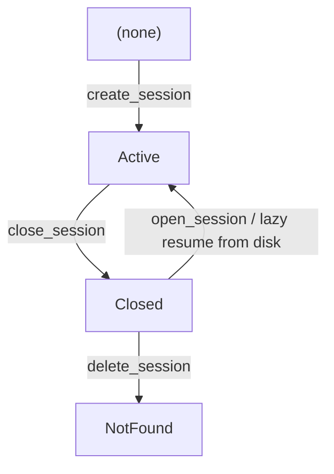

# ADR-038: Explicit Session Lifecycle Model

> **Chinese source of truth**: [ADR-038](../zh/ADR-038-session-lifecycle-explicit-model.md)
> **Terminology**: see [GLOSSARY.md](./GLOSSARY.md)

## Status

Draft — implemented (Phases 1–3 complete)

## Date

2026-07-17

## Decision Makers

大鱼 (Dayu)

## Predecessors

ADR-033 (MQTT replacing gRPC + WebSocket), ADR-034 (MQTT / HTTP responsibility boundary —
field-number offset convention, command-surface boundary), ADR-035 (streaming refactor — MQTT
data push), ADR-036 (MQTT connection state pushed actively by the backend)

---

## 1. Decision Summary

The session lifecycle moves from "three implicit conventions spread across the protocol,
implementation and frontend layers" to a **single observable contract**:

1. **Protocol**: a new `open_session` MQTT control command (proto field 29) becomes the only
   explicit transition from Closed/NotFound → Active; new `SessionOpened` / `SessionNotOpened`
   events (fields 35/36) act as the server-authoritative ack and the rejection receipt.
2. **Backend**: the HTTP `activate_session` / `deactivate_session` actions and the scattered
   `SessionManager::ensure_session_in_memory` calls are retired; `SessionManager::open()` becomes
   the single lazy-resume entry point; when a session-level command hits a non-Active session the
   runtime emits `SessionNotOpened` directly and **no longer implicitly lazy-resumes**.
3. **Frontend**: the three ambiguous actions `activateSession / switchSession / openTab` are
   split into three clearly bounded ones — `setActiveTab` (UI-only foreground switch),
   `openSession` (UI + backend activation) and `closeTab` (UI + backend close); `isSessionReady`
   becomes the single switch that unlocks the input box.

Four core principles:

1. **Single state**: `Active` (in memory) / `Closed` (JSONL + meta on disk) / `NotFound`
   (neither) are three observable states — no more "Active in the runtime but idle in the
   frontend" ambiguity.
2. **Explicit lifecycle**: Closed → Active must be triggered by the frontend sending
   `open_session`; the backend no longer "auto-resumes" on the frontend's behalf.
3. **Contract violations are visible**: when a session-level command (chat_message / model_switch
   / …) hits a non-Active session, the runtime emits `SessionNotOpened` and the frontend shows a
   toast with one-click reopen — no more silently dropping messages.
4. **Complete removal of the deprecated items**: HTTP `activate_session` / `deactivate_session`
   are deleted outright in Phase 3 (the desktop never called these two endpoints).

## 2. Root Cause

### 2.1 The bug reproduction chain

1. The user closes a session tab → the frontend sends `close_session` over MQTT → the Runtime
   closes the session task and removes it from memory (JSONL + meta are kept)
2. The user reopens the same session → the frontend's `switchSession` **only updates UI state**
   and never sends a backend activation command
3. The user sends a message → the frontend sends `chat_message` over MQTT → the Runtime's
   `forward_to_session_inbound` **fails: `session not found: <sid>`**
4. The conversation file never updates, the frontend stays idle, and the user sees no error
   (there is no toast path)

### 2.2 Architectural root causes

| Layer | Symptom | Fix |
|---|---|---|
| Protocol | the MQTT `ControlCommand` has no `open_session`; create / delete / close is missing one leg of the three-state transition | add `open_session` (field 29) + the `SessionOpened` / `SessionNotOpened` events |
| Backend implementation | 7 scattered `ensure_session_in_memory` calls on the HTTP path, 0 on the MQTT path — inconsistent behavior | replace all with a `get_session().is_none()` guard + emit `SessionNotOpened`; delete the `ensure_session_in_memory` alias |
| Frontend semantics | `switchSession / activateSession / openTab` couple "switch to foreground" with "open" | split into `setActiveTab` (strict UI) / `openSession` (UI + backend) / `closeTab` (UI + backend) |
| Design intent | "lazy resume" is an unwritten rule developers must remember; invisible in review, invisible in bugs | an explicit `open_session` command + a rejection event, so the contract is statically analyzable |

## 3. The State Machine



| Current state | create_session | open_session | close_session | delete_session | session-level MQTT command |
|---|---|---|---|---|---|
| NotFound | → Active | → Active (error if meta is absent) | error, no file | no-op | emit `SessionNotOpened` (reason=session_not_found) |
| Closed | error, already exists | → Active (loaded from JSONL) | no-op | → NotFound | emit `SessionNotOpened` (reason=session_closed) |
| Active | error, already exists | no-op (idempotent) | → Closed | → NotFound | handled normally |

**Key invariants**:

- An Active session **must be in memory** (a `SessionHandle` lives in `SessionManager::sessions`)
- A Closed session **has a JSONL + meta on disk**, nothing in memory
- A NotFound session **has neither on disk nor in memory**

Observation entry point:
`SessionManager::get_lifecycle_state(session_id, work_dir) -> SessionLifecycleState`.

## 4. Protocol Extension

### 4.1 The `OpenSession` command

Proto field 29 (immediately after the existing 28, per the field-offset convention in ADR-034
§3.2).

```protobuf
message ControlCommand {
  ...
  OpenSession open_session = 29;  // added by ADR-038
}

message OpenSession {
  string session_id = 2;
}
```

Semantics:

- **Active session** → return `SessionOpened` (status = `"already_active"`)
- **Closed session** → restore from JSONL + meta, return `SessionOpened`
  (status = `"resumed_from_disk"`)
- **NotFound session** → emit `SessionNotOpened` (reason = `"session_not_found"`)

Background: the old "subscribe push" `activate_session` HTTP action was renamed to
`enable_notify` at the ADR-034 stage and removed in ADR-035 Phase 3. This command is entirely
new "explicit activation" semantics (field 29) and has nothing to do with
`enable_notify` / `disable_notify` (24/25).

### 4.2 The `SessionOpened` event

Proto field 35, topic `acowork/agents/{id}/sessions/{sid}/opened` (Retained, QoS 1).

```protobuf
message SessionOpened {
  string session_id = 1;
  string status = 2;             // "already_active" | "resumed_from_disk"
  string model = 3;
  string provider = 4;
  int64  last_active_at = 5;
}
```

Desktop usage: on receipt it sets
`chatStore.agentStates[aid].sessionStates[sid].isSessionReady = true`, and writes `model` /
`provider` / `last_active_at` into the session header (previously these were only available
after the `session_state_changed` event).

### 4.3 The `SessionNotOpened` event

Proto field 36, topic `acowork/agents/{id}/sessions/{sid}/not_opened` (QoS 0,
fire-and-forget).

```protobuf
message SessionNotOpened {
  string session_id = 1;
  string attempted_command = 2;  // e.g. "chat_message" | "model_switch"
  string reason = 3;             // "session_not_found" | "session_closed"
}
```

Desktop usage: set `isSessionReady = false` (if that session is currently active) and show a
toast "Session is not open (`{reason}`)" with a `Reopen` button that calls
`chatStore.openSession(aid, sid)` — closing the loop in one click.

### 4.4 Field number allocation record

| Field | Message | Purpose | ADR |
|---|---|---|---|
| 35 | `SessionOpened` | success ack for `OpenSession` | ADR-038 |
| 36 | `SessionNotOpened` | rejection of a session-level command | ADR-038 |
| 29 | `OpenSession` (inside `ControlCommand.oneof`) | explicit activation | ADR-038 |

The old `activate_session` / `deactivate_session` field numbers were never exposed externally
(HTTP-only, never called by the desktop) and are deleted outright.

## 5. The Backend Contract

### 5.1 New `SessionManager` API

```rust
#[derive(Debug, Clone, Copy, PartialEq, Eq)]
pub enum SessionLifecycleState { NotFound, Closed, Active }

pub enum SessionOpenOutcome { AlreadyActive, ResumedFromDisk }

impl SessionManager {
    /// Observe the lifecycle state of a session.
    pub fn get_lifecycle_state(&self, session_id: &str, work_dir: &Path)
        -> SessionLifecycleState;

    /// Explicit transition: Closed/NotFound → Active (lazy-load from disk).
    /// Idempotent: Active → Active (returns `AlreadyActive`).
    pub async fn open(&mut self, session_id: &str, work_dir: &Path)
        -> Result<SessionOpenOutcome>;
}
```

**Deleted**: `ensure_session_in_memory` (the Phase 1 deprecated alias) is removed entirely. All
callers are replaced by `open()` or a `get_session().is_none()` guard.

### 5.2 Routing in `gateway_loop`

`InboundMessage::OpenSession` takes the system-level branch (it does not go through the
session-level `forward_to_session_inbound`) and calls `handle_open_session`:

```rust
async fn handle_open_session(...) -> Result<()> {
    match session_manager.get_lifecycle_state(session_id, work_dir) {
        NotFound => publish_session_not_opened("session_not_found").await,
        Active => publish_session_opened("already_active", ...).await,
        Closed => match session_manager.open(session_id, work_dir).await {
            Ok(ResumedFromDisk) => publish_session_opened("resumed_from_disk", ...).await,
            Err(_) => publish_session_not_opened("session_closed").await,
        },
    }
}
```

### 5.3 The rejection path for session-level commands (replaces lazy resume)

All session-level commands (chat_message / stop / continue_execution / approval_decision /
question_answer / intent / model_switch / reasoning_effort / workspace_switch /
compact_context / compress_action) are forwarded uniformly through:

```rust
fn forward_to_session_inbound(
    session_manager: &mut SessionManager,
    lifecycle_publisher: &MqttChunkPublisher,
    session_id: &str,
    attempted_command: &str,
    work_dir: &Path,
    msg: InboundMessage,
) -> Result<()> {
    match session_manager.get_session(session_id) {
        Some(handle) => handle.send_inbound(msg),
        None => {
            // Determine reason: Closed (file exists) vs NotFound
            let reason = match session_manager.get_lifecycle_state(session_id, work_dir) {
                Closed => "session_closed",
                _ => "session_not_found",
            };
            tokio::spawn(async move {
                let _ = lifecycle_publisher.publish_session_not_opened(
                    session_id, attempted_command, reason,
                ).await;
            });
            Err(RuntimeError::Config(format!("session not Active ({}): {}", reason, session_id)))
        }
    }
}
```

**Invariant**: the runtime never "automatically" turns Closed into Active; the frontend must
explicitly send `open_session`.

### 5.4 Removals

| Item | File | Phase 3 action |
|---|---|---|
| HTTP `activate_session` action | `cli.rs:1017-1072` | delete |
| HTTP `deactivate_session` block (already a no-op) | `cli.rs:1074-1086` | delete |
| 7 scattered `ensure_session_in_memory` calls | `cli.rs:lines 1107,1166,1210,1396,1437,1464,1569` | all replaced by a `get_session().is_none()` guard that returns / emits `agent_error` |
| the `SessionManager::ensure_session_in_memory` function | `session_manager.rs:1157-1168` | delete (the Phase 1 deprecated alias) |

**Grep verification**: after Phase 3, `grep ensure_session_in_memory core/` returns zero hits in
`core/` (apart from a doc comment in `conversation.rs`, since removed).

## 6. Frontend Operation Semantics

### 6.1 Three clearly bounded entry points

| Old function | New function | UI side effects | Backend side effects |
|---|---|---|---|
| `activateSession` | `setActiveTab` | set `activeSessionId` (only when sid ∈ `openSessionIds`) | none |
| `switchSession` + `openTab` | `openSession` | add to `openSessionIds`, set `activeSessionId`, lazily create `sessionStates[sid]` | send MQTT `open_session` + HTTP `loadSessionMessages` |
| `closeSession` (agent) | `closeTab` | remove from `openSessionIds`, select a neighbor as active; `isSessionReady=false` | send MQTT `close_session` |

**Test matrix**:

| Trigger | Function called |
|---|---|
| the user switches between already-open tabs | `setActiveTab` |
| the user picks a session from the history dropdown | `openSession` |
| the user clicks "+" and the `session_created` event lands | `activateNewlyCreatedSession` (wraps `openSession`) |
| the user switches agents → auto-activate the latest session | `openSession` (equivalent to a first open) |
| the user clicks a tab's close button | `closeTab` (async, waits for MQTT) |
| the user clicks "Reopen" on the `session_not_opened` toast | `openSession` |

### 6.2 Input box unlock: `isSessionReady`

`SessionChatState.isSessionReady: boolean`, initial value `false`:

- on `session_opened` → `true`
- on `session_not_opened` → `false` (if that session is currently active, show a toast)
- after `closeTab` → that session immediately becomes `false` (even before the backend acks)

The input box is disabled when `!isSessionReady || isAssistantReplying`.

### 6.3 Deleted functions

| Function | Location | Why deleted |
|---|---|---|
| `chatStore.activateSession` | `chatStore.ts` | overlaps `setActiveTab` in behavior but its semantics were rewritten to "switch to foreground" — delete to avoid ambiguity |
| `agentStore.switchSession` | `agentStore.ts:266` (old location) | its boundary against `chatStore.setActiveTab` / `openSession` was unclear; callers rewritten to `chat.openSession` |
| `chatStore.openTab` | `chatStore.ts` | deprecated; kept only as `_openTab` for external callers — new code must use `openSession` |

### 6.4 Custom toast bridging

`chatStore` is a zustand instance (not inside the React tree) and cannot call `useToast()`
directly. `ToastProvider` exposes `showToast()` bridged through
`window.CustomEvent("acowork:toast")`; the store just calls `showToast({...})`.

```typescript
// ToastProvider.tsx
export const TOAST_EVENT = "acowork:toast";
export function showToast(toast: Omit<Toast, "id">): void {
  window.dispatchEvent(new CustomEvent(TOAST_EVENT, { detail: toast }));
}

// Inside ToastProvider: a useEffect listener + addToast
useEffect(() => {
  const handler = (e: Event) => {
    const detail = (e as CustomEvent<Omit<Toast, "id">>).detail;
    if (detail) addToast(detail);
  };
  window.addEventListener(TOAST_EVENT, handler);
  return () => window.removeEventListener(TOAST_EVENT, handler);
}, [addToast]);
```

## 7. Migration Path

### Phase 1: protocol + backend contract (does not break existing behavior)

- 1.1 Proto: add the `OpenSession` command field 29
- 1.2 Proto: add the `SessionOpened` / `SessionNotOpened` event fields 35/36
- 1.3 `SessionManager::get_lifecycle_state` + `SessionOpenOutcome` + `open()`
- 1.4 The `InboundMessage::OpenSession` enum value
- 1.5 `gateway_loop`: implement `handle_open_session` + the state guard
- 1.6 `MqttChunkPublisher::publish_session_opened / publish_session_not_opened`
- 1.7 `mqtt_e2e` tests covering the three transitions

Compatibility: in Phase 1, `forward_to_session_inbound` still takes the "session not in memory →
error" path (no lazy resume), so an old desktop that does not send `open_session` will hit an
error — an explicit error rather than a silently dropped message, already a better experience
than before the fix.

### Phase 2: frontend alignment

- 2.1 `chatStore.activateSession` → `setActiveTab` (strict UI)
- 2.2 `chatStore.openSession` (UI + MQTT + load)
- 2.3 `chatStore.closeTab` gains the MQTT `close_session` side effect
- 2.4 `agentStore.deleteSession`: rewrite the `switchSession` reference to `chatStore.openSession`
- 2.5 the `session_created` event handler uses `setActiveTab`
- 2.6 `SessionTabBar.handleSelect` uses `openSession`
- 2.7 `chatStore` handles `SessionOpened` / `SessionNotOpened` (including the toast)
- 2.8 `types.ts` adds `SessionOpenedEvent` / `SessionNotOpenedEvent`
- 2.9 (implicit) `chat_mqtt.rs` passes the new events through + `mqtt_client.rs` adds the
  `OpenSession → "open_session"` topic mapping

### Phase 3: cleanup

- 3.1 `cli.rs`: delete the HTTP `activate_session` / `deactivate_session` actions
- 3.2 `cli.rs`: delete the 7 `ensure_session_in_memory` calls, replacing them with a
  `get_session().is_none()` guard
- 3.3 `gateway_loop`: delete the lazy-resume fallback (`forward_to_session_inbound` now emits
  `SessionNotOpened` instead)
- 3.4 `SessionManager`: delete the `ensure_session_in_memory` alias
- 3.5 This ADR (ADR-038)

Total estimate ~4 person-days, spanning 1–2 release cycles.

## 8. Acceptance Criteria

### 8.1 Protocol

- [x] proto field numbers 29 (`OpenSession`) + 35 (`SessionOpened`) + 36 (`SessionNotOpened`) do not conflict
- [x] `mqtt_e2e` tests: `open_session_on_closed_session_triggers_resume`, `..._on_active_session_is_idempotent`, `..._on_not_found_returns_error`

### 8.2 Backend

- [x] `SessionManager::open()` three-state transitions match the §3 matrix
- [x] `SessionManager::get_lifecycle_state()` returns the correct state
- [x] `forward_to_session_inbound` emits `SessionNotOpened` when it hits a non-Active session
- [x] the old `ensure_session_in_memory` function is deleted
- [x] the HTTP `activate_session` / `deactivate_session` actions are deleted
- [x] `grep ensure_session_in_memory core/` returns zero hits

### 8.3 Frontend

- [x] `chatStore.setActiveTab` (strict) / `openSession` / `closeTab` have clear, non-overlapping boundaries
- [x] `agentStore.switchSession` is deleted; all callers go through `chatStore.openSession`
- [x] `SessionTabBar.handleSelect` goes through `openSession`
- [x] `isSessionReady` is the single switch that unlocks the input box
- [x] on `session_not_opened` a toast with one-click reopen appears
- [x] `SessionOpenedEvent` / `SessionNotOpenedEvent` types are defined in `types.ts`

### 8.4 Build / static checks

- [x] `cargo check --workspace` passes
- [x] `cargo clippy --all-targets -- -D warnings` 0 warnings (runtime / tauri)
- [x] `npx tsc --noEmit -p apps/acowork-desktop` 0 errors
- [x] `cargo test -p acowork-runtime` including the new e2e tests all pass

## 9. Risks and Rollback

| Risk | Impact | Mitigation |
|---|---|---|
| An old desktop after Phase 1 does not send `open_session` | the runtime refuses to forward and emits `SessionNotOpened` | the old desktop sees no toast, but at least the logs show it and messages are not silently dropped |
| An old desktop after Phase 3 does not send `open_session` | same | keep backward compatibility for at least 1 release (the event surface — old desktop versions ignore it) |
| proto field number conflict | a compile error | 29 / 35 / 36 were all free, no conflict |
| The event-surface payload schema changes | an old desktop fails to parse | `SessionOpened` / `SessionNotOpened` are new enum values; the old desktop ignores them via its `_ => {}` default branch |
| Two tabs close the same session concurrently | the backend receives `close_session` several times | the backend's `close_session` is idempotent (Closed → Closed is a no-op) |
| `forward_to_session_inbound` uses `tokio::spawn` to emit `SessionNotOpened` asynchronously | if the runtime process is already gone, the spawned task is lost | the rejection event is best-effort; even if it is lost, the next session-level command triggers it again |

## 10. Implementation Checklist

Phases 1 + 2 + 3 are complete; the tasks below are all checked. The manual regression list is
retained for future QA runs.

**Phase 1 — proto + backend contract**: `OpenSession` command (field 29); the
`SessionOpened` / `SessionNotOpened` events; `SessionManager` gains the `SessionLifecycleState`
enum and `open()`; the `InboundMessage::OpenSession` enum value; `gateway_loop` implements the
`OpenSession` handler + state guard; `MqttChunkPublisher` gains
`publish_session_opened` / `publish_session_not_opened`; `mqtt_e2e` coverage.

**Phase 2 — frontend alignment**: `chatStore.activateSession` → `setActiveTab`; `chatStore`
gains `openSession`; `chatStore.closeTab` gains its MQTT side effect; `agentStore` deletes
`switchSession`; the `session_created` handler uses `setActiveTab` /
`activateNewlyCreatedSession`; `SessionTabBar.handleSelect` uses `openSession`; `chatStore`
handles the `SessionOpened` / `SessionNotOpened` events; `types.ts` gains the event types;
TypeScript compile errors resolved (`sessionPanel.tsx` / `agent-start.ts` / the unused
`evictStaleSessions`).

**Phase 3 — cleanup**: `cli.rs` deletes the `activate_session` / `deactivate_session` HTTP
actions; `cli.rs` deletes the 7 `ensure_session_in_memory` calls;
`gateway_loop::forward_to_session_inbound` becomes a strict guard that asynchronously emits
`SessionNotOpened`; `SessionManager` deletes the `ensure_session_in_memory` alias.

### Manual regression list (human QA)

- [ ] launch the app → select an agent → the default latest session auto-opens
- [ ] pick a session from the history list → the backend receives `open_session` → the input box is usable (`isSessionReady=true`)
- [ ] switch between already-open tabs → `setActiveTab` → the backend notices nothing (no re-sent `open_session`)
- [ ] close a tab → the backend receives `close_session` → memory is released; `isSessionReady` is immediately false
- [ ] reopen after closing → the backend lazy-resumes → messages can be sent (`SessionOpened` status=`resumed_from_disk`)
- [ ] the desktop fails to send `open_session` while the session is Closed → the first message yields `SessionNotOpened` reason=`session_closed` → toast + one-click reopen closes the loop

## 11. References

- ADR-033: MQTT replacing gRPC + WebSocket (the transport foundation)
- ADR-034 §3.2: the MQTT / HTTP field-number offset convention (29 / 35 / 36 are free numbers)
- ADR-035: MQTT streaming refactor (QoS 1 mandatory)
- ADR-036: MQTT connection state pushed actively by the backend (the principle separating the
  event surface from the `agent-event` channel)
- ADR-034 §7.1 G1: `UpdateSessionTitle` is no longer wrapped as a `SystemNotification` — the same
  lesson: this ADR uses structured command events throughout and never the legacy `Intent` path
