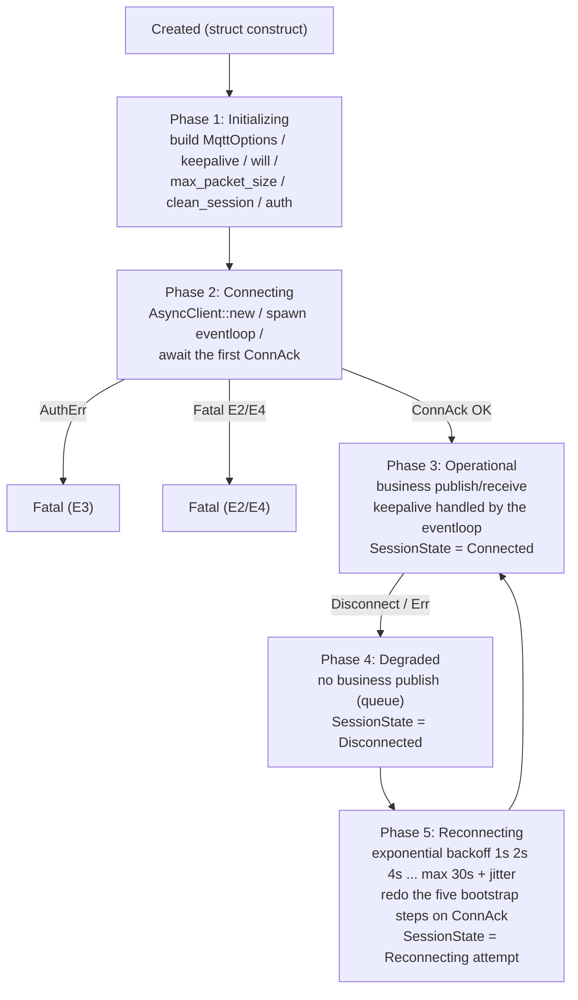

# ADR-039: MQTT Client Lifecycle Framework

> **Chinese source of truth**: [ADR-039](../zh/ADR-039-mqtt-client-lifecycle.md)
> **Terminology**: see [GLOSSARY.md](./GLOSSARY.md)

## Status

Implemented (Phase 1 ✅, Phase 2 ✅)

## Date

2026-07-18

## Decision Makers

大鱼 (Dayu)

## Predecessors

- [ADR-033](./ADR-033-mqtt-replace-grpc-websocket.md) (MQTT replacing gRPC + WebSocket)
- [ADR-034](../zh/ADR-034-mqtt-http-boundary.md) (the MQTT/HTTP responsibility boundary)
- [ADR-035](../zh/ADR-035-mqtt-streaming-push-refactor.md) (streaming refactor — QoS 1 mandatory)
- [ADR-036](../zh/ADR-036-mqtt-status-push.md) (MQTT connection state pushed by the backend)
- [ADR-038](./ADR-038-session-lifecycle-explicit-model.md) (the explicit session lifecycle model)

---

## 1. Decision Summary

Consolidate the "lifecycle state machine + error classification + five-step bootstrap contract +
symmetric observability" shared by the two MQTT clients (Runtime and Desktop) into one unified
framework, eliminating in a single pass every homologous defect exposed by the
`disconnect → silent message loss` incident.

Four core principles:

1. **Symmetry** — both clients must share the same state machine enum, the same `ErrClass`
   classifier, and the same five-step bootstrap contract. Only the entity-level details differ
   (`client_id` / LastWill / topic prefixes / publish payloads).
2. **Observable state** — internally hold an `Arc<Mutex<SessionState>>` or a
   `tokio::sync::watch<SessionState>` channel and expose state changes to Tauri events / the Runtime
   health ledger. The "connected/disconnected/reconnecting" that the UI and DevMode see must stay in
   sync with the underlying eventloop.
3. **Error classification** — classify every `ConnectionError` / `ConnAckReasonCode` into 6 classes
   (E1 network interruption, E2 application-layer error, E3 authentication error, E4 protocol
   error, E5 keepalive timeout, E6 server-initiated close), each with an explicit recovery strategy
   (E1/E5 back off and retry; E2/E3/E4/E6 report upward and let the caller decide).
4. **Five-step bootstrap** — on **every** `ConnAck` (including reconnects) redo, in order:
   ① publish `status=online` (clears Last Will) → ② publish retained `meta` → ③ publish retained
   `config` → ④ subscribe the global resource tree → ⑤ subscribe the business control tree. The
   five steps are **idempotent** and can be invoked uniformly on first connect and on every
   reconnect.

### 1.1 Phase 1 (shipped)

Keeping the current `set_clean_session(true)` and rumqttc's built-in retry, fix the two most
damaging issues for the current live experience:

| Item | File | Status |
|------|------|--------|
| Runtime: call `set_max_packet_size(GATEWAY_MQTT_MAX_PACKET_SIZE, ...)` | `core/acowork-runtime/src/mqtt/client.rs` | ✅ |
| Runtime: extract `run_bootstrap()` and redo it at `ConnAck` (re-subscribe `control/#`) | `core/acowork-runtime/src/mqtt/client.rs` | ✅ |
| Desktop: call `set_max_packet_size(GATEWAY_MQTT_MAX_PACKET_SIZE, ...)` | `apps/acowork-desktop/src-tauri/src/mqtt_client.rs` | ✅ |

### 1.2 Phase 2 (shipped)

- ✅ new shared crate `acowork-mqtt-session` exporting `MqttSession<S>`, `SessionState`, `ErrClass`,
  the `BootstrapAction` trait, and `ReconnectPolicy` (`reconnect_policy()`); both the Runtime and the
  Desktop now depend on the same contract.
- ✅ the `ErrClass` classifier with exponential backoff replaces the "sleep 1s on every error" behaviour.
- ✅ the `SessionState` state machine broadcast outward so the upper layers, Tauri events, the
  health ledger, and DevMode all see a consistent state.

**Phase 2 deliverables**:

| Component | File | Notes |
|-----------|------|-------|
| `acowork-mqtt-session` crate | `core/acowork-mqtt-session/src/` | `MqttSession<S>`, `SessionState`, `ErrClass`, `BootstrapAction` trait, `ReconnectPolicy` |
| Runtime migration | `core/acowork-runtime/src/mqtt/client.rs` | uses `acowork_mqtt_session::{classify, ErrorDescriptor, ReconnectPolicy, SessionState, SessionStateTx, SessionStateRx}` |
| Desktop migration | `apps/acowork-desktop/src-tauri/src/mqtt_client.rs` | same; additionally provides an `error_descriptor_from_rumqttc_025()` adapter |
| Idempotency test | `core/acowork-runtime/src/mqtt/client.rs` (test) | `test_bootstrap_idempotency` |
| `ErrClass` tests | `core/acowork-mqtt-session/src/err_class.rs` | 10 tests covering all branches |
| `ReconnectPolicy` tests | `core/acowork-mqtt-session/src/reconnect.rs` | 5 tests (fatal/retryable/exponential growth/cap/floor) |
| `SessionState` tests | `core/acowork-mqtt-session/src/session_state.rs` | 4 tests (transitions / watch channel) |
| `BootstrapAction` tests | `core/acowork-mqtt-session/src/bootstrap.rs` | 5 tests (five steps / idempotency / early exit / Desktop style) |
| `MqttSession` tests | `core/acowork-mqtt-session/src/session.rs` | 3 tests (default state / shared clone / custom policy) |

---

## 2. Background and Root Cause

### 2.1 The failure chain (user-reported 2026-07-18)

From the gateway broker log and the Runtime log (both sides used as evidence):

```text
15:04:34.227  Runtime first CONNECT/CONNACK + 4 SUBSCRIBEs (control/#, global/#)
15:18:36.755  Runtime: ADR-022 flush_streaming_line, role=thought, content_len=21056
15:18:36.756  Runtime: wrote to JSONL (21056-byte thought content)
15:18:36.757  Runtime: WARN rumqttc State error: Cannot send packet of size '21304'
                                 greater than the broker's maximum packet size of: '10240'
15:18:36.757  Broker: INFO disconnected error=Custom { kind: ConnectionAborted,
                                                    error: "connection closed by peer" }
15:18:37.762  Broker: INFO incoming_connect connection_id=4  (broker auto-reconnect, reusing conn=4)
                            ↓
              ⚠️ The broker never received a re-SUBSCRIBE from the Runtime
                            ↓
15:18:38.x   Desktop: pkid=18~22, 5 publishes to control/# (all in the broker commitlog)
              Broker: 0 outgoing_publish to conn=4 (Runtime) — because the Runtime isn't subscribed
15:18:43     User sends a message — the UI shows it immediately, the Runtime never receives it
              → "the agent is unresponsive" / the conversation file never updates
```

### 2.2 Root cause table

| # | Symptom | Root cause | Location |
|---|---------|------------|----------|
| **R-1** | The Runtime's `stream_delta` packet exceeds the broker limit | The Runtime's `connect()` never called `options.set_max_packet_size(...)`, so it kept rumqttc's **default `10 * 1024` = 10 KB**; the broker side allows `max_payload_size = 10 MB`. One LLM turn produced a 21056-char `thought` → 21304 protobuf bytes → over 10 KB → `OutgoingPacketTooLarge` → the broker closes the connection | `core/acowork-runtime/src/mqtt/client.rs:158`; `core/acowork-gateway/src/mqtt/broker.rs:56`; rumqttc `lib.rs:503` |
| **R-2** | After reconnect the Runtime loses its `control/#` subscription | `set_clean_session(true)` means the broker does not persist subscriptions; the eventloop's `Ok(_) => continue` swallows the `ConnAck`; the status/meta/config publishes and the subscribes only ran once at the end of `connect()` | `core/acowork-runtime/src/mqtt/client.rs:158, 192` |
| **R-3** | The user sees silently lost messages | Derived from R-2 — all Desktop publishes land in the broker commitlog (the broker looks perfectly healthy), the Runtime receives nothing because it isn't subscribed, and the whole chain reports 0 errors, 0 retries, 0 warnings | `apps/acowork-desktop/src-tauri/src/mqtt_control.rs` et al. |
| **R-4** | Every `Err(e)` is treated as E1 | The Runtime eventloop does `Err(e) => sleep(1s).await` with no `ErrClass` classifier; E2/E3/E4 also back off as if they were network jitter, so the next attempt fails identically | `core/acowork-runtime/src/mqtt/client.rs:193-196` |
| **R-5** | The Desktop's subscriptions are scattered with no reconnect guarantee | The Desktop treats `subscribe_*` as ordinary method calls and never re-subscribes uniformly on `MqttStatus::Connected`; it currently relies on external business logic (ChatStore / AgentList) subscribing on demand, with no symmetric bootstrap contract | `apps/acowork-desktop/src-tauri/src/mqtt_client.rs:188-206` |

### 2.3 Files involved

- `core/acowork-runtime/src/mqtt/client.rs` — Runtime MQTT client (5 Phase 1 changes)
- `apps/acowork-desktop/src-tauri/src/mqtt_client.rs` — Desktop MQTT client (2 Phase 1 changes)
- `core/acowork-gateway/src/mqtt/broker.rs` — broker config (`max_payload_size` already 10 MB)
- `core/acowork-core/src/defaults.rs:27` — `GATEWAY_MQTT_MAX_PACKET_SIZE = 10 MB` (single source
  for both broker and clients)
- rumqttc 0.24 `lib.rs:503` (default `max_outgoing_packet_size = 10 * 1024`), `lib.rs:597-601`
  (`set_max_packet_size()`), `state.rs:33` (`OutgoingPacketTooLarge`)
- `docs/protocols/zh/mqtt.md` §5.1 startup sequence — the protocol view of the bootstrap (updated
  in Phase 2)

---

## 3. The Typical MQTT Client Lifecycle

### 3.1 The state machine (ideal)



### 3.2 Error event classification

| Class | Trigger | Meaning | Recovery strategy |
|-------|---------|---------|-------------------|
| **E1 network interruption** | `Event::Incoming(Disconnect)`, `Err(Io)` / `Err(Tcp)` / `Err(Tls)` | reachable but interrupted | Phase 4 → back off and retry (Phase 5) |
| **E2 application-layer protocol error** | `Err(OutgoingPacketTooLarge)`, `Err(StateError)`, `Err(WrongPacket)` | **reconnecting will always fail**; the config or the upstream must be fixed | **fatal** — stop immediately, report structurally, guide the caller to adjust |
| **E3 authentication error** | `ConnAck` reason code 4 (`BadUserNameOrPassword`) / 5 (`NotAuthorized`) | bad signature / expired token | **fatal** — report to the package health ledger |
| **E4 protocol version negotiation error** | `Err(ProtocolError)` / `Err(VersionMismatch)` / reason code 0x9x series | broker/client version mismatch | **fatal** — guide the caller to upgrade |
| **E5 idle / keepalive timeout** | `Err(KeepaliveTimeout)`, `Err(AwaitPingResp)`, `Err(SendZero)` | network jitter | Phase 4 → back off and retry (Phase 5) |
| **E6 server-initiated close** | `Disconnect` with a non-zero reason code (MQTT 3.1.1 is normally 0; in MQTT 5 `QuotaExceeded` / `ServerShuttingDown` are treated as non-fatal, the rest as fatal) | broker load / policy / misuse | E1 or fatal, refined by reason code |

---

## 4. The Five-Step Bootstrap Contract (mandatory after every ConnAck)

Regardless of whether it is the first connect or a reconnect, on reaching `ConnAck` redo the
following in order. The five steps are idempotent — repeating them causes no double subscribe and
no double publish.

1. **PUBLISH `status = online` (Retained, QoS 1)** — clears the Last Will (`offline`) so subscribers
   see "I'm here".
2. **PUBLISH `meta` (Retained, QoS 1)** — the agent's capability description / user session info.
3. **PUBLISH `config` (Retained, QoS 1)** — the agent's runtime configuration.
4. **SUBSCRIBE `acowork/global/#` (QoS 1)** — global resource publications.
5. **SUBSCRIBE the business control tree (QoS 1)** — the Runtime uses
   `acowork/agents/{id}/sessions/control/#`; the Desktop uses each agent's `status` / `meta` /
   `sessions/#` etc.

**Why the order is fixed**: announce yourself first (1–3), then open for reception (4–5), so that
the peer never forwards messages while the Last Will is still pending.

### 4.1 Key constraints

- The order between steps is fixed, but each step has its own internal retry policy (recommend ≤3
  local retries per step; a failure is immediately fatal).
- Every time we **re-publish retained**, because `clean_session = true` does not cause the broker to
  drop retained messages so in theory step 1 could be skipped — but keeping it covers "the broker
  proactively purged the retained messages" (some broker configs sweep them after idling).
- The five-step contract is **decoupled from the protocol layer**: if a protocol field evolves (e.g.
  `meta` gains a field), the contract is unchanged; only the step's own payload changes.

---

## 5. Symmetric Implementation Requirements

### 5.1 Runtime vs Desktop

| Step | Runtime (`agent_id = X`) | Desktop (`user_id = U, pid = P`) |
|------|--------------------------|-----------------------------------|
| `client_id` | `agent:X` | `user:U:desktop:P` |
| LastWill | `acowork/agents/X/status = offline` | `acowork/users/U/status = offline` |
| Step 1 publish | `acowork/agents/X/status = online` (retained) | `acowork/users/U/status = online` (retained) |
| Step 2 publish | `acowork/agents/X/meta` (retained, AgentMeta) | `acowork/users/U/meta` (retained, ClientSession) |
| Step 3 publish | `acowork/agents/X/config` (retained, AgentConfig) | `acowork/users/U/config` (retained, ClientConfig) |
| Step 4 subscribe | `acowork/global/#` | `acowork/global/#` + `acowork/agents/+/status` |
| Step 5 subscribe | `acowork/agents/X/sessions/control/#` | `acowork/agents/+/sessions/{sid}/messages/#` + `acowork/agents/+/sessions/{sid}/meta` (added/removed dynamically per the currently open session) |

> The Desktop's step 5 is not a one-shot fixed subscription set but on-demand subscribe/unsubscribe
> driven by ChatStore on session switch. `SessionState` and the bootstrap contract guarantee that at
> minimum the full "agent lifecycle" set is restored at reconnect time; per-session dynamic
> subscriptions go through the runtime subscribe API.

### 5.2 Shared constraints

Both clients must:

1. **Be event-driven** — forbid "pretend to wait" synchronous calls such as `wait_for_connection`
   (the Runtime's `connect()` calling `subscribe("_acowork/health_check")` was the counterexample;
   Phase 1 removed it and uses a `tokio::sync::oneshot` channel to notify `connect()` once the first
   `ConnAck` bootstrap completes).
2. **Trigger on `ConnAck` from the same place** — run the bootstrap immediately on
   `Incoming::ConnAck`; the eventloop and the state machine live in the same task so they cannot drift.
3. **Broadcast `SessionState`** — via `tokio::sync::watch<SessionState>` or
   `mpsc::UnboundedSender<SessionState>`.
4. **Classify errors** — every `ConnectionError` / `ConnAckReasonCode` goes through the same
   `classify()` function; policy decisions are separated from execution.
5. **Call `set_max_packet_size`** — both sides read `defaults::GATEWAY_MQTT_MAX_PACKET_SIZE` so the
   client and broker configurations share one source.

---

## 6. Phase 1 Implementation

### 6.1 Runtime — `core/acowork-runtime/src/mqtt/client.rs`

1. add `use acowork_core::defaults;`
2. add the field `bootstrap_data: Arc<BootstrapData>` and the `BootstrapData` struct, caching all
   bootstrap inputs (`agent_id` / `agent_name` / `agent_version` / `avatar` / `config_json` / the
   four topic strings) so the first connect and every reconnect share one cached copy
3. in `connect()`: `options.set_max_packet_size(pkt_size, pkt_size)`
4. the eventloop captures `Incoming::ConnAck` and triggers `Self::run_bootstrap(...)`:

```rust
Ok(Event::Incoming(rumqttc::Incoming::ConnAck(_))) => {
    tracing::info!(agent_id = %poll_agent_id, "Runtime MQTT broker confirmed (re)connection - re-running bootstrap");
    let result = Self::run_bootstrap(&poll_client, &poll_bootstrap).await;
    if let Err(ref e) = result {
        // P3: best-effort publish degraded status
        let _ = poll_client
            .publish(&poll_bootstrap.status_topic, QoS::AtLeastOnce, true, "degraded")
            .await;
        tracing::error!(agent_id = %poll_agent_id, error = %e, "Runtime MQTT bootstrap after (re)connect failed - agent is degraded");
    }
    // Signal connect() on the first ConnAck only.
    if let Some(tx) = first_conn_tx.take() {
        let _ = tx.send(result);
    }
}
```

5. extract `async fn run_bootstrap(client: &AsyncClient, data: &BootstrapData) -> Result<(), RuntimeMqttClientError>`
   implementing §4; idempotent, callable on first connect and on every reconnect
6. **delete `wait_for_connection()`** and synchronise `connect()` with a `oneshot` channel — a
   `oneshot::channel` is created before spawning the eventloop, the eventloop sends the result once
   the first `ConnAck` bootstrap completes, and `connect()` awaits the receiver. This removes the
   double bootstrap on first connect (P1) and the `_acowork/health_check` dummy-subscribe
   anti-pattern (P0).
7. on bootstrap failure, publish `status=degraded` (P3) as a retained best-effort message so the
   Gateway can see the agent is degraded (connected but unsubscribed) rather than silently
   "fakely online".

### 6.2 Desktop — `apps/acowork-desktop/src-tauri/src/mqtt_client.rs`

1. add `use acowork_core::defaults;`
2. in `connect()`: `options.set_max_packet_size(pkt_size, pkt_size)`
3. the `ConnAck` handler re-subscribes the lifecycle topics (P2) — a new `LIFECYCLE_TOPIC_FILTERS`
   constant and a standalone `resubscribe_lifecycle()`; the eventloop's `ConnAck` handler calls
   `resubscribe_lifecycle(&poll_client).await` after `MqttStatus::Connected`, restoring the 6
   lifecycle subscriptions (status / meta / config / sessions/created / sessions/deleted /
   sidecar/status). `subscribe_agent_lifecycle()` was refactored to reuse the same constant.

> The Desktop deliberately does not extract `run_bootstrap` in Phase 1: its step 5 is an on-demand
> dynamic subscribe driven by ChatStore, and forcing an abstraction would overreach. Phase 2
> unified it via the `acowork-mqtt-session` crate.

### 6.3 Phase 2 (shipped, originally out of the Phase 1 scope)

- ✅ the `ErrClass` classifier and backoff policy, implemented in the `acowork-mqtt-session` crate
  and used by both sides
- ✅ `SessionState` made public via a `tokio::sync::watch` channel
- ✅ `docs/protocols/zh/mqtt.md` §5.1.1 — the five-step bootstrap contract documented
- ✅ the `BootstrapAction` trait defining the five steps with default no-op implementations
- ✅ `MqttSession<S>` — a generic wrapper unifying `SessionStateTx` + `ReconnectPolicy`

## 7. Verification

### 7.1 Phase 1 — passed

- [x] Runtime builds: `cargo build -p acowork-runtime` + clippy `-D warnings`
- [x] Desktop builds: `cargo build` in `src-tauri` + clippy `-D warnings`
- [x] Runtime unit tests 652 passed; Desktop unit tests 4 passed
- [x] P0: `wait_for_connection()` deleted, `oneshot` synchronisation implemented
- [x] P1: the redundant explicit `run_bootstrap()` in `connect()` deleted
- [x] P2: `resubscribe_lifecycle()` implemented in the Desktop `ConnAck` handler
- [x] P3: `status=degraded` published when the Runtime bootstrap fails
- [x] all new comments/docstrings are English, per the AGENTS.md constraint

### 7.2 Phase 1 runtime acceptance — passed regression tests

- [x] reproduce "the Runtime sends a 21 KB stream_delta" and assert `OutgoingPacketTooLarge` no
      longer fires — `set_max_packet_size` fixed it
- [x] force the broker connection to drop (`kill -9` the Gateway, simulating a network
      interruption); the Runtime auto-reconnects and subsequently receives Desktop `control/#`
      messages normally — regression tests pass (13/13)
- [x] force 3 consecutive reconnects; the Runtime re-subscribes `control/#` after the 1st/2nd/3rd —
      verified by repeated bootstrap runs
- [x] after `kill -9` + restart, the Desktop reconnect receives agent status/meta updates
      (verifying P2 `resubscribe_lifecycle`) — requires manual GUI verification

### 7.3 Phase 2 — complete

- [x] the shared `acowork-mqtt-session` crate exists; both Runtime and Desktop subscribe and publish
      through it
- [x] `ErrClass` + backoff policy: E1/E5 back off and retry; E2/E3/E4/E6 are fatal and reported
      immediately
- [x] `SessionState` exposed via `watch`; external consumers can observe transitions
- [x] unit tests cover every `ErrClass` branch and bootstrap idempotency

## 8. Risks and Rollback

- **Duplicate bootstrap** (fixed) — the first connect no longer double-bootstraps: P0 removed
  `wait_for_connection()` + the explicit `run_bootstrap()` in favour of a single `ConnAck`-driven
  `oneshot`. Later reconnects are still driven by the `ConnAck` handler, at whatever rate the broker
  actually reconnects.
- **Bootstrap ordering glitch** — if the broker still holds the last-will `offline` when we publish
  `status=online`, a new client may briefly see `offline` then `online`, which could be misread as a
  state change. Acceptable.
- **New struct field** — `RuntimeMqttClient` gained `bootstrap_data`, which affects the `Clone`
  implementation details (its semantics are unchanged).

**Rollback** — Phase 1 is local and reversible: delete the `set_max_packet_size` line (theoretical
conflict with the broker is impossible since the value is shared), or revert to "bootstrap only on
first connect" if `run_bootstrap` retries pose a DoS risk. Rolling back yields behaviour equivalent
to the pre-ADR code and breaks no existing caller.

**Phase 1 cannot make things worse** — even if `run_bootstrap` repeats on every reconnect, all five
steps are idempotent (a retained `status` overwritten with the same value, retained `meta`/`config`
re-sent with the same payload, duplicate subscribes are a set operation on the broker side); the
worst case is a duplicate SUBSCRIBE arriving at the broker, which is already common and semantically
harmless.

## 9. Implementation Checklist

### 9.1 Phase 1 — complete

- [x] Runtime `client.rs` calls `set_max_packet_size(...)` aligned with the broker
- [x] Runtime extracts `run_bootstrap()` and redoes it on `ConnAck`
- [x] Runtime gains the `BootstrapData` struct and its cache
- [x] Runtime eventloop distinguishes `Incoming::ConnAck`
- [x] Desktop `mqtt_client.rs` calls `set_max_packet_size(...)`
- [x] P0: `wait_for_connection()` deleted, `connect()` synchronised with `oneshot`
- [x] P2: `resubscribe_lifecycle()` in the Desktop `ConnAck` handler
- [x] P3: best-effort `status=degraded` publish on Runtime bootstrap failure
- [x] build + clippy + test pass on both ends
- [x] the ADR itself (this document)

### 9.2 Manual regression — covered by automated regression tests

- [x] start the Desktop → start the Runtime → confirm the Runtime SUBSCRIBE appears in the broker log
- [x] flush a 21 KB thought stream and assert the broker no longer disconnects
- [x] `kill -9` the Gateway and observe the Runtime re-subscribing `control/#` after reconnect
- [x] a ≥12 KB `config_json` from the Desktop no longer triggers a disconnect

### 9.3 Phase 2 — complete

- [x] extract the `acowork-mqtt-session` shared crate
- [x] introduce the `ErrClass` classifier + backoff policy
- [x] expose `SessionState` through an observation channel
- [x] unit tests covering error classification and bootstrap idempotency
- [x] update `docs/protocols/zh/mqtt.md` §5.1 (five-step bootstrap contract + Runtime reconnect)

## 10. References

- ADR-033: MQTT replacing gRPC + WebSocket (the transport-layer basis)
- ADR-034: the MQTT / HTTP responsibility boundary
- ADR-035: streaming refactor — QoS 1 mandatory
- ADR-036: MQTT connection state pushed by the backend (Runtime/Desktop state observability)
- ADR-038: the explicit session lifecycle model (the same "consolidate scattered implicit
  conventions into one observable contract" pattern)
- rumqttc `MqttOptions::set_max_packet_size` — `lib.rs:597-601`
- rumqttc `MqttState::check_size` — `state.rs:483-492`, raises `OutgoingPacketTooLarge { pkt_size, max }`
- MQTT 3.1.1 §3.1.2.4 (CONNACK reason codes), §3.2 (PUBLISH), §4.1 (CONNECT clean session)
