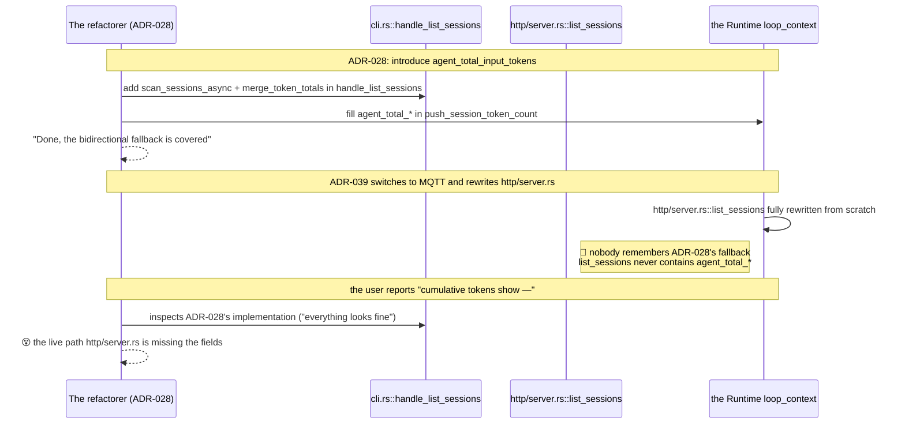
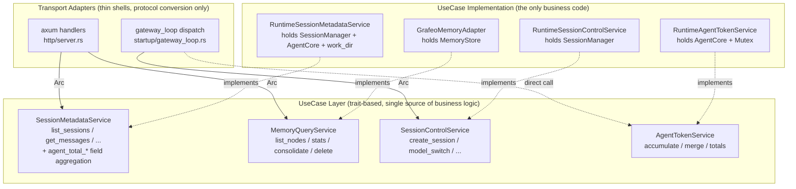

# ADR-040: Runtime Adapter Consolidation — Introducing a UseCase Trait Layer and Clearing gRPC Dead Code

> **Chinese source of truth**: [ADR-040](../zh/ADR-040-runtime-adapter-use-case-layer.md)
> **Terminology**: see [GLOSSARY.md](./GLOSSARY.md)

## Status

Draft (awaiting scope confirmation)

## Date

2026-07-19

## Decision Makers

大鱼 (Dayu)

## Predecessors

- [ADR-016](../zh/ADR-016-centralized-exception-handling.md) (IPC gRPC migration)
- [ADR-031](../zh/ADR-031-drop-legacy-ipc-consolidate-on-grpc.md) (dropping legacy IPC remnants)
- [ADR-033](../en/ADR-033-mqtt-replace-grpc-websocket.md) (MQTT replacing gRPC + WebSocket)
- [ADR-034](../zh/ADR-034-mqtt-http-boundary.md) (the MQTT/HTTP boundary)
- [ADR-039](../zh/ADR-039-mqtt-client-lifecycle.md) (MQTT client lifecycle)

---

## Decision Summary

**The "duplicate implementation / missed refactor" problem is solved in two phases**:

| Phase | Scope | Effort | Risk |
|---|---|---|---|
| **Phase 1 — clear dead code + fix the current bug** | fix `http/server.rs::list_sessions` missing the ADR-028 aggregation + delete `cli.rs::process_gateway_recv`'s 14 handlers + delete the `grpc/` module | ~1 week | low |
| **Phase 2 — a UseCase trait abstraction layer** | define 4 traits (SessionMetadata / MemoryQuery / SessionControl / AgentToken) in `acowork-runtime/src/usecases/`, converge the currently scattered methods into a single implementation, and rework `http/server.rs` plus the `gateway_loop` dispatch | ~3 weeks | medium |

**Key decisions** (already confirmed with 大鱼):

| Decision | Rationale |
|---|---|
| The UseCase traits live in **`acowork-runtime/src/usecases/`** | no new crate; a small change surface; acowork-runtime already holds all the runtime context |
| **No UseCase on the Gateway side** | the Gateway has its own PackageManager / Provider / IntentRouter business, which differs from the Runtime's "inside an agent instance" responsibilities; forcing an abstraction would instead fracture the existing architecture |
| No nested `Arc<dyn Trait>` container | the Runtime state already holds `Arc`s of concrete types (SessionManager / AgentCore); the use case impls hold concrete types directly and `.clone() as Arc<dyn ...>` at the point where a trait boundary is needed |
| Phase 1 first (does not block the current bug fix); Phase 2 started depending on circumstances | Phase 1 is "immediate hemostasis"; Phase 2 is "long-term immunity" |

**Explicitly out of scope for this ADR**:

- Gateway-side agent lifecycle / provider / cron business is not extracted into UseCases
- The Desktop side does not adopt the UseCase concept (the frontend naturally has a single adapter)
- No heavyweight frameworks such as hex/clean architecture
- No CQRS / Event Sourcing

---

## Background

### 1. The triggering event

While investigating the desktop bug where the "Agent Status panel on the right shows '—' for
cumulative input/output tokens":

the `http/server.rs::list_sessions` response **contains no**
`agent_total_input_tokens` / `agent_total_output_tokens` fields at all (an incomplete ADR-028
implementation), so the desktop's `agentTokenTotals` is permanently `null`.

The odd part: ADR-028 commit `6e98c17` **did implement the complete agent_total aggregation** in
`cli.rs::handle_list_sessions` — but that path is dead code, producing "the implementation looks
fine, but the live path is missing it".

### 2. Inventory of the 5 adapter layers

| # | Adapter | Path | Status | Functional ownership |
|---|---|---|---|---|
| 1 | **Gateway HTTP API** | `core/acowork-gateway/src/http/*.rs` (agents / chat / cron / memory_api etc.) | ✅ active | the Gateway's own responsibilities |
| 2 | **Gateway HTTP Proxy** | `core/acowork-gateway/src/http/proxy.rs` | ✅ active | a clean reverse proxy |
| 3 | **Runtime HTTP server** | `core/acowork-runtime/src/http/server.rs` | ✅ active | query-type (list_sessions / get_messages / memory_*) |
| 4 | **Runtime MQTT Control** | `core/acowork-runtime/src/mqtt/control_handler.rs` + `startup/gateway_loop.rs` | ✅ active | session control-type (create / close / model_switch) |
| 5 | **gRPC Intent path** | `core/acowork-runtime/src/cli.rs::process_gateway_recv` | 💀 **dead code** | removed by ADR-034 §8 Phase 2-2, never cleaned up |

### 3. Evidence of dead code

**ADR-034 §8 Phase 2-2 already declared it obsolete**:

```rust
// core/acowork-runtime/src/startup/gateway_loop.rs:81-87
// ADR-034 §8 Phase 2-2: gRPC path removed. MQTT client is mandatory.
if ctx.mqtt_client.is_none() {
    return Err(crate::error::RuntimeError::Config(
        "Phase D entered without MQTT client (gRPC path removed per ADR-034 §8 Phase 2)"
            .into(),
    ));
}
```

**The author already annotated it**:

```rust
// core/acowork-runtime/src/cli.rs:939
#[allow(dead_code)]
async fn process_gateway_recv(
```

**The Gateway no longer sends IntentReceived**:

```bash
$ grep -rn "GatewayResponse::IntentReceived" core/acowork-gateway/src/
# 0 results
```

The Gateway has switched to the MQTT ControlCommand proto transport. The Runtime's
`process_gateway_recv` will never receive an IntentReceived message.

### 4. The dead-code inventory

The 14 handlers in `cli.rs::process_gateway_recv` plus the function body, ~1500 lines total:

| Handler / implementation | Lines | Replacement |
|---|---|---|
| `handle_list_sessions` | cli:2759-2904 | http/server.rs::list_sessions |
| `handle_get_session_messages` | cli:2906+ | http/server.rs::get_messages |
| `handle_memory_nodes_query` | cli:2655 | http/server.rs::get_memory_nodes |
| `handle_memory_stats_query` | cli:2689 | http/server.rs::get_memory_stats |
| `handle_memory_delete_query` | cli:2713 | http/server.rs::delete_memory_node |
| `handle_memory_consolidate_query` | cli:2731 | http/server.rs::trigger_consolidate |
| inline `create_session` | cli:998 | mqtt/control_handler + gateway_loop dispatch |
| inline `close_session` / `delete_session` / `update_session_title` | cli | same |
| inline `model_switch` / `reasoning_effort` | cli | same |
| inline `interrupt` / `continue_execution` | cli | same |
| inline `approval_decision` / `question_answer` | cli | same |
| inline `compact_context` / `compress_action` | cli | same |

Plus `core/acowork-runtime/src/grpc/client.rs` (~1450 lines),
`core/acowork-runtime/src/grpc/mod.rs`, the `grpc_client` references in
`tools/builtin/intent_send.rs`, and the entire `core/acowork-gateway/src/grpc/server.rs` directory
(the other side of what ADR-031 missed when it dropped the ipc side).

**Total dead code: ~3000+ lines** (including the grpc modules).

### 5. The propagation chain of this bug



**Root cause**: the refactorer looked at `handle_list_sessions` in cli.rs, which *looked* alive, and
assumed ADR-028's fallback was fully implemented. But the CLI path was dead. **The real live path is
`http/server.rs`, and it never inherited ADR-028.**

### 6. The hidden anti-pattern today

Even without the dead code, **adapters calling the lower-level modules directly is itself an
anti-pattern**:

```rust
// http/server.rs:326-369 (the current list_sessions implementation)
async fn list_sessions(...) -> Result<Json<serde_json::Value>, StatusCode> {
    let scanned = scan_sessions_from_meta(&conversations_dir);  // a direct disk scan call
    let page_sessions = scanned.into_iter().map(|(session_id, meta)| {
        serde_json::json!({  // hand-picking fields (tokens and agent_total_* are missing)
            "session_id": session_id,
            "title": meta.title,
            // ...
        })
    }).collect();
    Ok(Json(serde_json::json!({  // hand-building the response (agent_total_input_tokens is missing)
        "sessions": page_sessions,
    })))
}
```

```rust
// cli.rs:2759 (handle_list_sessions, the "fake" implementation)
async fn handle_list_sessions(...) -> Result<()> {
    let (sessions, total_count, agent_totals) = scan_sessions_async(...).await;
    session_manager.core().merge_token_totals((Some(agent_totals.0), Some(agent_totals.1)));
    let (agent_total_input_tokens, agent_total_output_tokens) =
        session_manager.core().agent_token_totals();
    // ... then assemble the response
}
```

**The same business capability, two completely different-looking code paths** — one hand-writing
JSON field selection, one calling `scan_sessions_async` to aggregate. Whichever one anyone changes
later, the other will not follow automatically.

### 7. The project already has a trait-abstraction precedent

- ✅ the `MemoryStore` trait at `acowork-memory/src/store.rs` — the Memory domain already has a
  trait abstraction
- ❌ Session / Agent / ConversationMeta — all call the implementations directly

**This shows the project accepts trait abstraction, but it was never promoted across all domains.**

## The Solution

### Phase 1: clear dead code + fix the current bug

#### 1.1 Fix the ADR-028 omission in `http/server.rs::list_sessions`

`core/acowork-runtime/src/http/server.rs:326-369` switches to reusing `scan_sessions_async` +
`merge_token_totals`, adding `agent_total_input_tokens` / `agent_total_output_tokens` at the top
level of the response:

```rust
async fn list_sessions(
    State(s): State<RuntimeHttpState>,
    Query(q): Query<ListSessionsQuery>,
) -> Response {
    let conversations = s.work_dir.join("conversations");
    let join = scan_sessions_async(conversations, q.page, q.size);
    let (sessions, total_count, (disk_in, disk_out)) = match join.await {
        Ok(v) => v,
        Err(e) => return (StatusCode::INTERNAL_SERVER_ERROR, e.to_string()).into_response(),
    };
    let core = s.agent_core.clone();
    core.merge_token_totals((Some(disk_in), Some(disk_out)));
    let (agent_total_input_tokens, agent_total_output_tokens) = core.agent_token_totals();

    let total_pages = if total_count == 0 { 0 } else { total_count.div_ceil(size) };
    Json(json!({
        "sessions": sessions,
        "total_count": total_count,
        "total_pages": total_pages,
        "page": q.page.unwrap_or(1),
        "size": q.size.unwrap_or(20),
        "agent_total_input_tokens": agent_total_input_tokens,
        "agent_total_output_tokens": agent_total_output_tokens,
    })).into_response()
}
```

#### 1.2 Delete the cli.rs dead code

- delete the `process_gateway_recv` function (cli:940-~1500)
- delete the 14 `handle_*` functions (cli:2655-2900+ etc.)
- remove the two `process_gateway_recv` call sites at `cli.rs:600` / `cli.rs:882`
- remove the `grpc_client.is_some()` branch at `cli.rs:373` (under the MQTT config it always goes
  through mqtt)

#### 1.3 Delete the Runtime grpc module

- delete `core/acowork-runtime/src/grpc/client.rs` (~1450 lines)
- delete `core/acowork-runtime/src/grpc/mod.rs`
- delete `pub mod grpc;` from `core/acowork-runtime/src/lib.rs`
- delete the `grpc_client` field from `core/acowork-runtime/src/startup/context.rs`
- delete the grpc_client initialization in `core/acowork-runtime/src/startup/agent_init.rs`
  (lines 50-80)

#### 1.4 Delete the Gateway-side grpc server

- delete the entire `core/acowork-gateway/src/grpc/` directory (ADR-031 only dropped the ipc side;
  the gateway grpc server side was missed)
- clean up the references in `core/acowork-gateway/src/lib.rs`

#### 1.5 Clean up the `grpc_client` references in `tools/builtin/intent_send.rs`

The comments at `core/acowork-runtime/src/tools/builtin/intent_send.rs:14, 117` mention
`grpc_client` and need to point at the actually used `mqtt_client` or the Gateway HTTP API.

#### 1.6 Phase 1 commit list

| Commit | Scope | LOC | Risk |
|---|---|---|---|
| **P1-A** | add the ADR-028 aggregation to `http/server.rs::list_sessions` + regression test | +30 / -10 | low |
| **P1-B** | delete the 14 `handle_*` + the `process_gateway_recv` function from `cli.rs` | +0 / -1500 | low |
| **P1-C** | delete the two `process_gateway_recv` call sites + simplify the if/else branch | +10 / -30 | low |
| **P1-D** | delete the entire `acowork-runtime/src/grpc/` module + startup cleanup | +0 / -1500 | low |
| **P1-E** | delete the entire `acowork-gateway/src/grpc/` directory | +0 / -800 | medium (confirm no external dependencies) |
| **P1-F** | replace the grpc_client comments in `tools/builtin/intent_send.rs` | +5 / -10 | low |
| **P1-G** | full-workspace `cargo build / clippy / test` + manual desktop verification of the cumulative token display | 0 | low |

**Phase 1 total**: ~6 commits, deleting ~3850 lines of dead code + fixing the current bug.

### Phase 2: the UseCase trait abstraction layer

#### 2.1 Target architecture



#### 2.2 The trait definitions

**Location**: `core/acowork-runtime/src/usecases/`

```rust
// usecases/session_metadata.rs
#[async_trait]
pub trait SessionMetadataService: Send + Sync {
    /// List all of the agent's sessions, with paging + agent-level cumulative tokens (ADR-027 + ADR-028)
    async fn list_sessions(&self, page: u32, size: u32) -> Result<SessionsListResponse>;

    async fn get_latest_session(&self) -> Result<Option<SessionSummary>>;
    async fn get_session(&self, session_id: &str) -> Result<SessionDetail>;
    async fn get_messages(
        &self,
        session_id: &str,
        limit: Option<u32>,
    ) -> Result<MessagesResponse>;
}

// usecases/memory_query.rs
#[async_trait]
pub trait MemoryQueryService: Send + Sync {
    async fn list_nodes(&self, query: &MemoryNodeQuery) -> Result<Vec<MemoryNode>>;
    async fn get_stats(&self) -> Result<MemoryStats>;
    async fn consolidate(&self, force: bool, retention_days: u32) -> Result<ConsolidationReport>;
    async fn delete_node(&self, node_id: &str) -> Result<()>;
}

// usecases/session_control.rs
#[async_trait]
pub trait SessionControlService: Send + Sync {
    async fn create_session(&self, session_id: Option<String>) -> Result<String>;
    async fn close_session(&self, session_id: &str) -> Result<()>;
    async fn delete_session(&self, session_id: &str) -> Result<()>;
    async fn update_title(&self, session_id: &str, title: String) -> Result<()>;
    async fn model_switch(&self, session_id: &str, model: String, provider: String) -> Result<()>;
    async fn reasoning_effort(&self, session_id: &str, effort: ReasoningEffort) -> Result<()>;
    async fn compact_context(&self, session_id: &str) -> Result<()>;
}

// usecases/agent_token.rs
pub trait AgentTokenService: Send + Sync {
    fn accumulate_llm_usage(&self, usage: &Usage);
    fn merge_token_totals(&self, disk_totals: (u64, u64));
    fn agent_token_totals(&self) -> (u64, u64);
    fn session_token_totals(&self, session_id: &str) -> Option<(u64, u64)>;
}
```

#### 2.3 The single implementation

```rust
// usecases/session_metadata.rs (the impl block)
pub struct RuntimeSessionMetadataService {
    work_dir: PathBuf,
    session_manager: Arc<SessionManager>,
    agent_token: Arc<dyn AgentTokenService>,
}

impl SessionMetadataService for RuntimeSessionMetadataService {
    async fn list_sessions(&self, page: u32, size: u32) -> Result<SessionsListResponse> {
        let conversations = self.work_dir.join("conversations");
        // the ONLY call site of scan_sessions_async
        let join = scan_sessions_async(conversations, Some(page), Some(size));
        let (sessions, total_count, (disk_in, disk_out)) = join.await?;
        // the ONLY merge + read
        self.agent_token.merge_token_totals((disk_in, disk_out));
        let (agent_in, agent_out) = self.agent_token.agent_token_totals();

        Ok(SessionsListResponse {
            sessions,
            total_count,
            total_pages: total_count.div_ceil(size as usize),
            page,
            size,
            agent_total_input_tokens: agent_in,
            agent_total_output_tokens: agent_out,
        })
    }
    // ...
}
```

#### 2.4 The adapter rework

```rust
// http/server.rs (after the rework)
async fn list_sessions(
    State(s): State<RuntimeHttpState>,
    Query(q): Query<ListSessionsQuery>,
) -> Response {
    let svc: Arc<dyn SessionMetadataService> = s.session_metadata.clone();
    match svc.list_sessions(q.page.unwrap_or(1), q.size.unwrap_or(20)).await {
        Ok(r) => Json(r).into_response(),
        Err(e) => (StatusCode::INTERNAL_SERVER_ERROR, e.to_string()).into_response(),
    }
}
```

```rust
// startup/gateway_loop.rs (the reworked dispatch)
match action {
    ControlAction::CreateSession { session_id } => {
        let svc: Arc<dyn SessionControlService> = ctx.session_control.clone();
        Some((String::new(), InboundMessage::DirectCommand(
            svc.create_session(session_id).await.map(|sid| json!({"session_id": sid}))?
        )))
    }
    // ...
}
```

#### 2.5 RuntimeState holds the service collection

```rust
// startup/context.rs
pub struct RuntimeBootContext {
    pub agent_core: Arc<AgentCore>,
    pub session_manager: Arc<SessionManager>,

    // UseCase services (the single entry point)
    pub session_metadata: Arc<dyn SessionMetadataService>,
    pub memory_query: Arc<dyn MemoryQueryService>,
    pub session_control: Arc<dyn SessionControlService>,
    pub agent_token: Arc<dyn AgentTokenService>,
    // ...
}
```

#### 2.6 Phase 2 commit list

| Commit | Scope | LOC | Risk |
|---|---|---|---|
| **P2-A** | define the 4 UseCase traits + response DTOs (`usecases/mod.rs` + submodules) | +300 | low |
| **P2-B** | implement `RuntimeSessionMetadataService`, including the complete ADR-028 aggregation | +200 | medium (the core change) |
| **P2-C** | implement `GrafeoMemoryAdapter` (based on the existing `MemoryStore` trait) | +150 | low |
| **P2-D** | implement `RuntimeSessionControlService` (based on the existing `SessionManager` methods) | +200 | low |
| **P2-E** | implement `RuntimeAgentTokenService` (based on `AgentCore`) | +80 | low |
| **P2-F** | add the service fields to RuntimeBootContext + initialization | +100 | low |
| **P2-G** | rework every handler in http/server.rs to use the traits | +200 / -400 | medium (25+ handlers) |
| **P2-H** | rework the gateway_loop.rs dispatch to use the traits | +150 / -300 | medium |
| **P2-I** | remove the now-dead old helper functions (direct call sites of scan_sessions_from_meta, etc.) | +0 / -100 | low |
| **P2-J** | full-workspace `cargo build / clippy / test` + end-to-end verification | 0 | low |

**Phase 2 total**: ~10 commits, ~+1380 / -800 lines.

### Phase 3 (outside ADR-040's scope, but planned)

| Task | Content |
|---|---|
| A custom clippy lint | forbid `http/server.rs` / `startup/gateway_loop.rs` directly using lower-level functions such as `use crate::conversation::scan_sessions_*` |
| End-to-end schema tests | lock each UseCase trait method's response DTO with schema tests that panic immediately on a missing field |
| An ADR review checklist | add a "UseCase boundary check" section |

## Implementation Plan

### Phase 1 (this week)

```
Day 1-2: P1-A fix the bug (verify the fix)
Day 3:   P1-B delete the cli handle_* functions
Day 4:   P1-C delete process_gateway_recv + its call sites
Day 5:   P1-D delete the Runtime grpc module
Day 6:   P1-E delete the Gateway grpc server
Day 7:   P1-F/G cleanup + full test verification
```

### Phase 2 (depending on Phase 1's feedback)

Each commit must build independently and pass tests before moving to the next; keep a ~1-week
observation period.

## Risk Assessment

### Phase 1 risks

| Risk | Mitigation |
|---|---|
| A reference is missed after deleting the grpc module | run a full `grep -rn "crate::grpc\|GatewayGrpcClient" core/` inventory before P1-D |
| The Gateway grpc server has external dependencies | run `grep -rn "gateway.*grpc\|GatewayGrpc" core/` before P1-E to confirm no references |
| The desktop Tauri side still references grpc | check `apps/acowork-desktop/src-tauri/` (ADR-031 already cleaned it, but the desktop-side grpc was not in ADR-031's scope) |
| Undiscovered dead code remains in cli.rs after Phase 1 | run `cargo build -p acowork-runtime` after P1-B to verify no errors |

### Phase 2 risks

| Risk | Mitigation |
|---|---|
| The trait abstraction granularity is wrong (too fine or too coarse) | split strictly by "business capability" (4 traits), not by "technical detail" |
| `Arc<dyn Trait>` boxing cost | box only once at the adapter boundary; the impls hold concrete types internally |
| Whether `AgentTokenService` really needs a trait | it is called frequently in `loop_context.rs` (on every LLM completion), so boxing cost is high; consider providing a `dyn` view only at the adapter boundary while the impl still goes through `AgentCore` internally |
| Reworking the gateway_loop dispatch affects live paths | in P2-H keep the old dispatch code marked `#[deprecated]`, observe for 1 week with no regression, then delete it |
| Insufficient test coverage | use case impl unit tests + adapter integration tests must be added before P2-J |

## Verification Checklist

### Phase 1 verification

- [ ] `cargo build -p acowork-runtime -p acowork-gateway --release` 0 warnings 0 errors
- [ ] `cargo clippy --all-targets -- -D warnings` 0 warnings
- [ ] `cargo test -p acowork-runtime` all 586 tests pass
- [ ] `cargo test -p acowork-gateway` all 281 tests pass
- [ ] Manual desktop verification: start the agent / send a message / switch sessions / confirm the Agent Status panel's cumulative token numbers display (not "—")
- [ ] `grep -rn "GatewayGrpcClient\|process_gateway_recv\|handle_list_sessions" core/` returns 0 results
- [ ] The desktop dev Tauri-side references are cleared (`grep -rn "grpc\|gRPC" apps/acowork-desktop/src-tauri/` leaves only MQTT-related hits)

### Phase 2 verification

- [ ] Unit test coverage for all 4 UseCase traits (happy path + error path + concurrency path)
- [ ] Adapter end-to-end tests: at least one adapter path per UseCase works (the http endpoint returns a schema-conforming result)
- [ ] Performance baseline: the boxing cost < 5% (verified by benchmark)
- [ ] The new lint flags 0 direct lower-level calls in http/server.rs / gateway_loop.rs

## Explicit Non-Goals

- **No UseCase extraction for Gateway-side business** (PackageManager / Provider / IntentRouter /
  cron, etc.)
- **No UseCase concept on the Desktop side** (the frontend naturally has a single adapter)
- **No heavyweight frameworks such as hex/clean architecture** (over-abstraction)
- **No CQRS / Event Sourcing** (over-engineering)
- **No crate split** (the UseCase traits live in an acowork-runtime submodule)
- **No proto definition changes** (unless the Phase 2 rework genuinely requires it)

## Follow-up Cleanup (outside ADR-040's scope)

1. **Cleaning up grpc references on the desktop Tauri side** (if any remain after Phase 1
   verification)
2. **Duplicate token fields in the Gateway HTTP API** (if `agent_total_*` residues exist in
   chat.rs / agents.rs etc.)
3. **Adapting test fixtures** (integration tests may have cases targeting the cli `handle_*` and
   need to become mock tests against the use case traits)
4. **Phase 3 consistency constraints** (a clippy lint + schema tests)

## Appendix A: The Complete Dead-Code File Inventory

| File | Lines | Status |
|---|---|---|
| `core/acowork-runtime/src/cli.rs` (process_gateway_recv + 14 handlers) | ~1500 | delete in P1-B/C |
| `core/acowork-runtime/src/grpc/client.rs` | ~1450 | delete in P1-D |
| `core/acowork-runtime/src/grpc/mod.rs` | ~10 | delete in P1-D |
| `core/acowork-gateway/src/grpc/server.rs` | ~800 | delete in P1-E |
| `core/acowork-gateway/src/grpc/dispatch.rs` | ~? | delete in P1-E |
| `core/acowork-gateway/src/grpc/` (the entire directory) | ~? | delete in P1-E |
| the grpc_client comments in `tools/builtin/intent_send.rs` | ~10 | clean up in P1-F |

**~3850 lines of dead code in total** (including the grpc modules of both crates).

## Appendix B: Rationale for the UseCase Trait Choice

| Option | Pros | Cons | Decision |
|---|---|---|---|
| A new crate `acowork-usecases` | compiles independently, reusable by the Gateway | cross-crate compile overhead; the traits must be defined in a separate crate | ❌ |
| `acowork-runtime/src/usecases/` | small change surface; naturally coupled with the Runtime state | cannot be reused directly by the Gateway | ✅ (the Gateway does not need it) |
| Integrated into `acowork-core` | "core abstraction" semantics | acowork-core becomes bidirectionally depended on by the Runtime; the trait method signatures would need Runtime types | ❌ |
| No traits — just converge onto impl methods | simplest | adapters still call the lower layers directly, with no enforceable constraint | ❌ (treats the symptom, not the cause) |

## Appendix C: The Final Fix Point for This Bug

The rework of `core/acowork-runtime/src/http/server.rs::list_sessions` (also included in P1-A):

```rust
// Before (pre-P1-A)
async fn list_sessions(
    State(state): State<HttpState>,
    Query(query): Query<ListSessionsQuery>,
) -> Result<Json<serde_json::Value>, StatusCode> {
    let conversations_dir = state.work_dir.join("conversations");
    let scanned = scan_sessions_from_meta(&conversations_dir);  // ❌ no agent_total aggregation
    // ... build the response directly with json!({}), missing agent_total_input_tokens
}

// After (post-P1-A)
async fn list_sessions(
    State(state): State<HttpState>,
    Query(query): Query<ListSessionsQuery>,
) -> Result<Json<serde_json::Value>, StatusCode> {
    let conversations_dir = state.work_dir.join("conversations");
    let join = scan_sessions_async(conversations_dir, query.page, query.size);
    let (sessions, total_count, (disk_in, disk_out)) = join.await
        .map_err(|_| StatusCode::INTERNAL_SERVER_ERROR)?;
    let core = state.agent_core.clone();
    core.merge_token_totals((Some(disk_in), Some(disk_out)));
    let (agent_total_input_tokens, agent_total_output_tokens) = core.agent_token_totals();
    // ✅ returned in full
    Ok(Json(serde_json::json!({
        "sessions": sessions,
        "total_count": total_count,
        // ...
        "agent_total_input_tokens": agent_total_input_tokens,
        "agent_total_output_tokens": agent_total_output_tokens,
    })))
}
```

After Phase 2, the `merge_token_totals` + `agent_token_totals` calls here converge further into the
single implementation inside `RuntimeSessionMetadataService::list_sessions`, with the handler doing
only protocol conversion.

---

**Version history**:
- v0.1 (2026-07-19): initial draft
