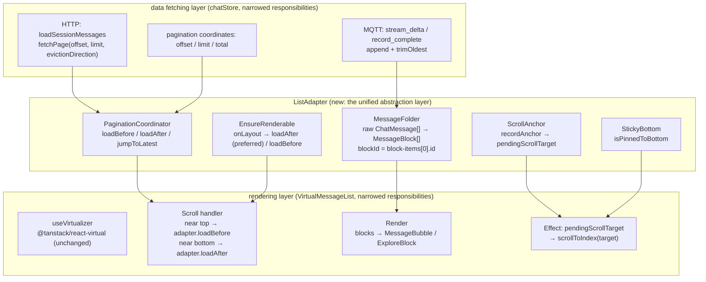

# ADR-041: The Chat List Adapter Abstraction Layer — The Single Bridge from Data to Rendering

> **Chinese source of truth**: [ADR-041](../zh/ADR-041-chat-list-adapter.md)
> **Terminology**: see [GLOSSARY.md](./GLOSSARY.md)

## Status

Draft

## Date

2026-07-20

## Decision Makers

大鱼 (Dayu)

## Predecessors

- [ADR-021](./ADR-021-unified-session-data-loading.md) (unified session data loading — HTTP Pull +
  MQTT notification)
- [ADR-035](../zh/ADR-035-mqtt-streaming-push-refactor.md) (streaming refactor — MQTT direct push +
  per-session row buffering)
- [ADR-038](./ADR-038-session-lifecycle-explicit-model.md) (the explicit session lifecycle model)

---

## 1. Decision Summary

The chat message list's rendering architecture lacks a unified abstraction. Four responsibilities — data
loading, scroll anchoring, cache-window management, and message folding — are scattered across
`ChatPanel.tsx`, `VirtualMessageList.tsx` and `chatStore.ts`, coupled implicitly through `scope` refs,
`useMemo` closures and `useLayoutEffect` state transitions. This scattering has produced 4 confirmed
design defects (see §2).

This ADR introduces **ListAdapter** — a unified abstraction layer sitting between `chatStore` (the data
fetching layer) and `VirtualMessageList` (the rendering layer). The ListAdapter is the sole producer
and manager of `MessageBlock[]`, absorbing the responsibilities currently scattered across the three
files.

**Five core designs**:

1. **Stable blockId**: `blockId` changes from `"block-${i}"` (array index) to `"block-${items[0].id}"`
   (content-derived). Assigned once and never changed; prepend/append never changes an existing
   block's ID.
2. **Bidirectional symmetric pagination**: `loadBefore()` / `loadAfter()` replace today's asymmetric
   model (only scrolling up via `loadMoreOlderMessages` plus a one-shot jump via `ensureLatestInCache`).
3. **Anchoring lives inside the Adapter**: the anchoring logic converges from
   `scope.current.anchorToUserBlockId` + a VML `useLayoutEffect` into the Adapter, which emits
   `pendingScrollTarget` for the rendering layer to execute.
4. **Direction-aware cache eviction**: `chatStore.loadSessionMessages` gains an
   `evictionDirection` parameter. Loading older messages while streaming does not evict (the window
   may temporarily inflate); all other cases evict by direction.
5. **VML's responsibilities narrow**: VirtualMessageList no longer manages anchoring, sticky-bottom or
   ensure-renderable — only virtualized rendering and the scroll-up/scroll-down triggers.

---

## 2. Background and Root Cause

### 2.1 The current architecture

```
chatStore.ts
├── messages: ChatMessage[]          ← raw data storage
├── messageOffset/Limit/Total        ← pagination coordinates
├── loadSessionMessages()            ← HTTP fetch + merge + evict
├── loadMoreOlderMessages()          ← scroll-up only
├── ensureLatestInCache()            ← one-shot jump to the latest
└── MQTT event handling              ← streaming append + trimOldest

ChatPanel.tsx
├── messageBlocks = useMemo(...)     ← fold raw → block, blockId = "block-${i}"
├── handleScroll()                   ← only detects scrollTop < 50 to trigger scroll-up
├── scope.current.anchorToUserBlockId ← anchor blockId passing
├── pinnedToBottomRef                ← sticky-bottom state
└── virtualCount = blocks.length + extras

VirtualMessageList.tsx
├── useVirtualizer(...)              ← tanstack-virtual
├── useLayoutEffect (load-older)     ← watches isLoadingMore, scrollToIndex to the anchor
├── useLayoutEffect (sticky-bottom)  ← watches virtualCount growth, scrollToIndex(end)
├── useLayoutEffect (ensure-renderable) ← watches totalSize < clientHeight, calls onNeedMore
└── VirtualMessageListHandle         ← imperative queries like getFirstVisibleBlockIndex
```

### 2.2 The four design defects

| # | Defect | Root-cause layer | Impact |
|---|--------|------------------|--------|
| **P0-1** | blockId is based on the array index (`"block-${i}"`), so after a prepend every block's ID changes | ChatPanel `useMemo` | `findIndex(b => b.blockId === anchorId)` cannot find the anchor, and the scroll position goes wrong |
| **P0-2** | the cache-window eviction direction conflicts with streaming appends | chatStore `loadSessionMessages` | when loading older messages it evicts from the tail (dropping the newest), but streaming output is appending to the tail, so the message the user is watching gets evicted |
| **P1-3** | `handleScroll`'s closure captured a stale `messageBlocks` | ChatPanel `useCallback` | the anchor records the wrong blockId (an index into the old array) |
| **P1-4** | no downward-paging mechanism | ChatPanel `handleScroll` | after scrolling up the user cannot naturally scroll back to the newest message; the only option is the scroll-to-bottom button's one-shot jump |

### 2.3 The architectural root cause

All four defects point to one architectural problem: **the absence of a unified data-to-rendering
abstraction layer**.

- blockId assignment (P0-1) and anchoring (P1-3) should be the same layer's responsibility, yet they are
  split across two different contexts (`useMemo` and `handleScroll`).
- Cache-window eviction (P0-2) should be decided from the current scroll direction and streaming state,
  but the eviction logic lives in `chatStore` while the direction information lives in `ChatPanel`,
  with no coordination channel between them.
- Bidirectional paging (P1-4) should be symmetric by design, yet today there is only a scroll-up path
  and scroll-down is replaced by `ensureLatestInCache`'s "one-shot jump", which has different semantics.

Android's RecyclerView + Adapter pattern is the standard architecture for exactly this class of problem:
the Adapter is the single bridge between data and rendering, centrally managing item identity, data
loading, and view recycling. This ADR brings that pattern to the frontend.

### 2.4 The virtualization engine is not replaced

This ADR explicitly **does not replace** `@tanstack/react-virtual`:

1. All four defects are in the data-loading and scroll-anchoring layer, not in the virtualization
   engine.
2. The current code has many WKWebView/Tauri-specific workarounds (synchronous `scrollTop` assignment,
   `NotAllowedError` catching, dual ResizeObserver measurement), making an engine swap's risk
   uncontrollable.
3. Alternatives like `react-virtuoso` and `virtua` are unverified in the WKWebView environment.

The ListAdapter wraps `@tanstack/react-virtual`; it does not replace it.

---

## 3. Architecture Overview



### Data flow

```
chatStore.messages (raw ChatMessage[])
    │
    ▼
ListAdapter
    ├── foldMessages() → MessageBlock[] (stable blockId)
    ├── reads offset/limit/total → hasOlder / hasNewer
    ├── loadBefore(anchorBlockId) → chatStore.loadSessionMessages(offset+limit, ..., eviction='tail'|'none')
    ├── loadAfter(anchorBlockId)  → chatStore.loadSessionMessages(offset-limit, ..., eviction='head')
    ├── onLayout(totalH, viewH)   → when unfilled: loadAfter if hasNewer, otherwise loadBefore
    ├── pendingScrollTarget       → emitted to VML
    └── isPinnedToBottom          → emitted to VML
    │
    ▼
VirtualMessageList
    ├── reads adapter.blocks → render
    ├── scroll near top    → adapter.loadBefore(vml.getFirstVisibleBlockId())
    ├── scroll near bottom → adapter.loadAfter(vml.getLastVisibleBlockId())
    └── effect(pendingScrollTarget) → virtualizer.scrollToIndex(targetIdx)
```

---

## 4. The Core Abstraction

### 4.1 The ListAdapter interface

```typescript
/**
 * ListAdapter - the single bridge between chatStore and VirtualMessageList.
 *
 * Responsibilities:
 *  - fold raw ChatMessage[] → MessageBlock[] (with stable blockId)
 *  - coordinate bidirectional pagination (loadBefore / loadAfter)
 *  - manage scroll anchoring (restore position after prepend/append)
 *  - manage sticky-bottom state
 *  - coordinate ensure-renderable (auto-load older when the viewport is unfilled)
 *
 * NOT responsibilities:
 *  - HTTP requests / MQTT event handling (stay in chatStore)
 *  - DOM scroll operations (stay in VirtualMessageList)
 *  - height estimation (stays in blockHeightEstimator)
 */
interface ChatListAdapter {
  // ── data output ──
  /** The folded display block array. blockId is content-derived and unchanged by prepend/append. */
  readonly blocks: MessageBlock[];

  // ── pagination state ──
  readonly hasOlder: boolean;   // offset + limit < total
  readonly hasNewer: boolean;   // offset > 0
  readonly isLoading: boolean;  // per-session, not global

  // ── pagination actions ──
  /** Load older messages. The caller passes the currently first-visible block's ID as the anchor;
   *  the Adapter records the anchor, calls chatStore, and sets pendingScrollTarget on completion.
   *  No-op if !hasOlder || isLoading. */
  loadBefore(anchorBlockId: string): Promise<void>;
  /** Load newer messages. The caller passes the currently last-visible block's ID. No-op if
   *  !hasNewer || isLoading. */
  loadAfter(anchorBlockId: string): Promise<void>;
  /** One-shot jump to the latest page (offset=0). Used by the scroll-to-bottom button. */
  jumpToLatest(): Promise<void>;

  // ── scroll anchoring ──
  /** Non-null after a load completes: the rendering layer should scrollToIndex to this blockId's
   *  index, then call clearScrollTarget(). */
  readonly pendingScrollTarget: string | null;
  clearScrollTarget(): void;

  // ── sticky bottom ──
  readonly isPinnedToBottom: boolean;
  setPinnedToBottom(value: boolean): void;

  // ── viewport filling ──
  /** Called by the rendering layer after every layout. The Adapter decides whether totalHeight
   *  fills the viewport; if not it triggers a load by this priority:
   *
   *  1. hasNewer → prefer loadAfter (restore the evicted newest messages).
   *     Scenario: the user scrolled up so the tail was evicted; when switching back the content
   *     is not enough to fill the viewport. Restoring the newest messages is right (the user most
   *     likely wants new content) rather than continuing to add older messages at the top.
   *
   *  2. hasOlder → loadBefore (the initial fill).
   *     Scenario: a new session's initial load, offset=0, hasNewer=false, so older messages must be
   *     added at the top until the viewport fills.
   *
   *  3. both false → do nothing (the session's messages are all cached but under one screen).
   *
   *  This fixes the fatal defect in today's ensureRenderable effect: it only checks hasOlder and only
   *  calls loadBefore, so after the user scrolls up and the tail is evicted, the viewport is not full
   *  yet but it keeps adding older messages at the top instead of restoring the tail, leaving the
   *  user unable to "scroll to the bottom and stuck".
   */
  onLayout(totalHeight: number, viewportHeight: number): void;
}
```

### 4.2 Stable blockId

**Today** (ChatPanel `useMemo`):

```typescript
const blockId = `block-${i}`;  // i = loop index, the position in messages[]
```

**Changed to** (the `foldMessages` pure function):

```typescript
// non-grouped messages
const blockId = `block-${msg.id}`;

// explore_group (several messages folded into one group)
const blockId = `block-${exploreBuffer[0].id}`;
```

`msg.id` is the backend-assigned message ID (the JSONL line number or a UUID), and prepend/append
never changes an existing message's ID.

**Effect**:

| Operation | Old blockId | New blockId |
|-----------|-------------|-------------|
| prepend 50 older messages | every block's `i` shifts by +50, so all blockIds change | existing blockIds unchanged |
| append 1 new message | the new block after the last one gets the next `i` | existing blockIds unchanged |
| a streaming append updating the last message | the last block's `i` is unchanged, so the blockId is unchanged | blockId unchanged |

This is the foundation for fixing P0-1 and P1-3: `findIndex(b => b.blockId === anchorId)` still finds
the right block after a prepend.

### 4.3 Bidirectional symmetric pagination

**Today** (asymmetric):

```
scroll up:   loadMoreOlderMessages() → offset += limit
scroll down: none (ensureLatestInCache is a one-shot jump, not paging)
```

**Changed to** (symmetric):

```
scroll up:   loadBefore() → offset += limit, eviction = 'tail' | 'none'
scroll down: loadAfter()  → offset -= limit (min 0), eviction = 'head'
jump:        jumpToLatest() → offset = 0, replace cache
```

Pagination state derivation:

```typescript
hasOlder = messageOffset + messageLimit < messageTotal && messageLimit > 0;
hasNewer = messageOffset > 0;
```

**Trigger timing** (VirtualMessageList's scroll handler):

```typescript
// pseudo-code inside VML
const handleScroll = () => {
  const { scrollTop, scrollHeight, clientHeight } = container;
  const distFromTop = scrollTop;
  const distFromBottom = scrollHeight - scrollTop - clientHeight;

  if (distFromTop < 50 && adapter.hasOlder && !adapter.isLoading) {
    adapter.loadBefore(getFirstVisibleBlockId());
  }
  if (distFromBottom < 50 && adapter.hasNewer && !adapter.isLoading) {
    adapter.loadAfter(getLastVisibleBlockId());
  }
  adapter.setPinnedToBottom(distFromBottom <= 5);
};
```

VML queries the visible block indices via `virtualizer.getVirtualItems()` and then reads the stable
ID from `adapter.blocks[idx].blockId`. VML reads `adapter.blocks` directly (a prop, always current),
so there is no stale-closure problem (fixing P1-3).

### 4.4 Scroll anchoring

**Today** (scattered across three places):

```
1. ChatPanel.handleScroll: scope.current.anchorToUserBlockId = messageBlocks[firstVisibleIdx].blockId
2. ChatPanel.useMemo:      block.anchorToUser = (blockId === anchorToUserBlockId)
3. VML.useLayoutEffect:    watches isLoadingMore going false → findIndex(anchorToUser) → scrollToIndex
```

Problems: step 1's `messageBlocks` may be a stale closure (P1-3); step 2's `blockId` is index-based so
it cannot be found after a prepend (P0-1).

**Changed to** (centrally managed inside the Adapter):

```
1. VML.scroll handler:  adapter.loadBefore(firstVisibleBlockId)  // passes the stable ID
2. Adapter.loadBefore:  scrollTargetRef.current = anchorBlockId  // recorded internally
                        await chatStore.loadSessionMessages(...)
3. Adapter:             setScrollTargetVersion(v => v + 1)       // triggers a re-render
4. VML.useLayoutEffect: idx = blocks.findIndex(b => b.blockId === adapter.pendingScrollTarget)
                        virtualizer.scrollToIndex(idx, { align: 'start' })
                        adapter.clearScrollTarget()
```

The anchoring logic lives entirely inside the Adapter; VML only consumes `pendingScrollTarget` and
performs the DOM scroll.

**Anchor direction**:

| Operation | Anchor | scrollToIndex align |
|-----------|--------|---------------------|
| loadBefore (prepends older) | the first visible block | `'start'` |
| loadAfter (appends newer) | the last visible block | `'end'` |
| jumpToLatest | the special value `'__bottom__'` | `scrollToIndex(count - 1, { align: 'end' })` |
| sticky-bottom append | N/A (auto-follow) | `scrollToIndex(count - 1, { align: 'end' })` |

### 4.5 Direction-aware cache eviction

**Today** (chatStore `loadSessionMessages`):

```typescript
if (returnedOffset > prevOffset) {
  // loading older → prepend → evict from the tail (drop newest)
  merged = [...older, ...ss.messages];
  nextMessages = merged.slice(0, MESSAGE_CACHE_WINDOW);  // ← drops the tail
} else if (returnedOffset < prevOffset) {
  // loading newer → append → evict from the head (drop oldest)
  merged = [...ss.messages, ...newer];
  nextMessages = merged.slice(-MESSAGE_CACHE_WINDOW);     // ← drops the head
}
```

**Problem** (P0-2): loading older evicts from the tail, but streaming output is appending to the tail —
so what gets evicted is exactly the streaming content the user is watching.

**Changed to** (`loadSessionMessages` gains an `evictionDirection` parameter):

```typescript
loadSessionMessages(
  agentId: string,
  sessionId: string,
  offset?: number,
  limit?: number,
  options?: { evictionDirection?: 'head' | 'tail' | 'none' },
)
```

| Scenario | evictionDirection | Behaviour |
|----------|------------------|-----------|
| loadBefore + **not streaming** | `'tail'` | prepend older, evict from the tail (drop newest). The user is reading older messages, so the tail is safe to evict |
| loadBefore + **streaming** | `'none'` | prepend older, **no eviction**. The window inflates temporarily and converges naturally after streaming ends (on the next loadAfter or jumpToLatest) |
| loadAfter | `'head'` | append newer, evict from the head (drop oldest). The user is reading new messages, so the head is safe to evict |
| jumpToLatest | N/A (replace) | replace directly with the latest page; no eviction needed |
| MQTT streaming append | N/A (inside chatStore) | `trimOldest()` evicts from the head. Unchanged |

`evictionDirection` is decided by the Adapter from the current operation type and streaming state, and
passed to chatStore.

---

## 5. Per-Layer Responsibility Changes

### 5.1 chatStore

HTTP requests, MQTT event handling, raw message storage, the pagination coordinates, and the
`loadSessionMessages` merge logic are all **unchanged**. Changed:

- `loadSessionMessages`'s eviction logic: **changed** to accept `evictionDirection` and evict by
  direction
- `loadMoreOlderMessages`: **deleted** (replaced by `Adapter.loadBefore`)
- `ensureLatestInCache`: **changed** to a pure HTTP call (offset=0) with eviction controlled by the
  Adapter
- `MESSAGE_CACHE_WINDOW` and `trimOldest` (the MQTT append path) and `isLoadingMore` (per-session,
  read by the Adapter) are **unchanged**

chatStore remains the data-fetching layer; only the eviction strategy changes from "direction
hardcoded internally" to "direction specified by the caller".

### 5.2 ChatPanel

Deleted: the `messageBlocks` useMemo (folding + blockId, moved into the Adapter's `foldMessages`), the
`handleScroll` paging/sticky-bottom logic (moved into VML, which calls the adapter directly),
`scope.current.anchorToUserBlockId` and `pinnedToBottomRef` (both now inside the Adapter).

Changed: `virtualCount = adapter.blocks.length + extras` (extras are still computed by ChatPanel).

Unchanged: `showCompactingItem` / `showReplyingItem` (derived from session state) and the input box /
send / toolbar / Skills panel.

**Added**: creating the Adapter and passing it to VML.

ChatPanel narrows from "manages everything" to "creates the Adapter + renders the UI chrome (input
box, toolbar, etc.) + passes rendering props to VML".

### 5.3 VirtualMessageList

Unchanged: `useVirtualizer` configuration, `estimateSize` / `measureElement`, the `scrollToFn`
(WKWebView workaround), and the ResizeObserver / `recordMeasuredHeight`.

Changed: the load-older `useLayoutEffect` is **deleted** (replaced by the `pendingScrollTarget` effect);
the sticky-bottom effect now reads `adapter.isPinnedToBottom` + `adapter.pendingScrollTarget`; the
ensure-renderable effect now calls `adapter.onLayout(totalSize, clientHeight)`;
`VirtualMessageListHandle` is **simplified** (keeping `getFirstVisibleBlockIndex` /
`getLastVisibleBlockIndex` / `scrollToBottom`, dropping `isAnchorToLatestInView`).

**Added**: a scroll handler detecting near-top / near-bottom and calling `adapter.loadBefore` /
`adapter.loadAfter`.

Deleted props: `scope` ref, `pinnedToBottomRef`, `hasOlder` / `onNeedMore`, `isLoadingMore` (all read
from the adapter instead).

VML narrows from "virtualization + scroll management + anchoring + ensure-renderable" to
"virtualization + scroll event detection + consuming adapter commands".

### 5.4 MessageBlock

```typescript
export interface MessageBlock {
  // ── unchanged ──
  type: ChatMessage["type"] | "explore_group";
  items: ChatMessage[];
  rawCount: number;
  anchorToLatest: boolean;
  hasFollowUpReply: boolean;

  // ── changed ──
  blockId: string;  // "block-${items[0].id}" (content-derived, not an index)

  // ── deleted ──
  // anchorToUser: boolean;  // anchoring moved into the Adapter, no longer exposed on the block
}
```

`anchorToUser` is deleted because it is transient state (set once per load-older cycle) rather than a
data property of the block. Anchoring is now managed by the Adapter's `pendingScrollTarget`, so there
is no need to mark it on the block.

---

## 6. Bug Fix Matrix

| Bug | Root cause | Fix mechanism | Verification |
|-----|------------|---------------|--------------|
| **P0-1** index-based blockId | `"block-${i}"` shifts on prepend | §4.2 the stable blockId = `"block-${items[0].id}"` | after prepending 50, `findIndex(b => b.blockId === oldAnchor)` still finds the right block |
| **P0-2** eviction-direction conflict | loading older blindly evicts from the tail | §4.5 `evictionDirection`: `'none'` while streaming, `'tail'` otherwise | scrolling up during streaming output never evicts the new messages; the window converges after streaming ends |
| **P1-3** stale closure | `handleScroll` captured the old `messageBlocks` | §4.3/4.4 VML reads `adapter.blocks` (a prop) directly and calls `adapter.loadBefore(blockId)` | the anchor blockId always corresponds to the current blocks array |
| **P1-4** no scroll-down + "stuck before the bottom" | `handleScroll` only detects `scrollTop < 50`; `ensureRenderable` only checks `hasOlder` and only calls `loadBefore`, so after scrolling up evicts the tail and the viewport is not full yet it keeps adding older messages instead of restoring the tail | §4.3 VML detects `distFromBottom < 50` → `adapter.loadAfter(lastBlockId)`; §4.1 `onLayout` prefers `loadAfter` when `hasNewer` | after scrolling up the user can scroll back down and progressively load newer messages to the latest; when scrolling up leaves the viewport unfilled, `loadAfter` automatically restores the tail |

---

## 7. File Impact List

### New files

| File | Responsibility |
|------|----------------|
| `apps/acowork-desktop/src/components/chat/useChatListAdapter.ts` | the ListAdapter hook: assembling blocks, pagination, anchoring, sticky-bottom, ensure-renderable |
| `apps/acowork-desktop/src/components/chat/messageFolder.ts` | the pure function `foldMessages(messages: ChatMessage[]): MessageBlock[]`: folding logic + stable blockId assignment |

### Modified files

| File | Change |
|------|--------|
| `src/stores/chatStore.ts` | `loadSessionMessages` gains `evictionDirection`; `loadMoreOlderMessages` deleted; `ensureLatestInCache` degraded to a pure HTTP call |
| `src/components/chat/ChatPanel.tsx` | deletes the `messageBlocks` useMemo / `handleScroll` paging / `scope` anchor / `pinnedToBottomRef`; creates `useChatListAdapter` and passes it to VML |
| `src/components/chat/VirtualMessageList.tsx` | deletes the load-older / sticky-bottom / ensure-renderable effects; adds a scroll handler calling the adapter; adds the `pendingScrollTarget` effect |
| `ChatPanel.tsx` (the MessageBlock definition) | `blockId` becomes content-derived; the `anchorToUser` field is deleted |
| `src/components/chat/blockHeightEstimator.ts` | `recordMeasuredHeight` / `getMeasuredHeight`'s key changes from an index-based blockId to a content-based one (the interface is unchanged, the key semantics change) |
| `src/components/chat/useSessionScope.ts` | the `anchorToUserBlockId` field is deleted |

### Unchanged files

`blockLayout.ts` (layout constants, unrelated to the Adapter), `MessageBubble.tsx` and
`ExploreBlock.tsx` (rendering components that only read MessageBlock data), and
`useStreamingContent.ts` (a streaming content hook unrelated to list management).

---

## 8. Implementation Plan

### C1: Extract `messageFolder.ts` + the stable blockId

Move ChatPanel's `messageBlocks` useMemo folding logic into the pure function `foldMessages`, with
blockId content-derived. `blockHeightEstimator.ts`'s measured-height cache key follows the new blockId
automatically (the interface is unchanged); `useSessionScope.ts` loses `anchorToUserBlockId`.

**Verification**: `tsc --noEmit` with zero errors; manually verify scroll-to-bottom, session
switching, and streaming append.

**Risk**: the `recordMeasuredHeight` cache key changes from index-based to content-based, so old cache
keys (`"block-0"` etc.) naturally expire while new keys (`"block-msg-abc123"` etc.) accumulate. On first
load all block heights go through the estimator fallback and populate after measurement — behaviourally
identical to opening a session for the first time, so no regression risk.

### C2: Direction-aware eviction in chatStore

`loadSessionMessages` gains `options?: { evictionDirection?: 'head' | 'tail' | 'none' }`; the
older-load branch skips eviction when `'none'`; the newer-load and initial-load branches are unchanged;
`loadMoreOlderMessages` is kept temporarily passing `'tail'` for compatibility (deleted in C4).

**Verification**: the existing `loadMoreOlderMessages` call paths behave identically.

### C3: Implement `useChatListAdapter`

A new Adapter hook assembling blocks, pagination, anchoring, sticky-bottom and ensure-renderable. It
reads chatStore's messages / offset / limit / total / isLoadingMore / sessionStatus, produces blocks via
`foldMessages`, implements `loadBefore` / `loadAfter` / `jumpToLatest`, `pendingScrollTarget` (a ref +
a version state), `isPinnedToBottom` (a ref) and `onLayout` (the ensure-renderable decision). This
commit does not modify ChatPanel / VML, so the Adapter is independently testable.

**Verification**: unit tests for `foldMessages` (stable IDs, folding rules); the Adapter's
pagination/anchoring behaviour in isolation.

### C4: Wire the Adapter into ChatPanel + VML

ChatPanel creates `const adapter = useChatListAdapter(agentId, sessionId)` and drops its own logic;
VML's props shrink from 20+ to `adapter` plus rendering props, gaining the scroll handler and the
`pendingScrollTarget` effect; chatStore loses `loadMoreOlderMessages`.

**Verification**: `tsc --noEmit` with zero errors, plus a manual test matrix — initial load +
scroll-to-bottom; scroll up + correct anchoring; scroll down after scrolling up + correct anchoring;
scrolling up during streaming (messages not evicted); sticky-bottom following during streaming; session
switching + restore; the scroll-to-bottom button; and ensure-renderable auto-filling the viewport.

### The key sequences (condensed)

**Scrolling up to load older**: the user scrolls near the top → VML gets the first visible block index →
`adapter.loadBefore("block-msg-abc")` → the Adapter records `scrollTargetRef` and calls
`loadSessionMessages(offset+limit, {eviction:'tail'|'none'})` → HTTP `GET /messages?offset=…&limit=…` →
merge + direction-aware eviction → the store updates (zustand) → `blocks = foldMessages(messages)` →
`setScrollTargetVersion++` → re-render → VML finds the index and `scrollToIndex(idx, {align:'start'})` →
`clearScrollTarget()`.

**Scrolling down to load newer**: symmetric, except the anchor is the last visible block, the offset
decreases, the eviction is `'head'` (drop oldest), and the align is `'end'`.

**Streaming append + sticky-bottom**: when `isPinnedToBottom` is true, a `record_complete` MQTT event
appends to the store and `trimOldest` runs → blocks grow → `virtualCount` increases → VML scrolls to
`count-1` with `align:'end'`.

---

## 9. Risks and Mitigations

| Risk | Impact | Mitigation |
|------|--------|-----------|
| blockId changes from an index to content-derived, invalidating `blockHeightEstimator`'s module-level cache | on first load all blocks fall back to the estimator, so the scroll position may be off | No regression risk: behaviourally identical to opening a session for the first time. The cache fills after measurement and later scrolls are accurate |
| `evictionDirection: 'none'` inflates the window and grows memory | repeatedly scrolling up during streaming may push `messages[]` past `MESSAGE_CACHE_WINDOW` | the window is restored on the next loadAfter / jumpToLatest after streaming ends. In the extreme case (5+ pages of scroll-up during streaming) a hard cap (e.g. 3×WINDOW) can force-evict the non-streaming end |
| VML's scroll handler frequently triggering loadBefore/loadAfter | performance pressure | the `isLoading` flag prevents re-entrancy; the scroll handler is throttled with `requestAnimationFrame` (today's ChatPanel `handleScroll` has no throttle, so this is no regression) |
| The Adapter's internal ref + version state pattern is complex | maintainability | `pendingScrollTarget` is the only value needing the ref+state dual track (a ref holding the value, a state triggering the re-render). The rest (e.g. `isPinnedToBottom`) can be a plain ref |
| The default value of chatStore's `loadSessionMessages` `evictionDirection` | backward compatibility for other callers | the default `undefined` derives internally: `returnedOffset > prevOffset ? 'tail' : 'head'`, which is exactly the current behaviour. An explicit argument overrides the derived default |

---

## 10. Out of Scope

| Topic | Explanation |
|-------|-------------|
| MCP tool output size control | a separate follow-up ADR |
| Context compaction (`compact_via_llm`) | unrelated to list rendering; covered by ADR-032 |
| Streaming render optimization (incremental ReactMarkdown parsing) | an independent performance optimization, orthogonal to the Adapter architecture |
| Multi-session concurrent rendering | already isolated today via per-session state + `key={sessionId}`; the Adapter layer does not need to intervene |
| `blockHeightEstimator` accuracy optimization | the constants and estimation algorithm are unchanged; the blockId key semantics change is the only collateral change |
