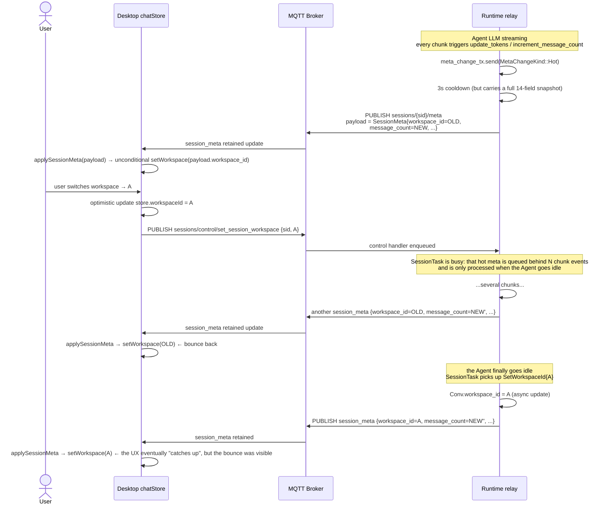

# ADR-043: Splitting Session State into Config / State Themes

> **Chinese source of truth**: [ADR-043](../zh/ADR-043-session-config-state-split.md)
> **Terminology**: see [GLOSSARY.md](./GLOSSARY.md)

## Status

Draft

## Date

2026-07-22

## Decision Makers

大鱼 (Dayu)

## Predecessors

- [ADR-033](./ADR-033-mqtt-replace-grpc-websocket.md) — MQTT replaces gRPC + WebSocket
- [ADR-034](./ADR-034-mqtt-http-boundary.md) — MQTT / HTTP boundary
- [ADR-035](./ADR-035-mqtt-streaming-push-refactor.md) — MQTT streaming push refactor
- [ADR-036](./ADR-036-mqtt-status-push.md) — MQTT status push
- [ADR-038](./ADR-038-session-lifecycle-explicit-model.md) — explicit session lifecycle modeling
- [ADR-024](./ADR-024-merge-metadata-into-index.md) — merge metadata into index; proposed the `session_meta_runtime_split` plan
- [ADR-027](./ADR-027-conversation-meta-token-usage.md) — conversation meta token usage

---

## 1. Decision summary

Session-level state push currently has a **conceptual mismatch at the protocol layer**: the
backend's `SessionMeta` object — a storage-organization DTO — is being used as the frontend
business model. Low-frequency user configuration fields (`workspace_id / provider / model /
reasoning_effort / temperature / title`) and high-frequency runtime telemetry fields
(`status / message_count / tokens / context_usage`) are packed into the same Protobuf
payload and the same retained topic `sessions/{sid}/meta`. The result is a **bounce-back
bug**: when the user switches `workspace_id` while the Agent is reasoning, a runtime
update carrying the old value pushes the just-set config field back to the frontend, and
`chatStore` overwrites the whole state.

This ADR re-splits session-level state along **frontend business semantics** into two
independent topics:

```
acowork/agents/{id}/sessions/{sid}/config   ← SessionConfig (user-driven settings)
acowork/agents/{id}/sessions/{sid}/state    ← SessionState  (runtime telemetry + activity)
```

**Four core principles**:

1. **The protocol is modeled on frontend business semantics, not on backend storage organization.** An MQTT topic is a product API, not a mirror of the disk schema. `SessionMeta` is the in-memory projection of `conversations/meta/{sid}.json`, an internal backend artifact — it is not part of the protocol contract.
2. **`SessionConfig` carries only user-driven config fields** (`workspace_id / provider_id / model_id / reasoning_effort / temperature / title`) — low frequency, retained, published on write.
3. **`SessionState` carries only runtime telemetry and activity state** (`status / message_count / input_tokens / output_tokens / total_input_tokens / total_output_tokens / context_usage / updated_at`) — high frequency, retained, publishing the full snapshot on any field change (with throttling on the relay side).
4. **The `SessionStateChangedPayload` transient event is removed.** `status` / `context_usage` now travel on the retained `SessionState` topic instead of a separate QoS 0 delta event — a single retained topic already inherently carries both "snapshot" and "delta" semantics, so the event model is redundant.

After this fix the bounce-back **disappears structurally**: the `SessionState` payload does
not carry `workspace_id`, so high-frequency runtime writes can never drag config fields
along.

## 2. Root cause analysis

### 2.1 Symptom reproduction

The user switches the current session's `workspace_id` in the Desktop UI while the Agent is
streaming output. The frontend optimistically updates the local store to show the new
workspace, but the Agent Runtime pushes a `session_meta` back within milliseconds — and the
`workspace_id` field in that payload is still the **old** value. `chatStore.applySessionMeta`
overwrites the whole local state and the workspace display bounces back.

The `conversations/meta/20260722_094335_526753.json` persisted during that window is the
sample (lines 1-20):

```json
{
  "version": 3,
  "session_id": "20260722_094335_526753",
  "agent_id": "com.acowork.senior-engineer",
  "created_at": "2026-07-22T01:43:35.367Z",
  "title": "the attachment is a runtime log; switch the workspace while the agent is reasoning",
  "workspace_id": "__agent_home__",       // ← config field, pushed back to the old value
  "model": "MiniMax-M3",
  "provider": "minimax-cn-coding-plan",
  "reasoning_effort": "auto",
  "message_count": 163,                   // ← runtime field, updated every turn
  "last_active_at": "2026-07-22T02:26:40.974Z",
  "tokens": { "last_input": 12683, "last_output": 1245, "total_input": 6712579, "total_output": 49820 },
  "corrupted": false
}
```

Note that this single JSON carries both `workspace_id` (config) and
`message_count/tokens` (runtime), whose update semantics are entirely different, yet they
are handled as one object.

### 2.2 Current state inventory (facts, with paths)

| Layer | `sessions/{sid}/config` | `sessions/{sid}/meta` | `messages/state_changed` (transient) |
|---|---|---|---|
| Proto definition | ⚠️ stub `SessionConfig { config_json }`, never published | ⚠️ `SessionMeta` with 14 fields, mixing both kinds | ⚠️ `SessionStateChangedPayload`, overlapping the meta topic |
| Protocol doc | ✅ listed in `mqtt.md:259-263, 294, 951-952` | ✅ topic and semantics in `mqtt.md:260, 294, 717-748, 846` | ✅ `mqtt.md:264-279` |
| Broker ACL | ✅ `acowork-gateway/src/mqtt/acl.rs` allows Sub/Pub for Runtime + Desktop | ✅ same | ✅ same |
| Runtime publisher | ❌ no `publish_session_config` implementation | ✅ `acowork-runtime/src/mqtt/client.rs:785` `MqttChunkPublisher::publish_session_meta` | ✅ the delta event path |
| Bootstrap retained publish | ❌ | ✅ `acowork-runtime/src/startup/subsystems.rs:355-369` | ❌ (a transient event is never retained) |
| Frontend subscribe + overwrite | ❓ (may subscribe but never receives an event) | ✅ the `session_meta` case at `apps/acowork-desktop/src/stores/chatStore.ts:2960-2962` does a whole `setState`, including `workspace_id` | ✅ |

### 2.3 Trace of the chain



### 2.4 Mismatch #1: the protocol reuses the backend storage name `meta`

`SessionMeta` is a name the backend chose for itself — it is the in-memory mapping of the
`conversations/meta/{sid}.json` file, a DTO for disk I/O and internal relay use. Inside the
backend `meta` means "an auxiliary field set whose origin the remote side cannot see", but
exposing it as an MQTT topic turns it into a **public contract facing the frontend**, and the
frontend does not want that contract at all:

- what the frontend wants is "what settings has the user changed on this session" → that is `config` semantics
- what the frontend wants is "how busy is this session, how many tokens has it used, how full is the context" → that is `state` / `status` semantics

Using the name `meta` amounts to putting the backend folder structure into the product
protocol, forcing the frontend to deserialize a backend data structure and then pick apart
the fields itself. The direct cost of this modeling mismatch is that two semantics are bound
into one object, one payload, and one topic; distinguishing cold from hot only mitigates the
signal and cannot cure the coupling at the protocol layer.

### 2.5 Mismatch #2: the field classification inside the `SessionMeta` proto is also wrong

The 14 fields at `core/acowork-core/proto/mqtt_payload.proto:336-353`:

```
config kind (user-driven, low frequency)   runtime kind (activity/telemetry, high frequency)
──────────────────────────                 ──────────────────────────
title                = 3                   message_count       = 5
provider_id          = 6                   input_tokens        = 10
model_id             = 7                   output_tokens       = 11
reasoning_effort     = 15                  total_input_tokens  = 12
temperature          = 16                  total_output_tokens = 13
workspace_id         = 17                  updated_at          = 14
agent_id / session_id / version = 1,2,4
```

The field numbers already show that the semantic classification was never re-reviewed when
new fields were added to `SessionMeta` — `title` (3) was an early meta field (a
"human-readable identity"), and when `provider_id` (6) was later recognized as a config
field it was simply added too, **fixing the mismatch in place at the proto layer**.

### 2.6 Prior attempt and why it failed

There was an attempt to distinguish `MetaChangeKind::Cold / Hot` inside `ConversationSession`
(`core/acowork-runtime/src/conversation.rs`) — hot goes through a 3s cooldown, cold publishes
immediately. That is a mitigation at the **information-rate** level and cannot cure the
coupling at the **information-content** level:

- a cold PUBLISH still carries a full 14-field snapshot, with the runtime fields at 0 or the previous frame
- a hot PUBLISH still carries a full 14-field snapshot, with the config fields at the previous frame
- when the two race, a cold write of new config still gets overwritten by a later hot write, so the bounce-back persists

Curing it at the content level requires splitting the object in the protocol.

## 3. Decision

### 3.1 Proto rework (`core/acowork-core/proto/mqtt_payload.proto`)

**Field 32 / 33 reassigned:**

```proto
/// User-driven session settings. Retained=true; the payload is always the latest full snapshot.
/// Field semantics: changes only when the user actively changes a setting in the frontend.
message SessionConfig {
  string agent_id         = 1;
  string session_id       = 2;
  string title            = 3;
  string provider_id      = 4;  // "" = no override
  string model_id         = 5;  // "" = no override
  string reasoning_effort = 6;  // "" = no override
  float  temperature      = 7;  // 0  = no override
  string workspace_id     = 8;
}

/// Session runtime state. Retained=true; the payload is always the latest full snapshot.
/// Field semantics: neither user-driven settings nor anything the Runtime needs to observe
/// at runtime.
/// PUBLISH the full snapshot on any field change (retained overwrite); throttling happens
/// on the relay side, the protocol layer does not rate-limit.
message SessionState {
  string agent_id            = 1;
  string session_id          = 2;
  // activity state
  string status              = 3;   // "idle" | "running" | "error" | ...
  // telemetry
  uint64 message_count       = 4;
  uint64 input_tokens        = 5;
  uint64 output_tokens       = 6;
  uint64 total_input_tokens  = 7;
  uint64 total_output_tokens = 8;
  // context usage (formerly SessionStateChangedPayload.payload.status_json)
  string context_usage_json  = 9;
  double ratio               = 10;
  // timestamp (ISO 8601)
  string updated_at          = 11;
}

// SessionStateChangedPayload — deleted. The retained SessionState already supports the
// status field natively, so no transient event is needed to re-express state changes.

message DataEnvelope {
  uint32 version = 2;            // bump: v1 → v2 (the message set changes)
  oneof payload {
    ...
    SessionCreated   session_created   = 30;
    SessionDeleted   session_deleted   = 31;
    SessionConfig    session_config    = 32;  // was: SessionMeta (renamed + fields cut)
    SessionState     session_state     = 33;  // was: stub SessionConfig (yielded its place)
    SessionMessage   session_message   = 34;
    SessionOpened    session_opened    = 35;
    SessionNotOpened session_not_opened = 36;
    ...
  }
}
```

`SessionStateChangedPayload session_state_changed = 25` inside `SessionMessage.event` is
deleted at the same time. The envelope `version` is bumped to v2, and
`apps/acowork-desktop` uses `envelope.version` for the compatibility check.

The classification comment becomes a mandatory constraint in the proto file header, for
future extensions:

```proto
// SessionConfig vs SessionState boundary:
//   SessionConfig = user-driven (workspace_id / provider / model / reasoning / temperature / title).
//   SessionState  = runtime telemetry + activity state (status / message_count / tokens / context_usage).
//   When adding a field that belongs to neither category, design a new message; do not
//   mix it into either one.
```

### 3.2 Topic split

| Topic | Payload | QoS | Retained | Trigger |
|---|---|---|---|---|
| `acowork/agents/{id}/sessions/{sid}/config` | `SessionConfig` | 1 | ✅ | any config field changes |
| `acowork/agents/{id}/sessions/{sid}/state`  | `SessionState`  | 1 | ✅ | any state field changes |

**Removed topic**: `acowork/agents/{id}/sessions/{sid}/meta` — the old mixed topic is void.

**Removed transient event**: `SessionStateChangedPayload` — already covered by the retained
`SessionState`.

### 3.3 File change list

| File | Change |
|---|---|
| `core/acowork-core/proto/mqtt_payload.proto` | add `SessionConfig` (rewriting the old stub) / add `SessionState` / delete `SessionMeta` / delete `SessionStateChangedPayload` / bump the envelope to v2 / the classification comment |
| `core/acowork-core/src/mqtt_proto.rs` | generated by `cargo build`; the desktop frontend does not reference this file |
| `core/acowork-core/src/types.rs` | remove the `SessionStateChangedPayload` re-exports and friends |
| `core/acowork-runtime/src/conversation.rs` | split `MetaChangeKind` into `ConfigChangeKind` + `StateChangeKind`; classify the mutators by field; drop the "workspace_id synced with SessionHandle" race discussion (absorbed by the protocol layer) |
| `core/acowork-runtime/src/mqtt/client.rs` | rename `MqttChunkPublisher::publish_session_meta` to `publish_session_config`; add `publish_session_state`; delete the `publish_session_state_changed` delta event branch |
| `core/acowork-runtime/src/startup/subsystems.rs` | split `spawn_meta_change_relay` into `spawn_config_change_relay` + `spawn_state_change_relay`; publish retained on both topics at bootstrap |
| `core/acowork-runtime/src/agent/session/session_manager.rs` | `create_session_with_id_and_conversation` and the OpenSession path publish retained on both topics |
| `core/acowork-runtime/src/agent/session/restorer.rs` | publish retained on both topics on startup restore |
| `core/acowork-runtime/src/agent/session_core.rs` | the related subscribe / auto-resubscribe logic |
| `core/acowork-runtime/src/agent/loop_.rs` | use the new topic names at subscription startup |
| `core/acowork-runtime/src/startup/agent_init.rs` | register subscriptions under the new topic names |
| `core/acowork-runtime/src/startup/gateway_loop.rs` | same |
| `core/acowork-runtime/src/startup/context.rs` | same |
| `core/acowork-runtime/src/agent/session/cold_value.rs` (if it exists) | rewrite the `SessionState` snapshot construction |
| `core/acowork-runtime/tests/conversation_session_tokens.rs` | update the payload schema references |
| `core/acowork-runtime/tests/mqtt_e2e_full.rs` | update topic names / payloads |
| `core/acowork-gateway/src/mqtt/acl.rs` | delete the `…/sessions/+/meta` ACL entry; add the `…/sessions/+/state` entry (Sub/Pub for Runtime + Desktop) |
| `core/acowork-gateway/src/mqtt/mod.rs` | keep the ACL constants in sync |
| `core/acowork-gateway/src/http/chat.rs` | HTTP `GET /api/agents/{id}/sessions/{sid}/state` returns both the SessionConfig and SessionState JSON |
| `core/acowork-gateway/src/http/config_api.rs` | same |
| ~~`core/acowork-gateway/src/http/global.rs`~~ | ~~same~~ (the file was already deleted in the gRPC cleanup commit; global resource CRUD has moved to MQTT retained) |
| `core/acowork-gateway/src/mqtt/agent_registry.rs` | same |
| `core/acowork-gateway/src/mqtt/dispatch.rs` | same |
| `core/acowork-gateway/src/mqtt/global_resources_publisher.rs` | same |
| `core/acowork-gateway/src/gateway/mod.rs` | same |
| `apps/acowork-desktop/src/stores/chatStore.ts` | split into `configSlice` + `stateSlice`; subscribe to the two topics; delete the `session_meta` case; delete the `messages/state_changed` case |
| `apps/acowork-desktop/src/services/mqtt/` | register subscriptions under the new topic names |
| `apps/acowork-desktop/src/hooks/useSessionStream.ts` (if it exists) | same |
| `apps/acowork-desktop/src/stores/workspaceStore.ts` | remove the bounce-back defense code — the protocol layer has cured it |
| `docs/protocols/en/mqtt.md` | sync the topic tree / semantics / ACL / startup sequence / subscription guide |
| `docs/adr/en/ADR-043-session-config-state-split.md` | the English version (parallel to ADR-009, for cross-team reading) |
| `core/acowork-runtime/CHANGELOG.md` / `core/acowork-gateway/CHANGELOG.md` | record the envelope version bump to v2 |

### 3.4 Persistence is decoupled from the protocol

`conversations/meta/{sid}.json` stays a single-file schema (path and schema both unchanged),
for these reasons:

- the `version: 3` schema already supports every field this ADR requires
- the file layout is unrelated to the frontend / MQTT and is an internal backend storage concern
- splitting the file would force a v3 → v4 migration path, coupling it to this protocol rework and widening the risk surface

Internally the backend can convert between `SessionConfig` / `SessionState` as "views of
`SessionMeta`"; the disk schema is untouched.

### 3.5 Three pieces of defensive logic that cease to exist

1. **The `workspace_id` override branch inside `chatStore.applySessionMeta`** (`chatStore.ts:2960-2962`) — deleted.
2. **The dual-storage race discussion for `ConversationSession::update_workspace_id` / `SessionHandle::workspace_id`** — the comment is narrowed to "config fields are republished by the relay as a new snapshot".
3. **`MetaChangeKind::Cold / Hot` classification + the 3s cooldown complexity** — the throttle is kept (it still applies to the high-frequency `state_change_tx`), but the cold/hot split is no longer needed because `config_change_tx` and `state_change_tx` are already separated at the content level.

---

## 4. Alternatives evaluated

### A — keep the `SessionMeta` protocol and the existing meta topic, add a version/timestamp defense in the frontend chatStore

- The frontend chatStore records "the timestamp when the user last changed the workspace" and, on receiving `session_meta`, discards the `workspace_id` field if its timestamp is older than the local record.
- Small blast radius.
- **Rejected**: it treats the symptom, not the cause. The semantic mismatch at the protocol layer remains, and every future config field (e.g. `system_prompt_override`) needs another round of defense. Making the frontend identify "which fields may be pushed back" leaks the backend storage protocol into the frontend to begin with.

### B — keep the `SessionMeta` protocol but shrink it to runtime-only, and publish a separate `SessionConfig` protocol

- `SessionMeta` keeps only `message_count/tokens/updated_at`, and a new `SessionConfig` protocol is added.
- The topic `…/sessions/{sid}/meta` is kept (runtime only) and `…/sessions/{sid}/config` is added.
- Small blast radius.
- **Rejected**: only partially curative. The mismatched name `meta` is still exposed in the frontend protocol, so a newcomer still gets confused about "why does the Runtime use meta as runtime". Letting a backend-internal name remain the contract is exactly the coupling this refactor is the right moment to root out.

### C (adopted) — rename the protocol along frontend business semantics and split into two topics

- `SessionConfig` takes over the naming and fields of the old stub
- `SessionState` is new — deliberately not reusing the old names `SessionRuntime` / `SessionStatus` / `SessionTelemetry`, because status is only one sub-field of state
- the old `SessionMeta` is deleted
- the old `messages/state_changed` transient event is deleted
- docs, ACL, Runtime, and frontend are all synced

### D — rebuild the protocol on a `session/{id}/current` + `events/` model

- Each session gets a shared retained `current` snapshot (the merged view of the latest valid state), with change events going to an `events/{kind}` family.
- Too radical: it starts over on top of the ADR-033-036 established facts; the blast radius and rework surface far exceed what this bug fix should carry. Not adopted.

## 5. Verification

### 5.1 Unit / integration tests

- `core/acowork-runtime/tests/mqtt_e2e_full.rs`: subscribe to both `…/sessions/{sid}/config` and `…/sessions/{sid}/state`, intercept the publisher separately, and verify that:
  - the PUBLISH triggered by `update_workspace_id` is a `SessionConfig` with `state` fields at their defaults
  - the PUBLISH triggered by `increment_message_count` is a `SessionState` with no `workspace_id` field
- new `tests/session_config_state_race.rs` simulating "switch workspace while the Agent is reasoning":
  - spawn 1000 chunk tasks → call `update_workspace_id` → call `increment_message_count`
  - collect the full PUBLISH history and verify that **no** `SessionState` payload ever carries `workspace_id`
- `core/acowork-runtime/tests/conversation_session_tokens.rs`: update to `SessionState` assertions
- desktop vitest: after the chatStore split, verify the two slices do not interfere with each other

### 5.2 Acceptance cases (manual / e2e)

1. **The bounce-back is gone**: on the Desktop UI, "create a session → wait for the agent to enter reasoning → switch the workspace in the UI", and observe that:
   - workspaceStore immediately shows the new workspace (A) with **no visible bounce back to the old value**
   - the final value is still A after the agent finishes reasoning
2. **Reconnect recovery is correct**: after the Desktop goes offline and reconnects, the retained snapshots restore both `configSlice` and `stateSlice` to the latest state
3. **OpenSession snapshot pull**: when OpenSession first pulls over MQTT it receives two complete snapshots, `SessionConfig` and `SessionState`

### 5.3 Envelope version compatibility strategy

- Envelope `version = 2` (was 1)
- On Desktop startup, a received envelope with `version < 2` is refused: the Desktop does not subscribe and prompts the user to upgrade the Runtime
- On Runtime startup, if the observed client hint `protocol_version < 2`, it degrades to the old topics and marks this in a warning log

## 6. Out of scope

- **The `conversations/meta/{sid}.json` file layout**: keeps the v3 single-file layout and original schema. This change splits only the MQTT boundary and does not touch disk persistence.
- **HTTP `GET /api/agents/{id}/sessions/{sid}/state`**: only the return structure is updated (split into a config + state pair); the endpoint path is unchanged.
- **Other session lifecycle events** (`session_created`, `session_deleted`, `session_opened`, `session_not_opened`): unchanged.
- **Streaming message events other than `messages/state_changed`** (`chunk / tool_call / done / error / stopped / ask_question / todo_updated / reasoning_started / reasoning_ended / compacting_started / compacting_ended / context_usage / memory_updated / skill_executed`): unchanged.
- **Frontend-only state such as `session_list_update` / `session_renamed`**: maintained independently by the desktop, unrelated to this protocol rework.
- **Multi-tenant / multi-user**: follows the path already reserved in ADR-042 + mqtt.md §3.4, unchanged.

## 7. Follow-up tracking

| ID | Item | Priority |
|----|------|----------|
| TODO-1 | add `apps/acowork-desktop/src/services/mqtt/types.ts` with generated protobuf-ts types | P1 |
| TODO-2 | split `apps/acowork-desktop/src/stores/chatStore.ts` into `configSlice + stateSlice` | P1 |
| TODO-3 | migrate the subscriptions in `apps/acowork-desktop/src/services/mqtt/` | P1 |
| TODO-4 | sync `docs/protocols/en/mqtt.md` §3.2 §3.5 §5 §7.4 §10.2 | P1 |
| TODO-5 | sync the ACL in `core/acowork-gateway/src/mqtt/acl.rs` | P1 |
| TODO-6 | add `core/acowork-runtime/tests/session_config_state_race.rs` | P1 |
| TODO-7 | delete the `chunk_event = SessionStateChangedPayload` branches (chatStore, session_core, loop_, etc.) | P2 |
| TODO-8 | delete leftover `meta` topic debug helpers (in `startup/context.rs`, `http/server.rs` if any remain) | P2 |
| TODO-9 | add a `protocol_version` hint field to `SubscribeReq` for the version-mismatch case (if missing) | P3 |
| TODO-10 | later consider replacing the `acowork-context-usage` field with a typed `ContextUsage` message instead of `SessionState.context_usage_json` | P3 |

## 8. Changelog

- **v1 (2026-07-22, draft)**: initial draft. Based on the session meta bounce-back bug fix discussion on 2026-07-22, establishing the config / state two-topic split.
