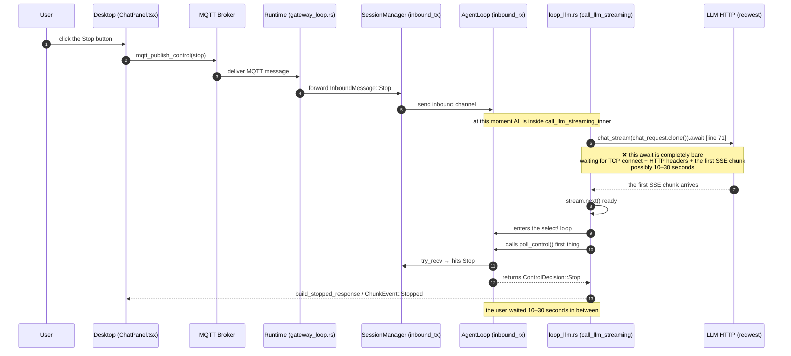
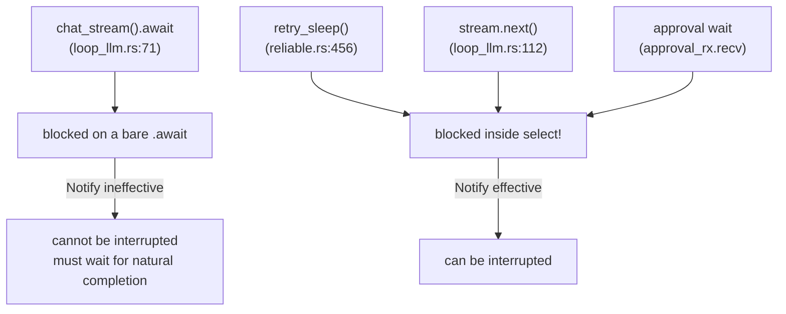

# ADR-044: Stop Signal Path Analysis and Cancellation Token Unification

> **Chinese source of truth**: [ADR-044](../zh/ADR-044-cancellation-token.md)
> **Terminology**: see [GLOSSARY.md](./GLOSSARY.md)

## Status

Draft

## Date

2026-07-29

## Decision Makers

大鱼 (Dayu)

## Predecessors

- ADR-014 (AgentLoop main-loop module decomposition — from God Object to responsibility modules)
- ADR-020 (end-to-end data-flow tiering — unblocks LLM streaming from file I/O and other control
  channels)
- ADR-033 (MQTT replacing gRPC + WebSocket — unified Gateway protocol stack)
- ADR-034 (MQTT / HTTP responsibility boundary — control plane vs data plane layering)

## Trigger

While the user was streaming an inference from the Desktop input box, clicking the Stop button
produced a UI that "keeps spinning" for 10–30 seconds until the LLM request ended naturally (TTFT
can be 10–30 s). Root-cause investigation and implementation require two phases: first understand
the current state and the gap, then discuss the Cancellation Token unification design.

---

## 1. Problem Description

### 1.1 The user-visible symptom

- **Trigger**: the user sends a message from the Desktop input box and the agent starts streaming
- **Action**: the user clicks the Stop button next to the input box
- **Expectation**: the agent's inference aborts immediately (≤500ms) and the UI becomes idle
  and editable
- **Actual**: the "stop" icon keeps showing for 10–30 seconds, appearing unresponsive, and only
  stops after the LLM naturally completes its first chunk

### 1.2 The full industry chain (facts, with file paths)

The complete path of the Stop signal from the user's click to the Runtime:

```
[1] Desktop ChatPanel.tsx:947  sendStop(agentId)
        ↓ invoke("mqtt_publish_control", { command: "stop", payload: {session_id, reason: "user_requested"} })
[2] Tauri backend mqtt_publish_control → Gateway MQTT broker
        ↓ publish on acowork/agents/{id}/control/{sid}
[3] Runtime mqtt client → gateway_loop.rs:60  mqtt_dispatch_tx.send(...)
        ↓ parse_control_payload → ControlAction::StopGeneration { session_id, reason }
[4] startup/gateway_loop.rs:186-192  control_action_to_inbound → InboundMessage::Stop { reason }
        ↓ forward_to_session_inbound → session_manager.inbound_tx.send(...)
[5] session_task inbox → AgentLoop self.inbound_rx
        ↓
[6a] poll_control() (called at every checkpoint, non-blocking try_recv)
        ↓ hits InboundMessage::Stop → returns ControlDecision::Stop
[6b] urgent_stop: Arc<Notify> (notify_one() immediately wakes the select branch)
        note: the current code only calls fire_urgent_stop() on the debug path;
              the production MQTT path never triggers this Notify (see §2.2)
```

The resulting `ControlDecision::Stop` takes effect at one of these checkpoints:
`loop_.rs:1047` / `1056` (the `run()` main loop after selecting an iteration result);
`loop_.rs:1280` (before the LLM call, i.e. **after** streaming returns);
`loop_.rs:1338` (before tool execution); `loop_llm.rs:111-432` inside the stream-handling
`tokio::select!` (`loop_llm.rs:112` the `stream.next()` branch checks `poll_control()` right after
firing, `loop_llm.rs:375` the urgent_stop Notify branch, `loop_llm.rs:400` the 500ms sleep
fallback); `loop_tools.rs:218 / 271` (two Notify branches in the tool-execution `tokio::select!`
— DevMode and Production are two different branches); `loop_tools.rs:235 / 284` (the 500ms sleep
fallback); and `loop_approval.rs:199 / 259` (the Notify branch during the approval wait).

### 1.3 Failure localization (facts)

A line-by-line review of `loop_llm.rs` localizes the problem to the missing connection between
**Step [6]** and [7]. The exact timeline of the current LLM call stack:



**The key problem is concentrated at `loop_llm.rs:71`**:

```rust
let stream = self.core.provider.chat_stream(chat_request.clone()).await?;
```

This line is a **bare await**, **not wrapped in a `select!`**. It does three things:
1. **establishes the HTTP connection** (TLS handshake + reqwest send)
2. **waits for the response headers**
3. **waits for the first SSE chunk** (i.e. TTFT — Time To First Token)

Any of these can block for 10–30 seconds. During that window:
- the `Stop` message **is already sitting in `inbound_rx`** (chain step [5] completed)
- but the AgentLoop is suspended on the `await` with **no `select!` fallback branch** doing
  `try_recv()`

So the stop signal has to wait for: the LLM to finally return its first chunk → `stream.next()`
ready → entering the `select!` loop → only then can `poll_control()` find `Stop` → and only then
can control flow reach the abort branch.

The 500ms sleep fallback and the urgent_stop Notify inside the current `select!` cannot help —
**we have not even entered the `select!` yet.**

### 1.4 Blast radius

This is not limited to the LLM call. Any blocking point that suspends on `await` without being
wrapped by `tokio::select!` has the same problem:
`provider.chat_stream().await` (network I/O); `reliable.rs:456` `retry_sleep().await` (retry waits
— **short** waits use a bare sleep, **long** waits use `select!` but with their own skip_notify,
unrelated to this design and a separate notify path); any standalone `tokio::time::sleep()`; any
I/O `await` (file reads/writes, shell calls).

The user's specific ticket only concerns the LLM path. Other checkpoints have relatively smaller
impact or worse observability, so this ADR focuses on the LLM.

## 2. Current State: the Facts of Today's "Cancellation" Mechanisms

### 2.1 Four parallel mechanisms coexist (a structural problem)

The Runtime currently maintains **four parallel cancellation mechanisms**, each trying to express
"the user wants the agent to stop":

| Mechanism | Carrier | Trigger point | Current coverage | State |
|---|---|---|---|---|
| **A. InboundMessage mpsc channel** | `self.inbound_rx: mpsc::Receiver<InboundMessage>` | MQTT Subscribe → `forward_to_session_inbound` → into the channel | whole-session phase (only checked when `poll_control()` try_receives, and only at checkpoints) | effective |
| **B. urgent_stop Notify** | `session_core.urgent_stop: Arc<Notify>` | incomplete paths: the debug server calls `fire_urgent_stop()`; the **MQTT path never calls it** | only appears in three `select!` branches: `loop_llm.rs:375`, `loop_tools.rs:218/271` | half-effective (debug only; the production path is dead) |
| **C. pending_interrupt `Option<ControlDecision>`** | an AgentLoop field | sub-modules write it after their own `select!` hits the Notify | a fallback — if the Notify woke a sub-module but the sub-module already consumed the original signal, the next checkpoint recovers it via `pending_interrupt` | fallback effective |
| **D. DebugController::state** | the debug controller's `Mutex<DebugState>` | the debug server WebSocket | the `try_lock` path inside `poll_control()` | debug only |

All four exist to do the same thing — "stop now". Every new checkpoint requires deciding which one
to use, with no unified abstraction. The AgentLoop has its own `pending_interrupt` field
(`loop_.rs:346`), the debug path has `control_notify: Arc<Notify>` (`debug/controller.rs:199`), and
SessionCore has `urgent_stop: Arc<Notify>` (`session_core.rs:80`) — three Notify fields, three
purposes, three coverage ranges.

### 2.2 The key defect: the MQTT path does not trigger urgent_stop

`urgent_stop`'s design intent is to deliver the "stop immediately" signal as fast as possible to
any coroutine currently awaiting in a `select!`. The actual state of the code is:

- it is called **only** in `DebugController` (`control_notify.notify_one()` at
  `debug/controller.rs:297`), covering DevMode only
- the **MQTT StopGeneration path** (`gateway_loop.rs:186-192` `control_action_to_inbound`) only
  writes `InboundMessage::Stop` to the session inbox through `forward_to_session_inbound`, with
  **no** `urgent_stop.notify_one()`

The result:

- in debug (DevMode), stop responds in < 500 ms (because control_notify wakes the `select!` branch)
- in production (MQTT), stop must wait for the AgentLoop's own `select!` loop to wake and for
  `poll_control()` to find the Stop message via try_recv — which in turn depends on the next stream
  event or the 500ms fallback tick

Concrete cases:
- the LLM is waiting for its first chunk (bare await): a stop signal cannot help; it must wait for
  TTFT
- the LLM is streaming (the `select!` loop is live): a stop signal is absorbed within
  ≤ the latency of `stream.next()` — usually fast
- the LLM is in a long SSE idle (no stream data and the `select!` is on the sleep branch): worst
  case, wait for the 500ms sleep tick to trigger `poll_control()`

### 2.3 Blocking I/O outside `select!` (unreachable by notify)

A Notify can only wake a Future that is **already awaiting in a `select!`**. For a bare `.await`
with no `select!` wrapper (§1.3), Notify is completely useless — the receiver coroutine is not
awaiting `notified()` at all.



`chat_stream().await` at line 71 is bare.

## 3. Design Goals

1. **First and foremost, fix the bug**: make Stop respond immediately (≤500ms) even during the
   LLM's TTFT phase
2. **Unified abstraction**: converge mechanisms A/B/C/D onto one token abstraction
3. **Blocking-aware**: the token can cooperate with bare `.await` (at least for network I/O, by
   aborting the HTTP connection)
4. **Observability**: every stop signal carries a reason + source + path ("from MQTT" / "from
   Debug") for debugging
5. **Zero regression**: preserve all existing semantics (debugger.pause / debug stop / chat stop /
   Ctrl-C) without breaking existing contracts

## 4. Solution: a Unified Cancellation Token Abstraction

### 4.1 The concept

Introduce `agent::cancellation::CancelHandle` as the **single source of truth for request-level**
cancellation signals. It is an `Arc<Inner>` shared handle (named `Handle` rather than `Token`
because `token` is already used in this project for the LLM data units
`input_tokens`/`output_tokens`/`total_tokens`, to avoid reading ambiguity; semantically equivalent
to `tokio_util::sync::CancellationToken` and .NET's `CancellationToken`).

- **Issuer**: on session_task creation a **slot** `Arc<parking_lot::Mutex<CancelHandle>>` is
  constructed and the `Arc` handle is registered with `SessionManager` (indexed by session_id), so
  external callers (MQTT dispatcher / debug server / test harness / CLI) can look it up and trigger
  it by session_id. Each `AgentLoop::run_inner` entry calls `begin_new_request()` to swap the slot
  for a brand-new Active handle — guaranteeing **one request = one generation of handle**
- **Receiver**: every potentially blocking future calls
  `session_core.cancel_handle().cancelled()` (a future) or
  `select! { ... _ = handle.cancelled() => ... }`, and **on read** obtains the current generation's
  handle via `Arc::lock()`

> **Important correction in §4.5**: early versions (Phase 1–3) used `CancelHandle` (originally
> `CancellationToken`) as a **session-level** handle, so one cancel permanently poisoned subsequent
> requests. After `run_inner` installs a new handle on entry, the handle is upgraded to a
> **request-level** signal source — aligned with production semantics (Stop cancels only the
> current request, it does not kill the session). See §4.5.

The internal state of CancelHandle:

```rust
pub struct CancelHandle {
    inner: Arc<CancelInner>,
}

struct CancelInner {
    state: AtomicU8,           // 0=Active, 1=Cancelled
    notify: Notify,            // wakes the select! branch
    reason: Mutex<Option<CancellationReason>>, // who, why, when
}

// In SessionCore:
pub(crate) struct SessionCore {
    /// §4.5: the slot holding the current request's handle
    current_cancel_handle: Arc<parking_lot::Mutex<CancelHandle>>,
    // ...
}

impl SessionCore {
    pub(crate) fn begin_new_request(&self) -> CancelHandle {
        let new_handle = CancelHandle::new();
        *self.current_cancel_handle.lock() = new_handle.clone();
        new_handle
    }

    pub(crate) fn cancel_handle(&self) -> CancelHandle {
        self.current_cancel_handle.lock().clone()
    }

    pub(crate) fn cancel_handle_arc(&self) -> Arc<parking_lot::Mutex<CancelHandle>> {
        self.current_cancel_handle.clone()
    }
}

pub enum CancellationReason {
    UserStop { source: StopSource, reason: String },
    Pause,                     // debug pause
    DebugStop,
    IterationLimit,
    BudgetExceeded,
    SessionClosed,
    Error(String),
}

pub enum StopSource {
    ChatPanel { agent_id: String, session_id: String },
    DebugServer,
    Cli,
    Test,
}
```

### 4.2 Call-site forms

**Long blocking (inside `select!`) — the recommended usage**:

```rust
tokio::select! {
    biased;
    _ = token.cancelled() => {
        // handle cancellation: flush the stream, convert status, return build_stopped_response(...)
    }
    event = stream.next() => { /* normal path */ }
    _ = tokio::time::sleep(Duration::from_millis(500)) => { /* idle poll */ }
}
```

`token.cancelled()` is a `Future<Output = ()>` that resolves if and only if the token state goes
from Active to Cancelled. **Zero overhead (polled by tokio before cancellation)**.

**Short blocking / wrapping a bare await**: for futures like `chat_stream().await` that cannot be
directly wrapped in `select!` (it returns a `Box<dyn Stream>`, and the connection + header phase is
inside the future), introduce the `token.wrap(async move { ... })` helper:

```rust
// loop_llm.rs:71 rework
let provider_stream = self.core.provider.chat_stream(chat_request.clone());
let stream = select_on_cancel(handle.clone(), provider_stream).await?
    .ok_or(RuntimeError::Cancelled)?;

tokio::pin!(stream);
// then enter the select! loop
```

**trigger (external signal sources)**:

```rust
// MQTT dispatcher in gateway_loop.rs:
fn handle_stop(session_id: &str, reason: String) {
    if let Some(handle) = session_manager.cancel_handle(session_id) {
        handle.cancel(CancellationReason::UserStop {
            source: StopSource::ChatPanel { agent_id, session_id },
            reason,
        });
    }
}

// Debug server:
fn handle_pause(session_id: &str) {
    session_manager.cancel_handle(session_id)?
        .cancel(CancellationReason::Pause);
}
```

### 4.3 Absorbing the four mechanisms

| Old mechanism | New home |
|---|---|
| `urgent_stop: Arc<Notify>` (session_core.rs:80) | **Deleted** — the cancellation token replaces it; SessionCore no longer holds a Notify |
| `pending_interrupt: Option<ControlDecision>` (loop_.rs:346) | **Deleted in Phase 4** — the token's AtomicU8 persistent state naturally solves the signal-swallowing race, so no sub-module fallback is needed. Kept through Phase 2–3 to avoid signal loss during migration |
| `ControlDecision::{Continue, Stop, Pause}` | **Keep the enum as a return value** (the Checkpoint API). Stop is carried by the token state; Pause is carried by DebugController |
| `DebugController::control_notify: Arc<Notify>` (debug/controller.rs:199) | **Kept unchanged** — Pause is debug-specific semantics (resumable), a different abstraction layer from Stop (user cancellation, irreversible). The token state is binary and irreversible (Active→Cancelled) and cannot express a Pause→Resume cycle. DebugController continues to manage Pause/Resume independently |
| `poll_control() -> ControlDecision` | Keep the method signature. Internally add a token state check (alongside pending_interrupt / inbound_rx / DebugController) |

### 4.4 `chat_stream` cancellation semantics (the key fix)

`provider.chat_stream().await` returns a `Box<dyn Stream>`. The future internally contains:
1. `reqwest.send().await` — establishing the HTTP connection (TLS handshake + sending the HTTP
   request + waiting for the response headers)
2. `response.bytes_stream()` — obtaining the SSE stream

Key insight: **there is no need to split the Provider trait.** `select_on_cancel` races the cancel
future against the original future with `tokio::select!`, and when cancel wins the original future
is **dropped**. For the `chat_stream().await` future, dropping means the suspended
`reqwest.send().await` inside it is dropped too, so **the HTTP request is aborted** — exactly the
desired behavior.

```rust
async fn select_on_cancel<T>(
    handle: CancelHandle,
    fut: impl Future<Output = Result<T, AcoworkError>>,
) -> Result<Option<T>, AcoworkError> {
    tokio::select! {
        biased;
        _ = handle.cancelled() => Ok(None),     // cancel — fut is dropped, the HTTP request is aborted
        result = fut => result.map(Some),
    }
}
```

The `loop_llm.rs:71` rework:

```rust
// no need to change the Provider trait, no need to split chat_stream
let stream = select_on_cancel(
    handle.clone(),
    self.core.provider.chat_stream(chat_request.clone()),
).await?;

let stream = match stream {
    Some(s) => s,
    None => return Ok(build_cancelled_response(...)), // handle cancellation
};

let mut stream = Box::into_pin(stream);
// then enter the existing select! loop, adding a handle.cancelled() branch
```

**Why not split the Provider trait** (a previously considered option, rejected):

- the original proposal was to split `chat_stream` into `chat_stream_request` (returning
  `reqwest::Response`) + `chat_stream_sse_to_events` so that the reqwest connection could be
  "aborted directly"
- but `select_on_cancel` already aborts the HTTP request by dropping the future — both options
  have exactly the same cancellation behavior
- splitting the trait would pull `reqwest::Response` into
  `acowork-core/src/providers/traits.rs`, **coupling the core layer to a concrete HTTP client** and
  violating layering
- all 5 Provider implementations would need changes (`openai.rs`, `anthropic.rs`, `ollama.rs`,
  `reliable.rs`, `router.rs`), and `reliable.rs`'s retry logic is built on the `chat_stream()` call
  as a whole, so splitting forces a redesign of the retry boundary
- the benefit is zero: the "background reqwest task lingering" trade-off is identical either way

**Benefits**:

- the TCP connection phase is wrapped by `select_on_cancel`, so a stop signal interrupts within
  100ms
- even if the reqwest task is still doomed, the Runtime has already returned — the UI immediately
  goes idle
- the subsequent SSE stream `select!` loop already responds correctly to stop (the existing 500ms
  fallback is there; with `handle.cancelled()` added it responds in <1ms)
- **zero intrusion**: the Provider trait is untouched and no existing Provider implementation is
  affected

**Known trade-off**: after cancellation, the reqwest task may keep running in the background until
the OS closes the socket. This is acceptable — the user perceives stop as effective, and the
background task cleans itself up on its own timeout.

**Further optimization** (optional, a separate future task): require providers to wrap
`reqwest::Client` in a future carrying an abort handle so the Runtime holds the client handle and
can truly abort the reqwest task during `await`. Not done here.

### 4.5 Rollout (phased)

> **This ADR only settles the design intent; it does not mandate the execution order within the
> document. Rollout is decided at PR review.**

**Phase 1 — infrastructure (no functional change)**: add the
`core/acowork-runtime/src/cancellation/` module — `token.rs` (`CancelHandle`, `CancellationReason`,
`StopSource`), `reason.rs` (reason serialization for logs + telemetry), `wrapper.rs`
(`select_on_cancel`, `cancelled_or` and other future helpers) and `integration_tests.rs` (unit
tests of handle + `select_on_cancel` behavior: fast/cancel/race/re-entry); add the dev-dependency
`tokio = { features = ["test-util"] }` to `Cargo.toml` and `pub mod cancellation` to lib.rs.

**Phase 2 — switch `session_core.urgent_stop` to the handle (additive only, nothing deleted)**:
add the `CancelHandle` field to `session_core.rs` (coexisting with `urgent_stop`);
add `HashMap<session_id, CancelHandle>` to `session_manager.rs` (coexisting with `urgent_stops`)
plus the public `cancel_handle(session_id) -> Option<CancelHandle>` method; add a handle state
check inside `poll_control()` in `loop_inbound.rs` (lowest priority, alongside
`pending_interrupt` / `inbound_rx` / `DebugController`); compiling with all existing tests passing
is the Phase 2 endpoint.

> **Note**: Phase 2 does not delete `pending_interrupt`. Its purpose is to solve the signal
> hand-off race after a sub-module's `select!` consumes the Notify event. The handle's AtomicU8
> persistent state does solve that race, but only once the handle is effective on all paths
> (completed in Phase 3). Deleting `pending_interrupt` in Phase 2 would lose Stop signals after a
> sub-module consumes them. Deletion is deferred to Phase 4.

**Phase 3 — close the functional gap (fix the bug)**: in the MQTT StopGeneration path at
`startup/gateway_loop.rs`, call
`session_manager.cancel_handle(sid)?.cancel(UserStop{...})` **before**
`forward_to_session_inbound`; wrap `chat_stream().await` at `loop_llm.rs:71` with
`select_on_cancel` (without splitting the Provider trait, see §4.4); change the Notify branches in
`loop_tools.rs` / `loop_approval.rs` to `handle.cancelled()`; e2e: the user clicks stop during the
TTFT phase and reaches idle end-to-end in ≤ 1 second.

**Phase 4 — clean up dead code (subtractive)**: delete `pending_interrupt` at `loop_.rs:346` (the
handle is now effective on all paths, and its AtomicU8 persistent state has taken over
`pending_interrupt`'s signal hand-off responsibility); delete `session_core.urgent_stop` and
`session_manager.urgent_stops`; keep `ControlDecision::Continue` unchanged (it remains a useful
"no signal" return value for the checkpoint API — deleting it would require changing the return
type to `Option<ControlDecision>`, touching ~10 match arms for little gain); keep
`DebugController::control_notify` unchanged (Pause does not go through the handle, see §4.3).

### 4.6 The verification matrix

**L1 unit tests** (the `cancellation/` module): `cancelled()` future behavior before and after
cancel; `select_on_cancel` — cancel arrives first / the future arrives first / extra cancels
arriving during a race are discarded; multi-threaded visibility of the reason fields; and the
**per-request slot test** (§4.5) — installing a new handle does not poison the previous generation,
and reading through the `Arc` handle always yields the current generation.

**L2 existing tests not broken**: `cargo test -p acowork-runtime` fully passes.

**L3 e2e / manual**:

| Scenario | Expected behavior |
|---|---|
| Click stop while the LLM is streaming (SSE chunks already arriving) | idle in ≤200ms |
| Click stop during the TTFT phase (the HTTP connection is not yet established) | idle in ≤500ms (breakpoint: the background reqwest task times out naturally) |
| Click stop during streaming idle (the `select!` is on the sleep branch) | idle in ≤500ms |
| The LLM raises an error while streaming (no stop clicked) | normal error handling, not disturbed by cancel |
| Click stop during tool execution | the tool handle aborts, aborting the current iteration |
| Click stop during the approval wait | wakes from the approval wait immediately, handled as a stop |
| The user clicks stop twice (retry stop) | a single cancellation takes effect, no duplicate side effects |
| **The user sends a new message after stopping (§4.5 regression case)** | **a normal response** — `begin_new_request` installs a new handle, and the old cancel state does not pollute later requests |
| The user clicks stop but the LLM already returned a chunk (race) | the current chunk enters the existing chunk-event sequence and exits at the next checkpoint — same as current behavior |

## 5. Decisions Awaiting Your Confirmation

- **D1: proceed to Phase 1 (infrastructure)?** Proceed → I start writing the `cancellation/`
  module and merge after the unit tests are in place. Defer → keep this ADR as a draft until a
  more pressing need arises.
- **D2: `select_on_cancel` cancellation semantics** — when cancel wins, the original future is
  dropped (the `reqwest.send().await` inside `chat_stream().await` is dropped too and the HTTP
  request is aborted) and the Runtime immediately returns `RuntimeError::Cancelled`. The background
  reqwest task may linger briefly until the OS closes the socket, which does not affect perceived
  responsiveness. **Recommended for acceptance**: (a) no need to split the Provider trait, zero
  intrusion; (b) dropping the future already aborts the HTTP request, so the user perceives stop
  as effective; (c) a reqwest task lingering for a few seconds does not affect perception.
- **D3: migrate all at once (Phase 1–4 as one PR), or land in separate PRs?** I lean towards
  **three PRs**: PR1 = Phase 1+2 infrastructure (introduce only, delete nothing); PR2 = Phase 3
  wiring the MQTT path + `chat_stream` `select_on_cancel` to fix the main bug; PR3 = Phase 4
  cleaning up the old fields such as `urgent_stop` / `pending_interrupt` (`control_notify` is
  kept). Each PR runs backend tests plus your manual Desktop stop verification.
- **D4: introduce the same handle for DebugController?** The debug path currently has its own
  Notify, and the control-signal semantics differ slightly (Pause vs Stop vs Step).
  **Recommended: do not introduce it.** Pause is debug-specific (resumable) semantics while the
  handle is binary and irreversible (Active→Cancelled) and cannot express a Pause→Resume cycle.
  DebugController continues to manage Pause/Resume independently; the handle only handles Stop
  (user cancellation).

## 6. Alternatives (not recommended)

### 6.1 Keep the status quo, just wrap `chat_stream` in a select

The minimal change — wrap the single `chat_stream().await` line in `select!` + urgent_stop.

**Rejected because**:
- it does not fix the structural problem (4 mechanisms coexisting)
- the urgent_stop Notify is not fired on the production MQTT path, so wrapping this one line does
  not help — either dispatch must also gain `notify_one()`, or it is wrapped in a `select!` whose
  orphan branch is always Continue, so cancel still never takes effect
- it keeps all the leftover Notify / `pending_interrupt` fields, so every new checkpoint must still
  choose a path

### 6.2 Adopt tokio_util's CancellationToken (an external dependency)

**Attractiveness**: `tokio-util::sync::CancellationToken` already exists and is battle-tested.

**Rejected because**:
- adding an external crate dependency is unnecessary — its interior is 30 lines
- it cannot satisfy the reason-carrying requirement: tokio-util only supports a single boolean
  state, with no source / timestamp / reason fields
- a self-implemented serializable reason integrates with the existing tracing/telemetry pipeline
  with zero friction

### 6.3 futures CancellationToken / async-cancellation

- Same as 6.2, and the existing code uses `tokio::select!` heavily, so an in-house helper keeps
  the style consistent

## 7. Risks and Rollback

**R1** — after `select_on_cancel` wraps `chat_stream`, the cancelled reqwest task may keep running
briefly in the background and temporarily occupy the provider connection pool. Countermeasure:
a separate future task using `tokio::time::timeout` to force-kill the task (out of scope here).

**R2** — after `pending_interrupt` is deleted in Phase 4, confirm that the token's AtomicU8
persistent state already covers all the original `pending_interrupt` use cases
(`loop_approval.rs:156/295`, `loop_llm.rs:131/382/418`). The token state is persistent (unlike
Notify's edge-trigger): once cancelled, `is_cancelled()` returns true forever, which naturally
solves the signal-swallowing race. Countermeasure: before Phase 4 ships, run
`cargo test -p acowork-runtime --features debug --` over all tests, focusing on the race tests in
`loop_approval` and `loop_tools`.

**R3** — DebugController keeps its own `control_notify` alongside the token; the two paths must not
conflict (e.g. the user clicks chat stop during a debug pause). Countermeasure: keep the
`poll_control()` check priority unchanged (pending_interrupt > inbound_rx > DebugController >
token); the two paths each own their own semantics.

**Rollback**: Phases 1–2 only add, so they can be reverted at any time; if Phase 3 causes problems
in production, cherry-pick-revert that commit; if Phase 4 never ships, the old fields remaining is
not a safety risk.

## 8. Out of Scope

- **Splitting the Provider trait** (`chat_stream` → `chat_stream_request` +
  `chat_stream_sse_to_events`) — `select_on_cancel` already aborts the HTTP request by dropping the
  future, so splitting brings no extra benefit while coupling the core layer to reqwest (§4.4)
- **Exposing an abort handle at the Provider layer** (a separate future task, not in scope)
- **Migrating DebugController's Pause/Resume to the token** — Pause is resumable semantics while
  the token is binary and irreversible; DebugController continues to manage it independently
  (§4.3)
- **`retry_sleep` cancellation** (`reliable.rs:456` is a different path, unrelated to this ticket;
  handle it when stopping during an LLM retry next arises)
- **Deleting `InboundMessage::Stop`** — it is one member of the InboundMessage enum, a different
  abstraction layer from the token (message passing vs control plane). The boundary is already
  clear and does not need merging
- **Deleting `ControlDecision::Continue`** — kept as the checkpoint API's "no signal" return value;
  deleting it would require changing the return type to `Option<ControlDecision>` for little gain
  (§4.5 Phase 4)
- **Restructuring `session_manager` overall** — convergence happens only at the token level; the
  session_id → handle mapping mechanism in session_manager is untouched

## 9. References

- [`core/acowork-runtime/src/agent/loop_.rs`](../../../core/acowork-runtime/src/agent/loop_.rs) —
  the `ControlDecision` enum, `pending_interrupt`, `poll_control` call sites (around lines
  1047/1056/1096/1113/1280/1285/1338/1343/1432/1436)
- [`core/acowork-runtime/src/agent/loop_inbound.rs:150-202`](../../../core/acowork-runtime/src/agent/loop_inbound.rs)
  — `poll_control` / `poll_stop` implementations
- [`core/acowork-runtime/src/agent/loop_llm.rs:71`](../../../core/acowork-runtime/src/agent/loop_llm.rs)
  — **the root-cause line, the bare `chat_stream().await`**
- [`core/acowork-runtime/src/agent/loop_llm.rs:111-432`](../../../core/acowork-runtime/src/agent/loop_llm.rs)
  — the three-branch `select!` (stream / notify / sleep)
- [`core/acowork-runtime/src/agent/loop_tools.rs:218,271`](../../../core/acowork-runtime/src/agent/loop_tools.rs)
  — the urgent_stop `select!` branches in tool execution
- [`core/acowork-runtime/src/agent/loop_approval.rs:199,259`](../../../core/acowork-runtime/src/agent/loop_approval.rs)
  — the ctrl_notify `select!` branches in the approval wait
- [`core/acowork-runtime/src/agent/session_core.rs:80`](../../../core/acowork-runtime/src/agent/session_core.rs)
  — the `urgent_stop: Option<Arc<Notify>>` field
- [`core/acowork-runtime/src/agent/session/session_manager.rs:341-344,563-566`](../../../core/acowork-runtime/src/agent/session/session_manager.rs)
  — `urgent_stops: HashMap<String, Arc<Notify>>`
- [`core/acowork-runtime/src/agent/session/session_task.rs:574-579`](../../../core/acowork-runtime/src/agent/session/session_task.rs)
  — the `urgent_stop_notify()` exposure
- [`core/acowork-runtime/src/startup/gateway_loop.rs:186-192`](../../../core/acowork-runtime/src/startup/gateway_loop.rs)
  — `ControlAction::StopGeneration` → `InboundMessage::Stop` (**the production path does not trigger
  the urgent_stop notify**)
- [`core/acowork-runtime/src/mqtt/control_handler.rs:166-169`](../../../core/acowork-runtime/src/mqtt/control_handler.rs)
  — proto Stop → `ControlAction::StopGeneration` parsing
- [`core/acowork-runtime/src/providers/openai.rs:882-937`](../../../core/acowork-runtime/src/providers/openai.rs)
  — the `chat_stream` implementation, including `send_with_compat` → `sse_to_stream`
- [`core/acowork-runtime/src/providers/reliable.rs:414-479`](../../../core/acowork-runtime/src/providers/reliable.rs)
  — `ReliableProvider::chat_stream`, including `retry_sleep`
- [`core/acowork-runtime/src/debug/controller.rs:193-220`](../../../core/acowork-runtime/src/debug/controller.rs)
  — `DebugController.control_notify`
- [`apps/acowork-desktop/src/stores/chatStore.ts:1300-1317`](../../../apps/acowork-desktop/src/stores/chatStore.ts)
  — `sendStop` going through `mqtt_publish_control`
- [`apps/acowork-desktop/src/components/chat/ChatPanel.tsx:944,947`](../../../apps/acowork-desktop/src/components/chat/ChatPanel.tsx)
  — the three branches of `handleStop`
