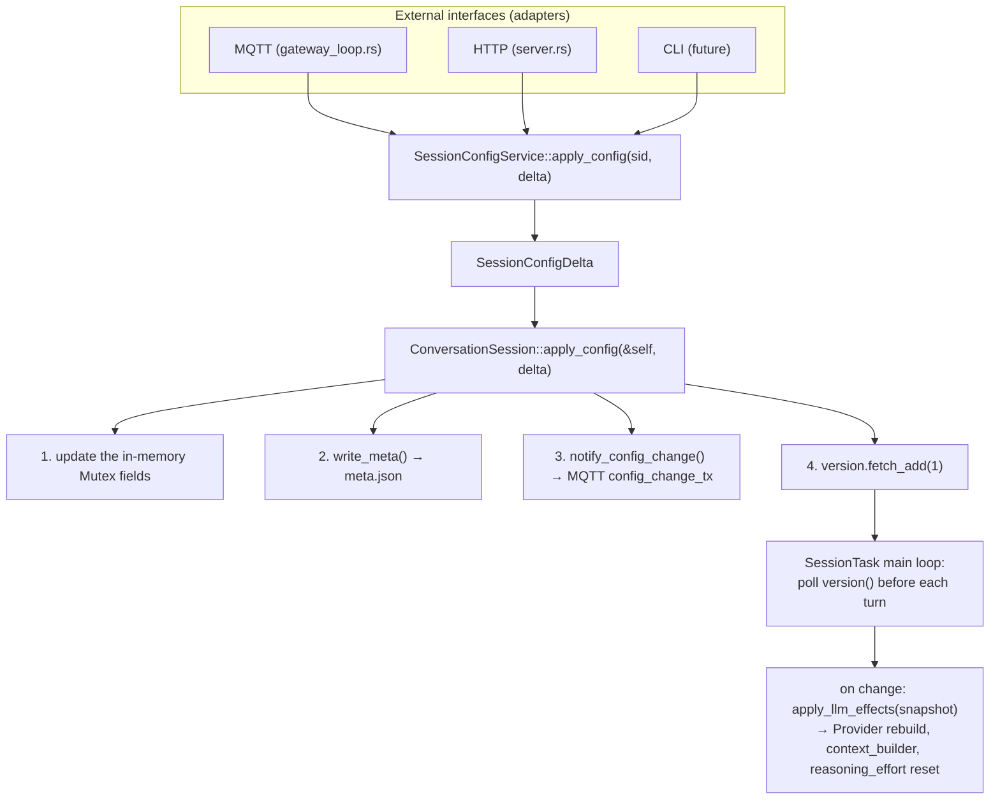
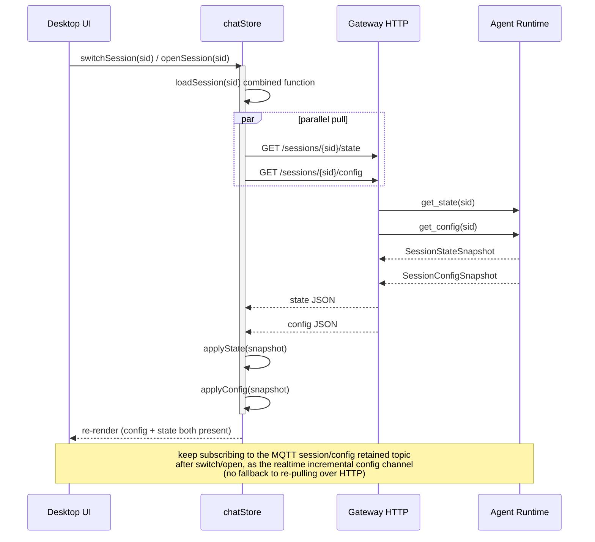

# ADR-047: Decoupling Session Config Persistence from the LLM Inference Loop

> **Chinese source of truth**: [ADR-047](../zh/ADR-047-session-config-decouple-from-inference.md)
> **Terminology**: see [GLOSSARY.md](./GLOSSARY.md)

## Status

Draft

## Date

2026-07-24

## Decision Makers

大鱼 (Dayu)

## Predecessors

- [ADR-012](../zh/ADR-012-per-session-model-isolation.md) (per-session model isolation)
- [ADR-040](../zh/ADR-040-runtime-adapter-use-case-layer.md) (Runtime UseCase trait layer)
- [ADR-043](../en/ADR-043-session-config-state-split.md) (Session Config / State dual-topic split)

---

## 1. Decision Summary

ADR-043 completed the `SessionConfig` / `SessionState` dual-topic split on the **MQTT push** side
and fixed the config rebound problem on the **push path**. But the **HTTP pull path** and the
**config persistence path** still exhibit the same class of bug:

1. **HTTP pull rebound**: when the frontend switches to another session and back, the `meta.json`
   fetched by `fetchSessionState` over HTTP `GET /sessions/{sid}` still carries the old config
   values and overwrites the frontend's optimistic update.
2. **Config persistence blocked by inference**: config commands such as `ModelSwitch` and
   `ReasoningEffort` enter `SessionTask`'s serial message queue as `SessionMessage` variants, so
   during `agent_loop.run().await` they are blocked — `meta.json` is not updated and MQTT
   `config_change_tx` never fires.

The root cause is that **the config persistence path is coupled to the LLM inference flow at the
type level**: the `SessionMessage` enum mixes config commands with inference-control commands, all
of which go through the same serial channel, the same `match`, and the same loop blocked by
`run().await`.

This ADR eliminates the entire bug class with three layers of change:

| Layer | Change | Effect |
|---|---|---|
| **Data** | `ConversationSession` is shared with `SessionHandle` via `Arc`; add a single `apply_config(delta)` write entry point + a version counter | config writes no longer pass through the inference queue |
| **Message** | remove the config command variants from `SessionMessage`; `SessionTask` polls the version counter instead | type-level prevention of config commands entering the inference queue |
| **Usecase** | activate the `SessionConfigService` trait shelved by ADR-040; the HTTP / MQTT / CLI adapters all route through it | a single entry point; adding a parameter requires no adapter or message-protocol change |

**Core design principles**:

- **Config persistence (memory + meta.json + MQTT notification) is immediate** and depends on no
  external flow.
- **Taking effect on the LLM side (Provider rebuild, context_builder update) may be deferred to
  the next inference turn** — an inherent constraint of interleaving with inference, and the delay
  is reasonable and acceptable.
- **Adding a config parameter only requires modifying the parameter definition
  (`SessionConfigDelta`) and the handler (`ConversationSession::apply_config`)** — no need to touch
  `SessionMessage`, `gateway_loop` routing, or the `SessionTask` handler.

## 2. Root Cause

### 2.1 The serial blocking of the `SessionTask` main loop

The main loop at `session_task.rs:593`:

```rust
loop {
    let msg = inbound_rx.recv().await;       // wait for the next message

    match msg {
        Some(SessionMessage::ChatMessage { .. }) => {
            agent_loop.run(...).await;        // ⬅ the whole loop blocks during inference
        }
        Some(SessionMessage::ModelSwitch { model, provider }) => {
            // ⬅ can only execute after inference ends
            agent_loop.session.set_model(model.clone());
            conv.update_model_provider(&model, provider.as_deref());
            //     ^^^^^^^^^^^^^^^^^^^^^^^^^^^^^^^^^^^^^^^^^^^^
            //     write_meta() + notify_config_change() are blocked
        }
        Some(SessionMessage::ReasoningEffort { effort }) => { ... }
        Some(SessionMessage::SetWorkspaceId { workspace_id }) => { ... }
    }
}
```

While `agent_loop.run().await` is executing (which can last seconds to minutes), the `ModelSwitch`,
`ReasoningEffort` and other config messages sitting in `inbound_rx` cannot be dequeued.

### 2.2 `ConversationSession` is not reachable from outside

The ownership chain of `ConversationSession` (which owns `write_meta()` and `config_change_tx`):

```
ConversationSession (model/provider/workspace_id/reasoning_effort/temperature + write_meta + config_change_tx)
  └─ SessionState.conversation: Option<ConversationSession>    // owned, not Arc
     └─ AgentLoop.session
        └─ SessionTask (tokio task)                            // exclusive
```

`SessionManager` only holds `SessionHandle`, and `SessionHandle` has no reference to
`ConversationSession`. The only trigger path for config persistence goes through the `inbound_tx`
channel into the `SessionTask` serial loop.

### 2.3 Config commands and inference commands are mixed inside `SessionMessage`

The `SessionMessage` enum carries two semantically distinct classes of command:

| Class | Variants | Should it be blocked by inference? |
|---|---|---|
| Inference control | `ChatMessage`, `Stop`, `ContinueExecution`, `CompactContext` | ✅ yes |
| Config change | `ModelSwitch`, `ReasoningEffort`, `SetWorkspaceId`, `UpdateRuntimeConfig` | ❌ no |
| Environment injection | `UpdateMcpTools`, `UpdateBuiltinTools`, `SetWorkDir`, `SetWorkspacePromptFile` | ❌ no |

There is no type-level distinction. A developer adding a new parameter naturally copies
`ModelSwitch` to add a new `SessionMessage` variant, and then steps on the same rake.

### 2.4 The usecase layer is shelved

ADR-040 designed a `SessionControlService` trait (with `model_switch()`, `reasoning_effort()`,
`workspace_switch()`), but shelved it because `SessionManager` needs `&mut self` and is
incompatible with `Arc<dyn ...>`. The result: the MQTT path punches straight through into
`SessionManager` internals, bypassing the usecase layer.

### 2.5 The existing partial decoupling is not thorough

`SessionHandle` already shares `workspace_id` and `current_work_dir` via `Arc<RwLock<String>>`, and
`SessionManager::set_session_workspace` updates them synchronously. But meta.json persistence still
queues `SessionMessage::SetWorkspaceId` into the `SessionTask`, so `workspace_id` has the same
rebound problem.

### 2.6 `ConversationSession`'s config methods are already thread-safe

The key fact: all of `ConversationSession`'s config update methods take `&self` (not `&mut self`)
and use `std::sync::Mutex` internally:

```rust
pub fn update_model_provider(&self, model: &str, provider: Option<&str>) {
    if let Ok(mut m) = self.model.lock() { *m = Some(model.to_string()); }
    if let Ok(mut p) = self.provider.lock() { *p = provider.map(|s| s.to_string()); }
    self.write_meta();               // synchronous file I/O
    self.notify_config_change();     // UnboundedSender::send, non-blocking
}
```

These methods are naturally callable from any thread via `Arc<ConversationSession>` — no locking
refactor needed.

## 3. Design

### 3.1 Architecture overview



### 3.2 Data layer

#### 3.2.1 `ConversationSession` changes from owned to `Arc`-shared

```rust
// session_state.rs - changed
pub(crate) conversation: Option<Arc<ConversationSession>>,  // was: Option<ConversationSession>

// session_handle.rs - new field
pub struct SessionHandle {
    // ... existing fields ...
    pub(crate) conversation: Option<Arc<ConversationSession>>,
}
```

On session creation the same `Arc::new(conv)` is placed into both `SessionHandle` and
`SessionState`. `ConversationSession::Drop` fires once all `Arc` references are released; when
`SessionManager` closes a session it first calls an explicit cleanup method to clear retained MQTT
messages and only then removes the handle, keeping the Drop timing controllable.

#### 3.2.2 `SessionConfigDelta` — the parameter definition

```rust
// session_config/delta.rs

/// Partial session config update. Each field is `None` (unchanged) or `Some(new_value)`.
///
/// To add a new config parameter:
/// 1. Add the field here
/// 2. Add the handling in `ConversationSession::apply_config()`
/// 3. Add it to the `SessionConfig` proto + `build_session_config_snapshot()`
/// 4. (Optional) Add the LLM-side effect in `llm_effects.rs`
#[derive(Debug, Clone, Default, Serialize, Deserialize)]
pub struct SessionConfigDelta {
    pub model: Option<String>,
    pub provider: Option<String>,
    pub workspace_id: Option<String>,
    pub reasoning_effort: Option<String>,
    pub temperature: Option<f32>,
    pub title: Option<String>,
}
```

> **ADR-074 revision (2026-09-15)**: `SessionConfigDelta` / `SessionConfigSnapshot` gain
> `context_window: Option<u64>` (alongside model / provider / reasoning_effort / temperature).
> Encoding semantics: `Some(0)` / `null` / the field being absent = **clear the override** (an
> invalid value normalized on disk to "field absent"); `Some(n)` (`n ∈ FLOOR..=CEILING`, with
> `FLOOR = 8_192` and `CEILING = 4_194_304`) = set it; out-of-range values return HTTP 400 from
> `put_session_config`. How it takes effect: it participates as the highest-priority Layer 0 of the
> ADR-026 resolution chain, and the per-session override replaces that session's trim / compaction
> thresholds and context_usage pushes; clearing = inherit the per-agent chain. See
> [ADR-074](ADR-074-per-session-context-window-override.md).

#### 3.2.3 `ConversationSession::apply_config` — the single write entry point

```rust
// conversation.rs - new method

impl ConversationSession {
    /// THE single entry point for ALL config changes.
    /// Synchronous: memory + meta.json + MQTT notification.
    /// Called from SessionConfigService, NOT from SessionTask.
    pub fn apply_config(&self, delta: &SessionConfigDelta) {
        let mut changed = false;
        if let Some(ref model) = delta.model {
            *self.model.lock().unwrap() = Some(model.clone());
            changed = true;
        }
        if let Some(ref provider) = delta.provider {
            *self.provider.lock().unwrap() = Some(provider.clone());
            changed = true;
        }
        if let Some(ref workspace_id) = delta.workspace_id {
            *self.workspace_id.lock().unwrap() = Some(workspace_id.clone());
            changed = true;
        }
        if let Some(ref effort) = delta.reasoning_effort {
            *self.reasoning_effort.lock().unwrap() = Some(effort.clone());
            changed = true;
        }
        if let Some(temp) = delta.temperature {
            *self.temperature.lock().unwrap() = Some(temp);
            changed = true;
        }
        if let Some(ref title) = delta.title {
            *self.current_title.lock().unwrap() = Some(title.clone());
            self.title_set.store(true, Ordering::Relaxed);
            changed = true;
        }

        if changed {
            self.write_meta();
            self.notify_config_change();
            self.config_version.fetch_add(1, Ordering::SeqCst);
        }
    }

    /// Monotonic version counter. SessionTask polls this at turn boundaries.
    pub fn config_version(&self) -> u64 {
        self.config_version.load(Ordering::Acquire)
    }
}
```

`ConversationSession` gains the field `config_version: AtomicU64`.

#### 3.2.4 `SessionConfigSnapshot` — reading the current config

```rust
// session_config/delta.rs

/// Read-only snapshot of the current session config.
/// Used by the HTTP GET, the MQTT retained topic, and LLM-side effect application.
#[derive(Debug, Clone, Serialize)]
pub struct SessionConfigSnapshot {
    pub model: Option<String>,
    pub provider: Option<String>,
    pub workspace_id: Option<String>,
    pub reasoning_effort: Option<String>,
    pub temperature: Option<f32>,
    pub title: Option<String>,
}
```

`ConversationSession` gains a `config_snapshot(&self) -> SessionConfigSnapshot` method.

### 3.3 Message layer

#### 3.3.1 Remove the config command variants from `SessionMessage`

```rust
// session_task.rs - delete the following variants:
//   ModelSwitch { model, provider }         ❌
//   ReasoningEffort { effort }              ❌
//   SetWorkspaceId { workspace_id }         ❌
//   UpdateRuntimeConfig(overrides)          ❌ (decided after evaluation, see §3.3.3)
```

Their persistence logic is superseded by `ConversationSession::apply_config()`.

#### 3.3.2 `SessionTask` version polling + LLM-side effects

```rust
// session_config/llm_effects.rs

/// Apply the LLM-side effects of a config change.
/// Called by SessionTask at turn boundaries when the config version has changed.
/// This is the ONLY place that handles LLM-side reactions to config changes.
pub fn apply_llm_effects(
    agent_loop: &mut AgentLoop,
    context_builder: &mut ContextBuilder,
    snapshot: &SessionConfigSnapshot,
) {
    // Model/Provider change → rebuild the LLM Provider
    if let Some(ref model) = snapshot.model {
        agent_loop.session.set_model(model.clone());
        if let Some(ref provider_id) = snapshot.provider {
            if let Some(new_provider) = agent_loop.session_core.build_provider_for(
                provider_id, &agent_loop.core.config,
                &agent_loop.core.global_provider_list,
                &agent_loop.core.provider_key_vault,
                agent_loop.core.compat_cache.as_ref(),
            ) {
                agent_loop.update_provider(new_provider, model.clone(), Some(provider_id.clone()));
            }
        }
        context_builder.set_override_model(model.clone());

        // A model switch resets reasoning_effort to the new model's default
        let caps = agent_loop.core.get_model_capabilities(model);
        let default_effort = resolve_default_effort(&caps);
        agent_loop.session.set_reasoning_effort(default_effort);
    }

    // ReasoningEffort change (without a model switch)
    if snapshot.model.is_none() {
        if let Some(ref effort) = snapshot.reasoning_effort {
            let parsed = ReasoningEffort::from_str_loose(effort);
            agent_loop.session.set_reasoning_effort(parsed);
        }
    }
}
```

```rust
// session_task.rs - the main loop is changed

let mut last_config_version = agent_loop
    .session.conversation()
    .map(|c| c.config_version())
    .unwrap_or(0);

loop {
    // ── check whether the config was modified during the previous inference round ──
    if let Some(conv) = agent_loop.session.conversation() {
        let current = conv.config_version();
        if current != last_config_version {
            let snapshot = conv.config_snapshot();
            session_config::llm_effects::apply_llm_effects(
                &mut agent_loop, &mut context_builder, &snapshot,
            );
            last_config_version = current;
        }
    }

    let msg = inbound_rx.recv().await;
    match msg {
        Some(SessionMessage::ChatMessage { .. }) => {
            agent_loop.run(...).await;
        }
        Some(SessionMessage::Stop { reason }) => { ... }
        Some(SessionMessage::ContinueExecution) => { ... }
        Some(SessionMessage::SetWorkDir { path }) => { ... }
        Some(SessionMessage::SetWorkspacePromptFile { content }) => { ... }
        // ModelSwitch / ReasoningEffort / SetWorkspaceId are removed
    }
}
```

**Key semantics**: config persistence completes immediately (`apply_config` runs synchronously),
while the LLM-side effects take effect before the next inference round (version polling). A config
change made during inference does not interrupt the current inference, but `meta.json` and the MQTT
notification are already updated.

#### 3.3.3 The handling of `UpdateRuntimeConfig`

`UpdateRuntimeConfig(RuntimeConfigOverrides)` carries `temperature`, `max_output_tokens`,
`max_iterations`, `context_window` and so on. `temperature` is a config field (persisted to
meta.json); the rest are runtime overrides (not persisted to meta.json, only affecting the AgentLoop
runtime parameters).

Handling: the `temperature` part goes through `apply_config()` via a `SessionConfigDelta`; the rest
remain `SessionMessage` variants because they are not persisted config but runtime behaviour
adjustments.

### 3.4 Usecase layer

#### 3.4.1 The `SessionConfigService` trait

```rust
// usecases/session_config.rs

/// Usecase trait for session config mutations.
/// All external interfaces (HTTP, MQTT, CLI) go through this trait.
#[async_trait]
pub trait SessionConfigService: Send + Sync {
    /// Apply a config change. Persistence is immediate.
    /// LLM-side effects are deferred to the next inference turn.
    async fn apply_config(&self, session_id: &str, delta: SessionConfigDelta) -> Result<()>;

    /// Read the current config (HTTP GET /sessions/{sid}/config).
    async fn get_config(&self, session_id: &str) -> Result<SessionConfigSnapshot>;
}
```

#### 3.4.2 The `RuntimeSessionConfigService` impl

```rust
// usecases/session_config_impl.rs

pub struct RuntimeSessionConfigService {
    /// Shared session config stores (Arc<ConversationSession>), keyed by session_id.
    /// Interior mutability via RwLock - unblocks ADR-040's &mut self problem.
    sessions: Arc<RwLock<HashMap<String, Arc<ConversationSession>>>>,
    /// For workspace validation.
    resolver: Option<Arc<RwLock<WorkspaceResolver>>>,
}
```

The `&self` path of `apply_config`: `sessions.read()` → obtain the
`Arc<ConversationSession>`; `conv.apply_config(&delta)` (`&self`, Mutex internally); workspace
validation via `resolver.read()` (`&self`). No `&mut self` is needed, so it can safely be wrapped in
`Arc<dyn SessionConfigService>`.

#### 3.4.3 The three adapters all route through the usecase

```rust
// gateway_loop.rs (MQTT adapter)
InboundMessage::ModelSwitchAction { model_id, provider_id } => {
    let delta = SessionConfigDelta {
        model: Some(model_id),
        provider: provider_id,
        ..Default::default()
    };
    config_service.apply_config(&session_id, delta).await
}

// http/server.rs (HTTP adapter) - new
// GET  /sessions/{sid}/config  → config_service.get_config(sid)
// PUT  /sessions/{sid}/config  → config_service.apply_config(sid, body)
```

### 3.5 Splitting the HTTP response

#### 3.5.1 `SessionDetail` splits config / state

```rust
// usecases/session_metadata.rs

pub struct SessionDetail {
    pub session_id: String,
    pub created_at: String,
    pub last_active_at: String,

    // The config part (from the config field of meta.json)
    #[serde(skip_serializing_if = "Option::is_none")]
    pub config: Option<SessionConfigSnapshot>,

    // The state part (from the state field of meta.json + the in-memory snapshot)
    #[serde(skip_serializing_if = "Option::is_none")]
    pub state: Option<SessionStateSnapshot>,
}
```

The frontend's `fetchSessionState` reads only the `state` part. Config is obtained via
`GET /sessions/{sid}/config` or the MQTT `session/config` retained topic.

#### 3.5.2 The frontend pull protocol: switching/opening a session must pull config and state together

After the split, HTTP `GET /sessions/{sid}` returns only state, so the frontend must separately
call `GET /sessions/{sid}/config` to get config. This breaks the implicit contract of "one HTTP
call gets the whole `SessionDetail`". **If `fetchSessionConfig` is not explicitly added at
implementation time, the UI enters a "config vacuum" state and ADR-043's fix degrades to
"push-only", bringing the rebound bug back.**

**Mandatory rule**: whenever the frontend **cold-loads a session**, it **must** call both HTTP
endpoints:

| Scenario | Description | Required HTTP calls |
|---|---|---|
| **Switching sessions** | the user switches from session A to session B | `GET /sessions/{B}/state` + `GET /sessions/{B}/config` |
| **Opening a session** | clicking from the session list, a deep link, a page refresh, etc. | `GET /sessions/{sid}/state` + `GET /sessions/{sid}/config` |
| **First load on app startup** | the desktop restores the last session on startup | `GET /sessions/{sid}/state` + `GET /sessions/{sid}/config` |

The two calls may be serial or parallel; wrapping them in a `Promise.all` is recommended to
minimize perceived latency.

**Why `fetchSessionState` alone is not enough**:

1. **Config information is lost entirely**: `model`, `provider`, `workspace_id`,
   `reasoning_effort`, `temperature` and `title` are not in the state response. Calling only
   state leaves the UI in an "empty config" state — a blank model dropdown, an unbound workspace,
   a reasoning-effort control with no value.
2. **It violates ADR-043's design intent**: [ADR-043](./ADR-043-session-config-state-split.md)
   splits config/state into two independent pull paths so that config rebound has an
   independently controllable source. Pulling only state cuts config's pull path away, degrading
   ADR-043's fix to "push-only".
3. **The rebound bug returns**: without pulling config, the config shown in the UI stays at the
   previous session's value or the initial value, and "blank / mismatched config" reappears on
   switch-back, re-triggering the same class of bug listed in §1.

**Why not rely on the MQTT `session/config` retained topic as a fallback**: retained messages do
provide a config source, but during MQTT connect/reconnect they may not arrive in time (a window
exists); switching/opening sessions is a high-frequency operation and making users perceive "config
hasn't arrived yet" breaks the experience. HTTP pull must be the **primary path**, with MQTT
retained as the **realtime incremental channel**.

**Implementation conventions**:

- the frontend `chatStore.ts` (or the equivalent store) adds a `fetchSessionConfig(sid)` action
  symmetric to `fetchSessionState(sid)`
- the switch/open entry points (`switchSession` / `openSession` / `restoreLastSession` etc.) **must
  call both endpoints in pairs**
- **wrap them in a combined `loadSession(sid)`** doing
  `Promise.all([fetchSessionState(sid), fetchSessionConfig(sid)])`, exposing a single promise to
  callers — **use types/wrapping to make the synchronized pull impossible to bypass**, so a later
  developer cannot accidentally call only one of them
- the MQTT retained channel **stays subscribed** after switching/opening, as the realtime
  incremental source for later config changes
- do not call `fetchSessionConfig` in "triggers a single inference" scenarios (sending a message,
  continuing execution) — that path is covered by the realtime MQTT notification

**Cold-load sequence diagram**:



## 4. Implementation Plan

**Phase 1 — the data layer decoupling (fixes the rebound bug; the core)**: `session_config/mod.rs`
(new module declaration); `session_config/delta.rs` (new — `SessionConfigDelta` +
`SessionConfigSnapshot`); `session_config/llm_effects.rs` (new — `apply_llm_effects()` extracted
from `SessionTask`); `conversation.rs` gains `config_version: AtomicU64` plus `apply_config()` and
`config_snapshot()`; `session_state.rs` changes `conversation: Option<ConversationSession>` to
`Option<Arc<ConversationSession>>`; `session_handle.rs` gains the
`conversation: Option<Arc<ConversationSession>>` field; `session_manager.rs`'s
`route_model_switch` / `route_reasoning_effort` / `set_session_workspace` synchronously call
`conv.apply_config()`; `session_task.rs` deletes the `ModelSwitch` / `ReasoningEffort` /
`SetWorkspaceId` handlers and adds version polling + `apply_llm_effects()` to the main loop, and the
`SessionMessage` enum loses its config variants; plus a regression test — switching the model during
inference updates meta.json immediately.

**Risk**: changing `ConversationSession` from owned to `Arc` touches every code path holding
`conversation`, requiring an audit of `&mut self` → `&self` compatibility.

**Phase 2 — the usecase layer + the HTTP endpoints**: `usecases/session_config.rs` (new —
`SessionConfigService` trait); `usecases/session_config_impl.rs` (new —
`RuntimeSessionConfigService` impl); `usecases/mod.rs` registers the new module; `gateway_loop.rs`
turns MQTT config commands into a `SessionConfigDelta` → `config_service.apply_config()`;
`http/server.rs` adds the `GET/PUT /sessions/{sid}/config` endpoints;
`startup/subsystems.rs` injects the `SessionConfigService` into the HTTP server and
`gateway_loop`; plus usecase unit tests and HTTP endpoint integration tests.

**Phase 3 — splitting the HTTP response + frontend adaptation**: `usecases/session_metadata.rs`
splits `SessionDetail` into `config` / `state` fields; `usecases/session_metadata_impl.rs` adapts
response construction; the `get_session` handler in `http/server.rs` adapts to the new structure;
`chatStore.ts`'s `fetchSessionState` drops its config-application logic and gains a symmetric
`fetchSessionConfig(sid)` action; the frontend implements the **mandatory rule** — the three
cold-load scenarios (switch / open / first startup) must call `fetchSessionState` +
`fetchSessionConfig` together, wrapped in a `loadSession(sid)` (`Promise.all`) that cannot be
bypassed (§3.5.2); plus a frontend e2e test asserting that switching a session and back does not
rebound model/workspace, and that the switch/open paths always issue both calls.

## 5. Impact Analysis

### 5.1 Developer experience when adding a new config parameter

| Step | Current architecture | New architecture |
|---|---|---|
| 1. Define the parameter | add it to `ConversationSession` | add it to `SessionConfigDelta` + `ConversationSession` |
| 2. Persist it | add an `update_xxx()` method | add one line in `apply_config()` |
| 3. MQTT notification | call `notify_config_change()` inside `update_xxx()` | automatic (`apply_config` calls it uniformly) |
| 4. Message protocol | add a `SessionMessage::XxxSwitch` variant | **not needed** |
| 5. Routing | add a routing branch in `gateway_loop.rs` | **not needed** (one more field when constructing the delta) |
| 6. SessionTask | add a handler branch | **not needed** |
| 7. LLM-side effects | add the logic in the handler | add it in `llm_effects.rs` (optional) |

Steps 4–6 are eliminated outright — the key to killing the bug class.

### 5.2 Performance impact

- `write_meta()` inside `apply_config()` is synchronous file I/O; for a small JSON file (< 1KB) it
  takes < 1ms. Config changes are user-driven and infrequent, so this is acceptable.
- Version polling is an `AtomicU64::load` — lock-free and non-blocking, executed once per
  inference round, with negligible overhead.

### 5.3 Compatibility

- Removing the `SessionMessage` variants is a breaking change, but `SessionMessage` is an internal
  enum not exposed at the protocol layer.
- The HTTP `GET /sessions/{sid}` response structure changes (Phase 3) and requires the frontend to
  adapt: **the three cold-load scenarios must call `fetchSessionState` and `fetchSessionConfig`
  together** (§3.5.2 — violating it brings the rebound bug back).
- The MQTT `session/config` retained message format is unchanged (the `SessionConfig` proto is
  unchanged).

### 5.4 Resolving the `&mut self` problem

ADR-040 shelved `SessionControlService` because `SessionManager` needs `&mut self`. This ADR's
`SessionConfigService` does not need `&mut self`:

- `ConversationSession::apply_config()` is `&self` (Mutex internally)
- `RuntimeSessionConfigService` reaches sessions through `Arc<RwLock<HashMap>>` and only needs
  `&self`
- workspace validation goes through `Arc<RwLock<WorkspaceResolver>>` and only needs `&self`

## 6. Decision Record

| Decision | Rationale |
|---|---|
| Do not extract a separate `SessionConfigStore` struct | `ConversationSession`'s config methods are already `&self` + `Mutex`, so adding `apply_config()` suffices. Extracting a new struct requires reconciling how config and state fields are merged inside `write_meta()`, adding complexity for limited benefit |
| Use version polling rather than a new channel | `SessionTask` only needs to detect config changes at turn boundaries; `AtomicU64` polling is lock-free and non-blocking, simpler than adding a channel plus `tokio::select!` |
| `UpdateRuntimeConfig` is not migrated wholesale | its `temperature` is a config field that goes through `apply_config()`, while `max_output_tokens` / `max_iterations` / `context_window` are runtime overrides not persisted to meta.json and stay as `SessionMessage` variants |
| Phase 1 excludes the usecase layer | Phase 1's core goal is fixing the rebound bug, and `SessionManager` can call `conv.apply_config()` directly. The usecase layer is architectural governance and can be delivered incrementally in Phase 2 without affecting functionality |

## 7. Acceptance Criteria

1. **The rebound bug is fixed**: switching the model during inference → switching sessions →
   switching back → the model does not rebound
2. **meta.json updates immediately**: switching the model during inference → `meta.json` reflects
   the new value immediately (verifiable over HTTP GET)
3. **The MQTT config notification is immediate**: switching the model during inference → the
   `session/config` retained message updates immediately
4. **The LLM takes effect with a delay**: switching the model during inference → the current
   inference is unaffected → the next inference round uses the new model
5. **Adding a parameter requires no message-protocol change**: add a test parameter to
   `SessionConfigDelta` and verify that `SessionMessage` / `gateway_loop` / `SessionTask` need no
   modification
6. **Correctness of the frontend pull protocol (the §3.5.2 mandatory rule)**: switching sessions
   (`switchSession`), opening a session (`openSession` / a deep link / a refresh) and the first
   load on app startup (`restoreLastSession`) all call `fetchSessionState` + `fetchSessionConfig`;
   the combined `loadSession(sid)` enforces the synchronized pull so callers cannot fetch only
   one; and no "fetch state without config" regression e2e is allowed (a frontend Playwright /
   Cypress regression case asserting that both HTTP requests are issued on the switch/open paths is
   recommended)
