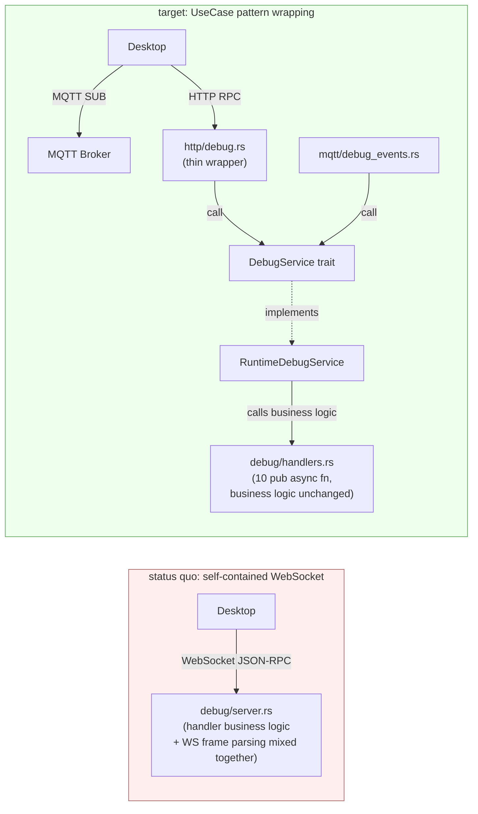

# ADR-048: Migrating the Debug Protocol from WebSocket to MQTT Events + HTTP RPC

> **Chinese source of truth**: [ADR-048](../zh/ADR-048-debug-protocol-mqtt-http.md)
> **Terminology**: see [GLOSSARY.md](./GLOSSARY.md)

**Status**: Proposal
**Date**: 2026-07-15
**Decision Makers**: 大鱼 (Dayu)
**Predecessors**:
- ADR-031 (legacy IPC channel cleanup)
- ADR-033 (MQTT replacing gRPC + WebSocket — the IPC main channel)
- ADR-034 (MQTT / HTTP responsibility boundary)
- ADR-035 (MQTT streaming transport refactor)
- **ADR-040 (Runtime adapter → UseCase service pattern — the late-bind slot)**

---

## Decision Summary

**Migrate the Debug Protocol from JSON-RPC 2.0 over WebSocket to MQTT pub/sub (events) + HTTP REST (RPC). Fully aligned with production IPC.**

The RPC handlers in the existing `core/acowork-runtime/src/debug/server.rs` have **zero business-logic changes** — they are merely lifted out of the internal closures into `debug/handlers.rs` as `pub async fn`, then wrapped via ADR-040's UseCase pattern into a `DebugService` trait. The MQTT events / HTTP routes are thin wrappers that call the service.

> **⚠️ Scope statement (D7 revision)**: the original plan was to migrate all **22 RPCs**; this ADR actually migrates **10** (resume / pause / step / stop / getState / getContextSnapshot / getSection / rewind / patchContext / reExecute). The other 12 (restart / breakpoints ×3 / editMessage / rollback / reloadSkills / switchProvider / recording ×4) **are out of scope this round** — they were never implemented in the old WebSocket server either (the old server likewise had business logic for only 10 handlers, the rest were reserved in the docs), so the "zero business-logic change" commitment still holds. When they are filled in later they go through ADR-053; the transport wiring (Gateway reverse proxy + the Desktop `debug_rpc` generic command) requires **zero changes**.
>
> **D8 progress (after the ADR-063 implementation)**: `POST /api/agents/{id}/debug/prompts/reload` (prompts hot reload) has landed via [ADR-063](../zh/ADR-063-package-level-prompt-override.md) §3.7.6, **going through this ADR's `/api/agents/{id}/debug/{*rest}` wildcard forwarding**, with zero transport-layer changes — validating the "zero transport-layer change" design assumption in D8's header. The other 12 RPCs remain reserved in the docs.



| Dimension | Status quo | Target |
|-----------|-----------|--------|
| Debug business-logic location | internal closures in `debug/server.rs` (1011 lines mixed with WS frame parsing) | standalone `pub async fn` in `debug/handlers.rs` (10 migrated, business logic untouched) |
| Debug internal architecture | handlers call `DebugController` state directly (bypassing ADR-040) | a **`DebugService` trait** (the ADR-040 UseCase pattern) |
| Debug external interfaces | 1 (WebSocket) | 2 (MQTT + HTTP) |
| Debug multi-user support | hardcoded single client | automatically inherits the ACL |
| Protocol-stack consistency | ✗ 3 protocols (HTTP + MQTT + WebSocket) | ✓ 2 protocols (HTTP + MQTT) |
| Volume of business-logic change | — | **0 changes** (pure structural restructuring) |

---

## Background and Motivation

### The existing Debug architecture deviates from ADR-040

ADR-040 has already established a complete UseCase service pattern (10 service traits + implementations + late-bind slots):

```text
external adapter (HTTP/MQTT/CLI)
    ↓ call
UseCase service trait  (e.g. AgentToolsService)
    ↓ implemented by
Runtime*Service struct (holding work_dir / sessions and other internal state)
    ↓ call
internal functions / domain modules
```

**The Debug Protocol is currently the only external interface that bypasses that layer** — `debug/server.rs` is a self-contained module:
- `handle_connection()` directly accepts a WebSocket
- it operates directly on `DebugController` inside closures
- there is no trait abstraction and no UseCase service at all

### The key insight of this ADR: zero business-logic changes

The existing handler functions in `debug/server.rs` (`resume`/`pause`/`step`/`getState`/...) are **correct and tested in their business logic** — the only problem is that they are buried inside WebSocket frame parsing callbacks.

**The correct refactoring is not "rewrite" but "extract"**:
1. Lift the business code of the 10 handlers (resume/pause/step/stop/getState/getContextSnapshot/getSection/rewind/patchContext/reExecute) out of the closures into standalone `pub async fn` (in `debug/handlers.rs`)
2. Wrap with the ADR-040 UseCase pattern: `usecases/debug_service.rs` defines the trait + `usecases/debug_service_impl.rs` implements it (the implementation calls `handlers::*`)
3. The HTTP routes (`http/debug.rs`) and the MQTT events publisher (`mqtt/debug_events.rs`) are both thin wrappers
4. Delete the WebSocket-only part of `debug/server.rs`, retaining `DebugEventSender` (events go through the broadcast event bus → MQTT publisher)

**This way, moving the Debug Protocol to MQTT+HTTP is almost equivalent to "structural adjustment", with zero business-logic regression risk.**

---

## Detailed Design

### 1. Protocol Mapping (the external contract)

| JSON-RPC method | Channel | Topic / HTTP endpoint | Status |
|--------------|------|----------------|------|
| `onStep` (event) | **MQTT** | `acowork/agents/{agent_id}/debug/events/onStep` | ✅ |
| `onBreakpoint` (event) | **MQTT** | `acowork/agents/{agent_id}/debug/events/onBreakpoint` | ⏳ |
| `onRecordStep` (event) | **MQTT** | `acowork/agents/{agent_id}/debug/events/onRecordStep` | ⏳ |
| `onStateChange` (event) | **MQTT** | `acowork/agents/{agent_id}/debug/events/onStateChange` | ✅ |
| `onContextBuilt` (event) | **MQTT** | `acowork/agents/{agent_id}/debug/events/onContextBuilt` | ✅ |
| `debugger.resume` (RPC) | **HTTP** | `POST /api/debug/resume` | ✅ |
| `debugger.pause` | **HTTP** | `POST /api/debug/pause` | ✅ |
| `debugger.step` | **HTTP** | `POST /api/debug/step` | ✅ |
| `debugger.stop` | **HTTP** | `POST /api/debug/stop` | ✅ |
| `debugger.restart` | **HTTP** | `POST /api/debug/restart` | ⏳ (Desktop uses `restartAgentInDebug`, a process-level restart) |
| `debugger.getState` | **HTTP** | `GET /api/debug/state` | ✅ |
| `debugger.setBreakpoint` | **HTTP** | `POST /api/debug/breakpoints` | ⏳ |
| `debugger.removeBreakpoint` | **HTTP** | `DELETE /api/debug/breakpoints/{bp_id}` | ⏳ |
| `debugger.listBreakpoints` | **HTTP** | `GET /api/debug/breakpoints` | ⏳ |
| `debugger.getContextSnapshot` | **HTTP** | `GET /api/debug/context/{iteration}` | ✅ |
| `debugger.getSection` | **HTTP** | `GET /api/debug/context/{iteration}/sections/{name}` | ✅ |
| `debugger.rewind` | **HTTP** | `POST /api/debug/context/rewind` | ✅ |
| `debugger.patchContext` | **HTTP** | `POST /api/debug/context/patch` | ✅ |
| `debugger.reExecute` | **HTTP** | `POST /api/debug/context/re-execute` | ✅ |
| `debugger.editMessage` | **HTTP** | `PATCH /api/debug/messages/{index}` | ⏳ |
| `debugger.rollback` | **HTTP** | `POST /api/debug/messages/rollback` | ⏳ |
| `debugger.reloadSkills` | **HTTP** | `POST /api/debug/skills/reload` | ⏳ |
| `debugger.switchProvider` | **HTTP** | `POST /api/debug/provider/switch` | ⏳ |
| `debugger.startRecording` | **HTTP** | `POST /api/debug/recording/start` | ⏳ |
| `debugger.stopRecording` | **HTTP** | `POST /api/debug/recording/stop` | ⏳ |
| `debugger.loadRecording` | **HTTP** | `POST /api/debug/recording/load` | ⏳ |
| `debugger.stopReplay` | **HTTP** | `POST /api/debug/recording/replay/stop` | ⏳ |

> **✅ = already migrated by D1-D4**; **⏳ = out of scope this round** (never implemented in the old WebSocket server either, reserved in docs only; see the "scope statement" above).

### 2. MQTT Event Topic Design

```
acowork/agents/{agent_id}/debug/events/{event_type}
```

| Sub-topic | payload protobuf | Data size | QoS |
|--------|----------------|--------|-----|
| `onStep` | `DebugStepEvent { session_id, iteration, phase, input?, output?, prompt_tokens, completion_tokens, total_tokens }` | ~200B-2KB | 0 |
| `onBreakpoint` | `DebugBreakpointEvent { session_id, breakpoint_id, iteration, phase }` | ~50B | 0 |
| `onRecordStep` | `DebugRecordStepEvent { session_id, step_index, phase, step_data? }` | ~100B-1KB | 0 |
| `onStateChange` | `DebugStateChangeEvent { session_id, new_state, iteration }` (`new_state` is the DebugState name `Running/Paused/Stepping/Stopped` or a DebugPhase name; Runtime uniformly maps `ExecutionStateChanged` and the legacy `StateChanged` events onto this topic) | ~30B | 0 |
| `onContextBuilt` | `DebugContextBuiltEvent { session_id, iteration, sections{...}, total_token_estimate }` | <500B | 0 |

**Aligned with the design principles in `docs/protocols/zh/mqtt.md` §3.5**:
- ① **Classify by data source**: the topic expresses "the debug event stream of agent {id}", not "what action to perform"
- ② **Single owner**: Runtime is the sole publisher of events; Desktop only subscribes
- ③ **Retained = false**: events are a stream; after a subscriber reconnects it starts from the next event
- ④ **QoS 0**: DevMode is a development tool; losing 1~2 events is acceptable

### 3. HTTP RPC Design

**New routes on the Runtime's localhost HTTP server**: mounted under the existing `core/acowork-runtime/src/http/server.rs`, with the path prefix `/api/debug/*`

**Gateway HTTP reverse proxy**: a new `/api/debug/*` proxy rule in `http/proxy.rs`, reusing the existing Runtime HTTP registry

**Error code mapping** (DebugError → HTTP status / JSON-RPC code):

| Scenario | HTTP status | JSON-RPC error code |
|------|------------|-------------------|
| Success | 200 | — |
| Session not found (`session_id` does not exist in DevMode) | 404 | -32000 |
| Invalid parameters (missing/invalid body field) | 400 | -32602 |
| Snapshot / section not found | 404 | -32002 |
| Controller state does not allow the operation (e.g. `step` when not paused) | 409 | -32003 |
| Unspecified internal failure | 422 | -32603 |
| Runtime is not running DevMode (slot still empty) | 503 | -32000 |
| Runtime is down | 502 | (Gateway proxy error) |

**Response body format**:
```json
// success
{ "ok": true, "data": { ... } }
// failure
{ "ok": false, "error": { "code": -32601, "message": "Method not found" } }
```

### 4. Internal Architecture: Lossless Migration via the UseCase Pattern (the ADR-040 pattern)

This is the core of this ADR. Below is "how to complete the migration without rewriting existing code".

#### 4.1 File-Level Structural Adjustment (7 files)

| Type | File | Role |
|------|------|------|
| **Business logic** (retained) | `core/acowork-runtime/src/debug/handlers.rs` (**new**) | 10 `pub async fn handler_*(...)`: the business code from the existing closures is extracted verbatim here (the other 12 endpoints were never implemented in the old server, see the scope statement at the top) |
| **Business logic** (retained) | `core/acowork-runtime/src/debug/controller.rs` | the existing `DebugController` state machine, untouched |
| **Business logic** (retained) | `core/acowork-runtime/src/debug/protocol.rs` | the existing JSON-RPC types, **retaining only the DTO parts** and deleting the WS-frame-related helpers |
| **Event channel** (retained + adapted) | `core/acowork-runtime/src/debug/events.rs` (**new**, replacing the `DebugEventSender` in the original `mod.rs`) | broadcast event bus: `DebugEventBus` + a per-session `DebugEventSender`; the receiving end switches from WebSocket to the MQTT publisher (from D3) |
| **UseCase trait** (new) | `core/acowork-runtime/src/usecases/debug_service.rs` | defines the `DebugService` trait + 10 async methods + DTOs |
| **UseCase implementation** (new) | `core/acowork-runtime/src/usecases/debug_service_impl.rs` | the `RuntimeDebugService` implements the trait, each method internally calling `handlers::*` |
| **External interface** (new) | `core/acowork-runtime/src/http/debug.rs` | 10 axum HTTP routes, each handler a thin wrapper (`state.debug_service.lock().await...method().await`) |
| **External interface** (new) | `core/acowork-runtime/src/mqtt/debug_events.rs` | `DebugEventMqttPublisher`: consumes the `event_rx` broadcast → PUBLISHes to the MQTT broker |
| **Startup** (modified) | `core/acowork-runtime/src/startup/subsystems.rs`'s `enable_debug_mode` | no longer listens on TCP; registers HTTP routes + starts the events publisher |
| **late-bind slot** (new) | `HttpState` + `AgentBootContext` + `startup/subsystems.rs` Phase C | following ADR-040: the Phase A slot is `None`, Phase C (after `enable_debug_mode`) fills in `RuntimeDebugService::new(sessions)` |
| **Deletion** (WS part only) | `core/acowork-runtime/src/debug/server.rs` | **the entire ~1011-line file is deleted**, retaining only the `DebugEventSender` part (moved to `debug/events.rs`); `accept_async` / `WebSocket` / `TcpListener` all disappear |

#### 4.2 trait Definition Skeleton

> **Implementation note (D7)**: the diagram below is the complete blueprint (22 methods); **the current implementation lands only the first 10** (resume/pause/step/stop/get_state/get_context_snapshot/get_section/rewind/patch_context/re_execute). Unimplemented methods stay in the "reserved in docs" state and follow ADR-053 when filled in, with no change to the transport wiring. ADR-063 §3.7.6 has already used this wildcard to land `reload_prompts`, the first real-world user of the wildcard design.

```rust
// core/acowork-runtime/src/usecases/debug_service.rs

#[async_trait]
pub trait DebugService: Send + Sync {
    // ── execution control (5) ─────────────────────────────
    async fn resume(&self, session_id: &str) -> Result<ResumeResponse, DebugError>;
    async fn pause(&self, session_id: &str) -> Result<(), DebugError>;
    async fn step(&self, session_id: &str, granularity: StepGranularity) -> Result<(), DebugError>;
    async fn stop(&self, session_id: &str) -> Result<(), DebugError>;
    async fn restart(&self, session_id: &str) -> Result<(), DebugError>;

    // ── state queries (4) ─────────────────────────────
    async fn get_state(&self, session_id: &str) -> Result<DebugStateResponse, DebugError>;
    async fn list_breakpoints(&self, session_id: &str) -> Result<Vec<BreakpointInfo>, DebugError>;
    async fn get_context_snapshot(&self, session_id: &str, iteration: u32)
        -> Result<ContextSnapshot, DebugError>;
    async fn get_section(&self, session_id: &str, iteration: u32, section: &str)
        -> Result<SectionContent, DebugError>;

    // ── breakpoint management (2) ─────────────────────────
    async fn set_breakpoint(&self, session_id: &str, condition: BreakpointCondition)
        -> Result<String, DebugError>;  // returns breakpoint_id
    async fn remove_breakpoint(&self, session_id: &str, bp_id: &str) -> Result<(), DebugError>;

    // ── context editing (3) ───────────────────────────
    async fn rewind(&self, session_id: &str, to_iteration: u32)
        -> Result<RewindResponse, DebugError>;
    async fn patch_context(&self, session_id: &str, patches: ContextPatches)
        -> Result<(), DebugError>;
    async fn re_execute(&self, session_id: &str) -> Result<ReExecuteResponse, DebugError>;

    // ── message editing (2) ─────────────────────────────
    async fn edit_message(&self, session_id: &str, index: usize, content: MessageContent)
        -> Result<(), DebugError>;
    async fn rollback(&self, session_id: &str, target_index: usize) -> Result<(), DebugError>;

    // ── runtime changes (2) ───────────────────────────
    async fn reload_skills(&self, session_id: &str, skill_name: Option<String>)
        -> Result<(), DebugError>;
    async fn switch_provider(&self, session_id: &str, switch: ProviderSwitch)
        -> Result<(), DebugError>;

    // ── recording and replay (4) ─────────────────────────────
    async fn start_recording(&self, session_id: &str, output_path: Option<String>)
        -> Result<(), DebugError>;
    async fn stop_recording(&self, session_id: &str, output_path: Option<String>)
        -> Result<(), DebugError>;
    async fn load_recording(&self, session_id: &str, path: &str, mode: ReplayMode)
        -> Result<(), DebugError>;
    async fn stop_replay(&self, session_id: &str) -> Result<(), DebugError>;
}
```

**The whole trait describes business methods only and involves no transport detail whatsoever.**

#### 4.3 How handlers.rs Meets the Implementation

```rust
// core/acowork-runtime/src/debug/handlers.rs (new)
// Lift the 10 handler functions from the closures in the existing debug/server.rs "verbatim"

// Business logic lifted verbatim from debug/server.rs.
pub async fn handle_resume(
    ctrl: &mut DebugController,
    notify: &Arc<Notify>,
) -> Result<ResumeResponse, DebugError> {
    // ... fully reuses the existing code ...
}

// Get full state. Business logic lifted verbatim from debug/server.rs.
pub async fn handle_get_state(
    ctrl: &mut DebugController,
) -> Result<DebugStateResponse, DebugError> {
    // ... fully reuses the existing code ...
}

// ... the rest, 20 more ...
```

```rust
// core/acowork-runtime/src/usecases/debug_service_impl.rs (new)

pub struct RuntimeDebugService {
    sessions: Arc<tokio::sync::RwLock<HashMap<String, Arc<Mutex<DebugController>>>>>,
}

#[async_trait]
impl DebugService for RuntimeDebugService {
    async fn resume(&self, session_id: &str) -> Result<ResumeResponse, DebugError> {
        let ctrl = self.get_controller(session_id).await?;
        let mut ctrl = ctrl.lock().await;
        debug_handlers::handle_resume(&mut ctrl, &ctrl.notify.resume).await
        // ↑ 0 business-logic changes, only calls the handlers function
    }

    async fn get_state(&self, session_id: &str) -> Result<DebugStateResponse, DebugError> {
        let ctrl = self.get_controller(session_id).await?;
        let mut ctrl = ctrl.lock().await;
        debug_handlers::handle_get_state(&mut ctrl).await
    }

    // ... the other 20, all following the same "get ctrl → call handler" pattern
}
```

#### 4.4 HTTP Routes — Thin Wrappers

```rust
// core/acowork-runtime/src/http/debug.rs (new)

pub fn debug_routes() -> Router<HttpState> {
    Router::new()
        .route("/api/debug/resume",     post(resume))
        .route("/api/debug/pause",      post(pause))
        // ... 10 routes in total (see the actual route table in http/debug.rs)
}

async fn resume(
    State(state): State<HttpState>,
    Json(req): Json<ResumeRequest>,
) -> Result<Json<DebugHttpResponse<ResumeResponse>>, DebugHttpError> {
    let svc = state.debug_service.lock().await
        .as_ref()
        .ok_or_else(|| DebugHttpError::unavailable("DevMode not enabled"))?;
    svc.resume(&req.session_id).await
        .map(DebugHttpResponse::ok)
        .map_err(DebugHttpError::from)
}
// ... 9 completely identical thin wrappers
```

#### 4.5 MQTT Events — a Decoupled Event Bus (implementation note: broadcast rather than mpsc)

**Key design**: the `DebugEventSender` send end is held by AgentLoop and stays completely untouched; only the receiving end changes from WebSocket to the MQTT publisher.

> **⚠️ Implementation deviation note (D3/D7)**: the ADR draft envisioned `mpsc::UnboundedReceiver` (a single consumer); the implementation uses `tokio::sync::broadcast` (`debug/events.rs`). Rationale: the event bus is **broadcast semantics**, and there may be multiple consumers in the future (e.g. an in-process recorder recording `onRecordStep`); broadcast natively supports multiple subscribers each with independent lag tracking, and a slow consumer (the MQTT publisher) does not block AgentLoop. `DebugEventSender` still tags by session (`TaggedEvent`), but the underlying primitive changed from mpsc to a broadcast Sender. From D3 onward `DebugEventMqttPublisher` obtains a `broadcast::Receiver` via `DebugEventBus::subscribe()`.

```rust
// core/acowork-runtime/src/debug/events.rs (new, replacing DebugEventSender in the original server.rs)

pub struct DebugEventBus {
    tx: broadcast::Sender<TaggedEvent>,
}

pub struct DebugEventSender {
    tx: broadcast::Sender<TaggedEvent>,  // one per session, tags automatically on send
    session_id: String,
}

impl DebugEventSender {
    pub fn send(&self, event: DebugEvent) -> bool {
        self.tx.send(TaggedEvent { session_id: self.session_id.clone(), event }).is_ok()
    }
}
```

Startup (`startup/subsystems.rs` Phase C):
```rust
if config.dev_mode {
    let event_bus = crate::debug::DebugEventBus::new();
    // 1. event_bus.sender_template().for_session(sid) for each new session (SessionManager)
    // 2. event_bus.subscribe() for DebugEventMqttPublisher
    let publisher = DebugEventMqttPublisher::new(agent_id, mqtt_client, event_bus.subscribe());
    tokio::spawn(publisher.run());
}
```

**Events are not part of the UseCase service** — they are a fire-and-forget push channel; putting them in the service would make the service aware of transport (the MQTT publisher needs protobuf serialization, topic concatenation, etc.), violating the decoupling principle.

#### 4.6 late-bind Slot (the ADR-040 Pattern)

```rust
// HttpState field (http/server.rs)
pub struct HttpState {
    // ... existing fields
    pub debug_service: Arc<tokio::sync::Mutex<Option<Arc<dyn DebugService>>>>,
}

// an extra parameter at the end of start()
pub async fn start(
    bind_addr: SocketAddr,
    work_dir: PathBuf,
    /* ... existing parameters ... */
    debug_service_slot: Arc<tokio::sync::Mutex<Option<Arc<dyn DebugService>>>>,
) -> Self { /* ... */ }

// Phase A: AgentBootContext creates the empty slot (startup/agent_init.rs)
// Phase C: filled in subsystems.rs after enable_debug_mode()
let service = Arc::new(RuntimeDebugService::new(sessions.clone())) as Arc<dyn DebugService>;
*ctx.debug_service_slot.lock().await = Some(service);
```

> **⚠️ Implementation deviation note (D2)**: the ADR draft said "Phase B: filled in `session_init.rs`"; the implementation actually fills it in **Phase C (`startup/subsystems.rs`)** — because `RuntimeDebugService` depends on `SessionManager::enable_debug_mode()` having first created the per-session controllers + event senders, and that happens in Phase C. This stays consistent with the fill timing of ADR-040's other slots (workspace_mutation / memory_query).

Fully aligned with the `workspace_mutation` / `memory_query` pattern in ADR-040.

### 5. Relationship to Existing ADRs

| ADR | Relationship to this ADR |
|-----|------------|
| ADR-031 | converged the legacy IPC onto gRPC; this ADR further converges the Debug Protocol onto MQTT + HTTP |
| ADR-033 | converged production IPC from gRPC + WebSocket onto MQTT + HTTP |
| **ADR-040** | **established the UseCase service + late-bind slot pattern; this ADR brings the Debug Protocol into that pattern** |
| ADR-034 | defines the MQTT/HTTP responsibility boundary (events vs req/res); this ADR follows it completely |
| ADR-035 | MQTT streaming transport refactor (data pushed directly) |

This ADR is **an extension of ADR-033 (external protocol) + an extension of ADR-040 (internal architecture)**.

---

## Blast Radius

### A. Additions (precise to file + line-count estimates)

| File | Estimate | Description |
|------|------|------|
| `core/acowork-runtime/src/debug/handlers.rs` | **+450** | 10 `pub async fn` business-logic functions extracted from server.rs (almost entirely copy-paste, 0 changes) |
| `core/acowork-runtime/src/usecases/debug_service.rs` | **+180** | the `DebugService` trait + DTOs + `DebugError` |
| `core/acowork-runtime/src/usecases/debug_service_impl.rs` | **+220** | the `RuntimeDebugService` implementation, ~10 lines per method |
| `core/acowork-runtime/src/usecases/mod.rs` | **+3** | registers the `debug_service` and `debug_service_impl` modules + re-exports |
| `core/acowork-runtime/src/http/debug.rs` | **+200** | 10 axum routes + thin wrappers |
| `core/acowork-runtime/src/mqtt/debug_events.rs` | **+150** | `DebugEventMqttPublisher::run` |
| `core/acowork-core/proto/mqtt_payload.proto` | **+50** | 5 `Debug*Event` messages |
| `core/acowork-runtime/src/startup/subsystems.rs` | **+20 / -30** | `enable_debug_mode` becomes "register routes + spawn publisher + fill slot" |
| `core/acowork-runtime/src/http/server.rs` | **+30** | the `HttpState.debug_service` field + the `start()` slot parameter + `merge("/api/debug", debug::debug_routes())` |
| `core/acowork-runtime/src/startup/context.rs` | **+8** | the `AgentBootContext.debug_service_slot` field |
| `core/acowork-runtime/src/startup/agent_init.rs` | **+15** | Phase A: creates the empty slot |
| `core/acowork-gateway/src/http/proxy.rs` | **+5** | the `/api/debug/*` proxy rule |
| `apps/acowork-desktop/src-tauri/src/commands/debug.rs` (rewritten) | **+200 / -250** | from a WebSocket client to HTTP + MQTT |
| **Subtotal** | **+1556 / -280** | **net +~1276 lines** (including trait/DTO/route boilerplate) |

### B. Deletions

| File | Lines | Description |
|------|-------|------|
| `core/acowork-runtime/src/debug/server.rs` | **-1011** | the entire WebSocket server file is deleted (accept_async, TcpListener, WS frame parsing); only the `DebugEventSender` part (~30 lines) moves to `debug/events.rs` or stays as a thin shell |
| `apps/acowork-desktop/src/stores/debugStore.ts` | -200 | the WebSocket client logic is deleted |
| `apps/acowork-desktop/src/components/results/ResultsPanel.tsx` (the Debug part) | -50 | the Debug WebSocket connection is deleted |
| **Subtotal** | **-1261** | |

**Overall net line count**: +295 (pure additions) / -1541 (pure deletions) = **a net reduction of about 1246 lines** (including trait/DTO/proto definitions and route boilerplate)

Although the added line count exceeds the old approach (because of the extra trait/DTO boilerplate), there are **0 business-logic changes** — all the original `debug/server.rs` handler code is merely moved from closures into standalone functions, preserved verbatim.

### C. Dependency Cleanup

**Rust dependencies (4 deletions)**:

| File | Deletion | Dependency | Notes |
|------|-----|------|------|
| `core/Cargo.toml` | L117 | `tokio-tungstenite = "0.29"` | a workspace dependency; after Runtime/Gateway stop using it, nothing references it |
| `core/acowork-runtime/Cargo.toml` | L77-78 | `tokio-tungstenite.workspace = true` | used only by the debug server |
| `core/acowork-runtime/Cargo.toml` | L100-101 | `tokio-tungstenite.workspace = true` | a dev-dependency, **zero code references** (an orphan dependency) |
| `core/acowork-gateway/Cargo.toml` | L78 | `tokio-tungstenite.workspace = true` | a dev-dependency, **zero code references** (deleted, see D0) |

**Retained dependencies**:
- `core/Cargo.toml` L88 `axum = { ..., features = ["ws", ...] }` — the `ws` feature is retained (LSP Relay still uses `WebSocketUpgrade`)

**Correction**: the workspace-level `tokio-tungstenite = "0.29"` was **not** deleted after all, because `acowork-lsp-relay` still uses it (see the D7 note in the implementation plan).

- `docs/design/zh/14-desktop-app.md` §7.1 lists an outdated `tokio-tungstenite = "0.26"`, but the Desktop's actual Cargo.toml **no longer contains this dependency** — only the document needs fixing

### D. Comment/Documentation Sync (identical to the old ADR-048 draft, omitted to avoid repetition)

See ADR-040's existing list of ~25 Rust comment syncs + 6 Markdown document syncs (not repeated here; key files: `docs/design/zh/10-debug-protocol.md` §1§2§3§9, `docs/design/zh/06-communication.md` §0 table, `docs/design/zh/14-desktop-app.md` §2.2§7.1, `docs/adr/zh/ADR-031` L384, the AGENTS.md protocol-division row).

---

## Risks and Mitigations

| Risk | Severity | Mitigation |
|------|--------|------|
| **Details lost when extracting the existing handler business logic** | Medium | extraction is "cut & paste" and the call semantics are unchanged; all 10 migrated handlers are directly verified by `cargo test` (handlers ×18 — each handler covers at least the normal path plus a key branch such as rewind's Stopped→Paused and step's Ignored) + transport-layer verification (events ×3 + mqtt encode ×3 + gateway proxy ×3); the 12 unmigrated endpoints in the old WebSocket test matrix were not in the old server in the first place |
| **Runtime localhost HTTP conflicting with the debug router port** | Low | the debug routes are mounted under the `/api/debug/*` path prefix, with no conflict with chat routes; the Runtime's existing localhost HTTP server is reused |
| **Desktop MQTT subscribing to both the chat and debug event families raises event callback complexity** | Low | `on_message` dispatches by topic prefix (`agents/{id}/debug/events/#` vs `agents/{id}/sessions/{sid}/messages/#`), which is clear |
| **`getState` returning the full messages list may reach tens of KB** | Low | it reuses Gateway's existing reverse-proxy path (already designed for payloads of similar size) |
| **Events lost during a stream disconnect/reconnect (QoS 0)** | Medium | DevMode is a development tool; losing 1~2 `onStep` events on a disconnect is acceptable; QoS 1 can be switched to later if strict no-loss is required |
| **late-bind slot timing**: requests between Phase A registering the routes (service = None) and Phase C filling it in (service = Some) will fail | Low | the same solution as ADR-040's workspace_mutation: the HTTP handler does `service.lock().await.as_ref().ok_or(503)`, so all debug requests return 503 before Phase C |
| **The `session_id` path parameter in the 10 handlers** | Low | the existing handlers already take `session_id` from `JsonRpcRequest.params` internally; after migrating to HTTP routes, `agent_id` + `session_id` are passed explicitly in the path or body, and the handler uniformly fetches the controller from `self.sessions[session_id]` |

**Additional benefit over the original approach**: because the RPCs now go through the UseCase service, **multi-user isolation holds naturally on the HTTP/MQTT path** (`localhost-only` gateway + ACL), with no extra authentication layer required.

---

## Migration Strategy

**The project is still in development with no compatibility constraints at all** — the Debug Protocol's only consumer is the Desktop App's DevMode debugging panel, **which only runs locally on a developer's machine**, so there is no cross-version compatibility, protocol handshake or dual-channel coexistence requirement.

**Adopt a one-time switch (no transition period)**:
- **Small blast radius**: the Debug Protocol is not on the production path
- **Zero business-logic changes**: via the UseCase wrapping pattern, the additions are structural adjustments rather than a rewrite
- **No client needs compatibility**: the Desktop side ships in lockstep from the same team in this repository

**The D0 preparatory commit need not wait for this ADR's approval**: deleting Gateway's orphan `tokio-tungstenite` dependency is pure gain with zero impact.

---

## Implementation Plan (7 commits, each independently buildable)

| Commit | Scope | Main content | Estimate |
|--------|------|---------|------|
| **D0** ✅ | Gateway `Cargo.toml` | delete the orphan dependency `tokio-tungstenite` (dev-dep) | -1 line |
| **D1** ✅ | Runtime: handler extraction + UseCase trait | `debug/handlers.rs` (10 `pub async fn` extracted from server.rs, business logic untouched) + `usecases/debug_service.rs` (trait definition) + `usecases/debug_service_impl.rs` (implementation calling the handlers) + `usecases/mod.rs` registration | +850 lines, **the WebSocket server keeps running** |
| **D2** ✅ | Runtime: HTTP routes + late-bind slot | `http/debug.rs` (10 axum routes + thin wrappers) + adding the `debug_service` slot to `http/server.rs` + `merge("/api/debug", ...)` + the `startup/{context,agent_init,subsystems}.rs` trio of slot wiring (the slot is filled in Phase C) | +300 lines, **the WebSocket server keeps running** |
| **D3** ✅ | Runtime: MQTT events publisher + startup switch | `mqtt/debug_events.rs` (`DebugEventMqttPublisher`) + 5 proto messages + `subsystems.rs`'s `enable_debug_mode` becoming "register routes + spawn publisher", **deleting the TCP listener startup** | +250 lines, **the WebSocket server is deleted** |
| **D4** ✅ | Runtime: delete the WebSocket part of server.rs + Cargo.toml | the entire WebSocket file `debug/server.rs` is deleted (retaining the `DebugEventSender` part, moved to `debug/events.rs`) + 2 deletions of `tokio-tungstenite` in Runtime's `Cargo.toml` | -1011 / -1 lines |
| **D5** ✅ | Gateway: HTTP reverse-proxy rule | adding the `/api/debug/*` proxy rule to `http/proxy.rs` | +5 lines |
| **D6** ✅ | Desktop: DebugClient rewrite | rewriting `commands/debug.rs` to HTTP + MQTT + deleting the WebSocket logic in `debugStore.ts` + deleting the Debug part of `ResultsPanel.tsx` + syncing stale comments | measured +91 / -216 lines (net **-125 lines**), including clearing 264 lines of dead `<DebugPanel/>` component code |
| **D7** ✅ | documentation + comment sync | major revisions to `10-debug-protocol.md` §1§2§3§9 + the `06-communication.md` §0 table + `14-desktop-app.md` §2.2§7.1 + the `03-agent-runtime.md` CLI flag + module structure + `module-design/02-runtime.md` debug/ structure + `ADR-031` L384 + the AGENTS.md protocol-division row + ~11 Rust comments (`acowork-runtime/src/{cli,startup/subsystems,agent/session/session_manager,usecases/debug_service_impl}.rs` + `acowork-gateway/src/{lifecycle/process,http/agents,gateway/state}.rs` + `acowork-core/src/protocol.rs`) | ~150 lines of docs / ~30 lines of Rust comments; the workspace `tokio-tungstenite = "0.29"` was **not deleted** (`acowork-lsp-relay` still uses it, see the §C correction) |
| **D8** ⏳ | **(optional, ADR-053)** fill in the remaining 12 RPCs | breakpoints ×3 / editMessage / rollback / reloadSkills / switchProvider / recording ×4 / restart — all added through the existing transport wiring (the Gateway proxy + the Desktop `debug_rpc` generic command), with 0 transport-layer changes | +200~300 lines |
| **D8a** ✅ | ADR-063 §3.7.6 lands `reload_prompts` (the first user of this wildcard forwarding) | `POST /api/agents/{id}/debug/prompts/reload` → Gateway `/debug/{*rest}` proxy → Runtime `DebugService::reload_prompts`; 0 transport-layer changes (details in ADR-063 §3.7.6) | +50 lines (Runtime handler + DebugService method + subsystems.rs Phase C call) |

**Key milestones**:
- After D1: all existing tests should pass (the handlers are extracted from server.rs so behaviour is unchanged; the new trait + impl are not yet called by any route)
- After D2: the HTTP path becomes available for the first time, but WebSocket is still running (both coexist)
- After D3: the MQTT events path becomes available for the first time; the WS server is deleted within the same D3 commit
- After D4: the Rust-side migration is complete
- After D6: the Desktop migration is complete
- After D7: documentation and dependency cleanup wrap up

Each commit is independently mergeable and rollbackable — D3 and D4 complete the WebSocket deletion within one atomic operation, ensuring no "half-finished branch" state is left behind.

---

## Key Decision Points Awaiting Your Confirmation

1. **Whether to accept the "zero business-logic changes to the existing handlers, migrate via UseCase wrapping" migration pattern** (the core choice)
2. **Whether D0 should be merged immediately** (already verified with `cargo check`, pure gain)
3. **Whether D1 proceeds as 7 commits** (each independently buildable, reviewable in batches)

---

## Appendix: References

- ADR-031: [Drop legacy IPC, consolidate on gRPC](./ADR-031-drop-legacy-ipc-consolidate-on-grpc.md)
- ADR-033: [MQTT replaces gRPC + WebSocket](./ADR-033-mqtt-replace-grpc-websocket.md)
- ADR-034: [MQTT / HTTP responsibility boundary](./ADR-034-mqtt-http-boundary.md)
- ADR-035: [Streaming transport refactor](./ADR-035-mqtt-streaming-push-refactor.md)
- **ADR-040: [Runtime adapter → UseCase service pattern](./ADR-040-runtime-adapter-use-case-layer.md)** — this ADR follows its trait + late-bind slot + Phase A/B wiring pattern
- Protocol reference: [docs/protocols/zh/mqtt.md](../../protocols/zh/mqtt.md)
- Debug Protocol design: [docs/design/zh/10-debug-protocol.md](../../design/zh/10-debug-protocol.md)
