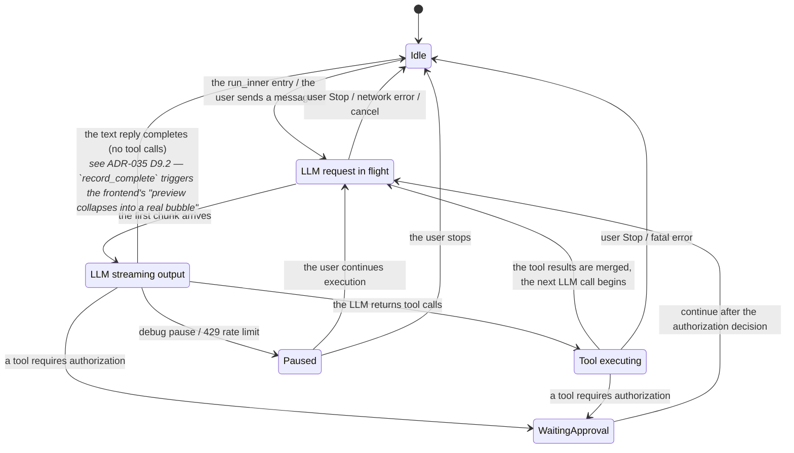
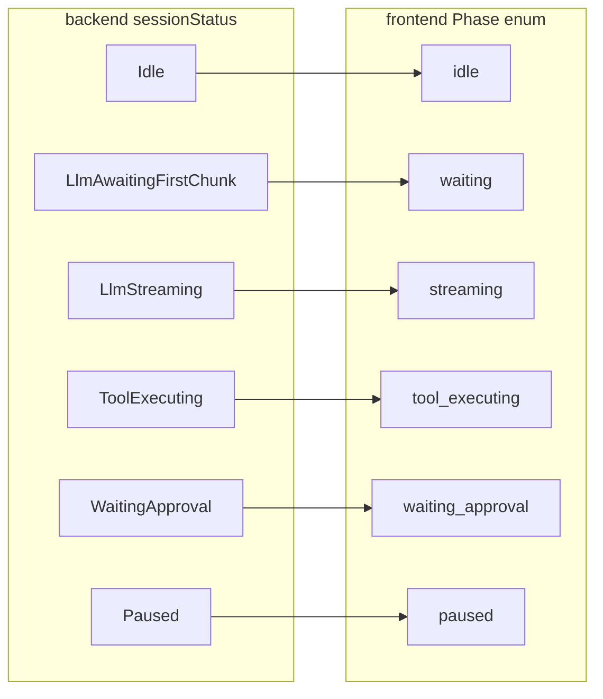

# ADR-049: Session Status Refinement — from the Coarse-Grained `Streaming` to a 6-Variant Business State Machine

> **Chinese source of truth**: [ADR-049](../zh/ADR-049-session-status-substates.md)
> **Terminology**: see [GLOSSARY.md](./GLOSSARY.md)

**Status**: Proposed
**Date**: 2026-07-15
**Decision Makers**: 大鱼

**Prerequisites**:
- ADR-014 (the session status is owned by the Runtime, the frontend is read-only — the `SessionStateChanged` event)
- ADR-021 (unified session data loading — HTTP pull + notification mechanism)
- ADR-035 (MQTT streaming refactor — `activeStream` buffer + `stream_delta` push), especially D9.2 "the `StreamingSourceBlock` `<pre>` DOM reuse pattern"
- ADR-043 (session config and runtime state split — the `SessionState` protocol structure)
- **ADR-050 §3.3 (the liveBuffer design) + §16 (the post-C5 revision record)** — streaming data belongs to `chatAdapterStore`; `messages[]` is the single container for confirmed messages. All "streaming fields" in this ADR live in `chatAdapterStore` rather than `chatStore`; the trailing virtual item is deprecated in favour of routing through an `isLive: true` block in `adapter.blocks`.

**Scope of impact**:
- `core/acowork-runtime/src/agent/session_state.rs` — the `SessionStatus` enum definition
- 6 loop modules under `core/acowork-runtime/src/agent/` — the state transition points
- `core/acowork-runtime/src/providers/reliable.rs` — the resume state after a 429 retry
- `core/acowork-core/src/protocol.rs` — the `SessionStatusDto` struct
- `apps/acowork-desktop/src/lib/types.ts` — the frontend `SessionStatus` type + `StreamLine`/`ActiveStream`; `isProcessing()` replaces `isSessionActive()`
- `apps/acowork-desktop/src/stores/chatStore.ts` — the `record_complete` main path writes to `messages[]`; `sendMessage` optimistically writes to `messages[]`; no longer holds streaming fields such as `assistantStreamingContent` (see ADR-050 C2 + §16)
- `apps/acowork-desktop/src/components/chat/chatAdapterStore.ts` — **new in v1.1**: the liveBuffer (only the two fields `thinkingStream` / `assistantStream`) + legacy projection fields (`isThinking` / `thinkingContent` / `assistantStreamingContent` / `assistantStreamingStartTime` / `isAssistantReplying` / `isPinnedToBottom` / `optimisticEntries`) + module-level `activeStreams` / `lastThinkingFlush` / `lastAssistantFlush` throttle Maps
- `apps/acowork-desktop/src/components/chat/chatListAdapter.ts` — **new in v1.1**: the `isAtTail()` decision (`limit === 0` counts as atTail); `buildSnapshot` takes only `thinkingStream` / `assistantStream`
- `apps/acowork-desktop/src/lib/paginationUtils.ts` — **new in v1.1**: the shared `isAtTail(offset, limit, total)` helper
- `apps/acowork-desktop/src/components/chat/ChatPanel.tsx` — the indicator rendering logic; subscribes to `chatAdapterStore` via `useLiveStream()`
- `apps/acowork-desktop/src/components/chat/SessionPanel.tsx` — the Tab bar status (`isStreaming` → `isProcessing()`)
- `apps/acowork-desktop/src/components/chat/StreamingSourceBlock.tsx` — the generic streaming preview component (variant=thought|assistant)
- `apps/acowork-desktop/src/components/chat/ThinkBlock.tsx` — simplified to a thin wrapper around StreamingSourceBlock
- `apps/acowork-desktop/src/components/chat/VirtualMessageList.tsx` — **v1.1 revision**: the assistant streaming preview is routed through an `isLive && type === "assistant"` block to StreamingSourceBlock; the trailing virtual item is deprecated
- `apps/acowork-desktop/src/components/chat/ExploreBlock.tsx` — **v1.1 revision**: gains an `isLive` prop, avoiding a duplicate render with an already-collapsed live thought
- `apps/acowork-desktop/src/components/chat/blockLayout.ts` — the `REPLYING_INDICATOR_HEIGHT` height estimate (may be deleted once the trailing slot is deprecated, see §Out of Scope)

---

## Revision Record

### v1.1 (2025-01-16) — aligned with ADR-050 post-C5

**Background**: ADR-050 C1-C5 + post-C5 (commit `dcc182b2`) have all landed, restructuring the ownership of streaming data:
- The streaming fields moved from `chatStore` to `chatAdapterStore`
- `messages[]` became the single container for confirmed messages (HTTP history + MQTT `record_complete` written directly)
- The `liveBuffer` shrank from 4 fields to 2 (`thinkingStream` + `assistantStream`)
- The trailing virtual item is deprecated; the assistant streaming preview is now routed through an `isLive: true` block in `adapter.blocks`

**Revision points** (see `docs/_internal/archive/review/zh/29-adr-049-vs-adr-050-post-c5-alignment.md` for details):

1. §Prerequisites: added the ADR-050 §3.3 + §16 cross references
2. §Scope of impact: added `chatAdapterStore.ts` / `chatListAdapter.ts` / `paginationUtils.ts`; `VirtualMessageList.tsx` / `ExploreBlock.tsx` annotated with the post-C5 routing change
3. §New frontend type definitions: added `isProcessing()` replacing `isSessionActive()`
4. §Frontend assistant live preview: removed the trailing slot description; the data flow diagram switched to `isLive` block routing
5. §Tab bar status: listed the 4 `sessionStatus` reference points (`ChatPanel` / `SessionPanel` / `ContextUsageIcon` / `ResultsPanel`) as replacement targets
6. §Implementation steps Commit 5 item 4: the `record_complete` main path now writes to `messages[]`; clearing fields became a side effect
7. End of §A.2: removed the "`isAssistantReplying` is still a DOM indicator light" statement (post-C5 no DOM element uses it as a criterion)
8. §Out of Scope: added the retirement of the chatAdapterStore legacy projection fields as ADR-050 follow-up work
9. §Migration risks: added the risk of a missed chatStore ↔ chatAdapterStore coordination

**Unchanged**: the core 6-variant SessionStatus design, the `ProcessingPhase` derivation, the exhaustive `getProcessingPhase()` mapping, the Commit 1-2 backend logic, the Commit 4 Tab bar `isProcessing()` replacement intent.

**Applicability**: this v1.1 applies to the ADR-050 post-C5 architecture (commit `dcc182b2` and later). Before implementing, first confirm in the PR that the chatAdapterStore projection fields are in place (avoiding "resurrecting" fields that ADR-050 deleted by going backwards in `chatStore`).

---

## Decision Summary

**Split `SessionStatus::Streaming` into 3 semantically clear sub-states**, so the frontend can judge the current phase directly from the backend state machine, eliminating the frontend's complex derivation logic that "composes state from data parameters".

### Change overview

**Backend**: 4 variants → 6 variants
```
Idle | Streaming | WaitingApproval | Paused
    ↓
Idle | LlmAwaitingFirstChunk | LlmStreaming | ToolExecuting | WaitingApproval | Paused
```

**Frontend**: delete the 3 synthetic boolean variables (`isAssistantReplying`, `isThinking`, `showInterStepProcessing`); `sending` simplifies from a 4-item composed derivation to a direct `sessionStatus` mapping.

---

## Background and Motivation

### 1. `Streaming` today is a semantic black hole

Since ADR-014, `SessionStatus::Streaming` has carried every "non-silent" phase of the LLM request lifecycle:

- **The TTFT phase** (the LLM HTTP request has been sent, waiting for the first token, possibly taking 10-30s)
- **The streaming output phase** (the LLM is actively producing visible tokens)
- **The tool execution phase** (the LLM returned tool calls and the tools are running)

These phases feel completely different to the user — "waiting for a reply", "generating a reply", "executing a tool" — yet the backend's `SessionStatus` cannot tell them apart.

### 2. The frontend is forced to compensate with "composed derivation"

Because the backend's status information is insufficient, `ChatPanel.tsx` uses 7 boolean variables that cross-derive the current state from 3 independent data sources:

| Derived variable | Source | Logic |
|---|---|---|
| `sending` | `sessionStatus` | `status === "streaming" \|\| "waiting_approval" \|\| "paused"` |
| `isAssistantReplying` | `activeStreams` line count | lights up only when the accumulated line count > 3; does not light below 3 (the threshold is `ASSISTANT_REPLYING_LINE_THRESHOLD`) |
| `isThinking` | the `role` of `stream_delta` | edge-triggered when `role === "thought"` arrives |
| `showWorkingItemAfterUser` | scanning the tail of `messages[]` | walks the last message to judge its type |

This causes:
- **`isAssistantReplying` is delayed by 3 lines**: because the condition is `activeStreams.lineCount > 3`, the user sees a 3-line visual delay before the "replying" indicator lights up
- **`isThinking` is edge-triggered rather than state-driven**: inferred from the data parameters of the `stream_delta` event rather than from a state machine
- **`showInterStepProcessing` is a 4-term boolean expression**: fragile and implicitly dependent on a time window
- **The Tab bar's `isStreaming` and `ChatPanel`'s `sending` are inconsistent**: the Tab bar only checks `status === "streaming"`, while `ChatPanel` also includes `waiting_approval` and `paused`, producing a desynchronization

### 3. The transport layer already supports free extension

The `SessionState.status` field at `mqtt_payload.proto:370-382` is of type `string`; what is actually transmitted is the JSON-serialized string of `SessionStatus` (`serde_json::to_string`). Extending the existing enum variants **does not require modifying the proto definition**.

---

## Decision: a 6-Variant Business State Machine

### The new enum definition

```rust
/// Lifecycle status of a session, managed by Runtime as the source of truth.
///
/// ADR-014: The Runtime owns session status; the frontend is read-only.
/// ADR-049: `Streaming` is split into three semantic sub-states so the
/// frontend can derive processing phase directly from session status
/// without composing from data parameters.
#[derive(Debug, Clone, PartialEq, Eq, serde::Serialize)]
#[serde(rename_all = "snake_case", tag = "status", content = "detail")]
pub enum SessionStatus {
    /// Session is idle — no LLM call in progress.
    #[default]
    Idle,

    /// LLM HTTP request has been sent; waiting for the first content chunk
    /// (TTFT phase — TCP/TLS/HTTP-headers/SSE-first-chunk, can take 10-30s).
    LlmAwaitingFirstChunk,

    /// LLM is actively streaming content. The first chunk has arrived.
    /// `message_id` matches the streaming message, if available.
    LlmStreaming {
        message_id: Option<String>,
    },

    /// Tool calls have been dispatched to the tool registry; waiting for
    /// their results. This covers both parallel tool execution and
    /// special tools (ask_user_question, todo_write).
    ToolExecuting,

    /// A tool requires user approval before execution.
    WaitingApproval {
        request_id: String,
    },

    /// Iteration limit reached, debug pause, or 429 retry wait —
    /// awaiting user decision.
    Paused {
        iteration: Option<u32>,
        max_iterations: Option<u32>,
        /// 429 retry wait info. `None` for non-retry pauses.
        #[serde(skip_serializing_if = "Option::is_none")]
        retry_info: Option<RetryPauseInfo>,
    },
}
```

### The state machine transition diagram



### The complete list of transition points

| File | Line (approx.) | Current | Change to |
|---|---|---|---|
| `loop_.rs` (the run_inner entry) | 653 | `Idle → Streaming` | `Idle → LlmAwaitingFirstChunk` |
| `loop_llm.rs` (after the first chunk) | ~99 | no transition | `LlmAwaitingFirstChunk → LlmStreaming` |
| `loop_tools.rs` (the dispatch_and_merge entry) | 977 | no transition | `LlmStreaming → ToolExecuting` |
| `loop_approval.rs` (continue after authorization) | 432 | `WaitingApproval → Streaming` | `WaitingApproval → LlmAwaitingFirstChunk` |
| `loop_interaction.rs` (continue after interaction) | 97 | `→ Streaming` | `→ LlmAwaitingFirstChunk` |
| `loop_.rs` (Paused→continue, 6 sites) | 871/892/1019/1031/1140/1290/1294 | `Paused → Streaming` | `Paused → LlmAwaitingFirstChunk` |
| `loop_.rs` (interrupt→Idle, 5 sites) | 882/901/932/1043/1152/1165/1174/1195/1201/1299 | `→ Idle` | `→ Idle` (unchanged) |
| `reliable.rs` (emit_streaming_resume) | 235 | `Streaming` | `LlmAwaitingFirstChunk` |
| `session_core.rs` (test assertions) | 1062-1095 | `matches!(Streaming)` | `matches!(LlmAwaitingFirstChunk)` |

### Protocol DTO synchronization

`SessionStatusDto` at `core/acowork-core/src/protocol.rs:1402-1414` must keep a 1:1 mapping with the runtime enum, because the Gateway uses this struct to deserialize when pulling `GET /api/agents/{id}/sessions/{sid}/state` over HTTP:

```rust
pub enum SessionStatusDto {
    Idle,
    LlmAwaitingFirstChunk,
    LlmStreaming { message_id: Option<String> },
    ToolExecuting,
    WaitingApproval { request_id: String },
    Paused { iteration: Option<u32>, max_iterations: Option<u32>, retry_info: Option<RetryPauseInfo> },
}
```

---

## Frontend Simplification Plan

### The core principle

**The frontend no longer composes state from data parameters**. All phase information is provided by the single source `sessionStatus`; the `activeStream` buffer only retains content data for rendering purposes.

### Phase mapping



### Variables deleted on the frontend

| Deleted variable | Replacement | Explanation |
|---|---|---|
| `isAssistantReplying` | **kept as a safety-valve state** rather than a UI criterion | The first version of ADR-049 proposed deleting it, but the real business needs its line-count / messageId state to: (1) prevent unbounded `activeStream` growth when `record_complete` is lost (the C2 safety valve); (2) detect a `messageId` change in `stream_delta` to reset the duration timer; (3) drive the edge-triggered push of `assistantStreamingStartTime` |
| `isThinking` | `phase === "streaming"` + non-empty `thinkingContent` | The state information comes from the backend; `thinkingContent` is kept only as render data |
| `showInterStepProcessing` | `phase === "waiting" \|\| phase === "tool_executing"` | Judged directly from the backend status, with no composed boolean expression |
| `showWorkingItemAfterUser` | `phase !== "idle" && lastMsgIsUser` | A simplified judgement, no longer walking the message list to scan |
| `showReplyingItem` | `phase === "streaming" && assistantStreamingContent !== ""` | No longer blocked by the `isAssistantReplying` line threshold of 3; the precondition is "the backend has entered `LlmStreaming` and the first chunk has accumulated". This fixes the original "the user sees a 3-line visual delay before the 'replying' indicator appears" problem |

### Variables retained on the frontend

| Retained variable | Source | Explanation |
|---|---|---|
| `thinkingContent` | `stream_delta` (role=thought) | Render data, not state information |
| `thinkingStartTime` | `stream_delta` (role=thought) | Render data, not state information |
| `assistantStreamingContent` | `stream_delta` (role=assistant) | **v1.1 revision**: render data, not state information; owned by `chatAdapterStore` as a legacy projection field. The trailing virtual item is deprecated (ADR-050 C5); the assistant live preview is now routed through an `adapter.blocks` block with `isLive && type === "assistant"` to `StreamingSourceBlock variant="assistant"` |
| `assistantStreamingStartTime` | the first chunk of `stream_delta` for a new messageId | Render data, symmetric with the `thinkingStartTime` field; **v1.1 revision** owned by `chatAdapterStore`, read only by compatibility consumers |
| `CompactingStarted`/`CompactingEnded` | ChunkEvent | Independent events, orthogonal to this state machine |

### The new frontend type definitions

```typescript
// apps/acowork-desktop/src/lib/types.ts

/** ADR-049: Backend session lifecycle status — read-only, single source of truth. */
export type SessionStatus =
  | { status: "idle" }
  | { status: "llm_awaiting_first_chunk" }
  | { status: "llm_streaming"; detail?: { message_id: string | null } }
  | { status: "tool_executing" }
  | { status: "waiting_approval"; detail: { request_id: string } }
  | { status: "paused"; detail?: { iteration: number | null; max_iterations: number | null; retry_info?: { wait_ms: number; attempt: number; max_attempts: number; provider: string } } };

/** ADR-049: Frontend processing phase — derived directly from sessionStatus. */
export type ProcessingPhase =
  | "idle"              // silent, no indicator displayed
  | "waiting"           // LlmAwaitingFirstChunk → "waiting for the LLM reply..."
  | "streaming"         // LlmStreaming → "generating the reply..."
  | "tool_executing"    // ToolExecuting → "executing the tool..."
  | "waiting_approval"  // WaitingApproval → "waiting for authorization..."
  | "paused"            // Paused → "paused, click to continue"

/** Extract processing phase from session status. Single-source-of-truth mapping. */
export function getProcessingPhase(s: SessionStatus | undefined | null): ProcessingPhase {
  if (!s) return "idle";
  switch (s.status) {
    case "idle": return "idle";
    case "llm_awaiting_first_chunk": return "waiting";
    case "llm_streaming": return "streaming";
    case "tool_executing": return "tool_executing";
    case "waiting_approval": return "waiting_approval";
    case "paused": return "paused";
  }
}

/** Check if the session is actively processing (non-idle). Replaces isSessionActive. */
export function isProcessing(s: SessionStatus | undefined | null): boolean {
  return getProcessingPhase(s) !== "idle";
}

/**
 * v1.1: replaces the old `isSessionActive()` helper.
 *
 * Old implementation (`lib/types.ts:885-888`):
 * ```typescript
 * export function isSessionActive(s: SessionStatus | undefined | null): boolean {
 *   return s.status === "streaming" || s.status === "waiting_approval" || s.status === "paused";
 * }
 * ```
 *
 * The old function only adapted to the 4-variant SessionStatus. After this ADR
 * goes live, the "non-idle" judgement under the 6 variants must use
 * `isProcessing()`: `isSessionActive` should be replaced at all call sites
 * (agentStore / chatStore / SessionPanel / ContextUsageIcon / ResultsPanel)
 * with `isProcessing()`, and be marked `@deprecated` in `lib/types.ts`.
 */
export function isSessionActive_REPLACED(): never {
  throw new Error("isSessionActive() is removed in v1.1; use isProcessing() instead.");
}
```

### Frontend assistant live preview (an addendum filled in during implementation)

> **Addendum (2026-07-29)**: the first version of ADR-049 described "assistant streaming" in the frontend simplification plan only as "the indicator placeholder slot shows a small dot + the Replying text". During actual implementation it was found that the indicator had no live content whatsoever, so during the whole time the LLM was generating a full reply the user could only see a static label, and once `record_complete` triggered the HTTP refresh the whole `ReactMarkdown` rendered in one shot, producing a significant memory spike (see the memory profile for details).
>
> Meanwhile ADR-035 D9.2 already defined `StreamingSourceBlock` using the `<pre>` direct `textContent` reuse pattern as memory-friendly streaming rendering for `role=thought`. The assistant side had no equivalent mechanism, so the handling paths of the two streaming data sources were asymmetric.
>
> **v1.0 revision** (2026-07-29):
> 1. `chatStore` mirrors thought's accumulation + throttling pattern on `stream_delta (role=assistant)`, throttled to 500ms to push `assistantStreamingContent` into Zustand
> 2. The trailing "replying slot" of `VirtualMessageList` switches to rendering `<StreamingSourceBlock variant="assistant">`, reusing the same DOM as the `thought` branch
> 3. The assistant's completed state still renders via `StreamMarkdown → ReactMarkdown`, **preserving** markdown formatting (headings/lists/code blocks/Mermaid)
>
> **v1.1 revision (2025-01-16) — aligned with ADR-050 post-C5**: item 2 above is now outdated. The trailing virtual item was deprecated in ADR-050 C5, replaced by routing through an `isLive: true` message block in `adapter.blocks`. See the v1.1 data flow diagram below and ADR-050 §16.

#### Data flow diagram (v1.1 — the post-C5 revision)

```mermaid
graph LR
    subgraph Backend
        SD[stream_delta<br/>role=assistant]
        RC[record_complete]
    end

    subgraph chatAdapterStore
        AS[activeStreams Map<br/>per sid]
        LF[lastAssistantFlush<br/>500ms throttle]
        LB[liveBuffer<br/>assistantStream]
        LEG[legacy projection fields<br/>assistantStreamingContent<br/>assistantStreamingStartTime<br/>isAssistantReplying]
    end

    subgraph chatStore
        MSG[messages[]<br/>HTTP history + record_complete<br/>written directly]
    end

    subgraph Adapter[chatListAdapter.ts]
        BLK[adapter.blocks<br/>isLive: true marker]
    end

    subgraph UI
        VML[VirtualMessageList<br/>the normal render loop<br/>isLive && type === "assistant"]
        SSB[StreamingSourceBlock<br/>variant=assistant]
        MB[MessageBubble<br/>ReactMarkdown in the completed state]
    end

    SD -->|cumulate lines<br/>slice -5| AS
    AS -.throttle 500ms.-> LF
    LF --> LEG
    SD --> LB
    RC -->|main path<br/>direct append| MSG
    RC -.side effect.-> LB
    LB --> BLK
    MSG --> BLK
    BLK -->|isLive && assistant| VML
    VML --> SSB
    MSG -.bubble with the same id mounts.-> MB

    style SSB fill:#fef3c7,stroke:#f59e0b
```

**Key v1.1 changes**:
- All streaming data moved out of `chatStore` and is owned by `chatAdapterStore` (the `liveBuffer` + legacy projections + the module-level `activeStreams` / `lastAssistantFlush` / `lastThinkingFlush`)
- The `record_complete` main path is written by `chatStore` through `convertRecordCompleteToChatMessage` **directly into `messages[]`** (see ADR-050 §16); clearing the stream / projection fields is a side effect
- The trailing virtual item is deprecated; the assistant streaming preview is routed in the VML render loop after identifying a block with `item.isLive && msg.type === "assistant"`, then routed to `StreamingSourceBlock variant="assistant"`. `virtualCount` is no longer `+1`

#### Throttling strategy (v1.1 revision)

Completely symmetric with `thinkingContent` — `lastAssistantFlush: Map<sid, number>` + 500ms throttling, **located at the `chatAdapterStore` module level** (not a `chatStore` field, nor zustand state — the module-level Map is mutated directly, paired with a zustand state push). Overlaid with the `isPinnedToBottom` guard — `isPinnedToBottom` is likewise a legacy projection field of `chatAdapterStore` (see `chatAdapterStore.ts:106-119`), belonging to the same C2 compatibility retention as `assistantStreamingContent`.

#### The DOM reuse mechanism

`StreamingSourceBlock` creates a `<pre>` DOM node on mount; it is not destroyed between mount and unmount. Inside `useEffect([content])` it writes `preRef.current.textContent = 新内容` directly — React does not participate in managing the text content: no AST, no element tree, no reconciliation.

#### The completed-state switch (v1.1 revision)

`record_complete` fires (**the main path**):
1. **chatStore writes `messages[]`**: `convertRecordCompleteToChatMessage` appends the full content to `messages[]`, and uses the id de-duplication of `mergeMessageWindow` to avoid duplication on HTTP refresh (see ADR-050 §16)
2. **chatAdapterStore clears the stream (a side effect)**: `ingestRecordComplete(agentId, sid, role, messageId)` clears `liveBuffer.thinkingStream` or `liveBuffer.assistantStream`; the legacy projection fields (`assistantStreamingContent` / `assistantStreamingStartTime` / `isAssistantReplying`) are reset accordingly
3. `isAssistantReplying = false` is a **pure safety-valve flag flip**, and no longer drives any DOM rendering (v1.1 removes the "DOM indicator light" statement, see the end of §A.2)
4. The message bubble with the same `messageId` mounts in `messages[]`, rendering via `StreamMarkdown → ReactMarkdown`

**The trailing slot collapse problem no longer exists**: the `assistantStream` streaming preview is a normal member of `adapter.blocks`, sharing the `foldMessages` ordering with the subsequent complete message bubbles; ResizeObserver does not need to correct a 178px → complete bubble jump.

#### Symmetry with ADR-035 D9.2

| Dimension | thought | assistant |
|---|---|---|
| Buffer structure | `activeStreams.lines (cap 5)` | the same (a new assistant branch) |
| Throttling | 500ms / sid | the same (an independent Map `lastAssistantFlush`) |
| Zustand field | `thinkingContent` | `assistantStreamingContent` |
| Start time field | `thinkingStartTime` | `assistantStreamingStartTime` |
| Render component | `StreamingSourceBlock variant="thought"` | `StreamingSourceBlock variant="assistant"` |
| Content cap | 5 lines | 5 lines |
| Completed-state cleanup path | `record_complete` → clear `thinkingContent` | `record_complete` → clear `assistantStreamingContent` |
| Completed-state rendering | ThinkBlock (also `<pre>`) | MessageBubble → StreamMarkdown → ReactMarkdown (markdown preserved) |

The two streams follow completely symmetric code paths (differing only in label/icon); the only difference is the completed state — thought's completed state still uses `<pre>` (no rich formatting needed), while assistant's completed state uses ReactMarkdown (markdown rendering needed).

### Simplifying the rendering logic

**The rendering logic currently in `ChatPanel.tsx`** (after simplification):

```
phase = getProcessingPhase(sessionStatus)
working = phase !== "idle"
canShowWorkingItemAfterUser = working && lastMessageIsUser
showInterStepProcessing = working && !canShowWorkingItemAfterUser && !showReplyingItem && !showCompactingItem
showReplyingItem = phase === "streaming" && assistantStreamingContent !== ""
   // no longer uses the isAssistantReplying line threshold of 3, fixing the "3-line visual delay" problem
showWorkingItem = showWorkingItemAfterUser || showInterStepProcessing

tabIsActive = working
showInitialWaiting = phase === "waiting" && lastMessageIsUser
showInterStepWaiting = phase === "waiting" && !lastMessageIsUser
showToolExecuting = phase === "tool_executing"
showApproval = phase === "waiting_approval"
showPaused = phase === "paused"
```

### Tab bar status

The current `isStreaming` judgement in `SessionPanel.tsx:131-137`:

```typescript
const isStreaming = sessionState?.sessionStatus?.status === "streaming"
  || sessionState?.sessionStatus?.status === "waiting_approval"
```

becomes:

```typescript
const isActive = isProcessing(sessionState?.sessionStatus);
```

**v1.1 synchronized replacement list**: the 4-variant judgements of the form `sessionStatus.status === "..."` in the following 4 files must be switched in sync to the 6-variant semantics (`isProcessing()` or `phase !== "idle"`):

| # | File | Line | Current (4 variants) | Change to (6 variants) |
|---|---|---|---|---|
| 1 | `apps/acowork-desktop/src/components/chat/ChatPanel.tsx` | 427-429 | `sending = streaming \|\| waiting_approval \|\| paused` | `sending = phase !== "idle"` |
| 2 | `apps/acowork-desktop/src/components/chat/SessionPanel.tsx` | 136-138 | `isStreaming = streaming \|\| waiting_approval \|\| paused` | `isActive = isProcessing(...)` |
| 3 | `apps/acowork-desktop/src/components/chat/ContextUsageIcon.tsx` | 98 | `isIdle = !s \|\| s.status === "idle"` | `isIdle = phase === "idle"` |
| 4 | `apps/acowork-desktop/src/components/results/ResultsPanel.tsx` | 485-488 | 4 states coloured separately (streaming / idle / paused / waiting_approval) | a 6-state mapping: waiting / streaming / tool_executing / waiting_approval / paused each map to one colour |

Commit 4 lists only `SessionPanel.tsx` by default; the other 3 sites need to be locked down in full during the Commit 4 PR review via `grep -n 'sessionStatus?.status === "'`.

---

## Implementation Steps

### Commit 1: the backend enum definition + the transition points

**Files**: `session_state.rs`, `loop_.rs`, `loop_llm.rs`, `loop_tools.rs`, `loop_approval.rs`, `loop_interaction.rs`, `reliable.rs`, `session_core.rs`, `observer_impl.rs`

Changes:
1. Replace the `Streaming` variant of `SessionStatus` with `LlmAwaitingFirstChunk | LlmStreaming | ToolExecuting`
2. Update all 8 `transition_status(Streaming)` write sites
3. Add the `LlmAwaitingFirstChunk → LlmStreaming` transition in `loop_llm.rs` after the first chunk arrives
4. Add the `ToolExecuting` transition at the `dispatch_and_merge_tools` entry in `loop_tools.rs`
5. Update the `SessionStatus::is_active()` method
6. Update the test assertions in `session_core.rs`

### Commit 2: protocol DTO synchronization

**File**: `core/acowork-core/src/protocol.rs`

Change: bring `SessionStatusDto` in sync with the new enum definition.

### Commit 3: the frontend types + store simplification

**Files**: `lib/types.ts`, `chatStore.ts`

Changes:
1. Update the `SessionStatus` TypeScript type
2. Add the `ProcessingPhase` type and the `getProcessingPhase()` function
3. Delete the `isAssistantReplying` status derivation (in the `stream_delta` handler)
4. Demote `isThinking` from a store status field to a local derived variable
5. The `session_state_changed` handler no longer needs the `isAssistantReplying = false` cleanup

### Commit 4: simplifying the frontend rendering logic

**Files**: `ChatPanel.tsx`, `SessionPanel.tsx`, `VirtualMessageList.tsx`

Changes:
1. `sending` becomes `getProcessingPhase(sessionStatus) !== "idle"`
2. The `showWorkingItemAfterUser` / `showInterStepProcessing` / `showReplyingItem` logic is simplified
3. The Tab bar's `isStreaming` becomes `isProcessing()`
4. Abolish the line-threshold constants related to `isAssistantReplying`

### Commit 5: ADR document + Frontend assistant live preview implementation

**Files**: `docs/adr/zh/ADR-049-session-status-substates.md`, `StreamingSourceBlock.tsx` (new), `ThinkBlock.tsx`, `chatStore.ts`, `VirtualMessageList.tsx`, `ChatPanel.tsx`, `blockLayout.ts`, **`chatAdapterStore.ts`** (new in v1.1), **`chatListAdapter.ts`** (new in v1.1), **`lib/paginationUtils.ts`** (new in v1.1)

Changes (post-2026-07-29 update):
1. Extract the generic `StreamingSourceBlock` component (variant="thought"|"assistant"), with the `<pre>` DOM reuse pattern as the default rendering
2. Simplify `ThinkBlock` into a thin wrapper around `StreamingSourceBlock variant="thought"`
3. **`chatStore`** (v1.1 revision): **no longer adds** `assistantStreamingContent` / `assistantStreamingStartTime` / the `lastAssistantFlush` throttle Map — these fields were already migrated to `chatAdapterStore` in ADR-050 C2. The `stream_delta (role=assistant)` handling also already lives in `chatAdapterStore`.
4. **`record_complete`** (v1.1 revision — the main path): `chatStore` writes **directly into `messages[]`** through `convertRecordCompleteToChatMessage` (the ADR-050 §16 main path), no longer going through the `assistantStreamingContent` clearing logic. Clearing the stream / the legacy projection fields is invoked by `chatAdapterStore.ingestRecordComplete` as a side effect after the chatStore main path.
5. **VirtualMessageList** (v1.1 revision): the trailing replying slot was deprecated in ADR-050 C5. Change to identifying a block with `item.isLive && msg.type === "assistant"` in the normal render loop and routing it to `StreamingSourceBlock variant="assistant"`. **No more pure status pulse-dot indicator, and no more `virtualCount` extras derivation**.
6. `REPLYING_INDICATOR_HEIGHT` (v1.1 revision): the constant becomes invalid after the trailing slot is deprecated, so **Commit 5 should delete** the `REPLYING_INDICATOR_HEIGHT` constant and its references in `blockLayout.ts`.
7. The ADR-049 prerequisites section gains the ADR-035 D9.2 cross reference; the deleted-variables table is corrected (`isAssistantReplying` is kept as a safety valve rather than a UI criterion, **v1.1 removes the "DOM indicator light" statement**); a new "Frontend assistant live preview" subsection is added

---

## Out of Scope

- **Do not touch the compaction status**: `CompactingStarted/CompactingEnded` are independent events, orthogonal to the session state machine
- **Do not touch the internals of `Paused`**: `iteration`/`max_iterations`/`retry_info` are already sufficient
- **Do not touch the internals of `WaitingApproval`**: `request_id` is already sufficient
- **Do not touch the MQTT wire schema**: `SessionState.status` is a `string`, so extension requires no proto change
- **Do not touch the truncation rule (a 5-line cap) for role=thought in `activeStream`**: the thought buffer behaviour is fully preserved
- **Add the `lines (cap 5)` on the assistant side**: solely as a live preview, completely symmetric with the thought code path (the same `slice(-5)`, the same 500ms throttling, the same `useEffect → textContent` write), introducing no extra trim/buffer policy
- **Do not touch the assistant's completed-state rendering**: it still goes through `StreamMarkdown → ReactMarkdown`, preserving headings/lists/code blocks/Mermaid and other formatting
- **Do not introduce new i18n copy**: the Chinese copy for the new states is added in a later frontend PR
- **Do not touch the retirement timetable of the `chatAdapterStore` legacy projection fields** (new in v1.1): the legacy projections in `chatAdapterStore.ts:106-135` (`isThinking` / `thinkingContent` / `assistantStreamingContent` / `assistantStreamingStartTime` / `isAssistantReplying` / `isPinnedToBottom` / `optimisticEntries`) are fields retained by ADR-050 C2 for compatibility with old chatStore consumers. After C5 these fields serve only as C2 compatibility, and this ADR is not responsible for cleaning them up; **the retirement plan belongs to ADR-050's follow-up C6+ task** — in particular when `optimisticEntries` is completely deleted (post-C5 it is referenced only by a mount guard, so in theory it can be deleted) and whether the `isAssistantReplying` safety-valve logic moves back to `chatStore` (if it does not, it needs separate testing).

---

## Migration Risks

- **Missing backend emit points**: locked down with `grep -n 'SessionStatus::Streaming'`, totaling 8 write sites + 2 test assertions + 2 comment references, with no omission risk
- **A missing frontend `processingPhase` mapping**: the `getProcessingPhase()` function uses an exhaustive `switch` (checked by the TypeScript compiler), so the compiler flags an unhandled case when a new variant is added
- **Missing the 4 reference points that judge `sessionStatus` by 4 variants** (new in v1.1): Commit 4 lists only `SessionPanel.tsx` by default; the other 3 sites (`ChatPanel.tsx:427-429` / `ContextUsageIcon.tsx:98` / `ResultsPanel.tsx:485-488`) need to be locked down in full during the PR review via `grep -n 'sessionStatus?.status === "'`. See the v1.1 synchronized replacement list in §"Tab bar status".
- **Missed chatStore ↔ chatAdapterStore coordination** (new in v1.1): if, while implementing this ADR, you follow the v1.0 prose and add `assistantStreamingContent` / `lastAssistantFlush` / the `stream_delta (role=assistant)` branch handling back into `chatStore` as in v1.0, it will conflict with what ADR-050 C2 landed. **Prerequisite check**: before implementing Commit 3/5, first confirm that the legacy projection fields are in place in `chatAdapterStore.ts` (`isAssistantReplying` / `thinkingContent` etc.); if they are not, first add them via a PR in the ADR-050 C2 scope, which is out of this ADR's scope.
- **Missing `isSessionActive` replacements** (new in v1.1): the old helper is referenced in many places such as `agentStore.ts:603` / `chatStore.ts:2888-2943`. Commit 3 must replace these reference sites with `isProcessing()` in sync, and mark `isSessionActive` as `@deprecated` in `lib/types.ts` (not deleted outright, to keep external dependents compatible).

---

## Appendix A: the complete current frontend state-derivation paths

### A.1 The `sending` derivation in `ChatPanel.tsx`

```
sessionStatus (from the MQTT `session_state_changed` event)
  ↓
sending = sessionStatus.status === "streaming"
       || sessionStatus.status === "waiting_approval"
       || sessionStatus.status === "paused"
```

### A.2 The `isAssistantReplying` and `assistantStreamingContent` derivation in `chatAdapterStore.ts` (v1.1 revision: ownership migrated)

> **v1.1 revision**: the v1.0 §A.2 title was "the derivation in `chatStore.ts`". ADR-050 C2 moved this derivation path completely out of `chatStore` into the **`chatAdapterStore`** module-level zustand + module-level `activeStreams` / `lastAssistantFlush` Maps. `chatStore` now bears only `messages[]` and server synchronization; the `stream_delta` handler is merely an entry point forwarding to `chatAdapterStore.ingestStreamDelta`.

```
stream_delta (MQTT `messages/stream_delta`)
  ↓
chatStore forwards → chatAdapterStore.ingestStreamDelta(role, line)
  ↓
lines = data.lines[]
role = lines[0].role === 'assistant' ? 'assistant' : 'thought'
  ↓
if role === 'assistant':
  ├─ edge trigger: a new messageId → as.startTime = Date.now()
  ├─ edge trigger: chatAdapterStore.setState({ assistantStreamingStartTime: as.startTime })
  ├─ as.lineCount += lines.length  (drives the chatAdapterStore safety valve ASSISTANT_LINE_SAFETY_CAP, no longer a UI threshold)
  ├─ as.lines.push(...); if (as.lines.length > 5) slice(-5)  (the live preview cap)
  ├─ edge trigger: shouldBeReplying = (lineCount > ASSISTANT_REPLYING_LINE_THRESHOLD)
  │              → chatAdapterStore.setState({ isAssistantReplying: true })  (a pure safety valve)
  └─ 500ms throttle + the isPinnedToBottom guard (the chatAdapterStore module-level lastAssistantFlush Map):
       content = as.lines.map(l => l.content).join('\n')
       if (content !== cur.assistantStreamingContent):
         chatAdapterStore.setState({ assistantStreamingContent: content })
         lastAssistantFlush.set(sid, now)
```

**Note (v1.1 revision)**: the line threshold `ASSISTANT_REPLYING_LINE_THRESHOLD` (3) after this revision is **retained only** for: (a) the compatible trigger of the `isAssistantReplying` edge flip (it still drives the Tab bar's active status / a few out-of-column pieces of logic); (b) **`isAssistantReplying` acts only as an internal safety-valve state of `chatAdapterStore`** — after ADR-050 C5 deleted the trailing virtual item, no DOM element on the frontend uses it as a criterion; its role is narrowed to detecting the `record_complete lost` boundary inside `chatAdapterStore.ingestRecordComplete` (see the comment at `chatAdapterStore.ts:511`), and triggering internal diagnostics when the activeStream tracker exceeds the threshold. `showReplyingItem` becomes `phase === "streaming" && assistantStreamingContent !== ""`, and the threshold's UX side effect is entirely eliminated: the user no longer experiences a 3-line visual delay before seeing the content preview.

`assistantStreamingContent` (**migrated to `chatAdapterStore` as a legacy projection field in v1.1**) is **not a derived quantity of `isAssistantReplying`** — it comes directly from the activeStream's `lines (cap 5)`, bypassing the line threshold, so the frontend can display the live preview from the first chunk onward.

### A.3 The `isThinking` derivation in `chatAdapterStore.ts` (v1.1 revision: ownership migrated)

> **v1.1 revision**: the v1.0 §A.3 title was "the derivation in `chatStore.ts`". As with §A.2, ADR-050 C2 moved the thought stream's accumulation + throttling logic out to `chatAdapterStore`. `thinkingContent` / `thinkingStartTime` are retained in `chatAdapterStore` as legacy projection fields.

```
stream_delta (MQTT `messages/stream_delta`)
  ↓
chatStore forwards → chatAdapterStore.ingestStreamDelta(role='thought', line)
  ↓
role = lines[0].role === 'assistant' ? 'assistant' : 'thought'
  ↓
if role === 'thought' && !current.isThinking:
  chatAdapterStore.setState({
    isThinking: true,
    thinkingStartTime: Date.now(),
  })
```

### A.4 The `showWorkingItemAfterUser` derivation in `ChatPanel.tsx`

### A.4 The `showWorkingItemAfterUser` derivation in `ChatPanel.tsx`

```
messages[] (from HTTP GET /messages)
  ↓
for (i = messages.length-1; i >= 0; i--):
  msg = messages[i]
  if msg.role === 'user':
    return true  // the last one is a user message → waiting for a reply
  if msg.role in ('assistant', 'thought', 'tool_call', 'tool_result', 'error'):
    return false  // there is already a reply → do not show the initial waiting indicator
return false
```

### A.5 The `showInterStepProcessing` derivation in `ChatPanel.tsx`

```
sending = true
&& !canShowWorkingItemAfterUser  // the last one is not a user message
&& !showReplyingItem             // the line count < 3, "replying" is not lit yet
&& !showCompactingItem           // not in compaction
```

---

## Appendix B: a verbatim quotation of the ADR-014 state machine

The session status principles defined in ADR-014:

1. **The Runtime is the sole writer of session status** (Single Writer)
2. **The frontend is a read-only consumer** (Read-Only Consumer)
3. **Every state change is pushed via the `SessionStateChanged` event** (Event-Driven)
4. **The frontend performs no optimistic writes** (No Optimistic Writes)

ADR-049 continues these four principles, changing only the "status granularity", not the "status ownership".
