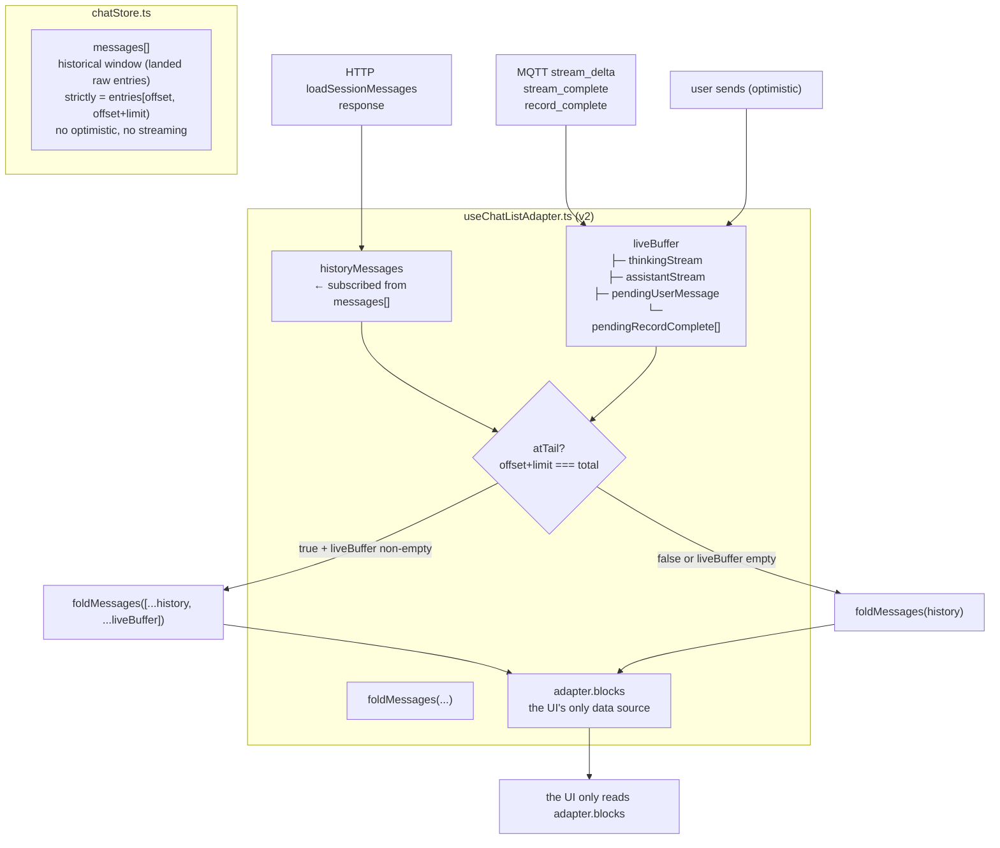
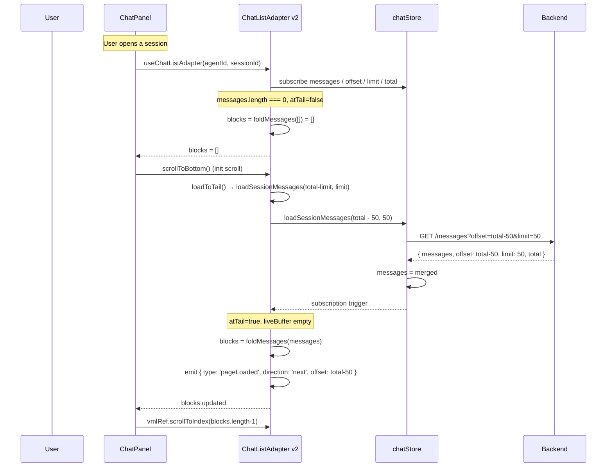
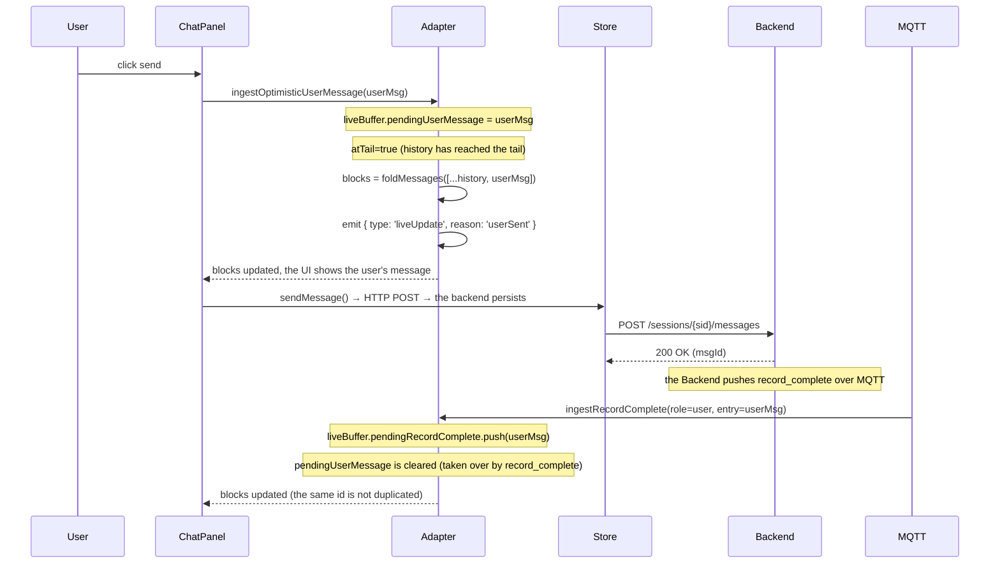
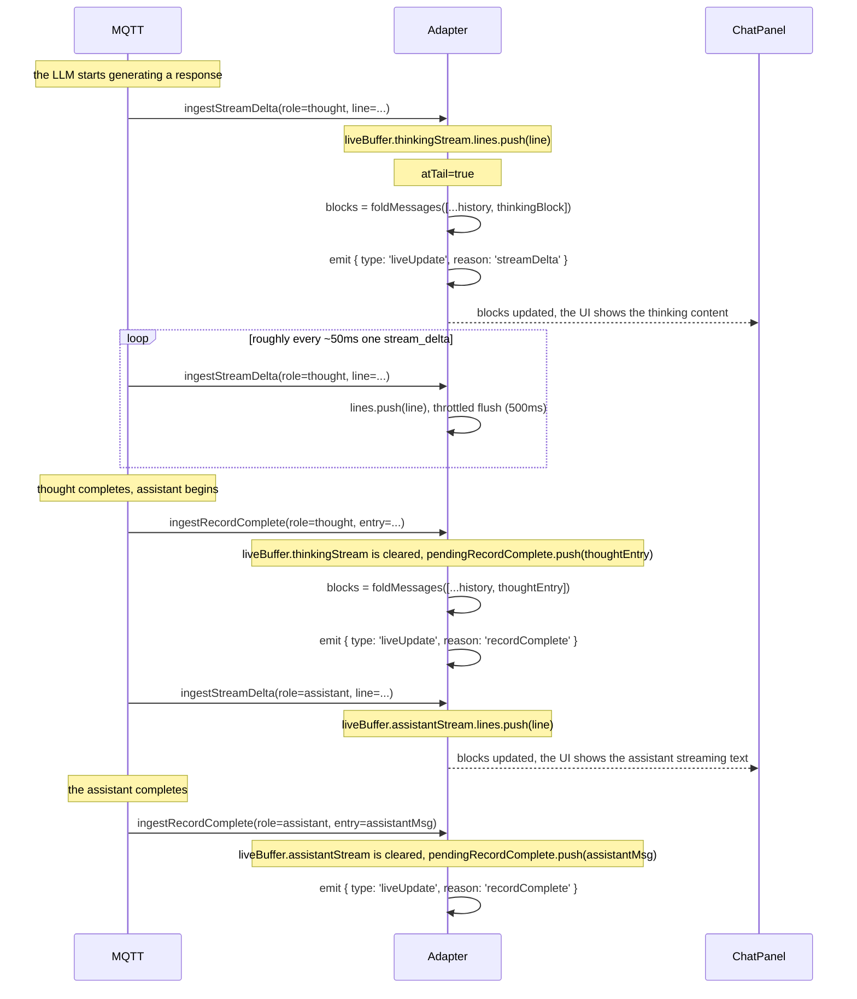
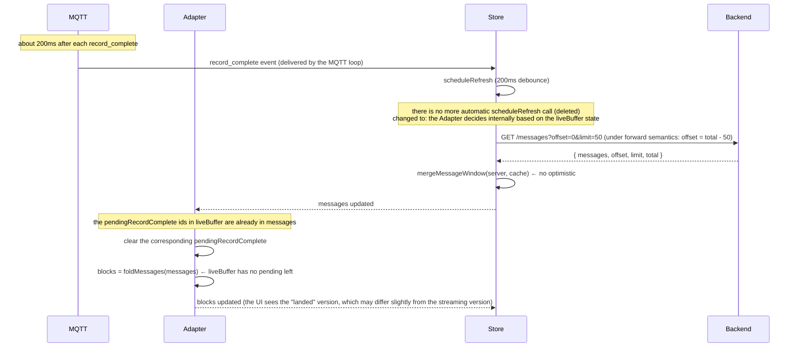
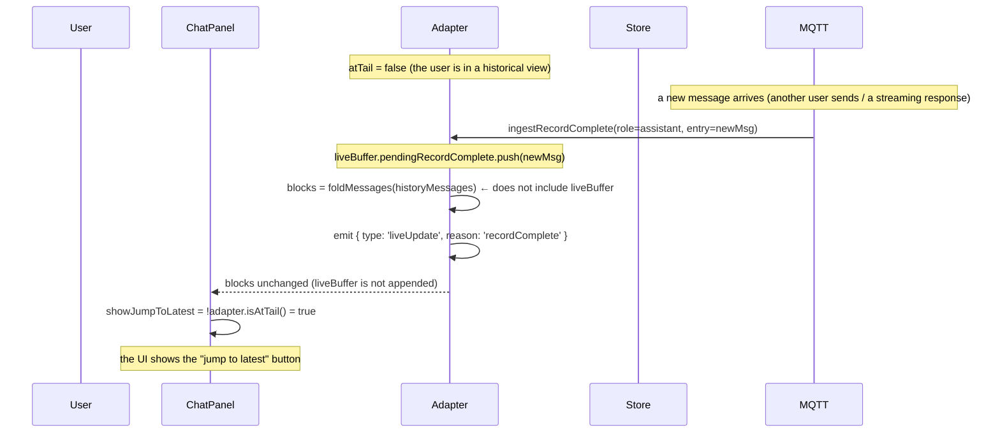
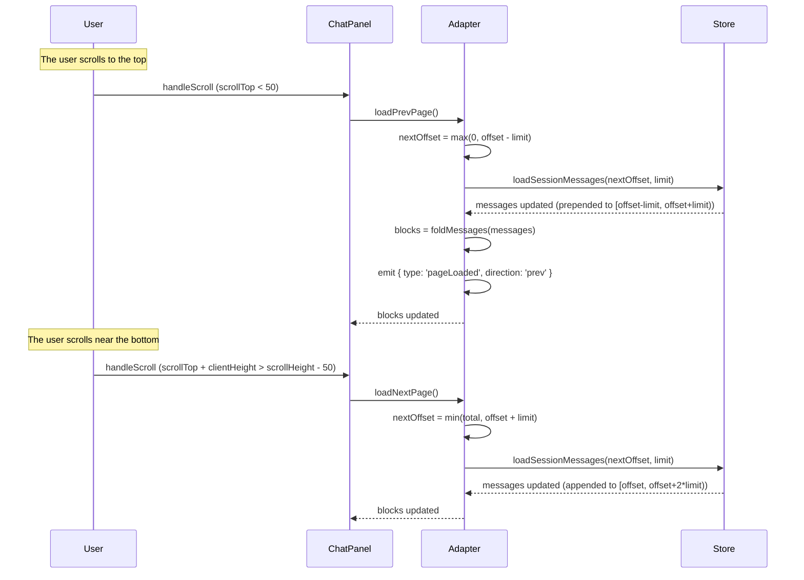
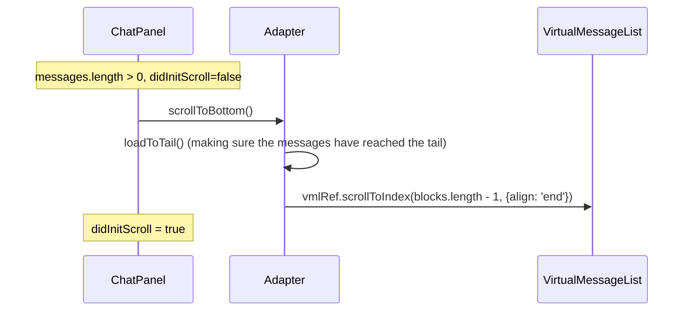

# ADR-050: Data-Driven Chat List Refactor - Complete Decoupling of UI and Data

**Status**: Draft
**Date**: 2026-08-01
**Deciders**: 大鱼
**Prerequisites**:
- [ADR-021](./ADR-021-unified-session-data-loading.md) (Unified Session data loading - HTTP Pull + MQTT notification)
- [ADR-035](./ADR-035-mqtt-streaming-push-refactor.md) (Streaming refactor - MQTT direct data push + per-session line buffering)
- [ADR-038](./ADR-038-session-lifecycle-explicit-model.md) (Explicit Session lifecycle model)
- [ADR-041](./ADR-041-chat-list-adapter.md) (Chat list Adapter abstraction layer)

---

## 1. Decision Summary

The current chat message list architecture (the ADR-041 implementation) has already converged pagination, anchoring and sticky-bottom into `useChatListAdapter`, but **two fundamental couplings remain**:

1. **The backend pagination semantics are anti-human**: `offset=0` means "the newest end", and `offset=N` means "skip N from the newest". The frontend `messageOffset` mirrors this semantics; the judgement direction of `hasOlder / hasNewer`, the page calculation, and the counter-intuitive `offset=0` of scroll-to-bottom are all the reverse of the common sense of "page numbers run from front to back".
2. **Live data and historical data are mixed in the same pipeline**: streaming chunks, `optimisticEntries`, `assistantStreamingContent`, `thinkingContent`, `isAssistantReplying` and other "live" signals share the `messages[]` array with the "already landed on disk" historical data, plus derived flags and `StreamingSourceBlock`. The UI must know "which one is streaming", "which one is historical", "which ones are temporary buffers", and must maintain a dozen or more UI-only states such as `isPinnedToBottom` / `showScrollToTop` / `showScrollToBottom` / `virtualCount` in order to render correctly.

This ADR introduces a **data-driven ChatListAdapter v2**, compressing the architecture down to three things:

```
load data → render UI → compute UI → load data
```

**Five core designs**:

1. **Forward indexing (unified across front end and back end)**: the message offset starts at 0 and increases, `offset=0` is the first (oldest) entry, `offset=total-1` is the newest; the backend `read_messages_paginated`, the frontend `chatStore.messageOffset` and the HTTP API `GetMessagesQuery.offset` all switch to forward semantics.
2. **Strict separation of live / historical**: `chatStore.messages[]` always represents only the landed historical window `[offset, offset+limit)`; MQTT live events (`stream_delta` / `record_complete` / the user's optimistic send) are absorbed by the Adapter's internal `liveBuffer`; **only when** `messages[]` has loaded to the tail (`offset+limit === total`) does the Adapter append `liveBuffer` to `messageBlocks` (the appended live blocks are marked `isLive: true`, so the VML renders them with `StreamingSourceBlock`), otherwise the UI only ever sees historical data.
3. **Event-driving the scrollController**: `useScrollController` no longer maintains any data state (removing the state machine, `pinnedToBottom`, prepend detection, scrollHeight delta and scroll-arrow display); it only does event subscription + UI command dispatch: subscribing to the Adapter's `liveUpdate` events and issuing `scrollToTop / scrollToBottom / scrollToPosition` commands to the VML.
4. **UI atomization**: removing all derived states in the UI related to the "bottom / top state machine" (`isPinnedToBottom`, `showScrollToTop/Bottom` are no longer derived from scroll position, `virtualCount` no longer computes extras), while **retaining**:
   - the two `scrollToTop` / `scrollToBottom` buttons (the functionality is not deleted, only the visibility changes to being derived from `adapter.isAtTail()` / `adapter.messageOffset > 0`)
   - `StreamingSourceBlock` (the rendering characteristics of live data cannot be lost: a streaming block is output as a subset of `adapter.blocks`, rendered by the VML with `StreamingSourceBlock`; the adapter notifies the controller via the liveUpdate event to trigger a refresh only when the streaming block is in the viewport)

   The UI exposes only **5 interaction primitives**: `scrollToTop` / `scrollToBottom` / `scrollToPosition(offset)` / `loadNextPage` / `loadPrevPage`, where `scrollToPosition` uses a **data block index** (not pixels).
5. **The Adapter is the data contract**: the Adapter is the sole producer of `messageBlocks`, the sole absorber of live data, and the sole entry point for UI interaction; the UI only reads `adapter.blocks`, only calls `adapter.scrollToXxx / adapter.loadXxxPage`, and only subscribes to `adapter.subscribe(cb)` events; it does not know that "streaming", "optimistic" or "history" exist.

**Expected benefits**:

| Dimension | Benefit |
|-----------|---------|
| Semantics | `offset=0` is the oldest, matching intuition; `hasOlder = offset > 0`, `hasNewer = offset+limit < total`, no direction reversal |
| Code size | `useScrollController.ts` shrinks from 782 lines to ~150 lines; ChatPanel deletes ~300 lines of UI-only state computation; `StreamingSourceBlock.tsx` (198 lines) is **retained and simplified**, only responsible for rendering live content derived from `messageBlock.isLive` |
| Bug surface | Removing the whole class of bugs caused by mixing history / live - "scroll-up gets yanked back", "cannot page to the bottom so it stops", "scrolling up during streaming causes messages to be evicted", "duplicate optimistic messages" |
| Testability | The Adapter is pure data derivation (`foldMessages(history + liveBuffer)` + internal ref management), so unit tests can cover all boundaries |
| Extensibility | Future scenarios such as "message recall" or "message editing" only need to extend the shape of `liveBuffer` inside the Adapter, with no UI impact |

---

## 2. Background and Current State

### 2.1 The real architecture after ADR-041

ADR-041 converged pagination, anchoring and ensure-renderable into `useChatListAdapter`, but **three classes of problems remained**:

```
┌────────────────────────────────────────────────────────────────────┐
│ ChatPanel (2458 lines)                                              │
│ ├─ computes virtualCount = messageBlocks.length + extras            │
│ │   ├─ showReplyingItem = isAssistantReplying                       │
│ │   ├─ showCompactingItem = isCompacting                            │
│ │   └─ showInterStepProcessing (derived from sending + the type    │
│ │                           of the last message)                   │
│ ├─ computes messageBlocks = adapter.blocks                         │
│ ├─ useScrollController (782 lines) — a state machine                │
│ │   ├─ stateRef: "pinned-bottom" | "idle" | "loading-older" | ...   │
│ │   ├─ prevScrollHeightRef / prevFirstMsgIdRef / prevVirtualCountRef│
│ │   ├─ didInitScrollRef / ensureRenderableCountRef / preLoadStateRef│
│ │   └─ showScrollToBottom / showScrollToTop (UI flags) → changed to │
│ │      be derived by the adapter (isAtTail / messageOffset > 0),    │
│ │      no longer depending on the DOM scroll position                │
│ └─ passes 20+ props to the VML                                     │
│    ├─ isThinking / thinkingContent / thinkingStartTime             │
│    ├─ assistantStreamingContent / assistantStreamingStartTime     │
│    └─ virtualCount / showCompactingItem / showReplyingItem        │
└────────────────────────────────────────────────────────────────────┘
                              ↓
┌────────────────────────────────────────────────────────────────────┐
│ VirtualMessageList (696 lines)                                      │
│ ├─ useVirtualizer (@tanstack/react-virtual)                         │
│ ├─ StreamingSourceBlock (198 lines, retained) — renders live        │
│ │   content (streaming preview / thinking preview) only when        │
│ │   messageBlock.isLive, with the refresh triggered by the          │
│ │   controller through the onStreamingBlockUpdate callback          │
│ └─ scroll handler / ResizeObserver / recordMeasuredHeight          │
│ └─ scroll handler / ResizeObserver / recordMeasuredHeight          │
└────────────────────────────────────────────────────────────────────┘
                              ↓
┌────────────────────────────────────────────────────────────────────┐
│ VirtualMessageList (696 lines)                                      │
│ ├─ useVirtualizer (@tanstack/react-virtual)                         │
│ ├─ StreamingSourceBlock (198 lines, retained) — renders live        │
│ │   content (streaming preview / thinking preview) only when        │
│ │   messageBlock.isLive, with the refresh triggered by the          │
│ │   controller through the onStreamingBlockUpdate callback          │
│ └─ scroll handler / ResizeObserver / recordMeasuredHeight          │
└────────────────────────────────────────────────────────────────────┘
                              ↓
┌────────────────────────────────────────────────────────────────────┐
│ useChatListAdapter (256 lines)                                      │
│ └─ blocks / hasOlder / hasNewer / isLoading                         │
│    / loadBefore / loadAfter / jumpToLatest / jumpToOldest           │
│    / messageOffset / messageLimit / messageTotal / jumpTarget       │
└────────────────────────────────────────────────────────────────────┘
                              ↓
┌────────────────────────────────────────────────────────────────────┐
│ chatStore.ts (3279 lines)                                           │
│ ├─ messages[] = mergeMessageWindow(server, cache, optimistic)       │
│ ├─ optimisticEntries[] (the user's unconfirmed optimistic messages) │
│ ├─ isAssistantReplying / isThinking / thinkingContent               │
│ ├─ assistantStreamingContent / assistantStreamingStartTime          │
│ ├─ activeStreams Map (module-level stream tracking)                 │
│ ├─ isPinnedToBottom (UI scroll-position state)                      │
│ └─ scheduleRefresh — an automatic HTTP refresh 200ms after          │
│    record_complete                                                  │
└────────────────────────────────────────────────────────────────────┘
                              ↓
┌────────────────────────────────────────────────────────────────────┐
│ backend conversation.rs read_messages_paginated(path, offset, limit) │
│ ├─ offset=0  → the latest `limit` entries (anti-human: offset=0      │
│ │              means "the end")                                     │
│ ├─ offset=N  → skip N from the newest                              │
│ └─ end_idx = total - offset; start_idx = end_idx - limit            │
└────────────────────────────────────────────────────────────────────┘
```

### 2.2 Confirmed design holes (not rooted out by ADR-041)

| # | Hole | Root cause | Impact |
|---|------|-----------|--------|
| **P0-A** | The backend has reverse offset semantics | `end_idx = total - offset` in `read_messages_paginated` | The frontend `hasOlder = messageOffset + messageLimit < messageTotal` (forward) is mixed with "the larger the offset, the older", so all pagination calculations have to be reversed once |
| **P0-B** | Live data enters `messages[]` | `mergeMessageWindow(server, cache, optimistic)` writes the user's unconfirmed messages into `messages[]`; `stream_delta` goes through activeStreams → record_complete → `loadSessionMessages(0, 50)` which re-fetches the entire window | During streaming `messages[]` contains both the history already landed on disk and the not-yet-confirmed "future" messages; the assumptions of either side about message order are inconsistent |
| **P0-C** | `isPinnedToBottom` is a UI state yet held by the store | `chatStore.sessionStates[id].isPinnedToBottom` | The UI scroll position is serialized into the store; store changes trigger cross-component re-renders; the scrollController and the store mutually modify this value, forming a circular dependency |
| **P1-D** | The UI maintains a dozen or more "streaming / bottom" derived flags | `virtualCount = blocks + showReplyingItem + showCompactingItem + showInterStepProcessing` | The UI must know "which one is streaming" and "which ones are placeholders" to render correctly; adding a new "streaming variant" requires changing the virtualCount calculation |
| **P1-E** | The scrollController maintains data state | the state machine, prevScrollHeightRef, prevFirstMsgIdRef, ensureRenderableCountRef | The scrollController simultaneously handles "scroll position tracking" + "data load triggering" + "UI button visibility", and a bug in any one responsibility pollutes the others |

### 2.3 The architectural root cause

ADR-041 treated the symptoms rather than the root cause:

- Stabilizing blockId, converging anchoring into the Adapter and direction-aware eviction → fixed 4 concrete bugs
- But it **never re-examined whether "historical data" and "live data" should share the same pipeline** - which is the root of P0-B / P0-C

Android's RecyclerView + Adapter pattern is so powerful precisely because the Adapter strictly separates "already committed data" (mItems) from "data pending commit" (mPendingNotifications); the View only ever reads mItems and never knows mPendingNotifications exists. This ADR brings that principle to the front end: the Adapter strictly separates `historyMessages` (the landed historical window) from `liveBuffer` (MQTT live events), and `messageBlocks` merges the two only when `offset+limit === total`.

### 2.4 Not replacing the virtualization engine

Consistent with ADR-041, this ADR does **not** replace `@tanstack/react-virtual`. The reasons:

1. The holes are all in the data loading and the "history / live" classification layer, not in the virtualization engine layer.
2. The current code has a large amount of WKWebView/Tauri-specific workaround (synchronous `scrollTop` assignment, `NotAllowedError` catching, dual ResizeObserver measurement), so the risk of replacing the engine is uncontrollable.
3. Alternatives such as `react-virtuoso` / `virtua` are unverified in the WKWebView environment.

The `useVirtualizer` configuration stays unchanged; on top of it the Adapter provides the pure data contract of "load data → messageBlocks → render".


---

## 3. Core Design: The Data-Driven ChatListAdapter v2

### 3.1 Design principles

| Principle | Meaning | Corresponding measure |
|-----------|---------|------------------------|
| **Single data source** | `adapter.blocks` is the only data the UI reads; any "live / streaming / history" classification is absorbed inside the Adapter | The UI no longer receives props such as `isThinking` / `assistantStreamingContent` |
| **Data driven** | All UI behaviour (scroll anchoring, button visibility, whether to follow new messages) is determined by "what the data is", not by "where the user is" | `adapter.scrollToPosition(offset)` uses a data offset rather than pixels |
| **Event transparency** | A live data update = an internal Adapter event, received by the UI through subscription; the UI does not distinguish "this is MQTT or HTTP" | `adapter.subscribe(cb)` returns unsubscribe; cb receives `{type: 'liveUpdate' \| 'pageLoaded' \| ...}` |
| **Atomic operations** | The UI has only 5 interaction primitives: `scrollToTop / scrollToBottom / scrollToPosition / loadNextPage / loadPrevPage`; everything else is a combination of them | Removing concepts such as `jumpToLatest / jumpToOldest / loadBefore / loadAfter / ensureLatestInCache` |
| **Purity of the historical window** | `chatStore.messages[]` always = the raw entries landed on disk (within `[offset, offset+limit)`), containing no "future" messages | `mergeMessageWindow` drops the optimistic merge path; the `optimisticEntries` field is deleted |

### 3.2 Design 1: Forward indexing (unified across front end and back end)

#### 3.2.1 Semantic definition

```
offset = 0          → the first (oldest) message
offset = N          → skip the first N, starting from the Nth
offset = total - 1  → the newest one

[start, end)        → the window = entries[start, end)   (start ≥ 0, end ≤ total)
                      length = end - start
```

#### 3.2.2 Back-end change points

**`core/acowork-runtime/src/conversation.rs::read_messages_paginated`**

```rust
// BEFORE (anti-human)
let end_idx = total - offset;
let start_idx = end_idx.saturating_sub(limit as u64);
let messages = entries[start_idx as usize..end_idx as usize].to_vec();

// AFTER (forward)
let start_idx = offset.min(total);
let end_idx = (offset + limit as u64).min(total);
let messages = entries[start_idx as usize..end_idx as usize].to_vec();
```

**HTTP API (`http/server.rs::GetMessagesQuery`)**

```rust
// BEFORE: offset from the newest end
/// Offset from the newest end, in raw entries (one JSONL line each).
/// 0 = latest raw entries.
#[serde(default)]
offset: Option<u64>,

// AFTER: offset from the oldest end
/// Offset from the oldest end, in raw entries (one JSONL line each).
/// 0 = first (oldest) raw entry.  See PaginatedMessages for the contract.
#[serde(default)]
offset: Option<u64>,
```

**The Gateway reverse proxy** (`core/acowork-gateway/src/http/proxy.rs::proxy_get_messages`) - unchanged (it passes `offset` / `limit` through).

#### 3.2.3 Front-end change points

**The `chatStore.sessionStates[id]` pagination coordinates**

```typescript
// BEFORE (anti-human, offset=0 means "already loaded to the end")
messageOffset: number;   // 0 = latest end
messageLimit: number;
messageTotal: number;

// AFTER (forward)
messageOffset: number;   // 0 = oldest end
messageLimit: number;
messageTotal: number;
```

**`hasOlder` / `hasNewer` derivation (inside the Adapter)**

```typescript
// BEFORE (direction reversed)
hasOlder = messageOffset + messageLimit < messageTotal && messageLimit > 0;
hasNewer = messageOffset > 0;

// AFTER (intuitive)
hasOlder = messageOffset > 0;                  // can still page back (older)
hasNewer = messageOffset + messageLimit < messageTotal;  // can still page forward (newer)
```

**`loadNextPage` / `loadPrevPage` computation (UI primitives)**

```typescript
// UI calls loadNextPage() → load the next page (towards the newest)
const nextOffset = messageOffset + messageLimit;

// UI calls loadPrevPage() → load the previous page (towards the oldest)
const prevOffset = Math.max(0, messageOffset - messageLimit);
```

**`ensureLatestInCache` renamed + semantics aligned**

```typescript
// BEFORE: ensureLatestInCache → loadSessionMessages(0, 50)  (offset=0=newest, counter-intuitive)
// AFTER:  jumpToTail() → loadSessionMessages(total - limit, limit)
//
// The function name ensureLatestInCache is kept for compatibility with old callers,
// but internally it switches to forward semantics.
```

#### 3.2.4 Impact scope

| File | Change |
|------|--------|
| `core/acowork-runtime/src/conversation.rs` | The `read_messages_paginated` math is reversed; the inline comments are updated |
| `core/acowork-runtime/src/http/server.rs` | The `GetMessagesQuery.offset` doc comment is updated; the `PaginatedMessages.offset` semantics are aligned |
| `core/acowork-gateway/src/http/proxy.rs` | Unchanged (pass-through) |
| `apps/acowork-desktop/src/stores/chatStore.ts` | The `mergeMessageWindow` formula stays unchanged (it already derives from the returned offset); the cursor math is kept but the semantics become forward |
| `apps/acowork-desktop/src/components/chat/useChatListAdapter.ts` | The `hasOlder` / `hasNewer` formulas are reversed; `loadBefore / loadAfter` are renamed to `loadPrevPage / loadNextPage` |
| `apps/acowork-desktop/src/components/chat/useScrollController.ts` | The paging trigger logic (`getFirstVisibleBlockIndex() === 0` → `loadPrevPage`) is adapted to the new semantics |

**Backward compatibility**: the HTTP API's `offset` parameter changing from "reverse" to "forward" is a breaking change. Given that the Desktop is the only caller, no extra migration cost is introduced; the CI integration tests are rewritten together in C1.


### 3.3 Design 2: Strict separation of live / historical

#### 3.3.1 The data flow diagram



#### 3.3.2 The Adapter's internal state machine

```
                    ┌──────────────────┐
        initial load│  loadSession    │  ← triggerable at any point
                    └────────┬─────────┘
                             ↓
                    messages updates (the subscription triggers a re-render)
                             ↓
                    ┌──────────────────┐
                    │  historyMessages │ ← the pure historical window
                    │  liveBuffer      │ ← live accumulation (an independent track)
                    └────────┬─────────┘
                             ↓
              atTail? ───────────────┐
                │                    │
              false                true
                ↓                    ↓
       blocks = foldMessages(  blocks = foldMessages(
         historyMessages          historyMessages ++ liveBuffer
       )                         )
                ↓                    ↓
                    ┌──────────────────┐
                    │   adapter.blocks  │ ← the UI's only data source
                    └──────────────────┘
```

#### 3.3.3 The contents and lifecycle of liveBuffer

| liveBuffer field | Source | Cleanup timing |
|-----------------|--------|---------------|
| `thinkingStream` | MQTT `stream_delta` (role=thought) | MQTT `record_complete` (role=thought) → clear this field; or the user switches session |
| `assistantStream` | MQTT `stream_delta` (role=assistant) | MQTT `record_complete` (role=assistant) → move into `pendingRecordComplete`; or the user switches session |
| `pendingUserMessage` | The user sends (chatStore `sendMessage` creates it immediately) | The HTTP `loadSessionMessages` response contains the same id → delete this field |
| `pendingRecordComplete[]` | MQTT `record_complete` (role=user/assistant/thought) | The HTTP `loadSessionMessages` response contains the same id → delete |

#### 3.3.4 The Adapter → UI event contract

```typescript
type AdapterEvent =
  | { type: 'liveUpdate'; reason: 'streamDelta' | 'recordComplete' | 'userSent' }
  // Trigger timing: the liveBuffer contents change (not necessarily atTail)
  // UI response: does not directly re-render blocks (blocks already update
  //              automatically through the React subscription);
  //              only used to notify "new data has arrived", and the UI can
  //              optionally show a "jump to latest" hint
  | { type: 'pageLoaded'; direction: 'prev' | 'next' }
  // Trigger timing: the loadPrevPage / loadNextPage HTTP response has been merged
  | { type: 'flushAvailable'; pendingCount: number }
  // Trigger timing: liveBuffer has accumulated ≥ 1 pendingRecordComplete /
  //          pendingUserMessage, and atTail is already true (meaning the
  //          historical window has reached the newest)
  // UI response: may trigger a "jump to latest" action or an automatic flush
                // into the historical window
```

**Key invariants**:

- `liveBuffer` is internal Adapter state, invisible to the UI; the UI can only know "something new arrived" through events.
- If and only if `atTail`, the `blocks` the UI sees include liveBuffer; otherwise the `blocks` the UI sees contain only history.
- The UI never needs to judge "is the user at the bottom / at the top" - the adapter's `blocks` directly reflect "what I can see".


### 3.4 Design 3: Event-driving the scrollController

#### 3.4.1 Current state vs the new design

| Responsibility | Current state | New design |
|----------------|---------------|------------|
| scroll position tracking | `stateRef: "pinned-bottom" \| "idle" \| ...` + `wasAtBottomRef` | **Deleted**: the scrollController does not read DOM positions |
| preload detection | `prevScrollHeightRef` + `prevFirstMsgIdRef` + `scrollHeight delta` | **Deleted**: the scrollController does not detect prepends |
| sticky-bottom auto-follow | `useLayoutEffect([virtualCount])` + judging `stateRef.current === "pinned-bottom"` then calling `scrollToBottom()` | **Deleted**: the scrollController does not actively follow |
| Button visibility | `showScrollToBottom = distFromBottom > 120`, `showScrollToTop = scrollTop > clientHeight` | **Changed**: derived by the adapter - `showJumpToLatest = !isAtTail() \|\| hasPendingFlush()`; `showJumpToOldest = messageOffset > 0 \|\| firstBlockInViewport` (both buttons are functionally retained) |
| Paging trigger | `setInterval(150ms)` + `getFirstVisibleBlockIndex() === 0` → `loadBefore` | **Retained**: but calls `loadPrevPage` / `loadNextPage` |
| init scroll | `useLayoutEffect([virtualCount])` calling `vmlRef.scrollToBottom()` or `container.scrollTop = offset` | **Changed**: the scrollController calls `adapter.scrollToPosition(offset)`, coordinated by the Adapter through `pendingScrollTarget` |
| jump-to-top / jump-to-bottom | `jumpToTop()` / `jumpToBottom()` calling `adapter.jumpToOldest` / `adapter.jumpToLatest` | **Changed**: the scrollController calls `adapter.loadPrevPage` until `offset=0` then `scrollToTop()`, / calls `adapter.loadNextPage` until `offset+limit=total` then `scrollToBottom()` |

#### 3.4.2 The new scrollController interface

```typescript
interface ScrollController {
  /** Called when an adapter event fires. The UI decides button visibility here. */
  onLiveUpdate?: (event: AdapterEvent) => void;
  /** Called when the adapter detects that a streaming block is inside the
   *  viewport, so the VML can refresh the live content of
   *  StreamingSourceBlock.
   *
   *  - Maintains no state; every callback queries the DOM live
   *  - If the streaming block has left the viewport, the controller does not
   *    call this callback
   *  - Does not affect scrollTop; the browser's natural behaviour already
   *    satisfies "show wherever the user scrolled to" */
  onStreamingBlockUpdate?: () => void;
  /** Called when the user clicks the "jump to latest" button */
  jumpToLatest: () => Promise<void>;
  /** Called when the user clicks the "jump to oldest" button */
  jumpToOldest: () => Promise<void>;
  /** Subscribe to adapter events */
  teardown: () => void;
}
```

**Inside the scrollController**:

```typescript
// Only three pieces of logic remain, all event-driven + command forwarding,
// maintaining no ref / state at all:

// 1. Subscribe to adapter.subscribe(event => ...)
//    - when event.type === 'liveUpdate':
//        a) query live whether the streaming block is in the viewport
//           (vmlRef.current?.isStreamingBlockInViewport())
//           if in the viewport → call onStreamingBlockUpdate?.() so the VML
//           refreshes StreamingSourceBlock
//           if not in the viewport → skip, avoiding off-screen render waste
//        b) call onLiveUpdate?.(event) so the UI derives button visibility
//    - when event.type === 'pageLoaded' → call onLiveUpdate?.(event)
//      (button visibility may need updating)
//    - when event.type === 'flushAvailable' → call onLiveUpdate?.(event)

// 2. Implement jumpToLatest / jumpToOldest:
//    jumpToLatest: await adapter.scrollToBottom()  (internally encapsulates
//                  loadToTail + vml.scrollToBottom)
//    jumpToOldest: await adapter.scrollToTop()    (internally encapsulates
//                  loadToHead + vml.scrollToTop)

// 3. Paging trigger: keep setInterval(150ms) checking the DOM scrollTop
//    (still the only layer allowed to read the DOM)
//    - scrollTop < EDGE_THRESHOLD_PX → adapter.loadPrevPage()
//    - scrollTop + clientHeight > scrollHeight - EDGE_THRESHOLD_PX →
//      adapter.loadNextPage()
//    Maintaining no isLoadingMore / prevCount state; every time reading the
//    DOM live + judging with adapter.isLoading
```

Expected code size: **~150 lines** (compressed from 782).

**Key invariants**:

- The controller **does not maintain** scroll position state (no wasAtBottomRef, no prevCount)
- The controller **does not maintain** the "should it scroll" decision - `scrollToTop / scrollToBottom` are commands, not automatic behaviour
- The controller **does not maintain** a streaming content buffer - adapter.blocks already treats a streaming block as an ordinary messageBlock
- The controller's **only responsibilities**: event dispatch (adapter → UI) + paging trigger (DOM read → adapter) + viewport detection (DOM read → onStreamingBlockUpdate)

#### 3.4.3 The visibility of the two buttons ("jump to latest" + "jump to oldest")

**New design**: button visibility is **not determined by the scroll position** but by the **Adapter data state**:

```typescript
// Derived in ChatPanel.tsx (extremely simple)
const isAtTail = adapter.isAtTail();
const isAtHead = adapter.messageOffset === 0 && firstBlockInViewport; // requires a vmlRef query
const hasPending = adapter.hasPendingFlush();

// The "jump to latest" button: the user is not at the newest position → show
const showJumpToLatest = !isAtTail || hasPending;

// The "jump to oldest" button: the user is not at the oldest position → show
const showJumpToOldest = !isAtHead;

const handleJumpToLatest = () => scrollController.jumpToLatest();
const handleJumpToOldest = () => scrollController.jumpToOldest();
```

**The logic**:

**The "jump to latest" button (`ChevronsDown`)**:

- `!isAtTail()`: the historical window has not loaded to the tail → the user is in a historical view → show the button (so they can see the new messages)
- `isAtTail() && hasPendingFlush()`: the historical window has reached the tail but liveBuffer has unflushed data → show the button (letting the user actively flush or jump directly)
- Otherwise: the user is at the newest + liveBuffer has been flushed → do not show the button

**The "jump to oldest" button (`ChevronsUp`)**:

- `messageOffset > 0`: the historical window has not loaded to the oldest → the user is not at the oldest position → show the button
- `messageOffset === 0 && firstBlockInViewport`: already at the oldest position → do not show the button
- Otherwise: the user has loaded to the oldest but has not yet scrolled to the top → show the button

**The scrollController does not participate**: button visibility is a pure derivation in ChatPanel; the scrollController no longer reads `distFromBottom` / `scrollTop`.

**On "automatically scrolling to the bottom during streaming"**:

- The user explicitly requires "show wherever the user scrolled to"
- The browser's default behaviour already satisfies this requirement:
  - a streaming block is appended at the end of `adapter.blocks` → appended at the end of the DOM → scrollHeight increases
  - the user was originally at the bottom → scrollTop unchanged → after scrollHeight grows the user is still at the bottom (natural following)
  - the user was originally in the middle → scrollTop unchanged → the user's position is unchanged (seeing the new content below)
  - the user was originally at the top → scrollTop unchanged → the user's position is unchanged
- **No scroll adjustment logic is needed at all**; no forced auto-scroll to the bottom, and no blocking of the browser's natural behaviour
- The user accepts "if it can't be done (meaning scrollHeight delta jitter), we can give it up for now" - that is, no extra compensation is made

#### 3.4.4 The additional benefit of the UI no longer caring about the scroll position

| Removed state / logic | Replacement |
|----------------------|-------------|
| `isPinnedToBottom` (chatStore global) | Deleted. All logic depending on this state, such as `scheduleRefresh`, is deleted too |
| The `state machine` (5 states) | Deleted. No replacement - the Adapter coordinates on its own |
| `prevScrollHeightRef` / `prevFirstMsgIdRef` | Deleted. The scrollTop adjustment after a prepend is handled internally by the Adapter's `pendingScrollTarget` (passing in the anchor msg id) |
| `ensureRenderableCountRef` + `MAX_ENSURE_RENDERABLE_PAGES` | Deleted. Viewport filling is replaced by `loadPrevPage / loadNextPage` (the v2 Adapter still keeps `onLayout`, but the logic is extremely simple) |
| `showScrollToBottom / showScrollToTop` (UI flags) | **The two buttons are retained**, but their visibility is derived from `adapter.isAtTail()` / `adapter.messageOffset === 0` (no longer depending on `distFromBottom` / `scrollTop`) |
| The `getDistanceFromBottom()` helper | Deleted (only needed for sticky-bottom auto-follow, which is no longer needed) |
| The `PIN_THRESHOLD_PX / EDGE_THRESHOLD_PX` constants | `EDGE_THRESHOLD_PX` is kept for the paging trigger; `PIN_THRESHOLD_PX` is deleted (no sticky-bottom threshold) |
| `wasAtBottomRef` (a defensive check) | Deleted |
| The sticky-bottom auto-follow useLayoutEffect | Deleted. **Show wherever the user scrolled to**; there is no auto-follow, and the browser's natural behaviour already satisfies "at the bottom → still at the bottom" |
| `getFirstVisibleBlockIndex / getLastVisibleBlockIndex` (VML handle) | Retained as the internal query interface for the paging trigger and streaming block viewport detection; a new `isStreamingBlockInViewport()` is added for the controller to check whether the streaming block needs a refresh |

### 3.5 Design 4: UI atomization

#### 3.5.1 The convergence of ChatPanel's prop computation

```typescript
// BEFORE: ChatPanel computes virtualCount + derives a dozen or more flags
const virtualCount = messageBlocks.length + extraItems; // extraItems = showReplyingItem + showCompactingItem
const showReplyingItem = isAssistantReplying;
const showCompactingItem = isCompacting;
const showInterStepProcessing = sending && !canShowWorkingItemAfterUser && !showReplyingItem && !showCompactingItem;
const showWorkingItem = showWorkingItemAfterUser || showInterStepProcessing;

// AFTER: ChatPanel only reads the adapter + two button visibilities
//      (no more virtualCount extras derivation)
const showJumpToLatest = !adapter.isAtTail() || adapter.hasPendingFlush();
const showJumpToOldest = !isAtHead;  // derived from adapter.messageOffset > 0 && firstBlockInViewport

// VML rendering: iterate adapter.blocks directly, blocks with isLive === true
// are rendered with StreamingSourceBlock
// virtualCount = adapter.totalBlocks (no more + extras)
```

#### 3.5.2 The convergence of the VirtualMessageList props

```typescript
// BEFORE: receives 20+ props including streaming related ones
interface VirtualMessageListProps {
  adapter: ChatListAdapter;
  messageBlocks: MessageBlock[];
  virtualCount: number;
  showCompactingItem: boolean;
  showReplyingItem: boolean;
  sending: boolean;
  pendingApproval: ...;
  currentSessionId: string | null;
  toolProgress?: ...;
  isThinking: boolean;                    // ← retained (for StreamingSourceBlock to render the thinking state)
  thinkingContent: string;                 // ← retained (live thinking preview content)
  thinkingStartTime: number | null;        // ← retained (thinking timer)
  assistantStreamingContent: string;       // ← retained (live assistant streaming preview content)
  assistantStreamingStartTime: number | null; // ← retained (streaming timer)
  // ... other props retained
}

// AFTER: the streaming related props are still retained, but the semantics change
//  - they are no longer "is it streaming" flags, but "live content data"
//  - they are maintained by the adapter in liveBuffer and passed as props
//  - adapter.blocks still contains the streaming block (isLive: true), and the
//    VML renders it with StreamingSourceBlock
interface VirtualMessageListProps {
  adapter: ChatListAdapter;
  // The streaming related props are retained, for StreamingSourceBlock to render
  // But ChatPanel no longer derives virtualCount from sending/isThinking
  isThinking: boolean;
  thinkingContent: string;
  thinkingStartTime: number | null;
  assistantStreamingContent: string;
  assistantStreamingStartTime: number | null;
  // Other UI chrome props are retained (pendingApproval / toolProgress /
  // userDisplayName, etc.)
}
```

**Key changes**:

- `isThinking` / `assistantStreamingContent` etc. are no longer used for the virtualCount computation and no longer used to derive the "working indicator"
- They are used only for the live content rendering inside `StreamingSourceBlock` (trailing preview, timers, etc.)
- The rendering entry point: when the VML encounters a block with `block.isLive === true` in `adapter.blocks` it renders it with the `StreamingSourceBlock` component
- The controller triggers the streaming block refresh through the `onStreamingBlockUpdate` callback (only when in the viewport)

#### 3.5.3 Removed / retained components

| Component / hook | Status | Reason |
|------------|------|--------|
| `StreamingSourceBlock.tsx` (198 lines) | **Retained and simplified** | The rendering characteristics of live data cannot be lost: a streaming block is output as a subset of `adapter.blocks` (when atTail), and when `block.isLive === true` the VML renders it with StreamingSourceBlock. The controller triggers the StreamingSourceBlock refresh through the `onStreamingBlockUpdate` callback (only when in the viewport). StreamingSourceBlock still consumes streaming data props such as `isThinking` / `assistantStreamingContent` / `thinkingContent` internally |
| `useStreamingContent.ts` (if it exists) | **Retained** | Same as above; it is the hook StreamingSourceBlock depends on |
| `WorkingIndicator` / `InterStepProcessing` derivation | Simplified | These are special slots combining "sending + streaming"; changed to: when the streaming block is in the viewport and `hasPendingFlush()`, StreamingSourceBlock itself renders the hint |
| The anchor field in `useSessionScope.ts` | Deleted | ADR-041 already deleted it; this ADR further confirms no scope is needed |
| `pinnedToBottomRef` | Deleted | The scrollController no longer reads the scroll position |
| `showCompactingItem` / `showReplyingItem` | Deleted | They are no longer factors of the virtualCount computation; changed to being displayed separately in the session header |

#### 3.5.4 The final definition of the UI interaction primitives

```typescript
// The imperative handle VirtualMessageList exposes to the scrollController
interface VirtualMessageListHandle {
  scrollToTop(): void;                                  // scroll to the first MessageBlock
  scrollToBottom(): void;                               // scroll to the last MessageBlock
  scrollToPosition(blockIndex: number): void;           // scroll to a given block index (a data position)
  getFirstVisibleBlockIndex(): number | null;            // paging trigger and scrollToOldest button visibility query
  getLastVisibleBlockIndex(): number | null;             // paging trigger query
  isStreamingBlockInViewport(): boolean;                 // the controller checks whether the streaming block needs a refresh
  refreshStreamingBlock(): void;                        // the controller triggers a StreamingSourceBlock refresh (only called when in the viewport)
}

// The interaction interface ChatListAdapter v2 exposes to the UI
interface ChatListAdapter {
  // Data output
  readonly blocks: MessageBlock[];
  readonly totalBlocks: number;
  readonly isAtTail: () => boolean;
  readonly hasPendingFlush: () => boolean;

  // Paging (data driven)
  loadPrevPage(): Promise<void>;   // load older (offset -= limit), no anchor
  loadNextPage(): Promise<void>;   // load newer (offset += limit), no anchor

  // Jumps (data driven)
  scrollToTop(): Promise<void>;          // equivalent to loadToHead() + vml.scrollToTop()
  scrollToBottom(): Promise<void>;       // equivalent to loadToTail() + vml.scrollToBottom()
  scrollToPosition(blockIndex: number): Promise<void>;
}
```

**`scrollToPosition` uses a data position**: `scrollToPosition(0)` = the first block; `scrollToPosition(blocks.length - 1)` = the last block; pixels / scrollTop are no longer used.

**The VML rendering path**:

```typescript
// VirtualMessageList.tsx rendering logic (simplified)
function VirtualMessageList({ adapter, ...streamingProps }) {
  return adapter.blocks.map((block, i) => {
    if (block.isLive) {
      // A live data block from liveBuffer, rendered with StreamingSourceBlock
      return <StreamingSourceBlock
        key={block.blockId}
        block={block}
        isThinking={streamingProps.isThinking}
        thinkingContent={streamingProps.thinkingContent}
        // ... other streaming props
      />;
    }
    // An ordinary historical block
    return block.type === 'explore_group'
      ? <ExploreBlock key={block.blockId} block={block} />
      : <MessageBubble key={block.blockId} block={block} />;
  });
}
```

**The flow by which the controller triggers a StreamingSourceBlock refresh**:

```typescript
// useScrollController.ts (simplified)
function useScrollController(adapter, vmlRef, onLiveUpdate, onStreamingBlockUpdate) {
  // 1. Paging trigger: keep setInterval(150ms)
  useEffect(() => {
    const interval = setInterval(() => {
      const container = containerRef.current;
      if (!container || adapter.isLoading) return;
      const distFromTop = container.scrollTop;
      const distFromBottom = container.scrollHeight - container.scrollTop - container.clientHeight;
      if (distFromTop < EDGE_THRESHOLD_PX && adapter.hasOlder) {
        void adapter.loadPrevPage();
      } else if (distFromBottom < EDGE_THRESHOLD_PX && adapter.hasNewer) {
        void adapter.loadNextPage();
      }
    }, TIMER_INTERVAL_MS);
    return () => clearInterval(interval);
  }, [containerRef, adapter]);

  // 2. Event subscription: liveUpdate → detect the streaming block viewport →
  //    trigger a refresh
  useEffect(() => {
    return adapter.subscribe((event) => {
      onLiveUpdate?.(event);
      if (event.type === 'liveUpdate') {
        // Maintains no state; queries the DOM live each time
        if (vmlRef.current?.isStreamingBlockInViewport?.()) {
          onStreamingBlockUpdate?.();
        }
      }
    });
  }, [adapter, onLiveUpdate, onStreamingBlockUpdate]);

  // 3. Jump commands
  const jumpToLatest = useCallback(() => adapter.scrollToBottom(), [adapter]);
  const jumpToOldest = useCallback(() => adapter.scrollToTop(), [adapter]);

  return { jumpToLatest, jumpToOldest };
}
```

#### 3.5.5 The simplified rendering loop

```
┌──────────────────────────────────────────────────────┐
│ UI rendering loop (pseudo code)                       │
│                                                       │
│   // Data rendering:                                 │
│   adapter.blocks → React render                       │
│     (blocks with isLive === true are rendered with   │
│      StreamingSourceBlock)                            │
│                                                       │
│   // Button visibility:                               │
│   showJumpToLatest = !adapter.isAtTail()              │
│                      || adapter.hasPendingFlush()     │
│   showJumpToOldest  = !isAtHead (derived)             │
│                                                       │
│   // controller subscription:                         │
│   scrollController.onLiveUpdate = (event) => {        │
│     // update button visibility based on the event    │
│   }                                                   │
│   scrollController.onStreamingBlockUpdate = () => {   │
│     // the controller has already determined that the │
│     // streaming block is in the viewport; the VML    │
│     // then force-refreshes StreamingSourceBlock      │
│     // (scrollTop is unaffected, the browser handles) │
│   }                                                   │
│                                                       │
│   // Button clicks:                                   │
│   onClickJumpToLatest = () => scrollController.jumpToLatest()  │
│   onClickJumpToOldest  = () => scrollController.jumpToOldest()  │
└──────────────────────────────────────────────────────┘
```

**The core**:

1. Rendering only reads `adapter.blocks`; when it encounters an `isLive` block the VML renders it with `StreamingSourceBlock`
2. Subscribe to adapter events and update button visibility as needed
3. Clicking a button calls `scrollController.jumpToLatest()`, which calls `adapter.scrollToBottom()` → automatically `loadToTail()` + `vml.scrollToBottom()`
4. Data changes (liveBuffer merge / paging responses) automatically trigger a re-render through the React subscription
5. **Streaming block refresh**: the controller listens for the `liveUpdate` event and queries the DOM live on each event to determine whether the streaming block is in the viewport → it calls `onStreamingBlockUpdate` only when in the viewport, so the VML refreshes StreamingSourceBlock
6. **"Show wherever the user scrolled to"**: a streaming block appends new content → the browser's scrollHeight grows naturally → scrollTop is unchanged → the user stays where they were; if they were at the bottom they remain at the bottom

---

## 4. The ChatListAdapter v2 Interface

### 4.1 The complete interface definition

```typescript
/**
 * ChatListAdapter v2 — the data-driven message list contract.
 *
 * Design principles:
 *  - The UI's only data source = adapter.blocks
 *  - The UI's only interaction entry = adapter.loadPrevPage/loadNextPage/scrollToXxx
 *  - The UI's only event source = adapter.subscribe
 *  - Concepts such as live / history / streaming / sticky-bottom are invisible to the UI
 */

export interface ChatListAdapter {
  // ── Data output ──────────────────────────────────────
  /**
   * The folded MessageBlock[], used for rendering.
   *
   * Content sources:
   *   - the historical window: chatStore.messages[] (always within
   *     [offset, offset+limit))
   *   - the live buffer (appended only when atTail): thinkingStream /
   *     assistantStream / pendingUserMessage / pendingRecordComplete
   *
   * Order: ascending by timestamp (consistent with messageFolder).
   *
   * Live data block marking: if a block comes from liveBuffer then
   * `block.isLive === true`, and the VML renders it with StreamingSourceBlock
   * rather than an ordinary MessageBubble/ExploreBlock.
   */
  readonly blocks: readonly MessageBlock[];

  /** A stable getter of blocks.length (avoiding recomputation on every access) */
  readonly totalBlocks: number;

  /** The current session's raw pagination coordinates (for paging computation and diagnostics) */
  readonly messageOffset: number;
  readonly messageLimit: number;
  readonly messageTotal: number;

  // ── State queries ─────────────────────────────────────
  /** Whether the historical window has loaded to the tail (offset+limit === total) */
  readonly isAtTail: () => boolean;

  /** Whether liveBuffer has unflushed data */
  readonly hasPendingFlush: () => boolean;

  /** Whether an older page is loadable (offset > 0) */
  readonly hasOlder: boolean;

  /** Whether a newer page is loadable (offset + limit < total) */
  readonly hasNewer: boolean;

  /** Whether an HTTP load is currently in progress */
  readonly isLoading: boolean;

  // ── Paging primitives ─────────────────────────────────
  /**
   * Load the previous page (towards the oldest, offset -= limit).
   * No-op if !hasOlder || isLoading.
   * After completion the Adapter internally appends to messages[] and blocks
   * re-renders automatically.
   */
  loadPrevPage(): Promise<void>;

  /**
   * Load the next page (towards the newest, offset += limit).
   * No-op if !hasNewer || isLoading.
   * After completion the Adapter internally appends to messages[] and blocks
   * re-renders automatically.
   */
  loadNextPage(): Promise<void>;

  // ── Jump primitives ───────────────────────────────────
  /**
   * Scroll to the first block (the oldest).
   * Internally: loadToHead() → vmlRef.scrollToTop()
   */
  scrollToTop(): Promise<void>;

  /**
   * Scroll to the last block (the newest, including liveBuffer).
   * Internally: loadToTail() → vmlRef.scrollToBottom()
   */
  scrollToBottom(): Promise<void>;

  /**
   * Scroll to a given block index (a data position).
   * @param blockIndex 0 = the first block, blocks.length-1 = the last block
   *
   * Internally: if the target block is within the historical window →
   *   vmlRef.scrollToIndex(blockIndex); if the target block is in an
   *   unloaded page → page first, then scrollToIndex
   */
  scrollToPosition(blockIndex: number): Promise<void>;

  // ── Live data absorption (internal) ───────────────────
  /**
   * Internal method: called by chatStore to write live data.
   * The UI does not call it directly.
   */
  ingestStreamDelta(role: 'thought' | 'assistant', line: StreamLine): void;
  ingestRecordComplete(role: 'thought' | 'assistant' | 'user', entry: ConversationEntry): void;
  ingestOptimisticUserMessage(msg: ChatMessage): void;
  ingestSessionMessagesWindow(serverMessages: ChatMessage[], offset: number, limit: number, total: number): void;

  // ── Event subscription ────────────────────────────────
  /**
   * Subscribe to Adapter events.
   * Returns an unsubscribe function.
   *
   * Event types:
   *   - { type: 'liveUpdate', reason: ... }: liveBuffer contents changed
   *   - { type: 'pageLoaded', direction: 'prev' | 'next' }: a paging HTTP
   *     response has been merged
   *   - { type: 'flushAvailable', pendingCount: number }: atTail + unflushed data
   */
  subscribe(cb: (event: AdapterEvent) => void): () => void;
}

export type AdapterEvent =
  | { type: 'liveUpdate'; reason: 'streamDelta' | 'recordComplete' | 'userSent' | 'flush' }
  | { type: 'pageLoaded'; direction: 'prev' | 'next'; offset: number; limit: number; total: number }
  | { type: 'flushAvailable'; pendingCount: number };
```

**The MessageBlock interface extension** (on top of ADR-041):

```typescript
export interface MessageBlock {
  // ... the fields ADR-041 already has (blockId / type / items / rawCount / hasFollowUpReply)...

  /** New: whether this block contains live data entries from liveBuffer.
   *  The VML chooses StreamingSourceBlock or an ordinary
   *  MessageBubble/ExploreBlock based on this. */
  isLive: boolean;
}
```

`isLive` is marked only when derived in the adapter's internal blocksSelector based on `liveBuffer.containsId(item.id)`; `messageFolder.foldMessages` stays pure (it does not know the isLive concept).


### 4.2 The Adapter's internal implementation skeleton

```typescript
/**
 * The state maintained inside the Adapter:
 *   historyMessages: derived from chatStore.messages[] (via a zustand subscription)
 *   liveBuffer: { thinkingStream, assistantStream, pendingUserMessage, pendingRecordComplete }
 *
 * blocks derivation:
 *   historyForRender = historyMessages
 *   if (atTail && (thinkingStream || assistantStream || pendingUserMessage || pendingRecordComplete.length > 0)) {
 *     blocks = foldMessages([...historyForRender, ...liveBuffer.toEntries()])
 *   } else {
 *     blocks = foldMessages(historyForRender)
 *   }
 *
 * Note: the entries in liveBuffer are deduplicated against historyMessages by
 *       id (for the same id the historical version wins); this handles the
 *       transient state of "after the user sends, liveBuffer has accumulated
 *       record_complete, but the HTTP refresh has not yet arrived".
 */

function blocksSelector(state: AdapterState): MessageBlock[] {
  const { historyMessages, liveBuffer, messageOffset, messageLimit, messageTotal } = state;

  // Decide whether to append liveBuffer
  const atTail = messageOffset + messageLimit >= messageTotal
                 && messageLimit > 0
                 && historyMessages.length > 0;

  const liveEntries = atTail ? liveBuffer.toEntries() : [];
  if (liveEntries.length === 0) {
    return foldMessages(historyMessages);
  }

  // Deduplication: if a liveBuffer id already exists in historyMessages, skip it
  const historyIds = new Set(historyMessages.map(m => m.id));
  const dedupedLive = liveEntries.filter(e => !historyIds.has(e.id));
  if (dedupedLive.length === 0) {
    return foldMessages(historyMessages);
  }

  const merged = [...historyMessages, ...dedupedLive].sort((a, b) => a.timestamp - b.timestamp);
  // After foldMessages, mark blocks coming from liveBuffer as isLive
  return foldMessages(merged).map((b) => {
    const anyLive = b.items.some((item) => liveBuffer.containsId(item.id));
    return anyLive ? { ...b, isLive: true } : b;
  });
}
```

### 4.3 Adapting to React: using useSyncExternalStore

```typescript
/**
 * The Adapter's internal state is independent of React; the UI subscribes
 * through useSyncExternalStore.
 *
 * Advantages:
 *   - Multiple components share the same Adapter instance, with no need to
 *     pass props through Context
 *   - The subscribe pattern naturally fits the event stream (liveUpdate / pageLoaded)
 *   - getSnapshot guarantees tearing-safety under React 18 concurrent mode
 */

export function useChatListAdapter(agentId: string, sessionId: string): ChatListAdapter {
  const store = useAdapterStore(agentId, sessionId);  // a singleton per (agentId, sessionId)
  return useSyncExternalStore(
    store.subscribe.bind(store),
    store.getSnapshot.bind(store),
    store.getServerSnapshot.bind(store),
  );
}
```

### 4.4 The differences from the existing useChatListAdapter

| Item | v1 (ADR-041) | v2 (ADR-050) |
|------|-------------|--------------|
| Paging methods | `loadBefore / loadAfter / jumpToLatest / jumpToOldest` | `loadPrevPage / loadNextPage / scrollToTop / scrollToBottom / scrollToPosition` |
| Data merging | merging `messages[] + optimisticEntries` | merging `historyMessages[] + liveBuffer` only when atTail |
| Streaming content | passed to the VML via the `assistantStreamingContent / thinkingContent` props | absorbed internally as `liveBuffer`, with no props exposed |
| sticky-bottom state | `isPinnedToBottom` (chatStore sessionState) | Deleted; the Adapter is unaware of the scroll position |
| Anchoring | the dual signal `pendingScrollTarget` + `jumpTarget` | unified as `scrollToPosition(blockIndex)` |
| Event subscription | none | `subscribe(cb)` returns unsubscribe |
| The "streaming" signal visible to the UI | `isThinking / isAssistantReplying / virtualCount extras` | None - the UI cannot see that streaming exists at all |

---

## 5. Data Flow Timing

### 5.1 Initial session load



### 5.2 The user sends a message (live data absorption)




### 5.3 Streaming response (assistant / thought)



### 5.4 HTTP refresh (record_complete → HTTP persistence confirmation)



**Important**: the HTTP refresh above is **no longer triggered automatically by `scheduleRefresh`**, but is triggered on demand by the Adapter through the `flushAvailable` event (see §5.5 for details). `scheduleRefresh` and its dependency `isPinnedToBottom` are deleted in C2.

### 5.5 The flushAvailable event: when it fires

```typescript
/**
 * flushAvailable event trigger conditions:
 *   1. atTail = true (the historical window has reached the tail)
 *   2. liveBuffer.pendingRecordComplete.length > 0
 *      or liveBuffer.pendingUserMessage != null
 *      or liveBuffer.assistantStream.lines.length > 0
 *      or liveBuffer.thinkingStream.lines.length > 0
 *
 * Purpose:
 *   - To notify the UI that "liveBuffer has unflushed data", so the UI can choose:
 *     a) to flush automatically (call adapter.flushLiveBuffer() → trigger an HTTP
 *        fetch → merge)
 *     b) to show the "jump to latest" button so the user actively flushes
 *
 * Simplified strategy:
 *   - The UI does not flush automatically by default (avoiding an HTTP request storm)
 *   - The UI only shows the button; when the user clicks it
 *     adapter.flushLiveBuffer() triggers one HTTP fetch
 *   - After the fetch completes, the ids in liveBuffer already contained in
 *     messages[] are cleaned up automatically
 */
```

### 5.6 The user is in a historical view (offset+limit < total)



**The core**: when the user is in a historical view they **cannot see** the new messages, but they **know** there are new messages (the button hint). Clicking the button → `adapter.scrollToBottom()` → automatically `loadToTail()` + flush liveBuffer.

### 5.7 Paging (up / down)



### 5.8 init scroll




---

## 6. File Impact Inventory

### 6.1 Back-end changes

| File | Change summary |
|------|---------------|
| `core/acowork-runtime/src/conversation.rs` | The `read_messages_paginated` math is reversed: `start_idx = offset`, `end_idx = min(offset+limit, total)`; the doc comments are updated |
| `core/acowork-runtime/src/http/server.rs` | The `GetMessagesQuery.offset` field doc comment is updated; the `PaginatedMessages` doc comment is updated (code unchanged, only the doc) |

### 6.2 New front-end files

| File | Responsibility |
|------|---------------|
| `apps/acowork-desktop/src/components/chat/useChatListAdapter.ts` (rewritten as v2) | The Adapter core: historyMessages subscription + liveBuffer absorption + blocks derivation + event subscription + paging / jump |
| `apps/acowork-desktop/src/components/chat/useScrollController.ts` (rewritten) | Extremely simplified: only subscribes to adapter events + the jumpToLatest/jumpToOldest commands |
| `apps/acowork-desktop/src/stores/chatAdapterStore.ts` (new, optional) | An Adapter singleton per (agentId, sessionId), a lightweight zustand store independent of chatStore |

### 6.3 Modified front-end files

| File | Change summary |
|------|---------------|
| `apps/acowork-desktop/src/stores/chatStore.ts` | Delete the `optimisticEntries` field; delete the `isAssistantReplying / isThinking / thinkingContent / assistantStreamingContent / assistantStreamingStartTime` fields; delete the `isPinnedToBottom` field; delete the `scheduleRefresh` function; `mergeMessageWindow` drops the optimistic merge path; MQTT event handling is changed to forward to the Adapter (`adapter.ingestXxx`); the HTTP `loadSessionMessages` is unchanged (still deriving from the response offset); `ensureLatestInCache` internally switches to forward semantics; add the adapter routing entry to `getSessionState` |
| `apps/acowork-desktop/src/components/chat/ChatPanel.tsx` | Delete the `messageBlocks` useMemo (it came from adapter.blocks); delete the `isAssistantReplying / isThinking / thinkingContent / assistantStreamingContent / assistantStreamingStartTime` props; delete the `virtualCount / showReplyingItem / showCompactingItem / showInterStepProcessing` computation; delete the `useSessionScope` related fields; delete `pinnedToBottomRef`; add the single `showJumpToLatest` button visibility; use the new `useScrollController` |
| `apps/acowork-desktop/src/components/chat/VirtualMessageList.tsx` | Delete the 6 streaming related props; delete the `StreamingSourceBlock` related slot rendering; delete the `virtualCount / showCompactingItem / showReplyingItem` props; retain the `getFirstVisibleBlockIndex / getLastVisibleBlockIndex / scrollToTop / scrollToBottom` handle (for the paging trigger and scrollToPosition) |
| `apps/acowork-desktop/src/components/chat/messageFolder.ts` | Unchanged (foldMessages is still in ascending timestamp order) |
| `apps/acowork-desktop/src/components/chat/blockHeightEstimator.ts` | Unchanged (blockId is still content-derived) |

### 6.4 Deleted front-end files

| File | Reason for deletion |
|------|---------------------|
| `apps/acowork-desktop/src/components/chat/useSessionScope.ts` (158 lines) | ADR-041 already deleted the anchor related fields; this ADR further confirms there is no scope requirement |

### 6.4.bis Retained and reworked front-end files

| File | Rework content |
|------|---------------|
| `apps/acowork-desktop/src/components/chat/StreamingSourceBlock.tsx` (198 lines, retained) | The props interface is simplified: removing irrelevant props such as `sending` / `virtualCount`, consuming only the live streaming data (`isThinking` / `assistantStreamingContent` / `thinkingContent` / `thinkingStartTime`); adapting to the rendering entry of the `isLive` blocks in `adapter.blocks` |
| `apps/acowork-desktop/src/components/chat/useStreamingContent.ts` (if it exists, retained) | The hook StreamingSourceBlock still depends on |

### 6.5 Unchanged front-end files

| File | Reason |
|------|--------|
| `apps/acowork-desktop/src/components/chat/MessageBubble.tsx` | A rendering component that only reads MessageBlock data |
| `apps/acowork-desktop/src/components/chat/ExploreBlock.tsx` | The same |
| `apps/acowork-desktop/src/components/chat/UserWithAttachmentsBubble.tsx` | The same |
| `apps/acowork-desktop/src/components/chat/blockLayout.ts` | Layout constants, unrelated to the Adapter |

### 6.6 Overall impact statistics

| Dimension | Old | New | Change |
|-----------|-----|-----|--------|
| `useChatListAdapter.ts` | 256 lines | ~450 lines (adding the liveBuffer state machine + event subscription + paging/jump primitives + the ingest interface) | +194 |
| `useScrollController.ts` | 782 lines | ~150 lines | **-632** |
| `ChatPanel.tsx` | 2458 lines | ~2200 lines (deleting the sticky-bottom related state computation + virtualCount extras + part of the streaming prop passing) | -258 |
| `VirtualMessageList.tsx` | 696 lines | ~580 lines (deleting the sticky-bottom effects / ensure-renderable logic, retaining the streaming block rendering path + the viewport detection commands) | -116 |
| `StreamingSourceBlock.tsx` | 198 lines | 198 lines (retained with simplified props) | 0 |
| `useSessionScope.ts` | 158 lines | deleted | -158 |
| `chatStore.ts` | 3279 lines | ~2900 lines (deleting optimistic / streaming fields / scheduleRefresh) | -379 |
| **Total** | ~7827 lines (4 core files) | ~6478 lines (4 core files) | **-1349 (-17%)** |

The new `chatAdapterStore.ts` (optional) is about 100 lines.


---

## 7. Implementation Plan (5 Commits)

### C1: Forward indexing refactor (back end + front-end chatStore)

**Scope**: every place with "reverse offset semantics" switches to forward. **Only the data semantics change, not the UI structure**.

**Changes**:
- Back end `conversation.rs::read_messages_paginated`: `start_idx = offset`, `end_idx = min(offset+limit, total)`
- Back end `http/server.rs::GetMessagesQuery.offset` doc comment
- Front end `chatStore.ts::mergeMessageWindow` cursor math kept (it is already derived from the response offset and is semantics-independent)
- Front end `chatStore.ts::ensureLatestInCache` internally calls `loadSessionMessages(total - 50, 50)` (replacing the original `loadSessionMessages(0, 50)`)

**Verification**:
- `cargo build --release` succeeds
- Back-end unit test: `read_messages_paginated(path, 0, 50)` returns the oldest 50; `read_messages_paginated(path, total-1, 1)` returns the newest 1
- Front end `tsc --noEmit` zero errors
- Front-end integration test: manually verify the session load (by default it should load the newest 50, not the oldest 50)

**Risks**:
- The reverse → forward semantic change is a breaking change; if any other caller uses `offset=0` to mean "newest" it will immediately fail. **The Desktop is currently the only caller**, so there is no migration cost.
- After `ensureLatestInCache` is changed, the old call sites' `messageOffset === 0` (newest) judgement flips - all `if (messageOffset === 0)` positions must be reversed. However, these judgements are only handled in C2.

**Key decision points**:

| Choice | Reason |
|--------|--------|
| Rename the `ensureLatestInCache` function → `jumpToTail` | After the semantics are reversed the old name would be misleading ("Latest" is no longer offset=0). After renaming, callers see it at a glance |
| Keep the `loadSessionMessages(offset, limit)` parameter semantics | This is a low-level API and reversing it is unfriendly; keep the low-level API + encapsulate jumpToTail/jumpToHead in the Adapter |
| Test session switching + init scroll right after the reversal | C1 does not involve UI changes, and init scroll is determined by the VML handle, unrelated to C1 |

### C2: Deleting chatStore's streaming fields + forwarding live events to the Adapter

**Scope**: chatStore no longer holds any "streaming / sticky-bottom / optimistic" state; MQTT event handling calls the Adapter instead.

**Changes**:
- Delete the fields: `optimisticEntries[]`, `isAssistantReplying`, `isThinking`, `thinkingStartTime`, `thinkingContent`, `assistantStreamingContent`, `assistantStreamingStartTime`, `isPinnedToBottom`
- Delete the functions: `scheduleRefresh`, `setPinnedToBottom`
- The `mergeMessageWindow` signature changes to `(cache, server) => { messages }` (removing the optimistic parameter)
- `sendMessage`: after the HTTP POST it no longer writes `optimisticEntries`, instead it directly calls `adapter.ingestOptimisticUserMessage(msg)`
- MQTT `stream_delta` event: calls `adapter.ingestStreamDelta(role, line)`
- MQTT `record_complete` event: calls `adapter.ingestRecordComplete(role, entry)`
- Delete the module-level `activeStreams` Map; the throttle logic moves down into the Adapter

**Verification**:
- `tsc --noEmit` zero errors
- Unit test: `mergeMessageWindow(cache, server)` does not involve optimistic, consistent with the original behaviour
- Manual test: the streaming output still displays correctly (the Adapter's internal liveBuffer takes over)

**Risks**:
- After deleting `isPinnedToBottom`, `scheduleRefresh` is gone. **When the user switches back to a session during streaming, the latest messages are no longer fetched automatically** - this is a design goal (the streaming data is absorbed live by the Adapter and no longer depends on an HTTP refresh). Whether the UX is acceptable must be verified in C5.
- After removing `optimisticEntries`, the user's sent message no longer has "immediate display" - this is because the Adapter's `ingestOptimisticUserMessage` has taken over the same responsibility. Needs verification in C5.

**Key decision points**:

| Choice | Reason |
|--------|--------|
| `mergeMessageWindow` drops the optimistic parameter | chatStore no longer holds optimistic state; the adapter's liveBuffer takes over |
| `activeStreams` moves to the Adapter | Stream tracking is the Adapter's responsibility and should not be at the chatStore module level |
| Deleting the `isPinnedToBottom` field | The scroll position state is absorbed by the Adapter; the store is no longer aware of it |

### C3: ChatListAdapter v2 implementation

**Scope**: rewrite `useChatListAdapter.ts`, implementing the v2 interface (liveBuffer, blocks derivation, paging, jumps, event subscription).

**Changes**:
- Rewrite `useChatListAdapter.ts`
  - Internal state: `historyMessages` (subscribed from chatStore) + `liveBuffer` (a local ref + state)
  - Output: `blocks = foldMessages(history ++ (liveBuffer if atTail else []))`
  - Methods: `loadPrevPage / loadNextPage / scrollToTop / scrollToBottom / scrollToPosition`
  - Subscription: the `subscribe(cb)` pattern, returning unsubscribe
- The chatStore MQTT event handler was already changed in C2 to call `adapter.ingestXxx`; in C3 these methods actually become available

**Verification**:
- Unit tests: `blocksSelector` behaves correctly across all combinations of `atTail=true/false` and `liveBuffer empty/non-empty`
- Integration test: manually verify that the streaming output, the user sending, paging and jump-to-bottom all work

**Risks**:
- liveBuffer concurrency safety (MQTT events are triggered from the chatStore module-level map, while the Adapter is inside a React render) - it must be ensured that the ingest methods are not React effect calls, but that chatStore actively pushes into the Adapter's internal store
- `useSyncExternalStore` plus `subscribe(cb)` double subscription may cause a cycle - the store internals need careful design

**Key decision points**:

| Choice | Reason |
|--------|--------|
| An independent zustand store inside the Adapter (`chatAdapterStore.ts`) | React 18 concurrency safety; multiple components can share the same Adapter instance |
| Should `liveBuffer` be a ref or state? | A ref (chatStore mutates it directly when pushing data) + a state version number (triggering a re-render). This is the standard useSyncExternalStore pattern |
| Derived vs cached `atTail`? | Derived (computed from messageOffset/Limit/Total); not cached, avoiding synchronization issues |
| The dedup rule between liveBuffer entries and history | If a liveBuffer entry's id exists in historyMessages, the liveBuffer version is skipped (history is "authoritative") |


### C4: Rewriting useScrollController to be event-driven

**Scope**: `useScrollController.ts` is compressed from 782 lines to ~150 lines; all scroll-position state is removed.

**Changes**:
- Delete `stateRef` / the state machine / `prevScrollHeightRef` / `prevFirstMsgIdRef` / `prevVirtualCountRef` / `didInitScrollRef` / `ensureRenderableCountRef` / `preLoadStateRef` / `wasAtBottomRef`
- Delete `PIN_THRESHOLD_PX` (keep `EDGE_THRESHOLD_PX`)
- Delete the `getDistanceFromBottom()` helper
- Delete `MAX_ENSURE_RENDERABLE_PAGES`
- Retain: the `setInterval(150ms)` paging trigger (near-top → `loadPrevPage`, near-bottom → `loadNextPage`)
- Add: subscribing to `adapter.subscribe(event => { onLiveUpdate?.(event) })`
- Add: `jumpToLatest = () => adapter.scrollToBottom()`
- Add: `jumpToOldest = () => adapter.scrollToTop()`

**Verification**:
- `tsc --noEmit` zero errors
- Manual test: page-up loading + page-down loading + scroll-to-bottom jump + scroll-to-top jump all work
- Verify: when the user is in a historical view (!isAtTail), the UI shows the "jump to latest" button

**Risks**:
- After removing sticky-bottom auto-follow, **can the user still see the full reply after actively scrolling away?** - the streaming response is merged into blocks live by the Adapter, and the browser's default behaviour is: scrollTop unchanged + scrollHeight grows → the user stays in place and sees the new content appended below. This is the user-required "show wherever the user scrolled to". If the user wants to see the full reply, they click the "jump to latest" button.
- The browser's natural behaviour already satisfies "originally at the bottom → still at the bottom": scrollHeight grows → scrollTop unchanged → the relative position is still at the bottom. **No extra logic is needed**, and no scrollHeight delta compensation is needed.
- After removing the init scroll `transitionTo("pinned-bottom")`, the scroll position is entirely controlled by the Adapter - session switching + reconnection scenarios must be tested

**Key decision points**:

| Choice | Reason |
|--------|--------|
| Retaining the `setInterval(150ms)` paging trigger | Paging triggering needs to read the DOM (scrollTop), and the scrollController is still the only layer allowed to read the DOM |
| Removing sticky-bottom auto-follow | The user explicitly requires "show wherever the user scrolled to"; the browser's natural behaviour already satisfies it |
| Not doing scrollHeight delta compensation | "If it can't be done (streaming content jitter), we can give it up for now" is explicitly accepted by the user |
| `jumpToLatest` no longer split into two steps (load first, then scroll) | It is encapsulated inside Adapter.scrollToBottom() |
| The controller triggers the streaming block refresh through `onStreamingBlockUpdate` | It is only triggered when the streaming block is in the viewport; when it is not, it is skipped, avoiding off-screen render waste |
| The controller maintains no state | Every event trigger reads the DOM live + queries the adapter; no ref / state / effect |

### C5: UI convergence (ChatPanel + VirtualMessageList + StreamingSourceBlock simplification)

**Scope**: remove all sticky-bottom / virtualCount extras derived states; **retain** the two buttons (jump to latest / jump to oldest) and `StreamingSourceBlock`, only reworking its props and rendering entry.

**Changes**:
- `ChatPanel.tsx`:
  - Delete the `virtualCount` computation (use `adapter.totalBlocks` directly)
  - Delete the `showCompactingItem / showReplyingItem / showInterStepProcessing / showWorkingItem` computations
  - Delete the `useSessionScope` related fields
  - Delete `pinnedToBottomRef`
  - Add: `showJumpToLatest = !adapter.isAtTail() || adapter.hasPendingFlush()`
  - Add: `showJumpToOldest = !isAtHead` (based on `adapter.messageOffset > 0` + a vml query of the first block's visibility)
  - Use the `useScrollController` v2 (replacing the old version)
  - Still retain `isThinking / thinkingContent / thinkingStartTime / assistantStreamingContent / assistantStreamingStartTime` passed to the VML (for StreamingSourceBlock to render)
- `VirtualMessageList.tsx`:
  - Delete the `virtualCount / showCompactingItem / showReplyingItem` props
  - Still retain the streaming props passed to `StreamingSourceBlock`
  - Retain the `getFirstVisibleBlockIndex / getLastVisibleBlockIndex / isStreamingBlockInViewport / scrollToTop / scrollToBottom / scrollToPosition` handle
  - Add `isStreamingBlockInViewport()`: queries whether the block with `isLive === true` in `adapter.blocks` is currently in the viewport
- `StreamingSourceBlock.tsx` (retained):
  - Simplify the props: removing irrelevant props such as `sending` / `virtualCount` / `currentSessionId`
  - Retain the live content props: `isThinking` / `thinkingContent` / `thinkingStartTime` / `assistantStreamingContent` / `assistantStreamingStartTime`
  - Adapt to the rendering entry of the `isLive === true` blocks in `adapter.blocks`
- Delete `useSessionScope.ts`
- Delete the "WorkingIndicator" / "InterStepProcessing" related JSX (inside ChatPanel)

**Verification**:
- `tsc --noEmit` zero errors
- `vite build` succeeds
- The manual test matrix (see the §8 acceptance list):
  - Initial load + default scroll to bottom
  - Page up to load older (without jittering scrollTop)
  - Page down to load newer
  - The user sends a message (displayed live)
  - Streaming response (thought + assistant merged into blocks live)
  - During streaming, the streaming block in the viewport refreshes live; leaving the viewport stops the refresh
  - The user at the bottom during streaming → natural following; after scrolling away → stays in place
  - Clicking the "jump to latest" button → scrolls to the bottom
  - Clicking the "jump to oldest" button → scrolls to the top
  - Session switching
  - State recovery after reconnection
  - Error states (HTTP failure + MQTT failure)

**Risks**:
- The "working indicator" (the "Agent is thinking..." placeholder during streaming) is deleted - StreamingSourceBlock itself renders a trailing preview based on the `isLive` state, which is more informative than a pure "thinking..." placeholder
- The "compacting indicator" is simplified - changed to being displayed separately in the session header

**Key decision points**:

| Choice | Reason |
|--------|--------|
| Retaining `StreamingSourceBlock` rather than deleting it | Live data is a subset of messageBlock, but the rendering characteristics (trailing preview / timer) need to be preserved |
| Retaining `showJumpToLatest` and adding `showJumpToOldest` | The user explicitly requires that both buttons' functionality is not deleted; only the visibility changes to being adapter-derived |
| `getFirstVisibleBlockIndex / getLastVisibleBlockIndex` are still retained | The scrollController's paging trigger needs them |
| Adding `isStreamingBlockInViewport` | The controller uses it to determine whether the streaming block refresh is needed |
| `scrollToPosition` takes blockIndex rather than offset | MessageBlock is the UI rendering unit; using blockIndex is more intuitive than offset |
| `scrollToPosition` internally encapsulates the two steps "page + scroll" | The UI caller does not need to care whether "the target is in the current window" |


---

## 8. Acceptance Checklist

### 8.1 Functional acceptance

| # | Scenario | Expected behaviour | Verification method |
|---|------|---------|--------|
| 1 | Opening a brand new session (total=0) | Shows the empty state, with no console errors | Manual |
| 2 | Opening a session with 30 messages | Automatically loads the newest 50 (covering everything), scrolls to the bottom | Manual |
| 3 | Opening a session with 1000 messages | Automatically loads the newest 50, scrolls to the bottom | Manual |
| 4 | Paging up at the bottom to load older | The scroll position is stable, new messages are inserted at the top | Manual |
| 5 | Paging down in the middle to load newer | The scroll position is stable, new messages are appended at the bottom | Manual |
| 6 | Clicking the scroll-to-bottom button | Jumps to the newest; liveBuffer flushes | Manual |
| 7 | Clicking the scroll-to-top button | Jumps to the oldest | Manual |
| 8 | The user sends a message | The message is displayed immediately (liveBuffer.ingestOptimisticUserMessage); it stays displayed after record_complete | Manual + unit test |
| 9 | Streaming thought | blocks grows live; StreamingSourceBlock refreshes live while in the viewport, and stops refreshing after leaving the viewport | Manual |
| 10 | Streaming response (assistant) | blocks grows live; StreamingSourceBlock refreshes live while in the viewport, and stops refreshing after leaving the viewport | Manual |
| 11 | Paging up during streaming | The scroll position is stable; liveBuffer does not affect the scrollTop adjustment | Manual |
| 11.bis | The user is at the bottom during streaming | scrollHeight grows naturally → scrollTop unchanged → the user is still at the bottom | Manual |
| 11.ter | The user scrolls to the top during streaming | The user's position is unchanged, new content is appended below (not forcibly pulled back) | Manual |
| 11.quart | Clicking the "jump to latest" button | Jumps to the newest; liveBuffer flushes | Manual |
| 11.quint | Clicking the "jump to oldest" button | Jumps to the oldest | Manual |
| 12 | Session switching | Resets liveBuffer; loads the newest 50 of the new session | Manual |
| 13 | Session reconnection (MQTT disconnected + reconnected) | After reconnection liveBuffer and messages are realigned | Manual |
| 14 | HTTP failure | Shows an error hint, the cache contents are not lost | Manual |
| 15 | MQTT failure | HTTP can still load; the UI does not freeze | Manual |
| 16 | Multiple sessions concurrently | Each has an independent liveBuffer, without interfering | Manual |
| 17 | A giant session (5000+ messages) | Loading is not laggy; the paging response < 200ms | Manual + performance test |

### 8.2 Unit test coverage

| Module | Test |
|--------|------|
| `read_messages_paginated` (back end) | `offset=0, limit=50` returns the oldest 50; `offset=total-1, limit=1` returns the newest 1; a boundary offset > total returns empty |
| `messageFolder.foldMessages` | Ascending timestamp; content-derived blockId; folding attaching system entries |
| The Adapter's `blocksSelector` | atTail=true + liveBuffer non-empty → append; atTail=false + liveBuffer non-empty → do not append; liveBuffer empty → history only |
| The Adapter's `liveBuffer.toEntries` | The merge order of thinkingStream + assistantStream + pendingUserMessage + pendingRecordComplete (ascending timestamp) |
| The Adapter's `isAtTail` | messageOffset=0 + limit>0 + total>limit → false; messageOffset+limit=total → true |
| `useScrollController` v2 | jumpToLatest calls adapter.scrollToBottom; subscribe receives the liveUpdate event |

### 8.3 Code quality acceptance

| Item | Target |
|------|--------|
| `tsc --noEmit` | Zero errors |
| `cargo build --release` | Zero errors |
| `cargo clippy --all-targets -- -D warnings` | Zero warnings |
| `vite build` | Succeeds |
| ChatPanel.tsx | < 2200 lines |
| useScrollController.ts | < 200 lines |
| ChatListAdapter unit test coverage | > 80% |
| No new `console.log` | dev-only `console.debug` is allowed |
| The ADR acceptance matrix | All 17 items pass |

---

## 9. Risks and Mitigations

### 9.1 High risk

| Risk | Impact | Mitigation |
|------|------|------------|
| **The reverse offset semantic change is a breaking change** | After C1, any caller using `offset=0` gets "the oldest" instead of "the newest", which may cause data errors | Right after C1, grep all call sites of `offset = 0` / `offset===0` / `messageOffset===0` and adapt them uniformly in C2; integration tests cover session switching + reconnection |
| **liveBuffer concurrency safety** | The chatStore MQTT handler calls `adapter.ingestXxx` synchronously, but React is in render - this may cause a setState-during-render warning | The Adapter internally stores liveBuffer in a ref + a version number (without calling setState directly); React subscribes to version number changes through `useSyncExternalStore` to trigger a re-render |
| **Removing sticky-bottom auto-follow** | During a streaming response, if the user has scrolled to the top, new messages will not automatically pull them back to the bottom → the user may not see the full reply | The browser's natural behaviour already satisfies most scenarios: the user originally at the bottom → scrollHeight grows → scrollTop unchanged → still at the bottom (natural following); the user originally in the middle/top → scrollTop unchanged → stays in place. If the user wants to see the full reply they click the "jump to latest" button. This is explicitly required by the user ("show wherever the user scrolled to"). |
| **Delay of the user's message after deleting optimisticEntries** | The Adapter's ingestOptimisticUserMessage is synchronous, but there may still be a 1 frame delay before display | liveBuffer.ingestOptimisticUserMessage and record_complete fire in the same frame; the user's perceived delay is 0 |

### 9.2 Medium risk

| Risk | Impact | Mitigation |
|------|------|------------|
| **Which code is affected by deleting `isPinnedToBottom`?** | grep all references to `isPinnedToBottom`; including `scheduleRefresh`, which this ADR has already deleted | In C2, grep the whole codebase and replace it with logic that "does not depend on this state" |
| **Which events are affected by deleting scheduleRefresh?** | After record_complete there is no more automatic HTTP refresh; during a streaming response, switching back to a session no longer automatically pulls the latest | liveBuffer takes over this responsibility; when the user is in a historical view the "jump to latest" button is shown; the user actively flushes |
| **Deleting `WorkingIndicator` / `InterStepProcessing` affects the UX** | During streaming the user no longer sees the "Agent is thinking..." hint | Changed to: when liveBuffer has a thinkingStream, messageBlocks automatically contains a thought block; the UI renders it with the ordinary MessageBubble/ExploreBlock; what the user sees is the real thinking content, which is more informative than a "thinking..." placeholder |
| **Deleting `showCompactingItem` affects the UX** | During compacting the user no longer sees a progress hint | Compacting is a session-level state and can be displayed in the session header / toolbar (independent of the message list) |
| **After `useScrollController.ts` deletes a large number of refs, does session switching initialization still trigger correctly?** | `didInitScrollRef.current` is deleted → the init scroll trigger condition changes | Adapter.scrollToBottom() internally encapsulates the two steps "wait for non-empty messages + scrollToIndex(end)"; verified in C5 |

### 9.3 Low risk

| Risk | Impact | Mitigation |
|------|------|------------|
| **Deleting `useSessionScope.ts`** | ADR-041 already deleted the anchor field; this ADR further confirms there is no scope requirement | grep the references, and delete the file if there are none |
| **blockHeightEstimator depends on content-derived blockId** | Already migrated in ADR-041; unchanged in this ADR | None |
| **The behavioural difference between `scrollToPosition` and the VML's `scrollToIndex`** | scrollToIndex uses align: 'start' / 'end' / 'center'; scrollToPosition defaults to align: 'start' | Adapter.scrollToPosition(blockIndex) calls vml.scrollToIndex(blockIndex, {align: 'start'}); it can be extended to scrollToPosition(blockIndex, align) |
| **liveBuffer cleanup when switching multiple sessions** | The old session's liveBuffer may remain | The Adapter instance is keyed by `(agentId, sessionId)`; switching creates a new Adapter, and the old one is garbage collected on unmount |
| **foldMessages performance for a giant session (10000+ messages)** | foldMessages is O(n); at n=10000 it is still < 50ms | The historical window is limited to ≤ 500 entries (C1 can raise it, but the UI experience is unchanged); foldMessages only acts on the visible window |

---

## 10. Out of Scope for This ADR

| Topic | Explanation |
|------|-------------|
| Replacing `@tanstack/react-virtual` with `react-virtuoso` / `virtua` | Orthogonal to this ADR; WKWebView compatibility is unverified; not part of this refactor |
| Back-end JSONL storage changes (such as switching to SQLite) | A data storage layer refactor, unrelated to the API semantic reversal |
| Back-end HTTP API incremental push (such as SSE / WebSocket) | MQTT already carries the live push responsibility; there is no need for HTTP incremental |
| Multi-session concurrent rendering optimization | Already isolated by per-session state + key={sessionId}; this ADR continues it |
| Context compaction (compact_via_llm) display optimization | Already covered by ADR-032; orthogonal to this ADR |
| MCP tool output size control | A separate follow-up ADR |
| Message recall / message editing | In the future the shape of `liveBuffer` is extended inside the Adapter; this ADR only defines the Adapter interface |
| Message search | An independent feature that does not affect list rendering |
| Server-side streaming delta compression (such as delta encoding) | Already covered by ADR-035; not part of this refactor |

---

## 11. Decision Log

| Date | Decision | Decider |
|------|----------|---------|
| 2026-08-01 | Draft submitted | 大鱼 |
| _TBD_ | C1-C5 implementation plan confirmation | 大鱼 |
| _TBD_ | C1 back-end offset reversal PR review | 大鱼 |
| _TBD_ | C2 chatStore streaming field deletion PR review | 大鱼 |
| _TBD_ | C3 ChatListAdapter v2 PR review | 大鱼 |
| _TBD_ | C4 scrollController event-driving PR review | 大鱼 |
| _TBD_ | C5 UI convergence PR review | 大鱼 |

---

## 12. Appendix A: The Relationship with ADR-041

ADR-041 fixed 4 concrete bugs (blockId stability, bidirectional paging, Adapter-internal anchoring, ensure-renderable), but did not touch the following two fundamental problems:

1. **Reverse offset semantics** (P0-A)
2. **Mixed management of live / history** (P0-B/C)

ADR-050 takes over these two points. All of ADR-041's conclusions (the C1-C4 commits, bidirectional paging, scrollHeight delta, the deletion of anchorToUserBlockId, etc.) **remain valid**, and this ADR does not modify ADR-041's design principles.

The specific inheritance relationship:

| ADR-041 design point | Status in ADR-050 |
|---------------------|-------------------|
| `blockId = block-${items[0].id}` content-derived | **Retained** |
| `foldMessages` as a pure function | **Retained** |
| Bidirectional paging `loadBefore / loadAfter` | **Renamed to** `loadPrevPage / loadNextPage` (after the semantic reversal the naming is more intuitive) |
| `pendingScrollTarget` anchoring | **Deleted** (v2 uses `scrollToPosition(blockIndex)` instead) |
| `jumpToLatest / jumpToOldest` | **Merged into** `scrollToBottom / scrollToTop` (the Adapter internally encapsulates the two steps of load + scroll), and both buttons' functionality is retained |
| `StreamingSourceBlock` (198 lines) | **Retained and simplified**: it is still the rendering component for live data, but the consumption entry becomes the `isLive` blocks in `adapter.blocks`; the controller's `onStreamingBlockUpdate` refresh mechanism is added |
| `isPinnedToBottom` (chatStore sessionState) | **Deleted** (v2 does not need it) |
| `evictionDirection` direction-aware eviction | **Simplified**: in v2 `messages[]` is no longer evicted (the window keeps growing) and is cleared on session switching |
| The `MESSAGE_CACHE_WINDOW` constant | **Retained** (still used to limit memory) |
| The `mergeMessageWindow` merge logic | **Simplified**: the optimistic merge path is removed |
| `isLoadingMore` per-session | **Retained** (v2 still needs it) |

---

## 13. Appendix B: Bug Fix Matrix (incremental)

| Bug | Root cause | Fix mechanism | Verification method |
|-----|------|---------|---------|
| **P0-A** reverse offset semantics | `end_idx = total - offset` | §3.2 back end `start_idx = offset`; the front-end `hasOlder / hasNewer` formulas are reversed | Back-end unit test: `offset=0, limit=50` returns the oldest 50 |
| **P0-B** live data mixed into messages[] | `mergeMessageWindow(server, cache, optimistic)` writes unconfirmed messages into messages | §3.3 chatStore drops `optimisticEntries`; the Adapter internally absorbs them with `liveBuffer` | Unit test: `mergeMessageWindow(cache, server)` contains no optimistic; Adapter unit tests for liveBuffer behaviour |
| **P0-C** `isPinnedToBottom` cross-layer coupling | chatStore sessionState holds UI state | §3.5 deletes the field; the scrollController maintains no scroll position | grep `isPinnedToBottom` finds no references; C2 PR review |
| **P1-D** the UI maintains a dozen or more streaming flags | `virtualCount = blocks + showReplyingItem + showCompactingItem` | §3.5 the UI is left with only the `showJumpToLatest` flag | ChatPanel.tsx field count < 100 (converging from the current ~250) |
| **P1-E** the scrollController mixes data / UI responsibilities | a 782-line single hook simultaneously handles scroll + data + UI flags | §3.4 the scrollController is extremely simplified to event subscription + jump commands + the paging trigger + streaming viewport detection | `useScrollController.ts` < 200 lines |


---

## 14. Appendix C: Reference Implementation Snippets

### 14.1 The core ChatListAdapter v2 selector

```typescript
// A simplified version (the production code needs more boundary handling)
function selectBlocks(state: AdapterState): MessageBlock[] {
  const { historyMessages, liveBuffer, messageOffset, messageLimit, messageTotal } = state;

  const atTail =
    messageLimit > 0
    && historyMessages.length > 0
    && messageOffset + messageLimit >= messageTotal;

  if (!atTail) {
    return foldMessages(historyMessages);
  }

  const liveEntries = liveBuffer.toEntries();
  if (liveEntries.length === 0) {
    return foldMessages(historyMessages);
  }

  // Deduplication: history wins (the id has already landed on disk)
  const historyIds = new Set(historyMessages.map((m) => m.id));
  const dedupedLive = liveEntries.filter((e) => !historyIds.has(e.id));
  if (dedupedLive.length === 0) {
    return foldMessages(historyMessages);
  }

  const merged = [...historyMessages, ...dedupedLive].sort(
    (a, b) => a.timestamp - b.timestamp,
  );
  return foldMessages(merged);
}
```

### 14.2 The core of scrollController v2

```typescript
export function useScrollController(
  adapter: ChatListAdapter,
  vmlRef: React.RefObject<VirtualMessageListHandle>,
  onLiveUpdate?: (event: AdapterEvent) => void,
  onStreamingBlockUpdate?: () => void,
): {
  jumpToLatest: () => Promise<void>;
  jumpToOldest: () => Promise<void>;
} {
  // 1. Subscribe to adapter events (maintaining no state; querying live each time)
  useEffect(() => {
    return adapter.subscribe((event) => {
      onLiveUpdate?.(event);
      // On liveUpdate, detect whether the streaming block is in the viewport
      if (event.type === 'liveUpdate') {
        if (vmlRef.current?.isStreamingBlockInViewport?.()) {
          onStreamingBlockUpdate?.();
        }
      }
    });
  }, [adapter, onLiveUpdate, onStreamingBlockUpdate, vmlRef]);

  // 2. Paging trigger: keep setInterval(150ms) reading the DOM
  useEffect(() => {
    const interval = setInterval(() => {
      const container = vmlRef.current?.container;
      if (!container || adapter.isLoading) return;
      const distFromTop = container.scrollTop;
      const distFromBottom = container.scrollHeight - container.scrollTop - container.clientHeight;
      if (distFromTop < EDGE_THRESHOLD_PX && adapter.hasOlder) {
        void adapter.loadPrevPage();
      } else if (distFromBottom < EDGE_THRESHOLD_PX && adapter.hasNewer) {
        void adapter.loadNextPage();
      }
    }, TIMER_INTERVAL_MS);
    return () => clearInterval(interval);
  }, [vmlRef, adapter]);

  // 3. Jump commands
  const jumpToLatest = useCallback(() => adapter.scrollToBottom(), [adapter]);
  const jumpToOldest = useCallback(() => adapter.scrollToTop(), [adapter]);

  return { jumpToLatest, jumpToOldest };
}
```

### 14.3 The core of the simplified ChatPanel

```typescript
export function ChatPanel() {
  const { selectedAgentId } = useAgentStore();
  const currentSessionId = useCurrentSessionId();
  const adapter = useChatListAdapter(selectedAgentId, currentSessionId);
  const vmlRef = useRef<VirtualMessageListHandle>(null);

  // Button visibility: a pure derivation, no longer reading the DOM scroll position
  const showJumpToLatest = !adapter.isAtTail() || adapter.hasPendingFlush();
  const showJumpToOldest =
    adapter.messageOffset > 0 ||
    (vmlRef.current?.getFirstVisibleBlockIndex?.() ?? 0) > 0;

  const handleLiveUpdate = useCallback((event: AdapterEvent) => {
    // Only used to trigger a re-render so that button visibility is recomputed
  }, []);

  const handleStreamingBlockUpdate = useCallback(() => {
    // The controller has already determined that the streaming block is in the
    // viewport → the VML force-refreshes StreamingSourceBlock
    vmlRef.current?.refreshStreamingBlock?.();
  }, []);

  const scrollController = useScrollController(
    adapter,
    vmlRef,
    handleLiveUpdate,
    handleStreamingBlockUpdate,
  );

  return (
    <>
      <VirtualMessageList
        ref={vmlRef}
        adapter={adapter}
        // The streaming props are still passed to StreamingSourceBlock
        isThinking={sessionState?.isThinking}
        thinkingContent={sessionState?.thinkingContent ?? ''}
        thinkingStartTime={sessionState?.thinkingStartTime ?? null}
        assistantStreamingContent={sessionState?.assistantStreamingContent ?? ''}
        assistantStreamingStartTime={sessionState?.assistantStreamingStartTime ?? null}
        // Other UI chrome props (pendingApproval / toolProgress / user info, etc.)
      />
      {showJumpToLatest && (
        <button onClick={() => scrollController.jumpToLatest()}>
          <ChevronsDown />
        </button>
      )}
      {showJumpToOldest && (
        <button onClick={() => scrollController.jumpToOldest()}>
          <ChevronsUp />
        </button>
      )}
    </>
  );
}
```


---

## 15. Appendix D: Glossary

| Term | Definition |
|------|-----------|
| **Forward indexing** | The offset starts at 0 and increases; `offset=0` is the first (oldest) entry, consistent with the intuition that "page numbers run from front to back" |
| **Reverse indexing (anti-human)** | The offset starts from the newest end; `offset=0` is the newest - all designs before this ADR were reverse |
| **The historical window** | The raw entries already landed on disk within `[messageOffset, messageOffset + messageLimit)`; chatStore.messages[] is strictly equal to this window |
| **liveBuffer** | Internal Adapter state that absorbs the temporary data of MQTT live events (stream_delta / record_complete / the user's optimistic send) |
| **atTail** | The historical window has loaded to the tail (`offset + limit === total`); at this point liveBuffer is appended to messageBlocks |
| **A streaming block** | A MessageBlock in `adapter.blocks` with `isLive === true`, carrying the live contents of thinkingStream / assistantStream; rendered by the VML through the `StreamingSourceBlock` component (retained); the controller triggers its refresh through the `onStreamingBlockUpdate` callback (only when in the viewport) |
| **Atomic operations** | The 5 interaction primitives the UI exposes: `scrollToTop / scrollToBottom / scrollToPosition(offset) / loadNextPage / loadPrevPage` |
| **Data position vs display position** | A data position = the index of a MessageBlock in blocks[]; a display position = the scrollTop pixel value; scrollToPosition uses the former |

---

**ADR status**: Draft, awaiting approval of the implementation plan.

---

## 16. Post-C5 Fix: record_complete Written Directly into messages[] (2025-01-15)

### 16.1 Background and problem

After the C5 implementation was complete, testing found three classes of display defects during interaction with a new session and an agent:

| # | Symptom | Root cause |
|---|---------|-----------|
| **F1** | After the user types a message in an empty session, the chat UI is completely blank; only switching to another session and back makes it visible | `atTail` is false when `limit === 0` (a fresh session), so liveBuffer is not appended to blocks; the user's message is in `liveBuffer.pendingUserMessage` but is never displayed |
| **F2** | The agent's tool_call / tool_result are not displayed at all, and only the thinking message is shown | `ingestRecordComplete` only handles draft promotion for thought / assistant; tool_call / tool_result have no draft stream, and the comment says "HTTP refresh will surface" it, but the HTTP refresh only fires when `session_state -> idle` |
| **F3** | The assistant streaming preview does not go through StreamingSourceBlock, but is rendered by MessageBubble as ordinary markdown, showing an incomplete fragment | `assistantStream` is a single ChatMessage with `type="assistant"`, and foldMessages routes it to an assistant block (not an explore_group); the VML has no isLive routing → so it goes to MessageBubble |

**The common root cause**: the C5 implementation deviated from the design intent of ADR-050 §3.3. The original design was that `messages[]` only stores HTTP historical data, with all live data going through liveBuffer → aligned by an HTTP refresh. But in actual use the MQTT record_complete already carries the complete message contents (role / message_id / content / tool_name / tool_call_id / is_error / seq), so it can be written directly into `messages[]` with no extra HTTP request.

### 16.2 The corrected data model

```
messages[]  = all confirmed landed messages (contiguous)
              ├── the historical window loaded by HTTP
              └── written directly by MQTT record_complete (no longer waiting for an HTTP refresh)
                  thought / assistant / tool_call / tool_result are all written directly

liveBuffer  = only stores the streaming previews (stream_delta has arrived,
              record_complete has not)
              ├── thinkingStream (type="thought")
              └── assistantStream (type="assistant")
              (pendingUserMessage and pendingRecordComplete are deleted)

adapter.blocks = foldMessages([...messages[], ...liveBuffer.streams()])
                 contiguous confirmed data + the streaming previews appended at the end
```

**The contiguity guarantee**:
- When `record_complete` arrives, if `atTail` and there is no gap, it is appended directly to `messages[]`
- If there is a gap (such as MQTT QoS packet loss), the HTTP alignment when `session_state -> idle` is the fallback
- The id deduplication in `mergeMessageWindow` guarantees that when the HTTP refresh returns there is no duplication (the server version overrides the optimistic version)

### 16.3 The change inventory

| File | Change |
|------|--------|
| `chatStore.ts` | The record_complete handler adds `convertRecordCompleteToChatMessage` + appends directly to `messages[]` when atTail; sendMessage is changed to optimistically write into `messages[]` (no longer going through `ingestOptimisticUserMessage`) |
| `chatAdapterStore.ts` | `LiveBuffer` deletes the `pendingUserMessage` / `pendingRecordComplete` fields; `ingestRecordComplete` only clears the corresponding stream; `ingestOptimisticUserMessage` becomes a no-op |
| `chatListAdapter.ts` | The `atTail` fix: when `limit === 0` it is treated as atTail; `buildSnapshot` only takes `thinkingStream` / `assistantStream` |
| `VirtualMessageList.tsx` | Blocks with `isLive && type === "assistant"` are routed to `StreamingSourceBlock variant="assistant"` |
| `StreamingSourceBlock.tsx` | No change (it already supports `variant="assistant"`) |

### 16.4 The corrected design principle

The liveBuffer in the original ADR-050 §3.3 contained 4 fields (thinkingStream / assistantStream / pendingUserMessage / pendingRecordComplete), with the design intent of "all live data goes through liveBuffer, aligned after the HTTP refresh".

After the correction liveBuffer retains only 2 fields (thinkingStream / assistantStream), and the core principle becomes:

> **`messages[]` is the sole container for all confirmed messages** (HTTP history + record_complete written directly). `liveBuffer` only stores "the streaming previews that are not yet finished". The UI always obtains contiguous data from `foldMessages([...messages[], ...liveBuffer.streams()])`.
