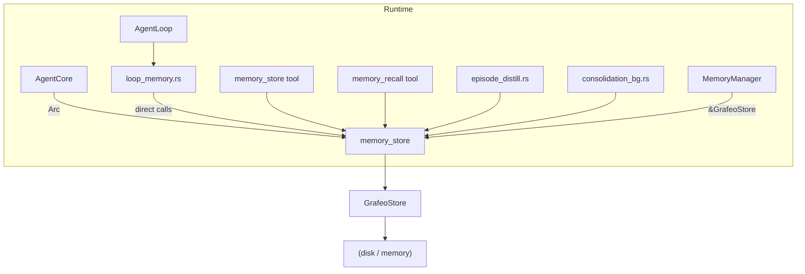

# ADR-051: Runtime Memory Provider Decoupling — the Runtime Only Cares About the Provider and Does Not Access Grafeo Directly

> **Chinese source of truth**: [ADR-051](../zh/ADR-051-runtime-memory-provider-decoupling.md)
> **Terminology**: see [GLOSSARY.md](./GLOSSARY.md)

**Status**: Settled
**Date**: 2026-08-04
**Decision Makers**: 大鱼

**Related**:
- [ADR-014](./ADR-014-loop-module-decomposition.md) (Loop module decomposition)
- [ADR-020](./ADR-020-data-flow-tiering.md) (data flow tiering)
- [ADR-021](./ADR-021-unified-session-data-loading.md) (unified session data loading)
- [ADR-032](./ADR-032-context-recall.md) (context recall)

---

## 1. Decision Summary

The four entry points in `acowork-runtime` — the agent loop, the memory tools, episode distillation, and background consolidation — all **depend directly on `acowork-grafeo::GrafeoStore`**. This causes:

1. **Storage engine coupled to business logic**: any single memory read/write in the Runtime must know Grafeo's API, types and index behaviour.
2. **The storage engine cannot be replaced**: swapping Grafeo for a remote memory service, Sled, LMDB or a newer storage engine would require changing dozens of call sites in the Runtime.
3. **Testing is hard**: the loop's unit tests must construct or mock a `GrafeoStore`; a lightweight `MemoryProvider` mock cannot substitute.
4. **Type leakage**: `acowork-grafeo`'s `MetricsAggregator`, `ConsolidationScheduler`, `NodeId`, `Value` and the various node types seep into `AgentCore` and `loop_memory.rs`.

This ADR decides to **promote the Memory module to a standard `MemoryProvider`**:

- `acowork-memory` defines the complete `MemoryProvider` trait (retrieval, writes, lifecycle, statistics, consolidation entry points).
- `acowork-grafeo` becomes one `MemoryProvider` implementation, remaining the default production storage.
- `acowork-runtime` **depends only on the traits and types of `acowork-memory`**; apart from constructing `GrafeoStore` during initialization, the loop, tools, distillation and consolidation all face `dyn MemoryProvider`.
- Adding a new storage engine in the future only requires implementing `MemoryProvider`, with no Runtime change.

**Delivered in four phases, the first being the most critical**:

| Phase | Goal | Breakage risk | Key actions |
|---|---|---|---|
| **P1: interface decoupling** | The Runtime accesses Grafeo through `dyn MemoryProvider` | Low | Extend the trait, change the `AgentCore.memory_store` type, make `MemoryManager` face the trait |
| **P2: orchestration layer homing** | `MemoryManager` sinks into `acowork-memory` | Medium | Move the `retrieve/inject/record` logic from runtime to the memory crate |
| **P3: loop purification** | `loop_memory.rs` only calls high-level `MemoryManager` APIs | Medium | Remove the loop's direct store calls |
| **P4: replaceable engine** | Implement a second `MemoryProvider` and verify zero Runtime changes | Low | Provide an in-memory / remote mock, remove the Runtime's direct dependency on grafeo |

---

## 2. Background and Current State

### 2.1 The current architecture: Runtime ↔ Grafeo direct coupling



### 2.2 The concrete list of coupling points

| # | File | Form of the coupling | Risk |
|---|---|---|---|
| 1 | `agent/agent_core.rs:169` | `memory_store: Option<Arc<GrafeoStore>>` | Type leaks into core state |
| 2 | `agent/agent_core.rs:187` | `metrics_aggregator: Arc<Mutex<MetricsAggregator>>` (a grafeo type) | Observability metrics bound to grafeo |
| 3 | `agent/agent_core.rs:189` | `consolidation_scheduler: Option<Arc<ConsolidationScheduler>>` (a grafeo type) | Background task scheduling bound to grafeo |
| 4 | `agent/agent_core.rs:588` | `init_memory_store()` directly calls `GrafeoStore::open()` | Storage initialization hardcoded |
| 5 | `agent/loop_memory.rs:53` | `self.core.memory_store()` returns `&Arc<GrafeoStore>` | The loop directly obtains the storage |
| 6 | `agent/loop_memory.rs:84` | `manager.retrieve(store, ...)`, where `store` is `&GrafeoStore` | MemoryManager is not abstract |
| 7 | `agent/loop_memory.rs:178` | `store.get_procedural()`, `store.update_procedural()` | Directly manipulating nodes |
| 8 | `agent/loop_memory.rs:195` | `store.should_trigger_confirmation()`, `store.generate_confirmation_hint()` | Directly calling grafeo-specific methods |
| 9 | `agent/loop_memory.rs:471` | `store.run_generalization()`, `store.compress_history_nodes()` | Consolidation details leak |
| 10 | `agent/loop_memory.rs:533` | `store.get_all_procedural_nodes()`, `store.find_autobiographical_by_key()`, `store.store_autobiographical()` | Node CRUD called directly |
| 11 | `agent/loop_memory.rs:659` | `store.db()`, `graph.nodes_by_label()` | Directly accessing the underlying graph database |
| 12 | `tools/builtin/memory_store.rs:167` | `handle.store()` returns `Arc<GrafeoStore>` | The tool depends directly on Grafeo |
| 13 | `tools/builtin/memory_recall.rs:162` | `handle.store()` returns `Arc<GrafeoStore>` | The tool depends directly on Grafeo |
| 14 | `memory/session_handle.rs:32` | `store: RwLock<Option<Arc<GrafeoStore>>>` | The handle type is hardcoded |
| 15 | `episode_distill.rs:299` | `write_summary_to_grafeo(..., &Option<Arc<GrafeoStore>>, ...)` | Distillation writes directly to grafeo |
| 16 | `memory/consolidation_bg.rs:45` | `spawn(..., Arc<GrafeoStore>, ...)` | The background task directly holds GrafeoStore |
| 17 | `memory/manager.rs:204` | `retrieve(&self, store: &GrafeoStore, ...)` | MemoryManager parameter hardcoded |
| 18 | `memory/manager.rs:635` | `record(&self, store: &GrafeoStore, ...)` | MemoryManager parameter hardcoded |
| 19 | `Cargo.toml` | `acowork-runtime` depends on `acowork-grafeo`, `grafeo-common`, `grafeo-core` | Compile-time coupling |
| 20 | `startup/session_init.rs:342` | `grafeo_store().cloned()` published to `SharedMemoryStore` (typed `Arc<RwLock<Option<Arc<GrafeoStore>>>>`) | The HTTP admin endpoints depend directly on GrafeoStore |
| 21 | `agent/session/session_task.rs:1261` | `grafeo_store.embedding_dim()` check + `store.rebuild_all_embeddings()` migration | The embedding dimension migration directly calls GrafeoStore-specific methods |
| 22 | `agent/agent_core.rs:173` | `grafeo_store: Option<Arc<GrafeoStore>>` compat field (retained by P1 C3/C4) | For #20 and #21; removed in P4 |

### 2.3 Why decoupling must happen now

- **The observability and multi-engine needs of Phase 3/4**: P3 has already accumulated six direct call paths in `loop_memory.rs` — `MetricsAggregator`, `JudgeConfig`, ambiguous confirmation, generalization, self-evaluation, relationship. Without abstracting first, every new memory-enhancement feature deepens the coupling.
- **Testing cost**: of the 700+ unit tests in `acowork-runtime`, any test involving memory must construct a GrafeoStore; after decoupling an `InMemoryProvider` can substitute.
- **Deployment flexibility**: a "remote memory service" may appear in the future (multiple agents sharing memory, a large vector database); the Runtime must be unaware of backend differences.

---

## 3. Target Architecture

```mermaid
graph TD
    subgraph Runtime
        A["AgentCore"] -->|"Arc<dyn MemoryProvider>"| B["memory_provider"]
        A -->|"Arc<dyn RagProvider>"| R["rag_provider"]
        C["AgentLoop"] --> D["loop_memory.rs"]
        D -->|"calls"| E["MemoryManager"]
        E -->|"&dyn MemoryProvider"| B
        D -->|"dual-channel merge"| R
        F["memory_store tool"] --> E
        G["memory_recall tool"] --> E
        H["episode_distill.rs"] --> E
        I["consolidation_bg.rs"] -->|"trait methods"| B
        Q["rag_query tool"] --> R
    B --> J["GrafeoProvider"]
    J --> K["GrafeoStore"]
    K --> L["(disk / memory)"]
    B -.-> M["RemoteProvider"]
    B -.-> N["InMemoryProvider"]
    R --> O["HttpRagProvider"]
    O --> P["enterprise RAG service"]
    R -.-> S["LocalRagProvider"]
```

### 3.1 Core principles

1. **Abstract the data first**: define the `MemoryProvider` trait first, then abstract the business logic.
2. **The trait is the contract**: all memory operations in the Runtime must go through the trait; calling `GrafeoStore`-specific methods directly is forbidden.
3. **The orchestration layer sinks down**: `MemoryManager` is "how memory is used" (the retrieve → inject → record orchestration) and belongs to `acowork-memory`; `GrafeoStore` is "how it is stored".
4. **Safe migration**: do not delete existing APIs; first add the abstraction layer, migrate call sites step by step, and only consider removing the old dependency at the end.
---

## 4. Detailed Design

### 4.1 Phase 1: interface decoupling (the most critical, safe and non-breaking)

The goal of Phase 1 is to change the Runtime's direct dependency on `GrafeoStore` into a dependency on `dyn MemoryProvider` **without changing any behaviour**. All existing Grafeo-specific methods are exposed through the extended trait.

#### 4.1.1 Types migrated to `acowork-memory`

The following types are currently defined in `acowork-grafeo`, but the `MemoryProvider` trait needs to reference them. Following the goal "the Runtime does not depend on grafeo directly", **all of them are migrated to `acowork-memory`**, while `acowork-grafeo` keeps its internal conversions:

| Type | Current location | Migration target |
|---|---|---|
| `MemoryStoreInput` | `acowork-grafeo::consolidation::instant` | `acowork_memory::MemoryStoreInput` |
| `ProcessResult` (`MemoryStoreResult`) | `acowork-grafeo::consolidation::instant` | `acowork_memory::MemoryStoreResult` |
| `GeneralizationConfig` | `acowork-grafeo::consolidation::generalization` | `acowork_memory::GeneralizationConfig` |
| `GeneralizationResult` | same as above | `acowork_memory::GeneralizationResult` |
| `OfflineConsolidationConfig` | `acowork-grafeo::consolidation::offline` | `acowork_memory::OfflineConsolidationConfig` |
| `OfflineConsolidationResult` | same as above | `acowork_memory::OfflineConsolidationResult` |
| `SchedulerConfig` | `acowork-grafeo::consolidation::scheduler` | `acowork_memory::SchedulerConfig` |
| `TripleExtractorLlm` trait | `acowork-grafeo::consolidation::triple_extraction` | `acowork_memory::TripleExtractorLlm` |
| `LlmMessage` / `LlmResponse` | same as above | `acowork_memory::LlmMessage` / `LlmResponse` |

`acowork-grafeo` keeps `pub use` re-exports of these types so its internal code keeps compiling; the corresponding struct/trait definitions in `acowork-grafeo` become re-exports of the `acowork_memory` versions, eliminating duplicate definitions.

#### 4.1.2 The `MemoryProvider` trait definition

Extend the existing `MemoryStore` trait (16 methods) into a complete `MemoryProvider` covering all operations the Runtime actually uses. **Option A** is adopted: rename `MemoryStore` → `MemoryProvider`, keeping a `pub use MemoryProvider as MemoryStore` alias for compatibility.

Async methods use the **`#[async_trait]`** macro (consistent with the existing `TripleExtractorLlm` in `acowork-grafeo`; `dyn MemoryProvider` needs a desugared trait object, and a native RPITIT `async fn` does not support dyn dispatch).

```rust
// acowork-memory/src/provider.rs (new file)
use std::sync::Arc;
use std::time::Duration;
use async_trait::async_trait;
use acowork_core::error::Result;

use crate::types::*;
use crate::consolidation::{
    GeneralizationConfig, GeneralizationResult,
    OfflineConsolidationConfig, OfflineConsolidationResult,
    SchedulerConfig, MemoryStoreInput, MemoryStoreResult,
    TripleExtractorLlm,
};

#[async_trait]
pub trait MemoryProvider: Send + Sync {
    // ── the original MemoryStore methods are retained ──
    fn store_episode(&self, episode: &Episode) -> Result<()>;
    fn search_episodes(&self, query: &MemoryQuery) -> Result<Vec<SearchResult>>;
    fn mark_consolidated(&self, ids: &[u64]) -> Result<()>;
    fn cleanup_episodes(&self, older_than: Duration) -> Result<u64>;
    fn get_episodes(&self, session_id: Option<&str>, limit: usize) -> Result<Vec<Episode>>;
    fn store_knowledge(&self, node: &KnowledgeNode) -> Result<()>;
    fn store_procedural(&self, node: &ProceduralNode) -> Result<()>;
    fn store_autobiographical(&self, node: &AutobiographicalNode) -> Result<()>;
    fn hybrid_search(&self, query: &MemoryQuery) -> Result<Vec<SearchResult>>;
    fn graph_expand(&self, seeds: &[SearchResult], hops: u8) -> Result<Vec<SearchResult>>;
    fn run_decay_scan(&self, config: &DecayConfig) -> Result<DecayScanResult>;
    fn reactivate_node(&self, node_id: u64) -> Result<()>;
    fn purge_expired(&self, max_dormant_age: Duration) -> Result<PurgeResult>;
    fn health_check(&self) -> Result<StoreHealth>;
    fn stats(&self) -> Result<StoreStats>;
    fn close(&self) -> Result<()>;

    // ── new in Phase 1: hybrid retrieval ──

    /// Run hybrid retrieval (vector + full text), returning a list of (node_id, score).
    fn hybrid_search_full(
        &self,
        label: &str,
        query_text: &str,
        embedding: &[f32],
        k: usize,
        text_weight: f64,
        vector_weight: f64,
        min_score: Option<f32>,
    ) -> Result<Vec<(u64, f64)>>;

    /// Pure text retrieval.
    fn text_search_with_filter(
        &self,
        label: &str,
        field: &str,
        query_text: &str,
        k: usize,
        min_score: Option<f32>,
    ) -> Result<Vec<(u64, f64)>>;

    // ── new in Phase 1: the memory_store tool entry point ──

    /// content -> conflict detection / dedup -> node creation.
    fn process_memory_store(&self, input: &MemoryStoreInput) -> Result<Option<MemoryStoreResult>>;

    // ── new in Phase 1: fuzzy conflict confirmation ──

    fn should_trigger_confirmation(&self) -> Result<bool>;
    fn generate_confirmation_hint(&self) -> Result<Option<String>>;

    // ── new in Phase 1: experience generalization (Path C) ──

    async fn run_generalization(
        &self,
        session_id: Option<&str>,
        embedding_fn: &Arc<dyn Fn(&str) -> Vec<f32> + Send + Sync>,
        config: &GeneralizationConfig,
    ) -> Result<GeneralizationResult>;

    fn compress_history_nodes(&self, keep_recent: usize) -> Result<usize>;

    // ── new in Phase 1: node CRUD ──

    fn get_all_procedural_nodes(&self) -> Result<Vec<ProceduralNode>>;
    fn find_procedural_by_trigger(&self, trigger: &str, limit: usize) -> Result<Vec<ProceduralNode>>;
    fn get_procedural(&self, node_id: u64) -> Result<Option<ProceduralNode>>;
    fn update_procedural(&self, node: &ProceduralNode) -> Result<()>;
    fn find_autobiographical_by_key(&self, key: &str) -> Result<Option<AutobiographicalNode>>;
    fn find_autobiographical_by_category(&self, category: AutobioCategory) -> Result<Vec<AutobiographicalNode>>;
    fn update_autobiographical(&self, node: &AutobiographicalNode) -> Result<()>;
    fn create_memory_edge(&self, from: u64, to: u64, edge_type: &str, properties: Vec<(&str, String)>) -> Result<()>;

    // ── new in Phase 1: consolidation background task ──
    // ConsolidationScheduler currently holds GrafeoStore directly;
    // the scheduling policy is a storage implementation detail, and the merge
    // policies of different engines may be completely different.
    // Therefore the consolidation control sinks entirely inside the Provider.

    /// Start background consolidation (scheduling is managed inside the Provider).
    /// The config is passed in by the Runtime, but the execution details are the Provider's decision.
    fn start_consolidation(&self, config: &SchedulerConfig) -> Result<()>;

    /// Stop background consolidation.
    fn stop_consolidation(&self);

    /// Notify the Provider that the agent is active, resetting the idle timer.
    async fn notify_consolidation_active(&self);

    /// Get the number of nodes pending consolidation (for scheduling decisions).
    fn get_pending_consolidation_count(&self) -> Result<usize>;

    /// Run one offline consolidation pass.
    async fn run_offline_consolidation(
        &self,
        offline_config: &OfflineConsolidationConfig,
        llm: Option<&dyn TripleExtractorLlm>,
        embedding_fn: Option<Arc<dyn Fn(&str) -> Vec<f32> + Send + Sync>>,
        gen_config: Option<&GeneralizationConfig>,
    ) -> Result<OfflineConsolidationResult>;
}
```

> **Compatibility handling**: `acowork-memory/src/lib.rs` keeps `pub use provider::MemoryProvider as MemoryStore;`; the existing `impl MemoryStore for GrafeoStore` in `acowork-grafeo` becomes `impl MemoryProvider for GrafeoStore` in C2 (the two are equivalent thanks to the alias).

#### 4.1.3 `acowork-grafeo` implements `MemoryProvider`

- In `acowork-grafeo/src/grafeo.rs`, extend the existing `impl MemoryStore for GrafeoStore` into `impl MemoryProvider for GrafeoStore`; the new methods delegate directly to the existing `GrafeoStore::pub fn`s.
- The type conversions happen inside the implementation; `grafeo_common::NodeId`, `Value` and similar types are not exposed to the Runtime.
- `ConsolidationScheduler` becomes an internal field of `GrafeoStore` (or is created internally by `start_consolidation`), no longer exposed to the Runtime.
- The types migrated out of `acowork-grafeo` keep `pub use acowork_memory::{GeneralizationConfig, ...}` re-exports, so the crate keeps compiling internally.

#### 4.1.4 The Runtime-side changes

**A. `AgentCore` holds `dyn MemoryProvider`, and the grafeo types are removed**

```rust
// agent/agent_core.rs
pub struct AgentCore {
    // ...
    /// Memory provider (Grafeo implementation by default).
    pub(crate) memory_provider: Option<Arc<dyn MemoryProvider>>,
    // ...
    // ── the following fields are removed or replaced in P1 ──
    // metrics_aggregator: the grafeo type is removed and replaced with a Runtime-internal
    //   RetrievalMetricsAggregator (the data source is the acowork_memory::RetrievalMetrics
    //   returned by MemoryProvider, no longer depending on grafeo::OnlineRetrievalMetrics)
    pub(crate) metrics_aggregator: Arc<std::sync::Mutex<RetrievalMetricsAggregator>>,
    // consolidation_scheduler: removed, consolidation control sinks into the Provider
    // consolidation_bg_task: removed, managed inside the Provider
}
```

- `init_memory_store(work_dir)` is renamed to `init_memory_provider(work_dir)`; internally it still calls `GrafeoStore::open()`, but returns `Arc<dyn MemoryProvider>`.
- The `memory_store()` accessor is kept as a compatibility layer, returning `Option<&Arc<dyn MemoryProvider>>`.
- `start_consolidation_pipeline()` now calls `provider.start_consolidation(&SchedulerConfig::default())`.
- `notify_consolidation_active()` now calls `provider.notify_consolidation_active().await`.

> **Items retained by P1 (removed in P4)**: `AgentCore` additionally keeps a `grafeo_store: Option<Arc<GrafeoStore>>` compat field, serving the following two **coupling points not covered by P1** (see §2.2 #20, #21):
> 1. **HTTP admin endpoints**: `session_init.rs` publishes the `GrafeoStore` to `SharedMemoryStore` for the HTTP endpoints `/memory/nodes`, `/memory/stats`, `/memory/consolidate` and others to access directly. These endpoints use GrafeoStore-specific `db()`, `graph_store()` methods, which cannot be replaced by the `MemoryProvider` trait.
> 2. **Embedding dimension migration**: `session_task.rs` calls `store.embedding_dim()` and `store.rebuild_all_embeddings()` to check and execute embedding dimension changes; these are GrafeoStore-specific methods.
>
> The decoupling of these two belongs to **P4 (§4.4)**; only after they are abstracted as an HTTP admin trait and a `MemoryProvider::embedding_dim()` trait method can the `grafeo_store` compat field and `acowork-runtime`'s direct dependency on `acowork-grafeo` be removed.

**B. `RetrievalMetricsAggregator` (a new Runtime-internal type)**

```rust
// runtime/src/memory/metrics.rs (new file)
/// A Runtime-internal retrieval quality metrics aggregator.
/// The data source is the acowork_memory::RetrievalMetrics returned by MemoryProvider.
/// It no longer depends on acowork_grafeo::retrieval_metrics::MetricsAggregator.
pub struct RetrievalMetricsAggregator { /* ... */ }
```

- Keep the existing NRR / abstention / degradation alerting logic.
- Remove the `acowork_memory::HintType` -> `acowork_grafeo::retrieval_metrics::HintType` conversion code (`loop_memory.rs:106-119`).

**C. `MemoryManager` faces the trait**

```rust
// memory/manager.rs
impl MemoryManager {
    pub async fn retrieve(
        &self,
        provider: &dyn MemoryProvider,
        query: &mut MemoryQuery,
        embedding_provider: Option<&dyn EmbeddingProvider>,
    ) -> Result<RetrievalResult> { ... }

    pub fn record(
        &self,
        provider: &dyn MemoryProvider,
        record: &ConversationRecord,
    ) -> Result<()> { ... }

    pub fn record_procedural_from_failure(
        &self,
        provider: &dyn MemoryProvider,
        tool_name: &str,
        error_message: &str,
    ) -> Result<()> { ... }

    pub async fn record_distilled(
        &self,
        provider: &dyn MemoryProvider,
        episode: &DistilledEpisode,
        embedding_provider: Option<&dyn EmbeddingProvider>,
    ) -> Result<()> { ... }
}
```

**D. `MemorySessionHandle` type generalized**

```rust
// memory/session_handle.rs
pub struct MemorySessionHandle {
    provider: RwLock<Option<Arc<dyn MemoryProvider>>>,
    current_session_id: RwLock<Option<String>>,
    embedding_provider: Option<Arc<dyn EmbeddingProvider>>,
}
```

**E. `loop_memory.rs` calls through the trait**

All `store` variables change type from `&GrafeoStore` to `&dyn MemoryProvider`; the method names stay the same (because the trait method names match the GrafeoStore method names).

**F. `episode_distill.rs` changed**

```rust
pub async fn write_summary_to_provider(
    summary_text: &str,
    session_id: &str,
    provider: &Option<Arc<dyn MemoryProvider>>,
    embedding_provider: Option<&dyn EmbeddingProvider>,
)
```

Keep `write_summary_to_grafeo` as a deprecated wrapper function that calls the new function internally.

**G. `consolidation_bg.rs` simplified**

`ConsolidationBgTask` no longer accepts `Arc<GrafeoStore>`, but `Arc<dyn MemoryProvider>`. All calls to `store.run_offline_consolidation_with_generalization()` become `provider.run_offline_consolidation()`. The scheduling logic stays in the Runtime (polling `should_run`), but the execution is delegated through the trait.

> A later P3 can further sink the polling logic into the Provider as well.


**H. RAG gets its own trait-ization (design change: tool-based RAG)**

`RagClient` is renamed to `HttpRagProvider`, implementing the `acowork_core::rag::RagProvider` trait. `AgentCore` gains a `rag_provider: Option<Arc<dyn RagProvider>>` field.

- Remove `MemoryManager::with_rag` / the `rag_client` field / the `has_rag()` method.
- ~~The dual-channel merge logic in `loop_memory.rs` becomes: first call `MemoryManager::retrieve(provider, ...)` to get local memory, then call `self.core.rag_provider.query(...)` to get enterprise knowledge, merging by score.~~
  **Design change (2026-08-06)**: RAG is no longer automatic pre-retrieval merge, but becomes the **LLM calling the `rag_query` tool on demand**. Reasons: (1) token efficiency — query RAG only when the LLM judges it necessary; (2) latency — no extra network round trip every round; (3) query quality — the LLM can construct precise queries from the full context; (4) consistent with the orthogonal design of RAG as a standalone `RagProvider` trait. The RAG channel code in `MemoryManager::retrieve()` has been removed, and the `rag_query` tool is registered in `agent_init.rs` conditionally on the manifest's RAG declaration.
- `RagQueryTool` holds `Arc<dyn RagProvider>` rather than `Arc<RagClient>`.
- The RAG protocol types (`RagQueryRequest`, `RagQueryResponse`, `RagResultItem`, `AnnotatedRagResult`) migrate from `acowork-runtime/src/tools/rag/types.rs` to `acowork-core/src/rag.rs`.

### 4.2 Phase 2: the orchestration layer finds its home

Move `MemoryManager` (along with `ConversationRecord`, `RetrievalResult`, `InjectedMemory`, `RetrievedMemory`) from `acowork-runtime/src/memory/manager.rs` to `acowork-memory/src/manager.rs`.

- Handling `MemoryManager`'s dependencies:
  - `EmbeddingProvider`: currently defined in `acowork-runtime`. Phase 2 migrates its trait definition to `acowork-core` (or `acowork-memory`) so that `MemoryManager` does not depend on the runtime.
  - **RAG**: **RAG is not part of the `MemoryProvider` trait but a standalone `RagProvider` trait**, orthogonal and at the same level as `MemoryProvider` (see §5.1). Remove `MemoryManager::with_rag`. `MemoryManager` stays pure, orchestrating only the "local memory" retrieve → inject → record lifecycle. The Runtime performs the dual-channel merge in `loop_memory.rs`: first call `MemoryManager::retrieve()` for local memory, then `RagProvider::query()` for enterprise knowledge, merging by score.
  - `RuntimeError::Tool`: changed to return `acowork_core::error::AcoworkError::Memory`.

### 4.3 Phase 3: loop purification

- All **direct CRUD** against the provider in `loop_memory.rs` (`get_procedural`, `update_procedural`, `store_autobiographical`, etc.) converges into high-level `MemoryManager` methods.
- Introduce explicit semantic methods:
  - `MemoryManager::retrieve_and_inject(...)`
  - `MemoryManager::record_turn(...)`
  - `MemoryManager::record_tool_failures(...)`
  - `MemoryManager::run_post_compaction_tasks(...)` (generalization + self-eval + relationship)
- `loop_memory.rs` is only responsible for "when to call" and "putting the results into the ContextBuilder"; it does not know the node types.

### 4.4 Phase 4: replaceable engine

- Implement an `InMemoryProvider` (based on a HashMap + simple vector similarity), used only for testing and to validate the architecture.
- Implement a `RemoteMemoryProvider` (accessing a remote memory service via HTTP/gRPC), proving that the Runtime need not depend on Grafeo.
- Once `InMemoryProvider` can run the Runtime's memory-related integration tests, the dependencies of `acowork-runtime` on `acowork-grafeo`, `grafeo-common` and `grafeo-core` can be removed, moving them to dev-dependencies or behind a feature gate.

#### 4.4.1 P4 prerequisites (the P1 leftovers)

The following two items are retained as direct `GrafeoStore` dependencies in P1; **the `grafeo_store` compat field and the grafeo crate dependency can only be removed after they are decoupled in P4**:

| # | Coupling point | Current state | P4 decoupling plan |
|---|---|---|---|
| 1 | **HTTP admin endpoints** (§2.2 #20) | `SharedMemoryStore` is typed `Arc<RwLock<Option<Arc<GrafeoStore>>>>`; endpoints such as `/memory/nodes`, `/memory/stats`, `/memory/consolidate` directly call `GrafeoStore::db()`, `graph_store()` and similar | Define a `MemoryAdminService` trait (or extend `MemoryProvider`) containing `list_nodes()`, `get_node_detail()`, `get_stats_detail()`, `run_consolidation_manual()` and other management methods. `SharedMemoryStore` changes to `Arc<RwLock<Option<Arc<dyn MemoryAdminService>>>>` |
| 2 | **Embedding dimension migration** (§2.2 #21) | `session_task.rs` calls `store.embedding_dim()` to check the dimension and `store.rebuild_all_embeddings()` to perform the migration | Add `embedding_dim() -> usize` and `rebuild_embeddings(new_dim: usize)` methods to the `MemoryProvider` trait (or a standalone `EmbeddingMigrationService` trait) |
| 3 | **The `AgentCore.grafeo_store` field** (§2.2 #22) | The compat field retained by P1 C3/C4, used only by #1 and #2 | Once #1 and #2 are done, remove the field, the `grafeo_store()` accessor, and the hardcoded `GrafeoStore::open()` in `init_memory_provider()` (replaced by a configurable provider factory) |

> **Sign that P4 is complete**: `acowork-grafeo` moves from `[dependencies]` to `[dev-dependencies]` in `acowork-runtime/Cargo.toml` (used only for constructing test data with `GrafeoStore`).

---

## 5. Architectural Decision Records

This section records the 5 key architectural choices made while settling this ADR, each guided by the principle "high cohesion, low coupling + a replaceable memory module".

### 5.1 RAG becomes a standalone RagProvider trait, orthogonal and at the same level as MemoryProvider

**Decision**: RAG does not go into the `MemoryProvider` trait; a standalone `RagProvider` trait is defined instead. The two are at the same level and orthogonal; the Runtime holds `Arc<dyn MemoryProvider>` and `Option<Arc<dyn RagProvider>>` separately, and performs the dual-channel merge in `loop_memory.rs`.

**Reasons**:
- **Orthogonal concerns**: `MemoryProvider`'s responsibility is "storage + retrieval + lifecycle + consolidation" (user preferences / conversation history / behaviour patterns); RAG's responsibility is "external knowledge retrieval" (enterprise document stores / product manuals / internal knowledge). Their data sources, lifecycles and write paths are entirely different.
- **Symmetric replaceability**: the memory backend is replaceable (Grafeo / Sled / a remote service), and so is the RAG backend (a remote HTTP service / a local vector store / a MemoryProvider extension). Both need trait abstraction to achieve "the Runtime is unaware of the backend".
- **Avoiding trait bloat**: stuffing RAG into `MemoryProvider` forces implementers to provide a `query_rag()` method — but many storage engines have no RAG capability at all and could only return empty results or panic.
- **The current RagClient is already quasi-trait-shaped**: `RagClient` has only two async methods, `query()` and `query_with_params()`, taking `query_text + params` and returning `Vec<AnnotatedRagResult>`. The cost of extracting a trait is minimal.

**The RagProvider trait definition** (placed in `acowork-core`, at the same level as the `Provider` trait):

```rust
// acowork-core/src/rag.rs (new file)
use async_trait::async_trait;

/// RAG provider trait - standardized interface for enterprise knowledge retrieval.
///
/// Implementations: HttpRagProvider (current RagClient), LocalRagProvider,
/// or any enterprise RAG service adapter.
#[async_trait]
pub trait RagProvider: Send + Sync {
    /// Query the RAG service with default parameters.
    /// Returns empty vec on timeout/error (graceful degradation).
    async fn query(&self, query_text: &str) -> Vec<AnnotatedRagResult>;

    /// Query with custom parameters (top_k, score_threshold, filters).
    async fn query_with_params(
        &self,
        query_text: &str,
        top_k: Option<u32>,
        score_threshold: Option<f32>,
        filters: Option<serde_json::Value>,
    ) -> Vec<AnnotatedRagResult>;

    /// Provider name (for source annotation, e.g. "RAG:enterprise_knowledge").
    fn name(&self) -> &str;
}
```

The RAG protocol types (`RagQueryRequest`, `RagQueryResponse`, `RagResultItem`, `AnnotatedRagResult`) migrate from `acowork-runtime/src/tools/rag/types.rs` to `acowork-core/src/rag.rs`.

**Implementation**:
- `acowork-core` gains a `rag` module defining the `RagProvider` trait + the protocol types.
- The existing `RagClient` is renamed to `HttpRagProvider`, implements the `RagProvider` trait, and stays in `acowork-runtime`.
- `AgentCore` gains a `rag_provider: Option<Arc<dyn RagProvider>>` field.
- Remove `MemoryManager::with_rag` and the `rag_client` field.
- `RagQueryTool` holds `Arc<dyn RagProvider>` rather than `Arc<RagClient>`.
- The dual-channel merge logic in `loop_memory.rs` ~~: first call `MemoryManager::retrieve()`, then `rag_provider.query()`, merging by score~~. **Design change**: switched to the LLM calling the `rag_query` tool on demand (see the change note in §4.1.4 H). `agent_init.rs` registers `RagQueryTool` when the manifest declares RAG, and sets `AgentCore.rag_provider` at the same time.
- `MemorySessionHandle` may optionally hold a `rag_provider` reference for the `memory_recall` tool (or the Runtime injects it when constructing the tool).

### 5.2 MetricsAggregator stays in the Runtime, with the data source coming from the Provider's return value

**Decision**: `MetricsAggregator` does not go into the `MemoryProvider` trait. The Runtime creates a new `RetrievalMetricsAggregator`, whose data source is the `acowork_memory::RetrievalMetrics` returned by `MemoryProvider::retrieve()`.

**Reasons**:
- Metrics aggregation is an "observability layer" concern, not a "storage layer" concern. Different engines return metrics at different granularities, but the Runtime only needs a unified `RetrievalMetrics` (result_count / avg_score / max_score / abstention_triggered / retrieval_level, etc.).
- The current `acowork_memory::HintType` -> `acowork_grafeo::retrieval_metrics::HintType` conversion (`loop_memory.rs:106-119`) is itself a symptom of coupling, and it is eliminated after decoupling.

**Implementation**: In P1, create `RetrievalMetricsAggregator` in `runtime/src/memory/metrics.rs`, keeping the NRR / abstention / degradation alerting logic. Remove `AgentCore`'s dependency on `acowork_grafeo::retrieval_metrics::MetricsAggregator`.

### 5.3 ConsolidationScheduler sinks entirely into the Provider

**Decision**: `ConsolidationScheduler` and the consolidation execution logic sink entirely inside `MemoryProvider`. The Runtime controls them only through `start_consolidation()` / `stop_consolidation()` / `notify_consolidation_active()`.

**Reasons**:
- `ConsolidationScheduler` currently holds `Arc<Mutex<GrafeoStore>>` directly (`scheduler.rs:112`), so the scheduling policy is strongly bound to the storage implementation.
- The consolidation strategies of different storage engines may be completely different: a graph database goes through triple extraction + conflict resolution; a vector database goes through re-indexing; a remote service may need no local scheduling at all.
- Putting scheduling in the Runtime means the Runtime must know "when it is time to merge" — that is internal knowledge of the storage engine.

**Implementation**:
- The `MemoryProvider` trait gains `start_consolidation(config)` / `stop_consolidation()` / `notify_consolidation_active()` / `get_pending_consolidation_count()` / `run_offline_consolidation()`.
- `AgentCore` removes the `consolidation_scheduler` and `consolidation_bg_task` fields.
- The `impl MemoryProvider for GrafeoStore` holds the scheduler + the bg task internally, starting them in `start_consolidation`.
- P1 keeps the poll loop in `consolidation_bg.rs` as a fallback (delegating through the trait methods); P3 then considers full internalization.

### 5.4 Async traits use `#[async_trait]`

**Decision**: The `MemoryProvider` trait uses the `#[async_trait]` macro.

**Reasons**:
- `MemoryProvider` needs async methods such as `run_generalization`, `run_offline_consolidation` and `notify_consolidation_active`.
- The Runtime uses the trait object `dyn MemoryProvider`; a native RPITIT `async fn in trait` does not support dyn dispatch.
- `acowork-grafeo` already uses `#[async_trait]` in `TripleExtractorLlm`, so the project has the dependency and the convention.
- Rust MSRV 1.95 supports RPITIT, but a dyn-safe async trait still requires `async-trait`.

**Implementation**: Add the `async-trait` dependency to the `Cargo.toml` of `acowork-memory` and `acowork-core`. Both the `MemoryProvider` and `RagProvider` trait definitions carry the `#[async_trait]` annotation.

### 5.5 Types migrate to `acowork-memory`, with grafeo re-exporting

**Decision**: **All** input/output types referenced by the `MemoryProvider` trait methods **migrate to `acowork-memory`**. `acowork-grafeo` keeps `pub use` re-exports for internal compatibility.

**Reasons**:
- Wrapping types only inside `acowork-memory` would lead to two parallel type systems (the raw grafeo types + the memory wrapper types), requiring the implementation layer to convert back and forth, increasing complexity and the bug surface.
- Migrating directly to `acowork-memory` follows the "abstract the data first" principle: the abstraction layer owns the type definitions, and the implementation layer does the conversions.
- `acowork-grafeo` already depends on `acowork-memory` (`Cargo.toml:12`), so the migration direction is correct.

**Implementation**: completed in P1 C1 (see the type migration table in §4.1.1). The corresponding definitions in `acowork-grafeo` become `pub use acowork_memory::{GeneralizationConfig, ...}`.
---

## 6. Phase-1 Deliverables and Commit Splitting

To guarantee "safe and non-breaking", Phase 1 is split into 5 independently reviewable commits:

| Commit | Scope | How to verify |
|---|---|---|
| C1 | Add the `MemoryProvider` trait in `acowork-memory` (`#[async_trait]`), migrate all input/output types (`MemoryStoreInput`, `GeneralizationConfig`, `TripleExtractorLlm`, etc.); add the `RagProvider` trait + the RAG protocol types in `acowork-core` (`RagQueryRequest`, `AnnotatedRagResult`, etc.); `acowork-grafeo` re-exports the migrated types | `cargo check -p acowork-core -p acowork-memory -p acowork-grafeo` |
| C2 | Implement `impl MemoryProvider for GrafeoStore` in `acowork-grafeo` (extending the original `MemoryStore` impl), internalizing consolidation control into GrafeoStore | `cargo test -p acowork-grafeo` |
| C3 | `acowork-runtime`: `AgentCore.memory_store` becomes `Option<Arc<dyn MemoryProvider>>`, adding `rag_provider: Option<Arc<dyn RagProvider>>`; remove the `consolidation_scheduler` / `consolidation_bg_task` fields; create `RetrievalMetricsAggregator` to replace the grafeo version; generalize `MemorySessionHandle`; rename `RagClient` to `HttpRagProvider` and impl `RagProvider`; `init_memory_store` returns a trait object | `cargo check -p acowork-runtime` |
| C4 | `acowork-runtime`: the `MemoryManager` method signatures become `&dyn MemoryProvider`, removing `with_rag` / `rag_client`; the dual-channel merge in `loop_memory.rs` becomes `MemoryManager::retrieve()` + `rag_provider.query()`; `episode_distill.rs`, `consolidation_bg.rs` and the `memory_store` / `memory_recall` / `rag_query` tools call through the trait; remove the HintType conversion code | `cargo test -p acowork-runtime` |
| C5 | Add an `InMemoryProvider` (for testing), replacing GrafeoStore in some Runtime memory unit tests; add a `MockRagProvider` to prove the RAG channel is replaceable | The new/migrated tests pass |
---

## 7. Scope of Impact

| Module | Impact | Explanation |
|---|---|---|
| `acowork-memory` | Large | Trait extension, type migration, new `async-trait` dependency |
| `acowork-grafeo` | Medium | New trait implementation, type re-exports, internalized consolidation |
| `acowork-runtime` | Large | Dozens of call sites change from concrete types to trait objects, removing 3 grafeo-typed fields |
| `acowork-gateway` | None | The Gateway does not access memory directly |
| Desktop App | None | It interacts with the Runtime only via HTTP/MQTT |
| Existing data files | None | Grafeo remains the only implementation; the on-disk layout is unchanged |
---

## 8. Test Strategy

1. **Compile-time safety**: run `cargo check` / `cargo clippy --all-targets -- -D warnings` after every commit.
2. **Grafeo unit tests**: `cargo test -p acowork-grafeo` must all pass, ensuring the trait implementation behaves consistently.
3. **Runtime unit tests**: `cargo test -p acowork-runtime` must all pass.
4. **Integration tests**: the MQTT/session integration tests in `./dev/ci.sh all` must all pass.
5. **Mock verification**: Phase 1 C5 migrates at least one unit test each of the `memory_recall` and `memory_store` tools to `InMemoryProvider`, proving the Runtime can work without GrafeoStore.
6. **Regression tests**:
   - Start an existing agent and verify historical memory is still retrievable.
   - Run one full conversation, verifying that the episode record, the tool failure record and the compaction path all work normally.

---

## 9. Migration Path

### 9.1 The guarantee of not breaking existing behaviour

- Phase 1 deletes no `pub fn` of `GrafeoStore`.
- `AgentCore` keeps the `memory_store()` accessor as a compatibility layer, returning `Option<&Arc<dyn MemoryProvider>>`.
- `write_summary_to_grafeo` is kept as a wrapper function.
- The `MemoryStore` trait is kept as a type alias of `MemoryProvider`.
- The types migrated out of `acowork-grafeo` keep `pub use` re-exports.

### 9.2 A suggested timeline

- **Week 1**: C1 + C2 (the interface + the type migration + the Grafeo implementation).
- **Week 2**: C3 + C4 (migration of the Runtime's core paths).
- **Week 3**: C5 + regression tests + a Phase 2 design review.
- **Week 4+**: Phases 2/3/4 proceed as independent ADRs.

### 9.3 The rollback strategy

Every commit is self-contained:
- If C3/C4 introduces a behavioural regression, roll back to C2; at that point the Runtime still uses the old API, and although the Grafeo side already has the trait implementation it does not affect the old call sites.
- If the trait design has flaws, you can pause after C1 and not enter C2.

---

## 10. Conclusion

This ADR decides, through a four-phase refactor, to change memory access in `acowork-runtime` from "operating `GrafeoStore` directly" to "facing the `MemoryProvider` trait". **The first phase (interface decoupling) is the safe, non-breaking key**: without changing behaviour, deleting APIs or migrating data, first converge all call sites onto the trait object.

Five architectural decisions ensure the decoupling goes in the right direction:
- RAG gets its own trait (orthogonal to MemoryProvider at the same level, both channels replaceable)
- MetricsAggregator stays in the Runtime (separating the observability layer from the storage layer)
- Consolidation sinks into the Provider (scheduling is internal storage knowledge)
- `#[async_trait]` preserves dyn dispatch
- Types migrate to `acowork-memory` (the abstraction layer owns the types)

After Phase 1 is complete, the Runtime will depend only on the abstract interface of `acowork-memory`, Grafeo becomes one replaceable implementation, and the architecture lays the groundwork for multiple storage engines, a remote memory service and lighter-weight tests.
