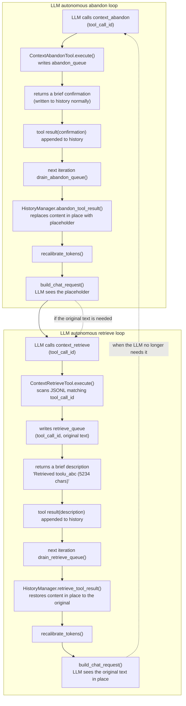

# ADR-052: Autonomous LLM Tool Compression — `context_retrieve` + `context_abandon` Replace Hardcoded Triggers

**Status**: Decided, **partially superseded**
**Date**: 2026-08-10
**Deciders**: 大鱼
**Prerequisites**:
- [ADR-032](./ADR-032-context-recall.md) (Context ID-Based Compression — placeholders + on-demand recall)
- [ADR-010](./ADR-010-context-compression-simplification.md) (Simplifying the context compression strategy)
- [ADR-011](./ADR-011-compaction-as-distillation.md) (Unified context summarization and distillation strategy)
- [ADR-014](./ADR-014-loop-module-decomposition.md) (Loop module decomposition)

---

> **Supersession note (2026-09-18)**: [ADR-061](./ADR-061-context-compression-byte-budget.md) §10 closed "LLM-autonomous tool compression"; neither of this ADR's two tools is **registered any more** (the `tool_compression_enabled` gate has been removed, see ADR-061 §11/§12). The implementation of `context_retrieve` has been **deleted outright**: it scanned **all** session files under `conversations/` (contradicting its own doc, which said it scans the current session file), and it matched purely on the `tool_call_id` string without verifying ownership — under multi_user this would inject another account's tool results into the current prompt. The source file of `context_abandon` is retained as dead code. The rest of this document is preserved as design history; **do not** use it to restore the implementation.

## 1. Decision Summary

ADR-032 established the "placeholder + on-demand recall" tool-result compression mechanism, but the **trigger** for compression was still controlled by hardcoded logic:

- **Auto mode**: the newest Assistant message exceeding `soft_threshold_chars` automatically triggers batch compression
- **Manual mode**: the user triggers batch compression via a frontend button / Gateway API
- Both modes depend on the `compress_tool_results()` batch function (threshold filtering + keep the most recent N)

This ADR moves the compression **decision authority from hardcoded rules to the LLM**:

1. **`context_recall` is renamed to `context_retrieve`**: the semantics are clearer ("retrieve" rather than "recall"), forming symmetric naming with the newly added `context_abandon`.
2. **A new `context_abandon` builtin tool is added**: the LLM proactively replaces the tool result of a given `tool_call_id` with a placeholder. What `compress_tool_results()` currently does is exactly the hardcoded batch version of this operation; it is now encapsulated as a single tool the LLM can call.
3. **The `CompressionMode` (Auto/Manual) two-tier mode is deleted**, replaced by a `tool_compression_enabled: bool` switch. On = register the two tools `context_retrieve` + `context_abandon`; off = do not register them, and the LLM can neither compress nor retrieve.
4. **All hardcoded compression trigger logic is deleted**: `compress_tool_results()`, `compress_tool_results_for_long_assistant()`, the Auto-mode event trigger, and the `CompressToolResults` branch in the Manual-mode compress action channel.
5. **`context_retrieve`'s transient mechanism is cancelled, replaced by in-place restoration**: the retrieved original text is restored to the placeholder's original position (rather than appended to the end of history) in the next iteration via `retrieve_queue`, keeping the conversation flow continuous. The retrieve tool's own result carries only a brief description (~60 chars). ADR-032's transient design existed to prevent a `recall -> compress -> recall` infinite loop, but ADR-052 has deleted automatic compression triggering, so the premise of the loop no longer exists.
6. **Default on**: every Agent automatically gains tool compression capability; the LLM autonomously decides when to abandon / retrieve.

**The core paradigm shift**:

| Dimension | ADR-032 (current) | ADR-052 (this ADR) |
|------|-----------------|-------------------|
| Who decides to compress | Hardcoded rules (threshold + keep-N) | The LLM, autonomously |
| Compression granularity | Batch (all Tool messages over the threshold) | Single item (the LLM names the `tool_call_id`) |
| Trigger | Event-driven (Auto) / manual button (Manual) | The LLM calls the `context_abandon` tool |
| Retrieval | The LLM calls `context_recall` (transient, one turn only) | The LLM calls `context_retrieve` (renamed; restores the original text in place + writes a brief description into history) |
| Mode | `CompressionMode::Auto / Manual` | `tool_compression_enabled: bool` |
| `soft_threshold_chars` | The compression threshold controlling which results get compressed | **Deleted** — the LLM judges for itself |
| `keep_recent_n` | Keeps the most recent N uncompressed | **Deleted** — the LLM judges for itself |

---

## 2. Background and Motivation

### 2.1 The problems with ADR-032

The hardcoded trigger logic of ADR-032 went through several revisions (original 2026-07-10 → revision 2026-07-18), and the core pain point has always been that **the rules are not intelligent enough**:

1. **Auto mode's `soft_threshold_chars` is one-size-fits-all**: a 2 KB threshold is reasonable for `content_search` (routinely 10 KB+), but unreasonable for `file_read` (which may be worth compressing at 500 B). The LLM knows better than a threshold rule which results are "already used up".
2. **`keep_recent_n = 3` is an empirical value**: the depth of tool calls in a programming scenario varies; N=3 wastes window space on simple queries yet is insufficient for complex multi-file analysis. The LLM knows which results it still needs.
3. **Manual mode depends on the user acting**: most users never press the "compress" button, and the context silently inflates.
4. **Batch compression lacks semantic awareness**: `compress_tool_results` mechanically executes "over threshold + exclude the most recent N", which may compress old results the LLM still needs while retaining new results it no longer needs.
5. **Two-tier mode adds configuration complexity**: the frontend needs a select control (auto/manual), and users need to understand the difference between the two modes.

### 2.2 Why do this now

- `context_recall` (the transient channel + JSONL index) has run stably, proving the "LLM retrieves on demand" pattern is viable.
- The LLM's tool-calling capability (parallel calls, conditional calls) is mature enough to take on the decision of "which results should be compressed".
- The project is pushing architectural simplification (ADR-051 Provider decoupling etc.), and reducing hardcoded rules matches the overall direction.

### 2.3 Design constraints

- **JSONL is unchanged**: original tool results are always stored in full in JSONL; placeholder-ization only affects the in-memory `ChatMessage`. This invariant is inherited from ADR-032.
- **Transient channel cancelled + in-place restoration**: in ADR-032 the return value of `context_retrieve` (formerly `context_recall`) went through the `pending_transient_tool_msgs` channel, visible only within a single LLM request. ADR-052 cancels this mechanism and switches to **in-place restoration**: after the tool reads the original text from JSONL, the `retrieve_queue` restores the original text to the placeholder's original position in the next iteration. Rationale: ADR-032's transient existed to prevent a `recall -> compress -> recall` loop, but ADR-052 has deleted automatic compression triggering, so the loop's premise no longer exists. In-place restoration puts the original text back at its original position in the conversation, supporting multi-turn reasoning with a continuous conversation flow.
- **Budget fallback is unchanged**: the three lines of defence — `trim_history_to_budget` (FIFO) + `llm_based_compaction` (LLM summarization) + `emergency_trim` (95% backstop) — are unaffected by this ADR. These are token-only backstops and involve no placeholder-ization.
- **Session restore is unchanged**: restore performs no placeholder compression (removed by the ADR-032 revision); history is loaded verbatim from JSONL.

---

## 3. Detailed Design

### 3.1 Architecture overview



### 3.2 The `context_retrieve` tool (rename + in-place restoration)

**Scope of change**: rename + behaviour change (from transiently returning the original text to restoring in place + returning a brief description).

| Item | ADR-032 | ADR-052 |
|------|---------|---------|
| File name | `tools/builtin/context_recall.rs` | `tools/builtin/context_retrieve.rs` |
| Struct | `ContextRecallTool` | `ContextRetrieveTool` |
| Tool name | `"context_recall"` | `"context_retrieve"` |
| Description | Retrieve the original full content... | (tool name reference updated + description behaviour changed) |
| transient | `true` (matched by tool name inside `execute_single_tool`) | **`false`** (transient cancelled) |
| JSONL scan | Match on `metadata.tool_call_id` | (unchanged) |
| Return value | The original content (transient injection, not written to history) | **A brief description** (written to history normally, e.g. `"Retrieved toolu_abc (5234 chars), original content restored."`) |
| Where the original text goes | The transient channel (visible for one turn only) | **In-place restoration**: via `retrieve_queue` replacing the placeholder with the original text |

**Placeholder template update**:

```
Old: [Tool result compressed. Call context_recall(id="toolu_xxx") to retrieve the full content.]
New: [Tool result compressed. Call context_retrieve(id="toolu_xxx") to retrieve the full content.]
```

The `COMPRESSED_TOOL_PLACEHOLDER_PREFIX` constant value `"[Tool result compressed."` is unchanged (the prefix is only used for idempotency detection and contains no tool name).

#### 3.2.1 Execution flow

`context_retrieve` does not directly modify in-memory history (the tool has no access to `HistoryManager`); instead, in-place restoration is done asynchronously via the **retrieve queue**:

```
ContextRetrieveTool.execute(tool_call_id):
  1. Validate that tool_call_id is non-empty
  2. Scan JSONL to find the original content original_content
  3. retrieve_queue.lock().push_back((tool_call_id, original_content))
  4. Return ToolResult { ok: true, content: "Retrieved toolu_abc (5234 chars), original content restored." }
```

**The tool's return value is a brief description** (~60 chars), written to the end of history as a normal tool result. The original text is restored in place at the placeholder's position in the next iteration via the queue.

#### 3.2.2 Retrieve queue design

Fully symmetric with `abandon_queue`; the difference is that the queue element carries the original content:

```rust
/// Shared queue for context_retrieve tool requests.
/// The tool writes (tool_call_id, original_content) pairs here;
/// the agent loop drains them and restores the original content
/// in-place (replacing the placeholder).
pub type RetrieveQueue = std::sync::Arc<
    std::sync::Mutex<std::collections::VecDeque<(String, String)>>
>;
```

**Lifecycle**: identical to `abandon_queue` (create -> inject into tool -> inject into Loop -> drain).

**Drain logic**:

```rust
fn drain_retrieve_queue(&mut self) -> bool {
    let mut items = self.retrieve_queue.lock().unwrap();
    if items.is_empty() {
        return false;
    }
    let mut did_work = false;
    while let Some((tool_call_id, original_content)) = items.pop_front() {
        let restored = self.session.history.retrieve_tool_result(
            &tool_call_id,
            &original_content,
        );
        if restored > 0 {
            tracing::info!(tool_call_id = %tool_call_id, "context_retrieve: restored original content in-place");
            did_work = true;
        } else {
            tracing::debug!(tool_call_id = %tool_call_id, "context_retrieve: no matching placeholder (already restored or not found)");
        }
    }
    drop(items);
    if did_work {
        self.session.history.recalibrate_tokens();
    }
    did_work
}
```

#### 3.2.3 `HistoryManager::retrieve_tool_result()`

A new method, symmetric with `abandon_tool_result()`:

```rust
/// Restore a Tool message's content from placeholder back to original.
/// Called by `drain_retrieve_queue` after the LLM invokes `context_retrieve`.
///
/// Idempotent: if the message is already raw (not a placeholder), returns 0.
///
/// Returns 1 if restored, 0 if not found or already raw.
pub fn retrieve_tool_result(&mut self, tool_call_id: &str, original_content: &str) -> usize {
    for msg in &mut self.messages {
        if !matches!(msg.role, MessageRole::Tool) {
            continue;
        }
        if msg.tool_call_id.as_deref() != Some(tool_call_id) {
            continue;
        }
        // Idempotency: skip already-restored messages
        if !msg.content.starts_with(COMPRESSED_TOOL_PLACEHOLDER_PREFIX) {
            return 0;
        }
        msg.content = original_content.to_string();
        return 1;
    }
    0
}
```

**abandon ↔ retrieve symmetry**:

| Operation | Method | Effect |
|------|------|------|
| `abandon_tool_result(id)` | placeholder replaces original | Compress |
| `retrieve_tool_result(id, content)` | original replaces placeholder | Restore |

Both modify `ChatMessage.content` in place, neither touches JSONL, and both are idempotent.

### 3.3 The `context_abandon` tool (new)

#### 3.3.1 Tool specification

```json
{
  "name": "context_abandon",
  "description": "Replace a tool result with a compact placeholder to free up context window space. The original content is preserved in the conversation log and can be retrieved later with context_retrieve. Call this when a tool result is no longer needed for your current reasoning - e.g., after you've extracted the relevant information from a large file_read or content_search output.",
  "input_schema": {
    "type": "object",
    "properties": {
      "tool_call_id": {
        "type": "string",
        "description": "The tool_call_id of the tool result to abandon. This is the same id that appears in tool results and in compressed placeholders."
      }
    },
    "required": ["tool_call_id"]
  }
}
```

#### 3.3.2 Execution flow

`context_abandon` does not directly modify in-memory history (the tool has no access to `HistoryManager`); instead it works asynchronously via the **abandon queue**:

```
ContextAbandonTool.execute(tool_call_id):
  1. Validate that tool_call_id is non-empty
  2. abandon_queue.lock().push_back(tool_call_id)
  3. Return ToolResult { ok: true, content: "Tool result '{id}' will be replaced with a placeholder." }
```

#### 3.3.3 Abandon queue design

```rust
/// Shared queue for context_abandon tool requests.
/// The tool writes tool_call_ids here; the agent loop drains
/// them before the next build_chat_request.
pub type AbandonQueue = std::sync::Arc<std::sync::Mutex<std::collections::VecDeque<String>>>;
```

**Lifecycle**:
1. **Create**: in `session_task.rs`, before the `create_default_tools()` call, create `Arc::new(Mutex::new(VecDeque::new()))`.
2. **Inject into the tool**: `ContextAbandonTool::new(abandon_queue.clone())` holds the write end.
3. **Inject into the Loop**: the `AgentLoop` struct gains an `abandon_queue: AbandonQueue` field, holding the read end.
4. **Drain**: `AgentLoop::drain_abandon_queue()` is called in phase ② of `execute_single_iteration` (after `drain_compress_actions`).

**Drain logic**:

```rust
fn drain_abandon_queue(&mut self) -> bool {
    let mut ids = self.abandon_queue.lock().unwrap();
    if ids.is_empty() {
        return false;
    }
    let mut did_work = false;
    while let Some(tool_call_id) = ids.pop_front() {
        let compressed = self.session.history.abandon_tool_result(&tool_call_id);
        if compressed > 0 {
            tracing::info!(tool_call_id = %tool_call_id, "context_abandon: replaced with placeholder");
            did_work = true;
        } else {
            tracing::debug!(tool_call_id = %tool_call_id, "context_abandon: no matching tool result (already compressed or not found)");
        }
    }
    drop(ids); // release lock before recalibrate
    if did_work {
        self.session.history.recalibrate_tokens();
    }
    did_work
}
```

#### 3.3.4 `HistoryManager::abandon_tool_result()`

A new method, replacing the deleted `compress_tool_results()`:

```rust
/// Replace a single Tool message's content with a placeholder.
/// Called by `drain_abandon_queue` after the LLM invokes `context_abandon`.
///
/// Idempotent: if the message is already a placeholder (starts with
/// `COMPRESSED_TOOL_PLACEHOLDER_PREFIX`), returns 0 without modification.
///
/// Returns 1 if replaced, 0 if not found or already compressed.
pub fn abandon_tool_result(&mut self, tool_call_id: &str) -> usize {
    for msg in &mut self.messages {
        if !matches!(msg.role, MessageRole::Tool) {
            continue;
        }
        if msg.tool_call_id.as_deref() != Some(tool_call_id) {
            continue;
        }
        // Idempotency: skip already-compressed messages
        if msg.content.starts_with(COMPRESSED_TOOL_PLACEHOLDER_PREFIX) {
            return 0;
        }
        msg.content = format!(
            "[Tool result compressed. Call context_retrieve(id=\"{}\") to retrieve the full content.]",
            tool_call_id
        );
        return 1;
    }
    0
}
```

**Design highlights**:
- **Single, precise operation**: matched precisely by `tool_call_id`, no batching, no threshold dependency.
- **Idempotent**: already-compressed messages are not processed a second time.
- **`name` and `tool_call_id` fields are preserved**: consistent with ADR-032's `compress_tool_results`, keeping the tool_use ↔ tool_result protocol pairing intact.
- **JSONL is not modified**: in-memory replacement; the original JSONL text is never lost.

#### 3.3.5 Transient mechanism cancelled + in-place restoration design

**ADR-032's transient design**: the return value of `context_recall` went through the `pending_transient_tool_msgs` channel, visible only within a single LLM request and automatically gone in the next turn. The purpose was to prevent an infinite loop:

```
recall writes to history -> history size grows -> Auto mode automatically triggers compress_tool_results
-> back to placeholders -> the LLM recalls again -> infinite loop
```

**Why ADR-052 cancels transient**: the preconditions of the infinite loop have been deleted by this ADR:

| Precondition of the infinite loop | ADR-052 status |
|-----------|---------------|
| Auto mode event-triggered compression | **Deleted** |
| `compress_tool_results` batch-compressing by threshold | **Deleted** |
| Compression is automatic and beyond the LLM's control | **Changed to LLM-autonomous abandon** |

The LLM will not "automatically" abandon content it just retrieved. If the LLM decides the retrieved original text is no longer needed, it can proactively call `context_abandon` to compress it — that is true LLM-autonomous decision making.

**The data flow of in-place restoration** (replacing "the original text is appended to the end"):

```
Iteration N:
  history: [..., tool_result(toolu_abc, "[placeholder]"), ...]
  LLM calls context_retrieve(toolu_abc)
  ↓ the tool reads the original text from JSONL
  ↓ retrieve_queue.push_back(("toolu_abc", "original text"))
  ↓ the tool returns a brief description, appended to the end of history as a new tool result

  history (after tool execution, before drain):
  [..., tool_result(toolu_abc, "[placeholder]"), ..., tool_result(toolu_retrieve, "Retrieved toolu_abc")]

Iteration N+1:
  ② drain_retrieve_queue -> history.retrieve_tool_result("toolu_abc", "original text")
  ↓ toolu_abc's content is restored in place from placeholder to the original
  ② recalibrate_tokens
  ② build_chat_request -> the LLM sees:
  [..., tool_result(toolu_abc, "original text"), ..., tool_result(toolu_retrieve, "Retrieved toolu_abc")]
                        ↑ the original text is back in place; the conversation flow stays continuous

Iteration N+K:
  the LLM no longer needs the original text -> calls context_abandon(toolu_abc)
  ↓ toolu_abc becomes a placeholder again (back to the initial state; the loop closes)
```

**Why in-place restoration is better than "appending to the end"**:

| Dimension | Append to the end (original design) | In-place restoration (this design) |
|------|---------------------|-------------------|
| Where the original text sits | At the end of history (a new tool result) | At the original placeholder position |
| Conversation flow continuity | The original text is disconnected from its original dialogue; the LLM must read across | The original text returns to its place; the conversation flows naturally |
| Abandon closure | Abandoning the new tool result produces a new placeholder; placeholders pile up | Abandoning the in-place-restored content returns to the initial placeholder |
| Context semantics | Two tool results coexist (placeholder + original); semantics are confusing | One tool result (the original restored in place); semantics are clear |
| retrieve tool result | Is the original text itself (potentially large) | A brief description (~60 chars), consuming no space |

**Code change**: the transient decision in `execute_single_tool` is deleted outright; there is no longer a transient path matched by tool name:

```rust
// ADR-032 (old): let transient = tool_name == "context_recall";
// ADR-052 (new): delete this line; every tool's return value defaults to transient=false
let transient = false;
```

**Handling of the `pending_transient_tool_msgs` field**: the field is retained in `AgentLoop` (there may be other transient tool needs in the future), but no tool currently uses it. The injection logic in `build_chat_request` is retained and naturally skipped when the vector is empty.

### 3.4 Deleted hardcoded logic

#### 3.4.1 The `CompressionMode` enum

**Deleted**:
- `loop_context.rs`: the `CompressionMode` enum, its `Display` impl, the `DEFAULT_COMPRESSION_MODE` constant
- `loop_.rs`: the `compression_mode()` method, the `event_compression_enabled()` method
- `agent_core.rs`: the `compression_mode_override` field
- `protocol.rs`: the `tool_result_compression_mode` field
- `usecases/agent_config.rs`: `ConfigField::ToolResultCompressionMode`
- `usecases/agent_config_impl.rs`: the corresponding apply branch

#### 3.4.2 Batch compression functions

**Deleted**:
- `history.rs`: the `compress_tool_results()` method (~70 lines)
- `history.rs`: the `compress_tool_results_for_long_assistant()` method (~35 lines)
- `history.rs`: the `DEFAULT_KEEP_RECENT_N` constant
- `loop_context.rs`: the `DEFAULT_SOFT_THRESHOLD_CHARS` constant
- `agent_core.rs`: the `soft_threshold_chars_override` field, the `tool_result_keep_recent_n_override` field
- `agent_core.rs`: the `tool_result_soft_threshold_chars()` / `tool_result_keep_recent_n()` accessors

#### 3.4.3 Trigger paths

**Delete the Auto-mode event trigger**:
- `loop_session.rs:465-480`: the entire block `if self.event_compression_enabled() { ... compress_tool_results_for_long_assistant ... }`

**Delete the Manual-mode compress action**:
- `loop_.rs`: the `CompressionAction::CompressToolResults` variant
- `loop_.rs`: the `CompressToolResults` branch in `drain_compress_actions()` (the `CompressSummary` branch is retained)
- the frontend "Compress Tools" button (`ContextUsageIcon.tsx`)

**Deleted config fields**:
- `AgentConfig`: `tool_result_compression_mode`, `tool_result_soft_threshold_chars`, `tool_result_keep_recent_n`
- `RuntimeConfigOverrides`: the same
- `protocol.rs`: the same
- `ConfigField`: `ToolResultCompressionMode`, `ToolResultSoftThresholdChars`

### 3.5 New config: `tool_compression_enabled`

| Property | Value |
|------|-------|
| Field name | `tool_compression_enabled` |
| Type | `Option<bool>` |
| Default | `true` (treated as true when missing) |
| Config layering | `RuntimeConfigOverrides` → `AgentConfig` → code default `true` |
| Semantics | `true` = register the `context_retrieve` + `context_abandon` tools; `false` = do not register them |

**Enforcement method**: **Hot-reload via `RuntimeConfigUpdate`** (2026-08-17 revision: the original "Boot-only" claim was disproved by an implementation bug — when `apply_runtime_config` received the toggle it only wrote the `tool_compression_enabled_override` field without invoking the rebuild path, so the frontend Switch was visible but the LLM tool list never changed). Gateway pushes the toggle via `RuntimeConfigUpdate.tool_compression_enabled` → `AgentCore::apply_runtime_config` detects the value change → `AgentCore::sync_platform_tools_to_registry(enabled)` adds/removes `builtin_tools` Vec members and calls `rebuild_all_tools` (refreshing the dispatch list) → the SessionTask handler calls `rebuild_context_tool_definitions` to refresh `ContextBuilder.tool_definitions` (the LLM's view). The next `build_chat_request` automatically uses the new tool list. **Shares the same "atomic two-sided rebuild" invariant as `UpdateBuiltinTools`**.

**The complete dispatch chain** (2026-08-18 revision: the HTTP path and the MQTT path must both go through the global `SessionManager` pipeline, otherwise only the dispatch list is updated and the LLM-visible `ContextBuilder` is not — this is the root cause of the user-observed "hot reload has no effect"):

```mermaid
flowchart LR
    subgraph Producer["Gateway"]
        G1["HTTP PUT /agents/{id}/config"]
        G2["MQTT RuntimeConfigUpdate"]
    end
    G1 -->|"http::server::dispatch_agent_level_config<br/>(a single system-level message)"| DTX["dispatch_tx (String, InboundMessage)"]
    G2 -->|"control_action_to_inbound<br/>(session_id="")"| DTX
    DTX -->|"gateway_loop::dispatch_inbound"| DI["system-level arm<br/>(session_id empty)"]
    DI -->|"SessionManager::<br/>apply_runtime_config_override"| SM
    subgraph SM["SessionManager pipeline"]
        S0["0. template CoW sync<br/>Arc::make_mut(core).apply_runtime_config<br/>↳ when tool_compression_enabled:<br/>&nbsp;&nbsp;sync_platform_tools_to_registry + rebuild_all_tools"]
        S1["1. runtime_overrides cache merge"]
        S2["2. broadcast SessionMessage::<br/>UpdateRuntimeConfig"]
        S3["3. send_inbound fast channel<br/>AgentLoop::apply_user_op"]
    end
    S2 --> ST["SessionTask handler<br/>(per-session)"]
    ST -->|"sync_platform_tools_to_registry<br/>rebuild_context_tool_definitions"| CB["ContextBuilder.tool_definitions<br/>(the LLM's view)"]
    S3 --> AL["AgentLoop (mid-execution)<br/>core.apply_runtime_config<br/>sync_platform_tools_to_registry"]
```

The old "Boot-only" behaviour (only `session_init` reads it → takes effect for new sessions) is retained as a fallback: if the MQTT push path has not fired yet (e.g. the Snapshot has not arrived), new sessions still start according to `tool_compression_enabled` in `agent_config.json`. The essence of the two paths is "the cache write timing differs; the final value is the same".

**Invariants (orthogonal to this hot-reload change)**:
- `PLATFORM_PROTECTED_TOOLS` (`context_retrieve`, `context_abandon`) still never enter `agent_tools.json`. This is a disk-layer invariant enforced jointly by `merge_tools_config` / `apply_builtin_tools_patch` / `init_tools_config_from_manifest` / `get_merged_tools` (see §6.4 of the same document). Every write path passes through the `is_platform_protected` filter.
- `BuiltinToolEntry::with_resolved_enabled` force-enables platform tools (bypassing the user's `--builtin-tools` toggle), consistent across hook, boot-time registration, and hot-reload addition.
- `retrieve_queue` / `abandon_queue` are `Arc<Mutex<...>>` shared queues; when `sync_platform_tools_to_registry` pushes a new `BuiltinToolEntry` it clones the same `Arc` — decoupling the agent_loop-side queue drain from the registry's repeated rebuilds.

**New AgentCore field**:

```rust
/// ADR-052: Whether context_retrieve and context_abandon tools are registered.
/// `None` falls through to `true` (default enabled).
/// Hot-reload: when this changes, `sync_platform_tools_to_registry`
/// mutates `builtin_tools` and triggers the dispatch-list + LLM
/// tool_definitions rebuild via `apply_runtime_config` and the
/// `SessionTask` handler.
pub(crate) tool_compression_enabled_override: Option<bool>,
```

**Tool registration logic** (`tools/builtin/mod.rs`):

```rust
// ADR-052: context_retrieve + context_abandon are conditionally registered
// based on tool_compression_enabled config (default: true).
//
// The platform tools are constructed by `build_platform_protected_tools`
// so the same factory is reusable from the hot-reload path
// (`AgentCore::sync_platform_tools_to_registry`) when Gateway pushes
// a `RuntimeConfigUpdate.tool_compression_enabled` toggle.
let compression_enabled = tool_compression_enabled.unwrap_or(true);
if compression_enabled {
    tools.extend(build_platform_protected_tools(
        &agent_home,
        retrieve_queue,
        abandon_queue,
    ));
}
```

**Hot-reload path** (`agent_core.rs::sync_platform_tools_to_registry`):

```rust
// Idempotent: on the second/third call the enabled value is unchanged
// → before/after identical → return false directly
pub(crate) fn sync_platform_tools_to_registry(&mut self, enabled: bool) -> bool {
    if enabled {
        // build whichever of build_platform_protected_tools is missing
        for tool in build_platform_protected_tools(...) {
            if !existing.contains(&tool.name()) {
                self.builtin_tools.push(BuiltinToolEntry::with_resolved_enabled(false, tool));
            }
        }
    } else {
        self.builtin_tools.retain(|e| !PLATFORM_PROTECTED_TOOLS.contains(&e.tool.name()));
    }
    self.rebuild_all_tools();  // refresh the dispatch list
    true
}
```

### 3.6 Frontend changes

#### 3.6.1 AgentSetupTab (the settings panel)

**Deleted**:
- the Compression Mode `<select>` control (a choice between auto/manual)
- the Compression Soft Threshold `<input type="number">` control
- the corresponding i18n keys (`compressionMode`, `compressionAuto`, `compressionManual`, `compressionModeDesc`, `compressionSoftThreshold`, `compressionSoftThresholdDesc`)

**Added**:
- the Tool Compression `<input type="checkbox">` or `<toggle>` control
- i18n keys: `toolCompressionEnabled` ("Tool Compression"), `toolCompressionEnabledDesc` ("When enabled, the LLM can autonomously compress and retrieve tool results")

**Profile fields** (`agentStore.ts`):
- `toolResultCompressionMode?: string` → deleted
- `toolResultSoftThresholdChars?: number` → deleted
- `toolCompressionEnabled?: boolean` → added

**Wire fields** (`AgentSetupTab.tsx` save logic):
- `body.tool_result_compression_mode` → deleted
- `body.tool_result_soft_threshold_chars` → deleted
- `body.tool_compression_enabled` → added

#### 3.6.2 ContextUsageIcon (the context usage icon)

**Deleted**:
- the "Compress Tools" button (`handleCompressTools`, sending `CompressType::TOOL_RESULTS`)
- the compression mode indicator (`compressionMode === "manual" ? "🚧 Manual" : "⚙️ Auto"`)
- reading the `compressionMode` variable

**Retained**:
- the "Compress Summary" button (LLM summarization compression, part of the ADR-011 L2 layer, unaffected by this ADR)
- the context usage percentage display

### 3.7 `episode_distill.rs` update

The logic detecting compressed placeholders in the `format_messages` function is unchanged (still using `COMPRESSED_TOOL_PLACEHOLDER_PREFIX`), but the tool name reference in the label output is updated:

```rust
// Old: format_messages does not directly reference the context_recall tool name
// New: no change needed — format_messages detects the placeholder prefix, not the tool name
```

Actual check: `format_messages` only detects the `COMPRESSED_TOOL_PLACEHOLDER_PREFIX` prefix and `COMPACTION_SUMMARY_NAME`, and does not reference the `context_recall` tool name. **No change needed**.

### 3.8 Platform Tools list update

The `PLATFORM_TOOLS` list in `session_task.rs` (tools force-enabled regardless of user override):

```rust
// Old:
const PLATFORM_TOOLS: &[&str] = &["context_recall"];

// New:
const PLATFORM_TOOLS: &[&str] = &["context_retrieve", "context_abandon"];
```

**Note**: when `tool_compression_enabled = false`, these two tools are not registered at all, so the `PLATFORM_TOOLS` force-enabling logic does not take effect (because there is no corresponding entry in the list to enable). The role of `PLATFORM_TOOLS` is to prevent users from disabling already-registered platform tools via the builtin-tools API; it is orthogonal to the registration switch.

---

## 4. Scope of Impact

### 4.1 Rust - `acowork-runtime`

| File | Change type | Description |
|------|----------|------|
| `tools/builtin/context_recall.rs` | **Renamed** → `context_retrieve.rs` | Struct, tool name, and comments all updated |
| `tools/builtin/context_abandon.rs` | **New** | `ContextAbandonTool` + the `AbandonQueue` type alias |
| `tools/builtin/mod.rs` | **Modified** | Conditionally register `context_retrieve` + `context_abandon`; the function signature gains `abandon_queue` + `retrieve_queue` parameters |
| `agent/history.rs` | **Deleted + new** | Delete `compress_tool_results` / `compress_tool_results_for_long_assistant` / related constants; add `abandon_tool_result()` + `retrieve_tool_result()`; update the placeholder template |
| `agent/loop_context.rs` | **Deleted** | Delete the `CompressionMode` enum / `DEFAULT_COMPRESSION_MODE` / `DEFAULT_SOFT_THRESHOLD_CHARS` / `DEFAULT_KEEP_RECENT_N` |
| `agent/loop_.rs` | **Deleted + new** | Delete `compression_mode()` / `event_compression_enabled()` / `CompressionAction::CompressToolResults`; add the `abandon_queue` + `retrieve_queue` fields / `drain_abandon_queue()` + `drain_retrieve_queue()` |
| `agent/loop_session.rs` | **Deleted** | Delete the Auto-mode event trigger block (the `compress_tool_results_for_long_assistant` call in `handle_text_response`) |
| `agent/loop_tools.rs` | **Modified** | Delete the transient decision (the `tool_name == "context_recall"` match line); every tool's return value defaults to `transient=false` |
| `agent/loop_context.rs` | **Modified** | The `pending_transient_tool_msgs` injection logic in `build_chat_request` is retained (an empty vec is naturally skipped) |
| `agent/agent_core.rs` | **Deleted + new** | Delete `compression_mode_override` / `soft_threshold_chars_override` / `keep_recent_n_override`; add `tool_compression_enabled_override` |
| `agent/session/session_task.rs` | **Modified** | `PLATFORM_TOOLS` updated; the `create_default_tools` call passes in `abandon_queue` + `retrieve_queue` |
| `agent/session/session_manager.rs` | **Modified** | The restore comment is updated (referencing ADR-052) |
| `usecases/agent_config.rs` | **Deleted + new** | Delete `ConfigField::ToolResultCompressionMode` / `ToolResultSoftThresholdChars`; add `ConfigField::ToolCompressionEnabled` |
| `usecases/agent_config_impl.rs` | **Deleted + new** | The corresponding apply branch |
| `episode_distill.rs` | **No change** | The placeholder prefix detection is unchanged |

### 4.2 Rust - `acowork-core`

| File | Change type | Description |
|------|----------|------|
| `protocol.rs` | **Deleted + new** | Delete `tool_result_compression_mode` / `tool_result_soft_threshold_chars`; add `tool_compression_enabled` |
| `config.rs` (AgentConfig) | **Deleted + new** | The same |

### 4.3 Frontend - `apps/acowork-desktop`

| File | Change type | Description |
|------|----------|------|
| `src/stores/agentStore.ts` | **Deleted + new** | Delete `toolResultCompressionMode` / `toolResultSoftThresholdChars`; add `toolCompressionEnabled` |
| `src/components/results/AgentSetupTab.tsx` | **Deleted + new** | Delete the mode `<select>` + threshold `<input>`; add the toggle control |
| `src/components/chat/ContextUsageIcon.tsx` | **Deleted** | Delete the "Compress Tools" button + mode indicator |
| `src/stores/chatStore.ts` | **No change** | `sendCompressAction` is retained (the Summary button still uses it) |

### 4.4 i18n

| Key | Operation |
|-----|------|
| `agentSetup.compressionMode` | Delete |
| `agentSetup.compressionAuto` | Delete |
| `agentSetup.compressionManual` | Delete |
| `agentSetup.compressionModeDesc` | Delete |
| `agentSetup.compressionSoftThreshold` | Delete |
| `agentSetup.compressionSoftThresholdDesc` | Delete |
| `agentSetup.toolCompressionEnabled` | Add |
| `agentSetup.toolCompressionEnabledDesc` | Add |

---

## 5. Commit split

| Commit | Scope | Risk | Independently verifiable |
|--------|------|------|-----------|
| **C1** | The `context_recall` -> `context_retrieve` rename (file, struct, tool name, placeholder template, `PLATFORM_TOOLS`) + cancelling transient (deleting the tool-name match line in `execute_single_tool`) | Low (a rename + deleting one line of transient decision) | ✅ Full test suite passes |
| **C2** | Adding the `context_abandon` tool + `abandon_tool_result()` + `abandon_queue` + `drain_abandon_queue()`; refactoring `context_retrieve` to in-place restoration (`retrieve_tool_result()` + `retrieve_queue` + `drain_retrieve_queue()`) | Medium (a new tool + 2 new history methods + 2 new loop fields) | ✅ Unit + integration tests |
| **C3** | Deleting the hardcoded compression logic (`CompressionMode` / `compress_tool_results` / `compress_tool_results_for_long_assistant` / Auto trigger / Manual compress action / config fields) | High (deleting functions and types referenced from many paths) | ✅ Compiles + full test suite |
| **C4** | Config migration (adding `tool_compression_enabled` + conditional registration) + frontend sync (toggle control + deleting the old controls + deleting the Compress Tools button) | Medium (spanning Rust + TS) | ✅ Manual verification + E2E |

**Suggested merge order**: C1 → C2 → C3 → C4. C1 and C2 can be developed in parallel (no dependencies); C3 depends on C1+C2 (the new code must be in place before the old code is deleted); C4 depends on C3 (the config field must exist before the frontend uses it).

---

## 6. Test Strategy

### 6.1 C1 unit tests (rename verification)

- The `context_retrieve` tool name is registered correctly
- The placeholder template contains `context_retrieve` (not `context_recall`)
- There is no longer any transient tool-name matching in `execute_single_tool` (neither `context_recall` nor `context_retrieve` matches)
- The `context_retrieve` return value is written to history normally (non-transient) and remains visible in subsequent turns' `build_chat_request`
- `pending_transient_tool_msgs` stays empty after a `context_retrieve` call (no transient message injected)
- Old placeholders (containing `context_recall`) are still detected by `COMPRESSED_TOOL_PLACEHOLDER_PREFIX` (the prefix is unchanged)
- The JSONL scanning behaviour of `ContextRetrieveTool` is identical to the original `ContextRecallTool`

### 6.2 C2 unit tests (context_abandon + context_retrieve in-place restoration)

- `abandon_tool_result()` successfully replaces the content of the given `tool_call_id`
- `abandon_tool_result()` returns 0 for a non-existent `tool_call_id`
- `abandon_tool_result()` is idempotent: an already-compressed message returns 0
- `abandon_tool_result()` preserves the `name` and `tool_call_id` fields
- `abandon_tool_result()` does not affect messages of non-Tool roles
- `drain_abandon_queue()` drains the queue and calls `recalibrate_tokens`
- `drain_abandon_queue()` returns false on an empty queue and does not call `recalibrate_tokens`
- `ContextAbandonTool` argument validation (empty / missing `tool_call_id`)
- The return values of both `ContextAbandonTool` and `ContextRetrieveTool` are non-transient (written to history normally)

### 6.3 C3 unit tests (deletion verification)

- The `CompressionMode` type no longer exists (compile-time verification)
- `compress_tool_results` / `compress_tool_results_for_long_assistant` no longer exist (compile-time verification)
- There is no longer any `event_compression_enabled()` call in `loop_session.rs` (grep verification)
- There is no longer a `CompressToolResults` branch in `drain_compress_actions` (compile-time verification)
- `CompressionAction` retains only the `CompressSummary` variant
- The original `compress_tool_results` test cases are deleted or migrated into `abandon_tool_result` tests

### 6.4 C4 verification

- `tool_compression_enabled = true` (default): `context_retrieve` + `context_abandon` appear in the builtin tools list
- `tool_compression_enabled = false`: neither tool appears in the list
- The frontend toggle control reads and writes `tool_compression_enabled` correctly
- The frontend "Compress Tools" button has been removed
- The frontend "Compress Summary" button is retained and works normally

---

## 7. Migration Path

### 7.1 Config migration

| Old field | New field | Migration strategy |
|--------|--------|----------|
| `tool_result_compression_mode: "auto" \| "manual"` | `tool_compression_enabled: bool` | The old field is ignored (serde skips unknown fields); when the new field is missing it defaults to `true` |
| `tool_result_soft_threshold_chars: usize` | (deleted) | Ignored outright |
| `tool_result_keep_recent_n: usize` | (deleted) | Ignored outright |

**User-visible impact**:
- Users previously on Auto / Manual: by default they get `tool_compression_enabled = true` and LLM-autonomous compression. Behaviour change: no more hardcoded batch compression; instead the LLM abandons individual items on demand.
- Users who had disabled compression via Manual mode: they need to turn off the `tool_compression_enabled` switch in the settings panel.

### 7.2 Backward compatibility

- Old `tool_result_compression_mode` fields in `agent_config.json` do not cause parse errors (serde ignores unknown fields by default).
- Old placeholders in JSONL generated by `compress_tool_results` (containing `context_recall`) can still be correctly retrieved by `context_retrieve` (JSONL stores the original content, which contains no tool name).
- Old placeholder content in JSONL (containing `context_recall`) may display the old tool name in the frontend history, but this does not affect functionality.

---

## 8. Open Questions

### Q1: Does `context_abandon` need to support batch `tool_call_ids` (an array parameter)?

**Current decision**: v1 supports only a single `tool_call_id`, symmetric with the `context_retrieve` interface. The LLM can achieve a batch effect by calling `context_abandon` multiple times in one turn via parallel tool calls.

**Future extension**: if measurements show the LLM frequently needs to abandon in batch (e.g. cleaning up 5+ items at once), an optional `tool_call_ids: array` parameter can be added. But v1 keeps things simple for now.

### Q2: Do we need to add usage guidance for context_abandon / context_retrieve to the LLM system prompt?

**Current decision**: do not modify the system prompt. The tool descriptions are already clear enough:
- `context_abandon`: describes "call this when a tool result is no longer needed"
- `context_retrieve`: describes "call this when you need the original content from before compression"
- The placeholder template is self-explanatory: `Call context_retrieve(id="...") to retrieve the full content.`

The LLM can obtain sufficient context from the tool list and the placeholders. If measurements show the LLM does not proactively use `context_abandon`, we can then consider adding guidance to the system prompt.

### Q3: Should budget fallback hint to the LLM to use `context_abandon`?

**Current decision**: no hint. Budget fallback (FIFO + emergency_trim) is a pure token-only backstop and involves no placeholder-ization. The history the LLM sees in the next turn is the result of FIFO trimming, which naturally no longer contains the trimmed tool results.

If in future FIFO trimming turns out to be too crude (losing important context), we could consider automatically invoking `context_abandon` to compress older tool results when `trim_history_to_budget` fires (essentially restoring the ADR-032 budget fallback path), but that would require a separate ADR.

### Q4: Should `context_abandon` be restricted to only abandoning results above a certain size?

**Current decision**: no restriction. The LLM judges for itself. The extreme case where the placeholder (~100 chars) is larger than a small result is something the LLM's common sense avoids — the tool description explicitly says "call this when a tool result is no longer needed for your current reasoning", so the LLM will not proactively abandon a 50-character brief result.

---

## 9. Relationship to ADR-032

This ADR is an **evolution** of ADR-032, not a refutation:

| Invariant retained from ADR-032 | ADR-052 status |
|---------------------|---------------|
| JSONL stores the original content; placeholders are in-memory only | ✅ Unchanged |
| `context_retrieve` (formerly `context_recall`) uses the transient channel | ❌ **Cancelled** — the retrieved original text is written to history normally, supporting multi-turn reasoning |
| Placeholders contain `tool_call_id` so the LLM can retrieve by id | ✅ Unchanged (tool name updated) |
| `COMPRESSED_TOOL_PLACEHOLDER_PREFIX` idempotency detection | ✅ Unchanged |
| Budget fallback performs no placeholder compression | ✅ Unchanged |
| Session restore performs no placeholder compression | ✅ Unchanged |

| ADR-032 designs deprecated | ADR-052 replacement |
|-------------------|---------------|
| `CompressionMode` (Auto/Manual) | `tool_compression_enabled: bool` |
| The `compress_tool_results()` batch function | The single-item `abandon_tool_result()` function + the `context_abandon` tool |
| `compress_tool_results_for_long_assistant()` | Deleted (the LLM autonomously abandons) |
| The `soft_threshold_chars` threshold | Deleted (the LLM judges for itself) |
| The `keep_recent_n` retention window | Deleted (the LLM judges for itself) |
| Auto-mode event triggering | Deleted (the LLM autonomously abandons) |
| Manual-mode compress action | Deleted (the LLM autonomously abandons) |
| The frontend "Compress Tools" button | Deleted |

---

## 10. Decision Log

| Decision | Rationale |
|------|------|
| Renaming `context_recall` → `context_retrieve` | Forms symmetric naming with `context_abandon` (retrieve ↔ abandon); "retrieve" describes the semantics of "fetching back the original content" more accurately than "recall" |
| `context_abandon` executes asynchronously via a queue | The tool has no direct right to modify in-memory history; the queue pattern is consistent with the existing `compress_action_rx` channel pattern; it is correct that the LLM sees the placeholder in the next turn |
| Both `context_abandon` and `context_retrieve` are non-transient | Both tools' return values are written to history normally; `context_retrieve` cancels transient because ADR-052 deletes automatic compression triggering, the infinite-loop premise no longer exists, and keeping transient would hinder multi-turn reasoning |
| `context_abandon` supports only a single `tool_call_id` | Symmetric with the `context_retrieve` interface; parallel tool calls already provide batching; v1 keeps things simple |
| `tool_compression_enabled` defaults to `true` | Every Agent automatically gains tool compression capability; users can turn it off in the settings panel |
| Deleting `soft_threshold_chars` / `keep_recent_n` | The LLM understands better than threshold rules which results should be compressed; fewer configuration items means easier maintenance |
| Deleting the frontend "Compress Tools" button | The compression decision authority transfers to the LLM; users no longer need to trigger it manually |
| Retaining the "Compress Summary" button | LLM summarization compression (the ADR-011 L2 layer) is an independent mechanism, unaffected by this ADR |
| Not modifying the system prompt | The tool description + placeholder template are already self-explanatory; observe LLM behaviour first before deciding whether extra guidance is needed |
