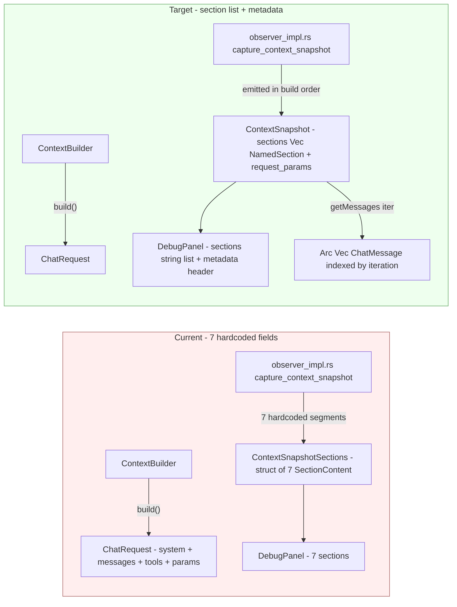

# ADR-054: Debug Context Snapshot Coverage Extension — Section Listing + Bringing `messages` / `todo` / `request_params` into the Snapshot

> **Chinese source of truth**: [ADR-054](../zh/ADR-054-debug-context-snapshot-coverage.md)
> **Terminology**: see [GLOSSARY.md](./GLOSSARY.md)

**Status**: Implemented (draft 2026-09-12 → all 4 steps completed the same day; implementation record in §9)
**Date**: 2026-09-12
**Decision Makers**: 大鱼

**Related**:
- [ADR-013](./ADR-013-debug-observer-pipeline.md) (Debug module boundary refactor — the Observer Pipeline pattern)
- [ADR-040](./ADR-040-runtime-adapter-use-case-layer.md) (Runtime adapter → UseCase service pattern — late-bind slot)
- [ADR-048](./ADR-048-debug-protocol-mqtt-http.md) (Debug Protocol moved to MQTT events + HTTP RPC)

---

## 1. Decision Summary

The 7 context-snapshot sections the Debug Panel currently has (`system_prompt` / `workspace_context` / `environment` / `tool_definitions` / `skill_instructions` / `retrieved_memory` / `identity_context`) have three classes of coverage gaps against what `ContextBuilder::build()` actually sends to the LLM:

1. **Conversation messages are entirely absent from the snapshot** — `ChatRequest` appends `history.messages()` after the system message and sends them together (`context.rs:466-474`), but `ConversationSnapshot` only stores `message_count`, with no message bodies (`controller.rs:31-49`; `handlers.rs:211` is still a TODO). This is debug's biggest blind spot.
2. **Three system-prompt segments are merged or dropped**: `ambiguous_confirmation_hint` (the P3-4 conflict-confirmation hint) and `todo_context` (the active task list) are not in the snapshot at all; `workspace_prompt_file` (CLAUDE.md / AGENTS.md) is spliced straight into `system_prompt`, so it cannot be patched independently.
3. **`ChatRequest` control parameters are invisible for debugging**: `temperature` / `max_tokens` / `reasoning_effort` / `thinking_mode` / the actually-used `model` are not in the snapshot, so the first-hand information is unavailable when investigating "why did the LLM return something odd".

This ADR does three things:

1. **Refactor the 7-field hardcoded `ContextSnapshotSections` into a content-addressed `Vec<SectionMeta>` list**, and generalize the lazy-loading interface (`getSection`) along with it. `PatchSet` likewise becomes `HashMap<String, PatchValue>`.
2. **Add four sections plus one top-level metadata block**:
   - sections: `messages` (full conversation messages), `todo_context` (task list), `ambiguous_confirmation_hint` (conflict-confirmation hint), `workspace_prompt_file` (presented independently, decoupled from `system_prompt`)
   - top-level metadata: `request_params = { model, temperature, max_tokens, reasoning_effort, thinking_mode }`
3. **Adjust the backend `capture_context_snapshot()`**: stop splicing `workspace_prompt_file` into `system_prompt`; emit the section list in "the actual injection order of `build()`", so the UI can reproduce the system prompt the LLM actually saw.



---

## 2. Background and Motivation

### 2.1 Debug Panel today

`apps/acowork-desktop/src/components/debug/DebugPanel.tsx:24-42` defines 7 sections:

```typescript
export const SECTION_LABELS: Record<string, string> = {
  system_prompt: "System Prompt",
  workspace_context: "Workspace Context",
  environment: "Environment",
  tool_definitions: "Tool Definitions",
  skill_instructions: "Skill Instructions",
  retrieved_memory: "Retrieved Memory",
  identity_context: "Identity Context",
};
```

The backend `capture_context_snapshot()` in `core/acowork-runtime/src/debug/observer_impl.rs:350-382` mirrors these 7 sections exactly — **front and back are 100% aligned**, which is good.

But "aligned with the frontend" ≠ "completely covered". The `ChatRequest` actually sent to the LLM is built by `ContextBuilder::build()` (`context.rs:389-647`), which contains more than these 7 text segments.

### 2.2 Three classes of coverage gaps

#### Gap A: conversation messages are entirely missing

`context.rs:466-474` appends the whole of `history.messages()` after the system message:

```rust
// 7. Conversation history
messages.extend(
    history
        .messages()
        .iter()
        .filter(|m| !matches!(m.role, MessageRole::System))
        .cloned(),
);
```

But `ConversationSnapshot` (`controller.rs:31-49`) only stores 4 scalars:

```rust
pub struct ConversationSnapshot {
    pub id: String,
    pub iteration: u32,
    pub message_count: usize,        // ← count only, no content
    pub cumulative_usage: DebugUsage,
    pub timestamp_ms: i64,
}
```


There is an obvious TODO at `handlers.rs:211` too: `messages: Vec::new(), // TODO: populate in S2.3 with actual messages`.

**This is debug's biggest blind spot** — when an agent misbehaves (hallucination, looping, going off track), the operator's first instinct is to look at "which user messages, tool results, and assistant replies did the LLM actually see". None of that exists in the snapshot today, so the only option is to dig through runtime logs.

#### Gap B: three segments inside the system prompt are merged / dropped

Reading `build()` at `context.rs:389-457`, all segments injected into the system message, in order:

| Injection order | Source field | `build()` line | Current snapshot handling |
|---|---|---|---|
| 1 | `system_prompt` (base prompt) | 400 | ✅ `system_prompt` section |
| 2 | `identity_context` | 402-407 | ✅ `identity_context` section |
| 3 | `workspace_context` | 410-413 | ✅ `workspace_context` section |
| 4 | `retrieved_memory` | 415-418 | ✅ `retrieved_memory` section |
| 5 | `ambiguous_confirmation_hint` | 420-427 | ❌ **entirely lost** |
| 6 | `skill_instructions` | 429-432 | ✅ `skill_instructions` section |
| 7 | `todo_context` | 434-437 | ❌ **entirely lost** |
| 8 | `environment_override` / `detect_environment_text()` | 439-447 | ✅ `environment` section |
| 9 | `workspace_prompt_file` | 449-453 | ⚠️ **merged into `system_prompt`** (see `observer_impl.rs:342-348`) |

The three problematic fields:

- **`ambiguous_confirmation_hint`** (new in P3-4, `context.rs:39,341-343`) — when there are ≥3 pending ambiguous conflicts, it hints the Agent to naturally ask the user to disambiguate. When the Agent suddenly starts asking disambiguation questions, the operator needs to see whether this hint was wrongly triggered / whether the content is reasonable. **Currently invisible.**
- **`todo_context`** (`context.rs:44-47,265-267`) — the Agent's internal active task list. When an Agent loops on the wrong todo, this list is exactly what the operator most needs to see. **Currently invisible.**
- **`workspace_prompt_file`** (CLAUDE.md / AGENTS.md, `context.rs:22-23,166-176`) — `observer_impl.rs:342-348` splices its content into the `system_prompt` section:

  ```rust
  let base_prompt = req.context_builder.system_prompt();
  let prompt_file_section = req
      .context_builder
      .workspace_prompt_file()
      .map(|content| format!("\n\n## Workspace Prompt File\n{content}"))
      .unwrap_or_default();
  let full_system_content = format!("{base_prompt}{prompt_file_section}");
  ```

  Consequence: **the "## Workspace Prompt File" paragraph the user sees in the `system_prompt` edit panel is actually CLAUDE.md's content** — editing `system_prompt` inadvertently edits CLAUDE.md, conflating two independently adjustable objects that ought to stay separate: "the agent's own prompt" and "the workspace config file".

#### Gap C: `ChatRequest` control parameters are invisible

`ChatRequest` is constructed at `context.rs:639-647`:

```rust
ChatRequest {
    model,                  // ← the model actually used
    messages,
    temperature,            // ←
    max_tokens,             // ← the final value after capabilities + hard cap + safety compression
    tools: self.tool_definitions.clone(),
    reasoning_effort,       // ←
    thinking_mode,          // ←
}
```

But none of these fields are in the snapshot. When investigating "why did the LLM respond so briefly this time / get truncated / not think at all", the first-hand things to confirm are precisely `max_tokens` and `reasoning_effort`; today you have to dig through logs to get them.

### 2.3 The existing architecture already paved the way

Good news: the current architecture has three favourable conditions in place:

1. **Sections are lazily loaded** (`SectionContent` at `controller.rs:77-100` + the `getSection` RPC in `debug/handlers.rs`) — adding a new section reuses the same pattern and does not break lazy-loading semantics.
2. **DebugEvents are pushed over MQTT pub/sub** (ADR-048) — the `onContextBuilt` event payload uses the `ContextSections` structure; new fields are forward-compatible (`serde(skip_serializing_if = "Option::is_none")`).
3. **`PatchSet` already uses Option fields to express "this field was not patched"** (`protocol.rs:158-173`) — generalizing to a `HashMap` leaves the semantics unchanged.

---

## 3. Decision

### 3.1 Section listing (the core structural change)

#### Backend

Change the hardcoded 7-field struct at `core/acowork-runtime/src/debug/controller.rs:67-75` into a content-addressed list:

```rust
// before
pub struct ContextSnapshotSections {
    pub system_prompt: SectionContent,
    pub workspace_context: SectionContent,
    pub environment: SectionContent,
    pub tool_definitions: SectionContent,
    pub skill_instructions: SectionContent,
    pub retrieved_memory: SectionContent,
    pub identity_context: SectionContent,
}

// after
pub struct ContextSnapshotSections {
    /// Section list ordered by build() injection order
    pub sections: Vec<NamedSection>,
}

pub struct NamedSection {
    /// Section key (e.g. "system_prompt", "messages")
    pub key: String,
    pub content: SectionContent,
}

impl ContextSnapshotSections {
    /// Look up section metadata by key (O(n), n ≤ ~10, no index needed)
    pub fn find(&self, key: &str) -> Option<&NamedSection> { ... }

    /// Take the content by key (for lazy fetch)
    pub fn get_content(&self, key: &str) -> Option<&SectionContent> { ... }
}
```

`ContextSnapshot` itself gains a top-level `request_params` field:

```rust
pub struct ContextSnapshot {
    pub iteration: u32,
    pub built_at: chrono::DateTime<chrono::Utc>,
    pub sections: ContextSnapshotSections,
    pub total_token_estimate: usize,
    pub request_params: RequestParams,   // ← new
}

#[derive(Debug, Clone, Serialize, Deserialize)]
pub struct RequestParams {
    pub model: String,
    pub temperature: Option<f64>,
    pub max_tokens: Option<u32>,
    pub reasoning_effort: Option<String>,
    pub thinking_mode: Option<String>,
}
```

#### Message storage

Add a `messages_by_iteration: HashMap<u32, Arc<Vec<ChatMessage>>>` field to `DebugController`. **Storage strategy**:

- At snapshot time hold a shallow reference via `Arc::clone(history.messages())`, avoiding a deep copy.
- Clean up by iteration when `truncate_snapshots_after` runs (an existing pattern at `controller.rs:314-318`).
- The `messages` section's `SectionContent` stores only metadata (`size_bytes` / `token_estimate` / `hash`), not content; on `getSection(iteration, "messages")` take the `Arc` reference from `messages_by_iteration`, serialize to JSON and return.
- Memory footprint: each iteration's message body is a shallow reference snapshot of the whole history (`Arc<Vec<ChatMessage>>` shares the underlying buffer). Multiple iterations share the same underlying array (incremental), so older iterations cost only the increment.

#### observer_impl.rs adjustments

`capture_context_snapshot()` (`observer_impl.rs:335-405`) is refactored:

> **Prerequisite**: step 2 needs `temperature()` / `thinking_mode()` accessors added to `ContextBuilder` first (currently only `set_temperature()` / `set_thinking_mode()` exist, no getters; add them following the pattern of `reasoning_effort()` at `context.rs:130-132`).

```rust
let mut named: Vec<NamedSection> = Vec::with_capacity(11);

// Emitted strictly in build() injection order (matching the system_content assembly order)
named.push(NamedSection::new("system_prompt", req.context_builder.system_prompt(), req.model));

if let Some(identity) = req.context_builder.identity_context() {
    named.push(NamedSection::new("identity_context", identity, req.model));
}
if let Some(ws) = req.context_builder.workspace_context() {
    named.push(NamedSection::new("workspace_context", ws, req.model));
}
if let Some(mem) = req.context_builder.retrieved_memory() {
    named.push(NamedSection::new("retrieved_memory", mem, req.model));
if let Some(hint) = req.context_builder.ambiguous_confirmation_hint() {   // ← new
    named.push(NamedSection::new("ambiguous_confirmation_hint", hint, req.model));
}
if let Some(skills) = req.context_builder.skill_instructions() {
    named.push(NamedSection::new("skill_instructions", skills, req.model));
}
if let Some(todos) = req.context_builder.todo_context() {                // ← new
    named.push(NamedSection::new("todo_context", todos, req.model));
}
let env_text = req.context_builder.environment_override()
    .map(|s| s.to_string())
    .unwrap_or_else(crate::agent::context::detect_environment_text);
named.push(NamedSection::new("environment", env_text, req.model));

if let Some(prompt_file) = req.context_builder.workspace_prompt_file() {  // ← presented independently, no longer merged
    named.push(NamedSection::new("workspace_prompt_file", prompt_file, req.model));
}

// tool_definitions computed separately (JSON serialization)
named.push(NamedSection::new("tool_definitions", tool_defs_str, req.model));

// messages special-cased: metadata only, content lazily loaded from messages_by_iteration
let messages_json = serde_json::to_string(history.messages())?;
named.push(NamedSection::new("messages", messages_json, req.model));

The `build()` function itself is **unchanged** — `workspace_prompt_file` is still assembled into `system_content` as a `## Workspace Prompt File` section. What changes is that **the snapshot side no longer merges them**, so the UI can edit them separately.

#### Protocol layer

`ContextSections` at `protocol.rs:97-105` changes to `Vec<SectionMeta>` in the same way:

```rust
// after
#[derive(Debug, Clone, Serialize, Deserialize)]
pub struct ContextSections {
    pub sections: Vec<SectionMeta>,
}
```

The `DebugEvent::ContextBuilt` payload in `debug/events.rs:54-58` is updated accordingly (field types only; the event schema stays forward-compatible, and old clients ignore the unrecognised `request_params` field).

#### PatchSet generalization

`PatchSet` at `protocol.rs:158-173` becomes `HashMap<String, PatchValue>`, using `serde(tag = "type")` to distinguish string / vec / json:

```rust
#[derive(Debug, Clone, Default, Serialize, Deserialize)]
pub struct PatchSet {
    /// Key = section name ("system_prompt" / "messages" / "workspace_prompt_file" ...)
    /// Value = the content to patch in; None means not patched (same semantics as today)
    #[serde(flatten)]
    pub patches: HashMap<String, PatchValue>,
}

#[derive(Debug, Clone, Serialize, Deserialize)]
#[serde(tag = "type", rename_all = "lowercase")]
pub enum PatchValue {
    Text { value: String },
    Json { value: serde_json::Value },
}
```

> **Alternative (rejected)**: keep `PatchSet` as an Option-field struct and merely add 4 fields (`messages`, `todo_context`, `ambiguous_confirmation_hint`, `workspace_prompt_file`). Reason for rejection: every new section requires changing three places — the struct definition, the `apply_patches()` implementation, and the `PatchSet::merge()` implementation — which is a continuation of exactly the "7 hardcoded fields" problem described in §2. The next section added will hit the same wall.

### 3.2 Frontend adaptation

`apps/acowork-desktop/src/components/debug/DebugPanel.tsx:24-42`:

```typescript
// after: the section list is no longer hardcoded, driven dynamically by snapshot.sections
export const SECTION_LABELS: Record<string, string> = {
  system_prompt: "System Prompt",
  workspace_context: "Workspace Context",
  environment: "Environment",
  tool_definitions: "Tool Definitions",
  skill_instructions: "Skill Instructions",
  retrieved_memory: "Retrieved Memory",
  identity_context: "Identity Context",
  workspace_prompt_file: "Workspace Prompt File (CLAUDE.md / AGENTS.md)",
  todo_context: "Active Task List",
  ambiguous_confirmation_hint: "Memory Conflicts Hint",
  messages: "Conversation Messages",
};

export const SECTION_ORDER = [
  // Strictly matching build() injection order, so the UI reproduces the system prompt the LLM actually saw
  "system_prompt",
  "identity_context",
  "workspace_context",
  "retrieved_memory",
  "ambiguous_confirmation_hint",
  "skill_instructions",
  "todo_context",
  "environment",
  "workspace_prompt_file",
  "tool_definitions",
  "messages",
];
```

`SECTION_ORDER` exists so the UI renders in `build()` order (what the operator sees is the concatenation order the LLM actually saw), but at render time it **still filters out keys not present in `snapshot.sections`** — guaranteeing that a newly installed package / an agent with a certain section disabled does not show a blank entry.

The `SnapshotNode` component (`DebugPanel.tsx:109-329`) is adjusted:

- The header gains a metadata bar: `Model: gpt-4o · Temperature: 0.7 · max_tokens: 4096 · reasoning: medium · thinking: adaptive` (read from `snapshot.request_params`; missing entries collapsed)
- The section list iterates `snapshot.sections` (no longer hardcoding 7 entries)
- The `getSection` signature is unchanged: `(iteration, sectionKey) → Promise<SectionContent>`, with a new branch handling `"messages"` (the backend returns a JSON array; the frontend renders it as a collapsible list + per-entry token/hash)
- The `editingSection` / `patchContext` calls are unchanged, but the `PatchSet` payload switches to the `HashMap` form

### 3.3 Persistence and rollback

- `truncate_snapshots_after` (`controller.rs:315-321`) is extended to also purge entries with `iteration > target` from `messages_by_iteration`.
- `DebugController::reset()` (`controller.rs:323-329`) cleans up in sync.
- Before `store_context_snapshot` persists, it first does `messages_by_iteration.insert(iteration, Arc::clone(history.messages()))`.

### 3.4 Out of scope for this round

- **base64 summaries for multimodal content (images)** — see §2.3's "low debug value + medium-high cost"; left for future expansion on demand. This round serializes the messages section with `serde_json::to_string(history.messages())`; image base64 will appear in the JSON but **is only transferred when the user actively expands messages** (lazy loading).
- **Visual colour-coding of tool call / tool result** — the serialized `ChatMessage` can distinguish role today, but the UI does not distinguish `tool_call` from `tool_result`. This round only exposes the messages; the colour coding (different colours / collapsible `tool_calls` field) is the next round of UI polish.
- **Cross-session message diff** — not implemented; wait until the messages section has run in the wild for a while and is confirmed stable before deciding whether it is worth adding.

---

## 4. Implementation Steps

Split into 4 independently committable steps in dependency order, each self-contained and separately reviewable/testable:

### Step 1: list-ize the snapshot sections (without introducing new sections)

Structure only, no content change. **Known touchpoint list** (find them all with `git grep` before changing, to avoid omissions):

1. `debug/controller.rs:67-75`: `ContextSnapshotSections` becomes `Vec<NamedSection>`
2. `debug/protocol.rs:97-105`: `ContextSections` in sync
3. `debug/observer_impl.rs::capture_context_snapshot` (`:335-405`): emits `Vec<NamedSection>`, still filling only the original 7 sections
4. `debug/handlers.rs:277-291` (the `getSection` match block): switch to `find(key)` instead of hardcoded fields; tests at `debug/handlers.rs:758, 808` updated in sync
5. `mqtt/debug_events.rs:194-249` (the `DebugEvent::ContextBuilt` encoding block): iterate `Vec<NamedSection>` to build a `HashMap<String, SectionMeta>`; the test at `mqtt/debug_events.rs:399` updated in sync
6. `PatchSet` (`protocol.rs:158-173`) switched to `HashMap<String, PatchValue>` in sync, `apply_patches()` adapted; the `debug/handlers.rs::handle_patch_context` test updated in sync
7. Frontend `DebugPanel.tsx`: iterate `snapshot.sections` rather than hardcoding 7 keys

Tests: `cargo test -p acowork-runtime debug::` + `cargo test -p acowork-runtime mqtt::debug_events::` + the existing 10 RPC handler tests should not regress.

### Step 2: add the top-level `request_params`

1. `protocol.rs` adds the `RequestParams` struct
2. `ContextSnapshot` gains the field
3. `observer_impl.rs` collects model / temperature / max_tokens / reasoning_effort / thinking_mode from `req.context_builder`
4. `handlers.rs::get_state` serializes `request_params` into the response
5. Frontend `SnapshotNode` header gains the metadata bar

### Step 3: split `workspace_prompt_file` + add `todo_context` / `ambiguous_confirmation_hint`

1. `observer_impl.rs::capture_context_snapshot` no longer splices `workspace_prompt_file` into `system_prompt`
2. Add 3 new NamedSections: `workspace_prompt_file` / `todo_context` / `ambiguous_confirmation_hint`
3. Frontend `SECTION_ORDER` / `SECTION_LABELS` gain the corresponding entries
4. `PatchSet` support comes for free (already generalized in step 1)

### Step 4: the messages section (the biggest block)

1. `DebugController` gains `messages_by_iteration: HashMap<u32, Arc<Vec<ChatMessage>>>`
2. `capture_context_snapshot` stores `Arc::clone(history.messages())` + the metadata section
3. `handlers.rs` gains `getMessages(iteration)` returning a JSON array (in fact this is just a special case of `getSection(iteration, "messages")`, no new handler needed, reuse `get_section`)
4. `truncate_snapshots_after` / `reset` clean up
5. Frontend `messages` section rendering: the `SectionContent`'s content is a JSON string, the UI deserializes it into an array and displays role + text + tool_calls (collapsed) per entry

---

## 5. Verification

| Verification item | Method |
|---|---|
| The 7 backend sections lose no data | Existing snapshot tests (`debug::` module) + adapter handler tests |
| The 4 new sections appear correctly under every `build()` branch | Unit test: mock `ContextBuilder` in various states, assert the returned `sections` list from `capture_context_snapshot` matches expectations |
| The `messages` section metadata is correct and the lazy-load path works | Unit test: build a `HistoryManager` with ≥10 messages, assert `messages_by_iteration` holds after the snapshot, and the JSON returned by `get_section(iter, "messages")` deep-equals the original message array |
| `truncate_snapshots_after` also cleans messages | Unit test: insert 5 iterations, rewind to 3, assert `messages_by_iteration` only retains ≤ 3 |
| PatchSet `HashMap` serialization / deserialization | serde test: build a PatchSet containing 4 section kinds, serialize and assert an old-version DebugPanel mock can still deserialise and recognise it |
| Frontend DebugPanel renders the 11 sections in order | Snapshot test: hand-construct a complete snapshot fixture, assert the render order matches `SECTION_ORDER` |
| The `request_params` metadata bar is displayed | Snapshot test: mock `RequestParams` with and without each entry, assert the metadata bar collapses correctly |
| End-to-end: after manually triggering patchContext on `messages`, the next iteration's LLM sees the patched messages | Integration test: build a history, patch `messages` with a simplified version, trigger the next `build_chat_request`, assert the messages the LLM receives match the patch |

---

## 6. Risks and Mitigations

| Risk | Impact | Mitigation |
|---|---|---|
| `messages_by_iteration` memory growth | Medium — each iteration holds an `Arc<Vec<ChatMessage>>`, deep-copying the whole history | Share the underlying buffer with `Arc`; multiple iterations share one contiguous buffer (incremental append). If measurements show a single session exceeding 100MB after ≥ 100 iterations, introduce an LRU eviction policy (keep the most recent N=20 iterations). |
| Serializing `messages` to a JSON string can be very large | Medium — a long history serializes to a high token count; lazy loading mitigates this but the first serialization is still O(n) | Only serialize when the user actively expands; consider switching to a binary encoding (bincode) later to reduce size |
| Losing type safety after `PatchSet` becomes a `HashMap` | Low — a misspelled section name is not caught at compile time | `apply_patches()` takes `known_sections: &[&str]`; a key not in the list returns `PatchError::UnknownSection`, pointing out the typo to the user |
| Old frontend clients receiving the new `ContextSections` schema (a Vec rather than a struct) | Low — the existing Desktop client is a single deployment, no mixing | Add a `version: u32` field to the MQTT payload; on parse failure the Runtime degrades to ignoring `sections` while preserving the `phase` / `iteration` metadata |
| Multimodal base64 appearing in the messages JSON | Medium — expanding messages in the UI loads all images at once | The render layer does a lightweight preview (first-image thumbnail + "view original" link); can be iterated on separately later |
| Engineering trade-off: 4 serial steps merged vs split commits | — | Step 1 is a structural change and must be committed separately after passing the full test suite; steps 2-4 are relatively independent of each other and can become separate PRs |

---

## 7. Checklist (verify at commit time)

- [x] Step 1: snapshot sections listed + PatchSet turned into a HashMap, all debug module tests pass
- [x] Step 2: top-level `request_params` metadata bar, frontend rendering verified
- [x] Step 3: 3 new sections (`workspace_prompt_file` / `todo_context` / `ambiguous_confirmation_hint`) with correct metadata
- [x] Step 4: `messages_by_iteration` lazy-load path + rewind cleanup
- [x] DebugPanel render order matches the `build()` injection order
- [ ] Desktop end-to-end smoke test: trigger a debug session, confirm all 11 sections can be expanded / edited / rewound
- [ ] CLI (the acowork CLI), if it has debug commands, updated in sync (`git grep "section.*system_prompt"` to confirm nothing is missed)

---

## 8. Related Documents

- ADR-013 (Debug module boundary refactor — the Observer Pipeline pattern): this refactor is carried out within the Observer Pipeline framework
- ADR-040 (Runtime adapter → UseCase service pattern): the lazy slot pattern is unchanged; adding a new service does not require further structural change
- ADR-048 (Debug Protocol moved to MQTT events + HTTP RPC): new sections are pushed forward-compatibly via the MQTT `onContextBuilt` event
- `docs/design/10-debug-protocol.md`: protocol DTOs updated in sync (§3.4 snapshot structure, §3.5 patch format, comparison table)

---

## 9. Implementation Record (2026-09-12)

### Step 1 — Section listing (backend + MQTT + frontend)

- `debug/protocol.rs`: `SectionMeta` gains `key`; `ContextSections` becomes `{ sections: Vec<SectionMeta> }`; `PatchSet` becomes `HashMap<String, PatchValue>` (`{type: "text"|"json", value}`); added `PatchError` / `KNOWN_SECTION_KEYS`.
- `debug/controller.rs`: `ContextSnapshotSections` becomes `Vec<NamedSection>` (adding `find` / `get_content` / `total_token_estimate`); `From<&ContextSnapshotSections> for ContextSections` iterates to produce them.
- `debug/observer_impl.rs`: `capture_context_snapshot` produces `Vec<NamedSection>` (step 1 still the original 7 sections; step 3 extends it).
- `debug/handlers.rs`: `getSection` switches to `find(key)`; `patchContext` validates against `KNOWN_SECTION_KEYS` + HashMap reflection.
- `agent/context.rs`: `apply_patches` adapted to the new `PatchSet` structure (returns `Result<(), PatchError>`).
- `mqtt/debug_events.rs`: the `ContextBuilt` encoding iterates `Vec<SectionMeta>` to build a proto map (the wire encoding remains `map<string, SectionMeta>`, **forward-compatible**).
- Frontend `debugStore.ts` / `DebugPanel.tsx`: `snapshot.sections` normalized into `SectionMeta[]` (MQTT map → array), rendered by iteration + `SECTION_ORDER` sorting; `patchContext` automatically wraps JS values as `{type, value}`.

### Step 2 — top-level request_params

- `agent/context.rs`: added the `temperature()` / `thinking_mode()` getters.
- `debug/protocol.rs`: added `RequestParams` (model / temperature / max_tokens / reasoning_effort / thinking_mode).
- `debug/observer.rs`: `ContextSnapshotRequest` gains `max_tokens: Option<u32>` (computed inside `build()`, the call site passes it in from the final `ChatRequest`).
- `debug/observer_impl.rs`: constructs `RequestParams` and writes it into the snapshot.
- `debug/handlers.rs`: both `GetContextSnapshotResult` and `DebugStateSnapshot` carry `request_params`.
- Frontend: `SnapshotNode` shows the metadata bar on expansion (missing entries collapsed).

### Step 3 — split workspace_prompt_file + add todo / ambiguous sections

- `agent/context.rs`: added the `ambiguous_confirmation_hint()` / `todo_context()` getters; `apply_patches` supports the 3 new sections (empty string = clear semantics).
- `debug/protocol.rs`: `KNOWN_SECTION_KEYS` gains 3 keys.
- `debug/observer_impl.rs`: `capture_context_snapshot` produces 10 sections in `build()` injection order (`system_prompt` **no longer merges** workspace_prompt_file).
- Frontend: `SECTION_LABELS` / `SECTION_ORDER` gain the corresponding entries.

### Step 4 — messages section (lazy loading)

- `debug/controller.rs`: `messages_by_iteration: HashMap<u32, Arc<Vec<ChatMessage>>>`; `store_messages` / `get_messages`; `truncate_snapshots_after` / `reset` clean up in sync.
- `debug/observer.rs`: `ContextSnapshotRequest` gains `history: &HistoryManager`.
- `debug/observer_impl.rs`: at snapshot time `Arc::new(history.messages().to_vec())` is stored; the `messages` section stores metadata only (`SectionContent::metadata_only`).
- `debug/handlers.rs`: `getSection(iteration, "messages")` is special-cased — serializing from `messages_by_iteration` to return JSON (reuses getSection, no new handler).
- Frontend: the `MessagesView` component (role badge + content + collapsible tool_calls / reasoning_content); messages are read-only (the edit button is hidden).

### Verification results

- `cargo test -p acowork-runtime -- debug::`: 24 passed (including the new messages lazy-load / unknown-section rejection tests)
- `cargo test -p acowork-runtime -- mqtt::debug_events::`: 3 passed
- `cargo test -p acowork-runtime --lib`: 918 passed / 0 failed
- `cargo clippy -p acowork-runtime --lib`: 0 warnings
- `cargo build -p acowork-runtime -p acowork-gateway`: passed
- `tsc --noEmit`: 0 errors
- `vitest run`: 128 passed (8 files)

### Deviations from the ADR §5 verification table

| Verification item | Status | Explanation |
|---|---|---|
| The 7 backend sections lose no data | ✅ | All existing tests pass |
| New sections appear correctly under every `build()` branch | ✅ | Step 3 produces 10 sections; disabled branches are naturally omitted by `if let Some` |
| messages metadata + lazy loading | ✅ | Added 2 handlers tests |
| truncate also cleans messages | ✅ | `truncate_snapshots_after` retains in sync |
| PatchSet HashMap serialization | ✅ | serde tag structure + frontend normalization |
| Frontend render order | ✅ | `SECTION_ORDER` matches `build()` |
| request_params metadata bar | ✅ | `SnapshotNode` collapsed display |
| **End-to-end: after patching messages the LLM sees the patched ones** | ⏳ not implemented | The ADR step-4 checklist did not include patching messages (visibility only); this integration test requires SessionTask to apply pending message patches to the history on reExecute — left for later |

---

## 10. Implementation Revision Record (2026-09-12 follow-up)

Two architecture-level problems were fixed after code review (the real landing of ADR-054 §6's risk mitigations):

### 10.1 messages shallow reference lands (replacing the deep copy)

**Problem**: the step-4 implementation used `Arc::new(req.history.messages().to_vec())`, fully deep-copying the history each round, which contradicts what §3.1/§6 declared — "`Arc::clone` shallow reference sharing the underlying buffer". `HistoryManager::messages()` returns a `&[ChatMessage]` slice, which cannot be shallow-referenced.

**Fix**:
- `agent/history.rs`: `messages: Vec<ChatMessage>` → `Arc<Vec<ChatMessage>>`; all mutation points (append / extend / load_restored / clear / truncate_to / abandon_tool_result / retrieve_tool_result / replace_middle_with_summary) now go through `Arc::make_mut` (copy-on-write); the `messages_mut()` signature is unchanged (it does make_mut internally), the `messages()` signature is unchanged (it returns `as_slice()`).
  - Note: 3 of the mutation points originally listed (`trim_fifo` / `emergency_trim` (deleted by ADR-061) and `fit_to_budget_lossless` (deleted when lossless budget trimming was reverted during the 2026-09 recovery period)) no longer exist.
- Added `HistoryManager::messages_arc() -> Arc<Vec<ChatMessage>>` (O(1) clone); the `observer_impl.rs` snapshot now holds that shallow reference and **no longer calls to_vec**.
- Semantics: multiple iterations share the same underlying buffer with zero copies when messages are unmodified between them; one COW copy on modification; in non-debug mode refcount==1 takes the `Arc::get_mut` fast path with zero copies.
- New tests: `messages_arc_is_shallow_and_copy_on_write` (sharing + COW + ptr_eq assertions), `messages_arc_survives_rewind_truncate` (after a rewind an old snapshot still holds the complete history).

### 10.2 patch semantics converged to a single source (eliminating preview/apply divergence)

**Problem**: after step 1 the patch semantics were implemented in duplicate in two places — `handlers.rs::handle_patch_context` (the snapshot preview) and `context.rs::apply_patches` (the actual application) — with 3 boundary inconsistencies: non-array tool_definitions preview successfully but are rejected on apply; workspace_prompt_file / todo_context empty strings preview as an empty string but apply sets None; ambiguous_confirmation_hint empty string has no clearing semantics. And a type mismatch merely logs silently at the next build, with no feedback over RPC.

**Fix**:
- `agent/context.rs`: added the `ResolvedPatch` enum + `resolve_patch(key, value) -> Result<ResolvedPatch, PatchError>` — type validation, empty-string clearing, and tool_definitions array validation are converged into the **single source of semantics**; `apply_patches` and `handle_patch_context` share it.
- The empty string for the three ADR-054 step-3 sections is uniformly Clear (`ambiguous_confirmation_hint` gains clearing, plus a new `clear_ambiguous_confirmation_hint()`).
- `handlers.rs::handle_patch_context`: **pre-resolves** all patches (decoupled from whether a snapshot exists); a type mismatch / non-array / unknown key uniformly returns `DebugError::InvalidParams` (user-visible); on Clear the snapshot removes that section (build() will then omit it).
- Removed the `protocol.rs::KNOWN_SECTION_KEYS` constant (validation converged into `resolve_patch`, to avoid misleading readers).
- New tests: 3 in handlers (type mismatch rejected, non-array tool_definitions rejected, empty-string clearing removes the snapshot) + 3 in context (empty-string clearing + build omission, type mismatch / non-array rejected, environment empty-string fallback).
