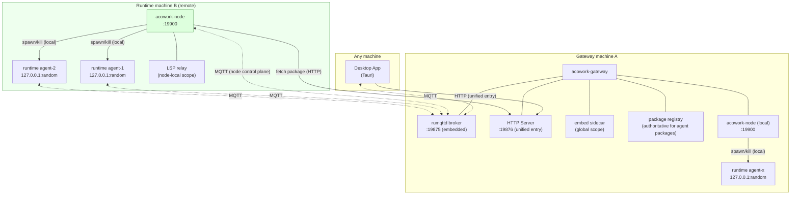

# ADR-055: Remote Runtime Deployment - The Node Agent Topology

**Status**: Accepted (Phase 1-5a implementation complete; Phase 5b outstanding)
**Date**: 2026-08-23 (revised 2026-08-25: L3 inventory addition for the AgentHello endpoint path L3-9; L3-6 marked as partially fixed by ADR-058 W4, Phase 1.3 changed to an incremental task; Phase 2 split into 2a/2b/2c; added §6.19 Re-adopt, §6.20 dependency red line and module structure, §7.1 testing strategy; added command idempotency semantics, advertise injection chain, sidecar status topic home, local node startup ordering. 2026-08-26 revision: Phase 5a security model implementation complete - CONNECT-layer dynamic auth, enrollment protocol (§6.2), node token storage and HTTP channel auth landed; §6.8 records the rumqttd topic-ACL capability deviation. 2026-08-27 revision: §6.8 adds a peer-IP allowlist security fallback (`[security].allowed_node_ips`, HTTP 403 / MQTT TCP pre-filter); the Desktop "single local/remote topology" semantics are finalized - local mode only means the Desktop may spawn a Gateway, and Gateway/Node/Runtime behaviour and configuration are identical in both modes (the relevant runbook was updated in sync). 2026-08-28 revision: node naming unified to a machine-name slug - the reserved name `local` was removed (`LOCAL_NODE_ID` constant deleted, replaced by the shared function `local_node_id()`); the Gateway no longer passes `--name` when spawning a local node, instead passing the internal marker `--gateway-managed` (for orphan cleanup only); §6.11/§6.12 updated in sync. 2026-08-29 revision (ADR-075): node_id is upgraded to a persistent UUID v4 (stable routing key), a new node_name is added (slug, display only, renameable), machine_uid is deleted; conflict detection is deleted, enrollment is made idempotent; `local` is restored as a reserved word (`LOCAL_NODE_ID` constant, the fixed literal for Gateway-directly-managed agents); rename is simplified to change node_name only)
**Deciders**: 大鱼
**Prerequisites**:
- [ADR-033](./ADR-033-mqtt-replace-grpc-websocket.md) (MQTT replaces gRPC + WebSocket)
- [ADR-034](./ADR-034-mqtt-http-boundary.md) (MQTT / HTTP responsibility boundary - the "Gateway does not access Runtime local files" rule)
- [ADR-018](./ADR-018-gateway-disconnection-self-exit.md) (Gateway disconnection self-exit - process tree model)
- [ADR-019](./ADR-019-lsp-relay-standalone-process.md) (LSP Relay as a standalone process)
- [ADR-030](./ADR-030-sidecar-endpoint-dynamic-push.md) (Sidecar endpoint dynamic push)
- [ADR-039](./ADR-039-mqtt-client-lifecycle.md) (MQTT Client lifecycle framework)

---

## 1. Decision Summary

**Break the deployment constraint that "Runtime must run on the same machine as the Gateway", allowing Agent Runtime to be deployed on standalone machines.**

After a full code audit (§3) the conclusion is: **the protocol layer is already fully ready** - the MQTT architecture established by ADR-033/034/039 was inherently an IoT device management model (Runtime = device, Gateway = cloud), with the data ownership principle, the Bootstrap contract, Will Messages and the reconnection framework all in place. **All obstacles are not in the protocol layer but in three kinds of "same-machine assumptions"**:

1. **Process assumption**: the Gateway spawns Runtime as a local child process via `tokio::process::Command`, kills it with OS signals, and probes liveness with local PIDs;
2. **Filesystem assumption**: the Agent package directory and the workspace are "shared territory" between the Gateway and the Runtime (the Gateway reads and writes `install_path` and files inside the workspace directly);
3. **Network assumption**: all cross-process addressing hard-codes `127.0.0.1` (reverse proxy, Sidecar endpoints, MQTT connections, Desktop MQTT connections).

This ADR decides to introduce a **Node Agent (`acowork-node`)**: each machine capable of running a Runtime deploys a lightweight resident service that takes over the Gateway's existing "Runtime parent process" responsibilities (process lifecycle management, package management, node-local Sidecars). The Gateway converges on three pure network responsibilities: **MQTT broker host, unified HTTP entry point, global resource authority**.

Three core decisions:

| # | Decision | Rationale |
|---|----------|-----------|
| **D1** | **Single-topology protocol: the Gateway's own machine is also a Node (local node); single-machine and distributed deployments go through the same protocol** | Eliminates the architectural fork of dual "local mode / remote mode" code paths; local mode = the Gateway spawns a local Node Agent, remote mode = the user manually starts a Node Agent on the target machine, with zero difference on the Gateway side |
| **D2** | **Runtime processes stay `127.0.0.1`-only; the network exposure responsibility moves up to the Node Agent** | The Runtime's HTTP server keeps binding to loopback; the Node Agent serves as the node's reverse proxy and authentication boundary for all external exposure. Runtime needs zero changes with respect to network exposure (the remaining touch points - addressing parameterization, quota autonomy, a new endpoint - are listed in the §9 change inventory), so the security surface converges onto a single component |
| **D3** | **Introduce an explicit Endpoint model (advertise address), replacing all implicit `127.0.0.1` concatenation** | The foundation of a distributed topology is "network addressing must be explicitly declared". Every service provider (Runtime HTTP, embed, LSP relay) reports a **reachable endpoint** (`scheme://host:port`) at registration time, rather than a bare port number |



---

## 2. Background and Motivation

### 2.1 Current deployment topology (single-machine assumption)

```
Desktop App (Tauri)              ← may be on a different machine than the Gateway (HTTP base_url is configurable)
  │
acowork-gateway (resident)        ← MQTT broker host + HTTP entry + Runtime parent process
  ├── acowork-runtime × N         ← one per agent, a child process of the Gateway
  ├── acowork-embed               ← a child process of the Gateway
  └── acowork-lsp-relay           ← a child process of the Gateway
```

The risk table in ADR-033 explicitly recorded this constraint: "the Gateway becomes a single point of failure - the current architecture already has the Gateway as a single point (**Agent child process management, local filesystem access**)". At the time MQTT did not change this; this ADR exists precisely to remove those two pillars.

### 2.2 Target topology

1. **Runtime can be deployed on a standalone machine**: an Agent's code execution (tools, shell, file operations) happens on the machine hosting the Runtime, which may be a GPU server, an intranet workstation, or a cloud host.
2. **The Gateway stays the single entry point**: the Desktop only knows about the Gateway (HTTP + MQTT broker) and is unaware of the physical location of Node/Runtime.
3. **No new transport is introduced**: continue with MQTT (control plane / event plane) + HTTP (data plane / reverse proxy), honouring ADR-034's "one transport per semantic".

### 2.3 Why now

- After ADR-033/034/039, **the protocol layer is already message-level**: there is no "in-process shared memory" or "direct same-socket connection" coupling left between the Gateway and the Runtime; all interaction is MQTT topics + HTTP reverse proxy.
- ADR-039's reconnection framework (ErrClass classification, exponential backoff, the five idempotent Bootstrap steps) has already prepared for "recovery after a network partition" - a prerequisite for distributed deployment.
- The only remaining thing is the deployment topology assumption (the 7 categories listed in §3). The longer we wait, the deeper the coupling between the `lifecycle` / `package_manager` modules and the Gateway becomes.

---

## 3. Inventory of Current Facts: The Complete List of Same-Machine Assumptions

> Every entry below was verified against the code, with file and line numbers noted. This is the complete inventory of "obstacles and difficulties" for this ADR, and also the basis for estimating the migration workload.

### L1. Process lifecycle assumptions (the Gateway is the Runtime's parent process)

| # | Code location | Fact |
|---|---------------|------|
| L1-1 | `core/acowork-gateway/src/lifecycle/process.rs:51-69` | The Runtime binary is a **sibling of the Gateway executable** (`current_exe().parent().join("acowork-runtime")`) |
| L1-2 | `core/acowork-gateway/src/lifecycle/process.rs:73-124` | `tokio::process::Command::new` spawns the Runtime as a **local child process**; all CLI arguments (`--agent-id` `--package-path` `--work-dir` `--mqtt-port`) are local Gateway paths |
| L1-3 | `core/acowork-gateway/src/lifecycle/process.rs:188-233` | `kill_agent_process` terminates the local PID with OS `kill` / `taskkill` |
| L1-4 | `core/acowork-gateway/src/lifecycle/process.rs:255+` | `check_health` probes liveness via `/proc/{pid}` / `ps` / `tasklist` - the local process table |
| L1-5 | `core/acowork-gateway/src/lifecycle/manager.rs:63-160` | `start_agent`: `workspace = install_path/workspace` (a local path); after spawn the PID is recorded and a reaper is attached |
| L1-6 | `core/acowork-gateway/src/intent/router.rs` | When a cross-agent Intent's target agent is not running, it **auto-spawns** (a local spawn by the Gateway) |
| L1-7 | `core/acowork-gateway/src/cron/mod.rs:428` | When a Cron fires and the agent is not running, it likewise goes through **auto-spawn** |
| L1-8 | `docs/adr/zh/ADR-018` | Process tree model: abnormal Gateway exit → Runtime times out and kills itself (depends on the parent-child process relationship and same-machine health probing) |

### L2. Filesystem assumptions (shared territory)

**Current data layout** (three kinds of territory):

| Territory | Path | Gateway access | Runtime access |
|-----------|------|---------------|---------------|
| Gateway private | `{data_dir}` (providers.json, cron.db, resource cache, avatar cache, mcp_catalog, interaction store…) | read/write ✅ | no access ✅ |
| **Shared: package** | `{data_dir}/packages/{agent_id}` (manifest.toml, skills/, prompts/, avatar assets, workspace/) | **direct read/write** ⚠️ | read (load at startup) |
| **Shared: workspace** | `{install_path}/workspace` (agent_config.json, conversation JSONL, sessions, config/agent_workspaces.json, logs/, memory/*.grafeo) | **direct read** ⚠️ | read/write ✅ |

Code points on the Gateway side that directly touch the shared territory (the **existing violations** of ADR-034 rule 3, "the Gateway does not access Agent Runtime local files"):

| # | Code location | Operation |
|---|---------------|-----------|
| L2-1 | `http/agents.rs:569-594, 1789-1857` | Read/write `{install_path}/manifest.toml` (avatar config, tools section updates) |
| L2-2 | `http/agents.rs:436-464, 680-684, 951-1038, 1085-1181` | Read/write avatar / asset files under install_path (canonicalize to prevent traversal, then direct `fs::read/write`) |
| L2-3 | `http/agents.rs:1748-1766` | Read the `{install_path}/prompts/` directory |
| L2-4 | `http/skills_api.rs:164-189, 412-470, 535-566` | Read/write `{install_path}/skills/` (skills import unzipping a ZIP, listing and parsing SKILL.md) |
| L2-5 | `package_manager/install.rs, uninstall.rs, clone.rs` | install (unzip), uninstall (delete directory), clone (recursively copy the directory tree) |
| L2-6 | **`http/workspaces.rs:236-278`** | Directly read `{work_dir}/config/agent_workspaces.json` to resolve workspace_id → path |
| L2-7 | **`http/workspaces.rs:262-330`** | `serve_workspace_file_from_root`: directly `fs::read`s the raw bytes of a workspace file (static assets for the HTML preview iframe) |
| L2-8 | `package_manager/clone.rs:126-145` | During clone, directly copy `{workspace}/memory/private.grafeo` |
| L2-9 | `gateway/mod.rs:198-246, 287-310` | install package / restore installed agents (scan the packages directory at Gateway startup to rebuild `installed_agents`) |

> Note: the reason L2-6/L2-7 exist is documented (the module comment in `workspaces.rs`): the Runtime's `GET /workspaces/file` returns a JSON envelope (base64), and the preview iframe needs raw bytes. **The correct fix is for the Runtime to add a raw-bytes endpoint, not for the Gateway to touch the filesystem** (see §6.6).

### L3. Network addressing assumptions (localhost hard-coding)

| # | Code location | Hard-coded content |
|---|---------------|-------------------|
| L3-1 | `gateway/http/proxy.rs:1365,1367,1469,1527` | Reverse proxy target `http://127.0.0.1:{http_port}` (4 occurrences); `RuntimeHttpRegistry` stores only a `u16` port number, **with no host concept** |
| L3-2 | `gateway/mqtt/sidecar.rs:10` | embed sidecar endpoint `http://127.0.0.1:{port}/v1` |
| L3-3 | `gateway/mqtt/global_resources_publisher.rs:432,451` | The endpoints in the `acowork/global/embedding_models` and `acowork/global/lsps` retained messages are both `http://127.0.0.1:{port}` |
| L3-4 | `runtime/http/server.rs:505-508` | The Runtime HTTP server binds `127.0.0.1:0` (localhost-only by design) |
| L3-5 | `runtime/startup/agent_init.rs:264` | The Runtime's MQTT connection host is hard-coded to `"127.0.0.1"` (the `MqttConnectConfig.host` field already exists; only the caller hard-codes it) |
| L3-6 | `desktop/src-tauri/src/mqtt_client.rs:513-528` + `commands/chat_mqtt.rs:45-53` | **Partially fixed by ADR-058 W4**: `connect_mqtt` now derives the broker host from the Gateway HTTP base URL (the Remote tunnel scenario), and `connect_default` is now dead code (`#[allow(dead_code)]`, only called by tests). **Residual gap**: the broker port is still taken from the default `GATEWAY_MQTT_PORT` (assuming the tunnel forwards the same port, as `chat_mqtt.rs:48-50` admits in a comment), and is not fetched dynamically from `/api/status` as `mqtt_port` |
| L3-7 | `gateway/config.rs:142` | The broker listen host defaults to `127.0.0.1` (a remote Runtime cannot connect in) |
| L3-8 | `gateway/lifecycle/process.rs:106-108` + `find_available_debug_port` | The debug port is probed and allocated on the Gateway's own machine (after ADR-048 it is purely a hint, so the impact is small) |
| L3-9 | `gateway/handlers/server.rs:412,427` | **The AgentHello receipt embeds hard-coded endpoints (a third delivery path for the embed/LSP endpoints)**: `handle_agent_hello` constructs `embed_endpoint = http://127.0.0.1:{port}/v1` and `lsp_relay_endpoint = http://127.0.0.1:{port}`, delivered to the Runtime in the MQTT handshake receipt via `GatewayResponse::AgentHelloResult` (:444-462) (consumption points: `runtime/agent/session/session_task.rs:239`, `runtime/tools/builtin/mod.rs:224`). Alongside L3-2/L3-3, missing this entry means that after Phase 1 is fixed, a remote Runtime's bootstrap still receives an unreachable localhost address |

### L4. Sidecar topology assumptions (both sidecars live on the Gateway machine)

| Sidecar | Deployment location | How the Runtime reaches it | Consequence for a remote Runtime |
|---------|--------------------|---------------------------|-------------------------------|
| **embed** (ONNX embedding service) | A child process of the Gateway (`lifecycle/embed.rs`; model download and loading all happen on the Gateway machine) | The Runtime receives the endpoint over MQTT and then **calls it directly over HTTP** (`RemoteEmbeddingProvider`) | The endpoint is `127.0.0.1` → the call lands on the Runtime's own machine → **connection failure**. And the model files plus the download logic all live on the Gateway machine |
| **LSP relay** | A child process of the Gateway (`lifecycle/lsp_relay.rs` + supervisor) | The Runtime's codebase tool and Desktop's Monaco connect directly over WebSocket/HTTP via the endpoint | **Structurally broken**: the LSP server is started with `root_uri = file://{workspace_root}` (`acowork-lsp-relay/src/codebase.rs:236-244`), so it **must be able to read the workspace filesystem**. The workspace is on the Runtime machine and the LSP server is on the Gateway machine, so it physically cannot work |

### L5. Security assumptions (implicitly protected by localhost binding)

| # | Fact | Consequence of going remote |
|---|------|----------------------------|
| L5-1 | The rumqttd broker has **no authentication and no TLS** (`mqtt/acl.rs`: Phase 1 permissive, "all localhost clients are trusted") | Once the broker is bound to a network interface, **any client on the network** can publish control topics (forging user messages) and subscribe to every data stream (including provider api_keys) |
| L5-2 | The Runtime HTTP server has **no authentication** (protected by the `127.0.0.1` binding) | If bound directly to 0.0.0.0, anyone can read the full session text, the memory graph and workspace files |
| L5-3 | The `acowork/global/providers` retained message carries the **api_key** in plaintext (provable from the debug log in `global_resources_publisher.rs`) | Keys are distributed in plaintext across the network |
| L5-4 | The Gateway → Runtime reverse proxy passes through without authentication | An acceptable transitional state on an intranet, unacceptable on the public internet |

### L6. State model assumptions

| # | Code location | Fact |
|---|---------------|------|
| L6-1 | `gateway/state.rs:82-113` | `RunningAgentInfo.pid: u32` - local PID semantics; `workspace: String` - local path semantics |
| L6-2 | `gateway/state.rs` `installed_agents` | `install_path` is a Gateway-local path; agent installation state = the Gateway's local filesystem state |
| L6-3 | `http/agents.rs` `AgentListResponse` | `running/connected/ready` are driven jointly by "local spawn + MQTT handshake" |

### L7. Other

| # | Code location | Fact |
|---|---------------|------|
| L7-1 | `gateway/http/fs_browse.rs` | `/api/fs/browse` browses the **Gateway machine's** filesystem (the module comment explicitly says "browse the remote server's filesystem" - here "remote" means the Gateway). Choosing a workspace for a remote Runtime requires browsing the **Runtime machine's** fs |
| L7-2 | Runtime binary distribution | The Runtime and Gateway binaries are currently packaged and distributed in the same directory; remote machines need an independent install/upgrade mechanism and version negotiation |

### 3.1 Parts that are already ready (no work needed)

- **The MQTT protocol**: the topic tree, payloads (protobuf DataEnvelope), and the QoS/retained/LWT conventions are all machine-independent;
- **The Runtime MQTT client**: `MqttConnectConfig` already has a `host` field; the ADR-039 reconnection framework guarantees recovery from a network partition;
- **The data-plane reverse proxy protocol**: the 40+ reverse proxy routes in `proxy.rs` are pure HTTP forwarding, independent of the Runtime's location (only the target URL construction needs fixing);
- **The Runtime HTTP server endpoints**: the full set of sessions/messages/memory/config/tools/files/debug endpoints already lives on the Runtime side (the ADR-040 use-case layer), so nothing needs to be relocated;
- **idle watcher / auto-sleep**: the Runtime autonomously times out and exits, independent of the parent process;
- **Desktop remote gateway HTTP mode**: `set_gateway_config` already exists (MQTT host derivation was completed by ADR-058 W4; L3-6 now only leaves the incremental `mqtt_port` dynamic fetch).

---

## 4. Feasibility Conclusion

**Feasible.** Basis of the judgement:

1. **Zero obstacles at the protocol layer**: all Gateway ↔ Runtime interaction is already MQTT messages + HTTP requests, with no same-machine coupling hidden in the protocol. One of the original motivations for choosing MQTT in ADR-033 was precisely "an Agent's lifecycle naturally fits the IoT device management model" - this ADR merely turns that sentence into reality.
2. **The obstacles are all engineering debt, and they are concentrated**: the 30+ code points in L1-L7 of §3 are concentrated in 4 modules (`lifecycle/`, `package_manager/`, `http/proxy.rs`, `http/workspaces.rs`) plus a set of localhost strings. There is no architectural decision that needs to be overturned - ADR-034's data ownership principle and ADR-039's lifecycle framework were in fact prepared for exactly this day.
3. **The highest risks are L4 (LSP relay) and L5 (security)**: the former is the only "structural failure" (it must be on the same machine as the workspace), the latter is the only "cannot go to production without it" item (unauthenticated exposure). Both have clear solutions (§6.7, §6.8).

**Workload characterization**: this is not a bug-fix-scale change but a **deployment model upgrade** - upgrading "single-machine process tree" to "node topology". The core is relocating the Gateway's `lifecycle` + `package_manager` modules wholesale into the new Node Agent component, slimming down the Gateway side.

---

## 5. Option Comparison

### Option A: Runtime direct-connect mode (no new component, Runtime manually deployed)

The Runtime is started manually on the target machine (`acowork-runtime --gateway-host x.x.x.x ...`), and the Gateway becomes a pure registry.

- ✅ Smallest change (only the L3 network layer needs fixing)
- ❌ **No landing point for start/stop**: the Desktop's "start/stop agent" buttons break - the Gateway cannot control the life cycle of a Runtime that is not its child process
- ❌ **The whole auto-spawn system is wiped out**: Intent routing (L1-6) and Cron (L1-7) rely on the Gateway bringing up the target agent; without process management capability these two features degrade
- ❌ **No solution for package bootstrapping**: installing an agent (downloading from the marketplace, unzipping, cloning) is currently all Gateway-local file operations - who installs it on a remote machine?
- ❌ The Gateway degrades into a "dumb registry" and product capability drops severely
- **Conclusion: rejected**. The problem it solves (breaking the same-machine constraint) is smaller than the problem it creates (losing lifecycle management).

### Option B: Remote execution channel (SSH / WinRM)

The Gateway connects over SSH to the target machine to execute spawn/kill/install.

- ❌ Introduces a second control channel (SSH), violating ADR-034's "one transport per semantic" - MQTT is already the control plane
- ❌ Key management, Windows OpenSSH server dependency, connection timeouts, concurrent session management - each one is an operational disaster
- ❌ Directly conflicts with the MQTT-first architectural philosophy (the original intent of ADR-033 was to eliminate multi-protocol)
- **Conclusion: rejected**.

### Option C: Node Agent (node proxy) - **SELECTED**

Every machine capable of running a Runtime deploys a lightweight resident service `acowork-node`, which is the Gateway's "limb extension" on that node.

- ✅ **Reuses an already proven pattern**: `lifecycle/embed_supervisor.rs` has already solved process discovery, health checks, crash recovery, PID-aware reaper and the startup grace window (ADR-019 explicitly says "reuse a mature pattern"); the **core logic** of `lifecycle/manager.rs` + `package_manager/` can be migrated wholesale (note: the two modules currently have 15 references to `crate::gateway::state`, 9 to `GatewayError` and 3 to `SharedState`; during migration these must be peeled off and refactored into Node-owned state and error types - see the dependency red line in §6.20; that workload is already accounted for in Phase 2b)
- ✅ **Single-protocol topology**: between the Node Agent and the Gateway it stays MQTT (control plane) + HTTP (package fetching), zero new transports
- ✅ **The IoT model closes the loop completely**: Node = edge gateway, Runtime = device, Gateway = cloud. Exactly isomorphic to ADR-033's metaphor
- ✅ **Zero feature regression**: start/stop, auto-spawn, package management and skills import are all preserved (only the execution location changes)
- ✅ Single-machine mode goes through the same protocol (D1), no fork
- ❌ Adds one component (deployment/upgrade cost) - offset in the single-machine scenario by "the local node is auto-spawned by the Gateway"
- **Conclusion: selected**.

### Option D: Gateway cluster mode (one primary, many secondaries) - evaluated and rejected

Every machine capable of running a Runtime deploys a full `acowork-gateway` "secondary node", with clustering between primary and secondaries (broker replication + global state replication), and the Runtime remains a child process of the secondary gateway. Adding a machine means adding a secondary gateway, with no need for a new `acowork-node` component.

- ✅ No new binary: the `lifecycle`/`package_manager` code does not move, so the change looks minimal
- ✅ Distributes a single gateway binary (reusing the L1-1 sibling location)
- ❌ **Global authority is replicated onto every execution node**: the Gateway's core value is "global resource authority + single entry point" (`budget`/`cron`/`intent`/`rate`/`vault`/`interaction_store`/`resource_cache`/`handlers` and 13 other modules, 97 HTTP routes). From a secondary gateway there are only two paths: ① run the full module set → global authoritative state must either be replicated (introducing split brain / consistency, the most expensive complexity in distributed systems) or point at the primary (13 modules become dead code + attack surface); ② trim down to `lifecycle` + `package_manager` + reverse proxy → **this trimmed version is `acowork-node`, only named differently - the abstraction of "execution node responsibilities" cannot be dodged; all you can save is the "standalone binary" packaging**
- ❌ **The primary/secondary consistency and leader election problem**: the "primary" in "one primary many secondaries" is a single point; if it dies you either auto-elect (raft/paxos) or degrade the secondaries (after degrading they are indistinguishable from the Node Agent, yet you have already paid the cost of "primary/secondary machinery"). And rumqttd 0.20's cluster replication is half-finished (`replicator/` is experimental code, `examples/node1.rs` is commented out in its entirety, and cannot be used as a production dependency)
- ❌ **Attack surface spread**: a full gateway (including provider api_keys, vault and budget) deployed on untrusted remote GPU servers / cloud hosts spreads the attack surface from 1 trusted machine to N execution machines
- ❌ **Primary and secondary must be the same version**: this loses the version negotiation capability of §6.9 (a Node and a Gateway may run different versions; primary/secondary share the protocol and global state, so they cannot)
- ❌ **Operational mental model confusion**: what the user wants is "compute / execution machine", not "yet another gateway"; the "primary/secondary" distinction plus forcing global resource responsibility onto execution nodes is confusing
- **Conclusion: rejected**. Its legitimate goal "distribute a single binary" can be satisfied by "the same binary plus a `node` subcommand" (the same pattern as k3s server/agent and consul server/client), without sacrificing responsibility isolation.

### 5.1 Node Agent vs folding the capability into Runtime (why not merge them)

Letting the Runtime manage its own lifecycle (spawning itself) is a logical deadlock; having multiple agents share a "super Runtime host process" sacrifices process isolation (one agent crashing affects all) - which is exactly the core value of the current "one process per agent" design. The Node Agent is the only shape that simultaneously satisfies "process isolation + node-level resource management".

### 5.2 Reverse justification of design details (why the alternative implementations were not chosen)

Once the Node Agent is selected as the main topology, the following internal details have several candidate implementations. They are collected here to record "why the current approach was chosen", avoiding repeated debate during implementation:

| Decision point | Selected implementation | Alternative | Reason the alternative was rejected |
|----------------|----------------------|-------------|----------------------------------|
| Node authentication | Registration token + per-node long-lived token (§6.8) | mTLS (mutual certificates) | mTLS requires PKI infrastructure (CA issuance / revocation / rotation), which is over-engineering for the first tier ("trusted network"); tokens can have a TTL, can be revoked and can be audited, which is sufficient together with ACL. Phase 5b (public internet) will re-evaluate mTLS |
| Node external exposure | Node built-in reverse proxy (`/agents/{id}/*`) | Service mesh (linkerd/istio) or the Runtime binding 0.0.0.0 directly | A mesh introduces sidecar injection + an independent control plane, which is overkill at a scale of <100 nodes; direct Runtime exposure means N ports + unauthenticated services exposed to the network (§6.4 has already argued this). The Node reverse proxy = 1 port + 1 authentication point |
| node_id form | UUID v4 (with `node_name` as a slug, §6.12, ADR-075) | FQDN / raw hostname / slug node_id | An FQDN may change (DHCP, cloud hosts) and contains uppercase / underscores / dots (MQTT topics and ACLs are sensitive to these); a slug is readable but not stable enough as a routing key (renaming it breaks routing). A UUID as routing key is stable and unique, display is delegated to `node_name` (slug), and the two responsibilities are separated |
| Node state propagation | MQTT retained (LWT + info) | A standalone registry (etcd/consul) | The project has already established "MQTT is the control plane" (ADR-033); introducing new storage violates ADR-034's "one transport per semantic". Retained naturally provides state recovery after a Gateway restart |
| install state machine | 202 + MQTT events asynchronous receipt | Synchronous HTTP long polling | Remote install involves downloading / unzipping / verifying, whose duration is unpredictable; a synchronous API blocks the Desktop. Async + events reuses the Desktop's existing MQTT subscription pipeline (§6.2) |

---

## 6. Detailed Design

### 6.1 Component and responsibility split

| Component | Deployment location | Responsibilities (after the change) |
|-----------|--------------------|-----------------------------------|
| **Gateway** | Machine A (any) | ① MQTT broker host; ② unified HTTP entry point (the Desktop's only entry + the Node package distribution source); ③ global resource authority (providers / MCP / search / user profile / embedding model library); ④ Node registration and routing (agent_id → node mapping) |
| **Node Agent (new)** | Every Runtime machine (including the Gateway's own) | ① Runtime process lifecycle (spawn / kill / reap / liveness probing - code migrated from `lifecycle/`); ② local package management (install / uninstall / clone / skills / avatar - migrated from `package_manager/` + `http/skills_api.rs` + the manifest part of `http/agents.rs`); ③ node reverse proxy (one external HTTP port `:19900`, routing `/agents/{id}/*` to each local Runtime's loopback port); ④ node-local Sidecar host (LSP relay); ⑤ node filesystem browsing (fs_browse proxy); ⑥ node status reporting |
| **Runtime** | The machine hosting the Node | Unchanged (still a loopback-only process). The only change: MQTT host parameterization + the HTTP registration message upgraded to an endpoint |
| **Desktop** | Any | The MQTT connection address is derived from the Gateway connection config (host derivation was completed by ADR-058 W4; this ADR adds the `mqtt_port` dynamic fetch, closing the residual gap in L3-6) |

### 6.2 MQTT topic extension (the node control plane)

The existing `acowork/agents/{id}/...` topic tree **remains completely unchanged**. A new node layer is added:

```text
acowork/nodes/{node_id}/status                      QoS1 Retained   Node online status (including the LWT will: offline)
acowork/nodes/{node_id}/info                        QoS1 Retained   Node metadata (node_name, hostname, os, arch,
                                                                     runtime_version, capability set, gateway_managed)
acowork/nodes/{node_id}/enroll                     QoS1            Node → Gateway registration request (Phase 5a):
                                                                   protobuf DataEnvelope<NodeEnroll>
                                                                   { node_id, os, arch, node_version,
                                                                     protocol_version, capabilities, enrollment_token }
acowork/nodes/{node_id}/enroll_result              QoS1            Gateway → Node registration receipt (per request, not retained):
                                                                   DataEnvelope<NodeEnrollResult>
                                                                   { node_id, node_token, status, message }
acowork/nodes/{node_id}/agents/{id}/control/{cmd}   QoS1            Gateway → Node agent lifecycle commands
                                                                    cmd ∈ {install, uninstall, start, stop,
                                                                            start_debug, skills_import,
                                                                            avatar_update, ...}
acowork/nodes/{node_id}/agents/{id}/events          QoS1            Node → Gateway execution result reporting
                                                                    (install progress, start result, exit reason, liveness heartbeat)
acowork/nodes/{node_id}/lsps                        QoS1 Retained   Node-local LSP relay endpoint (replaces the global
                                                                    acowork/global/lsps, see §6.7)
```

Design points:

- **Command-result correlation**: the control command payload carries a `request_id`, and the Node reports the result with the same `request_id` on `events`. This reuses ADR-033 §5's data ownership model - **the Gateway owns and issues commands (Publisher), the Node owns and reports execution state (Publisher)** - without introducing an MQTT 5.0 `response_topic` (rumqttd only supports 3.1.1).
- **Install is an asynchronous flow**: an `install` command → the Node fetches the `.acw` package from the Gateway HTTP `GET /api/packages/{agent_id}/download` (with the node token) → unzips locally → reports `install_completed` on `events`. The Desktop observes progress either by subscribing to events or by polling `GET /api/agents/{id}`. The synchronous-semantics HTTP `POST /api/agents/install` is changed to `202 Accepted` plus a state machine.
- **LWT**: when the Node Agent connects to the broker it registers the will `acowork/nodes/{node_id}/status = offline` (retained) - the Gateway side reuses the existing `AgentRegistry` pattern (`mqtt/agent_registry.rs`) to build a `NodeRegistry`. The Runtime's LWT (`agents/{id}/status`) already exists and is unchanged.
- **The Node Agent is itself an MQTT client**, with the client_id convention `node:{node_id}` (aligned with the existing colon-separated convention in ADR-033 §8.5: `agent:{id}` / `gateway:publisher` / `user:{uid}:desktop:{pid}`; the Client ID table in protocol doc §8.5 gains this row). The definition, generation and uniqueness guarantee of `node_id` are in §6.12.
- **Command idempotency (an inevitable requirement of QoS1 at-least-once)**: MQTT QoS1 allows duplicate delivery, so the control plane must be doubly safe - ① the Node deduplicates by `request_id` (an LRU cache of recently handled commands; on a hit it re-sends the previous result and does not execute again); ② the command semantics themselves are idempotent: `start` returns success for an already running agent (carrying the existing PID, without a second spawn); `stop` returns success for an already exited agent (cleaning up residual state); `install` uninstalls first for an existing directory and then installs (atomic replacement, with the intermediate state placed in a temp directory); repeated `skills_import` / `avatar_update` produce identical results. This aligns with the idempotency discipline already established by the ADR-039 Bootstrap.

### 6.3 Endpoint / Advertise model (D3)

**Rule: any listener that will be accessed by "another process" must report a complete reachable endpoint (`http://host:port`) at registration time; the receiver is forbidden from concatenating the host itself.**

| Scenario | Current state | After the change |
|----------|--------------|-----------------|
| Runtime HTTP registration | `acowork/agents/{id}/http_port` = `"41235"` | `acowork/agents/{id}/http_endpoint` = `"http://{node_advertise}:19900/agents/{id}"` (**upgraded to the Node reverse proxy address**, see §6.4) |
| Gateway reverse proxy target | `format!("http://127.0.0.1:{}", port)` × 4 occurrences | `RuntimeHttpRegistry: HashMap<String /*id*/, String /*endpoint*/>`, directly using the registered value |
| embed endpoint | `format!("http://127.0.0.1:{}/v1", port)` | `format!("http://{advertise_host}:{port}/v1", ...)`, where `advertise_host` is a new Gateway config item |
| LSP endpoint | `acowork/global/lsps` globally broadcasts `127.0.0.1:{port}` | A per-node retained topic (§6.7) |
| Runtime MQTT connection | The host is hard-coded to `"127.0.0.1"` (`agent_init.rs:264`) | A new CLI parameter `--gateway-host` (default 127.0.0.1) |
| Desktop MQTT connection | Host derivation was completed by ADR-058 W4 (`connect_mqtt` derives it from base_url); the residual port assumption remains | Incremental wrap-up: `/api/status` returns `mqtt_port`, and `connect_mqtt` uses it to replace the default port assumption; delete the dead code `connect_default` (L3-6) |
| Gateway broker listening | `mqtt.host` defaults to 127.0.0.1 | The deployment documentation guides users to configure it as `0.0.0.0` or a specific NIC IP (the config item already exists, no code change needed) |

`advertise_host` semantics: **"the address other machines should use to reach this machine's services"**. Separating it from `host` (the bind address) is standard practice in distributed systems (the same as Docker / K8s `advertise-addr`). If it is not configured at Gateway startup, the first non-loopback IP of the machine is taken with a WARN prompt.

**The advertise injection chain (the last link that closes D3)**: the `http_endpoint` value the Runtime registers is `http://{node_advertise}:19900/agents/{id}` - where `{node_advertise}` is **injected by the Node when it spawns the Runtime, via the new CLI parameter `--http-advertise-endpoint`** (the value is the Node's configured `advertise_host` + `:19900`, defaulting to `127.0.0.1`; this Node config item is semantically symmetric with the Gateway's `advertise_host`: the bind may be `0.0.0.0`, but the advertise address must be one that other machines can reach). The Runtime only concatenates and passes through, and knows nothing about the node topology - so "the Runtime has zero awareness of the node's internal structure" (§6.4) and "the receiver must not concatenate the host itself" (D3) both hold.

#### 6.3.3 Dynamic address self-healing (all loopback when local / automatic reconnection after a network change when remote)

**Problem**: after a personal computer switches Wi-Fi hotspot the IP changes, and the old IPs cached by the three ends (Gateway / Node / Desktop) cause mutual disconnection. The complete list of disconnection points:

| # | Disconnection point | Old behaviour | Fix |
|---|---------------------|---------------|-----|
| 1 | The Gateway caches the Node's old `http_endpoint` | NodeInfo is sent only once, so after a network change the Gateway reverse proxy hits the old IP | The Node rebuilds NodeInfo with the **current** LAN IP on ConnAck and on the 60s heartbeat; the Gateway's `update_info_from_mqtt` overwrites on every retained republish (already supported, zero code change) |
| 2 | The Runtime's registered `http_endpoint` is the old Node reverse proxy address | It is published only once, at spawn time, according to the startup parameter | The Runtime subscribes to `acowork/nodes/{node_id}/info` (Step 7 subscription); when the Node reverse proxy base changes, the Node re-publishes the retained `http_endpoint` as `{new base}/agents/{id}` (deduplication: only publish when the base changes, ignoring the 60s heartbeat repeats) |
| 3 | On the Node side, Start/Stop injects the old base into the new Runtime | Computed from a static `advertise_host` | Both Start and Stop take `state.live_advertise_host` (refreshed at connection time) |
| 4 | The Desktop caches the old Gateway IP (local mode) | The Desktop connects to the Gateway HTTP / MQTT via a LAN IP | In local mode the whole chain is forced to loopback: when the Desktop spawns a Gateway it pins `--addr 127.0.0.1:19876 --mqtt-addr 127.0.0.1:19875` (CLI > TOML, overriding residual config); when the Gateway spawns the local node it always passes `--gateway 127.0.0.1:{port} --addr 127.0.0.1:19900` - the local chain is completely immune to IP changes |
| 5 | The Node's control plane briefly loses contact after a network change | Depends on MQTT exponential backoff reconnection | No extra logic needed: MQTT reconnection itself triggers #1 (NodeInfo is rebuilt on ConnAck) |

**The address strategy for the two deployment modes**:

```text
local mode (the Desktop spawns a Gateway + the Gateway spawns the local Node)
  └─ 127.0.0.1 across the entire chain: the Gateway binds loopback, the local node
     connects to loopback, the reverse proxy is loopback. Zero impact from IP changes.
     Semantics: local only serves this machine (a remote node cannot connect to a
     Gateway spawned locally, which matches the local semantics).

remote mode (the server starts the Gateway manually, remote machines start Nodes manually)
  ├─ Gateway: the server IP is stable, so there is no self-healing need
     (advertise_host is explicitly configured)
  └─ Node (laptop / mobile machine): `acowork-node start --addr auto`
       └─ Re-detect the machine's LAN IP on ConnAck / the 60s heartbeat → rebuild the
          retained NodeInfo → the Gateway's registry is overwritten in real time (#1)
          → local Runtimes receive the new NodeInfo → re-publish http_endpoint (#2)
          → both the control plane (fs_browse / package management / install / LSP loopback)
            and Runtime reachability self-heal, with no process needing a restart
```

**Design points**:

1. `--addr auto` (or `auto:PORT`) is an **explicit opt-in**, not the default: the default `None` path still performs a one-shot LAN IP probe (server behaviour is unchanged); `auto` is only enabled on mobile machines, avoiding repeated interface flapping when a multi-NIC / VPN setup mis-selects an interface.
2. Detection failure falls back to `127.0.0.1` (in auto mode the proxy bind is still `0.0.0.0`, so at least the loopback control plane works, and remote reachability converges on the next heartbeat after the network recovers).
3. NodeInfo rebuilding is an **idempotent retained publish**: when the address has not changed the Gateway receives the same value, and the overhead is only one small packet every 60s.
4. The Runtime subscribes to node info only for "the base changed" events; the deduplication state `last_node_proxy_base` is kept in-process, and heartbeat repeat publishes are ignored.
5. The upper bound on the Runtime's convergence time after a network change = MQTT reconnection time + one heartbeat period (60s).

#### 6.3.4 (following §6.3.3) The matching invariant for orphan cleanup

Gateway orphan cleanup relies on matching the internal spawn marker `--gateway-managed --gateway 127.0.0.1:{mqtt_port}` (`node_manager.rs`). **Invariant: a local node spawned by the Gateway always connects to loopback** (§6.3.3 #4), so the host in the marker is always `127.0.0.1`, independent of the bind host or the config file - the cleanup logic does not drift in multi-instance or network-change scenarios.

### 6.4 Runtime HTTP access path (D2: the Node reverse proxy)

```text
Current:  Desktop ──HTTP──▶ Gateway proxy ──HTTP──▶ 127.0.0.1:{runtime_port}   (same machine)

Target:   Desktop ──HTTP──▶ Gateway proxy ──HTTP──▶ {node_endpoint}/agents/{id} ──loopback──▶ 127.0.0.1:{runtime_port}
                      (a)                          (b)                              (c)
```

(a) Gateway → Node: cross-network HTTP, the endpoint comes from `RuntimeHttpRegistry` (reported by the Runtime at registration, whose value is the Node reverse proxy address)
(b) Node → Runtime: a local loopback reverse proxy (the Node Agent's built-in axum route /agents/{id}/* → 127.0.0.1:{port}/*)
(c) Runtime: zero changes, still binds 127.0.0.1:0
```

Key design points:

1. **The endpoint the Runtime registers is the Node reverse proxy address, not the Runtime's direct address**. This way the Gateway is completely unaware of "how many runtimes a node has internally and what ports they use" - the node's internal topology is the Node's private information.
2. **The Node reverse proxy is also the authentication boundary** (§6.8): the Runtime stays unauthenticated (loopback trust), and the Node Agent validates the request header `X-ACowork-Node-Token`.
3. The 40+ handlers in the Gateway's `proxy.rs` need **not one line changed** - they all go through `proxy_to_runtime_with_method`; only that function's URL source changes (a single, concentrated L3-1 fix point).
4. **Header pass-through semantics on the request chain are unchanged** (RFC 7230 hop-by-hop stripping, everything else verbatim - both proxy hops obey this).

> **Why not have the Runtime bind 0.0.0.0 directly?** ① The Runtime process needs zero changes and its security invariant is unchanged (a service without authentication is never exposed to the network); ② N agents = N network ports versus 1 public port for the node; ③ authentication / rate limiting / auditing are centralized in one place; ④ future TLS termination is done only at the Node. The cost is one extra loopback hop (microseconds, negligible).

### 6.5 The final state of data ownership

| Data | Authoritative owner | Physical location | How the Gateway accesses it |
|------|--------------------|-------------------|------------------------------|
| Agent package (manifest / skills / prompts / avatar) | **Node** (the authoritative source of the files is still the Gateway's package registry; after distribution the node holds a copy) | The Runtime machine | **No longer accessed directly** - install / uninstall / clone / skills / avatar all go through node control plane commands executed locally by the Node |
| All workspace data (config / conversation / memory / logs) | Runtime (unchanged) | The Runtime machine | **No longer accessed directly** - all through the reverse proxy (§6.6 fixes the last two spots) |
| Providers / MCP catalog / search / user profile / embedding model library / cron / budget | Gateway (unchanged) | The Gateway machine | Local filesystem (unchanged) |
| Agent online / running status | Runtime + Node (MQTT retained) | — | MQTT (unchanged) |

### 6.6 Convergence of filesystem access (the L2 fix)

The home of every code point on the Gateway side that touches the shared territory:

| Code point | Home |
|------------|------|
| L2-1/2/3 (manifest.toml, avatar, prompts read/write) | **Migrated to the Node Agent** (node control plane commands `avatar_update` / `manifest_update`, executed locally) |
| L2-4 (skills import / list) | **Migrated to the Node Agent** (the `skills_import` command; list queries go through Runtime HTTP or Node local) |
| L2-5 (install / uninstall / clone directory operations) | **Migrated to the Node Agent**; the cross-machine semantics of clone = "export memory from the source agent's Runtime HTTP (`GET /memory/export`) → import it when installing on the target Node" (replacing the direct copy of `private.grafeo`, L2-8) |
| L2-6 (reading agent_workspaces.json) | The Runtime already has a `GET /workspaces` endpoint (ADR-009 v2 already gave workspace config authority to the Runtime) - the Gateway's static preview now queries the workspace root through the reverse proxy instead |
| L2-7 (static preview reads raw bytes) | **The Runtime adds a new `GET /workspaces/raw/{path}`** (returning a raw byte stream + MIME type, with path-traversal protection reusing `resolve_workspace_root`); the handler in the Gateway's `workspaces.rs` becomes a pure reverse proxy forward. This simultaneously solves the original problem of "a JSON envelope / base64 not being suitable for an iframe" |
| L2-9 (scan packages at startup to rebuild state) | **Deleted** - installation state is now aggregated from each Node's retained `events` (after a Gateway restart, the broker replays retained to recover, the same mechanism as `RuntimeHttpRegistry`) |
| L7-1 (fs_browse) | `/api/fs/browse` gains a `?target={node_id}` parameter; the default is `local`. For a remote target the Gateway reverse proxies to `{node_endpoint}/fs/browse` (executed locally by the Node, likewise restricted to directory listing only) |

**Rule enforcement after convergence**: ADR-034 rule 3, "the Gateway does not access Agent Runtime local files", goes from "mostly obeyed" to **zero exceptions** - no `std::fs` call pointing at a package or workspace remains inside the Gateway process.

### 6.7 Sidecar scope model (the L4 fix)

`SidecarKind` gains scope semantics:

| Sidecar | scope | Deployment location | Endpoint distribution |
|---------|-------|--------------------|----------------------|
| **embed** | `global` | The Gateway machine (unchanged: the model library, downloading and the ONNX runtime all stay on the Gateway) | `acowork/global/embedding_models` retained (unchanged), with the endpoint constructed from the Gateway's `advertise_host` (the L3-2/3 fix). The Runtime calls embed across the network - embedding is a low-frequency call (on memory writes), so the latency is acceptable |
| **LSP relay** | `node-local` | **One per Node** (moved out of the Gateway) | `acowork/nodes/{node_id}/lsps` retained. The Runtime (codebase tool) and the Desktop (Monaco) take the endpoint from **the topic of the node hosting their own agent** |

- The technical basis for migrating the LSP relay: `root_uri = file://{workspace_root}` at `codebase.rs:236` requires the LSP server to be on the same machine as the workspace. After migration the local node's LSP relay is equivalent to the current state (same machine), and a remote node is naturally correct.
- The Node Agent reuses the supervisor pattern of `lifecycle/lsp_relay_supervisor.rs` (process discovery, SSE heartbeat, crash recovery; the target of the "Gateway health probe self-exit" changes from Gateway health to Node health).
- The Desktop's path to obtain the LSP endpoint: `GET /api/agents/{id}/lsp-endpoint` (the Gateway looks up agent → node, replacing the global assumption of the existing `/api/lsp/endpoint`).
- **Reserved evolution**: if cross-network embed latency becomes unacceptable in the future, the scope allows a `node-local` embed (the Node pulls the model + runs local ONNX); the protocol is unchanged and only the deployment changes - that is the value of the scope model.
- **The sidecar health status topic moves along**: the LSP relay's status reporting moves from `acowork/sidecar/+/status` to `acowork/nodes/{node_id}/sidecars/{kind}/status` (retained), so both the Desktop and the Gateway can subscribe to node sidecar health; embed (global scope) keeps the existing global sidecar topic unchanged.
- **Supervisor copy template**: the Node-side supervisor code uses `lifecycle/lsp_relay_supervisor.rs` as the template (including its 5 unit tests, SSE heartbeat and crash recovery); `embed_supervisor.rs` is only production-verified with no unit tests, so it is not the preferred template.

### 6.8 Security model (the L5 fix)

Two tiers, both defined within the scope of this ADR:

**Tier 1: trusted network (LAN / VPN / Tailscale) - Phase 5a**

1. **Node registration token (enrollment token)**: the Gateway config generates a one-time or long-lived token (`nodes token create [--ttl]`, printed in plaintext once, storing only its sha256 hash in `{data_dir}/enrollment_tokens.json`); on its first MQTT connection the Node presents the token in the first message after CONNECT (the `acowork/nodes/{id}/enroll` payload), and after validation the Gateway records node_id ↔ token. **MQTT connections from unregistered nodes are rejected by the broker (CONNACK 5)**.
2. **Node token (node token)**: after successful registration the Gateway issues a per-node long-lived token (persisted in `{data_dir}/node_tokens.json`), used for ① HTTP authentication when the Node pulls packages (`X-ACowork-Node-Token`); ② validation at the Node reverse proxy entry point (requests from the Gateway reverse proxy carry it, validated on ingress on the Node side); ③ CONNECT credentials (`node:{id}` on reconnection).
3. **Tightening MQTT authentication (Phase 5a implemented as CONNECT-layer dynamic authentication)**: rumqttd 0.20 `set_auth_handler`, with the pure decision function `check_connect_auth(client_id, username, password)` - `node:{id}` against its node_token or an unconsumed enrollment token; `agent:{id}` against any registered node_token (a tier-1 simplification: agent → node ownership is not validated); `gateway:publisher` against the internal publisher token; `user:*:desktop:*` against `http_token`; everything else rejected.
4. **Peer IP allowlist as a security fallback (Phase 5a addition, implemented 2026-08-27)**: `[security].allowed_node_ips` in `gateway.toml` (or the env var `ACOWORK_GATEWAY_ALLOWED_NODE_IPS`, comma-separated) declares "peer IPs / CIDRs (IPv4/IPv6) allowed to connect to this Gateway". **An empty list = allow everything (the default); a non-empty list = only peers in the list may connect**, and `127.0.0.1` / `::1` are always allowed. The allowlist is read only at startup (TOML/env) and **cannot be modified through the Desktop / `PUT /api/config`** - a security fallback must not be opened up by the application-layer UI. Interception points: HTTP (including `/health`, the Axum middleware reads `ConnectInfo<SocketAddr>`) → `403 Forbidden`; MQTT → a TCP pre-filter disconnects directly (**rumqttd 0.20's auth handler does not expose the peer IP, so the peer origin cannot be judged at the CONNECT layer** - this is the second rumqttd capability limitation deviation after topic ACLs; the mosquitto evaluation is listed in Phase 5b as well).

> **Phase 5a implementation deviation (recorded 2026-08-26)**: §6.8 was originally designed as "rumqttd built-in ACL tightened dynamically per topic", but **rumqttd 0.20 has no per-topic ACL capability**, so Phase 5a only landed **CONNECT-layer dynamic authentication** (connection identity authentication, without topic-level authorization). Topic-level ACLs depend on broker capability, so the **mosquitto switch evaluation is listed in Phase 5b** (ADR-033 already lists "the broker is replaceable" as a mitigation; all clients are standard MQTT 3.1.1, so the switching cost is manageable).

**Tier 2: untrusted network (public internet) - Phase 5b; this ADR defines the interfaces but does not implement them**

- Broker TLS (switch to mosquitto when rumqttd's support is limited - ADR-033 already lists "the broker is replaceable" as a mitigation; all clients are standard MQTT 3.1.1, so the switching cost is manageable);
- Payload encryption for the provider api_key (a symmetric key derived from the node token);
- End-to-end HTTPS.

> Before tier 1 is complete, **remote Runtimes are only allowed to be deployed on a trusted network** - this ADR explicitly states that deployment constraint.

### 6.9 State model refactoring (the L6 fix)

```rust
// gateway/state.rs — illustration of the change
pub struct InstalledAgentInfo {
    pub agent_id: String,
    pub version: String,
    pub node_id: String,          // new: which node it is installed on (this machine's node = UUID, Gateway-directly-managed agent = "local")
    pub install_path: String,     // semantic change: a node-local path (the Gateway only records it, no longer dereferences it)
    // ... manifest cache fields retained (for fast rendering of the /api/agents list)
}

pub struct RunningAgentInfo {
    pub agent_id: String,
    pub node_id: String,          // new
    pub pid: u32,                 // semantic change: the PID on the node machine (reported by the Node, diagnostics only)
    pub started_at: DateTime<Utc>,
    pub workspace: String,        // semantic change: a node-local path (display only)
    pub connected: bool,          // unchanged: the MQTT hello handshake
    pub ready: bool,              // unchanged: the retained ready signal
    // ...
}
```

- `stop_agent`: changes from "the Gateway kills the PID" to "publish `nodes/{node_id}/agents/{id}/control/stop` + wait for the events confirmation (with a timeout fallback to a status LWT judgement)".
- `start_agent` / intent auto-spawn / cron auto-spawn (L1-5/6/7): uniformly go through the node control plane, and the Gateway's internal `LifecycleManager` is deleted.
- **Version negotiation**: the Node's `info` retained message carries `runtime_version` + `protocol_version`; before issuing install / start commands the Gateway validates the minimum compatible version, and on a mismatch it rejects and reports a clear error (`VersionMismatch`). This simultaneously solves the version drift problem of L7-2.

### 6.10 Correction of the relationship with ADR-018 (self-exit on disconnection)

Currently the Runtime uses a "gRPC/MQTT disconnection timeout self-kill" as a fallback for a Gateway crash. After the topology change:

- **The Runtime's parent process is the Node Agent** - the Node Agent is responsible for reaping, crash cleanup, and "gracefully killing all Runtimes before exiting itself" (reusing ADR-018's Gateway graceful-exit cleanup logic, migrated into the Node).
- The Runtime's relationship with the Gateway degrades to a **pure network connection**: on disconnection it reconnects following the ADR-039 framework (exponential backoff) and **no longer self-kills because the Gateway is unreachable** - under the device metaphor, a device should not shut down because the cloud is unreachable (tasks triggered by local Cron and in-flight tool calls should keep running to completion). The idle watcher's autonomous timeout already covers resource reclamation.
- The Node Agent itself keeps the optional "exit when the Gateway health probe times out" policy (reusing the health probe pattern of the embed supervisor), defaulting to **not exiting** (keeping the node online and waiting for the Gateway to come back); the policy is configurable - the residency of a remote node is a key point of this architecture.

### 6.11 Single-machine mode = local node (D1 landing)

- When the Gateway starts, if it finds that no Node Agent is online on this machine (no retained `online` on `acowork/nodes/{node_id}/status`, where node_id is a UUID), it spawns an `acowork-node` child process (a sibling binary, reusing the location logic of L1-1), with node_id = the UUID generated on first startup (ADR-075) and node_name = the hostname slug normalized (not passing `--name` means the hostname is used).
- **loopback-only spawn (the §6.3.3 #4 invariant is unchanged)**: the Gateway always passes `--gateway 127.0.0.1:{mqtt_port} --addr 127.0.0.1:19900 --gateway-managed` when spawning the local node - the local chain does not depend on any LAN IP, so a Wi-Fi network change / hotspot switch has zero impact; the orphan cleanup marker (`--gateway-managed --gateway 127.0.0.1:{port}`) is strictly consistent with the spawn parameters (§6.3.4).
- **Startup ordering and race avoidance**:
  1. **Ordering guarantee**: the local node spawn point is located after the MQTT broker is ready (an explicit prerequisite step in the Gateway's startup sequence); even if a timing race fails, the Node-side ADR-039 exponential backoff reconnection is the fallback - double insurance.
  2. **Online determination window**: after the Gateway subscribes to `acowork/nodes/+/status` (retained) it waits a short window (500ms by default). If `online` with `gateway_managed=true` arrives within the window → reuse the existing node (covering the "the Gateway restarted, the local node survived" scenario); on timeout → enter the spawn decision.
  3. **Duplicate spawn avoidance**: before spawning, probe the local `:19900` (the local node reverse proxy port). If the port is occupied and health returns this node's identity → the node is judged to be already running but not yet connected to MQTT (the broker just restarted) → do not spawn again, wait for its reconnection; if the port is free → spawn. A spawn failure is logged and retried periodically (60s).
  4. **Crash self-healing**: the Gateway attaches a reaper to the local node child process (the same mode as the Runtime reaper); after exit it returns to the online determination window above and re-spawns. A local node crash does not kill its Runtime child processes (the same semantics as "Node single point of failure" in §8); the Runtimes are sustained by the MQTT reconnection framework, and after the Node restarts it adopts them per §6.19 re-adopt.
- **The Desktop and the existing HTTP API are completely unaware**: when `/api/agents/install` does not pass a node_id it defaults to this machine's node (Gateway-directly-managed agents use the fixed `"local"`).
- This guarantees "zero extra steps for a single-machine user" and "only one code path in the Gateway" - there is no protocol fork of the form `if remote { ... } else { ... }`, only the routing parameterization of `node_id`.
- **The escape hatch for disabling auto-spawn** (multi-node / container / single-step debugging scenarios):
  - CLI flag `--no-spawn-local-node`
  - Environment variable `ACOWORK_GATEWAY_NO_SPAWN_LOCAL_NODE=1`
  - TOML `[local_node] enabled = false`
  - Priority: CLI > TOML > default (the default is `enabled=true`).
  - Implementation locations: `core/acowork-gateway/src/cli.rs` (CliArgs parsing), `core/acowork-gateway/src/config.rs` (`GatewayConfig::local_node` + `LocalNodeConfig::enabled`), `core/acowork-gateway/src/gateway/mod.rs` (the `ensure_local_node` call gate). For details and an example of a local simulation scenario see the runbook [single-machine-remote-topology.md](../runbooks/single-machine-remote-topology.md).
  - **Error semantics change**: before disabling this fallback, a missing binary was silently ignored and disabled; now, regardless of whether it is enabled, a missing binary is always a hard error - avoiding a build anomaly being masked.

### 6.12 The Node identity model (the definition and generation of node_id)

A Node and a Runtime are **one-to-many** (one Node Agent manages N Runtime processes on the local machine), so node_id is the identity of "one machine", not of "one agent". The identity model uses **dual identity separation** (ADR-075 revision):

| Identity | Value form | Generation | Lifecycle | Purpose |
|----------|--------|-----------|-----------|---------|
| **`node_id`** | UUID v4 | Generated with `Uuid::new_v4()` on the Node's first startup, persisted in `{node_data_dir}/identity.json` | Never changes (except on reinstall); **a rename does not change it** | **Every routing key**: topics (`acowork/nodes/{node_id}/#`), client_id (`node:{node_id}`), ACLs, `installed_agents.node_id` references |
| **`node_name`** | slug: `^[a-z0-9]([a-z0-9-]{0,30}[a-z0-9])?$` (lowercase letters / digits / hyphens, 2-32 characters, consecutive `--` forbidden, `local` is reserved) | Specified explicitly with `--name`; by default normalized from the hostname (`node_name_from_hostname`) | Persisted in the same identity.json; changeable via the `rename` command | **Display only**: the UI display name, the log identifier; participates in no routing whatsoever |

> The reason for separating `node_id` (UUID) from `node_name` (slug): a UUID guarantees that the routing key is globally unique and can be renamed safely (renaming does not touch topics / client_id / references), while a slug guarantees human readability and writability. An earlier version of ADR-055 achieved the same goal with "deriving the node_id as a slug from the hostname + `machine_uid` as the machine fingerprint"; ADR-075 merged the two: `node_id` directly absorbs the machine fingerprint role (a UUID is naturally unique), and `machine_uid` was deleted.

The reserved prefix: `node-` (a display-layer convention to avoid confusion with the agent_id namespace). The node identifier for **Gateway-directly-managed agents** is the fixed literal `LOCAL_NODE_ID = "local"` (a reserved word; `node_name_is_valid` rejects user use of it), not going through UUID generation - the boundary between local and remote is explicitly visible at the identity level.

**Why node_id must be finalized before the first CONNECT**: the MQTT LastWill is part of the CONNECT packet (`LastWill::new("acowork/nodes/{node_id}/status", "offline", QoS1, retained)`, the same pattern as `runtime/mqtt/client.rs:449`) - the will topic must be determined when the connection is established, so there is no timing window in which "a name is negotiated after connecting" could exist. Therefore the identity is finalized once and persisted during the enrollment phase, and later startups only read it, never write it.

**The enrollment flow** (`acowork-node enroll`, idempotent):

```text
acowork-node enroll --gateway 192.168.1.10:19876 --token <enrollment-token> [--name gpu-server]

 1. Read {data_dir}/identity.json: if it already exists → reuse it directly (idempotent re-entry, script friendly)
 2. node_id = the existing UUID or a newly generated one; node_name = --name or the hostname slug normalized
 3. CONNECT  client_id = "node:{node_id}"
            LWT = acowork/nodes/{node_id}/status = "offline" (retained)
 4. PUBLISH  acowork/nodes/{node_id}/enroll (QoS1)
            payload = { node_id, os, arch, runtime_version, capabilities, enrollment_token }
 5. Gateway validation:
    a. Is the enrollment token valid? (mandatory check from Phase 5a; skipped when auth_enabled=false)
    b. Is the node_id already registered (does it exist in node_tokens.json):
       - Not registered  → issue a new node_token, registration succeeds
       - Already registered → reuse the existing node_token, treat it as re-registration
         (re-running enroll, idempotent)
    (A UUID is globally unique, so "name collision" does not exist; the machine_uid
     conflict detection of the old ADR-055 version was deleted)
 6. The Gateway issues / reuses the node_token (the enrollment receipt, on the `enroll_result` topic)
 7. The node_token is appended and persisted into identity.json; publish status=online + info retained
```

**Renaming** (`acowork-node rename <new>`): online-only operation, changes only `node_name` (display), and does not touch `node_id` (the routing key) - therefore there is **no need** to migrate retained messages, rebuild the installed inventory, stop the daemon or relocate old topics. Flow: ① validate the new name (`node_name_is_valid`, rejecting the reserved word `local`) → ② connect with the temporary client_id `node:{uuid}:rename` (without publishing an LWT) and verify the retained status is online → ③ directly rewrite the node_name in identity.json → ④ re-publish the `info` retained. The heartbeat loop re-reads identity each time to get the current node_name, preventing a heartbeat from overwriting it after a rename.

**The node data directory layout** (aligned with the Gateway's home convention):

```text
$HOME/.acowork/acowork-node/
├── identity.json        # { node_id(UUID), node_name, node_token, gateway_addr, gateway_managed }
├── logs/                # the Node's own logs (rolling, following the acowork_core::logging convention)
├── packages/            # the local agent install directory (the landing point of install_path, migrated from the gateway data_dir)
│   └── {agent_id}/
│       ├── manifest.toml
│       ├── skills/ prompts/ avatar assets
│       └── workspace/   # work_dir (unchanged: still nested inside the package, the semantics of lifecycle/manager.rs:88 migrate along)
└── runtime-logs/        # per-runtime process logs (a redirection outside the node-side spawn's --work-dir/logs)
```

### 6.13 Deployment operation model and CLI design

#### 6.13.1 The startup model: who spawns whom

```text
User / systemd / launchd
  └── acowork-node (resident daemon, started via CLI or as a service)
        ├── acowork-runtime × N (spawned as child processes inside the Node - the code path
        │                       migrated from gateway lifecycle/process.rs, with
        │                       process-group isolation and reaper semantics preserved as-is)
        └── acowork-lsp-relay (migrated in Phase 4, supervisor mode)
```

**On a remote node the user never directly runs `acowork-runtime`**. The Runtime's own CLI (`--agent-id/--package-path/...`) continues to exist, but only for Standalone development debug mode (running one agent package directly); in the managed topology it is an implementation detail of being spawned. The reasons:

1. The Runtime has no self-bootstrapping capability (it does not know the Gateway address, does not know where packages are installed from, and has no authentication credentials) - these are precisely the Node's responsibilities;
2. The user starting a Runtime directly bypasses the Node's process table: `agents list` cannot see it, the LWT drifts from the actual process state, and the stop command has no landing point;
3. It maintains the "one resident service per node" operational mental model, consistent with a systemd / Docker daemon.

When the Node spawns a Runtime it passes `--gateway-host {gateway_addr}` (the Node's own connection config, passed through to the child process, fixing L3-5); all the other parameters (`--agent-id --package-path --manifest-path --work-dir --mqtt-port --http-port 0 --log-*`) are exactly identical to the current `lifecycle/process.rs:73-99` - so the migration has zero semantic change.

#### 6.13.2 The CLI command surface (acowork-node)

Aligned with the structural conventions of the Gateway CLI (clap Parser + daemon flag + Subcommand + env var, see `gateway/cli.rs:44-86`):

```text
acowork-node                                     # no arguments = start (foreground daemon)
acowork-node start --gateway ADDR [--addr HOST:PORT|auto] [--token T] [--name N] [--work-dir DIR]
                                                 # one command completes the deployment: if identity.json
                                                 # does not exist, auto-enroll, then run resident (idempotent)
                                                 #   --gateway is required: the Gateway MQTT ip:port
                                                 #   --addr is optional: this node's external ip:port (advertise+proxy),
                                                 #            default = local IP + 19900
                                                 #   --addr auto: self-healing mode for mobile machines
                                                 #            (laptops / frequently changing hotspots), re-detecting
                                                 #            the LAN IP on every ConnAck/heartbeat and re-publishing
                                                 #            NodeInfo (§6.3.3), no restart needed after a network change
                                                 #   --work-dir = an alias of --home (default = the default working directory)
acowork-node enroll --gateway ADDR [--token T] [--name N]
                                                 # register only, do not stay resident (for Ansible / scripted bulk deployment)
acowork-node status                              # this node's identity + Gateway connection state + a summary of local agents
acowork-node agents list                         # agents installed on this machine (install version / running state / PID)
acowork-node agents logs <agent_id> [-f] [--lines N]
                                                 # tail the Runtime log (a core troubleshooting tool,
                                                 # reads {package}/workspace/logs/)
acowork-node agents kill <agent_id>              # emergency stop (SIGKILL of the process group). Only an escape
                                                 # hatch for when the Gateway is unreachable; the state converges
                                                 # automatically via the Runtime LWT, with no Gateway-side repair needed
acowork-node rename <new_name> --gateway ADDR    # the rename flow of §6.12
acowork-node leave [--force] --gateway ADDR      # deregister: after a graceful drain (stop local agents one by
                                                 # one and wait for them to exit) clear the retained messages and
                                                 # delete the node record from the Gateway;
                                                 # --force = go offline without waiting for the drain
acowork-node service install|uninstall           # generate a systemd unit / launchd plist and enable it (resident
                                                 # convenience; for Windows, sc / nssm is documented)
```

Environment variables aligned with the existing conventions: `ACOWORK_NODE_HOME` (an alias of `--work-dir`), `ACOWORK_NODE_NAME`, `ACOWORK_NODE_PACKAGES_DIR`, `ACOWORK_NODE_TOKEN`.

#### 6.13.3 The CLI command surface (acowork-gateway extension)

All the existing `Commands` (Install/Uninstall/Upgrade/Start/Stop/List/Package) gain an optional `--node <node_id>` parameter (default `local`); a new `Nodes` command group is added:

```text
acowork-gateway install weather.acw --node gpu-server
acowork-gateway start weather-agent --node gpu-server
acowork-gateway list [--nodes]                    # aggregated view: agent → node mapping
acowork-gateway nodes list                        # all nodes: node_id / online / OS / version / agent count
acowork-gateway nodes drain <node_id>             # stop all agents on that node (a prerequisite for migration)
acowork-gateway nodes remove <node_id>            # delete the node record (requires being offline)
acowork-gateway nodes token create [--ttl 30m]    # generate an enrollment token (Phase 5a)
```

The corresponding Desktop UI: a "node management" page in Settings (listing nodes, generating tokens, copying the install command line), and a node selection dropdown added to the install wizard (hidden when there is only one node).

#### 6.13.4 The deployment walkthrough (a three-machine scenario, the benchmark for evaluating convenience)

```text
── One-time preparation ───────────────────────────────────────
Machine A (Gateway):  acowork-gateway daemon
                      acowork-gateway nodes token create   # → tok_xxx

Machine B (remote node): # distribute two binaries (acowork-node + acowork-runtime, placed in the
                       #  same directory, reusing the L1-1 sibling location logic; the dev script
                       #  produces a tarball; the Node's own auto-upgrade mechanism is described
                       #  in §8 "Scope statement (Node Agent's own upgrade)")
                       acowork-node start --gateway A_IP:19876 --token tok_xxx --name gpu-server

── Afterwards the user never needs to log into machine B ──────
Desktop UI:        install agent → select node gpu-server → progress bar → start → chat
or CLI:            acowork-gateway install weather.acw --node gpu-server
                   acowork-gateway start weather-agent --node gpu-server

── Only log into machine B when troubleshooting ───────────────
                   acowork-node agents logs weather-agent -f
                   acowork-node status
```

Convenience conclusion: onboarding a remote machine takes **one command** (`start` contains the enroll); all daily operations converge to the Desktop / Gateway side; on the node machine only read-only commands are used for troubleshooting. The operational residency requirement (auto-start after a reboot) is covered once by `service install`.

#### 6.13.5 The control plane uniqueness principle (the boundary of the CLI design)

**The node-local CLI is a read-only + operations tool, not a second control plane.** The authoritative path for install/uninstall/start/stop must go through the Gateway (Desktop UI / gateway HTTP / the `acowork-gateway` CLI) - if the Node also provided these commands locally, dual control paths would appear, and state drift would only be a matter of time. The command surface in this section deliberately keeps only:

- **Read**: `status`, `agents list`, `agents logs`;
- **Emergency write**: `agents kill` (the sole exception. When the Gateway is unreachable and a Runtime runs out of control, the user must be able to rescue themselves; after the kill the Runtime's MQTT disconnection → the broker publishes the LWT → the Gateway state converges automatically, producing no dirty state);
- **The node's own lifecycle**: `enroll / start / rename / leave / service` (these are node autonomy semantics and inherently belong to the node).

### 6.14 Quota / budget distribution semantics

After going remote, the budget deduction for LLM calls spans the Gateway (the authority) and the remote Runtime (the consumer), so the transaction boundary must be made explicit:

- **Authority stays with the Gateway, unchanged**: the `budget`/`rate` modules stay in the Gateway; quota persistence and auditing exist in exactly one place, the Gateway.
- **The Runtime reports usage**: after each LLM call completes, the Runtime reports token usage over MQTT (the `agents/{id}/usage` event, correlated by request_id, the same command-result model as §6.2); the Gateway deducts and acknowledges.
- **Offline estimation and correction**: during a network partition the Runtime accumulates usage locally (in memory), reports it in a batch after reconnection, and the Gateway corrects using the "transaction completion time" as the reference. Overspending inside the partition window is handled as "eventual consistency" and does not block calls (the device metaphor: do not stop because the cloud is unreachable, the same philosophy as §6.10).
- **A local soft ceiling prevents runaway**: at startup the Runtime obtains a snapshot of the remaining quota from the AgentHello receipt (`AgentHelloResult` gains a quota field, refreshed by the idempotent Bootstrap replay) and maintains a "soft ceiling" locally; when approaching the ceiling it refuses to start new calls (returning a clear error), avoiding unbounded overspending after a long offline period.
- **No concurrent deduction contention**: one agent is one process, and calls within an agent are serialized; the cross-agent global budget is processed serially on the Gateway side (the budget module is already single-writer). Stronger consistency for distributed quota (multiple writers) is explicitly out of scope for this ADR.

> The usage reporting and soft ceiling in this section are **new autonomous logic in the Runtime** (belonging to the "modified" scope in §9), and do not conflict with "the Runtime's core business logic (agent loop / tools / memory / session backbone) stays unchanged".

### 6.15 Observability

The four-hop path (Desktop → Gateway → Node → Runtime) requires observability to have a landing point in the protocol layer rather than being bolted on afterwards:

- **Trace propagation**: trace_id goes into a unified metadata field of the `DataEnvelope` (the project already uses protobuf encapsulation, ADR-033); on the HTTP reverse proxy side it is mapped to an `X-Trace-Id` header and passed through (both hops pass it through, §6.17). MQTT 3.1.1 has no user property (that is a 5.0 feature), so trace information does not travel in MQTT headers and uniformly goes through the payload.
- **Logging**: Node local rolling (reusing the `acowork_core::logging` convention, landing in the `logs/` of the §6.12 directory layout); key events (install progress, Runtime crash, reconnection, rename results) are reported to the Gateway for aggregation on the `events` topic, and the Desktop can query them.
- **Node heartbeat and resource reporting**: `acowork/nodes/{id}/info` retained is refreshed periodically (CPU / RAM / disk / agent_count / runtime_version); the Gateway's `NodeRegistry` displays it and uses it as a reference for capacity scheduling (§6.18).
- **"Online but stuck" detection**: the LWT only expresses the online/offline binary; the Gateway runs a watchdog on the `info` heartbeat (not refreshed within the timeout but the LWT is still online → judged degraded, marked rather than falsely killed).
- **metrics**: the Node exposes `/metrics` (Prometheus text form), aligned with the Gateway's existing metrics outlet; this ADR does not introduce a new metrics backend.

### 6.16 Intent routing and the cross-node Cron protocol (the landing points for the L1-6/7 fixes)

**Cross-node Intent routing**:

- The Intent payload gains an optional `target_node_id` field; when absent, the Gateway Intent router looks up the target agent's `node_id` in `installed_agents`.
- When the target agent is not running, auto-spawn goes through the node control plane: the Gateway publishes `nodes/{node_id}/agents/{id}/control/start` (§6.2), waits for `events` to report the start result, and only then delivers the intent.
- When the target node is offline → return the clear error `NodeOffline` (including node_id) rather than silently dropping it; the caller (the source agent / the Desktop) can perceive this and decide whether to retry.

**Cross-node Cron triggering**:

- When a Cron fires and the target agent is not running, it likewise goes through node control plane auto-spawn (sharing the exact same spawn path with Intent, eliminating the duplicated logic in L1-6/7).
- When the target node is offline → **skip this round and record a missed count**, then retry in the next round (an optional "catch-up execution" policy, a config item); the documentation makes clear: the Cron trigger time is the Gateway's clock, and the spawn delay = network + startup time, so second-level precision is not guaranteed.
- The local Cron of a remote agent (Runtime-autonomous scheduled tasks) is unaffected - that is scheduled by the Runtime itself and is unrelated to the Gateway (§6.10, the device metaphor).

### 6.17 Semantic guarantees of the two-hop reverse proxy

The Gateway → Node → Runtime two-hop HTTP reverse proxy must make the following semantics explicit (all ported from the existing single-hop semantics of `proxy.rs`):

- **Error attribution**: when the Gateway returns 5xx it attaches an `X-Error-Origin` header (`node` = the Node is unreachable / the Node rejected it, `runtime` = the Runtime is unreachable / a Runtime business error), so the failing layer is located quickly during troubleshooting.
- **Error code mapping**: the Node reverse proxy passes the Runtime's response through **as-is** (status + body); the Node's own errors (the Runtime is not started, authentication failed) are mapped to 502/503, and it never fabricates a Runtime business error.
- **Connection reuse**: each of the two hops maintains its own connection pool (reqwest/hyper keep-alive by default) and does not rebuild per request; the cross-network keep-alive timeout is aligned with the broker's `connection_timeout_ms` to avoid half-open connections.
- **Streaming pass-through**: SSE (chat streaming) and WebSocket (debug, LSP) are passed through frame by frame without buffering the full body - the existing `proxy.rs` is already streaming, and the Node reverse proxy ports the same implementation.
- **Hop-by-hop header stripping**: each of the two hops strips hop-by-hop headers such as `Connection` / `Keep-Alive` / `Transfer-Encoding` / `TE` (RFC 7230) and passes everything else through verbatim - consistent with "header pass-through semantics are unchanged" in §6.4.
- **Layered timeouts**: the Gateway→Node one-hop timeout (covering "the whole Node machine is unreachable") and the Node→Runtime one-hop timeout (covering "the Runtime is not responding") are configured separately, with the former slightly longer to tolerate cross-network jitter.

### 6.18 Node capacity planning and scheduling

- **Capacity ceiling**: the Node configures `max_agents` (default 16, adjustable per machine specification); on a `start` command the Node validates the local agent count and rejects when over the limit, reporting a clear error (including the current value / the ceiling value).
- **Resource protection**: the Node periodically reports CPU/RAM (§6.15 info), and before starting a new Runtime it performs a lightweight resource check (if available memory is below the threshold it refuses to start and reports `InsufficientResources`); no OS-level cgroup isolation is done - Runtime memory governance is ADR-051's responsibility and is not duplicated here.
- **Scheduling policy** (when install/start does not explicitly specify a node): ① an explicit `--node` from the user wins; ② in a single-node scenario that node is chosen automatically; ③ in a multi-node scenario `local` is chosen by default (preserving single-machine compatibility semantics), and `least-loaded` (weighted by the info's agent_count + CPU) is listed as a post-Phase-3 evolution item.
- **Agent affinity**: an installed agent is fixed to the `node_id` it was installed on (`installed_agents.node_id`), unless there is an explicit `drain` + migration (clone goes through HTTP export/import, L2-8). No "transparent cross-node drift" is done - that is a shared-storage + scheduler-level problem, explicitly out of scope for this ADR.

### 6.19 Re-adopt: adopting orphaned Runtimes after a Node restart

After a Node Agent restarts (crash self-healing, upgrade, operations restart), its process table has no record of the existing Runtimes, but the processes may still be running (a Node crash does not kill Runtimes, §6.10). The adoption (re-adopt) flow:

1. **Information sources**: ① the broker-side `acowork/agents/{id}/status` retained (the Runtime experiences one MQTT disconnection and reconnection due to the Node restart, and after reconnection the retained value returns to online); ② a scan of the local process table.
2. **Process identification**: the Node scans local processes, and any process whose command line matches the `acowork-runtime --agent-id {id}` pattern is a candidate. On Unix it reads `/proc/{pid}/cmdline`; on Windows it obtains the command line via `Get-CimInstance Win32_Process`.
3. **Reconciliation rules**:
   - Process exists + MQTT retained online → **adopt**: rebuild the Node process table (PID, start time, spawn metadata) - the spawn metadata (package_path, work_dir, etc.) is already in the command line arguments (the parameterization of L1-2 becomes the basis for adoption at this point);
   - Process exists + retained offline/missing → observe one MQTT keepalive period (5s×2), and if there is still no online → judge that the Runtime is disconnected from both the Runtime and the broker, and gracefully reclaim it with SIGTERM (avoiding zombie processes occupying the node for a long time);
   - Process does not exist + retained online → an extreme window of stale retained; wait for the broker-side LWT to converge, and the Node only reports an event without overwriting the retained value.
4. **PID reuse protection**: at adoption time the process start time is validated (Unix `/proc/{pid}` stat; Windows `Win32_Process.CreationDate`) to be later than the recorded `started_at` - a mismatch means it is a different process, so it is not adopted.
5. **Window semantics**: start/stop commands arriving during reconciliation (Node restart → re-adopt complete, target < 10s) are queued, and after reconciliation they are adjudicated against the new process table (a repeated start for an already-adopted running agent = idempotent success, see §6.2).
6. **State convergence with the Gateway**: re-adopt produces no new protocol messages - the Runtime's own MQTT reconnection + retained naturally converge the Gateway-side `AgentRegistry` / `RuntimeHttpRegistry` (the `http_endpoint` registration is replayed on the reconnection Bootstrap, the idempotent five steps of ADR-039). The Node only reports a `node_readopted` event once on `events` (for diagnostics).

> This mechanism simultaneously serves: Node crash self-healing ("Node single point of failure" in §8), zero-downtime Node upgrades (Runtime processes survive independently, "zero-downtime upgrade" in §8) - the three are the same reconciliation logic.

### 6.20 The acowork-node crate structure and the dependency red line

**The dependency red line (a Phase 2 architecture acceptance item)**: `acowork-gateway` must **not appear in the `[dependencies]` of `acowork-node`**. The Node may depend on: `acowork-core` (protocol types), `acowork-mqtt-session` (the reconnection framework) and general third-party libraries. The reason: Gateway internal types (`GatewayState` / `SharedState` / `GatewayError`) carry the coupling of 13 global modules - the 15 references to `crate::gateway::state`, 9 to `GatewayError` and 3 to `SharedState` in the code being migrated **must be refactored during migration**: the `state: &SharedState` parameter of `LifecycleManager` becomes the Node's own `NodeState` (the process table + the local install table view, `src/state.rs`); the migrated variants of `GatewayError` (Lifecycle / PackageManager) sink into `acowork-core` or become a Node-owned error type. The consequence of violating the red line = the new component is polluted by the old monolith and the Node can never be compiled and distributed independently - the reason Option D was rejected (dead code + attack surface) would be reenacted inside the Node. A dependency assertion is added to acowork-node's Cargo.toml in CI to prevent regression.

> **Red line implementation record**: the reverse also holds - `acowork-gateway` does not depend on `acowork-node`. Shared implementations related to local paths (such as `default_node_home()` resolving the `ACOWORK_NODE_HOME` env var / `$HOME/.acowork/acowork-node` / `./.acowork-node`) have been pushed down into [`acowork-core::node::default_node_home`](../../../core/acowork-core/src/node.rs#L287), referenced by both `acowork-gateway` and `acowork-node`, and the `packages_dir` default points at `<node_home>/packages` - a local / standalone Node sees a consistent layout.

**The internal module structure (preventing a grab-bag; the migrated code has a unique home)**:

```text
core/acowork-node/
├── src/
│   ├── identity/     # identity.json + the enrollment state machine (§6.12)
│   ├── control/      # the MQTT node control plane (command parsing / request_id dedup / receipts, §6.2)
│   ├── process/      # the Runtime process table + spawn/kill/reap + re-adopt (migrated from lifecycle/, §6.19)
│   ├── package/      # local install/uninstall/clone/skills/avatar operations (migrated from package_manager/)
│   ├── proxy/        # the :19900 node reverse proxy + node token auth + hop-by-hop stripping (§6.4/§6.17)
│   ├── sidecar/      # the LSP relay supervisor (migrated in Phase 4, the template is lsp_relay_supervisor.rs)
│   ├── fs_browse.rs  # node filesystem browsing (L7-1)
│   ├── state.rs      # NodeState (process table / install table / capacity) - the replacement for the Gateway's state
│   └── cli.rs        # the §6.13.2 command surface (a thin shell orchestrating the modules above, no business logic)
```

Each module can be unit tested independently; the module boundary is the migration landing point (`lifecycle/` → `process/`, `package_manager/` → `package/`), and the later LSP migration has a unique destination (`sidecar/`).


---

## 7. Phased Implementation Plan

> Each Phase is independently deliverable, verifiable and can be a resting point. After Phase 1/2 the system can still run purely single-machine (the protocol is ready but remote is not enabled); from Phase 3 onwards remote nodes are unlocked.

### Phase 1: The network addressing layer (the advertise model) - no new components

| # | Content | Fix |
|---|---------|-----|
| 1.1 | The Gateway config gains `advertise_host`; **all three construction paths** of the embed/LSP endpoints use it - `build_embed_sidecar_payload` (L3-2), `build_available_embedding_models` / the lsps payload (L3-3), and the `embed_endpoint` / `lsp_relay_endpoint` embedded in `handle_agent_hello` (L3-9, `handlers/server.rs:412,427`) | L3-2/3/9 |
| 1.2 | The Runtime gains a `--gateway-host` CLI / env (the `MqttConnectConfig.host` field already exists, wire it up at `agent_init.rs:264`) | L3-5 |
| 1.3 | **Incremental wrap-up** of Desktop MQTT addressing (host derivation was completed by ADR-058 W4, see the L3-6 revision note): `/api/status` returns an `mqtt_port` field, and `connect_mqtt` uses it to replace the default port assumption (in a tunnel scenario the forwarded port may differ from 19875); delete the dead code `connect_default` | L3-6 (residual gap) |
| 1.4 | The Runtime HTTP registration message is upgraded: `http_port` → `http_endpoint` (backward compatibility: the two topics coexist for one transitional version, or switch directly - the project has no compatibility baggage, so switch directly); `RuntimeHttpRegistry` stores the endpoint; the 4 URL constructions in `proxy.rs` use the registered value | L3-1 |
| 1.5 | The bind configuration of the Gateway broker / HTTP is documented (`mqtt.host` set to `0.0.0.0` or a NIC IP) | L3-7 |

**Verification**: the Desktop (remote mode) + Gateway + Runtime all run on the same machine but over the advertise address, with a full e2e (chat, files, memory, debug).

### Phase 2: The birth of the Node Agent + the Gateway handing down responsibilities

> **A note on size and splitting**: this Phase touches roughly 8,200 LOC (`lifecycle/` + `package_manager/` migrated wholesale, 4,716 + part of `http/{agents,skills_api,workspaces}.rs` migrated / rewritten, 3,492) plus entirely new acowork-node code. To make "each Phase independently deliverable, verifiable and a resting point" also hold **within** this Phase, it is split into three sub-phases implemented **strictly serially**; if any sub-phase fails verification the next one is not entered.

#### Phase 2a: The Node crate skeleton + a resident local node (no business migrated, no existing module touched)

| # | Content |
|---|--------|
| 2a.1 | A new crate `core/acowork-node`: build the skeleton following the §6.20 module structure; **the dependency red line takes effect immediately** (no `acowork-gateway` in `[dependencies]`, with a CI assertion added) |
| 2a.2 | The `identity.json` schema + the enrollment state machine (§6.12) + the CLI commands that come first (start/enroll/status; the agents/rename/leave/service command surface is the full list in §6.13.2, completed in 2c/Phase 3), including unit tests |
| 2a.3 | The node control plane protocol lands: the `acowork/nodes/#` topic family + request_id dedup + command idempotency semantics (§6.2) + version negotiation (§6.9); protobuf contract golden tests (acowork-core) |
| 2a.4 | Gateway side: `NodeRegistry` (LWT driven) + spawning the local node + startup ordering / race avoidance (§6.11) |

**Verification**: the local node (this machine's node, spawned by the Gateway, `gateway_managed=true`, UUID node_id) runs resident, the local node is visible in `acowork-gateway nodes list`, and `acowork-node status` works; existing agent functionality is unaffected (the Node does not manage any Runtime yet); all existing tests + the clippy gate pass.

#### Phase 2b: lifecycle + package_manager migration (a hard cut, deleted by the Gateway within the same change)

| # | Content |
|---|--------|
| 2b.1 | `lifecycle/{manager,process}.rs` migrate into `node::process`: the `SharedState` parameter is refactored into `NodeState` (the core work of the §6.20 dependency red line - all 15 references to `crate::gateway::state`, 9 to `GatewayError` and 3 to `SharedState` are peeled off); spawn/kill/reaper/liveness semantics do not change; the re-adopt reconciliation logic (§6.19) |
| 2b.2 | `package_manager/*` plus local skills/manifest/avatar operations migrate into `node::package` (the L1, L2-1~5 and L2-9 code moves); **41 existing unit tests migrate along** (lifecycle 24 + package_manager 17) and stay green |
| 2b.3 | Gateway side: delete `lifecycle/` and `package_manager/` (completed within the same change as the migration, with no compatibility period and no double writing); `installed_agents` gains `node_id`; the install/start/stop HTTP handlers become node control plane commands + events receipt correlation (request_id; install becomes a 202 asynchronous state machine) |

**Verification**: the 41 migrating unit tests are all green; a full single-machine e2e - all agent lifecycle operations actually go through the "Gateway → local Node → Runtime" path, with behaviour identical item by item to before the migration (the L1/L2 entries of the §3 inventory are ticked off one by one); a Windows-specific verification: at least one verification each for spawn / stop / re-adopt.

#### Phase 2c: The node reverse proxy + the CLI on both sides + wrap-up

| # | Content |
|---|--------|
| 2c.1 | The node reverse proxy: the Node HTTP server `:19900`, routing `/agents/{id}/*` → the local Runtime loopback (hop-by-hop stripping + two-hop reverse proxy semantics §6.17); the `http_endpoint` the Runtime registers now points at the Node reverse proxy (the advertise injection chain of §6.3, adding the `--http-advertise-endpoint` parameter) |
| 2c.2 | The acowork-node CLI completes agents list/logs/kill (§6.13.2) + the existing acowork-gateway Commands gain the `--node` parameter + the `nodes {list,drain,remove,token create}` subcommands (§6.13.3; token create is a Phase 5a placeholder) |
| 2c.3 | Single-machine full regression wrap-up: all existing runtime e2e green + `cargo clippy --all-targets -- -D warnings` |

**Verification**: single-machine behaviour is completely identical to before the migration (all existing test paths + e2e), but all agent lifecycle operations actually go through the "Gateway → local Node → Runtime" path; `acowork-node status` sees all local agents.

### Phase 3: Remote nodes

| # | Content |
|---|--------|
| 3.1 | The one-command deployment mode `acowork-node start --gateway {addr}` (before Phase 5a, allow skipping authentication + document that it is limited to trusted networks); auto-enroll when identity.json is missing |
| 3.2 | Package distribution: the Gateway `GET /api/packages/{agent_id}/download` (serving the `{data_dir}/packages` source files); the install asynchronous state machine (202 + events progress) |
| 3.3 | `POST /api/agents/install` / clone / skills import support the `node_id` parameter; the clone memory export/import goes through Runtime HTTP (L2-8) |
| 3.4 | The new Runtime endpoint `GET /workspaces/raw/{path}` + the Gateway static preview becomes a pure reverse proxy (L2-6/7); `fs_browse` supports the `target` parameter (L7-1) |
| 3.5 | Version negotiation (§6.9); the `rename` / `leave` / `service install` command implementations and e2e |
| 3.6 | The Desktop node management UI + node selection in the install wizard |

**Verification**: a three-machine topology e2e (Desktop / Gateway / remote Node × 2 agents): chat, tool execution happening on the remote machine, file upload/download, memory, cron auto-spawn, cross-agent Intent routing (local agent ↔ remote agent); the remote machine is only logged into once, at startup.

### Phase 4: Sidecar topology

| # | Content |
|---|--------|
| 4.1 | The LSP relay host migrates from the Gateway to the Node (the supervisor mode migrates along); `acowork/global/lsps` is deprecated in favour of a per-node topic; `GET /api/agents/{id}/lsp-endpoint` |
| 4.2 | `SidecarKind` gains scope; embed stays global + advertise endpoint |

**Verification**: the codebase tool of a remote agent (symbol search etc.) + Desktop Monaco completion work correctly.

### Phase 5: Security

| # | Content | Status |
|---|---------|--------|
| 5a | The Node enrollment token + node token + MQTT CONNECT-layer dynamic authentication (§6.8 tier 1; topic ACLs are impossible with rumqttd, the deviation is recorded in §6.8, and the mosquitto evaluation moves to 5b) + the peer IP allowlist fallback (`[security].allowed_node_ips`: HTTP 403 / MQTT TCP pre-filter, §6.8 point 4) | ✅ complete (2026-08-26 authentication; 2026-08-27 allowlist) |
| 5b | (interfaces reserved) broker TLS / the mosquitto switch evaluation (including topic ACLs), api_key payload encryption, end-to-end HTTPS | outstanding |

### 7.1 The testing strategy (constituting the acceptance of each Phase)

| Layer | Content | Phase |
|-------|---------|-------|
| Migrating unit tests | lifecycle 24 + package_manager 17 = **41 existing unit tests** migrate into acowork-node with the code and stay green - the hard gate for migration regression | 2b |
| New protocol unit tests | Five kinds of pure logic must be unit tested: ① request_id dedup and command idempotency (§6.2); ② the install asynchronous state machine (202 → events progress); ③ enrollment idempotency / token reuse (§6.12); ④ rename break safety (§6.12); ⑤ the re-adopt reconciliation rules (§6.19) | 2a/2b |
| Contract tests | Golden tests for the protobuf payloads of the `acowork/nodes/#` topic family (acowork-core, preventing contract drift, aligned with the ADR-033 proto discipline) | 2a |
| Multi-node e2e harness | **Fixed as a reusable test fixture committed to the repo**: simulating N nodes on one machine = N `--home` data dirs + the same broker (extending the fresh_broker_port mode of `mqtt_e2e_full`) | 3 |
| Three-machine real e2e | The Phase 3 verification list (chat / remote tool execution / file upload-download / memory / cron auto-spawn / cross-node Intent routing) | 3 |
| Dual-platform matrix | Process management (kill / process group / liveness probing) and `service install` are strongly OS-dependent code: at least one dedicated verification each for spawn / stop / re-adopt on Windows | 2b/2c |
| Weak network and duplicate delivery | Injecting disconnection / reconnection storms; injecting QoS1 duplicate delivery (verifying the idempotency semantics of §6.2) | 3 |

---

## 8. Risks and Mitigations

| Risk | Severity | Mitigation |
|------|----------|------------|
| **The Node Agent becomes the single point of failure of a node** (when it dies, all Runtimes on the node become unmanageable) | Medium | The supervisor pattern itself has already been validated by embed / lsp-relay (self-healing restart); Runtime processes survive independently of the Node (a Node crash does not kill Runtimes, and after a restart it adopts them per the §6.19 reconciliation). This is the same semantics as "Runtimes survive a Gateway crash" |
| **The asynchronous install state machine adds complexity** (a synchronous API becomes 202 + polling / events) | Medium | The Desktop already has a mature MQTT event subscription pipeline (the full agentStore state is driven by MQTT), so install progress travels the same pipeline; on the HTTP side `GET /api/agents/{id}/install-status` is provided as a fallback |
| **MQTT broker connection stability across the network** (NAT timeouts, reconnection storms during outages) | Medium | The ADR-039 framework is ready (keepalive 5s alignment, ErrClass, exponential backoff); the broker config `connection_timeout_ms` already exists; real weak-network testing is part of the Phase 3 verification |
| **The Gateway is still a single point** (both the broker and the HTTP entry live on the Gateway machine) | Low | This ADR does not change that (ADR-033 already declared it); but after going remote, a Gateway restart **no longer affects** already-loaded Runtimes (independent processes + retained state recovery), so the single-point failure radius shrinks significantly. The broker can be externalized (mosquitto) as a later evolution |
| **rumqttd production maturity** (the number of node connections grows) | Low | The node-count scenario (< 100) is far below an MQTT broker's capability ceiling; ADR-033 has already established "mosquitto can be switched at any time" as an escape hatch; all clients are standard 3.1.1 |
| **The plaintext distribution range of api_keys expands** (across the network) | High (public network scenario only) | An explicit "trusted networks only" deployment constraint before Phase 5a; the encryption scheme of 5b has its interfaces defined |
| **The Gateway / Node double-writing packages during the migration period** | Medium | Phase 2 is a hard cut (no compatibility baggage): lifecycle / package_manager migrate wholesale into the Node and the Gateway deletes the same modules; dual paths are not allowed to coexist |
| **The Phase 2 hard cut has no rollback canary** (rollback = a wholesale revert) | Low | Acceptable in the single-user stage; 2a/2b/2c each form their own change sequence (2a does not touch existing modules and can rest there for a long time; the Gateway deletion in 2b is completed within the same change as the Node migration, so the revert boundary is clear) |
| **The e2e test environment becomes more complex** (a multi-machine topology must be simulated) | Low | All components can be simulated on one machine with different loopback ports (the Node uses `--gateway 127.0.0.1:19875` + a different data_dir); the existing fresh_broker_port mode of mqtt_e2e_full can be extended |
| **Zero-downtime upgrades** (rolling upgrades of Node / Runtime versions) | Medium | When upgrading a Node its Runtime processes survive independently, and after the Node restarts it performs §6.19 re-adopt (the same mechanism as "Node single point of failure"); when upgrading a Runtime, in-flight sessions follow the ADR-038/051 lifecycle handling; canary upgrades are done node by node (non-critical nodes first). Version negotiation (§6.9) guarantees mixed-version periods do not misfire |


> **Scope statement (Gateway HA / Federation)**: this ADR does not change the "Gateway single point of failure" status already declared in ADR-033. Gateway's own HA (externalizing the broker to mosquitto + stateless HTTP + DNS / VIP / load balancing) and multi-Gateway federation (cross-region, broker bridge) are explicitly **out-of-scope evolution topics** requiring a separate ADR when needed. This ADR's contribution is shrinking the Gateway single-point failure radius from "all Runtimes become unmanageable" to "the control plane is temporarily unavailable while the execution plane keeps running".

> **Scope statement (the Node Agent's own upgrade)**: this ADR only delivers "the dev script produces a tarball for manual distribution + version negotiation (§6.9) guaranteeing mixed-version periods do not misfire"; `acowork-node upgrade` (the Gateway pushing a binary, verifying it, atomically replacing it, and guaranteeing Runtime liveness during the upgrade) needs a separate mini-ADR when needed. The first remote upgrade requires logging into the node to replace the binary, which is a known limitation.

---

## 9. Impact Scope

### New

| Module | Description |
|--------|-------------|
| `core/acowork-node/` (a new crate, with the internal module structure and dependency red line in §6.20) | The Node Agent: identity / control / process (migrated from lifecycle) / package (migrated from package_manager) / proxy / sidecar (LSP migrated in Phase 4) / cli - seven modules |
| The `acowork-node` binary + CLI (§6.13.2) | start/enroll/status/agents{list,logs,kill}/rename/leave/service commands |
| The `acowork-gateway` CLI extension (§6.13.3) | The existing Commands gain `--node <node_id>`; a new `nodes {list,drain,remove,token create}` subcommand group is added |
| `{node_data_dir}/identity.json` | §6.12 identity persistence: `{ node_id(UUID), node_name, node_token, gateway_addr, gateway_managed }` |
| The `acowork/nodes/#` topic family | Node status (LWT) / commands / events / per-node LSP / per-node sidecar status |
| The Gateway `NodeRegistry` | An LWT-driven online node table |
| The Runtime `GET /workspaces/raw/{path}` | The raw-bytes static endpoint |
| The Gateway `GET /api/packages/{agent_id}/download` | The package distribution source |
| The Desktop node management UI | Node list / token generation / one-click copy of the install command line / node selection in the install wizard |
| The `acowork/agents/{id}/usage` event (§6.14) | Runtime → Gateway token usage reporting (the quota deduction receipt) |
| The `node_readopted` event (§6.19) | The diagnostic report when a Node completes a re-adopt (inside the events topic) |
| The Node config `advertise_host` + `--http-advertise-endpoint` injection (§6.3) | The source chain of the endpoint the Runtime registers (Node → Runtime spawn parameter) |
| The Node `GET /metrics` (§6.15) | Prometheus text form, aligned with the Gateway metrics outlet |
| The Intent payload `target_node_id` field (§6.16) | The explicit target node for cross-node Intent routing |
| The reverse proxy headers (§6.17) | `X-Trace-Id` (trace propagation) and `X-Error-Origin` (error attribution) |
| The Node config `max_agents` (§6.18) | The node capacity ceiling (default 16) |

### Modified (by Phase)

- **P1**: `gateway/config.rs` (advertise_host), `mqtt/sidecar.rs`, `mqtt/global_resources_publisher.rs`, **`handlers/server.rs` (the AgentHello-embedded endpoint uses the advertise construction, L3-9)**, `http/proxy.rs` (URL construction + the Registry type), `runtime/cli.rs` + `startup/agent_init.rs` (--gateway-host), `runtime/http/server.rs` (http_endpoint registration), desktop `mqtt_client.rs` + `commands/gateway.rs` (MQTT addressing - host derivation was completed by ADR-058 W4; this ADR adds mqtt_port dynamic fetch + dead code cleanup)
- **P2a**: `gateway/mod.rs` (spawning the local node + startup ordering §6.11), `gateway/mqtt/` (NodeRegistry, node control plane command publishing)
- **P2b**: `gateway/lifecycle/` (migrated out and deleted), `gateway/package_manager/` (migrated out and deleted), `gateway/http/agents.rs` (install/start/stop become asynchronous commands), `gateway/state.rs` (the node_id field)
- **P2c**: the Node reverse proxy wiring (the Runtime `http_endpoint` points at the Node address) + the CLI command surface on both sides
- **P3**: `http/workspaces.rs` (the static preview becomes a reverse proxy, the module shrinks substantially), `http/fs_browse.rs` (the target parameter), `package_manager/clone.rs` semantics rewritten (HTTP export/import)
- **P4**: `gateway/lifecycle/lsp_relay*.rs` (migrated out), `mqtt/global_resources_publisher.rs` (the lsps topic migration), the Desktop Monaco LSP endpoint acquisition path
- **P5**: `mqtt/acl.rs` (dynamic ACL), `mqtt/broker.rs` (authentication integration)

### Unchanged

- All `acowork/agents/{id}/...` topics and payload schemas
- The Runtime's core business logic (agent loop, tools, memory, the session backbone) and the existing set of HTTP endpoints (the explicit increments this ADR makes to the Runtime - quota autonomy §6.14, addressing parameterization, `GET /workspaces/raw/{path}` - are listed under "New" and "Modified")
- All Desktop frontend interaction flows (only install gains an optional node selection UI)
- The Gateway's global resource authority (providers / MCP / search / user profile / embedding model library)
- `acowork-core` protocol / mqtt_proto (only new node control plane messages are added)

---

## 10. Appendix: Corrections to Existing Claims Related to This ADR

| Source | Original claim | Correction |
|--------|---------------|------------|
| The ADR-033 risk table | "The Gateway becomes a single point - the current architecture already has the Gateway as a single point (Agent child process management, local filesystem access); MQTT does not change this" | This ADR removes the two single-point causes "Agent child process management" and "local filesystem access"; a Gateway restart no longer affects already-loaded Runtimes |
| ADR-018 | The Runtime self-kills on a disconnection timeout as a fallback for a Gateway crash | The Runtime's process fallback responsibility moves to the Node Agent; the Runtime's disconnection from the Gateway becomes a pure reconnection (§6.10) |
| ADR-034 rule 3 | "The Gateway does not access Agent Runtime local files" | This ADR upgrades it from "a specification" to "a physical fact": all existing violations in L2 are converged (including the static preview scenario that ADR exempted at the time) |
| `mqtt.md` §2 architecture diagram | A star topology of Desktop / Runtime / Gateway all on localhost | Updated to a topology diagram containing the Node layer (the protocol document is updated in sync as Phase 2 is implemented) |
| ADR-058 W4 | The Desktop's MQTT broker host is derived from the Gateway base URL (Remote tunnel scenario) | This ADR connects with it: host derivation is already done (L3-6 is partially fixed), and Phase 1.3 only adds the `mqtt_port` dynamic fetch and dead code cleanup |
