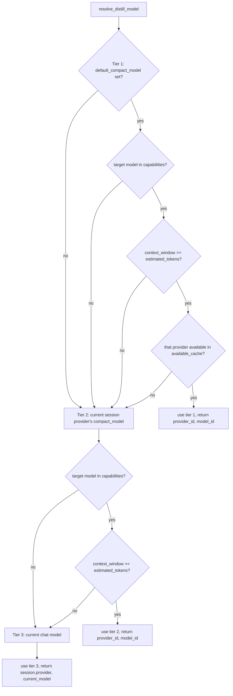
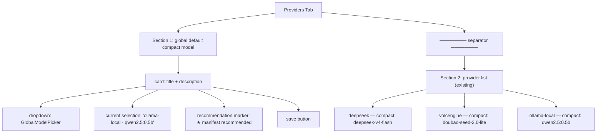

# ADR-056: Global Default Compact Model (Cross-Provider Alternative + Three-Tier Fallback)

> **Chinese source of truth**: [ADR-056](../zh/ADR-056-global-default-compact-model.md)
> **Terminology**: see [GLOSSARY.md](./GLOSSARY.md)

## Status

Settled

## Date

2026-09-12

## Decision Makers

大鱼 (Dayu)

## Predecessors

- [ADR-010](./ADR-010-context-compression-simplification.md) — the compact model concept
- [ADR-011](./ADR-011-compaction-as-distillation.md) — summary is distillation
- [ADR-033](./ADR-033-mqtt-replace-grpc-websocket.md) — the MQTT global resource push chain

---

## 1. Decision summary

Introduce a **global default compact model** concept, letting the user pick **any one** of
the models across all configured providers in the Harness UI as the cross-provider default
for the compact model. At runtime the distillation task resolves its target through a
three-tier fallback chain:

```
global default compact model → the current session provider's compact_model → the current chat model
```

**Core decisions**:

1. **Storage**: `agent_provider.json` gains a top-level `default_compact_model` field, at the same level as `providers[]` and `version`. It reuses the mature "Gateway global resource + MQTT push + Runtime cache" chain and does **not** introduce a separate settings file.
2. **Transport**: extend the `AvailableProviders` proto message with a new `optional CompactModelRef default_compact_model = 7` field. The per-`ProviderRef` `compact_model` is **not** reused — that one is a per-provider pick-one-of-two.
3. **Tier 2 is kept**: each provider's `compact_model` field stays as the fallback when tier 1 is unavailable.
4. **Tier 3 is kept**: the current chat model acts as the final fallback so a distillation task can always run.
5. **Manifest means "recommended"**: `manifest.toml [llm].compact_model` is only a "recommended" marker (a star / priority item) in the HarnessPage UI. It is **not** a runtime-enforced setting and is **not** synced in real time. Package first install does not auto-write `agent_provider.json`.
6. **Runtime instance resolution**: at distillation time the resolved `(provider_id, model_id)` is looked up in `available_cache` for the corresponding `base_url` + `api_key`, and a standalone provider instance is built to make the call. The session's current provider instance is **not** reused.

## 2. Context and motivation

### 2.1 Current state: the compact model is locked inside a single provider

Every provider in `agent_provider.json` currently carries a `compact_model`:

```json
{
  "id": "deepseek",
  "models": [{"id": "deepseek-v4-flash"}, {"id": "deepseek-v4-pro"}],
  "compact_model": "deepseek-v4-flash"
}
```

Constraint: `compact_model` must be a member of that provider's `models[]` (enforced by the `compactModel` option of HarnessPage's `ModelMultiSelect`).

### 2.2 Why that is a problem

| Scenario | Desired | Current |
|---|---|---|
| Want to use a local Ollama `qwen2.5:0.5b` for distillation | pick across providers | not possible, only a model of the current provider can be picked |
| The provider list contains only cloud commercial models | substitute a cheap local model | not supported |
| Switching the chat provider (e.g. deepseek→kimi) | keep the distillation policy independent | must re-pick a sub-model of kimi |
| The compact model of every provider is expensive | uniformly use the cheapest | constrained to the subset of the current chat provider |

### 2.3 Design goals

- **Decouple the distillation model from the chat provider** — distillation is an independent concern
- **Support a mix of local and commercial models** — e.g. "chat on deepseek-v4-pro, distill on ollama's qwen2.5:0.5b"
- **Guarantee availability through the three-tier fallback** — default → in-provider → chat model, so it always runs

## 3. Architecture and data flow

### 3.1 Overall data flow

```mermaid
graph LR
    A["HarnessPage UI (new global card at top)"] -->|"PUT /api/settings/default-compact-model"| B["Gateway HTTP API"]
    B -->|"persist + validate provider/model exists"| C["resource_cache (agent_provider.json)"]
    C -->|"trigger retained republish"| D["global_resources_publisher"]
    D -->|"MQTT acowork/global/providers"| E["Runtime session_init"]
    E -->|"cache default_compact_model"| F["AgentCore.default_compact_model"]
    F -->|"read during distillation"| G["resolve_distill_model"]
    G -->|"look up available_cache for base_url+api_key"| H["standalone provider instance"]
    H -->|"call compact_via_llm"| I["distillation done"]
```



### 3.2 Three-tier fallback decision tree



Each downgrade records a `tracing::warn!` carrying the reason (context too small / provider unavailable / model missing).

## 4. Data model

### 4.1 `agent_provider.json` top-level extension

```json
{
  "providers": [...],
  "default_compact_model": {
    "provider_id": "ollama-local",
    "model_id": "qwen2.5:0.5b"
  },
  "version": 84
}
```

- `default_compact_model: Option<CompactModelRef>` is nullable; `None` means no global default is set (relying only on the in-provider `compact_model` plus the chat model fallback).
- **Version compatibility**: an old `agent_provider.json` without this field deserializes to `None` and **does not break** the existing config.
- **Validation**: on save, `(provider_id, model_id)` MUST exist in `providers[]`; otherwise the request is rejected with HTTP 422.

### 4.2 Proto extension

```proto
// core/acowork-core/proto/mqtt_payload.proto
message AvailableProviders {
  uint64 version = 1;
  repeated ProviderRef providers = 2;
  // Global default compact model (one picked from the cross-provider alternatives).
  // Runtime distillation fallback chain: (1) this field (2) provider.compact_model
  // (3) current chat model
  optional CompactModelRef default_compact_model = 7;
}

message CompactModelRef {
  string provider_id = 1;
  string model_id = 2;
}
```

### 4.3 Runtime in-memory model

```rust
// core/acowork-runtime/src/agent/agent_core.rs
pub(crate) default_compact_model: Option<(String, String)>,  // (provider_id, model_id)
```

Initialized in `startup/session_init.rs` from `AvailableProviders.default_compact_model`.

## 5. Module change list

### 5.1 Gateway

| File | Change |
|---|---|
| `core/acowork-core/proto/mqtt_payload.proto` | add `CompactModelRef` + `AvailableProviders.default_compact_model` |
| `core/acowork-core/src/protocol.rs` | `AvailableProviders` / `ProviderListFile` / `AgentProviderConfig` Rust structs gain the field |
| `core/acowork-gateway/src/resource_cache.rs` | `ProviderListFile` serialization gains `default_compact_model`; add the setter `set_default_compact_model(provider_id, model_id) -> Result<(), String>` which does the existence validation and writes to disk |
| `core/acowork-gateway/src/http/settings_api.rs` (new) | `GET/PUT /api/settings/default-compact-model` endpoints |
| `core/acowork-gateway/src/http/provider_api.rs` | **unchanged** — `default_compact_model` is a global setting served by a dedicated settings endpoint (see the data flow in §3.1); `ProviderEntryResponse` keeps its per-provider semantics and does not redundantly carry this global field |
| `core/acowork-gateway/src/mqtt/global_resources_publisher.rs` | `AvailableProviders` construction attaches `default_compact_model` |
| `core/acowork-gateway/src/vault/mod.rs` | **unchanged** (a compact model is not a secret) |

### 5.2 Runtime

| File | Change |
|---|---|
| `core/acowork-runtime/src/agent/agent_core.rs` | new field `default_compact_model: Option<(String, String)>` + clone it into SnapshotContext |
| `core/acowork-runtime/src/startup/session_init.rs` | fill `c.default_compact_model` from `AvailableProviders.default_compact_model` |
| `core/acowork-runtime/src/mqtt/available_cache.rs` | new helper `is_provider_available(pid) -> bool` (checks that the api_key is non-empty and the provider is enabled) |
| `core/acowork-runtime/src/agent/loop_context.rs` | rewrite `resolve_distill_model` to implement the three-tier fallback and return `ResolvedDistill { provider_id, model_id, tier }`; the caller (`compact_session_if_needed`) looks up `base_url` + `api_key` in `available_cache` by `provider_id` and builds a standalone provider instance |
| `core/acowork-runtime/src/token/counter.rs` | the `model` parameter of `count_text` uses the resolved compact model — **key correction**: previously it used `current_model` for estimation, which is inaccurate in the cross-provider scenario |

### 5.3 Desktop UI

| File | Change |
|---|---|
| `apps/acowork-desktop/src/components/harness/HarnessPage.tsx` | insert `<GlobalCompactModelCard />` at the **top** of `ProvidersTab`; add a frontend `CompactModelRef` type (do not extend `GatewayConfig` — the field is read and written independently through the settings API) |
| new `apps/acowork-desktop/src/components/harness/GlobalCompactModelCard.tsx` | card component: title + description + `GlobalModelPicker` + save button |
| new `apps/acowork-desktop/src/components/harness/GlobalModelPicker.tsx` | aggregates `keys[].provider + keys[].models[]` into `{value: "provider_id::model_id", label: "provider · model"}`; supports search; shows the manifest recommendation marker on the right |
| `apps/acowork-desktop/src/lib/gateway-api.ts` | new `getDefaultCompactModel()` / `setDefaultCompactModel(provider_id, model_id)` |
| `apps/acowork-desktop/src/i18n/locales/zh-CN.json` etc. | new `harness.globalCompactModel.title` / `description` / `recommendBadge` strings |

## 6. UI design

### 6.1 Position and layout

At the top of `HarnessPage › Providers Tab`, a new "global settings" card area, separated
from the existing provider list by an `<hr>`:



### 6.2 Recommendation marker logic

```ts
// manifest recommended items = the set of (provider_id::model_id)
// taken from the current agent's manifest.toml [llm].compact_model
// injected into the UI props via the manifest load point (not back-derived
// from agent_provider.json)
function isRecommended(providerId: string, modelId: string): boolean {
  return recommendedRef === `${providerId}::${modelId}`;
}
```

- The UI only shows a small "★ recommended" badge. It does **not** preselect and does **not** auto-write.
- It takes effect only when the user actively clicks save.
- When the manifest changes the recommendation is recomputed the next time HarnessPage opens (not persisted).

### 6.3 Status hints

- If the selected `(provider_id, model_id)` is later deleted, the UI shows an orange warning: "the selected provider/model no longer exists and will fall back automatically"
- After a successful save, a toast: "the global default compact model has been updated"

## 7. Boundary conditions and degradation semantics

| Scenario | Behavior | Log / UI hint |
|---|---|---|
| The global default is not set | go to tier 2/3 | log `Using provider compact model` or `Using current chat model` |
| The global default provider was deleted | go to tier 2 | UI warning; log `Global default compact model provider removed, falling back` |
| The global default provider is unavailable (empty api_key / disabled) | go to tier 2 | log `Global default compact model provider unavailable, falling back` |
| The global default model has `context_window` < the estimated token count | go to tier 2 | log `Global default compact model context too small` |
| The tier 2 provider `compact_model` has the same problem | go to tier 3 | log `Provider compact model unavailable, using current chat model` |
| Tier 3 = the chat model, whose context is also too small | fall through to the existing `emergency_trim` safety net | log `Emergency trim triggered` (existing logic) |

**Core principle**: every downgrade makes a minimum-loss attempt and MUST NOT error out and interrupt distillation.

## 8. Compatibility

- **Config file**: an old `agent_provider.json` without `default_compact_model` deserializes to None via serde, and behavior degrades to the old logic (tier 2/3 only).
- **Proto compatibility**: an `optional` field with the new field number 7 is backward compatible; an old Runtime ignores the field, and an old Gateway does not send it.
- **HTTP API**: the new endpoint `/api/settings/default-compact-model` is added; the behavior of the existing `/api/providers` endpoints is **not** changed.
- **Manifest**: whether `[llm].compact_model` already exists needs a grep to confirm; if it exists its value is reused as the UI recommendation, otherwise the manifest recommendation is always empty (which does not block the feature).

## 9. Test plan

### 9.1 Unit tests

| Module | Cases |
|---|---|
| `resource_cache.rs` | (1) old config without the field loads normally; (2) setting a nonexistent `provider_id` returns an error; (3) setting a `model_id` that does not belong to that provider returns an error; (4) a normal set persists to disk and triggers the push |
| `provider_api.rs` | `ProviderEntryResponse.default_compact_model` deserializes correctly |
| `global_resources_publisher.rs` | `default_compact_model` serializes correctly into the `AvailableProviders` proto (both `None` and `Some`) |
| `loop_context.rs::resolve_distill_model` | (1) default unset → tier 2; (2) tier 1 provider unavailable → tier 2; (3) tier 1 context too small → tier 2; (4) tier 1 and 2 both fail → tier 3 (chat model); (5) token estimation uses the compact model rather than the chat model |
| `available_cache.rs::is_provider_available` | (1) non-empty api_key + enabled → true; (2) empty api_key → false; (3) provider missing → false |

### 9.2 Integration tests

| Scenario | Expected |
|---|---|
| Full chain: HarnessPage PUT → resource_cache persist → MQTT push → Runtime cache → resolve_distill hits tier 1 | log `Using global default compact model` |
| Full chain: the tier 1 provider's api_key is revoked → the next resolve_distill goes to tier 2 | log `Global default compact model provider unavailable, falling back` |
| Cross-provider distillation: chat=deepseek-v4-pro, distill=ollama-local/qwen2.5:0.5b | the distillation call uses the ollama provider instance and does not reuse deepseek |
| Manifest recommendation marker: manifest `[llm].compact_model = "ollama-local::qwen2.5:0.5b"` | that option in the UI GlobalModelPicker shows ★ |

### 9.3 Regression tests

- the existing `provider.compact_model` behavior is unchanged (still tier 2)
- the existing `compaction_prompt` (ADR-053) path is unaffected
- the existing `emergency_trim` safety net is unchanged
- the existing `agent_provider.json` v84 config upgrade path is not broken

## 10. Implementation phases

| Phase | Content | Depends on |
|---|---|---|
| **P1: data + transport** | proto extension + resource_cache setter + publisher republish | none |
| **P2: Runtime resolution** | the `default_compact_model` field + the three-tier `resolve_distill_model` + `available_cache::is_provider_available` + the token estimation fix | P1 |
| **P3: Gateway API** | the GET/PUT endpoints + validation + triggering the publisher | P1 |
| **P4: UI** | `GlobalCompactModelCard` + `GlobalModelPicker` + the recommendation marker + i18n | P3 |
| **P5: tests + docs** | unit/integration tests + the `docs/protocols/en/mqtt.md` field update | P2 + P3 + P4 |

Each phase is independently reviewable and mergeable, avoiding one large diff.

## 11. Open items and follow-ups

- Whether the manifest loader already recognizes `manifest.toml [llm].compact_model` and exposes it to the UI layer needs a grep to confirm. If it is not implemented, the UI recommendation marker in P4 first needs a minimal "read manifest `[llm].compact_model`" path (over a dedicated IPC / MQTT channel), which should be split into its own ADR.
- A per-agent override (a `default_compact_model_override` in `agent_config.json`) may be added later; out of scope here.
