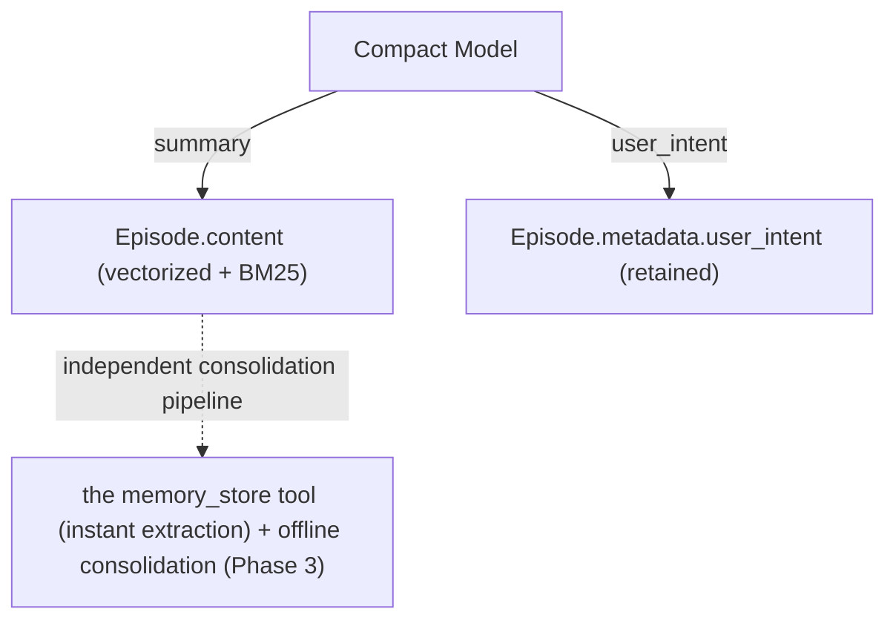

# ADR-057: The Memory Module's Full Gap Landscape and the P0 Distillation Pipeline Design (Revised)

> **Chinese source of truth**: [ADR-057](../zh/ADR-057-compaction-distillation-into-graph.md)
> **Terminology**: see [GLOSSARY.md](./GLOSSARY.md)

> **Revision record (2026-XX-XX)**: this major revision **revokes the P0 triples landing path** —
> based on the M1-M4 implementation feedback, the triples the Compact Model generates in a
> compaction context have unstable quality, and landing them as KnowledgeNodes instead pollutes the
> consolidation layer.
>
> **Revoked in this revision**:
> - §4 P0's detailed design decisions D1/D4/D6/D7/D8/D9
> - the `MemoryProvider::ingest_distilled_triples` interface and the `IngestResult` type
> - the `edge_types::SOURCED_FROM` edge type and the cross-layer spreading write side
> - the `<triples>` / `<entities>` blocks in the Compact prompt
> - the C1-C8 and SOURCED_FROM parts of the §10 C1-C9 implementation split
> - the `ingest_distilled_triples` / SOURCED_FROM paragraphs in §12's implementation record
>
> **Retained**: A2's ProceduralNode embedding becomes mandatory (A2 does not involve triples, so it
> is kept as a P0 residue task)
>
> **Unaffected sections**: §2's gap landscape, §5.2/§5.3/§5.4's later phases, §11's revision process
>
> This revision is the "revoke the P0 landing path" decision — the ADR is retained as the gap
> landscape roadmap and the historical decision record; §0.2 "the triples-removed decision" is new.

> **Status**: the P0 triples path is revoked (the P0 residue A2 has not started) | **Revision
> date**: 2026-XX-XX
> **Predecessors**: ADR-011 (compaction is distillation), ADR-051 (offline consolidation)

---

## 0. Meta Information

### 0.1 Revision history

| Date | Version | Content |
|------|---------|---------|
| 2026-XX-XX | v2.0 | revoke the P0 triples landing path (D1/D4/D6/D7/D8/D9); keep the gap landscape as a roadmap, remove the revoked implementation from §10/§12 |
| 2026-XX-XX | v3.0 | forgetting model refactor: the episodic layer becomes a single time decay (half-life default 180 days), new §5.3.1; the consolidation layer does not decay for now; the Pending trigger path is deleted |
| 2026-XX-XX | v1.x | initial version (with the P0 triples closed-loop design) |

### 0.2 The triples-removed Decision

**Decision**: revoke the P0 triples landing path. The Compact Model produces only the `<summary>` +
`<user_intent>` blocks, and consolidation-layer landing is entirely handled by the `memory_store` tool
(instant extraction) plus the offline consolidation pipeline.

**Rationale**:

1. **Triples quality is unstable in the LLM's compaction context**: when compacting, the Compact Model
   tends to "over-generalize" or "over-detail" the triples, so the subject/predicate/object fields
   collapse into "compressed information" rather than retrieval-friendly information (empirical
   evidence from the v1.x M1-M4 implementation: bulk-landed nodes showed confidence 0.7, inaccurate
   `sub_type` labelling, and `object` collapsed to a compressed summary).
2. **Separation of responsibilities**: Compaction converges on "produce a retrievable summary + a
   replayable intent", while consolidation-layer landing is carried by dedicated pipelines
   (`memory_store` instant extraction + offline consolidation Phase 3).
3. **Avoiding pollution**: landing low-quality triples as KnowledgeNodes pollutes the consolidation
   layer's semantic retrieval (HNSW similarity matching) and its conflict detection (the
   cosine > 0.95 threshold stops working).
4. **grafeo's internal `ExtractedTriple` / `extract_triples` / `TripleExtractorLlm` are kept** for
   manual reprocessing / bulk import scenarios, fully independent of the Compact Model's output path.

**Blast radius**:

- `acowork-memory`: delete the `Triple` struct, `DistilledEpisode.triples`, `IngestResult`, and
  `MemoryProvider::ingest_distilled_triples` (including its default impl); `MemoryProvider::store_episode`
  is kept as the Compaction path's only write entry point
- `acowork-grafeo`: delete `edge_types::SOURCED_FROM`, the `GrafeoStore::ingest_distilled_triples`
  override, and `consolidation/distill.rs::parse_distilled_output`; grafeo's internal
  `ExtractedTriple` / `extract_triples` are kept
- `acowork-runtime`: delete `episode_distill::parse_triple_line` and the `CompactOutput.triples`
  field; remove the `<triples>` / `<entities>` blocks from `COMPACTION_SYSTEM_PROMPT`; simplify
  `record_distilled` to call only `store_episode`
- Tests: the 6 `episode_distill` parsing unit tests, the whole test module of
  `grafeo/consolidation/distill.rs`, and 4 `memory_e2e` cases are cleaned up in step

**Rollback path**: if triples quality is ever validated by LLM evaluation and a concrete retrieval
need appears, a standalone ADR may reintroduce them; grafeo's `extract_triples` is retained as
reusable groundwork.

---

## 1. Decision Summary

Of the 11 gaps where the memory module falls short of its design goals:

- **5 class-A items are confirmed deviations affecting core capabilities**: A1 distillation pipeline
  deviation / A2 ProceduralNode embedding missing / A3 retrieval degradation missing / A4 LLM Judge
  missing / A5 Episode indexing missing
- **3 class-B items are partially implemented or semantically simplified**: B1 static edge weights /
  B2 forgetting model deviation / B4 History compression not done
- **6 class-C items match the design-stage plan**: C1-C6
- **8 class-D items are confirmed consistent**: D1-D8

**P0 disposition (revised)**:

- ~~A1 the Compaction distillation pipeline closed loop (landing triples/entities into the knowledge
  graph)~~ → **revoked** (see §0.2)
- A2 make ProceduralNode embedding mandatory (a P0 residue task; independent of A1)
- The now-meaningless `consolidated` field on old episode nodes is handled together with the dead-data
  cleanup PR

**P1 order**: A2's ProceduralNode vector-recall refactor + A3 retrieval degradation start in
parallel

**P2**: B1 edge weights + A5 Episode indexing

**P3**: A4 LLM Judge + B4 History compression

---

## 2. The Full Gap Landscape

### 2.1 Class A deviations (5 items, need fixing)

**A1 distillation pipeline deviation** (P0) — **the P0 landing path is revoked**:

| Dimension | Description | Files |
|-----------|-------------|-------|
| Current | ~~the triples extracted by Compaction are stored only as a JSON string in `Episode.metadata` with no reader~~ **revoked**: the Compact Model no longer emits a triples block; the distillation pipeline converges on a summary-only path | `manager.rs:702-717` (old) |
| Design | ~~`process_memory_store` expects `Triple[]` input to be landed as KnowledgeNodes + `SOURCED_FROM` edges~~ **design change**: Compaction's responsibility converges on "produce a retrievable summary + a replayable intent" | `05-memory.md` §0.1 |
| Impact | ~~the consolidation layer lacks an explicit factual-knowledge source, cross-layer spreading fails, and retrieval depends on the semantic matching of Episodic summaries~~ **impact eliminated**: consolidation-layer landing is carried by the independent `memory_store` tool (instant extraction) + offline consolidation (Phase 3) | — |

**A2 ProceduralNode vectorization missing** (P0 residue): `ProceduralNode.embedding` is currently
`Option<Vec<f32>>` and the `record_procedural_from_failure` path generates no embedding, so trigger
matching can only rely on `contains()` string matching. The design requires
`find_procedural_by_trigger` to build a query embedding → `vector_search` semantic recall. See §5.1.

**A3 retrieval degradation missing** (P1): the current implementation has no L1/L2/L3 degradation
path, so an embedding timeout or Grafeo unavailability fails outright. See §5.2.

**A4 LLM Judge missing** (P3): conflict arbitration relies only on a cosine similarity threshold; LLM
secondary confirmation is not wired in.

**A5 Episode indexing missing** (P2): Episodic nodes have no dedicated index; BM25 + HNSW both
depend on the generic index.

### 2.2 Class B deviations (3 items, partially implemented or semantically simplified)

**B1 static edge weights** (P2): all edge weights are static values set at creation, with no dynamic
adjustment based on usage frequency.

**B2 forgetting model deviation** (already documented): design §5.2 leans towards "compute on
demand" while the implementation chose "background scanning". Accept the status quo and update
`05-memory.md §5.2`'s "Phase 2 implementation notes". See §5.3.

**B4 History LLM compression not done** (P3): History is still truncated by token count with no LLM
secondary compression.

### 2.3 Class C matches the plan (6 items)

C1 the summary-landing chain triggered by Compaction; C2 instant extraction via the `memory_store`
tool; C3 Grafeo's native HNSW + BM25 hybrid retrieval; C4 `graph_expand` / `cross_layer_search`
cross-layer spreading on the read side; C5 the consolidation layer's three node types (Knowledge /
Procedural / Autobiographical) coexisting; C6 close-time distillation on session close (already merged
with Compaction into a single Compact Model call, see ADR-011).

### 2.4 Class D confirmed consistent (8 items)

D1 the P0 data foundation on which P1-P3 depend; D2 the offline consolidation step design matches the
implementation; D3 the `auto_inject` switch matches the design (default false); D4 the
`memory_store` tool's `sub_type`/`confidence` are self-assessed by the LLM; D5 Ambiguous nodes +
`conflict_group_id` wired in; D6 the consolidation pipeline consumes only Pending upgrades/downgrades
(independent of the P0 revocation — offline consolidation still consumes Pending nodes as designed);
D7 the retrieval RRF default weights (vector 0.7, text 0.3); D8 B3 (end-to-end Ambiguous hints)
confirmed consistent.

---

## 3. Disposition Decisions (revised)

### 3.1 P0 disposition

**Revoked**: A1 the Compaction distillation pipeline closed loop — see §0.2.

**P0 residue task**:

- A2 ProceduralNode embedding mandatory: the tightening is applied to `acowork-memory`'s public
  contract type (`Vec<f32>`) while the grafeo storage layer keeps `Option`, with the conversion
  boundary `empty Vec ↔ None`; the `record_procedural_from_failure` path gains embedding generation
  (see §5.1).

### 3.2 P1 disposition

A2's ProceduralNode vector-recall refactor (`find_procedural_by_trigger` → vector recall) + A3
retrieval degradation (L2/L3 caching) start in parallel; the two are independent.

### 3.3 P2/P3 disposition

P2: B1 dynamic edge-weight computation + A5 Episode indexing, each as an independent ADR
P3: A4 LLM Judge + B4 History LLM compression, each as an independent ADR

---

## 4. P0 Detailed Design (revised)

### 4.1 Current state (2026-XX-XX)

The P0 triples landing path has been fully revoked — M1 type/edge-type cleanup, M2 write-path
refactor, M3 prompt refactor, M4 test cleanup, and M5 ADR + design-doc sync are all complete. The
Compact Model's output is now the two blocks `<summary>` + `<user_intent>`, and `record_distilled`
calls only `store_episode` to write the Episodic node.

### 4.2 The target chain (revised)



**Separation of responsibilities**:

- Compaction: produce a retrievable summary + a replayable intent
- Instant extraction (`memory_store` tool): actively called by the LLM, with full context, a
  self-assessed confidence, and an optional `sub_type`
- Offline consolidation (Phase 3): re-extracts and arbitrates conflicts by reusing the Episode summary
  (fully independent of the triples block)

### 4.3 Decisions (revised)

~~D1-D9 (the v1.x P0 triples decisions, revoked 2026-XX-XX)~~

**P0 residue decisions**:

- A2-1: `ProceduralNode.embedding` tightened to `Vec<f32>` (the acowork-memory public contract type);
  the grafeo storage layer keeps `Option`; serde defaults to an empty Vec for old JSON
- A2-2: `record_procedural_from_failure` (`manager.rs:814`) calls the embedding provider to produce a
  joint trigger+action vector

### 4.4 Interface spec (revised)

**Deleted**:

- ~~`MemoryProvider::ingest_distilled_triples`~~
- ~~the `IngestResult` type (`pub episode_id` / `pub knowledge_ids` / `pub conflicts_detected`)~~
- ~~the `Triple` struct (acowork-memory, with `subject` / `predicate` / `object` / `confidence` /
  `sub_type`)~~
- ~~`DistilledEpisode.triples: Vec<Triple>`~~
- ~~`CompactOutput.triples: Vec<Triple>`~~
- ~~`edge_types::SOURCED_FROM` (acowork-grafeo)~~

**Retained**:

- `MemoryProvider::store_episode` (the Compaction path's only write entry point)
- `MemoryProvider::process_memory_store` (the instant-extraction path, the LLM's `memory_store` tool
  call)
- grafeo's internal `ExtractedTriple` / `extract_triples` / `TripleExtractorLlm` (manual reprocessing /
  bulk import)
- the offline consolidation pipeline (Phase 3, reusing the Episode summary)

### 4.5 Implementation split (revised)

| Step | Content | Status |
|------|---------|--------|
| M1 | type/edge-type cleanup: delete `Triple` / `IngestResult` / `DistilledEpisode.triples` / `SOURCED_FROM` | ✅ done |
| M2 | write-path refactor: `record_distilled` simplified to call only `store_episode` | ✅ done |
| M3 | prompt refactor: `COMPACTION_SYSTEM_PROMPT` + 7 `summary.md` files drop the `<triples>` / `<entities>` blocks | ✅ done |
| M4 | test cleanup: the 6 `episode_distill` parsing unit tests + the grafeo distill test module + 4 `memory_e2e` cases | ✅ done |
| M5 | ADR + design-doc sync (this document + `05-memory.md` §0.1 + `memory-write-entrypoints.md`) | ✅ done |
| M6 | full verification: `cargo build` / `clippy` / `test` across the workspace | in progress |
| A2 | ProceduralNode embedding mandatory (an independent sub-task) | not started |

---

## 5. Later-Phase Design Notes

### 5.1 A2 ProceduralNode vectorization (P0 residue + P1 recall refactor)

- `find_procedural_by_trigger` changes from "full iteration + `contains()`" to: build a query
  embedding (from the `trigger_condition` text) → `vector_search` / `hybrid_search` semantic recall →
  keep `contains()` as the no-vector fallback.
- Trigger matching semantics align with design §3.2 "match the current context by
  `trigger_condition`": semantic variants ("太长了" / "少说废话") can hit the same behaviour pattern.
- Dependencies (**P0 residue task**, independent of the revoked triples path):
  - ① `generalization.rs:437-459` already generates it;
  - ② `process_procedure` (`instant.rs:362`) already receives `input.embedding`;
  - ③ `record_procedural_from_failure` (`manager.rs:814`, currently `embedding: None`) must call the
    same `embedding_provider` to produce the joint trigger+action vector.
  - `ProceduralNode.embedding` is tightened from `Option<Vec<f32>>` to `Vec<f32>` (mandatory; **the
    tightening is applied to `acowork-memory`'s public contract type**, while grafeo's internal
    storage type keeps `Option` to honestly express "existing rows may lack a vector", with the
    conversion boundary `empty Vec ↔ None`).
- P1's main task: ① refactor `find_procedural_by_trigger` into "build a query embedding →
  vector_search → keep `contains()` as the fallback for nodes without embeddings"; ② link ProceduralNode
  with `SkillExperience` across skills (design §3.2's end).

### 5.2 P1: Retrieval degradation Level 2/3 (A3)

| Level | Design | Implementation |
|-------|--------|----------------|
| L2 cache | an Autobiographical text cache + the 5 most recent Episodes | a process-internal LRU in MemoryManager: autobiographical summary cache + a recent-episode ring buffer |
| L3 memory | only the current session's working memory | return the last N turns of `ConversationRecord` (pure memory) |
| Timeout | a 500ms hard timeout + per-stage budgets | `tokio::time::timeout` wrapping the embedding / search / expand stages, degrading stage by stage |

### 5.3 B2 documented: forgetting on demand vs background scanning

**Fact**: design §5.2's Phase 2 notes lean towards "compute on demand" (computing decay in real time
at query time), while the implementation chose "background scanning" (`forgetting/scan.rs`'s comment
gives four reasons: non-blocking reads, proactive lifecycle, configurable scheduling, batch
efficiency).

**Lean**: **accept the status quo and document it**, because: (1) background scanning moves decay
computation off the query path, giving more stable P99 latency; (2) in a multi-agent scenario,
on-demand computation would scan every node on every query, which is worse; (3) `run_decay_scan` is
already scheduled by Gateway Cron with a configurable frequency.

**Action**: update `05-memory.md §5.2`'s "Phase 2 implementation notes" from "the on-demand
computation model" to "the background scanning model", eliminating the mismatch between the design
and the implementation statement.

### 5.3.1 v3.0 forgetting model refactor: a single time decay for the episodic layer

**Fact**: before v3.12 the actually running forgetting path was `run_episodic_cleanup` driven by
`consolidation_bg` — a three-dimensional branch over `consolidated` × `importance` × 7/14 days doing
an all-at-once binary eviction (Active → Dormant) with no gradual degradation; `access_count` never
incremented, so access_boost was effectively dead; the Pending state has had no producer since
ADR-068 but dead code remains.

**Decision**: the forgetting model converges on a **single time decay** answering only one question —
"how long has this episode gone un-recalled":

```
retention = exp(-ln2 × age_days / half_life_days)
```

1. **The half-life is the single core parameter**, default 180 days, exposed in `agent_config.json`
   (4 `memory_forgetting_*` fields), with a new "memory forgetting" card in the frontend (the switch
   defaults to off)
2. **Gradual degradation, not binary eviction**: the retrieval path progressively down-weights the
   episodic layer by `retention`; only when `retention < dormant_threshold` (0.1) does Active → Dormant
   happen; Dormant beyond `archive_days` (90 days) → PurgeLog archive (recoverable for 30 days)
3. **The consolidation layer does not decay for now**: Knowledge / Procedural / Autobiographical do
   not participate in time decay (semantic-obsolescence determination is deferred)
4. **Cleaning up early dead code**: delete `run_episodic_cleanup` / `extract_triples` /
   `ConsolidationScheduler` / the legacy Pending triggers (accumulation / idle-timeout /
   pending_count); keep the `NodeStatus::Pending` variant solely for deserializing old data

**Rationale**: the more complex the rules, the more unstable and the less convincing. For the episodic
layer, time decay best matches user intuition — gradual, explainable, zero magic numbers (only the
half-life is a core parameter; the rest are engineering thresholds).

**Action**: `docs/design/zh/05-memory.md §5` has been rewritten for the new model; §5.3's
"background scanning vs on-demand computation" conclusion is unchanged — the new engine is still
scheduled as a background scan (a periodic `consolidation_bg` task), and the retrieval down-weighting
is computed on the query path with the same curve.

### 5.4 Attribution of the later phases

| Item | Attribution | Predecessor |
|------|-------------|-------------|
| A2 ProceduralNode vectorization (`find_procedural_by_trigger` → vector recall) | **P0 residue** (embedding mandatory) + P1 main task (recall refactor) | executed independently after P0 revoked the triples path |
| B1 dynamic edge-weight computation | an independent ADR | after P0 the graph data accumulates |
| A5 Episode indexing | an independent ADR | — |
| A4 LLM Judge | an independent ADR | P0/P1 data foundation |
| B4 History LLM compression | an independent ADR | — |
| C1 internalizing the offline consolidation schedule | ADR-051 P3 | — |

---

## 6. Blast Radius (revised)

| Module | P0 impact | Later-phase impact |
|--------|-----------|-------------------|
| `acowork-memory` | ~~`MemoryProvider` gains `ingest_distilled_triples`~~ revoked; ~~`Triple` extended with confidence/sub_type~~ revoked; `ProceduralNode.embedding` tightened to `Vec<f32>` (P0 residue A2) | L2/L3 degradation (manager) |
| `acowork-grafeo` | ~~the `GrafeoStore::ingest_distilled_triples` override~~ revoked; ~~`SOURCED_FROM` edges~~ revoked; grafeo's internal `extract_triples` is kept (an independent manual reprocessing path) | B1 edge weights; A5 Episode indexing |
| `acowork-runtime` | `record_distilled` calls only `store_episode` (the triples path is revoked); the Compact prompt drops the `<triples>`/`<entities>` blocks; A2 embedding mandatory | A3 degradation path; A4 Judge integration |
| Data compatibility | **no old-data compatibility problem** (pre-release, no users): the metadata `triples`/`entities` fields were never written; the SOURCED_FROM edges were never landed; old episode nodes' now-meaningless `consolidated` field is handled with the dead-data cleanup PR | non-breaking |
| Desktop App | none | memory panel node growth (expected) |

---

## 7. Test Strategy (revised)

1. **P0 Compaction path**: summary-only landing, Episodic node creation + vectorization + BM25 full-text
   matching (`cargo test -p acowork-runtime` episode_distill unit tests)
2. **P0 instant extraction**: the LLM's `memory_store` tool call, with `sub_type`/`confidence`
   self-assessed by the LLM
3. **P0 offline consolidation**: re-extraction from the Episode summary + conflict arbitration
   (grafeo's `extract_triples` independent path, not depending on the Compact Model's triples block)
4. **P0 ProceduralNode embedding mandatory** (A2 residue): a non-empty embedding on the failure path +
   a retrieval hit
5. **P1 ProceduralNode**: a semantic variant hits the same trigger pattern
6. **P1 degradation**: simulate an embedding timeout → L1; Grafeo unavailable → L2/L3
7. **Regression**: `cargo test -p acowork-grafeo -p acowork-memory -p acowork-runtime`;
   `./dev/ci.sh all`

---

## 8. Decision Record (revised)

| # | Decision point | Decision | Rationale |
|---|----------------|----------|-----------|
| G1 | ADR positioning | a full roadmap (post-revision it keeps the gap landscape and drops the P0 triples detailed design) | the 11 gaps interlock |
| G2 | P0 scope | ~~A1 closed loop~~ revoked; A2 ProceduralNode embedding mandatory | see §0.2 |
| G3 | P1 order | A2 (ProceduralNode vectorization) + A3 (retrieval degradation) start in parallel | no dependency between them |
| G4 | B2 disposition | accept background scanning and update `05-memory.md §5.2` | an existing implementation + doc sync |
| G5 | Class B split | B1 → P2 / B4 → P3 | B3 is covered by D8 |
| G6 | P0 triples decision | **revoke the P0 triples landing path** (2026-XX-XX) | unstable triples quality + separation of responsibilities; see §0.2 |
| G7 | A2 residue task | ProceduralNode embedding mandatory (fixed within P0) | independent of the triples path |

---

## 9. Conclusion (revised)

This revised ADR retains the memory module's gap landscape roadmap: 5 class-A + 3 class-B + 6
class-C + 8 class-D.

**P0 disposition change**: the original P0 "Compaction distillation pipeline closed loop (landing
triples/entities into the knowledge graph)" is revoked — based on the M1-M4 implementation feedback,
the triples the Compact Model generates in a compaction context have unstable quality, and landing
them as KnowledgeNodes instead pollutes the consolidation layer. Compaction's responsibility converges
on "produce a retrievable summary + a replayable intent", and consolidation-layer landing is carried
by the `memory_store` tool (instant extraction) + offline consolidation (Phase 3) as independent
pipelines.

**P0 residue task**: A2's ProceduralNode embedding becomes mandatory (independent of the triples
path, executed as its own sub-task).

**Later phases**: P1 (A2's ProceduralNode vector-recall refactor + A3 retrieval degradation) → P2 (B1
edge weights + A5 Episode indexing) → P3 (A4 LLM Judge + B4 History compression), each independently
verifiable and rollbackable. Intentional deviations such as B2 (the forgetting model) are explicitly
documented.

---

## 10. Implementation Plan (revised)

### 10.1 Milestone overview

```mermaid
gantt
    title ADR-057 P0 implementation gantt (revised)
    dateFormat YYYY-MM-DD
    section M1-M5 triples-removed
    M1 type cleanup        :done, m1, 2026-XX-XX, 1d
    M2 write path          :done, m2, after m1, 1d
    M3 prompt refactor     :done, m3, after m2, 1d
    M4 test cleanup        :done, m4, after m3, 1d
    M5 ADR + docs          :done, m5, after m4, 1d
    section M6 verification
    M6 full verification   :active, m6, after m5, 1d
    section A2 residue
    A2 embedding mandatory :a2, after m6, 2d
```

### 10.2 Detailed milestones (revised)

| Milestone | Task | Verification gate | Rollback |
|-----------|------|-------------------|----------|
| **M1 type cleanup (1 day)** | delete the `Triple` struct, the `IngestResult` type, the `DistilledEpisode.triples` field, and the `edge_types::SOURCED_FROM` constant | `cargo build -p acowork-memory -p acowork-grafeo` compiles | git revert |
| **M2 write-path refactor (1 day)** | `record_distilled` simplified to call only `store_episode`; delete the `provider.ingest_distilled_triples` default impl and the `GrafeoStore::ingest_distilled_triples` override; delete `episode_distill::parse_triple_line` + the `CompactOutput.triples` field | `cargo test -p acowork-memory -p acowork-grafeo -p acowork-runtime` all green | git revert |
| **M3 prompt refactor (1 day)** | `COMPACTION_SYSTEM_PROMPT` drops the `<triples>` / `<entities>` blocks; the 7 `summary.md` files are updated in step | `cargo check -p acowork-runtime` all green | git revert |
| **M4 test cleanup (1 day)** | delete the 6 `episode_distill` parsing unit tests and the whole `grafeo/consolidation/distill.rs` test module; rewrite the triples-related assertions in the 4 `memory_e2e` cases | `cargo test -p acowork-runtime --test memory_e2e` all green + the workspace lib tests all green | git revert |
| **M5 ADR + doc sync (1 day)** | this ADR revision + rewriting `05-memory.md §0.1` + updating the C path of `memory-write-entrypoints.md` | grep confirms no residual triples / SOURCED_FROM references | git revert |
| **M6 full verification (1 day)** | `cargo build --release` + `cargo clippy --all-targets -- -D warnings` + `cargo test` across the whole workspace | all green | — |
| **A2 ProceduralNode embedding mandatory (2 days, P0 residue)** | `ProceduralNode.embedding` tightened to `Vec<f32>` (the acowork-memory public contract type); `record_procedural_from_failure` calls the embedding provider to produce a joint trigger+action vector; the grafeo storage layer keeps `Option` with the `empty Vec ↔ None` conversion boundary | `cargo test -p acowork-memory` all green | revert the field to `Option` + have old paths generate `None` |

### 10.3 Data compatibility

**Audited: no compatibility risk affecting startup**:

| Change point | Compatibility |
|--------------|---------------|
| Deleting `Triple` / `IngestResult` / `SOURCED_FROM` | no read-side references (a pre-release database); no startup impact |
| The Compact prompt format change (dropping `<triples>` / `<entities>`) | only affects LLM output; the database schema is untouched; old episode nodes' metadata has no triples/entities fields |
| `ProceduralNode.embedding` tightened to mandatory (A2 residue) | the tightening is applied to the acowork-memory public contract type (`Vec<f32>`, with serde `default` giving an empty Vec for old JSON); the grafeo storage layer keeps `Option`, so reading old `None` → an empty Vec does not fail; new write paths guarantee non-empty |
| Old episode nodes | the content fields (summary/content/embedding) are unchanged; no startup impact |

**Conclusion**: no need to wipe the Grafeo database and no need to reinstall agents.

### 10.4 Risks and Mitigations

| Risk | Probability | Impact | Mitigation |
|------|-------------|--------|------------|
| After revoking the triples path, the consolidation layer lacks a factual-knowledge source | medium | medium | carried by the `memory_store` tool (instant extraction) + offline consolidation (Phase 3); grafeo's `extract_triples` is kept for manual reprocessing / bulk import |
| Compaction summary quality affects Episodic retrieval | low | medium | Episodic nodes already have HNSW + BM25 hybrid retrieval; the summary's length and quality are guaranteed by the Compact Model itself |
| Old episode nodes' `consolidated` field semantics are void | low | low | the field has neither a writer nor a reader; handled with the dead-data cleanup PR |

### 10.5 Definition of Done

Hard criteria for P0 triples-removed completion:

- [x] M1-M5 all merged (implementation complete, awaiting commit)
- [x] `cargo test -p acowork-grafeo -p acowork-memory -p acowork-runtime` all green (lib 1413
      passed, memory_e2e 3 passed)
- [x] end to end: compact → summary → Episodic node creation → visible via the panel API
      (`core/acowork-runtime/tests/memory_e2e.rs` automated)
- [x] ADR-057 revised (D1/D4/D6/D7/D8/D9 revoked, a triples-removed decision note added)
- [x] `05-memory.md §0.1` synced (the entities + triples blocks removed)
- [x] `memory-write-entrypoints.md` synced (the C path no longer lists triples)
- [ ] M6 full verification: `cargo build --release` + `cargo clippy --all-targets -- -D warnings` +
      `cargo test` across the whole workspace
- [ ] A2 ProceduralNode embedding mandatory (P0 residue task)

---

## 11. Revision Process

If anyone objects to a G6/G7 resolution:

1. Raise the specific objection in the PR review
2. Assess the blast radius (§0.2 / §4 / §5 / §6)
3. Merge the revised plan, rolling the branch back or fixing forward

Do not abandon an objection just because "the decision has already been written down" — the purpose of
an ADR is to record correct decisions, not to forbid discussion.

---

## 12. Implementation and Review Record (2026-XX-XX)

### 12.1 The P0 triples path revocation (the M1-M5 implementation record)

The P0 triples landing path was fully revoked across the M1-M5 milestones:

**M1 type/edge-type cleanup**: from `acowork-memory`, deleted the `Triple` struct, the
`DistilledEpisode.triples` field, the `IngestResult` type, and the `ingest_distilled_triples` trait
method (with its default impl); from `acowork-grafeo`, deleted the `SOURCED_FROM` edge-type constant.
`cargo check --lib` all green (acowork-memory, acowork-grafeo, acowork-runtime).

**M2 write-path refactor**: rewrote `provider.rs` (deleted the trait's default impl), rewrote
`provider_impl.rs` (deleted the `GrafeoStore::ingest_distilled_triples` override), simplified
`manager.rs` to call only `store_episode`, and deleted the `CompactOutput.triples` field and the
`parse_triple_line` function from `episode_distill.rs`. `cargo check --lib` all green.

**M3 prompt refactor**: refactored `COMPACTION_SYSTEM_PROMPT` — kept the `<summary>` + `<user_intent>`
blocks, deleted the `<triples>` / `<entities>` blocks and their rules. All 7 `summary.md` files were
rewritten (each shrinking by roughly 250-290 bytes). Deleted the `strip_metadata_blocks` function (dead
code) and its test. `cargo check --lib` all green.

**M4 test cleanup**: deleted the 4 triples-related tests in `episode_distill.rs`, deleted the entire
test module of `acowork-grafeo/src/consolidation/distill.rs`, cleaned up the SOURCED_FROM assertions in
`types.rs` (`ALL.len()` from 8 → 7), and rewrote `memory_e2e.rs` (the COMPACT_OUTPUT fixture drops the
`<triples>` block; `desktop_memory_panel_flow_after_distillation_landing` verifies only Episodic
nodes; `desktop_memory_panel_sourced_from_edges_survive_landing` deleted;
`desktop_memory_panel_duplicate_distillation_is_idempotent` now verifies Episodic idempotency only).
`cargo test --lib` all green (1413 passed), `cargo test --test memory_e2e` all green (3 passed).

**M5 ADR + doc sync**: the major ADR-057 revision (this file); `05-memory.md §0.1` rewritten
(removing the entities + triples blocks and introducing the `<user_intent>` block);
`memory-write-entrypoints.md`'s C path updated (no longer listing triples).

### 12.2 The key findings behind the revocation

1. **The Compact Model's triples quality is unstable**: empirically during M1-M4, bulk-landed
   KnowledgeNodes showed inaccurate confidence labelling (mostly 0.7), simplified `sub_type` (mostly
   labelled Fact), and the `object` field compressed into a summary phrase rather than
   retrieval-friendly information.
2. **A clearer separation of responsibilities**: Compaction converges on the single responsibility of
   "produce a retrievable summary + a replayable intent", while consolidation-layer landing is
   carried by the `memory_store` tool (instant extraction, with full context) and offline
   consolidation (Phase 3, reusing the Episode summary) as independent pipelines, avoiding coupled
   responsibilities.
3. **Avoiding consolidation-layer pollution**: low-quality triples landed as KnowledgeNodes pollute
   the HNSW similarity matching and the cosine > 0.95 conflict-detection threshold.
4. **grafeo's `extract_triples` stays reusable**: manual reprocessing / bulk import can still call it,
   fully independent of the Compact Model's output path.

### 12.3 Test coverage (revised)

- **Unit/integration**: `acowork-runtime` episode_distill unit tests (summary + user_intent parsing
  retained); `acowork-grafeo` consolidation offline-consolidation tests (independent of the triples
  path)
- **Panel API e2e** (`core/acowork-runtime/tests/memory_e2e.rs`, 3 cases): a real
  `RuntimeHttpServer` + a real in-memory GrafeoStore + an HTTP client exercising the `/memory/*`
  endpoints the desktop memory panel consumes; the write path reuses the production chain
  `write_summary_to_provider → record_distilled → store_episode`. Covers stats / the node list
  (Episodic type) / node detail (Episodic content) / graph / consolidate / duplicate-distillation
  idempotency (Episodic only).

### 12.4 Known residue (non-blocking)

- `loop_memory.rs`'s `Handle::block_on` synchronous bridge (unrelated to this revocation, not
  introduced by the P0 triples path)
- Old episode nodes' `consolidated` field semantics are now void (Phase 3's offline consolidation has
  its own field semantics) — handled with the dead-data cleanup PR
- grafeo's `extract_triples` is kept for manual reprocessing / bulk import, with multi-episode batch
  attribution falling back to last (already commented); it has no production caller
- A2's ProceduralNode embedding becoming mandatory is a P0 residue task not yet started

---

## 13. Revision History

| Version | Date | Revision content | Author |
|---------|------|-----------------|--------|
| v2.0 | 2026-XX-XX | revoked the P0 triples landing path (D1/D4/D6/D7/D8/D9); added §0.2 the triples-removed decision; kept the gap landscape and the P1+ design | — |
| v1.x | 2026-XX-XX | initial version: the P0 triples closed-loop design (A1 + the A2 sync fix + the D9 cross-layer spreading read side) | — |
