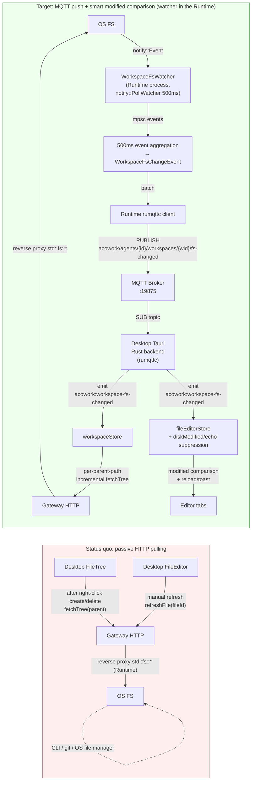

# ADR-058: Workspace Filesystem Changes Pushed to Desktop over MQTT for Automatic Refresh

**Status**: Proposed (revised per the architecture review, see the [review report](../../review/zh/gateway-runtime-isolation-review.md))
**Date**: 2026-09-12 (revised: 2026-08-25)
**Deciders**: 大鱼
**Prerequisites**:
- [ADR-009](./ADR-009-gateway-workspace-isolation.md) (The Gateway does not read workspace files — only the Runtime / Desktop side touches the FS; **English version**, the zh version has not been translated yet)
- [ADR-033](./ADR-033-mqtt-replace-grpc-websocket.md) (MQTT replacing gRPC + WebSocket — the IPC main channel)
- [ADR-034](./ADR-034-mqtt-http-boundary.md) (MQTT / HTTP responsibility boundary — topic naming "by data source")
- [ADR-048](./ADR-048-debug-protocol-mqtt-http.md) (Debug Protocol over MQTT + HTTP template — the precedent for **Runtime publishing directly to Desktop** on the same chain)
- [ADR-054](./ADR-054-debug-context-snapshot-coverage.md) (the same pattern of "event-driven UI sync" in practice)
- [docs/design/en/08-security.md](../../design/en/08-security.md) §11.4 (`FsWatcher` cross-platform selection — `notify::PollWatcher` 500ms)
- [docs/protocols/en/mqtt.md](../../protocols/en/mqtt.md) (topic tree spec + Retained / Will semantics + §3.2 the single-Owner principle)

---

## Decision Summary

**Workspace filesystem changes (create / modify / delete) are watched by the Runtime-side `WorkspaceFsWatcher` service and pushed to Desktop over MQTT to trigger automatic refresh; at the same time, the "external modification conflict UX" of editor tabs is fixed.**

The existing `FsWatcher` ([core/acowork-runtime/src/security/fs_watcher.rs](../../../core/acowork-runtime/src/security/fs_watcher.rs)) is expanded from "audit observation of agent tool execution" into "an authoritative event source published externally". **The watcher runs in the Runtime process** — the Runtime is already the authoritative owner of the workspace (ADR-009 v2 + `proxy.rs`), the `agents/{id}/*` topics are published by the Runtime (`mqtt.md` §3.2), the same chain as the ADR-048 Debug events. The "independent watcher on the Gateway side" approach is not reused (see the alternative comparison in §2.1).



| Dimension | Status quo | Target |
|------|------|------|
| External change awareness | ❌ Entirely relies on the user performing an action and then fetchTree | ✅ 500ms scanning on the Runtime side, pushed over MQTT |
| Editor tab external-modification conflict | ❌ Never prompted (the user must refresh manually) | ✅ modified/size comparison + a VSCode-style UX (dirty → toast; clean → silent reload) |
| Remote mode support | ❌ The Desktop side cannot perceive remote FS changes | ✅ Same chain as the existing session events (requires broker reachability, see §3.5) |
| Topic ownership | Missing (the workspace is entirely a passive data source) | `agents/{id}/workspaces/{wid}/fs-changed` (named by data source, **Owner=Runtime**) |
| Reused infrastructure | — | The `notify` crate + `rumqttd` + the Tauri emit channel |
| Desktop changes | — | The store gains 2 kinds of listener (the fs-changed event + the reconnect/wake fallback full sync) and the FileTreeNode re-render condition is unchanged |

---

## Background and Motivation

### 1.1 The problem: the workspace pane is a "passive sync" model

The current [WorkspaceExplorer.tsx](../../../apps/acowork-desktop/src/components/workspace/WorkspaceExplorer.tsx), [workspaceStore.ts](../../../apps/acowork-desktop/src/stores/workspaceStore.ts), and [fileEditorStore.ts](../../../apps/acowork-desktop/src/stores/fileEditorStore.ts) rely entirely on `fetchTree()` being triggered **after the user actively acts in the UI**:

| Trigger point | Caller | Code |
|--------|--------|------|
| Right-click → new file/folder | WorkspaceExplorer | `L513-549 quickCreateAndRename` |
| Right-click → delete | WorkspaceExplorer | `L582-596 handleDelete` |
| Right-click → paste | WorkspaceExplorer | `L608-676 handlePaste` |
| Right-click → rename | WorkspaceExplorer | `L290-329 handleRename` |
| Drag-and-drop move | WorkspaceExplorer | `L127-173 handleMoveItem` |
| Toolbar refresh button | WorkspaceExplorer | `L468-472 handleRefresh` |
| Single-file manual reload | `fileEditorStore.refreshFile` | `L482-533` |

**There is no external change awareness mechanism**:

- When the user drags a file in from macOS Finder / uses `touch` / uses `git checkout` / edits in another VSCode window / runs `npm install` in the CLI — the FileTree does not update, and refresh must be clicked manually
- An already-open editor tab does not perceive the disk file being modified externally; user A modifies the file in Desktop and saves, then user B modifies the same file in the CLI; when user B switches back to the tab they see stale content (with no badge whatsoever)

### 1.2 An `FsWatcher` already exists, but its use is limited

[core/acowork-runtime/src/security/fs_watcher.rs](../../../core/acowork-runtime/src/security/fs_watcher.rs) already implements:

- `notify::PollWatcher` + 500ms polling (consistent with the ADR-009 §11.4 selection — predictable cross-platform latency)
- The `FsEvent` enum: `FileCreated` / `FileModified` / `FileDeleted` / `MetadataChanged` / `SymlinkCreated`
- `try_recv_events()` + `recv_events(timeout)` pull APIs
- Unit tests covering the branches of `is_executable_file` / `convert_event`

**But it is used only for security auditing in `audit_log.rs`** (tracking file changes while agent tools execute), and **no path pushes the events to MQTT or Desktop**. This is an obvious architectural gap — the watcher exists, the events are captured, yet it serves only one agent process's internal auditing.

### 1.3 The fundamental problem with the status quo: at the architecture level, "the workspace is a passive data source"

[docs/protocols/en/mqtt.md §3.1](../../protocols/en/mqtt.md) has already codified the "pub/sub by data source" principle for topics — each piece of data is authoritatively published by a unique publisher, and subscribers subscribe as needed. The workspace currently **does not use MQTT at all**: all CRUD goes over HTTP (`GET /api/agents/{id}/workspaces/tree`, `POST /workspaces/file`, `DELETE /workspaces/file`, etc.), and Desktop can only see changes by user action or local initialization pulls.

> **Clarification**: these HTTP endpoints are **reverse-proxied by the Gateway to the Runtime** (`core/acowork-gateway/src/http/proxy.rs`); it is the Runtime that actually reads and writes the workspace. The authoritative owner of the workspace is the Runtime (ADR-009 v2), not the Gateway.

Comparing against the mature patterns of other data sources (ADR-048 §1 protocol mapping):

| Data source | Status quo |
|--------|------|
| Session messages | ✅ Over MQTT `agents/{id}/sessions/{sid}/messages/chunk|tool_call|done` |
| Session meta / config | ✅ Over MQTT Retained |
| Memory nodes | ✅ Over MQTT `memory/nodes/{nid}/update` + HTTP full pull |
| Debug events | ✅ Over MQTT `agents/{id}/debug/events/*` (ADR-048, published directly by the Runtime) |
| **Workspace FS events** | ❌ Missing |

**The workspace is the only dynamic data with no "event source".**

### 1.4 Remote mode amplifies the problem

In Remote mode (the Gateway running in WSL / on a remote host / on an SSH host), Desktop currently **cannot perceive remote FS changes at all**:

- The Gateway HTTP API only returns results when the user actively calls it
- The Desktop side does not directly touch the remote FS (nor should it — that would be a privilege violation)
- After a `git pull` is triggered remotely, the local Desktop never learns that files were changed

This is one of the biggest UX defects in landing Remote mode, far more serious than local mode's "passive refresh".

---

## Detailed Design

### 2.1 Architecture choice: the Runtime-side `WorkspaceFsWatcher` service

#### Why the watcher must run on the Runtime side

| Alternative | Drawback | Conclusion |
|---------|------|--------|
| **A. Tauri `plugin-fs.watch()` (Desktop side)** | Only works in local mode; in Remote mode the Desktop cannot see the remote FS; no cross-window / cross-instance sharing | ❌ Does not solve the Remote problem |
| **B. Reuse the existing `FsWatcher` inside the Runtime** (this approach) | The watcher may stall during Runtime idle sleep (see "idle sleep semantics" below) | ✅ **Workspace authoritative owner + consistent topic Owner + ADR-048 precedent** |
| **C. An independent watcher service inside the Gateway** | **Violates ADR-009** (the Gateway is a pure reverse proxy and does not touch the workspace FS); **violates mqtt.md §3.2** (`agents/{id}/*` belongs to the Runtime, the Gateway owns only `acowork/global/*`); introduces a reverse Gateway→Runtime crate dependency | ❌ Double contract violation |
| **D. A new standalone sidecar process** | Over-engineering; the workspace is a list of resources the Runtime already knows, and adding a sidecar increases complexity | ❌ |

Key evidence (from existing code, not assumptions):

- `core/acowork-gateway/src/http/proxy.rs:107-116`: *"the Runtime is the authoritative workspace API owner; the Gateway is now a thin reverse-proxy for these CPU-heavy filesystem walks."*
- `core/acowork-gateway/src/http/workspaces.rs:1-6`: *"The Runtime is the authoritative owner of workspace config … All write-side workspace operations … are handled by the Agent Runtime HTTP server and proxied verbatim."*
- `docs/protocols/en/mqtt.md §3.2`: *"the Runtime owns all topics under `agents/{id}/*`"*; the Gateway owns only `acowork/global/*`.
- `mqtt_payload.proto:66-75`: the ADR-048 Debug events are already sent **directly from Runtime → Desktop** (`acowork/agents/{id}/debug/events/*`).

**These four points together determine that: event authority lies with the Runtime, not the Gateway.** Option C superficially places "event authority on the side that owns the FS", but it incorrectly equates "the side that owns the FS" with the Gateway.

#### idle sleep semantics (proven from source: process exit)

Option B was challenged on the grounds that "the watcher stalls when the agent idles out / is shut down". The source code already gives a definitive answer (`core/acowork-runtime/src/agent/idle_watcher.rs:48-49, 448-461`):

```text
On expiry: publish "sleeping" → RuntimeMqttClient::disconnect → process::exit(0)
```

**idle sleep = process exit**, so the watcher stops along with the process and events during sleep are necessarily lost. This is not an edge case — idle sleep is a normal Runtime path, so the "fallback after wakeup" is the **main path** of this approach's data consistency rather than optional insurance:

- After the Runtime wakes up it re-publishes the retained `agents/{id}/status` (`online`) — Desktop already subscribes to that topic (the first entry of `ALL_TOPIC_FILTERS`)
- Desktop listens for the agent `status` transition `offline/sleeping → online` plus the `mqtt-status` `connected:true`, triggering `invalidateTreeCache(agentId) + fetchTree("")` full sync
- **This fallback mechanism does not currently exist** (the only call site of `invalidateTreeCache` is the manual refresh button, see §3.4); it is W5's new development item and acceptance item

> **Implementation convention**: the watcher's task is **not** tied to the agent business lifecycle (session/LLM), but attached to the Runtime's workspace module, starting and stopping as the workspace list changes and being destroyed on process exit. This ADR does not change idle sleep semantics; it only requires that "full sync fallback after wakeup/reconnect works reliably" (W5 acceptance item).

#### Key design point: naturally compliant with ADR-009

Placing it in the Runtime removes the need for arguments like "listening does not equal reading" — the Runtime was already authorized by ADR-009 to touch the workspace FS. The Gateway does only two things throughout: hosting the broker and reverse-proxying HTTP, adding no FS access whatsoever.

### 3.1 Protocol contract: topic and payload

#### Topic (complying with [docs/protocols/en/mqtt.md](../../protocols/en/mqtt.md) §3.2/§3.5)

```
acowork/agents/{agent_id}/workspaces/{workspace_id}/fs-changed
```

**Owner**: Runtime (the `agents/{id}/*` subtree belongs to the Runtime; workspace changes are per-agent + per-workspace facts).
**Retained**: `false` (events are an increment stream and do not need a snapshot; a new subscriber losing historical events after reconnecting is acceptable — see the reconnect strategy in §3.4).
**QoS**: `1` (at-least-once must be guaranteed; event loss would leave the FileTree and the disk inconsistent for a long time).
**ACL**: consistent with the existing `agents/{id}/...` subtree (ADR-033 §10).

**Why not under `acowork/global/...`**: watcher state is per-agent + per-workspace (different agents mount different workspace directories), not a globally shared resource. `acowork/global/...` is reserved for data that "all Runtimes share the same copy of" (such as available resources).

#### Payload schema (Protobuf `DataEnvelope`, extending the oneof)

The MQTT full-chain payload is Protobuf `DataEnvelope` (`mqtt.md` §1, `mqtt_payload.proto` file header). New resources **extend the `DataEnvelope.payload` oneof** per spec, rather than inventing new serde JSON types:

**Field number 38 chosen** (immediately following `SessionState = 37`): it shares the "Runtime → Desktop business event" semantics with the session lifecycle, consistent with the namespace division at [`mqtt_payload.proto:30-78`](../../../core/acowork-core/proto/mqtt_payload.proto#L30-L78) (10s = Global / 20s = Agent / 30s = Session+Workspace / 40s = Control / 50s = Memory / 60s = Sidecar / 70s = Debug). **Not put at 80** because crossing multiple namespaces hurts readability.

```proto
// core/acowork-core/proto/mqtt_payload.proto — newly added to the DataEnvelope.payload oneof
// Field number 38 (ADR-058): Workspace filesystem change, Runtime → Desktop, QoS 1, not retained.
// Field number 38 is occupied by this message and reserved, never reused. If new workspace-related
// messages are needed, use the next free number starting at 39 and register it in the file header.
WorkspaceFsChangeEvent workspace_fs_change_event = 38;

// ── Workspace FS events (Runtime → Desktop, QoS 1, not retained) ──
message WorkspaceFsChangeEvent {
  string agent_id = 1;
  string workspace_id = 2;
  // All changes merged within the same aggregation window (500ms) (vscode BulkFileOperations style)
  repeated FsChange changes = 3;
  // The aggregation window flush time (epoch ms). Subscribers use it only for logging/debugging
  // and stale-event filtering, not for ordering (MQTT is naturally ordered within the same topic).
  uint64 window_end_ms = 4;
}

enum FsChangeKind {
  FS_CHANGE_KIND_UNSPECIFIED = 0;
  FS_CHANGE_KIND_CREATED = 1;
  FS_CHANGE_KIND_MODIFIED = 2;
  FS_CHANGE_KIND_DELETED = 3;
}

message FsChange {
  FsChangeKind kind = 1;
  // Normalized to a forward-slash relative path (consistent with the TreeEntry style)
  string path = 2;
  // The event observation time (the aggregator's flush moment, epoch ms). Desktop uses this to
  // filter stale events + suppress echo.
  uint64 timestamp_ms = 3;
}
```

**Batching semantics**: multiple modifications to the same file within a 500ms window merge into 1 `Modified`; created + deleted within the window cancel out (not pushed, avoiding noise from temporary file churn).

**Metadata noise semantics**: `notify`'s `Modify(Metadata)` (chmod / `touch`) is classified as `Modified` together with content modification, and the protocol layer does not distinguish them. The conflict UX for dirty files on the Desktop side must re-verify with the disk's `modified` + `size` before popping the dialog (§3.3); pure metadata changes are silently skipped.

**Rename semantics (degraded, not merged)**: `notify::PollWatcher` is directory-snapshot comparison and provides no inode pairing information across events, so deriving rename from `[Delete: old, Create: new]` is unreliable. Therefore **`Renamed` merging is explicitly not done** — a rename degrades within the window into two events, `Deleted(old)` + `Created(new)` (across windows they belong to two separate windows). The UI self-heals by refreshing the two parent directories; the cost is that `treeExpandedPaths` may be lost after a rename (recorded faithfully in the risk table).

#### Why 500ms batching

- `notify::PollWatcher` itself polls every 500ms, so events arrive already in natural batches
- Adding another 500ms window of merging → worst-case end-to-end latency ~1s (within the user's perception threshold)
- A single PUBLISH payload contains multiple changes → one round-trip renders multiple subtrees
- VSCode uses a 50ms window by default; we use 500ms aligned with the PollWatcher period (a CPU / latency trade-off)

> Wording clarification: 500ms is the "polling period" and the "aggregation window" each independently; the worst-case end-to-end ≈ period + window ≈ 1s, and it is not "no stacking once aligned".

### 3.2 The Runtime-side `WorkspaceFsWatcher` service

#### Startup timing

| Trigger | Behaviour |
|------|------|
| Runtime startup + Phase C complete | Read `agent_workspaces.json` and start a watcher for each of that agent's workspaces |
| Desktop adds/deletes/modifies a workspace (`POST/PUT/DELETE /workspaces` reverse-proxied to the Runtime) | The Runtime writes the config, then starts/stops the corresponding watcher |
| Runtime shutdown / idle sleep (process exit) | All watchers drop along with the process |
| Runtime idle (process alive) | The watcher keeps running as an independent tokio task (not tied to the session lifecycle) |
| Gateway restart | **Does not affect the watcher** (the watcher is Runtime-side); after the broker recovers Desktop reconnects and full-syncs |

#### Single watcher instance principle

**At most 1 watcher instance per workspace_id** (the agent_id is a singleton within a Runtime process):

- Deduplicate via a `HashMap<WorkspaceId, JoinHandle>` index
- Explicitly call `watcher.stop()` on Drop and remove from the index
- Session-level workspace switching (`sessionWorkspaceMap`) **does not** rebuild the watcher — the watcher is resident, and switching is just a Desktop-side subscription focus change

#### Event aggregator (500ms window)

> **Module location** (same directory as `WorkspaceWatcherSet` in §3.6): `core/acowork-runtime/src/workspace/fs_watcher.rs`.
> It is not placed under `security/` because this watcher is a **workspace sync** concern, not a security auditing concern — the existing [`security/fs_watcher.rs`](../../../core/acowork-runtime/src/security/fs_watcher.rs) continues serving audit_log; the two coexist in parallel.
>
> **Note**: the `core/acowork-runtime/src/workspace/` directory **does not currently exist**; W0 creates it from scratch (including `mod.rs` + `lib.rs` registration). The Runtime's existing workspace logic is scattered across three places: `http/server.rs` (CRUD handlers), `usecases/workspace_mutation*.rs`, and `tools/workspace_resolver.rs` — this ADR **does not absorb** them; the watcher start/stop hooks are called directly inside the existing CRUD handlers in `http/server.rs` (see §3.6), avoiding W0 ballooning into a workspace module refactor.

```rust
// core/acowork-runtime/src/workspace/fs_watcher.rs
use notify::{Config, PollWatcher, RecursiveMode, Watcher};
use tokio::sync::mpsc;  // following the fs_watcher.rs:14 convention (do not use std::sync::mpsc — it blocks the executor)

pub struct WorkspaceFsWatcher {
    workspace_dir: PathBuf,
    agent_id: String,
    workspace_id: String,
    notify_watcher: Option<PollWatcher>,
    rx: mpsc::UnboundedReceiver<notify::Event>,
    /// Aggregator buffer for the current 500ms window
    pending: HashMap<PathBuf, FsChangeKind>,
    window_started: Instant,
}

const WINDOW_DURATION: Duration = Duration::from_millis(500);

impl WorkspaceFsWatcher {
    pub async fn run(
        mut self,
        publisher: mpsc::Sender<WorkspaceFsChangeEvent>,
    ) {
        loop {
            tokio::select! {
                _ = tokio::time::sleep_until(self.window_deadline()) => {
                    self.flush_window(&publisher).await;
                }
                Some(raw) = self.rx.recv() => {
                    self.ingest(raw);
                    if self.window_started.elapsed() >= WINDOW_DURATION {
                        self.flush_window(&publisher).await;
                    }
                }
                else => break,  // channel closed → shutdown
            }
        }
    }

    fn ingest(&mut self, event: notify::Event) {
        for path in &event.paths {
            // Out-of-bounds filtering: keep only paths inside the workspace
            // (symlink escapes / sibling directory events are dropped directly)
            if !path.starts_with(&self.workspace_dir) { continue; }
            let Some(rel) = self.to_rel_path(path) else { continue; };
            match event.kind {
                EventKind::Create(_) => { self.pending.insert(rel, FsChangeKind::Created); }
                EventKind::Modify(_) => {
                    // Created → Modified in the same window → coalesce to Created
                    if matches!(self.pending.get(&rel), Some(FsChangeKind::Created)) { continue; }
                    self.pending.insert(rel, FsChangeKind::Modified);
                }
                EventKind::Remove(_) => {
                    // Created → Deleted in the same window → drop (atomic ops that vanished)
                    if matches!(self.pending.get(&rel), Some(FsChangeKind::Created)) {
                        self.pending.remove(&rel);
                        continue;
                    }
                    self.pending.insert(rel, FsChangeKind::Deleted);
                }
                _ => {}
            }
        }
    }

    fn flush_window(&mut self, publisher: &mpsc::Sender<WorkspaceFsChangeEvent>) {
        if self.pending.is_empty() { return; }
        let now_ms = epoch_ms();
        let changes = self.pending.drain()
            .map(|(path, kind)| FsChange {
                kind,
                path: path_to_forward_slash(path),
                timestamp_ms: now_ms,
            })
            .collect();
        let event = WorkspaceFsChangeEvent {
            agent_id: self.agent_id.clone(),
            workspace_id: self.workspace_id.clone(),
            changes,
            window_end_ms: now_ms,
        };
        let _ = publisher.try_send(event);
    }
}
```

#### Path normalization and out-of-bounds filtering

`notify::Event.paths` gives **absolute paths**, so before aggregation they must be converted to forward-slash relPath (consistent with the `TreeEntry` style), and out-of-bounds paths must be dropped (must not `unwrap_or(abs)` and leak absolute paths):

```rust
fn to_rel_path(&self, abs: &Path) -> Option<PathBuf> {
    // strip_prefix failure = the path is not inside the workspace (out of bounds);
    // return None and let the caller drop it
    abs.strip_prefix(&self.workspace_dir)
       .ok()
       .map(|rel| rel.components().collect::<PathBuf>())
}
```

### 3.3 Desktop-side response

#### Tauri Rust backend (two files with a division of labour)

- [`mqtt_client.rs`](../../../apps/acowork-desktop/src-tauri/src/mqtt_client.rs): the new topic joins `ALL_TOPIC_FILTERS` (≈L199-230) so every ConnAck automatically resubscribes; the broker address is derived from the Gateway URL host (§3.5 / W4)
- [`commands/chat_mqtt.rs`](../../../apps/acowork-desktop/src-tauri/src/commands/chat_mqtt.rs): **the actual location of topic dispatch and `DataEnvelope` unwrapping** (not inline in `mqtt_client.rs`'s on_message) — add an `fs-changed` branch, and after decoding `app.emit("acowork:workspace-fs-changed", event)` (the same pattern as the existing `agent-event` / `debug-event` emit)

```rust
// mqtt_client.rs — addition to ALL_TOPIC_FILTERS (QoS 1, for the same reason as messages/#: cannot lose)
("acowork/agents/+/workspaces/+/fs-changed", MqttQoS::AtLeastOnce),

// commands/chat_mqtt.rs — new branch at the topic dispatch site:
//   when topic == "acowork/agents/{id}/workspaces/{wid}/fs-changed":
//   decode DataEnvelope → payload.workspace_fs_change_event
//   → app.emit("acowork:workspace-fs-changed", event)
```

#### Frontend store listener

`workspaceStore.ts` attaches one listener at the top level:

```typescript
useEffect(() => {
    const handler = (event: { payload: WorkspaceFsChangeEvent }) => {
        const { agent_id, workspace_id, changes } = event.payload;
        if (agent_id !== selectedAgentId) return;
        if (workspace_id !== currentWorkspaceId) return;

        // Group by parentPath, call fetchTree for incremental refresh
        const parentsToRefresh = new Set<string>();
        for (const change of changes) {
            const parent = change.path.includes('/')
                ? change.path.substring(0, change.path.lastIndexOf('/'))
                : '';
            parentsToRefresh.add(parent);
        }
        for (const parent of parentsToRefresh) {
            fetchTree(agent_id, workspace_id, parent);
        }
    };
    window.__TAURI__.event.listen('acowork:workspace-fs-changed', handler);
    return () => window.__TAURI__.event.unlisten('acowork:workspace-fs-changed', handler);
}, [selectedAgentId, currentWorkspaceId, fetchTree]);
```

**Why per-parent-path incremental rather than a full invalidate**:

- Preserves the user's expansion state (`treeExpandedPaths`)
- Reduces HTTP requests (10 modifications scattered across 10 directories trigger 10 fetchTree, not 1 full invalidate)
- Performance: FileTree is a virtual list, and a full rebuild causes visibility jitter

#### `fileEditorStore` listener + modified comparison + echo suppression

**Core**: each `OpenFile` caches the **server-returned disk timestamp** `diskModified` (from the existing `modified` field in the Gateway `GET /workspaces/file` response, `proxy.rs:722-724`), plus the **save success moment** `lastSavedAtMs` (used to suppress echo events produced by its own writes):

```typescript
interface OpenFile {
    // ... existing fields
    diskModified?: number;   // from the server response's modified field (new)
    lastSavedAtMs?: number;  // save success moment, used for echo suppression (new)
    diskDeleted?: boolean;   // marker that a dirty file was deleted on disk (new)
    diskConflict?: 'modified' | 'deleted';  // conflict state (new)
}

const ECHO_SUPPRESS_MS = 1500; // covers the whole path save → PollWatcher capture (≤500ms) → aggregate flush (≤500ms) → MQTT → emit, with margin

// Listener
useEffect(() => {
    const handler = (event: { payload: WorkspaceFsChangeEvent }) => {
        const { agent_id, workspace_id, changes } = event.payload;
        for (const change of changes) {
            const file = openFiles.find(f =>
                f.agentId === agent_id &&
                f.workspaceId === workspace_id &&
                f.relPath === change.path
            );
            if (!file) continue;

            if (change.kind === 'deleted') {
                if (!file.dirty) {
                    // Close the tab + show a "(deleted on disk)" placeholder
                    closeFile(file.id, true);
                    toast.warning(`File deleted: ${file.relPath}`);
                } else {
                    file.diskDeleted = true;
                    file.diskConflict = 'deleted';
                    toast.warning(`File deleted on disk (you have unsaved changes)`);
                }
                continue;
            }

            if (change.kind !== 'modified' || file.mode !== 'edit') continue;

            // Echo suppression: skip the echo event produced by our own save
            // (otherwise every save would falsely pop a toast / trigger a reload).
            // Clock-domain constraint: must compare "the moment the event arrives on this machine"
            // (Date.now()) with lastSavedAtMs (both are the Desktop's local clock); must not use
            // change.timestamp_ms (the Runtime machine's wall clock) — in Remote mode a cross-machine
            // clock skew > 1.5s would make suppression fail or wrongly suppress real external changes.
            if (file.lastSavedAtMs != null &&
                Date.now() - file.lastSavedAtMs < ECHO_SUPPRESS_MS) {
                continue;
            }

            if (file.dirty) {
                // Dirty file: re-verify before popping (to prevent false positives from
                // touch/chmod) — PollWatcher's Modify(Metadata) is classified as Modified together
                // with content modification (§3.1), so a pure mtime change should not pop a conflict.
                // Verification: compare the disk's modified+size with the cached diskModified
                // (reusing the GET /workspaces/file response fields; a HEAD variant may be added
                // later for high-frequency scenarios); if unchanged, silently update diskModified
                // and skip.
                const meta = await statFile(agent_id, workspace_id, change.path);
                if (meta.modified === file.diskModified && meta.size === file.size) {
                    continue;
                }
                // The disk content really changed: pop a toast and let the user decide
                file.diskConflict = 'modified';
                toast({
                    type: 'warning',
                    message: `File changed on disk: ${file.relPath}`,
                    actions: [
                        { label: 'Reload', onClick: () => refreshFile(file.id) },
                        { label: 'Keep mine', onClick: () => dismissConflict(file.id) },
                    ],
                });
            } else {
                // Clean file: silently reload (preserving cursor position)
                refreshFile(file.id);
            }
        }
    };
    // same listen/unlisten
}, [openFiles, refreshFile]);
```

**The `saveFile` success branch must backfill two fields** (the existing `fileEditorStore.ts:465-471` currently does not parse the response JSON):

```typescript
// saveFile success: parse the response JSON's modified, and backfill lastSavedAtMs for echo suppression
const data = (await resp.json()) as { modified?: number };
set((state) => ({
    openFiles: state.openFiles.map((f) =>
        f.id === fileId
            ? { ...f, saving: false, originalContent: f.content, dirty: false,
                diskModified: data.modified, lastSavedAtMs: Date.now(), saveError: undefined }
            : f,
    ),
}));
```

> **Field name unification**: the Gateway's existing field is `modified` (not `mtime`), and `fileEditorStore.ts:254/322/509` currently only parses `{content,size,mimeType}` — it needs to additionally parse `modified` and backfill `diskModified` in all three places, `openFile`/`openPreview`/`refreshFile`. **The Gateway needs no change** (`GET /workspaces/file` already returns `modified`).

**The VSCode-style UX**:
- **Clean file**: auto reload (preserving cursor / scroll position)
- **Dirty file**: pop a "File has changed on disk" dialog → the user chooses `Reload` / `Keep mine`
- **Deleted**: close the tab + show a placeholder
- **Dirty file deleted**: pop "File deleted on disk (you have unsaved changes)"

### 3.4 Reconnect strategy (Desktop → Gateway disconnect)

| Scenario | Behaviour |
|------|------|
| Desktop disconnects (any duration) | Events are **not retained and not persistently cached**; events during the disconnect are lost. After reconnecting it relies on the fallback (below) |
| Desktop reconnects | Listen for the `mqtt-status` event `connected:true` (the existing channel at `chatStore.ts:766`) → trigger `invalidateTreeCache(agentId)` + `fetchTree("")` full sync. **This fallback is a W5 new development item** — it does not currently exist (the only call site of `invalidateTreeCache` is the manual refresh button `WorkspaceExplorer.tsx:470`) |
| Runtime restart / idle sleep (process exit, proven in §2.1) | The watcher stops with the process; after waking, the Runtime re-publishes the retained `agents/{id}/status` (`online`) → Desktop listens for that transition and triggers the same fallback. **The `ready` topic is not used** — Desktop does not subscribe to `agents/+/ready` (there is no such entry in `ALL_TOPIC_FILTERS`); reusing the already-subscribed, retained `status` topic means zero new subscriptions |
| Gateway restart | The broker restarts → Desktop disconnects and reconnects (as above); the watcher is Runtime-side and unaffected, and the event stream recovers |

> **Semantics**: Desktop is `clean_session=true` (per the `mqtt_client.rs` `ALL_TOPIC_FILTERS` comment), so during a disconnect QoS 1 messages are **not buffered and delivered by the broker**, and being non-retained they are not persisted either. So there is no "QoS 1 short-term buffer redelivery" — the correct semantics are "loss is acceptable + full sync fallback on reconnect".

**The fallback where Desktop actively syncs after a disconnect (W5 new, acceptance item)**:

- `workspaceStore` already has the `invalidateTreeCache(agentId)` **capability**, but currently has no reconnect trigger — two trigger listeners must be added:
  1. `mqtt-status` `connected:true` → fallback full sync (covering Desktop disconnect/reconnect and Gateway restart)
  2. The agent `status` retained value transition `offline/sleeping → online` → fallback full sync (covering Runtime wakeup)
- Because idle sleep = process exit is a normal path (§2.1), this fallback is the **main path** of data consistency and is listed as a W5 acceptance item rather than optional insurance

### 3.5 Remote mode adaptation (the core benefit)

**Local mode**:

```
[Desktop] → HTTP :19876 → [Gateway localhost] → [Runtime (watcher)] → [Local FS]
          → MQTT  :19875 → [Runtime PUB fs-changed]
```

**Remote mode**:

```
[Desktop] → HTTP :19876 (WSL IP / SSH tunnel) → [Gateway remote] → [Runtime (watcher)] → [Remote FS]
          → MQTT  :19875 (requires broker reachability, see below)
```

**Zero Desktop-side code changes** — local and remote go through the same MQTT chain, and the watcher always runs on the Runtime (the side that owns the FS). This is precisely the core value of the VSCode Remote abstraction, and the biggest architectural advantage of this approach over "Desktop-side Tauri plugin-fs.watch".

> **Broker reachability in Remote mode (a precondition of this ADR, must not be vague)**: the local Desktop's `rumqttc` currently hardcodes the connection to `127.0.0.1:19875` (`mqtt_client.rs:517`), while the broker binds only to localhost. For Remote mode to get real-time push, **the Desktop must be able to reach the remote broker** — preferably reusing the same SSH tunnel / port forwarding as HTTP (`:19876`), forwarding remote `19875` to local; the broker itself keeps its localhost-only binding (do not relax it for security reasons). Without that tunnel, Remote mode degrades to "manual refresh + HTTP pulling" (identical to the status quo), and we **do not claim "0-change automatic coverage of Remote"**. Making the Desktop-side broker address configurable (reusing derivation from the existing Gateway URL host) is part of W4.

### 3.6 Lifecycle (Runtime side, replacing the Gateway registry)

Placing it in the Runtime removes the need for a cross-process `WorkspaceWatcherRegistry` — the watcher shares the lifecycle of the workspace list and is managed by the Runtime's workspace module:

```rust
// core/acowork-runtime/src/workspace/watcher_set.rs
pub struct WorkspaceWatcherSet {
    // A single Runtime process = a single agent, so the key is only workspace_id
    watchers: HashMap<String, WorkspaceWatcherHandle>,
    publisher: rumqttc::AsyncClient,  // or reuse the Runtime's existing MQTT publisher abstraction
}

impl WorkspaceWatcherSet {
    pub fn ensure_watcher(&mut self, workspace_id: &str, workspace_root: &Path) -> Result<()> {
        if self.watchers.contains_key(workspace_id) { return Ok(()); }  // dedupe
        let watcher = WorkspaceFsWatcher::new(workspace_root, self.agent_id(), workspace_id)?;
        let handle = tokio::spawn(watcher.run(self.publisher.clone()));
        self.watchers.insert(workspace_id.to_string(), handle);
        Ok(())
    }

    pub fn stop_watcher(&mut self, workspace_id: &str) {
        if let Some(handle) = self.watchers.remove(workspace_id) {
            handle.abort();
            // WorkspaceFsWatcher internally drops notify_watcher → watcher.stop()
        }
    }

    pub fn stop_all(&mut self) {
        for id in self.watchers.keys().cloned().collect::<Vec<_>>() {
            self.stop_watcher(&id);
        }
    }
}
```

#### Integration with the Runtime lifecycle

```rust
// Existing: on Phase C complete → subsystems ready (phase_c_spawn_subsystems in startup/subsystems.rs)
// New: after Phase C completes, start all workspace watchers
async fn start_workspace_watchers(&self) {
    let workspaces = self.load_workspaces().await?;  // agent_workspaces.json
    for ws in workspaces {
        self.watchers.ensure_watcher(&ws.id, &PathBuf::from(&ws.path)).await?;
    }
}

// After workspace CRUD completes (hooks are attached inside the existing CRUD handlers in
// http/server.rs, invoked via usecases/workspace_mutation*):
//   add/update → ensure_watcher
//   delete     → stop_watcher

// Runtime shutdown / idle sleep (process exit, see §2.1) → watchers.stop_all()
```

> Note: the `HashMap<_, JoinHandle>` + `.abort()` above is illustrative. The production implementation should prefer **graceful shutdown** (dropping `notify_watcher` triggers `rx` closing, and `run()`'s `else => break` exits naturally), with `abort()` only as a backstop.

### 3.7 Scope declaration

**In scope for this ADR**:

- The Runtime-side `WorkspaceFsWatcher` service (new `workspace/fs_watcher.rs`, parallel to the existing `security/fs_watcher.rs`)
- `mqtt_payload.proto` adds `WorkspaceFsChangeEvent` / `FsChange` / `FsChangeKind` + `DataEnvelope` oneof field 38
- Desktop Tauri Rust backend subscription + `DataEnvelope` unwrapping + emit (new)
- Desktop `workspaceStore` incremental `fetchTree` (new)
- Desktop `fileEditorStore` modified comparison + echo suppression + reload/toast (new)
- Desktop reconnect/wakeup fallback full sync (`mqtt-status` `connected:true` + agent `status` retained `online` dual trigger → `invalidateTreeCache + fetchTree("")`, new, see §3.4)
- **W4 includes deriving the broker address from the Gateway URL host** (so Desktop knows where to connect in Remote mode) — this is a **necessary technical change** for this approach's Remote adaptation

**Explicitly out of scope** (marked as follow-up ADRs):

- **Remote mode broker tunnel setup UX** (SSH port-forwarding script, CLI auto-tunnel, user documentation) — §3.5 already explains that Remote real-time push requires broker reachability, but **establishing the tunnel is a user/ops responsibility, not a protocol responsibility**. This ADR does not specify it; the product/ops side will document it in the Remote mode documentation
- **UI prompting when the broker is unreachable in Remote mode** (explicitly guiding the user to set up a tunnel on connection failure) — a UX decision, a separate ADR
- **Filesystem-level undo/redo** (the user wants to undo external deletes within the UI) — too complex; integrating with the editor undo stack is an independent ADR
- **Conflict resolution strategy refinement** (3-way merge prompts) — a follow-up ADR
- **Rename event merging** (`Renamed` inference) — PollWatcher has no inode pairing, so this ADR degrades to Delete+Create; restore later via a follow-up ADR
- **Watcher performance tuning** (throttle / sampling for 10k+ file workspaces) — a separate ADR when the performance problem appears
- **Cross-Gateway-instance synchronization** (multi-Gateway deployment scenarios) — the current single-Gateway assumption

---

## Key Decision Points (awaiting your confirmation)

1. **A Runtime-side watcher service** (the core choice) — rather than an independent watcher on the Gateway side or Tauri plugin-fs.watch on the Desktop side
2. **A 500ms batching window** (aligned with the PollWatcher period) — rather than 50ms or 1000ms
3. **Rename degrades to Delete+Create** (no `Renamed` merging) — to avoid unreliable inode inference
4. **Dirty files use a toast rather than a modal dialog** (VSCode-style, non-blocking)
5. **Per-parent-path incremental fetchTree** (preserving expansion state) — rather than a full invalidate
6. **A 1500ms echo suppression window** (skipping its own echo after save, **same-domain clock comparison**) — adjustable
7. **Remote mode requires establishing a broker tunnel** (see §3.5) — otherwise Remote real-time push is unavailable
8. **The reconnect/wakeup fallback = a W5 new development item** (`mqtt-status` `connected:true` + agent `status` retained `online` dual-trigger full sync; no new `ready` subscription — Desktop does not subscribe to that topic, see §3.4) — listed as an acceptance item
9. **Before popping the dirty conflict dialog, compare the disk's `modified` + `size` first** (preventing `touch`/chmod false positives) + echo suppression uses same-domain clock comparison (preventing Remote clock skew)

---

## Risks and Mitigations

| Risk | Severity | Mitigation |
|------|--------|------|
| **Events lost during Runtime idle sleep (proven = process exit)** | Medium | idle sleep is a normal path (`idle_watcher.rs:48-49`: publish sleeping → disconnect → `process::exit(0)`), so events are necessarily lost; after wakeup the agent `status` retained `online` triggers the fallback full sync (a W5 new development item + acceptance item, see §3.4) |
| **Echo from your own save → false conflict report / redundant reload** | Medium | After a successful save, backfill `lastSavedAtMs`; the listener compares using the **same-domain clock** (event arrival moment `Date.now()` vs `lastSavedAtMs`, not the Runtime's `timestamp_ms`), avoiding Remote cross-machine clock skew (§3.3) |
| **Rename cannot be reliably paired (PollWatcher has no inode)** | Low | Explicitly no `Renamed` merging; rename degrades into Delete+Create events and the UI self-heals by refreshing the two parent directories; expansion state may be lost (acceptable, declared) |
| **A 500ms aggregation window + 500ms polling → worst-case 1s latency** | Low | Within the user perception threshold (< 1s = "instant"); 950ms more latency than VSCode's 50ms window but with lower CPU usage |
| **Large workspaces (10k+ files) polling every 500ms CPU usage** | Low-Medium | The `fs_watcher.rs:44-45` comment claims "< 1% CPU at 10k+ files" (**unverified**; defer to measurement during implementation); if it exceeds the limit, §3.7 marks it as a follow-up ADR |
| **Desktop MQTT disconnect loses events** | Medium | Events are not retained; after reconnecting, `mqtt-status` `connected:true` triggers `invalidateTreeCache` full sync (§3.4, W5 new) |
| **Echo suppression across machine clock skew (Remote mode)** | Low | Both sides of the comparison are unified to the Desktop's local clock (event arrival moment vs save moment), without introducing the Runtime's wall clock (§3.3) |
| **`touch`/chmod triggering Modified → false conflict on a dirty file** | Low | PollWatcher's `Modify(Metadata)` is classified as `Modified` together with content modification; the dirty branch compares the disk's `modified` + `size` with the cache before popping, and pure metadata changes are silently skipped (§3.3) |
| **Symlink out-of-bounds events leaking** | Low | `ingest()` first filters with `path.starts_with(workspace_dir)`; `to_rel_path` returns `Option`, and out-of-bounds paths are dropped (§3.2) |
| **`OpenFile`'s cached modified causing a false determination when the file is unchanged on refresh** | Low | `diskModified` is set only from the `GET /workspaces/file` response; the echo suppression window filters out its own writes; external changes are event-driven rather than polling-driven |
| **`quickCreateAndRename`: right-click create → the immediate fetchTree conflicts with the Rename input and the watcher event** | Medium | After the watcher starts, a right-click create is detected by itself as a `Created` event and pushes a `fetchTree` back; `quickCreateAndRename` already actively `await fetchTree(parent)` before `requestRenameFor`, so the watcher push is a "confirmation" rather than an "extra action"; ensure the `renameTarget` state is not lost — cover this scenario with a test |

---

## Implementation Plan (6 commits, each independently buildable)

| Commit | Scope | Main content | Estimate |
|--------|------|---------|------|
| **W0** | Runtime: create the `WorkspaceFsWatcher` module | **Create** the `core/acowork-runtime/src/workspace/` module (the directory does not currently exist: `mod.rs` + `lib.rs` registration); extract the common notify wrapper from `security/fs_watcher.rs` into `workspace/fs_watcher.rs`, add `FsChange` aggregation (a 500ms window + create/delete cancellation); keep the original `security/fs_watcher.rs` serving audit_log; **do not absorb** the existing workspace code in `http/server.rs` / `usecases/workspace_mutation*` | +200 lines |
| **W1** | Core: proto + aggregator completion | `mqtt_payload.proto` adds `WorkspaceFsChangeEvent` / `FsChange` / `FsChangeKind` + `DataEnvelope.payload` oneof field 38; `WorkspaceFsWatcher::run()` outputs the aggregated event stream; unit tests covering the created/modified/deleted combinations + same-window cancellation | +150 lines |
| **W2** | Runtime: mounting + MQTT publishing | `workspace/watcher_set.rs` (HashMap dedupe + start/stop) + the Phase C completion hook (`startup/subsystems.rs` `phase_c_spawn_subsystems`) + the workspace CRUD hook (attached inside the existing CRUD handlers in `http/server.rs`) + reusing `publish_envelope` (`mqtt/client.rs:964`) to publish `fs-changed` | +200 lines |
| **W3** | Runtime: integration tests | Temporary workspace directory → simulate file operations (create/modify/delete) → verify the event payload through a fake MQTT broker; cover the happy path + aggregation window merging + same-window create+delete cancellation + out-of-bounds path dropping | +200 lines |
| **W4** | Desktop Tauri: subscription + unwrapping + emit | `mqtt_client.rs`: `ALL_TOPIC_FILTERS` adds `acowork/agents/+/workspaces/+/fs-changed` (QoS 1) + the broker address derived from the Gateway URL host (Remote tunnel scenario); **`commands/chat_mqtt.rs`** (the actual location of topic dispatch / `DataEnvelope` unwrapping): adds the `fs-changed` branch + emits `acowork:workspace-fs-changed` | +80 lines |
| **W5** | Desktop frontend: store listeners + reconnect/wakeup fallback | `workspaceStore.ts` top-level listener → per-parent-path incremental fetchTree; **add the reconnect/wakeup fallback** (`mqtt-status` `connected:true` + agent `status` retained `online` dual trigger → `invalidateTreeCache + fetchTree("")`, §3.4); `fileEditorStore.ts` listener → modified comparison (same-domain-clock echo suppression + `modified` + `size` re-verification before the dirty dialog) + reload/toast; the `OpenFile` schema adds `diskModified` / `lastSavedAtMs` / `diskConflict`; `openFile`/`openPreview`/`refreshFile`/`saveFile` parse the `modified` field; FileTreeNode re-render tests. **Acceptance item: after a disconnect/reconnect and after Runtime idle-sleep wakeup, the FileTree matches the disk state** | +280 lines |

**Key milestones**:

- After W0: the `WorkspaceFsWatcher` module is independently testable; the existing audit_log path is unaffected
- After W2: the Runtime-side event stream is available for the first time; Desktop does not consume it yet (no side effects)
- After W4: the Desktop Tauri side can receive events but does not consume them (no side effects)
- After W5: the complete chain works; FileTree + FileEditor all auto-refresh; **the reconnect/wakeup fallback is available and passes acceptance** (after a disconnect/reconnect and idle-sleep wakeup, the FileTree matches the disk)

Each commit can be merged and rolled back independently.

---

## Appendix A: References

### A.1 The VSCode Remote mode abstraction

```
[Renderer (UI)]
     ↕ vscode-jsonrpc workspace.fileChange notification
[Server side watcher (chokidar)]  ← always runs on the side that owns the FS
     ↕ fs.watch (inotify/FSEvents/ReadDirectoryChangesW)
[OS FS]
```

Key takeaways:

- The watcher is server-side (Runtime side for us), not client-side (Desktop side)
- Events are pushed through IPC serialization (MQTT for us), not direct fs calls
- Event batching (vscode BulkFileOperations style)

### A.2 Comparison of mainstream file-watching approaches

| Approach | Cross-platform | Resource usage | Latency | ACowork suitability |
|------|--------|---------|------|--------------|
| **notify::PollWatcher** (Rust) | ✅ all platforms | < 1% CPU (10k+ files, pending measurement) | equal to the polling period (500ms) | ⭐⭐⭐⭐⭐ already present, reuse directly |
| **notify::recommended_watcher** (Rust) | ✅ all platforms | near 0 | 1ms level (inotify) / 100ms+ (FSEvents) | ⭐⭐⭐⭐ alternative (comments explain why it is not used) |
| **chokidar** (Node) | ✅ all platforms | similar | similar | ⭐⭐⭐ Desktop side only |
| **dnotify / inotify directly** (Linux only) | ❌ Linux only | 0% | 1ms level | ⭐⭐ platform fragmentation |
| **Polling HTTP GET tree** | ✅ | 100%×N | equal to the polling period | ⭐ not recommended as a long-term approach |

**The current selection `notify::PollWatcher 500ms`** is consistent with the comment at [fs_watcher.rs:38-46](../../../core/acowork-runtime/src/security/fs_watcher.rs#L38-L46): predictable cross-platform latency (avoiding the trap of FSEvents buffering / sandbox environments degrading to 30s polling), and acceptable CPU usage.

### A.3 Consistency with existing ADRs

- **ADR-009**: the watcher is placed in the Runtime, which was already authorized to touch the workspace FS ✅ (the Gateway adds zero new FS access throughout, so ADR-009 needs no revision)
- **mqtt.md §3.2**: `agents/{id}/*` Owner=Runtime, the topic publisher matches the owner ✅
- **mqtt.md §1 / mqtt_payload.proto**: the payload goes over Protobuf `DataEnvelope`, extending oneof field 38 (immediately after `SessionState = 37`, at the same semantic level as the session lifecycle) ✅
- **ADR-033 §10**: topic naming "by data source" ✅ (`agents/{id}/workspaces/{wid}/fs-changed`)
- **ADR-034 §4**: HTTP / MQTT responsibility boundary ✅ (HTTP = CRUD / bulk; MQTT = incremental events)
- **ADR-035 §D9.2**: streaming data ownership + throttling ✅ (500ms aggregation = the same pattern)
- **ADR-048**: the same MQTT + HTTP template for the Debug Protocol ✅ (same proto style + same ACL + Runtime publishing directly to Desktop)

### A.4 File list

**New** (the `core/acowork-runtime/src/workspace/` directory **does not currently exist**; W0 creates it from scratch; the existing workspace code is not absorbed — it stays where it is):

- `core/acowork-runtime/src/workspace/mod.rs` (W0, new module declaration)
- `core/acowork-runtime/src/workspace/fs_watcher.rs` (W0, single watcher + aggregator)
- `core/acowork-runtime/src/workspace/watcher_set.rs` (W2, set management)

**Modified**:

- `core/acowork-core/proto/mqtt_payload.proto` (W1, +30 lines: proto definitions + oneof field 38)
- `core/acowork-runtime/Cargo.toml` (W0, no new dependency — `notify` is already present)
- `core/acowork-runtime/src/lib.rs` (W0, register the workspace module)
- `core/acowork-runtime/src/startup/subsystems.rs` (W2, `start_workspace_watchers` after Phase C completes)
- `core/acowork-runtime/src/http/server.rs` (W2, attach the ensure/stop_watcher hooks inside the workspace CRUD handlers)
- `apps/acowork-desktop/src-tauri/src/mqtt_client.rs` (W4, `ALL_TOPIC_FILTERS` + broker address derivation)
- `apps/acowork-desktop/src-tauri/src/commands/chat_mqtt.rs` (W4, the `fs-changed` topic branch + `DataEnvelope` unwrapping + emitting `acowork:workspace-fs-changed` — **the actual location of topic dispatch**)
- `apps/acowork-desktop/src/stores/workspaceStore.ts` (W5, listener + per-parent-path fetch + the reconnect/wakeup fallback dual trigger)
- `apps/acowork-desktop/src/stores/fileEditorStore.ts` (W5, listener + modified comparison + same-domain-clock echo suppression + reload/toast)
- `apps/acowork-desktop/src/types/` or `lib/types.ts` (W5, +30 lines: the `WorkspaceFsChangeEvent` type)

**New tests**:

- Unit tests inside `core/acowork-runtime/src/workspace/fs_watcher.rs` (W1)
- Integration tests inside `core/acowork-runtime/src/workspace/watcher_set.rs` (W3)
- `apps/acowork-desktop/src/stores/workspaceStore.test.ts` (W5, mocking the Tauri event)
- `apps/acowork-desktop/src/stores/fileEditorStore.test.ts` (W5, covering the 3 paths dirty/clean/deleted + echo suppression)

> **No Gateway change needed**: `GET /api/agents/{id}/workspaces/file` already returns the `modified`/`size` fields (`proxy.rs:722-724`), and `fileEditorStore` only needs to parse that field on the TS side; the Gateway adds no notify dependency, does not change `lifecycle/manager.rs`, and does not change `mqtt/publisher.rs`.

---

## Key Decision Points Awaiting Your Confirmation

1. **A Runtime-side watcher service** (the core choice — rejecting a Gateway-side watcher and the Tauri plugin-fs.watch approach)
2. **Advancing with the 6 commits W0-W5** (each independently buildable, reviewable in batches)
3. **A 500ms batching window** (aligned with PollWatcher, adjustable)
4. **Rename degrades to Delete+Create** (no `Renamed` merging)
5. **Dirty files use a toast rather than a modal dialog** (VSCode-style, changeable)
6. **A 1500ms echo suppression window** (adjustable; same-domain clock comparison)
7. **Remote mode requires establishing a broker tunnel** (otherwise Remote real-time push degrades to manual refresh)
8. **The reconnect/wakeup fallback = a W5 new development item** (the `mqtt-status` + agent `status` retained dual-trigger full sync, with no new `ready` subscription; listed as an acceptance item, see §3.4)
9. **Before popping the dirty conflict dialog, compare the disk's `modified` + `size` first** (preventing `touch`/chmod false positives); echo suppression uses same-domain clock comparison (preventing Remote clock skew, see §3.3)
