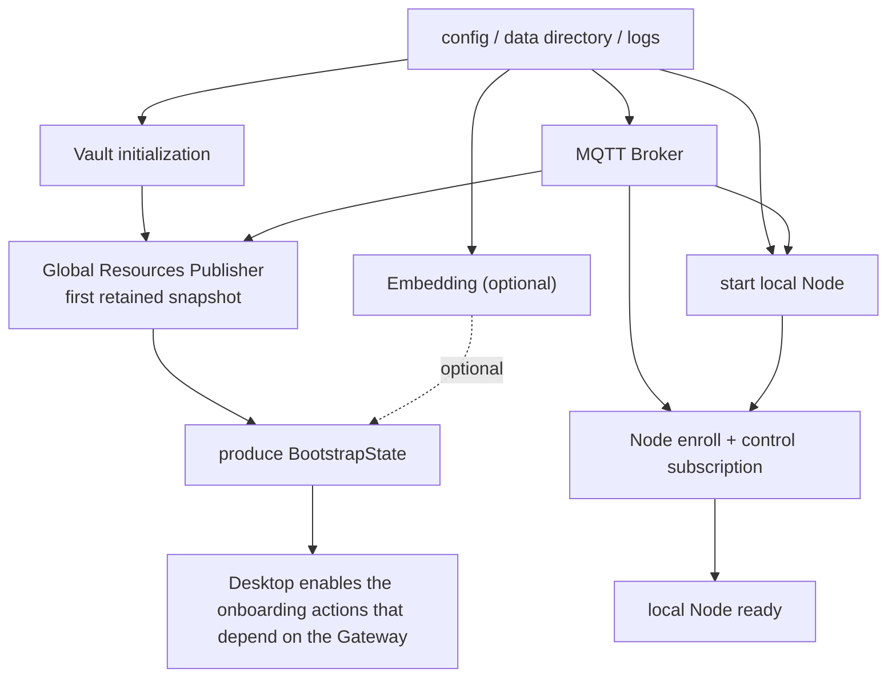
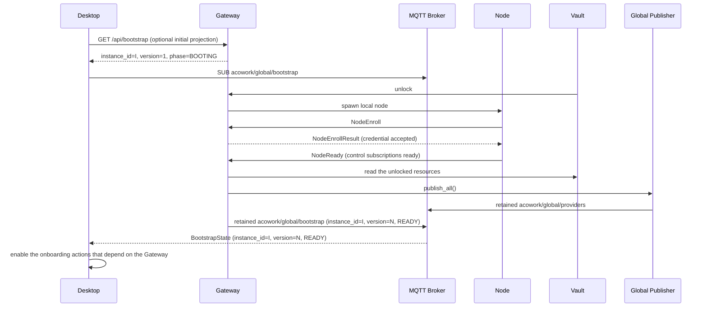
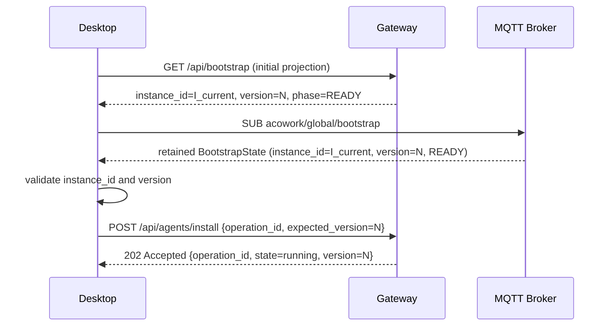

# ADR-059: First-Run Onboarding Uses a Parallelized Protocol Based on a Capability-Readiness Snapshot and Confirmation Handshakes

**Status**: proposal
**Date**: 2026-08-27
**Decider**: ACowork.AI architecture review
**Prerequisite decisions**:
- [ADR-033: Introduce MQTT to Replace gRPC + WebSocket](./ADR-033-mqtt-replace-grpc-websocket.md)
- [ADR-034: Control Plane / Data Plane Layering — the MQTT / HTTP Responsibility Boundary](./ADR-034-mqtt-http-boundary.md)
- [ADR-055: Remote Runtime Deployment — the Node Agent Topology](./ADR-055-remote-runtime-node-topology.md)
- [ADR-058: Workspace Filesystem Changes Pushed to Desktop over MQTT for Auto-Refresh](./ADR-058-workspace-fs-watcher-mqtt-event.md)
- [MQTT Protocol Overview](../../protocols/en/mqtt.md)
- [HTTP API Protocol Reference](../../protocols/en/http.md)

---

## 1. Decision Summary

First-run onboarding must not treat "the port is reachable", "HTTP returns 200", or "a flag appears on MQTT" as proof of business readiness. This ADR introduces a **capability-readiness snapshot** as the sole protocol fact of Gateway's startup phase, and requires all cross-process operations to close the loop via **explicit confirmation handshakes**:

1. The Gateway publishes its startup capability state as a complete, monotonically versioned retained snapshot; the Desktop obtains that state via the MQTT retained snapshot or the corresponding HTTP projection. `phase` is the client's only routing basis, while `instance_id` / `version` are responsible for cross-session consistency (see §5.4).
2. First-run onboarding constructs a DAG according to real dependency relationships; work without dependencies can execute in parallel, and only work with genuine data dependencies waits serially. Gateway's internal subsystems coordinate readiness via an event bus and a `CapabilityRegistry`; the external protocol only sees `phase` (see §5.4).
3. Any write, delivery, or install operation must return an `operation_id` and be confirmed complete via a correlated event or the corresponding retained state snapshot; "the request has been accepted" is not "the operation has completed".
4. `/health` only proves the process can still respond; it does not prove that BootstrapState has been published or that phase=READY.
5. Timeouts only serve to prevent infinite waiting and to free resources; they **must not be used to infer that a component is already ready or that an operation has completed**.
6. The protocol layer follows the open-closed principle: BootstrapState exposes only protocol-level aggregate fields (`instance_id` / `version` / `phase` / `phase_detail` / `issued_at_ms`), and does not expose Gateway-internal capability names, subsystem generations, process ids, or other internal details.

This rule covers Gateway's entire lifecycle, not just first run, avoiding the dual-stack reinvention of the wheel where "cold-start onboarding uses protocol A while hot-start daily operations use protocol B":

- **Cold-start onboarding**: a brand-new HOME, the first Vault unlock, the first publisher, the first Node enroll.
- **Hot-start Gateway restart**: an existing HOME, an already-unlocked Vault, retained resources needing to be rebuilt under a new `instance_id`.
- **Desktop reconnecting to an already-running Gateway**: including session-level reconnection, sleep/wake, and reconnection after a desktop app auto-update.
- **Remote Node reconnection / failure recovery**: Node LWT, MQTT disconnection, capability degradation, in-process Gateway restart.
- **In-flight mutations**: provider keys, MCP, user identity, Agent install, System Agent startup, Runtime config sync.
- **Multi-step onboarding flows**: the Desktop-side onboarding wizard and Agent list initialization.

> A consistent protocol source of truth = no reinvention of the wheel. `acowork/global/bootstrap` simultaneously plays the two roles of "a one-shot cold-start entry point" and "a continuous source of truth for hot starts"; the only difference lies in which internal subsystems each blocks and which handshake steps must be traversed; `operation_id`, structured error codes, and `version` / `instance_id` validation all share one protocol across every scenario.

---

## 2. Background

### 2.1 The Current First-Run Chain

Gateway startup is not a single event but a convergence of multiple asynchronous subsystems:

```text
Gateway process
  ├─ config / logs / ports
  ├─ Vault initialization and dev_mode auto-unlock
  ├─ MQTT broker and the Gateway MQTT client
  ├─ embed process
  ├─ local node process and enroll
  ├─ System Agent install / startup
  └─ Global Resources Publisher
          ↓
     Runtime subscribes to global resources
          ↓
     Desktop uses Gateway over HTTP / MQTT
```

Some of this work can run in parallel, but it is currently coordinated mainly indirectly through startup order, process state, and fixed waits. Three classes of races have appeared on the critical path of first run:

1. The publisher publishes the first retained provider snapshot before the Vault has been unlocked; the Runtime receives an empty `api_key`, and subsequent republishes do not automatically refresh that Runtime.
2. The Desktop initiates an install before the `local` Node has completed enrollment and established its control subscription; the Gateway can only return 503, and the Desktop then relies on `time.sleep` and a limited number of retries.
3. The Desktop sees `/health` reachable and proceeds with onboarding, but that only proves the HTTP server is alive, not that the Node required for the subsequent install is ready. (**ADR-077**: the System Agent is no longer part of the Gateway startup chain; its install is initiated directly by Desktop onboarding and does not participate in this readiness protocol.)

Existing fixes have already addressed the publisher's first-snapshot race via local ready barriers such as `watch::Sender<bool>`, and have mitigated the install race via a Node online check plus retries. They are important transitional fixes, but they are not yet a general protocol contract spanning Desktop, Gateway, Node, and Runtime.

### 2.2 The Facts Established by Current Test Coverage

Test coverage must distinguish the "already-deployed environment" from the "first-run environment":

- `smoke_test.py` is primarily a deployed-state smoke test, including regression checks for provider key sync, Agent inventory, and the Node list; it should not be treated as a pure first-run test.
- `onboarding_installs_all_agents.py` is a dedicated cold-start onboarding regression test: it starts a brand-new HOME, waits for Gateway health, confirms Node `local` is online, submits several Agent packages, confirms they eventually appear in the inventory, and checks the API key in the provider retained payload.
- The current `onboarding_installs_all_agents.py` still uses `wait_http_ok`, `wait_node_online`, fixed sleeps, and install retries to simulate Desktop behavior. It can discover the current races, but the test's waiting time is not a protocol guarantee; the target version should switch to assertions on the ready snapshot, the operation ack, and the inventory retained entry.
- The current Desktop `OnboardingFlow` still installs recommended Agents one by one via `for ... await`, and prompts "waiting for Node" after catching HTTP 503 in the frontend. This works out in terms of the result, but it serializes install tasks that could run in parallel, and it hides protocol state behind string matching and timeout retries.
- The current Gateway `POST /api/agents/install` is an asynchronous dispatch for `package_url`: HTTP 202 only means the command was attempted for publication; the Node aggregates the final result via the retained `acowork/nodes/{node_id}/agents/{agent_id}/installed`. A current client that only looks at 202 or polls the inventory will mistake "accepted" for "installed".

Therefore this ADR records two things at once:

1. Current tests already cover first run as a **business case**, but they are not **contract tests** based on the final protocol.
2. The follow-up implementation must migrate these regression tests into handshake tests that require "no guessing at completion timing"; likewise, the hot-start / reconnection / remote-Node-reconnection paths must gain corresponding contract assertions (see §12).

### 2.3 Weak Handshakes in the Normal-Startup and Reconnection Paths

The non-first-run paths suffer from the same "treated as ready" weak-handshake problem, only masked by the stable appearance of an already-deployed environment. Tying the handshake protocol exclusively to onboarding would create a loop of "fix onboarding, then new hot-start bugs appear":

1. **Gateway hot start**: when the Desktop is reopened, it considers the Gateway usable right after `/health` returns 200, but the publisher's retained snapshot may not yet have been rebuilt under the new `instance_id`; a Runtime resubscribing at that moment will get an empty provider list left over from the old `instance_id`, or an old snapshot conflicting with the new `instance_id`.
2. **Desktop reconnection**: with an already-running Gateway + Node, when the Desktop reconnects due to network jitter or sleep, it relies only on MQTT topic subscriptions and "assume the same as the previous session" to infer state; old `instance_id` retained snapshots may still linger in the broker, causing the Desktop to treat old-instance state as current.
3. **Remote Node reconnection**: after a remote Node briefly goes offline and reconnects, it relies solely on `acowork/nodes/{id}/status=online` to infer "the control channel has recovered", but the actual control subscriptions may not yet be stable; install commands may therefore be published to a Node that has not resubscribed to the control topic, causing silent loss.
4. **In-process Gateway restart**: the Desktop does not re-trigger onboarding, but an `instance_id` switch appears in between; mutations that do not carry `expected_version` may be wrongly accepted while the old `instance_id` residue persists, or wrongly rejected after the `instance_id` switch.
5. **The illusion of success for in-flight mutations**: after `POST /api/providers` returns 201 the client believes the API key is in effect, but whether the Runtime actually loaded the new snapshot depends on the publisher's and the retained re-delivery timing; without validating `version >= expected_version` you get "the client finished writing while the Runtime still uses the old key".

The cold-start problem is "how to handshake correctly the first time"; the hot-start problem is "how to keep evidence from getting lost continuously". Sharing the same protocol source of truth between them avoids:

- a cold-start-specific handshake coexisting with a hot-start-specific `/health` inference — two parallel protocols;
- the Desktop-side onboarding flow and "daily operations" each maintaining their own waiting/retry logic;
- corner cases introduced by the divergence between cold-start and hot-start behavior (especially where a cold-start failure's intermediate state is masked by hot start, and vice versa).

Therefore this ADR defines BootstrapState, the operation contract, the error-code system, and `version` / `instance_id` validation together as the protocol baseline for Gateway's entire lifecycle; §4.3 gives an explicit scenario-reuse matrix, §5.4 gives the OCP protocol boundary and the event-bus design, §7.6 gives the concrete handshake paths for hot start and reconnection, and §11 Phase 5 gives the convergence plan for the existing hot-start code.

---

## 3. The Core Problem

### 3.1 "Has Started" and "Is Safe to Use" Are Not the Same State

The following concepts must be separated:

| State | The question it answers | The conclusion it permits |
|---|---|---|
| Liveness | Is the Gateway process still responding? | the process may still serve requests |
| Component ready | Does a Gateway-internal subsystem satisfy its preconditions? | the Gateway can internally handle things depending on that subsystem (invisible externally) |
| Bootstrap ready | Do all required subsystems of the current Gateway instance satisfy their preconditions within the same generation? | it is safe to submit externally actions that depend on the Gateway |
| Operation accepted | Has the Gateway accepted the operation? | you can start tracking the operation_id |
| Operation completed | Has the target end confirmed the final result? | the client can present the result as a success |

"BridgeState has been published" and "Bootstrap ready" are different events; "`/health` 200" and "Bootstrap ready" are different events; "Node `status=online`" and "Bootstrap ready" are not the same state. The `phase` field plus the necessary `instance_id` / `version` are the only externally visible routing basis (see §5.4).

### 3.2 Timeouts Cannot Substitute for Causality

The current `sleep(500ms)`, `sleep(1s)`, and limited backoff are valuable for surfacing errors, not for guaranteeing correctness. They have three structural problems:

- When the process is fast, the extra waiting lengthens onboarding; when the process is slow, insufficient waiting can fall back into the race again.
- The same error code may come from different causes, so the client can only guess when recovery happens by "trying once more".
- Retries hide the fact that "the request was accepted but the operation has not completed", leading to duplicate submissions or incorrect success indications.

The target protocol must turn the thing being waited on into an **event, a snapshot, or an operation ack**. Timeouts are only used for unrecoverable indeterminate states such as network failures, process exits, and lost events, and a timeout must return an explicit `DependencyNotReady` or `OperationUncertain` state rather than disguising itself as success.

---

## 4. Design Goals

### 4.1 Goals

- Define verifiable protocol states for first run and critical onboarding operations.
- Use a single source of truth to eliminate "multiple components each publish ready, but the composition relationship is unclear".
- Let the Desktop enable buttons, submit operations, and display progress without guessing at timing.
- Let independent work truly run in parallel while key dependencies remain strictly serial.
- Make all asynchronous operations idempotently retryable, correlatable, and recoverable.
- Keep MQTT retained, the HTTP snapshot, and the Runtime's existing retained state on the same version semantics.
- Let tests cover races without tweaking sleep parameters.

### 4.2 Non-goals

- Not cancelling network timeouts, connection timeouts, or request deadlines; these remain fault protection.
- Not forcing the whole startup process into single-threaded serialization.
- Not treating MQTT retained as a transaction across multiple topics; this ADR explicitly uses a single aggregate snapshot topic to express aggregate state.
- Not introducing persistent distributed transactions or a general workflow engine in phase one.
- Not changing the process boundaries and resource ownership of Runtime, Node, and Gateway.
- Not specifying the concrete Workspace business implementation in this ADR; it only serves as an existing cross-process data-plane example that must obey the handshake semantics.

### 4.3 The Startup-Scenario / Protocol-Reuse Matrix

`acowork/global/bootstrap`, `operation_id`, and structured error codes must be shared by the following scenarios, avoiding the dual-stack reinvention of the wheel where "cold-start onboarding uses protocol A while hot-start daily operations use protocol B". This matrix does not enumerate internal capabilities (Vault / Publisher / Node / Embedding, etc.), it only describes the externally visible phase sequences. For the list of internal subsystems see §5.4. (**ADR-077**: the System Agent is no longer an internal Required capability — see the revisions in §6.1 / §7.5 / §12.2.)

| Scenario | Protocol source of truth | Typical phase sequence | Trigger | Operation contract |
| --- | --- | --- | --- | --- |
| Cold-start onboarding | `acowork/global/bootstrap` + HTTP `/api/bootstrap` | BOOTING → READY | brand-new HOME, first Vault unlock, first publisher, first Node enroll | same as §7.3, §7.4 |
| Hot-start Gateway restart | `acowork/global/bootstrap` (new instance_id) | BOOTING (short) → READY | Gateway process restart | same as §7.3, §7.4 |
| Desktop reconnecting to an already-running Gateway | `acowork/global/bootstrap` | READY (may skip to BOOTING while disconnected) | network jitter / sleep-wake | same as §7.3, §7.4 |
| Remote Node reconnection / failure recovery | `acowork/global/bootstrap` + `acowork/nodes/{id}/ready` | READY (node is an Optional subsystem, only version increments, see §7.2) | Node LWT / MQTT reconnection | same as §7.4 |
| In-flight mutation (provider / MCP / identity) | retained `acowork/global/providers` etc. + BootstrapState | READY | non-blocking | same as §7.3 |
| In-process Gateway restart | `acowork/global/bootstrap` (instance_id re-issued) | READY → BOOTING → READY | Gateway process restart | same as §7.3, §7.4, `expected_version` mandatory |

Core principles:

- **One source of truth**: every scenario decides "whether actions depending on the Gateway may be executed" via `acowork/global/bootstrap`. There is no need to design separate readiness topics for cold start, hot start, and reconnection.
- **One operation protocol**: every mutation must carry an `operation_id` and go through the accepted / committed / running / completed / failed closed loop; no separate path is distinguished for cold start vs. hot start.
- **One version semantics**: on a hot-start reconnection the Desktop must also validate `instance_id` and `version`, and must not assume "the retained value from the previous session still belongs to the current Gateway".
- **One error-code system**: the five structured error codes in §8.2 (`dependency_not_ready` / `operation_uncertain` / `operation_expired` / `resource_version_conflict` / `handshake_timeout`) are universal across all scenarios; cold start and hot start must not have different error-code systems.
- **OCP: `phase` is the only routing basis**: the client only reads `phase` and never parses internal capabilities; adding or removing internal subsystems requires no client change.

The detailed reuse table:

| Reused element | Cold start | Hot start | Reconnection | Remote Node reconnection |
| --- | --- | --- | --- | --- |
| the `acowork/global/bootstrap` retained value | first publication | re-published under the new instance_id | still owned by the Gateway, the Desktop resubscribes | carries the node.ready state change of that Node |
| `BootstrapState.version` monotonic increment | starts at 1 | 2, 3 … | the Desktop fetches and compares with the local value | recomputed and published by the Gateway |
| `BootstrapState.instance_id` | generated and published | regenerated after restart | the Desktop must fetch the new value | must be re-validated across Nodes and instance_ids |
| `operation_id` | install / provider write / identity write | same | same | same |
| `expected_version` | install / mutation / identity write | same (mandatory) | same (mandatory) | same (mandatory) |
| structured error codes (§8.2) | all applicable | all applicable | all applicable | all applicable |
| `NodeReady` retained | published after the first enroll | re-published after a Node restart | N/A | re-published after reconnection |
| Node control `request_id` | same | same | same | same |

The parts that are **not** reused (needed only for cold start, since hot start already satisfies them by default):

- each internal subsystem's "first ready signal" (handled by the Gateway-internal CapabilityRegistry, invisible externally).
- first-time transitions such as the Vault's first unlock and the Publisher's first retained publish. (**ADR-077**: the System Agent's first install + ready ack is no longer part of the cold-start flow — its install is triggered by Desktop onboarding and is decoupled from the Gateway startup chain.)

These first-time transitions must go from 0 to ready under cold start; under hot start they only need to be verified as still ready. Reusing `BootstrapState` and the operation contract lets the cold-start code simultaneously be reused by the hot-start code on the same path, instead of implementing readiness judgment twice. On the external protocol, adding any internal subsystem to the Gateway (including future HSM integration, LLM health checks, remote SDK hot-loading, etc.) requires no code change on the Desktop / Runtime / Node side.

---

## 5. Protocol Design

### 5.1 The Capability-Readiness Snapshot (the continuous source of truth)

`acowork/global/bootstrap` is the continuous source of truth across Gateway's **entire lifecycle**, not a one-shot onboarding entry point:

- Cold start: BootstrapState evolves from BOOTING to READY, with the capability set becoming ready step by step;
- Hot start: a new Gateway instance produces a new `instance_id`; BootstrapState is briefly BOOTING before entering READY; the Desktop must not skip validation of the new snapshot and assume the previous session's READY is still valid;
- Failure recovery: platform-level events (MQTT disconnection, Vault unlock timeout, etc.) push BootstrapState back to BOOTING; a Node LWT is an Optional-subsystem event (§7.2) — the aggregate phase stays READY and only a new `version` is published to drive the client to refresh in real time. Under both kinds of events the client marks the previous session's operations as `operation_uncertain` rather than successful.

The snapshot definition is given below. Its semantics are not premised on "whether this is onboarding".

Add a Gateway-owned retained snapshot:

```text
acowork/global/bootstrap
```

The payload continues to follow `DataEnvelope`, adding `BootstrapState = 16` to the `payload` oneof in `core/acowork-core/proto/mqtt_payload.proto`. That field number was previously unused; once published, a field number must never be reused.

BootstrapState **contains only protocol-level aggregate fields** and does not expose the Gateway-internal subsystem inventory or concurrency primitive details. The complete OCP design is in §5.4.

The minimal semantics of the snapshot are:

```text
message BootstrapState {
  uint64 protocol_version = 1;
  string instance_id = 2;
  uint64 version = 3;
  BootstrapPhase phase = 4;
  string phase_detail = 5;
  uint64 issued_at_ms = 6;
}
```

Field semantics:

- `instance_id` is the Gateway process identity: it is re-issued after a restart, and concurrently running Gateway instances have different values; the Desktop compares it with the instance ID saved in the previous session and, if they differ, discards the local cache and the previous session's in-flight operations.
- `version` is the protocol snapshot version number of BootstrapState, monotonically incrementing; its semantics are "the externally visible snapshot edition", decoupled from Gateway-internal generation counters. The Desktop uses it to reject old retained values and cross-instance_id events.
- `phase` is the aggregate readiness state (see the enum below) and is the only field the Desktop needs to route on.
- `phase_detail` is an optional human-readable diagnostic string, carried only when phase != READY, and **is not a protocol routing basis**. The Gateway may freely refine its wording as subsystems evolve, with no protocol review needed.
- `issued_at_ms` is the time of production, used for diagnostics and log tracing; it does not participate in the ready determination.

This ADR explicitly excludes the following fields, to avoid coupling the protocol layer to the Gateway-internal subsystem inventory:

- it does not expose concrete capability names (such as `vault` / `publisher` / `node.local` / `system_agent`): these are the Gateway-internal subsystem inventory, not a protocol contract. The protocol fields should not change when subsystems are added or removed.
- it does not expose capability sub-states (such as `observed_epoch` / sub-generations): these are Gateway-internal concurrency primitive details; the external protocol does not consume the generation concept.
- it does not expose per-capability detail: the detail must be the aggregate `phase_detail`, and the outside should not be made to parse internal subsystem state.

The capability design inside BootstrapState now lives in §5.4, implemented through a Gateway-internal CapabilityRegistry + event bus.

`phase` includes at least:

- `BOOTING`: the snapshot has been published, but the blocking capabilities are not all ready yet.
- `READY`: all required capabilities of the current generation are ready.
- `DEGRADED`: required capabilities are ready, an optional capability failed or was skipped.
- `FAILED`: a required capability entered a failed state; the Gateway should not claim it can safely onboard.
- `SHUTTING_DOWN`: the Gateway is shutting down; clients must not start new operations.

### 5.2 The Responsibilities of HTTP and MQTT

#### MQTT

MQTT is the authoritative publication channel for this snapshot:

- `acowork/global/bootstrap` uses QoS 1, retained.
- The Gateway publishes a complete new snapshot only when the owner state of the snapshot changes.
- The Desktop subscribes to `acowork/global/#` or subscribes precisely to that topic; on reconnection it immediately obtains the latest complete value.
- The Runtime may depend on both `acowork/global/providers` and `acowork/global/bootstrap`, but must not combine ready flags from multiple producers to declare overall readiness itself.

#### HTTP

HTTP provides a read-only projection of the same snapshot, without establishing a second copy of the state:

- `GET /health`: a `liveness` projection; it returns the existing health structure while the process is alive and does **not** return a business guarantee of `bootstrap_ready=true`.
- `GET /api/bootstrap`: returns a JSON projection of `BootstrapState`, suitable for the Desktop's initial fetch before it has established an MQTT subscription, or for testing and CLI diagnostics.
- The HTTP snapshot must include `version` and `instance_id`; clients must use these two fields for cache validation.
- While the Gateway is still booting, `GET /api/bootstrap` may return `200` with `phase=BOOTING`; it must not return `200` with a fabricated `phase=READY`.
- Dependency errors in the HTTP response must be structured, e.g. `dependency_not_ready`, carrying only protocol-level fields (see §5.4.4); the client chooses to wait for the snapshot based on that state, rather than adding random sleeps.
- Under normal startup / reconnection scenarios the Desktop must likewise first call `GET /api/bootstrap` to fetch the current snapshot and then subscribe to the MQTT retained value; the snapshot in the HTTP response and the first MQTT retained re-delivery must satisfy the same `instance_id` and `version`, and must not diverge from each other.

This preserves ADR-034's boundary: HTTP is for queries / triggering and configuration write-back, MQTT is for state snapshots and real-time changes; HTTP polling is not designed into a new source of truth.

### 5.3 Single-Snapshot Atomicity

MQTT retained only guarantees message atomicity for a single topic; it does not guarantee cross-topic transactions across multiple retained topics. Therefore this ADR forbids the following wrong model:

```text
wait for acowork/nodes/local/status
then wait for acowork/global/providers
then poll GET /api/agents
finally infer "ready" on the client
```

The correct model is:

```text
The Gateway builds the BootstrapState of the same `instance_id`
  → atomically publishes acowork/global/bootstrap
  → the client decides based on that snapshot's `phase`
```

Each component may still publish its own retained state, such as `acowork/nodes/{id}/status` or `acowork/agents/{id}/ready`, but those are diagnostic inputs, not the Desktop's overall ready determination.

This atomicity principle applies to both cold start and hot start: the retained re-delivery order of the MQTT broker may leave the old instance's `READY` residue when Gateway instances switch; the client must reject cross-generation state with `version` + `instance_id`, and must not make the implicit assumption "the previous session's READY = the current session's READY".

---

## 6. The First-Run Dependency DAG

### 6.1 The Dependency Graph

The target startup DAG is:



> **ADR-077**: the original `SYS_PREPARE` / `SYS_INSTALL` nodes and their associated edges have been deleted. The System Agent is an ordinary bundled agent; its install is triggered by onboarding (`POST /api/agents/ensure`) and is no longer a BootstrapState prerequisite. Its readiness is expressed by its own Runtime's `acowork/agents/{id}/ready` retained value, which the Desktop consumes via the ordinary agent status path.

### 6.2 Work That Can Run in Parallel

After `cfg` completes, the following work can run simultaneously:

- Vault initialization or auto-unlock.
- MQTT broker startup and establishment of the Gateway MQTT client.
- embed process startup or reuse of an existing embed.
- local Node process spawn.
- read-only loading and validation of the static resource cache.
- (**ADR-077**: the System Agent install has been moved out of this layer and is triggered by Desktop onboarding; it is no longer part of the Gateway startup chain.)

The following work must not start early:

- The Publisher must not publish a provider snapshot with keys before the Vault has been unlocked.
- The Desktop must not submit actions that depend on the required capabilities before `BootstrapState` shows them ready.
- Installing multiple Agent packages can be parallel on the same Node, the same generation, and the same resource budget, but they must not bypass `node.local` and the operation ack.
- Mutually independent writes such as provider key updates, MCP resource updates, and identity profile updates can be parallel; updates that need consistency of the same resource snapshot must enter the same serial resource queue.

### 6.3 Disallowed Pseudo-Serialization

It is forbidden to add the following waits for implementation convenience:

```text
Gateway startup
  → sleep(3s)
  → Desktop proceeds
  → each Agent sleeps another 1s
  → check /api/agents
```

Waiting may only exist in one of the following three places:

1. A protocol capability is explicitly unsatisfied, and the client subscribes to the corresponding snapshot and waits for the event.
2. An operation has been submitted, and the client waits for the operation ack or the final retained inventory.
3. A network call genuinely needs a deadline in order to discover faults.

If a stage has no real data dependency, it must be parallel; if an action has received no confirmation, "having sent an HTTP request" must not be treated as stage completion.

---

## 7. Cross-Process Handshakes

### 7.1 The Gateway → Desktop Startup Handshake



The Desktop does not need to know in advance whether the Vault unlock or the Node enroll completes first. It only depends on the same `BootstrapState.instance_id` and checks the phase transition.

### 7.2 Node Enrollment and Control-Channel Confirmation

The existing `NodeEnroll` / `NodeEnrollResult` continue to be responsible for token and identity confirmation, but "enroll_result=ok" alone is not enough to prove that install commands can definitely be received. Add a Node-owned retained readiness snapshot:

```text
acowork/nodes/{node_id}/ready
```

Semantics:

- The Node successfully established the MQTT CONNECT.
- The Node has subscribed to `acowork/nodes/{node_id}/.../control/#`.
- The Node has confirmed on the client side that the subscription request has been submitted, and that the process identity, machine uid, and node token have been persisted.
- Only then does the Node publish the `NodeReady` retained value (QoS 1).
- Only after both the token registry and `NodeReady` are confirmed does the Gateway allow new control commands to be delivered to that Node (maintained by the Gateway-internal CapabilityRegistry, invisible externally).
- When the control channel becomes invalid due to LWT or an offline status, the Gateway internally marks that Node as not-ready and publishes a new `BootstrapState`. The node control plane registers as an **Optional subsystem** (§5.4.3): this event only advances `version` to drive the client to refresh in real time, and the aggregate phase stays READY; whether a given Node can accept control commands is determined independently by the internal per-node control gate, unrelated to the aggregate phase.

The NodeReady event carries **only protocol-level fields**:

```text
message NodeReady {
  string node_id = 1;
  uint32 protocol_version = 2;
  // does not carry control_gen / generation / sub-states:
  // the Gateway maintains that mapping internally; the external protocol
  // does not need to consume it.
}
```

The control-subscription generation is part of the Gateway-internal concurrency primitives; the external protocol only cares about phase changes. `status=online` may continue to serve as a diagnostic field; it no longer singly bears the protocol responsibility of "the install precondition has been satisfied".

### 7.3 The Provider-Key Write Handshake

Write interfaces such as `POST /api/providers` and `PUT /api/providers/{provider}` that change the Vault or the resource cache must produce a correlatable mutation operation:

```text
Desktop → Gateway: write request + operation_id
Gateway → Vault / provider_list.json: atomic write
Gateway → Global Resources Publisher: trigger recomputation
Gateway → MQTT: acowork/global/providers (version=N+1, retained)
Gateway → Desktop: mutation ack (status=committed, version=N+1)
```

The Desktop's completion condition is:

- receiving an HTTP mutation ack confirming the write has been committed; **and**
- observing that the `version` of `acowork/global/providers` is `>= expected_version`, confirming that the snapshot the Runtime needs has been published.

You must not mark the API key as "available to the Runtime" merely because `POST /api/providers` returned 201. If the HTTP request has been committed but the publisher has not finished, the UI must show "writing / awaiting the snapshot", not "completed".

All mutation operations must have:

- `operation_id`: an idempotency correlation ID generated by the client.
- `expected_version`: the BootstrapState version read before the write, preventing overwrite updates.
- `resource_version`: the resource version after writing and publishing (the version field of retained values such as `acowork/global/providers`).
- `status`: `accepted`, `committed`, `published`, `failed`.
- `terminal_error`: a stable error code provided only on failure; you must not depend on parsing human-readable strings.

A mutation ack must not return Gateway-internal capability name lists, generations, process ids, file paths, or other internal state. What the client sees is the aggregate BootstrapState phase + the current resource_version.

### 7.4 The Agent Install Handshake

The existing Node control plane's `request_id` mechanism continues to serve as the underlying idempotency key. The API the Gateway exposes to the Desktop must separate "delivery" from "completion":

```text
Desktop → Gateway: POST /api/agents/install
Gateway → Node: NodeControlCommand(request_id=operation_id, command=install)
Gateway → Desktop: 202 Accepted { operation_id, state=running, node_id, version }
Node → Gateway: NodeEvent(request_id=operation_id, status=in_progress|completed|failed)
Node → Gateway: retained acowork/nodes/{node_id}/agents/{agent_id}/installed
Gateway → Desktop: operation state = completed/failed
```

During the compatibility period the old `message` field may be retained; strict clients must use `operation_id` and `state`. The Gateway must not drop commands when the Node has not yet met the control-channel conditions: if the command has been accepted it may be placed in a per-node pending queue and delivered after NodeReady; a pending entry must be persisted or have an explicit lease, returning `operation_expired` when it expires rather than being silently lost.

Install completion must simultaneously satisfy:

- the Node returns a `completed` event corresponding to the `request_id`;
- the Node's retained `installed` snapshot has been aggregated by the Gateway;
- `GET /api/agents` reflects that result (HTTP as a full query, not as the sole completion event).

The Desktop may submit multiple install operations concurrently, but must use bounded concurrency (a default of 2-4 is recommended) to avoid spawning multiple embeds, Runtimes, or heavy file I/O simultaneously during cold start. `JoinSet` / `FuturesUnordered` only handle concurrent scheduling; the operation ack still confirms the result.

### 7.5 Runtime Ready

The existing `acowork/agents/{agent_id}/ready` retained semantics are kept, but upgraded to a Gateway → Desktop visible capability confirmation:

- The Runtime publishes `ready=true` only after the HTTP server, memory, workspace, MQTT initialization, and the necessary provider snapshots all satisfy the runtime policy.
- When the Runtime goes from offline to ready, or when the ready generation changes, it must retain the old agent-status diagnostic fields, but the Desktop must not substitute the old `running` / `connected` fields for AgentReady.
- (**ADR-077**: the second item of the original §7.5, "while the System Agent is a required cold-start capability…", has been deleted. The System Agent is no longer a BootstrapState required capability; its readiness is consumed via the ordinary agent status path, and its delay or failure does not block the Desktop's main chat area from becoming ready.)
- After the Runtime receives a provider retained snapshot it rejects stale messages by `version`; the Gateway must provide enough information within the same resource mutation operation for the Desktop to determine whether the snapshot corresponds to the current operation.

### 7.6 Normal-Startup and Reconnection Handshakes

Hot start, Desktop reconnection, remote Node reconnection, and in-flight mutations all reuse the capability-readiness snapshot and operation contract of §5.1 / §7.3 / §7.4; the difference lies in the initial capability set and the handshake starting point. Below are the three typical hot-start paths and their differences from the cold-start path.

#### 7.6.1 The Desktop Reconnecting to an Already-Running Gateway



The key differences from the cold-start handshake:

- `GET /api/bootstrap` returns `phase=READY`, so the Desktop does not need to wait;
- the `instance_id` and `version` of the HTTP response and the MQTT retained re-delivery must be consistent; the Desktop compares `instance_id` with the instance ID saved locally in the previous session and, if they differ, discards the local cache and the previous session's in-flight operations;
- the Desktop must not treat the "instance_id saved in the previous session" as trusted state; the Gateway instance may have restarted, and the `instance_id` in this HTTP response is authoritative.

#### 7.6.2 Remote Node Reconnection

```mermaid
sequenceDiagram
    participant N as Node
    participant G as Gateway
    participant B as MQTT Broker

    N->>G: MQTT CONNECT + NodeEnroll
    G-->>N: NodeEnrollResult
    N->>B: SUB acowork/nodes/{id}/.../control/#
    N->>G: retained NodeReady
    G->>B: retained acowork/global/bootstrap (instance_id=I, version=N+1, phase=READY)
    Note over G: node registers as an Optional subsystem: phase stays READY,<br/>only version increments to drive the client refresh;<br/>the old NodeReady retained value is automatically overwritten by the broker
```

The key differences from cold start:

- A Node restart re-sends NodeEnroll; the Gateway must re-send NodeEnrollResult and force the Node to re-provide NodeReady; "NodeEnroll reusing the previous credential" is not allowed as a way to paper over the fact that the control subscription was never established.
- The Gateway internally maintains a "node control-subscription generation" mapping for the pending queue and control delivery; that generation is **not exposed through the protocol**. The node control plane registers as an Optional subsystem (§7.2): both the ready and the failure of the control channel leave the aggregate phase unchanged (staying READY) and only let `version` increment monotonically, so the client perceives it in real time via the retained snapshot; control commands awaiting delivery are continued by the per-node pending queue after NodeReady (§7.4).
- The Gateway must not deliver control commands to that Node before receiving NodeReady, even if the Node status is online; this is the same principle as §7.2, but retaining this constraint is especially critical under hot start — "`status=online` alone" cannot repair the control-subscription race of a remote Node reconnecting.

#### 7.6.3 In-Flight Mutations

Interfaces such as `POST /api/providers`, `POST /api/agents/install`, and `POST /api/users/identity` use the same operation contract under hot-start / in-flight scenarios as under cold start:

- The client must carry `expected_version`; when it does not match the Gateway's current BootstrapState `version`, return `resource_version_conflict`. This constraint is completely identical under cold start / hot start / reconnection.
- The mutation ack must include the `current_version` at the moment the mutation completed (= resource_version), so the client can determine after reconnection whether "the write I just made is valid for the current Gateway instance".
- After the operation completes, the Gateway re-publishes the `acowork/global/providers` or `acowork/nodes/{id}/agents/{agent_id}/installed` retained values per §7.3 / §7.4, and monotonically increments the BootstrapState `version` (a mutation may advance the version); on Gateway restart the instance_id is re-issued and the version resets.
- The same `operation_id` never crosses instance_id while the Gateway has not restarted during hot start; if the Gateway restarts before the mutation completes, that `operation_id` must be marked `operation_uncertain`, and the client must not re-execute non-idempotent actions nor equate "I saw a 202 last time" with success.

Mutations strictly return only protocol-level fields: `operation_id`, `status`, `resource_version`, `terminal_error` (optional); they do not return internal capability / subsystem generation / process id.

---

## 8. Timing Rules

### 8.1 Success Must Be Provable

The following are the permitted success paths:

- The Gateway publishes `BootstrapState(phase=READY)` and this instance's `instance_id` matches the one the client saved in the previous session.
- A write API returns `committed`, and the MQTT retained resource version subsequently reaches the expected version.
- The install API returns an `operation_id`, followed by a matching NodeEvent and a retained installed inventory.
- An Agent install appearing in the inventory is an inventory aggregation result, not a result inferred solely by polling.
- Runtime ready is an agent-specific ack, not merely the existence of a PID.

These success conditions treat cold start, hot start, and reconnection alike. Under hot start, "successfully wrote" must likewise be proven by the retained snapshot's `version >= expected_version`, not merely by HTTP 201; likewise, under hot start "the Gateway is ready" must be proven by BootstrapState `phase=READY`, not merely by `/health` 200 or Node `status=online`.

The success path does not require the client to read any Gateway-internal capability; `phase` and `version` are the routing basis, and the other fields are for diagnostics only (see §5.4).

### 8.2 A Timeout Is an Error State, Not a Success State

The following errors must be returned in structured form (carrying protocol-level fields, not exposing Gateway-internal capability names, subsystem generations, or process ids):

| Error code | Meaning | Client action | Carried fields |
| | --- | --- | --- |
| `dependency_not_ready` | Bootstrap does not yet satisfy the required subsystems | keep the current action disabled, subscribe to the next BootstrapState | `current_phase`, `phase_detail`, `retry_hint` |
| `operation_uncertain` | the publish or disconnection happened before the terminal state, and it cannot be judged from the current connection alone | query using the operation_id or complete it after reconnection; do not re-execute non-idempotent actions | `operation_id`, `last_known_phase` |
| `operation_expired` | the pending operation exceeded its lease | prompt the user to resubmit, retaining the diagnostic operation_id | `operation_id`, `lease_deadline` |
| `resource_version_conflict` | the expected version does not match the current version | fetch the latest resource, let the user confirm, then submit a new operation | `current_version`, `client_expected_version` |
| `handshake_timeout` | a single network call exceeded its deadline | mark it failed and clean up temporary resources; it must not be marked as installed/published | `endpoint`, `deadline_ms` |

The client may retain a very short connection timeout for UI fault tolerance, but after a timeout it must enter one of the error states above rather than using "request once more" as the default path. Error codes strictly carry only protocol-level fields (§5.4.4); any error response carrying capability names, generations, or process ids is not allowed to pass protocol review.

### 8.3 Out-of-Order and Duplicates

- All retained snapshots carry `instance_id` / `version`; an old value overwriting the current value must be rejected.
- Node command / NodeEvent use `request_id` for deduplication.
- Desktop mutation and install submissions use `operation_id` for deduplication.
- When the same `operation_id` receives an ack repeatedly, return the first terminal state or an identical terminal state, with no repeated side effects.
- Event QoS 1 may duplicate, but protocol state transitions must be idempotent; a duplicated completed does not install again.

---

## 9. The Parallel Performance Model

### 9.1 Principles

- **Independent work runs in parallel**: Vault, MQTT, embed, Node spawn, and static cache loading run in parallel.
- **Resource contention is bounded**: multiple package installs use a bounded semaphore; one onboarding must not saturate CPU, disk, and network.
- **Shared state is serialized**: the same provider list, the same Node control mailbox, and the same `installed_agents` registry must use explicit serial queues.
- **No waiting across resources**: writing the user identity should not wait for the provider write to complete; after both complete, each publishes a snapshot to its target resource.
- **The UI does not block the protocol**: the Desktop may display progress for multiple operations, but must not block other independent buttons while waiting for one Agent install.

### 9.2 The Recommended Critical Path

```text
T0
 ├─ Vault unlock
 ├─ MQTT start
 ├─ embed start
 └─ local node spawn

T0..Tparallel
 ├─ the publisher publishes global resources as soon as the Vault is ready
 └─ Node enroll immediately confirms control subscriptions upon completion

Tnode
 └─ System Agent / user Agent installs can be parallel, but each Node control mailbox is ordered

Tcommitted
 └─ BootstrapState READY + the terminal-state events of all accepted operations

Tcomplete
 └─ the Desktop refreshes the inventory and allows the user into the main interface
```

### 9.3 Performance Boundaries

- The concurrency degree of multi-Agent installs must be controlled by Gateway configuration or the resource budget; the default must not be unbounded.
- Repeated package uploads may be reused by hash within the Gateway, but the final Node must still execute idempotently via `request_id`.
- The first provider list and identity write may be concurrent, but the Runtime must ultimately load a consistent snapshot by explicit version.
- Any "waiting for a published retained message" network loop should preferentially be driven by `Notify` / event callbacks; timeouts are only for connection-fault detection.

---

## 10. Error Handling and Security

### 10.1 Key Security

- BootstrapState itself contains no API keys, node tokens, or provider payloads.
- `acowork/global/providers` continues to follow the existing localhost-only broker constraint, carrying only the provider snapshot the Gateway decrypted for the Runtime.
- NodeReady should not redundantly carry tokens; the token stays in `enroll_result` or in a secure persisted credential path.
- A mutation ack does not echo API keys, tokens, file contents, or decrypted data.

### 10.2 Dependency Identity

- `instance_id`, the Node protocol version, the BootstrapState version, and operation IDs must appear in logs, snapshots, and test fixtures.
- The Gateway does not accept a NodeReady or NodeEvent from an old `instance_id` to update the current BootstrapState.
- A remote Node's `node_id` must match the node_id bound to the Agent manifest / inventory.
- The HTTP snapshot must use the same `instance_id` and `version` as MQTT; the Desktop must not generate them itself from the current time or the HTTP process start time.
- Gateway-internal capability names, control generations, and subsystem paths are not exposed at the protocol layer; they appear only in the in-process CapabilityRegistry and logs.

### 10.3 Failure Must Not Degrade Into Fake Success

- When a required capability fails, `phase=FAILED` or `BOOTING+blocking`.
- An optional embed failure may be `DEGRADED`, but you must not map every failure into `READY`.
- While a new generation is not yet ready after a Gateway restart, the old instance's retained `READY` must not be used by the current Desktop.
- When a pending operation is lost it must be queryable or explicitly expired; returning success is not allowed.

### 10.4 The 503 Semantics of Global-Resource Fetching (added by the Bug B fix v3)

`GET /api/global-resources` is the only HTTP entry point for the Runtime to proactively pull global resources during startup (phase_a) (see `docs/protocols/en/http.md` §4.13). The early version of the endpoint **always returned 200** — when not ready it returned an empty `topics`, and the Runtime mis-cached "not there yet" as "there are none", which is the other half of Bug B's root cause. v3 explicitly makes that endpoint return graded by the Gateway's `BootstrapPhase`:

| Gateway phase | HTTP | `Retry-After` | Runtime behavior |
|---|---|---|---|
| `Booting` / `Unspecified` | `503` | `2`s | sleep 2s then retry |
| `Failed` | `503` | `10`s | sleep 10s then retry |
| `ShuttingDown` | `503` | `-1` (sentinel) | give up on fetching, rely only on the MQTT retained value |
| `Ready` / `Degraded` | `200` | N/A | apply the snapshot |

Decision points:

1. **`503` and `200 + empty data` semantics are strictly separated**: "not ready" allows only `503`; a `200` is always an authoritative snapshot (an empty `topics` is the legitimate "zero resources" state).
2. **The `Retry-After: -1` sentinel**: under `ShuttingDown` any retry is meaningless; the Runtime gives up immediately on receipt, avoiding a 30s spin during Gateway shutdown.
3. **never-poison**: while receiving `503` the Runtime does not write the local `AvailableResourceCache`, so a coherent snapshot already delivered by MQTT retained is never overwritten by "not ready" data.
4. **Total budget**: `PULL_MAX_DURATION = 30s`; on timeout it gives up and does not block Phase A; MQTT retained is always the fallback channel.
5. **Header/body dual-channel redundancy**: the `Retry-After` header and the body's `retry_after_seconds` carry the same value; the Runtime takes the larger of the two, and a client may take either.
6. **A unified frontend consumption pattern**: all Desktop store-level fetchers (workspaces / file tree / memory / chat / tools / latest-session) uniformly wrap the shared `with503Retry` (`apps/acowork-desktop/src/lib/httpRetry.ts`), and no longer use the MQTT retained `meta.ready` as a UI rendering gate (retained is an asynchronous push, and using it as a gate latches false and causes an indefinite wait).

---

## 11. The Migration Plan

### Phase 0: Preserve the Status Quo, Establish the Protocol Boundary

- Keep the publisher's local ready barrier, the Node online check, and 503 compatibility.
- Explicitly mark `/health` as liveness, not as onboarding readiness.
- Add the proto for `BootstrapState`, the topic constant, and the HTTP `/api/bootstrap` projection.
- Introduce a capability registry in GatewayState, recording component state, generation, dependencies, and error codes.

### Phase 1: The Bootstrap Snapshot

- The Gateway starts all independent subsystems.
- The Gateway starts all independent subsystems.
- Each subsystem calls the Gateway-internal `CapabilityRegistry::register(name, ready_signal, is_required)` at startup; the ready_signal is a `tokio::sync::Notify` / `watch::channel` / `Stream` and does not become a protocol field.
- After each subsystem becomes ready it pushes the `ready_signal` via the internal event bus, calling no synchronous API, and BootstrapState need not know the subsystem exists.
- Introduce a `BootstrapState orchestrator` inside the Gateway that subscribes to CapabilityRegistry change events, computes the aggregate phase and version from the ready / not-ready state of the required subsystems, and publishes one complete `acowork/global/bootstrap` retained snapshot.
- BootstrapState outputs only protocol-level fields (`instance_id` / `version` / `phase` / `phase_detail` / `issued_at_ms`), and does not output the subsystem inventory.
- The Desktop Tauri backend subscribes to that topic and exposes the current `instance_id`, `version`, and `phase` to the store.
- Keep the old HTTP `/health` behavior unchanged; migrate the Desktop to an initial fetch from `/api/bootstrap` plus subsequent updates via the MQTT retained value.

### Phase 2: Node Control Ready

- Extend the Node side: publish a NodeReady retained value after the control subscriptions complete.
- Only after receiving NodeReady does the Gateway mark `node.local` as ready.
- `POST /api/agents/install` returns a structured `dependency_not_ready` while the Node is not yet ready, or, after acceptance, enters a per-node pending queue.
- Remove the Desktop's precondition judgment that relies only on "Node online + a fixed sleep".

### Phase 3: The Operation Contract

- Introduce operation IDs and state storage for install, provider write, user identity write, and System Agent install.
- HTTP returns explicit accepted / committed / running / completed / failed states.
- NodeEvent and the retained installed inventory together form the install completion ack.
- The Desktop may execute independent operations concurrently, but each operation has bounded concurrency and is traceable.

### Phase 4: Testing and Cleanup

- Turn `onboarding_installs_all_agents.py` into a protocol contract test asserting the snapshot, `instance_id` / `version`, operation IDs, and the retained inventory.
- Keep the necessary startup-timing assertions of `smoke_test.py` in the deployed-state test, and delete the arbitrary `sleep`s that exist only because of races.
- Keep 503 compatibility for a period, only as legacy-client compatibility; new clients no longer depend on error-code text matching.
- After the old client timeout strategy has been migrated, remove the frontend protocol coupling of "parsing 503 text to decide waitingForNode".

### Phase 5: Converging the Existing Hot-Start Paths onto BootstrapState

After the cold-start handshake lands, hot-start paths must use the same protocol source of truth, with no independent weak handshake retained:

- The Desktop Tauri backend converges `wait_for_gateway_health` into "HTTP `/health` 200 + immediately subscribe to `acowork/global/bootstrap`", and no longer independently waits for Node online; node availability is Optional-subsystem semantics (§7.2) and is not expressed by the aggregate phase, but by the per-node control gate (`dependency_not_ready`) and the `/api/nodes` diagnostics.
- Replace `wait_for_node_online` (`/api/nodes` polling) with listening to the `acowork/global/bootstrap` retained snapshot (a node online-state change still advances `version` to trigger a refresh); keep the old Node status fields as diagnostics, but not as a readiness source.
- The existing 503 "Node never enrolled" path of `POST /api/agents/install` is retained for compatibility only after all clients have migrated to BootstrapState; new clients must decide based on the structured `dependency_not_ready` and `required_capabilities`.
- The arbitrary `sleep`s in `smoke_test.py` that exist only because of cold-start / hot-start races must be deleted and replaced with retained snapshot + operation ack assertions; keep `time.sleep` only for fault injection such as forcing disconnections or forcing process exits.
- The remote Node onboarding scripts, the Gateway reload scripts, and the Desktop's post-auto-update restart path must all validate `instance_id` and `version` per §7.6, and must no longer trust "the retained value of the previous session".
- The Runtime re-receives the retained snapshot after a Broker reconnection: it must reject old snapshots by `instance_id` + `version`; this logic is unified for cold start, hot start, and reconnection, and is not written separately for hot start.
- The Vault stays unlocked by default under hot start; if the user actively locks the Vault (possible in production mode), the Gateway must re-mark the `vault` capability as non-ready and re-publish BootstrapState, triggering a re-determination of the runtimes that depend on the provider key; that path reuses the same code as the `mark_ready(vault)` after the first unlock under cold start, without duplicating the implementation.

---

## 12. The Test Plan

### 12.1 Unit Tests

- `BootstrapState` monotonic version, discarding an old `instance_id`, aggregate phase determination.
- BootstrapState protobuf field names / field numbers remain unchanged after a subsystem refactor (the OCP stability assertion, see §5.4.6).
- The internal `CapabilityRegistry`: subsystem readiness event order is irrelevant; the phase turns READY once the required subsystems are ready; an optional subsystem's failure / not-ready / booting does not affect READY (the Node control plane going offline takes this path, see §7.2).
- The subsystem readiness signal is a `tokio::sync::Notify` / `watch::channel` / `Stream`, and no subsystem is given an exclusive phase (§5.4.5).
- The mutation ack carries `resource_version` but does not carry internal capability / subsystem generation.
- Pending operations are deduplicated by `operation_id`, and a duplicated completed/failed is idempotent.
- The `NodeReady` protocol fields are only `node_id` + `protocol_version`, with no control_gen (see §7.2).
- The HTTP `/api/bootstrap` projection and the MQTT protobuf snapshot use the same `instance_id` / `version` / `phase`.
- A resource mutation `expected_version` conflict returns a stable error code.
- The `dependency_not_ready` error code carries no capability list, only `current_phase` / `phase_detail` / `retry_hint` (§5.4.4).
- After adding / deleting / renaming a subsystem among the Gateway-internal subsystems, the `BootstrapState` protobuf definition file, the error codes, and the protocol fields are unchanged; that assertion serves in CI as a "Gateway subsystem refactor smoke test".

### 12.2 Integration Tests

1. **The publisher on cold-start first run**
   - The Vault is unlocked with a delay.
   - The provider key already exists.
   - assert that no provider retained payload appears before the unlock.
   - assert that the first provider retained payload after the unlock carries the correct API key.
   - assert that the BootstrapState version increments and `phase=READY`.

2. **First Node enroll**
   - The Node starts with a delay and delays its control subscription.
   - The Desktop attempts to submit an install.
   - assert that it initially only receives `dependency_not_ready`, and that the error contains no capability list but only `current_phase` and `phase_detail`.
   - After NodeReady the per-node control gate opens and the operation can complete; the aggregate phase does not change due to node readiness (node is an Optional subsystem, see §7.2).
3. **The System Agent no longer blocks BootstrapState** (**ADR-077**)
   - Do not register the `system_agent` Required subsystem; the System Agent install / startup is deliberately delayed or entirely absent.
   - assert that BootstrapState turns READY once the Required subsystems (Vault / MQTT / Publisher / `node.{node_id}`) are ready, **without waiting** for the System Agent.
   - assert that the Desktop's main chat area is usable once BootstrapState is READY, and that the System Agent's readiness is independently expressed by the ordinary `/api/agents` agent status path.
   - landing test: `acowork-gateway/tests/bootstrap_integration.rs::bootstrap_succeeds_without_system_agent`.

4. **Concurrent installs**
   - Prepare three packages for cold start.
   - The Desktop submits 3 operations concurrently.
   - assert that each operation ID is unique; eventually all three installed inventory entries appear.
   - assert that a duplicate submission does not produce two identical agent records.

5. **Provider mutation**
   - The Desktop concurrently writes the provider key and the user identity.
   - assert that each resource receives the correct retained version.
   - The Runtime only uses a provider snapshot that is not below the expected version.

6. **Disconnection and retry**
   - MQTT disconnects between the publisher and the BootstrapState.
   - assert that the Desktop receives a new `instance_id` or a new `version`, and does not treat the old READY as the new generation's READY.
   - The operation enters uncertain/explicit failure, and completing it later produces no duplicate side effects.

7. **Cross-generation restart**
   - Start Gateway I1 and publish READY.
   - Restart the Gateway to generate I2; the old retained snapshot must not let the Desktop enable dependent actions early.
   - While I2 is not ready, operations must be rejected or queued, and must not reference I1's success state.

8. **The normal startup handshake**
   - The Gateway is already running, the Vault is unlocked, the Node is enrolled, and all required subsystems are ready.
   - The Desktop reconnects, first calling `GET /api/bootstrap` and then subscribing to the MQTT retained value.
   - assert that the `instance_id`, `version`, and `phase` of the HTTP projection and the retained snapshot are completely consistent.
   - assert that a mutation submitted after reconnection passes under the new `version`; a write request with an old `version` is rejected with `resource_version_conflict`.
   - assert that it does not depend on any sleep / polling: the Desktop drives all UI state from a single snapshot subscription.

9. **Remote Node reconnection**
   - A remote Node restarts and re-enrolls while the old NodeReady retained value still lingers in the broker.
   - assert that after the Gateway receives the new NodeReady the aggregate phase stays READY (node is an Optional subsystem, see §7.2) and only the version increments; the per-node control gate re-opens control delivery.
   - assert that the old NodeReady does not let the Desktop enable Node-dependent actions before being overwritten by the new NodeReady.
   - assert that the BootstrapState protocol fields are unchanged (no control_gen / subsystem identifiers appear).

10. **In-process Gateway restart**
    - Restart only the Gateway (not the broker) and re-issue `instance_id`.
    - assert that before the new `instance_id` BootstrapState is published, mutation requests with the old `instance_id` are rejected or marked `operation_uncertain`.
    - assert that after the new `instance_id` BootstrapState is published, a successful mutation of the old `instance_id` is not mistaken for a success under the new instance_id.
    - assert that retained values such as `acowork/global/providers` keep only the payload of the latest version in the broker; an old version is not used by a new Runtime subscriber.

11. **OCP: a Gateway-internal subsystem refactor**
    - Add, delete, or rename a fictional subsystem (e.g. a mock `vendor_integration` subsystem).
    - assert that the BootstrapState protobuf fields are unchanged; the error-code set is unchanged; the fields of the HTTP `/api/bootstrap` response are unchanged.
    - assert that the phase transition logic is still correct (after the refactored required subsystems are ready, the phase turns READY).

### 12.3 E2E Scripts

`dev/e2e_frontend_smoke/onboarding_installs_all_agents.py` should add at least the following assertions:

- The first `BootstrapState` of a cold start comes from the current `instance_id` and version.
- node is an Optional subsystem: the BootstrapState phase reaching READY does not wait for node readiness; the node readiness state is expressed via the per-node control gate (`dependency_not_ready`) and `/api/nodes` (see §7.2).
- After the provider mutation ack, the `acowork/global/providers` version reaches the expected version.
- Each install has an operation ID; success is finally judged by the operation's terminal state and the installed inventory.
- The three install operations complete without relying on fixed sleeps.
- Repeated runs of the script do not produce a false pass due to an old Gateway, an old Node, or an old retained snapshot.
- Client code does not read any Gateway-internal capability name; it only consumes phase / instance_id / version / resource_version.

`smoke_test.py` continues to be responsible for deployed-state regression and should not bear the entire burden of proving first-start correctness. First-start tests should be able to run independently in a clean HOME and clearly label the cold-start precondition.

`onboarding_installs_all_agents.py` equally bears the hot-start / reconnection regression (reusing the same fixture and assertion framework as the cold-start cases):

- With the Gateway + Node + installed agent already running, the Desktop restarts and validates whether the BootstrapState `instance_id` is consistent with the previous session; if not, it discards the local cache and the previous session's in-flight operations.
- A remote Node briefly goes offline and reconnects; assert that the aggregate phase always stays READY and `version` increments monotonically, and validate that the old NodeReady retained value is not misused.
- In-process Gateway restart: assert that an old `operation_id` enters `operation_uncertain` after the restart rather than being defaulted to success.
- The Desktop modifies the provider key while running; assert that the retained provider version reaches the expected version and that the BootstrapState phase is still READY.

The "submit a mutation after restarting the Gateway" case in `smoke_test.py` must use the §7.6 handshake path and must not submit on the strength of HTTP 200 alone; that requirement equally applies to hot-start scenarios such as remote Node reconnection, Vault re-locking, and Broker disconnection/reconnection.

### 12.4 Acceptance Criteria

- The same test suite runs on Windows, Linux, and macOS without changing sleep timings.
- By adjusting the startup speed of Vault, Node, and embed, each race branch can be covered deterministically, rather than relying on "it'll probably be fine within a few seconds".
- When a race occurs, the protocol returns an explicit intermediate state; it never produces an empty API key, a duplicate install, or a silently dropped command.
- The total first-start duration equals the longest real dependency chain, not the sum of all subtask durations.
- After the required capabilities are ready, the Desktop can rely entirely on the snapshot to enable actions; it no longer needs to guess whether the Node subscription is stable.

---

## 13. Alternatives

### Option A: Keep Adding Sleeps and Retries

**Pros**: the lowest implementation cost; it can stabilize some machines in the short term.

**Cons**: no protocol guarantee; unstable duration; error-code text coupling; cannot be parallel; tests can only "look normal" on one machine.

**Conclusion**: not adopted. Kept only as migration-period compatibility and fault protection.

### Option B: Only Extend the Existing `MqttPublisherHandle::ready_tx`

**Pros**: it can reuse the current Vault race fix, with a small change.

**Cons**: this is a Gateway-internal barrier; it cannot describe the overall causal relationship between Node, publisher, System Agent, and Desktop; different callers still poll Node and the inventory; it cannot extend to operation acks.

**Conclusion**: not the final solution. Retained as an internal implementation detail.

### Option C: The Desktop Subscribes to a Single Custom Control Topic and Waits for All Events

**Pros**: commands and state can be centrally managed.

**Cons**: it merges state, commands, and completion events into a single control flow; it increases the complexity of duplicate delivery and history recovery; it violates the current "per data source, single owner, retained snapshot" principle.

**Conclusion**: not adopted. Use a Gateway-owned BootstrapState snapshot + operation-specific acks/events.

### Option D: The Gateway Persists a Full Workflow State Machine

**Pros**: all startup and onboarding phases can be uniformly recorded.

**Cons**: it turns the Gateway into a business workflow center, introducing a persisted schema, replay, cleanup, and multi-process coordination; the benefit is insufficient at the current cold-start scale.

**Conclusion**: not the phase-one solution. The bootstrap snapshot and the operation state are sufficient to satisfy the protocol guarantee; workflow persistence is left to future scenarios that genuinely need it.

### Option E: Keep the Weak `/health` + Node Online Handshake for Normal Startup

**Pros**: it "looks" sufficient for hot-start cases, with a low migration cost; `/health` 200 and Node status are already widely used in the existing code.

**Cons**:

- Cold start and hot start maintain two separate handshake paths, and the Desktop must maintain two code branches for "is this a first run", violating the "single source of truth" principle — a reinvention of the wheel.
- The hot-start path does not carry `instance_id` / `version`, so the old Gateway instance's retained state may be misused by a new Desktop (for example, an old READY being treated as the new session's READY).
- Structured error codes such as `dependency_not_ready` cannot be unified across two protocols, so the error-handling paths fork; every later change must be walked through in both protocols.
- A cold-start fix cannot directly cover hot-start corner cases (in-process restart, remote Node reconnection, disconnection recovery), creating a loop of "fix onboarding, then new hot-start bugs appear".
- Hot-start scenarios such as an active Vault lock, a Gateway reload, or a Broker restart do not re-run capability validation, so the traceability of in-flight mutations degrades.

**Conclusion**: not adopted. `acowork/global/bootstrap` must simultaneously serve as the source of truth for both cold start and hot start; hot start is not permitted to take a weaker protocol path than cold start. In terms of code reuse, BootstrapState, the operation contract, the error-code system, and `instance_id` validation must be shared by cold start / hot start / reconnection, and no "onboarding-specific" versus "daily-operation-specific" implementation branch may arise.

### Option F: Expose All Capability Names and Sub-States in BootstrapState

**Pros**: rich diagnostic information; the UI can precisely indicate "waiting for the vault unlock", "the Publisher has not published its first snapshot", etc.

**Cons**:

- **Violates the open-closed principle (the core defect)**: BootstrapState fields are coupled to the Gateway-internal subsystem inventory. Adding / deleting / splitting / merging subsystems (e.g. splitting an HSM submodule out of the Vault, merging the Node controller, introducing a remote LLM health check, adding a cache layer) all require modifying protocol fields, re-running ADR review, and releasing a new version.
- **Cross-process architecture leakage**: the Desktop must know which internal subsystems the Gateway has in order to display the UI correctly. That is equivalent to leaking the Gateway's internal architecture to the Desktop and Runtime.
- **Unstable tests and refactoring**: every refactor of the Gateway's internal subsystems triggers a protocol-layer refactor, breaking backward compatibility.
- **Error-code routing splits**: when `dependency_not_ready` carries `required_capabilities`, the Desktop must write branch handling for each capability — a reinvention of the wheel.
- **Limited future extension**: when the Gateway introduces new readiness conditions (HSM integration, LLM health checks, remote SDK hot-loading), the BootstrapState fields must be modified; it must not be achieved without changing the protocol.
- **Cold start / hot start splits**: hot start does not need to check the first Vault unlock, yet `vault` still appears in the capability list, creating the ambiguity of "the same field has different semantics in different scenarios".
- **Duplicated handshake description**: the §4.3 matrix of this document originally listed six capabilities such as `config / vault / mqtt / node.local / publisher / system_agent / embedding`; as soon as the Gateway internally adds one capability (e.g. a cache layer, a remote health probe), the matrix and §7, §8, §11, and §13 must all be modified — that is not a "handshake description" but a "description of the Gateway's internal architecture design", a reinvention of the wheel.

**Conclusion**: not adopted. BootstrapState only exposes protocol-level aggregate state (`instance_id` + `version` + `phase` + `phase_detail` + `issued_at_ms`); internal capability registration is implemented via the Gateway-internal `CapabilityRegistry` + event bus. OCP is a hard constraint of this ADR, on the same level as "a field number must never be reused once published".

---

## 14. Final Decision

This ADR adopts the "capability-readiness snapshot + operation ack + DAG parallelization + OCP protocol boundary" approach:

- The Gateway is the sole owner of the bootstrap snapshot and of overall readiness; the external protocol only sees `phase` plus the necessary `instance_id` / `version`.
- The Desktop may only enable actions that depend on the Gateway based on `phase=READY` of the current instance, and must not read any internal capability name.
- Node, Runtime, and Publisher express readiness through the Gateway-internal `CapabilityRegistry` + event bus (§5.4), and must not infer readiness from being online / a PID / a 2xx / a retained `READY`; platform-level required subsystems are expressed via phase changes, while the Node control plane is an Optional subsystem expressed via `version` increments and the per-node control gate (§7.2).
- Asynchronous write / install must carry an `operation_id`, with the terminal state confirmed jointly by NodeEvent and the retained inventory / resource snapshot; error codes strictly carry only protocol-level fields (§5.4.4).
- Fixed sleeps are only allowed for test fault protection and legacy-client compatibility; core correctness must not depend on timeouts.
- Work with no real dependency must be parallel; work with a real dependency must be serialized through a snapshot or an ack.
- Cold-start / hot-start / reconnection tests must be separated; the same protocol baseline is reused, and no "onboarding-specific" and "daily-operation-specific" two branches may appear.
- The BootstrapState protobuf field definitions are protected by the §5.4.6 OCP stability assertion; adding/removing internal subsystems, adjusting concurrency primitives, or splitting/merging subsystem modules requires no code change on the Desktop, Runtime, or Node side.

- Each subsystem's ready signal is pushed via `tokio::sync::Notify` / `watch::channel` / `Stream`, with no exclusive phase reserved for any subsystem; event-driven within a process, snapshot-pushed between processes, and no subsystem inventory appears in the handshake description.

**Decision result: the "handshake + parallelization + OCP" direction is confirmed and ADR-059 enters the proposal state. The protocol baseline simultaneously covers cold-start onboarding and Gateway's entire lifecycle handshake, reconnection, and in-flight mutations, and constrains the boundaries of BootstrapState and the error codes with the open-closed principle.**

---

## 15. Revision Record

### 15.1 The Node Control Plane Re-registers as an Optional Subsystem (2026-09)

**Background**: the original design registered every Node (including remote Nodes) as a **Required** subsystem after `NodeReady`. When a remote Node is hard-killed, LWT turns that `node.{node_id}` subsystem not-ready and the aggregate phase falls back from READY to BOOTING; it only returns to READY after the offline-cleanup grace period (`NODE_OFFLINE_REMOVAL_GRACE`, default 120s) expires and the record is deleted. The consequence: a starting Desktop is blocked by "waiting for an already-offline remote Node", staying at `N/M required ready` for a long time.

**Decision**: the Node control plane (`node.{node_id}`, treating local and remote alike) is uniformly registered as an **Optional** subsystem:

- A Node going offline / reconnecting no longer changes the aggregate phase (READY stays READY); it only advances `version` and re-publishes the retained snapshot, driving the Desktop to refresh the node online state in real time (§7.2 / §7.6.2).
- The per-node control gate semantics are unchanged: control delivery still requires `NodeReady` confirmation, and when not ready it enters a per-node pending queue or returns `dependency_not_ready` per §7.4; that gate is independent of the subsystem kind.
- Platform-level required subsystems (Vault / MQTT / Publisher) remain Required; when they fail they still affect the aggregate phase per the original rules. (**ADR-077**: the System Agent has been removed from this Required set — see the revisions in §6.1 / §7.5; its readiness follows the ordinary agent status path.)

**Synchronized revisions**: the §4.3 scenario matrix, §5.1, §5.4.3, §7.2, §7.6.2, §11 (Phase 5), §12.1, §12.2, §12.3, and §14.
