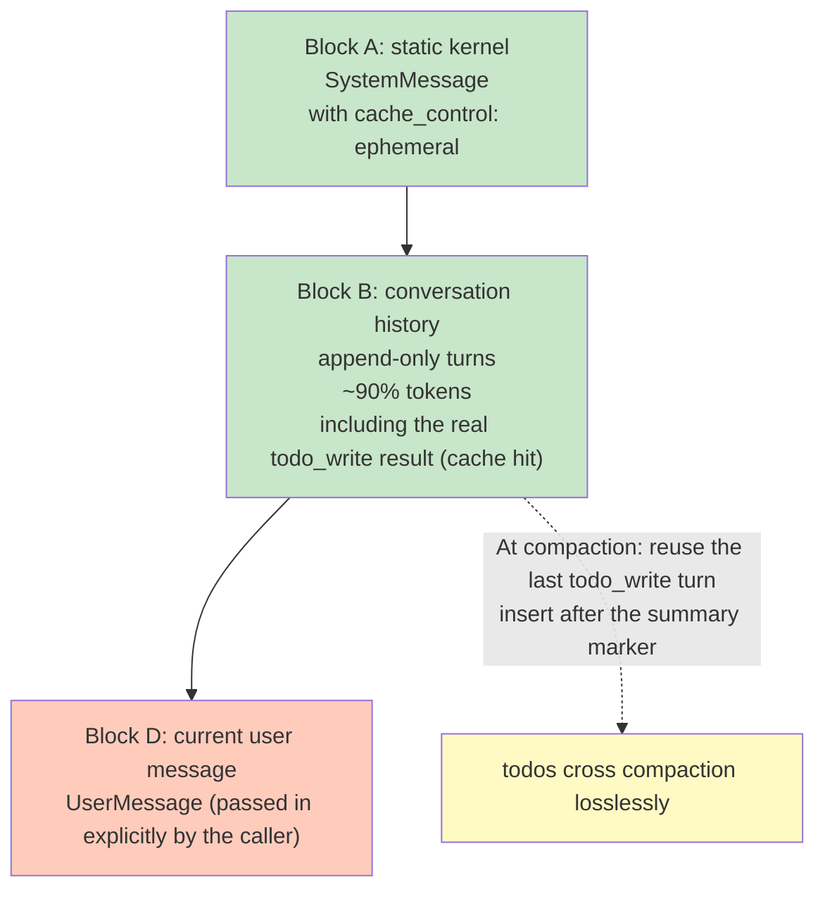

# ADR-060: Prompt-Cache-Friendly Context Block Reorganization — Stable Prefix + Append at the Tail

> **Chinese source of truth**: [ADR-060](../zh/ADR-060-prompt-cache-friendly-context-block-reorg.md)
> **Terminology**: see [GLOSSARY.md](./GLOSSARY.md)

**Status**: Proposed
**Date**: 2026-09-14
**Decision Makers**: 大鱼

**Related**:
- [ADR-011](./ADR-011-compaction-as-distillation.md) (context summarization and distillation unified strategy)
- [ADR-051](./ADR-051-runtime-memory-provider-decoupling.md) (Runtime Memory Provider decoupling)
- [ADR-052](./ADR-052-tool-compression-llm-autonomous.md) (LLM-autonomous tool compression)
- [ADR-054](./ADR-054-debug-context-snapshot-coverage.md) (Debug Context Snapshot Coverage)
- [ADR-061](./ADR-061-context-compression-byte-budget.md) (context compression rework — the 8-level decreasing strategy; split out of this ADR's §12 as an independent compression rework)

---

> **Revision record v2 (2026-09-XX)**: Block C (the trailing dynamic todo snapshot) is **removed**. Reason: putting the full list at the tail every round means its position drifts as Block B grows, so it never hits cache — wasting several hundred tokens every round. todos are instead carried by two paths:
> 1. **The real `todo_write` tool result inside Block B** (contains the full list, cache hit);
> 2. **Injection at compaction time**: compaction reuses the last real `todo_write` turn from the history (an Assistant tool_call + Tool result pair), and if it is not in the retained tail, extracts and inserts it after the summary marker — so todos cross compaction losslessly and the LLM's "the latest todo_write result = current state" heuristic works naturally.
>
> Architectural principle: **compaction summaries (lossy, recording "what happened") and todos (lossless, recording "what to do next") are separated** — the process can be distilled, the state must stay faithful.

---

## 1. Decision Summary

The `ChatRequest.messages` order emitted by `ContextBuilder::build()` ([core/acowork-runtime/src/agent/context.rs:459-717](../../../core/acowork-runtime/src/agent/context.rs#L459-L717)) has a **severe cache hit-rate problem**:

| Current messages order | Byte share | Change frequency | Cache impact |
|---|---|---|---|
| `[0] SystemMessage(retrieved_memory + todo_context + workspace_prompt_file)` | ~10% | **changes on every build** (memory retrieval, todo writes) | **breaks the anchor** |
| `[1..N] history.messages()` (user/assistant/tool) | **~90%** | append-only (ideally) | should be the stable cache body |
| trailing: the current user message | tiny | necessarily new | unavoidable |

The actual problem today: **dynamic blocks are sandwiched between static ones, so the ~90% of conversation history is invalidated every round**. OpenAI's 128-token hash chain and Anthropic's prefix cache are both zero-tolerance to "a change at any position in the middle" — as soon as `[0]` changes, the entire subsequent hash chain shifts.

This ADR decides to reorganize the `ContextBuilder` output, by cache impact, into 3 orthogonal blocks (Block A/B/D) plus compaction injection, and correspondingly rework persistence and the debug view:

1. **Block A: the static kernel (always stable)** — a single SystemMessage carrying `cache_control: ephemeral`. Contains package prompts, identity, workspace meta, retrieved memory, environment, workspace prompt file.
2. **Block B: the conversation history (append-only)** — the user/assistant/tool turns of `history.messages()`, ~90% of the bytes, **the real battleground for cache hit rate**. todos are carried by the real `todo_write` tool result inside it (containing the full list, cache hit).
3. **Block D: the current user message** — passed in **explicitly by the caller**, no longer reverse-derived from the history (§5.5).
4. **Compaction injection (replacing the original Block C)** — at compaction time reuse the last real `todo_write` turn from the history and insert it after the summary marker, so todos cross compaction losslessly (§5.4).

And make the corresponding changes to the related persistence and observability:

5. **`SessionMeta.todos`** persists the current todo snapshot (`meta/{session_id}.json`), avoiding the conflict between JSONL append-only and frequent updates; the data flow is in §6.1.
6. **The Debug panel item order is aligned with the new structure** (§6.2).
7. **The semantics of the `memory_recall` tool stay unchanged** — its result is appended to the end of the history via `ChatMessage::tool()` (see [core/acowork-runtime/src/agent/loop_.rs:1618-1630](../../../core/acowork-runtime/src/agent/loop_.rs#L1618-L1630)), which naturally fits Block B's append-only semantics, **no change needed**.
8. **The `auto_inject_enabled` trigger policy changes from "triggered by every user input turn" to "triggered by the first user input"** — even if auto-inject is enabled by default in the future, `retrieve_and_inject` runs only once at the first user message; subsequent turns do not re-run the retrieval unless explicitly triggered or the memory set changes significantly. Under the reality that `auto_inject_enabled` defaults to `false`, this constitutes no behaviour change, but it establishes the rule for the future (§6.3).

**Non-goals** (not discussed by this ADR):
- **The context compression mechanism (8-level decreasing + FIFO deletion)** — already split out into [ADR-061](./ADR-061-context-compression-byte-budget.md) for independent review; this ADR does not touch it.
- Rewriting the history trim / compaction algorithms — ADR-011's "keep the most recent K turns, compact the old content" strategy stays as is, taken over by ADR-061.
- Cache optimization of the tools section (one-shot JSON-ification of MCP tool definitions) — independent impact, P1 priority, not expanded this round.
- `detect_environment_text()`'s `OnceCell` cache — a small CPU optimization, can be done in passing but not core.

---

## 2. Background and Current State

### 2.1 The physical facts of prompt cache

| Provider | Hit mechanism | Tolerance for "a change in the middle" |
|---|---|---|
| **Anthropic** | Caches at breakpoints marked with `cache_control: ephemeral`; the **prefix must be byte-for-byte equal** | **Zero tolerance** |
| **OpenAI** | Automatically builds a hash chain over 128-token blocks | **Zero tolerance** — a change at any position in the middle shifts the hash of every subsequent block |

**Key deduction**: regardless of the vendor, **as soon as bytes are inserted or modified in the middle of messages (before the early conversation history), all the stable history behind it is "squeezed out" of cache**.

ACowork's current typical scenario (8K context, mixed user/assistant tool calls) has a cache hit rate near 0% — that is the cost of the current architecture.

> Note: both OpenAI and Anthropic have a "minimum cacheable prefix length" requirement (typically 1024 tokens), so a small context below 8K may not meet the threshold for Block A to form its own cacheable block — the hit-rate expectations in §8 assume "a sufficiently large context".

### 2.2 The actual assembly order of the current `ContextBuilder::build()`

```rust
// core/acowork-runtime/src/agent/context.rs:469-526
let mut system_content = self.system_prompt.clone();  // static
if let Some(ref identity) = self.identity_context { /* append */ }
if let Some(ref workspace) = self.workspace_context { /* append */ }
if let Some(ref memory) = self.retrieved_memory { /* append */ }       // ⚠️ dynamic
if let Some(ref hint) = self.ambiguous_confirmation_hint { /* append */ } // ⚠️ occasionally dynamic
if let Some(ref skills) = self.skill_instructions { /* append */ }
if let Some(ref todos) = self.todo_context { /* append */ }             // ⚠️ dynamic
if let Some(ref env_override) = self.environment_override { /* append */ }
else { system_content.push_str(&format!("\n\n{}", detect_environment_text())); /* recomputed every round */ }
if let Some(ref prompt_file) = self.workspace_prompt_file { /* append */ }

messages.push(ChatMessage::system(system_content));  // [0] = a single SystemMessage
messages.extend(history.messages().iter().filter(|m| !System).cloned());  // [1..N]
```

**Key observations**:
- Three dynamic blocks (`retrieved_memory`, `todo_context`, and the `ambiguous_confirmation_hint` that may be enabled in the future) are embedded in the **middle** of the main SystemMessage.
- Even though retrieved_memory is currently disabled by default (`MemoryManagerConfig::auto_inject_enabled = false`, see [core/acowork-memory/src/manager.rs:120-150](../../../core/acowork-memory/src/manager.rs#L120-L150)), `todo_context` necessarily changes every time the agent calls the `todo_write` tool.
- Any change to the main SystemMessage makes OpenAI's 128-token hash chain shift from position 0.

### 2.3 The current state of `auto_inject_enabled` and its hidden concern

`MemoryManagerConfig::auto_inject_enabled` currently defaults to `false`, with an early return at [core/acowork-runtime/src/agent/loop_memory.rs:88-91](../../../core/acowork-runtime/src/agent/loop_memory.rs#L88-L91):

```rust
if !manager.config().auto_inject_enabled {
    tracing::debug!("Memory auto-inject disabled (auto_inject_enabled=false)");
    return;
}
```

The documented reasons for keeping it off (a 2026-09-12 decision):
1. Different agent types need different recall profiles
2. The Grafeo memory layer is not yet mature enough for unsupervised injection
3. Using the raw user message as the query, low precision instead misleads the LLM

**It will not fire today** → the `retrieved_memory` field in the system prompt is **effectively empty** (although the code supports injection). But the code path is already there, and once enabled in the future, **every user message turn would re-run** `retrieve_and_inject`; `MemoryQuery::auto_inject` embeds the current user message for retrieval, so the results necessarily change every round.

**That is exactly the hidden concern this ADR addresses** — even if the memory content is stable (the same hits, the same scores), the jitter of the formatted text, counts and ordering changes the SystemMessage bytes, which then invalidates the OpenAI/Anthropic cache.

### 2.4 The actual semantics of the `memory_recall` tool

`memory_recall` is an explicit LLM tool call ([core/acowork-runtime/src/tools/builtin/memory_recall.rs](../../../core/acowork-runtime/src/tools/builtin/memory_recall.rs)):
- The tool returns a formatted-text `ToolResult` (memory_recall.rs:204-228); **the append happens at the caller** — `execute_single_iteration` appends it to the end of the history as `ChatMessage::tool()`, see [core/acowork-runtime/src/agent/loop_.rs:1618-1630](../../../core/acowork-runtime/src/agent/loop_.rs#L1618-L1630)
- **It fits Block B's append-only semantics perfectly**
- It does not pollute the system prompt, nor does it affect Block A's cache
- This ADR **needs no change to this path**

### 2.5 The current state of todo persistence

`SessionState.todos` is currently **in memory only**:
- `update_todos()` ([core/acowork-runtime/src/agent/session_state.rs:464-479](../../../core/acowork-runtime/src/agent/session_state.rs#L464-L479)) mutates `Vec<TodoItem>`
- `format_todos()` ([core/acowork-runtime/src/agent/session_state.rs:483-500](../../../core/acowork-runtime/src/agent/session_state.rs#L483-L500)) formats it on every build
- **Neither in JSONL nor in `SessionMeta`** (see [core/acowork-runtime/src/conversation.rs:231-269](../../../core/acowork-runtime/src/conversation.rs#L231-L269))

The todo list is **completely lost on session restart** — a pre-existing functional gap.

---

## 3. The Core Problem

### 3.1 A SystemMessage accounting for ~10% of bytes destroys the cache of the ~90% of history

**This is the most serious cache-efficiency problem in the current architecture.**

```
[messages] the actual current order

 [0] SystemMessage (dynamic blocks in the middle)
      ├─ package prompts + skills (static)
      ├─ identity_context (static within a session)
      ├─ workspace_context (static within a session)
      ├─ **retrieved_memory** (re-retrieved each turn → bytes change)
      ├─ **ambiguous_confirmation_hint** (occasional)
      ├─ skill_instructions (mostly static)
      ├─ **todo_context** (changes on todo_write)
      ├─ environment (static within the process)
      └─ workspace_prompt_file (static within a session)

 [1..N] history.messages()  ←  ~90% of bytes, should be the cache body
      └─ but every round is shifted because [0] changed
```

**Any dynamic block placed in the middle of `[0]` is a P0 cache killer.**

### 3.2 "Re-injecting retrieved memory on every build" is the wrong design

Even if `auto_inject_enabled` is enabled in the future:
- Each round's user message content differs → the retrieval results differ
- Even if the top-1 memory is fixed, the formatted text (`- [Episodic] (score=0.85) ...`) still jitters
- Making dynamic content behave "like a SystemMessage rewritten on every build" is anti-append-only

**The correct semantics is "append"** — append the retrieval result like a tool message rather than overwriting the SystemMessage.

But `auto_inject_enabled` and `memory_recall` are two different paths:
- `auto_inject_enabled`: the agent loop actively runs `retrieve_and_inject` every round
- `memory_recall`: an explicit LLM tool call, whose result is appended to the history

The finer-grained strategy proposed by the user is: **even if `auto_inject_enabled` is enabled, it should fire only once at the first user message; subsequent turns do not re-run the retrieval unless explicitly triggered or the memory set changes significantly** (§6.3).

### 3.3 todos placed in the middle of the SystemMessage cannot be persisted

JSONL is append-only (see [core/acowork-runtime/src/conversation.rs:309](../../../core/acowork-runtime/src/conversation.rs#L309) `ConversationWriter`). If todos were:
- placed in the middle of the SystemMessage → the SystemMessage changes frequently → a cache killer (see §3.1)
- written to JSONL → every todo change writes a line, and the history fills up with todo state lines → redundant and semantically unclear
- not persisted → todos are lost on session restart (a pre-existing problem)

`SessionMeta` is the natural home for todos — every todo change → write `meta/{session_id}.json` once, consistent with the existing meta + JSONL two-layer architecture from ADR-024.

### 3.4 The cache_control marking strategy

Anthropic's 4-breakpoint limit (early 2026) is not strict — the actual limit has since been relaxed — but **explicitly marking the cache boundary is the most robust engineering practice**. OpenAI needs no explicit marking; caching happens automatically as long as the cache boundary is in the right place.

One `cache_control: ephemeral` at the end of Block A is the minimal viable solution (v2 revision: the original Block C has been removed, so no second breakpoint is needed; the compaction-injected `todo_write` turn is a standard Tool message and needs no cache_control).

---

## 4. Design Goals

### 4.1 Goals

- **Maximize the cache hit rate of Block A + Block B** — that is ~95% of the bytes
- Put dynamic blocks (todos) at the end of messages, so a change only invalidates themselves and **does not pollute the stable prefix in front of them**
- Preserve the append-only semantics of the `memory_recall` tool call (already naturally correct, no change needed)
- Provide todo persistence (survives a session restart)
- Align the debug panel with the new structure

### 4.2 Non-goals

- **No rewriting of the history trim / compaction algorithms** — handed over to [ADR-061](./ADR-061-context-compression-byte-budget.md)
- No rewriting of the tools-section cache optimization (MCP tool definitions JSON-ification, P1)
- No introducing a new persistence layer (`SessionMeta` + JSONL is sufficient)
- No change to the `memory_recall` tool interface (it already naturally fits append-only)
- No adjustment of the `auto_inject_enabled` default (keep `false`; this ADR only defines "the trigger policy for when it is enabled in the future")

### 4.3 Design principles

1. **Stable prefix + append at the tail**: the single principle behind cache-friendliness
2. **append-only**: dynamic content enters messages by appending rather than overwriting
3. **Single-point changes**: every change point is independently testable and rollback-able
4. **Minimal coupling**: no forced large refactor of the provider trait, no forced change to the LLM interface
5. **Provider-aware**: the role and position of the new messages must satisfy each provider's protocol constraints (§5.4), introducing no message shape that violates existing constraints

---

## 5. Design: the Four-Block Structure (Block A/B/C/D)

### 5.1 The overall structure



**Block A + B are the stable cache body**; Block D is necessarily new; todos are carried by the real `todo_write` result inside Block B (cache hit), and compaction-time injection guarantees they cross compaction losslessly.

### 5.2 Block A content (the static kernel)

Source: `package prompts + skills` + injected metadata.

```rust
fn build_block_a(&self) -> String {
    let mut s = self.system_prompt.clone(); // package prompts + skills
    if let Some(ref id) = self.identity_context {
        s.push_str(&format!("\n\n## User Identity\n{id}\n\nReply in the language specified by the Language field above."));
    }
    if let Some(ref ws) = self.workspace_context { s.push_str(&format!("\n\n{ws}")); }
    if let Some(ref mem) = self.retrieved_memory {
        // Currently disabled by default; even when enabled in the future it fires
        // only once at the first user message (see the §6.3 trigger policy)
        s.push_str(&format!("\n\n## Relevant Memories\n{mem}"));
    }
    if let Some(ref sk) = self.skill_instructions { s.push_str(&format!("\n\n## Skill Instructions\n{sk}")); }
    if let Some(ref env) = self.environment_override {
        s.push_str(&format!("\n\n{env}"));
    } else {
        // The env text is cached with OnceLock, computed once at startup (§6.4)
        s.push_str(&format!("\n\n{}", CACHED_ENV_TEXT.get_or_init(detect_environment_text)));
    }
    if let Some(ref pf) = self.workspace_prompt_file {
        s.push_str(&format!("\n\n## Workspace Prompt File\n{pf}"));
    }
    s
}
```

**Key change**: `todo_context` and `ambiguous_confirmation_hint` are **moved out of Block A** — todos are carried by the real `todo_write` result in Block B + compaction-time injection (§5.4); the hint is not implemented for now.

### 5.3 Block B content (the conversation history)

Comes directly from `history.messages()`, filtering out any System messages already present (since Block A exclusively owns the System role).

```rust
messages.extend(
    history.messages().iter()
        .filter(|m| !matches!(m.role, MessageRole::System))
        .cloned()
);
```

**append-only guarantee**:
- `HistoryManager::append()` ([core/acowork-runtime/src/agent/history.rs:263-271](../../../core/acowork-runtime/src/agent/history.rs#L263-L271)) is the main write path
- The tool-result persistence in `execute_single_iteration` ([core/acowork-runtime/src/agent/loop_.rs:1618-1630](../../../core/acowork-runtime/src/agent/loop_.rs#L1618-L1630)) only appends, never rewrites
- The `memory_recall` result append ([core/acowork-runtime/src/tools/builtin/memory_recall.rs:204-228](../../../core/acowork-runtime/src/tools/builtin/memory_recall.rs#L204-L228)) goes through a `ChatMessage::tool()` append, naturally correct
- Note: a few middle-rewrite paths still exist (`abandon_tool_result` / `retrieve_tool_result` / `replace_middle_with_summary` / debug `truncate_to`), of which the tool-compression path is closed by ADR-061, and the compaction path is handled by ADR-061 with "sunk cost" semantics

### 5.4 How todos are carried — Block C removed, replaced by "carried by history + injection at compaction"

**Revision (v2)**: the original Block C (the trailing dynamic todo snapshot) is **removed**. Reason: putting the full list at the tail every round means its position drifts as Block B grows, so it never hits cache — wasting several hundred tokens every round, which is exactly the waste this ADR exists to eliminate.

**todos are carried by two paths**:

1. **The real `todo_write` tool result in Block B** — `handle_todo_write` ([loop_interaction.rs:116-191](../../../core/acowork-runtime/src/agent/loop_interaction.rs#L116-L191)) returns the full list (`format_todos()`), appended to the history as a Tool message, hitting cache naturally. The LLM's "the latest todo_write result = the current state" heuristic works directly.
2. **Injection at compaction time** — compaction (ADR-061's 8 levels / `replace_middle_with_summary`) deletes the middle segment and may delete the last `todo_write` turn. At compaction time, reuse the last real `todo_write` turn from the history; if it is not in the retained tail, extract and insert it after the summary marker, guaranteeing todos cross compaction losslessly.

**The rules for compaction injection**:

```rust
// history structure after compaction:
// [system][summary marker][todo_write turn (reused)][retained...]
// Extraction rules (scan backwards from the end of the history):
// 1. Find the last tool_call with name == "todo_write" → get its tool_call_id
// 2. Find the matching Tool result message
// 3. If that turn is already in plan.retained → skip (it survived; avoid a duplicate tool_call_id)
// 4. Otherwise insert it after the marker post-compaction
```

**Key constraints**:

1. **The complete turn must be reused (the Assistant tool_call + Tool result pair)**: `sanitize_messages` ([history.rs:667-674](../../../core/acowork-runtime/src/agent/history.rs#L667-L674)) deletes orphan Tool results — injecting only the Tool message would get deleted.
2. **Avoid a duplicate tool_call_id**: if the last `todo_write` turn happens to be in the retained tail (within the most recent K turns), it has survived — do not insert a copy, otherwise two Tool messages with the same tool_call_id appear, which OpenAI/Anthropic may reject.
3. **The tokens count toward the compaction budget**: the injected turn (~350 tokens) counts into `projected_tokens`, preventing it from breaking through the level-8 floor ([history.rs:1179-1185](../../../core/acowork-runtime/src/agent/history.rs#L1179-L1185)).
4. **Empty list / no todo_write turn**: skip the injection. In the rare scenario where compaction is triggered after a restart but before the first `todo_write`, it is possible to fall back to constructing it from `SessionMeta.todos` (optional).

**Why reuse a real turn rather than fabricate one**: reuse costs zero construction (no need to generate JSON or a unique id), and it naturally matches the LLM's "the latest todo_write result = the current state" heuristic — when a new result is appended to the tail after compaction, `latest-wins` selects correctly, with no need to distinguish "snapshot vs current".

**Architectural principle**: the compaction summary (lossy, recording "what happened") and todos (lossless, recording "what to do next") are separated — the process can be distilled, the state must stay faithful.

### 5.5 Block D content (the current user message) — passed in explicitly, not reverse-derived from the history

**Early draft approach (abandoned)**: pop from the end of `history.messages()` inside `build()` — relying on the implicit assumption that "the last entry of the history is the current user message". **That assumption does not hold**: during tool-loop iterations the end of the history is a `Tool` message (the normal case, not an exception), and `[System Notification]` (session_task.rs:1432-1434), ask_user answers, and debug replay variants all break pop semantics; and popping makes the request inconsistent with the debug snapshot (`messages_arc()`).

**This ADR's approach**: the caller **explicitly passes in** the current user message.

```rust
pub fn build(
    &self,
    manifest: &AgentManifest,
    history: &HistoryManager,
    current_user_message: Option<&ChatMessage>,  // new explicit parameter: None = tool iteration
    gateway_capabilities: Option<&ModelCapabilitiesInfo>,
    max_output_tokens_limit: u64,
) -> ChatRequest
```

Caller changes ([loop_context.rs:984](../../../core/acowork-runtime/src/agent/loop_context.rs#L984) `build_chat_request`):
- `AgentLoop` gains a `pending_user_message: Option<ChatMessage>` field
- `run_inner()` stashes that message when it receives new user input ([loop_.rs:697-700](../../../core/acowork-runtime/src/agent/loop_.rs#L697-L700)); sets `None` for tool-loop iterations and debug replay
- `build_chat_request` takes it out and passes it in; when `Some` it can use `debug_assert!(history end == that message)` as a consistency check

```rust
let mut history_msgs: Vec<_> = history.messages().iter()
    .filter(|m| !matches!(m.role, MessageRole::System))
    .cloned()
    .collect();

messages.extend(history_msgs);            // Block B (including the current user message, append-only position unchanged)
// todos are not injected here — they are carried by the real todo_write result in Block B, plus injection at compaction (§5.4)
if let Some(user_msg) = current_user_message {
    messages.push(user_msg);              // Block D
}
```

Note: Block B includes the current user message, and Block D is its **copy** (a clone of the same `ChatMessage`, byte-identical) — this is necessary: the history must be persisted and displayed in full, while in the request it sits at the very last position. The debug snapshot shows the full history (including that message); in the request it appears as Block D — the content is consistent, only the display position differs.

### 5.6 The `cache_control` field

Added to `ChatMessage` (location: **`core/acowork-core/src/providers/traits.rs:422`** — a shared crate, not runtime-private; `#[serde(default, skip_serializing_if)]` guarantees backward compatibility):

```rust
pub struct ChatMessage {
    pub role: MessageRole,
    pub content: String,
    pub content_parts: Option<Vec<ContentPart>>,
    pub tool_calls: Option<Vec<ToolCall>>,
    pub tool_call_id: Option<String>,
    pub name: Option<String>,
    /// Provider-specific cache boundary hint.
    /// Anthropic: maps to `cache_control: { type: "ephemeral" }` on the message.
    /// OpenAI: implicit; block position alone determines cache.
    #[serde(default, skip_serializing_if = "Option::is_none")]
    pub cache_control: Option<CacheControl>,
}

#[derive(Debug, Clone, Copy, Serialize, Deserialize, PartialEq, Eq)]
#[serde(rename_all = "snake_case")]
pub enum CacheControl {
    Ephemeral,
    Persistent,  // reserved, currently unused
}
```

Provider mapping (§7.1-3) **must handle the System-promotion semantics**:
- **Anthropic**: message-level `cache_control` only takes effect for user/assistant messages (`AnthropicMessage` gains a `cache_control` field); marking the cache on a System message requires the top-level `system` field to be upgraded from `String` to a content-block array (`{"type":"text","cache_control":...}`) — Block A's cache breakpoint depends on this rework, and it is on the implementation checklist
- **OpenAI**: the field is ignored, but **the block position is placed correctly** (one at the end of Block A); note that no system/developer message is introduced in the middle
- **Ollama**: ignored

> Note: the compaction-injected `todo_write` turn is a standard Tool message shape, does not involve a cache_control marking, and is unaffected by the System-promotion rework above.

---

## 6. Supporting Changes

### 6.1 `SessionMeta.todos` persistence — the complete data flow

`SessionMeta` ([core/acowork-runtime/src/conversation.rs:231-269](../../../core/acowork-runtime/src/conversation.rs#L231-L269)) gains a field:

```rust
pub struct SessionMeta {
    // ... existing fields ...
    #[serde(default, skip_serializing_if = "Option::is_none")]
    pub todos: Option<Vec<TodoItem>>,
}
```

**Data-flow design** (ownership converged, avoiding double writers):

```
todo_write tool → SessionState::update_todos() (in memory, runtime ownership)
                       │
                       ▼ (synchronous mirror, via the public ConversationSession interface)
        ConversationSession::set_todos(&[TodoItem])  ← new locked field, the sole persistence owner
                       │
                       ▼ (when the content changes)
        write_meta() reuses the existing disk-write path (including the META_WRITE_COOLDOWN_MS throttle, conversation.rs:581)
                       │
                       ▼ (session startup)
        session_init reads meta.todos → SessionState.todos (same pattern as model/provider/reasoning_effort)
```

- **`set_todos` semantics**: skip the disk write when the content is identical to last time (avoiding a flush when todos have not changed); when it changes, **write to disk immediately** (metadata-mutation semantics, consistent with title/model/provider, and not going through the `META_WRITE_COOLDOWN_MS` throttle on the `append_message` path) — writing immediately guarantees that the first `todo_write` survives a process kill even inside the cooldown window after session creation, so a restart always restores (implementation revision record: 2026-08-30).
- **Double writing is forbidden**: `SessionState` must not write the meta file directly — disk writes go only through `ConversationSession`'s existing path (it is the sole owner of meta).
- **JSONL does not get a todo_event** (not done this round): add it when the debug panel timeline needs it, aligned with the existing `kind="compaction"` pattern.

### 6.2 Debug panel items kept in sync — the implementation form is confirmed

Verified against `capture_context_snapshot` ([core/acowork-runtime/src/debug/observer_impl.rs:347-441](../../../core/acowork-runtime/src/debug/observer_impl.rs#L347-L441)): the sections are **organized in build injection order** (system_prompt → identity → workspace → memory → hint → skills → todo_context → environment → prompt_file → tool_definitions → messages), and messages is an independent lazy segment (metadata + on-demand loading) — it is **not** displayed in `chat_request.messages` array order.

**Conclusion**: the debug panel will not "follow along automatically"; explicit adjustment is required:
- The `todo_context` segment changes semantics from "a system prompt sub-item" to "the todo_write tool result in the history + the compaction-injected turn" — keep the segment content, update the grouping/label; the compaction-injected synthetic turn can carry a `synthetic` marker for identification;
- The `messages` segment shows the full history snapshot (including the current user message); its relation to Block D in the request is described in §5.5, and the display is unchanged;
- After Block A is split, the order of each segment stays consistent with the `build_block_a()` assembly order (already aligned today, no order change needed).

### 6.3 The `auto_inject_enabled` trigger policy (for when it is enabled in the future)

**Defaults to `false` today**, behaviour unchanged.

**When enabled in the future** (the policy this ADR defines):

| Trigger moment | Whether to retrieve_and_inject |
|---|---|
| The **first** user message after session startup | ✅ fires |
| Subsequent user message turns | ❌ does not fire |
| The LLM explicitly calls the `memory_recall` tool | ✅ fires (goes through the tool path, does not pollute the SystemMessage) |
| Significant change to the memory set (≥ N new nodes) | ✅ fires (can be signalled by consolidation_bg; **the channel is not implemented, marked as follow-up work**) |

**Implementation points**:
- `AgentLoop` gains a `memory_retrieved_for_session: bool` flag
- Set to true after the first `retrieve_and_inject_memories()` call succeeds
- For later turns, extend the early return at `loop_memory.rs:88`: `if !manager.config().auto_inject_enabled || self.memory_retrieved_for_session { return; }`
- The explicit `memory_recall` tool call goes through an independent path and **does not affect this flag**

### 6.4 Caching `detect_environment_text()`

[core/acowork-runtime/src/agent/context.rs:807-828](../../../core/acowork-runtime/src/agent/context.rs#L807-L828) becomes:

```rust
static CACHED_ENV_TEXT: OnceLock<String> = OnceLock::new();

pub fn detect_environment_text() -> &'static str {
    CACHED_ENV_TEXT.get_or_init(|| format!(
        "## Environment\n- Operating System: {}\n- Architecture: {}\n- Shell: {}\n- Available Shell Tools: {}",
        std::env::consts::OS, std::env::consts::ARCH,
        crate::platform::detected_shell().display_name,
        /* ... */
    ))
}
```

**Benefit**: the environment text is computed only once per process, which also improves the guarantee of byte stability (it was stable before, but this removes one formatting overhead).

---

## 7. Scope and Dependencies

### 7.1 Change list

| # | Content | Files involved | Priority |
|---|---|---|---|
| 1 | `ContextBuilder::build()` reorganized into Block A/B/D + the explicit `current_user_message` parameter + **removal of Block C** | `core/acowork-runtime/src/agent/context.rs` + `loop_context.rs` + `loop_.rs` | **P0** |
| 2 | `ChatMessage.cache_control` + the `CacheControl` enum (**the acowork-core shared crate**) | `core/acowork-core/src/providers/traits.rs` | **P0** |
| 3 | Provider mapping of cache_control + **upgrading the Anthropic system field to a content-block array** (a prerequisite for the Block A breakpoint) | `providers/anthropic.rs`, `providers/openai.rs`, `providers/ollama.rs` | **P0** |
| 4 | The `SessionMeta.todos` field + `build_meta` filling todos + `ConversationSession::set_todos` (with throttling) | `core/acowork-runtime/src/conversation.rs` | **P0** |
| 5 | `update_todos()` synchronously mirrored to `conversation.set_todos()` | `core/acowork-runtime/src/agent/session_state.rs` + `loop_interaction.rs` | **P0** |
| 6 | Session startup loading todos from meta into `SessionState` | `core/acowork-runtime/src/startup/session_init.rs` | **P0** |
| 7 | **Compaction injection**: at compaction time reuse the last `todo_write` turn from the history; if not in the retained set, insert it after the marker; its tokens count toward the compaction budget | `core/acowork-runtime/src/agent/loop_context.rs` + `history.rs` | **P0** |
| 8 | Aligning the Debug panel item order/labels (§6.2) | `core/acowork-runtime/src/debug/observer_impl.rs` + the frontend | **P0** |
| 9 | The `auto_inject_enabled` first-trigger policy (implemented when it is enabled in the future) | `core/acowork-runtime/src/agent/loop_memory.rs` | **P1** (behaviour unchanged) |
| 10 | `detect_environment_text()` using `OnceLock` | `core/acowork-runtime/src/agent/context.rs` | **P2** |

### 7.2 Implementation order

1. **(2) The `ChatMessage.cache_control` field** — every other change depends on it
2. **(3) Provider mapping** — ensures the cache_control field does not break existing protocols; **complete the Anthropic system field upgrade first** (avoiding a half-done state where System gets overwritten)
3. **(1) `ContextBuilder::build()` reorganization + explicit Block D parameter + removal of Block C** — the core change
4. **(4-6) The three-part `SessionMeta.todos`** — supporting persistence
5. **(7) Compaction injection** — reuse the last `todo_write` turn at compaction time (§5.4)
6. **(8) Debug panel alignment** — the presentation layer
7. **(9) The auto_inject trigger policy** — P1, behaviour unchanged, but the code is in place
8. **(10) env OnceLock** — a small optimization, done in passing

### 7.3 Testing requirements

- **Unit tests**: byte stability of the Block A assembly function, `set_todo_context` content comparison, the `build_chat_request` output order (Block B including the current user message + a byte-identical Block D copy), **after compaction injection the `todo_write` turn exists after the marker with no duplicate tool_call_id**
- **Integration tests**: todos restored after a session restart, the first user message firing when `auto_inject_enabled=true` and later turns not firing, Block D=None during tool iterations, **todos preserved losslessly after compaction**
- **Regression tests**: correct `cache_control` serialization for all three providers — Anthropic (including the system-promotion regression: Block A must not be overwritten by a mid-sequence message) / OpenAI / Ollama, **and the compaction-injected turn surviving `sanitize_messages` without being deleted**
---

## 8. Impact and Rollback

### 8.1 Behavioural impact

| Dimension | Before | After |
|---|---|---|
| OpenAI prompt cache hit rate | ~0% | ~90%+ (Block B is stable, with no Block C tail resend; premise: the context is at least the minimum cacheable length) |
| Anthropic cache write count | Every round | Once (subsequent rounds pay only the read cost) |
| todos after a session restart | Lost | Restored (a new capability) |
| **todos after compaction** | May be deleted with the middle segment | **Preserved losslessly** (compaction injection, §5.4) |
| Todo tokens that miss cache every round | ~300 (the Block C full list) | ~0 (the list hits cache inside the history) |
| `auto_inject_enabled` current behaviour | Off | Off (unchanged) |
| `auto_inject_enabled` when enabled in the future | Fires every round | Fires on the first turn (to be implemented) |
| Debug panel display | By the existing aggregation | By the Block A/B/D order + the compaction-injected turn marker |
| The existing LLM tool interface | No change | No change (`memory_recall` already fits append-only naturally) |
| Context compaction | Unaffected | Injects the `todo_write` turn at compaction time (§5.4) |

### 8.2 Rollback plan

`ContextBuilder::build()` is a single-file change, independently rollback-able to the pre-change commit.

`SessionMeta.todos` is a new field (`#[serde(default)]`); when absent it degrades to the old behaviour (empty todos), so it is forward-compatible.

`ChatMessage.cache_control` is an `Option`; when absent it degrades to no cache marking, so it is forward-compatible.

### 8.3 Performance impact

- **CPU**: the Block A assembly logic is unchanged; after removing Block C, each round does one fewer todo-snapshot formatting; at compaction time there is one extra scan for the `todo_write` turn (scanning backwards, a single O(n)). `OnceLock` reduces environment formatting.
- **Memory**: todos still live only in memory; the `SessionMeta` write frequency matches the todo update frequency (one meta JSON write per todo change; no write when the content is unchanged, no throttle — the todo update frequency is far lower than the `append_message` path, each write < 1 KB, so the disk-write cost is negligible).
- **Disk**: the meta file gains a todos field, < 1 KB. No new JSONL entries.

---

## 9. Relationship to Existing ADRs

| Existing ADR | Relationship |
|---|---|
| [ADR-011](./ADR-011-compaction-as-distillation.md) | The compaction mechanism (including the KEEP_LAST_ROUNDS evolution) is taken over by [ADR-061](./ADR-061-context-compression-byte-budget.md); this ADR depends only on its Block B append-only semantics |
| [ADR-014](./ADR-014-loop-module-decomposition.md) | The main changes of this ADR are in `loop_context.rs` and `context.rs`, compatible with the Phase 1-6 module decomposition |
| [ADR-024](./ADR-024-merge-metadata-into-index.md) | `SessionMeta.todos` extends the existing meta + JSONL two-layer architecture, with no conflict |
| [ADR-032](./ADR-032-context-recall.md) | `context_recall` has been renamed to `context_retrieve` (ADR-052); this ADR does not touch this path |
| [ADR-051](./ADR-051-runtime-memory-provider-decoupling.md) | The `auto_inject_enabled` policy change sits in `loop_memory.rs`, compatible with the trait decoupling |
| [ADR-052](./ADR-052-tool-compression-llm-autonomous.md) | The `context_retrieve` / `context_abandon` tools go through Block B's append-only path, fully compatible with this ADR; the fate of those tools is decided by ADR-061 |
| [ADR-054](./ADR-054-debug-context-snapshot-coverage.md) | The Debug panel item sync aligns with the snapshot coverage goal of ADR-054 (the implementation form is confirmed in §6.2) |
| [ADR-061](./ADR-061-context-compression-byte-budget.md) | The compression rework is an independent document; its compaction product (a marker that keeps the User role) is injected per the Block A/B/C/D layout and does not change any of this ADR's message-role conventions |

---

## 10. Summary

This ADR uses a **single principle** — "stable prefix + append at the tail" — to solve the core cache-efficiency problem of the current architecture:

- **Block A**: the static kernel, carrying `cache_control: ephemeral`, written to cache once
- **Block B**: the conversation history, append-only, ~90% of the bytes, **the body of the cache hit rate**; todos are carried by the real `todo_write` tool result inside it (cache hit)
- **Block D**: the current user message, **passed in explicitly by the caller**, placed at the very end
- **Compaction injection**: at compaction time reuse the last real `todo_write` turn and insert it after the summary marker, so todos cross compaction losslessly (§5.4)

**The accompanying engineering improvements**:
- todo persistence (survives a session restart, the data flow converged on `ConversationSession`)
- **todos cross compaction losslessly** (compaction injection, lossless preservation of the core state)
- the "first trigger" policy in place for when `auto_inject_enabled` is enabled in the future
- The Debug panel aligned with the new structure (the observer implementation form is confirmed)
- The Anthropic system field upgraded to a content-block array (a prerequisite for the Block A breakpoint)

**Key clarifications**:
- The append-only semantics of the `memory_recall` tool are **entirely correct** — the result is appended to the end of the history via `ChatMessage::tool()`, naturally compatible with the Block B design, and **this ADR needs no change to this path**
- `auto_inject_enabled` defaults to `false` today and this ADR does not change the status quo; but it defines the "first-trigger policy for when it is enabled in the future", preventing the cache killer of re-running retrieval every round
- The "clear-and-rewrite every round" of `retrieve_and_inject_memories` is a wrong design pattern — if auto-inject is enabled in the future, the retrieval results should be handled with append semantics (§11 follow-up work)
- **Block C (the trailing full todo snapshot) has been removed** (v2 revision): putting the full list at the tail never hits cache; todos are instead carried by the real `todo_write` result in the history + injection at compaction time (§5.4)
- **Context compression (8-level decreasing + FIFO deletion) has moved to ADR-061**; this ADR focuses on the message layout and cache prefix stability; the compaction injection is compatible with ADR-061's marker contract

---

## 11. Follow-up Work (not expanded in this ADR)

1. **Cache optimization of the tools section**: one-shot JSON-ification of MCP tool definitions, avoiding re-serializing on every build and thus invalidating the tools-section cache
2. **The real semantics implementation once `auto_inject_enabled` is truly enabled**: if the append path is taken, the retrieval results should be appended to the history as independent messages rather than overwriting a field inside Block A
3. **JSONL `todo_event` entries**: when the debug panel timeline needs it, add a `kind="todo_update"` entry, aligned with `kind="compaction"`
4. **The notification channel for significant memory set changes** (the last row of the §6.3 table): the consolidation_bg → AgentLoop trigger channel is not implemented and must be added before auto-inject is enabled
5. **The context compression rework** (8-level decreasing + byte budget + FIFO deletion) — see [ADR-061](./ADR-061-context-compression-byte-budget.md)
6. **The boundary fallback for compaction injection**: when compaction is triggered after a restart but before the first `todo_write`, the history has no `todo_write` turn, so it is possible to fall back to constructing the injected turn from `SessionMeta.todos` (§5.4 constraint 4, currently marked optional)

---

## Appendix A: Before / After Comparison

```mermaid
graph TD
    subgraph Before["Before"]
        B1["ContextBuilder.build()"] --> B2["SystemMessage with dynamic blocks in the middle"]
        B2 --> B3["history.append()"]
        B3 --> B4["LLM call"]
    end

    subgraph After["After"]
    subgraph After["After"]
        A1["ContextBuilder.build()"] --> A2["Block A static kernel<br/>(SystemMessage + cache_control)"]
        A2 --> A3["Block B history append-only<br/>(~90% tokens, the cache body)<br/>including the real todo_write result"]
        A3 --> A5["Block D current user message<br/>(passed in explicitly)"]
        A5 --> A6["LLM call"]
        A3 -. "At compaction: reuse the last todo_write turn<br/>insert after the summary marker" .-> A7["todos cross compaction losslessly"]
    end

    style B2 fill:#ffcdd2
    style A2 fill:#c8e6c9
    style A3 fill:#c8e6c9
    style A5 fill:#ffccbc
    style A7 fill:#fff9c4
```
