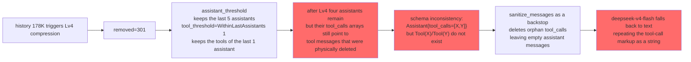

# ADR-061: Context Compression Rework — a 5-Level Decreasing Strategy Replacing Round-Count Retention

**Status**: v3 revision (2026-09-05; see §20 three-atom refactor + §6 the 5-level strategy + §10 placeholder semantics correction; where it conflicts with §19/the main body, §20 governs)
**Dates**:
- 2026-09-14: split out as an independent ADR from ADR-060 §12
- 2026-08-30: completed the v2 finalized revision (§19)
- **2026-09-05: v3 revision (5-level strategy + three atoms + placeholder semantics correction, §20)**
**Decider**: 大鱼
**Prerequisites**:
- [ADR-010](./ADR-010-context-compression-simplification.md) (the historical decision abolishing programmatic compression)
- [ADR-011](./ADR-011-compaction-as-distillation.md) (unified policy for context summarization and distillation)
- [ADR-052](./ADR-052-tool-compression-llm-autonomous.md) (LLM-autonomous tool compression)
- [ADR-053](./ADR-053-agent-specific-compaction-prompt.md) (Agent-level compaction prompt)
- [ADR-056](./ADR-056-global-default-compact-model.md) (global default compaction model resolution)
- [ADR-060](./ADR-060-prompt-cache-friendly-context-block-reorg.md) (Prompt-Cache-friendly context block reorg — the Block A/B/C/D prerequisite of this ADR)

---

## 1. Decision Summary

The Block A/B/C/D reorg in ADR-060 solved the problem of "dynamic blocks polluting the stable prefix", but **the context compression path is still the final killer of the cache**: the current mechanism retains the tail by round count (`KEEP_LAST_ROUNDS = 3`), and when the context still exceeds the limit after compression it degenerates into FIFO head-trimming — once FIFO fires, all of Block B is invalidated and every subsequent round pays the full token cost.

This ADR decides:

1. **An 8-level decreasing compression strategy** replaces "retain the most recent N rounds": start from the most permissive retention level and tighten level by level until the compression ratio reaches the threshold (default 90% = savings ≥ 90%, remainder ≤ 10%, e.g. 200K → 20K); the optimization metric changes from "round count" to "compression ratio". In routine scenarios Lv4-8 are the working levels (Lv5 is the stable hit point at the default threshold), while Lv1-3 are retained as an implementation for the "single user input + agent long tool task" scenario. The threshold is a per-agent tunable parameter (`compression_ratio_threshold`, AgentSetup panel, default 90%, see §3.3/§19.3).
2. **The FIFO path is physically deleted**: `trim_fifo` / `emergency_trim` are unreachable under the 8-level strategy; after deletion, extreme scenarios become an **explicit failure** (`ChunkEvent::Error` surfaced to the user). Never silently sacrifice the cache.
3. **Tool auto-compression is turned off**: the `context_abandon` tool is no longer registered (LLM-autonomous compression breaks cache continuity), and `context_retrieve` is retained as the explicit retrieval channel after compression.
4. **The summary keeps the existing marker contract**: the compression artifact is still a message with role `User` and `name="compaction_summary"` (the existing ADR-011/restorer convention); the level metadata is written as plain text at the very front of the summary content, **without changing the message role** — avoiding conflicts with ADR-060's Block B System filtering and Anthropic's system-promotion semantics.
5. **Never degrade to FIFO when the LLM is unavailable**: do not modify history, emit `ChunkEvent::Error` to the frontend, and let the user decide (new session / switch to a model with a larger window / compress manually).

**Non-goals** (not discussed in this ADR):
- Block A/B/C/D reorg and the `cache_control` field — see ADR-060.
- Content-quality engineering for the summary prompt (per-agent `summary.md` is already covered by ADR-053) — this ADR only defines the mandatory structure of the prompt.
- Distillation into the graph (triples landing in the knowledge graph) — see ADR-057.

---

## 2. Background and Current-State Inventory (code-level facts)

### 2.1 Why "keep the last 3 rounds" triggers FIFO

ADR-011's compression mechanism (`compact_via_llm` + `replace_middle_with_summary`) retains the tail by **round count** (`KEEP_LAST_ROUNDS = 3`, see [core/acowork-runtime/src/agent/loop_context.rs:46](../../../core/acowork-runtime/src/agent/loop_context.rs#L46)) rather than by **byte budget**. A typical agent turn can contain:

- a 50 KB log emitted by shell (one `run_shell` tool_result)
- 200 lines of code read by file_read (one `file_read` tool_result)
- 100 matches returned by content_search (one `content_search` tool_result)
- plus the user prompt and assistant text

Three rounds easily reach **50K~80K tokens** — once that exceeds `effective_input_budget` (a typical 128K context window minus 32K output = 96K usable input), the context still overflows after compression, and `trim_history_to_budget` falls back to FIFO → **FIFO head-trim → all of Block B's cache invalidated**.

### 2.2 Inventory of the current mechanism

| Mechanism | Current state (code level) |
|---|---|
| Compression entry | `AgentLoop::compact_history_if_needed` ([loop_context.rs:565](../../../core/acowork-runtime/src/agent/loop_context.rs#L565)), triggered at an 80% threshold or forced manually; the compaction model is resolved by ADR-056's `resolve_distill_model` |
| Summary generation | `HistoryManager::compact_via_llm` ([history.rs:757](../../../core/acowork-runtime/src/agent/history.rs#L757)) + `episode_distill::compact_with_llm`; the prompt comes from ADR-053's per-agent `summary.md` (or the built-in `COMPACTION_SYSTEM_PROMPT`) |
| Middle replacement | `HistoryManager::replace_middle_with_summary` ([history.rs:798](../../../core/acowork-runtime/src/agent/history.rs#L798)), retaining the last `keep_last_rounds` rounds |
| FIFO fallback | `trim_history_to_budget` ([loop_context.rs:218-237](../../../core/acowork-runtime/src/agent/loop_context.rs#L218-L237)): Stage 1 `trim_fifo` + Stage 2 `emergency_trim` |
| Tool compression | `context_abandon` / `context_retrieve` gated for registration by `tool_compression_enabled` (default `true`, [agent_config.rs:216](../../../core/acowork-runtime/src/agent_config.rs#L216)) ([builtin/mod.rs:195-201](../../../core/acowork-runtime/src/tools/builtin/mod.rs#L195-L201)); `context_abandon` → `AbandonQueue` → `drain_abandon_queue` ([loop_.rs:1722](../../../core/acowork-runtime/src/agent/loop_.rs#L1722)) → `abandon_tool_result` ([history.rs:555](../../../core/acowork-runtime/src/agent/history.rs#L555)) replaces the placeholder in place |

> **Erratum**: an early draft (ADR-060 §12) cited an `auto_compress_tool_results` call site — **that function does not exist in the codebase**. The real mechanism for tool compression is the "tool registration gate + queue + in-place replacement" chain above; this ADR takes the actual code as authoritative.

### 2.3 The summary marker contract (must not be broken)

The marker message produced by `replace_middle_with_summary` carries explicit existing contracts that **any compression rework must preserve**:

1. **The role is `User`, not `Assistant`**: the `restorer` comment is explicit — it avoids an adjacency of `Assistant → Assistant{tool_calls}` in the rebuilt request, which glm-5.2 on Volcano Ark rejects (400 InvalidParameter), see [restorer.rs:22-31](../../../core/acowork-runtime/src/agent/session/restorer.rs#L22-L31).
2. **Identity is recognized via `name == "compaction_summary"`**: `last_compaction_index`, the protection logic in `emergency_trim`, and the session-finalization distillation in `episode_distill` all depend on it (history.rs:500-508).
3. **JSONL anchor**: the `kind="compaction"` entry plus `last_compaction_offset` determine the restore window (restorer.rs:93-123); the restorer honors **only the most recent** compaction.
4. **Must not be filtered out by ADR-060's Block B**: `ContextBuilder::build()` filters all `MessageRole::System` messages out of history (context.rs:541) — if the summary were turned into a SystemMessage it would **silently vanish** from the request.


---

## 4. The Relationship with ADR-010: Programmatic Trimming vs. LLM Summarization

ADR-010's core conclusion is "**what a program can do is decide when to call the LLM to summarize; it cannot substitute for the LLM in deciding what to compress**", and programmatic folding was therefore abolished. This ADR's 8-level decreasing strategy superficially returns to "programmatic trimming by role/round count", so the boundary must be made explicit:

- **What ADR-010 opposes is "the program deciding to discard content"**: using proxy signals (role, position, time) to judge "which message can be thrown away".
- **The 8 levels here are only "the priority order of the retention window"**: everything discarded goes entirely into the LLM summary (no information is lost — it merely changes from raw text into a summary); the programmatic part only decides "what goes into the summary and what is kept as raw text", and it falls back level by level to guarantee the compression ratio. The information-reconstruction channel is always the LLM, never trimming.
- The retention priority (user > assistant > tool) is not based on "role = semantic value" but on **"difficulty of reconstructing the information"**: user messages are the source of hard constraints the LLM cannot infer, while assistant/tool content can be reconstructed from the summary.

**In one line**: the 8-level strategy is a "granularity scheduler for summaries", not a "discard decision maker". If this boundary is crossed in the implementation (e.g. any level dropping content outright without putting it into the summary), ADR-010 and this document are violated.

---

## 5. Design Principles

1. **FIFO head-trim must be eliminated** — it is the final killer of the Block B cache and conflicts with ADR-060's core idea.
2. **Compression is "tighten level by level + a minimum compression ratio threshold"** — start from "sacrifice as little information as possible" and keep tightening until the compression ratio meets the threshold, rather than compressing to the extreme in one pass.
3. **The conversation skeleton is always compressed last** — retention priority: user messages > assistant messages > tool calls.
4. **Compression must simultaneously produce "a summary + the tail history context"** — the LLM remembers both the past and the present.
5. **Tool compression is centrally scheduled by the Runtime** — it is no longer opened up to autonomous LLM invocation (`context_retrieve` can still manually recall), avoiding LLM-autonomous compression breaking cache continuity.
6. **Summary quality is the core KPI** — the summary LLM's prompt, token budget, and retention strategy all require engineering effort.

---

## 6. The 5-Level Decreasing Strategy Definition (v3 refactor)

> **2026-09-05 revision**: the original 8-level table (§6.2 v2) was never triggered at Lv1-Lv3 in **any** session in production measurement; neither the example packages nor real agent tasks have a tool distribution satisfying the permissive retention ratio of Lv1-Lv3 (at the default 90% compression ratio). Lv1-Lv3, reserved for the "long-tail tool task" scenario, are cancelled and refactored into 5 levels; **the thresholds and retention policy of the original Lv4-Lv8 are kept, renumbered as the new L1-L5** (see the new table in §6.2). For the detailed revision rationale and the three-atom encapsulation strategy, see §20.

### 6.1 Design Thinking

**Core insight**: using "retain N rounds" as the metric is fragile — the token count of N rounds varies enormously with tool-call volume (N=1 alone can fill the budget in a long-running task). **The metric that should really be optimized is the "compression ratio"** — as long as the compression ratio ≥ the threshold (default 90% = savings ≥ 90%, remainder ≤ 10%), sacrificing the cache is worthwhile and the subsequent session has ample buffer; otherwise go one level tighter and compress again. The threshold is per-agent tunable (see §3.3).

**Semantics of tightening level by level**: start from the most permissive retention (new level 1 = original level 4); if the compression ratio does not meet the threshold (< threshold), move to a more aggressive level (new level 2 = original level 5), and so on, until the new level 5 (original level 8) still fails, in which case compaction is abandoned (`NoCompressionNeeded`).

**Why it converged from 8 levels to 5**: the original Lv1-Lv3 design intent ("long-tail tool tasks") was **never hit** in production — when tool calls are distributed evenly through history, the "keep all user/assistant + tail tool calls" of Lv1-Lv3 cannot meet the 90% compression ratio threshold and automatically skips to Lv4+. Lv1-Lv3 only make sense at low thresholds (< 50%) or under special data distributions, which is within YAGNI scope. After deletion the strategy converges from 8 levels to 5: each level corresponds to a stably-hit tool retention tier, **making it simple to implement, observe, and test**.

**Why not a single fixed policy**: in long-running task scenarios user messages are sparse but every assistant is followed by a large volume of tool calls. A fixed "keep the most recent K rounds" either fills the budget at K=3 or loses all information at K=1. Tightening level by level automatically adapts to the differing "information density" of scenarios.

**The core of the v3 refactor**: change the two independently-decided dimensions of "assistant retention" and "tool retention" (the v2 design) to **encapsulate the round (an assistant message plus the immediately following tool message set) as the atomic unit** — see the three-atom design in §20.

### 6.2 The 5-Level Strategy Definition (v3)

Decrementing along two dimensions, "user/assistant retention" and "tool-call retention":

| New level | Original level | user messages | assistant messages | tool call retention | Notes |
|---|---|---|---|---|---|
| **L1** | L4 | all | the most recent 5 | all tool_* between the most recent 1 assistant | Default hit point: scenarios with evenly distributed tools across multiple turns |
| **L2** | L5 | all | the most recent 5 | **all folded with placeholders** (assistant.tool_calls preserved) | only the skeleton remains |
| **L3** | L6 | all | the most recent 3 | **all folded with placeholders** | tightened further |
| **L4** | L7 | all | the most recent 1 | **all folded with placeholders** | minimal skeleton |
| **L5** | L8 | (all go through the LLM summary) | (all go through the LLM summary) | (all go through the LLM summary) | only the system block + summary + the current user message are retained |

**Key clarification**: an `ask_user` tool call **does not constitute a user message** — it is an event inside a round, and the user's "selection/confirmation" after `ask_user` is a `tool_result`, not a new round of user input. `user message` refers only to messages of type `MessageRole::User`.

**Key differences between v3 and v2**:

| Dimension | v2 (abandoned) | v3 (current) |
|---|---|---|
| Number of levels | 8 | 5 |
| Lv1-Lv3 permissive tool retention | implementation kept, never triggered in practice | **deleted** (production data proves YAGNI) |
| Tool "discard" semantics | physically delete tool messages (breaks the schema) | **replace content in place with a placeholder** (schema fully preserved) |
| Placeholder recallability | suggests using `context_retrieve` to fetch it back | **no recall channel**: `context_retrieve` is deprecated; the prompt changes to "the result has been reclaimed; you need to call the tool again to obtain the result" |
| Decision atom | assistant / tool as two independent dimensions | **the round as the unit** (see the three atoms in §20) |

---

## 7. The Compression Algorithm

### 7.1 Main flow: `plan_compression` + `CompressionPlan`

```rust
/// 8-level decreasing compression strategy
/// Start from level 1 and try level by level until the compression ratio reaches ≥ min_ratio
/// (default MIN_COMPRESSION_RATIO = 0.90, i.e. the remainder after compression ≤ 10%;
/// per-agent tunable, see §3.3)
/// Returns CompressionPlan; executing plan.apply(history) completes the compression
pub fn plan_compression(history: &HistoryState, min_ratio: f64) -> Result<CompressionPlan> {
    let original_tokens = history.current_tokens;
    let target_tokens = history.effective_input_budget;
    let needed_ratio = 1.0 - (target_tokens as f64 / original_tokens as f64);

    tracing::info!(original_tokens, target_tokens, needed_ratio, "Planning compression");

    // Try level by level from 1 to 8
    for level in 1..=8 {
        let plan = CompressionPlan::for_level(level, history);
        let projected_tokens = plan.projected_tokens();
        let compression_ratio = 1.0 - (projected_tokens as f64 / original_tokens as f64);

        tracing::debug!(level, projected_tokens, compression_ratio, "Trying compression level");

        if compression_ratio >= min_ratio {
            tracing::info!(level, compression_ratio, "Compression plan selected");
            return Ok(plan);
        }
    }

    // None of the 8 levels meets the bar — history is already close to the budget,
    // there is no room for compression (§13.4)
    Ok(CompressionPlan::no_compression())
}
```

`CompressionPlan::for_level` is implemented per the table in §6.2 (pseudocode):

```rust
impl CompressionPlan {
    fn for_level(level: u8, history: &HistoryState) -> Self {
        match level {
            1 => Self::user_assistant_all_tools_for_last_assistants(history, 5),
            2 => Self::user_assistant_all_tools_for_last_assistants(history, 3),
            3 => Self::user_assistant_all_tools_for_last_assistants(history, 1),
            4 => Self::keep_users_all_keep_assistants_last_keep_tools_for_last_assistants(history, 5, 1),
            5 => Self::keep_users_all_keep_assistants_last(history, 5),
            6 => Self::keep_users_all_keep_assistants_last(history, 3),
            7 => Self::keep_users_all_keep_assistants_last(history, 1),
            8 => Self::summary_only(history),
            _ => unreachable!(),
        }
    }
}
```

**Semantics of levels 1-3**: keep all user/assistant messages; find the most recent K assistant messages and keep the tool_* messages **between and after them**; the remaining middle portion goes to the LLM summary. Level 4 tightens the assistant retention range; levels 5-7 discard all tools; level 8 is skeleton + summary only.

### 7.2 `apply` Enforces the Compression-Ratio Check

```rust
impl CompressionPlan {
    pub fn apply(self, history: &mut HistoryState, min_ratio: f64) -> Result<CompressionOutcome> {
        let original_tokens = history.current_tokens;
        let projected = self.projected_tokens();
        let ratio = 1.0 - (projected as f64 / original_tokens as f64);

        if ratio < min_ratio {
            return Err(CompressError::InsufficientCompression { projected_ratio: ratio });
        }

        history.apply_plan(self)?;  // drain the middle → insert the summary marker + retained user/assistant/tool

        Ok(CompressionOutcome::Compacted {
            level: self.level,
            original_tokens,
            new_tokens: history.current_tokens,
            compression_ratio: ratio,
        })
    }
}
```

### 7.3 Post-Compression Message Layout (aligned with ADR-060's Block structure)

```
[Block A: system block]                                    ← cache hit 1
[Block B: retained user/assistant + retained tools]        ← cache hit 2 (front portion)
[Block inside B: summary marker (User, name=compaction_summary,
  content = level metadata + <summary> + <user_intent>)]   ← insertion point; the suffix after it is invalidated
[Block B: tail-retained user/assistant + tools]            ← cache hit 3 (tail raw text)
[Block C: todo snapshot] / [Block D: current user message] ← handled by ADR-060
```

Note: the summary marker lives **inside** Block B (the middle-replacement semantics are unchanged, the existing behavior of `replace_middle_with_summary`); it is not a standalone SystemMessage — this is the key difference from the early draft (see §2.3).

---

## 8. The Summary and user_intent

### 8.1 The Mandatory Structure of the Summary Prompt

```rust
pub const COMPACTION_SYSTEM_PROMPT: &str = r#"
You are compressing a conversation history. Output MUST be:

<summary>
[work completed, current progress, key decisions]
</summary>

<user_intent>
[MUST list all of the user's original intents and explicit constraints, even if they
have already been satisfied or are no longer relevant]
</user_intent>
"#;

> **2026-XX-XX revision**: the `<triples>` section was withdrawn during the M3 rework
> (see the triples-removed decision note in ADR-057 §0.2). The current
> `COMPACTION_SYSTEM_PROMPT` keeps only the two sections `<summary>` + `<user_intent>`.
```

(Per-agent customization is covered by ADR-053's `prompts/summary.md`; this structure is the minimum mandatory requirement.)

### 8.2 `<user_intent>` Handling (correcting the early draft)

- **The early draft's scheme**: "user_intent as a standalone SystemMessage inserted after Block A, with cache_control" — **abandoned**. The reason is the same as in §2.3: `build()` filters all System messages out of history; Anthropic promotes all System messages to the top-level `system` field and they overwrite each other (the P0-1 review conclusion in ADR-060).
- **This ADR's scheme**: `<user_intent>` is **part of the summary marker text** (placed after `<summary>`) and is retained together with the marker; when parsing, it is extracted separately for validation and debugging, but **in the request it never becomes a standalone message**.
- **Fallback when missing**: when the LLM does not output `<user_intent>`, the original user messages are concatenated as the user_intent (§13.3).

### 8.3 Fallback for Malformed Summary Output

When the `<summary>` tag is missing, the entire LLM output is treated as the summary; when `<user_intent>` is missing, it falls back to the original user messages. **Regardless of the shape of the LLM output, usable content always exists — compression never fails because of a malformed shape.**

---

## 9. Compression Level Metadata

**The problem**: after compression completes, all you can see in history is "there is a summary" — you cannot tell which level was used or what was retained. When debugging "why is the context wrong", you have to dig through logs to learn that `level=6` means "all users kept, only the last 3 assistants kept, all tools dropped".

**The design**: **after compression completes, the Runtime writes the level metadata at the very front of the summary marker content**. The metadata is Runtime-generated (not LLM output), with a fixed, machine-parsable shape:

```text
[compressed: level=6]
  user_messages: all(12)
  assistant_messages: last 3
  tool_messages: none
  tokens: 234567 -> 34567 (ratio 85.3%)

<summary>
...
</summary>
```

**Write timing**: when `CompressionPlan.apply` builds the summary marker, the metadata block is concatenated **before** the LLM-produced `<summary>` content.

**Implementation points**:

```rust
fn build_summary_metadata(plan: &CompressionPlan, original_tokens: u64, new_tokens: u64) -> String {
    let compression_ratio = 1.0 - (new_tokens as f64 / original_tokens as f64);
    format!(
        "[compressed: level={}]\n\
         user_messages: {}\n\
         assistant_messages: {}\n\
         tool_messages: {}\n\
         tokens: {} -> {} (ratio {:.1}%)\n\n",
        plan.level,
        plan.summarize_retention(),   // e.g. "all(12)" / "last 3" / "none"
        plan.original_tokens,
        new_tokens,
        compression_ratio * 100.0,
    )
}
```

**The correspondence between level and retained content** (a lookup table suffices for debugging):

| level | What you can infer about the retention result |
|---|---|
| 1-3 | all users + all assistants + the tools between the most recent K(5/3/1) assistants |
| 4 | all users + the most recent 5 assistants + the tools between the most recent 1 assistant |
| 5-7 | all users + the most recent K(5/3/1) assistants + **no tools** |
| 8 | system + summary + the current user message only |

**Why it is written into the summary text rather than a standalone message**: it introduces no new message role (the contract in §2.3); it is directly visible in history, so debugging does not require consulting logs; on subsequent compression the old metadata is overwritten together with the old summary, keeping only the most recent level.

---

## 10. The Fate of Tool Auto-Compression (v3 correction)

### 10.1 Decision

**Conclusion**: **LLM-autonomous tool compression is turned off**; `context_abandon` is no longer registered (the v2 decision is maintained). **Key v3 correction**: placeholders are **not recallable** — `context_retrieve` is likewise in a deprecated state (ADR-052 §12 already decided to deprecate it), and the prompt text changes to "the result has been reclaimed; call the tool again to obtain the result".

**Reasons**:
1. The LLM autonomously calling `context_abandon` → replacing the placeholder in place → middle bytes change → the Block B cache is invalidated (conflicting with ADR-060's core idea).
2. The "5-level strategy + placeholder folding" introduced in v3 is centrally scheduled by the Runtime (see the three atoms in §20); the cache decision right is not handed to the LLM.
3. **The semantics decision that placeholders are not recallable (new in v3)**: the `context_retrieve` tool is already deprecated (ADR-052 v3 revision: see the key decision in ADR-052 §12), so it can no longer be presented to the model as the recall channel for placeholders. Telling the LLM "the result has been reclaimed, you need to call the tool again" is the honest semantics — the compressed result really is no longer in history, and the **only** recall path is to **re-execute the tool**. Such an "honest failure" is safer than "pretending it is recallable": it avoids the LLM making wrong assumptions based on an unreachable `context_retrieve`.

### 10.2 Placeholder Shape (v3 correction)

```rust
/// The placeholder prefix used when the 5-level strategy compresses tool results.
///
/// v3 correction: the placeholder provides **no** recall channel. The prompt tells the LLM
/// the result has been compressed and that the tool must be called again to obtain it
/// (ADR-052 v3 has deprecated context_retrieve). Full shape:
///
///     "--- compressed: tool=<name> result reclaimed, re-invoke to re-fetch --- "
///
/// Field meanings:
/// - `<name>`: the original tool name (file_edit / bash / content_search, etc.), helping the
///   LLM decide whether re-invoking is worth it
/// - "result reclaimed": clearly states the result has been reclaimed, not truncated or
///   partially folded
/// - "re-invoke to re-fetch": the only recall path is to re-execute the tool
///
/// Invariants:
/// - content length ≤ 200 bytes (far smaller than the typical tool_result of a few KB to
///   tens of KB)
/// - idempotent: detecting the prefix is enough to determine "already a placeholder"
///   (repeated calls to clear_round are a no-op)
/// - schema complete: tool_call_id unchanged, role unchanged, only the content field replaced
pub const COMPRESSED_TOOL_PLACEHOLDER_PREFIX: &str =
    "--- compressed: tool=";

pub fn make_compressed_placeholder(tool_name: &str) -> String {
    format!(
        "{}{} result reclaimed, re-invoke to re-fetch --- ",
        COMPRESSED_TOOL_PLACEHOLDER_PREFIX, tool_name
    )
}
```

### 10.3 The Rework (taking the actual code as authoritative, v3 correction)

| Item | Current state | v3 rework |
|---|---|---|
| Tool registration gating | `tool_compression_enabled` (default true) gates both `context_retrieve` + `context_abandon` | split the gate: `context_retrieve` becomes **not registered** (ADR-052 v3 decided to deprecate); `context_abandon` **is not registered** (the v2 decision is maintained) |
| Config field | `agent_config.rs:216` `tool_compression_enabled: Option<bool>` + `RuntimeConfigUpdate` hot reload | remove the field and the hot-reload path |
| Queue mechanism | `AbandonQueue` / `RetrieveQueue` (loop_.rs:383-395) | `AbandonQueue` is deleted; `RetrieveQueue` is deleted as a whole (no available tool consumes it) |
| **Placeholder replacement path** | none (physically deleting tool messages, which breaks the schema) | **new** `clear_round` / `abandon_tool_result`: in-place content replacement with a placeholder (see PR1 in §20) |
| UI | agent setup "Enable tool compression" option | removed |

**v3 no longer retains any form of tool recall channel** — neither `context_retrieve` nor `context_abandon` is registered. When the LLM sees a placeholder, its only option is to call the tool again (this is the honest semantics, and also the original intent of the v2 decision: cache invariance takes priority over LLM extraction convenience).

---

## 11. The Fate of the FIFO Path: Complete Deletion

### 11.1 Why Delete

1. **Unreachable under the 8-level strategy = dead code**: level 8 necessarily compresses history to the minimum; if level 8 still fails, `NoCompressionNeeded` (history is already small enough); if the LLM is unavailable, an explicit failure. None of the three paths needs FIFO.
2. **Once FIFO fires it is a catastrophic cache miss**: worse than "compression failed" (silent, full price every round).
3. **Extreme scenarios should fail explicitly**: let the user decide (new session / a model with a larger window), rather than "looks normal but the cache is fully invalidated".

### 11.2 Complete Call-Site Inventory (production code, correcting the early draft)

| Call site | Location | Purpose |
|---|---|---|
| `trim_history_to_budget` itself | [loop_context.rs:218-237](../../../core/acowork-runtime/src/agent/loop_context.rs#L218-L237) | Stage 1 FIFO + Stage 2 emergency |
| the iteration main loop | [loop_.rs:1444](../../../core/acowork-runtime/src/agent/loop_.rs#L1444) | before each round's LLM call |
| the session-restore / tool-result paths | [loop_.rs:927](../../../core/acowork-runtime/src/agent/loop_.rs#L927), [loop_.rs:946](../../../core/acowork-runtime/src/agent/loop_.rs#L946), [loop_.rs:1194](../../../core/acowork-runtime/src/agent/loop_.rs#L1194) | restore / resume-after-pause scenarios |
| `pre_trim_for_tool_results` | [loop_context.rs:1278-1300](../../../core/acowork-runtime/src/agent/loop_context.rs#L1278-L1300) (1298 calls `trim_history_to_budget`) | before appending a large tool_result |
| inside `compact_history_if_needed` | [loop_context.rs:788/802-804/879](../../../core/acowork-runtime/src/agent/loop_context.rs#L788-L879) | the fallback for compression failure / still-over-limit after compression |
| `check_context_overflow_and_trim` | [loop_context.rs:1072+](../../../core/acowork-runtime/src/agent/loop_context.rs#L1072) (1085 emergency) | the 90%/95% hard-threshold emergency path |
| `call_llm_streaming_inner` | [loop_llm.rs:436](../../../core/acowork-runtime/src/agent/loop_llm.rs#L436) | the 400/over-limit retry path of streaming calls |

**APIs to delete**:
- `HistoryManager::trim_fifo()` → delete
- `HistoryManager::emergency_trim()` → delete
- `HistoryManager::fit_to_budget_lossless()` → delete (**withdrawn by a later change in 2026-09**: it was originally retained as "lossless trimming during recovery", but it silently drops whole rounds and loses semantics — the same reason ADR-061 deletes `trim_fifo`/`emergency_trim`. Recovery now performs no trimming at all, see `session_manager.rs::build_initial_session_state`)
- `trim_history_to_budget` → rewritten to only run the 8-level compression, with no FIFO/emergency branches
- all the call sites above are rerouted to `compact_history_if_needed` (which already exists) or to an explicit error return

### 11.3 Behavior in Extreme Scenarios

When the LLM is unavailable / compression fails:

```rust
match compact_via_llm(...).await {
    Ok(artifacts) => { /* 8-level plan + apply */ }
    Err(e) => {
        tracing::error!(error = %e, "LLM compaction failed — refusing to fall back to FIFO");
        // 1. do not modify history
        // 2. emit ChunkEvent::Error
        return CompactResult::LlmUnavailable { reason: e };
    }
}
```

Frontend response: `ChunkEvent::Error { user_message: "Context compaction failed. Please start a new conversation or compress manually.", error_type: "ContextOverflow" }`.

User-selectable actions: create a new session / manually pick a model with a larger context window / manually trigger compression (the "Compress Summary" button already exists).

---

## 12. The Relationship with ADR-052

| What ADR-052 provides | What this ADR uses |
| the `tool_compression_enabled: bool` switch | **removed**: the registration gate is split, abandon is not registered (§10.2) |

**Key decision**: ADR-052's "LLM-autonomous triggering of compression" mode **is no longer adopted** — tool compression is centrally scheduled by the 8-level strategy (levels 1-7 make tool-call retention a tunable dimension), and `context_retrieve` as a retrieval channel **is likewise deprecated** (v3 correction, see §10.1).

---

## 13. Acceptance Criteria and Boundary Conditions

### 13.1 Compression Ratio ≥ Threshold (default 90%)

Any successful compression must satisfy `compression_ratio >= min_ratio` (default 90% = savings ≥ 90%, remainder ≤ 10%; the decision rationale is in §3.3; per-agent adjustable via `compression_ratio_threshold`, range 0.05-0.95). If it is not met → degrade and retry; if none of the 8 levels meets it → `NoCompressionNeeded`.

**The scenario positioning of Lv1-3**: Lv1-3 are retained for the "single user input + agent long tool task" scenario (keeping all user/assistant messages + tail tool calls); in routine multi-turn conversations Lv1-3 cannot meet the default 90% threshold because the tool share is large and evenly distributed, so they skip to Lv4+ (Lv5 hits stably) — this is expected behavior and is not considered a regression (the implementation is retained for low-threshold adjustments or specific data distributions).

### 13.2 Levels 1-7 Must Preserve All User Messages

**Core invariant**: levels 1-7 preserve **all** `MessageRole::User` messages; only level 8 is allowed to send all of them into the summary.

**Reason**: user messages are the only source of "hard constraints" the LLM cannot infer; assistant + tool content is produced by the LLM itself and can be reconstructed from the summary if lost; a lost user message is genuinely lost.

**Implementation**: validated by `assert_user_messages_preserved(plan, original)`; a violation returns `CompressError::BugInPlan`.

### 13.3 The Summary Must Contain user_intent

When the LLM output lacks `<user_intent>`, fall back to concatenating the original user messages (§8.2); when the `<summary>` tag is missing, treat the whole output as the summary (§8.3).

### 13.4 Boundary Overview Table

| Boundary | Type | Behavior | User-perceived |
|---|---|---|---|
| **Compression ratio < threshold (default 90%)** | acceptance failure | degrade one level and retry; if none of the 8 levels meets it → NoCompressionNeeded | none (automatic degradation) |
| **Levels 1-7 lose a user message** | acceptance failure | return BugInPlan (a bug in the plan itself) | none (the plan will not err) |
| **The summary lacks user_intent** | acceptance failure | fall back to concatenating the original user messages | none |
| **LLM unavailable** | exception | do not modify history, emit `ChunkEvent::Error` | the frontend shows "compression failed" |
| **None of the 8 levels meets the bar** | exception | NoCompressionNeeded (history is already small enough) | none |
| **Empty history** | guard | do not enter compression (a guard already exists, no change needed) | none |
| **Malformed summary shape** | fallback | treat the whole output as the summary, user_intent falls back | none |
| **budget < 8K** | rejected at startup | session startup fails / model_switch is rejected | the frontend shows "the model is unsupported" |

**budget validation**:

```rust
const MIN_BUDGET_FOR_AGENT: u64 = 8_192;  // 8K

fn validate_model_budget(model_caps: &ModelCapabilitiesInfo) -> Result<()> {
    if model_caps.effective_input_budget(32_768) < MIN_BUDGET_FOR_AGENT {
        return Err(RuntimeError::UnsupportedModel(
            "Model context window too small for agent loop (min 8K)".to_string()
        ));
    }
    Ok(())
}
```

Validation points: `session_init` (startup) + the `model_switch` handler. Reason: below 8K, the system block takes 2K and the summary takes at least 1K, leaving less than 1K for the tail + the current user message — any tool_result would overflow.

**Core principle**: every boundary has an explicit behavior, and it **never silently degrades into FIFO or breaks cache continuity**.

---

## 14. Observability

### 14.1 CompressionOutcome

```rust
pub enum CompressionOutcome {
    NoCompressionNeeded,
    Compacted {
        level: u8,                          // which strategy level succeeded
        original_tokens: u64,
        new_tokens: u64,
        compression_ratio: f64,
        user_messages_kept: usize,
        assistant_messages_kept: usize,
        tool_messages_kept: usize,
        summary_tokens: u64,
        user_intent_tokens: u64,
    },
    LlmUnavailable { reason: String },
}
```

### 14.2 The Debug Panel "Compression History" Sub-panel

Displays: the level / compression_ratio / user_messages_kept / summary_tokens of each compression; the current user_intent content (scrollable); the attempt log of the 8-level strategy (diagnosing "why did it stop at level 3").

### 14.3 The Event Dimension vs. the State Dimension

- `CompressionOutcome::Compacted.level` records the **event** dimension (emitted to observers / the Debug panel) and disappears once compression happens;
- the level metadata in §9 records the **state** dimension (persisting in history), for post-hoc investigation of "how far was this session finally compressed";
- both share the same `CompressionPlan.level` value and stay consistent.

---

## 15. Rework Checklist

| # | Content | Files involved | Priority |
|------|------|----------|--------|
| 1 | Constants `MIN_COMPRESSION_RATIO=0.90` (default; per-agent overridable via `compression_ratio_threshold`, see §19.3/19-6) / `MIN_BUDGET_FOR_AGENT=65536` / the summary token cap constant | new `compression_constants.rs` | **P0** |
| 2 | `CompressionPlan::for_level` + the `plan_compression` 8-level strategy | `core/acowork-runtime/src/agent/history.rs` | **P0** |
| 3 | `CompressionPlan::apply` enforcing compression ratio ≥ threshold (default 90%) + summary marker construction (keeping User role + `name=compaction_summary`) | `core/acowork-runtime/src/agent/history.rs` | **P0** |
| 4 | `assert_user_messages_preserved` acceptance check (levels 1-7 keep all users) | `core/acowork-runtime/src/agent/history.rs` | **P0** |
| 5 | `parse_and_validate_summary` + `<user_intent>` falling back to the original user messages | `core/acowork-runtime/src/agent/history.rs` + `prompt.rs` | **P0** |
| 6 | `COMPACTION_SYSTEM_PROMPT` updated to the three-section mandatory structure | `core/acowork-runtime/src/agent/prompt.rs` | **P0** |
| 7 | LLM unavailable → do not fall back to FIFO, emit `ChunkEvent::Error` | `core/acowork-runtime/src/agent/loop_context.rs` | **P0** |
| 8 | budget < 8K validation (session startup + model_switch) | `core/acowork-runtime/src/startup/session_init.rs` + the `model_switch` handler | **P0** |
| 9 | None of the 8 levels meets the bar → `NoCompressionNeeded` (do not force compression) | `core/acowork-runtime/src/agent/history.rs` | **P0** |
| 10 | Delete `trim_fifo` / `emergency_trim`, rewrite `trim_history_to_budget`; reroute all call sites in §11.2 | `core/acowork-runtime/src/agent/{history.rs,loop_context.rs,loop_.rs,loop_llm.rs}` | **P0** |
| 11 | `context_abandon` stops being registered (deprecated code retained); `context_retrieve` is always registered | `core/acowork-runtime/src/tools/builtin/mod.rs` + `tools/registry.rs` | **P0** |
| 12 | Remove the `tool_compression_enabled` field and its hot-reload path (or change the semantics to control only retrieve) | `core/acowork-runtime/src/agent_config.rs` + `AgentCore::sync_platform_tools_to_registry` | **P0** |
| 13 | Delete `AbandonQueue`; keep `RetrieveQueue` | `core/acowork-runtime/src/agent/loop_.rs` + `context_compression.rs` | **P0** |
| 14 | `build_summary_metadata` writes level / retention statistics / token changes at the very front of the summary text | `core/acowork-runtime/src/agent/history.rs` | **P0** |
| 15 | Extend `CompressionOutcome` (level / per-role retention counts / summary_tokens) | `core/acowork-runtime/src/agent/loop_.rs` | **P0** |
| 16 | The Debug panel "Compression History" sub-panel | `core/acowork-runtime/src/agent/loop_.rs` + observer + frontend | **P1** |
| 17 | Remove the "Enable tool compression" option from the agent setup UI | `apps/acowork-desktop/src/...` | **P1** |
| 18 | Compression regression tests: marker contract (User role + name), restorer restore, episode_distill protection | `core/acowork-runtime/tests/...` | **P0** |

**Implementation order**: 2/3 → 5/6 (the summary pipeline) → 7/9 (the failure path) → 10 (FIFO deletion, the largest change, last) → 11/12/13 (turning tool compression off) → 14/15/16 (observability) → 8 (budget validation) → 17 (UI).

---

## 16. Impact and Rollback

| Dimension | Before the change | After the change |
|---|---|---|
| Compression strategy | keep a fixed 3 rounds + FIFO head-trim | **8 levels decreasing + a compression-ratio threshold (default 90%, per-agent tunable)** (§6) |
| FIFO trigger frequency | occasional (still over-limit after compression) | **never triggers** (code deleted) |
| Reasons the Block B cache is invalidated | todo / memory / FIFO head-trim / LLM-autonomous compression | **only todo** (solved by ADR-060) |
| summary LLM call count | 1 per overflow | 1 per overflow (if level 1 meets the bar, only 1 call) |
| Debuggability of the compression result | none (unknown what was retained) | **level metadata embedded in the summary** (§9) |
| Tool compression | autonomously called by the LLM (breaks the cache) | **turned off**, centrally scheduled by the 8-level strategy (§10) |
| Extreme scenarios (LLM unavailable) | FIFO rescues the situation, at the cost of a fully invalidated cache | **explicit failure**, the frontend prompts the user (§11.3) |

**Rollback**: the core changes live inside `history.rs` + `loop_context.rs` and can be committed and reverted independently; before deleting `trim_fifo`/`emergency_trim`, first confirm there are no other references (the inventory in §11.2 is the sole list).

---

## 17. Relationships with Existing ADRs

| Existing ADR | Relationship |
|---|---|
| [ADR-010](./ADR-010-context-compression-simplification.md) | This ADR's 8-level strategy is a "summary granularity scheduler" rather than a "discard decision maker"; see the boundary in §4 |
| [ADR-011](./ADR-011-compaction-as-distillation.md) | `KEEP_LAST_ROUNDS=3` is changed to an 8-level byte budget; the summary marker contract (User role + name) **stays unchanged** |
| [ADR-052](./ADR-052-tool-compression-llm-autonomous.md) | The LLM-autonomous compression mode is deprecated; `context_retrieve` is retained (§12) |
| [ADR-053](./ADR-053-agent-specific-compaction-prompt.md) | The per-agent customization mechanism for the summary prompt is retained; this ADR only mandates the three-section structure (§8.1) |
| [ADR-056](./ADR-056-global-default-compact-model.md) | The compaction model resolution chain is retained; the `compact_history_if_needed` entry point is unchanged |
| [ADR-057](./ADR-057-compaction-distillation-into-graph.md) | Distillation into the graph (triples) proceeds independently; this ADR does not touch it |
| [ADR-060](./ADR-060-prompt-cache-friendly-context-block-reorg.md) | The compression artifact of this ADR is injected following the Block A/B/C/D layout; no message-role convention of ADR-060 is changed |

---

## 18. Summary

This ADR rebuilds the context compression mechanism around a **single principle** — "the compression ratio is the optimization metric, the LLM is the only information-reconstruction channel, and FIFO is a cache killer that must be eliminated":

- **The 8-level decreasing strategy**: from "all user/assistant + the tools between the most recent 5 assistants" tightening step by step, down to level 8's "skeleton + summary only"; each level stops as soon as "compression ratio ≥ threshold (default 90%)" is reached, and degrades and retries otherwise (the threshold is per-agent tunable, see §3.3). Lv1-3 are the retained implementation for the "single user input + long tool task" scenario; in routine scenarios they are skipped to Lv4-8 (Lv5 is the stable hit point at the default threshold).
- **The conversation skeleton first**: levels 1-7 preserve all user messages, assistant messages next, tool calls discarded last (§13.2).
- **The summary marker contract is unchanged**: keep role `User` + `name="compaction_summary"`, with the level metadata embedded as plain text (§9), fully compatible with restorer / episode_distill / ADR-060's Block B filtering.
- **FIFO is physically deleted**: the complete inventory of 7 call-site categories in §11.2 is rerouted; LLM unavailable → explicit failure + user decision.
- **Autonomous tool compression is turned off**: `context_abandon` is no longer registered, and `context_retrieve` is retained as the retrieval channel.
- **Observability**: two channels — level metadata (state dimension) + CompressionOutcome (event dimension).

**Key clarifications**:
- The 8-level strategy is a "summary granularity scheduler", not a "discard decision maker" — everything compressed goes into the LLM summary (§4).
- The cache miss caused by compression is a "sunk cost"; the token savings afterwards far exceed the cost; what actually decides success or failure is whether the summary preserves the user's intent and key decisions (§3.4).
- Compression failure never degrades into FIFO — an explicit failure + user decision is better than a silent full cache invalidation (§11.3).

---

## 19. Finalized Revision (2026-08-30)

> The main body is the early proposal wording. This section is the finalized version based on code-level review and decision discussion, and **this section governs where it conflicts with the main body**. Sections revised: §6.1, §7.1, §7.2, §7.3, §9, §13.1, §13.2, §13.4, §15, §16.

### 19.1 Core Flow: Summarize First, Then Plan (revising §7)

**Decision**: the LLM summary **always** takes the **full history** as input (`compact_via_llm` semantics unchanged); the summary output size S is **known after the call** (bounded by the `SUMMARY_TOKEN_BUDGET` cap, truncated first if it exceeds); the 8-level decreasing strategy runs **after** the summary, computing each level's retention window precisely from the known S — the projection changes from "estimation" to "exact", and no longer depends on the unknown summary token count.

```
compact_history_if_needed (80% trigger / force)
  → compact_via_llm(full history)         # S is known, ≤ SUMMARY_TOKEN_BUDGET; truncate first if over
  → plan_compression(history, S)         # 8-level selection (a pure function, exact projection)
  → plan.apply(history, summary)         # drain the middle → insert the marker + level metadata + retained raw text
```

Pseudocode (replacing §7.1):

```rust
pub fn plan_compression(history: &HistoryState, summary_tokens: u64, min_ratio: f64) -> Result<CompressionPlan> {
    let original_tokens = history.current_tokens;
    let budget = history.effective_input_budget;

    // Levels 1-7: the first level satisfying "compression ratio ≥ threshold (default 0.90)
    // AND after compression ≤ budget" is selected and we stop (enough is good enough)
    for level in 1..=7 {
        let plan = CompressionPlan::for_level(level, history);
        let projected = plan.retained_tokens() + summary_tokens;
        let ratio = 1.0 - (projected as f64 / original_tokens as f64);
        if ratio >= min_ratio && projected <= budget {
            return Ok(plan);
        }
    }

    // Level 8 as the fallback: the only level allowed to have ratio < threshold
    // (the actual ratio is usually ≥ 90%); only checks that after compression ≤ budget
    let plan8 = CompressionPlan::for_level(8, history);
    if plan8.retained_tokens() + summary_tokens <= budget {
        return Ok(plan8);
    }

    // Level 8 is still over limit (even after the summary was truncated)
    // → explicit failure, do not modify history
    Err(CompressError::UnrecoverableOverflow)
}
```

**Note**: the "current user message" of level 8 is defined as the last `MessageRole::User` message in history; Block D (ADR-060's `pending_user_message`) is passed in explicitly by the caller and does not participate in the in-history determination.

### 19.2 The Selection Rule and Threshold Semantics (revising §6.1/§13.1)

- **The threshold (default 90%) is the target line**: a compression ratio < 90% (i.e. remainder > 10%, such as 200K → 180K saving only 10%, "compressing for nothing") means it compressed too little and left no buffer for subsequent conversation, so it is not selected; levels 1-7 start from the most permissive, and **the first level satisfying "r ≥ threshold AND projected ≤ budget" is selected and we stop** — more aggressive levels are never tried. The threshold is tunable per agent via `compression_ratio_threshold` (agent_config.json / AgentSetup panel, range 0.05-0.95); lowering it makes lightweight scenarios land on more moderate levels.
- **Level 8 is exempt**: as the sole fallback it is allowed to have a compression ratio < threshold (the actual ratio is usually far above it); its acceptance criterion is `projected ≤ budget` rather than `r ≥ threshold`.
- **The scenario positioning of Lv1-3**: Lv1-3 are retained for the "single user input + long tool task" scenario (keeping all user/assistant messages + tail tool calls); in routine multi-turn conversations Lv1-3 cannot meet the default 90% threshold because the tool share is large and evenly distributed, so they skip to Lv4-7 or even Lv8 — this is expected behavior and is not considered a regression (the implementation is retained for low-threshold adjustments or specific data distributions).
- **The extreme scenario T > budget**: when levels 1-7 are all "after compression > budget", fall to level 8 in one pass; **no multi-round convergence is needed**.

Revision to the `apply` validation in §7.2:

```rust
impl CompressionPlan {
    pub fn apply(self, history: &mut HistoryState, summary: &str) -> Result<CompressionOutcome> {
        let original_tokens = history.current_tokens;
        let projected = self.retained_tokens() + count_summary_tokens(summary);
        if self.level < 8 {
            // Levels 1-7: dual-condition validation (the target line + the budget)
            let ratio = 1.0 - (projected as f64 / original_tokens as f64);
            if ratio < min_ratio || projected > history.effective_input_budget {
                return Err(CompressError::InsufficientCompression { projected_ratio: ratio });
            }
        } else {
            // Level 8: validate only the budget (exempt from the ratio target line)
            if projected > history.effective_input_budget {
                return Err(CompressError::InsufficientCompression { projected_ratio: 0.0 });
            }
        }
        history.apply_plan(self, summary)?;
        Ok(CompressionOutcome::Compacted { /* level / tokens / ratio / retention statistics */ })
    }
}
```

### 19.3 The Finalized Constants (revising §13.4/§15 item 1)

| Constant | Value | Notes |
|---|---|---|
| `SUMMARY_TOKEN_BUDGET` | `4_096` | the summary output cap; replaces the current hard-coded 2048 in `compact_via_llm` ([history.rs:776](../../../core/acowork-runtime/src/agent/history.rs#L776)). **There is no 8K summary definition in the code** (`8_192` appears only in the `max_output_tokens_limit` default and in tests), so this value is finalized here |
| `MIN_BUDGET_FOR_AGENT` | `65_536` | the model rejection line (replacing the original 8K). Models with `effective_input_budget < 64K` are refused: all mainstream 128K/200K/1M pass (128K − 32K output = 96K ≥ 64K), while models below 64K context are rejected. At 64K the mechanism is self-consistent: triggering at 51.2K → after compression ~46K (≈72%) → holds for about 10 rounds before triggering again (the 4K summary does not dominate) |
| `MIN_COMPRESSION_RATIO` | `0.90` (default) | the target line for levels 1-7 (savings ≥ 90%, remainder ≤ 10%; level 8 is exempt). **Per-agent overridable**: `AgentConfig::compression_ratio_threshold` (agent_config.json / AgentSetup panel, range 0.05-0.95), `None` = this default. The runtime chain: `put_agent_config` → `RuntimeConfigOverrides` → `AgentCore.compression_ratio_threshold` → `plan_compression(&marker_text, min_ratio)` (see 19-6) |

### 19.4 Marker Semantics (revising §6.2/§9/§13.2)

- **The marker is treated as user-level information**: the marker with `name == "compaction_summary"` has the same standing as a `MessageRole::User` message — preserved at levels 1-7, only allowed to be discarded at level 8. §13.2's "levels 1-7 preserve all user messages" includes the marker (both are the last things to be discarded); no separate exclusion rule is introduced.
- **Multiple markers coexisting**: on the second compression, an old marker falling inside the retention window is preserved with the same standing as a user message and may coexist in the request (both are User text and functionally harmless; the restorer only recognizes the most recent compaction, see restorer.rs:22-25). §9's "keep only the most recent level" is revised to: **the metadata of the latest marker is authoritative, and old markers are naturally overwritten or coexisting on the next compression**.
- **user_intent fallback** (§8.2/§13.3): when falling back by concatenating "the original user messages", **exclude marker messages** (a marker is a compression artifact, not original user input).

### 19.5 The Guarantee of Not Exceeding the Limit After Compression (revising §11/§16)

- S is known + the `SUMMARY_TOKEN_BUDGET` output cap (truncate the summary first if over) → the minimal shape of level 8 = system + S + user ≈ 7K ≤ the 64K budget, so **the level 8 fallback is guaranteed to hold**.
- "Still over the limit after compression" leaves exactly one possibility: level 8 is still over the limit after S is truncated — handled by the explicit `UnrecoverableOverflow` failure of 19.1 (the frontend prompt path in §11.3 is unchanged).

### 19.6 Additional Code-Fact Corrections (revising §2.2/§10.2/§11.2)

| Item | Cited in the main body | The actual code |
|---|---|---|
| summary max_tokens | not mentioned | `compact_via_llm` → `compact_with_llm(..., 2048, ...)` (history.rs:776) — **already replaced by `SUMMARY_TOKEN_BUDGET = 4096` per 19-1** |
| the location of the queue definitions | loop_.rs:383-395 | loop_.rs:383-395 is actually ADR-060's `pending_user_message` (Block D); `AbandonQueue`/`RetrieveQueue` are defined in `context_compression.rs` (§15 item 13 cites it correctly) |
| `drain_abandon_queue` | loop_.rs:1722 | loop_.rs:1768 |
| `trim_history_to_budget` call sites | 927/946/1194/1444 | 967/986/1234/1484 (4 sites consistent, offset by ~40 lines) |
| paired cleanup | not mentioned | `sanitize_messages` (history.rs:630-697) does bidirectional cleanup on every `build()`: step 4 removes tool_calls with no corresponding result, step 5 drops empty assistants — after the 8-level strategy deletes tool messages, **no new pairing mechanism is needed**; the token deviation between projection and the actual request (sanitize deleting one more layer) is explicitly accepted |
| `CompactionEventMeta.keep_last_rounds` | not mentioned | conversation.rs:98, used by the restorer to validate the replay window — **already migrated to `level: u8` per 19-2** (the restorer does not consume this field, it only anchors the event position) |

### 19.7 Additions to the Rework Checklist (revising §15)

| # | Added content | Files involved | Priority |
|---|---|---|---|
| 19-1 | `SUMMARY_TOKEN_BUDGET = 4096` replacing the hard-coded 2048 in `compact_via_llm` (the original item 1 defined the constant but did not list the replacement site) | history.rs | **P0** |
| 19-2 | `CompactionEventMeta.keep_last_rounds` → `level: u8` field migration, with the restorer's replay-window validation adapted accordingly | conversation.rs + restorer.rs | **P0** |
| 19-3 | the `plan_compression(history, summary_tokens)` signature and the summarize-first-then-plan ordering of 19.1 | loop_context.rs + history.rs | **P0** |
| 19-4 | the frontend `ContextOverflow` error prompt copy (§11.3 the compression-failure prompt; chatStore already has the error_type handling foundation) | apps/acowork-desktop i18n + chatStore | **P1** |
| 19-5 | Additional tests: the level 8 exemption, the plan boundary for falling to level 8 on overflow, the `assert_user_messages_preserved` adaptation for marker-as-user-level | runtime tests | **P0** |
| 19-6 | Parameterizing the target line: the `MIN_COMPRESSION_RATIO` default of 0.90, per-agent `compression_ratio_threshold` (agent_config.json / AgentSetup panel, range 0.05-0.95) through the full chain: `AgentConfig` → `RuntimeConfigOverrides` → `AgentCore` → `plan_compression/apply_compression(min_ratio)` | agent_config.rs + session_manager.rs + agent_core.rs + loop_context.rs + history.rs + usecases + http/server.rs + frontend agentStore/AgentSetupTab/i18n | **P0** |

### 19.8 Correction to the §7.3 Layout Diagram

The original diagram's "cache hit 3 (tail raw text)" label is **wrong**: after the summary marker is inserted, everything after it (including the tail raw text) necessarily misses the cache — OpenAI (128-token hash chain) invalidates fully; Anthropic (breakpoint prefix caching) cuts from the insertion point and recomputes the rest. After correction:

```
[Block A: system block]                                    ← cache hit 1
[Block B: retained user/assistant + retained tools]        ← cache hit 2 (before the marker)
[Block inside B: summary marker (User, name=compaction_summary)] ← insertion point
[Block B: tail-retained user/assistant + tools]            ← cache miss (the suffix is invalidated)
[Block C: todo snapshot] / [Block D: current user message]  ← handled by ADR-060
```

### 19.9 Implementation Status (2026-08-31)

The entire P0 checklist has landed and was verified with `cargo test -p acowork-runtime --lib` (1111 passed) + workspace clippy. The status of the §15 checklist and the §19.7 additions is as follows:

| # | Status | Notes |
|---|---|---|
| §15-1 | ✅ | `compression_constants.rs`: `SUMMARY_TOKEN_BUDGET = 4_096` / `MIN_BUDGET_FOR_AGENT = 65_536` / `MIN_COMPRESSION_RATIO = 0.90` (the default from §19.3; per-agent overridable via `compression_ratio_threshold`, see 19-6; Lv1-3 are the retained implementation for the "single user input + long tool task" scenario, Lv4-8 work in routine scenarios, Lv5 hits stably) |
| §15-2 | ✅ | `plan_compression(history, summary_tokens)` 8-level strategy, levels 1-7 stop as soon as the bar is met, level 8 is exempt from the ratio (§19.1) |
| §15-3 | ✅ | `CompressionPlan::apply` dual-condition / single-condition validation + marker construction (User role + `name=compaction_summary`) |
| §15-4 | ✅ | `assert_user_messages_preserved` acceptance check adapted (the marker treated at user level) |
| §15-5 | ✅ | `parse_and_validate_summary` + `<user_intent>` fallback (excluding markers) |
| §15-6 | ✅ | `COMPACTION_SYSTEM_PROMPT` two-section mandatory structure (`<summary>` → `<user_intent>`) |
| §15-7 | ✅ | total LLM failure → `ChunkEvent::Error { error_type: "ContextOverflow", message_id: "compaction-failed" }`, history unchanged |
| §15-8 | ✅ | budget validation: session_init.rs:313 (rejected at boot) + session_manager.rs:1958 (rejected on model_switch) |
| §15-9 | ✅ | none of the 8 levels meets the bar → `NoCompressionNeeded` |
| §15-10 | ✅ | `trim_fifo`/`emergency_trim` deleted, `trim_history_to_budget` rewritten, all call sites rerouted to async |
| §15-11 | ✅ | `context_abandon` no longer registered (deprecated tool code retained); `context_retrieve` always registered; `PLATFORM_PROTECTED_TOOLS` retains both names |
| §15-12 | ✅ | the `tool_compression_enabled` chain fully removed: agent_config.rs / RuntimeConfigOverrides / `sync_platform_tools_to_registry` / the MQTT protocol field (protocol.rs `RuntimeConfigSnapshot` + `RuntimeConfigUpdate`) / the gateway DTO (agent_config.rs) / the frontend switch and i18n |
| §15-13 | ✅ | `AbandonQueue` deleted (`RetrieveQueue` retained, `ContextAbandonTool` creates its own empty queue) |
| §15-14 | ✅ | the marker's two-block structure `[compressed: level=N]` metadata + `<summary>`/`<user_intent>` |
| §15-15 | ✅ | `CompressionOutcome` extended (level / retention statistics / summary_tokens) |
| §15-16 | ✅ | the Debug panel Compression History sub-panel (`CompressionHistoryCard`, pure frontend: reusing the `kind="compaction"` entries of `GET /sessions/{sid}/messages`, zero runtime changes) |
| §15-17 | ✅ | the switch removed from the agent setup UI + the comments in the manifest.toml of 6 example packages synced |
| §15-18 | ✅ | regression tests: marker contract / restorer / round-trip / compaction offset persistence / memory_e2e compaction landing |
| 19-1 | ✅ | `SUMMARY_TOKEN_BUDGET = 4096` replacing the hard-coded 2048 |
| 19-2 | ✅ | `CompactionEventMeta.keep_last_rounds` → `level: u8` |
| 19-3 | ✅ | the summarize-first-then-plan ordering (`compact_via_llm` full input → S known → the 8 levels) |
| 19-4 | ✅ | the frontend `ContextOverflow` copy (ChatPanel + i18n in 5 languages) |
| 19-5 | ✅ | tests for the level 8 exemption / falling to level 8 on overflow / marker preserved at user level |
| 19-6 | ✅ | the target line parameterized through the full chain (see the §19.3 table entry): default 0.90, an AgentSetup panel setting (a 50%-95% slider, i18n ×5), `plan_compression/apply_compression` taking a `min_ratio` parameter, plus the new test `test_plan_default_ratio_skips_weak_levels` |

---

## 20. The v3 Refactor: Three-Atom Encapsulation + the 5-Level Strategy (2026-09-05)

> This section is the core of the v3 revision — a structural refactor of v2's two-dimension independent decision architecture, based on the root-cause analysis of a production incident (the tool-call schema of deepseek-v4-flash breaking after Lv4 compression).

### 20.1 The Root Cause (Incident Post-mortem)

**Incident symptom**: after triggering ADR-061 Lv4 compression, many sessions began returning `has_tool_calls=false tool_call_count=0` for **all** LLM responses in the next round, while assistant.content contained the complete tool-call markup text (`<｜｜DSML｜｜tool_calls>...`). Switching models made the symptom disappear — **masking the root cause**.

**The root-cause chain**:



**Root cause**: v2's `build_level_plan` treated `assistant_keep` and `tool_keep` as **two independently decided dimensions** (the "user/assistant retention" and "tool-call retention" columns of the §6.2 table), but in the actual data model `assistant.tool_calls[*].id` and `tool[*].tool_call_id` are **strongly coupled** — deleting a tool without deleting the corresponding assistant.tool_calls array item leaves "ghost calls". `sanitize_messages` is a defense-in-depth backstop, but it cannot restore the dangling references in assistant.content.

### 20.2 Design Reflection: What v2 Got Wrong

| Dimension | Assessment |
|---|---|
| Requirement decomposition granularity | ❌ too coarse — working at the granularity of "dimensions" without recognizing the lifecycle coupling of assistant and tool |
| The abstract atom | ❌ misaligned — `build_level_plan` should decide "which rounds to retain", not "how many assistants + how many tools" |
| Scope of side effects | ❌ physical deletion → schema breakage → backstop code patched in four places |
| Decision-table design | ❌ 3 of the 8 levels never triggered → a YAGNI violation |
| Placeholder semantics | ❌ assumed `context_retrieve` could recall — in reality ADR-052 had already deprecated that tool |

**v3 design principle**: **use the round (an assistant message plus the tool message set immediately following it) as the atomic decision unit**. Either the whole round is retained (including the tool_calls array + the tool messages), or the whole round is folded (placeholder replacement, but the schema stays complete).

### 20.3 The Three Atoms' Contracts

#### 20.3.1 `clear_round(assistant_idx) -> ClearRoundReport`

**Usage**: replace the `content` field of all tool messages of the specified round in place with a placeholder (the shape in §10.2). It **does not touch** the assistant message itself (the `content` and `tool_calls` fields are preserved).

**Preconditions**:
- `assistant_idx` must be of type `MessageRole::Assistant`
- that assistant must have a `tool_calls` field (otherwise the round has no tools to clear and it returns a no-op report)

**Invariants (hold both before and after execution)**:
- `messages.len()` is unchanged (the message count is unchanged)
- every `assistant.tool_calls[i].id` can still be found as a `tool.tool_call_id` in history (the schema is complete)
- metadata fields of the tool such as `tool.role`, `tool.tool_call_id`, `tool.name` are all unchanged; only `content` is replaced
- the placeholder of at least 1 byte is ≤ the original `content` (unless the original content is already ≤ the placeholder length, in which case the call is idempotent)

**Side effects**:
- reduces `current_tokens` (recomputed via `recalibrate_tokens`)
- emits `tracing::info!` (an aggregated report, not one warn per item — to avoid log noise)

**Return value**: `ClearRoundReport { cleared_tool_ids: Vec<String>, bytes_reclaimed: usize }`

**Pseudocode**:

```rust
fn clear_round(&mut self, assistant_idx: usize) -> ClearRoundReport {
    let assistant = &self.messages[assistant_idx];
    let tool_call_ids: Vec<String> = assistant
        .tool_calls.as_ref()
        .map(|tcs| tcs.iter().map(|tc| tc.id.clone()).collect())
        .unwrap_or_default();

    let mut cleared = Vec::new();
    let mut bytes_reclaimed = 0usize;

    for msg in &mut self.messages {
        if msg.role != MessageRole::Tool { continue; }
        let Some(ref tcid) = msg.tool_call_id else { continue; };
        if !tool_call_ids.contains(tcid) { continue; }

        // idempotency detection
        if msg.content.starts_with(COMPRESSED_TOOL_PLACEHOLDER_PREFIX) {
            continue;
        }

        bytes_reclaimed += msg.content.len();
        msg.content = make_compressed_placeholder(
            msg.name.as_deref().unwrap_or("unknown")
        );
        cleared.push(tcid.clone());
    }

    self.recalibrate_tokens();
    self.recompute_messages_json_bytes();

    ClearRoundReport { cleared_tool_ids: cleared, bytes_reclaimed }
}
```

#### 20.3.2 `recall_todo_round() -> RecallResult`

**Usage**: after the 5-level compression completes, clone the last (assistant{containing a todo_write call}, tool{todo_write result}) pair in history as a whole and insert it right after the summary marker, **guaranteeing that the todo state remains visible to the LLM after compression**.

**Preconditions**:
- `last_compaction_index()` must return `Some` (a marker must exist first)
- a `todo_write` round must exist in history (otherwise it returns `RecallResult::NoTodoRoundFound`)

**Invariants**:
- the recalled `assistant.tool_calls` contains at least 1 `todo_write` call
- the recalled `tool.tool_call_id` matches one of `assistant.tool_calls[*].id` (the schema is complete)
- insertion position = `marker_idx + 1` (immediately after the marker, so the LLM sees the todo state right after the summary)
- **no duplicate insertion**: idempotent via the `last_injected_todo_call_id` field (the same ID is not inserted again)

**Side effects**:
- `messages.len()` grows by 2 (one assistant + one tool)
- `last_injected_todo_call_id` is updated to the todo_write call_id of this recall

**Return value**: `RecallResult { injected: bool, skipped_reason: Option<SkipReason> }`

#### 20.3.3 `fix_round(assistant_idx) -> FixReport`

**Usage**: perform a "sweep" on a single round — not only `clear_round` but additionally cleaning up orphan tool_call / tool_result entries that may exist within that round's range. **This is a superset of `clear_round`**, used as a backstop for schema breakage caused upstream by the LLM (streaming interruption, malformed responses).

**Preconditions**:
- `assistant_idx` must be of type `MessageRole::Assistant`

**Invariants (after execution)**:
- every `assistant.tool_calls[i].id` of that round can find a `tool.tool_call_id` within that round's range
- conversely: every `tool.tool_call_id` within that round's range can be found in that round's `assistant.tool_calls[*].id`
- all invariants of `clear_round`

**Side effects**:
- deletes orphan tool messages (incrementing the `messages_removed` counter)
- removes orphan IDs from the `assistant.tool_calls` array (in-place mutate)
- all side effects of `clear_round`
- emits an aggregated `tracing::info!` report

**Return value**: `FixReport { cleared_tool_ids: Vec<String>, removed_orphan_tool_messages: usize, removed_orphan_tool_call_ids: Vec<String>, bytes_reclaimed: usize }`

### 20.4 The Relationship Diagram of the Three Atoms

```mermaid
graph TB
    CR["clear_round<br/>the core atom<br/>folds tool messages<br/>schema stays complete"] --> FP["fix_round<br/>a superset of clear_round<br/>+ sweeping orphan entries"]

    RR["recall_todo_round<br/>an independent atom<br/>clones the todo round<br/>inserts it after the marker"]

    BLP["build_level_plan<br/>the 5-level decision layer<br/>(L1-L5)"] --> CR
    BLP -.->|"called after each of<br/>L1-L4"| RR
    BLP -.->|"always"| FP

    subgraph call relationships
        CR -->|"revived in PR1"| ABANDON["abandon_tool_result<br/>PR1 reuses the ADR-052 remnants"]
    end

    style CR fill:#90EE90
    style RR fill:#90EE90
    style FP fill:#90EE90
```

### 20.5 The Test Pyramid

Each atom has dedicated unit tests + E2E integration tests:

| Atom | Target unit-test case count | Key coverage |
|---|---|---|
| `clear_round` | 5 | idempotency / schema unchanged / no-op on an empty round / selective handling of multiple tools / accurate bytes_reclaimed |
| `recall_todo_round` | 4 | no marker → no-op / no todo round / skip when already in the tail / same-ID idempotency |
| `fix_round` | 4 | sweeping an orphan tool_call / sweeping an orphan tool_result / the invariants of clear_round / an accurate aggregated report |
| `build_level_plan` E2E | 3 | the 5 levels triggering in turn, the schema always complete, the token drop meeting the bar |

### 20.6 The Implementation Plan (PR1-PR3)

| PR | Scope | Risk | Rollback |
|----|------|------|------|
| **PR1**: revive the placeholder infrastructure | delete the RETIRED comment at history.rs:29-37; revive the `COMPRESSED_TOOL_PLACEHOLDER_PREFIX` constant; revive the `abandon_tool_result` method (reused by PR2's `clear_round`); add `make_compressed_placeholder`; add 5 unit tests | **zero behavior change** (only reviving dead code + tests) | revert 1 commit |
| **PR2**: implement the three atoms | add the three pub methods `clear_round` / `recall_todo_round` / `fix_round`; rewrite `find_last_todo_write_round*` as an internal helper of `recall_todo_round`; add 13 unit tests | low (new code, old paths retained) | the feature switch `new_round_primitives_enabled`, default off |
| **PR3**: the 5-level strategy + clear_round integration | `build_level_plan` changed to decide by round (calling `clear_round`); add the 5-level selection table (reusing the original L4-L8 thresholds, renumbered); delete the original Lv1-Lv3 implementation; add 3 E2E tests | medium (the core algorithm is rewritten) | a canary switch + a feature flag |

> **PR3 implementation status (2026-09-05)**: ✅ the algorithm has landed in `history.rs` — `build_level_plan` was rebuilt with 5-level round-atom semantics (L1-L4 folding + L5 summary-only), the physical deletion of tool messages and the dangling `tool_calls` sweep were removed (the ghost-assistant root cause is eliminated); `plan_compression` / `apply_compression` changed to 5-level semantics and the level is renumbered externally to 1-5. New `v3_*` regression tests were added (the level table / monotonic projection / stop-at-first-hit / the L5 exemption / folding preserves the schema / sanitize deletes nothing / the marker contract), and 61 tests in `history.rs` pass. TODO: observe the `sanitize_messages` trigger frequency during a one-week production canary.

### 20.7 Compatibility with Existing Contracts

| Existing contract | v3 impact |
|---|---|
| ADR-060 Block B completeness | ✅ maintained (placeholder replacement neither adds nor removes messages) |
| the ADR-011 summary marker contract | ✅ maintained (still the User role + name="compaction_summary") |
| ADR-057 triples deletion | ✅ not involved |
| ADR-052 context_retrieve deprecation | ✅ consistent (the v3 placeholder is likewise not recallable) |
| the `sanitize_messages` backstop | ✅ retained as defense-in-depth, but the probability of schema breakage is structurally eliminated |
| the `last_injected_todo_call_id` idempotency field | ✅ retained and used by `recall_todo_round` |
| `last_compaction_index()` | ✅ retained as the marker anchor |

### 20.8 Decision Record (the key trade-offs of v3)

| Decision | Choice | Rejected alternative | Reason |
|------|------|----------|------|
| Are placeholders recallable? | **not recallable** | "fix `context_retrieve` so placeholders can be fetched back" | ADR-052 v3 already decided to deprecate `context_retrieve`; fixing it would introduce a new tool + a new queue + a new cache path, violating YAGNI. An honest failure beats pretending it is recallable |
| 5 levels or keep 8? | **5 levels** | keep 8 levels with a comment noting Lv1-Lv3 are rarely triggered | YAGNI: never being triggered in measurement = dead code. But keeping the 8-level numbering would pollute the external API (the user-visible level field), so refactoring to 5 levels is cleaner |
| Fold assistant.content? | **do not fold** | having Lv3-Lv4 also replace the first few rounds' assistant.content with the LLM summary | it introduces an extra LLM call + a new abstraction (the alignment problem between the assistant summary and the tool placeholders), with excessive complexity. The honest policy: placeholders alone are enough to cut tokens; assistant.content is left to the next compression |
| What if `clear_round` fails? | **panic with `unreachable!`** | returning a Result and letting the caller decide | assistant_idx comes from internal calls and the type already guarantees it; the caller cannot possibly pass an out-of-bounds index. Panicking exposes the bug immediately instead of silently no-opping |
| Concurrent folding of multiple rounds? | **not supported** | designing a batch API `clear_rounds(Vec<usize>)` | a single round is the minimal atom and multiple rounds are a loop of calls; a batch API is a premature abstraction |

### 20.9 Verification Criteria (the definition of v3 being complete)

- [x] PR1 landed (the placeholder constant + `abandon_tool_result` + unit tests, 2026-08-31/09-05)
- [x] PR2 landed (the three atoms `clear_round` / `recall_todo_round` / `fix_round` + 13 unit tests, 2026-09-05)
- [x] The PR3 algorithm landed (5-level round-atom folding + the removal of v2's dangling sweep + `v3_*` E2E tests, 2026-09-05; observing during the one-week production canary is a TODO)
- [ ] the number of times `sanitize_messages` performs orphan sweeping in production drops to 0 (or it occurs only on the streaming-anomaly path)
- [x] the description "context_retrieve is retained" synced to "deprecated" (2026-09-18). Note: the original TODO pointed to "ADR-052 §12", but ADR-052 only goes to §10 and has no §12 — the real contradiction was in this ADR's §12 table (within the same section, §10.1 says deprecated while §12 says retained), unified per §10.1. Subsequently the **implementation of `context_retrieve` was deleted entirely**: it scans **all** session files under `conversations/` (`read_dir` + reading each file to a string and parsing line by line), contradicting its own doc "scans the current session file"; the match also only compares the `tool_call_id` string without verifying ownership, so under multi_user it would inject **another user's** tool results into your prompt. ADR-052's "retain the implementation for reference" is therefore more dangerous than deleting it — the source stays in the git history |
- [x] if the comments in the `manifest.toml` of the packages under `examples/` reference `context_retrieve`, remove them (2026-09-18 check: zero hits across the whole `examples/` directory, no changes needed)
