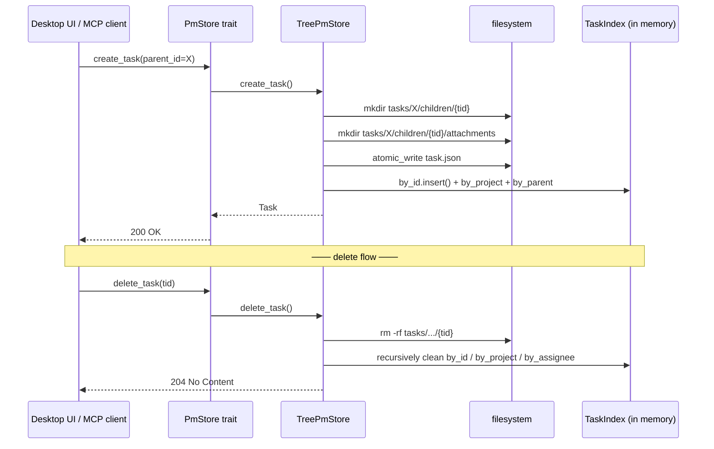

# ADR-061: acowork-pm Storage Selection — Directory Tree + Physical Nesting as Authoritative + Zero Redundant Fields

> **Chinese source of truth**: [ADR-061](../zh/ADR-061-pm-storage-tree.md)
> **Terminology**: see [GLOSSARY.md](./GLOSSARY.md)

## Status

Settled

## Date

2026-08-31

## Decision Makers

大鱼 (Dayu)

## Predecessors

- Design doc v1.0: [21-pm-project-management](../../design/zh/21-pm-project-management.md) §3
- Dev plan v0.3: [pm-dev-plan](../../plan/zh/pm-dev-plan.md)
- UX design v0.1: [22-pm-desktop-ui](../../design/zh/22-pm-desktop-ui.md)
- [ADR-051](./ADR-051-runtime-memory-provider-decoupling.md) — a similar "storage abstraction + trait decoupling" approach

---

## 1. Decision summary

`acowork-pm` (the project management service) persistence uses a **directory tree +
physical nesting as authoritative + zero redundant fields** trio:

1. **Directory tree**: one project = one complete directory tree, with the project metadata, task directories and attachment directories all under the same tree. A flat-plus-index approach is **not** used.
2. **Physical nesting is authoritative**: parent/child task relationships are expressed **entirely** by filesystem nesting — child tasks are forced into the parent's `children/` subdirectory. Relationships are **not** inferred from `task.json` fields.
3. **Zero redundant fields**: `task.json` contains no `parent_id` / `subtask_ids` / `subtask_count` — the parent/child relationship is expressed purely by physical position, so **no dual write is even possible**.
4. **A task is always a directory**: all tasks (including leaves) are directories, never a file/directory duality, avoiding shape conversion during future extensions.
5. **Attachments in a separate directory**: binaries live in `{task_dir}/attachments/{att_id}/`, metadata in `task.json`; **binaries never enter JSON**.
6. **Dependencies stored explicitly**: the `depends_on` field lives in `task.json` — cross-tree / cross-project relationships cannot be derived from the physical structure and must be declared explicitly.

This combination was settled after **four rounds of iteration** (see the evolution path in
§2.2), with the core requirement being:

> **Literal = logical.** `ls` a project and you see the complete structure without parsing
> JSON; deletion / moving is a single atomic directory operation; after a crash, `walkdir`
> rebuilds the index idempotently.

## 2. Context

### 2.1 Three candidates

| Option | Description | Literal clarity | Extensibility | Delete/move complexity | Indexing cost |
|---|---|---|---|---|---|
| **A: one JSON per project** | `projects/{pid}.json` with a tasks array | ❌ structure only known after JSON parsing | ❌ single-file IO explosion | ✅ single-file write | ✅ in-memory read |
| **B: flat + JSON index** | `tasks/{tid}.json` flat, linked by a parent_id field | ❌ a flat layout cannot show the tree | ✅ single-task IO | ⚠️ deleting a parent must walk and update every child's parent_id | ⚠️ a reverse dependency graph requires a full disk scan |
| **C: directory tree + physical nesting (chosen)** | `tasks/{tid}/children/{child_tid}/` | ✅ `ls` is the tree | ✅ single-task IO + atomic subtrees | ✅ `mv` / `rm -rf` with 0 file writes | ✅ idempotent `walkdir` rebuild |

### 2.2 Evolution path (four rounds of discussion)

```text
Round 1: is one JSON per project too crude?
        ↓ user objection → change everything to flat ❌ a flat layout cannot show the tree
Round 2: directory tree ✓
        ↓ can't child tasks just live in the parent dir? → tried, but name collision risk
Round 3: add a children/ subdirectory ✓ + task.json carries subtask_ids (dual write)
        ↓ user: forget the dual write, zero redundancy is cleaner
Round 4: final: directory tree + children/ + zero dual write ✓
```

**Key objection timeline**:

| Date | Objection | Response |
|---|---|---|
| 2026-08-29 | "one JSON per project is too crude and hard to extend" | ✅ switched to a directory tree |
| 2026-08-29 | "flattening all tasks means relationships are only knowable by parsing JSON" | ✅ physical nesting is authoritative |
| 2026-08-29 | "attachments should also live in their own project directory" | ✅ a separate attachment directory |
| 2026-08-30 | "do we really need children/?" | ✅ added, to avoid name collisions and give an explicit boundary |
| 2026-08-30 | "wouldn't a subtask_ids list in task.json settle it?" | ⚠️ tried briefly, introduced a dual write |
| 2026-08-30 | "let's drop the dual write; isolating in children/ is simpler" | ✅ zero redundant fields settled |

### 2.3 Why only two of the four requirements need a non-physical structure

The four original requirements were: ① tasks must support prerequisites; ② tasks must
support types (checkpoint / milestone etc.); ③ a task may be a bug ticket and needs multiple
image attachments; ④ tasks must support a tree-shaped parent/child structure.

- ① the dependency graph: a cross-tree logical relationship, not derivable from the physical structure → a stored field is mandatory (`depends_on`)
- ② task type: a pure field value with no storage impact
- ③ multiple attachments: binaries cannot go into JSON → a separate directory + metadata
- ④ the parent/child tree: naturally satisfied by physical nesting → force it through `children/`

**Conclusion**: only ① and ③ need something outside the physical structure; ② and ④ are
absorbed by the directory tree for free.

### 2.4 Pre-existing constraints

| Constraint | Source | Impact on the storage option |
|---|---|---|
| A thousand-task scale | dev plan v0.3 §11 estimate | an in-memory index + `walkdir` rebuild (<1s) is enough |
| Cross-platform (Windows / macOS / Linux) | the Gateway client distribution | `tokio::fs` + `rename` is atomic on the same FS |
| Single user, single process | the current deployment form | **no need** to consider concurrent write conflicts; adding locks later is fine. > After ADR-064 the PM is a **standalone process** but still a **single instance** (the Gateway supervisor spawns only one `acowork-pm` and the data directory `$HOME/.acowork/acowork-pm/` is exclusive), so the single-writer assumption still holds and no locking is needed |
| Agent MCP calls | the MCP tool table in §6 | the interface layer uses a `PmStore` trait, so a storage-layer switch is transparent to MCP |
| Desktop UI reads task.json directly | UX §3.4 | flat fields + direct `serde_json` rendering |

## 3. Target architecture

### 3.1 The directory tree shape

```text
<root>/data/acowork-pm/
└── projects/
    └── {project_id}/                          # ← one project = one complete directory tree
        ├── project.json                       #   project metadata
        └── tasks/
            ├── {root_task_id}/                #   root task
            │   ├── task.json
            │   ├── attachments/
            │   │   └── {att_id}/
            │   │       ├── original.{ext}
            │   │       └── thumb.jpg          #   images only
            │   └── children/                  #   ← the child isolation layer (created on demand)
            │       ├── {child_task_id}/
            │       │   ├── task.json
            │       │   ├── attachments/
            │       │   └── children/          #   recursive nesting (depth ≤ 5)
            │       │       └── {grandchild_task_id}/
            │       │           └── ...
            │       └── {another_child_task_id}/
            │           └── ...
            └── {another_root_task_id}/        #   sibling root task
                └── ...
```

### 3.2 Core invariants

| Invariant | Enforcement | Consequence of violation |
|--------|----------|----------|
| A task is always a directory | `create_task` forces `mkdir` + `task.json` | not allowed, so a future extension never needs a file→directory migration |
| Child tasks live in `children/` | `reparent` / `create_task` force the path concatenation | not allowed, otherwise `ls` loses its clarity |
| `task.json` contains no parent/child fields | the `serde` schema rejects `parent_id` and friends | its presence is treated as data corruption |
| `depends_on` must be explicit | validation + cycle detection on create/update | cross-tree relationships cannot be derived, so they must be stored |
| Deleting a task = deleting a directory tree | `rm -rf` + bulk subtree index cleanup | "soft-deleting orphan nodes" is not allowed |
| Reparent = `mv` a directory | a single `fs::rename`, copy+remove across filesystems | "modifying parent_id in multiple task.json files" is not allowed |

### 3.3 Data flow



## 4. Decision

### Decision 1 — adopt the directory tree (option C)

**Decision**: the `projects/{pid}/tasks/{tid}/.../` directory tree, with each project an
independent complete subtree.

**Rationale**: **literal = logical** (`ls -R p-xxx/tasks/` shows the complete tree directly,
so debugging costs nothing); **project atomicity** (a single-project backup / migration is
`tar` of one subtree, no multi-file coordination); **naturally fits parent/child
relationships** (physical nesting expresses them directly, nothing to derive); and
**cross-platform uniformity** (`tokio::fs` + `PathBuf` behave identically on Windows / macOS /
Linux).

**Rejected option A** (one JSON per project): single-file IO explosion (a thousand-task
project rewrites everything on every claim); slow cross-task traversal (the whole JSON must
be parsed); attachments cannot be embedded (base64 binaries bloat the JSON).

**Rejected option B** (flat + JSON index): it **directly violates the user's original
requirement** — "a flat layout cannot show the tree and relies entirely on JSON parsing"; a
relationship drift risk (list / parent_id falling out of sync); deleting a parent must walk
every task to update `parent_id`, which is not atomic.

### Decision 2 — physical nesting is authoritative, zero redundant fields

**Decision**: `task.json` does **not** contain `parent_id` / `subtask_ids` /
`subtask_count`. The relationship is expressed **entirely** by physical position.

**Rationale**: **zero dual write = zero inconsistency** (the physical position is the single
source of truth and the JSON carries no redundancy, so drift is impossible); **idempotent
crash recovery** (`walkdir` needs to "repair" nothing when rebuilding the index, because
there is nothing to repair); a **simpler write path** (creating a child writes exactly one
file, the child's `task.json`, and does not touch the parent); a **simpler reparent** (`mv`
one directory, 0 file writes).

**Rejected**: a `subtask_ids` list in `task.json` — the user explicitly vetoed it ("let's
drop the dual write"); it requires maintaining dual-write consistency across four operations
(create / delete / reparent / update); and the list can explode (a parent with 1000+
subtasks yields an enormous JSON).

### Decision 3 — a `children/` isolating subdirectory rather than same-level mounting

**Decision**: child tasks are forced into the parent's `children/` subdirectory, **not**
placed as siblings of the parent's metadata files.

**Rationale**: **namespace isolation** (the parent's reserved names `task.json` /
`attachments/` can never collide with a child task ID); a **physical boundary**
(`fs::read_dir(parent/children)` gets all children in one line, with no reserved-name
filtering); **more readable directory depth** (at 5 levels, `tasks/t-001/children/t-010/children/t-011/...` reads better than `tasks/t-001/t-010/t-011/...`); a
**deletion boundary** (`rm -rf parent/children/{tid}` cannot touch the parent's `task.json`).

**Rejected** (same-level mounting, `tasks/t-001/t-010/...`): at depth 5 the path is only 9
segments (vs 12); the naming convention is fragile (reserved names vs task IDs need
hardcoded validation); `fs::read_dir(parent)` must filter reserved names and the `t-*` prefix,
complicating the code; and while debugging it is easy to confuse "parent task contents" with
"child task directories".

### Decision 4 — a task is always a directory (never a file shape)

**Decision**: all tasks, including leaves, use a directory, and that directory always
contains a `task.json`.

**Rationale**: **shape uniformity** (adding subtasks later needs no "file → directory"
conversion); the **attachment directory is always isomorphically present** (`attachments/` is
`mkdir`ed at task creation, avoiding a later `mkdir` race); **consistent deletion** (`rm -rf`
on a directory is always safe, with no file/directory discrimination).

**Rejected** (leaves as `.json` files, parents as directories): it introduces a branch —
read / write / delete must all discriminate the shape first — and the shape-conversion
migration path is complex (when does it trigger? in bulk or lazily?).

### Decision 5 — attachments in a separate directory, only metadata in task.json

**Decision**: binary files live at `{task_dir}/attachments/{att_id}/original.{ext}`, and
`task.json` stores only metadata (id / filename / size / sha256 / paths).

**Rationale**: **binaries never enter JSON**, avoiding task.json bloat from base64; the
**attachment follows the task** (deleting a task is `rm -rf` of the whole task directory, so
attachments are cleaned atomically); **SHA-256 dedup** (when several tasks reference the same
attachment the physical file can be reused with multiple copies of the metadata); and a
**separate thumbnail** (`thumb.jpg` sits beside `original.{ext}`, and the UI prefers the
thumbnail when rendering).

**Rejected** (attachments base64-embedded in task.json): JSON size explosion (a 10MB image
becomes a 13MB string); a large jump in backup / sync cost; and every edit to task.json
rewrites the entire attachment base64.

### Decision 6 — `depends_on` stored explicitly

**Decision**: dependencies live in the `depends_on` field of `task.json` and **may cross
trees and projects**. Derived fields (`is_blocked` / `blocked_by`) are **not** persisted and
are computed in real time at the API response layer.

**Rationale**: a **dependency is a logical relationship** — cross-tree and cross-project
dependencies cannot be derived from the physical structure; **derived values are not
persisted**, avoiding a dual write with the source data, since they are computed at runtime
from `depends_on` plus status; **cycle detection** via DFS on create/update with a depth limit
of 10 to prevent abuse; and a **runtime reverse graph** — the in-memory index maintains a
`blocked_by` map for O(1) queries.

**Rejected** (expressing dependencies through physical nesting): a dependency is a graph
(any-to-any), not a tree; physical nesting can only express 1-to-N (parent→child), never
N-to-1 (dependency).

## 5. Rejected options overview

| # | Option | Core reason for rejection |
|---|------|------------------|
| A | one JSON per project | single-file IO explosion, slow cross-task traversal, binaries cannot be embedded |
| B | flat + JSON index | violates the "literal = logical" requirement, relationship drift risk |
| C | dual task shape (leaf file / parent directory) | introduces a branch, complex shape-conversion migration |
| D | a `subtask_ids` dual write | the user vetoed it; dual-write consistency maintenance burden |
| E | attachments base64-embedded | JSON size explosion, large backup cost increase |
| F | expressing dependencies through physical nesting | a dependency is a graph, not a tree |
| G | everything on SQLite | YAGNI: a thousand tasks does not need heavy storage; switch at P5+ |

## 6. Consequences

### 6.1 Positive

| Dimension | Benefit |
|---|---|
| **Simplicity** | `ls -R` = the complete structure; debugging needs no tool |
| **Evolvability** | the `PmStore` trait abstraction allows a non-invasive switch to SQLite at P5+ |
| **Rollback** | project-level backup / restore = `tar` of one subtree |
| **Cross-platform** | unified through `tokio::fs` + `PathBuf` |
| **Crash recovery** | the `walkdir` index rebuild is idempotent, with no "repair" logic (no field can drift) |
| **Delete / move** | `rm -rf` / `mv` is a single atomic operation, O(1) file writes |
| **Backup strategy** | `rsync --delete` / `git init` / `borg create` all work naturally |

### 6.2 Negative / known limitations

| Limitation | Impact | Mitigation |
|---|---|---|
| **Cross-filesystem reparent** | `fs::rename` fails across a mount point | `atomic.rs::rename_or_fallback`: copy + remove |
| **A thousand-task scale** | a full `walkdir` rebuild takes ~1s | acceptable at startup; switch to SQLite above a threshold |
| **Concurrent writes** | no lock under the single-process assumption; multiple processes would conflict | a single process today (after ADR-064 the standalone PM is still a single instance, so the single-writer assumption holds); later add `flock` or use SQLite WAL |
| **Attachment thumbnails** | upload-time CPU cost (256x256 JPEG generation) | a background task + cache; a feature flag can disable it |
| **Depth limit of 5** | reasonable UI collapsing, but a hard limit | a configurable `max_task_depth` (default 5) |
| **Dependency graph scale** | O(N²) relationships are acceptable at a thousand nodes | switch to a graph DB (grafeo) above a threshold |

### 6.3 Trade-off balance

| Decision | What is traded | What is gained |
|---|---|---|
| Directory tree vs flat | a slightly more complex write path (an `mkdir` each time) | literal clarity + project atomicity |
| Zero redundancy vs dual write | you cannot sort and display directly from `subtask_ids` | zero drift risk + idempotent crash recovery |
| Physical nesting vs physical flat | children live in `children/`, not as siblings | namespace isolation + a deletion boundary |
| A task is always a directory vs a file | one extra `mkdir` + a directory node | shape uniformity + no future migration |

## 7. Implementation

### 7.1 Phase allocation (aligned with dev plan v0.3)

| Phase | Work | Status |
|---|---|---|
| **P0** | scaffold the `core/acowork-pm/` crate + the directory tree skeleton + types + config + the default trait implementation | ✅ done |
| **P1** | `rebuild_index` walkdir + Project/Task CRUD + parent/child tree create/delete/move + path validation | ✅ done |
| **P2** | Desktop UI integration (a zustand store + kanban view + parent/child tree panel + attachment preview) | ✅ done |
| **P3** | the full MCP `pm_*` tool set + the dependency graph + lifecycle (claim/submit/review) | ✅ done |
| **P4** | E2E tests + design doc v1.0 wrap-up + the remote advertise chain | ✅ done (2026-09-02) |
| **P5+** | a SQLite backend (replacing `TreePmStore`) + cross-process locking | 🔮 future |

### 7.2 Key code locations

| Path | Role |
|---|---|
| [`core/acowork-pm/src/store/tree.rs`](../../../core/acowork-pm/src/store/tree.rs) | the `TreePmStore` implementation + the `PmStore` trait |
| [`core/acowork-pm/src/store/index.rs`](../../../core/acowork-pm/src/store/index.rs) | the secondary in-memory index (by project / assignee / status / reverse dependency graph) |
| [`core/acowork-pm/src/store/atomic.rs`](../../../core/acowork-pm/src/store/atomic.rs) | atomic write + path validation helpers |
| [`core/acowork-pm/src/types.rs`](../../../core/acowork-pm/src/types.rs) | the core domain types (**no** parent/child fields) |

### 7.3 Verification checklist

- [ ] Compiles (`cargo check -p acowork-pm`) ✅ P0 done
- [ ] Smoke tests pass (11 lib + 5 smoke tests) ✅ P0 done
- [ ] walkdir index rebuild idempotency (crash → restart → the index matches disk)
- [ ] Parent/child tree create / delete / move roundtrip tests
- [ ] Reparent cycle detection (DFS) tests
- [ ] Attachment upload / download / sha256 consistency tests
- [ ] Cross-filesystem reparent fallback tests (simulate with tmpfs)
- [ ] Index rebuild performance at a thousand tasks (<1s)

## 8. Open questions (all closed)

| Question | Decision | Settled on |
|---|---|---|
| `children/` or same-level mounting? | **children/** | 2026-08-30 (design discussion) |
| Keep the `subtask_ids` dual write? | **zero redundant fields** | 2026-08-30 (design discussion) |
| Task shape: file or directory? | **always a directory** | 2026-08-29 (design discussion) |
| Attachments: embedded or separate? | **a separate directory + metadata** | 2026-08-29 (design discussion) |
| How are dependencies stored? | **explicit `depends_on`, derived values not stored** | 2026-08-29 (design discussion) |
| Are cross-project dependencies allowed? | **allowed** | 2026-08-31 (dev plan decision record) |
| Delete-a-parent semantics? | **cascade delete by default, with promoting the children as an option** | 2026-08-31 (dev plan decision record) |

## 9. Reference chain

- **Design doc**: [docs/design/zh/21-pm-project-management.md](../../design/zh/21-pm-project-management.md) §3 the data model
- **UX design**: [docs/design/zh/22-pm-desktop-ui.md](../../design/zh/22-pm-desktop-ui.md) §3 view layout (the "the directory is the tree" mental model runs through the UI design)
- **Dev plan**: [docs/plan/zh/pm-dev-plan.md](../../plan/zh/pm-dev-plan.md) §3.1 phase allocation + §8 decision record
- **crate README**: [core/acowork-pm/README.md](../../../core/acowork-pm/README.md) (the storage shape description cites this ADR)
- **Similar ADR**: [ADR-051](./ADR-051-runtime-memory-provider-decoupling.md) (also a storage abstraction + trait decoupling approach, worth borrowing from)

---

## Changelog

- 2026-08-31: v1.0 initial — consolidating all P0 design discussion decisions
- 2026-09-02: P4 wrap-up — the design doc rose to v1.0 (the six-state state machine / embedded shape / advertise endpoint finalized), and the P1–P4 implementation status was marked complete
- 2026-09-02: ADR-064 settled — the PM moved out as a **standalone process** (the Gateway only supervises and reverse-proxies) with an independent data directory `$HOME/.acowork/acowork-pm/`; this ADR's **single-process assumption still holds** (a single PM instance exclusively owns the data directory, a single writer, no locking needed)
