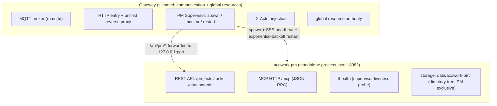

# ADR-064: Decoupling PM from the Gateway into a Standalone Process

> **Chinese source of truth**: [ADR-064](../zh/ADR-064-pm-standalone-process.md)
> **Terminology**: see [GLOSSARY.md](./GLOSSARY.md)

## Status

Decided (2026-09-02, settled by the architecture review)

## Date

2026-09-02

## Decision Makers

Architecture review (the user settled it: the "Gateway carries zero business logic" iron rule)

## Related

- [ADR-019](./ADR-019-lsp-relay-standalone-process.md) — LSP Relay as a standalone process, the direct precedent for this ADR
- [ADR-055](./ADR-055-remote-runtime-node-topology.md) — the Gateway converges to pure networking duties
- [ADR-061](./ADR-061-pm-storage-tree.md) — PM directory-tree storage
- [docs/design/en/21-pm-project-management.md](../../design/zh/21-pm-project-management.md) — PM design v1.0, whose D-10 "embedded" decision this ADR overturns
- [docs/plan/en/pm-dev-plan.md](../../plan/zh/pm-dev-plan.md) — PM dev plan v0.3, whose P0 "standalone subprocess" design this ADR restores

---

## Context

### The iron rule: zero business logic in the Gateway

The Gateway is the single point of the whole project. Its role is **pure communication +
global resource management**; it carries no business logic at all:

> The Gateway does not proxy the Agent's business logic (it does not proxy LLM calls, it does not proxy tool execution); it only handles the coordination work that must be centralized.
> — [docs/design/en/04-gateway.md](../../design/en/04-gateway.md)

ADR-055 narrows this further: **the Gateway keeps only three pure networking duties — hosting
the MQTT broker, being the unified HTTP entry, and being the global resource authority.**
embed and the LSP relay have already been split out as subprocesses on this principle
(ADR-019).

### The problem: embedding PM violates the iron rule

PM design v1.0 (D-10) embeds `acowork-pm` **inside the Gateway process** (mounted with
`nest_service("/api/pm")`), which causes:

| Problem | Explanation |
|---|---|
| **Business logic enters the Gateway** | PM domain logic (state machine, dependency graph, attachments, review flow) is compiled into the Gateway binary, violating the "zero business logic in the Gateway" iron rule |
| **Heavy dependencies** | `acowork-pm` drags axum, tower, reqwest, chrono, uuid, indexmap, directories, toml, mime_guess, sha2, hex, image (optional) and friends into the Gateway ([gateway/Cargo.toml:26](../../../core/acowork-gateway/Cargo.toml#L26)) |
| **Loss of fault isolation** | A PM panic can take down the Gateway (the core single-point process) |
| **Contradicts the main direction** | ADR-019/055 explicitly narrow the Gateway to pure networking; embedding PM walks that back |
| **X-Actor is forgeable** | today X-Actor is self-reported by the client ([tasks.rs:166](../../../core/acowork-pm/src/api/tasks.rs#L166) reads the header directly), with nothing injected by the Gateway, so the identity can be forged |
| **Storage coupling** | PM data is forced by `prepare_pm_data_dir` into `{gateway.data_dir}/acowork-pm` ([config.rs:537](../../../core/acowork-gateway/src/config.rs#L537)), and `PmConfig::default_data_dir()` uses `directories::ProjectDirs` (on Windows resolving to `%APPDATA%\com\acowork\pm`), inconsistent with the `.acowork/` sibling layout of `acowork-gateway/` and `acowork-node/` — the PM data lifecycle is tightly coupled to the Gateway data directory |

### How this differs from ADR-019 (LSP)

PM and LSP are decoupled for **different motivations** (LSP was decoupled because it blocked
the runtime / caused resource contention; PM has no such problem), but the **architectural
principle is the same**: business logic must not enter the Gateway. This ADR relies on the
principle, not on LSP's specific motivation.

## Goals

1. **The Gateway leaves the PM data path entirely**: no more compiling PM code, no more `nest_service` mount, no more holding a `PmService` handle
2. **PM as a standalone process**: its own binary `acowork-pm`, its own port, its own lifecycle
3. **PM storage independent of the Gateway**: data directory `$HOME/.acowork/acowork-pm/`, a **sibling** of `acowork-gateway/` and `acowork-node/` (mirroring [`acowork-core` `default_node_home`](../../../core/acowork-core/src/node.rs#L287)), no longer nested under the Gateway data directory
4. **The Gateway keeps only**: spawn / monitor / restart (reusing `acowork-core::supervisor`) + reverse proxying `/api/pm/*` + injecting the trusted identity (`X-Actor` / `X-MCP-Actor`)
5. **The external contract is unchanged**: the Desktop still goes through `{gw}/api/pm/*`; a remote Agent still goes to `http://{advertise_host}:{gw_http_port}/api/pm/mcp` — neither side notices anything
6. **Security improvement**: `X-Actor` / `X-MCP-Actor` are injected by the Gateway when reverse-proxying, eliminating client forgery

## Alternatives

### A — standalone process (a standalone `acowork-pm` binary) — **recommended**

**Mechanism**: the `acowork-pm` crate gains a `src/main.rs` producing a standalone
executable that serves the complete router (REST + MCP + `/health`). The Gateway manages
its lifecycle in supervisor mode (spawn / monitor / restart), exactly like embed and the
LSP relay. The Gateway reverse-proxies `/api/pm/*` to the PM port.



**Advantages**:

- Total isolation: a PM crash does not affect the Gateway, and after a Gateway crash PM exits on its own via the supervisor timeout (reusing the ADR-018 pattern)
- Reuses mature building blocks: `acowork-core::supervisor` (extracted in ADR-019) + the `http/proxy.rs` reverse proxy (ADR-033 already has a Runtime reverse-proxy precedent)
- Dependency decoupling: the Gateway binary no longer contains PM code
- Trusted identity: injecting `X-Actor` / `X-MCP-Actor` on reverse proxy fixes the forgery hole

**Disadvantages**:

- Must implement the supervisor lifecycle (reuses existing building blocks, so low cost)
- Must implement the reverse proxy (reuses the existing `http/proxy.rs` pattern, so low cost)
- `AgentDirectory` must change from "shared state" to an HTTP query (see migration Phase 3)

### B — stay embedded (the status quo)

Keep the `nest_service("/api/pm")` mount.

**Advantages**: zero changes.
**Disadvantages**: violates the iron rule; business logic enters the Gateway; loss of fault isolation; X-Actor is forgeable. **Rejected**.

### C — standalone crate, still inside the Gateway process

PM is already a separate crate but still runs as a library inside the Gateway process.

**Advantages**: code isolation.
**Disadvantages**: does not address business logic in the Gateway, fault isolation, or dependency weight. **Rejected** (the same reasoning as ADR-019).

## Decision

**Adopt Alternative A: PM as a standalone process.**

- Restore the P0 design of dev plan v0.3 (standalone subprocess + supervisor + port allocation), overturning the D-10 "embedded" decision of design v1.0
- Consistent with the direction of ADR-019 (LSP Relay) and ADR-055 (Gateway convergence)
- Reuses the existing `acowork-core::supervisor` and `http/proxy.rs` infrastructure, keeping the migration cost bounded

## Blast radius

### Phase 0 — acowork-pm as a standalone executable (PM side)

| File | Change |
|---|---|
| `core/acowork-pm/src/main.rs` | **new**: standalone binary entry point, loads `PmConfig`, serves the complete router (REST + MCP + `/health`) |
| `core/acowork-pm/src/server.rs` | `start_dev` completed from the P0 placeholder into a full serve (it currently serves only `/health`, [server.rs:91](../../../core/acowork-pm/src/server.rs#L91)) |
| `core/acowork-pm/src/config.rs` | `PmConfig` gains `port` (default 18082) and `enabled` (default true); a port conflict auto-increments (restoring plan v0.3 T0-5) |
| `core/acowork-pm/src/config.rs` | **`default_data_dir()` changes to `$HOME/.acowork/acowork-pm/`** (mirroring the [`acowork-core` `default_node_home`](../../../core/acowork-core/src/node.rs#L287) pattern: `ACOWORK_PM_HOME` env > `$HOME/.acowork/acowork-pm` > `./.acowork-pm`), **replacing the current `directories::ProjectDirs`** (which resolves to `%APPDATA%\com\acowork\pm`, inconsistent with the `.acowork/` layout) |
| `core/acowork-pm/src/health.rs` | **new**: the `/health` endpoint (the supervisor liveness contract, reusing `acowork-core::health`) |
| `core/acowork-pm/Cargo.toml` | add a `[[bin]]` target; the `acowork-core` dependency (supervisor / health contracts) |

**Target data layout** (a sibling of acowork-gateway / acowork-node):

```
$HOME/.acowork/
├── acowork-gateway/     # Gateway data (vault, packages, data/)
├── acowork-node/        # Node Agent data (identity, packages, logs)
└── acowork-pm/          # PM data (projects/, .trash/, logs/) ← standalone, sibling
```

### Phase 1 — the Gateway reverse proxy replaces nest_service (Gateway side)

| File | Change |
|---|---|
| `core/acowork-gateway/src/http/pm_api.rs` | delete `pm_routes()` (the `nest_service` mount); delete `GatewayAgentDirectory` (no longer shared state) |
| `core/acowork-gateway/src/http/pm_proxy.rs` | **new**: the `/api/pm/*` → `http://127.0.0.1:{pm_port}/*` reverse proxy (reusing the `http/proxy.rs` pattern from ADR-033) |
| `core/acowork-gateway/src/http/routes.rs` | `build_router_with_pm` mounts the `pm_proxy` routes instead; remove `nest_service` |
| `core/acowork-gateway/src/http/server.rs` | delete the logic reading the `pm_service` handle |
| `core/acowork-gateway/src/gateway/state.rs` | delete `pm_service: Option<Arc<PmService>>`, replace with `pm_process` (supervisor state); keep `pm_mcp_url` (for constructing the advertise endpoint) |
| `core/acowork-gateway/src/gateway/mod.rs` | PM startup becomes a non-fatal supervisor spawn; delete the `PmService::with_agent_directory` call |
| `core/acowork-gateway/src/config.rs` | the `[pm]` section gains `port` / `enabled`; **delete `prepare_pm_data_dir`** (PM data is no longer stuffed into `{gateway.data_dir}/acowork-pm`; the PM resolves its own data directory independently) |
| `core/acowork-gateway/Cargo.toml` | **delete the `acowork-pm` dependency** (the Gateway no longer compiles PM code) |

### Phase 2 — supervisor lifecycle (Gateway side)

| File | Change |
|---|---|
| `core/acowork-gateway/src/lifecycle/pm_supervisor.rs` | **new**: reuses `acowork-core::supervisor` (RestartHistory / exponential backoff / SSE heartbeat / startup grace window) to spawn, monitor, and restart the PM subprocess |
| `core/acowork-gateway/src/lifecycle/mod.rs` | register `pm_supervisor` |
| `core/acowork-gateway/src/gateway/mod.rs` | startup ordering: spawn PM → wait for `/health` ready → mount the reverse-proxy routes |

### Phase 3 — AgentDirectory decoupling (identity chain)

| File | Change |
|---|---|
| `core/acowork-pm/src/mcp/agent_dir.rs` | **new**: the HTTP implementation of `AgentDirectory` — `pm_create_task` queries the Gateway `/api/agents` when validating the assignee (restoring plan v0.3 T1-11 "immediate validation fallback"); a full pull at startup plus periodic refresh |
| `core/acowork-gateway/src/http/pm_proxy.rs` | inject `X-Actor` (the Desktop session user / Agent identity) and `X-MCP-Actor` (expanding the `{agent_id}` template) when reverse-proxying — **a security improvement that fixes client forgery** |
| `core/acowork-gateway/src/mqtt/global_resources_builders.rs` | keep the `pm_mcp_url` injection logic (the advertise endpoint is unchanged, so remote Runtimes notice nothing) |

### Phase 4 — cleanup + docs + verification

| File | Change |
|---|---|
| `docs/design/en/21-pm-project-management.md` | §2.1/§2.3/§8/§12 D-10 updated to "standalone process"; §10.6 supervision changed to supervisor |
| `docs/adr/en/ADR-061-pm-storage-tree.md` | add a note on the "single-process assumption" (a single PM instance still holds, so no locking is needed) |
| `core/acowork-pm/README.md` | update the "the PM service does not run standalone" description |
| `core/acowork-pm/schemas/README.md` | update the Base URL description (standalone port + Gateway reverse proxy) |
| `docs/review/pm-implementation-review.md` | update the architecture risk items |

## Migration plan (execution order)

1. **Phase 0**: the PM standalone executable + `/health` + port allocation + **independent data directory resolution** (`$HOME/.acowork/acowork-pm/`) → `cargo run -p acowork-pm` serves the full route set on its own
2. **Phase 1**: the Gateway reverse proxy replaces `nest_service` + **delete `prepare_pm_data_dir`** (keep the PM embedding and the reverse proxy coexisting at first, for canary validation)
3. **Phase 2**: the supervisor lifecycle (PM auto-restarts after a crash)
4. **Phase 3**: AgentDirectory goes HTTP-based + `X-Actor` injection (security improvement)
5. **Phase 4**: delete the Gateway's dependency on `acowork-pm` + wrap up the docs + end-to-end verification

## Data directory (storage independence)

The PM data directory is set directly to `$HOME/.acowork/acowork-pm/` (a sibling).

> **No migration / no compatibility requirement**: the project is in development with no existing data. `PmConfig::default_data_dir()` can simply change to the new path; old-path detection, file moving, and migration markers are deliberately **not** implemented (YAGNI).

## Rollback

- **Fast rollback**: the `nest_service` path is preserved in git history, so if the standalone process causes problems it can be reverted to the embedded form (only `pm_api.rs` + `build_router_with_pm` + `prepare_pm_data_dir` need restoring)
- **Canary**: during Phase 1 the reverse proxy and the embedding coexist, so the switch can be flipped at any time
- **Data**: there is no existing data during development, so a rollback has no data impact

## Acceptance criteria

| # | Acceptance item |
|---|--------|
| 1 | `cargo tree -p acowork-gateway` no longer contains `acowork-pm` (the "zero business logic in the Gateway" iron rule is met) |
| 2 | `acowork-pm` can start / stop / restart independently, serving the full REST + MCP + `/health` |
| 3 | the PM data directory is `$HOME/.acowork/acowork-pm/` (a sibling of `acowork-gateway/` and `acowork-node/`), with no `acowork-pm` under the Gateway data directory |
| 4 | killing the PM process → the Gateway restarts PM automatically, with the Gateway itself unaffected (supervisor verified) |
| 5 | the full Desktop flow (create project / task / kanban / review / attachment) is transparent through the Gateway reverse proxy |
| 6 | a remote Agent calling the PM MCP through the advertise endpoint notices nothing (`X-MCP-Actor` is injected by the Gateway) |
| 7 | a request forging `X-Actor` has it overwritten by the Gateway with a trusted identity (security improvement verified) |
| 8 | `cargo test -p acowork-pm` all green; the Gateway tests all green |

## Decision record

| Decision point | Conclusion |
|--------|------|
| Deployment form | **standalone process** (overturning design v1.0 D-10 "embedded") |
| Standalone port | default 18082, auto-incrementing on conflict (restoring plan v0.3 T0-5) |
| Lifecycle | a Gateway supervisor (reusing `acowork-core::supervisor`, consistent with embed / LSP relay) |
| **Storage directory** | **`$HOME/.acowork/acowork-pm/`, a standalone sibling of `acowork-gateway/` and `acowork-node/`** (mirroring the [`acowork-core` `default_node_home`](../../../core/acowork-core/src/node.rs#L287) pattern; replacing `directories::ProjectDirs`; deleting the Gateway's `prepare_pm_data_dir`) |
| Data migration | **none** (no existing data during development, YAGNI, no migration logic implemented) |
| External contract | the Desktop `/api/pm/*` and the remote `/api/pm/mcp` are both unchanged (Gateway reverse proxy) |
| Identity | `X-Actor` / `X-MCP-Actor` are injected by the Gateway reverse proxy (fixing client forgery) |
| AgentDirectory | the PM queries the Gateway `/api/agents` over HTTP (restoring plan v0.3 T1-11) |
| Storage concurrency | a single PM instance exclusively owns the data directory, so the single-writer assumption still holds and no locking is needed |
| Rollback | the embedded path is preserved for a fast rollback (no data impact during development) |
