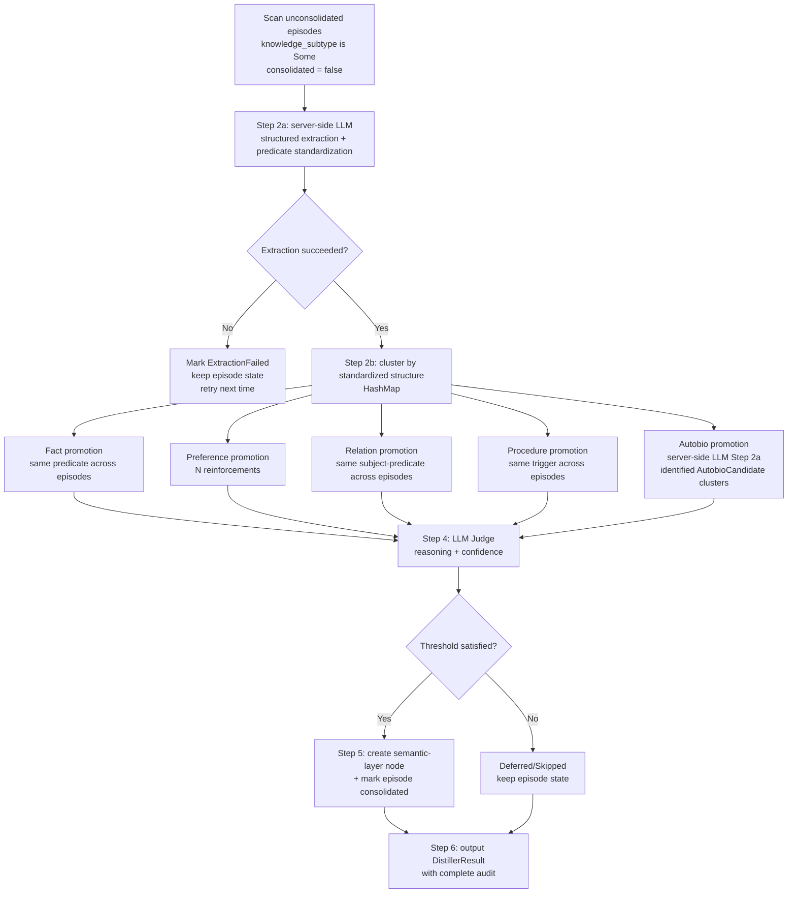

# ADR-068: Orthogonalizing the Two Memory Axes and Refactoring the Offline Distiller (Episodic-as-Source-of-Truth)

**Status**: Implemented (fixed and completed after the [review #32](../../review/zh/32-adr-068-memory-layer-promotion-two-axis-orthogonal-review.md) in 2026-09); in 2026-10 the promotion approach was converged a second time to "projection + merge", see the Revision(2026-10) below
**Date**: 2026-09
**Deciders**: 大鱼
**Prerequisites**:
- [ADR-051](./ADR-051-runtime-memory-provider-decoupling.md) (Runtime decoupled from Grafeo)
- [ADR-057](./ADR-057-compaction-distillation-into-graph.md) (Compaction distillation into the graph, triples withdrawn)
- [ADR-062 §0, §6.2.1](./ADR-062-memory-quality-config-and-retrieval-gate.md) (Memory quality gate, keyword sanitize)
- [05-memory.md §0, §2, §3, §4](../../design/zh/05-memory.md) (The layering and consolidation design baseline)

---

## Revision(2026-09): Promotion converges to two trusted sources, Path C taken offline

> **Follow-up revision**: this ADR's M4/M7 scheduling trigger wiring and runtime configuration surface were completed by [ADR-071](./ADR-071-distiller-runtime-config-and-trigger.md) (trigger criteria decoupled from legacy Pending, layered `agent_config.json` configuration, manual distillation, model selection, prompt per-agent overrides).

**Decision**: the production of semantic-layer (promotion) nodes is permitted from only two trusted sources:

1. **Conclusions analyzed and summarized by the LLM** — `EpisodicDistiller` (LLM structured extraction + embedding clustering + LLM Judge + a complete evidence/audit chain). The only entry is the knowledge_subtype-tagged episodic Episode written by the LLM write side via `memory_store`.
2. **Statistical induction driven by the graph database's capabilities** — structural statistics based on existing nodes/edges (embedding similarity clustering, edge weight / span statistics, time thresholds), which can produce/update nodes but **do not perform semantic fabrication**, and must be accompanied by event/audit records (e.g. the 30-day collaboration span statistic of `promote_autobio_relationship`, the milestone event of `promote_event`).

**Abolished**: rule-based **Experience generalization (Path C)** (`generalization.rs::detect_simple_patterns` and the inline generalization step in compaction/session-end). Rationale:

- Extracting `(action, tools)` features from "the first line of the assistant reply text + the `"name":` string inside content", then treating **exact whole-string counts** of `action|tools` as a "repeated behaviour pattern", is a text hack, not experience induction;
- The produced ProceduralNode has no `source_episode_ids`/`promotion_metadata` evidence chain, the consumed episodes are not marked `consolidated`, and every consolidation round boosts again (`success_count` inflates without bound);
- It overlaps with `EpisodicDistiller::promote_procedures` (LLM extraction + judge) and is far lower quality.

**Code disposition**:
- `MemoryManager::run_post_compaction_tasks` / `run_generalization_step` / `run_history_compression` and their runtime call sites (after compaction, on session close) are deleted outright — the inline maintenance task no longer exists;
- `GrafeoStore::run_offline_consolidation_with_generalization` no longer performs generalization (the parameter is retained as deprecated compatibility, `gen_config` is passed `None`);
- The `ConsolidationBgTask` loop only runs: the EpisodicDistiller step (opt-in) + the offline Pending lifecycle + episodic cleanup.

**The only retained rule-based uses are**: idempotency/dedup thresholds, node lifecycle (retention/decay/Pending state machine), authoritative data-source import (manifest bootstrap), and event/time thresholds (History milestones, 30-day collaboration).

---

## Revision(2026-10): Promotion converges to "projection + merge", the four-stage extract/cluster/judge pipeline goes offline

> The implementation plan and measured data are in [memory-consolidation-normalization-plan.md §8](../../plan/zh/memory-consolidation-normalization-plan.md). Commits `d2745c21`, `5be91f91`.

**Background**: after the previous revision, `EpisodicDistiller` was still a four-stage pipeline of "LLM structured extraction → embedding clustering → LLM Judge → promotion", with 5 evidence thresholds and a tombstone mechanism. The production Ponytail instance had the promotion switch on for weeks, 269 episodes, and **0 promotions**. The logs prove that the trigger conditions (period / backlog / idle) were satisfied every time — the problem is in the chain, not in the trigger.

**Decision**: production of promotions retains only two actions, both premised on "the LLM already made this judgement at write time":

1. **Projection (project)** — when an episode recalls no nearby semantic node, the statement it carries is directly landed as a semantic node. **Zero LLM calls**. The write-time model already decided this experience is worth recording; asking "does it have value" again offline is a repeated and no more reliable judgement.
2. **Merge (merge)** — when nearby nodes are recalled, let the LLM judge `merge / no_merge / contradicts` among "1 new statement + K candidates". This is the only place in the whole flow that needs the model, and its input size is independent of the store size.

**Abolished**:

- **The structured extraction stage** (triples / SPO filling). Extracting triples from programming-scenario conversations is low quality and has no structural consumer (no `edges` table, no graph traversal) — pure cost. `KnowledgeNode`'s `subject/predicate/object` fields are retained but filled by the projection path with slugs generated from the statement, no longer pretending to be semantic triples.
- **The embedding clustering stage**. Clustering treats "similar" as "the same thing", and whether it is the same thing is a semantic judgement that only a model can answer.
- **The 5 promotion thresholds + tombstones**. Volume control converges to the single knob `min_importance` (default 0.0, i.e. project everything). Unprojected episodes leave no tombstone and are reconsidered every round — tightening then loosening loses no data.
- **The old conflict-resolution classification** (`ConflictType` / `conflicts_evolution/correction/ambiguous` / `should_trigger_confirmation`). The previous revision claimed "this round does not touch it", but these symbols actually **already had zero references** — dead code. The `contradicts` branch is newly written during the rewrite.
- `PromotionKind::AutobioLimitation` / `AutobioPreference` (gone with the clustering stage). `AutobioRelationship` (the 30-day span rule) and `AutobioHistory` (milestone events) are retained — they do not depend on episode clustering.

**New field**: `Episode.normalized` — a single-sentence statement produced by the LLM at write time that still holds after the dialogue context is removed. The distiller's main input. `Episode::statement()` is the **only** implementation of the normalized→content fallback: both the write path's embedding and the distiller's recall key go through it, and writing the fallback in two places would make "the vector that was stored" and "the vector that is looked up" not the same key, which manifests as "promotion no longer matches" rather than an error. That same fallback is also the backfill path for existing data — old rows have no `normalized` key, and reading them projects directly.

**Unchanged**: the two-axis invariant (the LLM writes only the episodic layer), `source_episode_ids` idempotency, `importance`-driven decay, episodic forgetting, and event/time thresholds.

**Behaviour boundaries** (needed when troubleshooting):

- When candidates are recalled but **no model** is available, the episode stays "deferred" and is not guessed. Guessing wrong is irreversible in both directions (a wrong merge loses evidence, a missed merge creates duplicates). The production path `run_episodic_distiller_step` always passes a model, so this only occurs on configuration anomalies; on the panel it will look stuck.
- `batch_size=100`, so hundreds of backlogged items need multiple rounds to drain.
- The density of the semantic layer is determined by the model's judgement, not by code: when the model always answers `no_merge`, N episodes yield N nodes.

**Measured** (a copy of a real store, `memory_lifecycle_e2e.rs::backfill_on_a_real_store_*`, `#[ignore]` because it involves private data):

```
269 episodes / 262 backlogged / 0 promotions
  No model: projected 33, deferred 229, LLM calls 0
  With model: backlog drained in 3 rounds, promotions knowledge=141 procedural=121
```

The same data produced 33 promotions with zero tokens, proving that the original failure was in the chain and not in the data.

---

## 0. One-Sentence Summary

The current system couples "memory layering" with "memory classification" in the semantic-layer nodes (KnowledgeNode/ProceduralNode/AutobiographicalNode), forcing the LLM to write directly to the semantic layer and polluting data quality. This ADR decouples the two axes:

1. **LLM write side**: the **only** writer to the Episodic layer (`Episode`), marking classification with the newly added `knowledge_subtype` field. The LLM writes only natural-language `content` and is **not** required to explicitly fill structured fields such as `subject/predicate/object/trigger_condition/action_pattern`.
2. **Semantic-layer nodes**: produced **only** by the offline distiller promoting from episodic Episodes. Structured extraction is done inside the distiller by the server-side LLM in batch (it is not a matter of the LLM tool-call boundary).
3. **The `memory_store` tool schema narrows to `fact` / `preference` / `relation` / `procedure`**, all writing to Episodic, no longer writing directly to KnowledgeNode/ProceduralNode. The tool interface from the LLM's perspective is almost identical to the status quo, just without the autobiographical option.
4. **`AutobiographicalNode` is removed entirely from the LLM write side**, maintained only by `manifest` bootstrap + the offline inducer.
5. **The offline distiller** (the new component `EpisodicDistiller`) is the **sole producer** of semantic-layer nodes, with a promotion strategy for each of the seven categories `fact` / `preference` / `relation` / `procedure` / `limitation` / `relationship` / `history`.

---

## 1. Problem Statement (why this must change)

### 1.1 The root cause: the two axes are coupled

The current schema compresses the entire classification axis into the semantic layer:

```
Episodic (episodic layer)         ← no classification field, can only store "dialogue fragments"
  ├─ content / role / session_id / timestamp
  └─ importance / metadata

KnowledgeNode (semantic layer)   ← the entire classification lives here
  ├─ sub_type: Fact | Preference | Relation
  └─ fields: subject / predicate / object

ProceduralNode (semantic layer)
  └─ fields: trigger_condition / action_pattern

AutobiographicalNode (semantic layer)
  └─ category: Identity | Capability | Limitation | Preference | History | Relationship
```

**Result**: when the LLM wants to express "the user prefers concise replies", the episodic `Episode` has no "preference" subtype field, so it is **forced to write directly to the semantic-layer `KnowledgeNode{sub_type=Preference}`**. This is the true source of the "LLM writes the semantic layer" root cause exposed in the ADR-051 review.

### 1.2 Historical diagnosis review (the argumentative basis of this ADR)

| Previous diagnosis | Accurate? | Correction in this ADR |
|---|---|---|
| "The LLM cannot judge milestones within a single conversation context" | ✅ Accurate | Retained — closing off the LLM → autobiographical/History direct write |
| "AutobiographicalNode does not participate in forgetting, and pollution self-propagates" | ✅ Accurate | Retained — autobiographical is written only by the offline inducer |
| "LLM-written Procedural is uncontrollable" | ✅ Accurate | Retained — ProceduralNode is promoted only by offline distillation (rule-based generalization went offline in the 2026-09 revision, see the header Revision) |
| "Episodic is the ledger, Knowledge is the refinement" | ✅ Accurate | Retained — but **the two must be bridged via a classification field**, not by direct semantic-layer writes |
| "The `memory_store` tool schema exposing autobiographical lets the LLM write self-narration" | ✅ Accurate | Corrected — **autobiographical should be removed entirely**; autobiographical is maintained only by internal bootstrap + offline induction |

### 1.3 The current deadlock (it will accumulate if we do not change it)

```
Episodic                    Semantic (promotion layer)
─────────                   ──────────────
No classification field ──X── The LLM cannot classify ──X──> KnowledgeNode/ProceduralNode
                                                                   ↑
                                                                   └── the only option is an LLM direct semantic-layer write
                                                                         ↑
                                                                         └── no data-quality guarantee
                                                                               ↑
                                                                               └── pollution self-propagates (autobiographical does not decay)
```

---

## 2. Decision (what this ADR will do)

### 2.1 The two-axis orthogonal matrix

|            | **Episodic layer** | **Semantic (promotion) layer** |
|------------|----------------------|----------------------|
| **Fact**       | ✅ LLM writes, `knowledge_subtype=Fact` | ✅ offline promotion |
| **Preference** | ✅ LLM writes, `knowledge_subtype=Preference` | ✅ offline promotion |
| **Relation**   | ✅ LLM writes, `knowledge_subtype=Relation` | ✅ offline promotion |
| **Procedure**  | ✅ LLM writes, `knowledge_subtype=Procedure` | ✅ EpisodicDistiller offline promotion (rule-based generalization went offline in the 2026-09 revision) |
| **Identity**   | ❌ not written | ✅ manifest bootstrap only |
| **Capability** | ❌ not written | ✅ manifest bootstrap only |
| **Limitation** (autobiographical) | ❌ the LLM does not tag it (the LLM tool interface has no autobiographical concept) | ✅ EpisodicDistiller Step 2a server-side LLM automatically identifies it from fact/relation/feedback-type episodes |
| **Preference** (autobiographical) | ❌ the LLM does not tag it | ✅ same as above |
| **Relationship** (autobiographical) | ❌ the LLM does not tag it | ✅ same as above |
| **History** (autobiographical) | ❌ not written | ✅ event-triggered only (no episode input, see §3.4.2 Step 3 History path) |

### 2.2 Implementation rules

| Rule | Content |
|---|---|
| **R1** | The LLM `memory_store` tool write side may **only write Episodic**; no path may go directly to `KnowledgeNode`/`ProceduralNode`/`AutobiographicalNode` |
| **R2** | `Episodic.knowledge_subtype` is `Option<KnowledgeSubType>`; None means a pure dialogue fragment (not participating in promotion) |
| **R3** | Semantic-layer nodes can only be produced by `EpisodicDistiller` (a new component); the three functions `process_memory_store`/`process_knowledge`/`process_procedure` are **deleted** |
| **R4** | `EpisodicDistiller` is offline batch processing, **must** receive a `TripleExtractorLlm` (the same one as `generalization.rs`), and every promotion decision must have an explainable evidence chain |
| **R5** | The `AutobiographicalNode` write side: only `bootstrap_autobiographical_from_manifest` (at startup) + offline induction; the `memory_store` schema removes the `autobiographical` option entirely, **and does not expose any autobiographical candidate field to the LLM**; autobiographical candidates are automatically identified by the EpisodicDistiller Step 2a server-side LLM |
| **R6** | `compress_history_nodes` / the History nanos branch of `derive_autobiographical_key` / the LLM entry path of `process_autobiographical` — **all deleted** |
| **R7** | Semantic-layer nodes retain `source_episode_id` (single value) + gain `source_episode_ids: Vec<u64>` (multi-value, expressing "promoted by synthesizing N episodes"); both coexist, the former being a compatibility field |
| **R8** (this ADR's corrected version) | The Step 2a server-side LLM of EpisodicDistiller does **not** use a controlled predicate vocabulary; predicates are freely generated, and clustering is done by embedding similarity (cosine ≥ 0.85), not depending on string equality |

### 2.3 Non-goals (what this ADR does not do)

- Does not rewrite the existing Episodic retrieval path (HNSW + BM25 are preserved)
- Does not change the Episodic 14-day + 7-days-post-consolidation decay rules
- Does not introduce new LLM training / fine-tuning
- Does not touch the existing `Identity`/`Capability` manifest bootstrap path of `AutobiographicalNode`
- Does not implement "Observation Pool + Retrospective Evaluator" as a standalone ADR (this ADR solves it with a unified `EpisodicDistiller`)

---

## 3. Design Details

### 3.1 `Episode` schema extension (`core/acowork-memory/src/types.rs:391`)

```rust
pub struct Episode {
    // === existing fields (unchanged) ===
    pub session_id: String,
    pub turn_index: u32,
    pub role: String,                            // "user" | "assistant" | "tool"
    pub content: String,
    pub embedding: Option<Vec<f32>>,
    pub timestamp: DateTime<Utc>,
    pub consolidated: bool,                       // ← semantic extension: set true after promotion
    pub metadata: HashMap<String, serde_json::Value>,
    pub importance: f32,

    // === new fields (this ADR's corrected version: only 1 remains) ===
    /// Optional knowledge classification set by LLM when writing through
    /// memory_store tool. None = pure dialogue fragment (no classification,
    /// never promoted). Some = "this episode carries an observation that
    /// may be promoted to semantic layer by EpisodicDistiller".
    pub knowledge_subtype: Option<KnowledgeSubType>,

    // ❌ Design trade-off 1: subject / predicate / object (triples), trigger_condition /
    //   action_pattern (procedure patterns) — these 5 fields are **not in the Episode schema**.
    //   They are not exposed on the LLM tool interface; the server-side LLM extracts them
    //   offline inside EpisodicDistiller.

    // ❌ Design trade-off 2: the `candidate_autobio_aspect` field is **also not in the Episode schema**.
    //   Autobiographical candidate identification is performed automatically by the server-side
    //   LLM in the same Step 2a call, and the LLM tool interface has **no autobiographical concept
    //   at all**. This is the only way to thoroughly sever the anti-pattern of "the LLM making
    //   self-narration judgements at a single-point tool call moment".
}
```

**Key constraints**:

1. **Backward compatibility**: the only new field `knowledge_subtype` is an `Option`, so old episode data loads with zero migration cost, defaulting to `None` meaning "pure dialogue fragment".
2. **Zero learning cost on the LLM tool interface**: the `memory_store` tool does not expose:
   - any structured field (`subject` / `predicate` / `object` / `trigger_condition` / `action_pattern`)
   - any autobiographical concept (`candidate_autobio_aspect` does not exist either)
   The LLM only needs to provide `content` + `category` (one of 4).
3. **The existing passive write path is unchanged**: compaction distillation → `record_distilled` → `store_episode`, with the new field as `None` (not breaking compaction output semantics).
4. **`EpisodicDistiller` only promotes episodes with `knowledge_subtype.is_some()`**; pure dialogue fragments stay in the episodic layer forever.
5. **Server-side structured extraction** (`ExtractedStructure` / `ExtractedKind`, see §3.4.2 Step 2a) exists only in the distiller's memory and is **not** persisted. Rationale: when the server-side LLM's output schema is upgraded, no data migration is needed.
6. **Autobiographical candidate identification** is all completed in the same server-side LLM call in EpisodicDistiller Step 2a (the `ExtractedKind::AutobioCandidate` variant), and does **not** depend on any field on Episode.

### 3.2 `memory_store` tool schema rewrite (`core/acowork-runtime/src/tools/builtin/memory_store.rs`)

**Core principle**: **zero learning cost on the LLM tool interface** — almost identical to the status quo, only removing autobiographical + writing the content clearly.

```json
{
  "type": "object",
  "properties": {
    "content": {
      "type": "string",
      "description": "Natural language description of what to remember. \
                      Be specific and factual. Examples: \
                      - 'User lives in Shanghai' \
                      - 'User prefers concise replies' \
                      - 'When user asks for weather, use http_request to call wttr.in' \
                      - 'You are too verbose' (feedback about the agent)"
    },
    "category": {
      "type": "string",
      "enum": ["fact", "preference", "relation", "procedure"],
      "description": "Knowledge classification. The tool writes to the \
                      Episodic layer with knowledge_subtype=category. \
                      Promotion to the semantic layer happens offline via \
                      EpisodicDistiller — this tool does NOT create \
                      KnowledgeNode/ProceduralNode/AutobiographicalNode \
                      directly. NOTE: feedback about the AGENT itself \
                      (e.g. 'you're too verbose') should still be written \
                      using category=preference or category=fact — the \
                      server-side distiller will detect autobiographical \
                      relevance offline."
    },
    "confidence": {"type": "number", "description": "0.0-1.0"},
    "importance": {"type": "number", "description": "0.0-1.0, default 0.5"},
    "privacy": {"type": "string", "enum": ["public", "personal", "sensitive"]},
    "keywords": {"type": "array", "items": {"type": "string"},
                 "description": "Sanitized at boundary (ADR-062 §6.2.1)"}
  },
  "required": ["content", "category"]
}
```

**Key constraints**:

1. **The `autobiographical` option is removed entirely** (the original 5-item enum at `memory_store.rs:85` → 4 items).
2. **The `aspect` field is removed** (`memory_store.rs:88-93`), and the autobiographical-specific `key`/`source` fields are removed along with it (`memory_store.rs:95-103`).
3. **`subject` / `predicate` / `object` / `trigger_condition` / `action_pattern` are all not exposed to the LLM** (a key point of this ADR's corrected version). These fields are extracted by the server-side LLM only inside EpisodicDistiller, persisted on semantic-layer nodes, not on Episode.
4. **The `candidate_autobio_aspect` field is not exposed to the LLM** (this ADR's second correction — a resurgence pointed out by user review). Autobiographical candidate identification is performed by the EpisodicDistiller Step 2a server-side LLM in the same call, and the LLM tool interface **has no autobiographical concept whatsoever**.
5. **The `parse_category` function is updated**: from 5 items → 4 items, removing autobiographical parsing (`memory_store.rs:147-163`).
6. **Error messages updated**: the two error messages at `memory_store.rs:191` and `:206` remove mentions of `autobiographical` (note: the two error messages are currently inconsistent; unify them in M5).
7. **New behaviour**: all 4 categories go through `provider.store_episode()`, filling only `knowledge_subtype`, **not** parsing any structured field, and **not** recording any autobiographical candidate marker.

### 3.3 Deleted code paths

| Location | Current | Reason for deletion |
|---|---|---|
| [`instant.rs:181-182`](../../../core/acowork-memory/src/consolidation/distiller.rs#L181) | `if let Some(ref autobio) = input.autobiographical { return process_autobiographical(...); }` | The LLM no longer passes autobiographical |
| [`instant.rs:185-187`](../../../core/acowork-memory/src/consolidation/distiller.rs#L185) | `if matches!(input.sub_type, KnowledgeSubType::Procedure) { return process_procedure(...); }` | Procedural is no longer written directly by the LLM |
| [`instant.rs:152-200`](../../../core/acowork-memory/src/consolidation/distiller.rs#L152) the entire `process_memory_store` block | LLM write → semantic layer full pipeline | Delete the whole block; the LLM entry only calls `store_episode` |
| [`instant.rs:340-440`](../../../core/acowork-memory/src/consolidation/distiller.rs#L340) `process_procedure` | ProceduralNode creation | Delete; `EpisodicDistiller` calls `store_procedural` instead |
| [`instant.rs:448-525`](../../../core/acowork-memory/src/consolidation/distiller.rs#L448) `process_autobiographical` | autobiographical write | Delete; called instead by `EpisodicDistiller` + manifest bootstrap |
| [`instant.rs:79-91`](../../../core/acowork-memory/src/consolidation/distiller.rs#L79) the History nanos branch of `derive_autobiographical_key` | append-only milestone key | Delete; History is entirely determined by the offline inducer |
| [`offline.rs:225`](../../../core/acowork-memory/src/consolidation/distiller.rs#L225) `compress_history_nodes` | automatic merging of 10 History nodes | Delete; the old facility goes offline |
| [`offline.rs:718-810`](../../../core/acowork-memory/src/consolidation/distiller.rs#L718) related unit tests | History merge tests | Delete |
| [`memory_store.rs:18-26`](../../../core/acowork-runtime/src/tools/builtin/memory_store.rs#L18) the `AUTOBIO_DEFAULT_CONFIDENCE` constant | autobiographical default 0.85 | Delete |
| [`memory_store.rs:214-256`](../../../core/acowork-runtime/src/tools/builtin/memory_store.rs#L214) autobiographical input assembly | autobiographical parameter parsing | Delete |
| [`memory_store.rs:855-1057`](../../../core/acowork-runtime/src/tools/builtin/memory_store.rs#L855) 4 autobiographical unit tests | schema behaviour tests | Delete |
| [`distill.rs:5-12`](../../../core/acowork-memory/src/consolidation/distiller.rs#L5) comments | "knowledge updates now flow through memory_store tool / procedural creation paths" | **Rewrite**: make explicit that "the LLM entry writes Episodic only, and the semantic layer is produced offline by EpisodicDistiller" |
| the scanning input in `generalization.rs::generalize_patterns_with_config` | used to extract from episodic + (action, tool_calls) tuples | **Offline** (2026-09 revision) — the function has no production calls now; `(trigger_condition, action_pattern)` extraction is done by `EpisodicDistiller::promote_procedures` scanning `Episode.knowledge_subtype=Procedure` + the server-side LLM, see §3.4.4 |

### 3.4 `EpisodicDistiller` design (the core of this ADR)

#### 3.4.1 Component location and interface

```
core/acowork-grafeo/src/consolidation/distiller.rs   (new file)
core/acowork-memory/src/consolidation.rs              (adds the DistillerConfig / DistillerResult types)
```

```rust
// core/acowork-memory/src/consolidation.rs
pub struct DistillerConfig {
    /// Max episodes scanned per distillation run.
    pub batch_size: usize,                  // default 100
    /// Min episodes per (predicate) cluster required to promote a Fact.
    pub fact_min_evidence: usize,           // default 2 (same predicate, different episodes)
    /// Min episodes required to promote a Preference.
    pub preference_min_evidence: usize,     // default 3 (need reinforcement)
    /// Min episodes required to promote a Relation.
    pub relation_min_evidence: usize,       // default 2
    /// Min episodes required to promote a Procedure.
    pub procedure_min_evidence: usize,      // default 5
    /// Min episodes + min span (days) required to promote autobiographical.
    pub autobio_min_evidence: usize,        // default 3
    pub autobio_min_span_days: i64,         // default 14
    /// Min LLM confidence for promotion (LLM judge output).
    pub promotion_confidence_threshold: f32,// default 0.85
}

pub struct DistillerResult {
    pub episodes_scanned: usize,
    pub facts_promoted: usize,
    pub preferences_promoted: usize,
    pub relations_promoted: usize,
    pub procedures_promoted: usize,
    pub autobio_promoted: usize,            // sum of limitation/relationship/self-preference/history
    pub episodes_marked_consolidated: usize,
    pub promotion_evaluations: Vec<PromotionEvaluation>,  // full audit trail
}

pub struct PromotionEvaluation {
    pub source_episode_ids: Vec<u64>,
    pub promoted_kind: PromotionKind,       // Fact/Preference/Relation/Procedure/AutobioLimitation/...
    pub promoted_node_id: Option<u64>,
    pub llm_reasoning: String,              // LLM's explanation
    pub llm_confidence: f32,
    pub evidence_score: f32,                // 0-1, based on episode count + span
    pub decision: PromotionDecision,        // Promoted / Skipped / Deferred
}

pub enum PromotionDecision {
    Promoted,
    Skipped { reason: String },
    Deferred { reason: String },           // not enough evidence yet, retry next run
}
```

```rust
// core/acowork-grafeo/src/consolidation/distiller.rs
pub trait EpisodicDistiller: Send + Sync {
    async fn run(
        &self,
        provider: &dyn MemoryProvider,
        llm: Option<&dyn TripleExtractorLlm>,
        embedding_fn: Option<&EmbeddingFn>,
        config: &DistillerConfig,
    ) -> Result<DistillerResult>;
}
```

#### 3.4.2 Pipeline (6 steps executed in order)



**6-step execution order** (inside `EpisodicDistiller::run`):

##### Step 1: Scan input
```rust
let candidates: Vec<Episode> = provider
    .get_episodes_by_subtype(None /*all subtypes*/, batch_size)?
    .into_iter()
    .filter(|e| e.knowledge_subtype.is_some() && !e.consolidated)
    .collect();
```

##### Step 2a: Server-side LLM structured extraction + autobiographical candidate identification (this ADR's second corrected version)

**Core purpose**: extract a structured representation from the natural-language `content`, **not** doing predicate standardization (which is solved by embedding similarity in the clustering stage); simultaneously judge autobiographical candidates in the same LLM call.

```rust
// Batch-process N episodes at once, avoiding N LLM calls
let extraction_batch: Vec<ExtractionRequest> = candidates.iter()
    .map(|ep| ExtractionRequest {
        episode_id: ep.id,
        content: ep.content.clone(),
        knowledge_subtype: ep.knowledge_subtype.unwrap(),
    })
    .collect();

// One LLM call produces both: triples / procedure structures + autobiographical candidates
let extracted: Vec<ExtractedStructure> = llm_client
    .extract_structures(extraction_batch)
    .await?;
// No more normalize_predicates; predicates are freely generated by the LLM
```

**Prompt template** (this ADR's second corrected version — the controlled vocabulary is removed, and autobio_candidate output is added):

```
You are a memory structure extractor AND autobiographical classifier.
Given these N episodes tagged as <fact|preference|relation|procedure>,
perform TWO tasks for each episode:

TASK 1 — Structure extraction:
  - For fact/relation: output (subject, predicate, object).
    Use whatever predicate fits the content MOST NATURALLY in English.
    Do not constrain to a fixed vocabulary — predicates like
    "lives_in", "is_located_in", "home_city" describing the same fact
    are all acceptable; downstream clustering will unify them.
  - For preference: subject="user", predicate describes the preference
    freely (e.g. "prefers", "likes", "enjoys", "wants_more_of", ...).
  - For procedure: parse into "when X, do Y" form as (trigger_condition,
    action_pattern).

TASK 2 — Autobiographical candidate detection:
  Decide whether the episode is about the AGENT ITSELF (not the user
  or the world). Examples that ARE autobiographical candidates:
    - "You are too verbose"  → autobio_candidate: {aspect: "limitation", key_hint: "verbose_response"}
    - "You keep forgetting X" → autobio_candidate: {aspect: "limitation", key_hint: "forgetfulness"}
    - "I like your concise style" → autobio_candidate: {aspect: "preference", key_hint: "style"}
  Examples that are NOT autobiographical candidates:
    - "User lives in Shanghai" → autobio_candidate: null
    - "When asking for weather, fetch via wttr.in" → autobio_candidate: null
    - "User prefers concise replies" → autobio_candidate: null (this is about user, not agent)

Autobiographical aspects: limitation | preference | relationship | history
  - limitation: feedback about the agent's capability boundary
  - preference: feedback about the agent's style/behavior (self-preference)
  - relationship: feedback about the agent's relationship with user
  - history: significant events in agent's trajectory (rare; usually
    requires more evidence than a single episode)

Episodes:
1. content="User lives in Shanghai", subtype=Fact
2. content="The user is in Shanghai", subtype=Fact
3. content="When asking for weather, fetch via http_request", subtype=Procedure
4. content="You're too verbose, give shorter answers", subtype=Preference (user feedback)
5. content="You handled that bug well", subtype=Fact (praise)

Output JSON:
[
  {
    "episode_id": 1,
    "structure": {"kind": "triple", "subject": "user", "predicate": "lives_in", "object": "Shanghai"},
    "autobio_candidate": null
  },
  {
    "episode_id": 2,
    "structure": {"kind": "triple", "subject": "user", "predicate": "is_located_in", "object": "Shanghai"},
    "autobio_candidate": null
  },
  {
    "episode_id": 3,
    "structure": {"kind": "procedure", "trigger": "user asks for weather", "action": "fetch via http_request"},
    "autobio_candidate": null
  },
  {
    "episode_id": 4,
    "structure": null,
    "autobio_candidate": {"aspect": "limitation", "key_hint": "verbose_response"}
  },
  {
    "episode_id": 5,
    "structure": {"kind": "triple", "subject": "agent", "predicate": "handled_well", "object": "bug"},
    "autobio_candidate": null
  }
]
```

**Core design trade-offs** (this ADR's second correction):

1. **Predicates are generated entirely freely**: the prompt does not enforce any canonical list. `lives_in` / `is_located_in` / `home_city` describing the same fact are naturally unified in Step 2b via **embedding similarity clustering**, without requiring string equality.
2. **Autobiographical detection is completed in the same call**: the `autobio_candidate` output is in the same JSON as the structured extraction, so the LLM call costs 0 extra.
3. **Zero fields on the Episode schema**: `autobio_candidate` is not written to Episode, it exists only on the distiller's in-memory `ExtractedStructure`; server-side serialization/deserialization stays completely decoupled from the LLM tool side.

**The `ExtractedKind` enum extension** (this ADR's second corrected version):

```rust
#[derive(Debug, Clone)]
pub enum ExtractedKind {
    /// Triple (for Fact/Preference/Relation clustering)
    Triple {
        subject: String,
        predicate: String,
        object: String,
    },
    /// Procedure pattern (for Procedure clustering)
    Procedure {
        trigger_condition: String,
        action_pattern: String,
    },
    /// Autobiographical candidate (for autobiographical promotion clustering)
    /// Does not depend on an Episode field; identified by the server-side LLM in Step 2a.
    AutobioCandidate {
        aspect: AutobioAspect,         // limitation / preference / relationship / history
        key_hint: String,              // the suggestive key given by the server-side LLM (e.g. "verbose_response")
    },
    /// Extraction failure (takes the Defer path)
    ExtractionFailed { reason: String },
}
```

##### Step 2b: Embedding similarity clustering (this ADR's second corrected version)

**Core design**: **does not depend on string equality**, instead uses embedding vector similarity. Predicates `lives_in` / `is_located_in` / `home_city` naturally fall into the same cluster.

```rust
// 1. Generate the embedding representation of the cluster key for each ExtractedStructure
struct ClusterKeyEmbedding {
    knowledge_subtype: KnowledgeSubType,
    /// Embedding of the semantic key. For Triple, this is the concat of
    /// (subject, predicate, object) embedded; for Procedure, it's the
    /// concat of (trigger_condition, action_pattern); for AutobioCandidate,
    /// it's (key_hint).
    key_embedding: Vec<f32>,
    /// Original key string for audit trail only.
    key_string: String,
}

let mut keys: Vec<ClusterKeyEmbedding> = Vec::new();
for (ep, ext) in candidates.iter().zip(extracted.iter()) {
    match ext.kind {
        ExtractedKind::Triple { ref subject, ref predicate, ref object } => {
            let key_text = format!("{} {} {}", subject, predicate, object);
            keys.push(ClusterKeyEmbedding {
                knowledge_subtype: ep.knowledge_subtype.unwrap(),
                key_embedding: embed(&key_text).await?,
                key_string: key_text,
            });
        }
        ExtractedKind::Procedure { ref trigger_condition, ref action_pattern } => {
            let key_text = format!("{} then {}", trigger_condition, action_pattern);
            keys.push(ClusterKeyEmbedding {
                knowledge_subtype: KnowledgeSubType::Procedure,
                key_embedding: embed(&key_text).await?,
                key_string: key_text,
            });
        }
        ExtractedKind::AutobioCandidate { aspect: ref autobio_aspect, ref key_hint } => {
            // Autobio goes through aspect-bucketed clustering separately (an independent pool per aspect)
            keys.push(ClusterKeyEmbedding {
                knowledge_subtype: KnowledgeSubType::Preference, // using Preference as a placeholder
                key_embedding: embed(key_hint).await?,
                key_string: format!("autobio:{:?}:{}", autobio_aspect, key_hint),
            });
        }
        ExtractedKind::ExtractionFailed { .. } => continue,
    }
}

// 2. Merge by cosine similarity ≥ 0.85 using single-linkage clustering
// Simple implementation: bucket by knowledge_subtype, merge by embedding similarity within the bucket
const CLUSTER_THRESHOLD: f32 = 0.85;

let mut clusters: Vec<Vec<usize>> = Vec::new();  // each inner vec is a list of episode indices
for (i, key) in keys.iter().enumerate() {
    let mut merged = false;
    for cluster in clusters.iter_mut() {
        // Merge within the bucket + embedding similarity
        let representative = &keys[cluster[0]];
        if representative.knowledge_subtype == key.knowledge_subtype {
            let sim = cosine_sim(&representative.key_embedding, &key.key_embedding);
            if sim >= CLUSTER_THRESHOLD {
                cluster.push(i);
                merged = true;
                break;
            }
        }
    }
    if !merged {
        clusters.push(vec![i]);
    }
}

// 3. Convert to (cluster_idx, Vec<(Episode, ExtractedStructure)>) for Step 3
let cluster_data: Vec<(usize, Vec<(Episode, ExtractedStructure)>)> = clusters.iter()
    .enumerate()
    .map(|(cidx, indices)| {
        let members: Vec<_> = indices.iter()
            .map(|&i| (candidates[i].clone(), extracted[i].clone()))
            .collect();
        (cidx, members)
    })
    .collect();
```

**Why embedding clustering rather than string equality**:

| Approach | `lives_in` / `is_located_in` / `home_city` | Advantages | Disadvantages |
|---|---|---|---|
| String equality | 3 different clusters (never merged) | Exact | Never reaches min_evidence |
| Controlled vocabulary | L1 forces = 1 cluster | Converges | Requires maintaining a canonical list (rejected by this ADR's second correction) |
| **Embedding similarity ≥ 0.85** | 1 cluster | The LLM expresses freely, naturally unified | Occasional boundary misjudgement (mitigated by tuning the threshold) |

**Key parameters**:

| Parameter | Default | Tunable? |
|---|---|---|
| `CLUSTER_THRESHOLD` | 0.85 | ✅ per-agent manifest |
| Embedding model | Reuse `EmbeddingProvider` (ADR-051) | ✅ per-agent |
| Bucket size limit | 1000 (to prevent OOM) | ✅ per-agent |

##### Step 2 failure handling

- LLM call failure (network/timeout) → the whole batch is marked ExtractionFailed, retried next time
- A single episode's extraction failing → only that episode is skipped from clustering, the others proceed normally
- LLM output structure mismatch (JSON parse error) → strict schema validation; on failure → ExtractionFailed

##### Step 3: Promotion strategy per category (one function each)

| Category | Promotion function | Evidence threshold | LLM calls | Output node |
|---|---|---|---|---|
| Fact | `promote_facts()` | `fact_min_evidence=2` (same predicate across episodes) | Yes (judging whether there is a conflict/evolution) | `KnowledgeNode{sub_type=Fact}` |
| Preference | `promote_preferences()` | `preference_min_evidence=3` | Yes (judging reinforcement vs contradiction) | `KnowledgeNode{sub_type=Preference}` |
| Relation | `promote_relations()` | `relation_min_evidence=2` | Yes | `KnowledgeNode{sub_type=Relation}` |
| Procedure | `promote_procedures()` | `procedure_min_evidence=5` (same trigger_condition across episodes, standardized by the server-side LLM) | Yes (inducing from trigger/action) | `ProceduralNode` |
| Autobiographical | `promote_autobio_*()` (4 sub-functions) | `autobio_min_evidence=3` + `autobio_min_span_days=14` | Yes (retrospective judgement) | `AutobiographicalNode{category=...}` |

**The Autobiographical sub-functions** (this ADR's second correction — the input comes from the `ExtractedStructure.autobio_candidate` identified by the Step 2a server-side LLM, **not** depending on an Episode field):

| AutobioCandidate.aspect | Promotion target | Special constraint |
|---|---|---|
| `Limitation` | `AutobiographicalNode{category=Limitation, key=<key_hint>}` | At least 3 cross-session autobio candidate clusters, and a time span ≥ 14 days |
| `Preference` (self) | `AutobiographicalNode{category=Preference, key=<key_hint>}` | Same |
| `Relationship` | `AutobiographicalNode{category=Relationship, key="user_<id>_span"}` | Same |
| `History` | `AutobiographicalNode{category=History, key="milestone_<slug>"}` | **Not** based on episode clustering; changed to be based on the event stream (specific tool call sequences, first successful deployment, major errors, etc.) via an **event trigger**. `EpisodicDistiller` receives an external hint (such as the `consolidation_event` MQTT topic) to start promotion |

##### Step 4: LLM Judge call

Each candidate cluster triggers one LLM call, with this prompt template:

```
You are a memory consolidation judge. Given these N episodes (raw dialogue
fragments marked as <fact|preference|relation|procedure> by the LLM that
produced them), decide whether they warrant promotion to a semantic memory
node.

Episodes:
1. session=sess-A, ts=2026-09-01, content="..."
2. session=sess-B, ts=2026-09-08, content="..."
...

Output JSON:
{
  "decision": "promote" | "skip" | "defer",
  "confidence": 0.0-1.0,
  "reasoning": "...",
  "merged_content": "..." (if promote)
}
```

A `defer` decision preserves the episode state (retried next time); `skip` marks that cluster as never-to-be-promoted (preventing infinite retries); `promote` creates a semantic-layer node.

##### Step 5: Write and state marking

```rust
// Promote
let node = KnowledgeNode { /* merged_content + evidence */ };
let node_id = provider.store_knowledge(&node)?;
provider.mark_consolidated(&source_episode_ids)?;
result.facts_promoted += 1;
```

#### 3.4.3 Triggering and scheduling

Reusing the existing `ConsolidationBgTask` + `ConsolidationTimer` (`core/acowork-runtime/src/memory/consolidation_bg.rs`). **Adding** `EpisodicDistillerStep`:

```rust
// core/acowork-runtime/src/memory/consolidation_bg.rs
pub enum ConsolidationStep {
    EpisodicDistiller,    // ← new (opt-in)
    ExperienceGeneralization,  // offline (2026-09 revision) — see the header Revision
    HistoryCompression,   // existing, marked deprecated (taken offline after this ADR)
    RelationshipAutoGen,  // existing, handed over to EpisodicDistiller.promote_autobio_relationship()
    EpisodicCleanup,      // existing, retained
}
```

**Trigger timing**:
- **Periodic trigger**: `SchedulerConfig.accumulation_threshold=50` (same as ADR-057)
- **Event trigger**: History promotion needs an external hint (MQTT topic `acowork/consolidation/event`)
- **Forced trigger**: agent shutdown / manual CLI (same as ADR-057)

#### 3.4.4 The relationship to generalization (offline as of the 2026-09 revision)

| Path | Input | Output | Disposition |
|---|---|---|---|
| `generalization.rs::run_generalization` | Used to scan all unconsolidated episodes + (action, tool_calls) tuples | `ProceduralNode` | **Offline** (2026-09 revision) — pseudo-rule induction (exact string counting + text feature hacks), and the products have no evidence chain; the function is retained only because unit tests reference it and is no longer called by any production path |
| `EpisodicDistiller::promote_procedures` | Episodes with `knowledge_subtype=Procedure` + server-side LLM extraction + LLM Judge | `ProceduralNode` | **The sole producer** (the ADR-068 main line) |

**There is no longer any "fall back to rule-based generalization when the LLM is unavailable" degradation path** — when the LLM is unavailable the distillation run simply no-ops (episodes are preserved as-is for retry), see §3.4.2 Step 2 failure handling.

### 3.5 Minor Provider interface adjustment

`core/acowork-memory/src/provider.rs` needs one new query method:

```rust
/// Retrieve episodes filtered by knowledge_subtype.
fn get_episodes_by_subtype(
    &self,
    subtype: Option<KnowledgeSubType>,
    limit: usize,
) -> Result<Vec<Episode>>;
```

Implementation:
- `GrafeoProvider`: goes through `db.query("MATCH (e:Episodic) WHERE e.knowledge_subtype = $subtype RETURN e LIMIT $limit")`
- `InMemoryProvider`: linear filtering

**This ADR's second correction — deleting the `get_canonical_predicates()` method**:

The `get_canonical_predicates()` method originally planned for Step 2a LLM predicate standardization has been **deleted**. This ADR's second correction decided:
- Step 2a does no predicate standardization (the LLM generates freely)
- Step 2b uses embedding similarity clustering instead (not depending on string equality, nor on a canonical pool)
- Therefore the Provider does not need to expose a canonical predicate query interface

### 3.6 The `source_episode_ids` extension of semantic-layer nodes

```rust
// core/acowork-grafeo/src/types.rs:171
pub struct KnowledgeNode {
    // ... existing fields ...
    pub source_episode_id: Option<NodeId>,         // single value (compatible with old data)
    pub source_episode_ids: Vec<NodeId>,            // ← newly added multi-value, expressing "promoted by synthesizing N episodes"
    pub promotion_metadata: PromotionMetadata,      // ← newly added, for audit traceability
}

pub struct PromotionMetadata {
    pub promoted_at: DateTime<Utc>,
    pub promoted_by: String,                        // "episodic_distiller" | "manifest_bootstrap"
    pub evidence_episode_ids: Vec<NodeId>,          // a synonym of source_episode_ids (redundant, for retrieval convenience)
    pub evidence_span_days: i64,
    pub llm_judge_confidence: f32,
    pub llm_judge_reasoning: String,
}
```

(ProceduralNode and AutobiographicalNode are extended the same way)

### 3.7 Retained vs. non-retained code path comparison table

| Path | Current | Disposition in this ADR | Reason |
|---|---|---|---|
| `bootstrap_autobiographical_from_manifest` | Writes Identity/Capability at startup | **Retained** | Startup only, not an LLM direct write |
| `run_relationship_generation`(manager.rs:1003) | Offline write of Relationship nodes | **Retained** as an implementation detail of `EpisodicDistiller.promote_autobio_relationship()` | Offline, complies with the principle |
| `process_memory_store` / `process_knowledge` / `process_procedure` / `process_autobiographical` | LLM write → semantic layer | **Deleted** | The LLM no longer writes the semantic layer directly |
| `consolidate()` (record_distilled) | compaction → episodic | **Retained**, but all new fields are None | Passive distillation, complies with the "ledger" semantics |
| `run_generalization` | Offline Procedural promotion | **Offline** (2026-09 revision) — pseudo-rule induction is replaced by `EpisodicDistiller::promote_procedures` | The sole source of ProceduralNode = EpisodicDistiller |
| `compress_history_nodes` | Automatic merging of 10 History nodes | **Deleted** | History is written once by the offline inducer, no "merging" needed |

---

## 4. Implementation Path

### 4.1 Phase division

| Phase | Content | Verification | Rollbackable |
|---|---|---|---|
| **M1** | `Episode` schema extension (5 Option fields), backward compatible | Old episodes load with zero errors, new fields default to None | ✅ (schema extension, non-breaking) |
| **M2** | `EpisodicDistiller` skeleton + Step 1-3 (scan/cluster/promotion function signatures), Step 4-5 stub | Compiles, an empty run does not panic | ✅ (new component, does not affect old paths) |
| **M3** | Full `EpisodicDistiller` implementation + LLM Judge prompt template + unit tests | Unit tests cover the 5 promotion paths + the defer/skip paths | ✅ (not yet wired into the scheduler) |
| **M4** | `EpisodicDistiller` wired into `ConsolidationBgTask` (a configurable switch, default off) | An offline run produces DistillerResult with a complete audit log | ✅ (turning the switch off stops it running) |
| **M5** | `memory_store` tool schema rewrite (remove autobiographical + remove procedure direct write, all turned into Episodic) | Tool e2e tests cover the 4 categories (category enum correctness, field validation) | ⚠️ (breaking change, requires a version bump) |
| **M6** | Delete `process_memory_store`/`process_knowledge`/`process_procedure`/`process_autobiographical` + delete `compress_history_nodes` + clean up `memory_store` unit tests | cargo test fully green, clippy 0 warnings | ⚠️ (API removal, not rollbackable except via git revert) |
| **M7** | `EpisodicDistiller` default off (**opt-in**: explicitly enabled via the per-agent manifest `[memory.distiller].enabled = true`; the review revised this — the original "default on" was rejected due to background LLM cost and behaviour change for all agents), `generalization` already offline (revision, no longer a fallback) | e2e: run 100 episodes → semantic-layer nodes appear + complete audit | ✅ (turning the switch off stops it running) |
| **M8** | `bootstrap_autobiographical_from_manifest` still retains Identity/Capability, and Relationship auto-generation is changed to call `EpisodicDistiller.promote_autobio_relationship()` | After agent startup the Identity node exists; after 30 days the Relationship node appears | ✅ |

### 4.2 Data migration

**No data migration needed**: all new fields are `Option` / `Vec`, so old data loads at zero cost. The `consolidated` field's semantics are extended to "set true after promotion"; old episodes default to `false` and behaviour is unchanged.

### 4.3 Compatibility-period strategy

Between M5-M6 a **dual-write period** is allowed: the old `process_memory_store` path is still usable, but the log warns "deprecated path used"; after M6 it is forcibly deleted.

---

## 5. Acceptance Criteria (quantifiable)

### 5.1 Write-path acceptance

| # | Metric | Target | Measurement method |
|---|---|---|---|
| W1 | The `category` enum in the `memory_store` tool schema | `[fact, preference, relation, procedure]` (no autobiographical) | `MemoryStoreTool::spec_value()` JSON schema reflection |
| W2 | The `aspect` field in the `memory_store` tool schema | **Does not exist** | Same |
| W3 | `process_memory_store`/`process_knowledge`/`process_procedure`/`process_autobiographical` | 0 across a full code search | `grep -rn` |
| W4 | The `EpisodicDistiller` default switch | Default `false` (**opt-in**); enabled only when the manifest explicitly sets `[memory.distiller].enabled = true` (four states: section absent / empty section / `enabled=false` / `enabled=true`, all adjudicated uniformly by `MemoryConfig::distiller_enabled()`) | Config snapshot test |

### 5.2 Distillation-quality acceptance

| # | Metric | Target | Measurement method |
|---|---|---|---|
| D1 | A single distillation loop produces semantic-layer nodes | ≥ 1 (test case: 5 episodes with the same predicate) | Unit test `test_distiller_promotes_facts_with_evidence` |
| D2 | Deferring when evidence is insufficient | episode count < min_evidence → Deferred | Unit test |
| D3 | LLM Judge confidence < threshold → Skip | threshold=0.85, judge gives 0.7 → Skip | Unit test (mock LLM) |
| D4 | `source_episode_ids` is written after promotion | N episodes promoted → `source_episode_ids.len() == N` | Unit test |
| D5 | The original episode's consolidated=true after promotion | Same | Unit test |
| D6 | `PromotionMetadata` fields are complete | llm_judge_reasoning / confidence / span_days all have values | Unit test |
| D7 | Cross-session evidence threshold | autobio_min_span_days=14 test case (simulate 1 day vs 14 days) | Unit test |
| D8 | History promotion goes through the event trigger | No episode input + MQTT hint → creates a History node | Integration test |
| D9 | Procedure promotion ≥ 5 episodes | 5 episodes with the same trigger → ProceduralNode | Unit test |
| D10 | The distillation audit is complete | `DistillerResult.promotion_evaluations` corresponds one-to-one with actual promotions | Integration test |
| D11 | **Step 2a server-side structured extraction** | The LLM freely generates `(subject, predicate, object)`, with predicates not forced onto a canonical list | Unit test `test_extractor_free_predicate_generation` |
| D12 | **Step 2a autobiographical candidate identification** (this ADR's second correction) | content="You are too verbose" → `ExtractedKind::AutobioCandidate{aspect: limitation, key_hint: "verbose_response"}` | Unit test `test_extractor_detects_autobio_limitation` |
| D13 | **Step 2a autobiographical negative identification** | content="User lives in Shanghai" → `autobio_candidate: null` | Unit test `test_extractor_rejects_non_autobio` |
| D14 | **Step 2a failure → Defer** | LLM call timeout → the whole batch is marked ExtractionFailed, episode state preserved | Unit test (mock LLM timeout) |
| D15 | **Step 2a single-item failure isolation** | A single episode's extraction fails in a batch → only that one is skipped from clustering, the others proceed normally | Unit test |
| D16 | **The Episode schema has zero structured + zero autobio fields** | None of subject/predicate/object/trigger_condition/action_pattern/candidate_autobio_aspect exists on `Episode` | `cargo doc` / field reflection test |
| D17 | **Step 2b embedding clustering** | 5 episodes describing the same fact with different predicates (`lives_in` / `is_located_in` / `home_city` / `based_in` / `resides_in`) → all clustered into 1 cluster (cosine ≥ 0.85) | Unit test `test_cluster_embedding_unifies_synonyms` |
| D18 | **Step 2b no cross-bucket clustering** | Predicates with embedding similarity < 0.85 are not merged | Unit test |
| D19 | **The `memory_store` tool has zero autobiographical exposure** | The tool JSON schema does **not** expose `candidate_autobio_aspect` / `aspect` / `key` / `source`; the `description` retains the word "Autobiographical" as an R-R1(b) migration hint (trade-off: navigation value for the model > literal zero occurrence, see [review §P2-4](../../review/zh/32-adr-068-memory-layer-promotion-two-axis-orthogonal-review.md)) | `MemoryStoreTool::spec_value()` JSON schema text assertion |

### 5.3 e2e acceptance

| # | Scenario | Expectation |
|---|---|---|
| E1 | Start the agent → Identity/Capability nodes are written from the manifest | ✅ (M8) |
| E2 | The user says "you are too verbose" → the LLM calls memory_store(category=preference, content="You're too verbose") → the Episode is written with knowledge_subtype=Preference (no autobiographical field) | ✅ (M5) |
| E3 | The EpisodicDistiller Step 2a server-side LLM scans that episode → identifies autobio_candidate={aspect:limitation, key_hint:"verbose_response"} | ✅ (M3+) |
| E4 | The same autobiographical candidate accumulates to 3 + spans 14 days → promoted to AutobiographicalNode{category=Limitation, key="verbose_response"} | ✅ (M3+) |
| E5 | After distillation the system prompt injects that AutobiographicalNode, and the LLM's next reply says "I have learned the concise style" | ✅ (the injection path already exists; a content change is enough to verify) |
| E6 | The existing Episodic 14-day decay rule is unchanged | ✅ (M1 non-breaking) |
| E7 | Passing category=autobiographical to the `memory_store` tool errors immediately | ✅ (M5 schema validation) |

### 5.4 Performance/resource acceptance

| # | Metric | Target |
|---|---|---|
| P1 | Latency of a single distillation loop | < 60s (Step 2a server-side LLM structured extraction + Step 4 LLM Judge, N episodes → 2 LLM calls) |
| P2 | LLM token consumption | Step 2a per batch ≤ 2500 input + 1500 output (including autobio_candidate output); Step 4 per cluster ≤ 1500 input + 500 output |
| P3 | Episode scan query performance | `get_episodes_by_subtype(1000)` < 500ms on GrafeoProvider (HNSW + BM25 already exist) |
| P4 | Embedding clustering performance | Step 2b single-linkage clustering of 1000 keys < 5s (a simple O(n²) suffices, optimized later as needed) |

---

## 6. Risks and Mitigations

| Risk | Probability | Impact | Mitigation |
|---|---|---|---|
| **R-R1** (this ADR's second correction — weakened): the M5 schema change is still a breaking change, but the tool interface is **left with only the two fields `content` + `category`**, a smaller breaking surface than the previous version | Medium | **Low** | (a) a version-number minor bump; (b) the `memory_store` tool description gives migration guidance ("autobiographical / aspect / candidate_autobio_aspect have all been removed; if the content is about the agent, just write category=preference/fact"); (c) a dual-write period between M5-M6 keeps old schema calls compatible |
| **R-R2**: LLM Judge output structure is unstable, causing distillation failure | High | Medium | (a) strict JSON schema validation, failure → Deferred; (b) prompt template versioning; (c) a 3-retry cap, still failing → Skip with a warning |
| **R-R3**: The promotion threshold (min_evidence) is set unreasonably, causing over-promotion or under-promotion | Medium | Medium | (a) conservative defaults (fact_min_evidence=2, preference=3); (b) tunable per-agent via the manifest; (c) `DistillerResult.promotion_evaluations` provides a complete audit that can be rolled back by hand |
| **R-R4**: The LLM prompt engineering effort for Procedure promotion is large | Medium | Low | (a) 2026-09 revision — rule-based generalization is offline and no longer serves as the backstop implementation; it is now a pure LLM path: Step 2a structure + Step 4 Judge double validation; (b) prompt template versioning + a golden set regression; (c) failure → Deferred, preserving the episode for retry |
| **R-R5**: `EpisodicDistiller` conflicts with the existing `ConsolidationBgTask` scheduling (the same batch of episodes being scanned multiple times) | Low | Low | (a) introduce the episode lock field `promotion_in_flight: bool`; (b) serialize the distillation step in the scheduler |
| **R-R6** (this ADR's second correction): **Embedding clustering boundary misjudgement** — the similarity threshold 0.85 may (a) be too low, causing different facts to be wrongly clustered, or (b) be too high, causing synonymous predicates to split | Medium | Medium | (a) the threshold `cluster_threshold` is tunable per-agent via the manifest (0.80~0.92); (b) the Step 4 LLM Judge acts as the final arbiter — the Judge looks at the actual semantics of the episodes and merges or rejects; (c) `DistillerResult.promotion_evaluations` includes the cluster key strings, enabling manual audit and rollback; (d) during M3, tune it on a golden test set (50 hand-labelled facts) to ≥ 95% recall before shipping |
| **R-R7** (this ADR's second correction): Step 2a LLM call cost doubled — the distiller needs 2 LLM calls per run (Step 2a structure + Step 4 Judge); N episodes still cost only 2 calls but each consumes more tokens (including autobio_candidate output) | Medium | Low | (a) Step 2a reuses the compact_model (cheap); (b) Step 4 uses the main model (quality); (c) run a benchmark during M3 to confirm the cost is manageable before deciding whether to merge into a single LLM call; (d) the `autobio_candidate` output is essentially a boolean classification + a 4-value aspect, so the token increment is controllable |
| **R-R8** (new in this ADR): Autobiographical server-side identification false positives — the LLM may misidentify "the user says the user is good at X" as an autobiographical limitation | Low | Medium | (a) the prompt emphasizes "the subject must clearly be the agent, not the user"; (b) the Step 4 LLM Judge re-confirms autobio promotion (whether it is truly about the agent); (c) `DistillerResult.promotion_evaluations` contains the LLM reasoning and can be rolled back by hand |

---

## 7. Relationship to Existing ADRs

| ADR | Relationship |
|---|---|
| ADR-051 Runtime decoupled from Grafeo | **Depends on** — `EpisodicDistiller` accesses via the `MemoryProvider` trait |
| ADR-057 compaction distillation into the graph | **Corrects** — this ADR replaces ADR-057 §4.2 step ④'s "experience generalization" as the sole source of Procedural (2026-09 revision: rule-based generalization is taken offline entirely, taken over by `EpisodicDistiller::promote_procedures`); ADR-057 §1's B4 History compression (deleted in this ADR §3.3) is replaced by offline distillation |
| ADR-062 memory quality gate | **Depends on** — `keyword::sanitize` still takes effect at the LLM boundary (this ADR does not touch it) |
| ADR-060 prompt-cache friendly context | **Unrelated** |
| ADR-063 package-level prompt override | **Depends on** — the `EpisodicDistiller` LLM Judge prompt can be overridden per-agent package |
| ADR-066 llm-provider cache tokens | **Depends on** — distillation LLM calls reuse the cache tokens optimization |

---

## 8. Follow-ups (standalone ADRs, not done in this ADR)

1. **Observation Pool + Retrospective Evaluator**: this ADR simplified the architecture with a unified `EpisodicDistiller`; if in future certain "event-triggered" promotions (History) need more complex retrospective judgement, a standalone ADR can introduce it.
2. **Cross-agent memory sharing**: semantic-layer nodes are currently agent-private (per-agent Grafeo); cross-agent sharing goes through import/export (already exists, this ADR does not touch it).
3. **Retrieval re-ranking brought by an embedding upgrade**: unrelated to this ADR.
4. **The forgetting model (the B2 deviation)**: still an explicit deviation of ADR-057; this ADR does not touch it.

---

## 9. Appendix: Core schema diffs (reference)

### 9.1 The `Episode` diff

```diff
 pub struct Episode {
     pub session_id: String,
     pub turn_index: u32,
     pub role: String,
     pub content: String,
     pub embedding: Option<Vec<f32>>,
     pub timestamp: DateTime<Utc>,
     pub consolidated: bool,
     pub metadata: HashMap<String, serde_json::Value>,
     pub importance: f32,
+    pub knowledge_subtype: Option<KnowledgeSubType>,
+    // ❌ This ADR's second correction: no longer adding candidate_autobio_aspect
+    // Autobiographical candidates are identified by the EpisodicDistiller Step 2a server-side LLM,
+    // are not written to Episode, and are not exposed to the LLM tool side.
+    // ❌ No longer adding subject/predicate/object/trigger_condition/action_pattern
+    // These fields are extracted by EpisodicDistiller from content during offline batch processing.
 }
```

### 9.2 The internal structure of `EpisodicDistiller` (`ExtractedStructure`)

```diff
+ /// The structured representation the server-side LLM extracts from Episode.content.
+ /// It exists only in the distiller's memory.
+ #[derive(Debug, Clone)]
+ pub struct ExtractedStructure {
+     pub episode_id: u64,
+     pub kind: ExtractedKind,
+     pub autobio_candidate: Option<AutobioCandidate>,  // ← this ADR's second correction: newly added
+ }
+
+ #[derive(Debug, Clone)]
+ pub enum ExtractedKind {
+     Triple { subject: String, predicate: String, object: String },
+     Procedure { trigger_condition: String, action_pattern: String },
+     ExtractionFailed { reason: String },
+ }
+
+ /// This ADR's second correction: the autobiographical candidate identified in the same
+ /// server-side LLM call
+ #[derive(Debug, Clone, Copy, PartialEq, Eq)]
+ pub struct AutobioCandidate {
+     pub aspect: AutobioAspect,    // limitation | preference | relationship | history
+     pub key_hint: String,         // the suggestive key given by the server-side LLM (e.g. "verbose_response")
+ }
```

### 9.3 The `KnowledgeNode` diff

```diff
 pub struct KnowledgeNode {
     // ... existing fields ...
     pub source_episode_id: Option<NodeId>,
+    pub source_episode_ids: Vec<NodeId>,
+    pub promotion_metadata: PromotionMetadata,
 }
```

### 9.4 The `memory_store` schema diff

```diff
 {
   "category": {
-    "enum": ["fact", "preference", "relation", "procedure", "autobiographical"]
+    "enum": ["fact", "preference", "relation", "procedure"]
   },
-  "aspect": { "enum": ["identity", "capability", "limitation", "preference", "history", "relationship"] },
-  "key": { ... autobiographical-specific ... },
-  "source": { "enum": ["user_statement", "important_event", "self_evaluation"] },
+  // ❌ This ADR's second correction: no longer adding candidate_autobio_aspect
+  // Autobiographical detection is entirely performed by the server-side LLM in EpisodicDistiller Step 2a
+  // ❌ subject/predicate/object/trigger_condition/action_pattern are not exposed to the LLM
 }
```

---

**Awaiting review signature**: 大鱼
**Next review trigger**: after M3 completes (all unit tests green)
