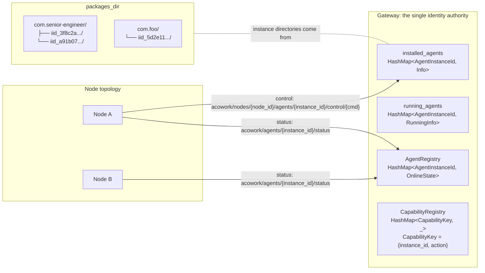
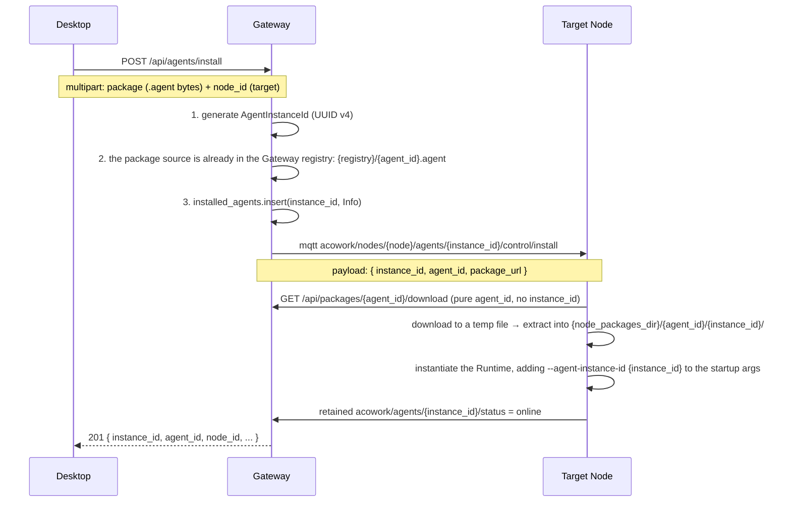
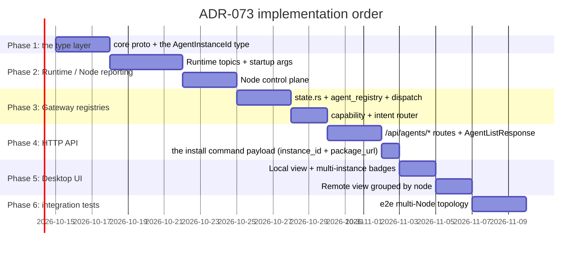

# ADR-073: Layering the Agent Identity Model — Fully Decoupling `agent_id` / `agent_instance_id` / `node_id`

> **Chinese source of truth**: [ADR-073](../zh/ADR-073-agent-instance-identity-decomposition.md)
> **Terminology**: see [GLOSSARY.md](./GLOSSARY.md)

## Status

Accepted

## Date

2026-10-10

## Decision Makers

大鱼 (Dayu)

## Predecessors

- [ADR-055](../zh/ADR-055-remote-runtime-node-topology.md) (remote Runtime deployment — the Node
  Agent topology; this ADR corrects the identity-model defects it exposed after Phase 5b)
- [ADR-033](./ADR-033-mqtt-replace-grpc-websocket.md) (MQTT replacing gRPC + WebSocket — this ADR
  directly reshapes its identity semantics)
- [ADR-034](../zh/ADR-034-mqtt-http-boundary.md) (the MQTT / HTTP boundary)

**Blast radius**:

**New / reshaped**:
- `core/acowork-core/src/manifest.rs` (`AgentManifest` strengthens the documentation that `agent_id`
  means package identity only)
- `core/acowork-core/src/protocol.rs` (every `DataEnvelope` carries instance metadata: `agent_id`
  (package origin) + `agent_instance_id` (instance UUID) + `node_id` (current location, mutable))
- `core/acowork-gateway/src/gateway/instance_id.rs` (**new**: instance_id generation, dedup, and
  validation utilities)

**Modified modules**:
- `core/acowork-gateway/src/gateway/state.rs` (all 4 HashMap keys change from `String` to
  `AgentInstanceId`)
- `core/acowork-gateway/src/mqtt/agent_registry.rs` (key upgrade; topic parsing uses `{instance_id}`)
- `core/acowork-gateway/src/capability/registry.rs` (`CapabilityKey` gains instance_id)
- `core/acowork-gateway/src/intent/router.rs` (addressing by instance)
- `core/acowork-gateway/src/http/agents.rs` (every `{id}` route variable's semantics become
  `{instance_id}`; `AgentListResponse` gains the three fields `instance_id`/`agent_id`/`node_id`)
- `core/acowork-gateway/src/http/proxy.rs` (reverse-proxy addressing by instance_id)
- `core/acowork-gateway/src/mqtt/dispatch.rs` (when parsing `acowork/agents/+/...` topics, the path
  variable is treated as instance_id)
- `core/acowork-gateway/src/mqtt/node_control.rs` (control-plane topics use
  `nodes/{node}/agents/{instance_id}/...`)
- `core/acowork-gateway/src/bootstrap/orchestrator.rs` (registry init paths synced)
- `core/acowork-gateway/src/gateway/mod.rs` (`auto_install_bundled_agents` changes from "copy the
  directory into packages_dir" to "register a registry download source + trigger the install command")
- `core/acowork-runtime/src/startup/` (the startup flag `--agent-instance-id` replaces `--agent-id`;
  all Runtime reporting topics use `{instance_id}`)
- `core/acowork-runtime/src/mqtt/` (topic construction and subscription paths)
- `core/acowork-node/src/` (control-plane topics; the install command carries `instance_id`)
- `apps/acowork-desktop/src/stores/agentStore.ts` + `components/agent-list/` (an instance view +
  multi-node grouping with collapsing per node)

---

## 1. Decision Summary

### 1.1 In one sentence

**Fully split "the package's id" from "the instance's id"**: `agent_id` represents only the agent
package itself (like a Class / an npm package name), each install action produces an independent
`agent_instance_id` (a UUID, like an Object / a container id), and `node_id` is merely a descriptor
of where the instance currently lives, **never appearing in any identity key**.

### 1.2 The three-layer identity model

| Field | Semantics | Analogy | Generated when | Mutable | Platform-unique |
|-------|-----------|---------|----------------|--------|-----------------|
| `agent_id` | **package identity** — the reverse-domain identifier the `.agent` file declares in its manifest | a Java `Class` / an npm package name / a Docker image name | at package build time | immutable | ✅ |
| `agent_instance_id` | **instance identity** — the runtime entity produced by one install action | a Java `Object` / the entity in `node_modules` after an npm install / a Docker container id | a UUID v4 generated by the Gateway when it receives the install request | **immutable** (survives cross-node migration) | ✅ |
| `node_id` | **location** — which Node the instance is currently on | a Pod's current nodeName / a process's current hostname | declared when the Node Agent starts | mutable (updated on migration) | ✅ (node identity) |

### 1.3 Invariants (must hold)

1. Inside the Gateway, **the HashMap key of every agent-dimension Registry is `agent_instance_id`** —
   not `agent_id`, not `(node_id, agent_id)`.
2. In the MQTT topic `acowork/agents/{id}/...`, `{id}` is universally interpreted as
   `agent_instance_id`; **the namespace name `agents/` stays unchanged** (it is not renamed to
   `instances/`).
3. `{id}` in the HTTP API `/api/agents/{id}` is likewise interpreted as `agent_instance_id`; **the
   path prefix `/api/agents` stays unchanged**.
4. Install directory: the two-level structure `packages_dir/{agent_id}/{uuid}/` (see §5.6).
5. `node_id` **enters no identity key**; it appears only as runtime metadata in the `Info` struct, the
   `InstanceInfo` envelope, the UI, and other positional fields.

### 1.4 Topology diagram



---

## 2. Background and Motivation

### 2.1 The current state: one id expressing two things at once

`core/acowork-core/src/manifest.rs:54` defines:

```rust
pub struct AgentManifest {
    pub agent_id: String,   // e.g. "com.acowork.senior-engineer"
    ...
}
```

This `agent_id` **currently carries two semantics simultaneously**:

| Semantic | Meaning |
|----------|---------|
| **Package identity** | who published this `.agent` file, which version (the manifest's self-description) |
| **Instance identity** | after one install, the unique identifier of this runtime entity inside the Gateway |

The second semantic should have been generated by the Gateway at install time, but **the code reused
the manifest's `agent_id` to fill the gap**.

### 2.2 The consequence: every registry is built on the "globally unique agent_id" assumption

| Data structure | Current key type | Location |
|----------------|------------------|----------|
| `GatewayState.installed_agents` | `HashMap<String, AgentInfo>` | `state.rs:199` |
| `GatewayState.running_agents` | `HashMap<String, RunningAgentInfo>` | `state.rs:201` |
| `AgentRegistry.agents` | `HashMap<String, AgentOnlineState>` | `agent_registry.rs:53` |
| `CapabilityRegistry.capabilities` | `HashMap<CapabilityKey, _>`, `CapabilityKey = { agent_id, action }` | `capability/registry.rs:32` |

**Every key is `agent_id` (or derived from it)**. The moment two Nodes install the same `agent_id`,
the HashMap silently overwrites, with no conflict detection at all.

### 2.3 The conflict scenarios actually observed (triggered during the 2026-10 release prep)

#### Scenario A: two Nodes install the same package

```
Node A install com.acowork.senior-engineer  → installed_agents["com.acowork.senior-engineer"] = Info_A
Node B install com.acowork.senior-engineer  → installed_agents["com.acowork.senior-engineer"] = Info_B (overwrite)
```

- The Desktop's `GET /api/agents` returns 1 record (not 2), losing Node A's information
- The Desktop's `POST /api/agents/com.acowork.senior-engineer/start` hits an entirely
  nondeterministic Node
- Node A's Runtime publishes retained `acowork/agents/com.acowork.senior-engineer/status = online`
- Node B's Runtime publishes retained `= online`, so the broker holds Node B's payload
- Node A's status is silently swallowed and the Desktop wrongly believes Node A went offline

#### Scenario B: installing the same package twice on one Node

`POST /api/agents/install` a second time → `installed_agents.insert(same_key, ...)` **overwrites
outright**. The first install instance's install_path, workspace, and version information are all
lost.

#### Scenario C: capability registration

`CapabilityKey = { agent_id, action }` — with the same package installed on two Nodes, Intent
resolution yields a single capability name and can only find one registrant, making the same
capability on the other machine completely unreachable.

### 2.4 Options already tried / rejected (to avoid repeating the mistake)

| Option | Why rejected |
|--------|--------------|
| **A: composite primary key `(node_id, agent_id)`** | node_id is a location and must not be bound into identity; cross-Node migration, disaster recovery, and multi-Node same-package load balancing all require splitting the key. A useful short-term tourniquet, but long-term debt |
| **B: force `agent_id` to be globally unique** | reject conflicts at install time; the user must hand-craft non-conflicting ids (e.g. `com.foo@workstation-b`). This contradicts multi-machine deployment intuition and runs against ADR-055's "the Node is a first-class citizen" vision |
| **C: cluster abstraction (auto-aggregating multiple instances into a Service)** | introduces a cluster control plane, session stickiness, and affinity decisions; it does not apply to session-bound agents and is far too complex |

---

## 3. Goals

1. **Fundamentally resolve the identity confusion**: the package / instance / location layers are fully
   decoupled, each independently mutable.
2. **Zero-conflict semantics**: multiple instances of the same `agent_id` coexist on the same Node /
   across Nodes, all distinguished by `agent_instance_id`; the HashMap never does last-write-wins.
3. **Location independence**: `agent_instance_id` stays constant across cross-Node migration,
   disaster recovery, and load migration; only the `node_id` field is updated.
4. **A stable protocol / API surface**: the MQTT topic paths and the HTTP path prefixes stay
   `agents/` / `/api/agents`; only the path variable semantics are reshaped, minimising breakage.
5. **Reusable package content**: the same `.agent` file can share physical files across instances
   (symlink or shared blob), reducing disk usage.

---

## 4. Decision

### Decision 1: Three identity layers, strictly distinguished by type

```rust
// core/acowork-core/src/manifest.rs
pub struct AgentManifest {
    /// Package identity only (from the .agent manifest, immutable, platform-unique)
    pub agent_id: String,
    // ... other fields unchanged
}

// core/acowork-gateway/src/gateway/instance_id.rs (new file)
/// Instance identity — UUID v4, platform-unique, generated by the Gateway at install, never changes.
/// An opaque type prevents misuse with the agent_id string.
#[derive(Debug, Clone, PartialEq, Eq, Hash, Serialize, Deserialize)]
#[serde(transparent)]
pub struct AgentInstanceId(String);

impl AgentInstanceId {
    pub fn new() -> Self { Self(Uuid::new_v4().simple().to_string()) }
    pub fn from_node_proposed(id: String) -> Result<Self, IdError> { /* format validation */ }
    pub fn as_str(&self) -> &str { &self.0 }
}

/// AgentInfo's identity fields reshaped
pub struct AgentInfo {
    pub agent_id: String,            // package identity
    pub instance_id: AgentInstanceId, // instance identity (NEW)
    pub node_id: String,              // current location (already existed)
    pub version: String,
    pub install_path: String,         // = "{packages_dir}/{agent_id}/{instance_id}/"
    pub manifest: AgentManifest,
    // ...
}
```

**Criterion**: use the opaque type `AgentInstanceId(String)` rather than a bare `String`, so the type
system forces every HashMap key, HTTP path parse, and MQTT payload through a validated instance id,
eliminating logic bugs caused by string typos.

### Decision 2: All registry keys use `AgentInstanceId`

| Data structure | New key type |
|----------------|--------------|
| `GatewayState.installed_agents` | `HashMap<AgentInstanceId, AgentInfo>` |
| `GatewayState.running_agents` | `HashMap<AgentInstanceId, RunningAgentInfo>` |
| `AgentRegistry.agents` | `HashMap<AgentInstanceId, AgentOnlineState>` |
| `CapabilityRegistry`'s `CapabilityKey` | `{ instance_id: AgentInstanceId, action: String }` |
| Session routing | `agent_instance_id` (layered on top of the existing session_id) |

**Conflict detection**: before every `insert`, check whether the key already exists; if so return 409 +
the existing instance details (avoiding a silent overwrite).

### Decision 3: The MQTT topic namespace stays `agents/`; the path variable becomes instance_id

```text
# Runtime → Gateway (the acowork/agents/ prefix is kept; {id} now means instance_id)
acowork/agents/{instance_id}/status
acowork/agents/{instance_id}/http_endpoint
acowork/agents/{instance_id}/config
acowork/agents/{instance_id}/debug/events/{event_type}
acowork/agents/{instance_id}/sessions/{session_id}/messages/#
acowork/agents/{instance_id}/sessions/{session_id}/state

# Gateway → Node (the lifecycle control plane)
acowork/nodes/{node_id}/agents/{instance_id}/control/{cmd}
acowork/nodes/{node_id}/agents/{instance_id}/events

# Node → Gateway (Node-level reporting, established in ADR-055)
acowork/nodes/{node_id}/status
acowork/nodes/{node_id}/info
```

**Criterion**: keeping the `agents/` namespace avoids unnecessary breakage for broker ACLs,
documentation, and external observers; only the meaning of the path variable is reshaped.

**Topic parsing** (the current logic at `agent_registry.rs:74-80`):

```rust
// old:
let agent_id = parts[2].to_string();
self.agents.insert(agent_id, AgentOnlineState { agent_id, ... });

// new:
let instance_id = AgentInstanceId::from_string(parts[2].to_string())?;
self.agents.insert(instance_id.clone(), AgentOnlineState {
    instance_id: instance_id.clone(),
    agent_id: extract_agent_id_from_envelope(payload),  // parsed from the envelope
    node_id: extract_node_id_from_envelope(payload),    // parsed from the envelope
    ...
});
```

> **Important**: instance_id travels in the topic path (for routing/sharding), while agent_id /
> node_id must be read from the envelope payload (fields inside the DataEnvelope). This is the
> explicit division of labour with the ADR-033 MQTT protocol.

### Decision 4: The HTTP API path stays `/api/agents`; `{id}` now means `{instance_id}`

```text
# single-instance operations (paths unchanged; only {id}'s semantics change)
GET    /api/agents/{instance_id}
DELETE /api/agents/{instance_id}
POST   /api/agents/{instance_id}/start
POST   /api/agents/{instance_id}/stop
POST   /api/agents/{instance_id}/restart-debug
POST   /api/agents/{instance_id}/clone
POST   /api/agents/{instance_id}/upgrade
GET    /api/agents/{instance_id}/model
GET    /api/agents/{instance_id}/avatar
GET    /api/agents/{instance_id}/manifest/avatar
... (all /api/agents/{id}/* routes likewise)

# listing / aggregation
GET /api/agents                                    # every instance on the platform
GET /api/agents?agent_id=com.foo                   # every instance of a package (the package view)
GET /api/agents?node_id=node-a                     # every instance on a Node
GET /api/agents/{instance_id}/lsp-endpoint         # already present, instance dimension

# Install (multipart upload kept as today; the change is only in the command payload)
POST /api/agents/install                            # multipart: package (bytes) + node_id (target)
                                                    # already the case (agents.rs:1415), non-breaking
                                                    # the Gateway lands it in the registry, builds a
                                                    # download URL, and the install command carries
                                                    # { instance_id, agent_id, package_url }

# Package download (unchanged, purely package-identity related)
GET /api/packages/{agent_id}/download              # the source is {agent_id}.agent in the Gateway
                                                   # registry — purely agent_id, instance-agnostic
```

`AgentListResponse` gains `instance_id` (instance identity), `agent_id` (package identity) and
`node_id` (current location) as three separate fields, alongside the existing `name` / `display_name`
(a user-renameable field replacing the alias concept) / `role` / `avatar` / `version` / `running` /
`connected` / `ready` / `dev_mode` / `debug_state` / `last_interaction_at` / `mqtt_online` /
`sleeping_at` etc.

### Decision 5: The install flow — the Gateway generates instance_id; the Node downloads and lands via the URL + instance_id



**Key constraints**:

- `agent_instance_id` is **generated solely by the Gateway** (neither the Node nor the Desktop reports
  one, eliminating collisions)
- On receiving the install command on the control plane, the Node **must** start the Runtime with the
  `instance_id` carried by the command and **must not invent one**
- **The download URL is fully decoupled from the instance**: `GET /api/packages/{agent_id}/download`
  only answers "give me this package's byte stream" (the agent_id dimension), while `instance_id`
  appears only in the install command payload deciding "land as which instance, install into which
  directory" (the instance dimension). Download and instantiation are two actions with two parameter
  sets — they are not merged.

### Decision 5.1: The two installation paths converge onto one pipeline

The two existing install entry points (code facts: `auto_install_bundled_agents` at
`gateway/mod.rs:95` and `install_agent` at `agents.rs:1415`) both end at a file on the Gateway
machine, **differing only in where the package source comes from**:

| Install path | Package source | Current path |
|--------------|----------------|--------------|
| **Bundled agents (installed from the onboarding UI)** | the `.agent` files distributed with the ACowork installer (`examples/` / `ACOWORK_BUNDLED_AGENTS_DIR`) | at Gateway start, copy the directory straight into `packages_dir/{agent_id}/` (bypassing the registry and the install command) |
| **Desktop manual install** | a local `.agent` file uploaded by the user | multipart → registry → install command → the Node downloads |

**Decision**: both entry points **converge onto one pipeline**, differing only in step 0, "injecting
the package source":

```
① bundled agents: at Gateway start, register the bundle as a registry download source {registry}/{agent_id}.agent
   Desktop:        multipart upload → land in the registry {registry}/{agent_id}.agent (unchanged)
        ↓
② everything after this is identical (Decision 5's diagram): generate instance_id → install command → the Node downloads → lands
```

This means: bundled agents no longer bypass the registry and write directly into packages_dir; they
likewise get an `instance_id`, go through the install command, and are landed by the Node — with
**zero behavioural difference from a manual install**. The target Node of a bundled agent is chosen
explicitly by the onboarding UI (local or any enrolled node), never hardcoded. The existing
`auto_install_bundled_agents` "copy the directory into packages_dir" logic is discarded in favour of
"register a registry download source + trigger the install command".

### Decision 6: The install directory structure — Node-side `{packages_dir}/{agent_id}/{uuid}/`

**A critical distinction**: the system has two directories with two purposes, which must not be
confused:

| Directory | Location | Purpose | Structure |
|-----------|----------|---------|-----------|
| **registry** (the download source) | on the Gateway machine | stores the original `.agent` package for Nodes to pull | `{registry}/{agent_id}.agent` (unchanged) |
| **packages_dir** (the install landing) | local to each Node machine | the extracted agent files the Runtime runs from | `{packages_dir}/{agent_id}/{uuid}/` (a new second level) |

```
{node_packages_dir}/
  com.acowork.senior-engineer/        # level 1 = package identity
    3f8c2a1b-4d5e-6f7a-8b9c-0d1e2f3a4b5c/   # level 2 = instance_id
      manifest.json
      skills/
      prompts/
      workspace/
    a91b07d2-8e3f-4a5b-9c1d-2e3f4a5b6c7d/   # a second instance of the same package
      manifest.json
      ...
  com.acowork.foo/
    5d2e11f8-.../
```

**Criteria**:

- Level 1 uses `agent_id`: human-readable, browsable by package; isomorphic to npm's
  `node_modules/<pkg>/...` and Docker's volume `<image>/<container>/`
- Level 2 uses `instance_id` (a UUID): machine-generated and guaranteed globally unique; multiple
  instances of the same package never interfere
- **Disallowed**: nesting the instance identity further inside the directory (i.e. not
  `packages/{agent_id}-{instance_id}/`), which would reintroduce shared-directory conflicts when one
  package has multiple instances
- The Gateway's registry download source **keeps the flat `{agent_id}.agent` structure** — a download
  source is "package content", one file per package, naturally keyed by agent_id; the instance
  dimension exists only in the Node-side landing directory

**Physical package-file sharing** (an optional future optimization): when several instances have
identical `manifest.json` / `skills/` content, the second instance's directory could use a
hardlink/reflink to the first with only `workspace/` exclusive. Not implemented in this phase; the
extension point is reserved.

### Decision 7: Capability / Intent router reshape

The old `CapabilityKey { agent_id, action }` becomes `{ instance_id: AgentInstanceId, action: String }`.

**Intent routing** (`intent/router.rs`): a caller asks "find the agent that can handle X" → the
router walks the `CapabilityRegistry` → collects every instance declaring X → picks one by policy:

- default: return the first (deterministic; a `hash(instance_id)` round-robin can be added)
- later phases: affinity / preferred-node / user choice

**The "package-level capability" semantics for multiple instances**: a caller writing "find any
instance of com.foo to handle X" is resolved by the Gateway into an instance-level lookup; the
Registry never conflates class and object.

### Decision 8: Reverse proxy / HTTP endpoint addressing

`acowork/agents/{id}/http_endpoint` at `proxy.rs:1619` changes so that:

- the topic path's semantics is `instance_id`
- the payload envelope is `HttpEndpoint { instance_id, agent_id, node_id, url }`

The Gateway maintains `HashMap<AgentInstanceId, EndpointUrl>`, and reverse proxies such as
`GET /api/agents/{instance_id}/chat` look up directly by instance_id, no longer affected by agent_id
conflicts.

### Decision 9: Runtime startup arguments

```rust
// old
acowork-runtime --agent-id com.acowork.senior-engineer --http-port 0 ...

// new
acowork-runtime --agent-instance-id 3f8c2a1b-... --http-port 0 ...
```

`--agent-id` (package identity) is **optionally retained**, used only for the Runtime's internal
manifest cross-check / log identification. The Runtime no longer builds any MQTT topic or registry key
from `agent_id`.

### Decision 10: Desktop UI

| View | Trigger | Implementation |
|------|---------|----------------|
| **Local view** (the single-Gateway default) | `gatewayMode === "local"` or `nodes.length === 0` | one row per instance; columns: an instance_id short code + agent_id + display_name + status; when the same package has multiple instances, an extra `(first 10 of node_id)` badge distinguishes them |
| **Remote view** (multi-Node mode) | `gatewayMode === "remote"` and `nodes.length >= 1` | grouped by `node_id`: a `NodeGroupHeader` at the top of each group (a narrow bar at 1/3 the item height, **no background, no border** — just a divider + a collapse chevron + the node name), expanded by default and toggled on click; the item layout inside a group is identical to the Local view. **Grouping is node-primary: every node produces a group regardless of how many agents it currently has** (with 0 agents the group renders an "install Agent" entry, disabled for an offline node) — otherwise an empty node is invisible in the sidebar and the only way to install on it is the command line |

The view mode is determined automatically by `gatewayMode`; the user does not switch manually.

**The alias concept is dropped**: renaming goes through the manifest's `display_name` field, so no
extra identity layer is needed. The originally proposed "package view (collapsing by agent_id)" is
also dropped — in a multi-package scenario, grouping by Node is already clear, and adding a package
collapse layer is redundant.

---

## 5. Consequences

### 5.1 Positive

1. **Zero conflicts**: UUID HashMap keys are platform-unique, so same-package multi-instance /
   cross-Node name collisions / same-Node reinstall are all naturally supported.
2. **Location independence**: cross-Node migration, disaster recovery, and load rebalancing only
   update the `node_id` field; instance_id / session_id / configuration data all follow.
3. **A stable protocol path**: the MQTT namespace `acowork/agents/` and the HTTP prefix
   `/api/agents` are fully retained, so external observers, broker ACLs, and documentation need no
   major changes.
4. **Type safety**: the opaque `AgentInstanceId` type + transparent serde serialization prevent
   string misuse at compile time.
5. **Shareable package files**: disk optimization for same-package multi-instance (hardlinks) becomes
   possible in a future phase.
6. **Clearer UX**: the user's object of action is an "instance", not a "package" — a mental model
   consistent with Class/Object.

### 5.2 Negative / costs

1. **proto changes**: `DataEnvelope` gains `instance_id` / `node_id` in several places; `prost` must
   regenerate.
2. **A wide blast radius**: it spans 5 crates (acowork-core / acowork-runtime / acowork-node /
   acowork-gateway / acowork-desktop), and each crate must audit every `agent_id` string usage.
3. **The Node-side packages_dir structure changes**: `{packages_dir}/{agent_id}/` →
   `{packages_dir}/{agent_id}/{uuid}/`, so the Node's package discovery / recovery logic (e.g.
   `restore_installed_agents`) must walk the second level.
4. **Remote view UX**: the Desktop needs a narrow group header with default-expanded /
   click-to-collapse interaction, reusing the Local view's item layout to avoid maintaining two sets
   of styles.
5. **The first install generates a UUID**, adding one directory level in the filesystem (paths get
   slightly deeper — invisible to users, low impact).

### 5.3 Rollback

All changes live at the type-system + topic-path-variable-semantics layer:

- Reverting the HashMap key type to `String`: keep all fields, just change the key type
- Reverting the HTTP path variable semantics: the routing table is unchanged; only the handler
  reinterprets the variable name
- The MQTT topics are unchanged and the payload fields can remain compatible

No data migration script is needed; test data / local debug data can be cleared manually.

---

## 6. Change List (by crate / file)

### 6.1 core/acowork-core
- `src/manifest.rs`: strengthen the comment that `agent_id` denotes package identity only
- `src/protocol.rs`: all `DataEnvelope`s gain `instance_id: String` and `node_id: String`; add an
  `InstalledInstanceInfo` envelope
- `src/agent_instance_id.rs` (new): the opaque `AgentInstanceId` type + UUID generation + serde

### 6.2 core/acowork-runtime
- `src/startup/`: the CLI flag `--agent-instance-id` replaces `--agent-id`
- `src/mqtt/`: every topic construction uses the `{instance_id}` placeholder
- every `acowork/agents/{id}/...` occurrence becomes `{instance_id}`

### 6.3 core/acowork-node
- `src/control/`: control-plane topics `nodes/{node}/agents/{instance_id}/control/{cmd}`
- the install path: parse the Gateway's install command and extract `instance_id` to start the Runtime

### 6.4 core/acowork-gateway
- `src/gateway/instance_id.rs` (new): instance_id validation and dedup utilities
- `src/gateway/state.rs`: the 4 HashMap key types replaced
- `src/mqtt/agent_registry.rs`: key + topic parsing logic
- `src/mqtt/dispatch.rs`: the topic routing table updated
- `src/mqtt/node_control.rs`: the control-plane topic
- `src/capability/registry.rs`: `CapabilityKey` gains instance_id
- `src/intent/router.rs`: addressing by instance
- `src/http/agents.rs`: every route `{id}` → `{instance_id}` (semantics); `AgentListResponse`'s
  three fields split; `install_agent` generates the instance_id and writes it into the install
  command payload (`{ instance_id, agent_id, package_url }`)
- `src/http/proxy.rs`: the endpoint registry + reverse-proxy addressing
- `src/http/packages_api.rs` (or similar): **keep `/api/packages/{agent_id}/download` unchanged** —
  the download source remains keyed by agent_id and the instance dimension never enters the download
  path
- `src/bootstrap/orchestrator.rs`: the registry init path

### 6.5 apps/acowork-desktop
- `src/lib/types.ts`: the `AgentInfo` / `AgentDetail` types gain `instance_id` / `node_id`
- `src/stores/agentStore.ts`: all internal addressing uses `instance_id` as the key; in the Local view
  same-package multi-instance rows are distinguished by a `(first 10 of node_id)` badge
- `src/components/agent-list/AgentList.tsx`: renders two layouts automatically based on
  `gatewayMode`
  - `local`: the current layout unchanged (one row per instance, badges for multi-instance)
  - `remote`: grouped by `node_id`, each group topped by a `NodeGroupHeader` (a narrow bar with no
    background or border, just a divider + collapse chevron + node name), expanded by default,
    toggled on click
- the rename flow: just edit display_name

---

## 7. Test Strategy

### 7.1 Unit tests (acowork-gateway)

- `installed_agents.insert(instance_id_a, ...)` then `insert(instance_id_b, ...)` with the same
  `agent_id` but different `instance_id` → two entries coexist ✅
- `insert(an existing instance_id)` → returns 409 + the existing entry
- `CapabilityRegistry.register(instance_id_a, action)` and `register(instance_id_b, action)` with the
  same action name → two capabilities coexist
- `AgentInstanceId::from_string` rejects an invalid UUID

### 7.2 Integration tests (e2e)

- **Conflict resolution**: two mock Nodes install the same package → `GET /api/agents` returns 2
  records with different instance_ids ✅
- **Same-Node multi-instance**: installing the same package twice on one Node → two instances with
  different install_paths ✅
- **State independence**: Node A's instance comes online while Node B's goes offline → the two
  statuses do not affect each other
- **Cross-Node migration**: simulate an instance migrating from Node A to Node B (updating node_id,
  restarting the Runtime) → instance_id is unchanged and the session follows

### 7.3 Protocol compatibility

- Start a Gateway + 2 Nodes, simulating a real multi-machine topology
- The Desktop's `GET /api/agents` verifies all three fields are present
- The Desktop's `POST /api/packages/install` verifies 201 + a returned instance_id
- After the Node receives the install command, verify the Runtime's startup args contain
  `--agent-instance-id`

### 7.4 Desktop UX

- Local view: the instance list correctly shows the instance_id short code + multi-instance badges
- Remote view: grouping by node + a collapse bar expanded by default + clicking collapses/expands
- After renaming display_name, the MQTT retained `config` topic carries the new name

---

## 8. Implementation Order



Each phase must satisfy on completion: `cargo clippy --all-targets -- -D warnings` + `cargo test` all
green + a manual Desktop end-to-end check.

---

## 9. Summary

**The fundamental error**: using `agent_id` (the manifest's package name) to serve as both the
package identity and the instance identity — using a Class as an Object.

**The correct model**: three strictly separated identity layers — `agent_id` (package) /
`agent_instance_id` (the UUID instance) / `node_id` (location). Every registry key uses instance_id
and the namespace path variable semantics are reshaped accordingly, while the namespace **names**
(`agents/` / `/api/agents`) stay unchanged to protect the protocol surface.

**The key criterion**: a path namespace name is protocol infrastructure (broker ACLs, documentation,
and monitoring dashboards depend on it) and should be stable; a path variable's semantics is an
internal implementation detail and should evolve with the identity-model correction. This ADR
strictly upholds that distinction — only changing the latter, never the former.
