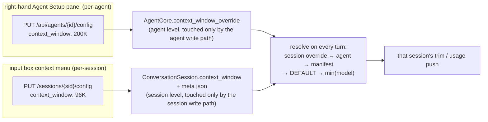
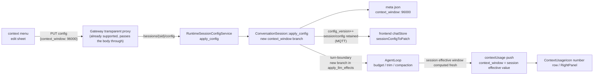

# ADR-074: Per-Session Context Window Override — `context_window` Extended from Per-Agent to Per-Session

> **Chinese source of truth**: [ADR-074](../zh/ADR-074-per-session-context-window-override.md)
> **Terminology**: see [GLOSSARY.md](./GLOSSARY.md)

**Status**: Accepted (finalized at review on 2026-09-15)
**Date**: 2026-09-09
**Review revision**: 2026-09-15 (unified the encoding semantics of "invalid value", deprecated `0 = unlimited`; see §1.2 / §1.3 / §6)
**Decision Makers**: 大鱼 (Dayu)

**Predecessors**:
- [ADR-012](./ADR-012-per-session-model-isolation.md) (per-session model isolation)
- [ADR-025](./ADR-025-temperature-resolution-chain.md) (temperature resolution chain — the comparison target and anti-pattern source of this document)
- [ADR-026](./ADR-026-context-window-resolution-chain.md) (per-agent context window cap resolution chain — this document adds a per-session Layer 0 on top of it and **deprecates its `0 = unlimited`**, see §6)
- [ADR-043](./ADR-043-session-config-state-split.md) (Session Config / State dual-topic split)
- [ADR-047](./ADR-047-session-config-decouple-from-inference.md) (Session Config persistence decoupled from LLM inference — the authoritative design of the per-session field pipeline)

---

## 1. Decision Summary

### 1.1 In one sentence

**Add a per-session `context_window` parameter** (stored in session meta json, with **an invalid value meaning "inherit the per-agent chain"**), wired into the ADR-047 session-config pipeline (`SessionConfigDelta` / `ConversationSession::apply_config` / HTTP `PUT /sessions/{sid}/config` / MQTT retained `session_config`), participating in the ADR-026 resolution chain as the highest-priority Layer 0, plus an edit entry point in the input box's context usage menu — the per-agent setting in the right-hand Agent Setup panel stays untouched and **never overwrites** an already-set per-session value. At the same time, `0` is **unified as an invalid value across the whole chain** (synonymous with `null` / absent), deprecating ADR-026's `0 = unlimited` (§6).

### 1.2 Semantic decisions

| # | Decision | Conclusion |
|---|----------|-----------|
| D1 | Resolution semantics | Each layer takes the **first valid value**; `absent / null / 0 / out-of-range` are all **invalid** and fall through to the next layer; the end of the chain falls back to `DEFAULT_CONTEXT_WINDOW = 200_000` (**the fallback value is also the de facto ceiling**), finally taking min with the model window. The temperature-style "bake into every session meta when the agent config changes" write-back semantics are **not** adopted |
| D2 | Display-only vs genuinely effective | **Genuinely effective**: the per-session override participates in that session's trim / compaction thresholds and the `context_usage` push |
| D3 | Per-session write path | Reuse the existing HTTP `PUT /api/agents/{id}/sessions/{sid}/config` (Gateway already transparently proxies it to Runtime `PUT /sessions/{sid}/config`), going through `SessionConfigDelta`. **No new** MQTT control command |
| D4 | Clear / reset semantics | `context_window: Some(0)` in the delta (or `null`) = **clear the override**; `None` = unmodified. Clearing = normalized to an invalid value; on disk the field is **not written** (`None` + `skip_serializing_if`), so the field disappears from meta |
| D5 | The "already set" marker | No boolean flag. **The field existing in meta ⟺ this session has an override** (guaranteed by D4's normalization on write); one single source across three layers: meta json (the persistence authority) ↔ `ConversationSession` (backend memory) ↔ `SessionChatState.sessionContextWindow` (frontend mirror) |
| D6 | Value domain | Valid range `FLOOR..=CEILING`: `FLOOR = 8_192` (a constant), `CEILING = 4_194_304`. Out-of-range values are rejected by `put_session_config` with **400** (no silent clamping); the per-model ceiling does not participate in validation — at runtime min with the model window is the backstop |

### 1.3 Value encoding table (the single convention across all four surfaces)

The same semantics has only one representation on each of the four surfaces; **"unset" and "cleared" are the same state**:

| Surface | Unset / cleared (invalid) | Set |
|---|---|---|
| HTTP `PUT /sessions/{sid}/config` | field absent, `null`, `0` (all three synonymous) | `n` (`FLOOR..=CEILING`) |
| `conversations/meta/{sid}.json` | field does not exist | `n` |
| proto `SessionConfig` | `optional uint64` field absent | `n` |
| `SessionConfigSnapshot` (HTTP GET / MQTT retained) | `null` | `n` |
| Desktop `SessionChatState.sessionContextWindow` | `null` | `n` |

Supplementary conventions:
- proto uses **presence** (`optional uint64`) to express "unset", **not a `0` sentinel** — "unset" is a single concept and should be expressed by field absence (no longer replicating temperature's `NaN` sentinel debt).
- `SessionConfigDelta.context_window` uses `Option<u64>`: `None` = unmodified, `Some(0)` = cleared, `Some(n)` = override.

### 1.4 Anti-overwrite guarantee (Agent Setup panel ↔ context menu)

The per-agent and per-session settings **live in two stores that never write to each other**; non-overwrite is guaranteed by layering rather than by frontend interception:



- **Invariant 1**: a per-session value **never lands in** `AgentCore`. `AgentCore` holds only Layers 1/2/3 and the agent-level `context_window_override`, touched only by the agent write path (`UpdateRuntimeConfig`).
- **Invariant 2**: the in-session sync path of `RuntimeConfigOverrides` ([loop_context.rs:106](../../../core/acowork-runtime/src/agent/loop_context.rs#L106) `apply_runtime_config`) **must not** gain a `context_window` branch; temperature's "bake into every session meta" there ([session_manager.rs:1726](../../../core/acowork-runtime/src/agent/session/session_manager.rs#L1726)) is a historical exception, not a template to copy.
- **Rationale**: `AgentCore` is the **per-agent template** — SessionManager does `Arc::make_mut` clone-on-write on it ([session_manager.rs:1646](../../../core/acowork-runtime/src/agent/session/session_manager.rs#L1646)), and each SessionTask clones it again with `(*core).clone()`. Any session-dimension value written into the template would leak to other sessions via the clone, and would break "a session with no override dynamically follows agent changes".
- An agent window change only updates the agent layer; sessions with an override naturally take priority in the resolution chain and are unaffected; sessions without an override follow dynamically (inheritance semantics).
- The frontend's single anti-overwrite point is fixing the blanket sync in [chatStore.ts](../../../apps/acowork-desktop/src/stores/chatStore.ts) (see §5.3): when syncing `contextUsage` on an `agent_config` MQTT event, **skip sessions where `sessionContextWindow != null`**.

### 1.5 Which layer owns resolution

- **Sole ownership**: the per-session `AgentLoop` calls the pure function `resolve_effective_context_window(...)` (§3.2). The function is stateless and has no environment dependency beyond its arguments; it is recommended to live in the `agent::session_config` module alongside `resolve_effective_reasoning_effort`.
- **Single choke point**: `AgentLoop::context_trim_budget(model)` ([loop_context.rs:200](../../../core/acowork-runtime/src/agent/loop_context.rs#L200)) already covers trim / compaction / tool-result truncation / warning thresholds, so the session override is injected there exactly once; the usage side has 4 further injection points, see §5.2.
- **`AgentCore`'s refactoring**: `AgentCore::context_trim_budget(model)` is refactored into `context_trim_budget_with(resolved_cap: Option<u64>, model)`; it **does not accept a session override and holds no session state** (invariant 1).
- **The sole read source for the override**: `ConversationSession` (the in-memory mirror of the persisted meta value). **Do not** cache a second copy in `SessionState` (avoids dual-source drift, see §5.2).

---

## 2. Background and Problem

### 2.1 Status quo

- `context_window` is a per-agent parameter following the ADR-026 three-layer resolution chain (agent_config.json → manifest → DEFAULT → min(model context_window)), stored in agent_config.json and editable only from the right-hand Agent Setup panel (the `0 = unlimited` in its value domain is deprecated by this ADR, see §6).
- The input box's context usage menu (`ContextUsageIcon`) shows `used / total`, where total = `ContextUsageInfo.context_window`, pushed by Runtime from the per-agent chain, so it **cannot be differentiated per session**.
- The per-session config pipeline (ADR-047) already supports model / provider / workspace_id / reasoning_effort / temperature / title, with fields landing in `conversations/meta/{session_id}.json`, read and written through `SessionConfigService` (HTTP + MQTT retained).

### 2.2 Requirements

1. Add an edit icon to the right of the total in the context usage menu's number row; clicking it edits the context window size of **that session**.
2. The new parameter is per-session, added to meta json, on the same pipeline as temperature.
3. Inherits the per-agent value by default; **an independent value is written only after the user clicks edit and saves**.
4. Both new and existing sessions must handle the field's addition and initialization properly; the frontend's three display surfaces (input box menu / bottom status bar / right status panel) all take the session's effective value as authoritative.
5. A per-agent change in the Agent Setup panel **must not overwrite** an already-edited per-session value.

### 2.3 Why the temperature status quo cannot simply be copied

The temperature status quo is this document's **anti-pattern source** and needs to be recorded explicitly (details in §9):

- Per-session temperature (meta json) already has a field and persistence, but **has no consumption path**: `SessionState::set_temperature` has only 3 call sites (agent config change sync / resume overwrite from the agent chain / creation-time sync of the agent override), and no code reads `ConversationSession.temperature` into `SessionState`; the turn-boundary `llm_effects.rs` has zero handling for temperature (reasoning_effort is synced, temperature is not).
- resume ([session_manager.rs:1084](../../../core/acowork-runtime/src/agent/session/session_manager.rs#L1084)) **does not read** `conv.temperature()` when resolving temperature, so the meta value gets overwritten by the agent chain after a restart.
- Semantically the meta temperature is "baked into each session when the agent config changes" ([session_manager.rs:1726](../../../core/acowork-runtime/src/agent/session/session_manager.rs#L1726)); once the meta value genuinely participates in resolution, old sessions would be **pinned to the stale baked value** and stop following agent changes — a behavioural regression.
- It currently feels harmless only because **no UI can create a per-session temperature difference** (a buried mine, not yet detonated).

Conclusion: context_window's per-session semantics adopt **invalid value = inherit (no baking)**, deliberately diverging from temperature's baking semantics; the resolved effective value is **computed fresh every turn and not cached**, structurally avoiding temperature's "cache blocks the fallback chain" class of defect.

---

## 3. Resolution Chain Design

### 3.1 The extended resolution chain (per-session Layer 0)

```text
Layer 0 (highest)  session meta.json context_window    set by the user in that session's context menu
    ↓ invalid (absent / null / 0 / out-of-range)
Layer 1             agent_config.json.context_window    user's agent-level setting
    ↓ invalid (None / 0 / out-of-range)
Layer 2             manifest.llm.context_window          the package author's default
    ↓ invalid (None / 0 / out-of-range)
Layer 3             DEFAULT_CONTEXT_WINDOW = 200_000    system hardcoded (fallback value = de facto ceiling)
    ↓
min with model capability: effective = min(resolved_cap, caps.context_window)
```

`0` and `null` are **the same state** (§1.3); validity is decided in exactly one place, the `is_valid_context_window` below.

### 3.2 The unified resolution function (the backend's single resolve point)

The resolution logic currently scattered across `agent_core.resolved_context_cap()` / `loop_context.effective_context_budget()` / SessionManager's resume initial usage is converged into **one stateless pure function** placed in `agent::session_config` (same location as `resolve_effective_reasoning_effort`). **It is deliberately not made a method on `AgentCore`** (§1.5 invariant 1):

```rust
/// Value validity: the single decision point. 0 / absent / out-of-range are all "invalid", synonymous with None.
pub(crate) fn is_valid_context_window(n: u64) -> bool {
    (FLOOR..=CEILING).contains(&n)
}

/// Input: session override (Layer 0, from ConversationSession), agent chain sources
/// Output: the effective context cap for that session (participates in trim / compaction / usage push)
pub(crate) fn resolve_effective_context_window(
    session_override: Option<u64>,          // Layer 0
    agent_override: Option<u64>,            // Layer 1
    manifest_window: Option<u64>,           // Layer 2
    model_caps: Option<&ModelCapabilitiesInfo>,
) -> u64;
```

**Conventions**:
- **The sole read source for the override is `ConversationSession`** (the same in-memory mirror of the persisted meta value), maintained by resume / `apply_llm_effects`. **Do not** cache another copy in `SessionState`.
- **The effective value is not cached**: it is computed fresh on every build / usage push, so agent-layer changes always penetrate to unedited sessions, avoiding temperature-style cache drift.
- **Validity is decided in exactly one place**: `is_valid_context_window` is the only interpreter of `0` / absent / out-of-range; the HTTP layer uses it for 400 validation and the resolution chain uses it to skip layers — the two must not each write their own.
- **Out-of-range is not silently clamped**: an out-of-range PUT returns 400 so the user knows immediately; the resolution chain treats "legacy illegal values" (old meta / hand-edited files) as invalid (skip the layer), neither erroring nor clamping.
- **No reverse write-back**: the resolution result is not written back to meta, not to `AgentCore`, and not into the session config delta.
- **`AgentCore`-side refactoring**: `AgentCore::context_trim_budget(model)` → `context_trim_budget_with(resolved_cap: Option<u64>, model)`, receiving only the resolution result and remaining session-unaware.

### 3.3 Value domain

- `CEILING = 4_194_304` (4M tokens) — larger than any existing model's context, purely a sanity ceiling (guarding against a hand-edited meta writing `u64::MAX` and computing an astronomical budget).
- `FLOOR = 8_192` (a constant, a purely sanity floor) — the minimum legal context window. **No per-model lower bound**: when the set value is smaller than the model's max output, the runtime min / trim handles it naturally; if FLOOR depended on model capability, `is_valid_context_window` would need a model parameter, contradicting the pure function signature in §3.2.
- **An over-ceiling PUT returns 400**, not a silent clamp: a user explicitly setting 1M while the system quietly changes it to 200K is harder to debug than an error.
- The runtime still keeps `min(resolved_cap, model caps)`: **the value a user sets may exceed model capability, but actual usage never exceeds the model window**; the UI menu must show both "the set value" and "the currently effective value".
- Shrinking the window (making it smaller) immediately recomputes usage: when `used > new_cap`, the next request build triggers compaction/truncation and may discard history (with `compaction`, when the history is shorter than the protection threshold, it may even trigger a loop abort — see [loop_context.rs](../../../core/acowork-runtime/src/agent/loop_context.rs)) — which is exactly the point of shrinking, so **no secondary confirmation is required** (the agent-level path likewise has no such protection, see [agent_config_impl.rs](../../../core/acowork-runtime/src/usecases/agent_config_impl.rs)). The immediate usage push for idle sessions is **skipped** (the next round's usage push naturally carries the new value, avoiding double-push jitter).

---

## 4. Data Flow



---

## 5. File Change List

### 5.1 Rust backend — data plane (wiring the field into the meta / session-config pipeline)

| File | Change |
|---|---|
| [conversation.rs](../../../core/acowork-runtime/src/conversation.rs) | `SessionMeta` gains `context_window: Option<u64>` (`serde(default, skip_serializing_if = "Option::is_none")`); `ConversationSession` gains `Mutex<Option<u64>>` (mirroring the temperature field); None at creation, loaded from meta at resume; `build_meta` / `config_snapshot` carry the field; `update_context_window()`; a context_window branch in `apply_config` (write lock + write_meta + notify; **the write path normalizes** — the HTTP layer already blocks out-of-range, so this only backstops hand-edited meta: `Some(0)` → None, an out-of-range `Some(n)` is downgraded to a clear plus a warn) |
| [delta.rs](../../../core/acowork-runtime/src/agent/session_config/delta.rs) | `SessionConfigDelta` / `SessionConfigSnapshot` gain `context_window: Option<u64>` (the same shape as the other fields' `serde(default, skip_serializing_if = "Option::is_none")`; the FLOOR validation goes in `put_session_config`; the delta stays pure data); the "four steps for adding a parameter" comment is updated in sync |
| [mqtt_payload.proto](../../../core/acowork-core/proto/mqtt_payload.proto) | `SessionConfig` gains `optional uint64 context_window = 10` (**presence semantics express "unset", no `0` sentinel**, see §1.3; after generation confirm that prost produces `Option<u64>`); **regenerate prost + update the MQTT golden test** |
| [server.rs](../../../core/acowork-runtime/src/http/server.rs) | `get_session_config` returns the raw override (**without appending an effective field**, rationale in §11.3); `put_session_config` validates with `is_valid_context_window`: **absent / `null` / `0` = clear (legal)**, out-of-range **400** (§3.3) |
| [session_config_impl.rs](../../../core/acowork-runtime/src/usecases/session_config_impl.rs) | `RuntimeSessionConfigService::apply_config` adds a context_window branch after `conv.apply_config(&delta)`: on a hit, call the late-bound `usage_recompute` callback (the same late-bind pattern as the existing `core_slot`) to trigger an **immediate usage re-push for idle sessions**; `get_config` in the same file keeps returning the raw override (**not** imitating `reasoning_effort` by emitting an effective value, rationale in §11.3) |

> Gateway needs no change: the session config proxy passes the body through ([proxy.rs:896](../../../core/acowork-gateway/src/http/proxy.rs#L896)).

### 5.2 Rust backend — runtime effectiveness

| File | Change |
|---|---|
| [agent_core.rs](../../../core/acowork-runtime/src/agent/agent_core.rs) | The resolution chain converges into the single resolve function (§3.2); `resolved_context_cap()` / `context_trim_budget()` become `context_trim_budget_with(resolved_cap, model)` pure parameter injection; **`AgentCore` holds no session state** (§1.5 invariant 1) |
| [session_state.rs](../../../core/acowork-runtime/src/agent/session_state.rs) | **No new override cache field** (the sole read source is `ConversationSession`, §3.2). If during implementation some call site only has `SessionState`, review that call site's ownership first — do not casually add a cache |
| [session_manager.rs](../../../core/acowork-runtime/src/agent/session/session_manager.rs) | resume / creation: read the override from `ConversationSession` and pass it to resolve (**without writing to SessionState**); **fill in the 4 usage injection points**: the retained `session_state` snapshot at L79, the session-start first usage at L628, resume `set_max_tokens` at L1021 (must come after the override is in place, otherwise the first frame uses the agent window), and the resume branch near L1084 |
| [loop_context.rs](../../../core/acowork-runtime/src/agent/loop_context.rs) | `context_trim_budget` / `effective_context_budget` / `compact_threshold` / `trim_history_to_budget` all go through the resolve function; **fill in 2 usage injection points**: `apply_runtime_config` at L121-190 (pushing `core`'s window directly on an agent window change would push the wrong value), and the per-round usage push at L1525 |
| [session_manager.rs](../../../core/acowork-runtime/src/agent/session/session_manager.rs) | provides the `usage_recompute(sid)` callback (injected into `RuntimeSessionConfigService` in Phase B): reuses the existing "recompute persisted tokens → write `snapshot.context_usage` → broadcast" path (currently L1140-1175); **returns immediately if the session has a running loop**, letting the next round's usage push take over |
| [llm_effects.rs](../../../core/acowork-runtime/src/agent/session_config/llm_effects.rs) | a new branch at the turn boundary: when `conv.context_window` changes, pass the resolved cap into the loop (without this, the change only takes effect after the session restarts) |

### 5.3 Frontend

| File | Change |
|---|---|
| [chatStore.ts](../../../apps/acowork-desktop/src/stores/chatStore.ts) | `SessionChatState` gains `sessionContextWindow: number \| null` + a DEFAULT (**deliberately named to distinguish it from `agentStore.contextWindow`**); both the HTTP `fetchSessionConfig` and the MQTT `session_config` paths pick it up automatically through the mapper; a new `setSessionContextWindow` (PUT + optimistic update); **fix the blanket sync (currently around L3608)**: `if (sess.sessionContextWindow != null) continue;` (an agent window change does not overwrite a customized session) |
| [sessionConfigMapper.ts](../../../apps/acowork-desktop/src/lib/sessionConfigMapper.ts) | `SessionConfigInput` / `SessionConfigPatch` gain `contextWindow` (`0` or `null` = clear / a number = override / absent = untouched, §1.3) |
| [ContextUsageIcon.tsx](../../../apps/acowork-desktop/src/components/chat/ContextUsageIcon.tsx) | an edit icon to the right of the total in the number row; the edit sheet: common presets + numeric input (K) + "restore the agent default (inherit)"; saving goes through PUT; a source badge is shown when an override exists. **The display chain is unchanged**: total still comes only from the `contextUsage.context_window` push (the input box menu / bottom status bar / RightPanel are the same source) — only the pushed value changes from the agent chain value to the session effective value. **The sheet introduces no second data source**: with an existing override the input is pre-filled with `sessionContextWindow`; without an override the input is left empty and the placeholder uses the total currently shown in the number row (**saving an empty input omits the field, i.e. writes no override**, avoiding accidentally pinning the inherited value as an override); when the number row has no value yet the sheet is likewise left empty (status quo, **no new "unconfirmed" state**); **values exceeding the current model window are allowed** (no clamp, no error — the runtime ultimately takes the min), but the sheet must show a same-row hint "effective = min(set value, model window)", and after saving the number row shows the min value |
| i18n | 5 language files: keys for edit / save / restore-inherit / the "this session only" hint |
| [types.ts](../../../apps/acowork-desktop/src/lib/types.ts) | the `ContextUsageInfo.context_window` comment is updated: **it is always the session's effective window**; no new "agent window" field is added (read `agentStore.contextWindow` when the agent-layer value is needed) |

### 5.4 Documentation

- This document (ADR-074).
- [ADR-026](./ADR-026-context-window-resolution-chain.md): add the per-session Layer 0, and mark `0 = unlimited` as deprecated (§6).
- [ADR-047](./ADR-047-session-config-decouple-from-inference.md): add `context_window` to the session config field table (alongside model / provider / reasoning_effort / temperature, noting the release version and how it takes effect).
- [docs/protocols/zh/mqtt.md](../../../docs/protocols/zh/mqtt.md): add `context_window` to the `SessionConfig` / retained `session_config` field tables (presence semantics, no `0` sentinel).
- Documents under [docs/design/zh/](../../../docs/design/zh/) and [docs/prd/zh/](../../../docs/prd/zh/) that cover context budget / the context usage menu: add one sentence about "per-session override" and the menu edit entry point.

---

## 6. The Retirement and Migration of the Existing `0 = unlimited`

ADR-026 defined `0` as "unlimited" (both in the config field and in the resolution result). This ADR **deprecates that semantics**: `0` is unified as an **invalid value = unset** across the whole chain (session override / agent_config.json / manifest) (§1.2 D1, §1.3).

Rationale:
- "Unlimited" is not a legal configuration but an **abnormal state**: an unbounded budget inevitably leads to context overflow and failed requests, and the system will eventually have to fall back to some real value;
- one encoding carrying two meanings ("unset" and "unlimited") inevitably produces a third state (the field is present but semantically empty) — which is exactly why the per-session override originally needed an `isOverridden` boolean flag (§10);
- with the value domain closed, the resolution chain and the HTTP validation share one `is_valid_context_window` (§3.2), and no special-case branch for `0` is needed.

**Behaviour change (the only one)**: agents whose existing `agent_config.json` / manifest wrote `context_window: 0` converge from "the model's full window" to `DEFAULT_CONTEXT_WINDOW = 200_000` (then min with the model window). Agents that never wrote the field are unaffected; new write paths no longer emit `0`.

**Migration strategy**:
- **No physical backfill** (do not rewrite the user's `agent_config.json`): `0` is naturally invalid in the resolution chain, equivalent to an absent field, so the semantics are self-consistent;
- if an agent genuinely needs the model's full window, explicitly fill in that model's window value; there is no longer an implicit "unlimited";
- Audit the writers that produce `0`: the sample packages / `examples/` / the desktop Agent Setup save path / AI-assistant-generated config templates — check each once;
- Rollback: this is pure semantic convergence with no data destruction; rolling back ADR-074 only removes Layer 0 and the resolution-chain implementation, and the meaning of `0` must be rolled back together with ADR-026.

---

## 7. Step-by-Step Implementation

Each step is independently verifiable and rollbackable:

1. **Step 0 — data plane plumbing**: the field enters `SessionMeta` / `ConversationSession` / `SessionConfigDelta` / `SessionConfigSnapshot` / proto / `GET`+`PUT /sessions/{sid}/config`; verification: PUT then GET round-trips, the meta field is present, clearing makes the field disappear. **At this point the resolution chain is not yet effective and behaviour is unchanged.**
2. **Step 1 — backend runtime effectiveness**: the session Layer 0 enters the resolution chain + an `apply_llm_effects` branch (§5.2). Verification: changing a session's window makes the trim / compaction thresholds and usage push use the session's effective value.
3. **Step 2 — HTTP service layer polish**: `get_config` returns the raw override (no effective field, §11.3), PUT uses `is_valid_context_window` for 400 validation, **and an idle session re-pushes usage immediately after a window change** (§5.1 session_config_impl.rs row, §3.3).
4. **Step 3 — frontend**: state / mapper / edit UI / i18n / the blanket-sync fix (§5.3). Verification: the three display surfaces share one source + the edit loop closes + the "agent change does not overwrite" scenario (§1.4 invariants, §8-B).
5. **Step 4 — documentation and wrap-up**: update ADR-026 (including the `0 = unlimited` deprecation note) / ADR-047 / mqtt.md, the §6 migration audit (the `0` values in sample packages and templates), and the E2E smoke test.

---

## 8. Test Plan

**A. resolve-chain unit test matrix** (`#[cfg(test)]` in `agent::session_config`, a pure function, exhaustively covering layer skipping and the fallback)

| session (L0) | agent (L1) | manifest (L2) | model caps | Expected |
|---|---|---|---|---|
| absent | `None` | `None` | `Some(128k)` | `128k` (after the L3 fallback, min with the model) |
| absent | `Some(0)` | `Some(64k)` | — | `64k` (L1 invalid → fall to L2) |
| `Some(96k)` | `Some(32k)` | `Some(64k)` | — | `96k` (top layer wins) |
| `Some(0)` | `Some(32k)` | — | — | `32k` (cleared = invalid) |
| `Some(0)` | `None` | `None` | `Some(1M)` | `200k` (the fallback value = de facto ceiling) |
| `Some(5M)` (out of range) | `Some(32k)` | — | — | `32k` (out-of-range treated as invalid, layer skipped) |
| any | any | any | `None` | takes the resolution result, does not panic (model capability unknown) |
| any | any | any | `Some(8k)` | `min(resolved, 8k)` (the model window wins when smaller) |

**B. Anti-overwrite matrix** (cross-session / cross-layer, guarding §1.5 invariant 1 against regression)

1. Session A sets 96k, session B does not → change the agent window to 200k: A stays 96k, B follows 200k.
2. Two sessions under the same agent set 32k / 96k respectively → their trim thresholds do not affect each other (verifying `AgentCore` is not polluted).
3. After session A sets a value, create a new session C → C has no override (no field in meta, `sessionContextWindow == null`).
4. After session A clears its override, change the agent window → A follows the new value.
5. Assert that `AgentCore.context_window_override` always equals the agent-level setting throughout the whole flow.

**C. Clear path**: `PUT {context_window: 0}` / `{context_window: null}` / `{}` (field absent) → the field **disappears from meta**, `GET /sessions/{sid}/config` returns `null`, the MQTT retained snapshot is `null`, the frontend badge disappears, and `contextUsage.context_window` returns to the agent chain value.

**D. Compatibility / resume**: an old meta (no such field) is read as `None` via serde default; a meta with the field keeps the same effective value after a Runtime restart resume (not overwritten by the agent chain); an old proto message (field absent) deserializes to `None`.

**E. proto golden**: `SessionConfig.optional uint64` round-trips through prost for the three inputs (absent / `0` / a normal value), and aligns with the Desktop TS-side parsing (presence is not misread as 0).

**F. HTTP boundary + immediate re-push**: out-of-range (`1`, `5M`) → 400; `0` / `null` / absent → 200 and cleared. For an **idle session** (no running loop), after a successful PUT the client should receive a new usage push **without depending on any subsequent message**, with `context_window` equal to the new effective value; for a session **with a running loop** there is no extra push after PUT (assert no duplicate push).

**G. Frontend**: consistency tests over a shared selector for the three display surfaces (input box menu / bottom status bar / RightPanel); the edit sheet saving → optimistic update → no jitter after the MQTT confirmation; **entering a value above the model window** (200K while the model is 128K) → the sheet shows "effective = min(set value, model window)", the save succeeds, and the number row shows the min value rather than 200K.

---

## 9. The Decision on temperature (not changed this round, rationale recorded)

**Decision (user decision, option C)**: this round **does not opportunistically fix** temperature's half-finished defects; when there is a per-session temperature UI requirement later, fix it uniformly following the same pattern as this ADR.

Rationale:
1. temperature's defect is currently **invisible** (no UI can create a per-session temperature difference — a buried mine, not yet detonated); fixing it brings no user value and introduces behavioural-change risk.
2. Fixing it would trigger a semantic regression (old session meta values get pinned to the stale baked value and stop following agent changes), requiring an extra migration strategy — beyond this feature's scope.
3. This ADR already deliberately diverges from temperature's semantics (invalid value = inherit vs baking), structurally guaranteeing that context_window is not polluted by temperature's bad pattern.
4. **Explicitly not done this round**: during implementation, do not opportunistically fix any temperature-related defect (the llm_effects sync, resume reading, etc.) — doing so would mix unrelated variables into this feature's behavioural verification and blur the rollback boundary.
5. **A follow-up needs its own ADR**: the temperature fix is not a revision on ADR-074; a new ADR is required, numbered continuing after [ADR-078](./ADR-078-git-status-bar.md) (ADR-079).

**Direction left for the future** (recorded for reference): unify temperature / context_window / reasoning_effort onto one "per-session override" model — one `is_valid_*` validity predicate per parameter, one pure resolve function per parameter, no baking, no caching, one value-encoding convention across HTTP / JSON / proto / TS. The temperature-specific defect list is: `SessionState::set_temperature` having no consumer; the zero-handling of temperature in `llm_effects`; resume not reading `conv.temperature()`; and the Agent Setup save path writing a per-agent temperature that does get synced into every session meta.

---

## 10. Alternatives and Rejection Rationale

| Alternative | Rejection rationale |
|---|---|
| Adding a separate MQTT command for the per-session write | `PUT /sessions/{sid}/config` already exists and is proxied by Gateway; going through it adds zero new protocol surface (D3) |
| Adding an `isOverridden: bool` flag | "Unset" and "cleared" are the same state to begin with (D4/§1.3); a boolean would only introduce illegal combinations like `true+null` / `false+Some` and a second drifting source of truth (D5) |
| Keeping `0 = unlimited` (ADR-026's original semantics) | "unlimited" inevitably leads to context overflow; it is an abnormal state rather than a legal configuration, and sharing one encoding with "unset" produces a "field present but not overridden" third state (§6) |
| `Option<Option<u64>>` to distinguish "cleared" from "unset" | the two are the same state and need no distinction; a tri-state would also add parsing burden to each of the proto / JSON / TS layers (§1.3) |
| Caching the "resolved effective window" in the frontend | isomorphic to temperature's caching trap: agent changes get blocked; cache only the override and compute fresh each time (§3.2) |
| Implementing this feature as meta + display only, with no runtime effect (D2) | showing 96K while the runtime trims at 128K is self-contradictory; the UI and real behaviour drift apart |

---

## 11. Question List and Conclusions

> 1 / 3 / 4 / 5 are decided (2026-09-15); 2 is settled per §5.3 (only visual styling details remain); the ADR-026 top deprecation banner for 6 has been written (2026-09-15), with the remaining code-comment cleanup following the implementation.

1. **Immediate usage push strategy**: **Decided (2026-09-15) — push immediately (i.e. original option B)**. After an idle (no running loop) session's window is changed, `RuntimeSessionConfigService::apply_config` actively triggers one usage recompute broadcast (§3.3 / §5.1 / §5.2); when the session has a running loop it is skipped and the next round's push takes over. Rationale: a number row stuck at the old total creates a false "nothing happened" impression, and an idle session has no next round to cover for it; the cost is just a late-bind callback (the same pattern as the existing `core_slot`, introducing no new protocol surface).
2. **Edit UI interaction details**: **Settled per §5.3** — the three states "common presets + numeric input (K) + restore the agent default (inherit)" are sufficient; the unit is K (converted internally to an absolute value); only visual styling details remain, which do not block development.
3. **The shape returned by `GET /sessions/{sid}/config`**: **Decided — do not add `effective_context_window`**. The session's effective window already has an authoritative source (the `contextUsage.context_window` push, which the number row has always used), and the edit sheet reuses that very number; stuffing a runtime-computed field into the config surface would add a second truth and require defining its priority relative to the usage push (a GET right after PUT and the immediately following push could briefly disagree). Note: `get_config` for `reasoning_effort` **does** return an effective value (resolved via `core_slot`, [session_config_impl.rs:34](../../../core/acowork-runtime/src/usecases/session_config_impl.rs#L34)) because an old session's raw `null` would make the UI toggle never appear; `context_window`'s raw `null` is itself valid information ("not overridden") and the effective value has its own usage channel, so it is not copied.
4. **Legacy migration**: decided (§6) — **no backfill is needed at all**. An old meta without the field is read as `None` via serde default; the field existing ⟺ an override exists, introducing no third state.
5. **UI ceiling-hint granularity**: **Decided (2026-09-15) — values exceeding the current model window are allowed** (no clamp, no error; the runtime ultimately takes the min), but when the input exceeds it the sheet must show a same-row hint "effective = min(set value, model window)", after saving the number row shows the min value; i18n needs that hint key.
6. **Scope of ADR-026 legacy reference cleanup**: the ADR-026 top deprecation banner **has been written** (2026-09-15, see the banner at the top of [ADR-026](./ADR-026-context-window-resolution-chain.md); its body is left as-is per the banner's declaration, to preserve the decision history). What remains = the residual "`0 = unlimited`" notes in related code comments, changed in sync with the implementation (Step 5), otherwise comments and implementation would disagree.
