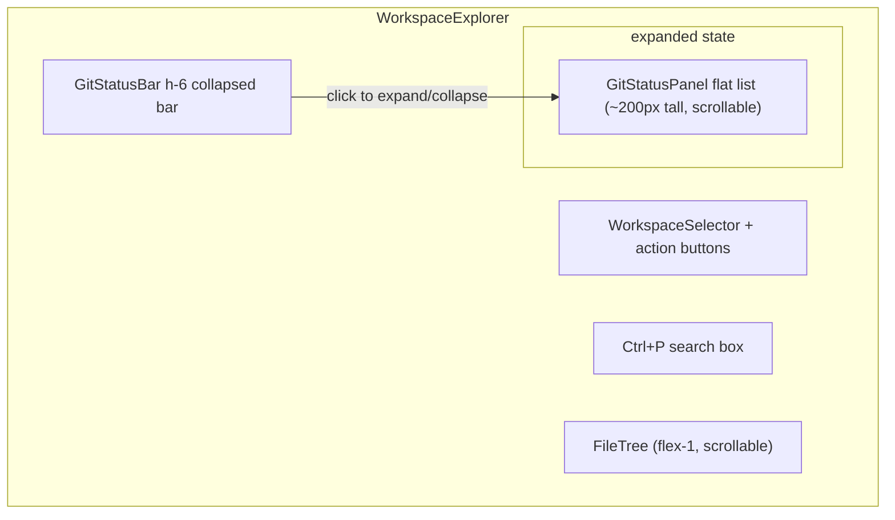
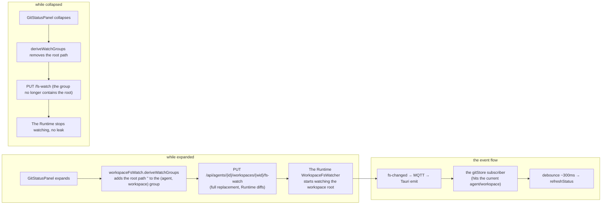

# ADR-078: Workspace Git Version Control Bar (Desktop Git Status Bar)

> **Chinese source of truth**: [ADR-078](../zh/ADR-078-git-status-bar.md)
> **Terminology**: see [GLOSSARY.md](./GLOSSARY.md)

**Status**: Draft (pending review)
**Date**: 2026-09-14
**Decision Makers**: 大鱼

**Prerequisites**:
- [ADR-009](./ADR-009-gateway-workspace-isolation.md) (§5 the Gateway boundary — workspace files (including .git) are agent-private data; reads and writes **may only go through the Runtime HTTP reverse proxy**; direct fs access on the Gateway side is forbidden)
- [ADR-033](./ADR-033-mqtt-replace-grpc-websocket.md) (Gateway HTTP reverse proxy Phase 2 — Desktop ──HTTP──▶ Gateway :19876 ──reverse proxy──▶ Runtime localhost HTTP, see the header note in [proxy.rs](../../../core/acowork-gateway/src/http/proxy.rs))
- [ADR-055](./ADR-055-remote-runtime-node-topology.md) (install_path is a node-local path — the Runtime holds the workspace physical path, so git operations must be executed by the Runtime for a multi-machine topology to hold)
- [ADR-058](./ADR-058-workspace-fs-watcher-mqtt-event.md) (Workspace fs changes are pushed via MQTT — the demand-driven subscription mechanism: the Runtime watcher only watches paths visible to the frontend; this ADR's refresh strategy reuses the same chain)
- [ADR-073](./ADR-073-agent-instance-identity-decomposition.md) (the AgentList collapsed grouping paradigm — the NodeGroupHeader visual spec is the style source of this ADR's collapsed bar)
- [ADR-024](./ADR-024-merge-metadata-into-index.md) (the file content rendering paradigm — opening files with Monaco + filetab is an existing path, and diff/log reuse it)

---

## 1. Decision Summary

### 1.1 In one sentence

**Add a "version control bar" at the bottom of WorkspaceExplorer (the right-hand workspace panel)**: it shows the git branch and change counts of the currently selected workspace, and clicking it expands/collapses (visually following the AgentList's NodeGroupHeader style); once expanded it shows the local uncommitted files from `git status` as a **flat list** (no directory grouping, row styles consistent with the worktree file list); the row context menu offers **Show Diff / Show Log / Open in Editor / Revert**. Show Diff uses a **Monaco DiffEditor with two panes** (HEAD ↔ worktree), Show Log uses read-only text, and both enter the filetab as **read-only virtual files**. Revert (restoring uncommitted changes) is the **only write operation** in the git API family — an in-row confirmation dialog + `POST /git/revert` (`git restore --source=HEAD`, untracked files are simply deleted). Git is executed in the **Runtime** (new `/git/*` HTTP APIs, reverse-proxied by the Gateway); status refresh **reuses the ADR-058 fs-watch demand-driven subscription** (subscribe when the panel expands, unsubscribe when it collapses). Apart from revert, v1 stays **read-only**: no stage / commit / push.

> **2026-XX revision**: the original decision mounted `GitStatusBar` at the bottom of `FileEditorPanel`, coupled to "opening a file" — a granularity mismatch (git is a workspace-level property, the editor is a file-level property), and "wanting to see git requires opening a file first" violates the principle of least surprise. Revised to mount at the bottom of `WorkspaceExplorer`, co-existing with the currently selected workspace and fully decoupled from the editor; it is hidden along with the workspace panel when that panel is collapsed. The orthogonality constraint on the expanded-state fs-watch rule still holds (see decision 8), but the trigger condition is relaxed from "the editor is open" to "the git panel is visible".

### 1.2 Key decision table (detailed reasons in §4)

| # | Decision | Conclusion |
|---|---|---|
| 1 | Where git is executed | **Runtime** (three new read-only APIs `/git/status` `/git/diff` `/git/log` + `POST /git/revert` as the only write API), with the Gateway reverse-proxying `/api/agents/{id}/git/*`; **not** on the Gateway side's fs (the ADR-009 / ADR-055 red line) |
| 2 | The git engine | **The system git CLI** (`git status --porcelain=v1 -z` / `git show HEAD:<path>` / `git log` / `git restore --staged --worktree --source=HEAD`), introducing no git2 / gix compile dependency; `std::process::Command` + `spawn_blocking` + a timeout + an output cap + **`GIT_OPTIONAL_LOCKS=0`** (genuinely read-only, **except for revert** — the write operation goes through `run_git_mut`, which skips that guard); an explicit error when git is missing |
| 3 | Repo root location and the security boundary | Discover the nearest `.git` by walking **at most 6 levels up** from the workspace root; **the displayed scope = workspace root ∩ the repo's change set** (status lists only changes inside the workspace, never exposing files outside it); the paths for diff/log reuse the existing canonicalize + `starts_with` anti-traversal guard |
| 4 | The Desktop data layer | A new `gitStore.ts` (modeled on [stores/fileTree/treeClient.ts](../../../apps/acowork-desktop/src/stores/fileTree/treeClient.ts): SWR cache + invalidation on agent/workspace switch + `with503Retry`), also subscribing to fs-changed events for auto refresh |
| 5 | The Desktop UI layout | `GitStatusBar` (at the bottom of `WorkspaceExplorer`, h-6, visually following NodeGroupHeader) + an expanded `GitStatusPanel` (a flat list, row styles following FileTreeNode) |
| 6 | How diff/log are presented | **Read-only virtual files in the filetab** (`OpenFile` gains `readonly` + `virtual` fields): diff uses a **Monaco DiffEditor with two panes** (original=HEAD / modified=worktree, both panes read-only), log uses a read-only single-pane Monaco; nothing is written to disk, no LSP, and they can be closed |
| 7 | The refresh strategy | **Demand-driven subscription of the ADR-058 fs-watch**: when the panel expands, add the workspace root path to the visible set (the Runtime watches the root directory); on collapse, remove it (stopping the watch); fs-changed → debounced refresh; a manual refresh button as a backstop |
| 8 | Scope trimming | v1 is **read-only**: no stage / unstage / commit / push / branch switching / blame / stash |

### 1.3 Invariants (must be satisfied)

1. **git operations are read-only**: the three APIs must not modify the worktree, .git, the index or refs (uniformly setting `GIT_OPTIONAL_LOCKS=0` to forbid git's optional locking sub-operations — the index stat-cache refresh of porcelain status and `git show` are both covered; no external diff tool is enabled).
2. **Paths never escape the workspace**: the path of every diff/log request must, after canonicalization, lie inside the workspace root (reusing the `resolve_within_static` guard); the status output is filtered by the workspace root prefix **on the Runtime side** before being returned.
3. **Absolute paths are never exposed**: the paths in the response are always relative to the workspace root (consistent with the worktree API convention); repo_root only returns `is_repo: bool`, never returning a node machine's absolute path.
4. **The Gateway does not touch fs**: all new capabilities land in the Runtime, and the Gateway only reverse-proxies (the ADR-009 red line is guarded by `run_gateway_fs_redline`).
5. **git unavailable / not a repo is never silent**: an explicit error state (`not_a_repo` / `git_unavailable`), with the UI showing the corresponding empty state — no silent degradation.
6. **The subscription is consistent with visibility**: the git panel subscribes to fs-watch **only while expanded**, and **must cancel on collapse** (reusing the workspaceFsWatch demand-driven mechanism, with no watch leak left behind).

---

## 2. Background and Motivation

### 2.1 The current state: the workspace is a "file black hole", git status is invisible

The Desktop already has complete worktree file browsing (`WorkspaceExplorer` → `GET /workspaces/tree`, with the Runtime holding the physical path), the Monaco editor + filetab (`FileEditorPanel` + `fileEditorStore`), and file change pushing based on a demand-driven fs-watch (ADR-058). But:

- Users treat the agent's workspace as a project directory (commonly: the workspace itself is a git repo, or a subdirectory of one), yet **they cannot see in the IDE "which files changed"**.
- To see a diff / log you must switch to an external terminal/IDE and type git commands, breaking the workflow.
- The worktree file list does not show git status badges (M / U / D), so users do not know which files are dirty.

### 2.2 Building blocks that already exist and can be reused

| Building block | Location | Reuse point |
|---|---|---|
| Gateway reverse proxy | `proxy_routes()` in [proxy.rs](../../../core/acowork-gateway/src/http/proxy.rs) | Add 3 `/api/agents/{id}/git/*` routes, forwarded to the Runtime's `/git/*` |
| The Runtime workspace service | [usecases/workspace_query_impl.rs](../../../core/acowork-runtime/src/usecases/workspace_query_impl.rs), `resolve_workspace_root` | The git service reuses the workspace root resolution and the path guard |
| The collapsed group header visuals | `NodeGroupHeader` in [AgentList.tsx](../../../apps/acowork-desktop/src/components/agent-list/AgentList.tsx#L838) (h-6 / ChevronRight rotate-90 / text-[10px] uppercase / border-y divider / hover colour change) | The style source of the GitStatusBar collapsed bar |
| The worktree file row style | [FileTreeNode.tsx](../../../apps/acowork-desktop/src/components/workspace/FileTree/FileTreeNode.tsx) (row height `fontSize×16×1.9`, `var(--ui-font-size)`, SetiIcon / getFileIcon) | The style source of the flat GitStatusPanel rows |
| Demand-driven fs-watch | [workspaceFsWatch.ts](../../../apps/acowork-desktop/src/lib/workspaceFsWatch.ts) (visible set derivation → `PUT /fs-watch`) + [workspaceFsEvents.ts](../../../apps/acowork-desktop/src/lib/workspaceFsEvents.ts) (the MQTT fs-changed bridge) | The subscribe switch and auto refresh for the GitStatusPanel expanding/collapsing |
| Opening a file read-only / with content | `fileEditorStore.openFileWithContent` | The virtual read-only files reuse it, but the `readonly` / `virtual` fields need to be extended |
| The context menu | `ContextMenu` (the same component as the tab context menu) | Reused by the GitStatusPanel rows |

### 2.3 Approaches already tried / rejected

- **Running git / reading .git on the Gateway side**: directly violates the ADR-009 red line — works on a single machine, inevitably 5xx on a multi-machine setup. This repeats the historical lesson of workspace file operations being migrated to the Runtime (the comment in proxy.rs: "ADR-009 v2: the Runtime is the authoritative workspace API owner"). **Rejected**.
- **Implementing git with git2's WASM / JS on the frontend**: introduces a large dependency and cannot reuse the Runtime's path boundary. **Rejected**.
- **Making version control a separate sidebar / full-screen view**: considered early on, but compared with the current "embedded in the workspace panel" it costs more to maintain one more top-level panel entry, and users have already accepted the "one bar at the bottom of the workspace panel" position. **Rejected**.
- **Mounting at the bottom of `FileEditorPanel`**: identified during the 2026-XX review as a granularity mismatch — git is a workspace-level property, the editor is a file-level property; "wanting to see git requires opening a file first" violates the principle of least surprise. **Revised to mount at the bottom of `WorkspaceExplorer`** (see decision 6).
- **Using a single-pane merged diff text for status**: considered as a lighter alternative to the DiffEditor, but the user asked for **two panes**; and the two panes need two **full texts** rather than a parsed diff text (reconstructing full text from a unified diff is unreliable), so the API directly returns two segments of content. **Two panes adopted.**

---

## 3. Goals

### 3.1 Functional requirements

1. A version control bar at the bottom of the workspace panel: showing the branch name + change counts (modified / untracked / staged / deleted), clicking to expand/collapse.
2. The expanded panel: flat-listing the local uncommitted files from `git status`, **without directory grouping**, row styles consistent with the worktree file list; each row carries a status badge (M / U / D / A / R) and a file icon.
3. Row click: open that file in Monaco + filetab (reusing `openFile`).
4. Row context menu: `Show Diff`, `Show Log`, `Open in Editor`, `Copy Path`.
5. Show Diff: a **DiffEditor with two panes** (HEAD ↔ worktree, both read-only) entering the filetab; Show Log: that file's commit history (read-only) entering the filetab.
6. The expand/collapse visuals and interaction follow the node collapse style of the AgentList on the left.
7. **Auto refresh**: when the panel expands it subscribes to fs-watch (the root path); on collapse it cancels — the same principle as the worktree (ADR-058 demand-driven); the refresh signal = an fs-changed on any visible path + a manual button; **external modifications in nested directories are not guaranteed to be covered** (the NonRecursive limitation, see decision 8).

### 3.2 Non-functional requirements

- **Security**: see the invariants in §1.3 (read-only, anti-traversal paths, scope filtering, no absolute path exposure).
- **Performance**: porcelain status takes <100ms; one request per expand/refresh; diff only for a single file (`git show` on a single path); the subscription is released immediately on collapse, with no idle background spinning.
- **Compatibility**: purely additive APIs and UI, independently rollback-able; path semantics consistent with the worktree API.
- **Observability**: a git invocation failure returns a structured error (logged on the Runtime side), and the UI shows an error state rather than a blank.

### 3.3 Explicitly out of scope (v1, YAGNI)

- stage / unstage / commit / push / pull / branch switching / stash / blame / clean.
- Embedding git status badges in the worktree file list (e.g. VSCode's gutter dot) — a possible later iteration; this ADR only builds the bottom version control bar.
- Per-line diff navigation / previous-next jumping / quick-fix enhancements (the DiffEditor's basic capability suffices).
- Dragging the expanded panel taller (v1 is fixed at ~200px).

---

## 4. Decisions

### Decision 1: where git is executed — the Runtime, following the ADR-033 reverse-proxy pattern

Three new Runtime read-only endpoints, reverse-proxied by the Gateway and exposed to the Desktop:

```
Desktop ──HTTP──▶ Gateway :19876
   GET /api/agents/{id}/git/status?workspace_id=…
   GET /api/agents/{id}/git/diff?workspace_id=…&path=…&cached=0|1
   GET /api/agents/{id}/git/log?workspace_id=…&path=…&limit=50
   POST /api/agents/{id}/git/revert   {workspace_id?, path, old_path?}
        │  reverse proxy (proxy_routes, forwarded to Runtime localhost)
        ▼
Runtime :random
   GET /git/status?workspace_id=…
   GET /git/diff?workspace_id=…&path=…&cached=0|1
   GET /git/log?workspace_id=…&path=…&limit=50
   POST /git/revert                  {workspace_id?, path, old_path?}
```

**Reasons**:
- Only the Runtime can resolve the workspace root (`resolve_workspace_root`, including `__agent_home__` and additional_dirs); git reads the same physical files, so same-source means same-layer.
- install_path is node-local (ADR-055); a Gateway-side fs read works on a single machine and inevitably 5xx across machines — workspace file operations were therefore migrated to the Runtime, and git should not repeat that mistake.
- It shares the same trust boundary and the same reverse-proxy code path as the existing `workspaces/tree` and `workspaces/search`, introducing no new mechanism.

**Implementation**: the Runtime adds `usecases/git_query.rs` + `git_query_impl.rs` (modeled on workspace_query), registering 3 routes in `http/server.rs`; the Gateway's `proxy.rs` adds 3 reverse proxies. The semantics of `workspace_id` are exactly consistent with the existing workspaces API (defaulting to `__agent_home__`).

### Decision 2: the git engine — the system git CLI (porcelain), no git2 / gix

**Comparison**:

| Option | Pros | Cons | Conclusion |
|---|---|---|---|
| A. The system git CLI | Zero compile dependencies; ignore/attributes/submodule behaviour is 100% consistent with the user's environment; the Runtime already has subprocess capability | Requires git installed at runtime; the output must be parsed | **Recommended** |
| B. gix (gitoxide) | Pure Rust, no system dependency, safe parsing | A new large dependency (the 13-crate workspace does not have it yet); incomplete coverage of LFS / some hook semantics | An alternative, deferred |
| C. git2 (libgit2) | Mature, friendly API | Requires a C library or a vendored build, a heavy build chain; behaviour may differ from the system git version | Rejected |

**Execution discipline** (key, for injection prevention / exception handling):
- `std::process::Command` + `spawn_blocking` (consistent with the cross-platform convention in [shell.rs](../../../core/acowork-runtime/src/tools/builtin/shell.rs#L267) — on Windows `tokio::process::Command`'s async named-pipe I/O has compatibility issues, so this codebase uniformly uses std + spawn_blocking for subprocesses), **with no shell string concatenation**; the repo root and paths are all passed via `Command::arg`; path arguments are protected by a `--` separator so that names starting with `-` are safe.
- The three commands uniformly set the environment variable **`GIT_OPTIONAL_LOCKS=0`** — forbidding git's optional locking sub-operations (`git status` performs an index stat-cache refresh, writing `.git/index` in the racy-git case; this environment variable makes it skip that), so that invariant 1 in §1.3 (genuinely read-only, no modification of .git/index/refs) holds literally, rather than relying on the implementation coincidence that "porcelain happens not to write".
- The command fixes `cwd = repo_root`; a uniform timeout (10s by default); a cap on stdout.
- The concrete commands:
  - status: `git status --porcelain=v1 -z --untracked-files=all --branch`
  - diff original (the HEAD version): `git show HEAD:<path>` (not available for untracked, see decision 4)
  - diff modified (the index version when staged): `git show :<path>`
  - log: `git log --no-ext-diff -n {limit} --pretty=format:%h%x1f%an%x1f%aI%x1f%s -- <path>`
  - type determination (untracked / binary / no_change): derived from the XY status of the porcelain status + `git diff --numstat` (`-` indicates binary).
- git missing (`git --version` fails) → `git_unavailable`; not a repo → `is_repo: false` (see decision 3).
- The `-z` output is parsed with NUL-separated fields: under v1 `-z` each entry is `XY <path>`, and a rename is `XY <old>\0<new>`; C-style quote escaping and Chinese/space paths must be handled correctly.

### Decision 3: repo root location and the security boundary

**Repo discovery**:
- Starting from the workspace root, walk upwards checking for `.git` (a directory, or a file — covering worktrees / submodules / `gitdir:` pointers), **at most 6 levels up** (including itself); the parent directory of the first `.git` found is the repo root.
- Not found → `is_repo: false`, and the UI shows a "not a Git repository" empty state (the version control bar can still expand, showing the notice without rendering a list).

**Scope filtering** (the core boundary decision, confirmed):
- git commands naturally operate on the whole repo, but **the change set returned to the UI by status must be ⊆ the workspace root**. The Runtime filters every path of the porcelain output through `strip_prefix(workspace_root)`, dropping changes outside the workspace.
- This covers two typical topologies:
  - the workspace is itself the repo root (most common);
  - the workspace is a subdirectory of a repo (e.g. this repository used as some agent's workspace) — in that case **only changes to files inside the workspace are shown**, and files from other directories of the repo are never exposed to that agent's UI.
- **Why repo root is not restricted to == workspace root**: users commonly place an agent workspace in a subdirectory of a project repo; rigidly requiring the workspace to be its own repo would break that scenario. The filtering approach costs only one extra prefix check at implementation time, and the benefit exceeds the cost.

**Path protection (diff/log)**:
- Reuse `resolve_within_static`'s canonicalize + `starts_with(canonical_root)` check ([workspace_mutation_impl.rs](../../../core/acowork-runtime/src/usecases/workspace_mutation_impl.rs)); `../`, absolute paths and symlink escapes are all rejected.
- The requested path is relative to the workspace root. **The path passed to git is repo-root-relative**, and the conversion chain is fixed as:
  `workspace-relative → workspace_root.join → canonicalize + starts_with check → strip the repo_root prefix → repo-root-relative`
- When workspace == repo root the two bases coincide (the most common path, "accidentally correct" during implementation); when workspace ⊂ repo the **strip must use repo_root rather than workspace_root** — otherwise `git show HEAD:<path>` / `git log -- <path>` reports "does not exist in HEAD" / "no such path". This is the most easily mis-implemented bug in this ADR, and it only surfaces in the subdirectory scenario; §7.1 must have dedicated cases for it (see the 2026-09-14 review revision).

### Decision 4: the Runtime HTTP API

**`GET /git/status?workspace_id=…`**
```json
200 {
  "is_repo": true,
  "branch": "develop",
  "error": null,                          // "not_a_repo" | "git_unavailable" | null
  "truncated": false,                     // true when the porcelain output exceeded the cap and was truncated
  "changes": [
    { "path": "src/lib/foo.ts",           // relative to the workspace root, consistent with the worktree relPath
      "oldPath": null,                    // the old path when index/worktree == renamed (relative to the workspace root), otherwise null
      "index":  "modified",               // added|modified|deleted|renamed|unmodified
      "worktree": "modified",             // modified|deleted|untracked|unmodified
      "staged": true }                    // index != unmodified
  ]
}
```
- The two `index` / `worktree` columns map from porcelain XY (X=index, Y=worktree), reserving the state model for a future stage/commit (decision 9).
- **`oldPath` is the exit of the renamed state for diff/UI**: a rename entry in porcelain `-z` is the dual-path form `XY <old>\0<new>`, and when parsing, old must be stored into `oldPath` (relative to the workspace root, with the same filtering rule as path), otherwise Show Diff cannot obtain `git show HEAD:<oldPath>` (HEAD only has the old path).
- Change ordering: staged first, then grouped and sorted by M / U / D / A / R (fixed in v1, no user sorting).
- **Output cap**: the porcelain output has a byte/entry cap (recommend 1 MiB or 5000 entries, whichever comes first), and on exceeding, `truncated: true` is set and changes are truncated (`--untracked-files=all` can explode in volume on large non-ignored directories, so a cap is mandatory).

**`GET /git/diff?workspace_id=…&path=…&cached=0|1`** — returns two **full texts** for the DiffEditor's two panes:
```json
200 {
  "kind": "modified" | "untracked" | "deleted" | "binary" | "no_change",
  "original": "…",      // the HEAD full text; "" for untracked; the HEAD full text for deleted; for staged(cached=1) this field is HEAD, modified is the index
  "modified": "…"       // the worktree full text; "" for deleted; for cached=1 the index full text from git show :<path>
}
```
- cached=0 (the default, Show Diff): original = `git show HEAD:<path>` (**for a renamed file it is `git show HEAD:<oldPath>`**), modified = the worktree file content (reusing the Runtime's existing `/workspaces/file` read logic, guaranteeing consistency with the worktree).
- cached=1 (Staged Diff, reserved): original = HEAD, modified = `git show :<path>` (the index).
- untracked: `original=""`, `modified=the file content` (the DiffEditor shows a full addition); **deleted: `original=the HEAD full text`, `modified=""`** (the DiffEditor shows a full deletion; clicking a deleted file row in the UI redirects to Show Diff, see decision 6); binary: `kind="binary"` returns no content (the DiffEditor shows a placeholder); no difference → `kind="no_change"`.
- Large file cap: a file > 2 MiB (either original or modified) → `kind="binary"` placeholder (consistent with the search bailout convention, avoiding `git show` on a huge blob / LFS stalling; adopted at the 2026-09-14 review).
- The reason for rejecting the `git diff` text approach: the DiffEditor needs two full texts, and reconstructing them from a unified diff is unreliable (worse with merge conflicts / no context), so returning two content segments directly is the most robust.

**`GET /git/log?workspace_id=…&path=…&limit=50`**
```json
200 { "commits": [ { "hash": "…", "short_hash": "…", "author": "…", "date": "…", "subject": "…" } ] }
```
- The `limit` caps at 200 (default 50, truncated to 200 when above); the `path` uses the same repo-root-relative conversion chain as diff.

All response paths are relative to the workspace root (invariant 3).

### Decision 5: the Gateway reverse proxy + the Desktop data layer (gitStore)

- `proxy.rs` adds 3 reverse proxies (the same handler style as `workspaces/tree`, forwarding the query verbatim).
- The Desktop adds `stores/gitStore.ts`: modeled on [stores/fileTree/treeClient.ts](../../../apps/acowork-desktop/src/stores/fileTree/treeClient.ts) — SWR cache + de-duplication + `with503Retry`; `fetchStatus(agentId, workspaceId)`, `fetchDiff(...)`, `fetchLog(...)`; `invalidate(agentId, workspaceId)` (cleared when switching agent/workspace); `refresh()` forces a direct fetch. An fs-changed event handler is also registered (see decision 7).

### Decision 6: the UI — GitStatusBar + GitStatusPanel

**The layout** (at the bottom of the `WorkspaceExplorer` root container, below the file tree):



**The derivation source**: `(agentId, workspaceId)` comes from the current workspace of the current session of the currently selected agent — the same source as `FileTree` (the `currentWorkspaceId` already present at lines 59-64 of `WorkspaceExplorer`), **independent of** whether a file is open. `__agent_home__` (the virtual home directory, with no repo context) is skipped. When the workspace panel is collapsed (`rightPanelCollapsed` or when switching to a non-workspace tab) the whole component disappears with its parent container, and **no separate escape location is provided** (consistent with the trade-off of "not even the branch name is visible when the right column is hidden"; the user actively chooses this layout).

- **GitStatusBar**: the visual spec **follows NodeGroupHeader** (`NodeGroupHeader` in [AgentList.tsx](../../../apps/acowork-desktop/src/components/agent-list/AgentList.tsx#L838)): `h-6`, `text-[10px] font-medium uppercase tracking-wide`, `zinc-400/zinc-500`, `border-y border-nav-divider/40`, hover colour change, and the ChevronRight rotating `rotate-90` when expanded. On the left a Git icon + the branch name + a change count pill (`M×n U×m D×k`), on the right a refresh button (RefreshCw). When there is no repo / git is missing, the corresponding copy is shown.
- **GitStatusPanel**: a **flat list, with no directory grouping**; row styles follow FileTreeNode: row height `fontSize×16×1.9` (identical `estimateSize` for virtual scrolling), `var(--ui-font-size)`, a SetiIcon/getFileIcon file icon, the file name + a status badge on the right (M yellow / U green / D red / A cyan, following the VSCode convention colours). The virtual list reuses `@tanstack/react-virtual` (the same as the worktree).
- Row click → `fileEditorStore.openFile(agentId, workspaceId, path)`; **clicking a row whose worktree == "deleted" redirects to Show Diff** (openFile necessarily 404s on a deleted file, so give the user the HEAD↔empty deletion view directly); row right-click → `ContextMenu` (the same component as the tab context menu), with the items Show Diff / Show Log / Open in Editor / Copy Path (the deleted file hides "Open in Editor").
- The collapsed state is held by `gitStore` grouped by `(agent, workspace)`; when switching agent/workspace the old group naturally becomes inactive, and the component's `useEffect` explicitly collapses and clears `expandedKey` (**invariant 6**: subscription == visibility), with the fs-watch cancelled in sync.

### Decision 7: diff / log enter the filetab as read-only virtual files (diff uses a two-pane DiffEditor)

- `fileEditorStore.OpenFile` gains optional fields:
  - `readonly?: boolean` — Monaco sets `readOnly: true`, and the save button is hidden/disabled;
  - `virtual?: { kind: "diff" | "log"; basePath: string; original?: string; modified?: string }` — marking it as not written to disk, not part of the worktree, and not connected to LSP.
- The file id convention is `${agentId}:git:diff:<workspaceId>:<path>` / `${agentId}:git:log:<workspaceId>:<path>`; **it must contain agentId** (consistent with the `OpenFile.id` convention of `${agentId}:${workspaceId}:${relPath}` — when two agents share an `__agent_home__` workspace, omitting agentId causes tab collisions), guaranteeing that tabs are unique and switchable.
- **The diff rendering branch**: `FileEditorPanel` renders a **Monaco `<DiffEditor original={original} modified={modified}>`** for `virtual.kind === "diff"` (both panes read-only), with original coming from `/git/diff.original` and modified from `/git/diff.modified`; the file icon is FileDiff. untracked (empty original) and binary (placeholder) are special-cased inside this branch.
- **The log rendering branch**: `virtual.kind === "log"` renders a read-only single-pane Monaco (plaintext, title `log: <path>`).
- The open path: first `gitStore.fetchDiff/fetchLog` to get the data, then `openFileWithContent(agentId, workspaceId, <virtualId>, <content>, <language>)` and write in original (for diff).
- Released on close: go through the existing `registerFileDisposer` mechanism to release the Monaco model/editor (a virtual file has no LSP, and the disposer only releases the model, so it is naturally compatible).
- Not written to disk: a virtual file does not enter `saveFile`, does not participate in the dirty count, and does not trigger fs-watch reporting (a virtual file contributes no watch path).

### Decision 8: the refresh strategy — demand-driven subscription of the ADR-058 fs-watch (confirmed)

**Reusing the worktree's very same subscription mechanism**, with semantics exactly consistent with "the worktree watches a directory only while it is expanded, and cancels on collapse":



- **Subscribe only while expanded**: when `GitStatusPanel` expands, `workspaceFsWatch.deriveWatchGroups()` gains a derivation rule — if the git panel of the current (agent, workspace) is expanded, add the root path `""` to that group (when the worktree itself is visible the root path is already contained, so de-duplication suffices).
  **Rule placement**: this derivation rule **must be placed outside** the workspace panel visibility guard (`activePanelTab === "workspace" && !rightPanelCollapsed`) — GitStatusPanel and the worktree's **directory expansion** visibility are orthogonal (when "the file tree root is collapsed but the git panel is expanded" the root path must still be subscribed). After the decision 6 revision this constraint still holds; only the trigger condition is relaxed from "the editor is open" to "the git panel is visible", and the implementation path moves from FileEditorPanel to WorkspaceExplorer.
- **Cancel on collapse**: when collapsed, the rule no longer contributes the root path; after the `PUT /fs-watch` is reported the Runtime stops watching — the same mechanism as the worktree's "collapsing a directory cancels the watch", with no leak (invariant 6).
- **Auto refresh (the true coverage)**: gitStore registers a `workspaceFsEvents` fs-changed handler; an event hitting **any visible path** of the current (agent, workspace) triggers `refreshStatus()` after debouncing.
  **Note: the Runtime fs-watcher is NonRecursive level-by-level watching** ([fs_watcher.rs](../../../core/acowork-runtime/src/workspace/fs_watcher.rs) — open tabs are watched per file, expanded directories one level at a time), so adding the root path `""` to the visible set only watches the **top level** of the workspace. Therefore the actual sources of the refresh signal are "an open tab saving / a change in an expanded file tree directory / a change in a top-level entry"; any visible event triggers a **full** status refresh (every refresh is a full status, so one event flattens all the state).
  **External modifications in nested directories are not promised to be covered**: a nested path such as `src/lib/foo.ts`, if its parent directory is not expanded in the file tree and the file is not open in a tab, has **no** event generated for its external modification (the NonRecursive limitation). v1 explicitly does not do recursive watching; this gap is backstopped by the manual refresh (corrected at the 2026-09-14 review).
- **The manual refresh backstop**: the RefreshCw button is retained — covering the scenarios not covered above (a terminal commit / stage only changing files inside `.git`, external modifications in nested directories). An attached verification item: when workspace == repo root and the root path is watched, a terminal `git add`/`commit` rewriting `.git/index` changes the mtime of `.git`, and notify may report it as a `.git` Modified event (platform-dependent) — **verify during implementation; if reachable it is a free enhancement, and it is not depended upon**.
- While expanded, a refresh only partially updates the changes array and does not rebuild the list scroll position.

### Decision 9: scope trimming — v1 is read-only, but the interface shape is reserved for the future

- Explicitly not done: stage / unstage / commit / push / pull / branch switching / stash / blame / clean.
- Reserved: the porcelain XY two-column state model already fully carries index (staged) information; `/git/diff?cached=1` already defines the Staged Diff semantics, so when `POST /git/stage` and `POST /git/commit` are added in the future there is no need to change the status/diff data structures — only new write endpoints, which undergo a separate security review (a write operation involves worktree and .git changes).
- **2026-XX revision (Revert)**: the user explicitly asked for "restoring uncommitted changes", so the sole write endpoint `POST /git/revert` was landed. Semantics and safety constraints: only a single-file path is accepted (an empty path returns 400 directly, preventing `git restore -- .` from wiping the whole worktree); the path reuses the canonicalize + `starts_with` anti-traversal of diff/log; the client (the GitStatusPanel context menu) gates it behind a destructive confirmation dialog; `git restore --source=HEAD` also removes index-only paths (a staged addition / a rename's new path) from index+worktree, so a rename row first restores `oldPath` and then handles the new path, while untracked simply deletes the file.

---

## 5. Consequences

### 5.1 Positive

- The workspace changes from a "file black hole" into a visible version control state; the diff (two panes) / log form a visual closed loop (switchable and closable in the filetab).
- Everything reuses existing building blocks: the reverse proxy, the workspace root resolution, path protection, the collapsed header style, the worktree row style, ContextMenu, filetab/Monaco, the SWR store paradigm, and **ADR-058's demand-driven subscription** — no new mechanism.
- Auto refresh is visibility-driven: subscribing on expand and releasing on collapse, with no idle background spinning; the security boundary is crisp (read-only + scope filtering + anti-traversal + no absolute path exposure), with no new trust surface.

### 5.2 Negative / cost

- Each status/diff/log adds one git subprocess invocation on the Runtime (a hundred-millisecond order, acceptable); a porcelain `-z` parser must be maintained (including escaping / rename / Chinese paths).
- A runtime assumption of "git is installed on the system" is introduced; when git is missing the feature is unavailable (an explicit error state, never silent).
- The DiffEditor's two panes need the original/modified full texts (`git show HEAD:<path>` may be slow for very large / LFS files), and a virtual read-only file is a new form of the filetab/OpenFile model, requiring the read-only semantics to be confirmed in multiple places in the store and UI.

### 5.3 Boundaries / exceptions

- A workspace that is not a repo → expanding shows a "not a Git repository" empty state; git missing → an error state + guidance.
- Diff of an untracked file: original is an empty string and the DiffEditor shows a full addition; **for a deleted file: original is the HEAD full text and modified is an empty string, showing a full deletion, and clicking the row redirects to Show Diff** (decision 6).
- When the workspace is a subdirectory of a repo, only changes inside the workspace are shown (the scope filtering in decision 3, confirmed); the paths for diff/log are passed to git via the repo-root-relative conversion chain (decision 3).
- A terminal commit / stage (only changing `.git`) and **external modifications in nested directories** are not guaranteed to trigger fs-watch → relying on the manual refresh backstop (decision 8); when workspace == repo root the `.git` mtime event is an attached verification item, not a dependency.

### 5.4 Rollback

- Purely additive and independently rollback-able: the Runtime's three read-only routes, the Gateway's three reverse proxies, and the Desktop components and store can all be removed independently; removing `GitStatusBar` rolls back the UI, and the APIs can be retained temporarily without affecting any existing path.
- The change to `workspaceFsWatch.ts` is "adding one derivation rule"; after removal the worktree subscription behaviour is fully restored. There is no schema change, no migration and no impact on stored data.

### 5.5 Known technical debt

- The porcelain `-z` parser must cover: quote escaping, rename dual paths, Chinese / emoji / space paths, and submodule entries (the 160000 mode).
- The DiffEditor's four special-case renderings (untracked / deleted / binary / no_change) are fine-grained and need dedicated testing; very large files (LFS) are not performance-optimized (v1 uses the >2 MiB → binary placeholder as a backstop).
- The expanded panel height is fixed at ~200px in v1, with no drag-to-resize (listed as a follow-up).

---

## 6. Change List (by crate / file)

| Layer | File | Change |
|---|---|---|
| core/acowork-runtime | `src/http/server.rs` | Register the three routes `GET /git/status|diff|log` + `POST /git/revert` |
| core/acowork-runtime | `src/usecases/git_query.rs` / `git_query_impl.rs` | New: repo discovery, porcelain `-z` parsing, scope filtering, diff original/modified assembly, log (layered like workspace_query), revert (the only write operation) |
| core/acowork-runtime | `src/usecases/mod.rs` | Export git_query |
| core/acowork-gateway | `src/http/proxy.rs` | Add 4 `/api/agents/{id}/git/*` reverse proxies (status/diff/log/revert, with revert being a POST that passes the body through) |
| apps/acowork-desktop | `src/stores/gitStore.ts` | New SWR store (status/diff/log/revert + invalidate/refresh) + the fs-changed subscriber |
| apps/acowork-desktop | `src/lib/workspaceFsWatch.ts` | `deriveWatchGroups` gains a "git panel expanded → add the root path '' to the group" derivation rule (**placed outside the workspace panel visibility guard**, decision 8) |
| apps/acowork-desktop | `src/lib/workspaceFsEvents.ts` | Expose a registrable fs-changed handler (gitStore subscribes, debounced refresh) |
| apps/acowork-desktop | `src/components/workspace/git/GitStatusBar.tsx` | The collapsed bar at the bottom of the workspace panel (visually following NodeGroupHeader) |
| apps/acowork-desktop | `src/components/workspace/git/GitStatusPanel.tsx` | The flat list (row styles following FileTreeNode) + the context menu (including Revert + the destructive confirmation dialog) + the expand/collapse subscription switch |
| apps/acowork-desktop | `src/components/workspace/WorkspaceExplorer.tsx` | Mount GitStatusBar/GitStatusPanel; the derivation source = the currently selected workspace (the same source as FileTree); `virtual.kind === "diff"` still rendered as a DiffEditor by `FileEditorPanel` (the virtual file lifecycle belongs to the editor) |
| apps/acowork-desktop | `src/stores/fileEditorStore.ts` | `OpenFile` gains `readonly?` / `virtual?`; the save/dirty logic short-circuits for virtual files |
| apps/acowork-desktop | `src/i18n/locales/{zh,en}.json` | The `git.*` entries |
| dev/ci.sh | — | No new red line needed (the Gateway fs red line is not touched) |

---

## 7. Test Strategy

### 7.1 Unit tests

- **The porcelain parser**: space / Chinese / quoted paths, rename dual paths (old/new each in place → oldPath), `??` untracked, `MM` dual state, submodule entries, skipping the `##` branch header line.
- **Repo discovery**: the workspace is the repo root; the workspace is a subdirectory walking up 1~N levels; a `.git` file (worktree/submodule); more than 6 levels returns not-a-repo.
- **Scope filtering**: when the repo root is outside the workspace only workspace-internal changes are returned; the path prefix boundary (`a/b` vs `a/bc` is not filtered by mistake); **the rename's oldPath also passes through the filter**.
- **Diff assembly**: the six kinds modified / untracked (empty original) / **deleted (empty modified)** / **renamed (original taken from HEAD:<oldPath>)** / binary / no_change; the staged semantics of cached=1; **> 2 MiB → binary placeholder**.
- **Path protection + coordinate conversion**: `../`, absolute paths and symlink escapes are rejected; **when workspace ⊂ repo the diff/log path is converted to repo-root-relative before being passed to git (strip uses repo_root rather than workspace_root)**.
- **The read-only guarantee**: status/diff/log all set `GIT_OPTIONAL_LOCKS=0`; the mtime and content of `.git/index` are unchanged before and after running status (guarding against a racy-write regression).

### 7.2 Integration tests (e2e)

- Create a repo with `git init` in a temp directory (containing a tracked change, staged, untracked, rename, deleted), start the Runtime and call `/git/status|diff|log`, asserting the JSON/text; the Gateway reverse-proxy path `GET /api/agents/{id}/git/status` is reachable.
- **The workspace ⊂ repo scenario**: the repo root is the outer directory and the workspace is a subdirectory — status only returns changes inside the workspace, and diff/log return correctly with a repo-root-relative path.
- A non-repo workspace → `is_repo: false`; removing `git` from PATH (mocked in the test environment) → `git_unavailable`.
- The subscription chain: expanding → `PUT /fs-watch` includes the root path; collapsing → the root path disappears after reporting; simulating fs-changed (a visible path) → gitStore updates the status after debouncing.

### 7.3 Desktop component tests

- GitStatusBar expand/collapse (chevron rotate, the panel appearing), the count pill rendering; the GitStatusPanel flat rows, status badges, row click opening a file (**a deleted row clicking → Show Diff**), the context menu items (hiding "Open in Editor" for deleted).
- Virtual files: a diff tab rendering a two-pane DiffEditor (original/modified each in place), the untracked/deleted/binary special cases; a log tab as a read-only single pane; a readOnly model, release on close, no save triggered, and contributing no fs-watch path.
- **Subscription orthogonality**: when the worktree panel is collapsed but the git panel is expanded, `PUT /fs-watch` still contains the root path (the derivation rule is outside the visibility guard).

### 7.4 Security tests (a manual checklist)

- diff/log reject `../`, absolute paths and `--` prefix attacks; status never returns files outside the workspace; the response has no absolute path fields.
- After collapsing there is no watch leak (asserting the Runtime-side fs-watch set is empty / does not contain the root).

---

## 8. Implementation Milestones (suggested)

- **M1**: the Runtime `git_query` + the three APIs (diff returning both original/modified full texts) + unit tests (porcelain parsing including the rename oldPath, repo discovery, scope filtering, path protection and the **repo-root-relative conversion**, the six diff kinds including deleted/renamed, and the **`GIT_OPTIONAL_LOCKS=0` read-only assertion**).
- **M2**: the Gateway reverse proxy + `gitStore` + the GitStatusBar/GitStatusPanel basics (expand/collapse, the flat list, row click opening a file, **a deleted row clicking redirecting to Show Diff**) + **fs-changed subscription (subscribe on expand / cancel on collapse; accepted against the true coverage: a visible path event drives a full refresh, and the subscription persists when the worktree panel is collapsed)**.
- **M3**: the context menu Show Diff / Show Log + `OpenFile.readonly/virtual` support + **two-pane DiffEditor rendering** + a read-only single-pane log entering the filetab.
- **M4**: i18n + empty state / error state polish + wrapping up e2e and the security checklist.

Each step can be merged and rolled back independently; M1 does not depend on M2~M4.

---

## 9. Open Questions (please focus on these during review)

1. **The staged semantics of diff**: the v1 menu only has a single "Show Diff" (working ↔ HEAD); do staged files also need a "Show Staged Diff" (index ↔ HEAD, with `cached=1` already in place)? (Recommendation: a single item in v1)
2. **Auto refresh for a terminal commit / stage**: the part of the state that `git status` cares about only changes files inside `.git`, which may not be covered by fs-watch (what is watched is the workspace root path) — **decided: v1 does not additionally add `.git` to the watch** (the performance / event-noise concern holds), with the manual refresh as a backstop; during implementation, verify whether "when workspace == repo root and the root path is watched NonRecursively, a `.git/index` rewrite produces a `.git` Modified event" (platform-dependent); if reachable it is a free enhancement (decision 8).
3. **Are the four DiffEditor special-case renderings (untracked / deleted / binary / no_change) sufficient?** (untracked = full addition, deleted = full deletion, binary = placeholder — deleted was added at the 2026-09-14 review)
4. **Is the repo discovery cap of 6 levels reasonable?** When the workspace is very deep, does searching upward risk hitting an outer repo (scope filtering already guarantees no outer files are exposed, but is the "misjudged as a repo" semantics acceptable)?
5. **Branch display**: the `##` header of `git status --porcelain=v1 --branch` **already contains** ahead/behind (`## main...origin/main [ahead 1, behind 2]`), so displaying the count **needs no second command** — it is just one more line to parse (the 2026-09-14 review corrected the premise); v1 still recommends showing only the branch name, leaving ahead/behind for later.
6. **DiffEditor with very large / LFS files**: **adopted** — if either original or modified is > 2 MiB, return `kind="binary"` as a placeholder (decision 4), consistent with the search bailout convention.
