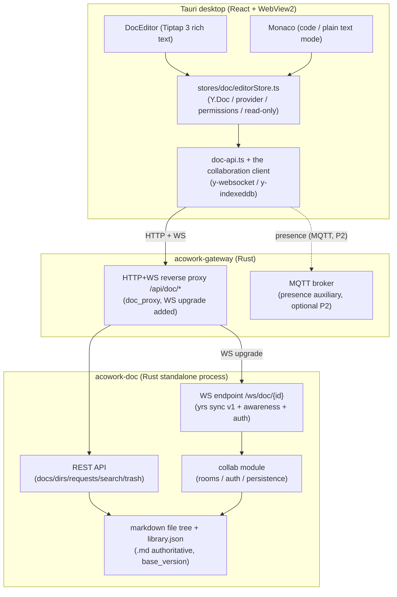
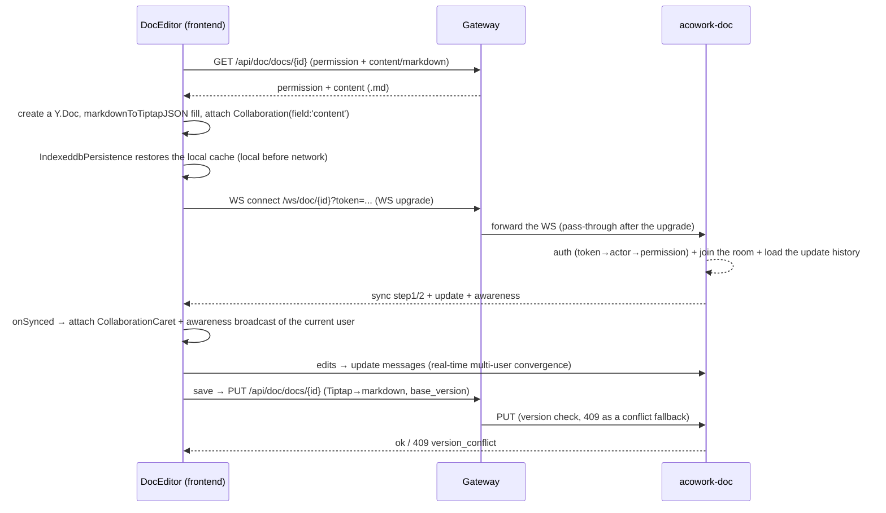

# ADR-079: Real-Time Collaborative Document Editing (Tiptap + Yjs) Technical Plan

> **Chinese source of truth**: [ADR-079](../zh/ADR-079-doc-realtime-collab-tiptap-yjs.md)
> **Terminology**: see [GLOSSARY.md](./GLOSSARY.md)

## Status

Proposed (P1 starts after ADR-076 lands)

## Date

2026-10-16

## Decision Makers

大鱼 (Dayu)

## Predecessors

ADR-033 (MQTT replacing gRPC/WebSocket), ADR-034 (the MQTT-HTTP boundary), ADR-064 (the pm
standalone-process pattern), **ADR-076 (multi-user accounts — a hard dependency: the P1 real-time
collaboration gate comes after ADR-076 lands)**

**External reference project**: DocFlow (`D:\projects\tranxon\DocFlow`, open source, Tiptap 3 + Yjs
+ Hocuspocus + Next.js)

**Blast radius**:

- `core/acowork-doc/Cargo.toml` (new `yrs`, axum WebSocket deps)
- `core/acowork-doc/src/server.rs` (a new Yjs WebSocket endpoint `/ws/doc/{doc_id}`)
- `core/acowork-doc/src/` (a new collab module: room management, auth, awareness, persistence)
- `core/acowork-gateway/src/http/doc_proxy.rs` / `routes.rs` (add WebSocket upgrade to the transparent
  reverse proxy, or add a new WS route)
- `core/acowork-gateway/src/mqtt/` (optional: awareness / online status over the existing MQTT channel)
- `apps/acowork-desktop/package.json` (new `@tiptap/*`, `yjs`, `y-websocket`, `y-indexeddb`)
- `apps/acowork-desktop/src/views/doc/DocEditor.tsx` (edit modes: Monaco ↔ Tiptap)
- `apps/acowork-desktop/src/stores/doc/editorStore.ts` (Y.Doc / provider / permissions /
  read-only lifecycle)
- `apps/acowork-desktop/src/lib/doc-api.ts` / `doc-types.ts` (collaboration types + WS client)
- `apps/acowork-desktop/src/components/doc/editor/*` (new: the Tiptap extension set, menus,
  collaboration hooks, snapshots)
- `apps/acowork-desktop/src/i18n/locales/*.json` (i18n keys)

---

## 1. Background and Goals

### 1.1 The business request

ACowork's existing document feature (`core/acowork-doc` + `apps/acowork-desktop`) is a **single
editor + review flow**: Monaco edits markdown, HTTP PUT + `base_version` optimistic concurrency,
and the agent submits changes through a PR-style `UpdateRequest`. What is missing:

- Multi-user real-time collaborative editing (today it is "write-then-conflict, refresh manually")
- Real-time cursors / online presence
- A rich-text (WYSIWYG) editing experience
- Local-first / offline caching

Users want to land real-time collaboration following DocFlow's Tiptap + Yjs implementation, but on
this project's **Rust backend + Tauri frontend** stack.

### 1.2 Goals

1. **Frontend**: bring in the Tiptap 3 rich-text editor, aligned with DocFlow's editing experience
   and extension system.
2. **Collaboration**: Yjs CRDT multi-user real-time editing with real-time cursors, online presence,
   offline caching, and reconnect sync.
3. **Backend**: stay pure-Rust full-stack (**no Node.js Hocuspocus sidecar**); the `acowork-doc`
   process hosts the Yjs service.
4. **Compatibility**: do not break the existing `.md` file storage, the `base_version` number, the PR
   review flow, search, or the MCP tools.
5. **Rollback**: evolve in phases; any phase can fall back to Monaco + the existing save chain.

### 1.3 The dependency on ADR-076 (multi-user accounts)

Both the "people" and the "permissions" of real-time collaboration come from the multi-user identity,
so **P1 onward depends hard on ADR-076**:

| Collaboration capability | Which part of ADR-076 it depends on | Explanation |
|-------------------------|---------------------------------------|-------------|
| Online users / real-time cursor attribution | `UserAccount` + the token payload (`user_id` + `role`) | what awareness broadcasts must be the real `user_id`, otherwise "who is who" in multi-user collaboration does not hold; today there is only a single `human` actor |
| WS auth | Phase 2 `/api/auth/*` + the token middleware → `AuthContext` | the y-websocket connection carries an access_token; the server resolves it to a `user_id` and then looks up the document permission |
| Collaboration permission (editable / read-only) | Decision #10: the REST proxy's hardcoded `X-Actor` = `"human"` changes to `AuthContext.effective_user_id` | acowork-doc's permissions and audit are actor-based, so collaborative reads/writes must land on a real user |
| Distinguishing admin / collaborator roles | the admin role + the `as_user` view | readers (VIEW/COMMENT) and editors (EDIT) are handled by role inside the collaboration session |

**Conclusion**: the order is **P0 first (no multi-user dependency, can run in parallel with
ADR-076) → ADR-076 lands → P1/P2/P3**. P0's editor replacement, markdown round-trip conversion, and
save chain are complete and deliverable under the single `human` actor; multi-user real-time
collaboration (P1) is **gated on ADR-076's Phases 1-4 (accounts + tokens + proxy injection)**, to
avoid implementing collaboration identity logic twice on a single identity.

---

## 2. Current-State Analysis

### 2.1 ACoworkDev (the target system)

| Layer | Current state | Key files |
|-------|---------------|-----------|
| Document storage | a filesystem directory tree + a `library.json` per directory; documents are **.md text files** (UTF-8) | `core/acowork-doc/src/store/`, `service/document_impl.rs` (`write_content` writes .md) |
| Version concurrency | `DocMeta.version: u64`; an update must carry `base_version`, a mismatch → 409 `version_conflict` | `core/acowork-doc/src/types.rs`, `service/document_impl.rs` |
| Review flow | `UpdateRequest` (pending → approved / rejected / expired); approve merges and does `version+1` | `service/request_impl.rs`, `api/requests.rs` |
| Service form | a standalone process (ADR-064 pattern), axum, transparently reverse-proxied by the Gateway at `/api/doc/*` | `core/acowork-doc/src/server.rs`, `core/acowork-gateway/src/http/doc_proxy.rs` |
| Frontend editor | Monaco editing markdown + DocMarkdownView preview + MarkdownToolbar | `apps/acowork-desktop/src/views/doc/DocEditor.tsx` |
| Frontend stack | React 19 + Vite + Zustand + Tailwind v4 + i18next (**no Tiptap/Yjs**) | `apps/acowork-desktop/package.json` |
| Message channel | the Gateway's built-in MQTT broker (ADR-033/034/035/036/039/042); the proxy is a transparent HTTP proxy (no WS upgrade) | `core/acowork-gateway/src/http/proxy.rs` |
| Agent writing docs | MCP tools / HTTP submit `UpdateRequest` → review; `X-Actor` (human / agent:xxx) injected by the Gateway | `core/acowork-doc/src/mcp/` |

Key point: **the backend does not touch rich-text semantics** — the document content is
unstructured markdown text to it; the review flow / search / recycle bin are all based on the .md
content and the version.

### 2.2 DocFlow (the reference project)

DocFlow is an open-source online document product: Next.js (NestJS + Prisma backend) + Tiptap 3 +
Yjs + Hocuspocus.

| Module | Implementation | Reference file (DocFlow repo) |
|--------|---------------|-------------------------------|
| Editor init | `useEditor` + `ExtensionKit({provider})` + `Collaboration.configure({document: doc, field: 'content'})` + `CollaborationCaret` | `apps/DocFlow/src/app/docs/[room]/page.tsx` |
| Extension set | StarterKit, Heading, TaskList/TaskItem, CodeBlock, TableKit, Math, Emoji, Mention, Image(Block/Upload), SlashCommand, SearchAndReplace, Placeholder, TrailingNode, UniqueID, Details, Link, Highlight, FontSize/FontFamily/Color … 40+ | `apps/DocFlow/src/extensions/extension-kit.ts` |
| Collaboration bootstrap | an HTTP permission endpoint → create `Y.Doc` → `IndexeddbPersistence` restores local first → then connect `HocuspocusProvider` (WS, token) → after `onSynced` attach the collaboration extensions | `useDocumentPermission.ts`, `useCollaboration.ts` |
| Permission / read-only | an HTTP permission fallback (VIEW/COMMENT = read-only) + a WS `server:permission` stateless message | `useCollaboration.ts` |
| Online users | `provider.awareness.setLocalStateField('user', ...)` + aggregation on `on('update')` | same |
| Snapshot / history | `Y.snapshot` / `encodeSnapshot` / `decodeSnapshot` + `createDocFromSnapshot`, stored in the browser's IndexedDB; auto-snapshot every 5 min + on unload; a state-vector hash detects content change | `services/snapshot/index.ts`, `hooks/useEditorHistory.ts` |
| AI editing | SSE streaming (intent → anchor → proposal) + an `agentSuggestion` mark (track-changes style) → the user accepts/rejects | `useDocumentEdit.ts`, `services/collaboration/index.ts`, `extensions/AgentSuggestion/` |
| Markdown conversion | micromark + mdast(GFM) → Tiptap JSON; `MarkdownPaste` / `JsonPaste` extensions; `export-doc/converters` (Tiptap → markdown/docx/pdf) | `utils/markdown-to-tiptap.ts`, `utils/export-doc/` |
| Server | Hocuspocus (Node, deployed separately, a Docker image): WebSocket coordination + interceptors for permissions and persistence; NestJS + Prisma for metadata | the README's "backend architecture" section (the server code is not in the repo) |

DocFlow's server depends hard on **Node.js (NestJS + Hocuspocus)** — exactly what this project wants
to avoid; we stay Rust full-stack.

---

## 3. Options and Decisions

### D1: The frontend editor

| Option | Pros | Cons |
|--------|------|------|
| **A. Tiptap 3 (chosen)** | identical to DocFlow so it can be borrowed directly; official collaboration extensions (collaboration / caret); the most mature ProseMirror ecosystem; complete coverage of blocks / code / tables / math | rich text and markdown source must be converted; pulls in a fair number of dependencies |
| B. BlockNote / Novel | out-of-the-box block editor | it is a Tiptap wrapper, so customization and collaboration extensions are limited by the upper layer |
| C. Milkdown | markdown-first, plugin-based | weak Yjs collaboration ecosystem |
| D. Keep Monaco + self-built CRDT | the editor is untouched | enormous effort, no existing collaboration ecosystem, violates YAGNI |

**Decision: A (Tiptap 3).** Aligned with DocFlow so the frontend can directly borrow its
`ExtensionKit`, collaboration hooks, and menu system; Monaco is retained for the "code / plain text"
mode (code blocks, Git diff scenarios).

### D2: The Yjs sync channel (the key Rust-side decision)

Yjs needs a **reliable, ordered, bidirectional** message channel carrying the `y-protocols` sync
(step1/2 + update) and awareness messages.

| Option | Description | Pros | Cons |
|--------|-------------|------|------|
| **A. yrs + WebSocket (chosen)** | the `yrs` crate (Yjs's official Rust port) exposes `/ws/doc/{doc_id}` inside the `acowork-doc` process, implementing sync v1 + awareness + auth; the frontend uses the `y-websocket` client | pure Rust, architecturally consistent; protocol-compatible with the JS side (yrs implements y-protocols sync v1); rooms / persistence / permissions fully under our control | auth, awareness, room management, and persistence must be self-built; the Gateway proxy needs WS upgrade support |
| B. A Node Hocuspocus sidecar | reuses DocFlow's exact server | the most mature ecosystem (permission interceptors, persistence extensions, offline, monitoring out of the box) | introduces a Node runtime, breaks the Rust full-stack, complicates ops/deployment/security boundaries, violates KISS |
| C. MQTT carrying Yjs | reuses the Gateway's built-in broker (ADR-033+) for update broadcast | reuses the existing auth/channel | every Yjs JS provider is WebSocket-based with no MQTT provider; a custom frontend provider would have to be maintained for both browser and desktop, high risk and ecosystem mismatch |

**Decision: A (yrs + WebSocket).** The Gateway's MQTT is retained as an **auxiliary** channel
(online status / awareness messages may optionally go over MQTT, see D7), but the Yjs main data
channel is WebSocket.

Supporting facts: `yrs` is Yjs's official Rust port; `YDoc`/`Transact` are binary-compatible with the
JS side and its `sync` module implements y-protocols sync v1, so it interoperates with the
`y-websocket` client. The frontend can therefore use the mature `y-websocket` client, or
`@hocuspocus/provider` if stateless permission messages are needed (which would require the server to
implement the matching handshake — expensive, and not adopted in P0). `acowork-doc` is already a
standalone axum process, so adding a WebSocket endpoint is cheap; the Gateway proxy needs a WS
upgrade for `/api/doc/ws/*` (via `tower-http` or a direct axum `WebSocketUpgrade` forward).

### D3: The storage model (Yjs-authoritative vs markdown-authoritative)

| Option | Description | Pros | Cons |
|--------|-------------|------|------|
| **P0. Session layer (do this first)** | Yjs serves only as the editing session layer; on save the Tiptap content is serialized to markdown and goes through the existing PUT + `base_version`; conflicts are still prevented by the version | zero breakage, rollbackable; the review flow / search / recycle bin are completely unchanged | not real-time persistence; two people submitting simultaneously can still conflict (though far better than today: Yjs has already converged in real time, so the conflict surface is tiny) |
| P1. Dual write / flush | `acowork-doc` continuously receives Yjs updates (the server archives the updates) and periodically exports .md as the authoritative write | content is never lost; the server has a real-time copy | requires update persistence + an export scheduler + consistency guarantees |
| P2. Yjs-authoritative | the content's source of truth becomes the Yjs update / `.ybin` snapshot, with markdown only as an export format; the version maps to a state vector (SV) | the most thorough, closest to DocFlow (Hocuspocus persists Yjs) | the largest change; the review flow / search / external tools must all adapt to the new content source |

**Decision: evolve incrementally P0 → P1 → P2.** P0 is the first deliverable and P2 is the target
state; each step is independently rollbackable.

### D4: The frontend collaboration lifecycle (borrowed from DocFlow)

Adopting DocFlow's bootstrap order, adapted to this project:

```
the HTTP permission endpoint (doc-api) ──► create a Y.Doc ──► IndexedDB (y-indexeddb) restores local
        ──► y-websocket connects to acowork-doc/ws/doc/{id} (token auth)
        ──► after onSynced, attach Collaboration / CollaborationCaret
        ──► awareness broadcasts the current user + aggregates the online users
```

- Permissions: an HTTP fallback (the existing `permission`) + WS auth (token → actor → permission
  check) + an optional server-side read-only message (P1).
- Read-only: following DocFlow's "priority chain" — forced read-only > server-confirmed > HTTP
  fallback; toggled hot via `editor.setEditable()` without rebuilding the instance.

### D5: Bidirectional markdown ↔ Tiptap conversion

The critical P0 prerequisite. Borrowing DocFlow's two chains:

1. **Read**: `.md` → `markdownToTiptapJSON` (micromark + mdast + GFM → Tiptap JSON), or let Tiptap
   parse the markdown directly on load.
2. **Save**: Tiptap JSON → markdown (borrowing `utils/export-doc/converters/*`: heading / paragraph /
   list / table / code-block / task-item node-by-node conversion), then the existing PUT.

Fidelity risk concentrates on: tables, code block languages, images (relative/absolute paths), task
lists, and HTML blocks. P0 must establish a **round-trip regression test** (md → tiptap → md,
snapshot-compared).

### D6: Coexisting with the existing review flow

- Real-time editing (the Yjs draft) and formal submission (the PR `UpdateRequest`) are
  **decoupled**:
  - Any real-time change in the editor = a draft (Yjs space, multi-user).
  - A user/agent submission = export the current content to markdown, generate an `UpdateRequest`
    (`base_version` semantics retained), and on approve merge into the .md and `version+1`.
- Extend `ReviewQueue.applyMergedUpdate`'s semantics: on approve, besides updating the .md, broadcast a
  "the version has changed" event to that document's Yjs room so the frontend can prompt / reload
  (reusing the existing "mark a conflict when dirty" interaction).
- Search results, the recycle bin, and the MCP tools keep consuming the .md content and are unaware
  of Yjs.

### D7: Real-time cursors / online presence channel

- **Primary**: Yjs `awareness` (over the WS, y-protocols awareness v1) — real-time cursors, selection
  colors, online users, directly borrowing DocFlow's `useCollaboration` awareness usage.
- **Optional (P2)**: cross-document / global "who is editing which document" presence, reusing the
  Gateway MQTT (ADR-036 status push) to avoid keeping a WS open per document.

### D8: Agent collaboration (the AI suggestion mode)

Borrowing DocFlow's `AgentEditPanel`: streaming intent → anchor → proposal, injected into the editing
area as an `agentSuggestion` mark (track-changes style) for the user to accept/reject; the `UniqueID`
extension keeps anchors stable under collaboration. Interfaces with the existing review flow: the
agent's "suggestion" goes through real-time Yjs (viewable by multiple people), while the agent's
"formal submission" still goes through `UpdateRequest`.

### D9: Tauri / WebView2 adaptation notes

- WebView2 supports IndexedDB, so the `y-indexeddb` local cache works; **offline-first** is a natural
  desktop advantage (auto-sync on reconnect).
- **Multiple windows**: if Tauri multi-window is same-origin, IndexedDB is shared — P0 must verify the
  Y.Doc isolation/sharing strategy for "the same document in multiple windows" to avoid state
  crosstalk (start with a single window + document switching).
- **Bundle size**: Tiptap + Yjs grows the bundle, so the editor is lazy-loaded via dynamic `import()`
  to avoid slowing the first paint.
- Coexistence with Monaco: documents are routed to Tiptap (rich text) or Monaco (code / plain text) by
  extension / mode.

---

## 4. Target Architecture



### Collaboration data flow (following DocFlow's bootstrap order)



---

## 5. Compatibility and Migration

| Compatibility item | Strategy |
|-------------------|----------|
| `.md` storage | P0 keeps .md authoritative; Tiptap content is converted back to markdown before saving |
| `base_version` | retained in P0; after Yjs converges in real time the conflict surface shrinks dramatically and the 409 semantics remain as a fallback |
| PR review flow | unchanged; the submission entry changes from "Monaco content" to "export of the current Tiptap content" |
| Search / recycle bin / MCP | unchanged, still consuming .md |
| Agent submission | unchanged (`UpdateRequest`); a new "real-time suggestion" mode coexists with the review flow |
| Old documents | loading markdown into Tiptap suffices, no data migration; image relative paths must be preserved by the converter |

Rollback path: rolling back any phase = restoring Monaco editing + the existing PUT/review chain;
`.md` and the version always exist and Yjs is only the editing layer, so **not rolling back loses no
data**.

---

## 6. Phased Implementation Plan

> **Order**: P0 (no multi-user dependency, **can run in parallel with / ahead of ADR-076**) →
> ADR-076 lands → P1 → P2 → P3.

| Phase | ADR-076 dependency | Content | Exit criteria | Risk |
|-------|--------------------|---------|---------------|------|
| **P0 (editor replacement, no real-time collaboration)** | none (a single `human` actor suffices) | a frontend Tiptap 3 + a trimmed ExtensionKit; DocEditor gains a Tiptap mode (Monaco retained); bidirectional markdown↔Tiptap conversion + round-trip tests; saving through the existing PUT + `base_version`; review flow integration | a single user can edit / save / review; diff and search work | conversion fidelity; performance |
| **P1 (real-time collaboration)** | **hard dependency** (076 Phases 1-4: accounts + tokens + proxy injection) | `acowork-doc` gains a WS endpoint (yrs sync v1 + awareness + auth + rooms + in-memory update retention); the Gateway proxy gains a WS upgrade; the frontend wires up y-websocket + y-indexeddb + Collaboration/Caret; online users; the read-only chain | two clients edit in real time, cursors are visible, and a reconnect loses no characters | yrs ecosystem maturity; the WS proxy; multi-window IndexedDB |
| **P2 (snapshots / agent / server-side persistence)** | dependent (accept/reject of an agent suggestion is attributed to a `user_id`) | server-side Yjs update archiving + periodic .md export (the P1 storage evolution); local + server snapshots (borrowing DocFlow's snapshot); real-time agent suggestions (the `agentSuggestion` mark + streaming intent); optional MQTT presence | history is traceable; agent suggestions can be accepted/rejected | snapshot consistency; concurrent agent writes |
| **P3 (Yjs-authoritative evolution)** | dependent | the content's source of truth moves to Yjs (.ybin + update log) with markdown only as an export; the version ↔ state-vector mapping; search/review adapt to the new content source | collaboration on par with DocFlow | a large change, needs dedicated evaluation |

**P0 is recommended to start immediately** (low risk, independently deliverable, and it does not
consume ADR-076's schedule); **P1 is the core of collaboration and is gated on ADR-076 landing** — it
is this ADR's main target state.

---

## 7. Risks and Countermeasures

| Risk | Impact | Countermeasure |
|------|--------|---------------|
| yrs's awareness / auth / rooms must be self-built; the ecosystem is less mature than Hocuspocus's | larger P1 effort | use the standard y-protocols sync v1 protocol; reuse ADR-076's bearer token / `AuthContext.effective_user_id` (proxy injection) for auth; awareness is just JSON forwarding |
| The Gateway proxy currently has no WS upgrade | WS cannot be passed through | add WS upgrade support to the proxy (tower-http `upgrade`), or give the WS endpoint its own port + allowlist (same peer allowlist as ADR-033) |
| markdown↔Tiptap conversion fidelity (tables / images / HTML) | saved content drifts | round-trip regression tests + node-by-node converter coverage (borrowing DocFlow's export-doc converters) |
| WebView2 multi-window IndexedDB sharing | Y.Doc state crosstalk | verify the window isolation strategy in P1; destroy/rebuild the Y.Doc when switching documents |
| Large-document performance (Tiptap + Yjs) | jank | dynamic import, `Collaboration` `field` sharding, a CharacterCount cap (DocFlow uses 50000) |
| Two-way sync between the real-time draft and the official version | user confusion about "save / submit" semantics | an explicit "draft (real-time) vs submit (PR)" status bar in the editor; broadcast a version-changed event after approve |

---

## 8. Open Questions (need confirmation)

> ✅ **Confirmed**: the order is "P0 first (can run in parallel with ADR-076) → ADR-076 lands → P1";
> multi-user real-time collaboration does not precede the multi-user account system.

1. **Collaboration scope**: must real-time collaboration cover all documents, or start with specific
   directories / document types? Will the desktop ever show "the same document in multiple windows"?
2. **Save semantics**: does P0 keep the explicit manual Ctrl+S save (today's behaviour), or switch to
   auto-save (debounce) + an explicit "submit for review"? DocFlow relies on Hocuspocus server-side
   persistence with no explicit save, which differs from our review flow.
3. **Agent suggestion mode**: what priority does the P2 real-time agent suggestion (`agentSuggestion`
   mark) have, and what is its primary/secondary relationship to the existing `UpdateRequest` review
   flow? (The agent's identity comes from ADR-073's `instance_id`; a human's accept/reject is attributed
   by ADR-076's `user_id`.)
4. **`yrs` version locking**: confirm the current `yrs` crate version's **protocol / binary
   compatibility** with the frontend `yjs` JS version; run a minimal connectivity spike (yrs server ↔
   y-websocket client ↔ Tiptap) before P1.
5. **How to implement the WS proxy**: "add a WS upgrade to the Gateway's transparent proxy" or "a
   dedicated port + allowlist on `acowork-doc`"?
6. **P0 scheduling**: does P0 start in parallel with ADR-076? If so, confirm the staffing and review
   order (recommended: review 076 first, implement P0 in parallel).

---

## 9. Conclusion

- **Frontend**: adopt Tiptap 3, directly borrowing DocFlow's `ExtensionKit`, collaboration hooks
  (`useDocumentPermission` / `useCollaboration`), awareness usage, snapshots, and the AI suggestion
  mode.
- **Backend**: `acowork-doc` implements the Yjs service with `yrs` + WebSocket (sync v1 + awareness +
  auth), staying pure Rust with no Node.
- **Dependency order**: **ADR-076 (multi-user accounts) first, real-time collaboration after**. P0
  (the editor replacement, sufficient with a single actor) can run in parallel/ ahead of 076;
  P1's multi-user real-time collaboration is gated on 076's accounts / tokens / proxy identity
  injection landing.
- **Evolution**: P0 session layer (editor replacement, zero breakage) → ADR-076 → P1 real-time
  collaboration (the core goal) → P2 snapshots / agent / persistence → P3 Yjs-authoritative storage.
- **Compatibility**: `.md`, `base_version`, the PR review flow, and search/MCP are retained
  throughout; any phase is rollbackable.

---

## 10. Implementation Record

### P0 (2026-10-16, delivered): the Tiptap 3 editor replacement (single user)

| Decision point | What was implemented |
|----------------|----------------------|
| Conversion approach | **hand-written micromark + mdast bidirectional conversion** (`@tiptap/markdown` was dropped: it is based on marked, needs a DOM, and its round-trip contract is not controllable; .md is the authoritative storage so fidelity is a hard constraint) |
| Conversion contract | `md → json → md` is **byte-stable** for common GFM input (saving an unmodified document produces zero diff noise); all cases are semantically (mdast AST) stable; real documents (ADR-074/076/079, 74KB total) pass the AST regression |
| Known lossy | highlight → inline `<mark>` HTML; underline → plain text; HTML blocks → paragraph text (no content loss, formatting degraded, locked by tests) |
| Editor | `DocRichEditor` (`src/components/doc/editor/`): Tiptap `useEditor` + a trimmed ExtensionKit (StarterKit + TableKit + TaskList + Highlight + Image + Placeholder + a 50000 CharacterCount cap) |
| Dual mode | `editorStore.engine: "rich" \| "source"`; a top-bar engine switch in DocEditor; rich is the default, lazy-loaded (its own ~470KB/149KB gzip chunk, not in the first paint); on load failure it explicitly degrades to Monaco with an amber notice |
| Sync chain | every edit is serialized back into the store (`.md` remains the source of truth); saving goes through the existing PUT + `base_version`; the 409 conflict banner, reload, and `applyMergedUpdate` (review merge) are all implemented via `canonicalMd` comparison (no infinite loop, no dirty pollution on mount) |
| Review flow | ReviewQueue approve → `applyMergedUpdate` → the editor auto-reloads (covered by unit tests) |
| Tests | a 40+ case round-trip corpus (36 byte-stable + 12 semantic + 2 known-lossy + idempotency); 5 `DocRichEditor` component tests (load / write-back / external sync / hot read-only toggle) |

P1 prerequisites (untouched): `yrs` + the WS endpoint, the Gateway WS upgrade, `y-websocket` /
`y-indexeddb`, Collaboration/Caret — all waiting for ADR-076 to land.

---

## Appendix: Index of Borrowable DocFlow Files (external reference, at `D:\projects\tranxon\DocFlow`)

| Borrowable point | File |
|------------------|------|
| Collaboration bootstrap and awareness | `apps/DocFlow/src/hooks/useCollaboration.ts`, `useDocumentPermission.ts` |
| Editor init / permission read-only chain | `apps/DocFlow/src/app/docs/[room]/page.tsx` |
| Extension set | `apps/DocFlow/src/extensions/extension-kit.ts` |
| Snapshots / history | `apps/DocFlow/src/hooks/useEditorHistory.ts`, `services/snapshot/index.ts` |
| markdown → Tiptap | `apps/DocFlow/src/utils/markdown-to-tiptap.ts` |
| Tiptap → markdown/docx/pdf | `apps/DocFlow/src/utils/export-doc/` (`converters/`, node-by-node conversion) |
| AI editing (agent suggestions) | `apps/DocFlow/src/hooks/useDocumentEdit.ts`, `services/collaboration/index.ts`, `extensions/AgentSuggestion/`, `app/docs/_components/AgentEditPanel/index.tsx` |
| UniqueID / collaboration helper extensions | `apps/DocFlow/src/extensions/` (`UniqueID`, `MarkdownPaste`, `JsonPaste`, etc.)
