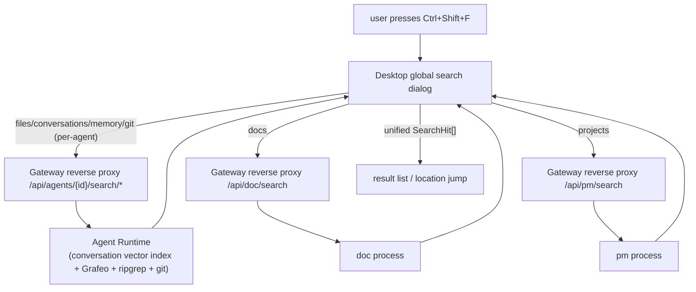

# ADR-081: Global Search (Ctrl+Shift+F Six-Source Aggregated Retrieval)

> **Chinese source of truth**: [ADR-081](../zh/ADR-081-global-search.md)
> **Terminology**: see [GLOSSARY.md](./GLOSSARY.md)

## Status

Draft (pending review)

## Date

2026-09-17

## Decision Makers

大鱼 (Dayu)

## Predecessors

ADR-009 (agent-private data only through Runtime HTTP), ADR-064/070 (doc/pm as standalone processes + zero business logic in the Gateway), ADR-033/034 (MQTT/HTTP boundary), ADR-057/062/068 (memory graph + vector retrieval), ADR-078 (git status bar)

## Related design

[docs/design/en/14-desktop-app.md](../../design/en/14-desktop-app.md)

---

## 1. Background and requirements

Add an **application-level global search**: `Ctrl+Shift+F` opens a global search dialog that
retrieves across 6 categories of data source:

1. **File search** — file content / filenames inside the workspace
2. **Doc search** — the doc library (`.md` document library)
3. **Project search** — pm projects and tasks
4. **Conversation search** — session messages of each agent
5. **Memory search** — agent long-term memory (Grafeo)
6. **git history search** — workspace git commit history

UI shape (task t-3e36c812):

- Row 1: the search input
- Row 2: a tab list (files / docs / projects / conversations / memory / git history)
- Row 3: the result list; clicking a result opens a dedicated result box and **jumps to the hit location** (a file jumps to the line, a conversation jumps to the message, a memory jumps to the node, etc.)
- Each search kind shows slightly different information per result row

**Hard constraint**: use vector search wherever possible (an explicit user requirement).

## 2. Current state inventory (data ownership + existing capability)

| Search target | Data owner | Storage | Existing capability | Gap |
|---|---|---|---|---|
| Files | agent-private (workspace) | Runtime `agent_workspaces.json` + disk | ✅ `GET /workspaces/search` (ripgrep full text), `GET /workspaces/find` (filename fuzzy); desktop `GlobalSearchPanel` | none (directly reusable) |
| Docs | user-level global | the doc process `~/.acowork/acowork-doc/` | ✅ `GET /search` (linear substring + title weighting, **not vector**) | vectorization optional; hit location |
| Projects | user-level global | the pm process directory tree (`task.json`) | ❌ no search endpoint; an in-memory secondary index exists (by_id/by_assignee/by_status) | add a search endpoint |
| Conversations | agent-private | Runtime session JSONL | ✅ `GET /sessions`, `GET /sessions/{sid}/messages` | **no search endpoint**; a vector index is needed |
| Memory | agent-private | Runtime Grafeo (an HNSW vector store) | ✅ `GET /memory/nodes` (keyword); **the underlying layer already has vector_search / hybrid / MMR** ([grafeo/retrieval.rs](../../../core/acowork-memory/src/manager.rs)); the `memory_recall` tool already uses vectors | the HTTP layer does not expose the semantic retrieval parameters |
| git history | agent-private (workspace) | Runtime git repository | ✅ **commit search already exists**: `CommitPicker` client-side filtering (subject/author/hash, [CommitPicker.tsx:138](../../../apps/acowork-desktop/src/components/editor/CommitPicker.tsx#L138)) + a `GitVirtualNav` virtual log view + paginated `GET /git/log` | none (directly reusable; the global git tab just hooks into the same backend) |

Key architectural facts:

- **The Runtime is one process per agent**; conversations / memory / files / git are all **per-agent** data (the ADR-009 redline: the Gateway must never read them directly and can only reverse-proxy Runtime HTTP).
- **doc / pm are user-level standalone processes**; the Gateway reverse-proxies `/api/doc/*` and `/api/pm/*`.
- **The "zero business logic in the Gateway" iron rule** (ADR-064/070): search aggregation, ranking and indexing logic must not enter the Gateway.
- **Embedding capability**: the Runtime already has an `EmbeddingProvider` chain (local ONNX → Ollama → remote API); Grafeo memory is already vectorized. The doc/pm processes have **no embedding dependency**.
- **Shortcut conflict**: `Ctrl+Shift+F` is already taken by the in-editor `GlobalSearchPanel` (the file ripgrep search) ([FileEditorPanel.tsx:621](../../../apps/acowork-desktop/src/components/editor/FileEditorPanel.tsx#L621)).

## 3. Decision

### D1 — orchestration layer: each data source searches autonomously, the Desktop aggregates

Search capability **sinks down into the process that owns the data** (whoever owns the data
does the retrieval), the Gateway only reverse-proxies, and the Desktop does the parallel
orchestration and result merging:



Rationale:

- Compliant with ADR-009 (agent-private data never leaves the Runtime) and ADR-064/070 (zero business logic in the Gateway).
- Each data kind naturally has a different retrieval semantic (vector / full text / git), so autonomy is the simplest option.
- The Desktop already has many orchestration precedents (`agent-start.ts`, `doc-api.ts`, `pm-api.ts` all call Gateway reverse-proxy endpoints directly), so orchestration introduces no new process.

### D2 — retrieval strategy: vector-first with an exact fallback, graded by data kind

"Use vectors wherever possible", but **do not blindly vectorize everything** — grade by
semantic density:

| Data source | Primary retrieval | Fallback / enhancement | Rationale |
|---|---|---|---|
| Memory | **vector** (the HNSW already exists; just expose the semantic parameters) | keyword (already exists) | already vectorized, zero new index |
| Conversations | **vector** (new message vector index) | keyword (JSONL substring) | long text with high semantic value, a strong user requirement |
| Docs | **vector** (a new embedding index in the doc process, optional P2) | the existing substring + title weighting (used in P0) | semantic retrieval is valuable, but the doc process would need an embedding pipeline at a moderate cost |
| Projects | keyword (title/description substring) | vector (the task count is small, optional) | short structured text, substring is enough, YAGNI |
| Files | **ripgrep full text** + filename fuzzy | vector (optional for long text like `.md`/`.txt`) | exact matching wins for code/config, semantic vectors yield little |
| git history | **reuse the existing CommitPicker search** (subject/author/hash substring, current-page filtering + paging) | — | the workspace git banner is already implemented; the global tab hooks into it rather than starting over |

### D3 — shortcut: take over `Ctrl+Shift+F` globally

- The application-level `Ctrl+Shift+F` opens the global search dialog (mounted on `AppLayout` or as a global keydown, taking priority over the in-editor Monaco action).
- The in-editor `GlobalSearchPanel` is **folded into** the global search "files" tab (the same ripgrep backend), and the original in-editor entry point is removed to avoid two confusing entry points; after a files-tab hit, the location logic reuses `openFile(agentId, workspaceId, file, line)` ([GlobalSearchPanel.tsx:263](../../../apps/acowork-desktop/src/components/search/GlobalSearchDialog.tsx#L263)).

### D4 — unified result contract: SearchHit

All sources return a unified structure (the Desktop renders rows by `type` and decides the jump):

```jsonc
{
  "type": "file | doc | project | conversation | memory | git",
  "id": "unique id within the source",
  "title": "main title (filename / doc name / task title / session title / memory summary / commit message)",
  "snippet": "hit context fragment (highlighted by the frontend)",
  "score": 0.0,
  "meta": {
    // type-specific location info
  }
}
```

The `meta` contract per type — this is the key to location jumps:

| type | meta |
|---|---|
| file | `{ agentId, workspaceId, path, line, column }` |
| doc | `{ docId, dirId, title }` (open DocEditor; in-body location is optional) |
| project | `{ projectId, taskId? }` (open ProjectBoard / TaskDetailDrawer) |
| conversation | `{ agentId, sessionId, messageIndex }` (open SessionPanel and scroll to the message) |
| memory | `{ agentId, nodeId }` (open MemoryPanel and locate the node) |
| git | `{ agentId, workspaceId, commitHash, relPath? }` (reuse CommitPicker / GitVirtualNav to open the commit history or diff) |

### D5 — search scope: an agent selector inside the dialog

Conversations / memory / files / git are per-agent data. The dialog gains an **agent scope
selector** (default "current agent", switchable to "all agents"):

- Single agent: call only that agent's Runtime endpoints.
- All agents: the Desktop calls every online agent's Runtime endpoints in parallel and merges the Top-N by `score`.
- Docs / projects are global sources and do not vary with the agent (in the P0 single-agent view they are still returned globally, unfiltered).

### D6 — failure modes and degradation

| Scenario | Behavior |
|---|---|
| An agent's Runtime is offline | that agent's 4 kinds of results are absent, the other sources return normally; the list tail shows "some agents did not respond" |
| The doc/pm process is not started | the corresponding tab returns a 503 notice without blocking the other tabs |
| The embedding model is not ready (conversation/memory vectors unavailable) | automatically degrade to keyword/substring retrieval (memory already has a keyword path; conversations degrade to a JSONL substring) |
| The index is not built (the conversation vector index is cold-starting) | return 200 with `indexing: true` (consistent with the §4.1 contract); the frontend shows "index building, results are incomplete"; the background incremental index flips `indexing` to false once it catches up. ~~The design draft had proposed 202 + indexing:true~~ (implemented deviation: the §4.1 aggregate endpoint contract has always been `200 { hits, scopes, indexing }`, so no 202 status code is introduced and index status is expressed solely by the `indexing` field in the body) |
| A single source times out | each source has an independent 3s timeout (a Desktop `AbortController`); the timed-out source is marked failed and the aggregated result is still returned |

## 4. Interface contracts (new / extended)

### 4.1 The Runtime gains `GET /search` (aggregating this agent's four sources)

To reduce the number of concurrent Desktop connections per agent, the Runtime provides a
**single-agent aggregate endpoint** that queries conversations / memory / files / git
internally in parallel:

```
GET /search?q={query}&scopes=conversation,memory,file,git&limit=20&mode=hybrid&workspace_id={id}
→ 200 { "hits": SearchHit[], "scopes": { "conversation": {...}, ... }, "indexing": bool }
```

> Implemented deviation: the `agent=all` in the example (multi-agent parallelism, P1-3) is
> deferred; the endpoint currently aggregates **only this agent's four sources**, and
> cross-agent orchestration is left to P1-3 at the Desktop layer. `mode` (the memory
> retrieval mode: `vector|hybrid|keyword`) and `workspace_id` (needed by the file/git
> scopes; when absent those scopes return `skipped`) are parameters added at implementation
> time.

Internal implementation (the Runtime usecase layer, the ADR-040 pattern):

- **conversation**: a new message vector index (see §4.2)
- **memory**: `MemoryAdminService` already has vector retrieval (`MemoryQuery` carries an embedding field, the same one `memory_recall` uses); the HTTP layer adds a `mode=vector|hybrid|keyword` parameter to pass through
- **file**: reuses `workspace_query::search_files` (ripgrep) + `find_files`
- **git**: **reuses the existing commit search, no server-side `--grep`**. The global git tab's retrieval semantic stays identical to the workspace git banner's `CommitPicker` (subject/author/hash substring). To support "all agents / cross-workspace" retrieval, `git_query::log` would only need an optional enhancement — a server-side `--all` (all repositories) or keyword pre-filter parameter. P0 simply has the Desktop reuse `/git/log` paging + client-side filtering (the same logic as CommitPicker) and adds no backend complexity

The Gateway reverse-proxies one line: `/api/agents/{id}/search` → Runtime `/search`
(following the existing `proxy_to_runtime` pattern, [proxy.rs:517](../../../core/acowork-gateway/src/http/proxy.rs#L517)).

### 4.2 The conversation message vector index (new, the core increment)

- **Ownership**: inside the Runtime process (agent-private, ADR-009).
- **Storage**: **reuse `grafeo-engine`** (already a workspace dependency, [core/Cargo.toml:79](../../../core/Cargo.toml#L79), features `vector-index + text-index + hybrid-search`), opened as a separate store file at `{runtime_data_dir}/conversation_index/`. Rationale:
  - Same engine as memory retrieval, so HNSW / BM25 / hybrid retrieval / embedding dimension migration / incremental rebuild are all already-proven capabilities (memory uses them in production) — **zero new dependencies and no C extension packaging burden** (versus sqlite-vec, which needs cross-platform `.dll` compilation);
  - the conversation index is physically isolated from the memory store (a separate directory and db file), so their lifecycles do not affect each other.
- **Write path**: after a session message is persisted (a JSONL append), it is **asynchronously** embedded (reusing the `EmbeddingProvider` chain) → upserted into the index (doc granularity: one record per message, with the fields `session_id, message_index, role, content, embedding`).
- **Cold start**: the Runtime scans the existing JSONL on startup and builds the index incrementally; `/search` returns `indexing: true` until it catches up.
- **Retrieval**: query embedding → vector Top-K → join the session metadata → aggregate for display (multiple hits in the same session collapse into one row, with `message_index` for locating).

### 4.3 doc search: P0 keeps the status quo + location enhancement; P2 vectorization

- P0: hook the existing `GET /api/doc/search?keyword=` directly into the "docs" tab; clicking a result opens DocEditor positioned at that doc.
- P2 (optional): the doc process gains an embedding pipeline (calling the Gateway embedding API or a local embed process) and vectorizes the body text. **Out of scope for the P0 of this ADR**, scheduled separately.

### 4.4 pm search: new `GET /api/pm/search?q=`

- Walk the `store` secondary index + a title/description substring match on `task.json` (the PM data volume is small — a thousand tasks — so a linear scan is acceptable; following the `score()` pattern of the doc `LibrarySearchService`).
- Hit field weighting: title > description > assignee.
- Returns `SearchHit{ type:"project", ... }`; clicking opens ProjectBoard / TaskDetailDrawer.

### 4.5 Desktop: GlobalSearchDialog

A new `src/components/search/GlobalSearchDialog.tsx` (reusing the VS Code style theme, the
same visual language as `GlobalSearchPanel`):

- A global keydown (`CtrlCmd+Shift+F`) opens it; Esc / blur closes it; the input has a 300ms debounce + request cancellation (an existing AbortController pattern).
- Switching tabs does not reset the query; the six sources are requested in parallel (`Promise.allSettled`), each with independent loading/error state.
- Result rows: type icon + title + snippet + secondary info (file path / session title / time); the hit keyword is highlighted with `<mark>`.
- Clicking dispatches by `meta` into the existing views (`useFileEditorStore.openFile`, DocEditor, SessionPanel, MemoryPanel, ProjectBoard, CommitPicker).

## 5. Alternatives (rejected)

| Alternative | Description | Why rejected |
|---|---|---|
| **A standalone acowork-search service** | A new global search process indexing all six sources | ① conversations/memory/files/git are per-agent private data, and copying them into a global service violates ADR-009; ② the index sync pipeline is complex (dual write + eventual consistency); ③ it adds a network hop and a failure surface compared with "the owning process retrieves autonomously"; YAGNI |
| **Gateway aggregation** | The Gateway calls each source and merges | Violates the ADR-064/070 "zero business logic in the Gateway" iron rule (aggregation and ranking are business logic); ADR-070 explicitly states that "retrieval" is doc domain logic and must not enter the Gateway |
| **A separate endpoint per source (no Runtime `/search` aggregation)** | The Desktop sends 4 requests to a single agent | 4× the connection count with duplicated per-source error handling; the Runtime aggregate endpoint is very cheap to implement (internally parallel) with obvious benefit; kept as a compatibility layer |

## 6. Boundaries and security

- **Data never leaves its owning process**: conversations/memory/files/git retrieval all complete inside the Runtime; the Gateway only passes through SearchHit and never touches the raw message/memory content (compliant with the ADR-009 redline, still covered by `run_gateway_fs_redline` in `dev/ci.sh`).
- **git is read-only**: following the ADR-078 convention `GIT_OPTIONAL_LOCKS=0`; `--grep` is a read; nothing writes.
- **Permissions**: doc/pm keep the existing `X-Actor` injection (already handled by doc_proxy / pm_proxy); the Runtime endpoints keep the existing per-agent route guards.
- **Index privacy**: the conversation vector index lives in the Runtime private directory, isolated from other agents (the per-runtime directory is naturally isolated).

## 7. Incremental implementation plan (small steps, each rollback-able)

| Stage | Content | Deliverable | Rollback |
|---|---|---|---|
| **P0-1** | Dialog skeleton + shortcut takeover + the files and git tabs (files reuse the ripgrep endpoint; git reuses `/git/log` + the CommitPicker-style client-side filtering) | `GlobalSearchDialog.tsx`, Gateway reverse proxy | just remove the keydown listener |
| **P0-2** | The projects tab (pm `/search`) + the docs tab (the existing `/api/doc/search`) + location jumps | `pm search.rs`, doc location | the new pm endpoint is standalone and can be taken down |
| **P1-1** | The memory semantic tab (expose the `mode=vector` parameter) + the single-agent `/search` aggregate endpoint | `memory_query` extension, Runtime `/search`, Gateway reverse proxy | a new endpoint, affects nothing existing |
| **P1-2** | The conversation vector index (async embedding on write + cold-start rebuild + retrieval aggregation) | the `conversation_index` module, EmbeddingProvider integration | the index directory is standalone and can be deleted and rebuilt; degrade to keywords |
| **P1-3** | All-agents parallel search + result merging/ranking + failure notices | Desktop orchestration | frontend logic, can fall back to single-agent |
| **P2** | Doc vectorization (a doc embedding pipeline) | an index in the doc process | separately reviewed and scheduled |

## 8. Open questions

1. ~~Conversation index storage selection~~ (**decided**: reuse `grafeo-engine` as a separate store, see §4.2; sqlite-vec is not introduced)
2. **"All agents" scope**: is filtering the agent subset by user/role needed (once the ADR-076 multi-user system lands)?
3. **In-body doc location**: `SearchHit.meta` only carries `docId`; should the doc process return a snippet offset for a hit inside the body? P0 only locates the doc; intra-document location awaits product confirmation.
4. **Conversation hit collapsing**: when a session has multiple hits, collapse them into one row by default (expandable) or lay them out flat? P0 collapses.
5. **git search scope**: P0 reuses CommitPicker's "commits for the current file path + client-side filtering" semantic; is cross-workspace retrieval in the global tab needed (requiring `/git/log` to support `--all` or a server-side keyword), awaiting product confirmation.

## 9. Conclusion

- Adopt the **"the owning process retrieves autonomously + the Desktop orchestrates and aggregates"** architecture, fully respecting the ADR-009/064/070 boundaries.
- **Vector-first** lands where semantic density is high (conversations / memory / docs); files / git / projects keep exact retrieval (no forcing vectors where the yield is low).
- **Vector storage introduces no new dependency**: the conversation index reuses the `grafeo-engine` the Runtime already depends on (HNSW/BM25/hybrid retrieval already proven), pm does not introduce a DB, and doc vectorization is deferred to P2 — the three processes each take what they need rather than all being forced onto sqlite.
- Only 2 core backend increments: the Runtime conversation vector index + the Runtime `/search` aggregate endpoint; everything else is parameter extension and Desktop UI.
- The whole chain is deliverable and rollback-able incrementally, with each stage independently testable.
