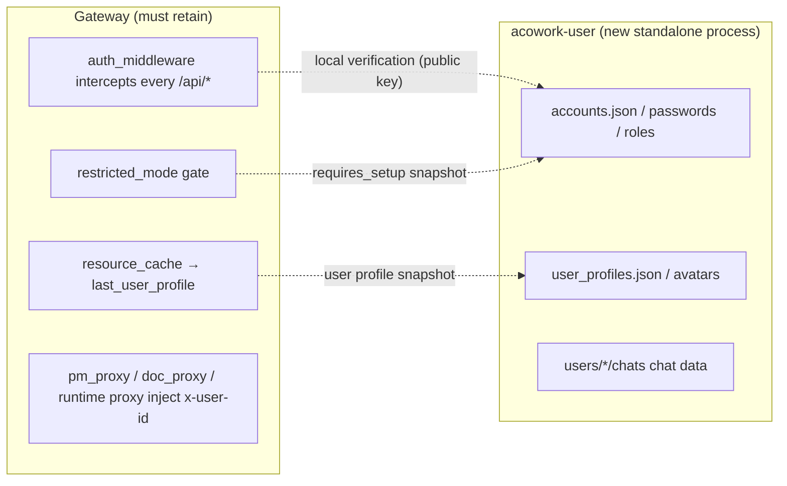

# ADR-084: Splitting Accounts / User Chat Out of Gateway into a Standalone Process `acowork-user`

> **Chinese source of truth**: [ADR-084](../zh/ADR-084-user-standalone-process.md)
> **Terminology**: see [GLOSSARY.md](./GLOSSARY.md)

**Status**: Decided (2026-10-20, finalized at architecture review)
**Date**: 2026-10-20
**Decision Makers**: Architecture review (user decision: migrate the user-domain business out of Gateway)

**Related**:
- [ADR-064](./ADR-064-pm-standalone-process.md) (PM standalone process — the direct paradigm source of this ADR)
- [ADR-070](./ADR-070-doc-standalone-process-and-tree-storage.md) (doc standalone process — the second application of the same paradigm)
- [ADR-019](./ADR-019-lsp-relay-standalone-process.md) (LSP relay standalone process — the earliest precedent)
- [ADR-055](./ADR-055-remote-runtime-node-topology.md) (Gateway converges to pure networking duties: MQTT broker host + unified HTTP entry + global resource authority)
- [ADR-076](./ADR-076-multi-user-account-system.md) (multi-user account system — **this ADR supersedes the form in which it was implemented inside Gateway**; business semantics and data model unchanged)
- [ADR-042](./ADR-042-mqtt-user-identity-delivery.md) (user identity delivery to Runtime: `last_user_profile`)
- [ADR-009](./ADR-009-gateway-workspace-isolation.md) (Gateway boundary rules — this document updates their wording for "user chat data ownership")

---

## 1. Decision Summary

### 1.1 In one sentence

**Split the "user domain" (accounts, credentials, roles, profiles/avatars, user↔user chat) out of Gateway into a standalone process `acowork-user`, on par with pm / doc / embed / lsp-relay**: a separate binary, a separate port (default `18083`), a separate data directory (`$HOME/.acowork/acowork-user/`), lifecycle managed by a Gateway supervisor; Gateway retains only a **reverse proxy for `/api/auth/*` and `/api/users/*` + trusted identity injection into that proxy + a per-request local-signature-verification auth gate**, thereby restoring its positioning as "communication hub + global resource scheduler only".

Key insight: the account system is **not** a wholesale lateral move like PM/Doc. It is interleaved with Gateway's HTTP authentication, so the correct cut is a single line drawn along **"user-domain business (migrates out) vs request authentication infrastructure (stays in Gateway)"**, not relocating every file by name.

### 1.2 Key decision table (detailed rationale in §4)

| # | Decision | Conclusion |
|---|----------|-----------|
| 1 | Split boundary | **Migrate out**: account storage, credentials/passwords, roles, login/refresh/logout/change-password, account CRUD, profiles/avatars, user↔user chat (persistence + API). **Retain**: the `auth_middleware` gate, `x-user-id` session-scope injection, `restricted_mode`, `auth_mode` resolution, the local-mode legacy bearer, and the user-profile snapshot needed for global resource publication |
| 2 | Auth infrastructure ownership | Identity **verification** (per request) stays in Gateway as **local stateless signature verification**, introducing no per-request network hop; identity **issuance** (login/refresh) moves with accounts into acowork-user |
| 3 | Token trust boundary | HS256 shared secret → **Ed25519 asymmetric**: acowork-user holds the private key to **sign**, Gateway holds the public key to **verify** ("can verify but cannot sign", least privilege). The token module is promoted to a shared contract in `acowork-core::auth` |
| 4 | Gateway's inward dependencies on the account side | Three: <br>(a) token verification → solved by decision 3; <br>(b) the user profile list (feeding the `last_user_profile` global resource) → the user service exposes an internal endpoint, Gateway pulls and caches it, an MQTT signal triggers refresh on change; <br>(c) restricted mode `requires_setup` → cached by the same snapshot mechanism, the gate reads the local cache (no I/O) |
| 5 | Process paradigm | Replicate PM/Doc: a standalone `acowork-user` with its own `main.rs` + port-conflict auto-increment + `--port-file` reporting + `user_supervisor` (`/health` polling + exponential-backoff restart) + `user_proxy` transparent reverse proxy. Startup failure does not block Gateway (503 + Retry-After) |
| 6 | External contract | The Desktop call paths are **completely unchanged** (`/api/auth/*`, `/api/users/*`, `/api/users/{id}/chats/*`, `/api/user/avatar-*`) → zero Desktop changes. The user service's internal paths are verbatim identical to the old Gateway paths, and `user_proxy` **keeps the prefix as-is** (unlike `/api/doc`, no prefix stripping) |
| 7 | Deployment modes | `acowork-user` runs as a **resident process in both `local` and `multi_user` modes** (in `local` it serves only profiles/avatars, with no account system; in `multi_user` it adds accounts + auth + chat). The mode is resolved by Gateway from `auth_mode` |
| 8 | Data migration | No compatibility or migration logic anywhere in the code paths; a one-time manual move |

### 1.3 Invariants (must hold)

1. **Byte-level identical external contract**: the paths, request bodies, response bodies and error codes seen by Desktop / CLI / external callers are unchanged (ADR-064 goal 5 / ADR-070 goal 5).
2. **Single trusted writer for identity injection**: `x-user-id` (session scope) + `X-Auth-User` / `X-Auth-Role` / `X-Auth-As-User` (user-service authentication identity) **may only be injected by Gateway's `auth_middleware` / `user_proxy`**; any client self-report is discarded. Continuing the spirit of the ceiling lint in ADR-076 §6.4.
3. **User data is only read/written inside the user service**: Gateway no longer directly reads `accounts.json` / `user_profiles.json` / `users/*/chats/` / `assets/avatars/`; when needed it pulls over internal HTTP. Continuing the ADR-009 §5 boundary red lines.
4. **The auth gate cannot be bypassed**: token verification for `/api/*` still happens at the same layer (Gateway) before a request enters business logic; the user service port binds only to `127.0.0.1` and accepts only traffic from Gateway's reverse proxy.
5. **`local` mode produces no account side effects**: in `local`, `accounts.json` is not created and account/auth routes are not registered (continuing ADR-076 §decision 12).

### 1.4 Deployment mode behavior comparison

| Dimension | `local` | `multi_user` |
|---|---|---|
| `acowork-user` process | resident | resident |
| Account store `accounts.json` | not created | created |
| Login/refresh/`/api/auth/*` | 404 | registered |
| `/api/users` semantics | display-profile CRUD + avatars | credential-aware account CRUD (replaces display CRUD) |
| User↔user chat `/api/users/{id}/chats/*` | 404 | registered |
| Gateway auth gate | pass-through (legacy bearer unchanged) | mandatory bearer + `AuthContext` |
| Restricted mode | none (no-op) | empty account store + no password admin → 403 `setup_required` for everything except `/health`, `/api/status` |
| Token verification | none | local Ed25519 public-key verification |

---

## 2. Background and Motivation

### 2.1 The iron law: zero business in Gateway

Gateway is the core single point of the whole project, positioned as **pure communication + global resource management**:

> Gateway does not proxy Agent business logic; it is only responsible for the coordination work that must be centralized.
> —— [docs/design/zh/04-gateway.md](../../design/zh/04-gateway.md)

ADR-055 further converges it into three pure networking duties: **MQTT broker host, unified HTTP entry, global resource authority**. embed, LSP relay (ADR-019), PM (ADR-064) and doc (ADR-070) have all already become subprocesses under this principle.

**The account system and user↔user chat are the last clearly business-domain violation of that iron law inside Gateway.** Current inventory:

| Concern | File | Lines |
|---|------|-------|
| Account storage / passwords | [core/acowork-gateway/src/account/store.rs](../../../core/acowork-user/src/account/store.rs), [password.rs](../../../core/acowork-user/src/account/password.rs) | 332 |
| Auth service (login/refresh/change-password/roles/invites) | [core/acowork-gateway/src/auth/service.rs](../../../core/acowork-user/src/auth/service.rs) | 1558 |
| Token issuance/verification | [core/acowork-gateway/src/auth/token.rs](../../../core/acowork-gateway/src/auth/token.rs) | 460 |
| Revocation registry | [core/acowork-gateway/src/auth/revoked.rs](../../../core/acowork-user/src/auth/revoked.rs) | 202 |
| Account API | [core/acowork-gateway/src/http/account_api.rs](../../../core/acowork-user/src/http/account_api.rs) | 1179 |
| Profile/avatar API | [core/acowork-gateway/src/http/users_api.rs](../../../core/acowork-user/src/http/profile_api.rs) | 878 |
| Auth API | [core/acowork-gateway/src/http/auth_api.rs](../../../core/acowork-user/src/http/auth_api.rs) | 465 |
| User↔user chat persistence | [core/acowork-gateway/src/chat.rs](../../../core/acowork-user/src/chat.rs) | 922 |
| User↔user chat API | [core/acowork-gateway/src/http/chat_api.rs](../../../core/acowork-user/src/http/chat_api.rs) | 1249 |

≈ **7.4k lines of user-domain code** compiled into the Gateway binary — a business module of the same order of magnitude as PM/Doc.

### 2.2 The problems

| Problem | Explanation |
|---|---|
| Business logic inside Gateway | the account state machine, password policy, invites, refresh-family revocation, chat participant convergence — all user-domain logic compiled into Gateway's core single point |
| Dependency weight | pulls in `argon2`, `hmac`, `rpassword`, `zeroize`, `tokio-util` (chat attachment streaming) (see [core/acowork-gateway/Cargo.toml](../../../core/acowork-gateway/Cargo.toml)) |
| Loss of fault isolation | panics in account/chat paths (e.g. chat attachment path handling, skipping bad lines) can take Gateway down |
| Storage coupling | accounts/profiles/chat are stuffed into `{gateway.data_dir}/` (`accounts.json`, `user_profiles.json`, `users/`, `assets/avatars/`), strongly coupled to Gateway's data lifecycle |
| Contradicts the dominant direction | ADR-019/055/064/070 all converge Gateway to pure networking; embedding accounts goes backwards |

### 2.3 The key difference from PM/Doc (why it cannot be a wholesale move)

PM/Doc migrated out of Gateway cleanly because the relationship with Gateway is **unidirectional**: Gateway reverse-proxies it and injects trusted identity into it; Gateway needs none of their data.

The account system adds **three inward dependencies** (Gateway consumes account-side state in return):



1. **The auth middleware is a global gate**: [core/acowork-gateway/src/http/auth_middleware.rs](../../../core/acowork-gateway/src/http/auth_middleware.rs) intercepts every `/api/*`, injects `AuthContext`, and pushes `x-user-id` down to the PM/Doc proxies and to Runtime (session isolation, ADR-076 §decision 4). **This layer cannot move**: making every request network-hop to the user service for verification would bind the availability of the entire HTTP surface to the user service.
2. **User profiles feed global resource publication**: [resource_cache.rs:214](../../../core/acowork-gateway/src/resource_cache.rs#L214) reads `user_profiles.json`, and via [global_resources_builders.rs:394](../../../core/acowork-gateway/src/mqtt/global_resources_builders.rs#L394) publishes it to Runtime as `last_user_profile` (ADR-042).
3. **Restricted mode depends on account state**: [restricted_mode.rs](../../../core/acowork-gateway/src/http/restricted_mode.rs) decides whether to allow only `/health` and `/api/status` based on `is_restricted()` (empty account store + no password admin) (ADR-076 §decision 12 v2).

Therefore this ADR's boundary principle is: **"user-domain business" migrates out; "Gateway's own API-surface auth infrastructure" stays.**

---

## 3. Goals

1. **A standalone user-domain process**: a separate binary `acowork-user`, a separate port (default `18083`, auto-incrementing on conflict up to +20), supervisor-managed lifecycle
2. **Standalone user-domain storage**: data directory `$HOME/.acowork/acowork-user/`, on par with `acowork-gateway/`, `acowork-node/`, `acowork-pm/`, `acowork-doc/` (see [acowork-core `default_node_home`](../../../core/acowork-core/src/node.rs))
3. **Gateway restores pure networking duties**: it no longer compiles user-domain code and no longer directly reads/writes the user data directory
4. **Byte-level identical external contract**: Desktop / CLI / external callers are unaware
5. **Converged identity-forgery surface**: the trusted identity injection points converge from Gateway-internal `auth_middleware` to two explicit writers — `auth_middleware` (session scope) and `user_proxy` (user-service auth identity)
6. **Simplification**: no compatibility burden in the development phase; no compatibility/migration code whatsoever

---

## 4. Decisions

### Decision 1: The split boundary — "user-domain business" migrates out, "auth infrastructure" stays

**Migrating to `acowork-user` (plus the user-domain data)**:

| Source (Gateway) | Target (acowork-user) |
|---|---|
| `account/{store,password}.rs` | `account/{store,password}.rs` |
| `auth/{service,revoked}.rs` | `auth/{service,revoked}.rs` |
| the **issuance** part of `auth/token.rs` | `auth/issuer.rs` (Ed25519 private key) |
| `http/account_api.rs` | `http/account_api.rs` |
| `http/users_api.rs` (profile CRUD + avatars) | `http/profile_api.rs` (internal paths stay `/api/users`, `/api/user/avatar-*`) |
| `http/auth_api.rs` | `http/auth_api.rs` |
| `chat.rs` | `chat.rs` |
| `http/chat_api.rs` | `http/chat_api.rs` |
| Data: `accounts.json`, `user_profiles.json`, `users/` (chat), `assets/avatars/` | moved into the user service data directory |

**Staying in Gateway (request auth infrastructure + cross-cutting concerns)**:

| Component | Handling |
|---|---|
| [core/acowork-gateway/src/http/auth_middleware.rs](../../../core/acowork-gateway/src/http/auth_middleware.rs) | **retained**; `verify_access` becomes **local Ed25519 public-key verification** (no longer holding the account store / signing private key) |
| [core/acowork-gateway/src/http/restricted_mode.rs](../../../core/acowork-gateway/src/http/restricted_mode.rs) | **retained**; `is_restricted()` reads a **local snapshot** (refreshed on a signal from the user service) |
| [core/acowork-gateway/src/auth/mode.rs](../../../core/acowork-gateway/src/auth/mode.rs) | **retained** (`auth_mode` resolution is the Gateway deployment mode; it is the auth gate's switch) |
| [core/acowork-gateway/src/http/auth.rs](../../../core/acowork-gateway/src/http/auth.rs) | **retained** (local-mode legacy bearer, unaffected) |
| `x-user-id` injection, pm/doc/runtime proxies | **retained** (depends only on `AuthContext`) |
| the user profile portion of `resource_cache` / `global_resources_builders` | **retained** structurally; the data source switches to pulling from the user service |

### Decision 2: Identity issuance lives in the user service, identity verification lives in Gateway (local and stateless)

- **Issuance** (`login` / `refresh` / `first-login`) happens in the user service: it is the authority over credentials and accounts.
- **Verification** (`verify_access`) stays in Gateway's `auth_middleware`: one purely local cryptographic verification, no I/O, no network hop. Access tokens are short-lived and verification is **stateless** (the existing `AuthService::verify_access` only does signature validation and does not touch disk).
- **Revocation** (refresh-family, [revoked.rs](../../../core/acowork-user/src/auth/revoked.rs)) is account data, moves with the accounts into the user service, and is used **only on the refresh path**; stateless access-token verification is unaffected.

**Rationale**: the "issuance + revocation" of authn is account-domain state, so it belongs to the user service; the "per-request verification" of authn is access control, so it belongs to Gateway. The two are joined by the same signature contract, with no shared mutable state.

### Decision 3: Token trust boundary — Ed25519 asymmetric (issuer ≠ verifier)

Currently HS256 (`{data_dir}/auth/secret`, the same symmetric key for signing and verifying). After the split, **issuance is in the user service and verification is in Gateway**, and a shared symmetric secret would bring two problems: the secret must land in two places, and Gateway retains issuance capability (violating least privilege).

**Decision**: switch to **Ed25519**.
- `acowork-user` generates and holds the private key (`{user_data_dir}/auth/ed25519.key`, 0600), used for `sign_access` / `sign_refresh`.
- Gateway reads only the public key (`{user_data_dir}/auth/ed25519.pub`, or passed in via the supervisor), used for `verify`.
- The token module is extracted into a **shared contract** `acowork-core::auth` (`TokenIssuer` / `TokenVerifier` + `Claims`); Gateway and acowork-user each depend on the contract, not on each other. The JWT header changes to `{"alg":"EdDSA","typ":"JWT"}`.

**Blast radius**: the unit tests in [token.rs](../../../core/acowork-gateway/src/auth/token.rs) (HS256 round-trip/tamper/expiry) become Ed25519; claim semantics such as `is_family_consistent` are unchanged. This is a contained, one-shot-replaceable change.

**Rejected (alternative)**: keep HS256 with a shared key file (generated by the user service, read-only for Gateway). Minimal change, but the symmetric secret lands in two places and Gateway keeps issuance capability. **Choose this alternative only if review prefers the minimal diff** — the ADR records Ed25519 as the recommendation; switching to the alternative means only replacing this decision's implementation, all other decisions stand.

**Rejected**: Gateway calls the user service's `/internal/verify` per request. See decision 1.

### Decision 4: Handling Gateway's inward dependencies on the account side

**(a) Token verification** → decision 3 (local public-key verification).

**(b) The user profile list (for the `last_user_profile` global resource)**:
the user service exposes an internal endpoint `GET /internal/user-profiles` returning `UserProfileListFile` (i.e. the existing derived view). After startup, once the user service is ready, Gateway pulls it and stores it in `ResourceCache.user_profile_list`; after a profile change the user service publishes a change signal over **MQTT** (reusing doc's [mqtt_publisher.rs](../../../core/acowork-doc/src/mqtt_publisher.rs) paradigm); Gateway subscribes, re-pulls, and triggers global resource republication.
- **Rejected**: Gateway directly reads `user_profiles.json` from the user service's data directory (crossing data directories breaks the ADR-009 boundary, and under ADR-055 `data_dir` is node-local).
- **Rejected (simpler)**: Gateway unconditionally pulls on every resource rebuild (no signal). Feasible, but profile-change propagation latency is uncontrollable; kept as a degraded fallback.

**(c) Restricted mode `requires_setup`**:
the user service returns `{ requires_setup, registration_open }` in the `/health` response body or from `GET /internal/state`. Gateway's `user_supervisor` refreshes both values into `GatewayState.user_snapshot` on each heartbeat; `restricted_mode_middleware` reads the **locally cached booleans** (no I/O).
- Existing behaviour (v2 contract: in restricted mode a tokenless request answers **403 `setup_required`**, not 401) is unchanged.
- The source of `/api/status`'s `registration_open` field switches to that snapshot; the public contract is unchanged.

**(d) Session isolation / pm-doc actor injection / ADR-042 identity delivery**: **zero changes** — they depend only on `AuthContext` (still produced by Gateway) and `x-user-id` (still injected by Gateway). ADR-076 §decision 4 / §decision 10 semantics unchanged.

### Decision 5: The process / port / data directory / supervisor / proxy paradigm

Replicating PM/Doc:
- Binary `acowork-user`, with `main.rs` carrying its own CLI (`--host --port --port-file --data-dir --auth-mode --gateway-health-url --gateway-health-interval-ms --gateway-health-timeout-ms --log-level`).
- Port default `18083` (embed `18080` / doc `18081` / pm `18082`), auto-incrementing on conflict up to +20, reporting the actual port via `--port-file`.
- Data directory `$HOME/.acowork/acowork-user/` (Gateway side only has an optional `--data-dir` override; by default the user service resolves it itself).
- [core/acowork-gateway/src/lifecycle/user_supervisor.rs](../../../core/acowork-gateway/src/lifecycle/user_supervisor.rs): spawn + `/health` polling (reusing `acowork_core::supervisor::{RestartHistory, backoff_with_jitter}`) + exponential-backoff restart (1s→60s, a cap of 5 times per 5 minutes); on failure it clears `GatewayState.user_process`, Gateway keeps running, and `/api/auth/*` and `/api/users/*` return **503 + `Retry-After: 2`**.
- [core/acowork-gateway/src/http/user_proxy.rs](../../../core/acowork-gateway/src/http/user_proxy.rs): transparently reverse-proxies `/api/auth/{*rest}`, `/api/users/{*rest}`, `/api/user/{*rest}` → `127.0.0.1:{user_port}`, **keeping the prefix unchanged** (no stripping), and injects trusted identity into the forwarded headers:
  - Authenticated requests: inject `X-Auth-User` (`AuthContext.user_id`), `X-Auth-Role` (role), `X-Auth-As-User` (admin view-as scope, if any); any client self-reported `X-Auth-*` is discarded.
  - Public requests (`/api/auth/login|refresh|logout|first-login`): no identity injection.
- `GatewayState` gains `user_process: Option<UserProcessState>` and `user_snapshot: UserSnapshot` (`requires_setup` / `registration_open` / `profiles_version`).
- Configuration gains `[user] { enabled = true, port = 18083 }`, mirroring `[pm]` / `[doc]`.

**External contract**: Desktop goes through `{gw}/api/auth/*` and `{gw}/api/users/*` (paths verbatim identical to today) — zero Desktop changes.

### Decision 6: The user service also runs in `local` mode

`acowork-user` starts in both modes: in `local` it carries only profile CRUD + avatars (no accounts/auth/chat); in `multi_user` it adds accounts + auth + chat.

**Rationale**: profiles are part of the "user domain", so their code ownership should be unique. If `local` kept them in Gateway while `multi_user` migrated them out, the profile code would be forced to split in two (or Gateway would keep a copy → the boundary breaks again). Unified ownership, and the process is tiny; the cost is acceptable.

**Rejected alternative**: spawn the user service only in `multi_user`, leaving profile logic in Gateway under `local` — profile code splits.
**Rejected alternative**: do not start the user service in `local`, returning 404 for `/api/users` — destroys `local`'s existing profile display capability.

### Decision 7: The auth gate and runtime isolation stay at their current layer

- `auth_middleware` remains **layered inside CORS and outside all routes** (ADR-076 §decision 3), so a new route cannot forget to opt in.
- `x-user-id` session-scope injection remains in `auth_middleware` ([auth_middleware.rs:218](../../../core/acowork-gateway/src/http/auth_middleware.rs#L218)), continuing to serve Runtime session isolation and pm/doc actor injection.
- The user service **does not maintain its own allowlist**: the trust decision converges on Gateway's single auth point (continuing the position in ADR-070 §9).

### Decision 8: Data migration — no compatibility code

In the development phase there is no legacy compatibility need, so **no compatibility or migration logic is retained in any code path**. Old data is moved once (manually or via a one-off temporary script; the script does not enter CI / the long-term codebase).

**Data to move** (source `{gateway.data_dir}` = `$HOME/.acowork/acowork-gateway/data`, target `$HOME/.acowork/acowork-user/`):

| Data | Source path | Target path | Notes |
|---|---|---|---|
| Account store | `accounts.json` | `accounts.json` | only exists in `multi_user` |
| Profile view | `user_profiles.json` | `user_profiles.json` | can be re-derived from `accounts.json`, so may be skipped |
| User chat | `users/` | `users/` | `{min}/chats/{max}/` directory tree (see the comments in [chat.rs](../../../core/acowork-user/src/chat.rs)) |
| Avatars | `assets/avatars/` (multi_user), `assets/` (local shared) | same name | see [users_api.rs:474](../../../core/acowork-user/src/http/profile_api.rs#L474) |
| Old HS256 secret | `auth/secret` | — | **discard**: after switching to Ed25519 all old tokens become invalid and re-login is required (no impact in the development phase) |

One-time migration example (executed manually, not committed):

```bash
GW="$HOME/.acowork/acowork-gateway/data"
US="$HOME/.acowork/acowork-user"
mkdir -p "$US"
[ -f "$GW/accounts.json" ]      && cp "$GW/accounts.json"      "$US/"
[ -f "$GW/user_profiles.json" ] && cp "$GW/user_profiles.json" "$US/"
[ -d "$GW/users" ]              && cp -r "$GW/users"           "$US/"
[ -d "$GW/assets" ]             && cp -r "$GW/assets"          "$US/"
```

**Post-migration verification**: logging in with an old account succeeds under `multi_user`; historical user↔user chat is readable; avatars are visible.

---

## 5. Consequences

### 5.1 Positive

- Gateway's binary sheds ≈7.4k lines of user-domain business code and its `argon2` / `rpassword` / `zeroize` dependency weight.
- Account/chat panics no longer take Gateway down.
- User-domain data has an independent lifecycle, on par with pm/doc data.
- Consistent with the ADR-019/055/064/070 direction, restoring the "communication hub" positioning.
- The Desktop contract is byte-identical, so no frontend coordination cost.

### 5.2 Negative / costs

- One more process and one more failure domain; when the user service is down, `/api/auth/*` and `/api/users/*` return 503.
- Token trust moves from "same process" to "cross-process asymmetric keys" — the first start after enabling requires key generation and public-key loading.
- Cross-process auth semantics need e2e coverage (agent privilege escalation, admin view-as, public-path pass-through).

### 5.3 Boundaries / exceptions

- Keeping `auth_middleware` / `restricted_mode` / `auth_mode` **in Gateway is a deliberate design**, not an oversight: they are access control for Gateway's own HTTP surface.
- The user service's internal endpoints (`/internal/*`) are not exposed externally; they are reachable only over loopback via Gateway's proxy.

### 5.4 Rollback

- `[user].enabled=false` → do not spawn; `/api/auth/*` and `/api/users/*` return 503 (other services unaffected).
- Data directory switch: change `[user].data_dir` and restart; the original directory is retained and can be copied back.
- Ed25519 ← HS256 is a one-way change; reverting requires restoring `token.rs` (no data impact in the development phase).

### 5.5 Known technical debt

- The one-time migration script does not enter the codebase (consistent with "no compatibility in the development phase").
- The MQTT signal topic for profile refresh must be coordinated with the existing global-resources publication chain (see §9).

---

## 6. Change List (by crate / file)

### 6.1 New `core/acowork-user` (Cargo workspace member)

```
core/acowork-user/
  src/main.rs        # CLI + standalone process entry (replicating pm/doc)
  src/server.rs      # full router (/api/auth/* + /api/users/* + /api/user/* + /health)
  src/health.rs
  src/config.rs      # the user service's own config (data_dir / password_policy / bootstrap_admin / registration_open)
  src/error.rs
  src/account/{store,password}.rs        # migrated in from gateway
  src/auth/{service,revoked,issuer}.rs   # service/revoked migrated in; issuer = Ed25519 issuance
  src/http/{auth_api,account_api,profile_api,chat_api}.rs  # migrated in from gateway
  src/chat.rs                            # migrated in from gateway
  src/mqtt_publisher.rs                  # profile change signal (paradigm source acowork-doc)
```

### 6.2 `core/acowork-core`

- New `auth` module: `Claims` / `TokenIssuer` (Ed25519 private-key signing) / `TokenVerifier` (public-key verification) / `TokenKind` (shared contract, no standalone-crate dependency).
- `account.rs`'s `UserAccount` / `AccountView` / `AccountListFile` are retained (shared DTOs).
- `protocol.rs`'s `UserProfile` / `UserProfileListFile` are retained (shared DTOs).

### 6.3 `core/acowork-gateway` — deletions

- `src/account/` (the whole directory), `src/chat.rs`.
- `src/auth/service.rs`, `src/auth/revoked.rs` (migrated out). The issuance part of `src/auth/token.rs` migrates out, leaving only the verifier.
- `src/http/account_api.rs`, `users_api.rs`, `auth_api.rs`, `chat_api.rs`.
- The `AdminSetup` subcommand in `cli.rs` (becomes the user service CLI).
- `password_policy` / `bootstrap_admin` / `registration_open` and similar fields in `MultiUserConfig` in `config.rs` (moved into the user service config).

### 6.4 `core/acowork-gateway` — additions / modifications

- **New** `src/lifecycle/user_supervisor.rs` (replicating `doc_supervisor.rs`).
- **New** `src/http/user_proxy.rs` (transparent proxy + identity injection).
- **New** `config.rs::UserConfig { enabled, port }` (mirroring `PmConfig`/`DocConfig`).
- **Modified** `src/gateway/state.rs`: adds `user_process`, `user_snapshot`.
- **Modified** `src/http/routes.rs`: `/api/auth/*`, `/api/users/*`, `/api/user/*` are now served by `user_proxy` (removing the local registration of `account_api`/`users_api`/`chat_api`; [routes.rs:261-290](../../../core/acowork-gateway/src/http/routes.rs#L261)).
- **Modified** `src/http/auth_middleware.rs`: `verify_access` uses `acowork_core::auth::TokenVerifier` (public key).
- **Modified** `src/http/restricted_mode.rs`: `is_restricted()` reads `user_snapshot.requires_setup`.
- **Modified** `src/resource_cache.rs` / `src/mqtt/global_resources_builders.rs`: the `user_profile_list` source switches to the user service snapshot.
- **Modified** `src/gateway/mod.rs`: removes `AuthService` initialization ([gateway/mod.rs:222](../../../core/acowork-gateway/src/gateway/mod.rs#L222)), replacing it with starting `user_supervisor` + loading the public key.
- **Retained**: `src/auth/mode.rs`, `src/http/auth.rs`, `x-user-id` injection, the pm/doc/runtime proxies.

### 6.5 `dev/ci.sh`

- Extends the ceiling lint: the constants `X-Auth-User` / `X-Auth-Role` / `USER_SCOPE_HEADER` may appear only at their definition site + tests; the `UserService` side must not contain Gateway data-directory paths; the Gateway side must not directly read `accounts.json` / `user_profiles.json` / `users/`.

### 6.6 `apps/acowork-desktop`

- **Zero changes** (paths / request bodies / response bodies unchanged).
- Optional: `gatewayAuthBridge` / the liveness probe need not be aware of the backend process split.

---

## 7. Test Strategy

### 7.1 Unit tests

- `acowork-core::auth`: Ed25519 sign/verify round-trip, tamper rejection, expiry rejection, kind validation, `is_family_consistent`.
- `acowork-user`: account store atomic write / corrupt backup (migrated from the existing gateway tests); Argon2id login/change-password; refresh-family revocation and reuse detection; chat participant convergence / unread semantics / attachment permission boundaries (migrated from the tests in [chat_api.rs](../../../core/acowork-user/src/http/chat_api.rs)).
- `user_proxy`: identity injection (discarding self-reported `X-Auth-*`), no injection on public paths, 503 semantics.

### 7.2 Integration tests (e2e)

- Through the **real `build_router`** for the full chain: `multi_user` login → call `/api/users` with a token → proxied to the user service → 200.
- `local` mode: `/api/users` profile CRUD works through the proxy; `/api/auth/*` returns 404.
- Restricted mode: empty account store + no password admin → a tokenless request answers **403 `setup_required`** (not 401); after setup completes it is let through.
- Privilege escalation: an ordinary user reading someone else's chat / renaming → 403/404; admin view-as is read-only.
- User service not ready: `/api/users/*` returns 503 + `Retry-After: 2`.

### 7.3 Protocol compatibility

- Desktop `auth-api.ts` / `user-chat-api.ts` / `gateway-api.ts` contracts unchanged (paths + response shapes); do a byte-level comparison before and after migration.

### 7.4 Security tests (manual checklist)

- Connecting directly to `127.0.0.1:18083` … (see §7.4 of the Chinese source for the full checklist).

### 7.5 CI ceiling lint

See §6.5.

---

## 8. Implementation Milestones (suggested)

| Phase | Content | Exit condition |
|---|---|---|
| M0 | extract `acowork-core::auth` (Ed25519 contract) + replace Gateway's `token.rs` | Gateway local verification passes unit tests; old HS256 removed |
| M1 | create the `acowork-user` crate skeleton + migrate in `account`/`auth`/`chat` + the full router + `/health` | the user service can start standalone and log in / send messages |
| M2 | Gateway: `user_supervisor` + `user_proxy` + config + `GatewayState` | the full Desktop chain works through Gateway |
| M3 | Gateway: `auth_middleware` public-key verification + `restricted_mode` snapshot + profile snapshot refresh | `multi_user` e2e all green |
| M4 | bring `local` mode up (profiles + avatars through the proxy); remove user-domain code from Gateway | e2e green in both modes; `cargo clippy` clean |
| M5 | one-time data migration + documentation + `dev/ci.sh` lint | migration verification passes |

---

## 9. Open Questions (review focus)

1. **Conservative semantics for restricted mode when the user service is not ready**: when `user_snapshot.requires_setup` is unknown, should the gate pass through as "not restricted" (availability first) or conservatively reject (security first)? (Tendency: pass through — restricted mode is only the brief window of the first startup, and passing through does not widen the attack surface, because business routes still require a token.)
2. **The signal channel for profile refresh**: an MQTT topic (reusing the doc paradigm) vs the user service calling back a Gateway internal endpoint vs Gateway polling. Must be coordinated with the existing global-resources publication chain. **(Landed: the MQTT topic `acowork/user/profiles/changed` is the fast path + supervisor 2s `/health` polling as a fallback; under `mqtt.auth_enabled` the broker admits `user:service` / `doc:service` with a `publisher_token` generated at startup — injected by the supervisor via `--mqtt-password`, so the signal does not silently fail due to authentication.)**
3. **Is it worth starting a process just for profiles/avatars in `local` mode**: this ADR chooses "yes" (unique code ownership). If review weighs minimum overhead more heavily, it can fall back to "keep profiles in Gateway under `local`" — but that splits the profile code and requires explicit acceptance.
4. **Public reading of `registration_open`**: should `/api/status` (unauthenticated) keep relaying it from the Gateway snapshot, or should the frontend call a user-service endpoint separately? (Tendency: keep the `/api/status` contract.)
5. **Ed25519 key rotation**: not done in this round (YAGNI); the recorded upgrade path is a public key carrying `kid`, with the user service able to hold several public keys at once.

---

## 10. Rejected Options (review should not re-litigate unless the triggering conditions change)

| Rejected option | Reason for rejection | See |
|---|---|---|
| Migrating the auth middleware out as well (network-hop verification per request) | binds the availability of all Gateway APIs to the user service + adds a hop per request | §4 decision 1 |
| Keeping the HS256 shared secret (as the main option) | a symmetric key lands in two places and Gateway keeps issuance capability | §4 decision 3 |
| Gateway directly reading the user service's data directory | breaks the ADR-009 boundary; under ADR-055 `data_dir` is node-local | §4 decision 4b |
| Spawning the user service only in `multi_user` | profile code is forced to split in two | §4 decision 6 |
| Retaining old-data compatibility / migration logic in code | there is no legacy need in the development phase; permanent compatibility code is pure waste | §4 decision 8 |
| Splitting user chat and accounts into two processes | both belong to the "user domain" with no independent concern; Rule of three not met | §4 decision 1 |
