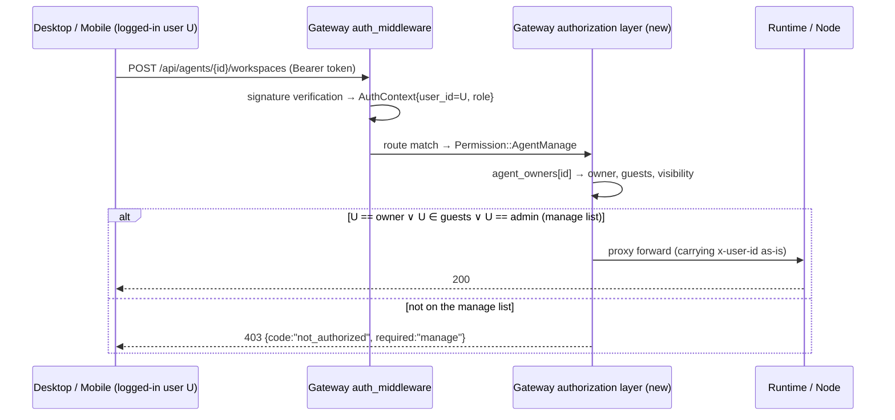

# ADR-087: The Node and Agent Owner Permission Model — Plugging the Hole Where "the Whole Machine Is Writable by Every User by Default"

> **Chinese source of truth**: [ADR-087](../zh/ADR-087-node-agent-owner-permissions.md)
> **Terminology**: see [GLOSSARY.md](./GLOSSARY.md)

**Status**: Draft (v2 revision; Q1/Q2/Q4 and the "single owner + multiple guests" model are decided, see §12 for the rest)
**Date**: 2026-10-28 (v2 revision: added D9 ownership cardinality and the guest model — the two review questions settled it: no "read-only" tier, no multiple owners; collaboration is carried by the manage authorization list; Q1/Q2/Q4 land as decisions)
**Decision Makers**: (TBD)

**Predecessors**:
- [ADR-076](./ADR-076-multi-user-account-system.md) (multi-user account system — this ADR extends the session-dimension isolation paradigm of §decision 4 (`user_id` + a single server-side decision point + `can_write` delivery) to the node and agent dimensions; the business semantics remain valid, and the implementation form is in ADR-084)
- [ADR-084](./ADR-084-user-standalone-process.md) (standalone user-domain process — the account authority lives in `acowork-user`; this ADR's owner is **Gateway-side authorization policy data**, not account data, so the two do not conflict)
- [ADR-075](./ADR-075-node-identity-uuid-and-node-name.md) (node_id = a UUID v4 stable routing key — owner is keyed on `node_id`, so renames/migrations are unaffected)
- [ADR-073](./ADR-073-agent-instance-identity-decomposition.md) (instance_id = UUID v4 — agent owner is keyed on `instance_id`, so multiple instances of a package each have their own owner)
- [ADR-055](./ADR-055-remote-runtime-node-topology.md) (§6.2 enrollment / §6.5 node-reported inventory are the existence authorities — this ADR only adds an "ownership authority", it does not change the existence authority)
- [ADR-009](./ADR-009-gateway-workspace-isolation.md) (Gateway red line: no direct access to Agent-private files — all authorization in this ADR happens at the **reverse-proxy entry point**, introducing no Gateway-side filesystem access whatsoever)
- [ADR-077](./ADR-077-system-agent-demotion-to-default-agent.md) (a default agent is an ordinary agent — it is likewise bound by the owner model, see §12 Q1)

---

## 1. Decision Summary

### 1.1 In one sentence

**Add a Gateway-side persistent `owner_user_id` (single owner) + a `guests` collaboration list to each Node and Agent instance, converging every operation that "changes the machine the Node lives on" (install/uninstall/start/stop agents, adding/removing workspaces, workspace file read/write, LSP/sidecar configuration, fs browse, enroll ownership) into a **manage tier = owner ∨ guest ∨ admin** gate (reads and writes are at the same tier; there is no "read-only" tier); "using" an agent (creating a session to chat) branches on the agent-level `visibility` (private/shared), while the session dimension stays unchanged per ADR-076. Authorization is executed at a single point — the Gateway reverse-proxy entry (where `AuthContext` and the `instance_id→owner` mapping already exist) — and is fail-closed: ownerless resources are admin-manageable only.**

### 1.2 Key Decision Table (detailed rationale in §5)

| # | Decision | Conclusion |
|---|----------|-----------|
| D1 | Where owner is stored | **Two new Gateway-side persistent ownership tables** (`node_owners.json`, `agent_owners.json`, in the same directory and following the same pattern as `node_tokens.json`). **Not in the MQTT proto**: the inventory reported by Node remains the "existence authority" (ADR-055 §6.5); ownership is Gateway's policy data, and Node is not aware of users |
| D2 | Where the node owner comes from | **The enrollment token binds its creator**: in multi_user mode a new `POST /api/nodes/enrollment-tokens` (login required); the token record carries `owner_user_id`, and a successful enroll writes `node_owners.json`. A CLI-issued token is ownerless → that node is ownerless (admin-only). `gateway_managed` local nodes default to ownerless |
| D3 | Where the agent owner comes from | **Whoever installs, owns it**: on successful dispatch of `POST /api/agents/install` / `ensure` / `clone`, write to `agent_owners.json` keyed by `instance_id`, with owner = the caller's `AuthContext.user_id`. An admin can naturally install on any node (Q2 decided, see §12), so the resulting agent's owner = admin; an agent installed by a guest on a shared node has the guest as its owner (D9 rule 3) |
| D4 | Two-tier gating | **Node gating** (ownership of the machine): install/uninstall onto that node, fs browse, rename/drain/remove, LSP sidecar configuration → the node's owner ∨ guest ∨ admin. **Agent gating** (ownership of the instance): start/stop/upgrade/config/prompts/skills/**workspace add/remove/modify**/**file read/write (reads and writes at the same tier)**/debug → the agent's owner ∨ guest ∨ admin. Installing an agent requires **simultaneously** satisfying "can manage the target node" |
| D5 | Execution point | **The Gateway reverse-proxy entry** (a routing policy table in `http/proxy.rs` + handler headers in `agents.rs` / `nodes_api.rs` / `fs_browse.rs`). Runtime does not gain an owner concept (it cannot get the ownership truth and should not); the `x-user-id` scope mechanism is retained as-is, used only for session filtering |
| D6 | Agent use (chat) and visibility | Agents gain `visibility`: `private` (only the manage list may create/use sessions) and `shared` (every logged-in user may open **their own** session on it, with sessions still isolated per ADR-076). **`shared` only opens "use", never "manage"** (workspace/files/config remain the manage list). Defaults: instances installed/ensured/cloned by a user land as `private`; **the default agent preinstalled by onboarding lands as `shared`** (Q1 decided, see §12) |
| D7 | Ownerless, transfer and cleanup (fail-closed) | In multi_user mode **fail-closed**: resources with `owner=None` are admin-manageable only; an admin can claim/transfer via `PATCH .../owner`. Local mode is a complete no-op (the same `AuthMode` switch as ADR-076 §decision 12) |
| D8 | Single source of truth on the server | `GET /api/agents` / `GET /api/nodes` deliver a server-computed `can_manage` / `can_use` boolean per record; Desktop/Mobile **only consumes the boolean for rendering and must not derive it itself** (continuing the discipline of ADR-086 invariant 1) |
| D9 | Ownership cardinality and collaboration | **Single owner + multiple guests**. The owner is unique (unique responsibility, a two-party transfer); a guest is a "manage authorization list" member rather than ownership — it does not change ownership, cannot add/remove guests, cannot transfer, cannot change visibility; revocation immediately loses access and does not reclaim the ownership of agents installed in a guest's own name. Admin and the owner jointly maintain the list (see §5 D9) |

---

## 2. Background: Status Quo and Threat Model

### 2.1 Status Quo Inventory (code facts)

After ADR-076 elevated "user" to a first-class identity dimension, the **session dimension** already has complete isolation:

| Dimension | User binding | Authorization execution point | State |
|---|---|---|---|
| Session (conversation) | `SessionMeta.user_id` + `visibility` | Runtime `is_readable_by`/`is_writable_by` ([core/acowork-memory/src/session_meta.rs:258](../../../core/acowork-memory/src/session_meta.rs#L258)), with the scope coming from the `x-user-id` injected by Gateway | ✅ isolated |
| **Node** | ❌ none. `NodeInfo` ([mqtt_payload.proto:1188](../../../core/acowork-core/proto/mqtt_payload.proto#L1188)), `NodeInfoState` ([node_registry.rs:26](../../../core/acowork-gateway/src/mqtt/node_registry.rs#L26)), `NodeTokenRecord` ([enrollment.rs:197](../../../core/acowork-gateway/src/mqtt/enrollment.rs#L197)) all have no user field | none | ❌ |
| **Agent instance** | ❌ none. `AgentInfo` ([state.rs:28](../../../core/acowork-gateway/src/gateway/state.rs#L28)) and the install/enable endpoints have no owner field | none | ❌ |

In other words, the session dimension has already paid the modelling cost, but **the two dimensions that touch the machine have not been modelled at all**.

### 2.2 Attack / Misuse Scenarios (multi_user mode, any low-privilege account holding a valid login token)

1. **Default-broken cross-machine file read/write**: an ordinary user B calls `GET /api/agents/{A}/workspaces/tree` or `GET /api/agents/{A}/workspaces/file` on another user A's agent, and directly reads that machine's source code / `.env` / `~/.ssh`; further, `POST /api/agents/{A}/workspaces` creates a directory in A's workspace, and `PUT .../file` **writes content into A's workspace** (write-back into the code repo).
2. **Node-level reconnaissance**: `GET /api/fs/browse?target={node_id}` browses the entire disk of any node; `GET /api/nodes` leaks the whole cluster's hostname/OS/arch.
3. **Resource occupation and supply-chain position**: `POST /api/agents/install` with an arbitrary `node_id` installs a malicious/mining agent onto someone else's machine; `POST /api/agents/{id}/start` starts the process.
4. **Damaging others**: `stop` / `uninstall` / `PUT config` (change model, change prompt) / `DELETE workspace` on someone else's agent.
5. **Privilege-escalating snooping**: the `?target=` reverse proxy does not validate the caller's relationship to the node; `GET /api/nodes` leaks the whole cluster's hostname/OS/arch.

Scenario 1 is **broken by default**: it requires no misconfiguration at all — it holds as soon as a set-up Gateway is connected to a second user. This is precisely the motivation for this ADR.

### 2.3 Why session isolation does not block it

The session's `is_writable_by` only protects **conversation data**. The workspace configuration and file APIs have no scope concept at all on the Runtime side (`USER_SCOPE_HEADER` is consumed only by `http/session_control.rs`). An attacker does not need to touch someone else's session — doing work in their own session with the injected workspace, or calling the workspace API directly, has the same effect.

---

## 3. Goals and Non-Goals

**Goals**
1. In multi_user mode, the files and process resources of the machine a Node lives on are, by default, open only to that Node's owner (and admin).
2. An agent instance's configuration surface (config/prompts/skills/workspace/files/lifecycle) is by default open only to the agent's owner (and admin).
3. Preserve legitimate sharing needs: an agent can explicitly declare `shared`, letting other users **use** it without **owning** it.
4. Local mode (single-user self-use) has zero behaviour change; after upgrading to multi_user the migration path is explicit and fail-closed.
5. A single permission decision point and a single source of truth (booleans delivered by the server; the client does not derive them).

**Non-Goals**
1. **No fine-grained RBAC** (per-workspace ACL, per-tool authorization, team role matrices). The two tiers (manage/use) + two roles (owner/admin) cover all currently known scenarios; extend only when a third stable requirement appears (Rule of three).
2. **No change to the MQTT data-plane ACL**. The broker's `can_subscribe` remains Phase-1 permissive ([acl.rs:178](../../../core/acowork-gateway/src/mqtt/acl.rs#L178)); the cross-account retained-event fan-out problem (known, the root cause of e2e flakes) is handled by a follow-up ACL ADR. This ADR only tightens the **HTTP control plane**.
3. **No defence against Node itself misbehaving**. A Node is the user's own machine running the user's own processes; at the OS level it can already see everything on its own disk. What this ADR prevents is **other logged-in users** operating that machine through Gateway.
4. **No approval workflow** (request-approve-authorize-duration, etc.). Transfer and sharing are a single PATCH step performed proactively by the owner.

---

## 4. Terminology and Roles

| Term | Definition |
|---|---|
| **manage** | operations that change the resource itself or its impact on the machine: lifecycle, configuration, workspace add/remove/modify, file read/write, install/uninstall, fs browse, enroll ownership, debug/dev-mode |
| **use** | operations that don't change the resource: creating/opening **your own** session on an agent, sending messages (still bound by ADR-076 session isolation) |
| **owner** | the **unique** user the resource belongs to (`user_id`, a UUID from the `acowork-user` account system). The responsibility anchor: adding/removing guests and changing visibility are owner ∨ admin; a change of the owner field itself is admin only (D7) |
| **guest** | a user granted the **manage** tier on that resource by the owner or admin (the list lives in the ownership table). A guest is authorization, not ownership: no ownership operation power; revocation immediately loses access; no cascade (see D9) |
| **admin** | `Role::Admin`; can manage every resource, claim/transfer ownerless resources, maintain any resource's guest list; following ADR-076's "can see but cannot impersonate" discipline (write operations execute as the admin's own identity, and ownership does not thereby change) |
| **ownerless** | `owner=None`. Under multi_user = admin-only (fail-closed) |

The decision functions (the single implementation inside Gateway):

```text
can_manage(user, resource) := user.is_admin
                            ∨ (resource.owner = Some(user.id))
                            ∨ resource.guests.contains(user.id)
can_transfer(user, resource) := user.is_admin ∨ (resource.owner = Some(user.id))
                            // ownership operations (adding/removing guests / changing visibility) exclude guests;
                            // a change of the owner field itself is admin only (an extension of D7's "can see but cannot impersonate")
can_use(user, agent)       := can_manage(user, agent)
                            ∨ (agent.visibility = Shared ∧ user is logged in)
```

---

## 5. Decision Details

### D1: Owner is Gateway-side policy data — not in the proto, not in Node

**Approach**: two new ownership tables under Gateway's `{data_dir}`, in the same directory and following the same "atomic-write JSON + in-memory mirror" pattern as `node_tokens.json` / `enrollment_tokens.json` ([enrollment.rs](../../../core/acowork-gateway/src/mqtt/enrollment.rs)):

```text
node_owners.json    # node_id (UUID v4, ADR-075) → { owner_user_id: Option<String>, guests: [user_id], visibility, created_at, claimed_by_enroll_token }
agent_owners.json   # instance_id (UUID v4, ADR-073) → { owner_user_id: Option<String>, guests: [user_id], visibility: Private|Shared, created_at }
```

**Why not stuff it into the `NodeInfo` / `InstalledAgentInfo` proto for Node to report**:
- Node is not aware of user accounts (the account authority is in `acowork-user`; Node only has a node token). Having Node carry/echo the owner means handing the policy truth to the data plane, and after a Gateway restart the ownership would be rebuilt from the retained inventory — **a tampered Node-side inventory could then change ownership**. The authorization foundation cannot be built on a channel that a lower-trust component can overwrite.
- Existence authority and ownership authority are separated: the inventory says "this instance is on that machine" (Node's authority), the owner says "who may operate it" (Gateway's authority). After uninstall the owner-table entry is cleaned up with a delay (see D7's cleanup policy).

**Cost**: two more local state files in Gateway; node migration/reinstall does not lose ownership (the key is a stable UUID — exactly the groundwork ADR-073/075 laid in advance).

### D2: The node owner comes from the enrollment token's creator

Status quo: enrollment tokens can only be issued by the CLI `acowork-gateway nodes token create` ([cli.rs:496](../../../core/acowork-gateway/src/cli.rs#L496)); issuance has no user context, and `EnrollmentTokenRecord` only has `consumed_by: Option<node_id>`.

**Decision**:
1. `EnrollmentTokenRecord` gains `owner_user_id: Option<String>`.
2. In multi_user mode a new `POST /api/nodes/enrollment-tokens {ttl}` (login required): the issued token has `owner_user_id = caller`. The Desktop "add device" wizard switches to this endpoint to obtain the token + the copyable `acowork-node start --token ...` command.
3. The successful enroll path (`decide_enroll` → Accept, [dispatch.rs:1114](../../../core/acowork-gateway/src/mqtt/dispatch.rs#L1114)) writes the token's `owner_user_id` into `node_owners.json`.
4. A CLI-issued token (ownerless) → the node is ownerless → admin-only. A `gateway_managed` local node (spawned by Gateway itself) defaults to ownerless: that Gateway machine belongs to the deployer (admin).
5. Re-enrolling the same node (reconnect/reinstall with identity not lost) does not change the owner; after `identity.json` is lost, **re-enrolling with a new node_id** counts as a new device (the token's creator is the owner).

**Why not "the first user to use it becomes the owner"**: the enroll action is itself the declaration of "connecting this machine to the cluster", so the token's creator is the most honest ownership signal, with no claiming needed afterwards.

### D3: Agent owner = the installer

`install_agent` ([agents.rs:1032](../../../core/acowork-gateway/src/http/agents.rs#L1032)) already has Gateway generate the `instance_id` (at install time, with the caller already authenticated), which is the natural anchor for writing ownership:

- `POST /api/agents/install`, `POST /api/agents/ensure` (declarative; when first creating the instance), `POST /api/agents/{id}/clone`: after successful dispatch, write `agent_owners.json[instance_id] = { owner: AuthContext.user_id, visibility: Private }`.
- When `ensure` hits an existing instance the owner is **not** changed (the idempotency semantics constrain existence, not ownership).
- Local mode has no `AuthContext` → write `owner=None`, which is fine since Local doesn't verify anything (D8).
- **Initial visibility**: install/ensure/clone default to `Private` when writing the table; the only exception is the default agent preinstalled by Desktop onboarding (the ADR-077 bundled package), which lands as `Shared` — a team deployment's out-of-the-box assumption is "anyone can chat", with the risk wording carried by the UI (see D4's "the boundary of shared"). The default agent's owner is still the first user who ran onboarding, and the owner may later switch it back to private.

### D4: Two-Tier Gating + the Permission Matrix

**Node gating** (ownership of the machine: node owner ∨ guest ∨ admin) and **Agent gating** (ownership of the instance: agent owner ∨ guest ∨ admin) are layered. In the table below "manage list" = owner ∨ guests ∨ admin; "ownership list" = owner ∨ admin (guests are not included, see D9):

| Operation (Gateway HTTP route) | Gating tier | Required permission |
|---|---|---|
| `POST /api/nodes/enrollment-tokens` | open | login is enough (enrolling your own machine) |
| `GET /api/nodes` | open (field trimming) | logged-in users see id/name/online/`can_manage`; hostname/OS/arch/endpoint only visible to the manage list |
| `PATCH /api/nodes/{id}` (rename) | Node-manage | manage list |
| `PATCH /api/nodes/{id}/visibility`, `PATCH /api/nodes/{id}/guests`, `PATCH /api/nodes/{id}/owner` | Node-transfer | ownership list (no guests) |
| `POST /api/agents/install`, `ensure`, `clone` (choosing a target node) | Node-manage | the target node's manage list (installing onto someone else's machine requires machine permission first; an agent installed by a guest is owned by the guest, see D9 rule 3) |
| `DELETE /api/agents/{id}` (uninstall) | Node-manage ∧ Agent-manage | both lists must pass (uninstall touches both the machine and the instance) |
| `POST /api/agents/{id}/start` / `stop` / `restart` / `upgrade` | Agent-manage | the agent's manage list |
| `PUT /api/agents/{id}/config` / `builtin-tools` / `model` / prompts / skills writes / avatar / manifest upload | Agent-manage | the agent's manage list |
| `POST/PUT/DELETE /api/agents/{id}/workspaces*` (including file/dir/copy/rename/prompt-file/fs-watch) | Agent-manage | the agent's manage list |
| `GET /api/agents/{id}/workspaces*`, `/tree`, `/file`, `/raw`, `/find`, `/search`, git reads | Agent-manage | the agent's manage list — **reads count as manage**: workspace content is files on the machine, so read permission is at the same tier as write permission; there is no "read-only" tier (otherwise the write gate is pointless, see rejected option H in §7) |
| `POST /api/agents/{id}/git/revert`, `debug/enable` | Agent-manage | the agent's manage list |
| `GET /api/fs/browse?target={node_id}` | Node-manage | the node's manage list (a Local target is the Gateway machine → ownerless → admin-only) |
| `PATCH /api/agents/{id}/visibility`, `PATCH /api/agents/{id}/guests`, `PATCH /api/agents/{id}/owner` | Agent-transfer | the agent's ownership list (no guests) |
| `GET /api/agents`, `GET /api/agents/{id}` (list/detail/avatar) | visibility filtering | private: the manage list (owner ∨ guests ∨ admin); shared: all logged-in users |
| The session control plane (create/open/close/delete/messages) | Agent-use ∧ ADR-076 | `can_use(agent)`, everything else per the existing `user_id`/`visibility` isolation, **unchanged** |

**The boundary of shared must be spelled out**: marking an agent `shared` = allowing others to **drive this agent to work with its mounted workspaces** (the agent will read/write files with workspace permission, and content may enter conversations). This is the semantics of "sharing an assistant", not "sharing filesystem browse rights" — users not on the manage list still cannot see the workspace list/file tree and can only chat. The documentation and UI must write this risk statement clearly.

### D5: The Execution Point Is the Gateway Reverse-Proxy Entry; Runtime Is Not Aware of Owner

**Approach**:
1. After `auth_middleware`, add a lightweight **authorization policy layer**: a static table mapping route patterns → `Permission::{None, NodeManage, NodeTransfer, AgentManage, AgentTransfer, AgentUse}` (Transfer = the ownership list owner ∨ admin, see D4/D9), assembled in [routes.rs](../../../core/acowork-gateway/src/http/routes.rs) (the same style of layer as `restricted_mode_middleware`). The handler takes the identity from `Extension<AuthContext>` (already present, [auth_middleware.rs:29](../../../core/acowork-gateway/src/http/auth_middleware.rs#L29)) and the ownership from the `agent_owners` / `node_owners` tables, producing a 403.
2. `instance_id → node_id` uses the existing `resolve_agent_node_id` ([agents.rs:561](../../../core/acowork-gateway/src/http/agents.rs#L561)); the `{id}` path parameter remains "an instance or package id" — the existing `resolve_agent_identity` resolves it first, then ownership is looked up.
3. Rejection semantics: `403 {"error":"forbidden","code":"not_authorized","resource":"agent|node","required":"manage"}` — it deliberately does not leak whether the resource exists (avoiding existence probing).
4. `?target=` reverse proxy paths also take the permission from the **target** node (not the agent in the path), otherwise switching the target bypasses the gate.
5. **No change to `x-user-id` injection**: session isolation (ADR-076) still flows through it; the owner model simply adds a second dimension on top.

### D6: The `visibility` Field for Agent / Node

- `agent_owners.json.visibility: Private (default) | Shared`, switched by `PATCH /api/agents/{id}/visibility` (ownership list: owner ∨ admin; guests cannot change it, see D9 R1); `GET /api/agents` entries carry `visibility` + the server-computed `can_manage`/`can_use`. The default rules are in D3 (the onboarding default agent is the exception landing as Shared, Q1 decided).
- `node_owners.json.visibility: Private (default) | Public`: `Public` refers **only to metadata** (name/online) being visible to everyone, so a team can know "this GPU machine exists"; **it opens no manage permission and does not open install** (install always requires the node manage list). The correct way to let others install/maintain agents on the machine is to **add a node guest** (D9), or for the owner to install a shared agent on it for people to chat with.
- Entries with no historical `visibility` read as `Private` (fail-closed by default).

### D7: Ownerless Resources, Transfer and Cleanup (fail-closed)

| Situation | Rule |
|---|---|
| Upgrade migration: existing node/agent with no owner record | on first entering multi_user they are **not auto-claimed**. After an admin logs in they see all ownerless resources and claim via `PATCH .../owner`. Ordinary users instantly lose operating power over existing others' agents (which they should never have had) — this is the fix itself, not a regression |
| The owner's account is disabled/deleted | the resource falls back to ownerless (admin-only). Gateway does no cascading delete (the data is on the node; whether to delete it is the machine owner's/admin's decision) |
| The owner wants to hand over | `PATCH /api/agents/{id}/owner {user_id}` is callable by admin only (transfer = an authorization change; the owner themselves can only "share", not "change the master", avoiding unaudited ownership kicking) |
| After uninstall | the `agent_owners.json` entry is deleted when Gateway observes the retained inventory being cleared (dispatch.rs's remove path); orphan entries (whose instance has not been seen for 30 days) are WARNed about at startup and retained (better to keep the audit trail than leave dangling permissions) |

### D8: A Single Source of Truth on the Server + Local Mode no-op

**Single source of truth**: `GET /api/agents` / `GET /api/nodes` deliver, per record, the `can_manage` / `can_use` / `is_guest` / `visibility` computed by Gateway using §4's decision functions; Desktop/Mobile only consumes the booleans for rendering (disabling/hiding manage entries) and **must not** derive them from the `owner`/`guests` lists (continuing ADR-086 invariant 1). The 403 fallback and the boolean delivery must come from the same source (the same decision function, eliminating drift).

**Local mode no-op**: structurally identical to ADR-076 §decision 12: under `AuthMode::Local`, `auth_middleware` produces no `AuthContext` and the authorization layer passes straight through (the policy table exists but is not evaluated); the owner tables are still written (Local also records owner, keeping data for a future switch to multi_user). **No new configuration knob is added** — the single `AUTH_MODE` dial is already an existing decision, and adding an `owner_enforcement=off` style knob would be leaving the back door open on a security fix.

### D9: Ownership Cardinality = Single Owner + Multiple Guests (Collaboration through Authorization, Not Ownership)

**Problems**: ① Should owner be split into further permission tiers (read-write vs read-only)? Should non-owners be entirely invisible? ② Are multiple owners allowed (an admin adding an owner for a node)?

**Decision 9a: the permission axis stays at two tiers (manage/use); no "read-only" tier.**
"Read-only" is not a security tier in this domain: a workspace file "read-only" = all of the node machine's data can be dragged away by `GET /workspaces/file`, so reads and writes must be at the same tier (D4's table). Therefore no third state of "owner read-write / non-owner read-only" exists. A non-owner's only legal forms are:
- **guest** (manage authorization; read-write and config fully open, but no ownership operation power);
- **use** (opening your own session on a shared agent to chat, with no visibility into the workspace list/file tree).
Plus the two pre-existing exceptions: resource metadata visibility (D6's public node / shared agent) and admin's `as_user` read-only view (ADR-076 §decision 4, retained as-is).

**Decision 9b: the owner is unique; all collaboration needs are carried by the guest list.**
Multiple owners (equal co-ownership) is rejected: who can transfer, who can revoke whom, who adjudicates conflicts — the semantics of ownership collapse, and "who is responsible for this machine" degrades from an anchor into a set, which is exactly the state this ADR aims to eliminate. Under a single owner + guest list: **a guest is authorization (addable, removable, revocable, with no residue), the owner is ownership (unique, transferred under audit)**. The real need behind "the admin adds an owner for someone" maps into this model as "add a guest" in every case.

**The guest's three boundary rules**:

| # | Rule | Meaning |
|---|---|---|
| R1 | **Grants manage, not ownership** | a guest cannot transfer the owner, cannot add/remove guests, cannot change visibility. Ownership operations always have exactly the two parties owner ∨ admin (`can_transfer`, §4) |
| R2 | **No cascade** | a node guest is not a guest of the agents on that node. The node list answers "who may use this machine", the agent list answers "who co-maintains this instance"; the two levels' lists are maintained independently |
| R3 | **Revocation immediately loses access; ownership is not reclaimed** | after being removed as a guest they immediately lose manage; but agents they installed on that resource in their own name are still theirs (ownership is independent of authorization). Uninstalling those agents requires that person / admin, or the target node's manage list |

**Guest list operations**: `PATCH /api/nodes/{id}/guests`, `PATCH /api/agents/{id}/guests` (full-replacement semantics, PUT-list style, so the ownership list is adjustable); `GET /api/agents|nodes` entries deliver `is_guest: bool` (folded into the `can_manage` computation; the client does not query the list itself — D8's single source of truth is unchanged).

**Why guests have no sub-tiers (editor/viewer)**: same reason as 9a — being able to read a file means being able to take the file, so "viewing" and "editing" are inseparable in the file domain; the use tier is already solved globally by visibility, so no per-user "chat-only" list is needed (shared means everyone can chat; if private later needs "a designated few may chat", add `chat_guests` — Rule of three, not now).

---

## 6. Authorization Flow



---

## 7. Rejected Options

| Option | Reason for rejection |
|---|---|
| **A. owner enters the proto, reported/echoed by Node** | ownership truth is handed to the data plane (Node inventory can be rewritten by Node), and is overwritten by inventory after a Gateway restart; Node is not aware of the account system. See D1 |
| **B. Owner verification on the Runtime side (Gateway merely passes through)** | Runtime needs a full ownership-table sync + dual node/agent truth copies; Gateway is already the sole multi_user entry point and the existing authorization point (`AuthContext` lives there), so adding a second execution point violates the single source of truth |
| **C. Generic RBAC (a role × resource × action table)** | there are only two permission tiers and two roles today; a generalised framework has no near-term consumer (YAGNI), and client-side rendering complexity explodes |
| **D. per-workspace ACL (workspace-level sharing authorization)** | rule of three not yet triggered; workspace permission naturally follows agent permission (both mean "touching this machine's files"); subdividing waits for a real need |
| **E. Default shared, the owner only nominally in charge** | the opposite of the threat model — this ADR's motivation is precisely "public by default", so the default must be private and fail-closed |
| **F. Auto-assigning existing data to the first admin who logs in** | silently changing ownership with no audit; ownerless + explicit claim is safer, and the cost is just one extra claiming click by the admin |
| **G. Only blocking workspace writes, not reads / fs browse** | reads and writes are at the same tier (see D4's table); blocking only writes equals allowing `GET /workspaces/file` to exfiltrate the whole disk, making the gate pointless |
| **H. A "non-owner read-only" tier (three tiers: owner read-write / guest read-only / others invisible)** | in this domain "read-only" is not a security tier: being able to read workspace files = the node machine's data can leak wholesale, so reads and writes must be at the same tier. A non-owner's only legal forms are guest (manage authorization) and use (shared chat). See D9a |
| **I. Multiple owners (equal co-ownership, an admin adding an owner for a resource)** | ownership semantics collapse: transfer/revocation/conflict adjudication has no arbiter, and "who is responsible for this machine" degrades from an anchor into a set. Collaboration needs are carried by the guest list; the real need behind "add an owner" maps into the model as "add a guest". See D9b |

---

## 8. Impact

**Positive**
- The default topology changes from "the whole machine is public to all users" to "the machine belongs to the person who enrolled it"; attack scenarios 1-5 are all closed.
- Sharing changes from "accidental default" to "explicit declaration" (agent visibility).
- Client-side permission rendering is unified to server booleans, eliminating frontend derivation (continuing ADR-086's invariant).

**Costs and risks**
- Two new Gateway local state files (the same pattern as the existing token tables, so the operational surface barely grows).
- On upgrade day: all existing agents become private to ordinary users — the release note must clearly state the "admin claims" step.
- Every agent route proxied through Gateway must enter the policy table; **missing one leaves a hole**. Mitigation: the policy table is designed as "deny by default" (an unregistered `/api/agents/{id}/**` write method is treated as Agent-manage; read methods are explicitly registered; forgetting to register a new route fails closed), plus a test for that invariant (§9).
- The MQTT data plane remains permissive: this ADR does not solve the known "other users' session events fan out to all localhost clients" problem, which needs a follow-up ACL ADR (§13 Q3).

---

## 9. Verification Plan

1. **Unit tests (Gateway)**: the policy table as a pure function — the full route × role × ownership → allow/deny matrix; with emphasis on regressing "an unregistered route is denied by default".
2. **Structural invariant test (into `dev/ci.sh`, alongside `run_gateway_fs_redline`)**: enumerate all `/api/agents/{id}/**` and `/api/fs/browse` routes registered in `proxy.rs`/`agents.rs`/`fs_browse.rs`, and assert that each has an explicit tier in the policy table or falls into the default-deny bucket — **a new route that isn't registered turns CI red**.
3. **e2e (multi_user)**: alice installs an agent on node A and sets it private → bob `GET workspaces/tree` / `PUT file` / `fs/browse?target=A` all 403; alice marks it shared → bob `POST sessions` returns 201 and bob's session is still isolated from third parties other than alice per ADR-076; admin has full access + claim + transfer.
4. **guest semantics (D9's three rules asserted one by one)**: alice adds bob as an agent guest → bob `POST workspaces` 200, bob `PATCH guests/visibility/owner` 403 (R1); bob added as a guest of node A → bob can install an agent on A and that agent's owner = bob; after alice revokes bob's node guest, bob's already-installed agent keeps its ownership (R2/R3); after guest revocation, manage calls immediately 403 (no cached residue).
5. **Local mode regression**: under `AuthMode::Local` all behaviour is byte-identical to pre-upgrade (the no-op assertion).
6. **Migration rehearsal**: upgrading with existing data → an ordinary user's list only contains their own visible items; after an ownerless resource is claimed by the admin, functionality is restored.
7. **e2e (Desktop + Mobile)**: non-owners' manage entries are disabled per `can_manage=false`; the shared agent's chat path works smoothly; the guest badge and list-management UI are usable.

---

## 10. Implementation Breakdown (by module, for scheduling)

| Step | Content | Involves |
|---|---|---|
| 1 | `node_owners.json` / `agent_owners.json` storage (atomic write + in-memory mirror, following enrollment.rs) | a new `ownership.rs` module under `acowork-gateway/src/gateway/` |
| 2 | enroll binds the owner (token record + `decide_enroll` writes the table); `POST /api/nodes/enrollment-tokens` | `mqtt/enrollment.rs`, `mqtt/dispatch.rs`, `http/nodes_api.rs`, `cli.rs` |
| 3 | install/ensure/clone write the agent owner; uninstall / retained-clear cleanup | `http/agents.rs`, `mqtt/dispatch.rs` |
| 4 | the authorization policy layer (deny by default + explicit tiers) + structured 403 errors; `can_manage`/`can_use` delivery | `http/routes.rs`, `http/proxy.rs`, `http/agents.rs`, `http/fs_browse.rs` |
| 5 | visibility + guests: `PATCH /api/agents/{id}/visibility`, `PATCH /api/agents/{id}/guests`, `PATCH /api/nodes/{id}/visibility`, `PATCH /api/nodes/{id}/guests` (ownership-list adjustable), `PATCH .../owner` (admin); list filtering includes the guest dimension; `can_manage`/`can_use`/`is_guest` delivery | the same as above |
| 6 | the ci.sh route-registration invariant test + integration/e2e | `dev/ci.sh`, `tests/` |
| 7 | Desktop: the device-add wizard switches to the HTTP enrollment token; AgentList/NodeList consume the booleans; the owner badge + claim UI; Mobile synchronously consumes `can_manage`/`can_use` (aligning with ADR-086 decision 11's "single source of truth on the backend") | `apps/acowork-desktop`, mobile |

Steps 1-4 are the minimal closed loop of the security fix (plug the hole as soon as it ships); 5-7 can follow.

---

## 11. Compatibility Red Lines

- The `NodeInfo` / `InstalledAgentInfo` proto fields are not changed (ownership does not enter the data plane); the MQTT topic structure is unchanged.
- No change to any session-dimension semantics (ADR-076 §decision 4 remains valid as-is); the `x-user-id` injection mechanism is untouched.
- No change to Gateway's red lines (ADR-009 §5): all authorization happens at the reverse-proxy entry, and Gateway still does not touch Agent-private files.
- No compatibility layer: under multi_user an unregistered route is directly 403, never silently allowed ("a silent fallback masks an insecure state" is itself the anti-pattern this ADR aims to eliminate).

---

## 12. Open Questions

| # | Question | Status |
|---|---|---|
| Q1 | **Ownership of the default agent (ADR-077)**: onboarding installs it as the first user → owner = that user, and by default other users cannot use it. Should the "default agent installed by onboarding" default to `shared` (out-of-the-box for teams)? | ✅ **Decided (2026-10-28): `Shared` by default**. The default agent preinstalled by onboarding lands as shared, and the owner may switch it back to private; instances the user installs themselves keep the default private. See D3 |
| Q2 | **Where an admin's install lands**: when an admin installs an agent onto user X's node, does it require X's manage authorization? Or can an admin naturally install on any node? | ✅ **Decided (2026-10-28): an admin may install on any node**. An admin naturally passes all Node-manage/Agent-manage gates, with no `admin_overrides_nodes` knob added (no near-term need → no config surface, YAGNI). Ownership is still recorded as the admin's own, and the node owner can later reclaim it via an admin transfer |
| Q3 | **MQTT data-plane ACL**: permissive subscribe causes cross-account event fan-out (the known e2e flake root cause). After the owner model lands, the ACL's subscription filtering rules (`user:{id}` may only subscribe to events for resources visible to them) should align with it | A separate ADR (orthogonal to this ADR's HTTP control plane; does not block this ADR) |
| Q4 | **Cost attribution of a shared agent**: when someone else uses my shared agent, it burns my provider key / quota. Should the budget (budget tracker) account per caller or cap per agent? | ✅ **Decided (2026-10-28): account per agent, not per user**. Usage belongs to the agent (hence to its owner's key/quota), and the budget tracker stays at agent granularity; caller-level apportionment / caps are revisited when a real need appears |
| Q5 | **Read endpoints such as `GET /api/agents/{id}/avatar`**: for a private agent, should a non-owner get a 404 or be allowed? | Recommend 404 (the list is already filtered, avoiding existence probing); decided at implementation time |

---

## 13. Reference File Index

| File | Relevance |
|---|---|
| [core/acowork-gateway/src/http/routes.rs](../../../core/acowork-gateway/src/http/routes.rs) | where the policy layer is assembled alongside `restricted_mode_middleware`; the main battleground for the policy table |
| [core/acowork-gateway/src/http/proxy.rs](../../../core/acowork-gateway/src/http/proxy.rs) | all `/api/agents/{id}/**` proxy routes; the policy table's main battlefield |
| [core/acowork-gateway/src/http/agents.rs](../../../core/acowork-gateway/src/http/agents.rs) | install/ensure/clone/start/stop/uninstall; the owner write points |
| [core/acowork-gateway/src/http/fs_browse.rs](../../../core/acowork-gateway/src/http/fs_browse.rs) | the `?target=` proxy; Node-manage gating |
| [core/acowork-gateway/src/mqtt/enrollment.rs](../../../core/acowork-gateway/src/mqtt/enrollment.rs) | the token record gains `owner_user_id`; the persistence pattern template for ownership.rs |
| [core/acowork-gateway/src/mqtt/dispatch.rs](../../../core/acowork-gateway/src/mqtt/dispatch.rs) | `decide_enroll`, the installed-inventory aggregation (the timing of owner binding / cleanup) |
| [core/acowork-gateway/src/mqtt/node_registry.rs](../../../core/acowork-gateway/src/mqtt/node_registry.rs) | the Node online view; the `can_manage` rendering input |
| [core/acowork-memory/src/session_meta.rs](../../../core/acowork-memory/src/session_meta.rs) | the reference for the session-dimension decision pattern (`is_readable_by`/`is_writable_by`) |
