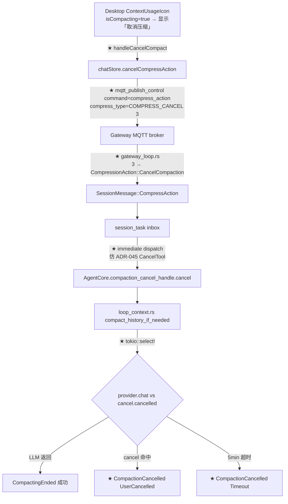
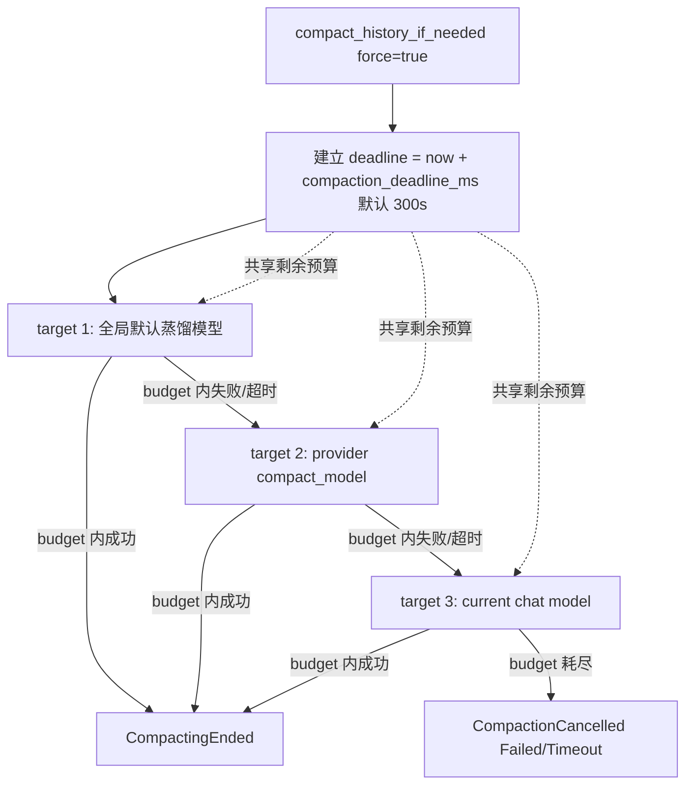
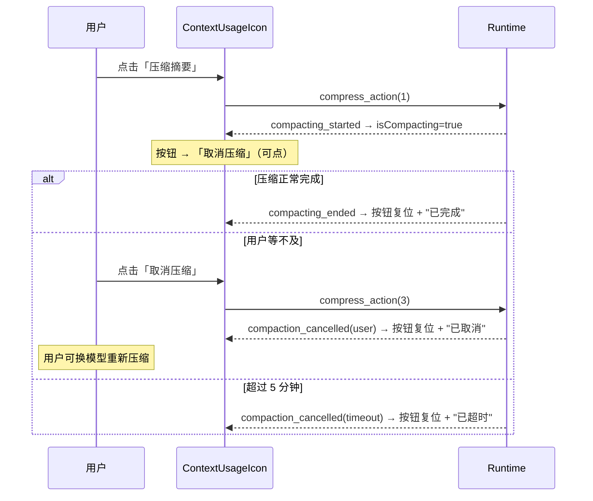

# ADR-083：上下文压缩可取消 + 蒸馏总时限守卫

**状态**：草案（待决策）
**日期**：2026-09-23
**决策者**：大鱼

**前置**：
- [ADR-010](./ADR-010-context-compression-simplification.md)（上下文压缩简化）
- [ADR-011](./ADR-011-compaction-as-distillation.md)（摘要即蒸馏）
- [ADR-023](./ADR-023-centralized-timeout-config.md)（统一 Timeout 配置管理）
- [ADR-044](./ADR-044-cancellation-token.md)（Stop 信号链路 + CancelHandle 统一化）
- [ADR-045](./ADR-045-tool-progress-and-cancel.md)（工具进度心跳与单工具取消 — 本 ADR 复用其 immediate-dispatch 范式）
- [ADR-052](./ADR-052-tool-compression-llm-autonomous.md)（工具压缩 LLM 自主化）
- [ADR-056](./ADR-056-global-default-compact-model.md)（全局默认精简模型 + 跨 provider 三级 fallback）
- [ADR-061](./ADR-061-context-compression-byte-budget.md)（上下文压缩 5 级递减策略）

**触发动因**：
2026-09-23 生产事件。N.Ponytail agent 触发自动上下文压缩（`Triggering LLM compaction ... force=true`，`usage_percent=89.97`，蒸馏目标为跨 provider 的 `custom-agnes/agnes-3.0-flash`）后，**UI 的"压缩中"转圈持续 14 分钟以上无任何状态变化**，用户点击压缩按钮无响应（按钮处于 `disabled` 灰色状态），无法取消、无法换模型重试。

排查结论（代码实测）：
1. **压缩 LLM 调用完全没有总时限守卫**——`episode_distill::compact_with_llm` 直接裸 `await provider.chat(request)`，向上 `compact_history_if_needed` 的 tier fallback 循环也没有任何 deadline。
2. **唯一的超时来自 reqwest client 的 `provider_request_timeout_ms`（默认 600s = 10 分钟）**，且被 `ReliableProvider` 的 `max_attempts=3` 串行重试放大——最坏情况单次压缩 ≳ 30 分钟。多次 tier fallback 之间无共享预算，总时长无上界。
3. **压缩路径不在 cancellation tree 上**——`loop_context.rs` 完全不读 `CancelHandle`，即使用户点 Stop 整个 session，正在跑的蒸馏 LLM 调用也无法被中断（要等到 await 自然返回、回到主循环 checkpoint 才看到 stop flag）。
4. **前端压缩按钮在 `isCompacting=true` 时被禁用**（`disabled + opacity-40`），只切换文案为 `compressing`，用户没有任何干预手段。
5. **后端只推送 `CompactingStarted` / `CompactingEnded` 两个布尔态事件**，没有"取消/超时/失败"语义区分，前端无法在结束时给出准确反馈。

---

## 1. 决策摘要

为上下文压缩引入**可取消**与**总时限**两项一等能力，并让前端从"被动等待"升级为"主动可控"。

1. **总时限守卫（硬性）**：`episode_distill::compact_with_llm` 外层包裹 `tokio::time::timeout`，默认 **5 分钟**。超时即 fail-fast 返回可区分的 `SummaryError::Timeout`，不再无限等待。整个 `compact_history_if_needed` 的 tier fallback 循环共享同一份剩余预算——**一次手动/自动压缩端到端不超过 5 分钟**。
2. **可取消（硬性）**：压缩调用接入 `CancelHandle`（ADR-044 既有机制）。蒸馏的 `provider.chat()` await 用 `tokio::select!` 同时等待 LLM 结果与 `cancel_handle.cancelled()`；用户取消后 ≤ 500ms 内中断，**history 保持原样不被破坏**，session 回到 Idle，用户可换模型重新压缩。
3. **前端按钮双态切换（仿发送→停止按钮）**：压缩进行中，压缩按钮变为**可点击的"取消压缩"**（红色/强调色 + `Square` 图标 + "取消压缩" 文案），点击立即触发取消；非压缩态回到原"压缩摘要"按钮。**与 `ChatPanel.tsx` 现有 `sending ? handleStop : handleSend` 完全同构**。
4. **结束语义细分**：新增 `ChunkEvent::CompactionCancelled { reason }`，reason ∈ `{UserCancelled, Timeout, Failed}`，成功仍走 `CompactingEnded`。前端据此区分 toast 文案，并正确复位按钮状态。
5. **配置集中化**：新增 `Timeouts::compaction_deadline_ms`（默认 `300_000`），纳入 ADR-023 的统一超时真相源，可经现有 TOML 配置覆写。

**非目标**：
- 不改变压缩的 5 级递减策略（ADR-061）与三级蒸馏模型 fallback 链（ADR-056）。
- 不引入第二套取消机制——完全复用 ADR-044 的 `CancelHandle` + ADR-045 的 `mqtt_publish_control` immediate-dispatch 范式。
- 不修改 `provider_request_timeout_ms` 默认值（10 分钟）——它是单次 HTTP 语义，与本 ADR 的端到端 deadline 是两个层次。

---

## 2. 背景与动机

### 2.1 现状链路（事实，含文件路径）

**压缩触发（手动）**：

```
[1] Desktop ContextUsageIcon.tsx:513  「压缩摘要」按钮 onClick=handleCompressSummary
        ↓ sendCompressAction(agentId, sessionId, 1)
[2] chatStore.ts:1575  invoke("mqtt_publish_control", { command: "compress_action",
                          payload: { session_id, compress_type: 1 } })
        ↓ MQTT publish on acowork/agents/{id}/control/{sid}
[3] Runtime mqtt client → gateway_loop.rs:1055  CompressType(1) → CompressionAction::CompressSummary
        ↓ SessionMessage::CompressAction → session_task inbox
[4] session_task.rs:1341  CompressSummary → agent_loop.compact_history_if_needed(&model, /*force=*/true).await
[5] loop_context.rs:676  compact_history_if_needed
        ↓ loop_context.rs:689  try_send_chunk(ChunkEvent::CompactingStarted)
        ↓ loop_context.rs:729  for target in &targets { ... }
              episode_distill.rs:604  provider.chat(request).await      ← 无 timeout、无 cancel
[6] loop_context.rs:1147  try_send_chunk(ChunkEvent::CompactingEnded)
```

**事件推送（后端 → 前端）**：

```
ChunkEvent::CompactingStarted/Ended
    → startup/subsystems.rs:358  publisher.publish_compacting(sid, true/false)
    → MQTT retained topic
    → chatStore.ts:3039  订阅 "compacting_started" / "compacting_ended"
    → sessionState.isCompacting = true/false
    → ContextUsageIcon.tsx:87  isCompacting → 按钮 disabled
```

**前端按钮现状**（`ContextUsageIcon.tsx:513-525`）：

```tsx
const canAct = isIdle && !isCompacting && contextUsage != null;   // :172
...
<button
  onClick={handleCompressSummary}
  disabled={!canAct}                                              // :514 —— 压缩中即禁用
  className={cn(..., "disabled:cursor-not-allowed disabled:opacity-40")}  // :519
>
  {isCompacting ? t("contextUsage.compressing") : t("contextUsage.compressSummary")}  // :522
</button>
```

### 2.2 存在的能力缺口

| 缺口 | 现状 | 后果 |
|---|---|---|
| **无端到端 deadline** | reqwest 单请求 600s × retry 3 × tier fallback N | 单次压缩理论上 ≳ 30 min 无上界；UI 无限转圈 |
| **无取消通路** | `loop_context.rs` 不读 `CancelHandle` | 用户点 Stop 也不生效；必须强杀进程（本次事件即如此） |
| **按钮不可交互** | `isCompacting` → `disabled` | 用户无法干预，只能干等/重启 |
| **结束语义单一** | 只有 `CompactingEnded` 布尔 | 无法区分"成功/取消/超时/失败"，用户体验割裂 |

### 2.3 为什么"取消后换模型重试"是必需的

用户在事件中明确反馈：**"有时候确实是压缩模型的问题，取消了换个模型压缩就好了"**。当前设计把用户锁死在"等待一个可能永远不返回的下游 provider"，且没有逃生通道。压缩模型（跨 provider 蒸馏，ADR-056）是一个**可能配置错误、可能不可达、可能过慢**的外部依赖；对这类依赖，**用户可控的中断与重试**不是可选项，而是正确性的一部分。

### 2.4 设计目标

1. **有界**：任何一次压缩端到端有确定上界（默认 5 min）。
2. **可中断**：压缩进行中用户可随时取消，取消延迟 ≤ 500ms，且不损坏 history。
3. **可重试**：取消/超时后 session 回到 Idle，用户可立即换模型或换 provider 重新发起。
4. **可观测**：结束原因（成功/取消/超时/失败）在三端（日志/MQTT/UI）语义一致。
5. **复用优先**：不发明新 IPC、新取消原语、新超时体系。

---

## 3. 架构与数据流

### 3.1 取消链路（新增部分用 ★ 标注）



### 3.2 总时限的作用域



**关键约束**：三档 fallback **共享同一个 deadline**，而非每档重新计时。这是与现状（每档各自 600s×3）最本质的区别——保证"用户最多等 5 分钟"。

---

## 4. 数据模型

### 4.1 proto 扩展（`core/acowork-core/proto/mqtt_payload.proto`）

```proto
enum CompressType {
  COMPRESS_TYPE_UNSPECIFIED  = 0;
  COMPRESS_TYPE_SUMMARY      = 1;  // → CompressionAction::CompressSummary
  COMPRESS_TYPE_TOOL_RESULTS = 2;  // 历史保留（ADR-052 已移除实现）
  COMPRESS_TYPE_CANCEL       = 3;  // ★ 新增 → CompressionAction::CancelCompaction
}

// ★ 新增：压缩被中断的原因（附在 compacting 状态事件里）
enum CompactionCancelReason {
  COMPACTION_CANCEL_REASON_UNSPECIFIED = 0;
  COMPACTION_CANCEL_REASON_USER        = 1;  // 用户主动取消
  COMPACTION_CANCEL_REASON_TIMEOUT     = 2;  // 总时限到期
  COMPACTION_CANCEL_REASON_FAILED      = 3;  // 所有 tier 失败（非超时）
}
```

> 注：`COMPRESS_TYPE_CANCEL = 3`（不复用 `2`，因 `2` 已在 proto 中声明为 TOOL_RESULTS）。

### 4.2 Runtime 枚举扩展（`core/acowork-runtime/src/agent/loop_.rs`）

```rust
pub enum CompressionAction {
    CompressSummary,
    CompactionCancel,        // ★ 新增
}

pub enum ChunkEvent {
    CompactingStarted,
    CompactingEnded,                                   // 成功路径保留
    CompactionCancelled { reason: CompactionCancelReason },  // ★ 新增
    // ...
}

pub enum CompactionCancelReason {   // ★ 新增（与 proto 对齐）
    UserCancelled,
    Timeout,
    Failed,
}
```

### 4.3 超时配置扩展（`core/acowork-core/src/timeout_config.rs`）

```rust
pub struct Timeouts {
    // ... 既有字段 ...
    pub compaction_deadline_ms: u64,   // ★ 新增，默认 300_000（5 min）
}

fn default_compaction_deadline_ms() -> u64 { 300_000 }
```

TOML 字段名 `compaction_deadline_ms`，纳入 ADR-023 的统一配置与 `validate()` 校验（要求 > 0 且 ≤ `provider_request_timeout_ms × max_attempts`，否则告警）。

---

## 5. 模块改动清单

### 5.1 Runtime（core/acowork-runtime）

| 文件 | 改动 |
|---|---|
| `src/agent/loop_context.rs` | ① `compact_history_if_needed` 建立 `deadline`；② tier 循环每轮用剩余预算；③ `provider.chat` 调用改为 `tokio::select!`（LLM vs `cancel_handle.cancelled()`）；④ 失败路径按原因发 `CompactionCancelled` / `CompactingEnded` |
| `src/episode_distill.rs` | `compact_with_llm` 外层包 `tokio::time::timeout(remaining_budget, provider.chat(...))`；新增 `SummaryError::Timeout(u64)` 变体（**非 retryable**） |
| `src/agent/session_core.rs` | 暴露/复用 `compaction_cancel_handle`（复用既有 `current_cancel_handle` 机制，其 `CancelHandle` 生成新实例以避免与 session Stop 语义混淆 —— 见 §8 边界） |
| `src/agent/session/session_task.rs` | `CompressAction` 分支新增 `CompressionAction::CompactionCancel` → 立即触发 `compaction_cancel_handle.cancel()`（immediate dispatch，**不**走 deferred queue，范式对齐 `loop_inbound.rs:123` 的 `CancelTool`） |
| `src/startup/gateway_loop.rs` | `compress_type=3` → `CompressionAction::CompactionCancel`；错误文案更新（当前仅接受 1） |
| `src/startup/subsystems.rs` | `ChunkEvent::CompactionCancelled { reason }` → `publisher.publish_compaction_cancelled(sid, reason)` |
| `src/mqtt/client.rs` / publisher | 新增 `publish_compaction_cancelled` |
| `src/agent/loop_.rs` | 枚举扩展（§4.2） |

### 5.2 Core（acowork-core）

| 文件 | 改动 |
|---|---|
| `proto/mqtt_payload.proto` | `CompressType.COMPRESS_TYPE_CANCEL=3` + `CompactionCancelReason` 枚举 |
| `src/timeout_config.rs` | `Timeouts.compaction_deadline_ms` + 默认值 + `validate()` |
| `src/protocol.rs` | 新增事件结构体 / 字段同步（若走结构化 proto 事件） |

### 5.3 Desktop（apps/acowork-desktop）

| 文件 | 改动 |
|---|---|
| `src/components/chat/ContextUsageIcon.tsx` | ① `canStart` / `canCancel` 拆分；② `onClick={isCompacting ? handleCancelCompact : handleCompressSummary}`；③ 图标 `isCompacting ? <Square/> : <原图标/>`；④ 文案与配色（仿 `ChatPanel.tsx:2796-2818`） |
| `src/stores/chatStore.ts` | 新增 `cancelCompressAction(agentId, sessionId)` → `command="compress_action", payload={ session_id, compress_type: 3 }`；订阅 `compaction_cancelled` 事件 |
| `src/i18n/locales/zh-CN.json` / `en-US.json` | 新增 `contextUsage.cancelCompact` / `contextUsage.compactionCancelled` / `contextUsage.compactionTimeout` 等文案 |
| `src/components/right-panel/RightPanel.tsx` | （可选）`isCompacting` 指示器同步支持取消态 |

---

## 6. UI 设计

### 6.1 压缩按钮双态（完全仿照发送→停止）

| 状态 | 图标 | 文案 | 配色 | 可点击 |
|---|---|---|---|---|
| 空闲 | 压缩图标 | `压缩摘要` | 中性灰 | ✅（`canStart`） |
| 压缩中 | `Square`（fill） | `取消压缩` | 强调色 `--color-accent` | ✅（`canCancel`，**永不 disabled**） |

参考实现（`ChatPanel.tsx:2796-2818` 的同构改写）：

```tsx
// ContextUsageIcon.tsx
const canStart  = isIdle && !isCompacting && contextUsage != null;
const canCancel = isCompacting;

<button
  onClick={isCompacting ? handleCancelCompact : handleCompressSummary}
  disabled={!isCompacting && !canStart}
  className={cn(
    "mx-3 mb-2.5 mt-2 flex w-[calc(100%-1.5rem)] items-center justify-center gap-1.5 rounded-md px-3 py-1.5 text-xs font-medium transition-colors",
    isCompacting
      ? "bg-[var(--color-accent)]/10 text-[var(--color-accent)] hover:bg-[var(--color-accent)]/20"
      : "bg-zinc-100 text-text-secondary hover:bg-zinc-200 ...",
    "disabled:cursor-not-allowed disabled:opacity-40",
  )}
>
  {isCompacting ? <Square size={14} fill="currentColor" /> : <CompressIcon size={14} />}
  {isCompacting ? t("contextUsage.cancelCompact") : t("contextUsage.compressSummary")}
</button>
```

### 6.2 结束反馈（toast）

| 结束原因 | toast 文案 key | 级别 |
|---|---|---|
| 成功 | `contextUsage.compactionDone` | info |
| 用户取消 | `contextUsage.compactionCancelled` | info |
| 超时 | `contextUsage.compactionTimeout` | warn（附"换模型重试"提示） |
| 失败 | `contextUsage.compactionFailed` | error |

超时 toast 建议内嵌引导："压缩超时（5 分钟）。可尝试更换全局默认精简模型后重试。"

### 6.3 交互时序



---

## 7. 边界条件与降级语义

| 场景 | 行为 | 日志 / UI |
|---|---|---|
| 用户在 tier 1 调用中取消 | `select!` 命中 cancel，tier 循环立即 break，history 不变 | 日志 `compaction cancelled by user (tier=1)`；UI "已取消" |
| 用户在 tier 1 已完成、tier 2 之前取消 | 循环顶部检查 `is_cancelled()`，直接返回 | 同上 |
| 5 分钟到期但 tier 尚未跑完 | `timeout` 触发，返回 `SummaryError::Timeout`，循环终止（**不**进下一 tier） | UI "已超时"，提示换模型 |
| 取消/超时与 LLM 返回竞争 | `select!` 语义：谁先 ready 谁生效；若 LLM 已成功返回则视为成功 | 日志记录实际结果 |
| 取消信号在压缩开始前到达 | `is_cancelled()` 预检查 → 不启动压缩，直接返回 `Cancelled`，不 emit Started | 日志 `compaction skipped (pre-cancelled)` |
| 自动压缩（90% 阈值）中被取消 | 与手动压缩同路径，同样可取消；取消后 session Idle，**不**回退到 FIFO（ADR-061 §11.3 保持） | UI 同手动 |
| 取消后 history 完整性 | 保证：`compact_history_if_needed` 只在**全部成功**后才 `replace_middle_with_summary`；中途取消/超时走 `None` 分支，history 不变 | — |
| 多 session 并发压缩 | 每个 session 持有独立 `compaction_cancel_handle`，互不影响 | — |

**核心原则**：取消/超时 **必须**等价于"什么都没发生"——history 原封不动，session 回 Idle，用户可立即重试。这是"换模型重试"体验的前提。

---

## 8. 兼容性

- **proto**：`CompressType` 新增枚举值 `3` 向后兼容——老 Runtime 收到 `3` 会落入 `gateway_loop.rs` 的 `other =>` 分支并报 `invalid compress_type`，属可接受的优雅降级（该路径本就是错误返回，非静默）；老 Gateway 不发送 `3`，新 Runtime 不受影响。`CompactionCancelReason` 为纯新增枚举。
- **Runtime CancellationToken 复用**：本 ADR 复用 ADR-044 的 `CancelHandle`（项目自定义类型，**非** `tokio_util::sync::CancellationToken`），符合 `cancellation/token.rs` 既有约定。压缩取消使用**独立的** `CancelHandle` 实例，避免与 session Stop（`current_cancel_handle`）语义交叉。
- **配置**：新增 `compaction_deadline_ms` 通过 `#[serde(default)]` 平滑引入；旧 `runtime.toml` 无此字段时取默认 300s，行为可预测。
- **manifest**：本 ADR 不引入 manifest 字段（后续如需 per-agent 覆写见 §11）。
- **行为变更提示**：原先"压缩可能等 30 分钟"将变为"最多 5 分钟"，对**极长上下文 + 慢模型**的合法场景可能提前超时——这是刻意的取舍（有界 > 无限等待），用户可通过配置调大。

---

## 9. 测试计划

### 9.1 单元测试

| 模块 | 用例 |
|---|---|
| `episode_distill.rs::compact_with_llm` | ① mock provider 永不返回 → 命中 timeout，返回 `SummaryError::Timeout`；② mock provider 抛网络错 → 原错误透传；③ 正常返回 → 不变 |
| `loop_context.rs::compact_history_if_needed` | ① tier1 超时 → 终止不进 tier2（验证共享 budget）；② cancel 预置 → 不 emit Started；③ 三 tier 合计超预算 → 总耗时 ≤ deadline + ε；④ 成功 → emit CompactingEnded；⑤ 取消 → emit CompactionCancelled(UserCancelled)；⑥ 超时 → emit CompactionCancelled(Timeout) |
| `session_task.rs` | `CompactionCancel` 走 immediate dispatch（在 tier await 中点 cancel，≤500ms 观察到中断） |
| `timeout_config.rs` | `compaction_deadline_ms` 默认值 / 反序列化 / `validate()` 边界 |
| `chatStore.ts` | `cancelCompressAction` 发出 `compress_type: 3`；订阅 `compaction_cancelled` 后 `isCompacting=false` |

### 9.2 集成测试

| 场景 | 期望 |
|---|---|
| 手动压缩 → 中途取消 → 立即重压 | 第一次返回"已取消"、history 不变；第二次正常执行 |
| 手动压缩 → mock 慢 provider → 5min 超时 | UI 显示超时 toast；按钮复位；session Idle |
| 自动压缩（90%）→ 取消 | 同手动；不触发 FIFO |
| 取消与 LLM 成功竞争 | 结果确定且不 crash（select! 语义正确） |

### 9.3 端到端（Desktop + Runtime）

Dev 模式：断网模拟蒸馏 provider 不可达 → 点压缩 → 等 5 分钟验证超时 toast；或人为在 provider 前挂起 → 点取消验证 ≤500ms 中断。

---

## 10. 实施分期

| Phase | 内容 | 依赖 | 独立可交付 |
|---|---|---|---|
| **M1：前端双态按钮** | `ContextUsageIcon` 双态 + `chatStore.cancelCompressAction` + i18n | 无（可与 M3 并行） | ✅ 视觉可验收（后端先接住 `3`） |
| **M2：后端总时限** | `compact_with_llm` 包 timeout + 共享 budget + `SummaryError::Timeout` + `Timeouts.compaction_deadline_ms` | 无 | ✅ 治本"卡 30min" |
| **M3：取消链路** | proto `CANCEL=3` + `CompressionAction::CompactionCancel` + `select!` cancel + immediate dispatch | M1（前端发信号）、M2（select! 骨架） | ✅ 真正中断 LLM |
| **M4：结束语义细分** | `CompactionCancelled { reason }` + publisher + 前端 toast | M2、M3 | ✅ 体验收尾 |
| **M5：测试 + 文档** | 单测/集成测试 + `docs/protocols/zh/mqtt.md` 更新 | M1–M4 | ✅ |

**最小可用（解决本次事件）**：M1 + M2（按钮可点 + 5min 必出结果）。
**完整体验**：M3 + M4（真取消 + 语义细分）。

---

## 11. 遗留与后续

- **per-agent 覆写**：当前 `compaction_deadline_ms` 为全局配置。若后续出现"长上下文 agent 需要更长压缩时间"的诉求，再考虑引入 `manifest.toml [llm].compaction_deadline_ms`（独立 ADR）。
- **进度反馈**：当前压缩中只有"转圈"。可考虑在压缩 LLM 流式返回时透出"已生成 N 字符"的进度（需蒸馏路径改为 stream 调用），本次不做。
- **retry 与 deadline 的交互细节**：`ReliableProvider` 的内部 retry 是否会吃掉过多预算，需在 M2 实现时确认——原则是**外层 deadline 优先**，内层 retry 在剩余预算内自行收敛。
- **超时默认值调优**：5 分钟是基于"换模型重试"体验的价值判断（未做大规模统计），后续可依真实分布调整。
