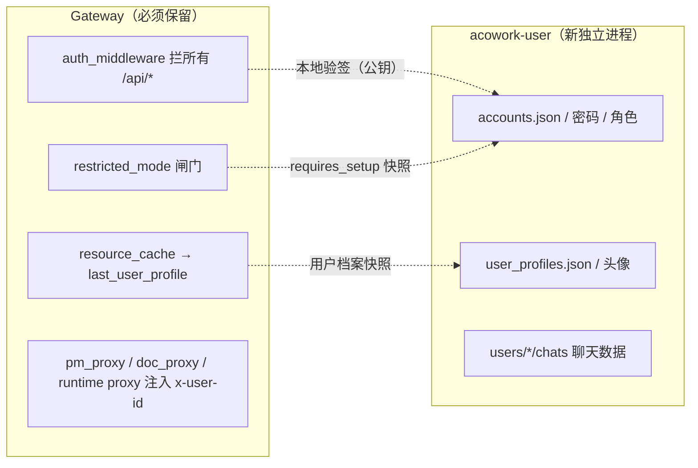

# ADR-084: 账号/用户聊天从 Gateway 剥离为独立进程 acowork-user

**状态**：已决策（2026-10-20，架构评审定案）
**日期**：2026-10-20
**决策者**：架构评审（用户定案：用户域业务迁出 Gateway）

**关联**：
- [ADR-064](./ADR-064-pm-standalone-process.md)（PM 独立进程——本 ADR 的直接范式来源）
- [ADR-070](./ADR-070-doc-standalone-process-and-tree-storage.md)（doc 独立进程——同一范式的第二次应用）
- [ADR-019](./ADR-019-lsp-relay-standalone-process.md)（LSP relay 独立进程——最早先例）
- [ADR-055](./ADR-055-remote-runtime-node-topology.md)（Gateway 收敛为纯网络职责：MQTT broker 宿主 + HTTP 统一入口 + 全局资源权威）
- [ADR-076](./ADR-076-multi-user-account-system.md)（多用户账号系统——**本 ADR 取代其在 Gateway 内落地的实现形态**，业务语义与数据模型不变）
- [ADR-042](./ADR-042-mqtt-user-identity-delivery.md)（用户身份下发 Runtime：`last_user_profile`）
- [ADR-009](./ADR-009-gateway-workspace-isolation.md)（Gateway 边界规则——本文更新其对"用户聊天数据归属"的落字）

---

## 1. 决策摘要

### 1.1 一句话

**把"用户域"（账号、凭据、角色、档案/头像、用户↔用户聊天）从 Gateway 剥离为独立进程 `acowork-user`，与 pm / doc / embed / lsp-relay 平行**：独立二进制、独立端口（默认 `18083`）、独立数据目录（`$HOME/.acowork/acowork-user/`）、由 Gateway supervisor 管理生命周期；Gateway 仅保留**反向代理 `/api/auth/*` 与 `/api/users/*` + 往代理注入可信身份 + 每请求本地验签的鉴权闸门**，从而恢复"只做通信中枢 + 全局资源调度"的定位。

关键认知：账号系统**不是** PM/Doc 式的整体平移。它与 Gateway 的 HTTP 鉴权交织，正确的切法是按 **"用户领域业务（迁出） vs 请求鉴权基础设施（留 Gateway）"** 一刀切，而不是把字面上的文件全部搬走。

### 1.2 关键决策表（详细理由见 §4）

| # | 决策 | 结论 |
|---|---|---|
| 1 | 剥离边界 | **迁出**：账号存储、凭据/密码、角色、登录/刷新/登出/改密、账号 CRUD、档案/头像、用户↔用户聊天（持久化 + API）。**保留**：`auth_middleware` 闸门、`x-user-id` 会话作用域注入、`restricted_mode`、`auth_mode` 解析、local 模式 legacy bearer、全局资源发布所需的用户档案快照 |
| 2 | 鉴权基础设施归属 | 身份**校验**（每请求）留在 Gateway，做**本地无状态验签**，不引入 per-request 网络跳；身份**签发**（登录/刷新）随账号迁入 acowork-user |
| 3 | Token 信任边界 | HS256 共享密钥 → **Ed25519 非对称**：acowork-user 持私钥**签发**，Gateway 持公钥**验证**（"能验不能签"，最小权限）。token 模块升为共享契约置于 `acowork-core::auth` |
| 4 | Gateway 对账号侧的向内依赖 | 三条：<br>（a）token 验签 → 决策 3 解决；<br>（b）用户档案列表（喂 `last_user_profile` 全局资源）→ 用户服务暴露内部端点，Gateway 拉取并缓存，变更时 MQTT 信号触发刷新；<br>（c）受限模式 `requires_setup` → 同上快照机制缓存，闸门读本地缓存（无 I/O） |
| 5 | 进程范式 | 复刻 PM/Doc：`acowork-user` 独立 `main.rs` + 端口冲突自增 + `--port-file` 上报 + `user_supervisor`（`/health` 轮询 + 指数退避重启）+ `user_proxy` 透明反代。启动失败不阻塞 Gateway（503 + Retry-After） |
| 6 | 对外契约 | Desktop 调用路径**完全不变**（`/api/auth/*`、`/api/users/*`、`/api/users/{id}/chats/*`、`/api/user/avatar-*`）→ Desktop 零改动。用户服务内部路径与旧 Gateway 路径逐字一致，`user_proxy` **前缀保持不变**（不像 `/api/doc` 那样剥离前缀） |
| 7 | 部署模式 | `acowork-user` 在 `local` 与 `multi_user` **两种模式都常驻**（`local` 下只跑档案/头像 + 无账号系统；`multi_user` 下加账号 + 鉴权 + 聊天）。模式由 Gateway 解析 `auth_mode` 后经 `--auth-mode` 下发给子进程，保持单一真相源 |
| 8 | 数据迁移 | 开发期无兼容需求 → **不写任何兼容/迁移代码**。旧数据一次性人工/临时脚本搬迁（见 §4 决策 8） |
| 9 | 回滚 | `[user].enabled=false` → 不 spawn、`/api/auth/*` 与 `/api/users/*` 返回 503；数据目录切换改配置重启即可，原目录保留可拷贝回滚 |

### 1.3 不变量（必须满足）

1. **对外契约字节级不变**：Desktop / CLI / 外部调用方看到的路径、请求体、响应体、错误码不变（ADR-064 目标 5 / ADR-070 目标 5）。
2. **身份注入单一可信写入方**：`x-user-id`（会话作用域）+ `X-Auth-User` / `X-Auth-Role` / `X-Auth-As-User`（用户服务鉴权身份）**只允许由 Gateway 的 `auth_middleware`/`user_proxy` 注入**；客户端自报一律丢弃。延续 ADR-076 §6.4 的 ceiling lint 精神。
3. **用户数据只在用户服务内读写**：Gateway 不再直读 `accounts.json` / `user_profiles.json` / `users/*/chats/` / `assets/avatars/`；需要时经内部 HTTP 拉取。延续 ADR-009 §5 边界红线。
4. **鉴权闸门不可被绕过**：`/api/*` 的 token 校验仍发生在请求进入业务前的同一层（Gateway），用户服务端口仅绑定 `127.0.0.1`，只接受来自 Gateway 反代的流量。
5. **`local` 模式不产生账号副作用**：`local` 下 `accounts.json` 不创建、账号/鉴权路由不注册（延续 ADR-076 §决策 12）。

### 1.4 部署模式行为对照表

| 维度 | `local` | `multi_user` |
|---|---|---|
| `acowork-user` 进程 | 常驻 | 常驻 |
| 账号存储 `accounts.json` | 不创建 | 创建 |
| 登录/刷新/`/api/auth/*` | 404 | 注册 |
| `/api/users` 语义 | 展示档案 CRUD + 头像 | 凭据感知账号 CRUD（取代展示 CRUD） |
| 用户↔用户聊天 `/api/users/{id}/chats/*` | 404 | 注册 |
| Gateway 鉴权闸门 | 直通（legacy bearer 不变） | 强制 bearer + `AuthContext` |
| 受限模式 | 无（no-op） | 账号库空 + 无密码 admin → 除 `/health`、`/api/status` 外 403 `setup_required` |
| Token 验签 | 无 | 本地 Ed25519 公钥验签 |

---

## 2. 背景与动机

### 2.1 铁律：Gateway 零业务

Gateway 是整个项目的核心单点，定位为**纯通信 + 全局资源管理**：

> Gateway 不代理 Agent 的业务逻辑，只负责必须集中化的协调工作。
> —— [docs/design/zh/04-gateway.md](../../design/zh/04-gateway.md)

ADR-055 进一步收敛为三个纯网络职责：**MQTT broker 宿主、HTTP 统一入口、全局资源权威**。embed、LSP relay（ADR-019）、PM（ADR-064）、doc（ADR-070）均已按此原则独立为子进程。

**账号系统与用户↔用户聊天是当前 Gateway 内最后一块明显违反该铁律的业务域。** 现状盘点：

| 关注面 | 文件 | 行数 |
|---|---|---|
| 账号存储 / 密码 | [core/acowork-gateway/src/account/store.rs](../../../core/acowork-gateway/src/account/store.rs)、[password.rs](../../../core/acowork-gateway/src/account/password.rs) | 332 |
| 认证服务（登录/刷新/改密/角色/邀请） | [core/acowork-gateway/src/auth/service.rs](../../../core/acowork-gateway/src/auth/service.rs) | 1558 |
| Token 签发/验证 | [core/acowork-gateway/src/auth/token.rs](../../../core/acowork-gateway/src/auth/token.rs) | 460 |
| 撤销注册表 | [core/acowork-gateway/src/auth/revoked.rs](../../../core/acowork-gateway/src/auth/revoked.rs) | 202 |
| 账号 API | [core/acowork-gateway/src/http/account_api.rs](../../../core/acowork-gateway/src/http/account_api.rs) | 1179 |
| 档案/头像 API | [core/acowork-gateway/src/http/users_api.rs](../../../core/acowork-gateway/src/http/users_api.rs) | 878 |
| 认证 API | [core/acowork-gateway/src/http/auth_api.rs](../../../core/acowork-gateway/src/http/auth_api.rs) | 465 |
| 用户↔用户聊天持久化 | [core/acowork-gateway/src/chat.rs](../../../core/acowork-gateway/src/chat.rs) | 922 |
| 用户↔用户聊天 API | [core/acowork-gateway/src/http/chat_api.rs](../../../core/acowork-gateway/src/http/chat_api.rs) | 1249 |

合计 **≈ 7.4k 行用户领域代码**编译进 Gateway 二进制，是 PM/Doc 同量级的业务模块。

### 2.2 问题

| 问题 | 说明 |
|---|---|
| 业务逻辑入 Gateway | 账号状态机、密码策略、邀请、refresh-family 撤销、聊天参与者收敛等用户领域逻辑编译进 Gateway 单点核心 |
| 依赖重量 | 引入 `argon2`、`hmac`、`rpassword`、`zeroize`、`tokio-util`（聊天附件流）等（[core/acowork-gateway/Cargo.toml](../../../core/acowork-gateway/Cargo.toml)） |
| 故障隔离丢失 | 账号/聊天相关 panic（如聊天附件路径处理、坏行跳过）可能带崩 Gateway |
| 存储耦合 | 账号/档案/聊天被塞进 `{gateway.data_dir}/`（`accounts.json`、`user_profiles.json`、`users/`、`assets/avatars/`），与 Gateway 数据生命周期强耦 |
| 与主导方向矛盾 | ADR-019/055/064/070 一致"Gateway 收敛为纯网络"，账号内嵌是往回走 |

### 2.3 与 PM/Doc 的关键差异（为何不能整体平移）

PM/Doc 从 Gateway 迁出之所以干净，是因为二者与 Gateway 之间**只有单向关系**：Gateway 反代它、往它注入可信身份，Gateway 不需要它们的任何数据。

账号系统多出**三条向内的依赖**（Gateway 反过来要消费账号侧状态）：



1. **鉴权中间件是全局闸门**：[core/acowork-gateway/src/http/auth_middleware.rs](../../../core/acowork-gateway/src/http/auth_middleware.rs) 拦每个 `/api/*`，注入 `AuthContext`，并把 `x-user-id` 下发给 PM/Doc 反代与 Runtime（会话隔离，ADR-076 §决策 4）。**这层不能搬走**：若每请求都要网络跳用户服务验签，会把整个 HTTP 面的可用性与用户服务绑死。
2. **用户档案要喂全局资源发布**：[resource_cache.rs:214](../../../core/acowork-gateway/src/resource_cache.rs#L214) 读 `user_profiles.json`，经 [global_resources_builders.rs:394](../../../core/acowork-gateway/src/mqtt/global_resources_builders.rs#L394) 作为 `last_user_profile` 下发 Runtime（ADR-042）。
3. **受限模式依赖账号状态**：[restricted_mode.rs](../../../core/acowork-gateway/src/http/restricted_mode.rs) 依据 `is_restricted()`（账号库空 + 无密码 admin）决定是否只放行 `/health`、`/api/status`（ADR-076 §决策 12 v2）。

因此，本 ADR 的边界划分原则是：**"用户领域业务"迁出，"Gateway 自身 API 面的鉴权基础设施"留下。**

---

## 3. 目标

1. **用户域独立进程**：独立二进制 `acowork-user`、独立端口（默认 `18083`，冲突自动递增至 +20）、supervisor 生命周期管理
2. **用户域存储独立**：数据目录 `$HOME/.acowork/acowork-user/`，与 `acowork-gateway/`、`acowork-node/`、`acowork-pm/`、`acowork-doc/` 平级（参考 [acowork-core `default_node_home`](../../../core/acowork-core/src/node.rs)）
3. **Gateway 恢复纯网络职责**：不再编译用户领域代码、不再直读写用户数据目录
4. **对外契约字节级不变**：Desktop / CLI / 外部调用方无感知
5. **身份伪造面收敛**：可信身份注入点从 Gateway 内部的 `auth_middleware` 收敛为 `auth_middleware`（会话作用域）+ `user_proxy`（用户服务鉴权身份）两个显式写入点
6. **简化**：开发期无兼容负担，不写任何兼容/迁移代码

---

## 4. 决策

### 决策 1：剥离边界——"用户领域业务"迁出，"鉴权基础设施"留下

**迁往 `acowork-user`（+ 用户域数据）**：

| 源（Gateway） | 目标（acowork-user） |
|---|---|
| `account/{store,password}.rs` | `account/{store,password}.rs` |
| `auth/{service,revoked}.rs` | `auth/{service,revoked}.rs` |
| `auth/token.rs` 的**签发**部分 | `auth/issuer.rs`（Ed25519 私钥） |
| `http/account_api.rs` | `http/account_api.rs` |
| `http/users_api.rs`（档案 CRUD + 头像） | `http/profile_api.rs`（内部路径保持 `/api/users`、`/api/user/avatar-*`） |
| `http/auth_api.rs` | `http/auth_api.rs` |
| `chat.rs` | `chat.rs` |
| `http/chat_api.rs` | `http/chat_api.rs` |
| 数据：`accounts.json`、`user_profiles.json`、`users/`（聊天）、`assets/avatars/` | 移入用户服务数据目录 |

**留在 Gateway（请求鉴权基础设施 + 跨切面）**：

| 组件 | 处理 |
|---|---|
| [core/acowork-gateway/src/http/auth_middleware.rs](../../../core/acowork-gateway/src/http/auth_middleware.rs) | **保留**，`verify_access` 改为**本地 Ed25519 公钥验签**（不再持有账号库/签名私钥） |
| [core/acowork-gateway/src/http/restricted_mode.rs](../../../core/acowork-gateway/src/http/restricted_mode.rs) | **保留**，`is_restricted()` 改为读**本地快照**（由用户服务信号驱动刷新） |
| [core/acowork-gateway/src/auth/mode.rs](../../../core/acowork-gateway/src/auth/mode.rs) | **保留**（`auth_mode` 解析是 Gateway 部署模式，是鉴权闸门的开关） |
| [core/acowork-gateway/src/http/auth.rs](../../../core/acowork-gateway/src/http/auth.rs) | **保留**（local 模式 legacy bearer，不受影响） |
| `x-user-id` 注入、pm/doc/runtime 反代 | **保留**（仅依赖 `AuthContext`） |
| `resource_cache` / `global_resources_builders` 的用户档案部分 | **保留**结构，数据来源改为拉取用户服务快照（决策 4b） |

**理由**：把"账号是什么、谁能登录"（业务）与"这个 HTTP 请求是否已认证"（Gateway 自身的接入控制）分开。前者是用户域，后者是任何 HTTP 入口都必须具备的能力，留在 Gateway 才是正确的层次。

**被否**：连鉴权中间件一起搬走（每请求网络跳用户服务验签）——把 Gateway 全部 API 的可用性绑死在一个业务进程上，且给每请求加一跳延迟。不采纳。

### 决策 2：身份签发在用户服务，身份校验在 Gateway（本地无状态）

- **签发**（`login` / `refresh` / `first-login`）发生在用户服务：它是凭据与账号的权威。
- **校验**（`verify_access`）留在 Gateway 的 `auth_middleware`：一次纯本地密码学验证，无 I/O、无网络跳。access token 短时效，验证是**无状态**的（现有 `AuthService::verify_access` 即只做签名校验，不查磁盘）。
- **撤销**（refresh-family，[revoked.rs](../../../core/acowork-gateway/src/auth/revoked.rs)）是账号数据，随账号迁至用户服务，只在 **refresh** 路径使用；access token 的无状态校验不受影响。

**理由**：authn 的"签发 + 撤销"是账号域状态，归用户服务；authn 的"每请求校验"是接入控制，归 Gateway。二者用同一套签名契约衔接，无共享可变状态。

### 决策 3：Token 信任边界——Ed25519 非对称（签发方 ≠ 验证方）

当前为 HS256（`{data_dir}/auth/secret`，签验同一对称密钥）。剥离后**签发在用户服务、验证在 Gateway**，共享对称密钥会带来两个问题：密钥必须落两处、且 Gateway 保留签发能力（违反最小权限）。

**决策**：改为 **Ed25519**。
- `acowork-user` 生成并持有私钥（`{user_data_dir}/auth/ed25519.key`，0600），用于 `sign_access` / `sign_refresh`。
- Gateway 只读公钥（`{user_data_dir}/auth/ed25519.pub`，或经 supervisor 传入），用于 `verify`。
- token 模块抽为**共享契约** `acowork-core::auth`（`TokenIssuer` / `TokenVerifier` + `Claims`），Gateway 与 acowork-user 各自依赖契约，互不依赖。JWT header 改为 `{"alg":"EdDSA","typ":"JWT"}`。

**波及面**：[token.rs](../../../core/acowork-gateway/src/auth/token.rs) 的单测（HS256 往返/篡改/过期）改为 Ed25519；`is_family_consistent` 等 claim 语义不变。属受限、可一次性替换的改动。

**被否（备选）**：保留 HS256，共享密钥文件（用户服务生成、Gateway 只读）。改动最小，但对称密钥落两处且 Gateway 保留签发能力。**仅当评审倾向最小 diff 时选此备选**——ADR 记录立场为推荐 Ed25519；若改选备选，只需替换本决策的实现，其余决策不变。

**被否**：Gateway 每请求调用用户服务 `/internal/verify` 验签。见决策 1。

### 决策 4：Gateway 对账号侧向内依赖的处理

**(a) Token 验签** → 决策 3（本地公钥验签）。

**(b) 用户档案列表（供 `last_user_profile` 全局资源）**：
用户服务暴露内部端点 `GET /internal/user-profiles` → `UserProfileListFile`（即现有派生视图）。Gateway 启动后在用户服务就绪时拉取，存入 `ResourceCache.user_profile_list`；用户服务在档案变更后经 **MQTT**（复用 doc 的 [mqtt_publisher.rs](../../../core/acowork-doc/src/mqtt_publisher.rs) 范式）发布变更信号，Gateway 订阅后重新拉取并触发全局资源重发布。
- **被否**：Gateway 直读用户服务数据目录的 `user_profiles.json`（跨数据目录 = 破坏 ADR-009 边界，且 ADR-055 下 `data_dir` 是 node-local）。
- **被否（更简）**：Gateway 每次资源重建时无条件拉取（无信号）。可行但档案变更传播延迟不可控；作为降级方案保留。

**(c) 受限模式 `requires_setup`**：
用户服务在 `/health` 响应体或 `GET /internal/state` 中返回 `{ requires_setup, registration_open }`。Gateway 的 `user_supervisor` 心跳时刷新这两个值到 `GatewayState.user_snapshot`；`restricted_mode_middleware` 读**本地缓存布尔值**（无 I/O）。
- 现有行为（v2 合约：受限模式无 token 请求应答 **403 `setup_required`** 而非 401）保持不变。
- `/api/status` 的 `registration_open` 字段来源改为该快照，公开契约不变。

**(d) 会话隔离 / pm-doc actor 注入 / ADR-042 身份下发**：**零改动**——它们只依赖 `AuthContext`（Gateway 仍产出）与 `x-user-id`（Gateway 仍注入）。ADR-076 §决策 4 / §决策 10 语义不变。

### 决策 5：进程 / 端口 / 数据目录 / supervisor / 反代范式

复刻 PM/Doc：
- 二进制 `acowork-user`，`main.rs` 自带 CLI（`--host --port --port-file --data-dir --auth-mode --gateway-health-url --gateway-health-interval-ms --gateway-health-timeout-ms --log-level`）。
- 端口默认 `18083`（embed `18080` / doc `18081` / pm `18082`），冲突自动递增至 +20，经 `--port-file` 上报实际端口。
- 数据目录 `$HOME/.acowork/acowork-user/`（Gateway 侧仅可选 `--data-dir` 覆盖，默认由用户服务自解析）。
- [core/acowork-gateway/src/lifecycle/user_supervisor.rs](../../../core/acowork-gateway/src/lifecycle/user_supervisor.rs)：spawn + `/health` 轮询（复用 `acowork_core::supervisor::{RestartHistory, backoff_with_jitter}`）+ 指数退避重启（1s→60s，5 次/5 分钟上限）；失败时清空 `GatewayState.user_process`，Gateway 继续运行、`/api/auth/*` 与 `/api/users/*` 返回 **503 + `Retry-After: 2`**。
- [core/acowork-gateway/src/http/user_proxy.rs](../../../core/acowork-gateway/src/http/user_proxy.rs)：透明反代 `/api/auth/{*rest}`、`/api/users/{*rest}`、`/api/user/{*rest}` → `127.0.0.1:{user_port}`，**前缀保持不变**（不剥离），并在转发头中注入可信身份：
  - 已认证请求：注入 `X-Auth-User`（`AuthContext.user_id`）、`X-Auth-Role`（role）、`X-Auth-As-User`（admin 的 view-as 作用域，若有）；`X-Auth-*` 由客户端自报的一律丢弃。
  - 公开请求（`/api/auth/login|refresh|logout|first-login`）：不注入身份。
- `GatewayState` 新增 `user_process: Option<UserProcessState>` 与 `user_snapshot: UserSnapshot`（`requires_setup` / `registration_open` / `profiles_version`）。
- 配置新增 `[user] { enabled = true, port = 18083 }`，镜像 `[pm]` / `[doc]`。

**对外契约**：Desktop 走 `{gw}/api/auth/*`、`{gw}/api/users/*`（路径与今日逐字一致）——Desktop 零改动。

### 决策 6：`local` 模式也常驻用户服务

`acowork-user` 在两种模式都启动：`local` 下只承载档案 CRUD + 头像（无账号/鉴权/聊天），`multi_user` 下加账号 + 鉴权 + 聊天。

**理由**：档案是"用户域"的一部分，其代码归属应唯一。若 `local` 保留在 Gateway、`multi_user` 迁出，则档案代码被迫一分为二（或 Gateway 保留一份 → 边界又破）。统一归属、进程极小，代价可接受。

**替代方案（被否）**：仅 `multi_user` spawn 用户服务，`local` 下档案逻辑留在 Gateway——档案代码分裂。
**替代方案（被否）**：`local` 不启动用户服务、`/api/users` 在 `local` 直接 404——破坏 `local` 现有展示档案能力。

### 决策 7：鉴权闸门与运行时隔离保持原层

- `auth_middleware` 仍**分层在 CORS 内、所有路由外**（ADR-076 §决策 3），新路由不可能忘记 opt-in。
- `x-user-id` 会话作用域注入仍在 `auth_middleware`（[auth_middleware.rs:218](../../../core/acowork-gateway/src/http/auth_middleware.rs#L218)），继续供 Runtime 会话隔离与 pm/doc actor 注入使用。
- 用户服务**不自行维护白名单**：信任决策收敛在 Gateway 单一鉴权点（延续 ADR-070 §9 的立场）。

### 决策 8：数据迁移——不写兼容代码

开发期无存量兼容需求，**不在任何代码路径保留兼容或迁移逻辑**。旧数据一次性搬迁（人工或一次性临时脚本，脚本不进 CI / 不进长期代码库）。

**需搬迁的数据**（源 `{gateway.data_dir}` = `$HOME/.acowork/acowork-gateway/data`，目标 `$HOME/.acowork/acowork-user/`）：

| 数据 | 源路径 | 目标路径 | 说明 |
|---|---|---|---|
| 账号库 | `accounts.json` | `accounts.json` | 仅 `multi_user` 存在 |
| 档案视图 | `user_profiles.json` | `user_profiles.json` | 可由 `accounts.json` 重新派生，可省 |
| 用户聊天 | `users/` | `users/` | `{min}/chats/{max}/` 目录树（[chat.rs](../../../core/acowork-gateway/src/chat.rs) 注释） |
| 头像 | `assets/avatars/`（multi_user）、`assets/`（local 共享） | 同名 | 见 [users_api.rs:474](../../../core/acowork-gateway/src/http/users_api.rs#L474) |
| 旧 HS256 密钥 | `auth/secret` | — | **丢弃**：切换 Ed25519 后旧 token 全部失效，重新登录即可（开发期无影响） |

一次性迁移示例（人工执行，不入库）：

```bash
GW="$HOME/.acowork/acowork-gateway/data"
US="$HOME/.acowork/acowork-user"
mkdir -p "$US"
[ -f "$GW/accounts.json" ]      && cp "$GW/accounts.json"      "$US/"
[ -f "$GW/user_profiles.json" ] && cp "$GW/user_profiles.json" "$US/"
[ -d "$GW/users" ]              && cp -r "$GW/users"           "$US/"
[ -d "$GW/assets" ]             && cp -r "$GW/assets"          "$US/"
```

**迁移后校验**：`multi_user` 下登录旧账号成功；用户↔用户历史聊天可读；头像可见。

---

## 5. 后果

### 5.1 正面
- **Gateway 保持零业务**：用户领域逻辑与二进制完全隔离；去掉 `argon2` / `hmac` / `rpassword` / `zeroize` 等依赖。
- **故障隔离**：账号/聊天 panic 不再威胁 Gateway 单点。
- **存储独立**：用户数据生命周期与 Gateway 解耦，备份 = 拷目录。
- **契约稳定**：Desktop 零改动；`/api/auth/*`、`/api/users/*` 对外不变。
- **最小权限**：Ed25519 使 Gateway "能验不能签"，签发权只在用户服务。
- **身份注入面收敛**：可信身份仅两个显式写入点（`auth_middleware` 作用域 + `user_proxy` 鉴权身份）。

### 5.2 负面 / 成本
- 多一个常驻进程（`local` 模式亦然，~10 MB 级）；`local` 下为仅档案/头像付出进程开销。
- token 从 HS256 → Ed25519 需替换 `auth/token.rs` 及其单测（一次性）。
- Gateway 对用户服务产生两条运行时依赖（档案快照、`requires_setup`），需快照刷新机制与就绪探测；用户服务未就绪时依赖端降级（档案为空 → `last_user_profile` 缺省；受限模式闸门保守起见按"非受限"直通，见 §9 开放问题）。
- 跨进程鉴权语义需 e2e 覆盖（agent 越权、admin view-as、公开路径放行）。

### 5.3 边界 / 例外
- `auth_middleware` / `restricted_mode` / `auth_mode` **留在 Gateway 是刻意设计**，不是遗漏：它们是 Gateway 自身 HTTP 面的接入控制。
- 用户服务内部端点（`/internal/*`）不对外暴露，仅 loopback + Gateway 反代可达。

### 5.4 回滚
- `[user].enabled=false` → 不 spawn，`/api/auth/*`、`/api/users/*` 返回 503（不影响其它服务）。
- 数据目录切换：改 `[user].data_dir` 后重启，原目录保留可拷贝回滚。
- Ed25519 ← HS256 为单向改动；如需回退须恢复 `token.rs`（开发期无数据影响）。

### 5.5 已知技术债
- 一次性迁移脚本不进代码库（符合"开发期无兼容"）。
- 档案刷新的 MQTT 信号 topic 需与现有 global-resources 发布链协调（§9）。

---

## 6. 改动清单（按 crate / 文件）

### 6.1 新增 `core/acowork-user`（Cargo workspace 成员）
```
core/acowork-user/
  src/main.rs        # CLI + 独立进程入口（复刻 pm/doc）
  src/server.rs      # 全量 router（/api/auth/* + /api/users/* + /api/user/* + /health）
  src/health.rs
  src/config.rs      # 用户服务自身配置（data_dir / password_policy / bootstrap_admin / registration_open）
  src/error.rs
  src/account/{store,password}.rs        # 自 gateway 迁入
  src/auth/{service,revoked,issuer}.rs   # service/revoked 迁入；issuer = Ed25519 签发
  src/http/{auth_api,account_api,profile_api,chat_api}.rs  # 自 gateway 迁入
  src/chat.rs                            # 自 gateway 迁入
  src/mqtt_publisher.rs                  # 档案变更信号（范式来源 acowork-doc）
```

### 6.2 `core/acowork-core`
- 新增 `auth` 模块：`Claims` / `TokenIssuer`（Ed25519 私钥签发）/ `TokenVerifier`（公钥验证）/ `TokenKind`（共享契约，自主 crate 依赖）。
- `account.rs` 的 `UserAccount` / `AccountView` / `AccountListFile` 保留（共享 DTO）。
- `protocol.rs` 的 `UserProfile` / `UserProfileListFile` 保留（共享 DTO）。

### 6.3 `core/acowork-gateway` —— 删除
- `src/account/`（整目录）、`src/chat.rs`。
- `src/auth/service.rs`、`src/auth/revoked.rs`（迁出）。`src/auth/token.rs` 的签发部分迁出，仅留（或改为）验证者。
- `src/http/account_api.rs`、`users_api.rs`、`auth_api.rs`、`chat_api.rs`。
- `cli.rs` 的 `AdminSetup` 子命令（迁为用户服务 CLI）。
- `config.rs` 的 `MultiUserConfig` 中 `password_policy` / `bootstrap_admin` / `registration_open` 等字段（迁入用户服务配置）。

### 6.4 `core/acowork-gateway` —— 新增 / 修改
- **新增** `src/lifecycle/user_supervisor.rs`（复刻 `doc_supervisor.rs`）。
- **新增** `src/http/user_proxy.rs`（透明反代 + 身份注入）。
- **新增** `config.rs::UserConfig { enabled, port }`（镜像 `PmConfig`/`DocConfig`）。
- **修改** `src/gateway/state.rs`：新增 `user_process`、`user_snapshot`。
- **修改** `src/http/routes.rs`：`/api/auth/*`、`/api/users/*`、`/api/user/*` 改由 `user_proxy` 提供（移除 `account_api`/`users_api`/`chat_api` 的本地注册；[routes.rs:261-290](../../../core/acowork-gateway/src/http/routes.rs#L261)）。
- **修改** `src/http/auth_middleware.rs`：`verify_access` 改用 `acowork_core::auth::TokenVerifier`（公钥）。
- **修改** `src/http/restricted_mode.rs`：`is_restricted()` 改读 `user_snapshot.requires_setup`。
- **修改** `src/resource_cache.rs` / `src/mqtt/global_resources_builders.rs`：`user_profile_list` 来源改为用户服务快照。
- **修改** `src/gateway/mod.rs`：移除 `AuthService` 初始化（[gateway/mod.rs:222](../../../core/acowork-gateway/src/gateway/mod.rs#L222)），改为启动 `user_supervisor` + 公钥加载。
- **保留** `src/auth/mode.rs`、`src/http/auth.rs`、`x-user-id` 注入、pm/doc/runtime 反代。

### 6.5 `dev/ci.sh`
- 扩展 ceiling lint：`X-Auth-User` / `X-Auth-Role` / `USER_SCOPE_HEADER` 常量只应出现在定义处 + 测试；`UserService` 侧不得出现 Gateway 数据目录路径；Gateway 侧不得直读 `accounts.json` / `user_profiles.json` / `users/`。

### 6.6 `apps/acowork-desktop`
- **零改动**（路径/请求体/响应体不变）。
- 可选：`gatewayAuthBridge` / 探活逻辑不感知后端进程拆分。

---

## 7. 测试策略

### 7.1 单元测试
- `acowork-core::auth`：Ed25519 签验往返、篡改拒绝、过期拒绝、kind 校验、`is_family_consistent`。
- `acowork-user`：account store 原子写 / 损坏备份（迁自 gateway 现有测试）；Argon2id 登录/改密；refresh-family 撤销与重用检测；聊天参与者收敛 / 未读语义 / 附件权限边界（迁自 [chat_api.rs](../../../core/acowork-gateway/src/http/chat_api.rs) 测试）。
- `user_proxy`：身份注入（丢弃自报 `X-Auth-*`）、公开路径不放行注入、503 语义。

### 7.2 集成测试（e2e）
- 通过**真实 `build_router`** 走完整链路：`multi_user` 登录 → 带 token 调 `/api/users` → 代理到用户服务 → 200。
- `local` 模式：`/api/users` 档案 CRUD 经代理正常；`/api/auth/*` 404。
- 受限模式：账号库空 + 无密码 admin 时，无 token 请求应答 **403 `setup_required`**（非 401）；完成 setup 后放行。
- 越权：普通用户读他人聊天/改名 → 403/404；admin view-as 只读。
- 用户服务未就绪：`/api/users/*` 返回 503 + `Retry-After: 2`。

### 7.3 协议兼容性
- Desktop `auth-api.ts` / `user-chat-api.ts` / `gateway-api.ts` 契约不变（路径 + 响应形状）；对迁移前后做字节级对比。

### 7.4 安全测试（手动 checklist）
- 直连 `127.0.0.1:18083`（绕过 Gateway）伪造 `X-Auth-User` → 用户服务是否仅信任 loopback？端口是否仅绑 `127.0.0.1`？
- 客户端自报 `X-Auth-*` / `x-user-id` 是否被 Gateway 丢弃（沿用 ADR-076 用例）。
- Gateway 进程是否不再持有 Ed25519 私钥。

### 7.5 CI ceiling lint
见 §6.5。

---

## 8. 实施里程碑（建议）

| 阶段 | 内容 | 出口条件 |
|---|---|---|
| M0 | 抽 `acowork-core::auth`（Ed25519 契约）+ 替换 Gateway `token.rs` | 网关本地验签通过单测；旧 HS256 移除 |
| M1 | 建 `acowork-user` crate 骨架 + 迁入 `account`/`auth`/`chat` + 全量 router + `/health` | 用户服务独立启动可登录/发消息 |
| M2 | Gateway：`user_supervisor` + `user_proxy` + 配置 + `GatewayState` | Desktop 经 Gateway 全链路可用 |
| M3 | Gateway：`auth_middleware` 公钥验签 + `restricted_mode` 快照 + 档案快照刷新 | `multi_user` e2e 全绿 |
| M4 | `local` 模式打通（档案 + 头像经代理）；移除 Gateway 内用户域代码 | 两模式 e2e 全绿；`cargo clippy` 干净 |
| M5 | 一次性数据迁移 + 文档 + `dev/ci.sh` lint | 迁移校验通过 |

---

## 9. 开放问题（评审重点）

1. **用户服务未就绪时受限模式的保守语义**：`user_snapshot.requires_setup` 未知时，闸门应按"非受限直通"（availability 优先）还是"保守拒绝"（安全优先）？（倾向直通：受限模式仅首次启动的短暂窗口，直通不放大攻击面，因为业务路由本身仍要 token。）
2. **档案刷新的信号通道**：MQTT topic（复用 doc 范式） vs 用户服务回调 Gateway 内部端点 vs Gateway 轮询。需与现有 global-resources 发布链协调。**（已落地：MQTT topic `acowork/user/profiles/changed` 为快路径 + supervisor 2s `/health` 轮询兜底；`mqtt.auth_enabled` 下 broker 以启动时生成的 `publisher_token` 放行 `user:service` / `doc:service`——由 supervisor 经 `--mqtt-password` 注入，信号不因鉴权静默失效。）**
3. **`local` 模式是否值得为档案/头像单起进程**：本 ADR 选"是"（代码归属唯一）。若评审更重最低开销，可回退到"`local` 保留档案在 Gateway"——但会造成档案代码分裂，需显式接受。
4. **`registration_open` 的公开读取**：`/api/status`（无鉴权）是否继续由 Gateway 从快照透出，还是改由前端另调用户服务端点？（倾向保持 `/api/status` 契约。）
5. **Ed25519 密钥轮换**：本期不做（YAGNI）；记录升级路径 = 公钥带 `kid`，用户服务可并存多把公钥。

---

## 10. 已否决方案（评审勿重复讨论，除非触发条件改变）

| 被否方案 | 否决理由 | 详见 |
|---|---|---|
| 鉴权中间件一并迁出（每请求网络跳验签） | 把 Gateway 全部 API 可用性绑死用户服务 + 每请求加一跳 | §4 决策 1 |
| 保留 HS256 共享密钥（作为主方案） | 对称密钥落两处，Gateway 保留签发能力 | §4 决策 3 |
| Gateway 直读用户服务数据目录 | 破坏 ADR-009 边界；ADR-055 下 `data_dir` 是 node-local | §4 决策 4b |
| 仅 `multi_user` spawn 用户服务 | 档案代码被迫一分为二 | §4 决策 6 |
| 代码内保留旧数据兼容 / 迁移逻辑 | 开发期无存量需求，永久兼容代码纯浪费 | §4 决策 8 |
| 把用户聊天与账号拆成两个进程 | 同属"用户域"，无独立关注面；Rule of three 未满足 | §4 决策 1 |
