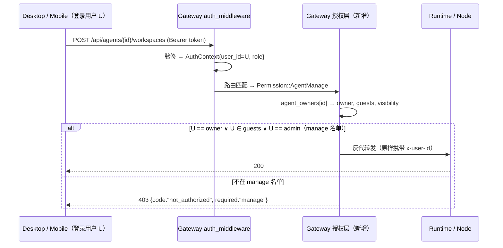

# ADR-087: Node 与 Agent 的 Owner 权限模型 — 堵住"整台机器对全体用户默认可写"的洞

**状态**：草案（v2 修订稿；Q1/Q2/Q4 与"单 owner + 多 guest"模型已决策，剩余见 §12）
**日期**：2026-10-28（v2 修订：新增 D9 归属基数与 guest 模型——评审两问定调：不设"只读"档、不许多 owner，协作由 manage 授权名单承接；Q1/Q2/Q4 落决策）
**决策者**：（待定）

**前置**：
- [ADR-076](./ADR-076-multi-user-account-system.md)（多用户账号系统 — 本 ADR 把 §决策 4 的 session 维度隔离范式（`user_id` + 服务端单点判定 + `can_write` 下发）推广到 node 与 agent 两个维度；业务语义仍有效，实现形态见 ADR-084）
- [ADR-084](./ADR-084-user-standalone-process.md)（用户域独立进程 — 账号权威在 `acowork-user`；本 ADR 的 owner 是 **Gateway 侧的授权策略数据**，不是账号数据，两者不冲突）
- [ADR-075](./ADR-075-node-identity-uuid-and-node-name.md)（node_id = UUID v4 稳定路由键 — owner 以 `node_id` 为键，改名/迁移不受影响）
- [ADR-073](./ADR-073-agent-instance-identity-decomposition.md)（instance_id = UUID v4 — agent owner 以 `instance_id` 为键，package 多实例各自有主）
- [ADR-055](./ADR-055-remote-runtime-node-topology.md)（§6.2 enrollment / §6.5 node 上报 inventory 是存在性权威 — 本 ADR 只加"归属权威"，不改存在性权威）
- [ADR-009](./ADR-009-gateway-workspace-isolation.md)（Gateway 红线：不直接碰 Agent 私有文件 — 本 ADR 的鉴权全部发生在**反代入口**，不引入任何 Gateway 侧文件系统访问）
- [ADR-077](./ADR-077-system-agent-demotion-to-default-agent.md)（default agent 是普通 agent — 同样受 owner 模型约束，见 §12 Q1）

---

## 1. 决策摘要

### 1.1 一句话

**给 Node 和 Agent instance 各增加一个 Gateway 侧持久化的 `owner_user_id`（单 owner）+ `guests` 协作名单，把所有"会改动 Node 所在机器"的操作（安装/卸载/启停 agent、增删工作区、工作区文件读写、LSP/sidecar 配置、fs browse、enroll 归属）收敛为 **manage 档 = owner ∨ guest ∨ admin** 门控（读与写同级，不设"只读"档）；"使用"一个 agent（建 session 聊天）则按 agent 级 `visibility`（private/shared）分流，session 维度沿用 ADR-076 不变。鉴权在 Gateway 反代入口单点执行（那里已有 `AuthContext` 与 `instance_id→owner` 映射），fail-closed：无主资源只有 admin 可管理。**

### 1.2 关键决策表（详细理由见 §5）

| # | 决策 | 结论 |
|---|---|---|
| D1 | owner 存哪 | **Gateway 侧新增两个持久化归属表**（`node_owners.json`、`agent_owners.json`，与 `node_tokens.json` 同目录同范式）。**不进 MQTT proto**：Node 上报的 inventory 仍是"存在性权威"（ADR-055 §6.5），归属是 Gateway 的策略数据，Node 不感知用户 |
| D2 | node owner 从哪来 | **enrollment token 绑定创建者**：multi_user 模式下新增 `POST /api/nodes/enrollment-tokens`（需登录），token 记录带 `owner_user_id`，enroll 成功即写 `node_owners.json`。CLI 签发的 token 无主 → 该 node 无主（admin-only）。`gateway_managed` 本机节点默认无主 |
| D3 | agent owner 从哪来 | **谁装谁所有**：`POST /api/agents/install` / `ensure` / `clone` 成功派发时，以 `instance_id` 为键写入 `agent_owners.json`，owner = 调用者 `AuthContext.user_id`。admin 天然可装任意 node（Q2 已决策，见 §12），装出的 agent owner = admin；guest 在共享 node 上装的 agent owner = guest 本人（D9 规则 3） |
| D4 | 两级门控 | **Node 门控**（对机器的所有权）：install/uninstall 到该 node、fs browse、rename/drain/remove、LSP sidecar 配置 → node 的 owner ∨ guest ∨ admin。**Agent 门控**（对实例的所有权）：start/stop/upgrade/config/prompts/skills/**workspace 增删改**/**文件读写（读与写同级）**/debug → agent 的 owner ∨ guest ∨ admin。装 agent 需**同时**满足"可管理目标 node" |
| D5 | 执行点 | **Gateway 反代入口**（`http/proxy.rs` 路由策略表 + `agents.rs`/`nodes_api.rs`/`fs_browse.rs` handler 头部）。Runtime 不引入 owner 概念（它拿不到也不该拿归属真相）；`x-user-id` scope 机制原样保留，只用于 session 过滤 |
| D6 | agent 使用（chat）与 visibility | agent 新增 `visibility`：`private`（仅 manage 名单可建/用 session）与 `shared`（所有登录用户可在其上开**自己的** session，session 之间仍按 ADR-076 隔离）。**shared 只放开"用"，永远不放开"管"**（workspace/文件/配置仍是 manage 名单）。默认值：用户手动 install/ensure/clone 出的实例落 `private`；**onboarding 预装的 default agent 落 `shared`**（Q1 已决策，见 §12） |
| D7 | 无主与迁移 | multi_user 模式下**fail-closed**：`owner=None` 的资源只有 admin 可 manage；admin 可通过 `PATCH .../owner` claim/转移。Local 模式整体 no-op（与 ADR-076 §决策 12 同一开关 `AuthMode`） |
| D8 | 服务端单一真相 | `GET /api/agents` / `GET /api/nodes` 每条记录服务端算好 `can_manage` / `can_use` 布尔下发，Desktop/Mobile **只消费布尔渲染，不再自行推导**（延续 ADR-086 不变量 1 的纪律） |
| D9 | 归属基数与协作 | **单 owner + 多 guest**。owner 唯一（责任唯一、转移两元）；guest 是"manage 授权名单"而非归属——不改变所有权、不可加/删 guest、不可转移、不可改 visibility；撤销即失权且不回收 guest 以个人身份装的 agent 的归属。admin 与 owner 共同维护名单（详见 §5 D9） |

---

## 2. 背景：现状与威胁模型

### 2.1 现状盘点（代码事实）

ADR-076 把"用户"提升为一等身份维度后，**session 维度**已有完整隔离：

| 维度 | user 绑定 | 鉴权执行点 | 状态 |
|---|---|---|---|
| Session（对话） | `SessionMeta.user_id` + `visibility` | Runtime `is_readable_by`/`is_writable_by`（[core/acowork-memory/src/session_meta.rs:258](../../../core/acowork-memory/src/session_meta.rs#L258)），scope 来自 Gateway 注入的 `x-user-id` | ✅ 已隔离 |
| **Node** | ❌ 无。`NodeInfo`（[mqtt_payload.proto:1188](../../../core/acowork-core/proto/mqtt_payload.proto#L1188)）、`NodeInfoState`（[node_registry.rs:26](../../../core/acowork-gateway/src/mqtt/node_registry.rs#L26)）、`NodeTokenRecord`（[enrollment.rs:197](../../../core/acowork-gateway/src/mqtt/enrollment.rs#L197)）均无用户字段 | 无 | ❌ |
| **Agent instance** | ❌ 无。`AgentInfo`（[state.rs:28](../../../core/acowork-gateway/src/gateway/state.rs#L28)）、`InstalledAgentInfo`（proto:1228）均无用户字段 | 无 | ❌ |
| **Workspace / 文件** | ❌ 无。`proxy_add_workspace`（[proxy.rs:1781](../../../core/acowork-gateway/src/http/proxy.rs#L1781)）纯转发；Runtime `create_workspace`（[workspace_mutation_impl.rs:301](../../../core/acowork-runtime/src/usecases/workspace_mutation_impl.rs#L301)）只校验字段格式，不校验调用者 | 无 | ❌ |
| **fs browse** | ❌ 无。`GET /api/fs/browse?target={node_id}`（[fs_browse.rs:214](../../../core/acowork-gateway/src/http/fs_browse.rs#L214)）反代到任意 node 的 `/fs/browse` | 无 | ❌ |

### 2.2 攻击/误用场景（multi_user 模式，任意低权限账号持有效登录 token）

1. **整盘读写**：`POST /api/agents/{任意在线 agent}/workspaces` 传 `{"path":"C:\\Users\\<受害者>\\Documents","access":"read-write"}` → 该 node 机器任意路径被挂成工作区 → `PUT /workspaces/file` 覆写文件、`GET /workspaces/file` 窃取内容。
2. **整盘浏览**：`GET /api/fs/browse?target={node_id}&path=C:\&show_hidden=true` 逐目录枚举 node 机器文件系统（也是 D5 里挑路径的侦察手段）。
3. **资源占用与供应链位**：`POST /api/agents/install` 指定任意 `node_id`，把恶意/挖矿 agent 装到别人的机器上；`POST /api/agents/{id}/start` 起进程。
4. **破坏他人**：对别人的 agent `stop` / `uninstall` / `PUT config`（改模型、改 prompt）/ `DELETE workspace`。
5. **越权窥探**：`?target=` 反代不校验调用者与 node 的关系；`GET /api/nodes` 泄露全集群 hostname/OS/arch。

场景 1 是**默认即破**：不需要任何配置错误，装好 Gateway 接进第二个用户就成立。这正是本 ADR 的动机。

### 2.3 为什么 session 隔离挡不住

session 的 `is_writable_by` 只保护**对话数据**。workspace 配置与文件 API 在 Runtime 侧完全没有 scope 概念（`USER_SCOPE_HEADER` 仅被 `http/session_control.rs` 消费）。攻击者不需要碰别人的 session——在自己的 session 里让 agent 用被注入的工作区干活，或直接调 workspace API，效果相同。

---

## 3. 目标与非目标

**目标**
1. multi_user 模式下，Node 所在机器的文件与进程资源，默认只对 Node owner（与 admin）开放。
2. Agent instance 的配置面（config/prompts/skills/workspace/文件/生命周期）默认只对 agent owner（与 admin）开放。
3. 保留合法的共享诉求：agent 可显式声明 `shared`，让其他用户"用"它而不"拥有"它。
4. Local 模式（单人自用）零行为变化；升级 multi_user 后迁移路径明确、fail-closed。
5. 权限判定单一执行点、单一真相（服务端下发布尔，客户端不推导）。

**非目标**
1. **不做细粒度 RBAC**（per-workspace ACL、per-tool 授权、团队角色矩阵）。两档（manage/use）+ 两角色（owner/admin）覆盖当前全部已知场景；出现第三个稳定需求再扩展（Rule of three）。
2. **不改 MQTT 数据面 ACL**。broker `can_subscribe` 仍是 Phase-1 permissive（[acl.rs:178](../../../core/acowork-gateway/src/mqtt/acl.rs#L178)），跨账号 retained 事件扇出问题（已知，e2e flake 根因）由后续 ACL ADR 处理。本 ADR 只收紧 **HTTP 控制面**。
3. **不防 Node 本身作恶**。Node 是用户自己的机器、跑用户自己的进程，OS 层面它本来就看得见自己盘上的东西；本 ADR 防的是**其他登录用户**经由 Gateway 操作这台机器。
4. **不引入审批工作流**（申请-批准-授权时限等）。转移/共享都是 owner 主动 PATCH 一步完成。

---

## 4. 术语与角色

| 术语 | 定义 |
|---|---|
| **manage** | 会改变资源本身或其对机器影响的操作：生命周期、配置、workspace 增删改、文件读写、安装/卸载、fs browse、enroll 归属、debug/dev-mode |
| **use** | 不改资源的操作：在 agent 上创建/打开**自己的** session、发消息（受 ADR-076 session 隔离约束） |
| **owner** | 资源归属的**唯一**用户（`user_id`，UUID，来自 `acowork-user` 账号体系）。责任锚点：增删 guest、改 visibility 属于 owner ∨ admin；owner 字段本身的转移仅 admin（D7） |
| **guest** | 被 owner 或 admin 授予该资源 **manage** 档的用户（名单在归属表）。guest 是授权不是归属：无归属操作力，撤销即失权，不级联（见 D9） |
| **admin** | `Role::Admin`，可 manage 一切资源、可 claim/转移无主资源、可维护任意资源 guest 名单；沿用 ADR-076 "能看不能冒充"纪律（写操作以 admin 自己身份执行，归属不因此改变） |
| **无主（ownerless）** | `owner=None`。multi_user 下 = admin-only（fail-closed） |

判定函数（Gateway 内唯一实现）：

```text
can_manage(user, resource) := user.is_admin
                            ∨ (resource.owner = Some(user.id))
                            ∨ resource.guests.contains(user.id)
can_transfer(user, resource) := user.is_admin ∨ (resource.owner = Some(user.id))
                            // 归属操作（增删 guest / 改 visibility）不含 guest；
                            // 其中 owner 字段本身的变更仅 admin（D7"能看不能冒充"延伸）
can_use(user, agent)       := can_manage(user, agent)
                            ∨ (agent.visibility = Shared ∧ user 已登录)
```

---

## 5. 决策详解

### D1：owner 是 Gateway 侧策略数据，不进 proto / 不进 Node

**方案**：Gateway `{data_dir}` 下新增两个归属表，与 `node_tokens.json` / `enrollment_tokens.json` 同目录、同"原子写 JSON + 内存镜像"范式（[enrollment.rs](../../../core/acowork-gateway/src/mqtt/enrollment.rs)）：

```text
node_owners.json    # node_id (UUID v4, ADR-075) → { owner_user_id: Option<String>, guests: [user_id], visibility, created_at, claimed_by_enroll_token }
agent_owners.json   # instance_id (UUID v4, ADR-073) → { owner_user_id: Option<String>, guests: [user_id], visibility: Private|Shared, created_at }
```

**为什么不塞进 `NodeInfo` / `InstalledAgentInfo` proto 让 Node 上报**：
- Node 不感知用户账号（账号权威在 `acowork-user`，Node 只有 node token）。让 Node 携带/回显 owner 等于把策略真相交给数据面，Gateway 重启后靠 retained inventory 重建归属——**Node 侧被篡改的 inventory 就能改所有权**，鉴权根基不能建立在可被更低信任级组件覆写的通道上。
- 存在性权威与归属权威分离：inventory 说"这个 instance 在这台机器上"（Node 权威），owner 说"谁能操作它"（Gateway 权威）。卸载后 owner 表条目延迟清理（见 D7 清理策略）。

**代价**：Gateway 多两个本地状态文件；node 迁移/重装不丢归属（键是稳定 UUID，这正是 ADR-073/075 提前打好的地基）。

### D2：node owner 来自 enrollment token 的创建者

现状：enrollment token 只能由 CLI `acowork-gateway nodes token create` 签发（[cli.rs:496](../../../core/acowork-gateway/src/cli.rs#L496)），签发时无用户上下文，`EnrollmentTokenRecord` 只有 `consumed_by: Option<node_id>`。

**决策**：
1. `EnrollmentTokenRecord` 增加 `owner_user_id: Option<String>`。
2. multi_user 模式新增 `POST /api/nodes/enrollment-tokens {ttl}`（需登录）：签发的 token `owner_user_id = 调用者`。Desktop「添加设备」向导改走这个端点拿 token + 复制 `acowork-node start --token ...` 命令。
3. enroll 成功路径（`decide_enroll` → Accept，[dispatch.rs:1114](../../../core/acowork-gateway/src/mqtt/dispatch.rs#L1114)）把 token 的 `owner_user_id` 写入 `node_owners.json`。
4. CLI 签发的 token（无主）→ node 无主 → admin-only。`gateway_managed` 本机节点（Gateway 自 spawn）默认无主：这台 Gateway 机器属于部署者（admin）。
5. 同一 node 重复 enroll（重连/重装身份未丢）不改变 owner；identity.json 丢失后**用新 node_id 重新 enroll** 视为新设备（token 是谁的就是谁的）。

**为什么不"首个使用者即 owner"**：enroll 动作本身就是"把机器接入集群"的声明，token 创建者是最诚实的归属信号，无需事后认领。

### D3：agent owner = 安装者

`install_agent`（[agents.rs:1032](../../../core/acowork-gateway/src/http/agents.rs#L1032)）已经由 Gateway 生成 `instance_id`（install 时刻、调用者已鉴权），是写归属的天然锚点：

- `POST /api/agents/install`、`POST /api/agents/ensure`（声明式，首次创建实例时）、`POST /api/agents/{id}/clone`：派发成功后写 `agent_owners.json[instance_id] = { owner: AuthContext.user_id, visibility: Private }`。
- `ensure` 命中已存在实例时**不改** owner（幂等语义只约束存在性，不约束归属）。
- Local 模式无 `AuthContext` → 写入 `owner=None`，反正 Local 不校验（D8）。
- **visibility 初始值**：install/ensure/clone 写表时默认 `Private`；唯一例外是 Desktop onboarding 预装的 default agent（ADR-077 bundled 包）落 `Shared`——团队部署开箱即用地假设"人人能聊天"，风险文案由 UI 承担（见 D4"shared 的边界"）。default agent 的 owner 仍 = 执行 onboarding 的首个用户，之后 owner 可改回 private。

### D4：两级门控 + 权限矩阵

**Node 门控**（对机器的所有权，node owner ∨ guest ∨ admin）与 **Agent 门控**（对实例的所有权，agent owner ∨ guest ∨ admin）分层。下表"manage 名单"= owner ∨ guests ∨ admin；"归属名单"= owner ∨ admin（guest 不在内，见 D9）：

| 操作（Gateway HTTP 路由） | 门控档 | 需要的权限 |
|---|---|---|
| `POST /api/nodes/enrollment-tokens` | 开放 | 登录即可（自己 enroll 自己的机器） |
| `GET /api/nodes` | 开放（字段裁剪） | 登录可见 id/name/online/`can_manage`；hostname/OS/arch/endpoint 仅 manage 名单可见 |
| `PATCH /api/nodes/{id}`（rename） | Node-manage | manage 名单 |
| `PATCH /api/nodes/{id}/visibility`、`PATCH /api/nodes/{id}/guests`、`PATCH /api/nodes/{id}/owner` | Node-归属 | 归属名单（guest 无） |
| `POST /api/agents/install`、`ensure`、`clone`（选目标 node） | Node-manage | 目标 node 的 manage 名单（装到别人机器上必须先有机器权限；guest 装的 agent 归 guest 自己，见 D9 规则 3） |
| `DELETE /api/agents/{id}`（uninstall） | Node-manage ∧ Agent-manage | 两个名单都过（卸载同时动机器与实例） |
| `POST /api/agents/{id}/start` / `stop` / `restart` / `upgrade` | Agent-manage | agent manage 名单 |
| `PUT /api/agents/{id}/config` / `builtin-tools` / `model` / prompts / skills 写 / avatar、manifest 上传 | Agent-manage | agent manage 名单 |
| `POST/PUT/DELETE /api/agents/{id}/workspaces*`（含 file/dir/copy/rename/prompt-file/fs-watch） | Agent-manage | agent manage 名单 |
| `GET /api/agents/{id}/workspaces*`、`/tree`、`/file`、`/raw`、`/find`、`/search`、git 读 | Agent-manage | agent manage 名单——**读也算 manage**：工作区内容就是机器上的文件，读权限与写权限同级，不设"只读"档（否则写门控形同虚设，见 §7 否决方案 H） |
| `POST /api/agents/{id}/git/revert`、`debug/enable` | Agent-manage | agent manage 名单 |
| `GET /api/fs/browse?target={node_id}` | Node-manage | node manage 名单（Local 段即 Gateway 机器 → 无主 → admin-only） |
| `PATCH /api/agents/{id}/visibility`、`PATCH /api/agents/{id}/guests`、`PATCH /api/agents/{id}/owner` | Agent-归属 | agent 归属名单（guest 无） |
| `GET /api/agents`、`GET /api/agents/{id}`（列表/详情/头像） | visibility 过滤 | private：manage 名单（owner ∨ guests ∨ admin）；shared：所有登录用户 |
| session 控制面（create/open/close/delete/messages） | Agent-use ∧ ADR-076 | `can_use(agent)`，其余按现有 `user_id`/`visibility` 隔离，**不改** |

**shared 的边界要说透**：把 agent 标为 `shared` = 允许别人**驱动这个 agent 用它已挂载的工作区干活**（agent 会以工作区权限读写文件，内容可能进入对话）。这是"共享一台助手"的语义，不是"共享文件系统浏览权"——不在 manage 名单的用户依然看不到 workspace 列表/文件树，只能聊天。文档与 UI 必须把这句风险说明写清楚。

### D5：执行点 = Gateway 反代入口，Runtime 不感知 owner

**方案**：
1. `auth_middleware` 之后新增一个轻量 **授权策略层**：路由模式 → `Permission::{None, NodeManage, NodeTransfer, AgentManage, AgentTransfer, AgentUse}` 的静态表（Transfer = 归属名单 owner ∨ admin，见 D4/D9），落在 [routes.rs](../../../core/acowork-gateway/src/http/routes.rs) 组装处（与 `restricted_mode_middleware` 同款 layer）。handler 从 `Extension<AuthContext>`（已有，[auth_middleware.rs:29](../../../core/acowork-gateway/src/http/auth_middleware.rs#L29)）拿身份，从 `agent_owners`/`node_owners` 表拿归属，产出 403。
2. `instance_id → node_id` 用现有 `resolve_agent_node_id`（[agents.rs:561](../../../core/acowork-gateway/src/http/agents.rs#L561)）；`{id}` 路径参数仍是"instance 或 package id"，沿用 `resolve_agent_identity` 解析后再查归属。
3. 拒绝语义：`403 {"error":"forbidden","code":"not_authorized","resource":"agent|node","required":"manage|use|transfer"}`（结构化错误码，沿用 Phase 3.2 风格；码名不叫 `not_owner`，因为 guest 被拒时并非"无主"而是"名单外"）。列表类是**过滤**而非 403。
4. **Runtime 不加第二判定**：Runtime 没有归属真相（D1），加判定就要把 owner 表同步下发——复制真相、双倍漂移。Runtime 继续只消费 `x-user-id` 做 session 过滤。Gateway 是 multi_user 下唯一入口（Desktop/Mobile 都不直连 Runtime），单点即完备。

**已知残余**：node 机器本机用户绕过 Gateway 直接打 Runtime localhost 端口——OS 信任边界问题（ADR-076 §auth/mode 已声明"Local 的信任边界是物理 OS 用户"），不在本 ADR 范围。

### D6：agent / node 的 visibility 字段

- `agent_owners.json.visibility: Private(默认) | Shared`，`PATCH /api/agents/{id}/visibility`（归属名单：owner ∨ admin，guest 不可改，见 D9 R1）切换；`GET /api/agents` 条目带 `visibility` + 服务端算好的 `can_manage`/`can_use`。默认值规则见 D3（onboarding default agent 例外落 Shared，Q1 已决策）。
- `node_owners.json.visibility: Private(默认) | Public`：`Public` 仅指**元数据**（name/online）对全体可见，便于团队知道"这台 GPU 机存在"；**不放开任何 manage 权限，也不放开 install**（install 永远需要 node manage 名单）。让别人能在机器上装/维护 agent 的正确姿势是**加 node guest**（D9），或 owner 在上面装 shared agent 供人聊天。
- 无 `visibility` 历史条目读作 `Private`（fail-closed 默认）。

### D7：无主资源、转移与清理（fail-closed）

| 情形 | 规则 |
|---|---|
| 升级迁移：存量 node/agent 无 owner 记录 | 首次进入 multi_user 时**不自动认领**。admin 登录后可见全部无主资源，`PATCH .../owner` claim。普通用户升级瞬间失去对存量他人 agent 的（原本就不该有）操作力——这是修复本身，不是回归 |
| owner 账号被禁用/注销 | 资源回落无主（admin-only）。Gateway 侧不做级联删除（数据在 node 上，删不删是机器主人/admin 的决定） |
| owner 想移交 | `PATCH /api/agents/{id}/owner {user_id}` 仅 admin 可调用（转移=授权变更，owner 自己只能"共享"不能"改主"，避免把无审计的所有权踢来踢去） |
| uninstall 后 | `agent_owners.json` 条目在 Gateway 观察到 retained inventory 清空（dispatch.rs 的 remove 路径）时删除；孤儿条目（对应 instance 30 天未见）启动时 WARN + 保留（宁可留审计不留悬空权限） |

### D8：服务端单一真相 + Local 模式 no-op

**单一真相**：`GET /api/agents` / `GET /api/nodes` 每条记录由 Gateway 用 §4 判定函数算好 `can_manage` / `can_use` / `is_guest` / `visibility` 下发；Desktop/Mobile 只消费布尔渲染（禁用/隐藏 manage 入口），**不得**从 `owner`/`guests` 名单自行推导（延续 ADR-086 不变量 1）。403 兜底与布尔下发必须同源（同一判定函数，杜绝漂移）。

**Local 模式 no-op**：与 ADR-076 §决策 12 完全同构：`AuthMode::Local` 时 `auth_middleware` 不产生 `AuthContext`，授权层直接放行（策略表存在但不评估），owner 表照常写（Local 也记 owner，为将来切 multi_user 留数据）。**不新增任何配置项**——一个 `AUTH_MODE` 旋钮已经是既有决策，加 `owner_enforcement=off` 这类旋钮等于给安全修复开后门。

### D9：归属基数 = 单 owner + 多 guest（协作靠授权，不靠归属）

**问题**：① owner 是否要再分权限档（读写 vs 只读）？非 owner 是否根本不可见？② 是否允许多 owner（admin 帮 node 加 owner）？

**决策 9a：权限轴维持两档（manage/use），不设"只读"档。**
"只读"在本领域不是安全档位：工作区文件"只读"= node 机器全部数据可被 `GET /workspaces/file` 拖走，读与写必须同级（D4 表）。因此不存在"owner 读写 / 非 owner 只读"的第三态。非 owner 的合法形态只有两种：
- **guest**（manage 授权，读写配置全开，但无归属操作力）；
- **use**（shared agent 上开自己的 session 聊天，看不到工作区列表/文件树）。
外加两个既有例外：资源元数据可见性（D6 的 public node / shared agent）与 admin 的 `as_user` 只读视图（ADR-076 §决策 4，原样保留）。

**决策 9b：owner 唯一；协作诉求全部由 guest 名单承接。**
多 owner（对等共主）被否决：谁能转移、谁能撤销对方、冲突谁裁决——所有权语义塌方，且"这台机器谁负责"从锚点退化为集合，正是本 ADR 要消灭的状态。单 owner + guest 名单下：**guest 是授权（可增删、可收回、无残留），owner 是归属（唯一、转移走审计）**。admin 帮别人"加 owner"的真实需求，落进模型都是"加 guest"。

**guest 三条边界规则**：

| # | 规则 | 含义 |
|---|---|---|
| R1 | **授 manage，不授归属** | guest 不能转移 owner、不能增删 guest、不能改 visibility。归属操作永远只有 owner ∨ admin 两元（`can_transfer`，§4） |
| R2 | **不级联** | node guest ≠ 该 node 上 agent 的 guest。node 名单答"谁准用这台机器"，agent 名单答"谁共同维护这个实例"，两级名单独立维护 |
| R3 | **撤销即失权，归属不回收** | 移除 guest 后其立即失去 manage；但他以个人身份在该资源上装的 agent 仍归他所有（归属独立于授权）。卸载这些 agent 需要其本人/admin 或目标 node 的 manage 名单 |

**guest 名单操作**：`PATCH /api/nodes/{id}/guests`、`PATCH /api/agents/{id}/guests`（全量替换语义，PUT-list 风格，归属名单可调）；`GET /api/agents|nodes` 条目下发 `is_guest: bool`（并入 `can_manage` 计算，客户端不自行查名单——D8 单一真相不变）。

**为什么 guest 不分子档（editor/viewer）**：与 9a 同理——能看文件即能拿走文件，"看"与"改"在文件域不可分；use 档已由 visibility 全局解决，无需 per-user 的"仅聊天"名单（shared 即所有人可聊；private 若将来要"指定几人可聊"再加 `chat_guests`，Rule of three，现在不做）。

---

## 6. 鉴权流程



---

## 7. 被否决的方案

| 方案 | 否决理由 |
|---|---|
| **A. owner 进 proto，由 Node 上报/回显** | 归属真相交给数据面（Node inventory 可被 Node 侧改写），Gateway 重启即被 inventory 覆盖；Node 不感知账号体系。见 D1 |
| **B. Runtime 侧做 owner 校验（Gateway 只透传）** | Runtime 需要完整归属表同步 + node/agent 双层真相复制；Gateway 本来就是 multi_user 唯一入口与既有鉴权点（`AuthContext` 在此），加第二执行点违反单一真相 |
| **C. 通用 RBAC（角色×资源×动作表）** | 当前只有两档权限、两种角色；泛化框架无近期消费者（YAGNI），且客户端渲染复杂度暴涨 |
| **D. per-workspace ACL（工作区级共享授权）** | 规则三尚未触发；workspace 权限天然跟 agent 权限一致（都是"动这台机器的文件"），细分先等真实需求 |
| **E. 默认 shared、owner 只管不问** | 与威胁模型相反——本 ADR 的动机就是"默认即公开"，必须默认 private fail-closed |
| **F. 存量数据自动归首个登录的 admin** | 静默改所有权无审计；无主+显式 claim 更安全，代价只是 admin 多点一次认领 |
| **G. 只堵 workspace 写、不堵读/fs browse** | 读与写同级（见 D4 表）；只堵写等于允许 `GET /workspaces/file` 全盘窃取，门控形同虚设 |
| **H. "非 owner 只读"权限档（owner 读写 / guest 只读 / 其余不可见 三档制）** | 在本领域"只读"不是安全档位：能读工作区文件 = node 机器数据可整盘外泄，读与写必须同级。非 owner 的合法形态只有 guest（manage 授权）与 use（shared 聊天），见 D9a |
| **I. 多 owner（对等共主，admin 帮资源加 owner）** | 所有权语义塌方：转移/撤销/冲突裁决无主，"这台机器谁负责"从锚点退化为集合。协作诉求由 guest 名单承接，"加 owner"的真实需求落进模型都是"加 guest"，见 D9b |

---

## 8. 影响

**正面**
- 默认拓扑从"整台机器对全体用户公开"变为"机器属于 enroll 它的人"；攻击场景 1-5 全部关闭。
- 共享从"意外默认"变为"显式声明"（agent visibility）。
- 客户端权限渲染统一为服务端布尔，消灭前端推导（延续 ADR-086 不变量）。

**代价与风险**
- 新增两个 Gateway 本地状态文件（与既有 token 表同范式，运维面几乎不增）。
- 升级当天：所有存量 agent 对普通用户变 private——需要 release note 明确"admin 认领"步骤。
- 所有经 Gateway 反代的 agent 路由都要进策略表，**漏一条 = 留一个洞**。缓解：策略表按"默认拒绝"设计（未登记的 `/api/agents/{id}/**` 写方法一律按 Agent-manage，读方法显式登记；新增路由忘登记时 fail-closed），并为该不变量写测试（§9）。
- MQTT 数据面仍 permissive：本 ADR 不解决"别人 session 的事件扇出到所有 localhost 客户端"的已知问题，需后续 ACL ADR（§13 Q3）。

---

## 9. 验证计划

1. **单测（Gateway）**：策略表纯函数——路由×角色×归属 → allow/deny 全矩阵；重点回归"未登记路由默认拒绝"。
2. **结构不变量测试（进 `dev/ci.sh`，与 `run_gateway_fs_redline` 并列）**：枚举 `proxy.rs`/`agents.rs`/`fs_browse.rs` 注册的全部 `/api/agents/{id}/**` 与 `/api/fs/browse` 路由，断言每条都在策略表中有显式档位或落入默认拒绝桶——**新增路由不登记就红**。
3. **集成（multi_user 双账号）**：alice enroll node A（token 绑 owner）→ bob `POST install@A` 403；alice 装 agent → bob `POST workspaces` 403 / `GET workspaces/file` 403 / `GET fs/browse?target=A` 403；alice 标 shared → bob `POST sessions` 201 且 bob 的 session 对 alice 之外的第三方仍按 ADR-076 隔离；admin 全通 + claim + 转移。
4. **guest 语义（D9 三规则逐条断言）**：alice 加 bob 为 agent guest → bob `POST workspaces` 200、bob `PATCH guests/visibility/owner` 403（R1）；bob 加为 node A guest → bob 可在 A 上装 agent 且该 agent owner=bob，alice 撤销 bob 的 node guest 后 bob 已装 agent 归属不变（R2/R3）；guest 撤销后 manage 调用立即 403（无缓存残留）。
5. **Local 模式回归**：`AuthMode::Local` 全部行为与升级前逐字节一致（no-op 断言）。
6. **迁移演练**：带存量数据升级 → 普通用户列表只剩自己可见项、无主资源 admin 认领后功能恢复。
7. **e2e（Desktop + Mobile）**：非 owner 的 manage 入口按 `can_manage=false` 禁用；shared agent 的聊天路径畅通；guest 徽标与名单管理 UI 可用。

---

## 10. 实施拆解（按模块，供排期）

| 步 | 内容 | 涉及 |
|---|---|---|
| 1 | `node_owners.json` / `agent_owners.json` 存储（原子写 + 内存镜像，仿 enrollment.rs） | `acowork-gateway/src/gateway/` 新模块 `ownership.rs` |
| 2 | enroll 绑定 owner（token 记录 + `decide_enroll` 落表）；`POST /api/nodes/enrollment-tokens` | `mqtt/enrollment.rs`、`mqtt/dispatch.rs`、`http/nodes_api.rs`、`cli.rs` |
| 3 | install/ensure/clone 写 agent owner；uninstall/retained-clear 清理 | `http/agents.rs`、`mqtt/dispatch.rs` |
| 4 | 授权策略层（默认拒绝 + 显式档位）+ 403 结构化错误；`can_manage/can_use` 下发 | `http/routes.rs`、`http/proxy.rs`、`http/agents.rs`、`http/fs_browse.rs` |
| 5 | visibility + guest：`PATCH /api/agents/{id}/visibility`、`PATCH /api/agents/{id}/guests`、`PATCH /api/nodes/{id}/visibility`、`PATCH /api/nodes/{id}/guests`（归属名单可调）、`PATCH .../owner`（admin）；列表过滤含 guest 维度；`can_manage/can_use/is_guest` 下发 | 同上 |
| 6 | ci.sh 路由登记不变量测试 + 集成/e2e | `dev/ci.sh`、`tests/` |
| 7 | Desktop：设备添加向导改走 HTTP enrollment token；AgentList/NodeList 消费布尔；owner 徽标 + claim UI；Mobile 同步消费 `can_manage/can_use`（对齐 ADR-086 决策 11 的"后端单一真相"） | `apps/acowork-desktop`、mobile |

步骤 1-4 是安全修复的最小闭环（先上线即堵洞），5-7 可跟进。

---

## 11. 兼容性红线

- 不改 `NodeInfo` / `InstalledAgentInfo` proto 字段（归属不进数据面）；MQTT topic 结构不变。
- 不改 session 维度任何语义（ADR-076 §决策 4 原样有效）；`x-user-id` 注入机制不动。
- 不改 Gateway 红线（ADR-009 §5）：鉴权全部在反代入口，Gateway 依旧不碰 Agent 私有文件。
- 无兼容层：multi_user 下未登记路由直接 403，不静默放行（"silent fallback 掩盖不安全状态"是本 ADR 要消灭的反模式本身）。

---

## 12. 开放问题

| # | 问题 | 现状 |
|---|---|---|
| Q1 | **default agent（ADR-077）的归属**：onboarding 由首个用户安装 → owner=该用户，其他用户默认不能用。是否应把"onboarding 装的 default agent"默认 `shared`（团队开箱即用）？ | ✅ **已决策（2026-10-28）：默认 `Shared`**。onboarding 预装的 default agent 落 shared，owner 仍可改回 private；用户自行安装的实例维持默认 private。见 D3 |
| Q2 | **admin 的 install 落点**：admin 把 agent 装到 user X 的 node，需要 X 的 manage 授权吗？还是 admin 天然可装任何 node？ | ✅ **已决策（2026-10-28）：admin 可装任意 node**。admin 天然通过所有 Node-manage/Agent-manage 门控，不加 `admin_overrides_nodes` 旋钮（无近期需求即不加配置面，YAGNI）。所有权仍记 admin 自己，node owner 事后经 admin 转移可回收 |
| Q3 | **MQTT 数据面 ACL**：permissive subscribe 导致跨账号事件扇出（已知 e2e flake 根因）。owner 模型落地后，ACL 的订阅过滤规则（`user:{id}` 只能订自己可见资源的事件）应与其对齐 | 另立 ADR（与本 ADR 的 HTTP 控制面正交，不阻塞本 ADR 落地） |
| Q4 | **shared agent 的成本归属**：别人用我的 shared agent 烧的是我的 provider key / 配额。预算（budget tracker）是否需要按 caller 记账或按 agent 限额？ | ✅ **已决策（2026-10-28）：按 agent 记账，不做 user 维度**。用量归属 agent（即其 owner 的 key/配额），budget tracker 维持 agent 粒度；caller 级分摊/限额出现真实需求再议 |
| Q5 | **`GET /api/agents/{id}/avatar` 等读端点**：private agent 的头像对非 owner 404 还是允许？ | 建议 404（列表已过滤，避免探测存在性），实现时定 |

---

## 13. 参考文件索引

| 文件 | 角色 |
|---|---|
| [core/acowork-gateway/src/http/auth_middleware.rs](../../../core/acowork-gateway/src/http/auth_middleware.rs) | `AuthContext` 来源；授权层的挂载点 |
| [core/acowork-gateway/src/http/proxy.rs](../../../core/acowork-gateway/src/http/proxy.rs) | 全部 agent-scoped 反代路由；策略表主战场 |
| [core/acowork-gateway/src/http/agents.rs](../../../core/acowork-gateway/src/http/agents.rs) | install/ensure/clone/start/stop/uninstall；owner 写入点 |
| [core/acowork-gateway/src/http/fs_browse.rs](../../../core/acowork-gateway/src/http/fs_browse.rs) | `?target=` 反代；Node-manage 门控 |
| [core/acowork-gateway/src/mqtt/enrollment.rs](../../../core/acowork-gateway/src/mqtt/enrollment.rs) | token 记录扩 `owner_user_id`；ownership.rs 的持久化范式模板 |
| [core/acowork-gateway/src/mqtt/dispatch.rs](../../../core/acowork-gateway/src/mqtt/dispatch.rs) | `decide_enroll`、installed inventory 聚合（owner 绑定/清理时机） |
| [core/acowork-gateway/src/mqtt/node_registry.rs](../../../core/acowork-gateway/src/mqtt/node_registry.rs) | Node 在线视图；`can_manage` 渲染输入 |
| [core/acowork-memory/src/session_meta.rs](../../../core/acowork-memory/src/session_meta.rs) | session 维度判定范式（`is_readable_by`/`is_writable_by`）的参照物 |
