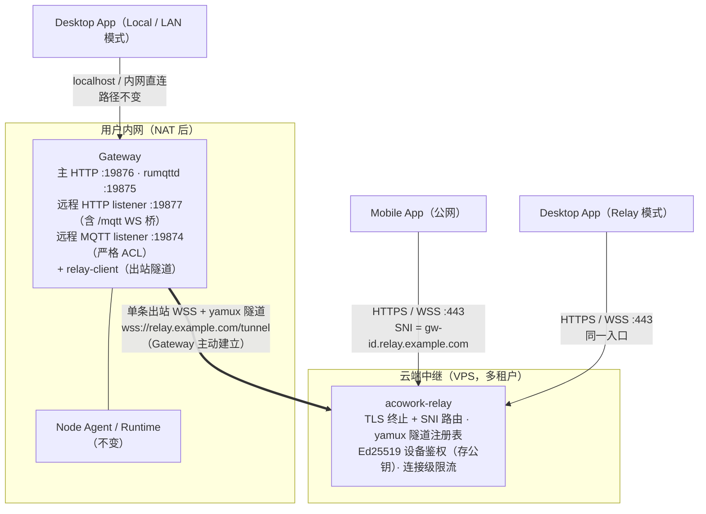

# 24-cloud-relay-remote-access — 云端瘦中继：Desktop / Mobile 外网访问内网 Gateway

> **版本**: v0.3.0
> **状态**: 🚧 实施中（M0–M6 推进）→ **v0.3 起定位为「自托管 BYO 档」，协议冻结（见下方 v0.3 标注）**
> **创建日期**: 2026-03 · **v0.2 修订**: 2026-10 · **v0.3 修订**: 2026-10
> **作者**: 软件架构师（ACowork.AI）
> **一句话结论**: 采用「单隧道瘦中继」——Gateway 主动向云端中继建立一条出站多路复用隧道（WSS + yamux），
> **中继只做 SNI 路由的字节管道**（不理解 HTTP / MQTT 语义），HTTP 与 MQTT-over-WS 统一经隧道转发到
> Gateway 侧两个专用回环 listener（`:19877` HTTP / `:19874` MQTT）。
> **MQTT Broker（内嵌 rumqttd）始终留在 Gateway 侧**。设备鉴权采用 **Ed25519 挑战-响应 + TOFU 首连登记**
> （私钥永不出 Gateway），用户身份**完全由内网账户体系裁决**（登录请求本身经隧道到达内网 user service），
> 中继零账号、零业务语义。明确否决「公网 MQTT Broker + Bridge」双真相源方案。
>
> **v0.2 修订要点**（评审结论，详见各节「v0.2」标注）：
> 1. **三拓扑模型**（§8.0）：standalone 单机 / LAN 直连（现有 local/remote 语义）/ relay 外网中继（新增），
>    relay 是 Desktop 侧第三种连接模式，Gateway 的 `relay.enabled` 与拓扑正交。
> 2. **中继进一步哑化**（§5.3）：入口不做 HTTP 反代也不做 WS→TCP 转换，仅按 TLS SNI 路由 + 字节管道；
>    MQTT-over-WS 端点（`/mqtt`）落在 Gateway 远程 listener `:19877` 上（axum WS 桥接到 `:19874`）。
> 3. **设备凭据改 Ed25519 挑战-响应**（§7.3）：替代原 HMAC 共享 secret 方案——中继只存公钥，私钥不出 Gateway；
>    TOFU 首连登记，无需人工配置凭据。
> 4. **中继不验证用户 token**（§7.3）：HTTP 中间件与 MQTT CONNECT 认证全部在 Gateway 侧完成，
>    中继侧仅做隧道鉴权 + 连接级限流。账户体系唯一，无云端镜像账号。
> 5. **（v0.2.1，实施修订）设备私钥不进密码保险库**（§7.3）：存 Gateway 配置目录明文 `0600`
>    `relay_identity.json`（同 Node Agent `identity.json` 先例，ADR-075）。原因：隧道必须在任何远程
>    用户登录之前可用（登录请求本身走隧道），而 vault 解锁只有本地用户能做——鸡生蛋死锁。
> 6. **（v0.2.2，实施修订）控制协议自带版本与能力协商**（§5.4.1）：`Register` / `Registered`
>    增 `proto`（缺省 = 1，即原始格式）与 `caps`。原因：控制协议是公开契约、本仓仅为参考实现，
>    协议演进不能依赖本仓发版节奏。配套：未知帧跳过而非致命、版本区间外显式拒绝。
>
> **v0.3 修订要点**（新增第二种远程模式后的定位调整，决策记录见 [ADR-088](../../adr/zh/ADR-088-cloud-hub-application-layer-remote-access.md)，
> 新模式设计见 [26-cloud-sync-hub.md](./26-cloud-sync-hub.md)）：
>
> 1. **本文不再被视为远程访问的唯一/终态方案**。新增 **Cloud Hub** 模式（应用层消息中枢：命令队列 +
>    带 `seq` 的事件日志 + 游标续传 + 投影缓存）。两种模式**永久并存、用户自选**，不是替代关系。
> 2. **本文定位改为「自托管 BYO 档」**：用户自带 VPS 运行 `acowork-relay`。其不可替代的优势是
>    **我方零云成本、零合规暴露、中继零秘密（内容端到端透传）**；代价是受限网络下可用性差、
>    且字节管道无法承载离线消息/跨设备同步/推送/计费等商业化能力。
> 3. **协议冻结（`proto = 1`）**：本文 §5.2 的 QUIC（quinn）承载演进（原 Phase 3 可选项）与 §5.1 的
>    多实例 Redis 分流**取消**，此后只接安全修复，不加新能力。理由：持续演进的第二模式会与新模式
>    抢协议设计话语权，最终两个都不完整。通配符设备子域与 SNI 路由**保持原样**（改造违反冻结原则）。
> 4. **⚠️ 新增强制要求（P1，未实施）**：Gateway 远程 listener（`:19877` / `:19874`）必须实施
>    **路径 / topic 允许列表**，且该允许列表**由 `RemoteSurfaceManifest` 生成**（见 26 §6.3），
>    不得手工维护。目的：两种模式暴露的远程能力集合完全相同，并把 §3.2 第 3 条
>    「一条 topic 过滤规则配错即公网暴露控制面」从**「靠配置正确」升级为「靠构造不可能」**。
>    这是本文 §7.2「来源即监听器 + ACL」路线的**替代**，不是补充。
> 5. **§11 OQ-1 结论沿用**（`acowork-relay` 属 core workspace 成员、不打包进 Desktop）；
>    Cloud Hub 的 `acowork-hub` 采用**完全相同**的交付形态决策。
> 6. **回滚关系**：Gateway 配置 `remote.transport = relay | hub | off` 逐 Gateway 灰度。
>    Hub 模式出问题一行开关回切本文路径，本文代码不动；反之亦然。两模块（`src/relay/` 与 `src/hub/`）
>    **互斥运行**，仅共享设备身份与 ACL 裁决层，禁止相互依赖。

---

## 1. 背景与目标

### 1.1 背景

ACowork 当前的部署形态是「单机局域网」：Gateway 的 HTTP（`:19876`）与内嵌 MQTT Broker（`:19875`）
均只绑定 localhost（见 `core/acowork-gateway/configs/rumqttd.toml` 的 `listen = "127.0.0.1:19875"`），
Desktop App 以同机进程身份直连。产品需要支持：

1. **Mobile App** 在公网访问用户内网/家庭网络中的 Gateway；
2. **Desktop App** 离开局域网后（远程办公、异地）访问同一 Gateway。

内网 Gateway 无公网 IP、位于 NAT 之后，无法被入站直连，需要云端中继协助穿透。

### 1.2 目标

- 定义云端中继服务的职责边界、隧道协议、路由与鉴权模型
- 定义 Gateway 侧 relay-client 的改造范围
- 定义 Desktop「本地 / 远程」双模连接的改造范围与能力降级清单
- 明确安全前置条件（远程 ACL、调试端点屏蔽、凭据体系）
- 给出增量落地路径（Phase 0/1/2）与回滚策略

### 1.3 非目标（YAGNI）

- ❌ 公网侧消息缓存 / 离线消息暂存（Broker 状态必须跟随 Gateway，见 §3.2）
- ❌ WebRTC P2P / TURN（信令与打洞复杂度远超收益，中继带宽在本场景可承受）
- ❌ 多 Gateway 集群编排 / 跨 Gateway 路由（一个中继连接对应一个 Gateway 实例）
- ❌ 替代局域网直连路径（本地模式保持不变，远程是**新增**接入路径）
- ❌ 中继侧业务审计 / 内容检查（中继保持协议无关，审计属于 Gateway 职责）

---

## 2. 现状与约束（事实基线）

| # | 事实 | 出处 | 对设计的约束 |
|---|------|------|-------------|
| F1 | MQTT Broker 为内嵌 rumqttd 0.20，仅 TCP 监听 localhost，**无 Mosquitto 式桥接能力** | `core/acowork-gateway/configs/rumqttd.toml` | 任何依赖 broker-to-broker bridge 的方案不可落地 |
| F2 | MQTT 认证在 CONNECT 时校验，与 HTTP 共享同一 HttpAuth token；ACL 经 `set_auth_handler` 回调实现 | `core/acowork-gateway/src/http/server.rs`、`core/acowork-gateway/src/mqtt/broker.rs` | 远程客户端可复用现有认证链路，ACL 可按连接来源扩展 |
| F3 | Gateway HTTP 已有 token 认证（HttpAuth），但信任模型建立在 localhost 之上，ACL 注释自述 "single-user phase — permissive" | `rumqttd.toml` §ACL、`core/acowork-gateway/src/http/auth.rs` | 暴露公网前必须完成安全硬化（§7），这是 Phase 1 的**准入门槛**而非收尾工作 |
| F4 | 平台存在多用户账户体系（AUTH_MODE=multi_user）与用户域服务 | ADR-076、ADR-084（`core/acowork-user`） | 设备注册与中继凭据发放应挂接账户体系，不另造一套身份 |
| F5 | Node Agent 负责 Runtime 进程生命周期；`install_path` 等为 node-local 路径，跨机 fs 直读即 5xx | ADR-055、AGENTS.md「Gateway boundary」 | 远程模式下客户端不得假设与 Gateway 同机；附件等必须走 Gateway HTTP API |
| F6 | Desktop 的 `GatewayClient` 已支持 `with_base_url / set_base_url`，MQTT 客户端连 `127.0.0.1:19875`（TCP） | `apps/acowork-desktop/src-tauri/src/gateway_client.rs`、`mqtt_client.rs` | Desktop 远程化改造集中在传输层与连接模式管理，API 层基本不动 |
| F7 | Desktop 承担本机 Gateway 生命周期管理（spawn/监控），并有 clipboard、附件落盘等同机命令 | `apps/acowork-desktop/src-tauri/src/commands/` | 远程模式存在能力降级，需显式清单化（§8） |
| F8 | DevMode 调试协议走 MQTT + HTTP，高频交互 | ADR-048、`core/acowork-gateway/src/http/debug_mqtt.rs` | 调试通道默认禁止远程访问 |

---

## 3. 方案选型

### 3.1 候选方案对比

| 方案 | 结论 | 关键理由 |
|------|------|---------|
| **A. 瘦中继单隧道（本设计）** | ✅ 推荐 | 单 Broker / 单身份模型不变；App 侧标准 HTTPS + MQTT-over-WS；中继无业务语义、易审计；Desktop/Mobile 共用 |
| B. FRP(HTTP) + 公网 MQTT Broker + Bridge | ❌ 否决 | 见 §3.2 |
| C. 纯 FRP 双端口穿透（HTTP + MQTT TCP） | ⚠️ 过渡可用 | 即方案 A 的「买现成」形态，作为 Phase 1 脚手架；但裸 TCP 1883 对移动网络/企业防火墙不友好，多租户与鉴权模型弱，不可作为终态 |
| D. Tailscale / WireGuard mesh | ⚠️ 仅内部验证 | E2E 加密、免中继开发，技术上极佳；但要求终端用户安装第三方 App 并注册第三方账号，**不能作为产品形态交付**；适合 Phase 0 验证移动端协议兼容性 |
| E. Cloudflare Tunnel | ❌ 否决 | 国内可达性差；每 Gateway 需运行 cloudflared；TCP 隧道对 MQTT 支持一般；平台定位要求可控的自有基础设施 |
| F. WebRTC + TURN | ❌ 否决 | P2P 延迟最优，但信令 / ICE / NAT 打洞 / TURN 回落的复杂度远超收益；未来若中继带宽成为瓶颈可再评估 |
| G. 中继以 Docker 镜像交付 | ❌ 否决 | 镜像化确实能免疫宿主机环境缺陷（构建期 glibc / musl 工具链、`acl` 包与 `setfacl` 权限、跨架构 `scp`），但 **certbot 无法进镜像**（见下方 3.3），收益只覆盖部署链的一小段；且中继**一年可能不部署一次**，Docker 的运维复利摊不到这么薄的场景上 |

### 3.2 为什么否决「公网 MQTT Broker + Bridge」（方案 B）

这是外部咨询（DeepSeek）给出的推荐方案，经与代码基线核对后否决，理由记录如下：

1. **无处落地**：Gateway 内嵌 rumqttd（F1），不具备 Mosquitto `connection cloud-bridge` 式桥接能力。
   落地 Bridge 需在每个用户内网额外部署一个专职桥接 Broker——凭空多出一个组件、一套凭据、一类故障模式。
2. **双真相源破坏 MQTT 语义**：ACowork 消息层（`acowork-mqtt-session` 会话复用、ADR-048 DevMode、
   ADR-055 `acowork/nodes/#` 控制面）假设单一权威 Broker。Bridge 将 session / QoS / retained 状态复制到
   公网 Broker 后，QoS 1/2 的端到端确认语义被两个 Broker 切断。
3. **控制面暴露风险**：Bridge 依赖 topic 过滤把内部控制面主题挡在内网，**一条过滤规则配错即公网暴露控制面**，
   属于典型的静默失败（silent fallback）反模式。
4. **多租户无解**：每个 Gateway 需在公网 Broker 上做命名空间隔离 + ACL，Bridge 模型对此几乎没有支持。
5. **论据不适用**：「离线消息、万级并发」是 IoT 场景论据；ACowork 单 Gateway `max_connections = 100`，
   且 Broker 状态本来就必须跟随 Gateway（会话数据、记忆索引均在 Gateway 侧）。

### 3.3 为什么不做「中继 Docker 镜像交付」（方案 G）

中继是**无状态字节管道**，从交付角度看「做成镜像、docker run 一步到位」很自然。但按实际部署链逐段核对，
收益只覆盖一小段，其余部分要么无解、要么反而更麻烦：

**镜像能解决的**（确实存在，但都可绕过）：

| 宿主机环境缺陷 | 绕过方式（不 Docker 也能做） |
|---------------|----------------------------|
| 构建期 glibc 与运行期不匹配（Anolis 8 = 2.28） | 静态链接 musl 目标即可，与容器无关 |
| 跨架构 `scp`（x86_64 / aarch64） | 编译时确认 `uname -m`，一步到位 |
| `acl` 包与 `setfacl` 权限配置 | 两条 `setfacl` 命令，或 `chmod 640` 兜底 |
| 300MB Rust 工具链（仅当在 ECS 兜底编译时） | 本地编译后 `scp`，本就不需要 |

**镜像解决不了的**——这些才是真正卡住部署的地方，且与容器化无关：

1. **Cloudflare API Token 的 Start Date 按 UTC 零点解释**（§5.4.1 runbook 记录）：填「今天」要等到
   当天 08:00 才生效，期间返回笼统的 `9109 Invalid access token`。这是控制台配置问题。
2. **certbot 不能进镜像**：其工作目录 `/etc/letsencrypt` 生命周期与容器不一致（镜像删重建即丢续期配置），
   且续期 deploy hook 天然要 `systemctl restart acowork-relay`——容器内无 systemd。若强做，
   需改 hook 为信号重载并让 relay 支持热加载证书，那是**改架构**而非「配置好依赖」。
3. **新增一层抽象**：`systemctl status` 看不到的故障要先懂 Docker 网络/挂载/日志，排查成本上升。

**决定**：维持 systemd 交付（runbook `docs/runbooks/relay-ecs-cloudflare-deploy.md`）。中继**一年可能
不部署一次**，Docker 的运维复利摊不到这么薄的场景。若将来中继需要多副本 / 自动扩缩 / 蓝绿发布，
再评估镜像化——那时 certbot 应彻底移出（改用外部 ACME 客户端或云厂商证书服务），单独作为一项改造。

---

## 4. 总体架构



核心原则：

- **隧道方向恒为出站**：Gateway → 中继，天然穿透 NAT，内网零端口映射。
- **中继是字节管道**：入口只读 TLS ClientHello 的 SNI 做路由（`<gw-id>.relay.example.com` → 隧道），
  之后纯字节转发。不解析 HTTP 路由语义、不解 MQTT 协议、**不验证用户 token**。
  唯一的例外是「设备未注册/离线」时回写一个手工构造的 HTTP 502 `DEVICE_OFFLINE` 响应（§5.4）。
- **单一身份模型**：远程客户端面对的仍是「一个 Gateway、一套用户凭据」，与本地模式完全一致；
  登录（`/api/auth/login`）、token 刷新、每次 HTTP 请求鉴权、每次 MQTT CONNECT 认证
  全部由 Gateway 侧现有链路裁决（`auth_middleware` + rumqttd auth handler）。
- **Broker 永远在 Gateway 身边**：会话、QoS、retained、ACL 全部由内嵌 rumqttd 权威裁决。
- **来源即监听器**：Gateway 侧通过**专用回环 listener** 区分流量来源——隧道流量进
  `127.0.0.1:19877`（HTTP）与 `127.0.0.1:19874`（MQTT），天然携带「远程来源」标记，
  无需注入/解析任何代理头，外部无法伪造。

---

## 5. 中继服务设计（acowork-relay）

### 5.1 进程形态与部署

- 新增独立 Rust 服务 `acowork-relay`（axum + tokio），**部署于云端 VPS，不进入 Desktop 打包产物、
  不属于 core workspace 的本地进程拓扑，**不进入 Desktop 打包产物**（OQ-1 决议：core workspace 成员，
  `dev/build` 脚本不打包它；未来部署节奏分化时可拆独立仓库）。
- 单实例目标容量（Phase 2 初）：≥ 5k 并发隧道、≥ 50k 并发客户端连接；无状态可水平扩展，
  隧道注册表存内存 + Redis（多实例时按 gw-id 一致性哈希做接入层分流，Phase 3 再引入，初期单实例）。

### 5.2 隧道协议

| 项 | 选择 | 理由 |
|---|------|------|
| 承载 | WSS（WebSocket over TLS，443），路径 `/tunnel` | 对运营商 NAT / 企业防火墙最友好；tokio-tungstenite 已在 workspace 依赖中 |
| 多路复用 | yamux（隧道内逻辑流） | 一条 WSS 承载任意多客户端连接，HTTP keep-alive 连接与 MQTT 长连接各占一条逻辑流；后续可换 QUIC |
| 逻辑流打标 | 每条新流首字节 tag（`0x01` = HTTP → `:19877`；`0x02` 保留 MQTT 直连） | 中继开流时写入，Gateway relay-client 按标记分流转发，零协议解析 |
| 心跳 | 控制流 Ping/Pong（30s），3×keepalive 无 Pong 判死 | yamux 0.14 **无内置 keepalive**（源码实证），心跳落在 §5.4 控制协议上；Gateway 侧发出（出站隧道持有 NAT 保活职责） |
| WS 字节流 | WS binary 帧 ↔ `AsyncRead/AsyncWrite` 适配器（yamux 要求字节流） | ~80 行共享适配器，放 `acowork-core::relay` |
| 单任务驱动器 | `acowork-core::relay::driver`：两侧共用一个 yamux 驱动任务（开流请求队列 + 入站流分发 + 首字节 tag 写入保证） | yamux 0.14 要求单一任务 poll 连接；中继侧/Gateway 侧/测试共用一份实现，杜绝三份手写 poll 循环 |
| 演进 | QUIC（quinn）作为 Phase 3 可选承载 | 弱网体验更优，但初期不引入 |

### 5.3 客户端入口与路由（v0.2：SNI 字节管道，中继零 HTTP 解析）

统一域名体系，通配符证书 SAN 含 `[relay.example.com, *.relay.example.com]`（Let's Encrypt 支持同证书双 SAN）：

| 入口 SNI | 归属 | 中继行为 |
|------|-----------|---------|
| `relay.example.com` | 服务域（控制面） | TLS 终止后交 axum：`GET /tunnel`（WS upgrade，Gateway 隧道入口）、`GET /health`、`/api/admin/*`（管理 API，admin token 鉴权） |
| `<gw-id>.relay.example.com` | 设备域（数据面） | TLS 终止（`LazyConfigAcceptor` 读 ClientHello SNI）→ 查隧道注册表 → 在该隧道上开 yamux 流（首字节 `0x01`）→ 与客户端 TLS 流**双向字节转发** |

关键语义（v0.2 相比 v0.1 的哑化）：

- **不解析 HTTP**：设备域连接不读请求行/头/路径。HTTP/1.1 keep-alive、SSE 流式响应、
  任意 body 大小均按 TCP 语义透传；中继 ALPN 只协商 `http/1.1`（不提供 h2），客户端天然降级。
- **不做 WS→TCP 转换**：`wss://<gw-id>.relay.example.com/mqtt` 的 WS upgrade 请求与其他 HTTP
  请求一样透传到 Gateway `:19877`，由 **Gateway 侧 axum `/mqtt` 路由**完成 WS upgrade
  （回显 `Sec-WebSocket-Protocol: mqtt` 子协议，rumqttc `Transport::Wss` 强制要求），
  再桥接到 rumqttd 远程 listener `:19874` 的裸 TCP。中继对 MQTT 一无所知。
- **MQTT 客户端 URL 约定**：rumqttc 的 Ws/Wss 传输要求 `broker_addr` 为完整 URL
  （`split_url` 从 URL 提取 domain:port，tungstenite 要求 URI 带 path），因此 Desktop 远程模式
  MQTT 地址为 `wss://<gw-id>.relay.example.com/mqtt`。
- **离线显式化**：SNI 对应 gw-id 未注册 / 隧道断开时，中继直接回写手工构造的
  `HTTP/1.1 502 {"code":"DEVICE_OFFLINE"}`（连接随即关闭；对 WS 客户端表现为 upgrade 失败）。
  **禁止**中继缓存请求或伪造响应。
- **无 TLS 模式**（自托管/测试）：路由依据降级为 HTTP Host 头（peek 首个请求头，**剥掉可选
  `:port` 后缀**——真实客户端对非默认端口总会带端口，IPv6 形如 `[::1]:443`），仅供内网测试。

### 5.4 隧道注册与生命周期（v0.2：Ed25519 挑战-响应 + TOFU）

```mermaid
sequenceDiagram
    participant G as Gateway(relay-client)
    participant R as acowork-relay
    participant C as Mobile/Desktop(Relay 模式)

    G->>R: WSS 连接 wss://relay.example.com/tunnel
    G->>R: yamux 控制流: REGISTER {gw_id, pubkey, ts}
    R->>R: 查设备表: 已知 → 公钥必须与登记一致（pinning）;未知 → TOFU 登记（可配置关闭）
    R-->>G: CHALLENGE {nonce}
    G->>R: PROOF {sig = Sign25519(设备私钥, nonce)}
    R->>R: 验签 → 单活替换: 向旧隧道发 GOAWAY 并踢除
    R-->>G: REGISTERED {session_id, keepalive_s}
    C->>R: TLS 连接, SNI = <gw-id>.relay.example.com
    R->>R: 查注册表 → 命中隧道 → 开 yamux 流(tag=0x01)
    R->>G: 字节管道
    G->>G: 转发至 127.0.0.1:19877（含 /mqtt WS 桥）
    G-->>R: 响应字节流
    R-->>C: 响应
    Note over R,C: gw-id 未注册/隧道断开 → 502 + {"code":"DEVICE_OFFLINE"};不排队、不伪造
```

关键语义：

- **非对称凭据**：设备凭据 = Gateway 首次启用时生成的 Ed25519 密钥对（**v0.2.1 修订**：私钥存
  Gateway 配置目录明文 `0600` `relay_identity.json`，不进密码保险库——隧道先于任何远程登录存在，
  而 vault 解锁依赖本地用户，见 §7.3；**永不出 Gateway 进程**）；中继只存公钥。相比 v0.1 的 HMAC
  共享 secret 方案，中继被攻破不泄露任何秘密，与 §7.1「中继半可信」的信任模型自洽。
- **TOFU（Trust On First Use）首连登记**：gw-id 为 122 位随机 UUID v4，首连前不可猜测，抢注不可行；
  首次 REGISTER 登记公钥，此后公钥 pinning。自托管部署可配置 `require_registration = true`
  关闭 TOFU（管理员先经 admin API 显式登记，适合企业场景）。
- **防重放**：nonce 为 32 字节随机数、单次有效（带 TTL 的 pending 表）；REGISTER 中的 `ts` 仅作
  时钟偏移审计。挑战-响应消除了纯 HMAC 方案的时间窗重放问题。
- **单隧道单活**：同一 gw-id 只允许一条活跃隧道；新隧道 REGISTERED 即向旧隧道发 GOAWAY 并踢除
  （防止凭据泄露后的双活劫持）。
- **告别帧落盘保证**（v0.2.1 实证补充）：yamux 0.14 的所有流写入经单一驱动任务排队，一帧要经过
  一次驱动 poll 才上链路。因此 **Rejected/GOAWAY/DEREGISTER 写入后、连接拆除前必须留出
  `TEARDOWN_GRACE`（150ms）**——否则对端只看到连接断开，收不到原因帧。两侧（中继拆除路径、
  Gateway Deregister）共用该常量（`acowork-core::relay::TEARDOWN_GRACE`）。
- **公钥轮换**：经旧私钥签名的 `ROTATE_KEY {new_pubkey}` 消息（走已认证控制流）；
  私钥彻底丢失时由 admin API 删除设备记录后重新 TOFU。
- **重连风暴防护**：REGISTER 按 gw-id 限频（如 5 次/分钟），指数退避由 relay-client 执行
  （1s→60s 上限，GOAWAY 后短暂停顿即重试）。

#### 5.4.1 协议版本与兼容规则（v0.2.2 实施，控制协议对外契约）

控制协议是**公开契约**：本仓的 `acowork-relay` 只是参考实现，仓外可以存在其他实现。协议演进
因此必须在 wire format 层面自带协商能力，否则本仓发版会成为所有实现方的瓶颈。

- **`proto` 版本字段**：`Register` / `Registered` 携带 `proto: u16`。**`proto = 1` 即本节
  原始设计（引入 `proto` 之前的格式）**——该字段缺省即视为 1，故所有既有对端零改动互通。
  常量：`acowork_core::relay::proto::{PROTO_VERSION, MIN_SUPPORTED_PROTO}`。
- **版本协商**：Gateway 在 `Register` 声明自身版本，中继在 `Registered` 回显**实际选中**的版本。
  区间外（`MIN_SUPPORTED_PROTO..=PROTO_VERSION`）立即以
  `Rejected { reason: "unsupported protocol version" }` 拒绝并断开；校验发生在**设备登记之前**，
  版本不符的对端不会进入 device store。Gateway 侧对 `Registered.proto != PROTO_VERSION`
  同样报错退出，而不是带着语义不一致的隧道继续跑。
- **`caps` 能力协商**：`Register.caps` / `Registered.relay_caps` 为扩展名字符串列表（如
  `["tenant.v1"]`）。**纯建议性**：接收方忽略不认识的条目；**接收方不得依据自己未实现的
  能力改变行为**。空列表在编码时省略（`skip_serializing_if`），不产生 `"caps":[]` 噪声字段。
- **未知帧不得致命**：`ControlFrame` 是 internally-tagged enum，serde 遇未知 `type` 会解析失败。
  控制流因此走 `read_control_frame_known`（底层 `read_control_frame`）——**未知帧被跳过而非报错**，
  对端用更新的协议特性不会把我们的隧道打掉。缺 `type` 判别键或非 JSON 仍是真错误。
- **新增特性的规约**（评审规则，非本版实施）：
  1. **不新增 `ControlFrame` variant**，特性走现有帧的可选字段扩展；
  2. 破坏性变更走 `proto` 升版，且保留至少两个发布周期的弃用窗口（`MIN_SUPPORTED_PROTO` 滞后）；
  3. 新字段一律 `#[serde(default)]`，保证旧实现读得懂、新实现不强制旧实现理解。

  > `acowork-relay` 参考实现本身不消费任何 `caps`（始终回空）——它只消费版本区间。
  > 仓外实现可自由使用 `caps` 承载私有扩展而不影响本仓互通。


### 5.5 中继侧限流与配额

- 按 gw-id：并发客户端连接数上限、新建连接速率、隧道内字节速率（上下行分别计）。
- 全局：单 IP 未认证连接数上限，防扫描。
- 超限返回 `429` + `Retry-After`，并记录审计日志。

---

## 6. Gateway 侧改造（relay-client + 远程 listener）

新增模块 `core/acowork-gateway/src/relay/`（**进程内模块**，与 Gateway 同生命周期，
避免多一个进程管理面——OQ-2 决议）：

| 职责 | 说明 |
|------|------|
| 隧道建立与保活 | 出站 WSS 连接中继 `/tunnel`，yamux 多路复用，REGISTER 挑战-响应，断线指数退避重连（1s→60s 封顶，加抖动） |
| 设备密钥管理 | Ed25519 密钥对首次启用时生成，存 acowork-vault；支持 ROTATE_KEY 轮换 |
| 逻辑流转发 | 中继发起的入站 yamux 流：读首字节 tag → TCP 连 `127.0.0.1:19877`（HTTP，含 `/mqtt` WS 桥）→ 双向拷贝 |
| 开关与配置 | `[relay]` 配置段：`enabled`（默认 **false**）+ `server_url`；关闭时零开销、零出站连接 |
| 管理 API | `POST /api/relay/enable`（生成/装载密钥 + 启动隧道）、`POST /api/relay/disable`、`GET /api/relay/status`（状态机快照，Desktop 设置面板轮询）；enable 返回连接信息 `{relay_url, gw_id}` |
| 状态上报 | 隧道状态机（connected/reconnecting/rejected/offline）经 `GET /api/relay/status` 暴露；MQTT 事件通道上报为后续增强 |

配套的远程 listener（M3，与 relay-client 同批落地）：

| Listener | 地址 | 用途 |
|---|---|---|
| 远程 HTTP | `127.0.0.1:19877` | 与主 HTTP `:19876` 同构 Router + **RemoteOrigin guard**（§7.2），额外挂 `/mqtt` WS 桥接路由 |
| 远程 MQTT | `127.0.0.1:19874` | rumqttd 第二 v4 listener，**严格 auth handler**（§7.2），仅 relay-client 可达 |

**回滚设计**：`relay.enabled=false` 即完全恢复现状；远程接入是纯增量路径，不影响 localhost / LAN 直连的任何行为。

---

## 7. 安全设计（Phase 1 准入门槛）

> 本章不是「最后完善」项。**以下 S1–S4 全部完成之前，禁止对真实用户开放远程访问。**

### 7.1 信任边界重划

现状信任模型：localhost = 可信（F3）。远程化后新增边界：

```
公网客户端 ──(TLS)── 中继 ──(隧道, TLS 内层可选加密)── Gateway ──(localhost)── Runtime/Node
     ▲不可信                ▲半可信(自有基础设施)              ▲凭 token 认证后受限可信
```

### 7.2 远程 ACL（S1，v0.2：来源即监听器）

现状信任模型：localhost = 可信（F3）。远程化后新增边界：

```
公网客户端 ──(TLS)── 中继 ──(WSS+yamux 隧道)── Gateway 回环 listener :19877/:19874 ──> 现有鉴权链路
     ▲不可信                ▲半可信(自有基础设施,仅存公钥)        ▲来源由 listener 身份锚定,无法伪造
```

- **MQTT（`127.0.0.1:19874` 严格 listener）**：rumqttd 支持多 v4 server（`v4: HashMap<String, ServerSettings>`，
  已实证），为远程流量配置独立 listener + 独立 `set_auth_handler`：
  - 允许：`user:{name}:desktop:{id}` / `user:{name}:mobile:{id}` 形状的 client_id，
    密码 = 有效用户 token（复用 `user_verifier` 验签链路）
  - 拒绝：`node:*`、`agent:*`、`gateway:publisher`、内部 service publisher 等一切其他身份
    ——远程侧不存在 Node/Runtime 直连场景（它们本就在内网连 `:19875`）
- **HTTP（`127.0.0.1:19877`）**：RemoteOrigin guard middleware（layer 在主 Router 副本上）：
  - 以下路由直接 **404**（不暴露存在性）：`debug_mqtt` 调试端点、Gateway 配置写端点、fs 浏览类端点（F5）
  - 剥除并拒绝 `X-ACowork-Node-Token` 头（内部机器身份不得经远程通道主张）
  - 其余路由照常进入 `auth_middleware`（multi_user Bearer 验签），鉴权语义与本地完全一致
- **实现锚点**：来源标记 = 流量到达的 listener 端口（仅回环可达，外部无法伪造），
  不依赖注入/解析任何代理协议头。

> ⚠️ **已知差距（v0.2 实证结论）**：rumqttd 0.20 的 auth handler 仅在 CONNECT 时拿到
> (client_id, username, password) 三元组，**无 topic 级 ACL hook**（源码 grep 零命中），
> 因此「拒绝 `acowork/nodes/#` 通配订阅」无法在 broker 内直接实现。初版缓解：
> (a) 严格 listener 的 client_id 形状限制使远程侧只能以 Desktop/Mobile 用户身份接入；
> (b) 订阅控制面主题的残留风险 = 已持有效 token 的用户订阅内部控制 topic，与 LAN 直连同级。
> 彻底方案（patch rumqttd 增加订阅 ACL hook 或换用支持 ACL 的 broker）列为后续项，独立评审。

> 📌 **rumqttd 拒绝语义（M3 实证）**：严格 listener 鉴权失败时 rumqttd 返回
> `Error::InvalidAuth` 并**直接断开连接，不回 CONNACK**（rc=5 不会出现）。远程
> 客户端（M4 Desktop）应将「连接被断」而非「CONNACK 错误码」视为凭据失败信号。

### 7.3 凭据体系（S2，v0.2：单一账户 + 非对称设备凭据）

| 凭据 | 持有方 | 签发/验证方 | 用途 | 吊销 |
|------|--------|--------|------|------|
| 用户 token（现有 access/refresh） | Desktop/Mobile App | 内网 user service（ADR-084）签发，**Gateway 侧验签**（`user_verifier`） | 业务 API 与 MQTT CONNECT 认证（本地/LAN/Relay 三模式同一套） | 现有机制（改密/登出/refresh 失效），对远程即时生效 |
| 设备密钥对（gw-id + Ed25519 keypair） | Gateway relay-client（**v0.2.1：私钥存配置目录 `0600` `relay_identity.json`，不进密码保险库**） | Gateway 生成；中继 TOFU 登记公钥并 pinning；挑战-响应验证 | 隧道 REGISTER 鉴权 | admin API 删设备记录 → 踢隧道；ROTATE_KEY 换钥 |
| 中继服务端证书 | 中继 | 公网 CA（SAN: `relay.example.com` + `*.relay.example.com`） | 客户端/隧道 TLS | 常规轮换 |

- **中继不持有任何用户凭据、不验证用户 token**（v0.2 修订）：远程客户端的登录、刷新、每次请求鉴权
  都是被中继透传的普通 HTTP，最终在 Gateway 侧裁决。中继只掌握每设备的公钥（半可信面最小化）。
  若未来需要中继侧入口级 pre-auth（进一步压缩 DoS 面），演进路径为 REGISTER 时附带 user service
  公钥、中继本地验签 token——本版不做（避免中继理解业务身份）。
- **Desktop Relay 模式不享受任何特权**：与 Mobile 使用同一用户 token、同一远程 listener、同一 ACL。
  宽松权限只属于「物理同机 localhost 直连」。
- 本地 AUTH_MODE（无账户体系）下的远程访问：用户需手工提供 HttpAuth token（降级体验，文档化限制）；
  完整远程体验要求 `AUTH_MODE=multi_user`。

### 7.4 传输加密（S3）

- 客户端↔中继：TLS 1.3（443）。
- 中继↔Gateway 隧道：外层 WSS 已加密；初版中继为自有基础设施，接受中继可见明文（模式 A）。
  若未来要求「中继零知识」，演进为 TLS 透传（模式 B：中继仅按 SNI 路由，Gateway 持设备证书终止 TLS），
  代价是证书管理复杂度，见 §11 OQ-3。

### 7.5 可用性安全（S4）

- 中继对未认证连接做 IP 级限流；对已认证 gw-id 做 §5.5 配额。
- Gateway 侧远程连接数独立上限（如 20），防止远程流量挤占本地 Runtime 的 Broker 容量
  （`max_connections = 100` 总池）。

---

## 8. 客户端改造

### 8.0 三拓扑模型（v0.2 新增：现有 local/remote 语义澄清）

中继落地后平台共有三种接入拓扑。**拓扑是 Desktop 的连接属性**；Gateway 侧 `relay.enabled`
与之正交（单机版 Gateway 也可开启中继供手机接入）：

| | ① Standalone 单机 | ② LAN 直连（现有 `remote`） | ③ Relay 外网中继（新增） |
|---|---|---|---|
| Desktop `GatewayMode` | `Local`（不变） | `Remote`（不变，语义=内网直连） | `Relay`（新增，持久化串 `"relay"`） |
| HTTP base_url | `http://127.0.0.1:19876` | `http://<lan-ip>:19876` | `https://<gw-id>.relay.example.com` |
| MQTT 传输 | TCP `127.0.0.1:19875` | TCP `<lan-ip>:19875`（host 由 base_url 推导 + `/api/status` 动态端口，现状） | **WSS** `wss://<gw-id>.relay.example.com/mqtt`（rumqttc `Transport::Wss`，broker_addr 为完整 URL） |
| Gateway 生命周期 | probe-or-spawn（现状） | 不 spawn（现状） | 不 spawn + DEVICE_OFFLINE 显式提示 |
| 信任级别 | localhost 全能力 | 现状语义，不动 | 远程 ACL（专用 listener + RemoteOrigin guard） |

> 现有 `GatewayMode::Local/Remote` 二态（`state.rs`）扩为三态；持久化串 `"local"/"remote"`
> 向后兼容不动，仅新增 `"relay"`。MQTT 连接幂等守卫（`endpoint_matches`）需将传输类型纳入端点身份。

> **v0.3 补充**：新增第四拓扑 **④ Hub**（`GatewayMode::Hub`，持久化串 `"hub"`），设计见
> [26-cloud-sync-hub.md §9.1](./26-cloud-sync-hub.md)。Hub 模式下 **base_url 指向 Hub 域名而非 Gateway 设备域，
> 且不使用 MQTT**（无 `:19874` 远程 listener、无 `/mqtt` WS 桥）。三种远程相关拓扑的
> 能力集合必须完全相同，由 `RemoteSurfaceManifest` 单一来源保证（26 §6 / P1 约束）；
> 客户端侧模式差异只允许存在于 transport 适配器内，业务层不得按模式分支（P3 约束）。

### 8.1 Desktop：从「本机伴侣」到「三模客户端」

| 改造项 | 内容 | 工作量评估 |
|--------|------|-----------|
| 连接模式管理 | `GatewayMode` 加 `Relay` 变态；Relay 模式 base_url 指向 `https://<gw-id>.relay.example.com`（复用 `set_base_url`，F6） | 小 |
| MQTT 传输 | `acowork-mqtt-session::MqttClientConfig` 加 `transport` 字段（`Tcp` / `Wss(url)`）；rumqttc workspace 依赖启用 `websocket` feature；`Transport::Wss` 时 broker_addr 填完整 URL | 小-中 |
| 远程访问面板 | 设置页：relay 模式选择 + 「远程访问」面板（Gateway 地址、gw-id 展示、隧道状态轮询 `GET /api/relay/status`） | 中 |
| 生命周期解耦 | Relay 模式下禁用本机 Gateway spawn/监控（复用现有 mode != Local 分支）；断开仅提示 DEVICE_OFFLINE | 小 |
| 同机命令降级 | clipboard、附件本地落盘等命令（F7）在 Relay 模式下：附件走 Gateway HTTP API；剪贴板仅传内容不落远端路径。② LAN 直连模式同样适用该清单（同机假设在两模式下均不成立） | 中 |

### 8.2 远程模式能力降级清单（产品需确认）

| 能力 | ① 单机 | ② LAN 直连 | ③ Relay | 说明 |
|------|---------|---------|---------|------|
| 聊天 / 会话 / Agent 管理 | ✅ | ✅ | ✅ | 核心路径，HTTP + MQTT 流式推送（③ 经隧道） |
| 文件上传下载（附件） | ✅ | ✅（走 API） | ✅（走 API） | 禁止本地路径直读（F5） |
| Gateway 启停 / 自愈 | ✅ | ❌ | ❌ | 远端断电只能等内网侧自愈（Node Agent）或人工干预 |
| DevMode 调试协议 | ✅ | ✅ | ❌（默认禁止） | ADR-048 高频交互 + 调试端点屏蔽（§7.2） |
| 本机剪贴板 / 本地 fs 浏览 | ✅ | ❌ | ❌ | 同机假设不成立 |
| LSP（本地语言服务器） | ✅ | ❌ | ❌ | LSP relay 绑定 Desktop 所在机器 |

### 8.3 Mobile App

Mobile 只实现 Relay 模式，协议面与 Desktop Relay 模式完全一致
（HTTPS + MQTT-over-WSS + 用户 token + `user:*:mobile:*` client_id），无特化逻辑。
Mobile 的登录/设备授权流程依赖 ADR-076 账户体系（acowork-user），不在本文档展开。

### 8.4 账号融合（v0.2 新增）

三模式下**账号体系唯一**（内网 acowork-user），无云端镜像账号：

1. **登录即达**：远程客户端的 `/api/auth/login` / `/api/auth/refresh` 是被中继透传的普通 HTTP，
   直接到达内网 user service——远程设备用同一套账号密码登录，拿同一套 token。
2. **鉴权唯一裁决点在 Gateway**：每次 HTTP 请求（`auth_middleware`）与每次 MQTT CONNECT
   （rumqttd auth handler）都在 Gateway 侧验证 token，中继不参与。
3. **吊销即时生效**：账户体系改密/登出/refresh 失效对远程通道即时生效（裁决就在内网）。

---

## 9. 可观测性与运维

- **中继指标**：活跃隧道数、每 gw-id 连接数/字节数、REGISTER 失败率（按失败原因分类）、
  WS 升级失败率、P99 转发延迟（中继自身开销应 < 5ms）。
- **Gateway 指标**：隧道状态机（connected/reconnecting/rejected）、重连次数、远程来源请求量。
- **审计日志**：REGISTER / 踢隧道 / 凭据吊销 / 限流触发，均落结构化日志；中继不记录业务 payload。
- **告警**：单 gw-id 高频 REGISTER 失败（疑似凭据泄露爆破）、中继实例隧道数突降（疑似网络分区）。

---

## 10. 分阶段实施与回滚

| 阶段 | 内容 | 出口条件 | 回滚方式 |
|------|------|---------|---------|
| **Phase 0**（零开发） | 内部用 Tailscale 将手机接入内网 Gateway，验证 Mobile 协议兼容性（MQTT-over-WS 可用性、rumqttc WS 传输、流式推送体验） | 移动端全链路 demo 通过 | 删除 tailnet，无残留 |
| **Phase 1**（脚手架） | 完成 §7 安全硬化 S1–S4；用 FRP（vhost HTTP + TCP/WS）搭单用户中继，限定内部设备 | 安全清单评审通过 + 内部远程日用一周 | 关闭 `relay.enabled`；FRP 下线 |
| **Phase 2**（终态中继） | 自研 `acowork-relay`（§5），多租户 + 限流 + 审计；Desktop 三模改造（§8）；Mobile 接入 | 对外发布远程访问功能 | 中继独立部署，故障时 Gateway 回落纯本地模式，产品功能降级但不损坏数据 |
| **Phase 3**（可选演进） | QUIC 承载、TLS 透传（模式 B）、多实例水平扩展、rumqttd 订阅级 ACL（§7.2 差距） | 按运营数据决策 | 承载层可协商降级回 WSS |

Phase 1 → Phase 2 对 App 侧协议不变（同为 HTTPS + MQTT-over-WS，域名切换即可），FRP 可无缝下线。

### 10.1 Phase 2 实施里程碑（M0–M6，2026-10 启动）

| # | 里程碑 | 内容 | 状态 |
|---|--------|------|------|
| M0 | 协议与依赖 | `acowork-core::relay`：控制帧（ndjson）+ frame IO、stream tag 常量、WS↔字节流适配器、**共享 yamux 驱动器**；workspace 加 `yamux`、rumqttc 启用 `websocket`（v0.2.1 评审修订：`default-features=false` + `use-rustls-no-provider`，避免默认 `use-rustls` 引入 rustls `aws-lc-rs` 与 workspace `ring` 统一冲突；provider 由 `acowork-mqtt-session::ensure_crypto_provider` 显式安装） | ✅ |
| M1 | acowork-relay server | core workspace 新成员（不进 Desktop 打包）：SNI/Host 分流、设备域字节管道（tag 首字节 + `TEARDOWN_GRACE` 告别帧保证 + 502 前置 drain 防 RST）、服务域 axum（`/tunnel` + admin + health）、设备存储（JSON 持久化，存公钥）、隧道注册表（单活+GOAWAY，abort 式拆除）、限流；单测 + 集成测试（握手/转发/单活/TOFU pinning/TOFU 关闭/502） | ✅ |
| M2 | Gateway relay-client | `src/relay/` 模块：出站 WSS+yamux、挑战-响应、入站流 tag 分流转发 `:19877`、`[relay]` 配置段、Ed25519 身份文件（v0.2.1：不进 vault）、enable/disable/status API（持久化到 gateway.toml）、断线退避重连、Ping/Pong 保活 | ✅（`:19877` listener 属 M3，测试期以回环 echo 代替） |
| M3 | 远程 ACL 硬化 | rumqttd 第二 listener `:19874`（严格 auth handler：仅 `user:*:desktop:*`/`user:*:mobile:*` + 有效 access token + sub 与 client_id 交叉核验；verifier 每次 CONNECT 从 GatewayState 现读，随 user service 生命周期启闭；端口冲突仅跳过不拖垮主 broker）；axum 第二 listener `:19877`（RemoteOrigin guard：debug/fs-browse/配置写 404、`X-ACowork-Node-Token` 403；`/mqtt` WS 桥接路由在主 Router 层栈之外挂载，MQTT 自带 CONNECT 鉴权） | ✅ |
| M4 | Desktop 三态模式 | `GatewayMode` 加 `Relay`（持久化串 `"relay"`，向后兼容）；mqtt-session 加 `MqttTransport`（`Tcp`/`Wss(url)`）字段并在 `build_mqtt_options` 统一处理 rumqttc 的 URL-in-host 语义（WSS 用平台根证书）；`chat_mqtt.rs` 按模式选端点（Relay→WSS `<base_url>/mqtt` + 账户 access token 作 CONNECT 密码，client_id name 段取 token `sub`；**soft-restart 凭据刷新器**解决 token 15 分钟过期后重连被无 CONNACK 静默丢弃的问题）；幂等守卫 `endpoint_matches` 以 `MqttEndpoint`（传输+地址）为身份；切离 local 模式即停本机 Gateway | ✅ |
| M5 | Desktop 远程 UI | 设置页 + 引导页 relay 模式选项；`RelayTunnelPanel`（5s 轮询 `GET /api/relay/status`：gw-id/relay_url/session_id/connected_at/last_error，只读——enable/disable 已被远程 ACL 404）；offsite 语义收敛（SplashScreen 候选探测、AgentList 节点分组、URL 卡片均 `!== local`）；relay 模式 fs-browse 按钮降级（`/api/fs/browse` 被 §7.2 ACL 挡）；i18n 5 locale | ✅ |
| M6 | E2E 验证 | `tests/relay_full_path_e2e.rs` 全链路（relay → 隧道 → 真实 :19877 listener → ACL → `/mqtt` WS 桥 → 严格 broker → token 鉴权）；**抓出并修复生产 bug**：axum WS 桥不回显 `mqtt` 子协议（rumqttc WSS 客户端握手校验回显，缺省即 `SubprotocolHeaderMissing`——M3 裸 tungstenite 测试未暴露）。实现报告 `report-relay-phase2-implementation.md` | ✅ |

---

## 11. 开放问题（评审决议记录，v0.2）

| # | 问题 | 决议 |
|---|------|------|
| OQ-1 | `acowork-relay` 放 core workspace 还是独立仓库？ | **core workspace 新成员**（共享 workspace 依赖/CI/类型定义，`dev/build` 不打包进 Desktop 产物）；未来部署节奏分化时可拆独立仓库 |
| OQ-2 | relay-client 是 Gateway 进程内模块还是 sidecar？ | **进程内模块**，避免多一个进程管理面；若隧道流量影响 Gateway 主循环再拆 |
| OQ-3 | 是否需要「中继零知识」（TLS 透传模式 B）？ | Phase 2 不做。v0.2 的 Ed25519 方案下中继已不持有任何秘密（仅公钥），模式 B 的边际收益进一步降低 |
| OQ-4 | gw-id 命名与隐私：`<gw-id>.relay.example.com` 会出现在证书 SNI 中（明文） | **gw-id 用随机 UUID v4**（同时是 TOFU 防抢注的熵来源），不含用户语义 |
| OQ-5 | 自托管部署的网络前提：证书签发、通配 SNI 覆盖、监听端口占用如何校验？ | 启动时校验 `tls_cert` / `tls_key` 成对存在（`RelayConfig::tls_enabled`）；SNI 覆盖依赖部署方正确签发 `service_domain` + `*.<device_domain_suffix>` 双 SAN 证书，签发失败属部署配置错误而非运行时可恢复错误；端口冲突直接 bind 失败退出（fail-fast），不静默降级到明文 |
| OQ-6 | （v0.2 新增）rumqttd 0.20 无 topic 级 ACL hook，如何拒绝控制面主题订阅？ | 初版接受 client_id 形状限制 + 现有 token 门禁（§7.2 差距标注）；patch rumqttd / 换 broker 为独立后续评审项 |
| OQ-7 | （v0.2 新增）中继是否验证用户 token？ | **不验证**。所有用户身份裁决在 Gateway 侧（§7.3）；中继侧 pre-auth 作为演进可选项 |

---

## 12. 参考

- ADR-048（DevMode 调试协议）、ADR-055（Node 拓扑）、ADR-076（多用户账户体系）、ADR-080（advertise-host 漂移自愈）、ADR-084（用户域服务）
- `core/acowork-gateway/configs/rumqttd.toml` — Broker 监听与 ACL 现状
- `core/acowork-gateway/src/mqtt/broker.rs` — rumqttd 0.20 auth handler（仅 CONNECT 三元组）与多 v4 listener 能力实证
- `apps/acowork-desktop/src-tauri/src/state.rs` / `commands/gateway.rs` — 现有 `GatewayMode::Local/Remote` 双态与 spawn 跳过逻辑
- `apps/acowork-desktop/src-tauri/src/commands/chat_mqtt.rs` — MQTT host 推导与 `/api/status` 动态端口链路
- rumqttc 0.25 `eventloop.rs` — Ws/Wss 传输要求 `broker_addr` 为完整 URL（`split_url`）；`Sec-WebSocket-Protocol: mqtt` 强制子协议
- 外部咨询稿 `relay-server.md`（FRP + MQTT Bridge 方案，否决理由见 §3.2）
