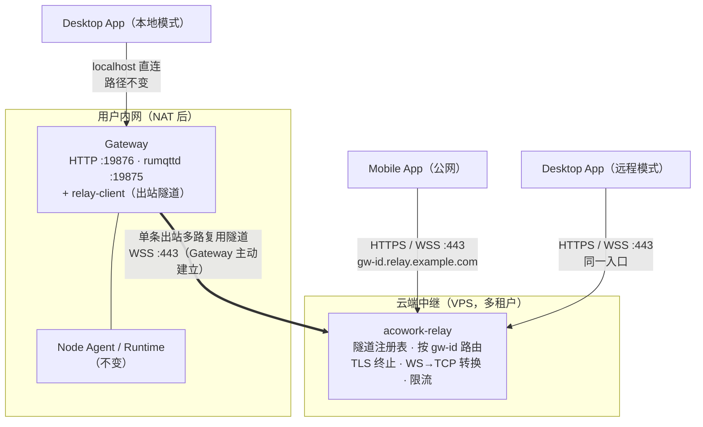
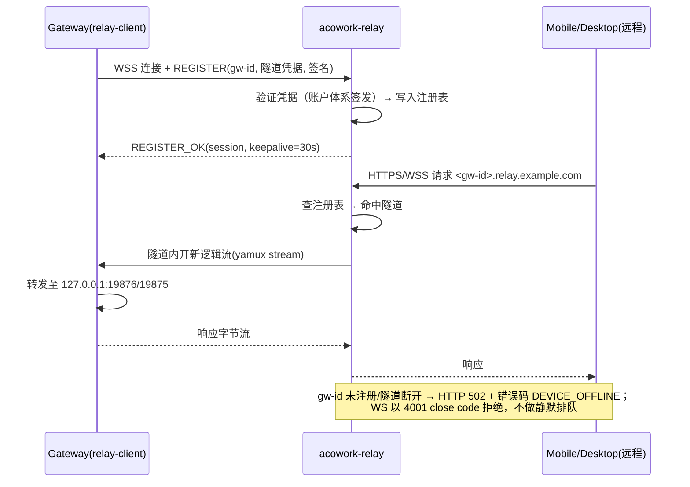

# 24-cloud-relay-remote-access — 云端瘦中继：Desktop / Mobile 外网访问内网 Gateway

> **版本**: v0.1（设计草案）
> **状态**: 📝 待评审
> **创建日期**: 2026-03
> **作者**: 软件架构师（ACowork.AI）
> **一句话结论**: 采用「单隧道瘦中继」——Gateway 主动向云端中继建立一条出站多路复用隧道，
> HTTP 与 MQTT（over WebSocket）共用该隧道，**MQTT Broker（内嵌 rumqttd）始终留在 Gateway 侧，
> 中继不理解任何业务语义，只做按 gateway-id 路由的字节管道**。明确否决「公网 MQTT Broker + Bridge」
> 双真相源方案。Desktop 与 Mobile 走同一条远程路径，中继零特化。

---

## 1. 背景与目标

### 1.1 背景

ACowork 当前的部署形态是「单机局域网」：Gateway 的 HTTP（`:19876`）与内嵌 MQTT Broker（`:19875`）
均只绑定 localhost（见 `core/acowork-gateway/configs/rumqttd.toml` 的 `listen = "127.0.0.1:19875"`），
Desktop App 以同机进程身份直连。产品需要支持：

1. **Mobile App** 在公网访问用户内网/家庭网络中的 Gateway；
2. **Desktop App** 离开局域网后（远程办公、异地）访问同一 Gateway。

内网 Gateway 无公网 IP、位于 NAT 之后，无法被入站直连，需要云端中继协助穿透。

### 1.2 目标

- 定义云端中继服务的职责边界、隧道协议、路由与鉴权模型
- 定义 Gateway 侧 relay-client 的改造范围
- 定义 Desktop「本地 / 远程」双模连接的改造范围与能力降级清单
- 明确安全前置条件（远程 ACL、调试端点屏蔽、凭据体系）
- 给出增量落地路径（Phase 0/1/2）与回滚策略

### 1.3 非目标（YAGNI）

- ❌ 公网侧消息缓存 / 离线消息暂存（Broker 状态必须跟随 Gateway，见 §3.2）
- ❌ WebRTC P2P / TURN（信令与打洞复杂度远超收益，中继带宽在本场景可承受）
- ❌ 多 Gateway 集群编排 / 跨 Gateway 路由（一个中继连接对应一个 Gateway 实例）
- ❌ 替代局域网直连路径（本地模式保持不变，远程是**新增**接入路径）
- ❌ 中继侧业务审计 / 内容检查（中继保持协议无关，审计属于 Gateway 职责）

---

## 2. 现状与约束（事实基线）

| # | 事实 | 出处 | 对设计的约束 |
|---|------|------|-------------|
| F1 | MQTT Broker 为内嵌 rumqttd 0.20，仅 TCP 监听 localhost，**无 Mosquitto 式桥接能力** | `core/acowork-gateway/configs/rumqttd.toml` | 任何依赖 broker-to-broker bridge 的方案不可落地 |
| F2 | MQTT 认证在 CONNECT 时校验，与 HTTP 共享同一 HttpAuth token；ACL 经 `set_auth_handler` 回调实现 | `core/acowork-gateway/src/http/server.rs`、`core/acowork-gateway/src/mqtt/broker.rs` | 远程客户端可复用现有认证链路，ACL 可按连接来源扩展 |
| F3 | Gateway HTTP 已有 token 认证（HttpAuth），但信任模型建立在 localhost 之上，ACL 注释自述 "single-user phase — permissive" | `rumqttd.toml` §ACL、`core/acowork-gateway/src/http/auth.rs` | 暴露公网前必须完成安全硬化（§7），这是 Phase 1 的**准入门槛**而非收尾工作 |
| F4 | 平台存在多用户账户体系（AUTH_MODE=multi_user）与用户域服务 | ADR-076、ADR-084（`core/acowork-user`） | 设备注册与中继凭据发放应挂接账户体系，不另造一套身份 |
| F5 | Node Agent 负责 Runtime 进程生命周期；`install_path` 等为 node-local 路径，跨机 fs 直读即 5xx | ADR-055、AGENTS.md「Gateway boundary」 | 远程模式下客户端不得假设与 Gateway 同机；附件等必须走 Gateway HTTP API |
| F6 | Desktop 的 `GatewayClient` 已支持 `with_base_url / set_base_url`，MQTT 客户端连 `127.0.0.1:19875`（TCP） | `apps/acowork-desktop/src-tauri/src/gateway_client.rs`、`mqtt_client.rs` | Desktop 远程化改造集中在传输层与连接模式管理，API 层基本不动 |
| F7 | Desktop 承担本机 Gateway 生命周期管理（spawn/监控），并有 clipboard、附件落盘等同机命令 | `apps/acowork-desktop/src-tauri/src/commands/` | 远程模式存在能力降级，需显式清单化（§8） |
| F8 | DevMode 调试协议走 MQTT + HTTP，高频交互 | ADR-048、`core/acowork-gateway/src/http/debug_mqtt.rs` | 调试通道默认禁止远程访问 |

---

## 3. 方案选型

### 3.1 候选方案对比

| 方案 | 结论 | 关键理由 |
|------|------|---------|
| **A. 瘦中继单隧道（本设计）** | ✅ 推荐 | 单 Broker / 单身份模型不变；App 侧标准 HTTPS + MQTT-over-WS；中继无业务语义、易审计；Desktop/Mobile 共用 |
| B. FRP(HTTP) + 公网 MQTT Broker + Bridge | ❌ 否决 | 见 §3.2 |
| C. 纯 FRP 双端口穿透（HTTP + MQTT TCP） | ⚠️ 过渡可用 | 即方案 A 的「买现成」形态，作为 Phase 1 脚手架；但裸 TCP 1883 对移动网络/企业防火墙不友好，多租户与鉴权模型弱，不可作为终态 |
| D. Tailscale / WireGuard mesh | ⚠️ 仅内部验证 | E2E 加密、免中继开发，技术上极佳；但要求终端用户安装第三方 App 并注册第三方账号，**不能作为产品形态交付**；适合 Phase 0 验证移动端协议兼容性 |
| E. Cloudflare Tunnel | ❌ 否决 | 国内可达性差；每 Gateway 需运行 cloudflared；TCP 隧道对 MQTT 支持一般；平台定位要求可控的自有基础设施 |
| F. WebRTC + TURN | ❌ 否决 | P2P 延迟最优，但信令 / ICE / NAT 打洞 / TURN 回落的复杂度远超收益；未来若中继带宽成为瓶颈可再评估 |

### 3.2 为什么否决「公网 MQTT Broker + Bridge」（方案 B）

这是外部咨询（DeepSeek）给出的推荐方案，经与代码基线核对后否决，理由记录如下：

1. **无处落地**：Gateway 内嵌 rumqttd（F1），不具备 Mosquitto `connection cloud-bridge` 式桥接能力。
   落地 Bridge 需在每个用户内网额外部署一个专职桥接 Broker——凭空多出一个组件、一套凭据、一类故障模式。
2. **双真相源破坏 MQTT 语义**：ACowork 消息层（`acowork-mqtt-session` 会话复用、ADR-048 DevMode、
   ADR-055 `acowork/nodes/#` 控制面）假设单一权威 Broker。Bridge 将 session / QoS / retained 状态复制到
   公网 Broker 后，QoS 1/2 的端到端确认语义被两个 Broker 切断。
3. **控制面暴露风险**：Bridge 依赖 topic 过滤把内部控制面主题挡在内网，**一条过滤规则配错即公网暴露控制面**，
   属于典型的静默失败（silent fallback）反模式。
4. **多租户无解**：每个 Gateway 需在公网 Broker 上做命名空间隔离 + ACL，Bridge 模型对此几乎没有支持。
5. **论据不适用**：「离线消息、万级并发」是 IoT 场景论据；ACowork 单 Gateway `max_connections = 100`，
   且 Broker 状态本来就必须跟随 Gateway（会话数据、记忆索引均在 Gateway 侧）。

---

## 4. 总体架构



核心原则：

- **隧道方向恒为出站**：Gateway → 中继，天然穿透 NAT，内网零端口映射。
- **中继是哑管道**：只做「gw-id → 隧道」的字节转发与连接管理，不解析 MQTT 主题、不理解 HTTP 路由语义
  （仅在入口层做 Host/SNI 路由与限流）。
- **单一身份模型**：远程客户端面对的仍是「一个 Gateway、一个 token」，与本地模式一致；
  中继不引入第二套业务凭据（隧道凭据仅用于 Gateway↔中继之间，见 §7.3）。
- **Broker 永远在 Gateway 身边**：会话、QoS、retained、ACL 全部由内嵌 rumqttd 权威裁决。

---

## 5. 中继服务设计（acowork-relay）

### 5.1 进程形态与部署

- 新增独立 Rust 服务 `acowork-relay`（axum + tokio），**部署于云端 VPS，不进入 Desktop 打包产物、
  不属于 core workspace 的本地进程拓扑**（建议独立 crate 目录或独立仓库，评审定，见 §11 OQ-1）。
- 单实例目标容量（Phase 2 初）：≥ 5k 并发隧道、≥ 50k 并发客户端连接；无状态可水平扩展，
  隧道注册表存内存 + Redis（多实例时按 gw-id 一致性哈希做接入层分流，Phase 3 再引入，初期单实例）。

### 5.2 隧道协议

| 项 | 选择 | 理由 |
|---|------|------|
| 承载 | WSS（WebSocket over TLS，443） | 对运营商 NAT / 企业防火墙最友好；Rust 生态成熟（tokio-tungstenite） |
| 多路复用 | yamux（隧道内逻辑流） | 一条 TCP 承载 HTTP 请求流 + MQTT 字节流，避免队头阻塞可后续换 QUIC |
| 心跳 | 30s ping/pong，3 次失败重连 | 移动网络切换（Wi-Fi↔蜂窝）下快速自愈 |
| 演进 | QUIC（quinn）作为 Phase 3 可选承载 | 弱网体验更优，但初期不引入 |

### 5.3 客户端入口与路由

统一域名 `relay.example.com`，通配符证书 `*.relay.example.com`：

| 入口 | 客户端行为 | 中继行为 |
|------|-----------|---------|
| `https://<gw-id>.relay.example.com/**` | 标准 HTTPS 调 Gateway API | 终止 TLS，按 Host 中 gw-id 查隧道注册表，HTTP 请求经隧道转发至 Gateway `127.0.0.1:19876` |
| `wss://<gw-id>.relay.example.com/mqtt` | MQTT over WebSocket（rumqttc `Transport::Ws`） | 终止 TLS + WS 解帧，将**裸 MQTT 字节流**经隧道转发至 Gateway `127.0.0.1:19875`；CONNECT 认证仍由 rumqttd 的 auth handler 裁决 |

> rumqttd 0.20 自身是否启用 WS listener 不影响本设计：WS→TCP 转换发生在中继侧，
> Gateway 侧始终只暴露既有 TCP 端口，**零 Broker 改造**。

### 5.4 隧道注册与生命周期



关键语义：

- **离线显式化**：目标 Gateway 不在线时，HTTP 返回 `502` + 结构化错误 `{"code":"DEVICE_OFFLINE"}`，
  MQTT-WS 握手直接拒绝（HTTP 502 升级失败）。**禁止**中继缓存请求或伪造响应。
- **单隧道单活**：同一 gw-id 只允许一条活跃隧道；新隧道注册成功即踢掉旧隧道（防止凭据泄露后的双活劫持），
  并向旧隧道发送 GOAWAY。
- **重连风暴防护**：REGISTER 按 gw-id 限频（如 5 次/分钟），指数退避由 relay-client 执行。

### 5.5 中继侧限流与配额

- 按 gw-id：并发客户端连接数上限、新建连接速率、隧道内字节速率（上下行分别计）。
- 全局：单 IP 未认证连接数上限，防扫描。
- 超限返回 `429` + `Retry-After`，并记录审计日志。

---

## 6. Gateway 侧改造（relay-client）

新增模块 `core/acowork-gateway/src/relay/`（或独立 sidecar 进程，评审定，见 §11 OQ-2；**初版建议进程内模块**，
与 Gateway 同生命周期，避免多一个进程管理面）：

| 职责 | 说明 |
|------|------|
| 隧道建立与保活 | 出站 WSS 连接中继，yamux 多路复用，断线指数退避重连（1s→60s 封顶，加抖动） |
| 逻辑流转发 | stream → `127.0.0.1:19876`（HTTP）或 `:19875`（MQTT），纯字节转发 |
| 凭据管理 | 隧道凭据由账户体系（ADR-076 / acowork-user）签发，存于 acowork-vault；支持吊销后自动下线 |
| 开关 | 配置项 `relay.enabled`（默认 **false**）+ `relay.server_url` + `relay.device_id`；关闭时零开销、零出站连接 |
| 状态上报 | 隧道状态（connected/offline/rejected）经现有 MQTT 事件通道上报，Desktop 本地模式可展示 |

**回滚设计**：`relay.enabled=false` 即完全恢复现状；远程接入是纯增量路径，不影响 localhost 直连的任何行为。

---

## 7. 安全设计（Phase 1 准入门槛）

> 本章不是「最后完善」项。**以下 S1–S4 全部完成之前，禁止对真实用户开放远程访问。**

### 7.1 信任边界重划

现状信任模型：localhost = 可信（F3）。远程化后新增边界：

```
公网客户端 ──(TLS)── 中继 ──(隧道, TLS 内层可选加密)── Gateway ──(localhost)── Runtime/Node
     ▲不可信                ▲半可信(自有基础设施)              ▲凭 token 认证后受限可信
```

### 7.2 远程 ACL（S1）

- **MQTT**：在 rumqttd `set_auth_handler` 中区分连接来源。经隧道进入的连接（relay-client 转发时注入
  内部标记，如源端口段或代理协议头）适用**远程 ACL**：
  - 允许：该用户自己的会话主题（`acowork/chat/<user>/...` 等，按 ADR-076 用户隔离）
  - 拒绝：`acowork/nodes/#`（ADR-055 控制面）、DevMode 全部主题（ADR-048）、`#` 通配订阅
- **HTTP**：远程请求强制 HttpAuth token；以下路由对远程来源**直接 404**（不暴露存在性）：
  `debug_mqtt` 相关端点、Gateway 配置写端点、fs 浏览类端点（F5：跨机语义本来就不成立）。
- 实现方式：Gateway 在 relay 转发路径上加一层 `RemoteOrigin` middleware，统一打标 + 路由过滤，
  避免散落在各 handler。

### 7.3 凭据体系（S2）

| 凭据 | 持有方 | 签发方 | 用途 | 吊销 |
|------|--------|--------|------|------|
| 用户 token（现有 HttpAuth） | Desktop/Mobile App | Gateway/账户体系 | 业务 API 与 MQTT CONNECT 认证 | 现有机制 |
| 设备凭据（gw-id + secret） | Gateway relay-client | 账户体系（用户在 Desktop 上登录并「注册远程访问」时发放） | 隧道 REGISTER 签名 | 账户侧吊销 → 中继踢隧道 + Gateway 自动下线 |
| 中继服务端证书 | 中继 | 公网 CA（通配符） | 客户端 TLS | 常规轮换 |

- 隧道 REGISTER 使用设备凭据做 HMAC 签名（含时间戳防重放）；Phase 3 可升级 mTLS。
- **Desktop 远程模式不享受任何特权**：与 Mobile 使用同一用户 token、同一远程 ACL。
  宽松权限只属于「物理同机 localhost 直连」。

### 7.4 传输加密（S3）

- 客户端↔中继：TLS 1.3（443）。
- 中继↔Gateway 隧道：外层 WSS 已加密；初版中继为自有基础设施，接受中继可见明文（模式 A）。
  若未来要求「中继零知识」，演进为 TLS 透传（模式 B：中继仅按 SNI 路由，Gateway 持设备证书终止 TLS），
  代价是证书管理复杂度，见 §11 OQ-3。

### 7.5 可用性安全（S4）

- 中继对未认证连接做 IP 级限流；对已认证 gw-id 做 §5.5 配额。
- Gateway 侧远程连接数独立上限（如 20），防止远程流量挤占本地 Runtime 的 Broker 容量
  （`max_connections = 100` 总池）。

---

## 8. 客户端改造

### 8.1 Desktop：从「本机伴侣」到「本地/远程双模客户端」

| 改造项 | 内容 | 工作量评估 |
|--------|------|-----------|
| 连接模式管理 | 新增 `ConnectionMode::Local / Remote(gw-id)`；Remote 模式下 base_url 指向 `https://<gw-id>.relay.example.com`（复用 `set_base_url`，F6） | 小 |
| MQTT 传输 | `mqtt_client.rs` 增加 `Transport::Ws` 分支（rumqttc 原生支持），远程模式连 `wss://.../mqtt` | 小 |
| 远程 Gateway 管理 UI | 「添加远程 Gateway」：登录账户 → 列出已注册设备 → 选择连接；设备离线状态展示 | 中 |
| 生命周期解耦 | 远程模式下**禁用**本机 Gateway spawn/监控逻辑；断开不触发重启，仅提示 DEVICE_OFFLINE | 小 |
| 同机命令降级 | clipboard、附件本地落盘等命令（F7）在远程模式下：附件改走 Gateway HTTP 上传/下载 API；剪贴板仅传内容不落远端路径 | 中 |

### 8.2 远程模式能力降级清单（产品需确认）

| 能力 | 本地模式 | 远程模式 | 说明 |
|------|---------|---------|------|
| 聊天 / 会话 / Agent 管理 | ✅ | ✅ | 核心路径，HTTP + MQTT 流式推送均走隧道 |
| 文件上传下载（附件） | ✅ | ✅（走 API） | 禁止本地路径直读（F5） |
| Gateway 启停 / 自愈 | ✅ | ❌ | 远端断电/进程挂掉只能等内网侧自愈（Node Agent）或人工干预 |
| DevMode 调试协议 | ✅ | ❌（默认禁止） | ADR-048 高频交互 + 调试端点屏蔽（§7.2） |
| 本机剪贴板 / 本地 fs 浏览 | ✅ | ❌ | 同机假设不成立 |
| LSP（本地语言服务器） | ✅ | ❌ | LSP relay 绑定 Desktop 所在机器 |

### 8.3 Mobile App

Mobile 只实现远程模式，协议面与 Desktop 远程完全一致（HTTPS + MQTT-over-WS + 用户 token），
无特化逻辑。Mobile 的登录/设备授权流程依赖 ADR-076 账户体系（acowork-user），不在本文档展开。

---

## 9. 可观测性与运维

- **中继指标**：活跃隧道数、每 gw-id 连接数/字节数、REGISTER 失败率（按失败原因分类）、
  WS 升级失败率、P99 转发延迟（中继自身开销应 < 5ms）。
- **Gateway 指标**：隧道状态机（connected/reconnecting/rejected）、重连次数、远程来源请求量。
- **审计日志**：REGISTER / 踢隧道 / 凭据吊销 / 限流触发，均落结构化日志；中继不记录业务 payload。
- **告警**：单 gw-id 高频 REGISTER 失败（疑似凭据泄露爆破）、中继实例隧道数突降（疑似网络分区）。

---

## 10. 分阶段实施与回滚

| 阶段 | 内容 | 出口条件 | 回滚方式 |
|------|------|---------|---------|
| **Phase 0**（零开发） | 内部用 Tailscale 将手机接入内网 Gateway，验证 Mobile 协议兼容性（MQTT-over-WS 可用性、rumqttc WS 传输、流式推送体验） | 移动端全链路 demo 通过 | 删除 tailnet，无残留 |
| **Phase 1**（脚手架） | 完成 §7 安全硬化 S1–S4；用 FRP（vhost HTTP + TCP/WS）搭单用户中继，限定内部设备 | 安全清单评审通过 + 内部远程日用一周 | 关闭 `relay.enabled`；FRP 下线 |
| **Phase 2**（终态中继） | 自研 `acowork-relay`（§5），接入账户体系设备注册，多租户 + 限流 + 审计；Desktop 双模改造（§8.1）；Mobile 接入 | 对外发布远程访问功能 | 中继独立部署，故障时 Gateway 回落纯本地模式，产品功能降级但不损坏数据 |
| **Phase 3**（可选演进） | QUIC 承载、TLS 透传（模式 B）、多实例水平扩展 | 按运营数据决策 | 承载层可协商降级回 WSS |

Phase 1 → Phase 2 对 App 侧协议不变（同为 HTTPS + MQTT-over-WS，域名切换即可），FRP 可无缝下线。

---

## 11. 开放问题（评审需拍板）

| # | 问题 | 倾向 |
|---|------|------|
| OQ-1 | `acowork-relay` 放 core workspace 还是独立仓库？ | 独立仓库（部署形态、发布节奏与本地进程完全不同），但共享 `acowork-core` 的类型定义 |
| OQ-2 | relay-client 是 Gateway 进程内模块还是 sidecar？ | 进程内模块（初版），避免多一个进程管理面；若隧道流量影响 Gateway 主循环再拆 |
| OQ-3 | 是否需要「中继零知识」（TLS 透传模式 B）？ | Phase 2 不做；自有中继 + 模式 A 够用，模式 B 作为高安用户的付费/进阶选项评估 |
| OQ-4 | gw-id 命名与隐私：`<gw-id>.relay.example.com` 会出现在证书 SNI 中（明文） | gw-id 用随机 UUID 而非用户语义名，避免 SNI 泄露用户信息 |
| OQ-5 | 国内合规：中继服务是否需要备案域名 / 选择境内云？ | 产品侧决策；技术上域名与部署区域均为配置项 |

---

## 12. 参考

- ADR-048（DevMode 调试协议）、ADR-055（Node 拓扑）、ADR-076（多用户账户体系）、ADR-080（advertise-host 漂移自愈）、ADR-084（用户域服务）
- `core/acowork-gateway/configs/rumqttd.toml` — Broker 监听与 ACL 现状
- `apps/acowork-desktop/src-tauri/src/gateway_client.rs` / `mqtt_client.rs` — Desktop 连接层现状
- 外部咨询稿 `relay-server.md`（FRP + MQTT Bridge 方案，否决理由见 §3.2）
