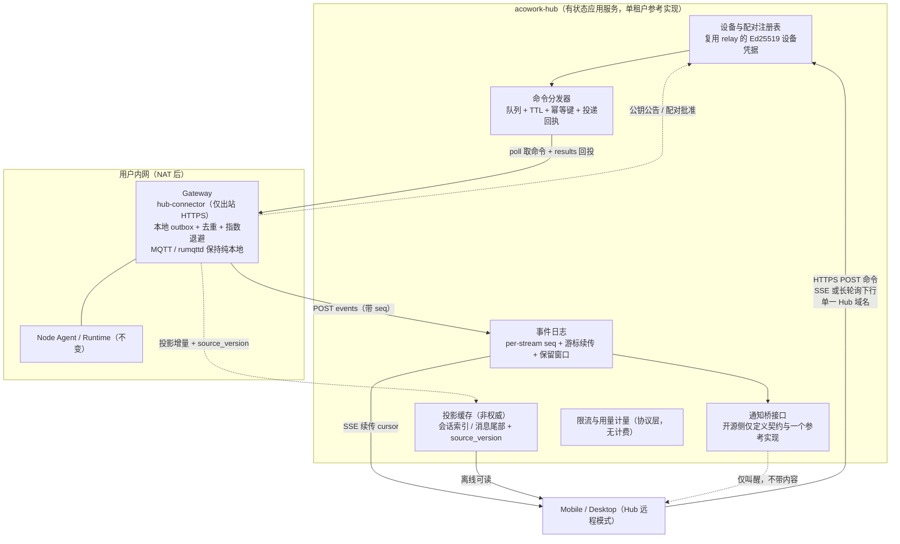
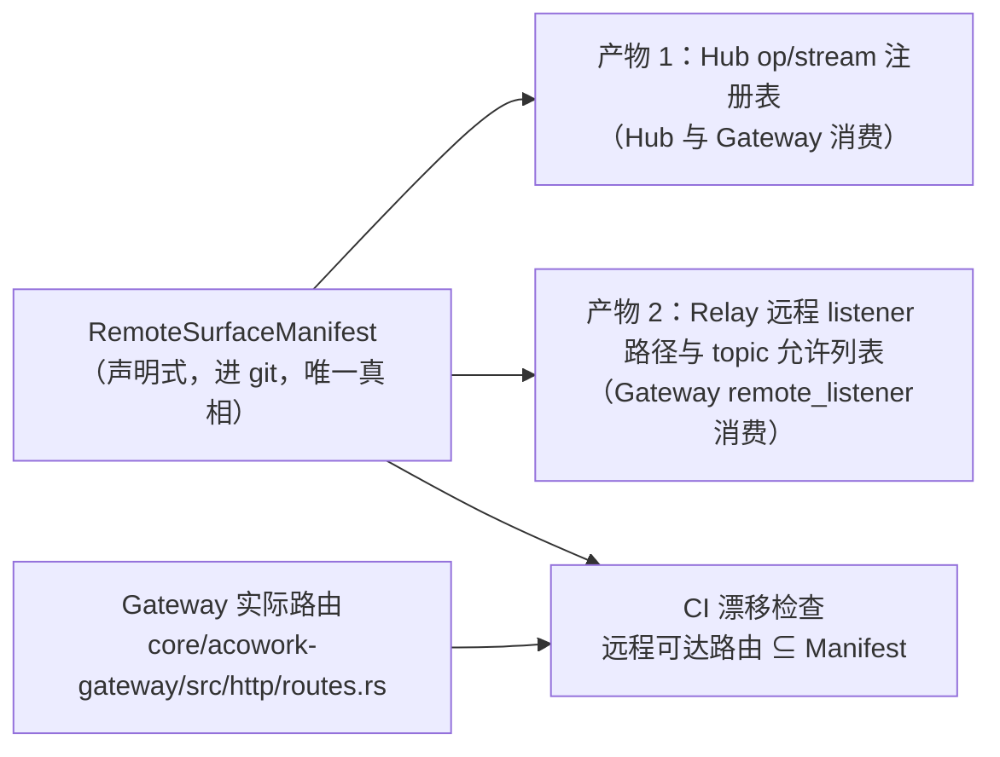
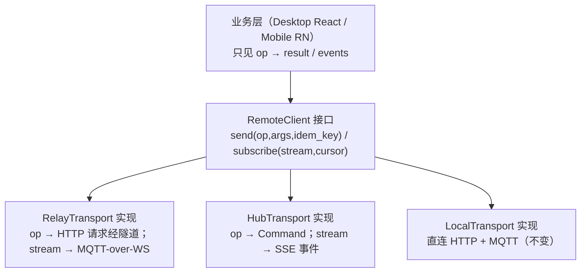
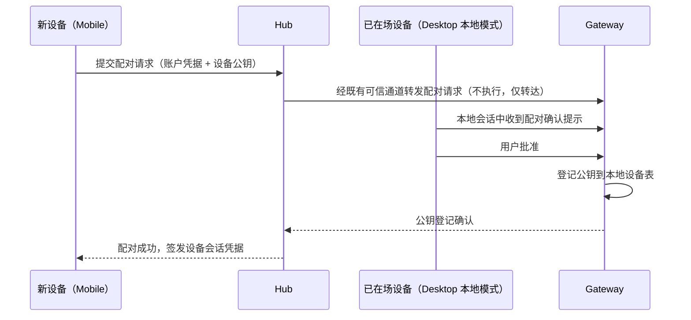

# 26-cloud-sync-hub — Cloud Hub：应用层远程访问中枢（与 24 瘦中继并存）

> **版本**: v0.1（草案，待评审）
> **状态**: 📝 设计提案（Phase 0 未启动）
> **创建日期**: 2026-10
> **作者**: 软件架构师（ACowork.AI）
> **一句话结论**: 在 `24-cloud-relay-remote-access.md` 的「字节隧道」之外，新增第二种远程访问模式
> **Cloud Hub**——一个**理解消息语义的有状态后端服务**：Gateway 侧只发出站短 HTTPS 请求（长轮询取命令 +
> POST 上报带 `seq` 的事件），Desktop / Mobile 侧走标准 REST + SSE，两侧在**命令/事件语义层**相遇，
> 而不是在 TCP 字节层相遇。核心收益是**连接被任意切断后可用游标续传**（隧道被 reset 则全部复用流同时死亡）
> 与**离线消息 / 跨设备同步 / 审计**这类隧道在构造上无法提供的能力。
> **与 24 的关系**：**永久并存，用户自选**，不是替代。Relay 定位为「自带基础设施的自托管档」
> （我方零云成本、零合规暴露、中继零秘密），Cloud Hub 定位为「默认托管档」。见 §11。

---

## 0. 开源 / 闭源边界（先读这一节）

本文属于**开源仓（Apache-2.0）**，因此**只描述开源功能**。以下内容**不在本文范围**，
其设计属于**商业闭源实现**，不在本仓（开源仓）文档范围内：

| 不在本文范围（属闭源商业实现） |
|---|
| 多租户 SaaS 数据模型（`tenant_id` 判别列、Postgres / Redis 分层） |
| 订阅、计量、配额计费（Stripe Billing / Meters 形态） |
| 地域准入与 geo-fencing 工程化 |
| 国内厂商推送通道（华为 / 小米 / OPPO / vivo）接入与运营 |
| 管理控制台、审计导出、SLA 与可用性承诺 |
| 跨租户互通（客户 A → 客户 B 的 agent） |
| 境内云部署 / ICP 备案主体 / 数据驻留决策 |

**开源侧承诺**（本文负责）：

1. **协议定义权**：Hub 的 wire format 只在开源仓定义（`acowork-core::hub`），闭源仓依赖 crate，**禁止 fork**
   （沿用闭源实现仓既有的 C1–C4 四条硬规则，该文档不随本仓分发）。
2. **可自托管的参考实现**：开源 Hub 是**单租户、可在一台机器上跑起来**的完整实现，
   功能面与闭源版一致（协议同源），差异只在规模与运营能力。类比 `acowork-relay` 的
   `devices.json` 扁平存储先例（[core/acowork-relay/src/device_store.rs](../../../core/acowork-relay/src/device_store.rs)）。
3. **商业能力的扩展机制在协议层，语义在实现层**：`caps` 只声明不消费（同 24 §5.4.1 机制）。

---

## 1. 背景与目标

### 1.1 背景

24 号设计落地后（M0–M6 推进中），远程访问在真实网络与商业两个维度遇到同一根因的问题：

- **网络维度**：隧道是**长寿命、多路复用、非标准指纹**的连接（WSS + yamux + 通配符设备子域 SNI 路由）。
  这类连接在受限网络环境里是最容易被识别与中断的对象；一旦被中断，**yamux 上所有复用流同时死亡**，
  客户端需要重建 N 条逻辑连接，且**没有任何恢复点**——隧道不持有状态。
- **商业维度**：字节管道**没有产品面**。离线消息、跨设备未读同步、推送、审计、按用量计费——
  全部要求中继理解语义，而「按设计不理解语义」正是 24 的核心优点。二者不可调和。

同时，24 的方案本身在技术上是对的（单真相源、Broker 留在 Gateway、中继零秘密），
**不应被推翻**，也不应被当作唯一路径。

### 1.2 目标

- 定义 Cloud Hub 的职责边界、消息协议、路由与鉴权模型
- 定义 **Remote Surface Manifest**：远程能力面的唯一定义处，**同时驱动两种模式**
- 定义 Gateway 侧 `hub-connector` 与客户端侧 `RemoteClient` 抽象的改造范围
- 明确两种模式**并存的四条硬约束**（P1–P4）与 Relay 的冻结策略
- 给出分阶段落地路径与回滚策略

### 1.3 非目标（YAGNI）

- ❌ **取代或删除 Relay**（见 §11：永久并存）
- ❌ **云端成为会话真相源**（违反 24 §3.2 已确立的单真相源结论，见 §3.3 否决记录）
- ❌ 多 Gateway 集群编排 / 跨 Gateway 路由
- ❌ WebRTC P2P / TURN（沿用 24 §3.1 否决理由）
- ❌ 替代局域网直连路径（本地 / LAN 模式完全不动）
- ❌ 开源版多租户（开源 Hub = 单租户；多租户属闭源实现层）

---

## 2. 现状与约束（事实基线）

沿用 24 §2 的 F1–F8，新增与本设计直接相关的三条：

| # | 事实 | 出处 | 约束 |
|---|------|------|------|
| F1 | 内嵌 rumqttd 0.20，无桥接能力，单 Gateway `max_connections = 100` | `configs/rumqttd.toml` | Broker 状态必须跟随 Gateway（同 24） |
| F9 | **远程 HTTP 调用面不大但有 32 个路径模板**：移动端去重后共 **32 个 `/api/*` 路径**，其中 Gateway 原生 15 个、经反代到其他独立服务 17 个（user 6 / doc 4 / pm 7） | `apps/acowork-mobile/src/lib/api.ts`（实测 `sed` 去重统计） | 显式声明每个远程 op 的成本可接受；**但远程面横跨 4 个服务**，见 F14 |
| F14 | 上述 17 个路径**不是 Gateway 自己实现的**：`/api/auth/*`、`/api/users/*` → `user_proxy`；`/api/pm/*` → `pm_proxy`；`/api/doc/*` → `doc_proxy`，均由 Gateway 反向代理到独立进程（ADR-084 / ADR-064 / ADR-070） | [core/acowork-gateway/src/http/routes.rs:280](../../../core/acowork-gateway/src/http/routes.rs#L280)、`user_proxy.rs` / `pm_proxy.rs` / `doc_proxy.rs` 模块头 | Hub 的 `dispatcher` **必须能触达这 4 个服务**；见 §6.4 |
| F10 | **远程事件面也很小**：实际消费的 envelope 类型仅 4 种（`session_message=15`、`session_state=18`、`AskQuestion`、`ToolApprovalNeeded`） | `apps/acowork-mobile/src/lib/proto-wire.ts` | 命名流白名单可行，无需暴露通用 topic 订阅 |
| F11 | Gateway 已有远程模式运行时开关 `POST /api/relay/enable\|disable` 与 `RelayClientConfig` | [core/acowork-gateway/src/config.rs:196](../../../core/acowork-gateway/src/config.rs#L196) | 「模式选择」挂载点已存在，并存不需要新造控制面 |
| F12 | 已有 protobuf `DataEnvelope` oneof 编码先例与手写 wire codec | `proto-wire.ts` / `mqtt-wire.ts` | Hub 信封沿用同一风格，客户端无需引入 protobuf 全量运行时 |
| F13 | 设备身份已有 `relay_identity.json`（Ed25519，0600 明文，私钥不出 Gateway） | 24 §7.3 v0.2.1、[core/acowork-gateway/src/relay/identity.rs](../../../core/acowork-gateway/src/relay/identity.rs) | **两种模式共用同一把设备私钥**（P2 约束的基础） |

---

## 3. 方案选型

### 3.1 候选方案对比

| 方案 | 结论 | 关键理由 |
|------|------|---------|
| **A. Cloud Hub：应用层消息中枢（命令队列 + 事件日志 + 游标续传 + 投影）** | ✅ **采纳（新增模式）** | 可恢复性来自消息级游标；商业化能力长在这一层；顺带消除远程 MQTT 四块最复杂的代码 |
| **A-min** Hub 只做命令队列 + 事件缓冲，无投影、无 E2E | ✅ 作为 Phase 1 交付形态 | 先证明「切断后可恢复」这条核心假设，再投资投影 |
| B. 加固现有隧道（境内 VPS / QUIC / CDN 前置） | ❌ 否决作为终态 | 长寿命多路复用 + 通配符设备子域仍是最易识别指纹；**且字节管道没有商业化产品面**，加固投入无法回收 |
| C. 云端镜像为真相源（会话存云，Gateway 反向同步） | ❌ **明确否决** | 双真相源，与 24 §3.2 否决「公网 Broker + Bridge」同一条理由；见 §3.3 |
| D. 纯推送 + 轮询（无下行长连接） | ❌ 否决作为主通道 | 工具审批 / 提问这类交互式流程延迟不可接受；**但保留为 A 内部的辅助信道**（推送只负责「叫醒」，不传内容） |

### 3.2 为什么并存而不是替代（决策依据）

两种模式在**商业上服务不同人群**，删掉任何一个都是丢客户：

| | Relay 模式（24） | Cloud Hub 模式（本文） |
|---|---|---|
| 本质 | 协议无关字节管道 | 有状态应用服务 |
| 谁运营 | **用户自带 VPS** | 官方托管，或企业自托管开源 Hub |
| 我方云成本 | **零** | 承担存储 / 带宽 |
| 合规暴露 | 我方不持有流量，负担在用户侧 | 我方是服务提供方 |
| 信任模型 | 中继零秘密，内容端到端透传（最纯净） | Hub 在路径上（需 E2E 补救，见 §10.4） |
| 受限网络可用性 | ⚠️ 差 | ✅ 好 |
| 独有能力 | 任意协议透传（未来新协议零改造） | 离线消息、跨设备同步、推送、审计 |
| 目标用户 | 极客 / 隐私优先 / 已有 VPS | 消费级 Mobile 用户、企业团队 |

> **关键判断**：Relay 的「我方零云成本 + 零合规暴露 + 中继零秘密」三条，是 Hub **永远拿不到**的优势。
> 它不是历史包袱，它是 **BYO 档**。

### 3.3 为什么否决「云端为真相源」（方案 C）

与 24 §3.2 的否决逻辑**完全同构**，记录于此以免未来重复争论：

1. **会话语义被切断**：`acowork-mqtt-session` 的会话复用、QoS 端到端确认、retained 状态假设单一权威 Broker。
2. **控制面双写**：`acowork/nodes/#`（ADR-055）与 DevMode（ADR-048）是 Gateway 侧控制面，云端镜像必然产生第二份控制状态。
3. **离线语义反转**：Gateway 离线时，若云端是权威，客户端会写入一份「之后需要回灌」的数据——冲突解决成本远超收益。
4. **记忆索引 / 附件路径均为 node-local**（F5、ADR-055），云端无法自洽地成为权威。

**本设计的替代做法**：Hub 只持有两类**有界且明确非权威**的数据——
① **投递缓冲**（TTL 有界的命令队列与未确认事件，Gateway 恢复即消费并清理）；
② **投影缓存**（带版本号的只读副本，见 §7.4，客户端必须能识别「陈旧」）。

---

## 4. 总体架构

### 核心原则

- **两侧都是普通 HTTPS 客户端**：Gateway 不监听任何入站端口（沿用 FR-1）；客户端只配置**一个 Hub 域名**，
  完全不感知 Gateway 的网络身份（无通配符子域、无 SNI 路由、无设备域名证书）。
- **上行永远是「命令 + 回执」，下行永远是「带 seq 的事件」**。没有双向字节流，没有 SSE 代理。
- **Hub 理解路由 / 排队 / 计量，但不理解授权**（§10.2）。授权在两端各自裁决。
- **Gateway 仍是唯一真相源**（§3.3）。

---

## 5. 协议契约：`acowork-core::hub`

> 本 crate 是 Hub wire format 的**唯一定义处**，开源仓拥有。闭源仓依赖 crate，禁止 fork（C1）。

### 5.1 信封（Envelope）

沿用 F12 的 oneof 风格，新增 `HubEnvelope`：

| 消息 | 方向 | 关键字段 | 语义 |
|---|---|---|---|
| `Command` | client → hub → gateway | `command_id`、`op`（Manifest 中的操作名）、`args`、`idem_key`、`deadline_unix_ms`、`client_sig`、`client_pubkey` | 一次远程调用请求 |
| `CommandResult` | gateway → hub → client | `command_id`、`status`、`body`（或 `body_ref`）、`error_code` | 命令的最终结果 |
| `Event` | gateway → hub → client | `stream`、`seq`（per-stream 单调）、`ts`、`payload`（或 `payload_ref`） | 一条流上的一个事件 |
| `Subscribe` | client → hub | `stream`、`cursor`（已消费到的 seq） | 声明订阅与续传起点 |
| `Ack` | 双向 | `stream` / `command_id`、`upto` | 消费确认，驱动保留窗口回收 |
| `Checkpoint` | gateway → hub → client | `stream`、`seq`、`sig` | 流的签名快照，客户端据此检测截断/伪造 |
| `KeyAnnounce` | gateway → hub → clients | `stream_key_id`、`wrapped_key`、`sig` | E2E 密钥分发（§10.4） |

### 5.2 版本与能力协商

**直接复用 24 §5.4.1 已确立的机制**（`proto` + `caps`，缺省 `proto=1`，版本区间外显式拒绝，未知帧跳过而非致命）。
理由：该机制的立项理由——「控制协议是公开契约、本仓仅为参考实现、协议演进不能依赖本仓发版节奏」——
对 Hub 协议**同样成立且更强**（Hub 是商业化的主战场，闭源版必然想加能力）。

### 5.3 幂等与投递语义

| 项 | 规定 | 理由 |
|---|---|---|
| 投递语义 | **至少一次** | 网络现实；不做「恰好一次」的幻觉承诺 |
| 幂等 | **每个 Manifest 条目必须声明 `idempotent: true/false`**；`false` 的 op 必须携带 `idem_key`，Gateway 侧维护去重表（有界 TTL） | 重复执行不可产生副作用（NFR-2） |
| deadline | 命令必须带 `deadline_unix_ms`；Hub 与 Gateway 双侧检查，过期即回 `COMMAND_EXPIRED` | 禁止「静默丢失」——过期必须有明确错误码 |
| 顺序 | 仅保证 **per-stream 单调**，不保证跨流全局有序 | 全局序需要分布式共识，本场景不需要 |
| 大 body | 超过阈值（默认 256 KB）走分片中转 `body_ref`，**不内联在信封里** | 避免事件日志被附件撑爆；分片对 Hub 可是不透明密文 |

### 5.4 传输承载

| 方向 | 承载 | 理由 |
|---|---|---|
| 下行（Hub → 客户端） | **SSE（HTTP/1.1 chunked GET）**，长轮询为 fallback；**不使用 WebSocket** | 无 upgrade 握手指纹；经代理/中间设备最友好；断线只丢一条流，凭 `cursor` 续传 |
| 上行（客户端 → Hub） | 短命 HTTPS POST | 无长连接状态，天然穿透 |
| Gateway 取命令 | **长轮询** `POST /hub/v1/poll`（挂起至有命令或超时） | 保持「仅出站」不变式，同时消解命令延迟 |
| Gateway 上报 | `POST /hub/v1/events`（批量，带 seq） | 批量降低请求数；outbox 保证断连不丢 |

> ⚠️ **SSE 承载是本方案的最大单点假设**（A1）：要求 Hub 前置的反向代理 / CDN **零缓冲透传 chunked 响应**。
> 若干 buffering 无法关闭，下行默认降级为长轮询——**协议语义完全等价，仅延迟不同**，因此该风险不致命。
> 这是 Phase 0 的第一验证项（见 §13）。

---

## 6. Remote Surface Manifest（远程能力面唯一定义处）

这是本设计**唯一真正的复杂度来源**，也是 Hub 与 Relay 的本质差异：Hub 不再协议无关，
每个远程能力必须显式声明。把它做成**一份声明式清单 + 两个生成产物 + 一个 CI 检查**，
复杂度就从「隐式耦合」变成「可见契约」。

### 6.1 清单内容（开源侧初始集）

基于 F9 / F10 实测：

**命令（op）— 初始集，按归属服务分组（依 F9 实测 32 个路径模板）**

| 组 | op | 幂等 | 归属服务 | 备注 |
|---|---|---|---|---|
| 身份 | `auth.login`、`auth.me`、`auth.refresh`、`users.directory`、`users.chats*` | ✅ | **acowork-user**（经 `user_proxy`） | 见 §10.1 两层身份；`users.chats*` 含读/已读 |
| 目录 | `agents.list`、`agent.status`、`agent.config.get`、`agent.builtin_tools`、`agent.workspaces`、`agent.memory_stats` | ✅ | Gateway 原生 | |
| 会话 | `sessions.list`、`sessions.open`、`session.messages.tail`、`session.messages.page`、`session.visibility`、`session.workspace` | ✅ | Gateway 原生（会话数据权威在 Gateway/`acowork-sqlite`） | |
| 写操作 | `session.send_message` | ❌（需 `idem_key`） | Gateway 原生 → Runtime | 核心交互 |
| 交互 | `session.answer_question`、`session.tool_approval` | ❌（需 `idem_key`） | Gateway 原生 → Runtime | 审批重复执行有安全风险，必须去重 |
| 任务 | `pm.projects.list`、`pm.project.tasks`、`pm.task.get`、`pm.task.children`、`pm.task.claim`、`pm.task.submit`、`pm.task.review` | claim/submit/review ❌ | **acowork-pm**（经 `pm_proxy`） | |
| 文档 | `doc.tree`、`doc.read` | ✅ | **acowork-doc**（经 `doc_proxy`） | 写操作初始集**不含**（远程编辑非首期需求） |
| 状态 | `status` | ✅ | Gateway 原生 | 健康 / 版本探测 |

> **数字口径**：32 个路径模板按 HTTP 方法合并同类后约为 **30 个 op**（表中以 `*` 归并了若干变体）。
> 精确清单在 Phase 0 由脚本从 `api.ts` + 三个 proxy 模块生成，**不手工维护**。

**命名事件流（stream）— 6 项**

`session.message`、`session.state`、`session.token`（流式，批合并）、`interaction.ask`、
`interaction.approval`、`notify`

### 6.2 明确不暴露（从构造上消除）

| 排除项 | 对应 24 的风险 |
|---|---|
| `acowork/nodes/#` 控制面 | 24 §3.2 第 3 条「一条 topic 过滤规则配错即公网暴露控制面」 |
| DevMode 调试通道（ADR-048、`debug_mqtt.rs`） | 24 F8「调试通道默认禁止远程访问」 |
| `fs_browse`、Gateway 生命周期、本机剪贴板 | 24 §8.2 能力降级清单 |
| 通用 MQTT topic 订阅 API | 避免把任意内网订阅面搬到公网 |

> **这是并存方案的一项净收益**：Manifest 同时作为 Relay 模式的白名单闸门（P1）后，
> 上述风险在**两种模式下**都从「靠配置正确」升级为「靠构造不可能」。

### 6.3 单一清单，两个产物

**CI 规则**：若 Gateway 新增一条可经远程 listener 到达的路径而未登记进 Manifest → **构建失败**。
这条检查是 P1 能长期成立的唯一保障，没有它，并存必然腐化。

### 6.4 远程面横跨 4 个服务（F14 的直接后果，必须现在决定）

移动端调用的 32 个路径中只有 15 个由 Gateway 自己实现，其余 17 个是 Gateway 反向代理到
`acowork-user` / `acowork-pm` / `acowork-doc` 三个独立进程（ADR-084 / ADR-064 / ADR-070）。
因此 Hub 的 `dispatcher` 有两条路可走：

| 方案 | 做法 | 优点 | 缺点 | 结论 |
|---|---|---|---|---|
| **① 经 Gateway 内部代理** | `dispatcher` 把 op 还原成对 Gateway **自身回环 HTTP**（`:19876`）的请求，复用现有 `*_proxy` 链路 | 零新链路；鉴权、路径映射、服务发现全部复用；与 Relay 模式行为**天然一致**（P4 容易满足） | Gateway 多一跳回环；op 语义与 HTTP 路径耦合 | ✅ **采纳** |
| ② Hub 直连各服务 | 每个服务各自暴露 hub 端点 | 少一跳 | **破坏「Gateway 是唯一入口」的既有边界**；鉴权要在 4 处重复；与 AGENTS.md 的 Gateway boundary 红线冲突；Relay 模式无法对齐 | ❌ 否决 |

**采纳 ① 的关键理由**：它让「远程能力面」在两种模式下走**完全相同的内部路径**——
Relay 模式是「隧道 → `:19877` → 同一套 router」，Hub 模式是「dispatcher → 回环 `:19876` → 同一套 router」。
**同一套 router = 同一套鉴权与 ACL 代码 = P4 一致性测试有实际意义**，否则两模式测的是两条不同链路。

**代价（必须记录）**：Hub 模式在 Gateway 内部多一次回环 HTTP 往返（微秒级，可忽略），
且 op 与 HTTP 路径之间存在映射表——该映射表由 Manifest 生成，**不得手写**。

> 顺带结论：**Hub 不需要为 user / pm / doc 三个服务新增任何协议面**。
> 它们的远程可达性由 Manifest 的条目决定，由 Gateway 既有代理实现承载。

---

## 7. Hub 服务设计（`acowork-hub`，开源参考实现）

### 7.1 进程形态与部署

- 独立 Rust 服务（axum + tokio），与 `acowork-relay` 同级，**core workspace 成员**，
  `dev/build` 脚本不打包进 Desktop 产物（沿用 24 OQ-1 决议）。
- **开源版为单租户**：设备与配对注册表使用扁平文件（`hub_store.json`），
  直接类比 `acowork-relay` 的 `devices.json` 先例。多租户与 Postgres/Redis 分层属闭源实现层。
- 单实例目标容量：≥ 5k 在线 Gateway、≥ 50k 客户端连接（对齐 24 §5.1）。
- 状态可重建性：**事件日志与命令队列为易失**（进程重启后客户端凭 `cursor` 重新对齐，
  Gateway 从 outbox 重放）；设备注册表持久。**不承诺云端持久消息存储**——那是真相源转移的开端（§3.3）。

### 7.2 公开接口（数据面）

| 端点 | 方向 | 作用 |
|---|---|---|
| `POST /hub/v1/poll` | Gateway | 长轮询取命令（挂起 ≤ 30 s） |
| `POST /hub/v1/results` | Gateway | 回投命令结果 |
| `POST /hub/v1/events` | Gateway | 批量上报事件（带 per-stream seq） |
| `POST /hub/v1/ack` | Gateway / client | 消费确认，驱动保留窗口回收 |
| `GET /hub/v1/stream?stream=&cursor=` | client | **SSE** 下行（`Accept: text/event-stream`），406 时降级长轮询 |
| `POST /hub/v1/commands` | client | 提交命令（带 `idem_key` / `deadline` / `client_sig`） |
| `GET /hub/v1/projection/...` | client | 读投影（带 `source_version`，陈旧可见） |
| `POST /hub/v1/pairing/*` | client / Gateway | 配对流程（§10.3） |

### 7.3 失败模式（必须显式，禁止静默降级）

| 故障 | 行为 |
|---|---|
| Gateway 离线 | 命令入队（TTL 有界，默认 15 min）；超 TTL 回 `DEVICE_OFFLINE` + 明确错误码；客户端显示「设备离线」 |
| Hub 宕机 | 客户端读投影 + **显式陈旧横幅**；命令直接失败 `HUB_UNAVAILABLE`，**禁止**伪造成功 |
| 队列超深度 | `429 + Retry-After`，**拒绝新命令**而非事后扣费（开源版无计费，但同一限流语义保留） |
| 事件乱序 / 空洞 | per-stream seq 检测空洞 → 客户端请求 `Checkpoint` 验证 → 失败则全量重对齐（重拉 tail） |
| Gateway outbox 溢出 | 丢弃最旧 + 上报计数器 + 客户端触发重对齐；**不静默** |
| 客户端游标过旧（超出保留窗口） | 回 `CURSOR_EXPIRED` → 客户端走全量重同步路径 |

### 7.4 投影缓存（非权威，Phase 3 才引入）

| 项 | 规定 |
|---|---|
| 内容 | 会话索引 + 每会话尾部 N 条消息（默认 N=50） |
| 版本 | 每条投影带 `source_version`（Gateway 侧单调）；客户端必须展示陈旧状态 |
| 回收 | Gateway 侧配置开关 + TTL；Hub 重启可全量重建（Gateway 重推） |
| 收益 | 离线浏览历史、跨设备未读同步、冷启动加速——**隧道方案在构造上做不到** |
| 风险 | 投影被误当权威 → 用 `source_version` + 强制「陈旧」UI 语义抑制（见 §10.6） |

---

## 8. Gateway 侧改造：`hub-connector`

位置：**新增** `core/acowork-gateway/src/hub/`（与现有 `relay/` 并列，不替换；该目录尚不存在，Phase 1 创建）。

| 模块 | 职责 |
|---|---|
| `connector.rs` | 仅出站 HTTPS：poll 循环、批量上报、指数退避、心跳 |
| `outbox.rs` | 本地未确认事件缓冲（有界，FIFO + 丢弃计数）、seq 分配持久化 |
| `dispatcher.rs` | 命令 → **对 Gateway 自身回环 `:19876` 的 HTTP 请求**（复用现有 `*_proxy` 链路，见 §6.4）；**按 Manifest 白名单执行**，未知 op 拒绝；op↔路径映射表由 Manifest 生成，**不得手写** |
| `verify.rs` | 命令端到端签名验证（客户端公钥，本地登记）+ deadline + 幂等去重表 |
| `projection.rs` | 投影增量推送（Phase 3） |
| `keys.rs` | `KeyAnnounce` 签名与 per-stream key 管理（Phase 3） |

**复用而非新造**：

- 设备私钥复用 F13 的 `relay_identity.json`（P2）——同一把 Ed25519 密钥，两种模式不同用途。
- 业务权限裁决复用现有 `auth` / `acl` / `permission` 模块，**不新建一套**。
- Runtime 数据访问必须走 `proxy.rs` 既有 Gateway boundary 红线（AGENTS.md），Hub 不例外。

**与 relay-client 的关系**：两个模块**互斥运行**（`remote.transport = relay | hub | off`），
共享身份与 ACL 裁决层。禁止让 hub-connector 依赖 relay 的 yamux 驱动，反之亦然。

---

## 9. 客户端改造：单一 `RemoteClient` 抽象

### 9.1 拓扑模型（从 24 §8.0 的三拓扑扩展为四）

| 拓扑 | 路径 | 状态 |
|---|---|---|
| `local` | 同机 localhost（Desktop spawn 的 Gateway） | 不变 |
| `lan` | 内网直连 HTTP + MQTT TCP | 不变 |
| `relay` | 经 24 的字节隧道访问 Gateway（HTTP + MQTT-over-WS） | **冻结保留** |
| `hub` | **新增**：经 Hub 的命令/事件访问 | 本文 |

### 9.2 抽象要求（P3 约束）

**硬性规则**：业务代码中**不得出现 `if mode == relay` 分支**。模式差异只允许存在于 transport 适配器内。
违反此条即退化为「每个功能写两遍」，是 god-module 的前兆。

### 9.3 Hub 模式下的删除项（净收益）

| 移除 | 影响面 |
|---|---|
| 远程 MQTT listener `:19874` | Hub 模式下不需要（Relay 模式仍需，保留） |
| `/mqtt` WS→TCP 桥 | 同上 |
| 按来源区分监听器的远程 ACL | 由 Manifest 白名单取代（更严格） |
| 客户端 `mqtt-wire.ts` / `proto-wire.ts` 在 Hub 模式的使用 | Hub 模式无 MQTT；本地/LAN/Relay 模式仍用 |

> 注意：这些**不是删除代码**，而是**新增一条不使用它们的路径**。Relay 模式冻结后继续依赖它们。

---

## 10. 安全设计

### 10.1 两层身份

| 层 | 裁决者 | 回答的问题 |
|---|---|---|
| 云账户 / 设备层 | Hub | 「你是谁、你的设备是否已配对」 |
| 业务权限层 | Gateway | 「你能不能做这件事」 |

- Hub 层认证**不能**推导出任何业务权限（同 24 OQ-7「中继不验证用户 token」的立场推广）。
- Gateway 侧仍是权限唯一裁决者，本地账户体系（ADR-076 / ADR-084）不变。
- **破解 24 v0.2.1 的鸡生蛋死锁**：Hub 模式下的登录/账户流程可在 Hub 完成（不依赖隧道已建立），
  配对成功后才产生隧道/Hub 会话。这是并存带来的第二个净收益。

### 10.2 Hub 对授权不可信（NFR-3）

- 每条 `Command` 由客户端 **Ed25519 私钥端到端签名**，公钥在配对时登记到 **Gateway**（Hub 只存副本用于展示与撤销）。
- Gateway 本地验签 + 本地 ACL 裁决后才执行。
- **后果**：Hub 被完全攻破 → 攻击者能读到密文、能丢弃/重放命令，但**无法对 Gateway 下达任何有效新命令**。
- 重放防护：`idem_key` + `deadline` + Gateway 侧去重表。

### 10.3 配对流程

- **撤销两侧同时生效**（P2）：Hub 撤销 → Gateway 收到撤销事件并移除公钥；Gateway 侧撤销 → 上报 Hub。
  兜底：设备会话凭据短 TTL。

### 10.4 内容机密性：E2E 信封加密（Phase 3，托管形态默认开启）

| 项 | 规定 |
|---|---|
| 机制 | Gateway 为每个 stream 生成 per-stream key；`KeyAnnounce` 经签名分发给已配对设备；Hub **只存密文** |
| 代价（必须写进产品） | Hub 侧**无内容检索**、**无推送预览**（推送只带元数据：哪个 agent、几条、时间）、投影内容为密文（客户端本地解密建索引） |
| 自托管逃生阀 | 允许 `encryption = off`（E0），换取服务端搜索与更低客户端成本；**默认值按部署形态区分，且关闭时必须显式配置**（禁止静默降级） |
| 与 Relay 的一致性 | Relay 模式天然是端到端透传，本机制使 Hub 模式**向 Relay 的信任水位对齐**，而非相反 |

### 10.5 控制面暴露：从构造上消除

见 §6.2。Manifest 不进清单的 op/stream **在两种模式下都不可达**，取代 24 §7.2 的「按来源 listener + ACL 配置正确」路线。

### 10.6 陈旧性即安全问题

投影与缓存必须携带 `source_version` 并在 UI 显式标注陈旧。
**把陈旧数据当权威展示 = 静默错误状态**，属于本仓明确禁止的 silent fallback 反模式。

---

## 11. 并存的四条硬约束（P1–P4）与 Relay 冻结

| # | 约束 | 违反后果 |
|---|---|---|
| **P1** | **单一 Remote Surface Manifest**：两种模式暴露的能力集合**完全相同**。Hub 侧由命令分发器强制；Relay 侧由 Gateway `remote_listener` 的**路径 / topic 允许列表**强制（同一份清单生成）。 | 能力漂移 → 用户切模式即功能缺失；且 Relay 的控制面暴露风险永久存在 |
| **P2** | **单一设备身份与配对流程**：同一把 Ed25519 设备私钥（F13）。Relay 用于隧道鉴权，Hub 用于命令签名。配对/撤销一次操作两侧同时生效。 | 两套凭据 → 撤销漏一侧 → 已撤销设备仍可访问 |
| **P3** | **客户端单一 `RemoteClient` 接口**：业务层只见 `op → result / events`。禁止业务代码按模式分支。 | 每个功能写两遍，测试矩阵爆炸 |
| **P4** | **传输无关的一致性测试套件**：同一组用例跑两遍（Relay 传输 / Hub 传输），行为必须等价，进 CI 常跑。 | 只有双传输契约测试能证明并存没有腐化 |

### Relay 冻结策略（H13）

- 协议版本冻结在 `proto = 1`，此后**只接安全修复，不加新能力**。
- 取消 24 原计划的 QUIC 承载演进（§5.2「Phase 3 可选」）与多实例 Redis 分流（§5.1 Phase 3）。
  理由：性能演进空间投给 Hub 更划算；一个持续演进的第二模式会不断与新模式抢协议设计话语权。
- 通配符设备子域 `*.relay.example.com` 与 SNI 路由**保持原样**（改造它违反冻结原则，且对 BYO 档可接受）。
- 冻结**不等于**放弃 P1：Relay 仍需补 Manifest 白名单闸门（一次性工作，见 Phase 0）。

---

## 12. 可观测性

| 指标 | 用途 |
|---|---|
| 命令端到端延迟分布（client→hub→gw→client 四段拆分） | 定位是 Hub 排队还是 Gateway 执行慢 |
| 命令队列深度 / TTL 过期数 / `429` 拒绝数 | 容量与滥用 |
| 事件投递成功率（按 stream） | 核心健康度 |
| 游标续传次数 / `CURSOR_EXPIRED` 次数 | **本方案成立与否的直接度量** |
| Gateway outbox 深度与丢弃计数 | 断连影响面 |
| SSE 降级为长轮询的比例 | 验证 A1 假设在真实网络中的成立度 |
| 重放/重复执行拦截数 | 安全 |
| 跨租户探测尝试（闭源版） | 隔离有效性 |

**关联追踪**：`command_id` 作为贯穿 client → hub → gateway → client 的唯一 correlation id，
日志与事件均须携带。

---

## 13. 分阶段实施与回滚

| Phase | 目标 | 验收判据 | 回滚 |
|---|---|---|---|
| **0（1–2 周）** | ① `acowork-core::hub` 信封 + 版本协商；② `RemoteSurfaceManifest`（实测 32 个路径模板 → 约 30 op + 6 stream）落地；③ **由 Manifest 同时生成 Relay 白名单配置**；④ CI 漂移检查；⑤ **验证 A1：SSE 经真实反向代理/CDN 是否零缓冲** | golden 测试；漂移检查红/绿各一次；A1 有实测结论（含降级方案决定） | 纯新增，零回滚成本 |
| **1（3–4 周）** | A-min：Hub 骨架（设备/命令队列/事件日志/游标）+ Gateway `hub-connector`；移动端切 5 个只读 op + 发消息 + 审批 + 提问 | **混沌测试：随机在任意字节偏移切断连接，游标续传必须不丢不重**；重放/去重测试；P4 双传输套件跑通 | `remote.transport = relay` 一行开关回切，Relay 代码不动 |
| **2（2–3 周）** | 流式事件批合并调参；附件分片中转；离线队列 + TTL；通知桥参考实现；Desktop Hub 模式接入 | NFR-5 延迟基准（流式 p95 附加 < 400 ms）；离线 30 min 恢复后投递正确性 | 同上 |
| **3** | 投影缓存 + 客户端本地解密索引；E2E 信封加密默认开启；审计日志；Manifest 覆盖 `session.write_access` 等剩余面 | 投影陈旧性测试（`source_version` 单调）；E2E 开启后功能全回归 | E2E 可按部署形态关闭（自托管） |
| **4** | **Relay 冻结发布**（协议版本 tag + 文档标注「自托管档，不再新增能力」）；P4 套件进 CI 必跑门禁；两种模式的客户端选择与文档 | 冻结 tag 存在；CI 门禁生效 | 不适用 |

> **Phase 1 的混沌测试是整个方案的成立判据**。若「切断 + 游标续传」无法稳定做到不丢不重，
> 则本方案相对 Relay 的唯一核心优势不存在，**应立即停止并重新评估**，不要继续投资 Phase 2+。

---

## 14. 开放问题

| # | 问题 | 状态 |
|---|---|---|
| HQ-1 | 境内 CDN 对 chunked SSE 的缓冲行为能否关闭？若不能，长轮询是否为默认下行？ | 🟡 **Phase 0 必答**（A1） |
| HQ-2 | 流式 token 的批合并阈值（时间 vs 条数）具体取值 | 🟡 Phase 2 实测调参 |
| HQ-3 | 投影数据范围：仅会话索引 + 尾部 N 条，还是含可搜索密文片段？ | 🟡 影响存储成本与客户端索引策略 |
| HQ-4 | 单账户绑定多 Gateway 时，流命名空间是否采用 `gateway/stream` 三段？ | 🟡 开源侧单租户可暂缓，闭源版必须有 |
| HQ-5 | Desktop 的 `lifecycle.*`（F7 本机 Gateway 生命周期）是否进 Manifest？ | 🟡 倾向**不进**（列不可远程），需产品确认 |
| HQ-6 | 开源 Hub 的账户体系：复用 `core/acowork-user` 还是仅设备凭据？ | 🟡 倾向仅设备凭据（开源侧不做云账户，避免与闭源商业身份体系耦合） |
| HQ-7 | Relay 模式下是否也引入端到端命令签名以对齐 Hub 的信任模型？ | 🟡 Relay 天然端到端透传，边际收益低；冻结原则倾向「不做」 |

---

## 15. 参考

- **本文与 24 的关系**：`docs/design/zh/24-cloud-relay-remote-access.md`（Relay 模式，冻结保留）
- ADR-088（本文决策记录）
- ADR-048（DevMode 调试协议，不远程暴露）、ADR-055（Node 拓扑与 Gateway boundary）、
  ADR-076 / ADR-084（多用户账户体系与 user 服务）、ADR-075（`identity.json` 先例）
- `docs/protocols/zh/http.md`、`docs/protocols/zh/mqtt.md` — 现有 API 与事件面（Manifest 的上游事实来源）
- 闭源实现仓：总体架构方案（C1–C4 开源/闭源硬规则、D1 跨客户互通、D2 多租户、D3 地域准入、D5 计费）——文档不随本仓分发
- 闭源实现：Hub 的多租户 SaaS 实现层（文档不随本仓分发）
- 代码基线：[core/acowork-relay/](../../../core/acowork-relay/)（隧道实现）、
  [core/acowork-gateway/src/relay/](../../../core/acowork-gateway/src/relay/)（Gateway 侧）、
  `apps/acowork-mobile/src/lib/{api,realtime,mqtt-wire,proto-wire}.ts`（远程面实测来源）
