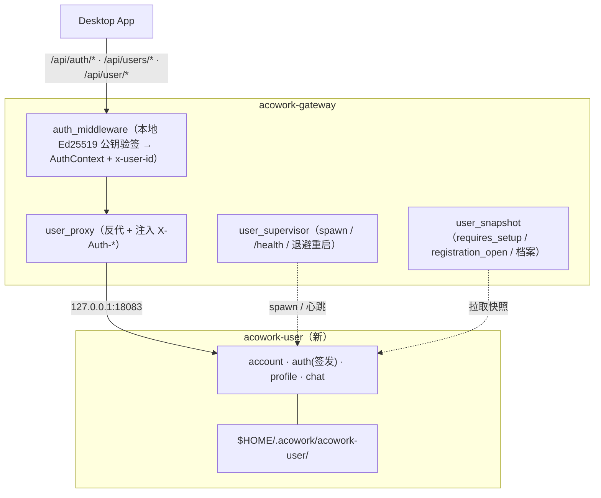

# acowork-user 开发计划（用户域剥离）

> 版本：v0.1（草案）| 日期：2026-10-20
>
> 关联 ADR：[`docs/adr/zh/ADR-084-user-standalone-process.md`](../../adr/zh/ADR-084-user-standalone-process.md)（本计划的唯一权威；文件级改动清单见其 §6）
> 关联被取代 ADR：[`docs/adr/zh/ADR-076-multi-user-account-system.md`](../../adr/zh/ADR-076-multi-user-account-system.md)（业务语义仍有效，实现形态被 ADR-084 取代）
> 范式先例：[`docs/plan/zh/pm-dev-plan.md`](pm-dev-plan.md)、[`docs/plan/zh/doc-dev-plan.md`](doc-dev-plan.md)
>
> **一句话**：把账号 / 凭据 / 角色 / 档案 / 头像 / 用户↔用户聊天从 acowork-gateway 剥离为独立进程 `acowork-user`，Gateway 仅保留反代 + 鉴权闸门；按 M0→M5 六个里程碑交付，预估总工期 **7-11 人日**（单人全职）。

---

## 1. 排期假设

- **团队规模**：单人全职（兼任代码评审自审）。
- **工时口径**：1d = 8h，含编码 + 单测 + 集成测试 + 文档同步。
- **排期窗口**：1.5-2 周连续投入；不含代码评审、合并、跨服务联调 buffer。
- **前置依赖（已就绪，无需新工作）**：
  - `acowork_core::supervisor::{RestartHistory, backoff_with_jitter}`、`supervisor_defaults`（ADR-019 抽出）。
  - `acowork_core::health::HealthResponse` 子进程健康契约。
  - `lifecycle/{pm,doc}_supervisor.rs` + `http/{pm,doc}_proxy.rs` 可逐行参照的范式。
  - `acowork-gateway/src/http/proxy.rs` 的透明反代 + hop-by-hop 头处理。
  - Desktop 端 `auth-api.ts` / `user-chat-api.ts` / `authFetch.ts` / `userChatStore` 现成客户端（**契约不变，零改动**）。
- **并行机会**：M0（core 契约 + Gateway 验签）与 M1（建 crate 迁代码）可并行；M3 与 M4 的 `local` 分支部分可并行。单人情况下按 M0→M5 串行。

### 1.1 目标拓扑



---

## 2. 里程碑总览

| 阶段 | 内容 | 估时 | 交付物 / 出口条件 |
|------|------|------|-------------------|
| **M0 契约** | `acowork-core::auth`（Ed25519 签发/验签）；Gateway `token.rs` 换为验证者 | 1d | 网关本地验签单测绿；HS256 移除 |
| **M1 建 crate + 迁代码** | `core/acowork-user` 骨架 + `account`/`auth`/`chat`/`http` 迁入 + 全量 router + `/health` + 用户 CLI | 2-3d | 二进制独立启动，可登录 / 改密 / 收发消息 |
| **M2 拉起 + 反代** | `user_supervisor` + `http/user_proxy` + `[user]` 配置 + `GatewayState.user_process` | 1-2d | Desktop 经 Gateway 全链路可用 |
| **M3 闸门改造** | `auth_middleware` 公钥验签、`restricted_mode` 快照、档案快照刷新（MQTT 信号） | 1-2d | `multi_user` e2e 全绿（含受限模式 403） |
| **M4 统一 + 拆除** | `local` 模式打通；删除 Gateway 内用户域代码；`dev/ci.sh` lint 更新 | 1-2d | 两模式 e2e 全绿；clippy 干净；lint 通过 |
| **M5 迁移 + 打包** | 一次性数据迁移 runbook；build / 打包脚本加 `acowork-user`；文档 | 1d | 迁移校验通过；`package_desktop_*` 产物含新二进制 |

---

## 3. 里程碑详情

### M0 — 共享 Token 契约（Ed25519）｜1d

**任务**
1. `core/acowork-core/src/auth/` 新增：
   - `Claims`（`sub` / `role` / `family` / `kind` / `iat` / `exp`）、`TokenKind`、`TokenError`（自 [gateway/auth/token.rs](../../../core/acowork-gateway/src/auth/token.rs) 平移语义）。
   - `TokenIssuer`（Ed25519 私钥：`sign_access` / `sign_refresh`）。
   - `TokenVerifier`（Ed25519 公钥：`verify` / `verify_kind`）。
   - `Claims::is_family_consistent` 等不变量保持不变。
2. 依赖选型：`ed25519-dalek`（或 `ring`）；JWT header 改 `{"alg":"EdDSA","typ":"JWT"}`。
3. 密钥位置约定：私钥 `{user_data_dir}/auth/ed25519.key`（0600），公钥 `{user_data_dir}/auth/ed25519.pub`。
4. Gateway `auth/token.rs` 的**签发部分删除**，仅保留 `TokenVerifier` 用法（或整体改调 `acowork_core::auth`）。
5. 平移并改写单测：签验往返 / 篡改拒绝 / 过期拒绝 / kind 校验 / family 一致性。

**出口**：`cargo test -p acowork-core` 绿；`cargo test -p acowork-gateway --lib` 中 token 相关测试绿；`grep -rn "HS256" core/` 仅剩历史注释。

### M1 — 建 crate + 迁入用户域代码｜2-3d

**任务**
1. `core/Cargo.toml` `[workspace] members` 追加 `acowork-user`。
2. 新建 `core/acowork-user/`（镜像 [acowork-doc/Cargo.toml](../../../core/acowork-doc/Cargo.toml) / [acowork-pm](../../../core/acowork-pm)）：
   - `Cargo.toml`：`[lib] acowork_user` + `[[bin]] acowork-user`；依赖 `acowork-core`、tokio、axum、tower-http、serde、argon2、uuid、chrono、tracing、clap、reqwest、`acowork-mqtt-session`+`rumqttc`（档案变更信号，参照 doc）、`ed25519-dalek`（经 core 契约）。
   - `src/lib.rs` 模块声明 + re-export（对齐 doc 的 public API 形状）。
   - `src/main.rs`：CLI（`--host --port --port-file --data-dir --auth-mode --gateway-health-url --gateway-health-interval-ms --gateway-health-timeout-ms --log-level`）+ `admin-setup` 子命令 + 首次设置 TTY prompt（自 [gateway/cli.rs](../../../core/acowork-gateway/src/cli.rs) 平移）。
   - `src/server.rs`：全量 router = `/api/auth/*` + `/api/users/*` + `/api/user/avatar-*` + `/health`；内部路径**与旧 Gateway 逐字一致**（`user_proxy` 不剥前缀）。
   - `src/health.rs`：`HealthResponse`，`details` 带 `data_dir` + `requires_setup` + `registration_open`。
   - `src/config.rs` / `error.rs` / `types.rs`。
3. 迁入（git mv 保历史）：
   - `account/{store,password}.rs` ← gateway 同名。
   - `auth/{service,revoked}.rs` ← gateway 同名；新增 `auth/issuer.rs`（用 core 的 `TokenIssuer`）。
   - `chat.rs` ← gateway `src/chat.rs`。
   - `http/{auth_api,account_api}.rs` ← gateway 同名；`http/users_api.rs` → `http/profile_api.rs`（内部路由字符串不变）。
   - `http/chat_api.rs` ← gateway 同名。
4. `sync_profiles`（账号 → `user_profiles.json` 派生视图）随 `account_api` 迁入；用户服务成为 `user_profiles.json` 的**唯一写入方**。
5. 鉴权语义：用户服务从注入头 `X-Auth-User` / `X-Auth-Role` / `X-Auth-As-User` 取身份（见 M2），**不再自行验签**；公开路径（`/api/auth/login|refresh|logout|first-login`）不要求身份。
6. `[multi_user]` 相关配置（`password_policy` / `bootstrap_admin` / `registration_open`）迁入用户服务配置。
7. 平移单测：account store 原子写 / 损坏备份；Argon2id 登录改密；refresh-family 撤销与重用检测；聊天参与者收敛 / 未读 / 附件权限边界。

**出口**：`cargo build -p acowork-user` 产 `acowork-user(.exe)`；`cargo test -p acowork-user` 绿；`acowork-user --port 18083` 独立启动，`/health` 200，登录/收发消息可用。

### M2 — 拉起 + 反代｜1-2d

**任务**
1. `core/acowork-gateway/src/lifecycle/user_supervisor.rs`（照抄 [doc_supervisor.rs](../../../core/acowork-gateway/src/lifecycle/doc_supervisor.rs)）：
   - `UserProcessState { pid, port, ready }`；`UserSupervisorConfig { user_bin, port, port_file, log_dir, gateway_health_url, data_dir, auth_mode }`。
   - spawn `acowork-user`，`--auth-mode` 由 Gateway 解析的 `AuthMode` 下发（单一真相源在 Gateway）。
   - `/health` 轮询就绪 + `RestartHistory` + 退避重启；失败清空状态、非致命。
2. `core/acowork-gateway/src/http/user_proxy.rs`：
   - 反代 `/api/auth/{*rest}`、`/api/users/{*rest}`、`/api/user/{*rest}` → `127.0.0.1:{user_port}`，**前缀保持不变**。
   - 注入可信身份：已认证 → `X-Auth-User`(= `AuthContext.user_id`)、`X-Auth-Role`、`X-Auth-As-User`；客户端自报 `X-Auth-*` 一律丢弃；公开路径不注入。
   - `user_process` 为 `None` → **503 + `Retry-After: 2`**。
   - 复用 [proxy.rs](../../../core/acowork-gateway/src/http/proxy.rs) 的 `is_hop_by_hop_header` / 共享 http client。
3. `config.rs` 新增 `[user] { enabled = true, port = 18083 }`（镜像 `PmConfig`/`DocConfig`）。
4. `gateway/state.rs` 新增 `user_process: Option<UserProcessState>`（+ M3 的 `user_snapshot`）。
5. `gateway/mod.rs`：启动 `user_supervisor`（镜像 pm/doc 段），移除 `AuthService` 初始化块（[gateway/mod.rs:222](../../../core/acowork-gateway/src/gateway/mod.rs#L222)）。
6. `http/routes.rs`：删除 `account_api` / `users_api` / `chat_api` 的本地注册，改挂 `user_proxy_routes()`（[routes.rs:261-290](../../../core/acowork-gateway/src/http/routes.rs#L261)）。
7. `user_proxy` 单测：身份注入（丢弃自报头）/ 公开路径不注入 / 503 语义。

**出口**：Desktop 登录 → token → 拉 `/api/users` → 收发用户聊天，全部经 Gateway 正常；杀掉用户服务进程 → Desktop 收到 503 并可重试。

### M3 — 闸门改造（验签 / 受限模式 / 档案快照）｜1-2d

**任务**
1. `http/auth_middleware.rs`：`verify_access` 改调 `acowork_core::auth::TokenVerifier`（公钥，启动时载入内存）；`AuthContext` / `effective_user_id` / `x-user-id` 注入**语义不变**（ADR-076 §决策 4 保持）。
2. `http/restricted_mode.rs`：`is_restricted()` 改读 `GatewayState.user_snapshot.requires_setup`（**无 I/O**）；保持 v2 合约（受限时无 token 请求应答 **403 `setup_required`**，非 401）。
3. `user_snapshot` 刷新机制：
   - `user_supervisor` `/health` 心跳解析 `requires_setup` / `registration_open` 写入 `GatewayState.user_snapshot`。
   - 用户服务在档案 / 账号变更后经 MQTT（参照 [acowork-doc/mqtt_publisher.rs](../../../core/acowork-doc/src/mqtt_publisher.rs)）发布变更信号；Gateway 订阅后**重新拉取** `GET http://127.0.0.1:{port}/internal/user-profiles` → 更新 `ResourceCache.user_profile_list` → 触发全局资源重发布（ADR-042）。
4. `resource_cache.rs` / `mqtt/global_resources_builders.rs`：`user_profile_list` 来源改为用户服务快照（不再读本地 `user_profiles.json`）。
5. `/api/status` 的 `registration_open` 来源改为快照（公开契约不变）。

**出口**：`multi_user` e2e 全绿；受限模式回归用例（走真实 `build_router`，403 而非 401）；改档案后 Runtime 收到的 `last_user_profile` 及时更新。

### M4 — 统一 local 模式 + 拆除 + lint｜1-2d

**任务**
1. `local` 模式：用户服务照常启动（只跑档案 / 头像）；`user_proxy` 代理 `/api/users/*`、`/api/user/*`；`/api/auth/*`、`/api/users/{id}/chats/*` 在 `local` 下不注册（404）。移除 Gateway 内 `users_api` 的 local 分支与头像逻辑。
2. 删除 Gateway 用户域代码：`src/account/`、`src/chat.rs`、`src/auth/service.rs`、`src/auth/revoked.rs`、`src/http/{account_api,users_api,auth_api,chat_api}.rs`；`cli.rs` 的 `AdminSetup` 子命令删除（迁至用户 CLI）。
3. 依赖瘦身：`Cargo.toml` 移除 `argon2` / `hmac`（若 `hmac` 仅 HS256 用）/ `rpassword` / `zeroize` / `tokio-util`（若仅聊天附件流用）。**逐项确认无其它引用后**再删。
4. `dev/ci.sh` 更新红黄线（见 §5.3）。
5. 全量回归：`cargo clippy --all-targets -- -D warnings`（含 `-p acowork-user`）+ `cargo test`。

**出口**：两模式 e2e 全绿；`cli.sh all` 通过；`grep` 确认 Gateway 内无用户域代码残留。

### M5 — 迁移 + 打包｜1d

**任务**
1. 执行 §6 数据迁移 runbook（一次性，不入库）。
2. 构建 / 打包脚本加新二进制（见 §5）。
3. 文档同步：ADR-084 状态定稿；ADR-076 已加取代说明；`docs/module-design/zh/` 视需要补 `acowork-user` 条目（可选）。

**出口**：迁移后登录旧账号成功、历史聊天可读、头像可见；`package_desktop_windows.ps1` 产物 `bin/` 含 `acowork-user.exe`。

---

## 4. 文件级改动清单

**以 [ADR-084 §6](../../adr/zh/ADR-084-user-standalone-process.md) 为准**，此处仅列实施视角的落点（不重复 ADR 正文）：

| crate | 动作 | 关键文件 |
|---|---|---|
| `core/acowork-core` | 新增 | `src/auth/{mod,claims,issuer,verifier}.rs` |
| `core/acowork-user` | 新增 | `Cargo.toml`、`src/{main,lib,server,health,config,error,types}.rs`、`src/account/*`、`src/auth/*`、`src/http/*`、`src/chat.rs`、`src/mqtt_publisher.rs` |
| `core/acowork-gateway` | 删除 | `src/account/*`、`src/chat.rs`、`src/auth/{service,revoked}.rs`、`src/http/{account_api,users_api,auth_api,chat_api}.rs`、`cli.rs::AdminSetup` |
| `core/acowork-gateway` | 新增 | `src/lifecycle/user_supervisor.rs`、`src/http/user_proxy.rs` |
| `core/acowork-gateway` | 修改 | `config.rs`、`gateway/state.rs`、`gateway/mod.rs`、`http/routes.rs`、`http/auth_middleware.rs`、`http/restricted_mode.rs`、`resource_cache.rs`、`mqtt/global_resources_builders.rs`、`auth/token.rs` |
| `apps/acowork-desktop` | 不改 | 契约不变 |

---

## 5. 构建 / 打包 / CI 改动

### 5.1 Cargo workspace
- `core/Cargo.toml` `[workspace] members` += `"acowork-user"`。

### 5.2 构建与打包脚本（每处 `acowork-pm` / `acowork-doc` 出现处一并加 `acowork-user`）
| 文件 | 改动 |
|---|---|
| [apps/acowork-desktop/package.json:8-9](../../../apps/acowork-desktop/package.json#L8) | `core:build:debug` / `core:build:release` 追加 `-p acowork-user` |
| [dev/build_core.sh](../../../dev/build_core.sh)、[dev/build_core.ps1](../../../dev/build_core.ps1)、[dev/build_macos.sh](../../../dev/build_macos.sh) | 新增 build + stop 步骤（`stop_process "acowork-user"`） |
| [dev/package_desktop_windows.ps1](../../../dev/package_desktop_windows.ps1)、[linux](../../../dev/package_desktop_linux.sh)、[macos](../../../dev/package_desktop_macos.sh) | `Copy` `target/release/acowork-user(.exe)` → `src-tauri/bin/` |
| `dev/e2e_frontend_smoke/smoke_test.py` | 若涉及进程清单，加 `acowork-user` |

> 注意（ADR-055 §6.11 / ADR-064 同款约束）：Gateway 经 `current_exe().parent().join("acowork-user")` 定位二进制，**必须与 `acowork-gateway` 同目录**，否则 supervisor 报 "binary not found" 静默降级为 503。

### 5.3 `dev/ci.sh` 红黄线（5 处必改）
| lint | 现状 | M4 后 |
|---|---|---|
| `run_gateway_fs_redline`（ADR-009） | 盯 `install_path` fs 访问 | 追加：Gateway 不得读 `accounts.json` / `user_profiles.json` / `users/` / `assets/avatars/` |
| `run_gateway_auth_scope_redline`（ADR-076 §决策 4） | `USER_SCOPE_HEADER`/`"x-user-id"` 仅允许在 `auth_middleware.rs` | 保持；**追加** `X-Auth-User`/`X-Auth-Role`/`X-Auth-As-User` 仅允许在 `user_proxy.rs`（+ 测试） |
| `run_gateway_auth_mode_redline`（ADR-076 §决策 12） | 盯 `routes.rs` 的 auth 注册分支 | 改写：盯 `user_proxy` 的注册是否处于 `auth_mode`/`[user].enabled` 分支 |
| `run_gateway_chat_path_redline`（ADR-076 §决策 8） | 盯 gateway `chat.rs` 拥有配对路径 | 路径 root 改指 `core/acowork-user/src/chat.rs` |
| `run_meta_layout_redline` | 会话 meta 布局 | 不变 |

> **机制提醒**：现有 5 条 lint 的 `root` 全部硬编码为 `core/acowork-gateway/src`（见 [dev/ci.sh:170](../../../dev/ci.sh#L170)、[:74](../../../dev/ci.sh#L74)）。chat-path lint 迁出后若不把 `root` 与 allowlist 一并改指 `core/acowork-user/src`，它会**静默放过**——新 crate 根本不在扫描范围内，CI 假绿。

新增 lint（建议）：
- `acowork-user` 侧不得引用 Gateway 数据目录路径（`acowork-gateway/data`）。
- Gateway 侧不得出现 `ed25519.key`（私钥只在用户服务）。
- **头常量单一来源**：`X-Auth-User` / `X-Auth-Role` / `X-Auth-As-User` 的字面量只在**一处定义**（建议 `acowork-core` 协议常量），Gateway `user_proxy`（写）与用户服务（读）各自 import。否则 lint 只能盯住 Gateway 一侧，读写两端仍会字面量漂移。

---

## 6. 数据迁移 runbook（一次性，不入库）

> 开发期无兼容需求（ADR-084 §决策 8）：**不写迁移代码**。以下由操作员手动 / 临时脚本执行一次。

**源**：`$HOME/.acowork/acowork-gateway/data`｜**目标**：`$HOME/.acowork/acowork-user`

```bash
GW="$HOME/.acowork/acowork-gateway/data"
US="$HOME/.acowork/acowork-user"
mkdir -p "$US"
[ -f "$GW/accounts.json" ]      && cp "$GW/accounts.json"      "$US/"
[ -f "$GW/user_profiles.json" ] && cp "$GW/user_profiles.json" "$US/"
[ -d "$GW/users" ]              && cp -r "$GW/users"           "$US/"
[ -d "$GW/assets" ]             && cp -r "$GW/assets"          "$US/"
```

| 数据 | 处理 | 备注 |
|---|---|---|
| `accounts.json` | 拷贝 | 仅 `multi_user` 存在 |
| `user_profiles.json` | 拷贝（或省略，由 `accounts.json` 重新派生） | 用户服务为唯一写入方 |
| `users/` | 递归拷贝 | 用户↔用户聊天树 `{min}/chats/{max}/` |
| `assets/avatars/`（`multi_user`）、`assets/`（`local` 共享） | 递归拷贝 | 头像 |
| 旧 `auth/secret`（HS256） | **丢弃** | 切 Ed25519 后旧 token 全失效，重新登录即可 |

**校验**：`multi_user` 登录旧账号 → 200；用户↔用户历史聊天可读；头像可见；`local` 模式档案可编辑。

---

## 7. 测试矩阵

| 层 | 用例 |
|---|---|
| 单元 | core Ed25519 签验/篡改/过期/kind/family；account store 原子写+损坏备份；Argon2id 登录改密；refresh 撤销与重用；聊天配对/未读/附件权限；`user_proxy` 身份注入与丢弃自报头 |
| 集成（e2e） | 真实 `build_router`：`multi_user` 登录→带 token→`/api/users`→代理→200；`local` 档案 CRUD 经代理；`/api/auth/*` 在 `local` 下 404；受限模式 403 `setup_required`（非 401）；越权 403/404；admin view-as 只读（写操作 403）；用户服务未就绪 503 + `Retry-After: 2` |
| 契约 | Desktop `auth-api.ts` / `user-chat-api.ts` / `gateway-api.ts` 迁移前后字节级对比 |
| 安全 checklist | 直连 `127.0.0.1:18083` 伪造 `X-Auth-*`；客户端自报 `x-user-id` 被丢弃；Gateway 进程不持有 Ed25519 私钥；用户服务仅绑 loopback |

---

## 8. 风险与回滚

| 风险 | 概率 | 影响 | 缓解 |
|---|---|---|---|
| Ed25519 迁移引入 token 兼容问题 | 中 | 中 | 开发期无存量 token；M0 单独成里程碑，先绿再动 crate |
| Gateway 对用户服务的两条运行时依赖（档案快照 / `requires_setup`）未就绪时语义退化 | 中 | 中 | 定义保守降级：档案空 → `last_user_profile` 缺省；`requires_setup` 未知 → 直通（见 ADR-084 §9 开放问题 1） |
| 打包脚本漏加二进制 → supervisor 静默 503 | 中 | 中 | §5.2 逐脚本过一遍 + 打包产物 smoke 校验 `bin/acowork-user*` 存在 |
| redline lint 指向旧路径，CI 假绿/假红 | 中 | 低 | M4 与代码删除同批更新 lint，`cli.sh all` 本地先跑 |
| `local` 模式为档案单起进程的开销争议 | 低 | 低 | ADR-084 §决策 6 已论证；如需回退见 §9 |

**回滚**：`[user].enabled=false` → 不 spawn，`/api/auth/*`、`/api/users/*` 返回 503（不影响其它服务）；数据目录改回即恢复。Ed25519 改动为单向，如需回退须恢复 `token.rs`（开发期无数据影响）。

---

## 9. 未决 / 待确认（同步 ADR-084 §9）

1. 用户服务未就绪时受限模式的保守语义：直通（availability）vs 拒绝（security）——**默认直通**，评审确认。
2. 档案刷新的信号通道：MQTT topic（推荐，复用 doc 范式）vs 回调 Gateway vs 轮询。
3. `local` 模式是否常驻用户服务：**默认常驻**（ADR-084 §决策 6）。
4. `/api/status` 的 `registration_open` 是否继续由 Gateway 透出（推荐保持）。
5. Ed25519 密钥轮换：本期不做（YAGNI），记录公钥 `kid` 升级路径。

---

## 10. 交付定义（Definition of Done）

- [ ] `core/acowork-user` 独立进程可起停、可被 supervisor 监督；`/health` 契约达标。
- [ ] Gateway 内**无**用户域代码与用户数据目录直读（lint 兜底）。
- [ ] 对外契约字节级不变，Desktop 零改动。
- [ ] `multi_user` / `local` 两模式 e2e 全绿；受限模式回归绿。
- [ ] `cargo clippy --all-targets -- -D warnings` + `cargo test` + `dev/ci.sh all` 通过。
- [ ] 一次性数据迁移校验通过；打包产物含 `acowork-user` 二进制。
