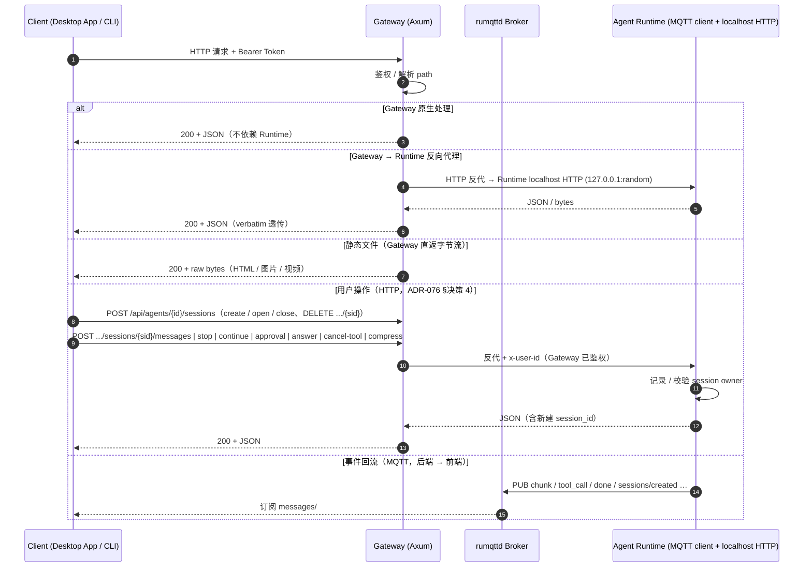

# HTTP 协议

> Gateway 暴露在 `127.0.0.1:19876`（默认）的 REST API。底层为 Axum。
> 详细路由聚合见源码：[`core/acowork-gateway/src/http/routes.rs`](../../../core/acowork-gateway/src/http/routes.rs)
>
> **ADR-033 + ADR-034 之后**：Gateway 是所有 HTTP 请求的**单点入口**；Runtime 不再直连客户端。
> 数据请求由 Gateway 通过 localhost HTTP **反向代理**到 Runtime；事件触发、命令推送、
> 实时流全部走 [MQTT](./mqtt.md)。

---

## 目录

- [1. 基础约定](#1-基础约定)
- [2. 通信流程](#2-通信流程)
- [3. 接口分类总览](#3-接口分类总览)
- [4. Gateway 原生端点（不依赖 Runtime 在线）](#4-gateway-原生端点不依赖-runtime-在线)
  - [4.1 系统与健康](#41-系统与健康)
  - [4.2 Agent 包管理](#42-agent-包管理)
  - [4.3 Agent 生命周期控制](#43-agent-生命周期控制)
  - [4.4 Avatar / Manifest 资源](#44-avatar--manifest-资源)
  - [4.5 LLM Provider 与 Models](#45-llm-provider-与-models)
  - [4.6 MCP 目录](#46-mcp-目录)
  - [4.7 嵌入模型](#47-嵌入模型)
  - [4.8 用户与用户级 Avatar](#48-用户与用户级-avatar)
  - [4.9 Cron 定时任务](#49-cron-定时任务)
  - [4.10 技能](#410-技能)
  - [4.11 调试与开发工具](#411-调试与开发工具)
  - [4.12 远程文件系统浏览](#412-远程文件系统浏览)
  - [4.13 全局资源快照（Runtime 主动拉取入口）](#413-全局资源快照runtime-主动拉取入口)
- [5. Gateway → Runtime 反向代理（需 Runtime 在线）](#5-gateway--runtime-反向代理需-runtime-在线)
  - [5.1 Agent 运行时配置](#51-agent-运行时配置)
  - [5.2 会话只读查询](#52-会话只读查询)
  - [5.3 附件（Attachment）](#53-附件attachment)
    - [5.3.1 `POST /sessions/{sid}/files`](#531-post-sessionssidfiles)
    - [5.3.2 `GET /files/{document_id}`](#532-get-filesdocument_id)
    - [5.3.3 消息条目中的 `attached_items`](#533-消息条目中的-attached_items)
  - [5.4 记忆 (Memory)](#54-记忆-memory)
  - [5.5 工作区 (Workspace)](#55-工作区-workspace)
  - [5.6 会话控制面（ADR-076 §决策 4）](#56-会话控制面adr-076-决策-4)
- [6. 静态文件服务（直接流式返回原始字节）](#6-静态文件服务直接流式返回原始字节)
- [7. MQTT 职责边界（ADR-076 §决策 4）](#7-mqtt-职责边界adr-076-决策-4)
- [8. 通用错误码](#8-通用错误码)
- [9. 典型请求示例](#9-典型请求示例)
- [10. 注意事项](#10-注意事项)

---

## 1. 基础约定

- **Base URL**：`http://127.0.0.1:19876`（可在 `gateway.toml` 的 `[http]` 节调整）
- **内容类型**：`application/json; charset=utf-8`
- **认证**：当 `[http].auth_enabled = true` 时，所有 `/api/*` 请求需带
  `Authorization: Bearer <token>`，token 文件位于 `<data_dir>/http_token`。
- **错误格式**：`{ "error": "..." }` + 对应 HTTP 状态码
- **事件通道（MQTT，后端 → 前端）**：MQTT 只承载 Runtime / Gateway **主动上报**的事件，
  前端被动订阅刷新界面：聊天事件流（`chunk` / `tool_call` / `done` …）订阅
  `acowork/agents/{id}/sessions/{sid}/messages/#`；会话增删订阅 `sessions/created` /
  `sessions/deleted`。MQTT **不承载任何用户主动触发的操作**。
- **用户操作通道（HTTP）**：ADR-076 §决策 4 之后，**所有用户主动触发的会话操作一律走
  HTTP**（经 Gateway token 鉴权 + 反代注入 `x-user-id`）。分两批迁移：**生命周期**
  （create / open / close / delete / visibility / workspace / config）与**会话动作**
  （发消息 / 停止 / 继续 / 审批 / 问答回答 / 取消工具 / 压缩），见
  [§5.6](#56-会话控制面adr-076-决策-4)。理由统一：MQTT 控制消息**不携带身份**——broker
  无法打标记，Runtime 因此记不了 session owner、也校验不了 owner，任何 broker 客户端都能
  静默改写他人会话（甚至用 `approval_decision{approved:true}` 在他人工作区执行命令）。
  `ControlCommand` 中除 `Intent` / `ActiveHeartbeat`（均非用户动作）外的字段**已全部删除**
  （见 [mqtt.md](./mqtt.md) §3）——是**发不出去**，而非"发出去被拒收"。
- **全局资源主动拉取（HTTP）**：Runtime 在 mqtt client + available_cache 就绪后（phase_a）
  会主动 `GET /api/global-resources` 并执行 **503 重试循环**（30s 总预算），作为 MQTT retained 推送**免受 
  retained-delivery 竞态的兜底**。与 retained 推送共用同一个 
  `AvailableResourceCache::update_from_mqtt` 处理路径，503 语义详见 
  [§4.13](#413-全局资源快照runtime-主动拉取入口)。

---

## 2. 通信流程



**架构要点**：

| 类别 | 处理方 | Runtime 是否必须在线 |
|---|---|---|
| Gateway 原生 | Gateway 单点处理 | **否** |
| Gateway → Runtime 反代 | Gateway 透传到 Runtime localhost HTTP | **是**（503 if offline） |
| 静态文件 | Gateway 直接读盘返回字节流 | **否**（仅要求文件存在） |
| MQTT 事件流（后端 → 前端上报） | rumqttd Broker 中转 | 是（Runtime 发布事件，前端订阅） |
| 全局资源主动拉取（`GET /api/global-resources`） | Gateway 单点响应 Runtime 主动拉取 | **否**（见 [§4.13](#413-全局资源快照runtime-主动拉取入口)） |

Gateway **不持久化业务数据**：Memory、Skill、Agent 运行时配置、Session 状态等真实数据存于
Runtime 本地文件 / SQLite 记忆层；Gateway 通过 HTTP 反向代理拉取快照、透传用户操作（并注入身份），
命令 / 写入则通过 MQTT 控制主题，MQTT 同时承担 Runtime / Gateway → 前端的事件上报。

---

## 3. 接口分类总览

| 大类 | 数量级 | 处理方 | Runtime 依赖 |
|---|---|---|---|
| **A. Gateway 原生** | ~50 个 | Gateway 本地存储 / Vault / 进程管理 | 否 |
| **B. Gateway → Runtime 反向代理** | ~25 个 | 透传到 Runtime localhost HTTP | **是** |
| **C. 静态文件** | 2 个路径模式 | Gateway 直接 `fs::read` 流式返回 | 否 |
| **D. MQTT 命令 / 流**（HTTP 端点已删除）| — | rumqttd Broker | 是 |

源码映射：

| 大类 | Gateway 实现模块 |
|---|---|
| A | [`agents.rs`](../../../core/acowork-gateway/src/http/agents.rs), [`provider_api.rs`](../../../core/acowork-gateway/src/http/provider_api.rs), [`models_api.rs`](../../../core/acowork-gateway/src/http/models_api.rs), [`mcp_catalog_api.rs`](../../../core/acowork-gateway/src/http/mcp_catalog_api.rs), [`embedding_api.rs`](../../../core/acowork-gateway/src/http/embedding_api.rs), [`users_api.rs`](../../../core/acowork-gateway/src/http/users_api.rs), [`cron_api.rs`](../../../core/acowork-gateway/src/http/cron_api.rs), [`skills_api.rs`](../../../core/acowork-gateway/src/http/skills_api.rs), [`config_api.rs`](../../../core/acowork-gateway/src/http/config_api.rs), [`fs_browse.rs`](../../../core/acowork-gateway/src/http/fs_browse.rs), [`debug_mqtt.rs`](../../../core/acowork-gateway/src/http/debug_mqtt.rs), [`publish_api.rs`](../../../core/acowork-gateway/src/http/publish_api.rs), [`global_resources_api.rs`](../../../core/acowork-gateway/src/http/global_resources_api.rs) |
| B | [`proxy.rs`](../../../core/acowork-gateway/src/http/proxy.rs)（ADR-033 Phase 2 + ADR-034 Phase 3） |
| C | [`workspaces.rs`](../../../core/acowork-gateway/src/http/workspaces.rs)（仅静态资源部分） |

---

## 4. Gateway 原生端点（不依赖 Runtime 在线）

Gateway 直接处理、不需要 Runtime 子进程在线的端点。涵盖：系统健康、Agent 包管理、
LLM Provider / Models 全局资源、MCP 目录、嵌入模型、用户档案、Cron、Skill、调试工具。

### 4.1 系统与健康

| 方法 | 路径 | 用途 |
|---|---|---|
| GET | `/health` | 健康检查（无鉴权），含 IPC（MQTT）/ CronStore / 磁盘空间 |
| GET | `/api/status` | 系统状态：版本、运行中 Agent 数、内存占用；`auth_mode`（`local` / `multi_user`）+ `registration_open`（非 admin 能否建号，账号系统未启用时恒 `false`）；`mqtt.auth_enabled` 开启时额外返回 `mqtt_username` / `mqtt_password`（Desktop MQTT 凭据下发，ADR-055 Phase 5a）。**免认证可读** |
| GET | `/api/config` | 读取 Gateway 配置 |
| PUT | `/api/config` | 更新日志级别、日志切分、idle_timeout、默认 provider/model、HF mirror 等（**不含** `[security]` 段——见下） |
| DELETE | `/api/logs` | 清空日志 |
| GET | `/api/agents/{id}/lsp-endpoint` | LSP Relay 端点（node-local，ADR-055 §6.7）：按 agent 解析宿主 Node 的 relay base URL（`endpoint`/`ready` 字段），供 Desktop / Runtime 直连 |

#### 4.1.1 对端 IP 白名单（安全兜底，`[security].allowed_node_ips`）

Gateway 可在 TCP 层对 HTTP 与 MQTT 分别施加「对端 IP 白名单」——防止未授权机器扫描 / 探测
Gateway 版本或占用端口。作为安全兜底：**空列表 = 全部放行（默认）；非空 = 仅列表内 IP / CIDR 的
对端可以连接**。`127.0.0.1` / `::1` 恒放行（Desktop 同机访问不中断）。白名单仅从
`gateway.toml` / 环境变量读取（**启动后不可变**，不能经 Desktop / `PUT /api/config` 修改）：

```toml
# <ACOWORK_HOME>/config/gateway.toml（或 <node_home>/../ 见 ADR-055）
[security]
allowed_node_ips = ["192.168.1.20", "192.168.1.0/24", "fd00::/64"]
```

环境变量等价写法（`gateway.toml` 同样支持 env 覆盖，见 §配置章节）：

```bash
ACOWORK_GATEWAY_ALLOWED_NODE_IPS="192.168.1.20,192.168.1.0/24"
```

行为差异：

| 层 | 拦截点 | 被拦表现 |
|---|---|---|
| HTTP（含 `/health`、`/api/*` 全部端点） | Axum middleware（`ConnectInfo<SocketAddr>`） | `403 Forbidden` + JSON `{"error":"forbidden","detail":"peer IP not allowed by gateway security policy"}` |
| MQTT | TCP pre-filter（rumqttd 0.20 不暴露对端 IP，无法在 CONNECT 层判断） | TCP 直接断开，无 MQTT 应答 |

> 设计动机：`/health` 无鉴权，若 Gateway 绑到 `0.0.0.0`，任何能路由到该端口的人都能探测版本；
> 白名单是网络层兜底，与 §4.1 的 bearer-token 鉴权（应用层）正交。详见
> [ADR-055 §6.8](../adr/zh/ADR-055-remote-runtime-node-topology.md) 与
> [runbook `single-machine-remote-topology.md`](../runbooks/single-machine-remote-topology.md)。

### 4.2 Agent 包管理

包级 CRUD 与发布。包安装到 `<packages_dir>`，Gateway 在 `installed_agents` 中维护清单。

> `<packages_dir>` 默认指向 `<node_home>/packages`（`ACOWORK_NODE_HOME` env → `$HOME/.acowork/acowork-node` → `./.acowork-node`），与 local / standalone Node 看到一致布局。Node 端真正执行文件操作，Gateway 仅做 HTTP API + manifest。详见 [ADR-055 §6.11 / §6.20](../adr/zh/ADR-055-remote-runtime-node-topology.md) 与 [runbook `single-machine-remote-topology.md`](../runbooks/single-machine-remote-topology.md)。

| 方法 | 路径 | 用途 |
|---|---|---|
| GET | `/api/agents` | 列出全部已安装 Agent（含 status、avatar、mqtt_online 等） |
| GET | `/api/agents/{id}` | Agent 详情（manifest、installed/connected/dev_mode 等） |
| DELETE | `/api/agents/{id}` | 卸载 Agent |
| POST | `/api/agents/install` | 安装 `.agent` 包（multipart） |
| POST | `/api/agents/{id}/clone` | 克隆 Agent（skeleton 或 full） |
| POST | `/api/agents/{id}/publish/prepare` | 准备打包（校验、清理） |
| POST | `/api/agents/{id}/publish/build` | 构建 `.agent` 包 |
| POST | `/api/agents/{id}/publish/export` | 导出包到目标路径 |
| POST | `/api/agents/{id}/publish/install-locally` | 本地安装构建产物 |
| GET | `/api/packages/{agent_id}/download` | 下载 `.agent` 包（Node install 拉取路径）；开启鉴权时校验 `X-ACowork-Node-Token`（ADR-055 Phase 5a）：缺失/不匹配 → 401/403 |

### 4.3 Agent 生命周期控制

子进程级控制：start / stop / restart-debug / 模型与搜索 provider 探测。
**模型与 provider 的切换是 per-session 配置**，走 HTTP `PUT /api/agents/{id}/sessions/{sid}/config`
（`{model, provider}`，见 [§5.6.1](#561-生命周期第一批)），不再走 MQTT。

| 方法 | 路径 | 用途 |
|---|---|---|
| POST | `/api/agents/{id}/start` | 启动 Agent Runtime 子进程 |
| POST | `/api/agents/{id}/stop` | 停止 Agent |
| POST | `/api/agents/{id}/restart-debug` | 重启为 debug 模式（开启 Debug 通道） |
| GET | `/api/agents/{id}/model` | 当前使用的模型 / provider（Gateway 从 manifest 推导） |
| GET | `/api/agents/{id}/search-providers` | 列出 Agent 可用的搜索 provider |

### 4.4 Avatar / Manifest 资源

Gateway 缓存了 avatar 资源（即便 Agent 停止也能读取）；通过 MQTT `AgentHello` 同步。

| 方法 | 路径 | 用途 |
|---|---|---|
| GET | `/api/agents/{id}/avatar` | 取 Agent 包内置头像图片 |
| POST | `/api/agents/{id}/manifest/avatar` | 上传/更新 manifest 头像 |
| POST | `/api/agents/{id}/manifest/file` | 上传 manifest 资源文件 |
| GET | `/api/agents/{id}/manifest/avatar-assets` | 列出 manifest 头像资源 |
| GET | `/api/agents/{id}/avatar-file` | 取 avatar 资源文件 |
| DELETE | `/api/agents/{id}/avatar-file` | 删除 avatar 资源 |
| GET | `/api/agents/{id}/avatar-config` | 取 avatar 运行时配置（Gateway 缓存） |
| PUT | `/api/agents/{id}/avatar-config` | 更新 avatar 配置（仅当 Agent 停止时生效） |

### 4.5 LLM Provider 与 Models

全局 LLM 资源。API Key 加密存于 Gateway Vault，配置（base_url / models / compact_model）
存于 `provider_list.json`。

| 方法 | 路径 | 用途 |
|---|---|---|
| GET | `/api/providers` | Provider 列表（API Key 掩码） |
| POST | `/api/providers` | 新增 Provider（key + config） |
| DELETE | `/api/providers/{provider}` | 删除 Provider |
| PUT | `/api/providers/{provider}` | 更新 Provider（key / config） |
| GET | `/api/models` | 所有 Provider 的模型（含本地 ollama / lmstudio） |
| GET | `/api/models/{provider}` | 单一 Provider 的模型 |
| POST | `/api/models/discover` | 自定义 base URL 发现模型（OpenAI-compatible） |
| GET | `/api/search/keys` | 搜索 provider 密钥列表 |
| POST | `/api/search/keys` | 新增搜索 provider 密钥 |
| PUT | `/api/search/keys/{provider}` | 更新搜索 provider 密钥 |
| DELETE | `/api/search/keys/{provider}` | 删除搜索 provider 密钥 |

### 4.6 MCP 目录

全局 MCP server 目录（与 Provider 类似的共享注册表，含凭据）。

| 方法 | 路径 | 用途 |
|---|---|---|
| GET | `/api/mcp-catalog` | 列出全部 MCP 目录项（env 字段掩码） |
| PUT | `/api/mcp-catalog` | 整体替换目录 |
| POST | `/api/mcp-catalog` | 新增一条目 |
| DELETE | `/api/mcp-catalog/{name}` | 删除条目 |
| POST | `/api/mcp-catalog/probe` | 健康探测（探测新配置） |
| POST | `/api/mcp-catalog/{name}/probe` | 健康探测（探测已有条目） |

### 4.7 嵌入模型

由 Gateway 管理的嵌入侧车（ONNX Runtime）。

| 方法 | 路径 | 用途 |
|---|---|---|
| GET | `/api/embedding-models` | 列出可用嵌入模型与状态 |
| POST | `/api/embedding-models/test` | 探测模型连通性 |
| POST | `/api/embedding-models/{id}/download` | 触发模型下载 |
| POST | `/api/embedding-models/{id}/select` | 切换当前模型 |
| GET | `/api/embedding-models/{id}/status` | 下载 / 加载状态 |
| DELETE | `/api/embedding-models/{id}` | 删除已下载模型 |
| GET | `/api/embedding-models/migration-progress` | 嵌入维度迁移整体进度 |
| POST | `/api/embedding-models/{id}/start-migration` | 启动迁移 |

### 4.8 用户与用户级 Avatar

全局用户档案（独立于 Agent）。

| 方法 | 路径 | 用途 |
|---|---|---|
| GET | `/api/users` | 用户档案列表 |
| POST | `/api/users` | 创建用户档案 |
| PUT | `/api/users/{user_id}` | 更新用户档案 |
| POST | `/api/users/{user_id}/activate` | 激活用户 |
| GET | `/api/user/avatar-config` | 当前激活用户的 avatar 配置 |
| PUT | `/api/user/avatar-config` | 更新 avatar 配置 |
| GET | `/api/user/avatar-assets` | 列出可用的 avatar 资源 |
| GET | `/api/user/avatar-file` | 取 avatar 文件 |
| POST | `/api/user/avatar-file` | 上传 avatar 文件 |
| DELETE | `/api/user/avatar-file` | 删除 avatar 文件 |

### 4.9 Cron 定时任务

Cron 由 Gateway 自管（持久化于 SQLite）。

| 方法 | 路径 | 用途 |
|---|---|---|
| GET | `/api/agents/{id}/cron` | 列出 Agent 的定时任务 |
| POST | `/api/agents/{id}/cron` | 注册新定时任务（schedule + action + params） |
| DELETE | `/api/agents/{id}/cron/{cron_id}` | 删除定时任务 |

### 4.10 技能

技能从已安装包的 `skills/` 目录读取。

| 方法 | 路径 | 用途 |
|---|---|---|
| GET | `/api/agents/{id}/skills` | 技能列表 |
| GET | `/api/agents/{id}/skills/{name}` | 技能详情（SKILL.md 解析） |
| GET | `/api/agents/{id}/skills/{name}/history` | 技能执行历史 |
| POST | `/api/agents/{id}/skills/import` | 导入技能 ZIP（multipart） |

### 4.11 调试与开发工具

仅在 localhost 暴露；不应暴露到网络。

| 方法 | 路径 | 用途 |
|---|---|---|
| POST | `/api/debug/mqtt/shutdown` | 请求 broker 线程退出（仅手动调试用） |
| POST | `/api/debug/mqtt/start` | 重新拉起 broker 线程 |

### 4.12 远程文件系统浏览

仅当远程 Desktop 连接到远端 Gateway 时使用（Tauri 本地场景无需此端点）。

| 方法 | 路径 | 用途 |
|---|---|---|
| GET | `/api/fs/browse` | 远程浏览服务器文件系统（仅目录列表，禁止内容读取） |

### 4.13 全局资源快照（Runtime 主动拉取入口）

> **实现**：[`core/acowork-gateway/src/http/global_resources_api.rs`](../../../core/acowork-gateway/src/http/global_resources_api.rs)
> **构建器**：[`core/acowork-gateway/src/mqtt/global_resources_builders.rs`](../../../core/acowork-gateway/src/mqtt/global_resources_builders.rs)
> （HTTP 与 MQTT retained 共用同一套 `build_available_*` 函数，零字段映射样板）
> **Runtime 侧消费**：[`core/acowork-runtime/src/startup/global_resources_pull.rs`](../../../core/acowork-runtime/src/startup/global_resources_pull.rs)

| 方法 | 路径 | 用途 |
|---|---|---|
| GET | `/api/global-resources` | 一次性拉取 6 个全局资源 topic 的最新快照；Runtime 在 phase_a 主动调用一次 |

**为什么需要这个端点（修复 Bug B）**

Bug B：清除 `.acowork` 重新走引导后，第一次与 system agent 聊天报
“unexpected error”，后续聊天正常。根因：

1. Gateway 在 vault 刚解锁但 provider 还未添加时，立刻 publish 空
   `AvailableProviders`（`provider_count=0, api_key_lengths=[]`）。
2. system agent ~150 ms 后启动，订阅 `acowork/global/providers`，接收
   retained → cached 空快照。
3. Desktop ~19s 后才完成 onboarding、新增 provider，Gateway 重新 publish
   带 key 的快照。
4. 但 rumqttd 的 retained delivery **只对未见过旧值的订阅者投递新值**
   ——已经 cached 空快照的 Runtime 收不到更新，session 里的 provider=空
   已定型，必须用户手动 model_switch 才能修复。

**修复方案**：Runtime 在 mqtt client + available_cache 就绪后（phase_a），
**主动** `GET /api/global-resources` 一次，把响应里每个 topic 的 base64
字节解码后直接喂给 [`AvailableResourceCache::update_from_mqtt`](../../../core/acowork-runtime/src/mqtt/available_cache.rs)
——与 MQTT retained 推送**完全相同的处理路径**。version 校验、stale 
retained 拒绝、ADR-059 §5.3 generation switch 逻辑全部复用，Gateway 
端不需要为 HTTP 维护第二条更新管线。

**为什么不依赖 Runtime 在线**

Gateway 本身就是全局资源的权威所有者（Vault + resource_cache + 
embed_process + BootstrapOrchestrator），该端点不依赖 Runtime 在线。
但 Gateway 自身的 bootstrap 阶段（Vault 解锁 / provider onboarding 未
完成）意味着全局资源**尚未定型**——此时返回 `503 + Retry-After`（详见
下文错误码），而不是 `200 + 空数据`：**“资源未准备好”和“资源为 0”
是两种完全不同的语义**，空快照会让 Runtime 把“还没有”误缓存为“就
是没有”，后续 session 永远以空 provider 列表启动。Gateway 级整体
bootstrap 状态另见 `GET /api/bootstrap`。

**两通道协议分工**

| 通道 | 角色 | 备注 |
|---|---|---|
| **MQTT retained**（`acowork/global/*`） | **primary** — 实时增量推送 | 已连接 Runtime 自动接收；`Notify` 触发 republish |
| **`GET /api/global-resources`**（本端点） | **active pull** — 启动期免受 retained-delivery 竞态 | 每次启动调一次，不依赖 retained 推送时序 |

两通道共用同一个 `update_from_mqtt` 处理路径（[`AvailableResourceCache::update_from_mqtt`](../../../core/acowork-runtime/src/mqtt/available_cache.rs)），
Runtime 端零特殊处理。

**响应**

```json
{
  "instance_id": "instance-abc-123",
  "topics": {
    "acowork/global/providers":        "CgcKBXNrLXYx...",
    "acowork/global/mcps":             "CggKBmFkbWlu...",
    "acowork/global/searches":         "CggK...",
    "acowork/global/embedding_models": "CggK...",
    "acowork/global/user_profile":     "CggK...",
    "acowork/global/bootstrap":        "CggK..."
  }
}
```

| 字段 | 类型 | 说明 |
|---|---|---|
| `instance_id` | `string` | ADR-059 §5.3 Gateway generation id，与 `acowork/global/bootstrap` retained 和 `GET /api/bootstrap` 同源 |
| `topics` | `BTreeMap<string, string>` | sorted map（保证响应 deterministic、便于测试 diff）；value 是 base64-encoded `DataEnvelope` protobuf bytes，与同名 MQTT retained topic payload **完全等价** |

`topics` 覆盖 6 个全局资源 topic：

| JSON key | MQTT topic | protobuf payload |
|---|---|---|
| `acowork/global/providers` | `acowork/global/providers` | `AvailableProviders` |
| `acowork/global/mcps` | `acowork/global/mcps` | `AvailableMcps` |
| `acowork/global/searches` | `acowork/global/searches` | `AvailableSearches` |
| `acowork/global/embedding_models` | `acowork/global/embedding_models` | `AvailableEmbeddingModels` |
| `acowork/global/user_profile` | `acowork/global/user_profile` | `AvailableUsers`（ADR-042） |
| `acowork/global/bootstrap` | `acowork/global/bootstrap` | `BootstrapState`（ADR-059） |

**Runtime 端消费**

1. base64-decode 每个 `topics[k]` → bytes。
2. 调 `cache.update_from_mqtt(topic, &bytes)`（`k` 已含完整 topic 名，
   直接走 MQTT retained 的同一份反序列化 + version 校验 + generation 
   switch 逻辑）。
3. 比较 `instance_id` 与本地 `cache.bootstrap_instance_id()`：
   - 相等 → 无动作。
   - 不等 → 先清空本地所有旧 snapshot（providers / mcps / searches / 
     embedding_models / lsps / user_profile / bootstrap），再 apply 新
     快照。`bootstrap_state` 的 update_from_mqtt 也会触发其自带的 
     generation switch 逻辑（双重保险）。

**重试循环（Bug B fix v3）**

Runtime 对 `503` 执行重试循环（[`pull_global_resources_from_gateway`](../../../core/acowork-runtime/src/startup/global_resources_pull.rs)）：

| Gateway 阶段 | HTTP | `Retry-After` | Runtime 行为 |
|---|---|---|---|
| `Booting` / `Unspecified` | `503` | `2`s | 睡 2s 后重试 |
| `Failed` | `503` | `10`s | 睡 10s 后重试 |
| `ShuttingDown` | `503` | `-1`（哨兵） | **放弃拉取**，仅依赖 MQTT retained |
| `Ready` / `Degraded` | `200` | N/A | 应用快照，循环结束 |

循环边界（[`global_resources_pull.rs`](../../../core/acowork-runtime/src/startup/global_resources_pull.rs)）：

- 总预算 `PULL_MAX_DURATION = 30s`：超时放弃，Phase A 不阻塞（仍以 MQTT
  retained 已送达内容为准）。
- **`503` 绝不写 cache**（never-poison）：已有快照（如 MQTT retained 刚送达）
  不会被“未就绪”数据覆盖——这是关键正确性不变量。
- 无 hint / 连接错误 / 5xx（非 503）→ 线性退避（500ms 起，封顶 5s）。
- 4xx（非 503）/ JSON 解析失败 → Fatal，立即放弃（重试不会好转）。

**为什么不把 6 个 protobuf 结构展开为内嵌 JSON**

prost 生成的类型默认**不带** `serde::Serialize/Deserialize` derive。
展开成内嵌 JSON 需要：

1. 给 `mqtt_payload.proto` 所有 message 加 `#[derive(serde::Serialize, 
   Deserialize)]`；
2. 解决 `oneof payload { ... }` 在 serde 中的 `#[serde(flatten)]` / 
   `tag` 赯手细节；
3. 在 Gateway 端写一堆 `AvailableProviders → ProviderEntry` 转换代码。

代价高、错误面广，且会让两通道（HTTP/MQTT）wire 格式**不一致**：将来
protobuf 加字段，HTTP 接口契约不变、Runtime 端需要双套解析代码。

base64 编码 protobuf bytes 让两通道 **wire 格式完全一致**，Runtime 端零
特殊处理。典型快照总量 < 5 KB，base64 膨胀可忽略。

**错误码**

| 状态 | 条件 | `Retry-After` | 说明 |
|---|---|---|---|
| `200` | `BootstrapPhase::Ready` / `Degraded` | N/A | 完整 `GlobalResourcesView`；`topics` 可为空 map（**资源为 0 是合法状态**） |
| `503` | `Booting` / `Unspecified`（orchestrator 未 attach） | `2`s | 资源未定型，稍后重试 |
| `503` | `Failed` | `10`s | 引导失败，长退避后重试 |
| `503` | `ShuttingDown` | `-1`（哨兵） | **不要重试**，放弃拉取 |
| `401` | Bearer token 缺失或错误 | N/A | 当 `[http].auth_enabled = true` |

`503` body 统一为 `NotReadyView`：`{instance_id, phase, phase_detail, 
retry_after_seconds, error}`（`retry_after_seconds` 与 header 同值，
body/header 双通道冗余，客户端任取其一）。

Runtime 消费规则：`503` **不更新本地 cache**，按 `Retry-After` 退避重
试；`200` 一定是权威快照（`instance_id` 为空 / `topics` 为空都按正常快
照处理——空资源是合法状态，不是未就绪）。

### 4.14 认证与账号（ADR-076，仅 `AUTH_MODE=multi_user`）

> **实现**：[`core/acowork-gateway/src/http/auth_api.rs`](../../../core/acowork-gateway/src/http/auth_api.rs)
> （认证）、[`core/acowork-gateway/src/http/account_api.rs`](../../../core/acowork-gateway/src/http/account_api.rs)
> （账号管理）；中间件 [`auth_middleware.rs`](../../../core/acowork-gateway/src/http/auth_middleware.rs)
> **部署与使用**：[多用户账号系统 runbook](../../runbooks/multi-user-accounts.md)

`AUTH_MODE=local` 下**这些路由一条都不注册**（`local` 与 `multi_user` 是两条装配分支，
见 [`routes.rs`](../../../core/acowork-gateway/src/http/routes.rs)）——因此 `local` 模式下
任何 `/api/auth/*`、`/api/users/*`（账号语义）请求都是 `404`，而非 `403`。

**免认证路径**（`multi_user` 下也只此几条，其余一律 401）：

| 路径 | 为什么放行 |
|---|---|
| `/health` | 探活 |
| `/api/status` | Desktop 必须先读到 `auth_mode` / `registration_open` 才能决定是否渲染登录页、以及是否给非 admin 显示"邀请账号"入口 |
| `/api/auth/login`、`/api/auth/refresh`、`/api/auth/first-login` | 拿 token 之前没有 token |
| `/api/auth/logout` | access token 已过期的客户端也要能丢掉死会话 |

| 方法 | 路径 | 用途 | 权限 |
|---|---|---|---|
| POST | `/api/auth/login` | 用户名 + 密码 → access / refresh token（用户名大小写不敏感） | 公开 |
| POST | `/api/auth/refresh` | refresh 换新对（**family rotation**：复用旧的 = 连坐撤销整个 family） | 公开 |
| POST | `/api/auth/logout` | 撤销**本设备**的 refresh family（不连坐其他设备） | 公开 |
| POST | `/api/auth/first-login` | `invite_token` + 新密码 → 激活账号并登录（一次性，24h 过期） | 公开 |
| GET | `/api/auth/me` | 当前身份（`AccountView` 脱敏视图，**不含** `password_hash`） | 本人 |
| POST | `/api/auth/change-password` | 改自己的密码（需旧密码）；成功后**撤销该账号全部 refresh family** | 本人 |
| GET | `/api/users` | 账号列表 | admin |
| POST | `/api/users` | 建号；不带 `password` 则返回一次性 `invite_token` | admin（`registration_open = true` 时非 admin 可建 `role = user`，**永不**是 admin） |
| GET | `/api/users/directory` | 联系人名录：`user_id` / `username` / `display_name`，排除已禁用与自己 | **任何**已认证账号 |
| GET | `/api/users/{user_id}` | 单账号详情 | admin，或本人 |
| PUT | `/api/users/{user_id}` | 改展示字段（`None` 不动 / 空串清除）；改 role 时拒绝摘掉末位 admin | admin，或本人（不含 role） |
| DELETE | `/api/users/{user_id}` | 删除账号 | admin，或本人 |
| POST | `/api/users/{user_id}/disable` | 禁用：不可登录 + 撤销其全部 refresh token | admin（末位 admin → 409） |
| POST | `/api/users/{user_id}/reset-password` | 清密码 + 铸新 `invite_token` + 撤销全部 refresh family | admin |

`?as_user=<user_id>`（admin 只读视角）由中间件在**读**方法上接受；带上它做 POST / DELETE → `403`。
客户端伪造 `X-User-Id` 一律被中间件剥除。

### 4.15 用户间聊天（ADR-076 §决策 8/9，仅 `AUTH_MODE=multi_user`）

> **实现**：[`core/acowork-gateway/src/http/chat_api.rs`](../../../core/acowork-gateway/src/http/chat_api.rs)（路由）
> + [`core/acowork-gateway/src/chat.rs`](../../../core/acowork-gateway/src/chat.rs)（持久化）

| 方法 | 路径 | 用途 | 权限 |
|---|---|---|---|
| GET | `/api/users/{user_id}/chats` | 会话列表（未读数 + 对端 `display_name`，服务端解析） | 自己，或 admin |
| GET | `/api/users/{user_id}/chats/{chat_id}/messages?offset&limit` | 消息分页（尾部向前） | 自己，或 admin |
| POST | `/api/users/{user_id}/chats/{chat_id}/messages` | 发消息，body 可带 `attachments: [id]` | **仅自己**（admin 也不能代发） |
| POST | `/api/users/{user_id}/chats/{chat_id}/read` | 已读回执，清零未读 | 自己，或 admin |
| POST | `/api/users/{user_id}/chats/{chat_id}/files` | multipart 上传附件 → `{attachment_id}` | **仅自己** |
| GET | `/api/users/{user_id}/chats/{chat_id}/files/{attachment_id}` | 下载附件 | 自己，或 admin |

约定：

- `chat_id = "{min(A,B)}__{max(A,B)}"`（UUIDv4 中不含 `__`，无歧义）。**配对顺序无关**：非规范
  `chat_id`、或调用者不是参与方 → `404`（不泄漏该会话是否存在）。
- **写永远是 self-only**：`from` 由 token 派生，请求体里的 `from` 一律忽略。
- `GET /api/users/directory` 是"普通用户怎么找到收件人"的答案（见 runbook §4.6 的隐私边界）。
- 附件上限：`image/*` 25 MiB，其他 100 MiB，超限 `413`。下载 `Content-Type` 取自存储时记录的
  mime（不信任客户端声明），`Content-Disposition: attachment; filename*=UTF-8''…` 支持 CJK 文件名。

---

## 5. Gateway → Runtime 反向代理（需 Runtime 在线）

> **实现**：`core/acowork-gateway/src/http/proxy.rs`
> **协议**：Gateway 从 `RuntimeHttpRegistry`（由 MQTT retained payload
> `acowork/agents/{id}/http_port` 填充）查到 Runtime 的随机端口，
> 然后 HTTP 反代。Runtime 未注册 / 已退出时 Gateway 返回 **503**。
>
> **Runtime 侧**真实接口见 [`core/acowork-runtime/src/http/server.rs`](../../../core/acowork-runtime/src/http/server.rs)
> 的 25 路由清单（ADR-034 §11.2）。
>
> **节点反代鉴权（ADR-055 Phase 5a）**：`mqtt.auth_enabled` 开启时，Gateway
> 出站反代按 agent_id → `installed_agents.node_id` → node registry 解析宿主
> Node，自动注入 `X-ACowork-Node-Token: <node_token>` header；Node 入站校验
> 该 header（已 enroll 的 Node 必须匹配 identity.node_token，不匹配 → 403 + `X-Error-Origin: node`）。
> 未开启鉴权时无 header，行为与 Phase 4 之前完全一致。

Gateway 不解析 Runtime 响应的 body，所有读写都 verbatim 透传。这意味着 Runtime 是
**workspace config / memory / session state 的权威所有者**，Gateway 仅充当反代。

### 5.1 Agent 运行时配置

| 方法 | 路径 | 用途 | Runtime 路径 |
|---|---|---|---|
| GET | `/api/agents/{id}/config` | 读取 Agent 合并后配置 | `/agents/{id}/config` |
| PUT | `/api/agents/{id}/config` | 更新 Agent 配置（max_output_tokens、temperature、prompt、avatar…） | `/agents/{id}/config` |
| GET | `/api/agents/{id}/tools` | 读取内置工具启用列表 | `/agents/{id}/tools` |
| GET | `/api/agents/{id}/builtin-tools` | 读取 builtin-tools 启用列表 | `/agents/{id}/builtin-tools` |
| PUT | `/api/agents/{id}/builtin-tools` | 写入 builtin-tools 启用列表 | `/agents/{id}/builtin-tools` |
| GET | `/api/agents/{id}/status` | Runtime 视角的状态（累计 token、loop 状态等） | `/agents/{id}/status` |
| GET | `/api/agents/{id}/mcp-servers` | 读取 Agent 的 MCP 服务配置 | `/agents/{id}/mcp-servers` |
| PUT | `/api/agents/{id}/mcp-servers` | 写入 MCP 服务配置 | `/agents/{id}/mcp-servers` |
| GET | `/api/agents/{id}/search-config` | 读取搜索配置 | `/agents/{id}/search-config` |
| PUT | `/api/agents/{id}/search-config` | 写入搜索配置 | `/agents/{id}/search-config` |
| GET | `/api/agents/{id}/providers` | 读取 Runtime 端的 Provider 列表（MQTT 同步后的实际数据） | `/agents/{id}/providers` |

> **ADR-040 Win11-MCP-ToolsBugFix (2026-07)**：上述 `mcp-servers` / `search-config` / `providers` 
> 早期由 Gateway stub 返回 200 但不持久化，导致用户在 Tools Tab 切换 MCP server 选择后丢失。
> 已统一改为反代到 Runtime 端 `get_agent_mcp_servers` / `put_agent_mcp_servers` 等。

### 5.2 会话只读查询

> **所有会话控制（生命周期 + 动作）都走 HTTP** —— 见
> [§5.6](#56-会话控制面adr-076-决策-4)。MQTT 不再承载任何用户主动触发的操作
> （ADR-076 §决策 4），只承载 Runtime → 前端的事件上报。

**认证与隔离（ADR-076 §决策 4）**：`multi_user` 模式下 Gateway 鉴权后把调用者的身份
scope 写入 `x-user-id` 头再反代给 Runtime；Runtime 据此过滤列表、并校验单会话的读权限。
`local` 模式（bind `127.0.0.1`）不注入该头，Runtime 视为不过滤——与 ADR-076 之前行为一致。

| 头 | 含义 | Runtime 行为 |
|---|---|---|
| `x-user-id: <uuid>` | 普通用户的 `user_id` | 只返回该用户的 public session + 自己的 private session |
| `x-user-id: *` | admin（或无 `as_user` 的 admin 视图） | 不过滤 |
| 无 `x-user-id` | local 模式 | 不过滤 |

**`as_user`（admin 只读视图）**：admin 可在**只读**请求上加 `?as_user=<user_id>`，
Gateway 会校验并把它当作 scope 注入（等同于以该用户身份读）。**写方法（POST / DELETE）
携带 `as_user` 一律 403**——否则审计日志会把操作记在被冒充的用户名下。

| 方法 | 路径 | 用途 | Runtime 路径 |
|---|---|---|---|
| GET | `/api/agents/{id}/sessions` | 会话列表（运行时视角，token 统计合并；**按调用者 scope 过滤**） | `/sessions` |
| GET | `/api/agents/{id}/latest-session` | 最新会话（启动时快速定位；**不可读时 404**） | `/sessions/latest` |
| GET | `/api/agents/{id}/conversations/latest` | 最新会话消息（ADR-034 唯一保留的 conversations 端点） | `/sessions/latest` |
| GET | `/api/agents/{id}/sessions/{sid}` | 单会话完整状态（合并 meta + state） | `/sessions/{sid}` |
| GET | `/api/agents/{id}/sessions/{sid}/state` | **legacy 别名**：转发到 `/sessions/{sid}`（保留以兼容旧调用方） | `/sessions/{sid}` |
| GET | `/api/agents/{id}/sessions/{sid}/messages` | 拉取消息历史（支持 cursor 分页） | `/sessions/{sid}/messages` |
| GET | `/api/agents/{id}/sessions/{sid}/config` | 读取会话 config 快照（ADR-047） | `/sessions/{sid}/config` |
| PUT | `/api/agents/{id}/sessions/{sid}/config` | 写会话 config（**owner 或 admin**） | `/sessions/{sid}/config` |

> **不可读 = 404，不是 403**。403 会把端点变成"某 session 是否存在"的探测器，正是列表
> 过滤要藏起来的信息。因此**不存在**与**无权限**返回同一个状态码。
>
> **公开 ≠ 可改**：`visibility = public`（或缺省）的 session 任何人可读，但只有 owner /
> admin 可写（open / close / delete / 改 config / 设可见性）。

### 5.6 会话控制面（ADR-076 §决策 4）

⚠️ 这十四条是 **HTTP 控制接口**，与 [§5.2](#52-会话只读查询) 同属会话域，但**不是**只读反代：
Gateway 必须鉴权，Runtime 必须校验 owner。ADR-076 §决策 4 把**所有用户主动触发的会话操作**
从 MQTT 搬到 HTTP，分两批：**5.6.1 生命周期**（第一批）与 **5.6.2 会话动作**（第二批）。
`open` 也是**写**授权：它把会话激活进 Runtime 内存，属于生命周期变更，只有 owner / admin 可调（见下）。

#### 5.6.1 生命周期（第一批）

| 方法 | 路径 | 用途 | Runtime 路径 | 权限 |
|---|---|---|---|---|
| POST | `/api/agents/{id}/sessions` | 创建会话（**owner = 调用者**） | `/sessions` | 任意已登录用户 |
| POST | `/api/agents/{id}/sessions/{sid}/open` | 激活（ADR-038，Closed/NotFound → Active，幂等） | `/sessions/{sid}/open` | owner / admin |
| POST | `/api/agents/{id}/sessions/{sid}/close` | 优雅关闭（触发蒸馏，保留 JSONL） | `/sessions/{sid}/close` | owner / admin |
| DELETE | `/api/agents/{id}/sessions/{sid}` | 删除会话及其文件 | `/sessions/{sid}` | owner / admin |
| PUT | `/api/agents/{id}/sessions/{sid}/visibility` | 分享 / 取消分享 | `/sessions/{sid}/visibility` | owner / admin |
| PUT | `/api/agents/{id}/sessions/{sid}/workspace` | 切换工作区 | `/sessions/{sid}/workspace` | owner / admin |
| PUT | `/api/agents/{id}/sessions/{sid}/config` | 切模型 / 思考深度 / 标题（见下） | `/sessions/{sid}/config` | owner / admin |

> **`open` 与 `close` 都是写授权**：`open` 会把会话**激活**进 Runtime 内存，而 `Active` /
> `Closed` 是 per-session **全局**状态（不是 per-connection）。所以公开会话的非 owner **不激活**
> ——前端在 `can_write === false` 时根本不发 `POST .../open`（见 §5.2 的只读会话说明）。
> 若让观众激活，就会造出一个"观众无权关（`close` 是写授权，旁观者不能拆掉 owner 的会话）、
> owner 也不知道被谁占着"的常驻会话：生命周期失去责任人，而 Runtime 目前**没有** per-session
> GC（`evict_idle_sessions` 无调用者，只有 agent 级自动休眠），回收它需要观察者引用计数。
>
> **公开会话的只读表现**：非 owner 打开他人 public 会话时，`GET /sessions` 下发的
> `can_write: false` 驱动前端禁用输入框与模型 / 工作区 / 可见性开关，并在 `openSession` /
> `closeTab` 里分别跳过 `POST .../open` / `POST .../close`（只本地开合 tab）；历史仍由
> `GET .../messages`（读授权）加载，事件流由通配 MQTT 订阅接收。发送、停止等写操作即使绕过
> 前端也会被 Runtime 以 404 拒绝（`is_writable_by`）。
>
> **`PUT .../visibility` 的 UI**：Desktop 输入框工具行（composer）的 🌐 / 🔒 图标，仅
> `can_write === true` 可点，点击即乐观翻转 + 上述 PUT（不弹二次确认，可逆）。

#### 5.6.2 会话动作（第二批）

第二批把"作用在已打开会话上"的用户操作也搬到 HTTP。这些操作**不承载归属决策**（它们改的是
会话内容而非归属），搬到 HTTP 换不到授权收益，但换来**统一的分工**：用户主动触发 → HTTP；
后端上报 → MQTT 事件。这样 multi-user 下每条用户操作都必然携带身份，没有例外路径。

| 方法 | 路径 | 用途 | Runtime 路径 | 权限 |
|---|---|---|---|---|
| POST | `/api/agents/{id}/sessions/{sid}/messages` | 发消息（原 mqtt `chat_message`） | `/sessions/{sid}/messages` | owner（写） |
| POST | `/api/agents/{id}/sessions/{sid}/stop` | 停止当前轮（原 mqtt `stop`） | `/sessions/{sid}/stop` | owner |
| POST | `/api/agents/{id}/sessions/{sid}/continue` | 暂停后恢复（原 mqtt `continue_execution`） | `/sessions/{sid}/continue` | owner |
| POST | `/api/agents/{id}/sessions/{sid}/approval` | 工具审批允许 / 拒绝（原 mqtt `approval_decision`） | `/sessions/{sid}/approval` | owner |
| POST | `/api/agents/{id}/sessions/{sid}/answer` | 回答 `ask_user_question`（原 mqtt `question_answer`） | `/sessions/{sid}/answer` | owner |
| POST | `/api/agents/{id}/sessions/{sid}/cancel-tool` | 取消单个在跑工具（原 mqtt `cancel_tool`，ADR-045） | `/sessions/{sid}/cancel-tool` | owner |
| POST | `/api/agents/{id}/sessions/{sid}/compress` | 上下文压缩（原 mqtt `compress_action`；`compact_context` 是重复命令，一并删除） | `/sessions/{sid}/compress` | owner |

**动作请求体**（字段与 Runtime handler 一一对应；除注明外均可省略）：

```json
// POST .../messages — 等价原 mqtt ChatMessage（params_json 是**字符串**，
// Runtime 自行从中解析 attached_items / content_parts）
{ "content": "...", "message_id": "...", "command": "", "params_json": "{}" }

// POST .../stop  &  POST .../continue —— reason 缺省/空串归一为 "user_requested"
{ "reason": "user_requested" }
// POST .../approval
{ "request_id": "...", "approved": true, "allow_all_session": false, "reason": null }
// POST .../answer
{ "request_id": "...", "answer": "..." }
// POST .../cancel-tool
{ "tool_call_id": "..." }
// POST .../compress —— compress_type：0=UNSPECIFIED 1=SUMMARY 2=TOOL_RESULTS
// （Desktop 输入框 usage 菜单发 1）
{ "compress_type": 1 }
```

**返回与执行结果**：鉴权 + 入队成功 → `202 Accepted`；无权 / 非 owner → `403`；
会话不存在或不可读 → `404`。真正的执行结果仍走 MQTT 事件
（`messages/{chunk,tool_call,done,stopped,…}`）——**事件面是唯一的结果来源**，与迁移前一致。

**创建请求体**（字段全可选；`visibility` 省略或 `null` = 公开）：

```json
{ "workspace_id": "...", "model": "...", "provider": "...", "visibility": "private" }
```

**写请求体**：

```json
// PUT .../workspace — 必须走这个端点，不能走 /config：/config 的 workspace_id
// 分支只改 meta，不重推 workspace context / prompt 文件，工具会在旧目录里干活。
{ "workspace_id": "ws-123" }

// PUT .../config — 已从 MQTT 删除的三条写命令改走这里（字段名 = SessionConfigDelta）
{ "model": "gpt-5", "provider": "openai" }   // 原 mqtt model_switch
{ "reasoning_effort": "high" }               // 原 mqtt reasoning_effort
{ "title": "新标题" }                         // 原 mqtt update_session_title
```

**可见性开关**（`SessionVisibility`）：`None`（字段缺失）与 `"public"` 等价——但只对**无主**会话成立。

- **有主会话**（`user_id` 非空）：`POST /sessions` 创建时即落盘 `"private"`。在多用户部署里，
  新建会话默认只有 owner 与 admin 可读，要共享得显式翻开关（或创建时在 body 里传 `visibility`）。
- **无主会话**（`user_id` 为空）：按标志分两种。
  - `None` / `"public"` = 公开（ADR-076 之前的数据，或 `local` 模式）。这既是 opt-out 而非 opt-in 的理由
    ——升级不能把历史会话追溯隐藏——也是 `local` 模式零改动的保证。
  - `"private"` = **无人认领**：除 admin 外不可读、不可写。agent 冷启动时自动创建的那个会话就是这种
    （它诞生在任何账号开口之前，没有 owner 可以归属），标为私有以免被当成"全公司共享会话"交给每个账号。

`PUT /sessions/{sid}/visibility` 对**无主**会话只认 admin（`403`）：谁能被允许"重新共享"一个没有主人的会话，比"谁能改它"更窄。

| `visibility` | 非 owner 能否读 | 非 owner 能否写 |
|---|---|---|
| 缺失 / `"public"` | ✅ | ❌（404） |
| `"private"` | ❌（404） | ❌（404） |

**`can_write` 字段**：`GET /api/agents/{id}/sessions` 的每一项都带 `can_write: bool`
（`SessionMeta::is_writable_by(scope)` 的结果）。**前端禁用写控件的唯一依据**——不要从
`visibility` 反推：public 只表示"别人能读"，而 admin / local 模式还能写自己没有的会话。
字段缺失（老 Runtime）按 `true` 处理。

**MQTT 侧已全部删除**：上述两批共十四条命令曾以 `sessions/control/{cmd}` 发布
（`create_session` / `open_session` / `close_session` / `delete_session` / `model_switch` /
`reasoning_effort` / `update_session_title` / `workspace_switch` / `chat_message` / `stop` /
`continue_execution` / `approval_decision` / `question_answer` / `cancel_tool` /
`compress_action`；`compact_context` 是 `compress_action` 的重复命令，一并删除）。它们的
proto 字段已从 `ControlCommand` 中**移除**（字段号随后整体重排为连续，见
[mqtt.md](./mqtt.md) §4），`ControlAction` / `InboundMessage` 的对应变体、以及 Gateway /
Tauri 的命令名映射表也一并删除 —— 也就是说这不是"发出去被拒收"，而是**根本发不出去**：
任何 broker 客户端都无法借此静默改写他人会话。
`ControlCommand` 现只余 `Intent`（Gateway → Runtime）与 `ActiveHeartbeat`（存在性心跳），
**均非用户动作**。新代码请用上表 HTTP 接口：只有 HTTP 路径携带身份，MQTT 控制消息不携带。

### 5.3 附件（Attachment）

附件 blob 落盘到 Runtime `<work_dir>/files/<document_id>`（无扩展名）；元数据经
`POST /api/agents/{id}/sessions/{sid}/messages` 的 `params_json`
（其中的 `attached_items` 字段）传给 Runtime 写 JSONL 消息条目（详见 [§5.6.2](#562-会话动作第二批) 与
[ADR-046](../../adr/zh/ADR-046-unified-attachment-entries.md)）。

| 方法 | 路径 | 用途 | Runtime 路径 |
|---|---|---|---|
| POST | `/api/agents/{id}/sessions/{sid}/files` | 上传文件（multipart） | `/sessions/{sid}/files` |
| GET | `/api/agents/{id}/files/{doc_id}` | 读取 blob 原始字节 | `/files/{document_id}` |

#### 5.3.1 `POST /sessions/{sid}/files`

接受 `multipart/form-data`，字段：

| 字段 | 必填 | 说明 |
|---|---|---|
| `file` | ✅ | 二进制文件内容；从 part header `filename` 派生 `name` 字段 |
| `format` | ⬜ | 小写扩展名（无点号，如 `pdf` / `png`）；缺省时从 `filename` 扩展名推断 |
| `width` | ⬜ | 图片像素宽（仅图片上传）；客户端通过 `new Image()` 测量 |
| `height` | ⬜ | 图片像素高（仅图片上传） |

未知字段会被忽略（向前兼容未来客户端字段扩展）。

**响应** `200 OK`：

```json
{
  "documentId": "a1b2c3d4…_8f7e",
  "filename": "Q3-report.pdf",
  "format": "pdf",
  "sizeBytes": 482301,
  "width": null,
  "height": null
}
```

`documentId` 是内容哈希 + 随机后缀（沿用旧算法），用于在 `<work_dir>/files/`
定位 blob。磁盘上 blob 的实际文件名为 `<documentId>.<safe_ext>`（见上文）。
**同一内容二次上传返回同一 `documentId`**（去重语义，磁盘只有一份
blob，消息 JSONL 中的引用也指向同一 ID）。

错误码：

- `400`：multipart 解析失败 / 缺 `file` 字段
- `503`：AttachmentService 未注入（启动期或 service 不可用）

#### 5.3.2 `GET /files/{document_id}`

返回 blob 原始字节。`Content-Type` 派生规则：客户端通过查询参数 `format` 提供小写
扩展名（缺省时服务端从响应头 `X-Format` 取，**最低保障为 `application/octet-stream`**）。

#### 5.3.3 消息条目中的 `attached_items`

运行时通过 MQTT `attached_items` 字段接收前端推上来的**已类型化**的附件条目数组。
**wire 形状**对应 Rust 端的 [`AttachedItem`](../../../core/acowork-core/src/protocol.rs)：
serde tag `type` 用 snake_case（`file_upload` / `attached_selection` 等），**变体内字段
用 camelCase**（`documentId` / `sizeBytes` / `absPath` / `startLine` / `endLine`）。
runtime 在 `loop_memory.rs::write_attached_items` 把它映射到 JSONL 持久化的
[`AttachmentMeta`](../../../core/acowork-runtime/src/conversation.rs)（变体内字段转回
snake_case：`document_id` / `size_bytes` / `abs_path` / `start_line` / `end_line`）。

| wire `type` | wire 字段（camelCase） | JSONL 字段（snake_case） | 场景 |
|---|---|---|---|
| `file_upload` | `documentId`、`filename`、`format`、`sizeBytes` | `document_id`、`filename`、`format`、`size_bytes` | 用户上传的文档（PDF/DOCX/PPTX/XLSX），blob 已落盘 |
| `image_upload` | 同上 + 可选 `width` / `height` | 同上 + 可选 `width` / `height` | 用户上传的图片（PNG/JPG），blob 已落盘 |
| `attached_file` | `absPath`、`name` | `abs_path`、`name` | "Add to Chat" 选择的 workspace 文件（**不复制**，引用路径） |
| `attached_selection` | `absPath`、`name`、`startLine`、`endLine` | `abs_path`、`name`、`start_line`、`end_line` | "Add to Chat" 带行号选区 |
| `attached_folder` | `absPath`、`name` | `abs_path`、`name` | "Add to Chat" 整个文件夹（**不复制**，LLM 用自己的工具按需遍历） |

> **契约锁定**：
> - Desktop 端发出者：`apps/acowork-desktop/src/lib/types.ts::toWireAttachedItems`
> - Rust 端 fixture 回归测试：`core/acowork-core/tests/attached_items_wire.rs`
>   （读 `tests/fixtures/desktop_attached_items.json`，逐项断言反序列化成功 + 字段名 camelCase）
> - Desktop 端 fixture 生成脚本：`apps/acowork-desktop/scripts/dump-attached-wire.mts`
>   （任何字段名变更后必须重跑此脚本并更新 fixture）
>
> **重要**：wire 用 camelCase 是 Rust deserializer 的硬约束。snake_case 字段名
> 不会触发任何错误——runtime 在 `gateway_loop.rs:813-820` 用
> `serde_json::from_value::<AttachedItem>(...).ok()` 静默丢弃——结果就是用户看到
> "附件消失了" 但日志里没有错误。fixture 测试就是为了让这种回归**无法上线**。

> 后三种（`attached_*`）由前端直接构造，不需要先经 HTTP 上传；只有前两种（`*_upload`）
> 才需要先调用 `POST /sessions/{sid}/files` 拿到 `documentId`。

### 5.4 记忆 (Memory)

> **Runtime 真实持有 SQLite 存储**。HTTP 反代在 [mqtt.md §7.5](./mqtt.md) 详述。
> Gateway `memory_api.rs` 本身**为空路由器**（ADR-033）：注册路径会与
> `proxy_routes` 冲突，`Router::merge()` 启动时直接 panic。

| 方法 | 路径 | 用途 | Runtime 路径 |
|---|---|---|---|
| GET | `/api/agents/{id}/memory/nodes` | 节点列表（分页 + 过滤：`type` / `keyword` / `time_range`） | `/memory/nodes` |
| GET | `/api/agents/{id}/memory/nodes/{nid}` | 读取单个节点 | `/memory/nodes/{nid}` |
| POST | `/api/agents/{id}/memory/nodes` | 创建节点 | `/memory/nodes` |
| PUT | `/api/agents/{id}/memory/nodes/{nid}` | 更新节点 | `/memory/nodes/{nid}` |
| DELETE | `/api/agents/{id}/memory/nodes/{nid}` | 删除节点 | `/memory/nodes/{nid}` |
| GET | `/api/agents/{id}/memory/stats` | 统计：总数、存储字节、按 type/status 分布、embedding 维度等 | `/memory/stats` |
| POST | `/api/agents/{id}/memory/consolidate` | 触发记忆整合（`force`、`retention_days`） | `/memory/consolidate` |
| GET | `/api/agents/{id}/memory/graph` | 整图拉取（前端图谱视图） | `/memory/graph` |
| GET | `/api/agents/{id}/memory/consolidation/status` | 整合定时器状态（idle 时长、pending 数、调度配置） | `/memory/consolidation/status` |
| GET | `/api/agents/{id}/rag/status` | RAG 配置状态（是否已配置、provider name） | `/agents/{id}/rag/status` |
| POST | `/api/agents/{id}/rag/query` | 直接查询 RAG（绕过 LLM，用于调试/连通性验证） | `/agents/{id}/rag/query` |

### 5.5 工作区 (Workspace)

> **Workspace config 由 Runtime 拥有**（`<work_dir>/config/agent_workspaces.json`）。
> Gateway 仅作为薄反代，把 `workspace_id` 解析与 path-traversal 守卫都收敛到 Runtime
> 一处（ADR-040）。**只有静态文件服务（见 §6）仍由 Gateway 直返**，因为 HTML 预览
> iframe 需要 raw bytes，Runtime 的 JSON 信封不可替代。

| 方法 | 路径 | 用途 | Runtime 路径 |
|---|---|---|---|
| GET | `/api/agents/{id}/workspaces` | 工作区列表 | `/workspaces` |
| POST | `/api/agents/{id}/workspaces` | 添加工作区目录 | `/workspaces` |
| GET | `/api/agents/{id}/workspaces/tree` | 目录树 | `/workspaces/tree` |
| GET | `/api/agents/{id}/workspaces/find` | 按名查找文件 | `/workspaces/find` |
| GET | `/api/agents/{id}/workspaces/search` | 按内容搜索（`include`、`max_results`、`case_sensitive`、`whole_word`） | `/workspaces/search` |
| PUT | `/api/agents/{id}/workspaces/{ws_id}` | 更新工作区（别名、access 等） | `/workspaces/{ws_id}` |
| DELETE | `/api/agents/{id}/workspaces/{ws_id}` | 删除工作区 | `/workspaces/{ws_id}` |
| PUT | `/api/agents/{id}/workspaces/{ws_id}/prompt-file` | 设置注入 prompt 文件 | `/workspaces/{ws_id}/prompt-file` |
| GET | `/api/agents/{id}/workspaces/file` | 读取文件（带元数据） | `/workspaces/file` |
| POST | `/api/agents/{id}/workspaces/file` | 创建文件 | `/workspaces/file` |
| PUT | `/api/agents/{id}/workspaces/file` | 写入文件 | `/workspaces/file` |
| DELETE | `/api/agents/{id}/workspaces/file` | 删除文件 | `/workspaces/file` |
| POST | `/api/agents/{id}/workspaces/dir` | 创建目录 | `/workspaces/dir` |
| DELETE | `/api/agents/{id}/workspaces/dir` | 删除目录 | `/workspaces/dir` |
| POST | `/api/agents/{id}/workspaces/copy` | 复制文件/目录 | `/workspaces/copy` |
| POST | `/api/agents/{id}/workspaces/rename` | 原子重命名 file/dir | `/workspaces/rename` |

### 5.6 包级 LLM Prompt 覆盖 (Prompts)

> **ADR-063**：agent 包可声明 9 个 LLM prompt override 文件（`prompts/<name>.md`），由
> Runtime 在 Phase A（`agent_init`）一次性加载到 `AgentBootContext`，Phase B（`session_init`）
> 注入到 `AgentCore`，运行时调用点通过 `Arc<RwLock<Option<String>>>` accessor 读取。
> Debug 面板可列出/编辑/保存/重载 — 重载端点走 `/debug/{*rest}` wildcard，由 R7（ADR-048 §D8）
> 转发。
>
> 9 个 canonical 文件名：`summary`、`fallback`、`search`、`compact-template`、`title`、
> `extraction`、`conflict-classification`、`generalization`、`abstention`（均位于包内
> `prompts/` 子目录）。Runtime 是白名单 + 路径校验的唯一权威，Gateway 仅做透明反代。

| 方法 | 路径 | 用途 | Runtime 路径 |
|---|---|---|---|
| GET | `/api/agents/{id}/prompts` | 列出 9 项 override 状态（`overridden`、`size_bytes`、`fallback_constant`） | `/agents/{id}/prompts` |
| GET | `/api/agents/{id}/prompts/{name}` | 读取单个 prompt（metadata + content；未 override 时 `content=null`） | `/agents/{id}/prompts/{name}` |
| PUT | `/api/agents/{id}/prompts/{name}` | 写入 prompt（原子 rename；返回 `reload_required: true`） | `/agents/{id}/prompts/{name}` |
| POST | `/api/agents/{id}/debug/prompts/reload` | 重载所有 9 项到 `AgentCore` Arc（R7，由 `/debug/{*rest}` wildcard 转发） | `/api/debug/prompts/reload` |

> **安全约束**：`{name}` 必须为 9 个 canonical 之一，大小写敏感；路径穿越（`..`、`/`、`\`）
> 会被 Runtime 拒绝（404）。PUT body 是 `{content: string}`，单文件 ≤ 1 MiB，空内容
> 或纯空白 → 400。原子写入（`tmp` + `rename`）保证崩溃时不留半截文件。详见
> `core/acowork-runtime/src/http/prompts.rs` 与 ADR-063 §3.5。

---

## 6. 静态文件服务（直接流式返回原始字节）

> **实现**：`core/acowork-gateway/src/http/workspaces.rs::resolve_tree_path`
> **保留在 Gateway 的原因**：HTML 预览 iframe 需要 raw bytes（HTML / CSS / 图像二进制），
> Runtime 的 JSON 信封（base64 content + metadata）会让 `` / `<link>` / `<script>`
> 全部失效。路径遍历守卫（canonicalize + `..` 检查）在 Gateway 本地完成。

| 方法 | 路径 | 用途 |
|---|---|---|
| GET | `/workspace-files/{agent_id}/{workspace_id}/{*path}` | workspace 任意文件直链，按 `workspace_id` 解析绝对路径 |
| GET | `/ws-files/{agent_id}/{*path}` | Agent home 直链（无 workspace_id） |

> 两个路径名是历史命名，保留不变。

---

## 7. MQTT 职责边界（ADR-076 §决策 4）

> **ADR-033 + ADR-034 曾把用户交互从 HTTP 迁到 MQTT**；**ADR-076 §决策 4 全部迁回 HTTP**。
> 结论固化如下：
>
> 1. **用户主动触发的操作一律走 HTTP** —— 经 Gateway token 鉴权 + 反代注入 `x-user-id`，
>    Runtime 校验 owner。两批：**生命周期**（create / open / close / delete / visibility /
>    workspace / config）与**会话动作**（messages / stop / continue / approval / answer /
>    cancel-tool / compress），见 [§5.6](#56-会话控制面adr-076-决策-4)。
> 2. **MQTT 只承载后端主动上报的事件** —— 前端订阅、被动刷新界面：`sessions/created` /
>    `sessions/deleted`、`sessions/{sid}/messages/#`（chunk / tool_call / done / …）、
>    `sessions/{sid}/meta` / `config`（retained 快照）。`ControlCommand` 中只剩
>    `Intent`（Gateway → Runtime）与 `ActiveHeartbeat`（存在性心跳）——**均非用户动作**。
> 3. **为什么**：MQTT 控制消息不携带身份，broker 无法打标记，Runtime 既记不了 session owner
>    也校验不了 owner；任何能连上 broker 的客户端都能静默改写 / 删除他人会话（极端情形：
>    `approval_decision{approved:true}` = 在他人工作区执行任意命令）。proto 字段**已删除**
>    而非 deprecated —— 能力在类型层面不可表达，是**发不出去**而不是"发出去被拒收"。

下表保留 ADR-033/034 时代的端点对照，**第三列标注 ADR-076 §决策 4 的最终归属**：

| 历史 HTTP 端点 | 曾迁往的 MQTT 通道 | 现状（ADR-076 §决策 4） |
|---|---|---|
| `POST /api/agents/{id}/message` | `PUB sessions/control/chat_message` | ⚠️ 回到 HTTP：`POST .../sessions/{sid}/messages`，见 §5.6.2 |
| `GET /api/agents/{id}/stream` | `SUB sessions/{sid}/messages/#` | ✅ 保持 MQTT（事件面本就是后端上报） |
| `POST /api/agents/{id}/continue` | `PUB sessions/control/continue_execution` | ⚠️ 回到 HTTP：`POST .../sessions/{sid}/continue` |
| `POST /api/agents/{id}/approval` | `PUB ... ApprovalDecision` | ⚠️ 回到 HTTP：`POST .../sessions/{sid}/approval`（**关闭审批伪造漏洞**） |
| `POST /api/agents/{id}/question` | `PUB ... QuestionAnswer` | ⚠️ 回到 HTTP：`POST .../sessions/{sid}/answer` |
| `POST .../sessions/{sid}/open` | `PUB sessions/control/open_session` | ⚠️ 回到 HTTP，见 §5.6.1 |
| `PUT .../sessions/{sid}/title` | `PUB sessions/control/update_session_title` | ⚠️ 回到 HTTP：`PUT .../sessions/{sid}/config`（`{title}`） |
| `DELETE /api/agents/{id}/sessions/{sid}` | `PUB sessions/control/delete_session` | ⚠️ 回到 HTTP，见 §5.6.1 |
| `POST .../sessions/{sid}/close` | `PUB sessions/control/close_session` | ⚠️ 回到 HTTP，见 §5.6.1 |
| `POST /api/agents/{id}/model-switch` | `PUB sessions/control/model_switch` | ⚠️ 回到 HTTP：`PUT .../sessions/{sid}/config`（`{model, provider}`） |
| `PUT .../sessions/{sid}/reasoning-effort` | `PUB sessions/control/reasoning_effort` | ⚠️ 回到 HTTP：`PUT .../sessions/{sid}/config`（`{reasoning_effort}`） |
| `PUT .../sessions/{sid}/workspace` | `PUB sessions/control/workspace_switch` | ⚠️ 回到 HTTP（**不能**走 `/config`：那条分支只改 meta），见 §5.6.1 |
| （新增）`POST /api/agents/{id}/sessions` | — | ⚠️ HTTP：创建会话，owner = 调用者，见 §5.6.1 |
| （新增）`PUT .../sessions/{sid}/visibility` | — | ⚠️ HTTP：分享 / 取消分享，见 §5.6.1 |
| （新增）`POST .../sessions/{sid}/{stop,cancel-tool,compress}` | 曾为 `PUB sessions/control/{stop,cancel_tool,compress_action}` | ⚠️ HTTP，见 §5.6.2（`compact_context` 为重复命令，一并删除） |

**MQTT 侧 proto 字段、`ControlAction` 变体、命令名映射表**（Gateway `mqtt/client.rs`、Tauri
`chat_mqtt.rs` / `mqtt_client.rs`）**已全部删除**；字段号随后整体重排为连续
（开发期无兼容需求，见 [mqtt.md](./mqtt.md) §4）。

---

## 8. 通用错误码

| 状态码 | 场景 |
|---|---|
| 400 | 参数校验失败、content 过长、id 格式不合法 |
| 401 | Bearer token 缺失或错误 |
| 403 | 对端 IP 不在 `[security].allowed_node_ips`（白名单拦截，§4.1.1）；或 Node token 校验不匹配（`X-Error-Origin: node`） |
| 404 | Agent / 资源不存在 |
| 409 | 状态冲突：Agent 未运行、未安装 |
| 500 | Gateway 内部错误 |
| 502 / 503 | MQTT / 反向代理通道不可用，Runtime 未连接（**反代端点专属**） |
| 504 | Gateway → Runtime 请求超时 |

---

## 9. 典型请求示例

### 9.1 安装 Agent（Gateway 原生）

```http
POST /api/agents/install HTTP/1.1
Authorization: Bearer <token>
Content-Type: multipart/form-data; boundary=----abc

------abc
Content-Disposition: form-data; name="package"; filename="hello.agent"
Content-Type: application/octet-stream

<binary>
------abc--
```

### 9.2 启动 Agent 并发送消息（HTTP）

```http
POST /api/agents/{id}/start HTTP/1.1
Authorization: Bearer <token>
```

```http
POST /api/agents/{id}/sessions/sess-active/messages HTTP/1.1
Authorization: Bearer <token>
Content-Type: application/json

{
  "message_id": "msg-11111111",
  "content": "你好",
  "params_json": "{}"
}
```

响应（`202 Accepted`；真正的回复在 MQTT 事件流
`SUB acowork/agents/{id}/sessions/sess-active/messages/#`）：

```json
{ "message_id": "msg-11111111", "type": "chunk", "text": "..." }
{ "type": "done" }
```

### 9.3 上传附件 + 在消息中引用（HTTP → HTTP）

```http
POST /api/agents/com.acowork.senior-engineer/sessions/sess-active/files HTTP/1.1
Authorization: Bearer <token>
Content-Type: multipart/form-data; boundary=----abc

------abc
Content-Disposition: form-data; name="file"; filename="Q3-report.pdf"
Content-Type: application/pdf

<binary>
------abc
Content-Disposition: form-data; name="format"

pdf
------abc--
```

响应：

```json
{
  "documentId": "a1b2c3d4…_8f7e",
  "filename": "Q3-report.pdf",
  "format": "pdf",
  "sizeBytes": 482301
}
```

随后发消息时通过 `params_json.attached_items`（**5 种 type 见 §5.3.3**）引用：

```http
POST /api/agents/com.acowork.senior-engineer/sessions/sess-active/messages HTTP/1.1
Authorization: Bearer <token>
Content-Type: application/json

{
  "message_id": "msg-22222222",
  "content": "总结这份 Q3 报告",
  "params_json": "{\"attached_items\":[{\"type\":\"file_upload\",\"documentId\":\"a1b2c3d4…_8f7e\",\"filename\":\"Q3-report.pdf\",\"format\":\"pdf\",\"sizeBytes\":482301}]}"
}
```

> `attached_items` 数组的 wire 字段名是 **camelCase**（`documentId` / `sizeBytes` / `absPath` / `startLine` / `endLine`），与 Rust `AttachedItem` deserializer 一致。完整字段说明见 [§5.3.3](#533-消息条目中的-attached_items)。

### 9.4 查询 Memory（反向代理）

```http
GET /api/agents/{id}/memory/nodes?page=1&size=20&type=Episodic&time_range=7d HTTP/1.1
Authorization: Bearer <token>
```

Gateway 收到后 → 查 `RuntimeHttpRegistry` 取 Runtime HTTP 端口 →
反代 `127.0.0.1:{port}/memory/nodes?...` → verbatim 返回。

### 9.5 查询整合状态（反向代理）

```http
GET /api/agents/{id}/memory/consolidation/status HTTP/1.1
Authorization: Bearer <token>
```

响应：

```json
{
  "idle_secs": 42,
  "pending_count": 3,
  "idle_timeout_secs": 1800,
  "accumulation_threshold": 50,
  "bg_task_running": true
}
```

Runtime 未启动整合管线时返回 `503 Service Unavailable`。

### 9.5.1 触发记忆整合（反向代理）

```http
POST /api/agents/{id}/memory/consolidate HTTP/1.1
Authorization: Bearer <token>
Content-Type: application/json

{
  "force": false,
  "retention_days": 7
}
```

响应：

```json
{
  "started": true,
  "duration_ms": 142,
  "episodes_consolidated": 12,
  "knowledge_nodes_generated": 3,
  "message": "Consolidated 12 episodes (8 upgraded, 2 dormant), generated 3 knowledge nodes, cleaned 1 episodic"
}
```

字段说明：

| 字段 | 类型 | 说明 |
|------|------|------|
| `started` | `bool` | 整合是否实际执行（store 不可用时为 `false`） |
| `duration_ms` | `u64` | 整合耗时（毫秒） |
| `episodes_consolidated` | `u64` | 处理的 pending 节点总数（upgraded + kept_pending + marked_dormant） |
| `knowledge_nodes_generated` | `u64` | 新生成的知识节点数（triples_extracted + procedural_created） |
| `message` | `string` | 人类可读的摘要信息 |

> **注意**：HTTP 手动触发仅执行 Phase 2 基础策略（基于置信度的升级/降级），
> 不包含 LLM triple extraction / conflict resolution / generalization。
> 完整 Phase 3 pipeline 由后台 `ConsolidationTimer` 自动调度（idle 30min 或
> pending ≥ 50 时触发）。

### 9.6 查询 RAG 状态（反向代理）

```http
GET /api/agents/{id}/rag/status HTTP/1.1
Authorization: Bearer <token>
```

响应（已配置 RAG）：

```json
{
  "configured": true,
  "provider_name": "enterprise_knowledge",
  "agent_id": "com.example.sales"
}
```

响应（未配置 RAG）：

```json
{
  "configured": false,
  "provider_name": null,
  "agent_id": "com.example.sales"
}
```

### 9.7 直接查询 RAG（反向代理）

绕过 LLM tool-call 路径，直接向 RAG 服务发起查询。用于调试 RAG
连通性和查询质量。

```http
POST /api/agents/{id}/rag/query HTTP/1.1
Authorization: Bearer <token>
Content-Type: application/json

{
  "query": "产品 Q3 路线图",
  "top_k": 5,
  "score_threshold": 0.7
}
```

响应：

```json
{
  "query": "产品 Q3 路线图",
  "results": [
    {
      "content": "Q3 路线图包含三个里程碑...",
      "source_url": "https://wiki.corp.example.com/q3-roadmap",
      "chunk_id": "chunk-abc123",
      "score": 0.92,
      "source_label": "[RAG:enterprise_knowledge]"
    }
  ],
  "result_count": 1,
  "provider_name": "enterprise_knowledge"
}
```

未配置 RAG 时返回 `503`；空 query 返回 `400`。

### 9.8 拉取消息历史（反向代理）

```http
GET /api/agents/{id}/sessions/sess-active/messages?cursor=...&limit=50 HTTP/1.1
Authorization: Bearer <token>
```

### 9.9 静态文件直链（iframe / img）

```html
<!-- 工作区任意文件，按 workspace_id 解析 -->


<!-- Agent home 直链 -->

```

### 9.10 拉取全局资源快照（Runtime 启动期主动拉取）

```http
GET /api/global-resources HTTP/1.1
Authorization: Bearer <token>
```

响应（示例，示明结构不代表真实长度）：

```json
{
  "instance_id": "instance-7f3a9b2e-1c4d-4e8f-9a5b-2d6f8e0c1234",
  "topics": {
    "acowork/global/providers":        "CgcKBXNrLXYxGgIIUg==",
    "acowork/global/mcps":             "CggKBmFkbWluGgIIUg==",
    "acowork/global/searches":         "CggK...",
    "acowork/global/embedding_models": "CggK...",
    "acowork/global/user_profile":     "CggK...",
    "acowork/global/bootstrap":        "CggK..."
  }
}
```

每个 `topics[k]` value 是 base64 编码的 `DataEnvelope` protobuf 字节，
与同名 MQTT retained topic payload **完全等价**。Runtime 端处理：

```rust
// 伪代码（实际实现见 core/acowork-runtime/src/startup/global_resources_pull.rs）
for (topic, b64) in &body["topics"].as_object().unwrap() {
    let bytes = base64::decode(b64.as_str().unwrap()).unwrap();
    cache.update_from_mqtt(topic, &bytes);   // 与 MQTT retained 同入口
}
if body["instance_id"] != cache.bootstrap_instance_id().unwrap_or("") {
    cache.providers = None;   // ADR-059 §5.3 generation switch
    cache.mcps = None;
    // ... 应用新快照
}
```

---

## 10. 注意事项

1. **Gateway 不持久化业务数据**：Memory、Skill、Agent 运行时配置、Session 状态等真实数据
   存于 Runtime 本地文件 / SQLite 记忆层；Gateway 通过 HTTP 反向代理拉取快照或透传请求。
2. **反代端点要求 Runtime 在线**：Runtime 未注册 / 已退出时返回 503；MQTT 通道
   `acowork/agents/{id}/http_port` 是 Gateway 反代发现 Runtime 端口的唯一来源，
   **retained publish** 是关键（Gateway 重启后 broker 会重放上一次的端口）。
3. **多数写操作会触发热推送**：例如修改 Provider / MCP / Search 配置后，Gateway 通过
   MQTT **retained publish** 向所有已连接的 Runtime 同步最新可用列表，
   详见 [mqtt.md §全局资源可用性广播](./mqtt.md)。
4. **CORS**：始终启用 `CorsLayer::permissive()`（任意 origin、任意 method、任意 header；不带
   `allow_credentials(true)`——`*` 通配与 `Access-Control-Allow-Credentials: true` 互斥，tower-http
   会在构建时 panic；且前端 fetch 默认 `credentials: 'same-origin'`，无需该头）。
   dev 模式 Vite (`:5173`) 与生产模式 Tauri 自定义协议 (`tauri://localhost` / `http(s)://tauri.localhost`)
   都属于跨源访问 Gateway (`:19876`)，任何 hardcoded allowlist 都会被浏览器把 `localhost` 解析成不同 IP 字
   面量时打穿。本地默认 bind `127.0.0.1`——攻击者必须已经能访问本机回路才能利用 permissive CORS——
   所以 loopback 上是 0 风险。远端部署时 CSRF 防护依赖 `Authorization: Bearer <token>`（`[http].auth_enabled = true`），
   Gateway 不发 Set-Cookie，浏览器默认 `credentials: 'same-origin'` 不会带上 cookie。
5. **静态文件服务**：`/workspace-files`、`/ws-files` 路径由 Axum router 直接返回文件流，
   供前端 `` / 视频等直接引用（命名保留历史，不变更）。
6. **会话的所有用户操作都走 HTTP**（ADR-076 §决策 4，见 §5.6）：生命周期四条
   （create / open / close / delete）+ 可见性 / workspace / config，以及会话动作七条
   （messages / stop / continue / approval / answer / cancel-tool / compress）。
   MQTT 侧对应命令**已从 proto 删除**，不再有任何控制主题可发布；MQTT 只承载 Runtime →
   前端的事件上报（见 §7）。这些操作必须携带身份，只有 HTTP 路径能带上 `x-user-id`。
7. **Runtime 启动期主动拉取全局资源**：每次 Runtime 启动，会在 phase_a（mqtt client + 
   available_cache 就绪后）主动 `GET /api/global-resources` 一次。这是 MQTT retained 推送
   之外的**免受 retained-delivery 竞态的兜底**，用来修复 Bug B（清除 `.acowork` 后首次
   chat 报 “unexpected error”）。HTTP 端点不依赖 Runtime 在线，归在 §4 Gateway 原生端点下；
   Runtime 端处理逻辑复用 MQTT retained 推送的同一个 `update_from_mqtt` 入口，
   version 校验与 ADR-059 §5.3 generation switch 逻辑零分叉。详见 [§4.13](#413-全局资源快照runtime-主动拉取入口)。