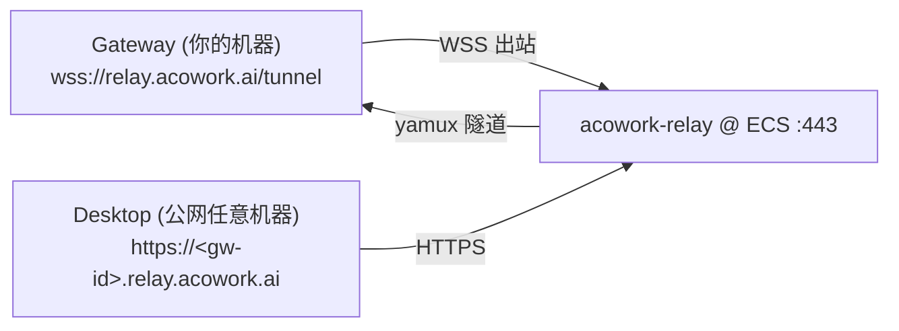

# acowork-relay 生产部署 - ECS + Cloudflare 泛域名

> 场景：`acowork.ai` 托管在 **Cloudflare DNS**（可能橙云代理），relay 部署到 **Aliyun ECS**，服务域 `relay.acowork.ai`，设备域 `*.relay.acowork.ai`。
> 依据：[设计文档 24 §5.3](../design/zh/24-cloud-relay-remote-access.md)（SNI 路由）与 [ADR-055 §6.13](../adr/zh/ADR-055-remote-runtime-node-topology.md)。

---

## 0. 架构与关键约束（先读这一节）



**三条硬约束，违反任何一条中继都不工作：**

| # | 约束 | 原因 |
|---|------|------|
| 1 | **`relay.acowork.ai` 与 `*.relay.acowork.ai` 都必须是 Cloudflare「仅 DNS」（灰云）** | 橙云代理会在 Cloudflare 边缘终结 TLS，只把明文 HTTP 回源。relay 靠 **TLS SNI** 判断是控制面还是设备隧道（[entry.rs(../../core/acowork-relay/src/entry.rs) `route_service_or_device` `route_service_or_device`），SNI 到不了源站，中继无法路由 |
| 2 | **必须签发 `*.relay.acowork.ai` 通配符证书** | Desktop 访问的是 `<gw-id>.relay.acowork.ai`，每次 gw-id 不同，Desktop 校验 TLS。通配符只有 DNS-01 能签（HTTP-01/TLS-ALPN-01 签不了） |
| 3 | **ECS 安全组必须放行 443/TCP 入站**（并确认 80 也要开） | 中继自己监听 443；80 仅 certbot HTTP-01 兜底（本方案主用 DNS-01，80 可不开放） |

> **为什么不能走 Cloudflare 隧道（cloudflared）**：设计文档 §5.3 选项 E 已否决——每台 Gateway 都要装 cloudflared，国内可达性差，且 TCP 隧道对 MQTT 支持一般。本方案是纯自建，ECS 只跑一个无状态字节管道。

---

## 1. Cloudflare DNS：配泛解析

1. 登录 [dash.cloudflare.com](https://dash.cloudflare.com) → `acowork.ai` → **DNS** → **Add record**
2. 添加两条记录（**Proxy status 一律选 Proxied OFF / 灰云**）：

| Type | Name | Content | Proxy status | TTL |
|------|------|---------|--------------|-----|
| `A` | `relay` | `<ECS 公网 IP>` | **DNS only（灰云）** | Auto |
| `A` | `*` | `<ECS 公网 IP>` | **DNS only（灰云）** | Auto |

   - `relay` → 服务域（控制面：Gateway 出站隧道 + `/health` + admin API）
   - `*` → 泛解析，覆盖所有 `<gw-id>.relay.acowork.ai` 设备域（每次 gw-id 都是新子域名，泛解析是唯一可行的方式）

3. **不要**添加 `CAA` 记录（若已有 CAA 只允许 `letsencrypt.org`，确保放行 Let's Encrypt；删除 CAA 或改成下方 §3 的提案即可）

> **验证**（等 1 分钟 DNS 生效后，在任意机器执行）：
> ```bash
> dig +short relay.acowork.ai
> dig +short <任意字符串>.relay.acowork.ai     # 应返回同一个 ECS IP
> # 反证：Cloudflare 边缘 IP 不是你的 ECS IP
> ```

---

## 2. ECS 准备

> **账号约定**：本文所有带 `sudo` 的命令都在 **root（或 sudoer）账号**下执行。**不要 `su acowork-relay`**——
> `acowork-relay` 是 nologin 的系统账号（`useradd -r -s /usr/sbin/nologin`），只给 systemd 用，不给人登录。
> 你在 ECS 上的日常身份应该是 root 或你自己的 sudoer 账号。唯一不由你执行的是 relay 进程本身，
> 它由 systemd 以 `User=acowork-relay` 拉起（§5）。

### 2.1 安全组（控制台 → ECS → 实例 → 安全组 → 配置规则）

| 方向 | 协议类型 | 端口范围 | 授权对象 | 用途 |
|------|----------|----------|----------|------|
| 入方向 | TCP | `443/443` | `0.0.0.0/0` | 中继 TLS 监听（设备域 + 控制面） |
| 入方向 | TCP | `22/22` | **你的办公 IP/32**（或 VPN 网段） | SSH，**不要**对全网开放 |
| 出方向 | TCP | `443/443` + `80/80` | `0.0.0.0/0` | 证书续期 HTTP-01 兜底 / 依赖拉取 |

> 只有 443 需要对全网开放；中继的设备域是「字节管道」，所有请求都来自你信任的 Gateway 隧道内的 Desktop/Mobile。

### 2.2 系统初始化

ECS 上**不需要 Rust 工具链**——二进制在本地交叉编译（§4），服务器只负责执行。

```bash
# 以 root 登录 ECS。系统自带 openssl / tar 即可，仅 certbot 缺失时需要装：
#   dnf list --available 'certbot*'        # 有包走路线 A，无包走 §3.1 路线 B
#   apt install -y python3-venv            # Debian / Ubuntu（§3.1 路线 B）
#   certbot-dns-cloudflare 插件见 §3.1

# 专用系统用户
sudo useradd -r -s /usr/sbin/nologin acowork-relay
sudo install -d -o acowork-relay -g acowork-relay -m 0750 /var/lib/acowork-relay
```

> **不要 `dnf install rust`**：Aliyun 源里的 Rust 是 1.75，而项目要求 `rust-version = "1.95"`
> 且使用 `edition = "2024"`（需 1.85+）——1.75 连 manifest 都解析不了，Cargo 会直接拒绝
> 报 `package requires rustc 1.95 or newer`。若确实要在服务器上编译，用 rustup
> 装现代工具链（见 §4.1 兜底方案），不要用发行版打包的版本。

---

## 3. 通配符证书（Let's Encrypt，DNS-01）

> 以下命令在 **root / sudoer 账号**下执行（账号约定见 §2）。certbot 的凭据和证书目录都在
> `/etc/letsencrypt/`（root 属），中继进程以 `acowork-relay` 身份只**读**这些 PEM 文件——
> certbot 保存的私钥默认 0600 root:root，如需放开读取权限见 §5 备注。

relay 用的**不是**普通单域名证书，而是同时覆盖服务域和全部设备域的通配符：

```
SAN: [relay.acowork.ai, *.relay.acowork.ai]
```

### 3.1 安装 certbot + Cloudflare DNS 插件

**两条路二选一，跑完哪条就用哪条的 certbot**（判断依据：源里有没有打包好的 certbot）：

```bash
sudo dnf list --available 'certbot*' 'python3-certbot-dns-cloudflare'
```

**路线 A：发行版包（推荐，若上面列出了包）**——RPM 依赖由发行版解决，**全程不调 pip**，
因此不受旧 pip 的 wheel tag 缺陷影响，也不需要 Rust 工具链：

```bash
sudo dnf install -y certbot python3-certbot-dns-cloudflare
certbot --version        # 之后所有命令直接用 certbot，不要再碰 venv
```

> **不要**用 `sudo pip3 install certbot-dns-cloudflare` 补插件——系统 pip 同样是 9.0.3，会原样重演
> §3.1 那条 `cryptography` 编译失败。插件只要**有 RPM 就装 RPM**。

**路线 B：venv（源里没有包时用）**——注意第 3 步的 pip 升级不能省：

```bash
sudo apt install -y python3-venv          # Debian/Ubuntu 缺 venv 模块时会报 ensurepip 缺失
sudo python3 -m venv /opt/certbot
sudo /opt/certbot/bin/pip install -U pip setuptools wheel   # ← 必须先升 pip，否则编译 cryptography 失败
sudo /opt/certbot/bin/pip install -U certbot certbot-dns-cloudflare
sudo ln -sf /opt/certbot/bin/certbot /usr/bin/certbot
```

> ⚠️ **路线 A 和 B 不能混装。** 若已走 A，再执行 B 的 `ln -sf` 会把 `/usr/bin/certbot` 换成 venv 的解释器，
> 而插件 RPM 装在 `/usr/lib/python3.6/site-packages`——venv 隔离后 import 不到，签发时报
> `Could not choose appropriate plugin: Parsing the file ...`

> **ponytail:** `venv` 自带的 pip 是 `ensurepip` 塞进去的老版本，**`pip install -U certbot` 不会升级 pip 自己**。pip 9（Alibaba Cloud Linux 3 / Anolis 系 py3.6 自带）
> 只认 `manylinux1` wheel tag，不认 PEP 513 的 `manylinux_2_17`；`cryptography>=35` 只发后者 → pip 9 判定无可用 wheel → 回退 sdist 源码编译
> → 又因为 pip 9 不支持 PEP 517 build isolation（不会自动装 build backend）→ `ModuleNotFoundError: No module named 'setuptools_rust'`。
> 升级 pip 后直接选到预编译 wheel，全程不碰 Rust 工具链。**不要**改走去补装 `setuptools_rust`——那要拖一套 Rust ≥1.56 编译器，更慢更脆。

> **已知的系统天花板（不是配错了）**：Alibaba Cloud Linux 3 / Anolis 系默认 **py3.6.8**（pip 最高 21.3.1，certbot 最高 **1.23.0**）。
> 1.23.0 的签发、`renew`、deploy hook 全部正常，够本 runbook 用；要更新的 certbot 需装 py3.7+（如 `dnf install python3.11`）重建 venv。

### 3.2 Cloudflare API Token（最小权限）

Cloudflare → My Profile → **API Tokens** → Create Token → **Edit zone DNS** 模板（或 Custom）：

- **Permissions**：`Zone / DNS / Edit`（仅 DNS 写入，签证书需要改 TXT）**＋ `Zone / Zone / Read`**（certbot 要读 zone 找 zone id，缺了它签发必失败）
- **Zone Resources**：Include → Specific zone → `acowork.ai`

**TTL 三个字段怎么填**（填错的表现都是「一切正常，就是 9109」，最难查）：

| 字段 | 填法 | 填错的后果 |
|------|------|-----------|
| **Start Date / 开始时间** | **留空**（= 立即生效） | ⚠️ Cloudflare 按 **UTC 零点**解释，不是本地时区。北京时间填「今天」要等到**当天 08:00** 才生效，期间所有调用返回笼统的 `9109 Invalid access token` |
| **Expiration / TTL（结束时间）** | **1 年**（上限） | 设成 90 天会静默炸：LE 证书 90 天、第 60 天续第一次、**第 120 天续第二次**——token 若 90 天过期，第二次续期 403，证书在过期后不再续，relay 裸奔 |
| **Client IP Filtering** | **留空**，除非 ECS 有固定 **EIP** | 非 EIP 的公网 IP 在实例迁移/换可用区后会变，一旦变了 `renew` 直接 403 |

> 留空 IP 过滤不算裸奔：`Zone Resources` 已把爆炸半径锁在 `acowork.ai` 单个 zone 上。

生成后 token 形如 `cfut_xxxx...`（**只显示一次**，Global API Key 才是 32 位十六进制无前缀）。

> ⚠️ **token 只在 ECS 本地粘贴，绝不贴进对话 / 工单 / 截图。** 一旦出现在聊天记录或 `bash_history` 里就该 Revoke 重建。
> §3.3 的写入命令用 `read -rs` 静默读入，既不留 history 也会吃掉粘贴自带的尾部换行。

**建完立刻自测**（别直接撞 certbot）：

```bash
# 把 token 写入文件后执行；只看 success，不回显 token
TOKEN=$(sudo sed -n 's/^dns_cloudflare_api_token[[:space:]]*=[[:space:]]*//p' /etc/letsencrypt/api-credentials/cloudflare.ini)
curl -s -H "Authorization: Bearer $TOKEN" "https://api.cloudflare.com/client/v4/zones?name=acowork.ai" | head -c 300
unset TOKEN
```

`"success":true` + 你的 zone → 再跑 §3.3。

> **必须用 `/zones` 端点自测，不要用 `/user/tokens/verify`。** 后者**不校验时间窗**，token 未到 `not_before` 时它照样返回 `status:active` + `success:true`，只有带作用域的 `/zones` 才如实拒绝——这是上面那个 UTC 坑最难定位的原因。

### 3.3 签发

```bash
# 凭据文件（权限必须 600，certbot 会拒绝更宽的权限）
sudo install -d -m 0750 /etc/letsencrypt/api-credentials
sudo sh -c 'read -rs T && printf "dns_cloudflare_api_token = %s\n" "$T" > /etc/letsencrypt/api-credentials/cloudflare.ini'; sudo chmod 600 /etc/letsencrypt/api-credentials/cloudflare.ini
# 执行后终端无回显，粘贴 token 后直接回车即可
```

> 用 `read -rs` 而不是把 token 打进命令行：**不进 `bash_history`**，且会吃掉粘贴自带的尾部换行/空格
> （尾部空格进了 `Bearer` header 同样报 9109）。写完用 `sudo cat -A` 验行尾——正确形态是 token 后**紧跟** `$`，中间无空格、无 `^M`。

> 上面刻意**不用 `<<'INI'` heredoc**：从渲染后的页面复制到终端时，heredoc 的结束符必须独立成行，
> 一旦和内容塌成一行 shell 会一直等输入，看起来像卡死。单行写法粘贴不会坏。
> 同理，下面 certbot 命令里的 `\` 续行符**必须紧贴行尾**（后面不能有空格）；不放心就删掉 `\` 写成一行。

```bash
# 签发（DNS-01，不需要开放 80 端口！）
sudo certbot certonly --dns-cloudflare \
  --dns-cloudflare-credentials /etc/letsencrypt/api-credentials/cloudflare.ini \
  -d relay.acowork.ai -d '*.relay.acowork.ai'

# 成功后输出：
# Certificate is saved at: /etc/letsencrypt/live/relay.acowork.ai/fullchain.pem
#                     key:   /etc/letsencrypt/live/relay.acowork.ai/privkey.pem
```

### 3.4 自动续期 + 通知中继加载新证书

certbot 已有 `certbot.timer` 自动续期，但中继**不热加载**证书——需要 deploy hook 让续期后自动重启：

```bash
sudo mkdir -p /etc/letsencrypt/renewal-hooks/deploy
sudo tee /etc/letsencrypt/renewal-hooks/deploy/reload-relay.sh >/dev/null <<'SH'
#!/bin/sh
logger -t acowork-relay-renew "cert renewed, restarting acowork-relay"
systemctl restart acowork-relay
SH
sudo chmod +x /etc/letsencrypt/renewal-hooks/deploy/reload-relay.sh

# 确认定时器在跑
sudo systemctl list-timers | grep certbot

# 演练：只验证 ACME 握手 + DNS-01 挑战链路（打 LE staging，不占生产限流）
sudo certbot renew --dry-run
```

> **ponytail:** 这里必须用部署 hook 而非 `--deploy-hook` CLI 参数——`--deploy-hook` 只在执行 `certbot renew` 时生效，certbot 的 systemd timer 是独立进程不带该参数。放 `renewal-hooks/deploy/` 目录是唯一对 timer 和手动 renew 都生效的写法。

> ⚠️ **`--dry-run` 不执行 deploy hook**（certbot 官方行为：dry run 时跳过 deploy hook，因为它不产生新证书，走不到 deploy 阶段）。
> 所以 **dry-run 全绿 ≠ hook 能用**——hook 坏了要等到 60 天后证书真过期、relay 还在用旧证书才发现。
> hook 本体单独验（§5 服务装完之后做，注意**会真重启中继**）：
>
> ```bash
> sudo /etc/letsencrypt/renewal-hooks/deploy/reload-relay.sh
> journalctl -t acowork-relay-renew --since "-5 min"   # 上面的 logger 行应出现在这里
> ```
>
> **不要**用 `--force-renewal` 去"真验一次 hook"——Let's Encrypt 对**完全相同域名集合**限流 **5 张/周**，
> 通配符证书一次占一格，试错三次锁一周。`--dry-run` 打 staging 不占额度，可以多跑。

---

## 4. 编译 acowork-relay

二进制是纯 Rust、静态链接依赖极少，**在本地 macOS 交叉编译 Linux 版本**再上传，避免在 ECS 上装 300MB 的 Rust 工具链：

```bash
# ── 本地 macOS（x86_64 Linux 目标）──────────────────────────
# 需要 rustup target：rustup target add x86_64-unknown-linux-gnu
cargo build --release -p acowork-relay --target x86_64-unknown-linux-gnu \
  --manifest-path core/Cargo.toml

# 完全静态链接：musl 目标（推荐，ECS 什么发行版都能跑）
rustup target add x86_64-unknown-linux-musl
cargo build --release -p acowork-relay --target x86_64-unknown-linux-musl \
  --manifest-path core/Cargo.toml
# → core/target/x86_64-unknown-linux-musl/release/acowork-relay

# ── 上传到 ECS ──────────────────────────────────────────────
scp core/target/x86_64-unknown-linux-musl/release/acowork-relay \
    root@<ECS公网IP>:/usr/local/bin/
scp dev/deploy/relay/acowork-relay.service \
    root@<ECS公网IP>:~/acowork-relay.service      # systemd 模板，§5 里改域名
ssh root@<ECS公网IP> 'chmod +x /usr/local/bin/acowork-relay && acowork-relay --help'
```

> **ECS 架构提醒**：先在 ECS 控制台确认实例是 `x86_64` 还是 `arm64`（Aliyun 神龙/倚天实例是 arm64）。arm64 就把上面的 target 换成 `aarch64-unknown-linux-musl`。架构选错运行时报 `cannot execute binary file: exec format error`。
> **C 依赖**：musl 静态目标仍需一个 C 工具链做最后链接（macOS 上装 `brew install musl`）。若报错，安装交叉链接器 `cargo install cross`（Docker 化交叉编译，避免本机污染）。

### 4.1 兜底：确实要在 ECS 上直接编译（不建议）

只为调试用。多 300MB 工具链 + 编译依赖，纯属给一台无状态字节管道增加攻击面。

```bash
sudo dnf install -y curl gcc          # 或 apt install -y curl build-essential
curl --proto '=https' --tlsv1.2 -sSf https://sh.rustup.rs | sh -s -- -y
source ~/.cargo/env
rustc --version                        # 必须 ≥ 1.95
```

**必须走 rustup，不能用 `dnf install rust`**：Aliyun 源是 1.75，而本项目 `rust-version = "1.95"` + `edition = "2024"`（需 1.85+）。1.75 会在 manifest 解析阶段就被 Cargo 拒绝，症状是 `package requires rustc 1.95 or newer`。

---

## 5. 部署 systemd 服务

直接使用仓库现成的 unit（泛域名改两处 domain 参数）：

```bash
# 你人在 ECS 上，二进制和 unit 都是 scp 过来的（见 §4）：
sudo cp ~/acowork-relay.service /etc/systemd/system/acowork-relay.service

# 改域名（unit 模板里是 relay.example.com）
sudo sed -i 's/relay.example.com/relay.acowork.ai/g' /etc/systemd/system/acowork-relay.service

# 确认替换到位（应看到 relay.acowork.ai 两处）
sudo grep -E 'service-domain|device-domain-suffix' /etc/systemd/system/acowork-relay.service
```

`ExecStart` 关键参数（unit 文件里已是此形态）：

```ini
ExecStart=/usr/local/bin/acowork-relay \
  --listen 0.0.0.0:443 \
  --service-domain relay.acowork.ai \
  --device-domain-suffix relay.acowork.ai \
  --tls-cert /etc/letsencrypt/live/relay.acowork.ai/fullchain.pem \
  --tls-key /etc/letsencrypt/live/relay.acowork.ai/privkey.pem \
  --data-dir /var/lib/acowork-relay
```

启动：

```bash
sudo systemctl daemon-reload
sudo systemctl enable --now acowork-relay
sudo systemctl status acowork-relay
sudo journalctl -u acowork-relay -f    # 实时日志
```

**要点说明：**

- **证书私钥权限（必做，否则服务起不来）**：certbot 保存的 `privkey.pem` 默认是 `0600 root:root`，
  而 unit 里 relay 以 `User=acowork-relay` 身份运行，**读不到**它，`systemctl start` 会报
  `Permission denied (os error 13)`。加一条 ACL 让该用户可读（推荐，权限更窄）：

  ```bash
  sudo setfacl -m u:acowork-relay:r /etc/letsencrypt/live/relay.acowork.ai/privkey.pem
  sudo setfacl -m u:acowork-relay:r /etc/letsencrypt/live/relay.acowork.ai/fullchain.pem
  sudo setfacl -m d:u:acowork-relay:r /etc/letsencrypt/live/relay.acowork.ai   # 续期后新文件自动继承

  # 没有 setfacl 的系统（Alibaba Cloud Linux 需先 sudo dnf install -y acl）退而求其次：
  # sudo chmod 640 /etc/letsencrypt/live/relay.acowork.ai/privkey.pem
  # sudo usermod -aG root acowork-relay   # 加入 root 组（权限更宽，仅兜底）
  ```

  **验证**：`sudo -u acowork-relay head -c1 /etc/letsencrypt/live/relay.acowork.ai/privkey.pem` 能输出内容即通。

- **443 端口以非 root 监听**：unit 里 `AmbientCapabilities=CAP_NET_BIND_SERVICE` 让 `acowork-relay` 用户也能绑 <1024 端口，全程无 root 运行。
- **admin token 不进命令行**：`--admin-token` 会出现在 `ps aux` 输出里。生产环境把它写进 `/etc/acowork-relay/env`（`chmod 600`），unit 用 `EnvironmentFile=-/etc/acowork-relay/env` 读取；`ExecStart` 里把 `--admin-token ${ACOWORK_RELAY_ADMIN_TOKEN}` 取消注释（systemd 会对 `$` 做变量替换）。只在用 `--require-registration` 预注册模式时需要。
- **设备记录持久化**：`--data-dir /var/lib/acowork-relay` 存 `devices.json`（已注册设备的 Ed25519 公钥）。换服务器/重建时拷这个目录，设备不必重新 TOFU 绑定。

---

## 6. 端到端验证

### 6.1 服务域（控制面）连通性

```bash
# 健康检查
curl -sS https://relay.acowork.ai/health          # → ok

# TLS 证书 SAN 验证（必须同时含服务域和通配符）
echo | openssl s_client -connect relay.acowork.ai:443 -servername relay.acowork.ai 2>/dev/null \
  | openssl x509 -noout -text | grep -A1 "Subject Alternative Name"
# 期望看到：DNS:relay.acowork.ai, DNS:*.relay.acowork.ai
```

### 6.2 Gateway 侧开启隧道

在你的 Gateway 机器上（`~/.acowork/acowork-gateway/config/gateway.toml`）：

```toml
[relay]
enabled = true
url = "wss://relay.acowork.ai/tunnel"
```

或运行时启用（自动回写配置）：

```bash
curl -X POST http://127.0.0.1:19876/api/relay/enable \
  -H 'Content-Type: application/json' \
  -d '{"url":"wss://relay.acowork.ai/tunnel"}'
```

首次连接时 Gateway 会在 `~/.acowork/acowork-gateway/config/relay_identity.json` 生成设备身份（Ed25519 私钥，权限 0600，**永不上传**）：

```bash
cat ~/.acowork/acowork-gateway/config/relay_identity.json | head -c 80   # gw_id 字段
curl -s http://127.0.0.1:19876/api/relay/status | python3 -m json.tool
# 期望：{"enabled":true, "connected":true, "gw_id":"<UUID v4>", ...}
```

**在 ECS 上确认隧道已注册**（relay 侧视角）：

```bash
curl -sS https://relay.acowork.ai/api/admin/tunnels \
  -H "Authorization: Bearer <admin_token>" | python3 -m json.tool
# → {"tunnels":[{"gw_id":"<UUID>","session_id":"..."}]}
```

### 6.3 Desktop 远程连接

1. Desktop 设置 → 连接模式选 **Remote / Relay**
2. Gateway URL 填 `https://<gw-id>.relay.acowork.ai`（`<gw-id>` 来自 6.2 的 `/api/relay/status`）
3. 用正常账号登录

**Debug 端点返回 404 是预期行为**（远程 ACL 加固）：relay 模式下 Desktop 已自动禁用 DevMode 开关、LSP Relay 显示不可用（设计文档 24 §8.2 F7）。剪贴板文件、附件、技能导入走字节流上传，跨机安全。

### 6.4 故障排查速查

| 症状 | 大概率原因 | 处理 |
|------|-----------|------|
| `curl /health` 超时 | DNS 橙云代理 / 安全组未开 443 / 服务未启动 | 确认灰云 + `systemctl status` + 安全组 |
| `/health` 正常但设备域 502 | Gateway 隧道未建立 | 看 Gateway 日志；relay `/api/admin/tunnels` 为空 |
| Desktop TLS 报错 | 证书缺通配符 SAN | 重新签发（§3.3），确认 Desktop 直连 ECS 而非 Cloudflare 边缘 |
| Desktop 能连但功能缺失 | 远程 ACL 按设计拦截 | debug/fs-browse 远程 404 属预期，见 §6.3 |
| certbot 报 `9109 Invalid access token` | token 未到 **Start Date**（Cloudflare 按 UTC 零点解释，见 §3.2）／权限缺 `Zone/Zone/Read`／字符串有尾部空格 | 用 `curl /zones?name=acowork.ai` 自测（**别用** `/user/tokens/verify`，它不校验时间窗）；`cat -A` 查隐藏字符 |
| certbot 续期失败 | API token 过期或权限不足 | `sudo certbot renew --dry-run` 看具体报错；token TTL 见 §3.2 |
| 设备域 DNS 解析失败 | 缺泛解析 `*` 记录 | `dig +short x.relay.acowork.ai` 确认 |

---

## 7. 运维备忘

- **中继无状态**：只存设备公钥。崩溃 = Gateways 重连，`systemctl restart` 即恢复，不需要数据迁移。
- **零成本回滚**：`relay.enabled = false`（或 `POST /api/relay/disable`）完全关闭隧道，Gateway 零出站连接。relay 服务本身可以留着不管。
- **日志**：`journalctl -u acowork-relay`；Gateway 侧 `~/.acowork/acowork-gateway/data/logs`。
- **升级**：`cargo build --release -p acowork-relay` → 替换 `/usr/local/bin/acowork-relay` → `systemctl restart acowork-relay`（restart 时 Gateway 隧道自动重连）。
- **规模上限**（[config.rs(../../core/acowork-relay/src/config.rs) `RelayConfig::default()`）：单 Gateway 64 连接、待握手 256、全局隧道 5000、心跳 30s。个人/小团队规模远超够用。

---

## 8. 一次性检查清单

- [ ] Cloudflare 两条 DNS 记录（`relay` + `*`）**均为灰云**
- [ ] ECS 安全组 443/TCP 对全网开放，22 仅限办公 IP
- [ ] `/usr/local/bin/acowork-relay` 已上传（x86_64 或 aarch64 与实例匹配）
- [ ] 通配符证书已签发，SAN 含两个域名
- [ ] **证书私钥已授权 `acowork-relay` 可读**（`setfacl`，否则 relay 起不来）
- [ ] `systemd` 服务 running + `enabled`
- [ ] `curl https://relay.acowork.ai/health` → `ok`
- [ ] `certbot renew --dry-run` 通过（注意：它**不**验证 deploy hook，hook 需按 §3.4 单独验）
- [ ] Gateway `[relay] enabled=true` + 隧道 `state=connected`
- [ ] relay `/api/admin/tunnels` 能看到该 gw-id
- [ ] Desktop relay 模式用 `https://<gw-id>.relay.acowork.ai` 登录成功
